# 第一节课：1-1_课程简介

本小节对整个课程要求的硬件和软件进行展示。

## 1.硬件设备
- STM32开发套件（采用面包板方式进行开发）；
- Windows电脑；
- 万用表、示波器等测试工具；

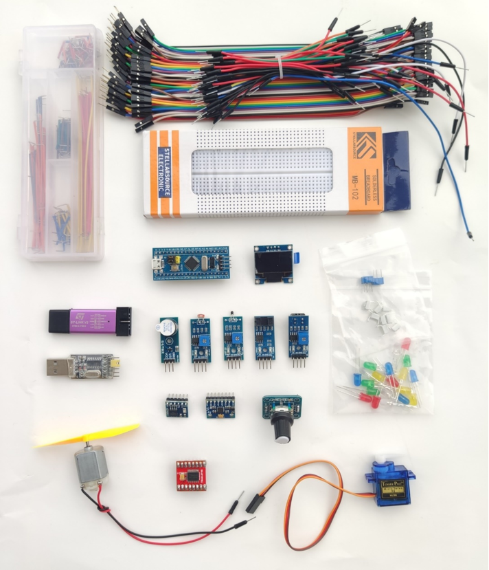


## 2.开发软件

- Keil5 MDK：专门用于开发STM32；
- Keil5 C51：专门用于开发51单片机；
- 两者的关系：是两个不同的软件，相当于是Keil软件的两个子软件，但两个软件本身不冲突，安装了C51可以直接安装MDK（可安装在同一个目录），若是还没安装C51可以直接安装MDK；

---


# 第二节课：1-2_STM32简介

## 1.STM简介
STM32是ST公司基于ARM Cortex-M内核开发的32位微控制器
- ST：生产公司，即ST公司；
- M：Micro Controller Unit，MCU微控制器；
- 32：32位的微控制器，除此之外还有ST公司还推出了STM8；
- ARM内核：ARM是一个公司，专门设计内核，而Cortex-M是它的一个系列，STM32就是基于这个内核完善自己的外围电路而设计得到的一个微控制器，可将内核理解为CPU，MCU的所有运算均在内核中完成；
- STM32的分类：有F系列、H系列、G系列、W系列、L系列等，可参照STM32的家族图

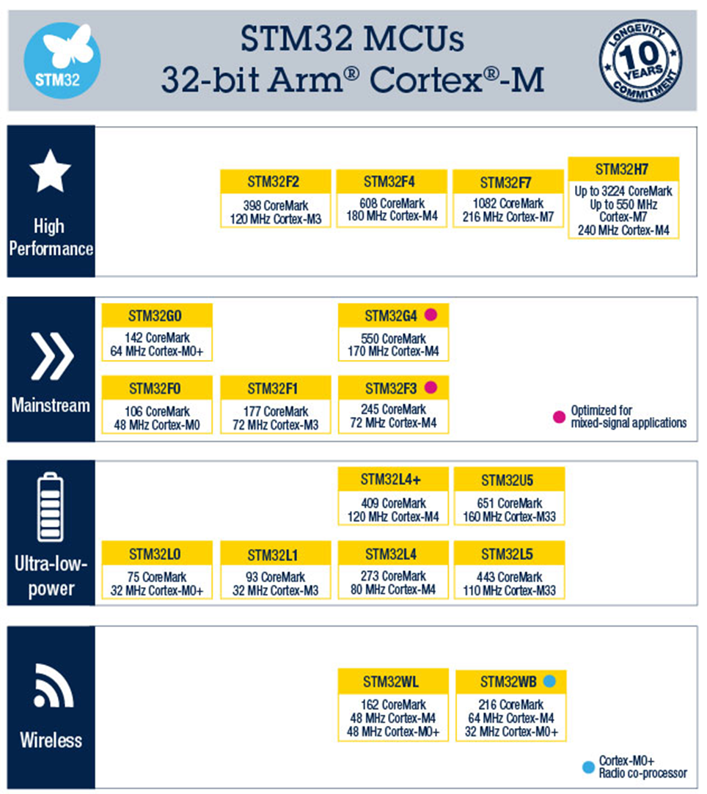


## 2.ARM的介绍

ARM既指ARM公司，也指ARM处理器内核，其只设计内核，但不生产芯片，以收取专利费来盈利。
### 2.1 ARM内核型号：
- 经典的ARM处理器：ARM1、2、……、7、9、11等
- Cortex系列：ARM11后更改了命名方式，推出Cortex系列，分为A系列、M系列、R系列，分别对应Application（主要是手机、电脑领域）、MCU、RealTime三个不同情况；
- 具体可以参照以下的家族图

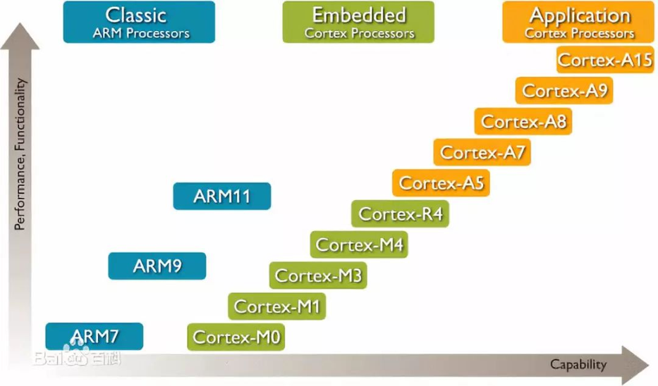

### 2.2 ARM与STM32的关系
ARM只涉及处理器内核，ST公司则基于ARM设计的内核完善外围电路并生产出STM32。

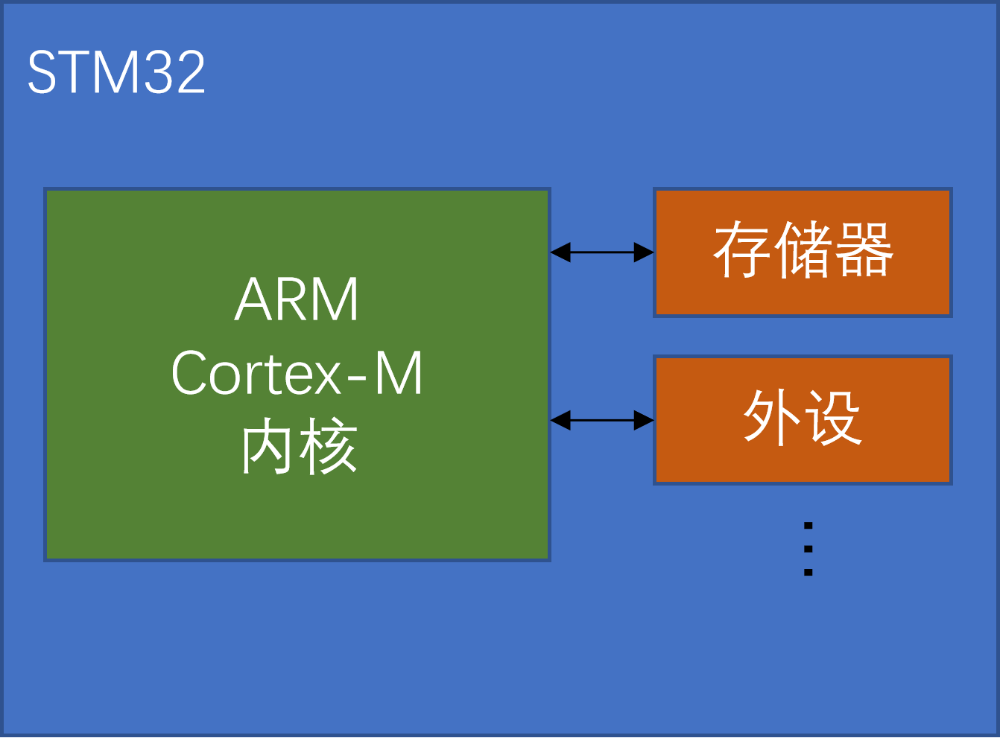


## 3.课程所用STM32型号：STM32F103C8T6

### 3.1 供电电压问题

- STM32的标准电压为3.3V，不能直接用5V供电；若用5V供电需先降至3.3V再给MCU供电；

### 3.2 STM32的片上外设

- 前面两个为Cortex内核的外设，其他均为内核外的外设；
- **SysTick**：为操作系统提供定时服务，比如Free RTOS就可以用这个系统滴答定时器来实现定时服务；
- RCC：外设的时钟控制。外设在没有进行时钟使能前，无论对其进行什么操作都是无用的，这是为了降低MCU的功耗；
- **USB与USB OTG**：可利用STM32的USB外设做一个模拟鼠标、模拟U盘等设备；而USB OTG功能可让**STM32作为USB主机去读取其他USB设备**；
- 这是整个STM32的片上外设，不是每一个STM32型号都存在全部的外设；

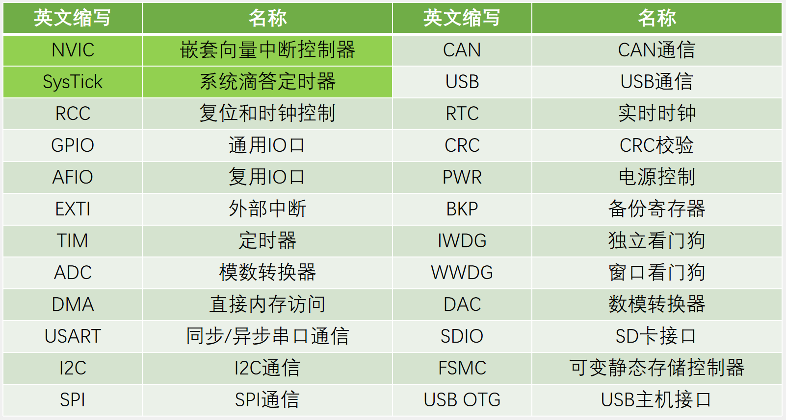

### 3.3 STM32的命名规则

STM32的所有系列的命名规则都可以参照下图。

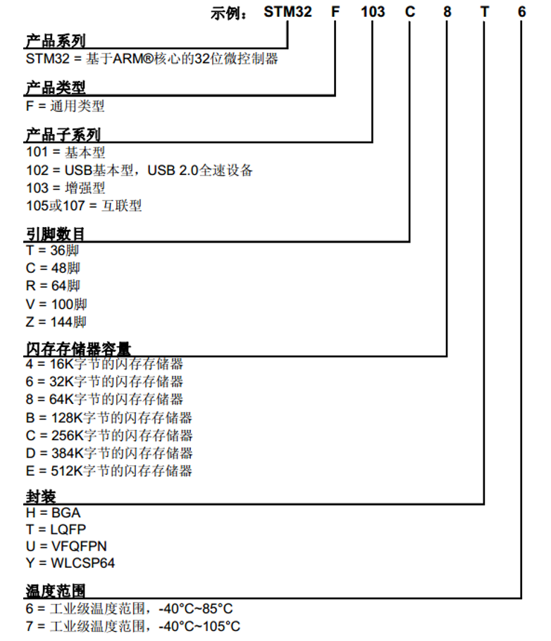

### 3.4 STM32的系统结构

- 内核Cortex-M3部分：整个MCU的CPU部分，引出三条总线与外部设备连接：
  - ICode总线：连接Flash闪存，用于加载程序指令；
  - Dcode总线：同样连接Flash闪存，用于加载程序数据，如一些常量等；
  - System总线：连接片上的其他部分；
- 片上外设部分：通过AHB总线连接到内核，又可分为不同总线：
  - AHB系统总线：先进高性能总线，挂载高性能或最基本的外设；
  - APB2：先进外设总线2，性能较APB1更高，主要连接高性能的外设，其频率一般与AHB总线相同；
  - APB1：先进外设总线1，性能较APB2较低，主要连接较低性能的外设；
- DMA部分：CPU的小秘书，主要用于大量的数据搬运工作。对于这种无需算力且简单的数据搬运就是用DMA来做的，主要用在ADC/DAC中；其总线DMA总线可拥有与CPU一样的总线控制权，用于访问外设；

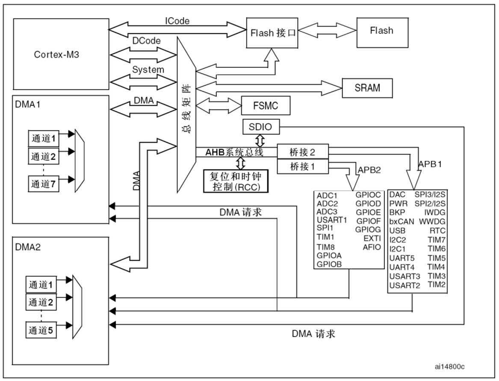

### 3.5 STM32F103C8T6引脚定义

- 对于默认复用功能，只需要初始化GPIO并选择GPIO对应的模式即可；
- 对于重定义功能则需要通过AFIO来完成引脚的重映射；

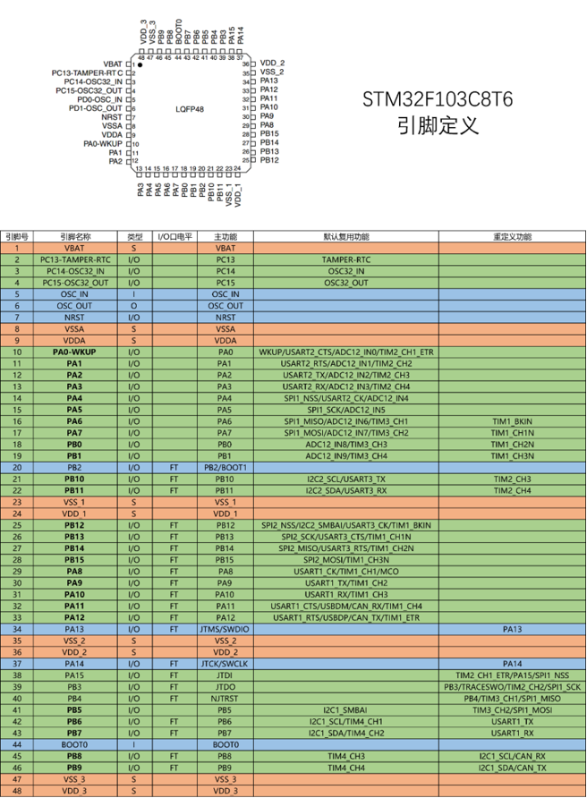

- 黄色为电源相关引脚、蓝色为最小系统相关引脚、绿色为IO口或功能口这些引脚；
- STM32F103C8T6的启动配置
  - BOOT1为X，BOOT0为0，则在主闪存存储器启动；（默认的）
  - BOOT1为0，BOOT0为1，则在系统存储器启动；系统存储器里面存着一段BootLoader程序，当从系统存储器开始启动时，BootLoader程序将接收串口数据并将其写入到主闪存中，实现串口下载程序；（**对应的是串口下载程序**）
  - BOOT1为1，BOOT0为1，则在内置SRAM启动；（对应的是调试）
  - BOOT0和BOOT1的电平只在上电复位瞬间是有效的，过了第四个上升沿后就无所谓了；

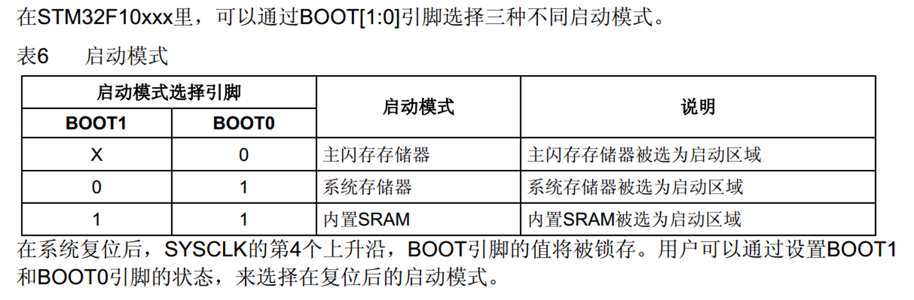

### 3.6 STM32最小系统电路

单独的MCU不能正常工作，需要配备最小系统才能正常工作，主要包括：

- MCU及其供电；
- 晶振电路；
- 复位电路；
- BOOT启动选择电路；
- SWD下载调试电路；

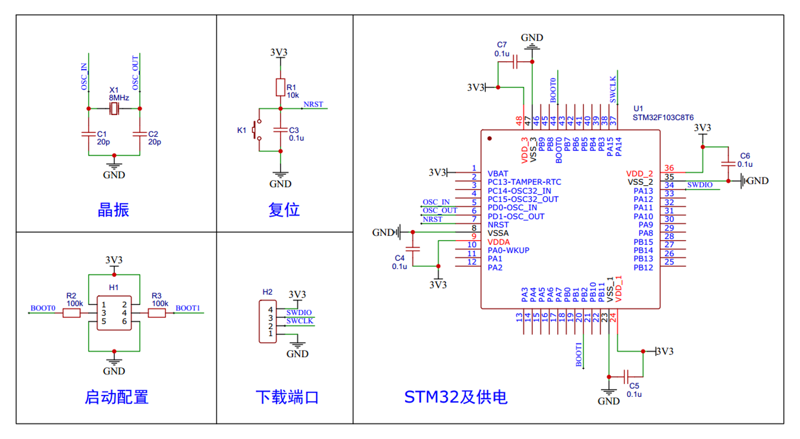

### 3.7 其他片上外设

其他的片上外设主要有：

- RAM：运行存储器，大小为20K，实际存储介质为SRAM；
- ROM：程序存储器，大小为64K，实际存储介质为Flash；

---


# 第三节课：2-1_软件安装

在学习STM32之前，需要先安装一些必须的软件，主要包括：编辑器、驱动、芯片的期间支持包等。

## 1.安装Keil5 MDK
- Keil5 MDK可以和Keil5 C51共存，可安装在同一安装路径下，两者不冲突，同时PACK的路径也会跟着一起更改；
- Keil5 MDK安装包可在官网获取：[MDK官网](https://www.keil.com/download/product/)；
- 安装完成后会弹出窗口提示是否需要安装ULINK驱动，这是Keil公司开发的调试器，点击是即可；


## 2.安装器件支持包
与Keil5 C51及Keil5 MDK之前的MDK软件不同，Keil5 MDK不再集成**器件包**，需要自行下载器件包，只有安装了对应芯片的器件支持包才能在新建工程时选择对应的芯片。下载方式有：
- 离线安装：下载器件包后直接双击安装，安装目录会自动切换到PACK文件夹；
- 在线安装：点击Keil5 MDK的上方绿色按钮，即可进入到Pack Installer界面，可按需求自行安装（注意是DFP文件，点击Intstall即可，这个会自动安装）；

器件支持包的作用是为Keil软件提供新建工程时的芯片型号，其主要包括一些芯片型号文件、库文件等内容，注意将其与后面的**标准外设库**区分开来；

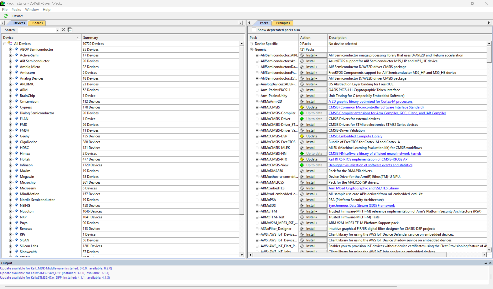


## 3.软件注册

- 即破解软件：右键Keil5以管理员身份运行，点击File，License Management，把CID复制下来，粘贴到破解软件keygen，Target要选择**ARM**，生成序列码后回到MDK粘贴，即可破解注册；


## 4.安装STLINK的驱动

- 插上STLINK，打开设备管理器，再安装dpinst_amd64.exe即可，该文件在Keil5 MDK的安装目录中可以找到；对于其他的调试器，在目录中也有，可自行选择对应调试器的驱动；


## 5.安装USB转串口驱动

- 插上USB转串口，打开设备管理器，再安装CH341SER.EXE即可；

---


# 第四节课_2-2 新建工程
## 1.STM32的开发方式
- 基于寄存器的方式
  - 同51一样，直接用程序配置MCU的寄存器来达到想要的功能；
- 基于标准库的形式
  - 使用ST官方提供的封装好的库函数的形式来间接配置寄存器；
- 基于HAL库的形式
  - **通过图形化编程完成硬件初始化，只需添加逻辑业务即可**，但隐藏了底层逻辑；


## 2.安装STM32库函数支持包
- 库函数支持包即固件库
  - **STM32F10x_StdPeriph_Lib_[版本号]**，即标准外设库，解压后即为库函数的文件夹目录；
  - 它是ST官方封装了寄存器后提供的一个函数库，基于标准库开发的意思就是基于这个库函数支持包进行开发；
- 库函数文件夹目录分析
  - 第一个文件夹为两张图片；
  - 第二个文件夹**Libraries**即为库函数的文件，包括了**CMISI**和**STM32F10x_StdPeriph_Driver**两个文件夹
    - CMISI为**ARM内核的寄存器接口文件**（由ARM公司开发，不同厂商的这个部分一般都相同）；
    - STM32F10x_StdPeriph_Driver为ST官方**基于CMSIS文件并结合STM32**封装的函数库文件（由ST公司开发，不同厂商的这个部分会不同）；
  - 第三个是官方提供的工**程示例和模板**；
  - 第四个**Utilities**是STM32官方评估板的相关例程（评估板即官方用STM32做的一个小电路板,用于测评STM32）；
  - 后面两个一个是库函数的发布文档——**Release_Notes.html**，一个是使用手册——**stm32f10x_stdperiph_lib_um.chm**；

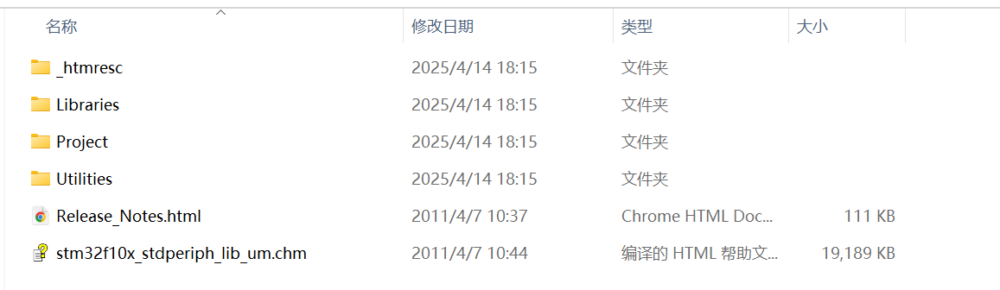


## 3.新建一个基于标准库的工程

- **（1）新建STM32工作空间：**

  - 在文件系统中新建一个用于存储STM32工程的文件夹，以后所有STM32工程都存在这里；

- **（2）创建工程文件：**

  - 进入Keil，点击Project，New uVision Project，选择刚才新建的文件夹；
  - 再在**这个文件夹里面新建一个文件夹**，用于存放本次的工程, 再点进去这个文件夹，给这个文件起一个名字Project,，然后点击保存；
  - 这样做的目的是文件夹的名称是很容易改的，但是工程的名字是不容易改的，我们就可以改文件夹的名字来更改工程的信息；
  - 选择器件型号，即**STM32F103C8（根据实际芯片选择）**，点击OK，弹出小助手，现在不需要直接叉掉，这时候工程就建好了，但工程文件是空的；

  

- **（3）添加工程必要文件**：
  
  - 打开固件库的文件，即**STM32F10x_StdPeriph_Lib**；
  
  - ①**添加启动文件**：
  
    - 打开**Libraries——>CMSIS——>CM3——>DeviceSupport——>ST——>STM32F10x——>startup——>arm**；
    - 这里面的文件就是STM32的**启动文件**，STM32程序都从启动文件开始执行；
    - 全部复制下来，回到刚才创建工程的文件夹，**新建文件夹Start**，将启动文件粘贴到这个文件夹中；
  
    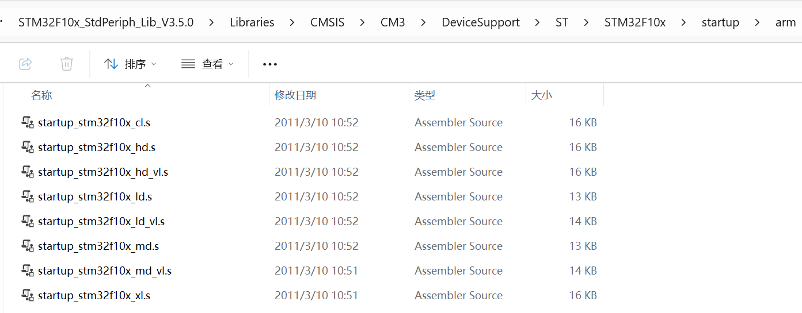
  
  - ②**添加外设寄存器描述文件及时钟文件**：
  
    - 回到**Libraries——>CMSIS——>CM3——>DeviceSupport——>ST——>STM32F10x**；
    - 看到**stm32f10x.h、system_stm32f10x.c、system_stm32f10x.h**开头的文件；
    - 前者是STM32的**外设寄存器描述文件**，与51单片机中的**头文件REGX52.H**一样，用于描述STM32有哪些寄存器和对应的地址的；
    - 后面两个文件用于**配置STM32的时钟**，72Mhz就是这两个文件配置的；
    - 将三个文件复制下来，也粘贴到**Start文件夹**下；
  
    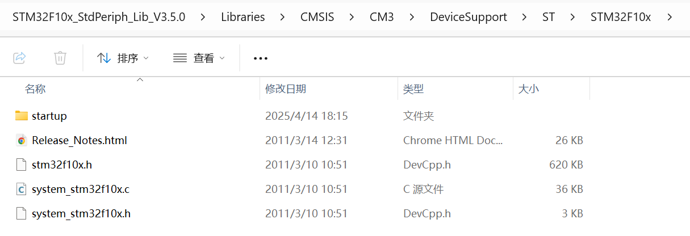
  
  - ③**添加内核寄存器描述文件**：
  
    - STM32由内核和内核外围设备组成的，而且内核寄存器描述与外围设备的描述文件不是一起的，所以需要添加内核寄存器的描述文件；
    - 打开**Libraries——>CMSIS——>CM3——>CoreSupport**，里面的**core_cm3.c和core_cm3.h文件**就是**内核的寄存器**描述；
  
    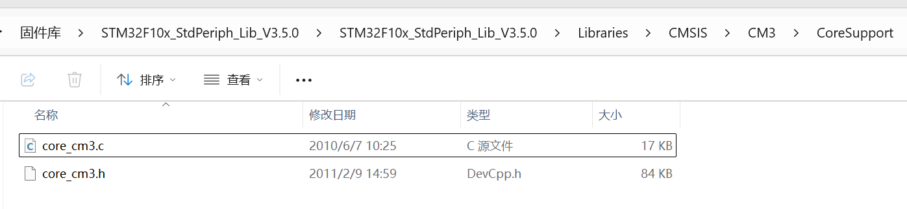
  
    - 两个文件复制下来也粘贴到**Start文件夹**下；
    - 至此，工程的必要文件就复制完成了；
  
    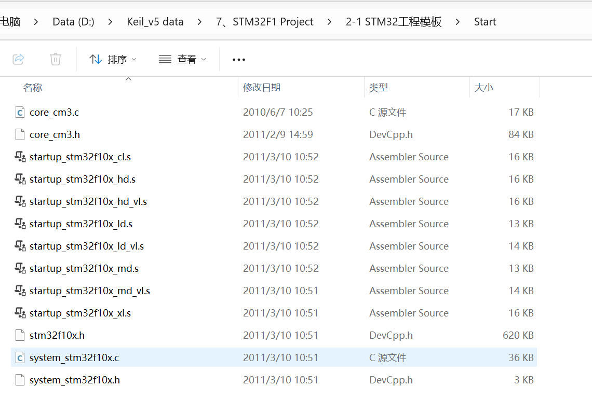
  
- **（4）配置Keil中的文件树：**

  - 回到Keil软件，将刚才复制的文件添加到工程上来；
  - **将Source Group 1改名为Start**，接着右键选择**Add Existing……**；
  - 打开Start文件夹，将文件夹中的**md.s文件和所有的.c和.h文件**添加到Start文件夹中；
  - 这些文件都是STM32中最基本的文件，不需要我们修改，是只读文件（带小钥匙）；
  - **需要注意，这里的md.s文件是需要根据型号（根据Flash大小来选）来选择的**；

- **（5）添加Start文件夹的头文件路径（后续所有自己创建的文件夹都要）：**

  - 需要在工程选项里添加Start文件夹的头文件路径，否则软件找不到.h文件；
  - 点击魔术棒按钮，打开工程选项，点击C/C++选项，点击Include Paths栏右边的三个点，新建路径；
  - 然后再点三个点按钮，把Start的路径添加进来，点击OK即可把Start的路径添加进来了；

- **（6）添加main.c函数：**

  - 打开工程文件夹，**新建文件夹叫做User**；
  - 回到Keil中，右键Target，点击添加组，**改名字叫User**，再右键添加新文件，选择C文件，名字叫main；
  - **注意下方路径需要选择User文件夹，要不然默认放在文件夹外面，点击Add即可创建main.c文件**；
  - 此时可在main.c文件中右键添加头文件进行**基于寄存器的编程开发**；
  - 文件最后一行要是空行，不然会报警；

---

### 利用寄存器开发 STM32 并下载程序

在配置完上面这些文件后，我们就可以像51单片机那样，通过配置寄存器的方式来开发STM32了。寄存器的开发这里只作展示，平常都是用库函数进行开发。

1.  **硬件连接**
    使用 ST-LINK 调试器连接电脑与 STM32 开发板，确保供电和下载线路正常。

2.  **配置调试器**
    在 Keil 软件中点击魔术棒按钮，进入工程选项：
    
    - 切换到 **Debug** 选项卡，在 `Use` 下拉菜单中选择 `ST-LINK DEBUGGER`。
    - 点击右侧的 `Settings` 按钮，在 `Flash Download` 页面中，勾选 `Reset and Run` 选项。此设置可使程序下载完成后，开发板自动复位并执行程序。
    - 点击 `OK` 保存配置并退出。
    
3.  **编译与下载**
    
    - 点击编译按钮，检查代码无错误后，再点击下载（`load`）按钮。
    - 程序将被下载到 STM32 开发板中，并自动开始运行。
    
3.  **代码示例**
    
    ```c
    #include "stm32f10x.h"
    
    int main(void)
    {
        RCC->APB2ENR = 0x00000010;    //使能APB2总线时钟
        GPIOC->CRH = 0x00300000;      //配置PC13口的模式
        GPIOC->ODR = 0x00002000;      //写入PC13口的电平
        while(1)
        {
            
        }
    }
    
    ```
    
    在这个代码中，改变写入PC13口寄存器的值就可以改变PC13口所接的LED的亮灭。

---

- **（7）添加库函数以基于库函数开发：**
  
  - 打开工程文件夹，新建一个文件夹叫Library，用于存放**库函数文件**；
  - 打开固件库的文件夹，打开**Libraries——>STM32F10x_StdPeriph_Driver——>src**，这里面就是**库函数的源文件**；
  - **其中misc是内核的库函数，其他的是内核外的外设库函数；**
  - 全选复制，在Library文件夹下粘贴；
  - 再打开**Libraries——>STM32F10x_StdPeriph_Driver——>inc**文件夹，这里面是**库函数的头文件**，全选复制在Library文件夹下粘贴；
  - 回到Keil软件，**在Target下添加组叫Library**，并将Library的所有文件添加到里面；
  
  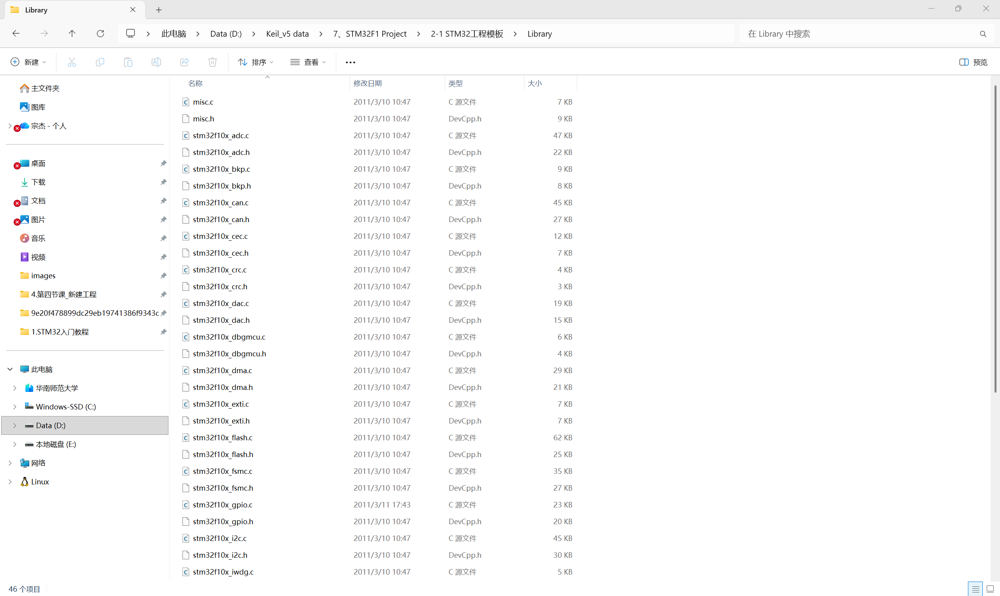
  
- **（8）添加其他系统配置文件：**
  
  - 此时所有库函数文件复制完成了，但还需几个系统配置文件才能使用库函数；
  - 打开固件库文件夹，打开**Project——>STM32F10x_StdPeriph_Template**；
  
  - 里面有**stm32f10x_conf.h文件和stm32f10x_it.c以及stm32f10x_it.h**的文件；
  
  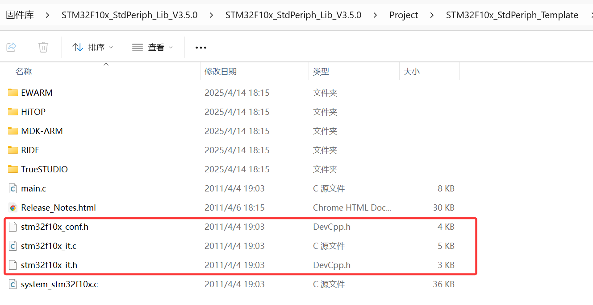
  
  - stm32f10x_conf.h用于配置**库函数头文件的包含关系**；
  - **stm32f10x_it.c以及stm32f10x_it.h文件用于配置中断函数，也就是写中断服务函数的处理逻辑**；
  - 复制三个文件，粘贴到工程的**User目录**下；
  - 接着回到Keil软件，在User组里将刚才的三个文件添加进来（**自己建的文件夹目录都要加进来**）；
  
- **（9）配置宏定义以使用库函数：**
  
  - **头文件stm32f10x.h**右键，打开文件，滑到最下面，找到：
  
  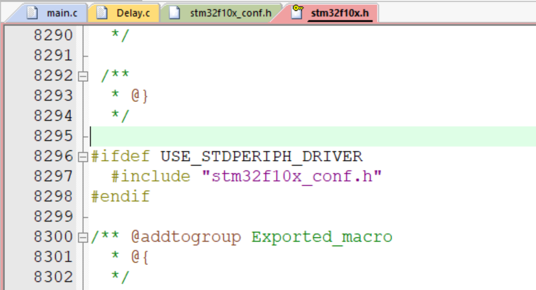
  
  - 复制**USE_STDPERIPH_DRIVER**，然后打开工程选项，在C/C++的Define栏目粘贴这个字符串（**使用库函数的条件编译**）；
  - **这样才可以包含标准外设库，即库函数；**
  - 同时下面的头文件路径也需要加上**User和Library目录的路径**；
  - 这样就完全完成库函数的工程文件的设置了；


## 4.工程模板总结

### 4.1 工程模板过程总结

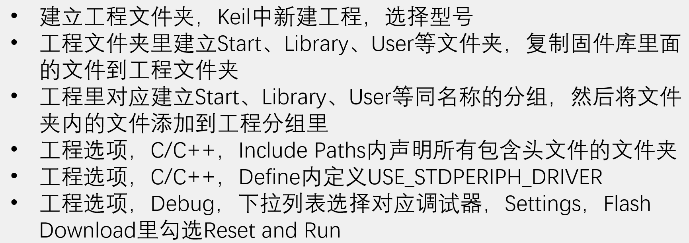

### 4.2 工程架构剖析

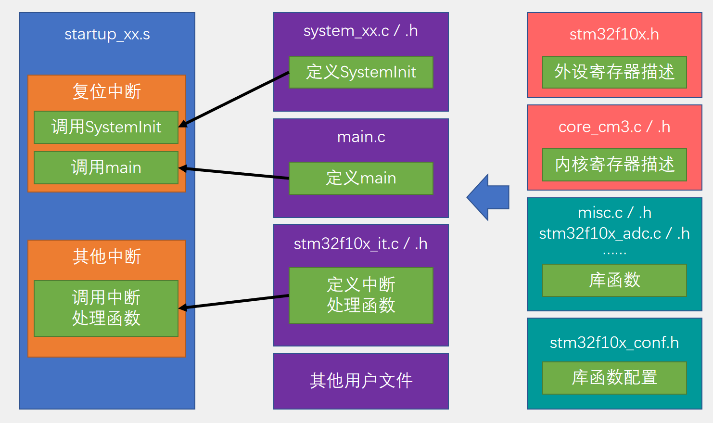

---


# 第五节课：3-1_GPIO输出

## 1.GPIO简介
- 定义：General Purpose Input Output，即通用输入输出口；
- 可配置为八种输入输出模式；
- 引脚电平：0~3.3V，部分引脚可容忍5V（但输出最高只能3.3V）；


## 2.GPIO结构

所有的GPIO挂在**APB2**的总线上，分为GPIOA，GPIOB等，每一组有16个引脚，编号是0号到15号（PA0、PA1）；

### 2.1 GPIO的组结构

**GPIO的组结构**：一组GPIO包含一个**寄存器**和一个**驱动器**：

- 寄存器：寄存器即一段特殊的存储器，内核可通过APB2总线对寄存器进行读写，完成输出电平和读取电平的功能，且寄存器的每一位对应一个引脚；
- 驱动器是用于增加信号的驱动能力的，如进行点灯操作；
- STM32是32位的单片机，所以所有的寄存器都是**32位**的，但是一组GPIO只有16个引脚，所以**每一个寄存器只有低16位是有效的**；但对于**端口设置/清除寄存器**，高16位进行清除，低16位进行设置（见后面部分）；

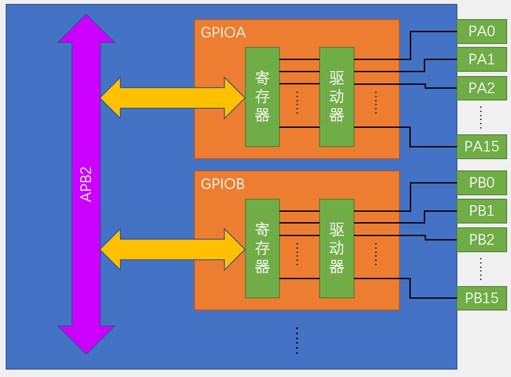

### 2.2 GPIO的位结构

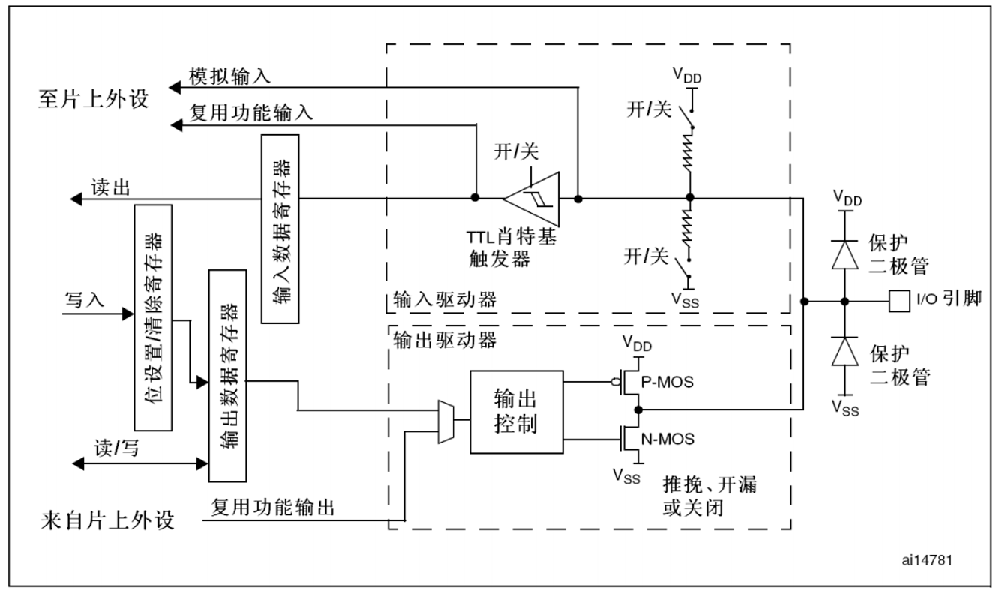

- **输入模式**：走上面的电路
  - 上拉输入模式：引脚悬空时默认为高电平，通过程序配置**上拉电阻开关闭合**；
  - 下拉输入模式：引脚悬空时默认为低电平，通过程序配置**下拉电阻开关闭合**；
  - 浮空输入模式：啥都不接，程序控制**两个电阻的开关均断开**；
    - 对于上述三种模式，读入的数据写在**输入数据寄存器**中，我们用程序读这个寄存器即可得到输入的数字信号；
  - 模拟输入模式：**接在施密特触发器前面，用来接收模拟输入**，常常用在ADC上；
  - 复用功能输入：用以**给其他片上的外设读入数据**，如时序接收引脚等；
  
- **输出模式**：走下面的电路
  
  - 输出端口的两种形式控制：
  
    - **输出数据寄存器**：即普通的IO口输出，写输出数据寄存器的某一位即可操作某一个端口；
    - **片上外设**：由片上外设控制输出IO口；
  
  - 输出数据寄存器又有三种方式：
  
    - 一种是整体读写寄存器，即51单片机中的&=和|=的操作，效率低下；
    - 一种是通过位设置或位清除寄存器来实现一位寄存器的输出，位设置/清楚寄存器的高16位进行清除，低16位进行设置；
  
    - 还有一种方式是读取STM32的位带区域，相当于51单片机的位寻址。STM32会有一段地址直接映射了RAM和外设寄存器的所有的位，读写这段地址的数据相当于读取映射位置的某一位；
  
  - 三种输出方式：推挽输出模式、开漏输出模式、关闭模式
    - 推挽输出模式：两个MOS管都有效，1时上管导通，0时下管导通，此模式两个电平下**都具有较强的驱动能力**；
    - 开漏输出模式：上管PMOS是无效的，只有NMOS在工作。1时下管断开，这时输出相当于断开，为**高阻模式**；0时下管导通，这时输出接到VSS，即输出低电平，即**只有低电平有驱动能力，高电平没有输出能力**，可以作为通信协议的输出模式（I2C）；
    - 关闭模式：就是输入模式下两个MOS管关闭，即输出关闭，进入输入模式；


## 3.GPIO的八种工作模式

- （1）浮空输入：可读取引脚电平，若引脚悬空，则电平不确定；

- （2）上拉输入：可读取引脚电平，悬空时默认高电平；

- （3）下拉输入：可读取引脚电平，悬空时默认低电平；

  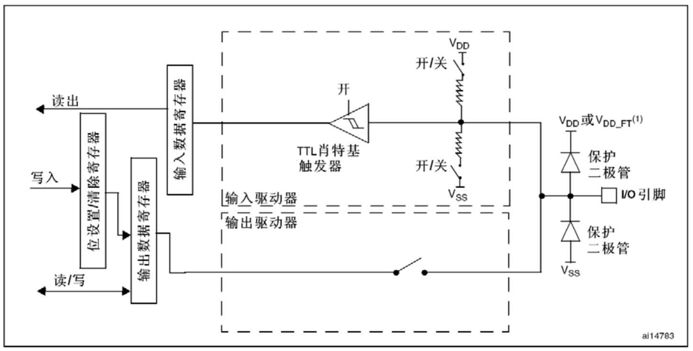

- （4）模拟输入：GPIO无效，引脚直接接入内部ADC；

  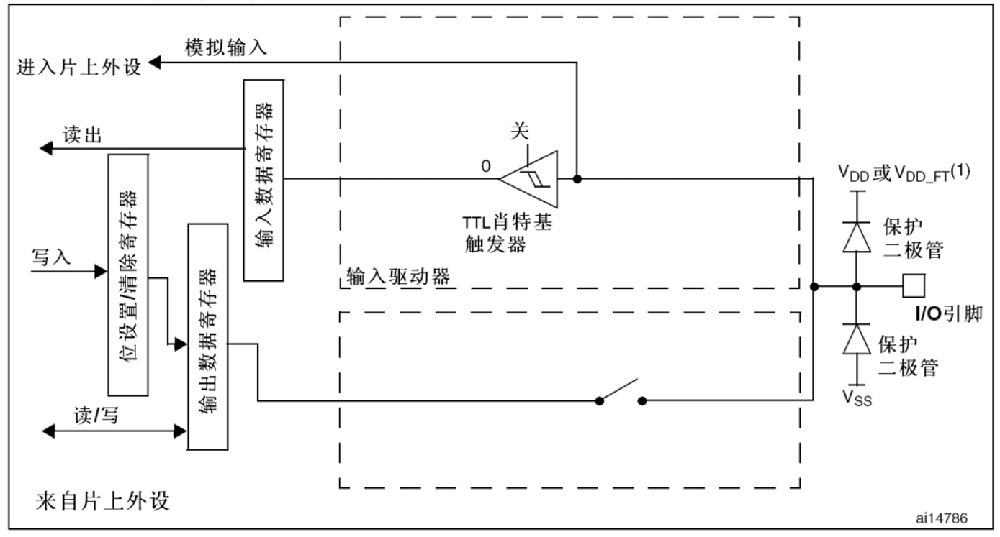

- （5）开漏输出：高电平为高阻态，无驱动能力；

- （6）推挽输出：高低电平均有驱动能力；

  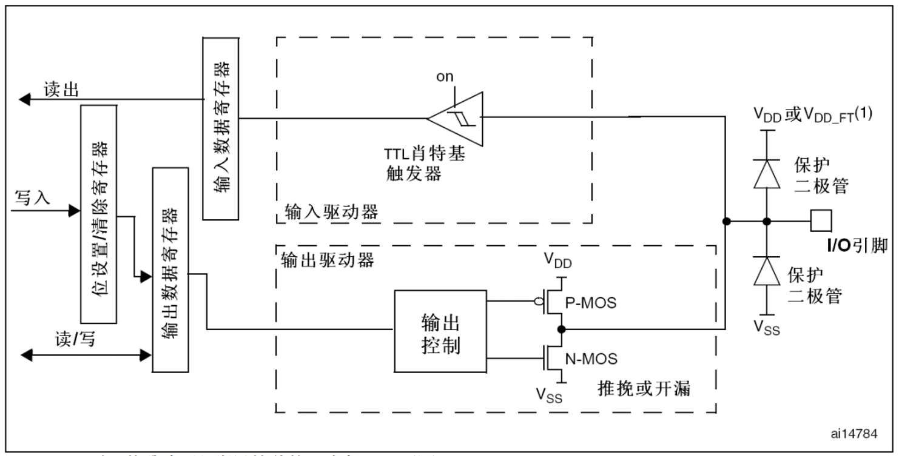

- （7）复用开漏输出：由片上外设控制；

- （8）服用推挽输出：由片上外设控制；

- 在输入模式下输出模式无效，但在输出模式下输入模式是有效的；


## 4.GPIO的相关寄存器介绍

- 端口配置寄存器

  工作模式的设定是由端口配置寄存器来设定的，每一个端口需要四位来配置其工作模式，所以一组GPIO就需要有64位，也就是两个寄存器，分别叫端口配置低寄存器和端口配置高寄存器；

  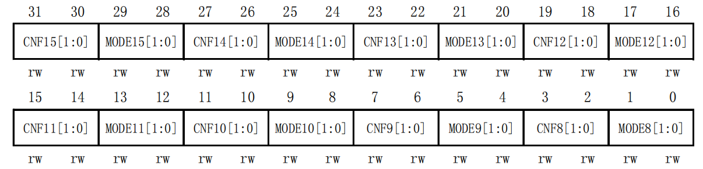

  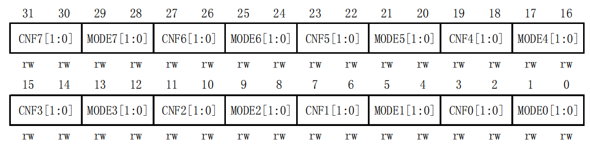

- 输入数据寄存器：只有低16位有效

  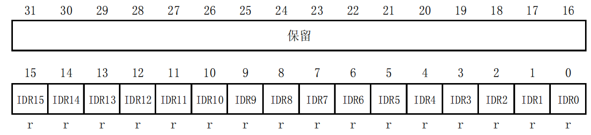

- 输出数据寄存器：只有低16位有效

  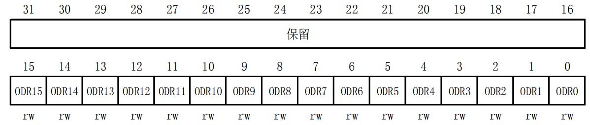

- 位设置/清除寄存器：低16位为位设置寄存器，高16位为位清除寄存器

  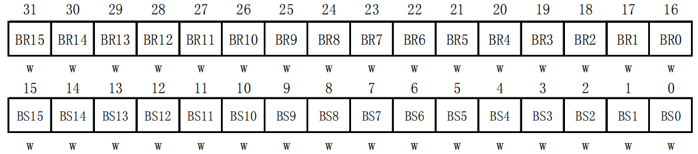

- 位清除寄存器：只有低16位有效，这16位与位设置/清除寄存器的高16位是完全相同的功能

  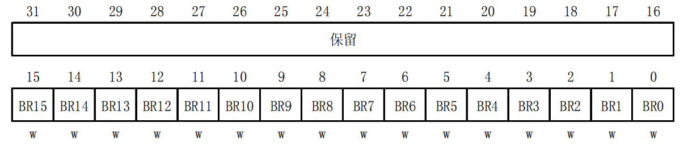


## 5.LED与蜂鸣器外设

- （1）LED：**引脚长的或内部较小**的一半为正极；

- （2）有源蜂鸣器：内部**自带振荡源**，将正负极接上直流电即可持续发生，频率固定；

- （3）无源蜂鸣器：内部不带振荡源，需控制器提供振荡脉冲才能发生，可发生不同频率的声音；

- （4）实际硬件电路：由于高电平弱驱动、低电平强驱动，所以往往选择低电平驱动的方式

  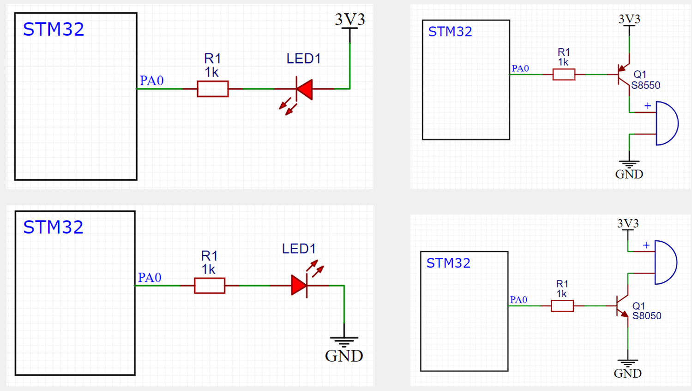

---


# 第六节课：3-2_LED闪烁&LED流水灯&蜂鸣器
## 1.操作STM32的GPIO的三个步骤

- （1）使用**RCC开启GPIO的时钟**；
- （2）使用**GPIO_Init**函数初始化GPIO；
- （3）使用**输出或者输入函数**控制GPIO口；


## 2.外设时钟与GPIO口相关的库函数

在操作GPIO的步骤中，设计到了RCC和GPIO两个外设，下面分别看看ST官方提供的标准外设库中都为这两个外设提供了什么函数。

## 2.1 Library中的stm32f10x_rcc.h文件

这个头文件中，声明了RCC这个外设可提供的所有函数，常用的函数有：

- **RCC_AHBPeriphClockCmd()**：RCC AHB外设时钟控制；

- **RCC_APB2PeriphClockCmd()**：RCC APB2外设时钟控制；

- **RCC_APB1PeriphClockCmd()**：RCC APB1外设时钟控制；

- 三个函数的参数都是一样的，第一个参数是选择外设，第二个参数是使能或失能。在实际开发中，一般都是先看.h文件有什么函数，然后跳转定义到对应的.c文件中，查看其参数定义，并选择对应的参数进行开发；

  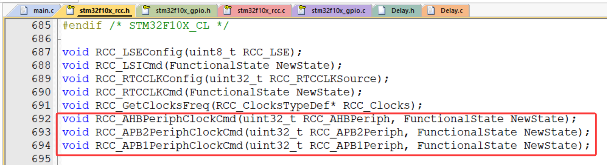

## 2.2 Library中的stm32f10x_gpio.h文件

- 第一类——初始化函数

  - **GPIO_DeInit()**：调用后GPIO会被复位；
  - **GPIO_AFIODeInit()**：调用后AFIO会被复位；
  - **GPIO_Init()**：用结构体参数来初始化GPIO口，STM32的所有外设都有对应的Init()函数（先定义结构体变量，再给结构体赋值，最后调用这个函数）；
  - **GPIO_StructInit()**：给结构体赋一个默认值；

- 第二类——读取函数

  - **uint8_t GPIO_ReadInputDataBit()**：读取某一位输入GPIO的电平；
  - **uint16_t GPIO_ReadInputData()**：读取一组输入GPIO的电平；
  - **uint8_t GPIO_ReadOutputDataBit()**：读取某一位输出GPIO的电平；
  - **uint16_t GPIO_ReadOutputData()**：读取一组输出GPIO的电平；

- 第三类——输出函数

  - **GPIO_SetBits()**：将指定的端口设置为高电平；
  - **GPIO_ResetBits()**：将指定的端口设置为低电平；
  - **GPIO_WriteBit()**：根据第三个参数来设置指定端口的值，第三个参数是一个枚举值，可为0或1；
  - **GPIO_Write()**：同时对16个端口进行写入操作；

  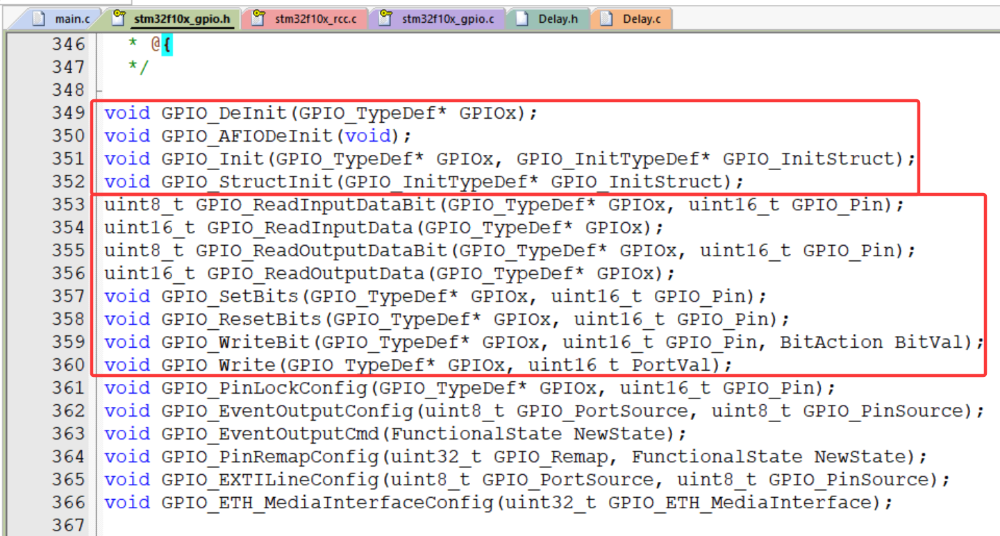


## 3.写入main函数

在介绍了相关外设的库函数后，即可在main.c文件中进行程序配置完成点灯操作。

### 3.1配置APB2时钟控制函数

- 首先需要开启外设的时钟。对于GPIO口而言，所有GPIO均接在APB2时钟总线上；

- 复制函数RCC_APB2PeriphClockCmd，跳转定义查看参数，写入第一个参数RCC_APB2Periph_GPIOA以及第二个参数ENABLE；

  ```c
  RCC_APB2PeriphClockCmd(RCC_APB2Periph_GPIOA, ENABLE);        //开启APB2时钟
  
  ```

### 3.2 调用GPIO_Init函数

- 接着调用初始化函数GPIO_Init()，跳转定义，查看参数：

  - 写入第一个参数GPIOA；
  - 第二个参数是一个结构体：
    - 复制结构体类型GPIO_InitTypeDef到main函数中，起个名字叫GPIO_InitStructure，这个变量是一个局部变量；
    - 接下来定义该结构体：复制结构体名称，用.引出结构体的成员，这里Keil会自动提示有什么成员，比较方便；接着跳转定义，查看每个成员的定义（这里要跳转的是成员的定义），再用Ctrl+F查找成员有什么参数（这里第一个跳转是结构体成员的定义，第二个Ctrl+F查找的是这个成员都有什么参数，因为成员都有什么参数是注释的内容，所以无法跳转），并给成员赋值；
    - 定义好结构体后将结构体的地址作为第二个参数传入到GPIO_Init函数；

- 最终代码：

  ```c
  GPIO_InitTypeDef GPIO_InitStructure;
  GPIO_InitStructure.GPIO_Mode = GPIO_Mode_Out_PP;    //推挽输出，高低电平都具有驱动能力，若是开漏输出只有低电平具有驱动能力
  GPIO_InitStructure.GPIO_Pin = GPIO_Pin_0;           //指定引脚
  GPIO_InitStructure.GPIO_Speed = GPIO_Speed_50MHz;   //指定速度
  GPIO_Init(GPIOA, &GPIO_InitStructure);              //即初始化完后，GPIOA0引脚就自动被配置为推挽输出、50MHz的速度了，写入的是配置寄存器
  
  ```

### 3.3 下面即可操作GPIO口

- 操作GPIO口可用前面说到的四个IO口输出函数，前面三个函数的操作如下：

  ```c
  GPIO_SetBits(GPIOA, GPIO_Pin_0);                   //将GPIOA0设置为高电平
  //GPIO_ResetBits(GPIOA, GPIO_Pin_0);               //将GPIOA0设置为低电平
  //GPIO_WriteBit(GPIOA, GPIO_Pin_0, Bit_RESET);     //将GPIOA0设置为低电平
  //GPIO_WriteBit(GPIOA, GPIO_Pin_0, Bit_SET);       //将GPIOA0设置为高电平
  
  ```

### 3.4 添加LED闪烁操作

- 在上面的操作GPIO口中，已经完成了GPIO口的高低电平置位；若要完成闪烁则需要在while循环中通过延时来完成闪烁；

- 添加System组，并复制现有的Delay.c和Delay.h文件，注意要记得在Keil中添加头文件路径；

- 代码实现：

  ```c
  #include "Delay.h"
  
  while(1)
  {
      //当然，这里还可以用SetBits函数和ResetBits函数实现
      GPIO_WriteBit(GPIOA, GPIO_Pin_0, Bit_RESET);
      Delay_ms(500);
      GPIO_WriteBit(GPIOA, GPIO_Pin_0, Bit_SET);
      Delay_ms(500);
  }
  
  ```
  


## 4.LED闪烁

- LED闪烁的接线图如图所示，其采用了PA0口输出：

  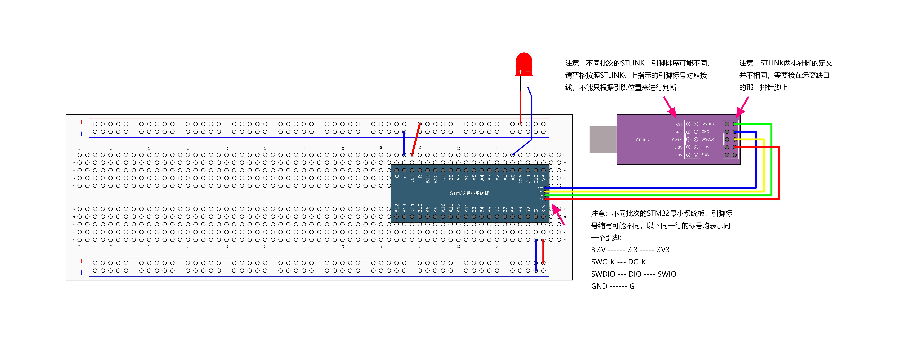

- 前面第三部分即为点亮LED闪烁的开发步骤，其完整的main.c代码如下：

  ```c
  #include "stm32f10x.h"        // Device header
  #include "Delay.h"
  
  int main(void)
  {
  	RCC_APB2PeriphClockCmd(RCC_APB2Periph_GPIOA, ENABLE);   //开启GPIO时钟
  	
  	GPIO_InitTypeDef GPIO_InitStructure;
  	GPIO_InitStructure.GPIO_Mode = GPIO_Mode_Out_PP;    //推挽输出，高低电平都具有驱动能力，若是开漏输出只有低电平具有驱动能力
  	GPIO_InitStructure.GPIO_Pin = GPIO_Pin_0;           //指定引脚
  	GPIO_InitStructure.GPIO_Speed = GPIO_Speed_50MHz;   //指定速度
  	GPIO_Init(GPIOA, &GPIO_InitStructure);              //初始化完后，GPIOA0引脚被配置为推挽输出、50MHz的速度
  	
  	while (1)
  	{
  		//第一种方法：用GPIO_WriteBit进行位设置
  		GPIO_WriteBit(GPIOA, GPIO_Pin_0, Bit_RESET);          //设置PA0端口为低电平
  		Delay_ms(500);
  		GPIO_WriteBit(GPIOA, GPIO_Pin_0, Bit_SET);            //设置PA0端口为高电平
  		Delay_ms(500);
  		
  		//第二种方法：用ResetBits进行位设置
  //		GPIO_ResetBits(GPIOA, GPIO_Pin_0);					          //将PA0引脚设置为低电平
  //		Delay_ms(500);
  //		GPIO_SetBits(GPIOA, GPIO_Pin_0);					          //将PA0引脚设置为高电平
  //		Delay_ms(500);
  		
  		//第三种方法：用WriteBit函数进行0、1置位
          //这里的BitsAction将0转变为枚举类型（强制类型转换），因第三个参数的类型是枚举类型，否则会有报错
  //		GPIO_WriteBit(GPIOA, GPIO_Pin_0, (BitAction)0);
  //		Delay_ms(500);									    //延时500ms
  //		GPIO_WriteBit(GPIOA, GPIO_Pin_0, (BitAction)1);		//将PA0引脚设置为高电平，这里的BitAction同理
  //		Delay_ms(500);									    //延时500ms
  	}
  }
  
  ```


## 5.LED流水灯

- LED流水灯的接线图如下图所示，采用了8个GPIO口，分别为GPIOA0~GPIOA7：

  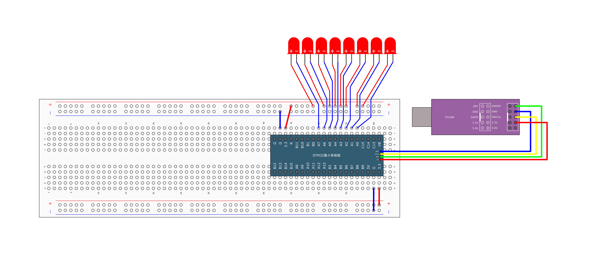

- 完整main.c代码如下：

  ```c
  #include "stm32f10x.h"                  // Device header
  #include "Delay.h"
  
  int main(void)
  {
  	RCC_APB2PeriphClockCmd(RCC_APB2Periph_GPIOA, ENABLE);   //用的全部是A端口，所以这一行不用改，若需其他端口，可用|的运算符
  	
  	GPIO_InitTypeDef GPIO_InitStructure;
  	GPIO_InitStructure.GPIO_Mode = GPIO_Mode_Out_PP;        //推挽输出
  	GPIO_InitStructure.GPIO_Pin = GPIO_Pin_All;             //这里也可以通过按位或运算选中所有的引脚
  	GPIO_InitStructure.GPIO_Speed = GPIO_Speed_50MHz;
  	GPIO_Init(GPIOA, &GPIO_InitStructure);                  //初始化完后，GPIOA引脚就自动被配置为推挽输出、50MHz的速度了
  	
  	GPIO_SetBits(GPIOA, GPIO_Pin_0);
  	
  	while (1)
  	{
  		//GPIO_Write()函数用于对16个端口进行配置，即将数值直接写入输出数据寄存器中，只有低16位有效
  		GPIO_Write(GPIOA, ~0x0001);      //0000 0000 0000 0001
  		Delay_ms (500);
  		GPIO_Write(GPIOA, ~0x0002);      //0000 0000 0000 0010
  		Delay_ms (500);
  		GPIO_Write(GPIOA, ~0x0004);      //0000 0000 0000 0100
  		Delay_ms (500);
  		GPIO_Write(GPIOA, ~0x0008);      //0000 0000 0000 1000
  		Delay_ms (500);
  		GPIO_Write(GPIOA, ~0x0010);      //0000 0000 0001 0000
  		Delay_ms (500);
  		GPIO_Write(GPIOA, ~0x0020);      //0000 0000 0010 0000
  		Delay_ms (500);
  		GPIO_Write(GPIOA, ~0x0040);      //0000 0000 0100 0000
  		Delay_ms (500);
  		GPIO_Write(GPIOA, ~0x0080);      //0000 0000 1000 0000
  		Delay_ms (500);
  	}
  }
  
  ```

  

## 6.蜂鸣器

- 蜂鸣器的接线图如下图所示，这里采用了PB12号口：

  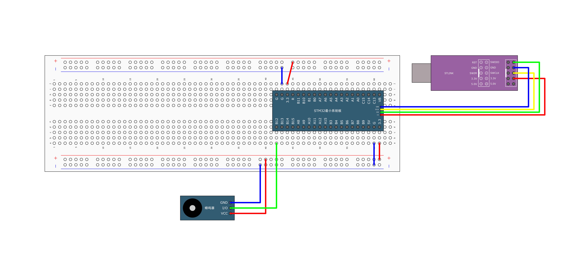

- 完整main.c代码如下：

  ```c
  #include "stm32f10x.h"                  // Device header
  #include "Delay.h"
  
  int main(void)
  {
  	RCC_APB2PeriphClockCmd(RCC_APB2Periph_GPIOB, ENABLE);   //用PB12号口，开启GPIOB的时钟
  	
  	GPIO_InitTypeDef GPIO_InitStructure;
  	GPIO_InitStructure.GPIO_Mode = GPIO_Mode_Out_PP;    //推挽输出
  	GPIO_InitStructure.GPIO_Pin = GPIO_Pin_12;          //选择PB12号口
  	GPIO_InitStructure.GPIO_Speed = GPIO_Speed_50MHz;
  	GPIO_Init(GPIOB, &GPIO_InitStructure);              //即初始化完后，GPIOB12引脚就被配置为推挽输出、50MHz的速度了
      
  	while (1)
  	{
  		GPIO_ResetBits(GPIOB, GPIO_Pin_12);
  		Delay_ms(500);
  		GPIO_SetBits(GPIOB, GPIO_Pin_12);
  		Delay_ms(500);		
  	}
  }
  
  ```

- 注意：A15和B3、B4三个口先不要用，它们是JTAG的调试端口，若需要用作普通IO口还需要其他配置；


## 7.开发库函数的方法思路总结
- 第一种：用到什么找什么
  - 先点开.h文件看一下有哪些函数；
  - 右键转到函数的定义，查看函数和参数的用法；
- 第二种：找完全部再写
  - 打开固件库函数用户手册，查看所有函数的用法；
- 第三种：CV工程师
  - 百度搜索，参考别人的代码

---


# 第七节课：3-3_GPIO输入

## 1.按键介绍
- 工作原理：按键按下的时候是导通的，松手断开，可用于获得触发信号；

- 按键抖动问题：

  - 原因：由于按键内部使用的是机械式弹簧片来进行通断的，所以在按下和松手的瞬间会伴随有一连串的抖动；
  - 解决方法：加一段延时函数，以滤掉这个抖动的时间；

  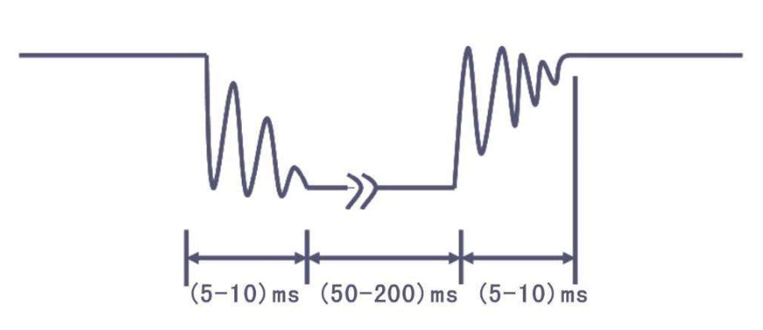

- 两种接法：

  - 直接接地的方法需要将输入接到上拉模式，否则会存在引脚电平不确定的情况；
  - 也可用外部接上拉电阻的形式，松开时由外接上拉电阻保证高电平；
  - 这两种当按键按下时为低电平，松开为高电平；


## 2.传感器模块介绍
- 光敏电阻传感器；

- 热敏电阻传感器；

- 对射式传感器；

- 反射式红外传感器；

- 传感器模块的实际电路连接图：

  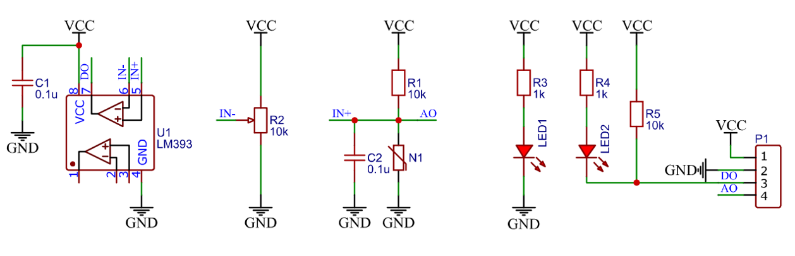

- 重要概念：

  - 弱下拉、弱上拉、强上拉、强下拉；
  - 强和弱指的是电阻阻值的大小（小电阻是强，大电阻是弱），而上拉和下拉指的是接到VCC还是GND；
  - 每个模块又分为模拟输出和数字输出，它们的不同只是有没有经过比较器，即二值化；


## 3.外设硬件与MCU的电路连接

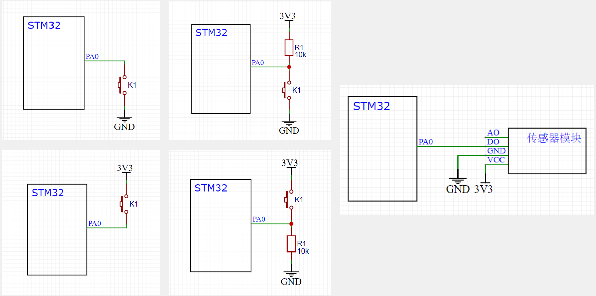

- 下接方式：
  - 第一个图需要将GPIO设置为上拉输入模式，这样才能保证按键不按下时为高电平；
  - 第二个图已经外接上拉电阻，GPIO可选择任意的输入模式；
- 上接方式：
  - 第三个图需要将GPIO设置为下拉输入模式，这样才能保证按键不按下时为低电平；
  - 第四个图已经外接下拉电阻，GPIO可选择任意的输入模式；
- 一般都采用下接方式更好，即第一第二种方式；
- 对于传感器电路而言，直接将数字输出接到MCU的一个GPIO即可，对于模拟输出则需要用到ADC外设；


## 4.C语言知识学习

### 4.1 C语言数据类型

- stdint.h头文件已经对C语言的相关数据类型的关键字进行了重定义，如下图所示：

  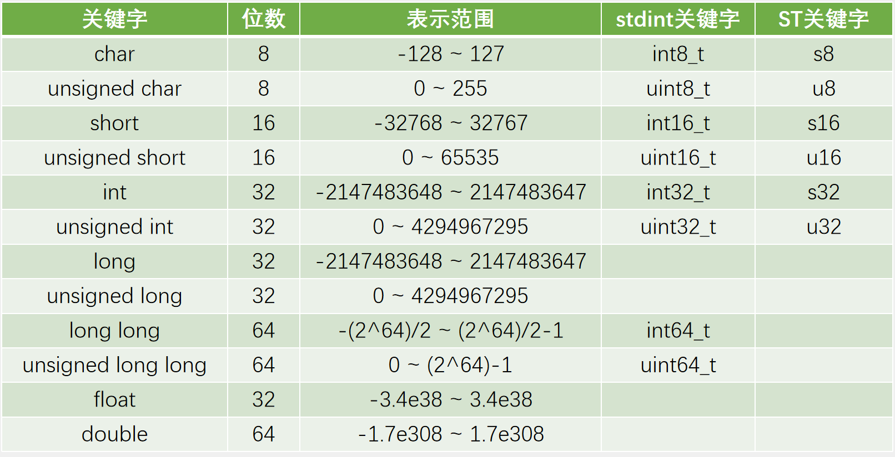

- 关键字中的_t表示这个数据类型是用**typedef**重新命名的变量类型；
- 对于ST关键字一行，是ST官方老版本的库函数的变量类型，新版本的库函数也兼容这些关键字；

### 4.2 C语言宏定义

- 关键字：**#define**；

- 用途：

  - 用一个**字符串**代替一个**数字**，便于理解；
  - 提取程序中**经常出现的参数**，便于快速修改；

- 举例：比如在stm32f10x_gpio.h文件中，GPIO_PIN_12就是用了一个字符串去代替了STM32内部的地址；

  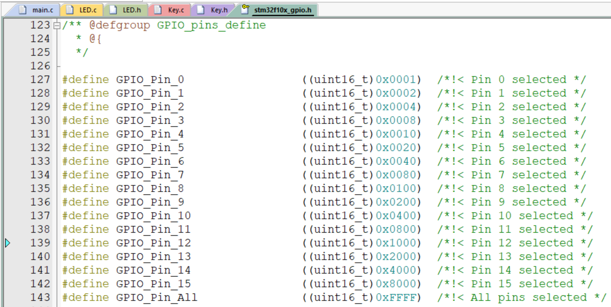

- 宏定义的定义和引用：

  ```C
  #define ABC 12345
  int a = ABC;       //等效于int a = 12345;
  ```

### 4.3 typedef

- 关键字：**typedef**；

- 用途：将一个比较长的**变量类型**名换个名字，如：

  ```c
  typedef unsigned char uint8_t;
  uint8_t a;    //等效于unsigned char a;
  
  ```

- 与宏定义的区别：

  - typedef的**新名字在右边**，且一定要加分号；
  - typedef只能给**变量类型换名字**；

### 4.4 结构体

- 关键字：**struct**；

- 用途：**数据打包**，把不同类型的类型变量进行集合，类似于**对象**，其也是一种数据类型；

- 结构体的**定义与引用**：

  ```c
  //定义某一个结构体类型
  struct {char x; int y; float z;} StructName;
  
  //typedef形式定义结构体
  typedef struct {
      char x;
      int y;
      float z;
  } StructName_t;
  
  //定义一个一个StructName结构体类型的变量
  StructName c;
  StructName_t d;
  
  //用.引用结构体成员并赋值
  c.x = 'A';
  c.y = 66;
  c.z = 1.23;
  
  //或用->引用结构体成员，其中pStructName为结构体发地址
  pStructName->x = 'A';
  pStructName->y = 66;
  pStructName->z = 1.23;
  
  ```

### 4.5 枚举

- 关键字：**enum**；

- 用途：定义一个**取值受限制的整形变量**，用来限制变量取值范围（也可以理解为一个宏定义的集合）

- 枚举的**定义与引用**：

  ```c
  //typedef定义枚举
  typedef enum {
      MONDAY = 1,
      TUESDAY = 2,
      WEDNESDAY = 3,
  } Week_t;
  
  Week_t week;
  week = MONSDAY;     //week = 1
  week = TUESDAY;     //week = 2
  week = 8;           //报错
  
  ```

---


# 第八节课：3-4_按键控制LED&光敏传感器控制蜂鸣器

## 1.模块化编程
- 在工程目录（**系统的文件夹**）中新建Hardware文件夹

- 按之前步骤，分别在Keil中的小箱子添加**Hardware组**，然后再在魔术棒中添加**Hardware路径**；

- 右键Hardware文件夹，新建**“.c文件”**，起名LED，用于封装LED的驱动程序，同时记得更改下面的路径为Hardware，这样新建的文件在系统文件夹上才会放到Hardware文件夹下；

- 同理在Hardware中添加**“.h文件”**，起名LED，后续步骤与上面相同。这样两个文件就用来封装LED的驱动程序，其中.c文件用来存放驱动的主体代码，.h文件用来存放这个驱动程序能对外提供的函数或变量的声明；

- 对于后续要添加任何组，其操作都是如此，这就是模块化编程——不同块的代码分别封装在不同组中，大大降低了代码间的耦合性；

  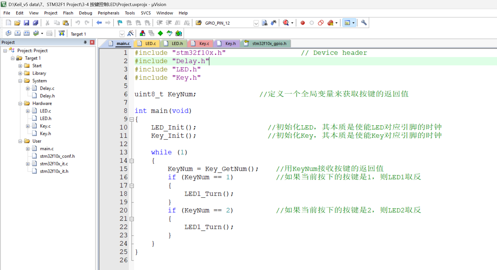

- 按键控制LED的电路连接图如下图所示：按键GPIO选择**PB11和PB1**，LED的GPIO选择**PA2和PA1**；

  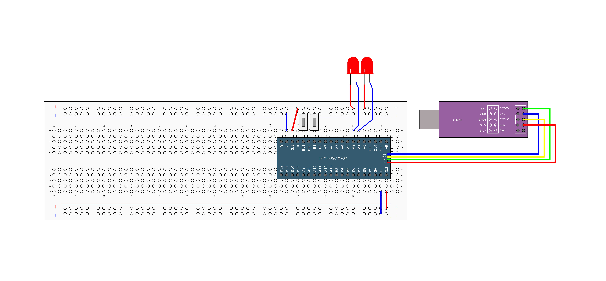


## 2.LED驱动函数封装

- **“.c文件”编程**

  - 导入STM32的**头文件**：

    ```c
    #include "stm32f10x.h"
    ```

  - 先写**LED初始化函数**，即初始化时钟和端口等，注意GPIO初始化后默认为低电平：

    ```c
    void LED_Init(void)
    {
    	RCC_APB2PeriphClockCmd(RCC_APB2Periph_GPIOA, ENABLE);       //使能GPIOA端口时钟
    	
    	GPIO_InitTypeDef GPIO_InitStructure;                        //定义结构体
    	GPIO_InitStructure.GPIO_Mode = GPIO_Mode_Out_PP;            //定义结构体的模式为推挽输出
    	GPIO_InitStructure.GPIO_Pin = GPIO_Pin_1 | GPIO_Pin_2;      //选中1号引脚和2号引脚
    	GPIO_InitStructure.GPIO_Speed = GPIO_Speed_50MHz;           //定义速度为50MHz
    	GPIO_Init(GPIOA, &GPIO_InitStructure);                      //初始化端口
    
    	GPIO_SetBits(GPIOA, GPIO_Pin_1 | GPIO_Pin_2);               //前面初始化后默认是低电平，这条语句可以把端口设置为高电平
    }
    
    ```

  - 写入**LED点亮程序和LED熄灭程序**：可分四个函数，分别对应两个LED的亮灭，只需要进行简单的SetBits即可：

    ```c
    void LED1_ON(void)                       //点亮LED1
    {
    	GPIO_ResetBits(GPIOA, GPIO_Pin_1);     //低电平点亮
    }
    
    void LED1_OFF(void)                      //熄灭LED1
    {
    	GPIO_SetBits(GPIOA, GPIO_Pin_1);       //高电平熄灭
    }
    
    void LED2_ON(void)                       //点亮LED2
    {
    	GPIO_ResetBits(GPIOA, GPIO_Pin_2);
    }
    
    void LED2_OFF(void)                      //熄灭LED2
    {
    	GPIO_SetBits(GPIOA, GPIO_Pin_2);
    }
    
    ```

  - 写入**LED状态取反程序**：先读取目前输出什么再取反

    ```c
    void LED1_Turn(void)                     //状态取反函数
    {
    	if (GPIO_ReadOutputDataBit(GPIOA, GPIO_Pin_1) == 0)     //用GPIO_ReadOutDataBit函数读取PA1引脚的输出值，进而取反
    	{
    		GPIO_SetBits(GPIOA, GPIO_Pin_1);
    	}
    	else
    	{
    		GPIO_ResetBits(GPIOA, GPIO_Pin_1);
    	}
    }
    
    void LED2_Turn(void)                     //状态取反函数
    {
    	if (GPIO_ReadOutputDataBit(GPIOA, GPIO_Pin_2) == 0)     //用GPIO_ReadOutDataBit函数读取PA2引脚的输出值，进而取反
    	{
    		GPIO_SetBits(GPIOA, GPIO_Pin_1);
    	}
    	else
    	{
    		GPIO_ResetBits(GPIOA, GPIO_Pin_2);
    	}
    }
    
    ```

- **“.h文件”编程**

  - 写入固定格式，并将.c文件写的驱动函数放到.h文件中声明：

    ```c
    #ifndef __LED_H
    #define __LED_H
    
    void LED_Init(void);
    void LED1_ON(void);
    void LED1_OFF(void);
    void LED2_ON(void);
    void LED2_OFF(void);
    void LED1_Turn(void);
    void LED2_Turn(void);
    
    #endif
    
    ```

    

## 3.按键驱动函数封装

- 同前面，在Hardware中新建**Key.c和Key.h文件**；

- **“.c文件”编程**

  - 导入STM32的**头文件和延时函数的头文件**：

    ```c
    #include "stm32f10x.h"
    #include "Delay.h"
    ```

  - 添加**按键初始化函数**——将按键的GPIO口初始化为**上拉输入模式**：

    ```c
    void Key_Init(void)
    {
    	RCC_APB2PeriphClockCmd(RCC_APB2Periph_GPIOB, ENABLE);
    	
    	GPIO_InitTypeDef GPIO_InitStructure;
    	GPIO_InitStructure.GPIO_Mode = GPIO_Mode_IPU;
    	GPIO_InitStructure.GPIO_Pin = GPIO_Pin_1 | GPIO_Pin_11;
    	GPIO_InitStructure.GPIO_Speed = GPIO_Speed_50MHz;
    	GPIO_Init(GPIOB, &GPIO_InitStructure);
    }
    
    ```

  - 添加**读取按键电平函数**：

    ```c
    uint8_t Key_GetNum(void)
    {
    	uint8_t KeyNum = 0;
    	if (GPIO_ReadInputDataBit(GPIOB, GPIO_Pin_1) == 0)               //PB1按下则KeyNum为1
    	{
    		Delay_ms(20);
    		while (GPIO_ReadInputDataBit(GPIOB, GPIO_Pin_1) == 0);
    		Delay_ms(20);
    		KeyNum = 1;
    	}
    	if (GPIO_ReadInputDataBit(GPIOB, GPIO_Pin_11) == 0)              //PB11按下则KeyNum为2
    	{
    		Delay_ms(20);
    		while (GPIO_ReadInputDataBit(GPIOB, GPIO_Pin_11) == 0);
    		Delay_ms(20);
    		KeyNum = 2;
    	}
    	
    	return KeyNum;
    }
    
    ```

- **“.h文件”编程**

  ```c
  #ifndef __KEY_H
  #define __KEY_H
  
  void Key_Init(void);
  uint8_t Key_GetNum(void);
  
  #endif
  
  ```

- **main.c文件编程**

  ```c
  #include "stm32f10x.h"                  // Device header
  #include "Delay.h"
  #include "LED.h"
  #include "Key.h"
  
  uint8_t KeyNum;               //定义一个全局变量来获取按键的返回值
  
  int main(void)
  {
  	LED_Init();                 //初始化LED，其本质是使能LED对应引脚的时钟
  	Key_Init();                 //初始化Key，其本质是使能Key对应引脚的时钟
  	
  	while (1)
  	{
  		KeyNum = Key_GetNum();    //用KeyNum接收按键的返回值
  		if (KeyNum == 1)          //如果当前按下的按键是1，则LED1取反
  		{
  			LED1_Turn();
  		}
  		if (KeyNum == 2)          //如果当前按下的按键是2，则LED2取反
  		{
  			LED1_Turn();
  		}
  	}
  }
  
  ```

  

## 4.光敏传感器控制蜂鸣器代码

### 4.1 接线图

- 光敏传感器控制蜂鸣器接线图：蜂鸣器的输出端口接**PB12**口，光敏传感器的输出端口接**PB13**口

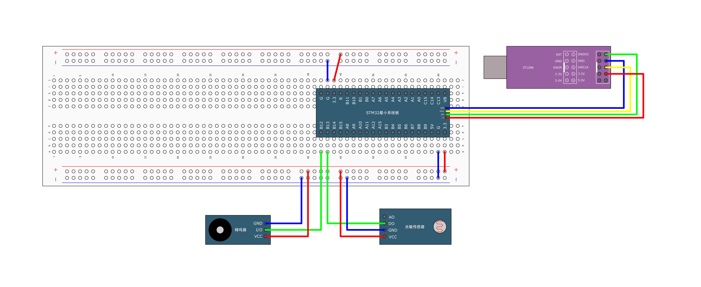

### 4.2 蜂鸣器的代码封装

- **Buzzer.c**文件编程：只需在LED函数的基础上修改GPIO口即可

  ```c
  #include "stm32f10x.h"                  // Device header
  
  void Buzzer_Init(void)
  {
  	RCC_APB2PeriphClockCmd(RCC_APB2Periph_GPIOB, ENABLE);       //使能GPIOB端口时钟
  	
  	GPIO_InitTypeDef GPIO_InitStructure;                        //定义结构体
  	GPIO_InitStructure.GPIO_Mode = GPIO_Mode_Out_PP;            //定义结构体的模式为推挽输出
  	GPIO_InitStructure.GPIO_Pin = GPIO_Pin_12;                  //选中12号引脚
  	GPIO_InitStructure.GPIO_Speed = GPIO_Speed_50MHz;           //定义速度为50MHz
  	GPIO_Init(GPIOA, &GPIO_InitStructure);                      //初始化端口
  
  	GPIO_SetBits(GPIOB, GPIO_Pin_12);               //前面初始化后默认是低电平，这条语句可以把端口设置为高电平
  }
  
  void Buzzer_ON(void)                      //点亮蜂鸣器
  {
  	GPIO_ResetBits(GPIOB, GPIO_Pin_12);     //低电平点亮
  }
  
  void Buzzer_OFF(void)                     //熄灭蜂鸣器
  {
  	GPIO_SetBits(GPIOB, GPIO_Pin_12);       //高电平熄灭
  }
  
  void Buzzer_Turn(void)                    //翻转蜂鸣器
  {
  	if (GPIO_ReadOutputDataBit(GPIOB, GPIO_Pin_12) == 0)
  	{
  		GPIO_SetBits(GPIOB, GPIO_Pin_12);
  	}
  	else
  	{
  		GPIO_ResetBits(GPIOB, GPIO_Pin_12);
  	}
  }
  
  ```

- **Buzzer.h**文件编程

  ```c
  #ifndef __BUZZER_H
  #define __BUZZER_H
  
  void Buzzer_Init(void);
  void Buzzer_ON(void);
  void Buzzer_OFF(void);
  void Buzzer_Turn(void);
  
  #endif
  
  ```

### 4.3 光敏传感器的代码封装

- LightSensor.c文件编程

  ```c
  #include "stm32f10x.h"                  // Device header
  
  void LightSensor_Init(void)             //初始化光敏传感器对应的引脚
  {
  	RCC_APB2PeriphClockCmd(RCC_APB2Periph_GPIOB, ENABLE);
  	
  	GPIO_InitTypeDef GPIO_InitStructure;
  	GPIO_InitStructure.GPIO_Mode = GPIO_Mode_IPU;
  	GPIO_InitStructure.GPIO_Pin = GPIO_Pin_13;
  	GPIO_InitStructure.GPIO_Speed = GPIO_Speed_50MHz;
  	GPIO_Init(GPIOB, &GPIO_InitStructure);
  }
  
  uint8_t LightSensor_Get(void)           //读取光敏传感器对应的引脚的电平
  {
  	return GPIO_ReadInputDataBit(GPIOB, GPIO_Pin_13);
  }
  
  ```

- LightSensor.h文件编程

  ```c
  #ifndef __LIGHTSENSOR_H
  #define __LIGHTSENSOR_H
  
  uint8_t LightSensor_Get(void);
  void LightSensor_Init(void);
  
  #endif
  
  ```

### 4.4 main.c文件编程

- 完整的main.c文件如下：

  ```c
  #include "stm32f10x.h"                  // Device header
  #include "Delay.h"
  #include "Buzzer.h"
  #include "LightSensor.h"
  
  int main(void)
  {
  	Buzzer_Init();
  	LightSensor_Init();
  	
  	while (1)
  	{
  		if (LightSensor_Get() == 1)
  		{
  			Buzzer_ON();
  		}
  		else
  		{
  			Buzzer_OFF();
  		}
  	}
  }
  
  ```

---


# 第九节课：4-1_OLED调试工具

## 1.程序调试方式
- 串口调试：通过串口通讯，将调试信息发送到电脑端，电脑使用串口助手显示调试信息；
- 显示屏调试：直接将显示屏连接到单片机，比如0.96寸的OLED屏幕；
- **Keil调试模式**：借助Keil软件的调试模式，使用单步运行、设置断点、查看寄存器及变量等功能；
- 点灯调试法：在需要测试的地方放一个点灯的代码；
- 注释调试法：新加入的程序可以采用注释调试法；
- 对照法；


## 2.OLED简介

- OLED：Organic Light Emitting Diode，有机发光二极管；

- 供电：3~5.5V；

- 通信协议：**I2C**（4针脚）或**SPI**（7针脚）；

- 分辨率：**128*64**；

- **GPIO口模拟I2C通信**，这样就可以将I2C的引脚随便的接到任意GPIO口中；

  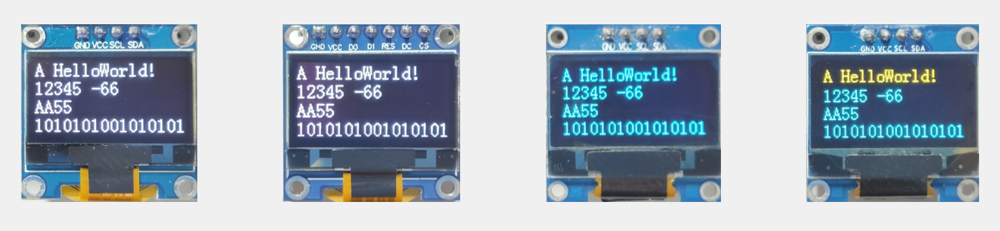


## 3.OLED驱动函数——up主直接提供

- OLED的屏幕坐标：4行16列

  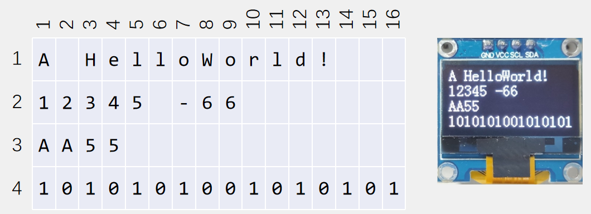

- OLED驱动函数：
  - **OLED_Init()**：初始化函数
  - **OLED_Clear()**：清屏函数
  - **OLED_ShowChar(1, 1, 'A')**：显示一个字符
  - **OLED_ShowString(1, 3, "HelloWorld")**：显示字符串
  - **OLED_ShowNum(2, 1, 12345, 5)**：显示无符号十进制数字
  - **OLED_ShowSignedNum(2, 7, -66, 2)**：显示有符号十进制数字
  - **OLED_ShowHexNum(3, 1, 0xAA55, 4)**：显示十六进制数字
  - **OLED_SHowBinNum(4, 1, 0xAA55, 16)**：显示二进制数字

---


# 第十节课：4-2_OLED显示屏

## 1.OLED显示屏的放置

- 直接放置在右下角，显示屏的GND和VCC引脚可以通过跳线将VCC与GND引导对应引脚，主要不初始化相关引脚即可；

- 或者也可以通过直接在对应引脚输出高电平和低电平来模拟VCC和GND；

- I2C的SCL和SDA引脚分别接到PB8和PB9引脚；

  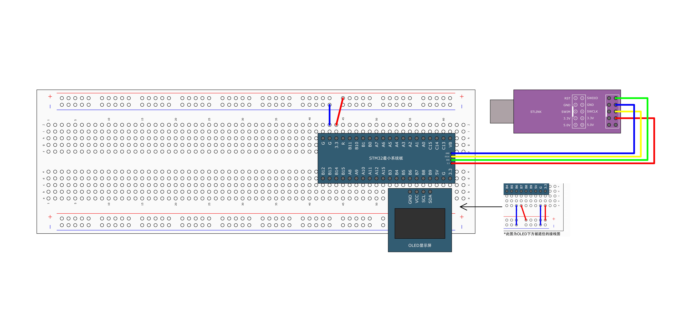


## 2.OLED相关函数的演示

- 需要先将up提供的OLED驱动函数文件添加到Hardware组中，其操作过程同前面，包括以下三个文件：

  - OLED.c
  - OLED.h
  - OLED_Font.h

- OLED的相关函数演示即前面的那些函数，先初始化然后调用相关函数即可；

  ```c
  #include "stm32f10x.h"                  // Device header
  #include "Delay.h"
  #include "OLED.h"
  
  int main(void)
  {
  	OLED_Init();
  	
  	OLED_ShowChar(1, 1, 'A');
  	OLED_ShowString(1, 3, "HelloWorld!");
  	OLED_ShowNum(2, 1, 12345, 5);
  	OLED_ShowSignedNum(2, 7, -66, 2);
  	OLED_ShowHexNum(3, 1, 0xAA55, 4);
  	OLED_ShowBinNum(4, 1, 0xAA55, 16);
  	
  	while (1)
  	{
  		
  	}
  }
  
  ```


## 3.Keil的调试模式介绍

- 两种仿真方式：

  - 选择软件仿真：Use Simulator，这个是基于电脑的软件仿真；
  - 选择硬件仿真：Use ST-Link Debugger，需要连接硬件；
  - 默认选择为硬件仿真；

  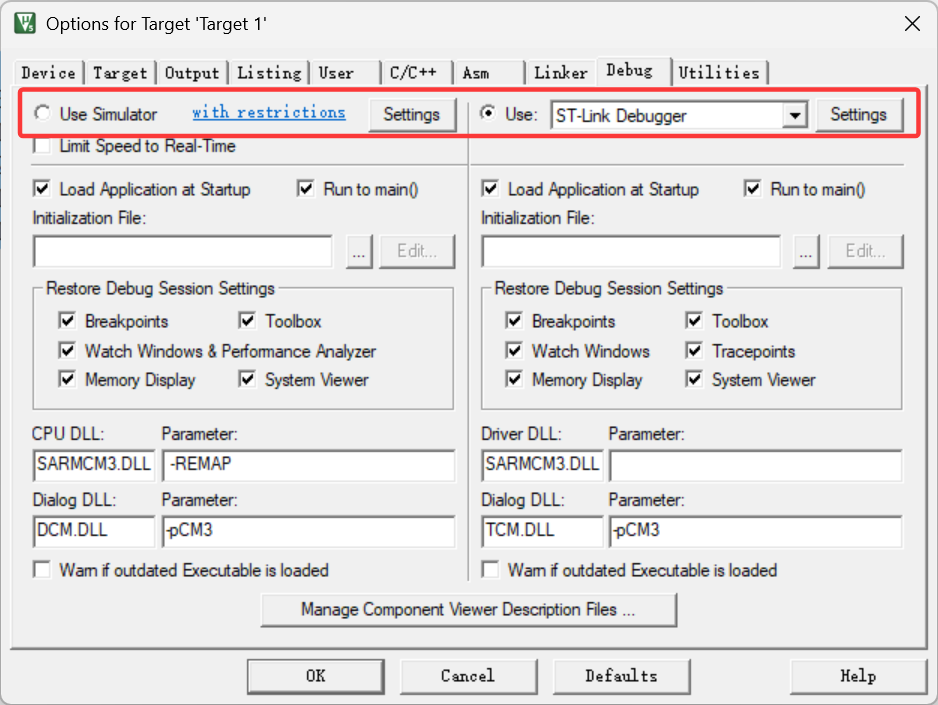

- 点击上方的放大镜图标，进入调试模式；

- 可以看寄存器、变量、单步运行等强大的功能；

  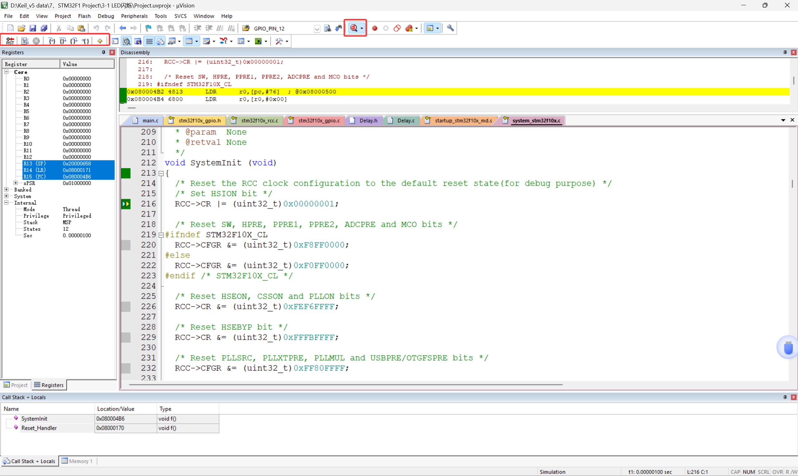

---


# 第十一节课：5-1_EXTI外部中断

## 1.中断系统简介
- 中断：主程序运行过程中，出现了特定的**中断触发条件（中断源）**，使得**CPU暂停当前正在运行的程序**，转而去处理中断程序，处理完成后又返回原来被暂停的位置继续运行；

- 中断优先级：当有**多个中断源同时申请中断**时，CPU会根据**中断源的轻重缓急**进行裁决，优先响应更加紧急的中断源；

- 中断嵌套：处理中断程序时又有新的更高优先级的中断源申请中断；

- 中断程序都是在一个子函数中的，不需要在主函数中调用，当中断来临时由硬件自动调用这个函数；

  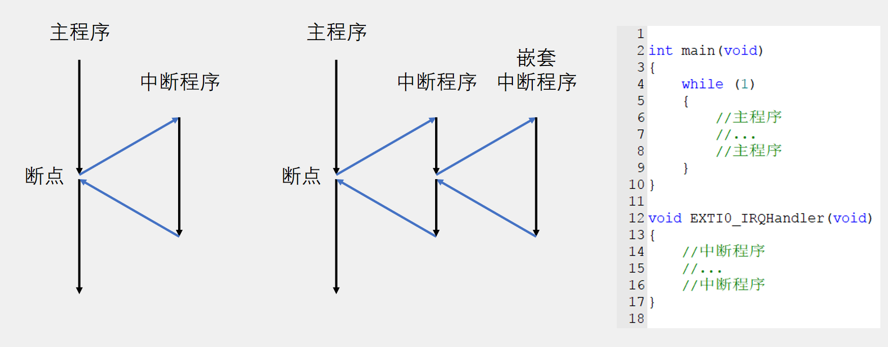


## 2.STM32的中断

### 2.1 STM32中的中断源

- F1系列中最多包含了**68个中断源**，主要包括有：
  - EXTI外部中断；
  - TIM定时器中断；
  - ADC模数转换中断；
  - USART串口中断；
  - SPI通信中断；
  - I2C通信中断；
  - RTC实时时钟中断；

### 2.2 NVIC管理中断

- 使用NVIC统一管理中断，用于**分配中断、设置优先级**等；

- 每个中断通道都拥有**16个可编程的优先级**，可对优先级进行**分组**并进一步设置抢占优先级和响应优先级；

  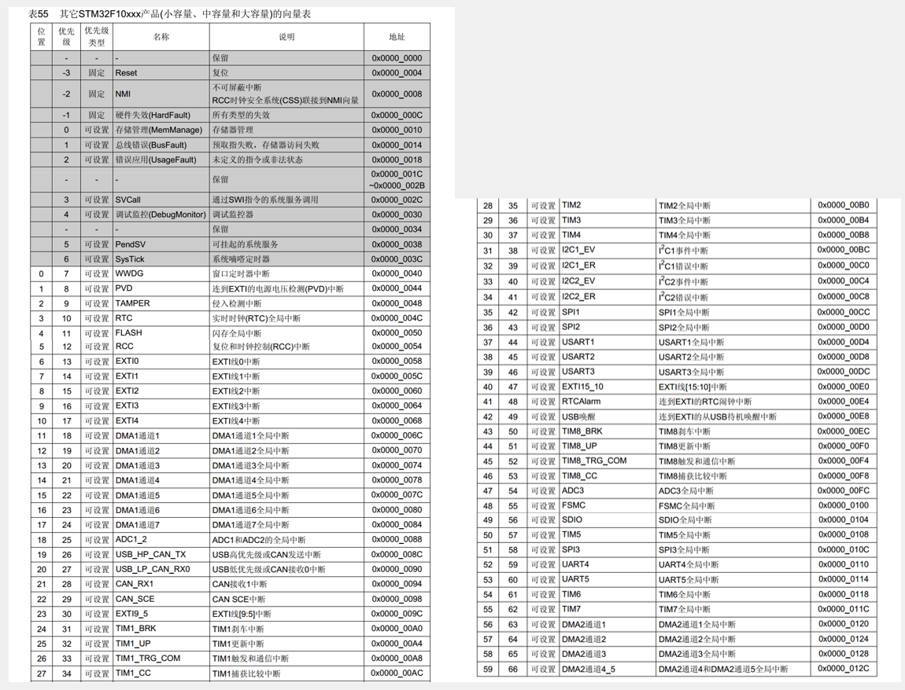

- **中断向量表**：中断程序执行跳转的跳板

  - 中断程序的地址是由**编译器自动分配**的，每一次都是**不固定**的；
  - 但是对于**中断跳转**而言，由于硬件的限制，每次只能**跳转到固定的地址**；
  - 为了让硬件能够**跳转到一个不固定地址的中断函数**里，就需要这个中断向量表；
  - 中断向量表是一个**列表**，这个列表的**地址是固定**的，中断发生后就会**跳转到这个地址**，这个地址会由**编译器自动写上跳转到中断程序所在地址的代码**，实现跳板，这个列表地址就是上图中的“地址”一列；


## 3.NVIC基本结构与优先级分组

### 3.1 NVIC的基本结构

- NVIC的介绍：**嵌套中断向量控制器**，是一个**内核外设**，是CPU的小助手，这样中断就不需要全部引出线来接中断源了，而是直接由NVIC来接中断源（**可比喻为医院的叫号系统**）；

  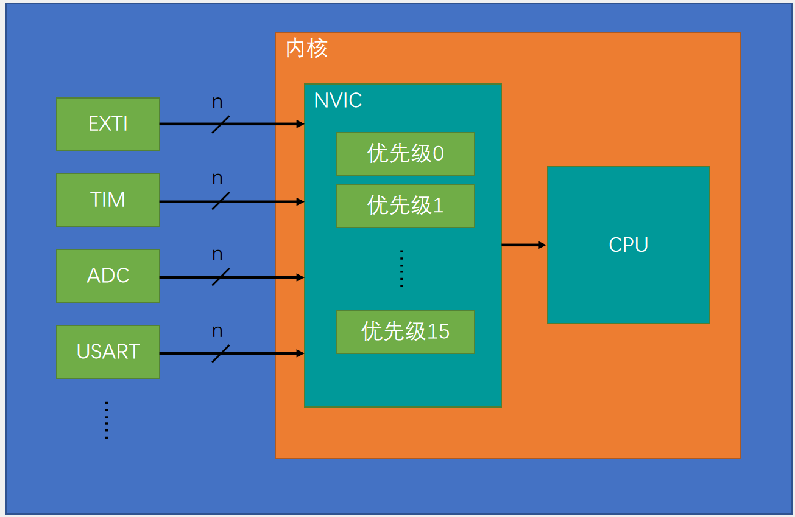

- 作用：用来统一中断优先级和管理中断的，**CPU只需要执行NVIC给它的中断**即可，至于这个中断的优先级它是不理的，这个是由NVIC进行判断的；

### 3.2 NVIC的优先级分组

- NVIC的中断优先级由**优先级寄存器的4位**决定，值越小优先级越高，这4位可以进行切分，分为：

  - 高n位的**抢占优先级**；

  - 低4-n位的**响应优先级**；

  - 所以一共可以有**5种**分组；

    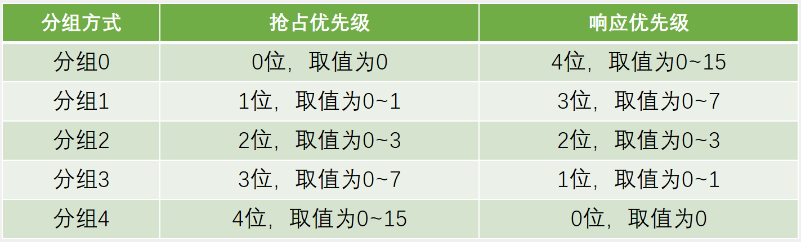

- **抢占优先级**：可以中断嵌套，即**当前病人还没看完就马上看它的**；

- **响应优先级**：可以优先排队，即**需要等当前病人看完后，直接让它进来看**；

- 若是抢占优先级和响应优先级均相同的**按中断号排队**，即“位置”一列，值越小越先排队；


## 4.EXTI外部中断简介

- 定义：EXTI即**外部中断Extern Interrupt**，是众多能产生中断的外设之一；
- 工作模式：EXTI可以检测**指定GPIO口的电平信号**，当其产生电平变化时，EXTI将立即向NVIC发出中断申请，经过NVIC裁决后即可**中断CPU主程序**，使CPU执行EXTI对应的中断程序；
- **触发方式**：EXTI可选择当引脚有如下四种电平跳变时进行中断
  - 上升沿：引脚电平由低到高
  - 下降沿：引脚电平由高到低；
  - 双边沿：引脚电平由低到高或高到低；
  - **软件触发**：即引脚什么都不发生，程序里执行一句代码技能触发中断；
- 支持的GPIO口：所有的GPIO口，但相同的Pin不能同时出发中断，即**不能同时选择PA0和PB0**；
- 通道数：16个GPIO_Pin——对应GPIO_Pin_0到GPIO_Pin_15，外加**PVD输出、RTC闹钟、USB唤醒、以太网唤醒**等，一共**20个中断通道**；
- **触发响应方式**
  - 中断响应：触发CPU执行中断程序；
  - **事件响应**：触发不通向CPU，而是**触发其他外设进而执行其他功能**（比如ADC和DMA的配合中）;


## 5.EXTI基本结构

- 只能选择一个端口，即不能选择不同组的相同Pin；

- 中断响应与事件响应的区别

  - 对于NVIC：进来有20个通道，但是输出的时候**9~5和15~10占用同一通道**，它们会触发同一个中断函数，后面可通过**标志位来区分**；
  - 对于其他外设：也就是事件响应来说，进来和出去都是20个通道；

  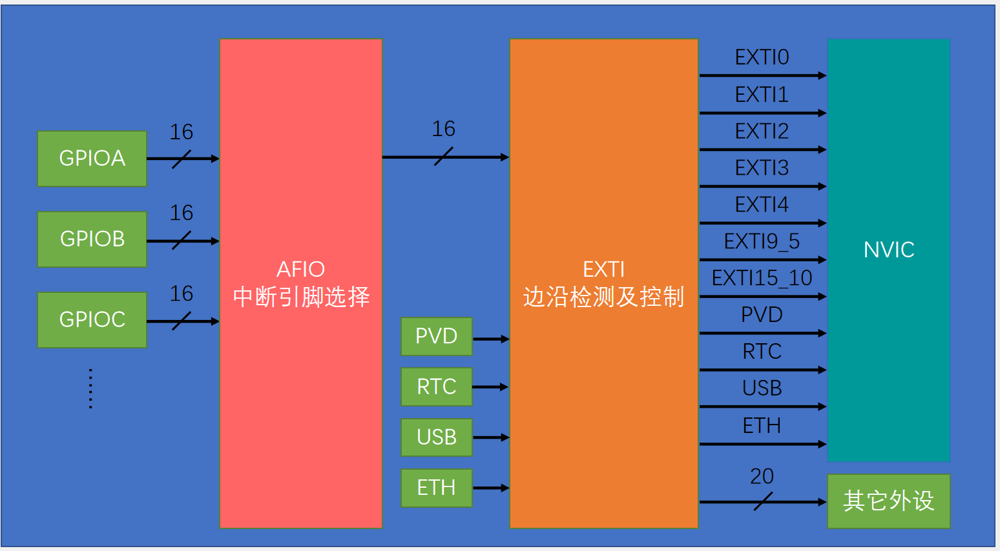

- AFIO口的作用

  - 复用功能引脚重映射；
  - 中断引脚选择；

  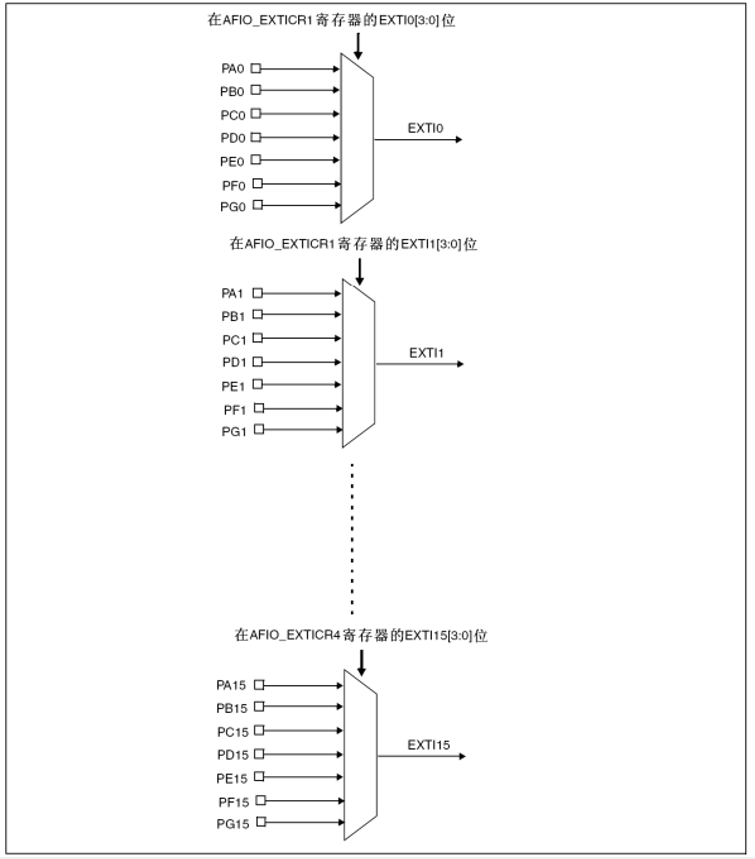

- EXTI系统框图

  - 第一部分即为**中断触发电路**，可选择上升沿/下降沿/双边沿/软件触发四种方式，通过或门送入后续硬件，即任有一种触发即可 ；
  - 第二部分为**NVIC中断触发电路**，前面触发可送至**“请求挂起寄存器”**，相当于置标志位，且只有中断屏蔽寄存器为“1”才能送至NVIC中断控制器；
  - 第三部分为**事件触发电路**，前面触发与**事件屏蔽寄存器**一块送入与门，只有事件屏蔽寄存器为1才能产生脉冲送至片上其他外设；

  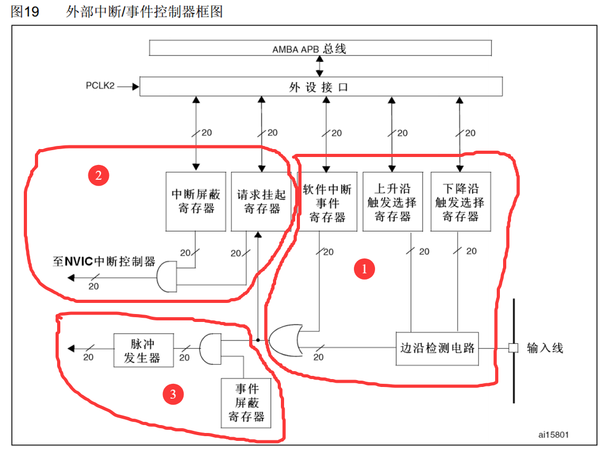


## 6.本节所用硬件模块

需要采用中断的特性：**信号的接收是突发性的**；但对于按键不推荐用中断来接收，因为存在按键的抖动问题，推荐用循环读取的方式；

- 对射式红外传感器

  - 该外设已在前面介绍过，参照前面；

- 旋转编码器的基本原理

  - 作用：用来测量**位置或速度或旋转方向**的装置；
  - 机理：当其旋转轴旋转时，其输出端可以**输出与旋转速度和方向对应的方波信号**，读取方波信号的**频率**和**相位信息**即可得知旋转轴的速度和方向；
    - 正转时，A相的信号相位比B相提前90°；
    - 反转时，A相的信号相位比B相延迟90°；
  - 类型：机械触点式或霍尔传感器式或光栅式，需要注意不同的元件是否可以测方向，常见类型如下：

  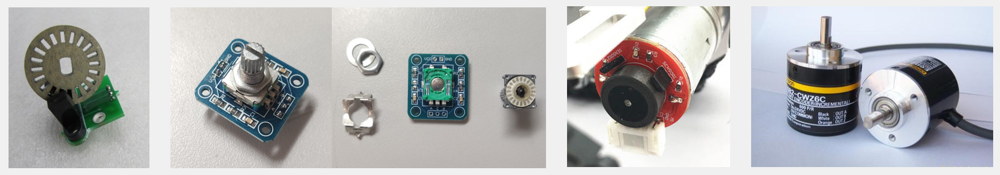

  - 旋转编码器的硬件电路如下：注意A相和B相不能接到Pin一样的两个引脚，否则无法检测外部中断

  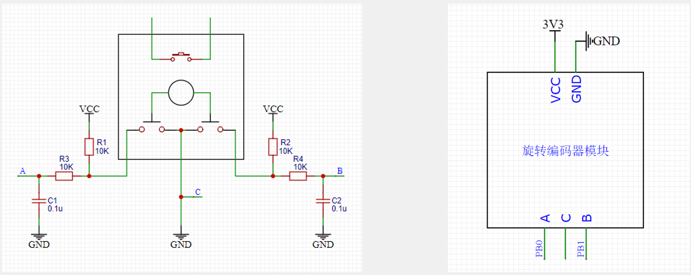

---


# 第十二节课：5-2_对射式红外传感器计次&旋转编码器计次

## 1.对射式红外传感器计次

### 1.1 接线图

- 接线图所下图所示：红外传感器的DO输出端接到PB14号口

  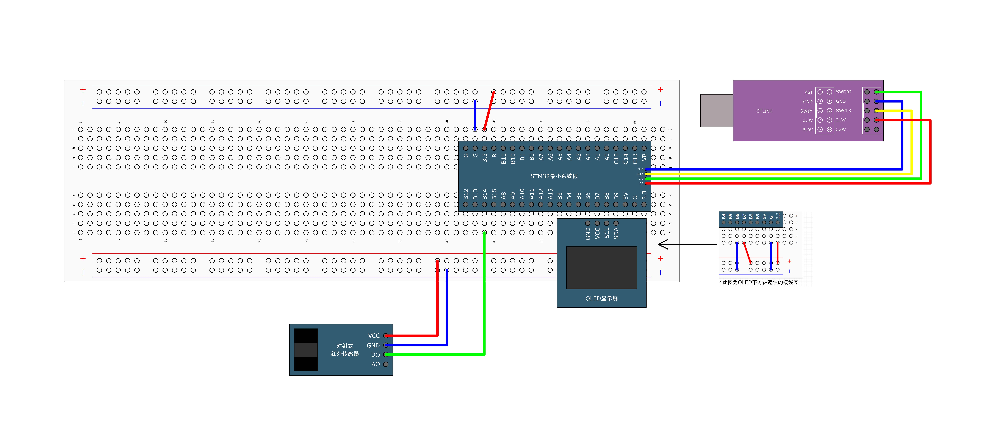

### 1.2 相关库函数概述

- **AFIO的库函数**：是与GPIO放在一块的，在**stm32f10x_gpio.h**文件中

  - GPIO_AFIODeInit(void)：用来复位AFIO外设；
  - GPIO_PinLockConfig()：用来锁定GPIO配置；
  - GPIO_EventOutputConfig()：用来配置AFIO的事件输出功能；
  - GPIO_EventOutputCmd()：用来配置AFIO的事件输出功能；
  - GPIO_PinRemapConfig()：用来**引脚重映射**，第一个参数选择要重映射的方式，第二个参数是新的状态；
  - **GPIO_EXTILineConfig()**：调用该函数可以配置AFIO的数据选择器，选择**想要的中断引脚**；
  - GPIO_ETH_MediaInterfaceConfig()：与以太网有关；

  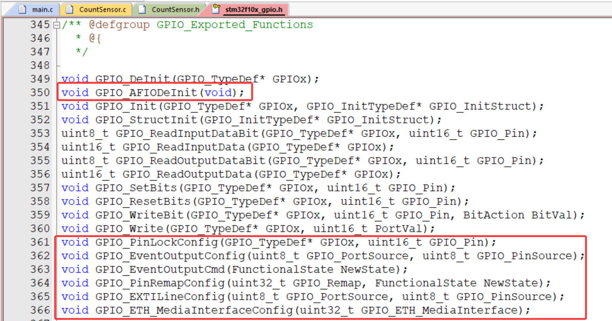

- **EXTI的库函数**：在**stm32f10x_exti.h**文件中

  - EXTI_DeInit()函数：复位；
  - EXTI_Init()函数：调用即可根据**结构体里的参数**配置EXTI外设；
  - EXTI_StrucInit()：调用可将参数传递的结构体变量赋一个默认值；
  - EXTI_GenerateSWInterrupt()：用于**软件触发**外部中断；
  - **EXTI_GetFlagStatus()**：获取**指定的标志位是否被置1**；
  - EXTI_ClearFlag()：对标志位进行**清除**；
  - EXTI_GetITStatus()：获取**中断标志位**是否被置1；
  - EXTI_ClearITPendingBit()：清除**中断挂起标志位**；
  - 后面两个只能读写与**中断**有关的标志位，前面两个是在**主函数**中进行标志位的判断；且中断标志位是需要手动清除的；

  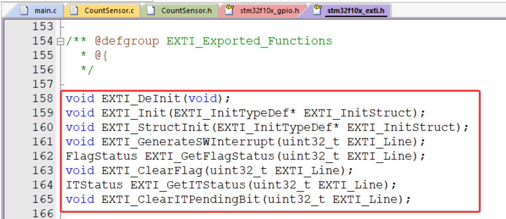

- **NVIC的库函数**：在**misc.h**文件中

  - **NVIC_PriorityGroupConfig()**：用来中断分组，参数是中断分组的方式；
  - **NVIC_Init()**：根据结构体里面指定的参数初始化NVIC；
  - NVIC_SetVectorTable()：设置中断向量表；
  - NVIC_SystemLPConfig()：系统低功耗配置；

  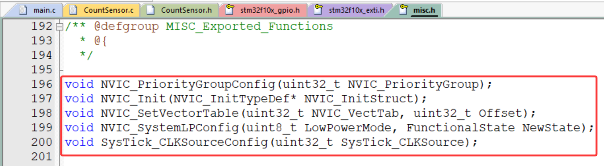

### 1.3 模块封装编程

在Hardware文件夹中添加CountSensor模块，包括**CountSensor.c**和**CountSensor.h**文件；

- 在.c文件中，先写**初始化函数**，这个初始化函数需要完成**外部中断的配置**：即要打通下图的线路

  

  - ①配置RCC，将涉及到的外设的**时钟**都打开：
    - GPIO的时钟；
    - AFIO的时钟；
    - EXTI与NVIC的时钟不需要手动打开，它们是一直开着的，对于内核的外设都不需要开启，但是需要注意EXTI的内核外的外设，但它不需要开启时钟；
  - ②配置GPIO，选择端口为**输入模式**；
  - ③配置AFIO，选择用的**那一路的GPIO连接到后面的EXTI**；
  - ④配置EXTI，选择**边沿触发方式**，并选择**触发响应方式**（事件响应还是中断响应）；
  - ⑤配置NVIC，给这个中断选择一个合适的**优先级**；

  ```c
  void CountSensor_Init(void)
  {
  	/*第一步：开启外设的时钟，要注意不同的外设是挂载在哪条总线上的，GPIO和AFIO都是挂载在APB2的总线上的
  	且EXTI和NVIC是不需要开启时钟的，它们的时钟是一直开着的，所以不用对它们操作*/
  	RCC_APB2PeriphClockCmd(RCC_APB2Periph_GPIOB, ENABLE);
  	RCC_APB2PeriphClockCmd(RCC_APB2Periph_AFIO, ENABLE);
  	
  	//第二步：配置GPIO
  	GPIO_InitTypeDef GPIO_InitStructure;
  	GPIO_InitStructure.GPIO_Mode = GPIO_Mode_IPU;   //对于外部中断来说，需要选择浮空输入、上拉输入或下拉输入中的一个模式
  	GPIO_InitStructure.GPIO_Pin = GPIO_Pin_14;
  	GPIO_InitStructure.GPIO_Speed = GPIO_Speed_50MHz;
  	GPIO_Init(GPIOB , &GPIO_InitStructure);
  	
  	//第三步：配置AFIO，注意AFIO的库文件是和GPIO放在一块的
  	GPIO_EXTILineConfig(GPIO_PortSourceGPIOB, GPIO_PinSource14);   //执行后GPIOB14被选好，且AFIO输出端固定连接EXTI的第十四个中断线路
  	
  	//第四步：配置EXTI，即将EXTI的第14个线路配置为中断模式，下降沿触发，并开启中断
  	EXTI_InitTypeDef EXTI_InitStructure;
  	EXTI_InitStructure.EXTI_Line = EXTI_Line14;                    //指定要配置的中断线
  	EXTI_InitStructure.EXTI_LineCmd = ENABLE;                      //指定中断线的新状态
  	EXTI_InitStructure.EXTI_Mode = EXTI_Mode_Interrupt;            //指定外部中断源的模式，中断模式或是事件模式
  	EXTI_InitStructure.EXTI_Trigger = EXTI_Trigger_Falling;        //指定触发方式
  	EXTI_Init(&EXTI_InitStructure);
  	
  	//第五步：配置NVIC
  	NVIC_PriorityGroupConfig(NVIC_PriorityGroup_2);             //设置NVIC的分组，且整个芯片分组方式只能用一种
  	NVIC_InitTypeDef NVIC_InitStruct;
  	NVIC_InitStruct.NVIC_IRQChannel = EXTI15_10_IRQn;           //指定中断通道来开启或关闭，其中EXTI10到EXTI15合并到了一个通道上
  	NVIC_InitStruct.NVIC_IRQChannelCmd = ENABLE;                //指定中断通道使能
  	NVIC_InitStruct.NVIC_IRQChannelPreemptionPriority = 1;      //指定抢占优先级，根据前面的分组，查表知这个参数的范围是0~3
  	NVIC_InitStruct.NVIC_IRQChannelSubPriority = 1;             //指定响应优先级，根据前面的分组，查表知这个参数的范围是0~3
  	NVIC_Init(&NVIC_InitStruct);
  }
  
  ```

- 中断函数

  - 在完成初始化后，当对应的引脚有设置的跳变电平时，将会**产生中断**，由**主程序跳转到中断程序运行**；
  - 中断向量表写明白了中断服务函数的名字和地址，而中断向量表写在启动文件**startup_stm32f10x_md.s**中；
  - 每个对应通道的中断函数的函数名都是**固定的**（在启动文件startup_stm32f10x_md.s中），写好中断函数，产生中断时将自动运行中断程序；
  - 启动文件中的**中断向量表**如图所示，每个通道都有**自己的中断函数的固定名字**：
  
  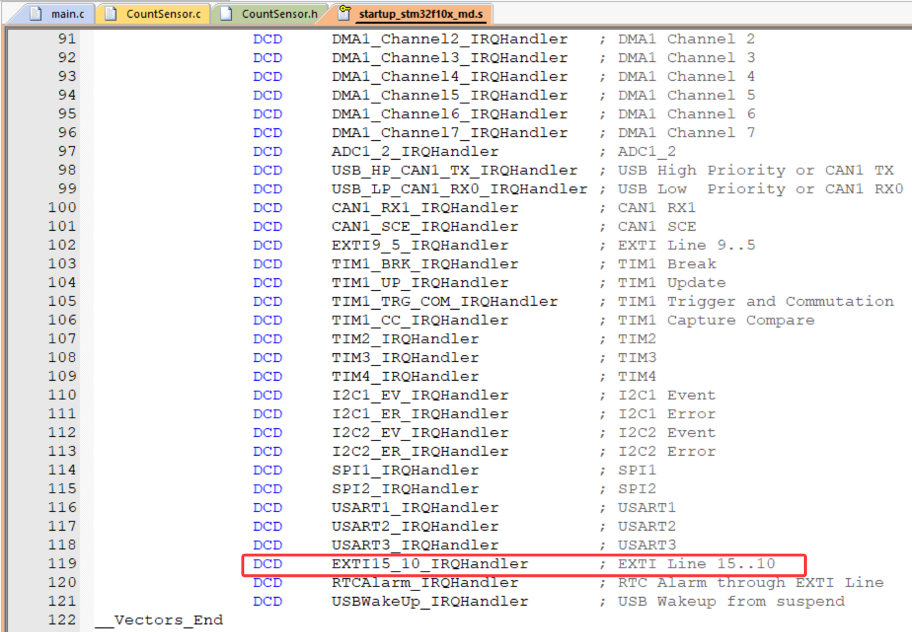
  
  - 完整的驱动函数如下：
  
  ```c
  uint16_t CountSensor_Count;
  
  void EXTI15_10_IRQHandler(void)                    //中断函数不需要在.h文件中声明，它是不需要调用的
  {
  	if (EXTI_GetITStatus(EXTI_Line14) == SET)      //先进行一个中断标志位的判断，因为这个通道是15~10都可以进来，所以要先判断是不是14号的中断源
  	{
  		CountSensor_Count ++;                      //执行操作
  		EXTI_ClearITPendingBit(EXTI_Line14);       //中断程序结束后一定要调用一下清除中断标志位的函数，防止重复进入中断
  	}
  }
  
  ```
  
- 接下来还需要封装返回计数值的函数，如下：

```c
uint16_t CountSensor_Get(void)
{
	return CountSensor_Count;
}

```

- 在.h文件中，加入函数的声明，中断函数不需要声明：

```c
#ifndef __COUNT_SENSOR_H
#define __COUNT_SENSOR_H

void CountSensor_Init(void);
uint16_t CountSensor_Get(void);

#endif

```

- 在main.c文件中调用完整逻辑：

```c
#include "stm32f10x.h"                  // Device header
#include "Delay.h"
#include "OLED.h"
#include "CountSensor.h"

int main(void)
{
	OLED_Init();
	CountSensor_Init();
	
	OLED_ShowString(1, 1, "Count:");
	
	while (1)
	{
		OLED_ShowNum(1, 7, CountSensor_Get(), 5);
	}
}

```

- 这样，烧录后，用挡光片遮挡，拿走挡光片后将会变量＋1；可改变触发方式来实现不同的效果；


## 2.旋转编码器计次

### 2.1 接线图

- 接线图如下图所示，A、B相输出接到GPIOB0和GPIOB1两个口中：

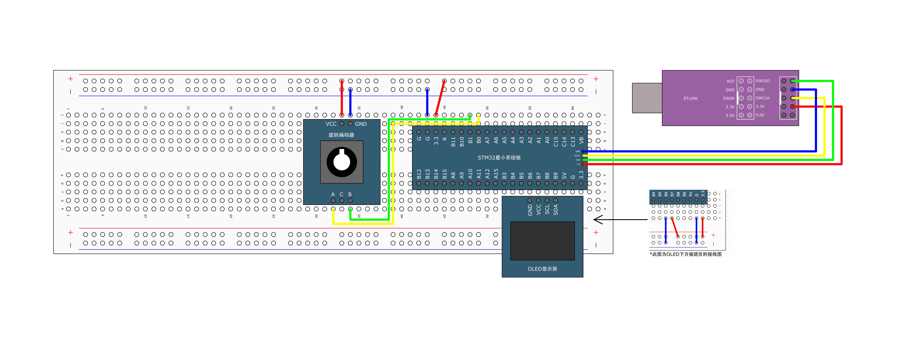

### 2.2 模块封装编程

在Hardware组中添加旋转编码器模块，包括Encoder.c和Encoder.h文件；

- Encoder.c文件编程

```c
#include "stm32f10x.h"                  // Device header

int16_t Encoder_Count;

void Encoder_Init(void)                 //初始化PB0和PB1两个GPIO口的外部中断
{
	/*第一步：开启外设的时钟，要注意不同的外设是挂载在哪条总线上的，GPIO和AFIO都是挂载在APB2的总线上的
	且EXTI和NVIC是不需要开启时钟的，它们的时钟是一直开着的，所以不用对它们操作*/
	RCC_APB2PeriphClockCmd(RCC_APB2Periph_GPIOB, ENABLE);
	RCC_APB2PeriphClockCmd(RCC_APB2Periph_AFIO, ENABLE);
	
	/*第二步：配置GPIO*/
	GPIO_InitTypeDef GPIO_InitStructure;
	GPIO_InitStructure.GPIO_Mode = GPIO_Mode_IPU;       //对于外部中断来说，需要选择浮空输入、上拉输入或下拉输入中的一个模式
	GPIO_InitStructure.GPIO_Pin = GPIO_Pin_0 | GPIO_Pin_1;
	GPIO_InitStructure.GPIO_Speed = GPIO_Speed_50MHz;
	GPIO_Init(GPIOB , &GPIO_InitStructure);
	
	//第三步：配置AFIO，注意AFIO的库文件是和GPIO放在一块的，这里的GPIO_EXTILineConfig本质上就是AFIO_EXTILineConfig
	GPIO_EXTILineConfig(GPIO_PortSourceGPIOB, GPIO_PinSource0);   //执行这个函数后AFIO输出端固定连接了EXTI的第0个中断线路
	GPIO_EXTILineConfig(GPIO_PortSourceGPIOB, GPIO_PinSource1);   //执行这个函数后AFIO输出端固定连接了EXTI的第1个中断线路
	
	//第四步：配置EXTI，即将EXTI的第14个线路配置为中断模式，下降沿触发，并开启中断
	EXTI_InitTypeDef EXTI_InitStructure;
	EXTI_InitStructure.EXTI_Line = EXTI_Line0 | EXTI_Line1;        //指定要配置的中断线
	EXTI_InitStructure.EXTI_LineCmd = ENABLE;                      //指定中断线的新状态
	EXTI_InitStructure.EXTI_Mode = EXTI_Mode_Interrupt;            //指定外部中断源的模式，中断模式或是事件模式
	EXTI_InitStructure.EXTI_Trigger = EXTI_Trigger_Falling;        //指定触发方式
	EXTI_Init(&EXTI_InitStructure);
	
	//第五步：配置NVIC
	NVIC_PriorityGroupConfig(NVIC_PriorityGroup_2);                //设置NVIC的分组，且整个芯片分组方式只能用一种
	
	NVIC_InitTypeDef NVIC_InitStruct;
	NVIC_InitStruct.NVIC_IRQChannel = EXTI0_IRQn;                  //指定中断通道来开启或关闭，其中EXTI10到EXTI15合并到了一个通道上
	NVIC_InitStruct.NVIC_IRQChannelCmd = ENABLE;                   //指定中断通道使能
	NVIC_InitStruct.NVIC_IRQChannelPreemptionPriority = 1;         //指定抢占优先级，根据前面的分组，查表知这个参数的范围是0~3
	NVIC_InitStruct.NVIC_IRQChannelSubPriority = 1;                //指定响应优先级，根据前面的分组，查表知这个参数的范围是0~3
	NVIC_Init(&NVIC_InitStruct);

	NVIC_InitStruct.NVIC_IRQChannel = EXTI1_IRQn;                  //指定中断通道来开启或关闭，其中EXTI10到EXTI15合并到了一个通道上
	NVIC_InitStruct.NVIC_IRQChannelCmd = ENABLE;                   //指定中断通道使能
	NVIC_InitStruct.NVIC_IRQChannelPreemptionPriority = 1;         //指定抢占优先级，根据前面的分组，查表知这个参数的范围是0~3
	NVIC_InitStruct.NVIC_IRQChannelSubPriority = 2;                //指定响应优先级，根据前面的分组，查表知这个参数的范围是0~3
	NVIC_Init(&NVIC_InitStruct);
}

int16_t Encoder_Get(void)    //返回变化量实现加减运算
{
	int16_t Temp;
	Temp = Encoder_Count;
	Encoder_Count = 0;
	return Temp;
}

//两个中断函数
void EXTI0_IRQHandler(void)
{
	if (EXTI_GetFlagStatus(EXTI_Line0) == SET)
	{
		if (GPIO_ReadInputDataBit(GPIOB, GPIO_Pin_1) == 0) //不要在主函数和中断函数中执行对同一个硬件的操作，可通过变量或标志位来实现在主函数中输出
		{
			Encoder_Count --;
		}
		EXTI_ClearITPendingBit(EXTI_Line0);
	}
}

void EXTI1_IRQHandler(void)
{
	if (EXTI_GetFlagStatus(EXTI_Line1) == SET)
	{
		if (GPIO_ReadInputDataBit(GPIOB, GPIO_Pin_0) == 0)
		{
			Encoder_Count ++;
		}		
		EXTI_ClearITPendingBit(EXTI_Line1);
	}
}

```

- Encoder.h文件编程

```c
#ifndef __ENCODER_H
#define __ENCODER_H

int16_t Encoder_Get(void);
void Encoder_Init(void);

#endif

```

- main.c文件编程

```c
#include "stm32f10x.h"                  // Device header
#include "Delay.h"
#include "OLED.h"
#include "Encoder.h"

int16_t Num;

int main(void)
{
	OLED_Init();
	Encoder_Init();
	OLED_ShowString(1, 1, "Num:");
	
	while (1)
	{
		Num += Encoder_Get();              //通过返回变化量来实现加减运算
		OLED_ShowSignedNum(1, 5, Num, 5);
	}
}

```

---


# 第十三节课：6-1_TIM定时中断

## 1.定时器内容简介

- 定时器**定时中断**：即**每隔多少时间**就产生一次中断或是执行一段程序；
- 定时器**输出比较**：利用输出比较功能输出**PWM波**驱动电机；
- 定时器**输入捕获**：利用输入捕获功能进行**方波频率测量**；
- 定时器**编码器接口**：更方便的**读取正交编码器的波形**，主要是运用于编码测速中；


## 2.TIM（Timer）定时器简介

- 作用：定时器对输入的时钟（**内部时钟/外部时钟**）进行计数，并在**计数值达到设定值时触发中断**；
- STM32F1中，主频为**72MHz**，对72MHz计72个数，那就是1MHz，也就是**1us**的时间；
- STM32的时基单元：**16位计数器、预分频器、自动重装寄存器**(目标值)的时基单元，在72MHz计数时钟下可以实现最大59.65s的定时；除此之外还可级联；
- 定时器的其他功能：除了定时中断功能外，还有**内外时钟源选择、输入捕获、输出比较、编码器接口、主从触发模式**等多种功能；
- 定时器分类：高级定时器、通用计时器、基本计时器


## 3.定时器类型的介绍

- 高级定时器：TIM1、TIM8，挂载在**APB2总线**上；（通用定时器全部功能＋重复计数器、死区生成、互补输出、刹车输入等——三相无刷电机的驱动设计）
- 通用定时器：TIM2、TIM3、TIM4、TIM5，挂载在**APB1总线**上；（基本定时器全部功能＋内外时钟源选择、输入捕获、输出比较、编码器接口、主从触发模式等）
- 基本定时器：TIM6、TIM7，挂载在**APB1总线**上；（定时中断、主模式触发DAC功能，**只能接内部时钟**）
- 对于STM32F103C8T6来说只有**TIM1、2、3、4**，不同型号的定时器数量是不同的；


## 4.三种定时器的结构

### 4.1 基本定时器
- 内部时钟直接接到时基单元，预分频器的分频与实际值差1（即写1为二分频，二分频则输入到计数器的时钟为36MHz）；
- CK_CNT时钟每来一个上升沿，**计数器就＋1**；
- 更新中断：当达到自动重装载寄存器的值时，产生中断通往NVIC，这种计数值等于自动重装值产生的中断叫**更新中断**；
- 更新事件：向下的箭头代表更新事件，它不会触发中断，**但可以触发内部其他电路的工作**；
- **主从模式触发DAC**：将**更新事件**映射到**TRGO来触发DAC**，不会产生中断，这样不会让主程序频繁的处于中断状态，实现硬件的自动化，这就是**主模式**；

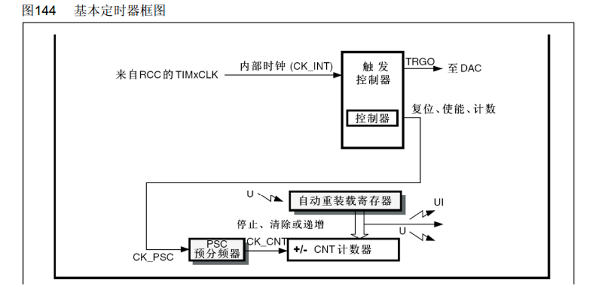

### 4.2 通用定时器

- 定时器的**三种模式**

  - 向上模式：从零开始，向上自增记到重装值；
  - 向下模式：从重装值开始，向下自减倒计到零；
  - 对齐模式：先从0记到重装值，再从重装值记到0；
  - 基本定时器只支持第一种，通用和高级支持三种；

  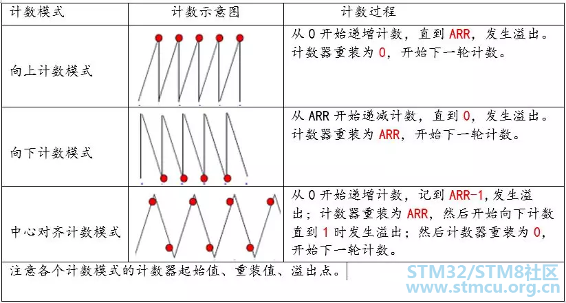

- **内外时钟源选择**

  - 基本定时器只能选择内部时钟；
  - 通用定时器除了内部时钟，还可以选择外部时钟，主要有：
    - **外部时钟模式2**：**“TIMx_ETR”**引脚上的外部时钟，走最上面的一条线；
    - **外部时钟模式1**：**“TRGI”**，包括ETR（两种方式都行）、ITR（**定时器级联**）、**TI1F_ED**、**TI1FP1**、**TI2FP2**，后面三者主要为了实现频率测量（输入捕获）等功能；

- 编码器接口：用于测量正交的编码器信号；

- 输入/输出部分电路：

  - **输出比较电路**：四个通道，对于CH1到CH4的引脚，可用于输出PWM波形，驱动电机；
  - **输入捕获电路**：四个通道，对于CH1到CH4的引脚，可用于测输入方波的频率；
  - **中间的捕获/比较寄存器**：输入捕获和输出比较电路共用，因为输出比较和输入捕获**两者不能同时使用**，所以寄存器和引脚都是公用的；

- **定时器的控制逻辑**：

  - 触发控制器负责选择和处理触发源；
  - 从模式控制器负责设置具体的计数器工作模式；
  - 主模式的重点在于引脚重映射，产生TRGO；
  - 从模式就是定时器的主要模式，即从模式控制器＋触发控制器配合产生中断；

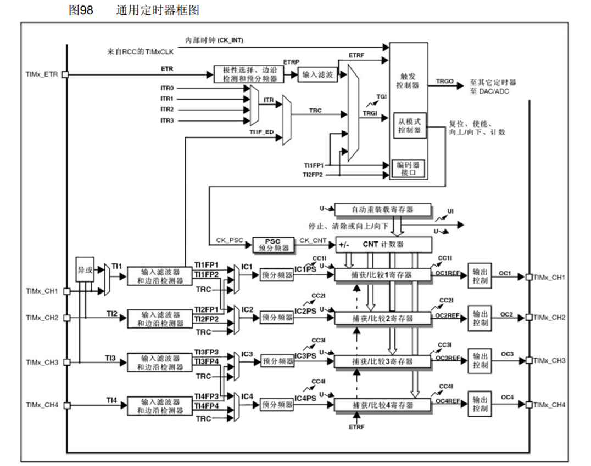

### 4.3 高级定时器

- 相比较于通用定时器，主要增加了：
  - 重复次数计数器；
  - 右边输出部分：死区生成器与互补PWM输出；
  - 刹车输入功能；
- 重复次数计数器：可实现**每隔几个周期再更新一次**的功能，相当于对输出的更新信号又做了几次分频；
- 输出比较部分的升级：
  - 可输出互补的PWM波；
  - 为了驱动三相无刷电机，还增加了**死区生成防止直通**；
- 刹车输入功能：为了给电机驱动提供安全保障，**当该引脚输入刹车信号时将切断PWM的输出**；

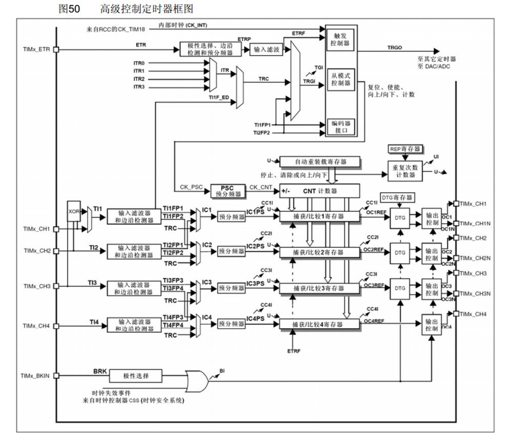


## 5.定时中断与内外时钟源选择

- 输出前的中断输出控制：置标志位，因为有很多中断，这里可以实现对中断的允许和禁止；
- 内外时钟源选择：符合前面所说的几种情况；

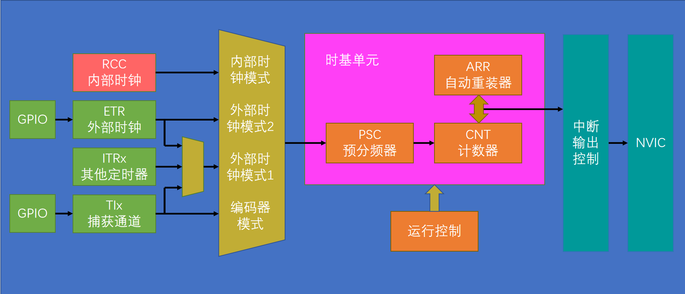


## 6.相关时序图

### 6.1 预分频器时序

- 缓冲预分频器：一个分频器供读写，另一个**缓冲分频器**才起作用，需要等一个计数周期结束后分频器系数的改变才能起作用；
- 计数器计数频率为：CK_CNT = CK_PSC / (PSC + 1)

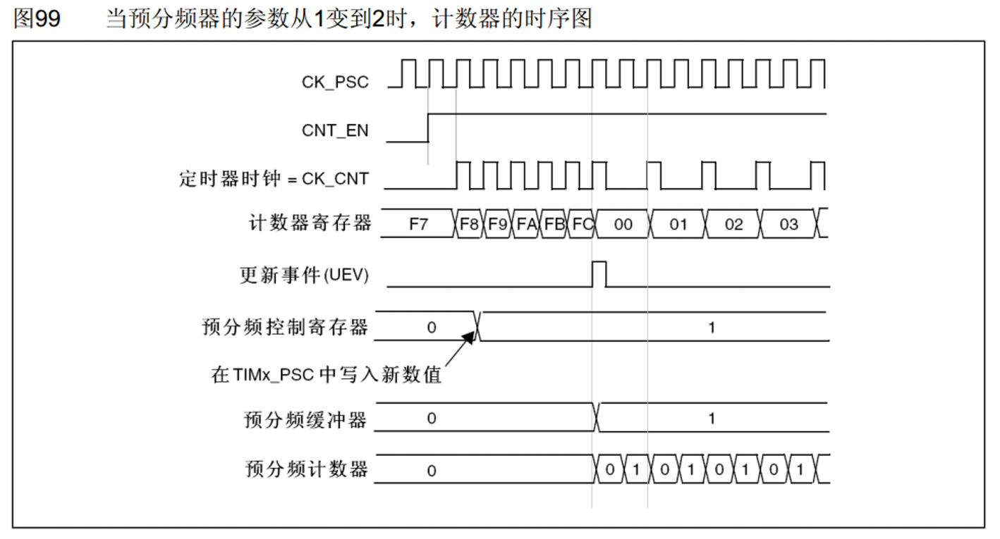

### 6.2 计数器时序

- 普通情况下的计数器时序：更新中断标志位记得手动清零

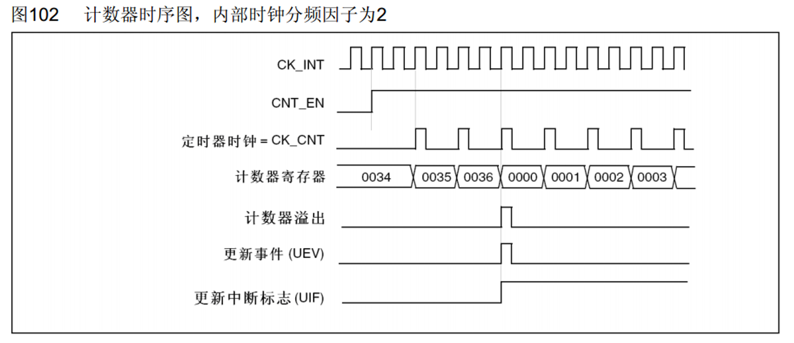

- 计数器也有影子计数器，可以设置**ARPE**来设置是否使用影子计数器；

  - 计数器无预装时序：自动重装值改变时在本周期就生效

  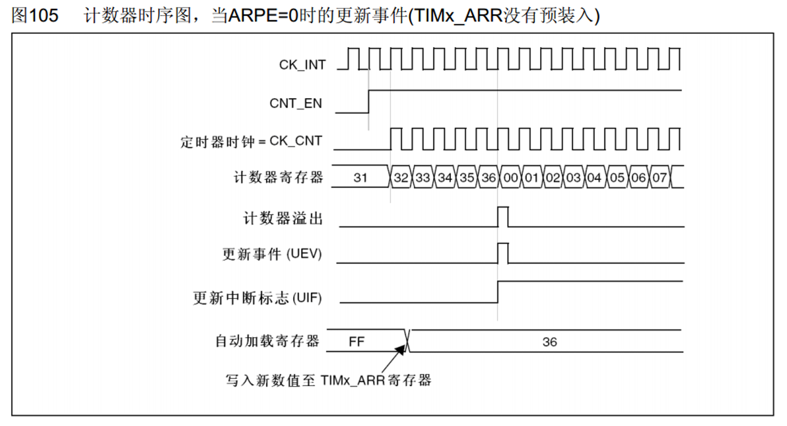

  - 计数器有预装时序：自动重装值改变时在下个周期才生效

  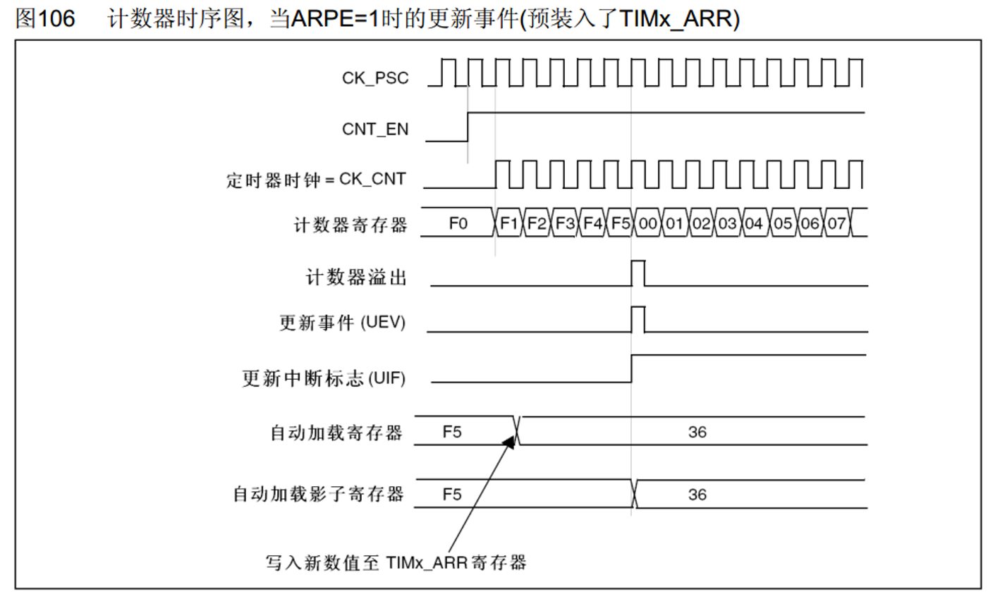

### 6.3 RCC时钟树

- **SystemInit()**函数用于配置时钟，ST公司已经写好这个程序了；
- 时钟产生电路：中间以左
  - 8MHz HSI RC：8MHz的高速内部RC振荡源；
  - 4-16MHz HSE OSC：外部高速晶振，一般接8MHz；
  - LSE OSC 32.768kHz：外部低速晶振，一般为RTC提供实时时钟；
  - LSI RC 40kHz：40kHz的内部低速RC振荡源；
  - 高速晶振提供系统时钟，为AHB、APB1和APB2总线提供时钟；
- **SystemInit()**函数配置逻辑：
  - 上电瞬间先打开HSI RC，以这个频率运行；
  - 再打开HSE，等外部晶振稳定后接入外部晶振，外部晶振经过锁相环倍频得到72MHz的系统时钟；
- 时钟分配电路：中间以右
  - SYSCLK为72MHz，接到AHB总线上，之后再分配；
  - 分配到APB1总线上的为36MHz，对于定时器单开一路，会倍频2倍，所以定时器都是72MHz；
  - 分配到APB2总线上的与AHB总线的是相同的，72MHz；
  - 分配前都有一个与门，这里就是**RCC_APB2/APB1PeriphClockCmd()**作用的地方，打开时钟就是写1，让左边的时钟能够通过与门输出给外设；

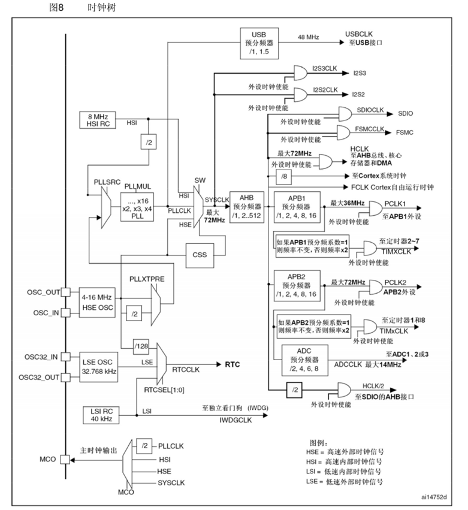

---


# 第十四节课：6-2_定时器定时中断&定时器外部时钟

## 1.定时器定时中断

## 1.1 接线图


## 1.2 定时器的相关函数——stm32f10x_tim.h文件

- 初始化相关函数：
  - void TIM_DeInit()：恢复缺省配置；
  - void TIM_TimeBaseInit()：时基单元初始化，用于配置时基单元；
  - TIM_TimeBaseStructInit()：将结构体变量赋一i个默认值；
  - **TIM_Cmd()**：用于使能计数器，对应的是运行控制；
  - **TIM_ITConfig()**：用于使能中断输出信号，对应的是中断输出控制（ITConfig函数就是使能外设的中断输出）；

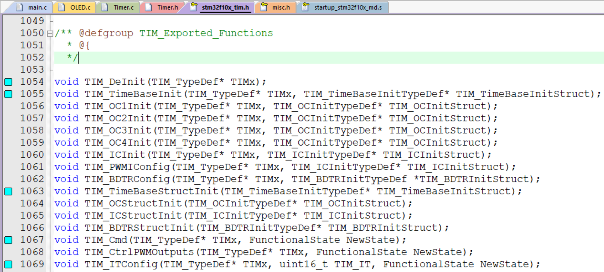

- 时钟源选择函数（这里只有五种选择，编码器模式由其他函数配置）：
  - void TIM_InternalClockConfig()：选择内部时钟；
  - void TIM_ITRxExternalClockConfig()：选择ITRx其他定时器的时钟，两个参数，第一个是指定哪个定时器，第二个是选择要接入哪个其他的定时器；
  - void TIM_TIxExternalClockConfig()：选择TIx捕获通道的时钟，四个参数，第一个是指定哪个定时器，第二个选择TIx具体的某个引脚，第三个和第四个指定输入的极性和滤波器；
  - void TIM_ETRClockMode1Config()：选择ETR通过外部时钟模式1输入的时钟，第一个参数外部触发预分频器（对ETR外部时钟再提前做一个分频），后面两个是极性和滤波器；
  - void TIM_ETRClockMode2Config()：选择ETR通过外部时钟模式2输入的时钟，参数与模式1一模一样（若不需要**触发输入**的功能，两者可以互换）；
  - void TIM_ETRConfig()：不是用来选择时钟的，单独用来配置ETR引脚的预分频器、极性、滤波器等参数；

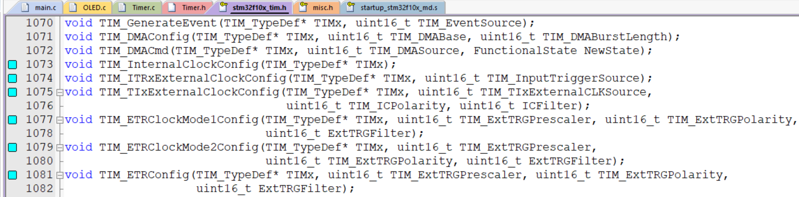

- **单独修改时基单元参数的函数**：
  - void TIM_PrescalerConfig()：用于单独配置预分频器；
  - void TIM_CounterModeConfig()：用于改变计数器的计数模式；
  - void TIM_ARRPreloadConfig()：自动重装器预装功能配置；
  - void TIM_SetCounter()：给计数器写入一个值；
  - void TIM_SetAutoreload()：给自动重装器写入一个值；
  - uint16_t TIM_GetCounter()：获取当前计数器的值；
  - uint16_t TIM_GetPrescaler()：获取当前的预分频器的值；
- 标志位相关函数：
  - FlagStatus TIM_GetFlagStatus()；
  - void TIM_ClearFlag()；
  - ITStatus TIM_GetITStatus()；
  - void TIM_ClearITPendingBit()；

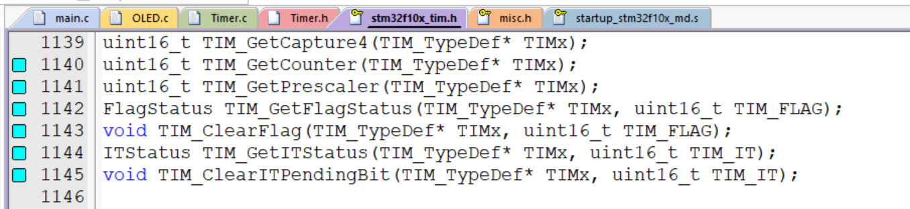

- Tips：代码的标记添加
  - 光标放在该行上，点击左上角的第一个蓝旗按钮即可在左边添加书签；

### 1.3 .c文件编程

- 由于定时器是内部资源，所以在System组中添加Timer.c和Timer.h文件
- 写定时器的**初始化函数**
  - 第一步：RCC开启时钟（基本上每个代码都是第一步），打开时钟后，定时器的基准时钟和整个外设的工作时钟就都会同时打开；
  - 第二步：选择时基单元的时钟源，对于定时中断选择内部时钟源；
  - 第三步：配置时基单元，包括预分频器、自动重装器、计数模式等，可用一个结构体配置；
  - 第四步：配置输出中断控制，允许更新中断输出到NVIC（重要）；
  - 第五步：配置NVIC，在NVIC中打开定时器中断的通道，并分配一个优先级（同上一节）；
  - 第六步：启动运行控制；
  - 第七步：整个模块配置完成后还需要使能一下计数器（不然计数器不运行）；这样定时器使能后计数器就会开始计数，当计数器更新时，触发中断；

```c
#include "stm32f10x.h"                  // Device header

//初始化定时器
void Timer_Init(void)
{
	//第一步：开启RCC时钟，注意这里使用的是APB1的开启时钟函数，因为TIM2是APB1总线的外设
	RCC_APB1PeriphClockCmd(RCC_APB1Periph_TIM2, ENABLE);
	
	//第二步：选择时基单元的时钟，选择内部时钟
	TIM_InternalClockConfig(TIM2);         //但是上电后默认的是内部时钟，这一行也可不写
	
	//第三步：配置时基单元
	TIM_TimeBaseInitTypeDef TIM_TimeBaseInitStructure;
	TIM_TimeBaseInitStructure.TIM_ClockDivision = TIM_CKD_DIV1;         //这个参数配置的是滤波器的设置，采样的频率，1分频即按内部时钟采样
	TIM_TimeBaseInitStructure.TIM_CounterMode = TIM_CounterMode_Up;     //这个参数配置计数器的模式，这里选择向上计数
	TIM_TimeBaseInitStructure.TIM_Period = 10000 - 1;                   //ARR自动重装器的值，在10K频率下计10000个数就是1s的时间
	TIM_TimeBaseInitStructure.TIM_Prescaler = 7200 - 1;                 //PSC预分频器的值，这里是对72M进行7200分频，得到10K计数频率
	TIM_TimeBaseInitStructure.TIM_RepetitionCounter = 0;                //重复计数器的值，高级定时器才有，直接给0
	TIM_TimeBaseInit(TIM2, &TIM_TimeBaseInitStructure);
	
	//第四步：使能更新中断，这样就开启了更新中断到NVIC的通路
    /*
    由于刚上电瞬间定时器为了更新分频器的缓冲寄存器的分频系数，会先产生一个中断，导致中断函数的执行，
    所以复位之后Num马上变为1了，需要手动的将更新中断的标志位清除一下
    */
	TIM_ClearFlag(TIM2, TIM_FLAG_Update);
	TIM_ITConfig(TIM2, TIM_IT_Update, ENABLE);   //使能更新中断
	
	//第五步：配置NVIC
	NVIC_PriorityGroupConfig(NVIC_PriorityGroup_2);              //选择分组二
	
	NVIC_InitTypeDef NVIC_InitStructure;
	NVIC_InitStructure.NVIC_IRQChannel = TIM2_IRQn;              //TIM2_IRQn就是定时器2在NVIC的通道
	NVIC_InitStructure.NVIC_IRQChannelCmd = ENABLE;              //直接使能
	NVIC_InitStructure.NVIC_IRQChannelPreemptionPriority = 2;     //抢占优先级
	NVIC_InitStructure.NVIC_IRQChannelSubPriority = 1;            //响应优先级
	NVIC_Init(&NVIC_InitStructure);
	
	//第六步：启动定时器，本质是使能计数器，这样定时器就可以开始工作了，当产生更新时就会触发中断
	TIM_Cmd(TIM2, ENABLE);
}

```

### 1.4 .h文件编程

```c
#ifndef __TIMER_H
#define __TIMER_H

void Timer_Init(void);

#endif

```

### 1.5 main.c文件编程

```c
#include "stm32f10x.h"                  // Device header
#include "Delay.h"
#include "OLED.h"
#include "Timer.h"

uint16_t Num;              //定义一个计数变量
/*目的是每隔一秒Num在中断函数中加1，但是这个变量是在main.c文件中的，若要在Timer.c文件中使用那就是跨文件变量，有两种方法解决*/
/***第一种：在Timer.c文件中加入extern uint16_t Num，这样编译器会自己找到main.c文件中的Num，而且两个文件操作的是同一个变量***/
/***第二种：直接复制中断函数到main.c文件中，Timer.c文件中就可以注释掉中断函数了***/

int main(void)
{
	OLED_Init();
	Timer_Init();

	OLED_ShowString(1, 1, "Num:");

	while (1)
	{
		OLED_ShowNum(1, 5, Num, 5);       //打印次数
	}
}

void TIM2_IRQHandler(void)                  //注意，中断函数名都是固定的，所以要去启动文件中找
{
	if (TIM_GetITStatus(TIM2, TIM_IT_Update == SET))       //检查中断标志位，第二个参数是看哪个中断标志位，这是因为中断向量可能对应着多个事件
	{
		Num ++;                                              //每秒自动++
		TIM_ClearITPendingBit(TIM2, TIM_IT_Update);          //手动清空标志位，放置重复进入中断
	}
}

```


## 2.定时器外部时钟——把定时器当作一个计数器

### 2.1 接线图

- 只需要在前面的基础上加入GPIO的初始化即可，**TIM2的ETR引脚即为PA0**引脚；

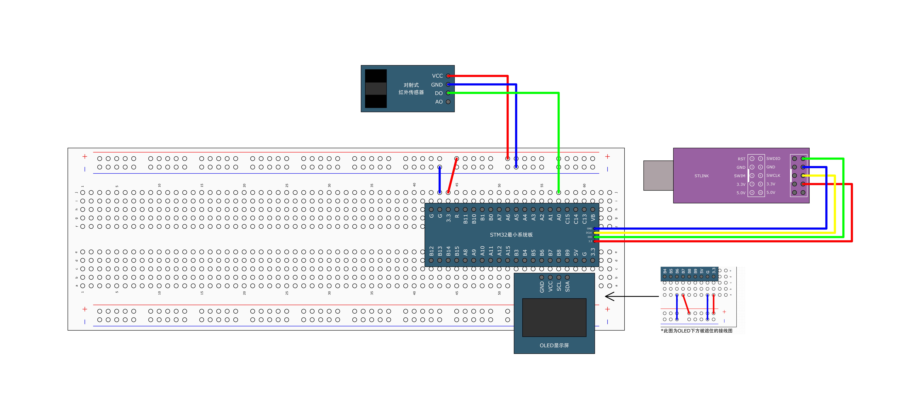

### 2.2 .c文件编程

- 更改时钟输入、添加GPIO初始化；

```c
#include "stm32f10x.h"                  // Device header

//初始化定时器
void Timer_Init(void)
{
	//第一步：开启RCC时钟，注意这里使用的是APB1的开启时钟函数，因为TIM2是APB1总线的外设
	RCC_APB1PeriphClockCmd(RCC_APB1Periph_TIM2, ENABLE);
	//使用的TIM2的ETR引脚是PA0，所以这里还需要初始化GPIO
	RCC_APB2PeriphClockCmd(RCC_APB2Periph_GPIOA, ENABLE);
	
	GPIO_InitTypeDef GPIO_InitStructure;
	GPIO_InitStructure.GPIO_Mode = GPIO_Mode_IPU;     //上拉输入
	GPIO_InitStructure.GPIO_Pin = GPIO_Pin_0;
	GPIO_InitStructure.GPIO_Speed = GPIO_Speed_50MHz;
	GPIO_Init(GPIOA, &GPIO_InitStructure);
	
	
	//第二步：选择时基单元的时钟，这里选择外部时钟
	//通过ETR的外部时钟模式2配置，第二个参数是外部触发预分频器，第三个参数是是否反向，第四个参数是外部触发滤波器
	TIM_ETRClockMode2Config(TIM2, TIM_ExtTRGPSC_OFF, TIM_ExtTRGPolarity_NonInverted, 0x00);
	
	//第三步：配置时基单元
	TIM_TimeBaseInitTypeDef TIM_TimeBaseInitStructure;
	TIM_TimeBaseInitStructure.TIM_ClockDivision = TIM_CKD_DIV1;           //这个参数配置的是滤波器的设置，采样的频率
	TIM_TimeBaseInitStructure.TIM_CounterMode = TIM_CounterMode_Up;       //这个参数配置计数器的模式，这里选择向上计数
	TIM_TimeBaseInitStructure.TIM_Period = 10 - 1;                     //ARR自动重装器的值，当从0到9时产生中断
	TIM_TimeBaseInitStructure.TIM_Prescaler = 1 - 1;                   //PSC预分频器的值，这里没有分频，每输入一个信号CNT就加1
	TIM_TimeBaseInitStructure.TIM_RepetitionCounter = 0;                  //重复计数器的值，高级定时器才有，直接给0
	TIM_TimeBaseInit(TIM2, &TIM_TimeBaseInitStructure);
	
	//第四步：使能更新中断，这样就开启了更新中断到NVIC的通路
    /*
    由于刚上电瞬间定时器为了更新分频器的缓冲寄存器的分频系数，会先产生一个中断，导致中断函数的执行，
    所以复位之后Num马上变为1了，需要手动的将更新中断的标志位清除一下
    */
	TIM_ClearFlag(TIM2, TIM_FLAG_Update);
	TIM_ITConfig(TIM2, TIM_IT_Update, ENABLE);
	
	//第五步：配置NVIC
	NVIC_PriorityGroupConfig(NVIC_PriorityGroup_2);              //选择分组二
	
	NVIC_InitTypeDef NVIC_InitStructure;
	NVIC_InitStructure.NVIC_IRQChannel = TIM2_IRQn;              //TIM2_IRQn就是定时器2在NVIC的通道
	NVIC_InitStructure.NVIC_IRQChannelCmd = ENABLE;              //直接使能
	NVIC_InitStructure.NVIC_IRQChannelPreemptionPriority = 2;     //抢占优先级
	NVIC_InitStructure.NVIC_IRQChannelSubPriority = 1;            //响应优先级
	NVIC_Init(&NVIC_InitStructure);
	
	//第六步：启动定时器，本质是使能计数器，这样定时器就可以开始工作了，当产生更新时就会触发中断
	TIM_Cmd(TIM2, ENABLE);
}

//查看CNT计数器的值的函数
uint16_t Timer_GetCounter(void)
{
	return TIM_GetCounter(TIM2);
}

```

### 2.3 .h文件编程

```c
#ifndef __TIMER_H
#define __TIMER_H

void Timer_Init(void);
uint16_t Timer_GetCounter(void);

#endif

```

### 2.4 main.c文件编程

- 分别打印CNT的值和中断值，每遮挡10次产生一次更新中断；

```c
#include "stm32f10x.h"                  // Device header
#include "Delay.h"
#include "OLED.h"
#include "Timer.h"

uint16_t Num;

int main(void)
{
	OLED_Init();
	Timer_Init();

	OLED_ShowString(1, 1, "Num:");
	OLED_ShowString(2, 1, "CNT:");

	while (1)
	{
		OLED_ShowNum(1, 5, Num, 5);                      //打印次数
		OLED_ShowNum(2, 5, Timer_GetCounter(), 5);       //打印CNT的值
	}
}

void TIM2_IRQHandler(void)                  //注意，中断函数名都是固定的，所以要去启动文件中找
{
	if (TIM_GetITStatus(TIM2, TIM_IT_Update == SET))       //检查中断标志位，第二个参数是看哪个中断标志位，这是因为中断向量可能对应着多个事件
	{
		Num ++;                                              //每秒自动++
		TIM_ClearITPendingBit(TIM2, TIM_IT_Update);          //手动清空标志位，放置重复进入中断
	}
}

```

---


# 第十五节课：6-3_TIM输出比较

## 1.输出比较简介
- 输出比较：OC，即Output Compare；
- 机理：输出比较电路通过比较**CNT计数器和CCR寄存器**（捕获/比较寄存器，是输出比较和输入捕获共用的寄存器）值的关系，对输出电平进行置1、置0或翻转的操作，用于输出**一定频率和占空比的PWM波形**；
- 每个**高级定时器和通用定时器**都拥有4个输出比较通道，且高级定时器的前3个通道额外拥有死区生成和互补输出的功能；
- 每个定时器的4个输出比较通道都是**共用一个CNT计数器的**；


## 2.PWM波简介

- PWM：即Pulse Width Modulation，即脉冲宽度调制；
- 在**具有惯性的系统**中可通过对一系列脉冲的宽度进行调制，可等效的获得所需要的模拟参量；
- PWM参数：频率、占空比、分辨率（占空比变化步距）；

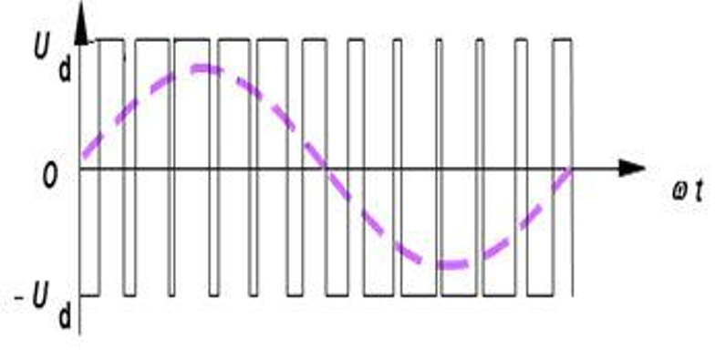


## 3.输出比较通道（通用定时器）

### 3.1 输出比较通道的电路结构

- 第一部分：前端是CNT计数器和CCR寄存器的比较结果；
- 第二部分：输出模式控制器，有**八种模式**，输入是CNT计数器和CCR寄存器的比较结果，输出是REF的高低电平，可通过多种模式来更加灵活的控制REF的输出，**这八种模式可通过寄存器来配置**；
- 第三部分：**CC1P**，极性选择器，决定是否要对PWM波取反；
- 第四部分：**CC1E**，输出使能电路，决定是否要输出；

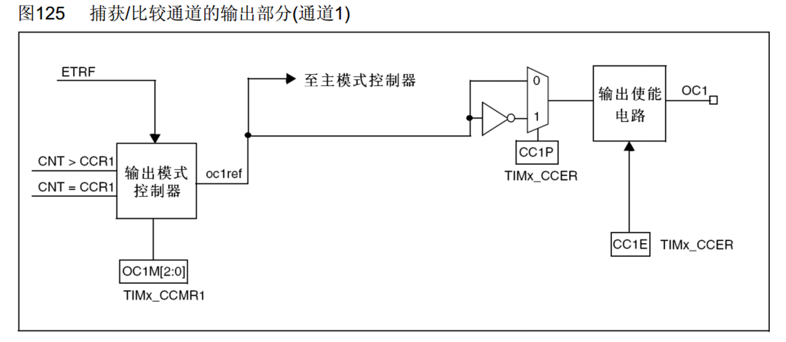

### 3.2 输出比较的八种模式

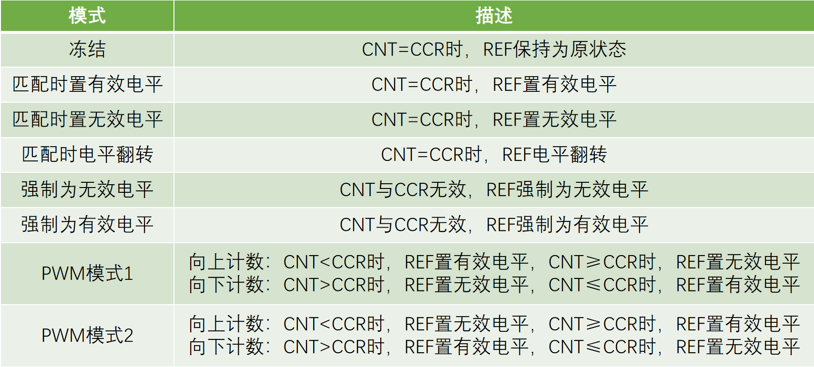

- 冻结模式：CNT=CCR时，REF保持为原状态，即CNT和CCR无效
  - 应用：当正在输出PWM波时，突然想暂停一会输出可用这个模式；
- 匹配时置有效电平：CNT=CCR时，REF置有效电平（高电平）；
- 匹配时置无效电平：CNT=CCR时，REF置无效电平（低电平）；
- 匹配时电平翻转：CNT=CCR时，REF电平翻转（可用于输出一个**占空比恒为50、频率可调的PWM波**）；
- 强制为无效电平：CNT与CCR无效，REF强制为无效电平（低电平）；
- 强制为有效电平：CNT与CCR无效，REF强制为有效电平（高电平）；
- **PWM模式1**：
  - 向上计数：CNT<CCR时，REF置有效电平，CNT≥CCR时，REF置无效电平；
  - 向下计数：CNT>CCR时，REF置无效电平，CNT≤CCR时，REF置有效电平；
- **PWM模式2**：
  - 向上计数：CNT<CCR时，REF置无效电平，CNT≥CCR时，REF置有效电平；
  - 向下计数：CNT>CCR时，REF置有效电平，CNT≤CCR时，REF置无效电平；
  - PWM模式2就是PWM模式1的取反；

- **极性问题：在模式选择的PWM模式1和模式2中可以选择极性，在输出端也是可以选择极性的，所以极性的选择是极为灵活的；**

### 3.3 高级定时器的输出比较电路结构——FOC控制器

- 用在FOC控制器中；
- 多了死区发生器，避免上下管同时导通；
- 多了互补PWM的输出；

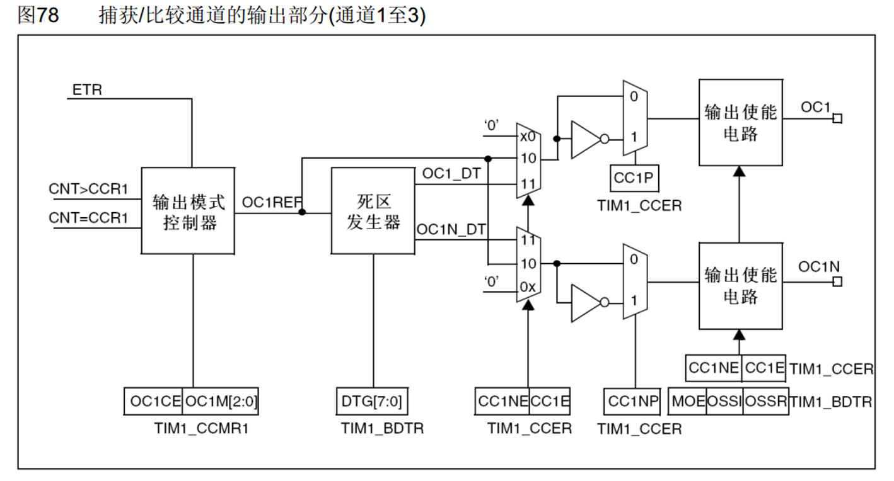


## 4.PWM基本结构

- 时基单元与运行控制：像上节课一样配置好后CNT计数器即可开始运行；
- CCR捕获/比较器：自己设定值，这样CNT计数器就会不断的和CCR进行比较；
- 模式选择控制器：根据选择的模式，当CNT和CCR的比较达成一定条件时，REF电平就可以产生不同的变化，通过极性选择和输出使能就能够输出PWM波；
- 占空比通过CCR的值进行调节，而频率可以通过CNT和ARR自动重装器的值进行调节；
- PWM的相关参数：
  - 频率：Freq = CK_PSC / (PSC + 1) / (ARR + 1)；
  - 占空比：Duty = CCR / (ARR + 1)；
  - 分辨率：Reso = 1 / (ARR + 1)；

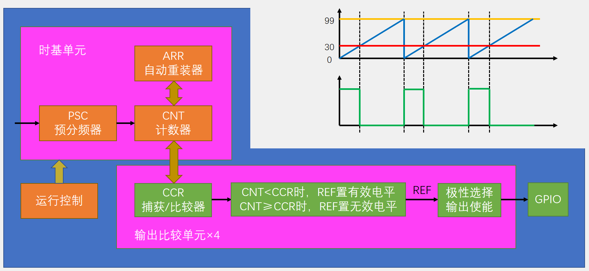


## 5.外部硬件

### 5.1 舵机

- 舵机的三条连接线：
  - 两根电源线，一根信号线（**黑地红正黄信号或棕地红正橙信号或黑负红正白信号**）；
  - 电源线需要接一个可以**输出大电流的电源**（这里可以接STLINK的5V引脚）；
- 输出的PWM信号的要求：
  - 周期为**20ms（频率为50Hz）**；
  - 高电平宽度为**0.5ms到2.5ms**；
- 在这里PWM是作为一种**通讯协议**来使用的，因为舵机内部是**带有驱动电路**的，所以可直接用单片机的引脚驱动，PWM作为一种通信线，**不需要大功率**；

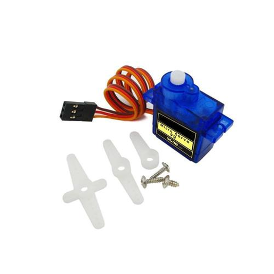

- 舵机的PWM通信协议规定：
  - 输入的PWM的周期必须为20ms；
  - 高电平脉冲时间必须在0.5ms~2.5ms之间；
  - **在180°范围内，0.5ms对应为－90°，2.5ms对应为90°**，其他角度以此类推；

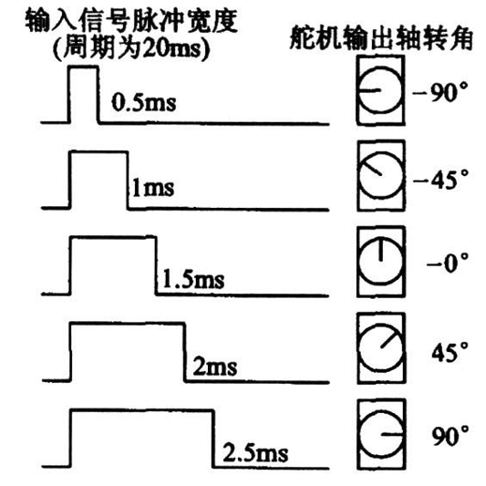

### 5.2 直流电机

- 直流电机是一种将**电能转换为机械能**的装置，有两个电极，当电极正接时，电机正转，当电极反接时，电机反转；
- 直流电机与舵机不同，它只是一个单独的电机，GPIO口无法直接驱动，所以需要一个**外挂驱动电路**来控制；
- TB6612是一款**双路H桥型的直流电机驱动芯片**，可以驱动两个直流电机并且控制其转速和方向；

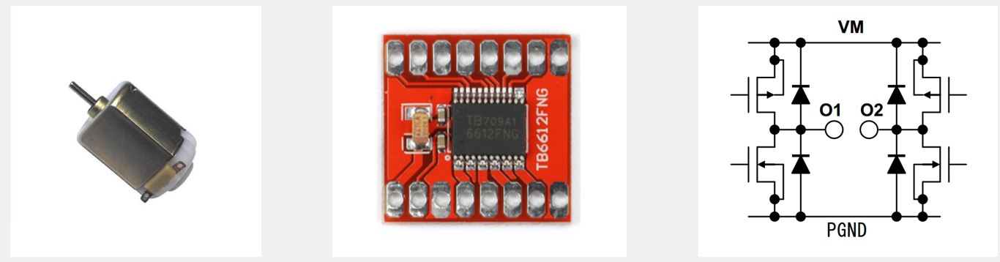

### 5.3 TB6612

- TB6612驱动板**引脚定义**：
  - VM：电机驱动电源的正极，范围是4.5V到10V，需要大功率；
  - VCC：逻辑电平输入端，范围是2.7到5.5V，要与控制器的电源保持一致（如STM32是3.3V那就接3.3V），这个引脚不需要大功率；
  - GND：接系统的负极即可，**三个GND是连通的，所以只需要接一个即可**；
  - AO1、AO2：一路电机的输出，控制一个电机
    - AO1、AO2由PWMA、AIN2、AIN1控制；
    - PWMA需要接到STM32的PWM的输出端，其他两个引脚可任意接两个普通的GPIO口；
    - AIN1和AIN2控制电机的旋转方向。PWMA控制电机的转速；
  - BO1、BO2：同理上面；
  - STBY：待机控制引脚，接GND则芯片不工作，处于待机状态；接逻辑电源VCC则正常工作（若不需要待机模式直接接3.3V即可）；
- TB6612驱动的机理
  - IN1、IN2全高全低都不工作；
  - IN1低、IN2高则反转，且PWM高才转，PWM低则不转，这样只要PWM的频率够快，即可使电机稳定的转动；
  - IN1高、IN2低则正传，且PWM高才转，PWM低则不转，这样只要PWM的频率够快，即可使电机稳定的转动；
  - 这里PWM是作为一个等效模拟量起作用的；

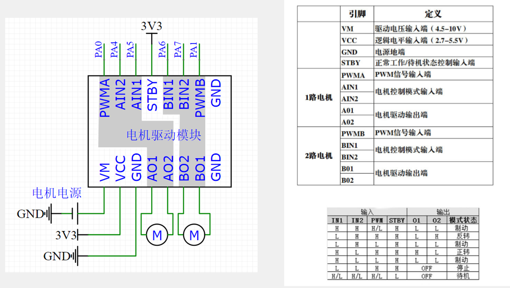

---


# 第十六节课：6-4_PWM驱动LED呼吸灯&PWM驱动舵机&PWM驱动直流电机

## 1.PWM驱动LED呼吸灯

### 1.1 接线图

- 采用正电平驱动的方法接到PA0口上；

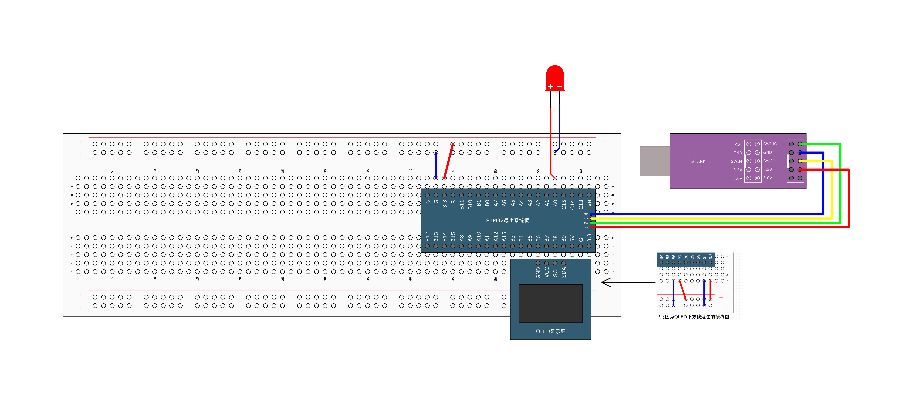

### 1.2 相关的库函数介绍——stm32f10x_tim.h文件

- **输出比较通道初始化函数**
  - void TIM_OC1Init()；
  - void TIM_OC2Init()；
  - void TIM_OC3Init()；
  - void TIM_OC4Init()；
  - void TIM_OCStructInit：为输出比较结构体赋一个默认值（用于处理高级定时器的PWM波输出问题，因为结构体初始化时有些函数对通用定时器是无用的，只有高级定时器有，但若在使用高级定时器时没有为全部成员都赋初始值，就会出现bugger）
- 配置输出比较的**极性**的相关函数
  - void TIM_OC1PolarityConfig()；
  - void TIM_OC1NPolarityConfig()；
  - void TIM_OC2PolarityConfig()；
  - void TIM_OC2NPolarityConfig()；
  - void TIM_OC3PolarityConfig()；
  - void TIM_OC3NPolarityConfig()；
  - void TIM_OC4PolarityConfig()；
  - 带N的是高级定时器中的互补通道配置，OC4无互补通道，故没有OC4N的函数；**用初始化函数也可以设置极性，只是那里是一起设置，这里是单独设置**；
- 单独修改使能参数的相关函数
  - void TIM_CCxCmd()；
  - void TIM_CCxNCmd()；
- 用于选择输出比较的模式的函数
  - void TIM_SelectOCxM()；
- 单独修改CCR寄存器的值的相关函数——用于更改占空比
  - void TIM_SetCompare1()；
  - void TIM_SetCompare2()；
  - void TIM_SetCompare3()；
  - void TIM_SetCompare4()；
- 高级定时器的相关函数
  - void TIM_CtrlPWMOutputs()：在使用高级定时器输出PWM时需要调用，否则PWM将不能正常输出

### 1.3 .c文件编程

需先在Hardware组中新建**PWM.c和PWM.h文件**。

- PWM的初始化
  - 第一步：RCC开启时钟，将要用的TIM外设和GPIO外设的时钟打开；
  - 第二步：配置时基单元，包括前面的时钟源选择和时基单元的配置（上一节课写过）；
  - 第三步：配置输出比较单元，包括CCR的值、输出比较模式、极性选择、输出使能等参数（在库函数中通过结构体配置）；
  - 第四步：配置GPIO，将PWM对应的GPIO口初始化为复用推挽输出的配置（AFIO功能复用）；
  - 第五步：运行控制，即启动计数器，这样就可以输出PWM了；

```c
#include "stm32f10x.h"                  // Device header

//PWM初始化函数
void PWM_Init(void)
{
	//第一步：开启RCC时钟，注意这里使用的是APB1的开启时钟函数，因为TIM2是APB1总线的外设
	RCC_APB1PeriphClockCmd(RCC_APB1Periph_TIM2, ENABLE);
	
	//第二步：选择时基单元的时钟，选择内部时钟
	TIM_InternalClockConfig(TIM2);         //但是上电后默认的是内部时钟，这一行也可不写
	
	//第二步：配置时基单元，因为这里不需要更新中断，所以不需要NVIC的初始化
	TIM_TimeBaseInitTypeDef TIM_TimeBaseInitStructure;
	TIM_TimeBaseInitStructure.TIM_ClockDivision = TIM_CKD_DIV1;         //这个参数配置的是滤波器的设置，采样的频率
	TIM_TimeBaseInitStructure.TIM_CounterMode = TIM_CounterMode_Up;     //这个参数配置计数器的模式，这里选择向上计数
	TIM_TimeBaseInitStructure.TIM_Period = 100 - 1;                     //ARR自动重装器的值
	TIM_TimeBaseInitStructure.TIM_Prescaler = 720 - 1;                  //PSC预分频器的值，与AAR和CCR决定PWM的输出频率和占空比
	TIM_TimeBaseInitStructure.TIM_RepetitionCounter = 0;                //重复计数器的值，高级定时器才有，直接给0
	TIM_TimeBaseInit(TIM2, &TIM_TimeBaseInitStructure);
	
	//第三步：初始化输出比较单元，初始化结构体时成员较多，但是带N和IdleState都是高级定时器的内容，可以不用列
	/*但这里还有一个问题，如果是用高级定时器输出四路PWM的话，就需要把所有结构体的成员都赋初始值，否则会出错，这里有两种方法*/
	/*第一种方法：给所有结构体的成员都赋值；
	第二种方法：给结构体赋初值，在对一些相关要修改的结构体的成员修改，其中赋初值的函数为TIM_OCStructInit*/
	TIM_OCInitTypeDef TIM_OCInitStructure;
	TIM_OCStructInit(&TIM_OCInitStructure);                          //先给结构体赋一个初值，其他的成员再重新修改
	TIM_OCInitStructure.TIM_OCMode = TIM_OCMode_PWM1;                //设置输出比较的模式
	TIM_OCInitStructure.TIM_OCPolarity = TIM_OCPolarity_High;        //设置输出比较的极性
	TIM_OCInitStructure.TIM_OutputState = TIM_OutputState_Enable;    //设置输出使能
	TIM_OCInitStructure.TIM_Pulse = 50;                              //设置CCR寄存器，与AAR和PSC决定PWM的输出频率和占空比
	TIM_OC1Init(TIM2, &TIM_OCInitStructure);                         //这里选择OC1通道是因为PA0口对应的比较输出通道是OC1
	
	//第四步：初始化GPIO
	/*外设引脚与GPIO口的复用以及重映射功能：外设的引脚复用在GPIO口上的，如我们这里要用到CH1通道，CH1通道是接在PA0口的，所以需要初始化PA0口
	  但有时候有很多外设引脚都复用在同一个GPIO口上，我们又同时需要这两个外设引脚，那就查找一下重定义引脚有没有相关外设引脚的重定义，若没有则两个不能           同时复用，若有则可以通过AFIO口来配置重映射来达到同时两个外设引脚复用的目的
	*/
	RCC_APB2PeriphClockCmd(RCC_APB2Periph_GPIOA, ENABLE);       //使能GPIOA端口时钟
	
	GPIO_InitTypeDef GPIO_InitStructure;                        //定义结构体
	GPIO_InitStructure.GPIO_Mode = GPIO_Mode_AF_PP;             //复用推挽输出模式
	GPIO_InitStructure.GPIO_Pin = GPIO_Pin_0;                   //选中0号引脚
	GPIO_InitStructure.GPIO_Speed = GPIO_Speed_50MHz;           //定义速度为50MHz
	GPIO_Init(GPIOA, &GPIO_InitStructure);                      //初始化端口
	
	//第五步：启动定时器，本质是使能计数器，这样定时器就可以开始工作了，当产生更新时就会触发中断
	TIM_Cmd(TIM2, ENABLE);
}

```

- 改变占空比的函数封装

```c
//下面这个函数用于不断更改CCR寄存器的值，通过改变CCR的值来改变占空比
void PWM_SetCompare1(uint16_t Compare)
{
	TIM_SetCompare1(TIM2, Compare);      //调用TIM_SetCompare1函数用于更改CCR寄存器的值进而改变PWM的占空比
}

```

- **引脚的重映射**

  - GPIO有三种工作状态，一种是**主功能**，一种是**默认复用功能**，一种是**重映射功能**；
  - **主功能**即GPIO初始化后的功能，**默认复用功能**即初始化后设置为复用模式时的功能，**重映射功能**需要AFIO来实现重映射；
  - 对于默认复用功能而言，它是由**”外设配置和GPIO模式“**决定的，比如前面的初始化中，我们初始化了TIM2的CH1，并将PA0设置为复用推挽输出，那它就会自动连接到TIM2的CH1，而不再需要指定是哪个默认复用功能；
  - TIM2的CH1通道连接的是PA0端口，其他的通道也对应着其他不同的引脚，一些其他的默认复用功能可能占据同一个引脚，这时如果要用的两个功能复用在了同一个引脚上的话就会产生冲突，但是STM32本身有一个重定义功能，如果重定义功能的列表中有另一个复用的引脚，那就可以用重定义对应的引脚来完成功能，但是若重定义列表中没有这个复用功能那复用的GPIO就不能挪位置，配置重映射是用AFIO来完成的；

- **AFIO的操作步骤**——把PA0挪到PA15脚上

  - 第一步：开启AFIO的时钟，AFIO是**APB2**总线上的设备，复制之前GPIO开启时钟的函数直接修改第一个参数即可；
  - 第二步：调用**GPIO_PinRemapConfig()**函数，引脚重映射配置，选择不同方式可实现对不同引脚是否使用重映射的配置；
  - 第三步：关闭PA15的调试端口JTDI功能，因为PA15上电后默认为JTDI的调试端口，所以这里要将其作为普通GPIO口或是复用定时器通道就需要关闭其JTGI功能，也是用GPIO_PinRemapConfig函数，三个参数：
    - GPIO_Remap_SWJ_NoJTRST（SWJ不变但是关闭JTRST的调试端口，对应的是解除PB4的调试功能）
    - GPIO_Remap_SWJ_JTAGDisable（SWJ不变但是关闭JTAG的调试端口）
    - GPIO_Remap_SWJ_Disable（SWD和JTAG的调试端口全部解除）
    - 如果全部都解除了就没有办法用STLINK下载程序了（如果解除了需要用串口下载一个重新把调试端口弄回来的程序）；
  - 修改后的初始化代码如下：

  ```c
  #include "stm32f10x.h"                  // Device header
  
  //PWM初始化函数
  void PWM_Init(void)
  {
  	//第一步：开启RCC时钟，注意这里使用的是APB1的开启时钟函数，因为TIM2是APB1总线的外设
  	RCC_APB1PeriphClockCmd(RCC_APB1Periph_TIM2, ENABLE);
  	
  	//第二步：选择时基单元的时钟，选择内部时钟
  	TIM_InternalClockConfig(TIM2);         //但是上电后默认的是内部时钟，这一行也可不写
  	
  	//第二步：配置时基单元，因为这里不需要更新中断，所以不需要NVIC的初始化
  	TIM_TimeBaseInitTypeDef TIM_TimeBaseInitStructure;
  	TIM_TimeBaseInitStructure.TIM_ClockDivision = TIM_CKD_DIV1;         //这个参数配置的是滤波器的设置，采样的频率
  	TIM_TimeBaseInitStructure.TIM_CounterMode = TIM_CounterMode_Up;     //这个参数配置计数器的模式，这里选择向上计数
  	TIM_TimeBaseInitStructure.TIM_Period = 100 - 1;                     //ARR自动重装器的值
  	TIM_TimeBaseInitStructure.TIM_Prescaler = 720 - 1;                  //PSC预分频器的值，与AAR和CCR决定PWM的输出频率和占空比
  	TIM_TimeBaseInitStructure.TIM_RepetitionCounter = 0;                //重复计数器的值，高级定时器才有，直接给0
  	TIM_TimeBaseInit(TIM2, &TIM_TimeBaseInitStructure);
  	
  	//第三步：初始化输出比较单元，初始化结构体时成员较多，但是带N和IdleState都是高级定时器的内容，可以不用列
  	/*但这里还有一个问题，如果是用高级定时器输出四路PWM的话，就需要把所有结构体的成员都赋初始值，否则会出错，这里有两种方法*/
  	/*第一种方法：给所有结构体的成员都赋值；
  	第二种方法：给结构体赋初值，在对一些相关要修改的结构体的成员修改，其中赋初值的函数为TIM_OCStructInit*/
  	TIM_OCInitTypeDef TIM_OCInitStructure;
  	TIM_OCStructInit(&TIM_OCInitStructure);                          //先给结构体赋一个初值，其他的成员再重新修改
  	TIM_OCInitStructure.TIM_OCMode = TIM_OCMode_PWM1;                //设置输出比较的模式
  	TIM_OCInitStructure.TIM_OCPolarity = TIM_OCPolarity_High;        //设置输出比较的极性
  	TIM_OCInitStructure.TIM_OutputState = TIM_OutputState_Enable;    //设置输出使能
  	TIM_OCInitStructure.TIM_Pulse = 50;                              //设置CCR寄存器，与AAR和PSC决定PWM的输出频率和占空比
  	TIM_OC1Init(TIM2, &TIM_OCInitStructure);                         //这里选择OC1通道是因为PA0口对应的比较输出通道是OC1
  	
  	//第四步：初始化GPIO
  	/*外设引脚与GPIO口的复用以及重映射功能：外设的引脚复用在GPIO口上的，如我们这里要用到CH1通道，CH1通道是接在PA0口的，所以需要初始化PA0口
  	  但有时候有很多外设引脚都复用在同一个GPIO口上，我们又同时需要这两个外设引脚，那就查找一下重定义引脚有没有相关外设引脚的重定义，若没有则两个不能       同时复用，若有则可以通过AFIO口来配置重映射来达到同时两个外设引脚复用的目的
  	*/
  	RCC_APB2PeriphClockCmd(RCC_APB2Periph_GPIOA, ENABLE);       //使能GPIOA端口时钟
  	
  	GPIO_InitTypeDef GPIO_InitStructure;                        //定义结构体
  	GPIO_InitStructure.GPIO_Mode = GPIO_Mode_AF_PP;             //复用推挽输出模式
  	GPIO_InitStructure.GPIO_Pin = GPIO_Pin_0;                   //选中0号引脚
  	GPIO_InitStructure.GPIO_Speed = GPIO_Speed_50MHz;           //定义速度为50MHz
  	GPIO_Init(GPIOA, &GPIO_InitStructure);                      //初始化端口
  	
  	//第五步：启动定时器，本质是使能计数器，这样定时器就可以开始工作了，当产生更新时就会触发中断
  	TIM_Cmd(TIM2, ENABLE);
  	
  	//AFIO的重映射功能，要用重映射功能则需要添加第一二句，若要解除调试功能则添加第一三句，若要重映射功能的引脚恰好是调试端口则加第一二三句，若更改了       重映射记得要更改初始化的GPIO口
  	RCC_APB2PeriphClockCmd(RCC_APB2Periph_AFIO, ENABLE);        //使能AFIO时钟，AFIO是APB2总线上的外设
  	
      //下面函数用于完成引脚重映射的配置，设置需要哪种形式的引脚重映射，这个可以查表得到，这里的引脚重映射1表示前两个重映射，后两个不重映射
  	GPIO_PinRemapConfig(GPIO_PartialRemap1_TIM2, ENABLE);
  	GPIO_PinRemapConfig(GPIO_Remap_SWJ_JTAGDisable, ENABLE);    //解除JTAG的调试，但是不解除SWD的调试
  }
  
  ```

### 1.4 .h文件编程与main.c文件编程

- .h文件编程

```c
#ifndef PWM_H
#define PWM_H

void PWM_Init(void);
void PWM_SetCompare1(uint16_t Compare);


#endif

```

- main.c文件编程

```c
#include "stm32f10x.h"                  // Device header
#include "Delay.h"
#include "OLED.h"
#include "PWM.h"

uint8_t i;                                 //定义一个变量用于存放CCR寄存器的值

int main(void)
{
	OLED_Init();                             //初始化OLED屏幕
	PWM_Init();                              //初始化PWM
	
	while (1)                                //不断循环改变CCR寄存器的值
	{
		for (i = 0; i <= 100; i++)             //先让CCR寄存器的值不断自增，实现LED呼吸灯的变亮过程
		{
			PWM_SetCompare1(i);                  //调用改变CCR寄存器值的函数改变CCR寄存器的值
			Delay_ms(10);                        //Delay10ms，防止变化太快
		}
		
		for (i = 0; i <= 100; i++)             //再让CCR寄存器的值不断自减，实现LED呼吸灯的变暗过程
		{
			PWM_SetCompare1(100 - i);            //调用改变CCR寄存器值的函数不断减小寄存器的值
			Delay_ms(10);                        //Delay10ms，防止变化太快
		}
	}
}

```

- 这样就是整个LED呼吸灯的驱动代码了；


## 2.PWM驱动舵机

### 2.1 接线图

- 选择TIM2的CH2通道PA1，并在PB1接一个按键控制舵机，接线图如下：

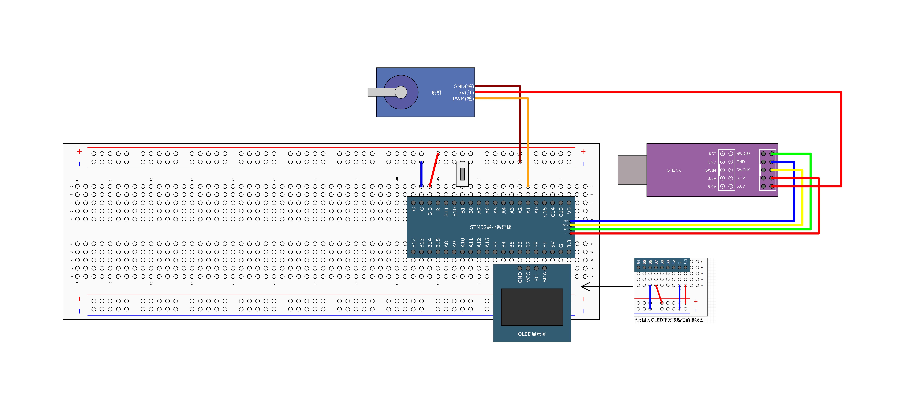

### 2.2 模块封装

在Hardware组中添加**Servo.c和Servo.h文件**；

- 修改PWM.c文件

  - 现在用的是TIM2的CH2通道，需要修改一下PWM.c文件，如下：

  ```c
  #include "stm32f10x.h"                  // Device header
  
  //PWM初始化函数
  void PWM_Init(void)
  {
  	//第一步：开启RCC时钟，注意这里使用的是APB1的开启时钟函数，因为TIM2是APB1总线的外设
  	RCC_APB1PeriphClockCmd(RCC_APB1Periph_TIM2, ENABLE);
  	
  	//第二步：选择时基单元的时钟，选择内部时钟
  	TIM_InternalClockConfig(TIM2);         //但是上电后默认的是内部时钟，这一行也可不写
  	
  	//第三步：配置时基单元，因为这里不需要更新中断，所以不需要NVIC的初始化
  	TIM_TimeBaseInitTypeDef TIM_TimeBaseInitStructure;
  	TIM_TimeBaseInitStructure.TIM_ClockDivision = TIM_CKD_DIV1;        //这个参数配置的是滤波器的设置，采样的频率
  	TIM_TimeBaseInitStructure.TIM_CounterMode = TIM_CounterMode_Up;    //这个参数配置计数器的模式，这里选择向上计数
  	TIM_TimeBaseInitStructure.TIM_Period = 20000 - 1;                  //ARR自动重装器的值
  	TIM_TimeBaseInitStructure.TIM_Prescaler = 72 - 1;                  //PSC预分频器的值，与AAR和CCR决定PWM的输出频率和占空比
  	TIM_TimeBaseInitStructure.TIM_RepetitionCounter = 0;               //重复计数器的值，高级定时器才有，直接给0
  	TIM_TimeBaseInit(TIM2, &TIM_TimeBaseInitStructure);
  	
  	//第四步：初始化输出比较单元，初始化结构体时成员较多，但是带N和IdleState都是高级定时器的内容，可以不用列
  	/*但这里还有一个问题，如果是用高级定时器输出四路PWM的话，就需要把所有结构体的成员都赋初始值，否则会出错，这里有两种方法*/
  	/*第一种方法：给所有结构体的成员都赋值；
  	第二种方法：给结构体赋初值，在对一些相关要修改的结构体的成员修改，其中赋初值的函数为TIM_OCStructInit*/
  	TIM_OCInitTypeDef TIM_OCInitStructure;
  	TIM_OCStructInit(&TIM_OCInitStructure);                           //先给结构体赋一个初值，其他的成员再重新修改
  	TIM_OCInitStructure.TIM_OCMode = TIM_OCMode_PWM1;                 //设置输出比较的模式
  	TIM_OCInitStructure.TIM_OCPolarity = TIM_OCPolarity_High;         //设置输出比较的极性
  	TIM_OCInitStructure.TIM_OutputState = TIM_OutputState_Enable;     //设置输出使能
  	TIM_OCInitStructure.TIM_Pulse = 0;                                //设置CCR寄存器
  	TIM_OC2Init(TIM2, &TIM_OCInitStructure);                          //这里选择OC2通道是因为PA1口对应的比较输出通道是OC2
  	
  	//第五步：初始化GPIO
  	RCC_APB2PeriphClockCmd(RCC_APB2Periph_GPIOA, ENABLE);       //使能GPIOA端口时钟
  	
  	GPIO_InitTypeDef GPIO_InitStructure;                        //定义结构体
  	GPIO_InitStructure.GPIO_Mode = GPIO_Mode_AF_PP;             
  	GPIO_InitStructure.GPIO_Pin = GPIO_Pin_1;                   //初始化PA1，因为使用的是通道二
  	GPIO_InitStructure.GPIO_Speed = GPIO_Speed_50MHz;           //定义速度为50MHz
  	GPIO_Init(GPIOA, &GPIO_InitStructure);                      //初始化端口
  	
  	//第四步：启动定时器，本质是使能计数器，这样定时器就可以开始工作了，当产生更新时就会触发中断
  	TIM_Cmd(TIM2, ENABLE);
  }
  
  ```

- Servo.c文件封装

```c
#include "stm32f10x.h"                  // Device header
#include "PWM.h"


void Servo_Init(void)
{
	PWM_Init();									//初始化舵机的底层PWM
}

/*
0          500
180        2500
*/
//封装一个函数，用于直接设置舵机的角度，这样mian.c文件中就不需要去配置底层的代码了
void Servo_SetAngle(float Angle)
{
	PWM_SetCompare2(Angle / 180 * 2000 + 500);	   //将角度线性变换，对应到舵机要求的占空比范围上
}

void PWM_SetCompare2(uint16_t Compare)
{
	TIM_SetCompare2(TIM2, Compare);                  //调用TIM_SetCompare2函数用于更改CCR寄存器的值进而改变PWM的占空比
}

```

- Servo.h文件封装

```c
#ifndef __SERVO_H
#define __SERVO_H

void Servo_Init(void);
void Servo_SetAngle(float Angle);

#endif

```

- main.c文件

```c
#include "stm32f10x.h"                  // Device header
#include "Delay.h"
#include "OLED.h"
#include "Servo.h"
#include "Key.h"

uint8_t KeyNum;			//定义用于接收键码的变量
float Angle;			//定义角度变量

int main(void)
{
	/*模块初始化*/
	OLED_Init();		                         //OLED初始化
	Servo_Init();		                         //舵机初始化
	Key_Init();			                         //按键初始化

	OLED_ShowString(1, 1, "Angle:");	         //1行1列显示字符串Angle:
	
	while (1)
	{
		KeyNum = Key_GetNum();                 //获取按键值，判断是否按下
		if (KeyNum == 1)                       //若按下
		{
			Angle += 30;                         //角度加30度
			if (Angle > 180)                     //若角度大于180度
			{
				Angle = 0;                         //清零
			}
		}
		Servo_SetAngle(Angle);
		OLED_ShowNum(1, 7, Angle, 3);
	}
}

```


## 3.PWM驱动直流电机
### 3.1 接线图

- TB6612驱动电机，相应的引脚如下：
  - STBY待机引脚直接接3.3V；
  - PWMA接PA2，对应TIM2的CH3；
  - AIN1和AIN2随便接两个GPIO即可，这里接PA4和PA5；
  - PB1仍然接一个按键；

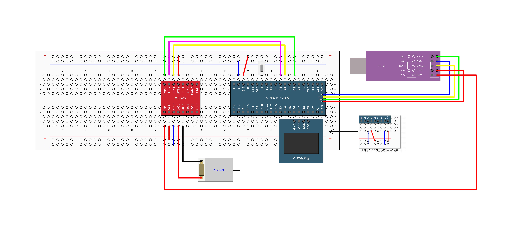

### 3.2 模块封装

在Hardware组中添加**Motor.c和Motor.h文件**；

- PWM.c文件编程

  - 修改通道；
  - 修改改变占空比的函数封装；

  ```c
  #include "stm32f10x.h"                  // Device header
  
  //PWM初始化函数
  void PWM_Init(void)
  {
  	//第一步：开启RCC时钟，注意这里使用的是APB1的开启时钟函数，因为TIM2是APB1总线的外设
  	RCC_APB1PeriphClockCmd(RCC_APB1Periph_TIM2, ENABLE);
  	
  	//第二步：选择时基单元的时钟，选择内部时钟
  	TIM_InternalClockConfig(TIM2);         //但是上电后默认的是内部时钟，这一行也可不写
  	
  	//第三步：配置时基单元，因为这里不需要更新中断，所以不需要NVIC的初始化
  	TIM_TimeBaseInitTypeDef TIM_TimeBaseInitStructure;
  	TIM_TimeBaseInitStructure.TIM_ClockDivision = TIM_CKD_DIV1;           //这个参数配置的是滤波器的设置，采样的频率
  	TIM_TimeBaseInitStructure.TIM_CounterMode = TIM_CounterMode_Up;       //这个参数配置计数器的模式，这里选择向上计数
  	TIM_TimeBaseInitStructure.TIM_Period = 100 - 1;                       //ARR自动重装器的值
  	TIM_TimeBaseInitStructure.TIM_Prescaler = 36 - 1;                    //PSC预分频器的值
  	TIM_TimeBaseInitStructure.TIM_RepetitionCounter = 0;                  //重复计数器的值，高级定时器才有，直接给0
  	TIM_TimeBaseInit(TIM2, &TIM_TimeBaseInitStructure);
  	
  	//第四步：初始化输出比较单元，初始化结构体时成员较多，但是带N和IdleState都是高级定时器的内容，可以不用列
  	TIM_OCInitTypeDef TIM_OCInitStructure;
  	TIM_OCStructInit(&TIM_OCInitStructure);                                 //先给结构体赋一个初值，其他的成员再重新修改
  	TIM_OCInitStructure.TIM_OCMode = TIM_OCMode_PWM1;                       //设置输出比较的模式
  	TIM_OCInitStructure.TIM_OCPolarity = TIM_OCPolarity_High;               //设置输出比较的极性
  	TIM_OCInitStructure.TIM_OutputState = TIM_OutputState_Enable;           //设置输出使能
  	TIM_OCInitStructure.TIM_Pulse = 50;                                     //设置CCR寄存器，与AAR和PSC决定PWM的输出频率和占空比
  	TIM_OC3Init(TIM2, &TIM_OCInitStructure);                                //这里选择OC3通道是因为PA2口对应的比较输出通道是OC3
  	
  	//第五步：初始化GPIO
  	RCC_APB2PeriphClockCmd(RCC_APB2Periph_GPIOA, ENABLE);       //使能GPIOA端口时钟
  	
  	GPIO_InitTypeDef GPIO_InitStructure;                        //定义结构体
  	/*这里的模式需要选择复用推挽输出，这是因为一般的推挽输出的控制权是直接由输出数据寄存器来控制的但是如果我们想要用输出比较功能
  	那接的是片上外设TIM2的CH3通道，所以需要把输出数据寄存器断开，接到片上外设TIM2的CH3通道*/
  	GPIO_InitStructure.GPIO_Mode = GPIO_Mode_AF_PP;             
  	GPIO_InitStructure.GPIO_Pin = GPIO_Pin_2;                   //驱动直流电机用了通道3，所以这里选择初始化PA2
  	GPIO_InitStructure.GPIO_Speed = GPIO_Speed_50MHz;           //定义速度为50MHz
  	GPIO_Init(GPIOA, &GPIO_InitStructure);                      //初始化端口
  	
  	//第四步：启动定时器，本质是使能计数器，这样定时器就可以开始工作了，当产生更新时就会触发中断
  	TIM_Cmd(TIM2, ENABLE);
  }
  
  //下面这个函数用于不断更改CCR寄存器的值，通过改变CCR的值来改变占空比
  void PWM_SetCompare3(uint16_t Compare)
  {
  	TIM_SetCompare3(TIM2, Compare);                             //调用TIM_SetCompare3函数用于更改CCR寄存器的值进而改变PWM的占空比
  }
  
  ```

- PWM.h文件编程

  - 修改改变占空比的函数即可；

  ```c
  #ifndef PWM_H
  #define PWM_H
  
  void PWM_Init(void);
  void PWM_SetCompare3(uint16_t Compare);
  
  #endif
  
  ```

- Motor.c文件编程

```c
#include "stm32f10x.h"                  // Device header
#include "PWM.h"

//定义电机初始化函数，底层还是PWM的初始化和GPIO的初始化
void Motor_Init(void)
{
	RCC_APB2PeriphClockCmd(RCC_APB2Periph_GPIOA, ENABLE);       //使能GPIOA端口时钟
	
	GPIO_InitTypeDef GPIO_InitStructure;                        //定义结构体
	GPIO_InitStructure.GPIO_Mode = GPIO_Mode_Out_PP;            //定义结构体的模式为推挽输出
	GPIO_InitStructure.GPIO_Pin = GPIO_Pin_4 | GPIO_Pin_5;      //选中4号引脚和5号引脚，来控制电机的转向
	GPIO_InitStructure.GPIO_Speed = GPIO_Speed_50MHz;           //定义速度为50MHz
	GPIO_Init(GPIOA, &GPIO_InitStructure);                      //初始化端口
	
	PWM_Init();
}

//定义电机速度的函数
void Motor_SetSpeed(int8_t Speed)
{
	if (Speed >= 0)
	{
		GPIO_SetBits(GPIOA, GPIO_Pin_4);                            //这里设置PA4为高、PA5为低时是正转的方向
		GPIO_ResetBits(GPIOA, GPIO_Pin_5);
		PWM_SetCompare3(Speed);
	}
	else
	{
		GPIO_ResetBits(GPIOA, GPIO_Pin_4);                          //这里设置PA4为低、PA5为高时是反转的方向
		GPIO_SetBits(GPIOA, GPIO_Pin_5);
		PWM_SetCompare3(-Speed);                                    //因为这里Speed是负数，所以需要取负
	}
}

```

- Motor.h文件编程

```c
#ifndef __MOTOR_H
#define __MOTOR_H

void Motor_Init(void);
void Motor_SetSpeed(int8_t Speed);

#endif

```

- main.c文件编程

```c
#include "stm32f10x.h"                  // Device header
#include "Delay.h"
#include "OLED.h"
#include "Motor.h"                      //这里不需要再用到PWM.h底层了，只需要用Motor.h调用封装即可
#include "Key.h"

uint8_t KeyNum;                         //获取键码
int8_t Speed;                           //定义速度，-100到100

int main(void)
{
	OLED_Init();                             //初始化OLED屏幕
	Motor_Init();                            //初始化电机，底层是初始化PWM
	Key_Init();                              //初始化按键
	
	OLED_ShowString(1, 1, "Speed:");

	while (1)                                //不断循环改变CCR寄存器的值
	{
		KeyNum = Key_GetNum();                 //获取键码
		if (KeyNum == 1)                       //判断是否按下按键
		{
			Speed += 20;                         //按下按键则速度自加20
			if (Speed > 100)                     //如果达到了最大速度，则反转至最大速度
			{
				Speed = -100;
			}
		}
		Motor_SetSpeed(Speed);                 //设置速度
		OLED_ShowNum(1, 7, Speed, 3);          //打印速度
	}
}

```

---


# 第十七节课：6-5_TIM捕获输入

## 1.输入捕获简介
- 输入捕获：Input Capture，简称IC；
- 作用：输入捕获模式下，当**通道输入引脚出现指定电平跳动时**，当前CNT的值将被锁存到CCR中，可用于测量PWM波形的频率、占空比、脉冲间隔、电平持续时间等参数；
- 数量：每个高级和通用定时器都拥有4个输入捕获通道（基本定时器没有）；
- 模式：可配置为**PWMI模式（即PWM的输入模式）**，同时测量**频率和占空比**；
- 可配合**主从触发模式，实现硬件全自动测量**；
- 同一定时器的同一通道**不能同时使用输入捕获和输出比较，但是不同通道可以**；
- 定时器的几大部分如下图所示：
  - ①为时基单元；
  - ②为内外时钟源选择部分；
  - ③为输出比较部分；
  - ④为输入捕获部分；

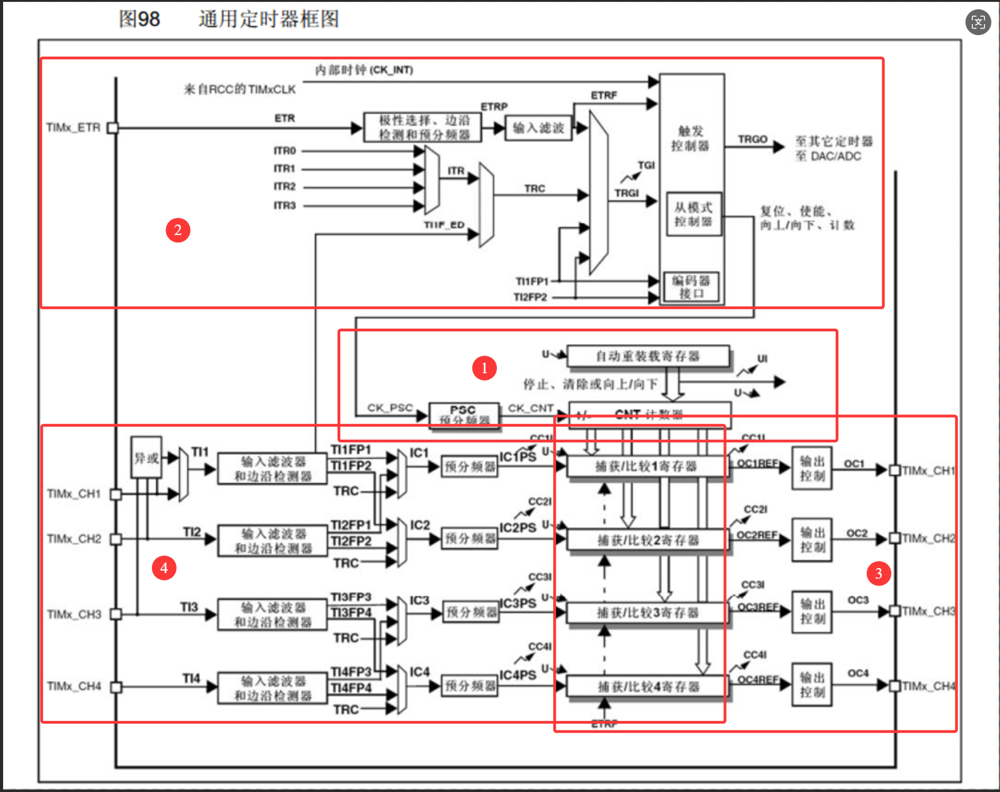


## 2.频率测量的相关方法

- STM32只能测数字信号；
- **测频法**
  - 在闸门时间T内计数上升沿/下降沿；
  - 适合高频率；
  - 频率为fx=N/T；
  - 利用之前的外部中断即可实现测频法；
- **测周法**
  - 两个上升沿内，以标准频率fc计次，得到N，则频率为fx=fc/N
  - 适合低频率；
  - **输入捕获指的就是测周法**；
- **中界频率**
  - 测频法和测周法误差相等的频率点，fm=fc/T求根号；

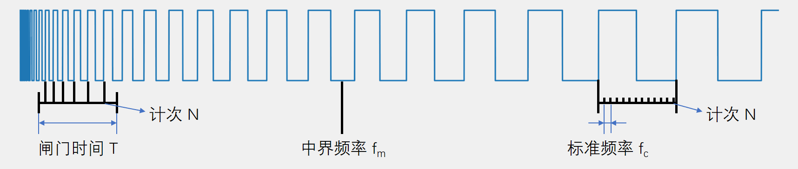


## 3.测周法测频率——输入捕获

- 机理：当引脚有指定的电平跳动时时，CNT的值被锁存到CCR寄存器 ，而CNT的时钟是内部的标准时钟驱动的，那CNT锁存入CCR寄存器的值就是两个电平跳动之间的计次数，即可测出时间，取倒数即为频率；
- 每次捕获之后熬将CNT清零，可通过主从触发模式来自动完成；
- 输入捕获的执行流程
  - **异或门可对三路输入做边沿检测，主要用在三项无刷电机的霍尔传感器检测上**，若不选择异或门则四路单独工作；
  - 对于输入滤波部分，实际上存在两个输入滤波，实现了TI1FP1和TI1FP2的交叉连接，可实现通道拓展，可实现**PWMI功能**；
  - 当CNT计数值写入CCR捕获/比较寄存器后，可选择**触发中断**；

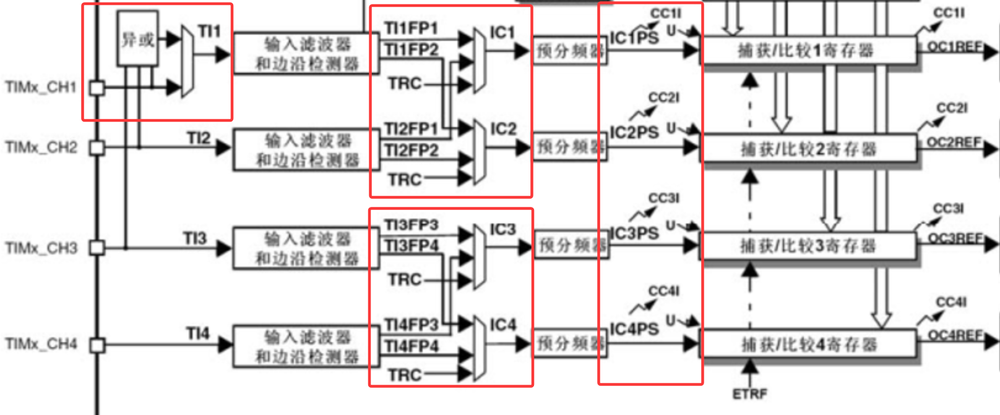

- 单个通道的电路结构
  - 对于通道1和通道2存在相互交叉的连接；
  - **捕获信号可通向从模式控制器，实现CNT值的自动清零**；

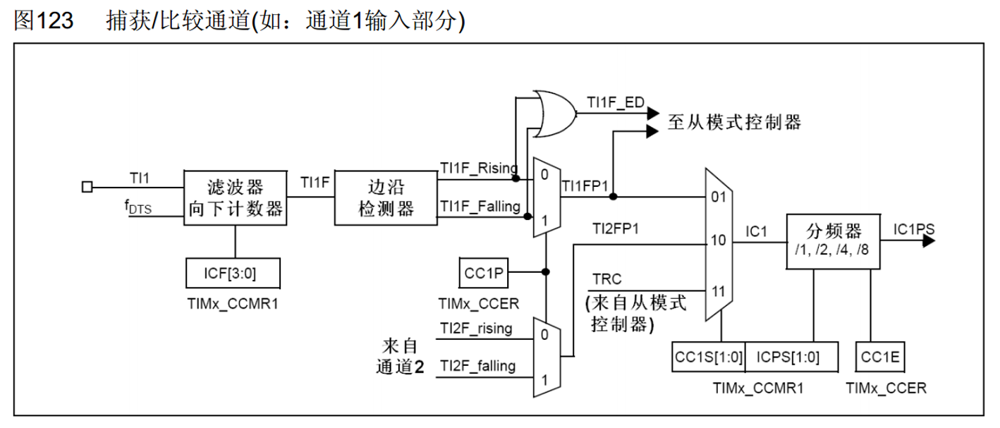


## 4.主从触发模式——完成硬件的自动化（定时器的进阶操作）

- 主从触发模式：即主模式、从模式与触发源选择三者的统称；

- 主模式：将**定时器内部的信号映射到TRGO引脚，用于触发别的外设**完成硬件的自动化；
- 从模式：接收**其他外设或者自身外设的一些信号，用于控制自身定时器的运行**，即被别的信号控制，也可以完成硬件的自动化；
- 触发源选择
  - 即**选择从模式的触发信号源**，可看作是从模式的一部；
  - 触发源选择，选择指定的一个信号，得到TRGI，TRGI去触发从模式，从模式从列表里选择一项自动执行；
  - 在这里选择TI1FP1触发源，从模式选择Reset即可实现CNT计数值的自动清零；
- 这三部分对应着三个函数，直接调用函数配置即可；

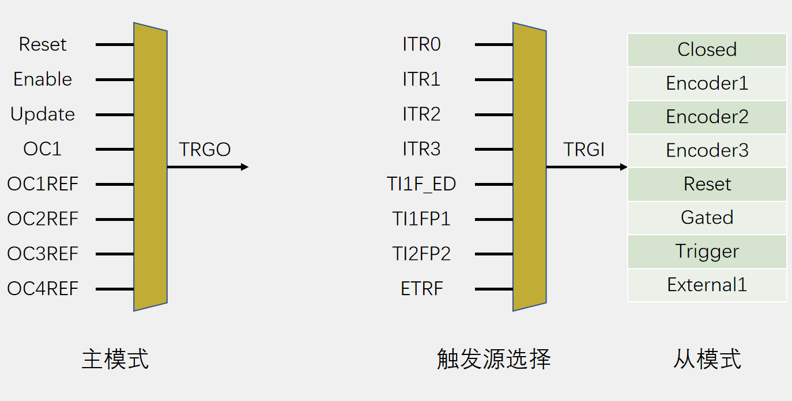


## 5.输入捕获的框图总结

### 5.1 输入捕获基本结构

- 只选择了一个通道，即一个引脚直接输入到自己的一路，只能测频率；
- 输入引脚输入电平信号，一路经过**自输入到CCR寄存器**，一路TI1FP1经过**从模式用于清零CNT的计数值**；
- **注意事项**
  - 从模式中触发源**只有TI1FP1和TI2FP2**，所以要使用从模式自动清零CNT的话只能用通道1和通道2；
  - 若采用通道3和通道4就只能通过**触发中断**的方式来实现手动清零了；

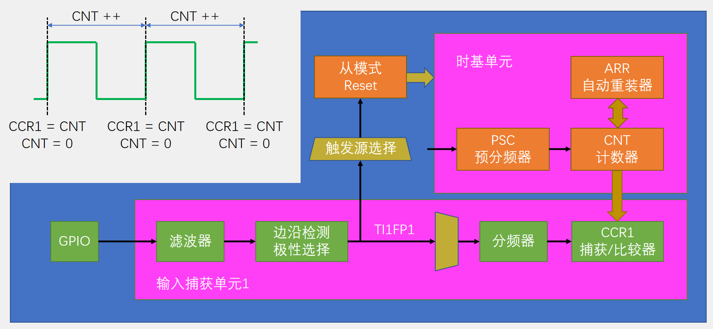

### 5.2 PWMI基本结构

- 基本结构：使用两个通道同时捕获一个引脚；
- 工作流程：
  - 通道1的TI1FP1经过自己的一路，且通道1的TI1FP2通向通道2；
  - 即通过交叉通道去触发通道2的捕获单元，两个的电平跳变是相反的，一个上升沿，一个下降沿；
  - 这样CCR2捕获高电平的时间，CCR1捕获低电平的时间，两者相除即得占空比；

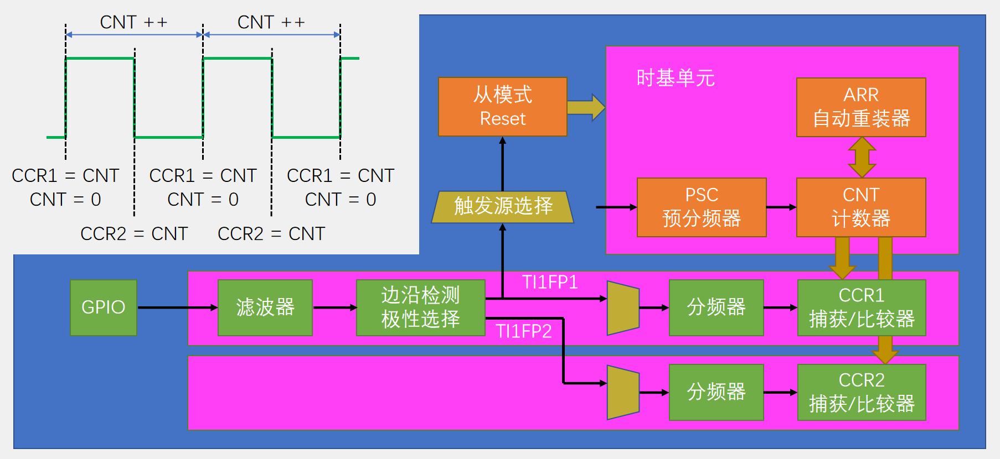

---


# 第十八节课：6-6_输入捕获模式测频率&PWMI模式测频率占空比

## 1.输入捕获模式测频率

### 1.1 接线图

- PA0脚输出PWM，PA6（定时器3的CH1通道）脚用输入捕获模式测频率；

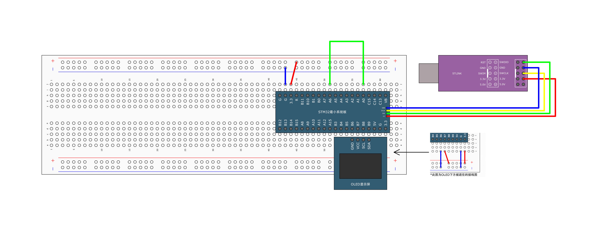

### 1.2 库函数介绍

- TIM_ICInit()：对某一个通道进行输入捕获的初始化；
- TIM_PWMIConfig()：对PWMI模式的输入捕获进行初始化；
- TIM_ICStructInit()：为输入捕获结构体赋一个初始值；
- TIM_SelectInputTrigger()：选择输入触发源TRGI；
- TIM_SelectOutputTrigger()：选择输出触发源TRGO；
- TIM_SelectSlaveMode()：选择从模式；
- TIM_SetIC1/2/3/4Prescaler()：分别单独配置通道1、2、3、4的分频器；
- TIM_GetCapture1/2/3/4()：分别读取4个通道的CCR寄存器；


### 1.3 模块封装

- 先前PWM模块的完善

  - 在呼吸灯的代码PWM.c文件的基础上，增加修改频率的函数：

  ```c
  //写一个函数用于单独修改PWM的频率，这里固定ARR寄存器的值，只通过PSC的值来改变PWM的频率，这样就不会影响占空比了
  void PWM_SetPrescaler(uint16_t Prescaler)
  {
  	TIM_PrescalerConfig(TIM2, Prescaler, TIM_PSCReloadMode_Immediate);
  }
  
  ```

- 输入捕获封装

  - 在Hardware组中添加IC.c和IC.h文件；
  - 输入捕获的初始化步骤：
    - 第一步：RCC开启时钟，把GPIO和TIM的时钟打开；
    - 第二步：GPIO初始化，把GPIO配置为输入模式，选择上拉输入或是浮空输入模式；
    - 第三步：配置时基单元，让CNT计数器在内部时钟的驱动下自增运行；
    - 第四步：配置输入捕获单元，包括滤波器、极性、直连通道还是交叉通道、分频器等；
    - 第五步：选择从模式的触发源，触发源选择为TI1FP1，调用一个函数给一个参数即可；
    - 第六步：选择触发后执行的操作，执行Reset操作，这里也是调用一个函数即可；
    - 第七步：调用TIM_Cmd函数，开启定时器；

  ```c
  #include "stm32f10x.h"                  // Device header
  
  void IC_Init(void)
  {
  	//第一步：开启RCC时钟，注意这里使用的是APB1的开启时钟函数，因为TIM3是APB1总线的外设，这里因为需要用TIM2输出PWM，所以输入捕获使用TIM3
  	RCC_APB1PeriphClockCmd(RCC_APB1Periph_TIM3, ENABLE);
  	
  	//第二步：配置时基单元，因为这里不需要更新中断，所以不需要NVIC的初始化
  	TIM_InternalClockConfig(TIM3);                                        //选择内部时钟，且是TIM3
  	TIM_TimeBaseInitTypeDef TIM_TimeBaseInitStructure;
  	TIM_TimeBaseInitStructure.TIM_ClockDivision = TIM_CKD_DIV1;           //这个参数配置的是滤波器的设置，采样的频率
  	TIM_TimeBaseInitStructure.TIM_CounterMode = TIM_CounterMode_Up;       //这个参数配置计数器的模式，这里选择向上计数
  	TIM_TimeBaseInitStructure.TIM_Period = 65536 - 1;                     //ARR自动重装器的值，防止溢出，这里给最大
  	TIM_TimeBaseInitStructure.TIM_Prescaler = 72 - 1;                   //PSC预分频器的值，这个参数决定了基准频率，这里给1MHz
  	TIM_TimeBaseInitStructure.TIM_RepetitionCounter = 0;                  //重复计数器的值，高级定时器才有，直接给0
  	TIM_TimeBaseInit(TIM3, &TIM_TimeBaseInitStructure);
  	
  	//第三步：初始化GPIO
  	RCC_APB2PeriphClockCmd(RCC_APB2Periph_GPIOA, ENABLE);       //使能GPIOA端口时钟
  	GPIO_InitTypeDef GPIO_InitStructure;                        //定义结构体
  	GPIO_InitStructure.GPIO_Mode = GPIO_Mode_IPU;               //输入模式
  	GPIO_InitStructure.GPIO_Pin = GPIO_Pin_6;                   //这里选择TIM3的通道1，对应的引脚是PA6，所以需要选中PA6
  	GPIO_InitStructure.GPIO_Speed = GPIO_Speed_50MHz;           //定义速度为50MHz
  	GPIO_Init(GPIOA, &GPIO_InitStructure);                      //初始化端口
  	
  	//第四步：初始化捕获单元，每一个结构体成员对应电路的一个结构
  	TIM_ICInitTypeDef TIM_ICInitStructure;
  	TIM_ICInitStructure.TIM_Channel = TIM_Channel_1;                      //选择配置哪个通道，这里选择通道1
  	TIM_ICInitStructure.TIM_ICFilter = 0xF;                               //滤波器，但是不会更改信号的频率
  	TIM_ICInitStructure.TIM_ICPolarity = TIM_ICPolarity_Rising;           //选择极性，选择上升沿触发
  	TIM_ICInitStructure.TIM_ICPrescaler = TIM_ICPSC_DIV1;                 //选择分频器，这里选择不分频
  	TIM_ICInitStructure.TIM_ICSelection = TIM_ICSelection_DirectTI;       //这里选择通道，选择直连通道
  	TIM_ICInit(TIM3, &TIM_ICInitStructure);                               //初始化捕获单元
  	
  	//第五步：配置TRGI的触发源为TI1FP1以设置从模式用于自动清零CNT
  	TIM_SelectInputTrigger(TIM3, TIM_TS_TI1FP1);                          //选择触发源为TF1FP1
  	TIM_SelectSlaveMode(TIM3, TIM_SlaveMode_Reset);                       //选择从模式为Reset
  	
  	//第六步：使能计数器以启动定时器
  	TIM_Cmd(TIM3, ENABLE);
  }
  
  ```

  - 获取频率的函数封装

  ```c
  //定义一个函数用于求频率
  uint32_t IC_GetFreq(void)
  {
  	return 1000000 / (TIM_GetCapture1(TIM3) + 1);        //1000000对应的是经过PSC分频后的基准频率，再调用函数即可读取CCR的值
  }
  
  ```

  - IC.h文件编程

  ```c
  #ifndef __IC_H
  #define __IC_H
  
  void IC_Init(void);
  uint32_t IC_GetFreq(void);
  
  #endif
  
  ```

- main.c文件编程

```c
#include "stm32f10x.h"                  // Device header
#include "Delay.h"
#include "OLED.h"
#include "PWM.h"
#include "IC.h"

int main(void)
{
	OLED_Init();                             //初始化OLED屏幕
	PWM_Init();                              //初始化PWM
	IC_Init();                               //初始化整个电路
	
	OLED_ShowString(1, 1, "Freq:00000Hz");
	
	//下面两句将待测信号输出到PA0
	PWM_SetPrescaler(720 - 1);               //Freq = 72M / (PSC + 1) / (ARR + 1)(现在ARR+1是100)
	PWM_SetCompare1(50);                     //Duty = CCR / (ARR + 1)(现在ARR+1是100)
	
	while (1)                                //不断循环改变CCR寄存器的值
	{
		OLED_ShowNum(1, 6, IC_GetFreq(), 5);   //不断刷新频率显示
	}
}

```


## 2.PWMI模式测频率占空比

- IC.c文件中只需要更改一下初始化部分，并加一个获取占空比的函数即可

```c
#include "stm32f10x.h"                  // Device header

void IC_Init(void)
{
	//第一步：开启RCC时钟，注意这里使用的是APB1的开启时钟函数，因为TIM3是APB1总线的外设，这里因为需要用TIM2输出PWM，所以输入捕获使用TIM3
	RCC_APB1PeriphClockCmd(RCC_APB1Periph_TIM3, ENABLE);
	
	//第二步：配置时基单元，因为这里不需要更新中断，所以不需要NVIC的初始化
	TIM_InternalClockConfig(TIM3);                                        //选择内部时钟，且是TIM3
	TIM_TimeBaseInitTypeDef TIM_TimeBaseInitStructure;
	TIM_TimeBaseInitStructure.TIM_ClockDivision = TIM_CKD_DIV1;           //这个参数配置的是滤波器的设置，采样的频率
	TIM_TimeBaseInitStructure.TIM_CounterMode = TIM_CounterMode_Up;       //这个参数配置计数器的模式，这里选择向上计数
	/*
	频率测量分析：这里PSC的基准频率是1MHz，而ARR的最大值是65535，所以最低频率是15Hz，若想下限更小则加大PSC的值
	而对于上限值应该为1MHz，即最大的基准频率，但是频率越高误差也越大，所以需要看误差来定义上限，若想增大上限就需要要减小PSC的值
	*/
	TIM_TimeBaseInitStructure.TIM_Period = 65536 - 1;                     //ARR自动重装器的值，防止溢出，这里给最大
	TIM_TimeBaseInitStructure.TIM_Prescaler = 72 - 1;                     //PSC预分频器的值，这个参数决定了基准频率，这里给1MHz
	TIM_TimeBaseInitStructure.TIM_RepetitionCounter = 0;                  //重复计数器的值，高级定时器才有，直接给0
	TIM_TimeBaseInit(TIM3, &TIM_TimeBaseInitStructure);
	
	//第三步：初始化GPIO
	RCC_APB2PeriphClockCmd(RCC_APB2Periph_GPIOA, ENABLE);       //使能GPIOA端口时钟
	GPIO_InitTypeDef GPIO_InitStructure;                        //定义结构体
	GPIO_InitStructure.GPIO_Mode = GPIO_Mode_IPU;               //输入模式
	GPIO_InitStructure.GPIO_Pin = GPIO_Pin_6;                   //这里选择TIM3的通道1，对应的引脚是PA6，所以需要选中PA6
	GPIO_InitStructure.GPIO_Speed = GPIO_Speed_50MHz;           //定义速度为50MHz
	GPIO_Init(GPIOA, &GPIO_InitStructure);                      //初始化端口
	
	//第四步：初始化捕获单元，每一个结构体成员对应电路的一个结构
	TIM_ICInitTypeDef TIM_ICInitStructure;
	TIM_ICInitStructure.TIM_Channel = TIM_Channel_1;                      //选择配置哪个通道，这里选择通道1
	TIM_ICInitStructure.TIM_ICFilter = 0xF;                               //滤波器，但是不会更改信号的频率
	TIM_ICInitStructure.TIM_ICPolarity = TIM_ICPolarity_Rising;           //选择极性，选择上升沿触发
	TIM_ICInitStructure.TIM_ICPrescaler = TIM_ICPSC_DIV1;                 //选择分频器，这里选择不分频
	TIM_ICInitStructure.TIM_ICSelection = TIM_ICSelection_DirectTI;       //这里选择通道，选择直连通道
	/*PWMI配置函数，这里前面选择了通道1的直连、上升沿触发，这个函数会自动的帮我们完成交叉连、下降沿触发等配置
	但是这个函数只能配置通道1和通道2，不要传入通道三*/
	TIM_PWMIConfig(TIM3, &TIM_ICInitStructure);
	
	//第五步：配置TRGI的触发源为TI1FP1以设置从模式用于自动清零CNT
	TIM_SelectInputTrigger(TIM3, TIM_TS_TI1FP1);                          //选择触发源为TF1FP1
	TIM_SelectSlaveMode(TIM3, TIM_SlaveMode_Reset);                       //选择从模式为Reset
	
	//第六步：使能计数器以启动定时器
	TIM_Cmd(TIM3, ENABLE);
}

//定义一个函数用于求频率
uint32_t IC_GetFreq(void)
{
	return 1000000 / (TIM_GetCapture1(TIM3) + 1);       //1000000对应的是经过PSC分频后的基准频率，再调用函数即可读取CCR的值
}

//再写一个获取占空比的函数
uint32_t IC_GetDuty(void)
{
	return (TIM_GetCapture2(TIM3) + 1) * 100 / (TIM_GetCapture1(TIM3) + 1);     //乘100转换为百分比
}

```

- main.c文件编程

```c
#include "stm32f10x.h"                  // Device header
#include "Delay.h"
#include "OLED.h"
#include "PWM.h"
#include "IC.h"

int main(void)
{
	OLED_Init();                             //初始化OLED屏幕
	PWM_Init();                              //初始化PWM
	IC_Init();                               //初始化整个电路
	
	OLED_ShowString(1, 1, "Freq:00000Hz");
	OLED_ShowString(2, 1, "Duty:00%");
	
	//下面两句将待测信号输出到PA0
	PWM_SetPrescaler(720 - 1);               //Freq = 72M / (PSC + 1) / (ARR + 1)(现在ARR+1是100)
	PWM_SetCompare1(50);                     //Duty = CCR / (ARR + 1)(现在ARR+1是100)
	
	while (1)                                //不断循环改变CCR寄存器的值
	{
		OLED_ShowNum(1, 6, IC_GetFreq(), 5);   //不断刷新频率显示频率
		OLED_ShowNum(2, 6, IC_GetDuty(), 5);   //不断刷新频率显示占空比
	}
}

```

- 这样就可以同时测量频率和占空比了，主要是PWMI的初始化那里是重要的；

---


# 第十九节课：6-7_TIM编码器接口

## 1.编码器接口简介
- Encoder Interface，即编码器接口；
- **编码器接口的机理**
  - 编码器接口可接收增量（正交）编码器的信号，根据编码器旋转产生的正交信号脉冲，自动控制CNT自增或自减；
  - CNT的自增/自减可以指示编码器的位置、旋转方向和旋转速度；
  - 旋转编码器产生两路输出，接入到STM32定时器的编码器接口，编码器接口就会自动控制定时器时基单元中的CNT计数器进行自增或自减；
- 数量：每个高级定时器和通用定时器都拥有**一个**编码器接口；
- 由于编码器接口的数量脚少，可以采用中断的方式测速，这就是**用软件资源弥补硬件资源**；
- 引脚：两个输入引脚接用了输入捕获的通道1和通道2，即编码器接口的输入占据了定时器的CH1和CH2引脚；


## 2.正交编码器

- 当编码器的旋转轴转起来时，可输出两路正交的信号；
- 速度：旋转轴转的越快，方波的频率就越高，也就表示速度越快；
- 方向：正转时，A相提前B相90度，当反转时，A相落后B相90度（相对的）；
- **编码器接口的执行逻辑**
  - 分别列出正转和反转的边沿状态与另一相状态的对应表;
  - 当两个相有任一个出现**边沿跳变**时都计数自增或自减，而**自增还是自减取决于对应的另一相状态的正转还是反转**；
- 应用场景：编码器主要用在电机测速上，由编码器获得速度值再进行PID闭环控制，在高速测速中一般采用霍尔传感器或是光栅传感器；

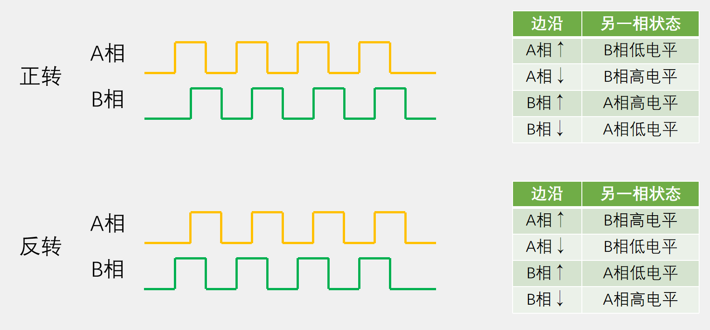


## 3.编码器的电路结构

- 编码器的输入部分：
  - 两个输入引脚接到**TI1FP1和TI2FP2**上，就是定时器输入捕获的**CH1和CH2通道**；
  - 输入捕获的滤波器、极性选择器等仍有用，但预分频器等与编码器无关；
- 编码器的输出部分:
  - 输出就是从模式控制器；
  - 根据表格规定当有边沿信号时对CNT计数器进行自增或者是自减；
  - 但是在这里**72MHz的内部时钟和时基单元初始化时设置的计数方向都是不会使用的，因为这时CNT是处于编码器的托管状态下**；

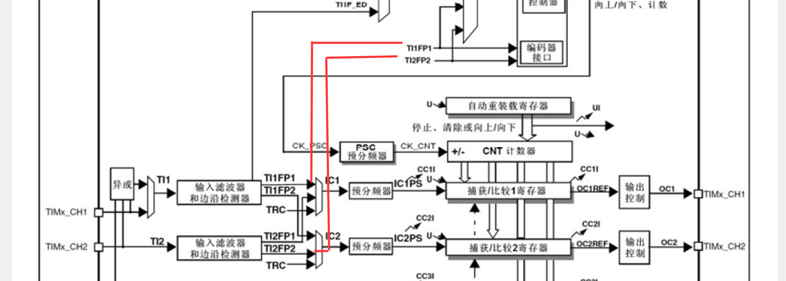

- 编码器电路结构的框图总结

  - **ARR重装器也是有用的，用于获得补码，更好的区分方向**；

  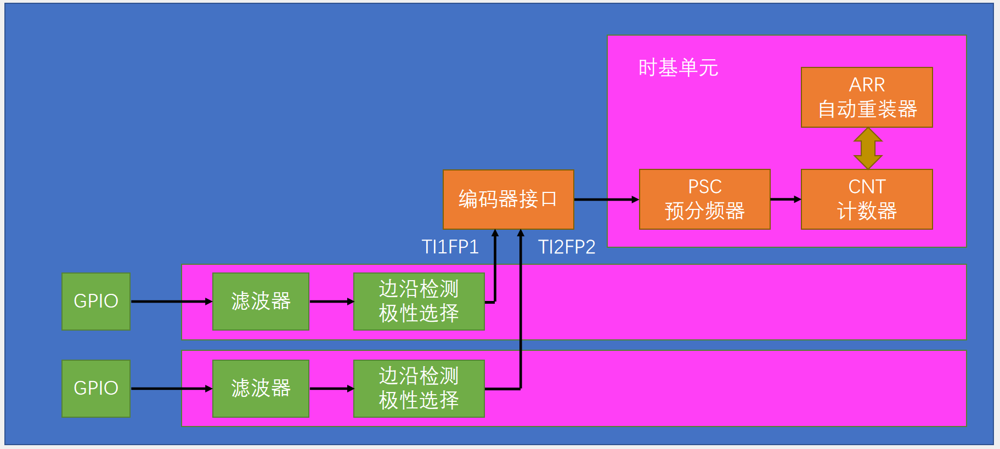


## 4.三种工作模式

- 仅在TI1计数：**只在TI1FP1的接口有电平跳变**时才计数；
- 仅在TI2计数：**只在TI2FP2的接口有电平跳变**时才计数；
- 在TI1和TI2都计数：**TI1FP1和TI2FP2有电平跳变**时都计数；
- 一般都**采用第三种方式**，它的精度更高；

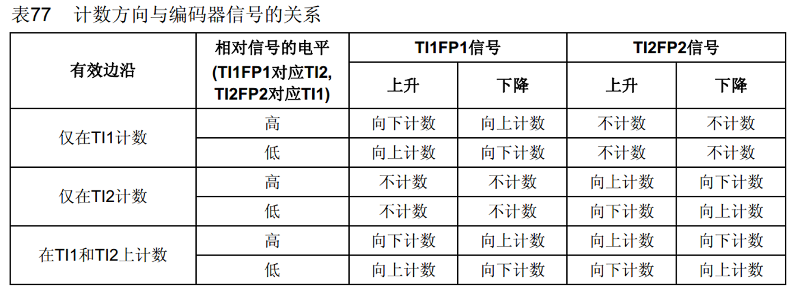

- **两个实例**：这里的反相**指输入捕获对应的极性选择，选择上升沿为不反相，下降沿为反相，但对于整个编码器接口AB相的上升沿和下降沿都是有效的**；

  - 实例1：TI1、TI2都不反相；
  - 注意正交编码器抗噪声功能；

  

  - 实例2：TI1反相

  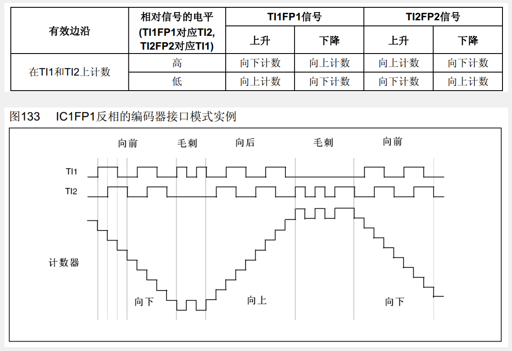

---


# 第二十节课：6-8_编码器接口测速

## 1.接线图

- A相接PA6，B相接PA7，对应了TIM3的CH1和CH2通道；

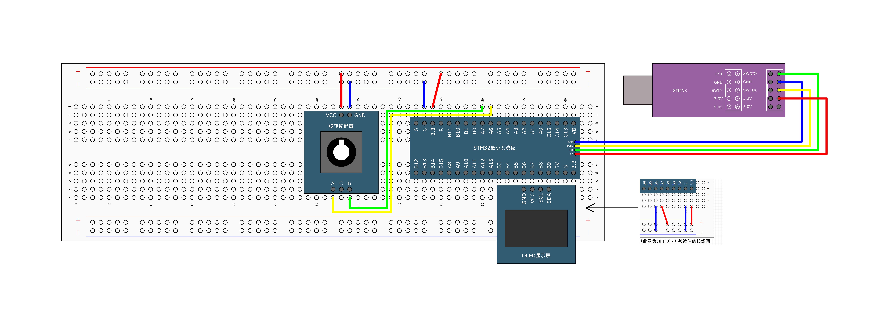


## 2.模块封装

在Hardware组中添加Encoder.c和Encoder.h文件；

### 2.1 Encoder.c文件编程

- 编码器初始化的步骤

  - 第一步：RCC开启时钟，开启GPIO和定时器的时钟；
  - 第二步：配置GPIO，需要将PA6和PA7配置成输入模式；
  - 第三步：配置时基单元，这里预分频器一般选择不分频，自动重装给最大65535，只需要一个CNT执行计数即可；
  - 第四步：配置输入捕获单元，只需要配置极性和滤波器两个参数；
  - 第五步：配置编码器接口模式；
  - 第六步：调用TIM_Cmd()启动定时器；

  ```c
  #include "stm32f10x.h"                  // Device header
  
  void Encoder_Init(void)
  {
  	//第一步：开启RCC时钟，注意这里使用的是APB1的开启时钟函数，因为TIM3是APB1总线的外设，这里因为需要用TIM2输出PWM，所以输入捕获使用TIM3
  	RCC_APB1PeriphClockCmd(RCC_APB1Periph_TIM3, ENABLE);
  	
  	//第二步：配置时基单元，因为这里不需要更新中断，所以不需要NVIC的初始化
  	TIM_TimeBaseInitTypeDef TIM_TimeBaseInitStructure;
  	TIM_TimeBaseInitStructure.TIM_ClockDivision = TIM_CKD_DIV1;           //这个参数配置的是滤波器的设置，采样的频率
  	TIM_TimeBaseInitStructure.TIM_CounterMode = TIM_CounterMode_Up;       //这个参数配置计数器的模式，这里选择向上计数
  	TIM_TimeBaseInitStructure.TIM_Period = 65536 - 1;                     //ARR自动重装器的值，防止溢出，这里给最大
  	TIM_TimeBaseInitStructure.TIM_Prescaler = 1 - 1;                      //这里不需要分频
  	TIM_TimeBaseInitStructure.TIM_RepetitionCounter = 0;                  //重复计数器的值，高级定时器才有，直接给0
  	TIM_TimeBaseInit(TIM3, &TIM_TimeBaseInitStructure);
  	
  	//第三步：初始化GPIO
  	RCC_APB2PeriphClockCmd(RCC_APB2Periph_GPIOA, ENABLE);       //使能GPIOA端口时钟
  	GPIO_InitTypeDef GPIO_InitStructure;                        //定义结构体
  	GPIO_InitStructure.GPIO_Mode = GPIO_Mode_IPU;               //输入模式
  	GPIO_InitStructure.GPIO_Pin = GPIO_Pin_6 | GPIO_Pin_7;      //这里选择TIM3的通道1和通道2，对应的引脚是PA6和PA7
  	GPIO_InitStructure.GPIO_Speed = GPIO_Speed_50MHz;           //定义速度为50MHz
  	GPIO_Init(GPIOA, &GPIO_InitStructure);                      //初始化端口
  	
  	//第四步：初始化捕获单元，每一个结构体成员对应电路的一个结构，但这里只使用了滤波器和极性选择
  	TIM_ICInitTypeDef TIM_ICInitStructure;
  	TIM_ICStructInit(&TIM_ICInitStructure);                   //因为这里有些参数没有用到，所以没有赋初值，需要用该函数统一赋初值
  	//初始化通道1
  	TIM_ICInitStructure.TIM_Channel = TIM_Channel_1;                      //选择配置哪个通道，这里选择通道1
  	TIM_ICInitStructure.TIM_ICFilter = 0xF;                               //滤波器，但是不会更改信号的频率
  	TIM_ICInitStructure.TIM_ICPolarity = TIM_ICPolarity_Rising;           //选择极性，但是这里不代表上升沿有效，而是指高低电平不反转
  	TIM_ICInit(TIM3, &TIM_ICInitStructure);                               //初始化捕获单元
  	//初始化通道2
  	TIM_ICInitStructure.TIM_Channel = TIM_Channel_2;                      //选择配置哪个通道，这里选择通道2
  	TIM_ICInitStructure.TIM_ICFilter = 0xF;                               //滤波器，但是不会更改信号的频率
  	TIM_ICInitStructure.TIM_ICPolarity = TIM_ICPolarity_Rising;           //选择极性，但是这里不代表上升沿有效，而是指高低电平不反转
  	TIM_ICInit(TIM3, &TIM_ICInitStructure);                               //初始化捕获单元
  	
  	//第五步：配置编码器接口
      //这里后面的两个参数和前面设置的Rising参数是一样的
  	TIM_EncoderInterfaceConfig(TIM3, TIM_EncoderMode_TI12, TIM_ICPolarity_Rising, TIM_ICPolarity_Rising);
      
  	//第六步：使能计数器
  	TIM_Cmd(TIM3, ENABLE);
  }
  
  ```

- 封装获取速度的函数

```c
//定义一个读取速度的函数，用int变量显示负数，利用补码特性
int16_t Encoder_Get(void)
{
	int16_t Temp;                            //定义临时存放变量
	Temp = TIM_GetCounter(TIM3);             //获取当前CNT的值
	TIM_SetCounter(TIM3, 0);                 //将CNT的值清零
	return Temp;                             //返回CNT的值
}

```

### 2.2 .h文件编程

```c
#ifndef __ENCODER_H
#define __ENCODER_H

void Encoder_Init(void);
int16_t Encoder_Get(void);

#endif

```

### 2.3 main.c文件编程

- 为防止在主循环中放入Delay函数阻塞，这里采用定时器中断来获取速度值；

```c
#include "stm32f10x.h"                  // Device header
#include "Delay.h"
#include "OLED.h"
#include "Timer.h"
#include "Encoder.h"

int16_t Speed;              //定义一个计数变量

int main(void)
{
	//初始化
	OLED_Init();
	Timer_Init();
	Encoder_Init();

	OLED_ShowString(1, 1, "Speed:");

	while (1)
	{
		//主循环中不要放入Delay函数，防止阻塞，所以这里用了后面的定时中断的代码
		OLED_ShowSignedNum(1, 7, Speed, 5);       //打印速度，用这个函数可以显示负数
	}
}

void TIM2_IRQHandler(void)                  //注意，中断函数名都是固定的，所以要去启动文件中找
{
	if (TIM_GetITStatus(TIM2, TIM_IT_Update == SET))       //检查中断标志位，第二个参数是看哪个中断标志位，这是因为中断向量可能对应着多个事件
	{
		Speed = Encoder_Get();                               //用Speed返回这个时间内的计数值
		TIM_ClearITPendingBit(TIM2, TIM_IT_Update);          //手动清空标志位，放置重复进入中断
	}
}

```

---


# 第二十一节课：7-1_ADC模数转换器

## 1.ADC简介
- ADC定义：即模拟-数字转换器；
- 作用：可将引脚上**连续变化的模拟电压转换为内存中存储的数字变量**，建立模拟电路到数字电路的桥梁；
- STM32中的ADC的类型 ：是**12位逐次逼近型ADC，最高数字位为4095，1us**转换时间；
- 转换关系：
  - 输入电压范围是：0~3.3V；
  - 对应的转换结果范围是：0~4095；
- 数量：**18**个输入通道，可测量：
  - **16**个外部信号源：即**16**个GPIO口；
  - **2**个内部信号源：**内部温度传感器和内部参考电压**；
- STM32的ADC的**增强功能**
  - 具有**规则组和注入组**两个转换单元；
  - 普通的ADC：启动一次才能读取一次数据；
  - STM32的ADC：**可以列一个组，一次性启动一个组，连续转换多个值**；
  - STM32的组有两类：
    - 一类为**规则组，用于常规使用**；
    - 一类为**注入组，用于突发事件使用**；
- 模拟看门狗：
  - 自动监测输入电压范围，可用于**监测阈值**，不需要手动读值；
  - 即高于某个阈值或低于某个阈值的判断可**用模拟看门狗来自动执行**，当高于或低于某个阈值时，看门狗会申请中断，可在中断函数中执行相应的操作；
- STM32F103C8T6的ADC资源：
  - 只有10个外部输入通道；
  - 有ADC1和ADC2两个模数转换器；


## 2.逐次逼近型ADC

### 2.1 逐次逼近型ADC介绍

- 通道选择开关、地址锁存和译码构成了**数据选择器**功能，可从8路通道中选择一路进行转换；
- 逐次逼近寄存器SAR在CLOCK驱动下，不断向DAC输出编码，经DAC转换为模拟电压，在比较器中与输入电压比较，直到两者近乎相等；
- 最后的SAR编码数据经8位三态锁存缓冲器输出；

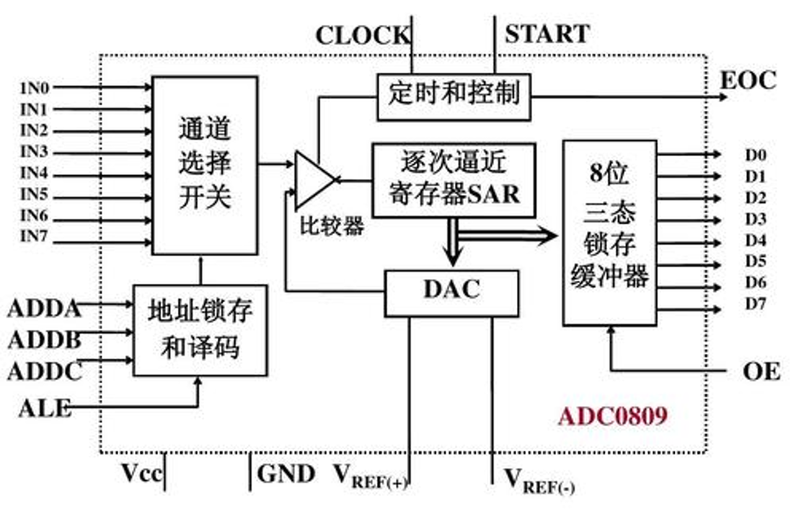

### 2.2 STM32内部的逐次逼近型ADC介绍

- 输入通道及其选择部分
  - **ADCx_IN0~ADCx_IN15＋温度传感器＋VREFINT**，一共16个输入通道，通过模拟多路开关选择指定的通道；
  - 模拟多路开关可**同时选择多路通道**进行转化，可分两种情况：
    - 对于规则通道，可同时选中16路通道，但规则通道数据寄存器**只有1个**，需要配合**DMA**数据转运才能得到16个通道的转换数据；
    - 对于注入通道，可同时选中4路通道，且注入通道数据寄存器**有4个**，可存4路的转换结果，是ADC中的VIP；

- 触发转换部分：即**START信号**，主要有两种，分别为软件触发和硬件触发

  - 软件触发：可以在程序中手动**调用一条代码启动转换**；
  - 硬件触发：通过**硬件触发源**进行触发，也分为注入组和规则组；
    - 这些触发源主要来自于**定时器**，若采用定时中断的方法一段时间就来一次中断那中断过多；
    - 定时器的主模式：TIM3的**更新事件选择为TRGO输出**，ADC开始触发信号选择TIM3的TRGO，TIM3的更新事件就**自动触发ADC转换**了，不申请中断；
    - 除此之外还可以通过**外部中断引脚触发转换**（相当于是手动的）；

  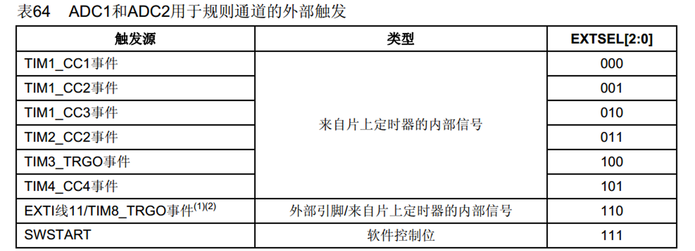

- 电源部分

  - VSSA与VDDA是ADC的电源输入；
  - VREF＋与VREF－是ADC的参考电压；

- 时钟部分：即CLOCK时钟

  - ADCCLK：来自于ADC的预分频器；
  - 预分频器本质是来源于RCC的，最大是14MHz；
  - 由于72MHz经2分频和4分频后都大于14MHz，所以只能选择6分频的12MHz和8分频的9MHz；

  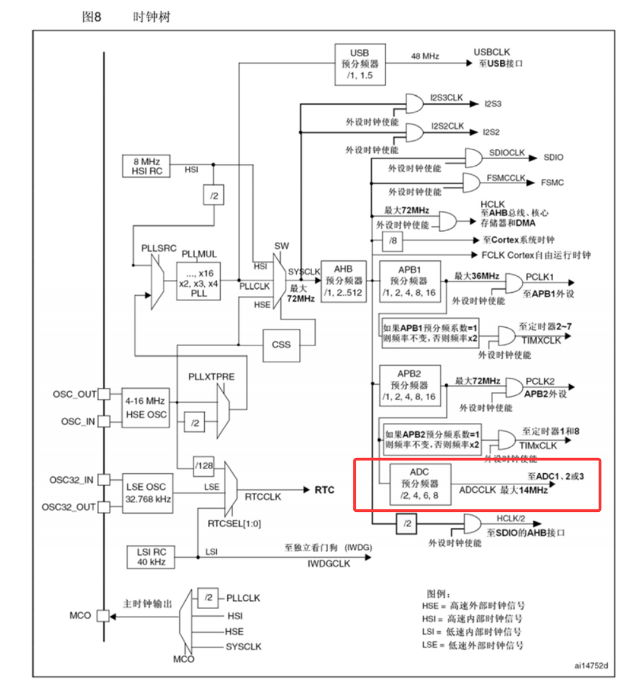

- DMA请求部分

  - 用于转移转换的数据，防止数据覆盖，用在规则通道的多通道转换中；

- **模拟看门狗部分**

  - 可指定阈值低限和阈值高限来关注它看门的通道，若超过阈值（大于阈值高限和低于阈值低限）则**申请中断通向NVIC**；

- EOC完成信号部分

  - EOC是规则组的完成信号，JEOC是注入组的完成信号；
  - 这两个信号会在状态寄存器里置一个标志位，读取标志位即可知道是否已经转换结束；
  - 同时**这两个标志位也能去到NVIC申请中断**；

- 开关控制部分

  - 在库函数中对应**ADC_Cmd()**函数，用于给ADC上电；

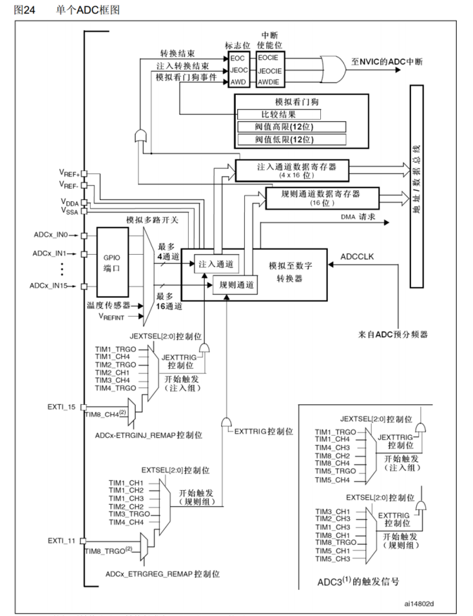


## 3.ADC基本结构框图

- 整体框图如下：
  - 其结构与上一部分的框图完全对应，只是隐藏了细节；

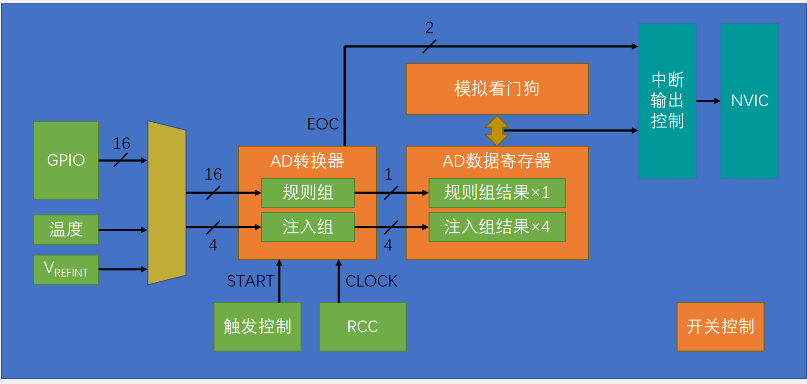

- 输入通道引脚映射：
  - 对应了从IN0到IN9，一共是10个通道，且ADC1和ADC2的引脚都是相同的；
  - ADC1和ADC2的引脚相同可组成**双ADC模式**，可设置为**同步模式/交叉模式**，可提高**采样率**；
  - 只有ADC1有通道16和通道17；

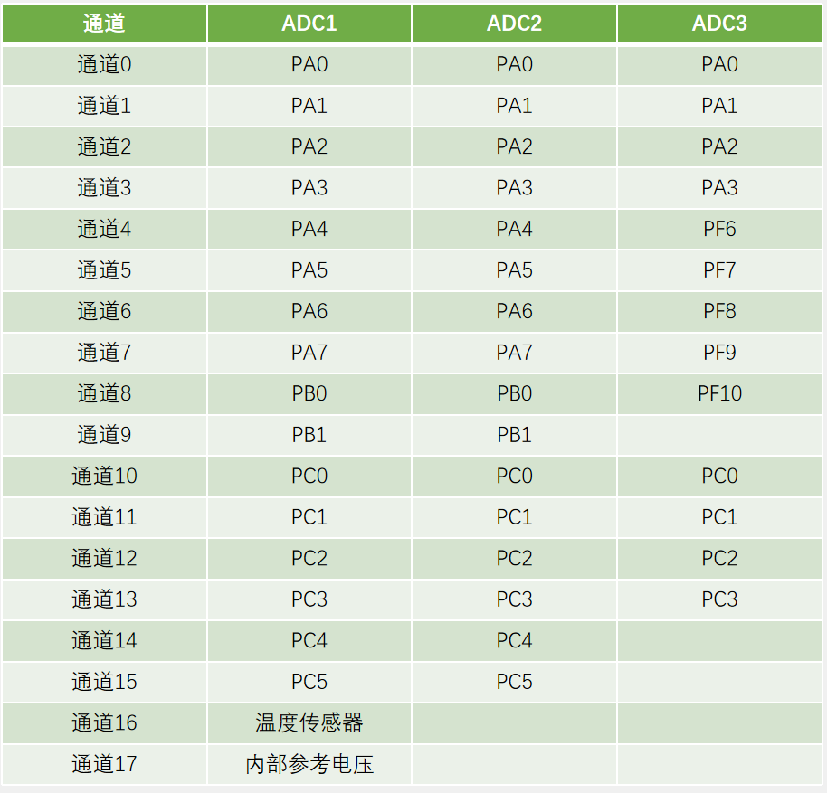


## 4.规则组的4种转换模式

- 在ADC的初始化函数中有两个参数，组成了这四种模式

  - 单次转换、非扫描模式：
    - 这时非扫描模式只有菜单的第一个序列1的位置有效，即菜单同时选中一组的方式退化成简单的选中一个的方式；
    - 每转换一次都需要触发一次，当需要转换其他通道时需要把序列1换成其他通道；

  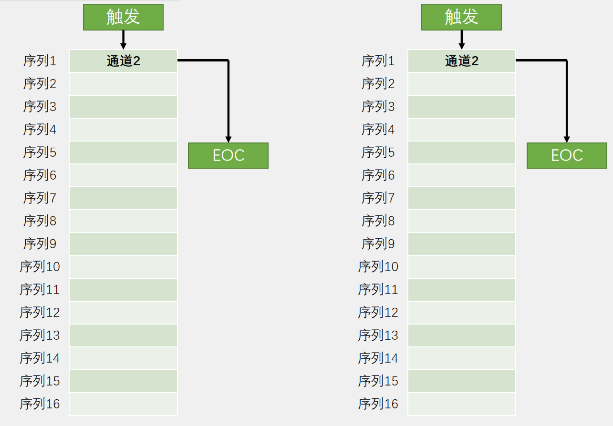

  - 连续转换、非扫描模式：
    - 还是非扫描模式，所以还是菜单列表只有一个；
    - 但是在结束一轮转换后不会停止，而是继续下一轮的转换，然后一直持续下去；
    - 转换只需要触发一次即可，后续就一直转换，无需多次手动触发；

  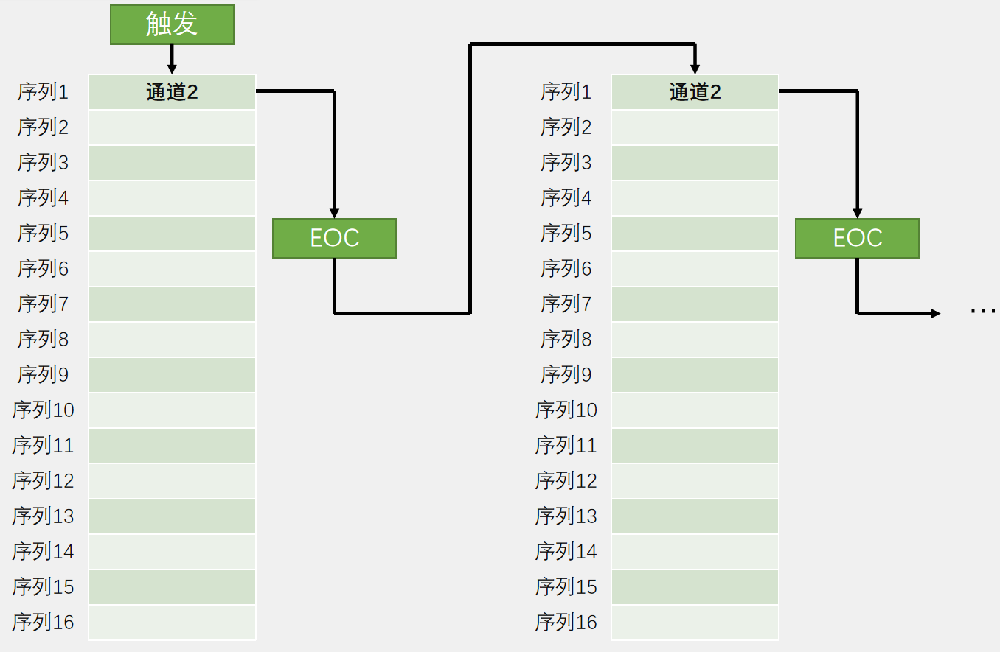

  - 单次转换、扫描模式：
    - 扫描模式可以指定有多少个通道；
    - 需要配合DMA数据转运；
    - 因为是单次转换，所以结束一组之后就停下来了，再次转换需要再次手动触发；

  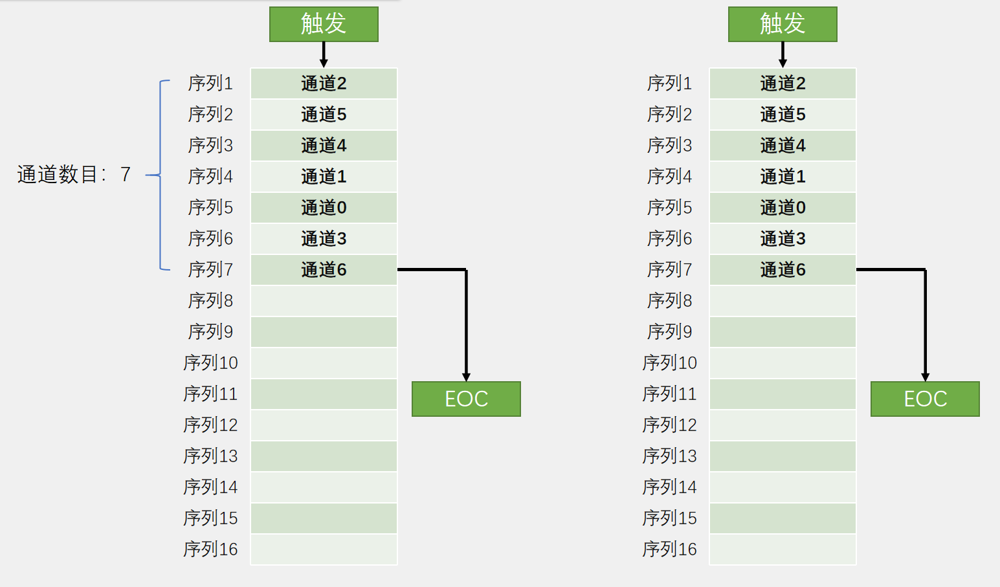

  - 连续转换、扫描模式：
    - 在3的基础上一次结束后立刻开始下一次的转换；
    - 开始后无需再次手动触发；

  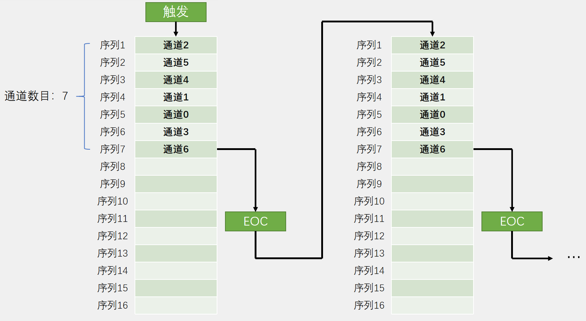


## 5.数据对齐

- ADC是12位的，但是寄存器是16位的，可分为左对齐和右对齐，一般都是右对齐；
- 左对齐可用于降低分辨率，即只读取高八位就变成了**8位的ADC**了 ；

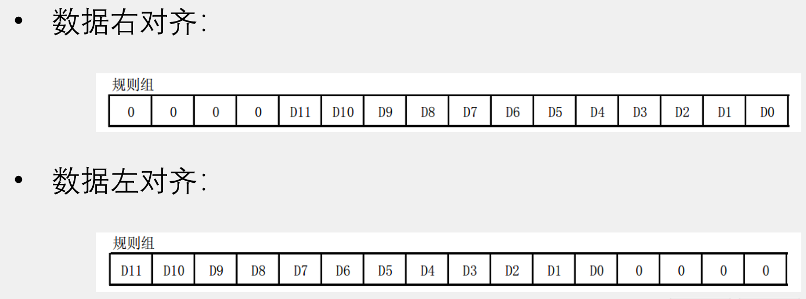


## 6.ADC的转换时间与校准

### 6.1 ADC的转换时间

- 主要是在量化编码中消耗时间；
- ADC可工作在超频状态，这时候的转换时间就小于1us了；

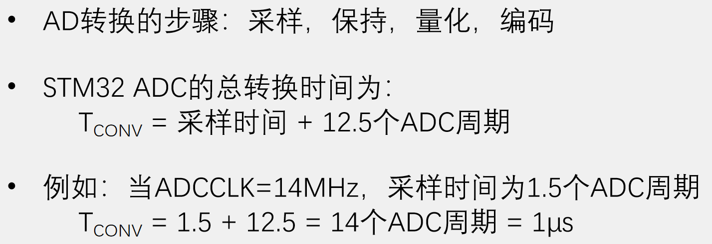

### 6.2 ADC的校准

- ADC的内置自校准模式，可大幅减小因内部电容器组的变化而造成的准精度误差，可在每次上电后执行一次校准；
- ADC的校准只需要在初始化后加几行代码即可，不需要理解其内部机理；


## 7.硬件电路

- 这里的硬件电路和之前介绍的光敏传感器是相同的；
- 重点关注最后一个电压转换电路，但若是高电压最好用电压采集芯片做好电压隔离；
- 在本小节的硬件连接中，只需要直接连接温度传感器等外设芯片的**AO模拟输出引脚**即可；

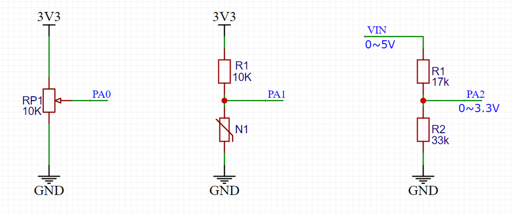

---


# 第二十二节课：7-2_AD单通道&AD多通道

## 1.ADC的初始化函数步骤
- 第一步：开启RCC时钟，包括ADC和GPIO的时钟，另外ADCCLK的分频器也需要配置一下；
- 第二步：配置GPIO，把需要用的GPIO配置成模拟输入的模式；
- 第三步：配置多路开关，把左边的通道接入到右边的规则组列表里（就是数据选择器选择哪个通道）；
- 第四步：配置ADC转换器（模式、几个通道、触发源、数据对齐等）；
- 第五步：若用到**模拟看门狗**则需要配置看门狗和中断输出控制以及NVIC的优先级；
- 第六步：调用ADC_Cmd函数，开启ADC；
- 第七步：可对ADC进行校准，减小误差；


## 2.ADC相关的库函数——stm32f10x_adc.h

- 初始化相关函数
  - void RCC_ADCCLKConfig()：ADCCLK函数，在**RCC文件**中，用于配置ADCCLK分频器，可对APB2的72MHz时钟选择2、4、6、8分频；
  - ADC_StructInit()：赋初值函数；
  - ADC_Cmd()：用于给ADC上电（即开关控制部分）；
  - ADC_DMACmd()：用于开启DMA转运数据；
  - ADC_ITConfig()：中断输出控制，用于控制某个中断能不能通往NVIC；
- 校准的相关函数
  - ADC_ResetCalibration()：复位校准；
  - ADC_GetResetCalibrationStatus()：返回是否复位校准完成；
  - ADC_StartCalibration()：开始校准；
  - ADC_GetCalibrationStatus()：返回是否校准完成；
  - 这几个函数只需要在开启ADC后一次调用即可完成ADC的校准；
- **软件触发的函数** 
  - ADC_SoftwareStartConvCmd()：ADC软件触发开始转换控制，用于软件触发的函数；
  - ADC_GetFlagStatus()：获取标志位，判断是否转换完成，包含了规则组和注入组；
- 关于间断模式的函数 
  - ADC_DiscModeChannelCountConfig()；
  - ADC_DiscModeCmd()；
- **ADC_RegularChannelConfig()：规则组通道配置，就是填写点菜菜单；**
- **ADC_ExternalTrigConvCmd()：是否使用外部触发转换；**
- **ADC_GetConversionValue()**：ADC获取转换值，**调用后将自动清零标志位**；

- 模拟看门狗配置相关的函数
  - ADC_AnalogWatchdogCmd()：是否开启看门狗
  - ADC_AnalogWatchdogThresholdsConfig()：配置高低阈值
  - ADC_AnalogWatchdogSingleChannelConfig()：配置看门狗的通道
- 注入组相关的函数
  - 带**Inject**的是配置注入组的函数；
- 内部温度传感器和内部参考电压相关的函数
  - ADC_TempSensorVrefintCmd()：配置内部温度传感器和内部参考电压控制的通道的函数；


## 3.AD单通道编程——软件触发和单次转换非扫描模式

### 3.1 接线图

- 电位器的滑动端需要接到ADC的输入引脚上；

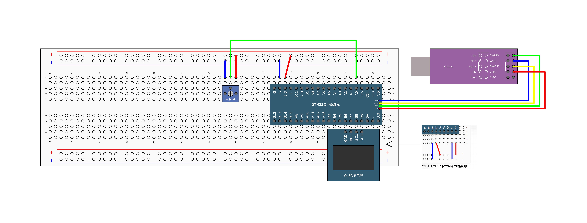

###  3.2 代码封装与编程

在Hardware组中添加**AD.c和AD.h文件**；

- AD.c文件编程

```c
#include "stm32f10x.h"                  // Device header

void AD_Init(void)
{
	//第一步：开启时钟
	RCC_APB2PeriphClockCmd(RCC_APB2Periph_ADC1, ENABLE);          //开启ADC1的时钟，且ADC都是APB2上的设备
	RCC_APB2PeriphClockCmd(RCC_APB2Periph_GPIOA, ENABLE);         //开启GPIOA的时钟
	
	RCC_ADCCLKConfig(RCC_PCLK2_Div6);                  //为ADC的CLK时钟进行配置，选择6分频，那就是12MHz
	
	//第二步：配置GPIO，将其配置为模拟输入的引脚
	GPIO_InitTypeDef GPIO_InitStructure;                        //定义结构体
	GPIO_InitStructure.GPIO_Mode = GPIO_Mode_AIN;               //定义结构体的模式为模拟输入模式
	GPIO_InitStructure.GPIO_Pin = GPIO_Pin_0;                   //选中1号引脚和2号引脚
	GPIO_InitStructure.GPIO_Speed = GPIO_Speed_50MHz;           //定义速度为50MHz
	GPIO_Init(GPIOA, &GPIO_InitStructure);                      //初始化端口
	
	//第三步：配置规则组的输入通道
	/*第一个参数选择哪个ADC，第二个参数选择哪个通道，第三个参数选择哪个序列，第四个是采样时间的参数*/
	ADC_RegularChannelConfig(ADC1, ADC_Channel_0, 1, ADC_SampleTime_55Cycles5);
	
	//第四步：配置ADC转换器，选择单次非扫描模式
	ADC_InitTypeDef ADC_InitStructure;
	ADC_InitStructure.ADC_ContinuousConvMode = DISABLE;                         //选择是否为连续转换模式
	ADC_InitStructure.ADC_DataAlign = ADC_DataAlign_Right;                      //数据对齐，选择右对齐
	ADC_InitStructure.ADC_ExternalTrigConv = ADC_ExternalTrigConv_None;         //这里选择外部触发模式，就是START信号，这节代码用软件触发
	ADC_InitStructure.ADC_Mode = ADC_Mode_Independent;                          //选择为独立模式而非双ADC模式
	ADC_InitStructure.ADC_NbrOfChannel = 1;                                     //通道的数目
	ADC_InitStructure.ADC_ScanConvMode = DISABLE;                               //选择扫描模式还是非扫描模式
	ADC_Init(ADC1, &ADC_InitStructure);
	
	//第五步：若要用中断和看门狗可在这部分配置，这节代码不用
	
	//第六步：开启ADC的电源
	ADC_Cmd(ADC1, ENABLE);
	
	//第七步：对ADC进行校准
	ADC_ResetCalibration(ADC1);                                //第一步：复位校准
	while (ADC_GetResetCalibrationStatus(ADC1) == SET);        //第二步：等待复位校准完成，该函数返回复位校准的状态
	ADC_StartCalibration(ADC1);                                //第三步：开始校准，内部电路自行进行校准，不需要理会
	while (ADC_GetCalibrationStatus(ADC1) == SET);             //第四步：等待校准完成，该函数用于获取校准状态，与第二步类似
}

//获取结果函数，先进行触发，即START信号，再判断EOC标志位，最后读取寄存器的值
uint16_t AD_GetValue(void)
{
	ADC_SoftwareStartConvCmd(ADC1, ENABLE);            //软件触发
	/*
	判断EOC标志位，第二个参数指定为EOC，完成为SET，未完成为RESET，用循环实现等待，且该标志位在读取数据后由硬件自动置1
	若选择连续模式就不再用判断标志位了，并将软件触发挪到初始化最后即可
	*/
	while (ADC_GetFlagStatus(ADC1, ADC_FLAG_EOC) == RESET);
	return ADC_GetConversionValue(ADC1);                      //取结果，因为读取寄存器后会自动清除标志位，所以就不需要手动清除标志位了
}

```

- AD.h文件编程

```c
#ifndef __AD_H
#define __AD_H

void AD_Init(void);
uint16_t AD_GetValue(void);

#endif

```

- main.c文件编程

```c
#include "stm32f10x.h"                  // Device header
#include "Delay.h"
#include "OLED.h"
#include "AD.h"

uint16_t ADValue;             //定义变量获取转换值
float Voltage;                //定义变量用于获取真实电压值

int main(void)
{
	OLED_Init();
	AD_Init();
	
	OLED_ShowString(1, 1, "ADValue:");
	OLED_ShowString(2, 1, "Voltage:0.00V");
	
	while (1)
	{
		ADValue = AD_GetValue();                                  //调用函数返回转换值
		Voltage = (float)ADValue / 4095 * 3.3;                    //线性关系直接获得真实电压值
		
		OLED_ShowNum(1, 9, ADValue, 4);                           //打印转换结果
		//由于OLED驱动还没有显示浮点数的功能，所以下面两条语句通过分开显示的操作来显示浮点数
		OLED_ShowNum(2, 9, Voltage, 1);
		OLED_ShowNum(2, 11, (uint16_t)(Voltage * 100) % 100, 2);
		
		Delay_ms(100);                                            //延时一小段时间防止刷新过快
	}
}

```


## 4.AD多通道编程

### 4.1 接线图

- 只需要把多个传感器的AO输出端接到ADC的输入引脚即可；

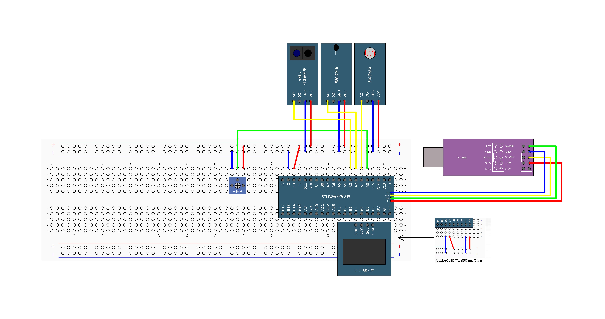

### 4.2 多通道扫描的问题

- 在多通道扫描模式下，单个通道转换完成后不置任何标志位，当所有通道都转换完成后才置位；
- 如果不配合DMA数据转换就会发生数据覆盖的问题；
- 这节代码采用的解决方法：
  - 仍采用单次转换非扫描模式；
  - 但在每一次软件触发前都先手动更改一下通道然后再进行转换；

### 4.3 代码封装与编程

- AD.c文件更改、
  - 更改初始化的GPIO口；
  - 更改AD_GetValue()函数，将通道作为参数传入，每次调用都更换通道；

```c
#include "stm32f10x.h"                  // Device header

void AD_Init(void)
{
	//第一步：开启时钟
	RCC_APB2PeriphClockCmd(RCC_APB2Periph_ADC1, ENABLE);          //开启ADC1的时钟，且ADC都是APB2上的设备
	RCC_APB2PeriphClockCmd(RCC_APB2Periph_GPIOA, ENABLE);         //开启GPIOA的时钟
	
	RCC_ADCCLKConfig(RCC_PCLK2_Div6);                             //为ADC的CLK时钟进行配置，选择6分频，那就是12MHz
	
	//第二步：配置GPIO，将其配置为模拟输入的引脚
	GPIO_InitTypeDef GPIO_InitStructure;                        //定义结构体
	GPIO_InitStructure.GPIO_Mode = GPIO_Mode_AIN;               //定义结构体的模式为模拟输入模式
	GPIO_InitStructure.GPIO_Pin = GPIO_Pin_0 | GPIO_Pin_1 | GPIO_Pin_2 | GPIO_Pin_3;      //四路输入，需要将所有的四个GPIO口初始化
	GPIO_InitStructure.GPIO_Speed = GPIO_Speed_50MHz;           //定义速度为50MHz
	GPIO_Init(GPIOA, &GPIO_InitStructure);                      //初始化端口
	
	//第三步：配置规则组的输入通道
	//第一个参数选择哪个ADC，第二个参数选择哪个通道，第三个参数选择哪个序列，第四个是采样时间的参数
	//ADC_RegularChannelConfig(ADC1, ADC_Channel_0, 1, ADC_SampleTime_55Cycles5);     
    //这里不需要再配置输入通道了，直接在后面的GetValue函数中作为参数传入
	
	//第四步：配置ADC转换器，选择单次非扫描模式
	ADC_InitTypeDef ADC_InitStructure;
	ADC_InitStructure.ADC_ContinuousConvMode = DISABLE;                         //选择是否为连续转换模式
	ADC_InitStructure.ADC_DataAlign = ADC_DataAlign_Right;                      //数据对齐，选择右对齐
	ADC_InitStructure.ADC_ExternalTrigConv = ADC_ExternalTrigConv_None;         //这里选择外部触发模式，就是START信号，这节代码用软件触发
	ADC_InitStructure.ADC_Mode = ADC_Mode_Independent;                          //选择为独立模式而非双ADC模式
	ADC_InitStructure.ADC_NbrOfChannel = 1;                                     //通道的数目
	ADC_InitStructure.ADC_ScanConvMode = DISABLE;                               //选择扫描模式还是非扫描模式
	ADC_Init(ADC1, &ADC_InitStructure);
	
	//第五步：若要用中断和看门狗可在这部分配置，这节代码不用
	
	//第六步：开启ADC的电源
	ADC_Cmd(ADC1, ENABLE);
	
	//第七步：对ADC进行校准
	ADC_ResetCalibration(ADC1);                                //第一步：复位校准
	while (ADC_GetResetCalibrationStatus(ADC1) == SET);        //第二步：等待复位校准完成，该函数返回复位校准的状态
	ADC_StartCalibration(ADC1);                                //第三步：开始校准，内部电路自行进行校准，不需要理会
	while (ADC_GetCalibrationStatus(ADC1) == SET);             //第四步：等待校准完成，该函数用于获取校准状态，与第二步类似
}

//获取结果函数，先进行触发，即START信号，再判断EOC标志位，最后读取寄存器的值，这里更改之前的函数，将通道作为参数传入
uint16_t AD_GetValue(uint8_t ADC_Channel)
{
    //配置通道，这里直接通过函数调用来不断更改通道进而间接实现“扫描”功能
	ADC_RegularChannelConfig(ADC1, ADC_Channel, 1, ADC_SampleTime_55Cycles5);
	ADC_SoftwareStartConvCmd(ADC1, ENABLE);            //软件触发
	/*判断EOC标志位，第二个参数指定为EOC，完成为SET，未完成为RESET，用循环实现等待，且该标志位在读取数据后由硬件自动置1
	若选择连续模式就不再用判断标志位了，并将软件触发挪到初始化最后即可*/
	while (ADC_GetFlagStatus(ADC1, ADC_FLAG_EOC) == RESET);
	return ADC_GetConversionValue(ADC1);                      //取结果，因为读取寄存器后会自动清除标志位，所以就不需要手动清除标志位了
}

```

- AD.h文件更改
  - 更改AD_GetValue()函数的声明；

```c
#ifndef __AD_H
#define __AD_H

void AD_Init(void);
uint16_t AD_GetValue(uint8_t ADC_Channel);

#endif

```

- main.c文件更改
  - 更改函数调用的参数并更改显示的数据；

```c
#include "stm32f10x.h"                  // Device header
#include "Delay.h"
#include "OLED.h"
#include "AD.h"

uint16_t AD0, AD1, AD2, AD3;

int main(void)
{
	OLED_Init();
	AD_Init();
	
	OLED_ShowString(1, 1, "AD0:");
	OLED_ShowString(2, 1, "AD1:");
	OLED_ShowString(3, 1, "AD2:");
	OLED_ShowString(4, 1, "AD3:");
	
	while (1)
	{
		AD0 = AD_GetValue(ADC_Channel_0);
		AD1 = AD_GetValue(ADC_Channel_1);
		AD2 = AD_GetValue(ADC_Channel_2);
		AD3 = AD_GetValue(ADC_Channel_3);
		
		OLED_ShowNum(1, 5, AD0, 4);
		OLED_ShowNum(2, 5, AD1, 4);
		OLED_ShowNum(3, 5, AD2, 4);
		OLED_ShowNum(4, 5, AD3, 4);
		Delay_ms(100);                                            //延时一小段时间防止刷新过快
	}
}

```

---


# 第二十三节课：8-1_DMA直接存储器存取

## 1.DMA简介——CPU的小助手
- DMA简介：即Direct Memory Access，即**直接存储器存取**；
- 作用：DMA可以提供高速数据传输，无须CPU干预，节省了CPU的资源，包括：
  - **外设**（外设的寄存器DR，即Data Register，如ADC的数据寄存器）和**存储器**（包括运行内存SRAM、程序存储器Flash和寄存器）；
  - **存储器和存储器**之间的高速数据传输；
- DMA的硬件资源数量
  - 整个STM32系列有12个独立的可配置的通道，包括**DMA1（7个通道）、DMA2（5个通道）**;
  - 对于STM32F103C8T6来说只有DMA1（7个通道）；
- 每个通道都支持：
  - 软件触发：**存储器到存储器**，如SRAM到Flash，触发后会一股脑的把数据以最快的速度转运；
  - 特定的硬件触发：**外设到存储器**，且每个DMA的通道，它的硬件触发源是不一样的；


## 2.存储器映像

- 计算机的五大部分
  - 运算器、控制器、存储器、输入设备、输出设备，其中运算器和控制器一般合在一起为CPU；
- STM32的存储器主要分为了ROM和RAM两类；
  - 32位存储器最大寻址为4GB，但是STM32的存储都是KB级别的，大部分的存储器都没有用到；

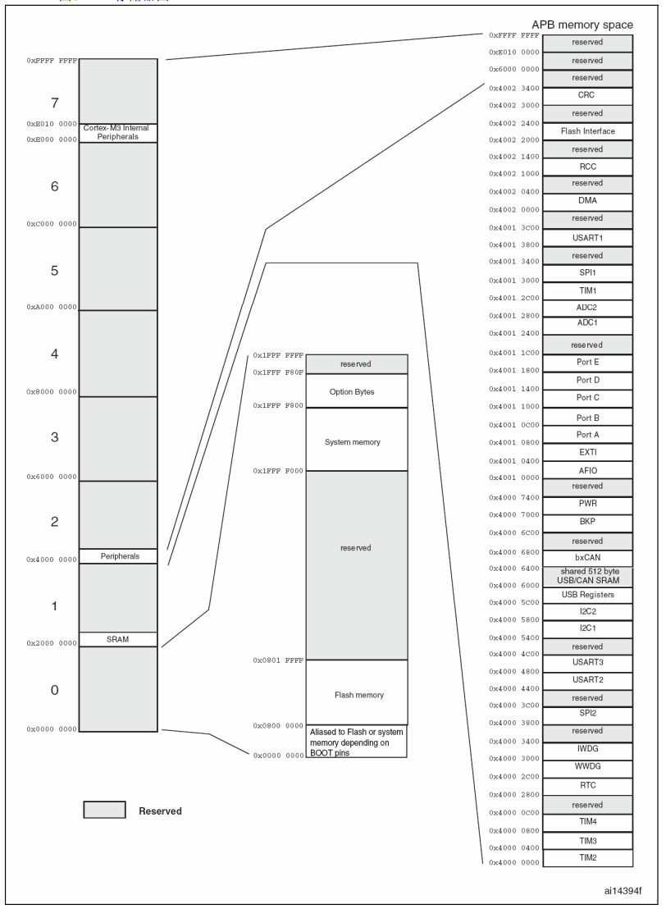

- ROM：非易失性、掉电不丢失的存储器（可理解为硬盘），可分为三块
  - 程序存储器Flash：主闪存，**存储C语言编译后的程序代码和常量**，其起始地址为**0x0800 0000**；
  - 系统存储器：**存储BootLoader**，用于串口下载，其起始地址为**0x1FFF F000**；
  - 选项字节：存储一些**独立于程序代码的配置参数**，其起始地址为**0x1FFF F800**；
- RAM：易失性、掉电丢失的存储器（可理解为内存），可分为三块
  - 运行内存SRAM：存储运行过程中的**临时变量**，其起始地址为**0x2000 0000**；
  - 外设寄存器：存储**各个外设的配置参数**，其起始地址为**0x4000 0000**；
  - 内核外设寄存器：存储**内核各个外设的配置参数**，如NVIC、SysTick，其起始地址为**0xE000 0000**；

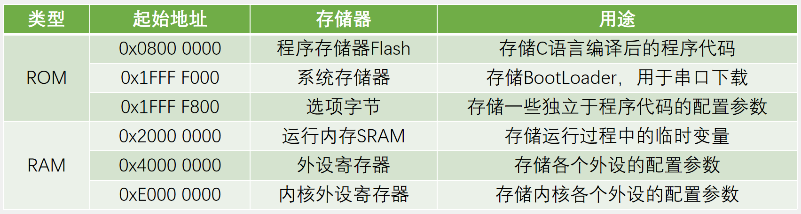


## 3.DMA框图

- 整个STM32包括的就是Cortex-M3的CPU内核和各种各样的存储器：
  - CPU可以读写Flash、SRAM等；
  - 各种外设的本质是外设寄存器，CPU也可以读写它们；
  - 寄存器和其他存储器的区别就是寄存器每一位都有一根导线连接到硬件，所以寄存器是软件到硬件的桥梁；
  - 除了CPU可以读写外，DMA也可以；
  - 红线左边是主动设备，它们可以读写右边；红线右边是被动设备，它们只能被读写；

- 几条总线的连接
  - ICode总线：连接Flash闪存，用于加载程序指令；
  - DCode总线：同样连接Flash闪存，用于加载程序数据，如一些常量等；
  - 系统总线：连接片上的其他外设，访问其他东西的；
- DMA总线
  - DMA1和DMA2都有一条DMA总线；
  - **以太网外设自己还私有一条DMA总线**；
- **仲裁器——解决多条线路冲突的问题**
  - 虽然多通道可以独立转运数据，但是一个DMA只有一条总线，所以所有的通道只能分时复用这条DMA总线；
  - 仲裁器可以根据通道的优先级决定谁先用谁后用；
  - 除了DMA有仲裁器之外，总线矩阵那里也有一个仲裁器，用于区分CPU和DMA；
- **AHB从设备——完成CPU对DMA的配置**
  - 即DMA的自身寄存器，因为DMA作为一个外设它自己也会有相应的配置寄存器；
  - 所以DMA即是总线矩阵的主动单元，可以读写各种存储器；也是AHB线上的被动单元，CPU可对DMA进行配置，这个可以用于对DMA进行配置；
- DMA请求：即**DMA触发**的意思，其触发源是各个外设，即DMA的硬件触发源；
- 存储器的读写权限：
  - CPU或DMA直接访问Flash是只可以读不可以写的，但可以通过Flash接口控制器控制Flash的写；
  - SRAM是可以任意读写的；
  - 各种外设的寄存器有些可以任意读写，有些不可以；
- DMA还可以产生中断，在框图中没有画出来；DMA的中断与其他外设的中断配置是相同的，即通过NVIC产生中断；

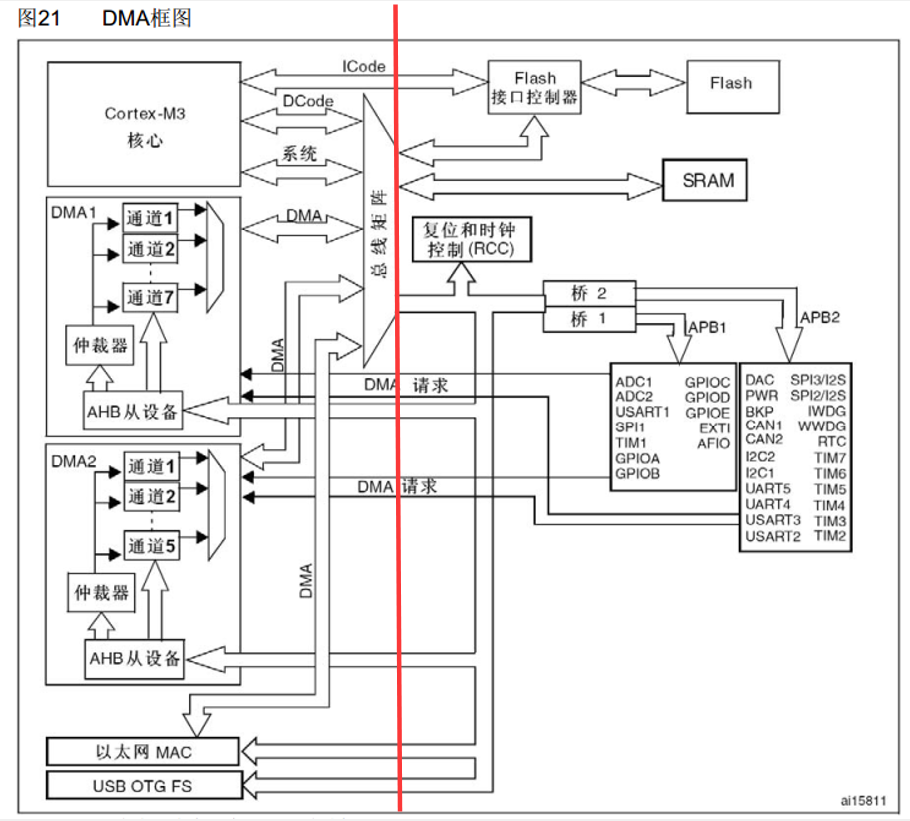


## 4.DMA基本结构

- 即配置DMA的初始化的框图；
- 在STM32中，存储器一般指Flash和SRAM，外设寄存器虽然也是寄存器，但是STM32把它称为外设而不是存储器，右图可知：
  - 外设和存储器之间可相互转运；
  - **存储器之间，由于Flash是只读的，所以只能由Flash转运到SRAM，而不能SRAM转运到Flash；**
- 数据转运的控制：外设和存储器都有三个参数控制
  - 起始地址：指定数据从哪里来和去哪里；
  - 数据宽度：指定每次转运的数据大小；
  - 地址是否自增：指定下次转运的地址是否相后自增；
- 传输计数器：是一个自减计数器，每转一次减一，指定DMA需要转运多少次
  - 右边的自动重装器用于**指定计数器减到0后是否要自动恢复到最初的值，决定了是不是循环模式**；
  - **注意写传输计数器时需要先关闭DMA才能写，不能在DMA开启时写传输计数器**；
- 触发源选择
  - 软件触发或是硬件触发，由M2M这个参数决定；
  - M2M给1就是软件触发，这个软件触发与前面的软件触发不同，这里是为了尽快的把所有数据转运，所以它会不断的进行软件触发，而不是调用一句代码就软件触发一次，软件触发的方式不能与循环模式一起使用；
- 开关控制：DMA_Cmd()函数，就是DMA的使能函数；
- 这里的外设和寄存器两个框图代表了出发地和目的地，但外设当然也可以是存储器，只是在这里统一把出发地叫做外设（**这是因为STM32官方的标准外设库的代码封装所造成的**）；

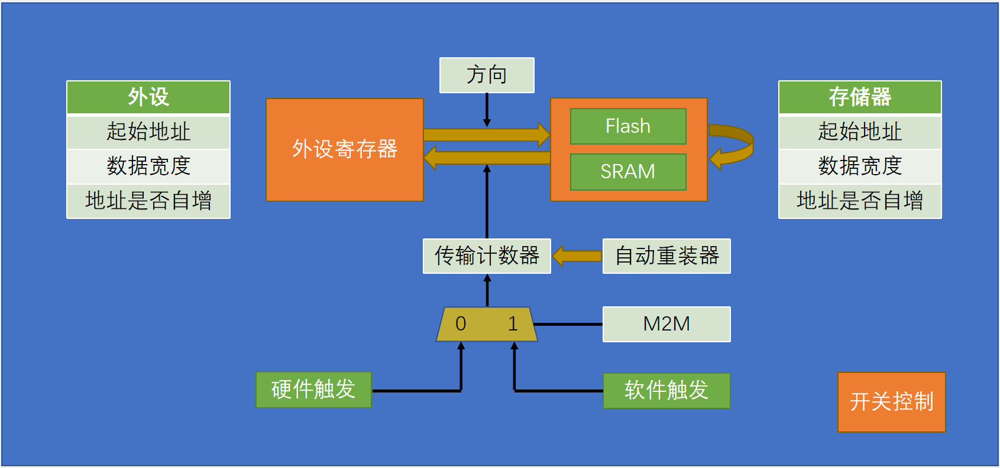


## 5.DMA请求

- 即前面的触发源选择部分的框图；

- EN位决定数据选择器是否工作，M2M位决定是软件触发还是硬件触发；

- 软件触发与硬件触发

  - 软件触发是每个通道都可以的；
  - **某一个硬件触发是不一定每个通道都有的，因为每个通道的硬件触发源是不同的**；

- 外设请求信号（即硬件触发）的开启

  - **ADC_DMACmd()**等函数可将某个外设的DMA输出开启；
  - DMA的一个通道可有多个外设请求信号，且是**或门**的关系，所以只要有一个开启了即可触发DMA请求；

- 仲裁器选出DMA请求

  - 仲裁器根据优先级大小进行裁决；

  - 优先级一般是通道号越小，优先级越高；

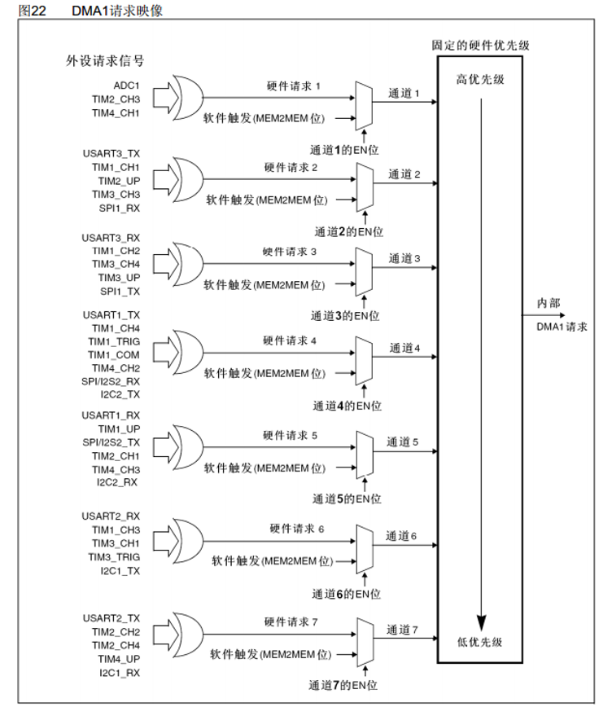


## 6.数据宽度与对齐

- 小数据转到大的里面，高位就会补0；
- 大数据转到小的里面，就会舍弃高位；
- 若数据宽度一致则没事；
- 就和uint8_t、uint16_t、uint32_t之间的赋值是一样的；

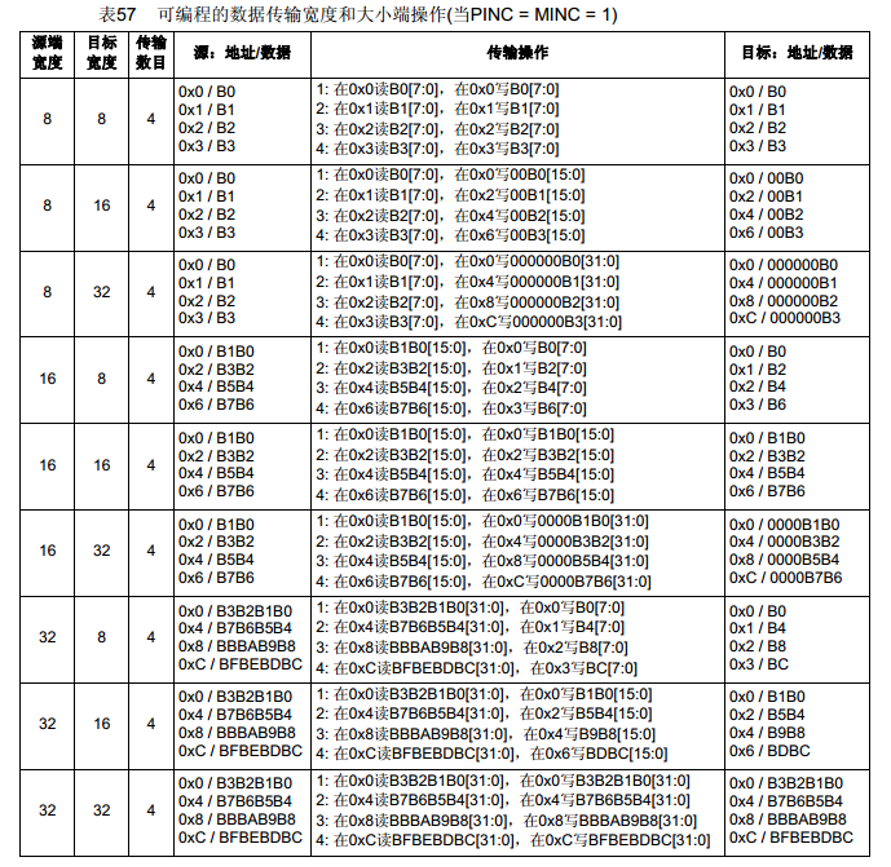


## 7.两个实际的DMA例子

### 7.1 数据转运＋DMA

- DMA外设地址给DataA数组的首地址；
- DMA存储器地址给DataB数组的首地址；
- 传输计数器给7，不选择自动重装寄存器，数据位都为8位，且需要选择地址自增；

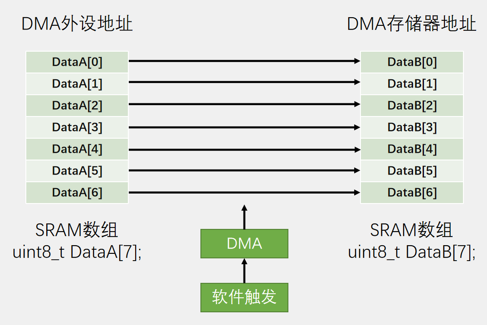

### 7.2 ADC扫描模式+DMA

- 外设地址写入ADC_DR这个寄存器的地址，存储器地址可以在SRAM中定义一个数组；
- 数据宽度都是16位的半字传输；
- 外设地址不自增，存储器地址自增；
- 传输计数器为7，方向为从外设地址到存储器地址；
- **触发选择需要选择ADC的硬件触发，ADC的每个通道转换完成后没有标志位也不触发中断，但是会产生DMA的请求，触发DMA转运；**
- DMA最常见的用途就是用在ADC的扫描模式中，在其他地方用DMA只不过是锦上添花，但ADC往往是需要配合DMA使用的；

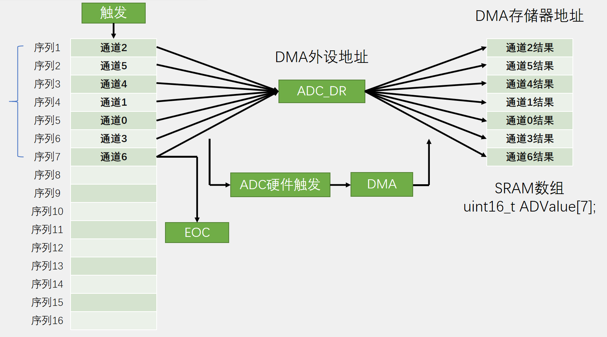

---


# 第二十四节课：8-2_DMA数据转移&DMA+AD多通道

## 1.DMA的初始化步骤

DMA不涉及外围电路，这里在System文件夹添加模块

- 第一步：RCC开启DMA的时钟;
- 第二步：调用DMA_Init()函数初始化各个参数
  - 包括外设和存储器站点的起始地址、数据宽度、地址是否自增、方向、传输计数器、是否需要自动重装（循环模式）、选择触发源;
- 第三步：开关控制，DMA_Cmd()函数使能DMA；
- 其他步骤：
  - **若需要硬件触发记得调用xxxDMA_Cmd()；**
  - 若需要DMA的中断，则调用DMA_ITConfig()开启中断输出，再到NVIC中配置优先级；
  - **在运行过程中若转运完成之后传输计数器清0这时想再给传输计数器赋值的话需要先失能DMA再赋值再使能；**


## 2.DMA的相关库函数——stm32f10x_dma.h

- DMA_Init()：初始化函数；
- DMA_Cmd()：使能DMA；
- DMA_ITConfig()：使能DMA的中断输出；
- **DMA_SetCurrDataCounter()：给当前传输计数器写数据；**
- **DMA_GetCurrDataCounter()：返回传输计数器的值；**
- DMA_GetFlagStatus()：获取标志位状态；
- DMA_ClearFlag()：清除标志位；
- DMA_GetITStatus()：获取中断状态；
- DMA_ClearITPendingBit()：清除中断挂起位；

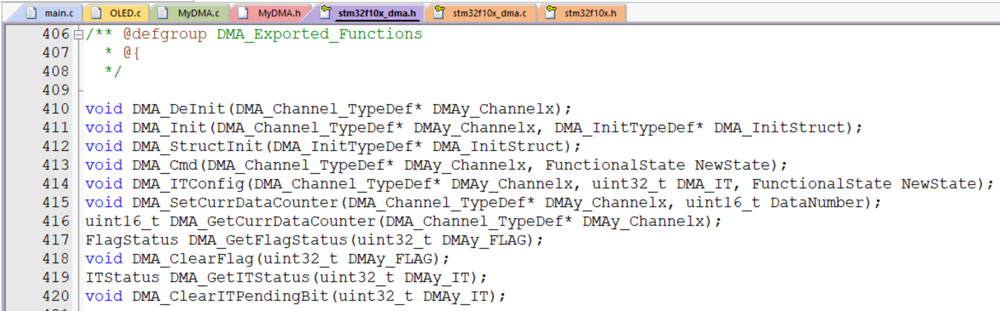


## 3.存储器映像实验

- 对于程序中定义的变量，它是存储在SRAM中的，地址从0x2000开始；
- 在变量前面加上const关键字，它就编程了常量，存储在Flash中，只能读不能写，地址从0x0800开始；
- 与上面的变量/常量的地址由编译器分配不同，外设寄存器的地址是固定的
  - 外设寄存器地址通过**首地址＋偏移**的方式实现；
  - 地址偏移通过结构体的方式实现，因为结构体成员从上到下它的地址是自增的，刚好完成映射的关系；

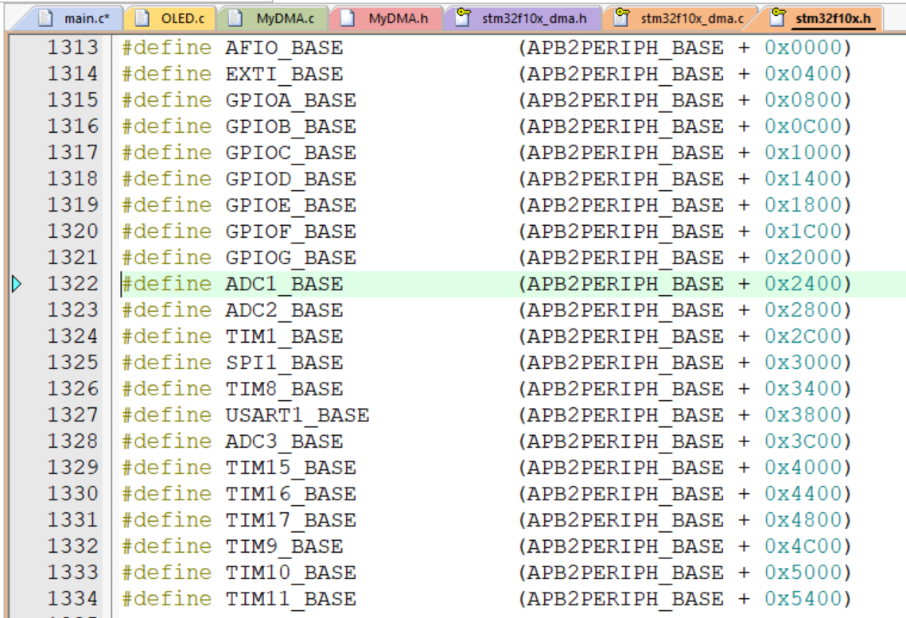


## 4.DMA数据转运——存储器到存储器

### 4.1 接线图

- 存储器间的数据转运都是在STM32内部完成的，所以不需要外接任何外围电路；


### 4.2 代码封装和编程

由于DMA不涉及外围电路，所以在System组中添加**MyDMA.c和MyDMA.h文件**

- MyDMA.c文件编程
  - 封装初始化函数MyDMA_Init()
    - 最重要的是理解**DMA_InitStructure.DMA_DIR这个结构体参数的配置，即如何配置传输的方向；**
  - 封装转换函数MyDMA_Transfer()
    - 其内部实现先失能DMA，然后再设置计数器的值，这样调用一次函数就可以重新开始转换；

```c
#include "stm32f10x.h"                  // Device header

uint16_t MyDMA_Size;

void MyDMA_Init(uint32_t ADDrA, uint32_t ADDrB, uint16_t Size)
{
	MyDMA_Size = Size;                                                    //将计数器的值存一份传给后面的函数
	
	//第一步：开启DMA的时钟，注意DMA是AHB总线的设备，开启DMA1的时钟
	RCC_AHBPeriphClockCmd(RCC_AHBPeriph_DMA1, ENABLE);
	
	//第二步：初始化DMA
	DMA_InitTypeDef DMA_InitStructure;
	//下面三个函数设置外设站点的起始地址、数据宽度、是否自增
	DMA_InitStructure.DMA_MemoryBaseAddr = ADDrA;                         //SRAM数据地址不固定，这里采用参数传递
	DMA_InitStructure.DMA_MemoryDataSize = DMA_MemoryDataSize_Byte;       //以字节大小传输
	DMA_InitStructure.DMA_MemoryInc = DMA_MemoryInc_Enable;               //选择地址自增
	
	//下面三个函数设置存储器站点的起始地址、数据宽度、是否自增
	DMA_InitStructure.DMA_PeripheralBaseAddr = ADDrB;                     //这里跟上面的地址是一样的
	DMA_InitStructure.DMA_PeripheralDataSize = DMA_MemoryDataSize_Byte;   //同上面
	DMA_InitStructure.DMA_PeripheralInc = DMA_MemoryInc_Enable;           //同上面
	
	DMA_InitStructure.DMA_DIR = DMA_DIR_PeripheralSRC;       //传输方向，SRC是源端的意思，就是外设站点作为源端
	DMA_InitStructure.DMA_Mode = DMA_Mode_Normal;            //是否使用自动重装，注意自动重装和软件触发不能同时使用，这里选择不重装
	DMA_InitStructure.DMA_M2M = DMA_M2M_Enable;	             //选择硬件触发还是软件触发，这里是存储器到存储器也就是软件触发，选择是
	DMA_InitStructure.DMA_BufferSize = Size;                 //缓存区大小，就是传输计数器，作为参数由函数传入
	DMA_InitStructure.DMA_Priority = DMA_Priority_Medium;    //优先级，这里只有一个通道，随便选个中等
	DMA_Init(DMA1_Channel1, &DMA_InitStructure);             //第一个参数选择了哪个DMA和DMA的哪个通道，因为是软件触发所以选择任一个通道都可以
	
	//第三步：开关控制，使能DMA
	DMA_Cmd(DMA1_Channel1, DISABLE);                         //不再初始化完成后就马上开始转运，而是等调用第二个函数时再开始
}

//定义一个函数，每调用一次就启动一次DMA转运
void MyDMA_Transfer(void)
{
	//步骤：先失能，再赋值计数器，再使能
	DMA_Cmd(DMA1_Channel1, DISABLE);                      //步骤一：失能DMA
	DMA_SetCurrDataCounter(DMA1_Channel1, MyDMA_Size);    //步骤二：赋值传输计数器
	DMA_Cmd(DMA1_Channel1, ENABLE);                       //步骤三：再次使能DMA
	
	while (DMA_GetFlagStatus(DMA1_FLAG_TC1) == RESET);    //检查转运完成的标志位，没有完成则一直循环等待
	DMA_ClearFlag(DMA1_FLAG_TC1);                         //清除标志位，这个标志位是需要手动清除的，没有硬件自动清除
}

```

- MyDMA.h文件编程

```c
#ifndef __MYDMA_
#define __MYDMA_

void MyDMA_Init(uint32_t ADDrA, uint32_t ADDrB, uint16_t Size);
void MyDMA_Transfer(void);

#endif

```

- main.c文件编程

```c
#include "stm32f10x.h"                  // Device header
#include "Delay.h"
#include "OLED.h"
#include "MyDMA.h"

uint8_t DataA[] = {0x01, 0x02, 0x03, 0x04};            //定义源端数组
uint8_t DataB[] = {0, 0, 0, 0};                        //定义目的数组

int main(void)
{
	//初始化硬件
	OLED_Init();
	
	MyDMA_Init((uint32_t)DataA, (uint32_t)DataB, 4);     //强制类型转换是为了取它们的地址
	
	//显示最开始的数据
	OLED_ShowString(1, 1, "DataA");
    OLED_ShowString(3, 1, "DataB");
	OLED_ShowHexNum(1, 8, (uint32_t)DataA, 8);
	OLED_ShowHexNum(3, 8, (uint32_t)DataA, 8);	

	while (1)
	{
		DataA[0] ++;
		DataA[1] ++;
		DataA[2] ++;
		DataA[3] ++;
		
	  	//在第二行显示DataA的数据
	  	OLED_ShowHexNum(2, 1, DataA[0], 2);
	  	OLED_ShowHexNum(2, 4, DataA[1], 2);
	  	OLED_ShowHexNum(2, 7, DataA[2], 2);
	  	OLED_ShowHexNum(2, 10, DataA[3], 2);
	
	  	//在第四行显示DataB的数据
	  	OLED_ShowHexNum(4, 1, DataB[0], 2);
	  	OLED_ShowHexNum(4, 4, DataB[1], 2);
	  	OLED_ShowHexNum(4, 7, DataB[2], 2);
	  	OLED_ShowHexNum(4, 10, DataB[3], 2);
		
	  	Delay_ms(1000);
		
	  	MyDMA_Transfer();
		
	  	//在第二行显示转运后DataA的数据
	  	OLED_ShowHexNum(2, 1, DataA[0], 2);
	  	OLED_ShowHexNum(2, 4, DataA[1], 2);
	  	OLED_ShowHexNum(2, 7, DataA[2], 2);
	  	OLED_ShowHexNum(2, 10, DataA[3], 2);
	
      	//在第四行显示转运后DataB的数据
	  	OLED_ShowHexNum(4, 1, DataB[0], 2);
	  	OLED_ShowHexNum(4, 4, DataB[1], 2);
	  	OLED_ShowHexNum(4, 7, DataB[2], 2);
	  	OLED_ShowHexNum(4, 10, DataB[3], 2);
		
		Delay_ms(1000);
	}
}

```


## 5、DMA外设到寄存器（重要知识点）

### 5.1 接线图


### 5.2 代码封装和编程

在**”7-2 AD多通道“**的基础上，更改代码

- AD.c文件修改
  - 注意ADC_DMACmd(ADC1, ENABLE);开启硬件触发；

```c
#include "stm32f10x.h"                  // Device header

uint16_t AD_Value[4];
void AD_Init(void)
{
	//第一步：开启时钟
	RCC_APB2PeriphClockCmd(RCC_APB2Periph_ADC1, ENABLE);          //开启ADC1的时钟，且ADC都是APB2上的设备
	RCC_APB2PeriphClockCmd(RCC_APB2Periph_GPIOA, ENABLE);         //开启GPIOA的时钟
	
	RCC_ADCCLKConfig(RCC_PCLK2_Div6);                             //为ADC的CLK时钟进行配置，选择6分频，那就是12MHz
	
	//第二步：配置GPIO，将其配置为模拟输入的引脚
	GPIO_InitTypeDef GPIO_InitStructure;                                                  //定义结构体
	GPIO_InitStructure.GPIO_Mode = GPIO_Mode_AIN;                                         //定义结构体的模式为模拟输入模式
	GPIO_InitStructure.GPIO_Pin = GPIO_Pin_0 | GPIO_Pin_1 | GPIO_Pin_2 | GPIO_Pin_3;      //四路输入，需要将所有的四个GPIO口初始化
	GPIO_InitStructure.GPIO_Speed = GPIO_Speed_50MHz;                                     //定义速度为50MHz
	GPIO_Init(GPIOA, &GPIO_InitStructure);                                                //初始化端口
	
	//第三步：配置规则组的输入通道，即是“点菜过程”，配置ADC的四个通道，实现扫描模式
	ADC_RegularChannelConfig(ADC1, ADC_Channel_0, 1, ADC_SampleTime_55Cycles5);
	ADC_RegularChannelConfig(ADC1, ADC_Channel_1, 2, ADC_SampleTime_55Cycles5);
	ADC_RegularChannelConfig(ADC1, ADC_Channel_2, 3, ADC_SampleTime_55Cycles5);
	ADC_RegularChannelConfig(ADC1, ADC_Channel_3, 4, ADC_SampleTime_55Cycles5);
	
	//第四步：配置ADC转换器，选择单次扫描模式
	ADC_InitTypeDef ADC_InitStructure;
	ADC_InitStructure.ADC_ContinuousConvMode = ENABLE;                          //选择为连续转换模式
	ADC_InitStructure.ADC_DataAlign = ADC_DataAlign_Right;                      //数据对齐，选择右对齐
	ADC_InitStructure.ADC_ExternalTrigConv = ADC_ExternalTrigConv_None;         //这里选择外部触发模式，就是START信号
	ADC_InitStructure.ADC_Mode = ADC_Mode_Independent;                          //选择为独立模式而非双ADC模式
	ADC_InitStructure.ADC_NbrOfChannel = 4;                                     //通道的数目为4
	ADC_InitStructure.ADC_ScanConvMode = ENABLE;                                //选择扫描模式
	ADC_Init(ADC1, &ADC_InitStructure);
	
	//第五步：下面是配置DMA的函数
	//第一步：开启DMA的时钟，注意DMA是AHB总线的设备，开启DMA1的时钟
	RCC_AHBPeriphClockCmd(RCC_AHBPeriph_DMA1, ENABLE);
	//第二步：初始化DMA
	DMA_InitTypeDef DMA_InitStructure;
	//下面三个函数设置外设站点的起始地址、数据宽度、是否自增
	DMA_InitStructure.DMA_MemoryBaseAddr = (uint32_t)ADC1->DR;    //源头，ADC转换完成后数据存在ADC_DR寄存器里，所以这里选择为ADC_DR寄存器
	DMA_InitStructure.DMA_MemoryDataSize = DMA_MemoryDataSize_HalfWord;       //这里要DR寄存器低16位数据
	DMA_InitStructure.DMA_MemoryInc = DMA_MemoryInc_Disable;                  //选择地址不自增，始终转运同一个位置的值(ADC_DR寄存器)
	//下面三个函数设置存储器站点的起始地址、数据宽度、是否自增
	DMA_InitStructure.DMA_PeripheralBaseAddr = (uint32_t)AD_Value;            //将目的地的基地址传入
	DMA_InitStructure.DMA_PeripheralDataSize = DMA_MemoryDataSize_HalfWord;   //同上面
	DMA_InitStructure.DMA_PeripheralInc = DMA_MemoryInc_Enable;               //存储器的地址是自增的，需要区分这里和上面
	//配置DMA的参数
	DMA_InitStructure.DMA_DIR = DMA_DIR_PeripheralSRC;          //传输方向，外设站点作为源端
	DMA_InitStructure.DMA_Mode = DMA_Mode_Circular;             //这里选择循环模式
	DMA_InitStructure.DMA_M2M = DMA_M2M_Disable;	            //选择硬件触发还是软件触发，这里选择硬件触发，触发源是ADC1
	DMA_InitStructure.DMA_BufferSize = 4;                       //缓存区大小，就是传输计数器，作为参数由函数传入
	DMA_InitStructure.DMA_Priority = DMA_Priority_Medium;       //优先级，这里只有一个通道，随便选个中等
	DMA_Init(DMA1_Channel1, &DMA_InitStructure);                //第一个参数选择了哪个DMA和DMA的哪个通道，需要选择DMA1_Channel1
	//第三步：开关控制，使能DMA
	DMA_Cmd(DMA1_Channel1, ENABLE);                             //直接使能，因为是硬件触发，需要等有DMA请求时才转运
	
	//第六步：开启DMA的触发信号（重点，别忘）
	ADC_DMACmd(ADC1, ENABLE);
	
	//第七步：开启ADC的电源
	ADC_Cmd(ADC1, ENABLE);
	
	//第八步：对ADC进行校准
	//第一步：复位校准
	ADC_ResetCalibration(ADC1);
	//第二步：等待复位校准完成，该函数返回复位校准的状态，所以需要加一个while循环来等待复位校准完成
	while (ADC_GetResetCalibrationStatus(ADC1) == SET);
	//第三步：开始校准，内部电路自行进行校准，不需要理会
	ADC_StartCalibration(ADC1);
	//第四步：等待校准完成，该函数用于获取校准状态，与第二步类似
	while (ADC_GetCalibrationStatus(ADC1) == SET);
	
	//第九步：初始化时先将ADC进行软件触发，注意ADC的软件触发和DMA的软件触发的区别
	ADC_SoftwareStartConvCmd(ADC1, ENABLE);            //软件触发
}

```

- AD.h文件修改

```c
#ifndef __AD_H
#define __AD_H

extern uint16_t AD_Value[4];

void AD_Init(void);

#endif

```

- main.c文件修改
  - 修改后完全实现了硬件的自动化，要想得到数据直接读数组即可，无需任何其他代码的封装；

```c
#include "stm32f10x.h"                  // Device header
#include "Delay.h"
#include "OLED.h"
#include "AD.h"

int main(void)
{
	OLED_Init();
	AD_Init();
	
	OLED_ShowString(1, 1, "AD0:");
	OLED_ShowString(2, 1, "AD1:");
	OLED_ShowString(3, 1, "AD2:");
	OLED_ShowString(4, 1, "AD3:");
	
	while (1)
	{
		OLED_ShowNum(1, 5, AD_Value[0], 4);
		OLED_ShowNum(2, 5, AD_Value[1], 4);
		OLED_ShowNum(3, 5, AD_Value[2], 4);
		OLED_ShowNum(4, 5, AD_Value[3], 4);
		
		Delay_ms(100);                                            //延时一小段时间防止刷新过快
	}
}

```

---


# 第二十五节课：9-1_USART串口协议

## 1.通信接口
- 目的：将一个设备的数据传送到另一个设备，扩展硬件系统；
- 注意区别STM32内部的数据传输与STM32与外挂设备的数据传输；
- 通信协议：指定通信的规则，**通信双方按照协议规则进行数据接收**
  - USART：TX（发送数据引脚）、RX（接收数据引脚），全双工、异步、单端电平、点对点；
  - I2C：SCL（时钟引脚）、SDA（数据引脚），半双工、同步、单端、多设备；
  - SPI；SCLK（时钟）、MOSI（主机输出数据脚）、MISO（主机输入数据脚）、CS（片选），全双工、同步、单端、多设备；
  - **CAN**：CAN_H、CAN_L，半双工、异步、差分、多设备；
  - USB：DP、DM，半双工、异步、差分、点对点；

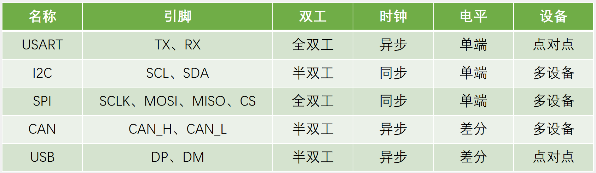


## 2.串口的通讯协议

- 单片机的串口可使单片机与单片机、单片机与电脑、单片机与各种各样的模块互相通信；

- 常见的串口设备：

  - USB转串口模块（CH340）；
  - 陀螺仪传感器模块，一边是串口协议，一边是I2C协议；
  - **蓝牙通信模块：蓝牙芯片可接收手机指令，然后再通过串口转送给单片机；**

  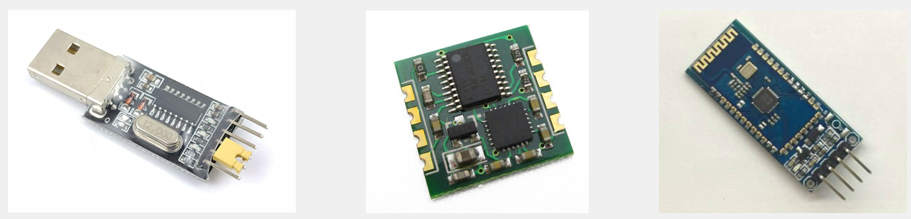

- 串口的硬件电路连接

  - RX接TX、TX接RX，且GND必须接，因为是单端通信协议；
  - 若电平标准不一致，需要加电平转换芯片；

  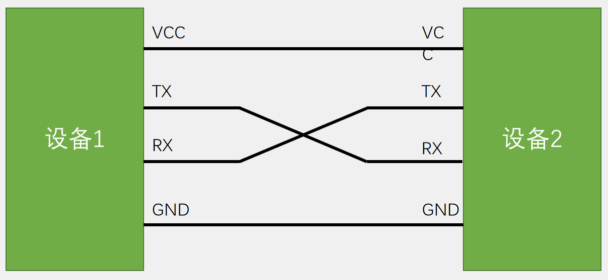

- 串口常用的几种电平标准

  - TTL电平：+3.3V或+5V表示1，0V表示0；
  - **RS232电平**：-3V~-15V表示1，3V~15V表示0，一般用在大型机器上；
  - **RS485电平**：两线差+2~+6V表示1，-2V~-6V表示0，差分信号；


## 3.串口参数、数据帧及时序

- 波特率：指定串口通信的速率，本质是为了数据的解调和同步；
- 起始位：标志一个数据帧的开始，固定为低电平；
- 数据位：数据帧的有效载荷，1为高电平，0为低电平，8位，且低位先行；
- 校验位：用于数据验证，根据数据位计算得来，奇偶校验；
- 停止位：用于数据帧间隔，固定为高电平；

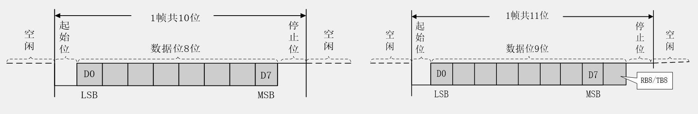

- 串口时序举例
  - TX引脚的波形是由USART外设自动产生的；
  - RX引脚的波形是由USART外设自动读取的；
  - 停止位是可以指定位数的；

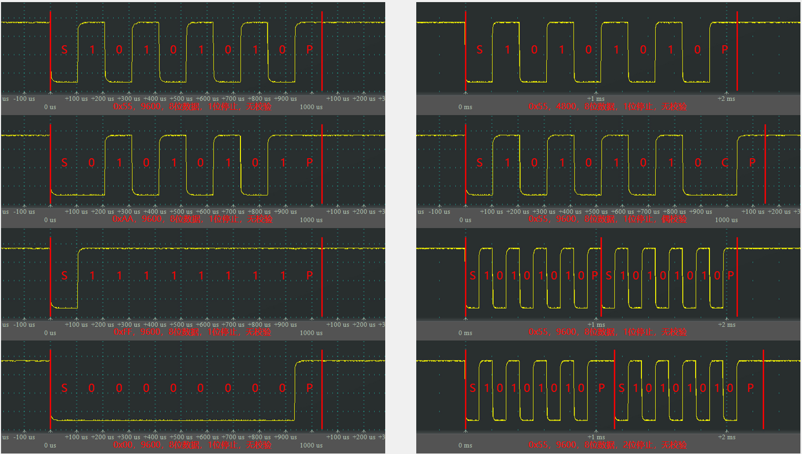

---


# 第二十六节课：9-2_STM32的USART外设

## 1.USART简介
- 定义：Universal Synchronous/Asynchronous Receiver/Transmitter，通用同步/异步收发器
  - S为同步的意思，UART则是**通用异步收发器**，USART是**通用同步收发器**，即是USART与UART的区别；
  - 实际中很少用到它的同步功能，所以UART和USART用起来没什么区别；
  - 
- USART是STM32内部集成的**硬件外设**
  - 可根据数据寄存器的一个字节数据自动生成数据帧时序，从TX引脚发送出去；
  - 也可接收RX引脚的数据帧时许，拼接成一个字节数据，存放在数据寄存器里；
- 自带波特率发生器，最高达4.5Mbit/s，一般**9600/115200**；
- 写控制寄存器，可配置如下参数：
  - 可配置数据位长度（8/9），停止位长度（0.5/1/1.5/2）；
  - 可选校验位，一般无校验；
- 支持同步模式、硬件流控制、**DMA**、智能卡、IrDA、LIN（局域网通信）；
- STM32F103C8T6有**USART1、2、3，其中1是APB2的设备，2、3是APB1的设备**；


## 2.USART框图

- 引脚部分
  - TX和RX是主要的引脚，分别**通向发送移位寄存器和接收移位寄存器；**
  - SW_RX、IRDA_OUT、IRDA_IN是智能卡和IrDA得到引脚，不用理；
- **寄存器部分——USART的全部精髓**
  - 有**发送数据寄存器TDR和接收数据寄存器RDR**；
  - **TDR和RDR占有同一个地址，在程序上只表现为一个寄存器，即数据寄存器DR，但是实际硬件是分两个寄存器的，TDR是只写的，RDR是只读的；**
  - 还有**发送移位寄存器和接收移位寄存器**；
  - 当数据从TDR移动到移位寄存器时，会置一个标志位为**TXE（发送数据寄存器空）**，若置1了就可以在TDR写入下一个数据了，但是这时数据还没发送出去，只是存在了发送移位寄存器中，在发送器控制的控制下右移输出（就是低位先行），两个寄存器相当于组成了两级缓存；
  - 同理，对于接收数据寄存器来说，在接收器控制的控制下接收数据右移，当接收移位寄存器八位移满时就发送到接收数据寄存器中，会置一个标志位为**RXNE（接收数据寄存器非空）**，就可以把数据读走了；
  - 各个标志位可以直接申请中断，进入中断函数；
  - **4个寄存器都是32位的，但是USART是以一个字节为一帧的，标准库函数内部进行了数据的裁剪；**
- 硬件数据流控
  - 两个引脚，一个是nRTS（输出）和nCTS（输入），都是低电平有效；
  - nRTS和nCTS要与另一个支持硬件数据流控的串口的nRTS和nCTS交叉连接；
  - nRTS负责告诉对方自己能不能接收，nCTS用于读取对方能不能接收；
  - 硬件数据流控可防止因为数据传输过快导致的数据覆盖问题；
- 同步时钟部分
  - SCLK，时钟引脚，用于输出时钟，指导对方接收数据；
  - 但是不可以输入时钟，所以两个USART之间不能实现同步的串口通信，但是一般不用这个时钟；
  - 可兼容其他协议，如USART加上时钟后就和SPI很想像，可兼容SPI协议；
  - 时钟引脚还可以自适应波特率，它是和发送移位寄存器一起工作的，每移出去一位SCLK就会跳变一下，可让对方对该时钟采样得到波特率；
- 唤醒单元
  - 可用于实现多设备的功能，一般不用；
  - 给USART地址写入一个地址，就可以唤醒特定的目标进行串口通信，实现多从机串口通信；
- 中断控制
  - 中断申请位是状态寄存器里的各种标志位，重要的有TXE、RXNE，用于判断发送状态和接收状态的必要标志位；
  - 配置中断就是配置其能不能通向NVIC；
- 波特率发生器部分——右下角
  - 就是分频器，APB时钟进行分频，得到发送和接收的时钟；
  - TE置位则发送器波特率控制使能、RE置位则接收器波特率控制使能；
  - 由于72MHz/36MHz除以一些整数不能整除，所以分频系数支持小数点后四位；分频后的时钟再除以16就得到波特率；
- STM32的USART引脚
  - USART1：TX-PA9、RX-PA10；
  - USART2：TX-PA2、RX-PA3；
  - USART3：TX-PB10、RX-PB11；

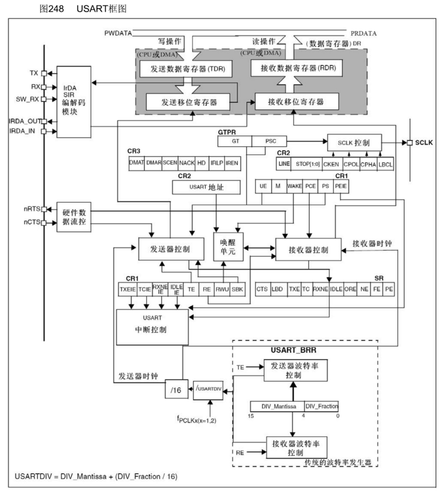


## 3.USART基本结构框图

- PCLK2/1接到波特率发生器用发产生波特率；
- 发送控制器和接收控制器用于分别控制TX和RX；
- 最后由发送数据寄存器和发送移位寄存器、接收移位寄存器和接受数据寄存器完成数据的发送和接收；
- **硬件上是四个寄存器，但是软件上只有一个DR寄存器可以供我们读写，写入和读出分别对应不同的两条路；**
- 开关控制：即Cmd函数开启供电；

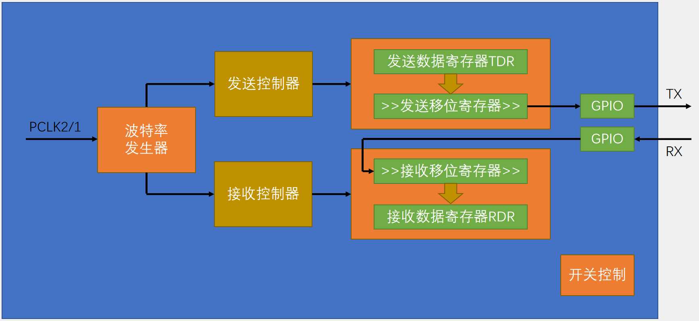


## 4.数据帧之字长设置和停止位长度

- 数据帧之字长设置
  - 接收数据时时钟的跳变沿要对齐数据的正中间；
  - 字长可选择八位或九位，这里的字长包括了校验位，一般选择九位字长带校验位和八位字长不带校验位；

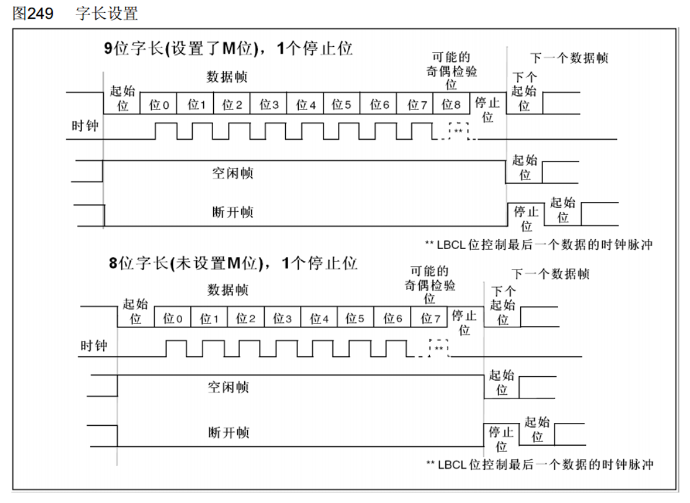

- 数据帧之停止位设置
  - 可设置停止位为0.5位、1位、1.5位和2位等；
  - 一般都选择停止位为1位；

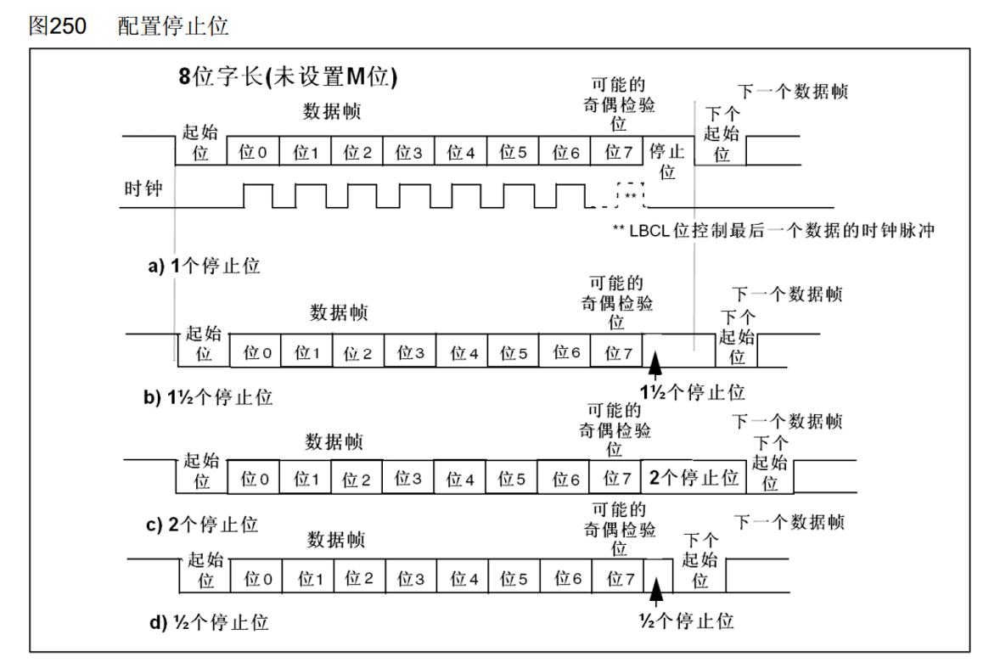


## 5.USART的接收与波特率发生器

### 5.1 USART的接收

- 起始位侦测：位置对齐策略
  - 以波特率的16倍进行采样；
  - 当检测到下降沿时，对起始位进行采样，每三位里至少两个0才认为是起始位；
  - 在8、9、10个采样时钟中，就实现了数据的对齐，后续都在8、9、10位进行采样；
  - 若不全为0，则会在**NE噪声标志位置1**；

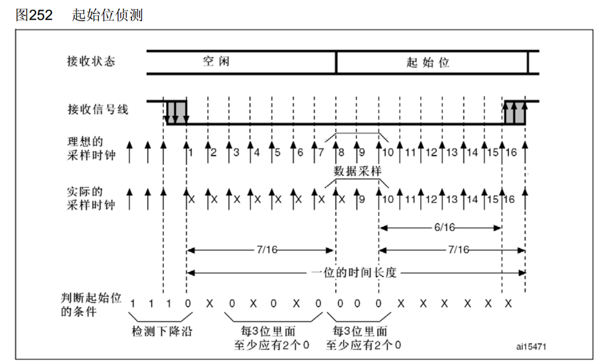

- 数据采样：判断数据为1还是0
  - 在一个数据位中有16个采样时钟，在第8、9、10次采样数据位即可，因为前面起始位已经对齐；
  - 采样三次是为了防止噪声，若没有噪声的情况下则三次肯定全为1或全位0；
  - 若有噪声导致不是全位1或0，则按照2：1的规则来，两次为1或0则认为接收到数据，且会**置标志位NE，说明数据有噪声**；

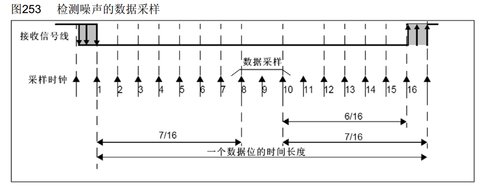

### 5.2 波特率发生器

- 发送器和接收器的波特率由**波特率寄存器BRR里的DIV**确定，且分为整数部分和小数部分；
- 计算公式为：**波特率 = fpclk2/1 / （16 * DIV）**，16是因为前面的16倍波特率的采样时钟；
- **波特率用库函数直接配置即可，不用自己计算，库函数会自己帮我们算然后写入BRR寄存器**；

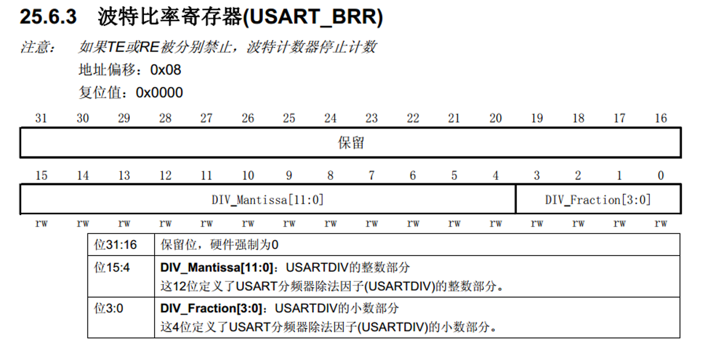


## 6.USB转串口模块

- 该模块的跳线帽用于为CH340芯片供电，供电引脚为CH340G_VCC，为5号引脚，需要将5号与6号或5号与4号引脚接，STM32是3.3V，所以**45号短接**；

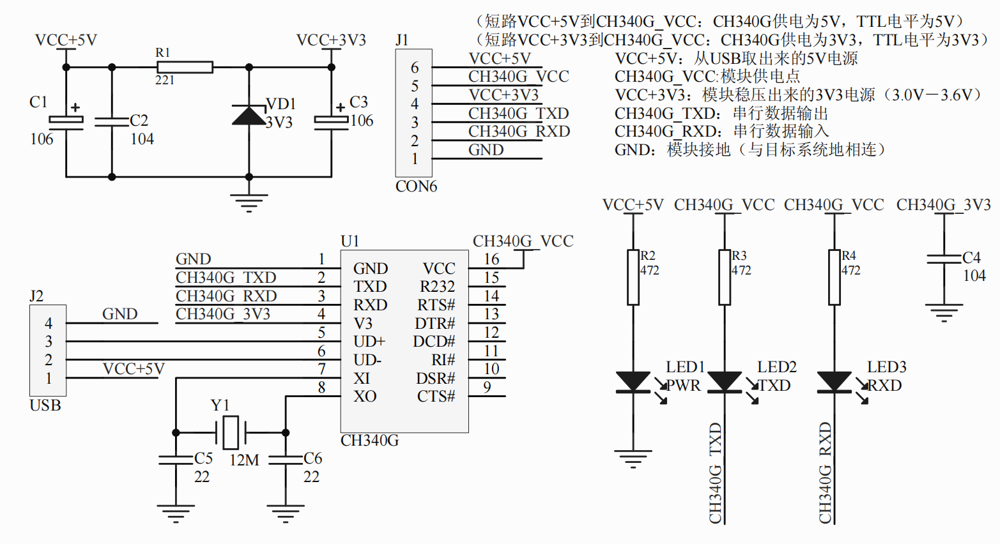


## 7.外设寄存器分类

对于外设而言，它的本质就是一堆寄存器堆出来的；对于每个外设而言，它的寄存器可分为：

- 状态寄存器SR；
- 数据寄存器DR；
- 配置寄存器CR；
- 其他寄存器；

---


# 第二十七节课：9-3_串口发送&串口发送和接收

## 1.初始化串口的基本流程
- 第一步：开启时钟，将需要用的USART和GPIO的时钟打开；
- 第二步：GPIO初始化，**把TX配置为复用输出，RX配置成输入**；
- 第三步：配置USART，直接使用结构体；
- 第四步：开关控制
  - 若只需要发送功能则可以直接打开开关控制即可；
  - 若还需要接收功能，可能还需要配置中断，即在开启USART之前加上ITConfig和NVIC的代码即可；


## 2.基本开发思路

- 初始化完成后，**要发送数据就调用发送函数即可，要接收数据就调用接收的函数即可**；
- 若要获取发送和接收的状态，就调用获取标志位的函数即可，**注意线路中传输的必须是十六进制数**；


## 3.标准库函数——stm32f10x_usart.h

- 初始化相关函数
  - USART_DeInit()
  - USART_Init()
  - USART_StructureInit()
  - USART_ClockInit()
  - USART_ClockStructureInit()
- 开关控制相关函数
  - USART_Cmd()：开启USART供电；
  - USART_DMACmd()：开启DMA供电；
- 中断函数
  - USART_ITConfig()：配置USART的中断；
- **数据发送接收相关函数**
  - **USART_SendData()**：发送数据，这个就是写DR寄存器；
  - **USART_RecriveData()**：接收数据，这个就是读DR寄存器；
- 标志位相关函数
  - USART_GetFlagStatus()；
  - USART_ClearFlag()；
  - USART_GetITStatus()；
  - USART_ClearITPendingBit()；


## 4. 串口助手与数据模式

### 4.1 串口助手

- **串口助手就是一个上位机**，可解析由单片机发过来的数据；
- 串口助手有很多，这里用的是up主自己做的，可选择**数据模式**和波特率等；
- 在使用过程中注意一些**转义字符的使用，比如在后面的HEX数据包中的换行符，它也是一个数据**，别忘记一起发送；

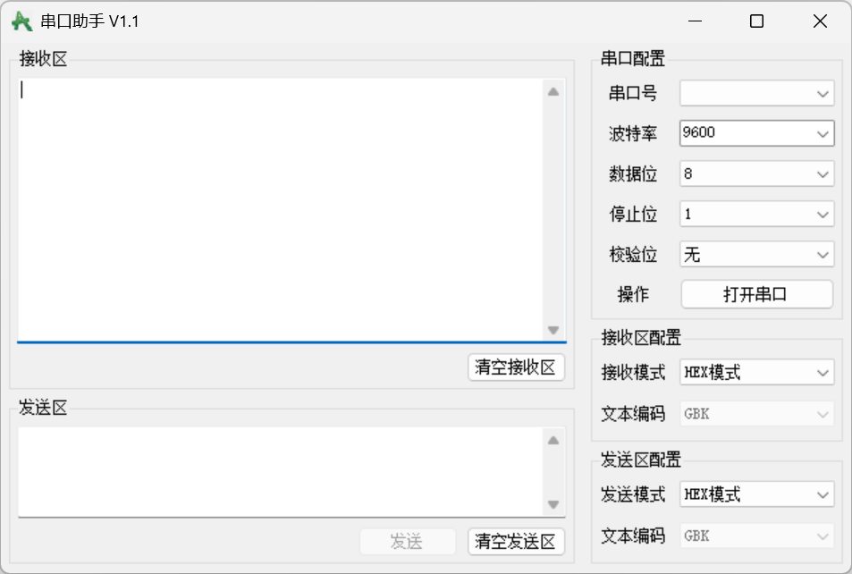

### 4.2 数据模式

- HEX模式/十六进制模式/二进制模式：以原始数据的形式显示；
- 文本模式/字符模式：以原始数据编码后的形式显示；

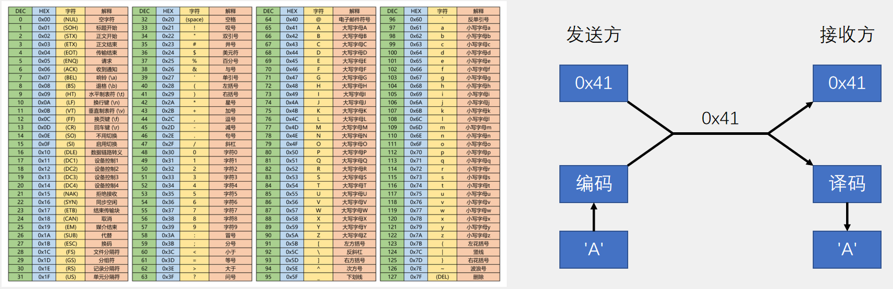


## 5.串口发送

### 5.1 接线图

- 这里选择USART1，即PA9和PA10口；

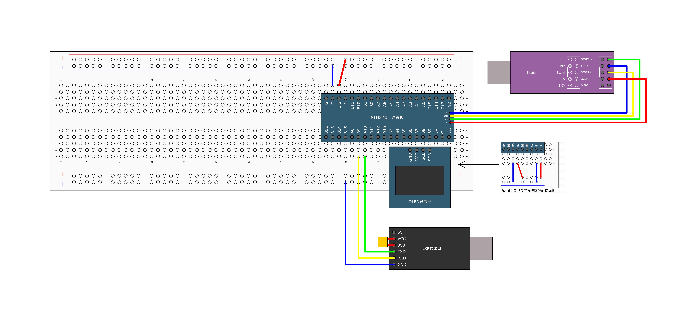

### 5.2 代码封装和编程

在”4-1 OLED显示屏“的基础上进行编程，并在Hardware组中添加**Serial.c和Serial.h文件**

- Serial.c文件编程

  - Serial的初始化：按照之前的步骤即可；
  - 发送一个字节的函数的封装：直接调用底层的发送数据函数；
  - 其他形式的数据发送函数封装：底层都是调用发送一个字节的函数，再加以一定的判断即可；

  - **printf()函数移植**

    - 先打开工程选项，勾选上**MicroLIB**，MicroLIB是Keil为嵌入式平台优化的一个精简库；

    - **printf函数默认是输出到屏幕，但是单片机没有屏幕，所以需要重定向，将printf函数打印的东西输出到串口；**

    - 重定向的步骤

      - 第一步：Serial.c文件的最开始加上**#include <stdio.h>**
      - 第二步：在最后面**重写fputc()函数**；

    - fputc()和printf()的关系

      - **fputc()是printf()的底层，printf()打印时不断调用fputc()函数打印，现在把fputc()重定向到串口，那printf()自然就输出到串口了**；

    - 重定向的局限性及解决方案

      - 之前的方式的重定向只能将printf()函数重定向到串口1，当多个串口都想用printf()时就不行了，可采用sprintf()函数解决；

      - sprintf()函数，因为sprintf可以指定打印位置，不涉及重定向的东西，所以每个串口都可以用sprintf()进行格式化打印；

      ```c
      //main.c文件中直接写
      
      char String[100];
      sprintf(String, "Num=%d\r\n", 666);
      Serial_SendString(String);
      
      ```

      - 每次都这样定义过于麻烦，可在Serial.c文件中进行封装

      ```c
      //对sprintf函数进行封装
      void Serial_Printf(char *format, ...)
      {
      	char String[100];
      	va_list arg;
      	va_start(arg, format);
      	vsprintf(String, format, arg);
      	va_end(arg);
      	Serial_SendString(String);
      }
      
      ```

  - 完整的Serial.c文件如下：

```c
#include "stm32f10x.h"                  // Device header
#include <stdio.h>                      //重定向printf()函数引入头文件
#include <stdarg.h>                     //为了封装sprintf函数引入头文件

void Serial_Init(void)
{
	//第一步：开启时钟
	RCC_APB2PeriphClockCmd(RCC_APB2Periph_USART1, ENABLE);       //USART1是APB2上的外设
	RCC_APB2PeriphClockCmd(RCC_APB2Periph_GPIOA, ENABLE);        //USART1的RX和TX引脚对应PA9和PA10，开启GPIOA的时钟
	
	//第二步：初始化GPIO引脚，这个代码只需要数据发送，只初始化TX即可
	GPIO_InitTypeDef GPIO_InitStructure;
 	GPIO_InitStructure.GPIO_Mode = GPIO_Mode_AF_PP;              //选择复用推挽输出
	GPIO_InitStructure.GPIO_Speed = GPIO_Speed_50MHz;
	GPIO_InitStructure.GPIO_Pin = GPIO_Pin_9;
 	GPIO_Init(GPIOA, &GPIO_InitStructure);
	
	//第三步：初始化USART
	/*代码技巧：可将前面的成员复制到后边，然后Ctrl+Alt+Space开启代码提示功能*/
	USART_InitTypeDef USART_InitStructure;
	USART_InitStructure.USART_BaudRate = 9600;                                             //波特率，直接写数值即可
	USART_InitStructure.USART_HardwareFlowControl = USART_HardwareFlowControl_None;        //不选择硬件流
	USART_InitStructure.USART_Mode = USART_Mode_Tx;                                        //模式
	USART_InitStructure.USART_Parity = USART_Parity_No;                                    //是否需要校验位
	USART_InitStructure.USART_StopBits = USART_StopBits_1;                                 //停止位的位数
	USART_InitStructure.USART_WordLength = USART_WordLength_8b;                            //选择字长，这里不需要校验位，所以是8位
	USART_Init(USART1, &USART_InitStructure);
	
	//第四步：开关控制开启USART
	USART_Cmd(USART1, ENABLE);
}

//写一个发送一个字节数据的函数
void Serial_SendByte(uint8_t Byte)
{
	USART_SendData(USART1, Byte);                                    //调用SendData函数进行发送数据，这里会将数据写入发送数据寄存器
	while (USART_GetFlagStatus(USART1, USART_FLAG_TXE) == RESET);    //判断发送数据寄存器中的值是否已经移位入移位寄存器中，且不需要手动清零
}

//发送数组的函数
void Serial_SendArray(uint8_t *Array, uint16_t Length)      //参数是指向待发送数组的首地址，并指定长度
{
	uint16_t i;                       //计数变量
	for (i = 0; i < Length; i ++)     //循环执行，对Array进行遍历
	{
		Serial_SendByte(Array[i]);    //不断发送Array中的元素
	}
}

//发送字符串的函数
void Serial_SendString(char *String)    //由于字符串自带结束位，所以不需要长度的参数
{
	uint8_t i;
	for (i = 0; String[i] != '\0'; i ++)
	{
		Serial_SendByte(String[i]);
	}
}

//定义次方函数，用于后面发送数字的函数提取数字
uint32_t Serial_Pow(uint32_t X, uint32_t Y)
{
	uint32_t Result = 1;
	while (Y --)
	{
		Result *= X;
	}
	return Result;
}

//发送数字的函数，并以字符的形式显示，需要一个个以文本的方式发送
void Serial_SendNumber(uint32_t Number, uint8_t Length)
{
	uint8_t i;
	for (i = 0; i < Length; i ++)
	{
		Serial_SendByte(Number / Serial_Pow(10, Length -i -1) % 10 + '0');        //参数以十进制从高位到低位依次发送，还要加上偏移
	}
}


//定义重定向函数
int fputc(int ch, FILE *f)
{
	Serial_SendByte(ch);
	return ch;
}

//对sprintf函数进行封装
void Serial_Printf(char *format, ...)
{
	char String[100];
	va_list arg;
	va_start(arg, format);
	vsprintf(String, format, arg);
	va_end(arg);
	Serial_SendString(String);
}

```

- Serial.h文件编程

```c
#ifndef __SERIAL_H
#define __SERIAL_H

#include <stdio.h>

void Serial_Init(void);
void Serial_SendByte(uint8_t Byte);
void Serial_SendArray(uint8_t *Array, uint16_t Length);
void Serial_SendString(char *String);
uint32_t Serial_Pow(uint32_t X, uint32_t Y);
void Serial_SendNumber(uint32_t Number, uint8_t Length);
void Serial_Printf(char *format, ...);

#endif

```

- main.c文件编程

```c
#include "stm32f10x.h"                  // Device header
#include "Delay.h"
#include "OLED.h"
#include "Serial.h"

int main(void)
{
	OLED_Init();
	Serial_Init();
	
	Serial_SendByte(0x41);
	
	uint8_t MyArray[] = {0x42, 0x43, 0x44, 0x45};
	Serial_SendArray(MyArray, 4);
	
	Serial_SendString("\r\nNum1=");
	Serial_SendNumber(111, 3);
	
	//第一种printf重定向的方法
	printf("\r\nNum2=%d", 222);
	
	//第二种，用sprintf函数
	char String[100];
	sprintf(String, "\r\nNum3=%d", 333);
	Serial_SendString(String);
	
	//第三种：封装sprintf()函数
	Serial_Printf("\r\nNum4=%d", 444);
	Serial_Printf("\r\n");
	
	//若要发送汉字，需要在C/C++中添加--no-multibyte-chars，并都选择UTF-8格式
	//否则两者都使用GB开头的中文编码格式，参数不用加
	//Serial_Printf("你好，世界");
	
	while (1)
	{
		
	}
}

```

- **若要发送汉字**，可有两种解决方法
  - C/C++中添加**--no-multibyte-chars**，并且在Keil和串口助手中都选择UTF-8格式；
  - Keil和串口助手都使用**GB开头**的中文编码格式，不用加参数；


## 5.串口发送和接收

- 串口的接收可采用**查询和中断两种方法**
  - 对于查询，其初始化与前面一致，只需要再初始化接收引脚即可；
  - 对于中断，初始化还需要开启中断并配置NVIC；
- 查询的方式：在主函数中不断判断RXNE标志位，若置1了即证明收到数据了，再调用ReceiveData()读取DR寄存器即可

- 中断的方式：在中断函数中进行USART数值的读取，本程序采用中断的方式
- Serial.c文件

```c
#include "stm32f10x.h"                  // Device header
#include <stdio.h>                      //重定向printf()函数引入头文件
#include <stdarg.h>                     //为了封装sprintf函数引入头文件

uint8_t Serial_RxData;
uint8_t Serial_RxFlag;

//这里选中普通GPIO口复用为串口的引脚，只需要使能USART即可将GPIO口的控制权交给USART，谁使能就交给谁，但是对于F4系列则需要配置为哪个外设的复用
void Serial_Init(void)
{
	//第一步：开启时钟
	RCC_APB2PeriphClockCmd(RCC_APB2Periph_USART1, ENABLE);       //USART1是APB2上的外设
	RCC_APB2PeriphClockCmd(RCC_APB2Periph_GPIOA, ENABLE);        //USART1的RX和TX引脚对应PA9和PA10，开启GPIOA的时钟
	
	//第二步：初始化GPIO引脚，这个代码需要数据发送和数据接收，初始化TX和RX
	GPIO_InitTypeDef GPIO_InitStructure;
 	GPIO_InitStructure.GPIO_Mode = GPIO_Mode_AF_PP;            //选择复用推挽输出
	GPIO_InitStructure.GPIO_Speed = GPIO_Speed_50MHz;
	GPIO_InitStructure.GPIO_Pin = GPIO_Pin_9;                  //接收和发送分别对应PA9和PA10
 	GPIO_Init(GPIOA, &GPIO_InitStructure);
	
	GPIO_InitStructure.GPIO_Mode = GPIO_Mode_IPU;              //选择上拉输入
	GPIO_InitStructure.GPIO_Speed = GPIO_Speed_50MHz;
	GPIO_InitStructure.GPIO_Pin = GPIO_Pin_10;                 //接收和发送分别对应PA9和PA10
 	GPIO_Init(GPIOA, &GPIO_InitStructure);
	
	//第三步：初始化USART
	/*代码技巧：可将前面的成员复制到后边，然后Ctrl+Alt+Space开启代码提示功能*/
	USART_InitTypeDef USART_InitStructure;
	USART_InitStructure.USART_BaudRate = 9600;                                             //波特率，直接写数值即可
	USART_InitStructure.USART_HardwareFlowControl = USART_HardwareFlowControl_None;        //不选择硬件流
	USART_InitStructure.USART_Mode = USART_Mode_Tx | USART_Mode_Rx;                        //模式，这里需要或上两者
	USART_InitStructure.USART_Parity = USART_Parity_No;                                    //是否需要校验位
	USART_InitStructure.USART_StopBits = USART_StopBits_1;                                 //停止位的位数
	USART_InitStructure.USART_WordLength = USART_WordLength_8b;                            //选择字长，这里不需要校验位，所以是8位
	USART_Init(USART1, &USART_InitStructure);
	
	//若用中断的方法接收，则需要开启中断并配置NVIC，即只要RXNE置1就会产生通向NVIC的中断
	USART_ITConfig(USART1, USART_IT_RXNE, ENABLE);      //选择RXNE的中断，开启RXNE标志位到NVIC的输出
	
	NVIC_PriorityGroupConfig(NVIC_PriorityGroup_2);     //NVIC分组
	
	NVIC_InitTypeDef NVIC_InitStructure;                           //初始化NVIC的USART1的通道
	NVIC_InitStructure.NVIC_IRQChannel = USART1_IRQn;              //选择通道
	NVIC_InitStructure.NVIC_IRQChannelCmd = ENABLE;                //使能
	NVIC_InitStructure.NVIC_IRQChannelPreemptionPriority = 1;      //优先级
	NVIC_InitStructure.NVIC_IRQChannelSubPriority = 1;             //优先级
	NVIC_Init(&NVIC_InitStructure);
	
	//第四步：开关控制开启USART
	USART_Cmd(USART1, ENABLE);
}

//写一个发送数据的函数
void Serial_SendByte(uint8_t Byte)
{
	USART_SendData(USART1, Byte);                                    //调用SendData函数进行发送数据，这里会将数据写入发送数据寄存器
	while (USART_GetFlagStatus(USART1, USART_FLAG_TXE) == RESET);    //判断发送数据寄存器中的值是否已经移位入移位寄存器中，且不需要手动清零
}

//发送数组的函数
void Serial_SendArray(uint8_t *Array, uint16_t Length)      //参数是指向待发送数组的首地址，并指定长度
{
	uint16_t i;                        //计数变量
	for (i = 0; i < Length; i ++)      //循环执行，对Array进行遍历
	{
		Serial_SendByte(Array[i]);     //不断发送Array中的元素
	}
}

//发送字符串的函数
void Serial_SendString(char *String)    //由于字符串自带结束位，所以不需要长度的参数
{
	uint8_t i;
	for (i = 0; String[i] != '\0'; i ++)
	{
		Serial_SendByte(String[i]);
	}
}

//定义次方函数，用于后面发送数字的函数提取数字
uint32_t Serial_Pow(uint32_t X, uint32_t Y)
{
	uint32_t Result = 1;
	while (Y --)
	{
		Result *= X;
	}
	return Result;
}

//发送数字的函数，并以字符的形式显示
void Serial_SendNumber(uint32_t Number, uint8_t Length)
{
	uint8_t i;
	for (i = 0; i < Length; i ++)
	{
		Serial_SendByte(Number / Serial_Pow(10, Length -i -1) % 10 + '0');        //参数以十进制从高位到低位依次发送，还要加上偏移
	}
}

//定义重定向函数
int fputc(int ch, FILE *f)
{
	Serial_SendByte(ch);
	return ch;
}

//对sprintf函数进行封装
void Serial_Printf(char *format, ...)
{
	char String[100];
	va_list arg;
	va_start(arg, format);
	vsprintf(String, format, arg);
	va_end(arg);
	Serial_SendString(String);
}

//写一个返回是否读取的函数
uint8_t Serial_GetFlag(void)
{
	if (Serial_RxFlag == 1)
	{
		Serial_RxFlag = 0;
		return 1;
	}
	return 0;
}

//写一个返回读取值的函数，主要是为了不用跨文件使用变量，可以直接调用返回
uint8_t Serial_GetRxData(void)
{
	return Serial_RxData;
}

//写中断函数
void USART1_IRQHandler(void)
{
	if (USART_GetITStatus(USART1, USART_IT_RXNE) == SET)
	{
		Serial_RxData = USART_ReceiveData(USART1);         //直接读DR寄存器
		Serial_RxFlag = 1;                                 //读完之后置一个自己的标志位
		USART_ClearITPendingBit(USART1, USART_IT_RXNE);    //若读取了DR寄存器会自动清除标志位，但这里手动清除一下也没关系
	}
}

```

- USART.h文件

```c
#ifndef __SERIAL_H
#define __SERIAL_H

#include <stdio.h>

void Serial_Init(void);
void Serial_SendByte(uint8_t Byte);
void Serial_SendArray(uint8_t *Array, uint16_t Length);
void Serial_SendString(char *String);
uint32_t Serial_Pow(uint32_t X, uint32_t Y);
void Serial_SendNumber(uint32_t Number, uint8_t Length);
void Serial_Printf(char *format, ...);

uint8_t Serial_GetFlag(void);
uint8_t Serial_GetRxData(void);

#endif

```

- main.c文件

```c
#include "stm32f10x.h"                  // Device header
#include "Delay.h"
#include "OLED.h"
#include "Serial.h"

uint8_t RxData;

int main(void)
{
	OLED_Init();
	OLED_ShowString(1, 1, "RxData:");
	
	Serial_Init();
	
	
	//不断判断RXNE标志位，置1则读取
	while (1)
	{
		if (Serial_GetFlag() == 1)                //用自己封装的标志位判断
		{
			RxData = Serial_GetRxData();            //调用自己的函数读取
			Serial_SendByte(RxData);                //数据回传功能
			OLED_ShowHexNum(1, 1, RxData, 2);
		}
	}
}

```

---


# 第二十八节课：9-4_USART串口数据包

## 1.数据包格式
### 1.1 HEX数据包格式

- 固定包长，含包头包尾；
  - 一个数据包内所包含的数据数量是一定的；

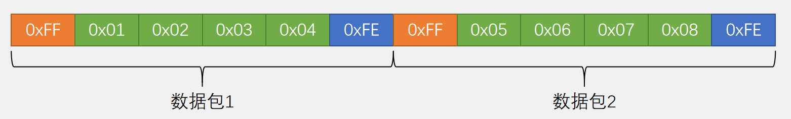

- 可变包长，含包头包尾；
  - 一个数据包内所包含的数据数量是可变的；

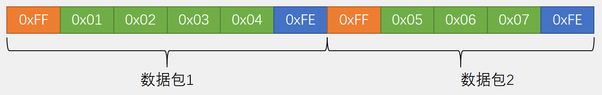

- **问题1：若数据和包头包尾重复怎么办？**
  - 第一种是限制载荷数据的范围，即让数据不能出现包头包尾的数据；
  - 第二种是尽量使用固定包长，这样在接收数据的时候不会判断是否为包头包尾；
  - 第三种是增加包头包尾的数量，如用0xFE和0xFF作为包头等；
- **问题2：并不是所有的数据都是需要包头和包尾的**
  - 比如可以只选包头而不要包尾，但这样会增加问题1发生的概率；
- **问题3：固定包长和可变包长的选择问题**
  - 若数据会和包头包尾重复则选用固定包长；
- **问题4：各种数据转换为字节流的问题**
  - 这里的HEX数据包格式都是一个个字节组成的，若想发送uint16_t、结构体、float等数据格式都没问题，因为它们内部也是一个个字节存储的，用一个uint8_t的指针，把它们当成一个字节数组发送即可；

### 1.2 文本数据包格式（通常以换行作为包尾）

- 文本数据包与HEX数据包最大的区别就是文本数据包需要经过编译码；
- 第一种：固定包长，含包头包尾

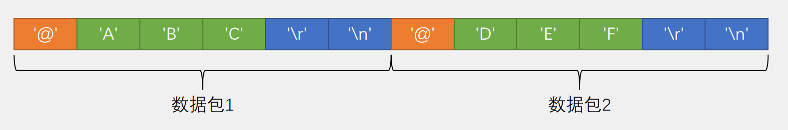

- 第二种：可变包长，含包头包尾

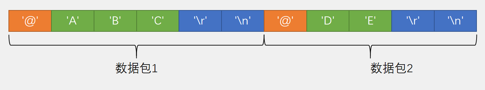

- 文本数据包比较适合一些输入指令和人机交互的场合，比如：
  - 蓝牙模块常用的AT指令；
  - CNC和3D打印常用的G代码；
- 文本数据包的缺点是效率较低
  - **如发送一个数字100，用HEX数据包就是发送原始数据，但是文本数据包就需要单独的发送1、0、0三个数字对应的文本，每个文本都一个字节；**


## 3.HEX数据包发送和接收

### 3.1 HEX数据包的发送

- 只需要定义一个数组，调用**SendArray()函数**即可完成发送；

### 3.2 HEX数据包的接收（固定包长）——状态机

- 问题：
  - 接收数据时，**每收到一个字节都会进一遍中断**，在中断函数中可以拿到这个字节；
  - **拿到之后就得退出中断**，所以每拿到一个数据都是一个独立的过程；
  - 但是数据包的前后应该是有联系的，且对于**包头、数据、包尾这三种状态都会有不同的处理逻辑；**
- 解决方法：状态机
  - 设计一个能记住不同状态的机制，**在不同的状态执行不同的操作，同时还要进行状态的合理转移**，这就是状态机；
- 设计状态机
  - 定义三个状态，**等待包头、接收数据、等待包尾**，每个状态都需要**用一个变量**来标志一下；
- 状态机的执行流程
  - 最开始**S=0**，收到一个数据则进入中断；
  - 根据S=0进入第一个状态的程序，**判断是否为包头FF**，若是FF则代表收到包头，之后置**S=1**，退出中断，结束；
  - 下次再进中断，根据S=1，就可以进行接收数据的程序了
    - 再定义一个变量，记录**收了多少个数据**；
    - 若**没收够4个数据**则一直处于接收状态；
    - 若收够了，则置**S=2**，下次进中断时就可以进入**下一个状态等待包尾**了；
  - 若接收到包尾FE，则置**S=0**，开始下一个轮回；

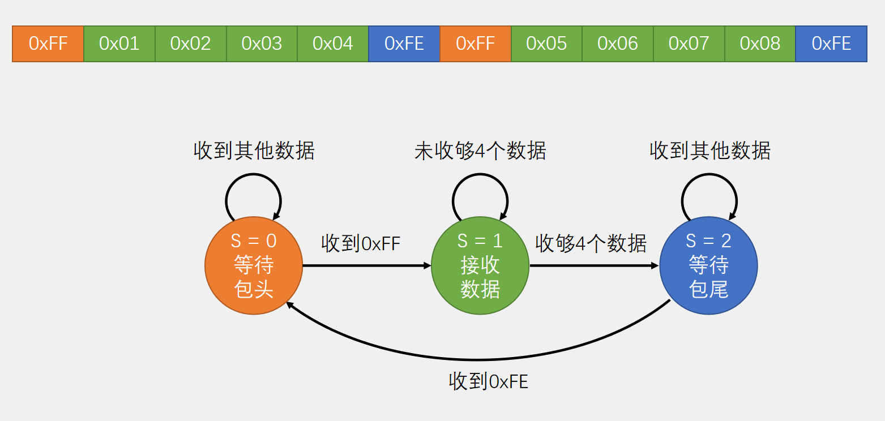


## 4.文本数据包发送和接收

### 4.1 文本数据包的发送

- 只需要定义一个字符串，调用SendString()即可；

### 4.2 文本数据包的接收（可变包长）

- 思路：同样利用状态机
- 设计：三个状态
  - **等待包头**，判断是否为@；
  - 收到@则进入**接收数据等待包尾状态**，这个接收状态需要兼具等待包尾的功能，因为是**可变包长**；
  - 在收到**'\r'**后还需要等待包尾**‘\n’**；

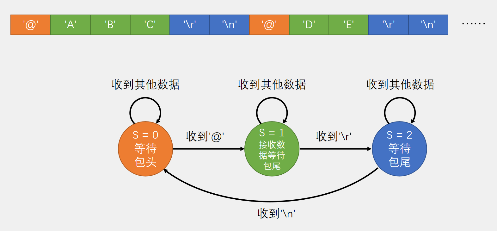

---


# 第二十九节课：9-5_串口收发HEX数据包&串口收发文本数据包

## 1.串口收发HEX数据包

### 1.1 接线图

- 在PB1口接一个按键，用于控制；
- 在串口助手中需要同时选择为HEX格式，并且需要以"FF ** ** ** ** FE"的格式发送数据；


### 1.2 代码封装

- 在"9-2 串口发送+接收"工程的基础上进行修改，格式为固定包长，包含包头包尾；

- Serial.c文件编程

  - 在原有基础上，封装串口收发HEX数据包的函数；

  ```c
  //定义两个缓冲区数据用于存放数据,可直接在.h文件中声明为外部变量,直接传递这两个数组
  uint8_t Serial_TxPacket[4];
  uint8_t Serial_RxPacket[4];
  
  //写一个发送数据包的函数，调用即可将TxPacket数组的4个数据自动加上包头包尾发送出去
  void Serial_SendPacket(void)
  {
  	Serial_SendByte(0xFF);                    //发送包头
  	Serial_SendArray(Serial_TxPacket, 4);     //发送数组
  	Serial_SendByte(0xFE);                    //发送包尾
  }
  
  ```

  - 接着在中断函数中根据状态机写接收HEX数据包的函数：

  ```c
  //根据状态机写中断函数
  void USART1_IRQHandler(void)
  {
  	static uint8_t RxState = 0;       //定义一个状态变量
  	static uint8_t pRxPacket = 0;      //定义变量计数接收到的数据量
  	if (USART_GetITStatus(USART1, USART_IT_RXNE) == SET)
  	{
  		uint8_t RxData = USART_ReceiveData(USART1);
  		
  		if (RxState == 0)       //进入等待包头的程序
  		{
  			if (RxState == 0xFF)  //若接收到包头，则将状态置1
  			{
  				RxState = 1;
  				pRxPacket = 0;      //置0为下一次接收数据做准备
  			}
  		}
  		
  		else if (RxState == 1)  //进入接收数据的程序
  		{
  			Serial_RxPacket[pRxPacket] = RxData;      //将数据存入数组
  			pRxPacket ++;                             //计数++
  			if (pRxPacket >= 4)                       //若接收数据满4，则将状态置2
  			{
  				RxState = 2;
  			}
  		}
  		
  		else if (RxState == 2)  //进入等待包尾的程序
  		{
  			if (RxData == 0xFE)
  			{
  				RxState = 0;
  				Serial_RxFlag = 1;         //置自己的标志位，表示收到数据
  			}
  		}
  		USART_ClearITPendingBit(USART1, USART_IT_RXNE);    //若读取了DR寄存器会自动清除标志位，但这里手动清除一下也没关系
  	}
  }
  
  ```

- Serial.h文件编程

  - 声明两个函数并将两个数组定义为全局数组

  ```c
  #ifndef __SERIAL_H
  #define __SERIAL_H
  
  #include <stdio.h>
  
  extern uint8_t Serial_TxPacket[];      //声明为外部可调用
  extern uint8_t Serial_RxPacket[];
  
  void Serial_Init(void);
  void Serial_SendByte(uint8_t Byte);
  void Serial_SendArray(uint8_t *Array, uint16_t Length);
  void Serial_SendString(char *String);
  uint32_t Serial_Pow(uint32_t X, uint32_t Y);
  void Serial_SendNumber(uint32_t Number, uint8_t Length);
  void Serial_Printf(char *format, ...);
  
  void Serial_SendPacket(void);
  uint8_t Serial_GetRxFlag(void);
  
  #endif
  
  ```

- main.c文件编程

```c
#include "stm32f10x.h"                  // Device header
#include "Delay.h"
#include "OLED.h"
#include "Serial.h"
#include "Key.h"

uint8_t KeyNum;

int main(void)
{
	OLED_Init();
	Key_Init();
	Serial_Init();
	
	OLED_ShowString(1, 1, "TxPacket:");
	OLED_ShowString(3, 1, "RxPacket:");
	
	//初始化缓冲数组
	Serial_TxPacket[0] = 0x01;
	Serial_TxPacket[1] = 0x02;
	Serial_TxPacket[2] = 0x03;
	Serial_TxPacket[3] = 0x04;
	
	while (1)
	{
		KeyNum = Key_GetNum();
		if (KeyNum == 1)                  //按键每按下一次，数据加1
		{
			Serial_TxPacket[0] ++;
			Serial_TxPacket[1] ++;
			Serial_TxPacket[2] ++;
			Serial_TxPacket[3] ++;
			
			Serial_SendPacket();            //发送数据
			
			//在第二行显示发送的数据
			OLED_ShowHexNum(2, 1, Serial_TxPacket[0], 2);
			OLED_ShowHexNum(2, 4, Serial_TxPacket[1], 2);
			OLED_ShowHexNum(2, 7, Serial_TxPacket[2], 2);
			OLED_ShowHexNum(2, 10, Serial_TxPacket[3], 2);
		}
		
		if (Serial_GetRxFlag() == 1)     //接收到的数据放在第四行显示
		{
			OLED_ShowHexNum(4, 1, Serial_RxPacket[0], 2);
			OLED_ShowHexNum(4, 4, Serial_RxPacket[1], 2);
			OLED_ShowHexNum(4, 7, Serial_RxPacket[2], 2);
			OLED_ShowHexNum(4, 10, Serial_RxPacket[3], 2);
		}
	}
}

```


## 2.串口收发文本数据包

### 2.1 接线图

- 在PA1口接一个LED，用串口收发的文本数据包来控制LED的亮灭；
- 串口助手中需要同时选择文本模式，然后发送格式必须在最后加上**换行符**；


### 2.2 代码封装

- 在上一个工程的基础上进行修改，格式为可变包长包含包头包尾；
- Serial.c文件编程
  - 删除上一小节封装的发送串口的函数；
  - 在中断函数中，基于状态机写接收串口的函数；

```c
//根据状态机写中断函数，在电脑端发送数据时记得加上\n
void USART1_IRQHandler(void)
{
	static uint8_t RxState = 0;       //定义一个状态变量
	static uint8_t pRxPacket = 0;      //定义变量计数接收到的数据量
	if (USART_GetITStatus(USART1, USART_IT_RXNE) == SET)
	{
		uint8_t RxData = USART_ReceiveData(USART1);
		
		if (RxState == 0)       //进入等待包头的程序
		{
			if (RxState == '@' && Serial_RxFlag == 0)  //若接收到包头并且已经完成当次接收，才将状态置1
			{
				RxState = 1;
				pRxPacket = 0;      //置0为下一次接收数据做准备
			}
		}
		
		else if (RxState == 1)  //进入接收数据的程序
		{
			if (RxData == '\r')   //需要首先判断是不是接收到包尾，因为这里是可变包长
			{
				RxState = 2;
			}
			else
			{
				Serial_RxPacket[pRxPacket] = RxData;      //将数据存入数组
				pRxPacket ++;                             //计数++				
			}
		}
		
		else if (RxState == 2)  //进入等待包尾的程序
		{
			if (RxData == '\n')   //这里只需要检测是不是等于第二个包尾，因为第一个包尾在前面检测了
			{
				RxState = 0;
				Serial_RxPacket[pRxPacket] = '\0';	//这里添加结束位，即字符串的结束位			
				Serial_RxFlag = 1;                  //置自己的标志位，表示收到数据

			}
		}
		USART_ClearITPendingBit(USART1, USART_IT_RXNE);    //若读取了DR寄存器会自动清除标志位，但这里手动清除一下也没关系
	}
}

```

- Serial.h文件编程

```c
#ifndef __SERIAL_H
#define __SERIAL_H

#include <stdio.h>

//声明外部可调用
extern char Serial_RxPacket[];
extern uint8_t Serial_RxFlag;

void Serial_Init(void);
void Serial_SendByte(uint8_t Byte);
void Serial_SendArray(uint8_t *Array, uint16_t Length);
void Serial_SendString(char *String);
uint32_t Serial_Pow(uint32_t X, uint32_t Y);
void Serial_SendNumber(uint32_t Number, uint8_t Length);
void Serial_Printf(char *format, ...);

#endif

```

- main.c文件编程：加入LED控制部分；

```c
#include "stm32f10x.h"                  // Device header
#include "Delay.h"
#include "OLED.h"
#include "Serial.h"
#include "LED.h"
#include <string.h>    //C语言官方的字符串库

uint8_t KeyNum;        //存储按键的状态

int main(void)
{
	OLED_Init();
	Serial_Init();
	LED_Init();
	
	OLED_ShowString(1, 1, "TxPacket:");
	OLED_ShowString(3, 1, "RxPacket:");
	
	while (1)
	{
		if (Serial_RxFlag == 1)    //若接收到数据包
		{
			OLED_ShowString(4, 1, "                ");   //擦除第四行
			OLED_ShowString(4, 1, Serial_RxPacket);      //第四行显示接收到的数据
			
			if (strcmp(Serial_RxPacket, "LED_ON") == 0)    //字符串比较，若相等进入分支
			{
				LED1_ON();
				Serial_SendString("LED_ON_OK\r\n");
				OLED_ShowString(2, 1, "                ");
				OLED_ShowString(2, 1, "LED_ON_OK");
			}
			else if (strcmp(Serial_RxPacket, "LED_OFF") == 0)    //字符串比较，若相等进入分支
			{
				LED1_OFF();
				Serial_SendString("LED_ON_OFF\r\n");
				OLED_ShowString(2, 1, "                ");
				OLED_ShowString(2, 1, "LED_OFF_OK");
			}
			else                                                  //若都不匹配则显示指令错误
			{
				Serial_SendString("ERROR_COMMAND\r\n");
				OLED_ShowString(2, 1, "                ");
				OLED_ShowString(2, 1, "ERROR_COMMAND");
			}
			
			Serial_RxFlag = 0;                //在这里将其置零，避免数据包错位
		}
	}
}

```

- 问题回顾
  - 主要问题可能出现在数据包发送过快无法接收上，所以这里把接收串口和发送串口的逻辑给完全分开了；
  - 这样就不会发生错位了，也就是在接收时可能接收到了两个错位的数据；

---


# 第三十节课：9-6_FlyMCU串口下载&STLINK Utility

## 1.FlyMcu串口下载

### 1.1 FlyMCU程序介绍

- 绿色软件，只需要得到安装包即可双击打开，**无需安装**；
- 没有STLINK可以用过这个软件给STM32通过串口的方式下载程序，跟**51单片机的STC-ISP**用途一样；

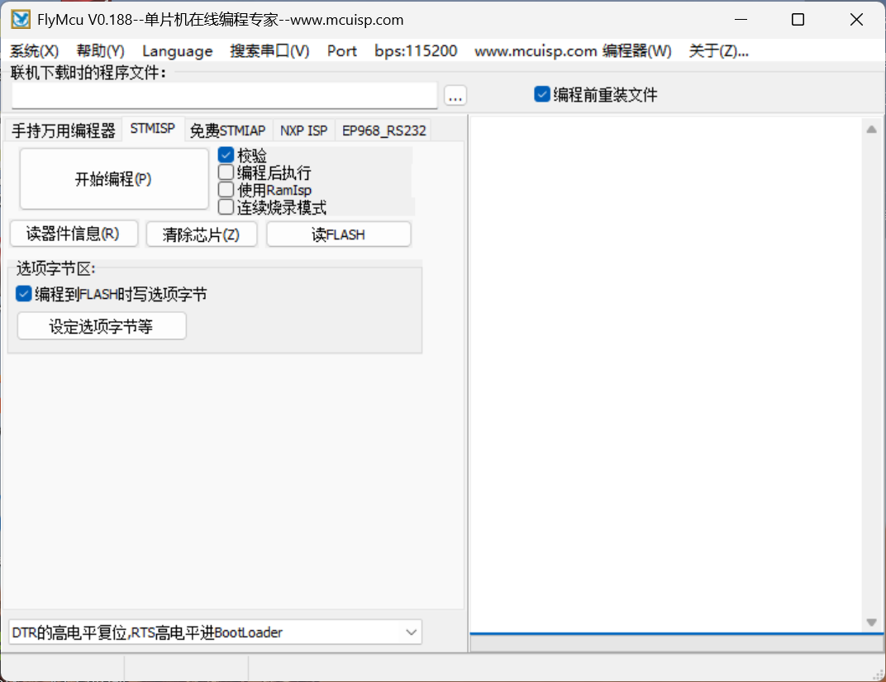

### 1.2 FlyMCU进行串口下载的手动操作

- 连接一个串口的电路，这个电路要保证USART1和电脑进行串口通信**（必须是USART1）**；
- 接着在Keil中点击工程选项里的**Output选项**，选择**Create HEX File**；

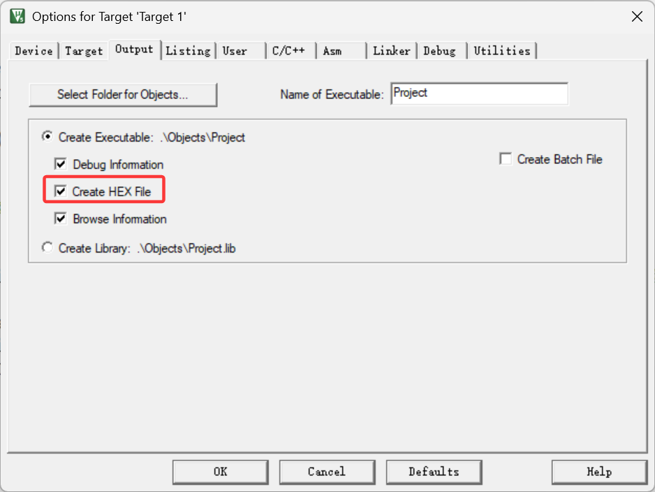

- 在文件的**Objects文件夹**下，找到编译时生成的**HEX文件**，这就是串口下载需要的文件；
- 回到FlyMcu，选择端口和波特率，并找到刚才的HEX文件；
- 在开始编程之前，需要配置BOOT引脚，**让STM32执行BootLoader程序**
  - 即**BOOT0配置为1，并按下复位键**，即可运行BootLoader程序，即**不断接收USART1的数据并刷新到主闪存Flash中；**
  - 点击开始编程，即可将HEX程序文件通过BootLoader程序下载进Flash中；
  - 接着将BOOT0换回来置0，再按一下复位，程序就会从Flash开始执行，即可执行程序；
  - BootLoader程序就相当于是手机的刷机模式或是电脑的PE系统，辅助主程序进行自我更新；

### 1.3 FlyMCU进行串口下载的自动操作

- 第一种：通过**自动下载电路**进行

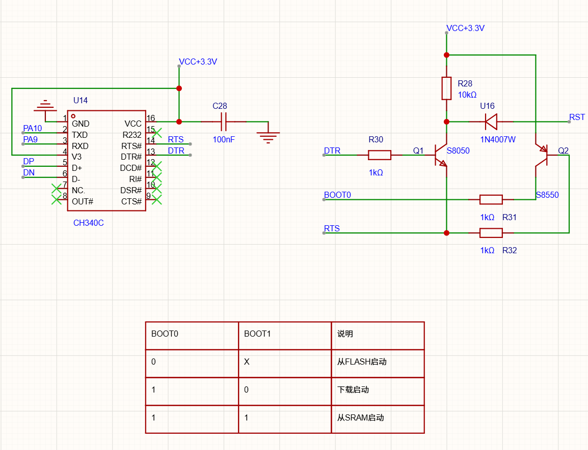

- 第二种：配置FlyMCU进行自动下载
  - 勾选变成后执行；
  - 取消勾选编程到Flash时写选项字节；
  - 这样下载后就可以自动执行了，但是再次复位时执行的仍然是BootLoader的程序；

### 1.4 FlyMCU的其他功能

- 读Flash功能
  - 可将STM32中的Flash的程序以**bin格式**输出；
  - **但是只能输出bin格式，不能输出hex格式**；
  - 这个功能可以盗用别人的程序，但可通过后面的选项字节来设置读保护，这样人家就偷不了了；
- 清除芯片
  - 清除芯片中的数据，清除后数据全部都是**FF**；
- 读器件信息
  - 可读出STM32芯片的一些器件号、存储器大小等等信息；
- 设定选项字节——**存储不随程序变化的参数**
  - 读保护字节——用于防止别人盗用程序
    - 设置成A5时允许读出，设置成FF阻止读出；
    - 但是一旦把它设置成FF后，再回Keil中下载程序就会失败，**需要回到这里重新允许读出才能正常下载**；
    - 除此之外，**在回来取消读保护时会清空程序**，这样就可以保证STM32里面的程序不会被偷走了；
  - 硬件选项字节
    - 包括看门狗、停机模式等等；
  - 用户数据字节
    - 可供用户自定义；
  - 写保护字节
    - 可对Flash的每几个页单独进行写保护；
    - 设置写保护后，这几页就无法再写了，需要再回来取消写保护即可；
    - 如果设置了前几页写保护，再次进行程序下载时，可能就会出错，因为程序要从头开始烧录；
  - 设置完成后，点击”采用这个设置“，然后再勾选”编程到Flash时写选项字节“，再点击”开始编程“，即可更新选项字节；
  - **注意，对于这个软件，不能单独进行写入选项字节，只能下载到Flash时顺便写入选项字节，所以会与写保护时导致的无法下载形成死循环；**

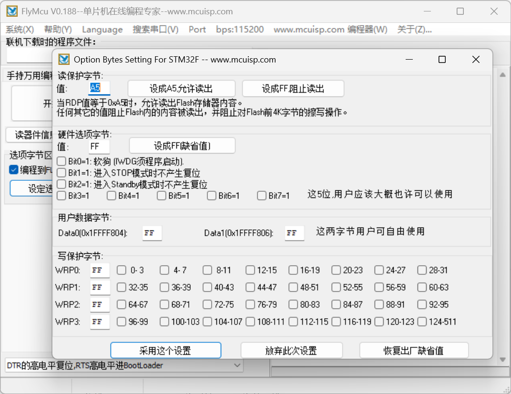


## 2.STLINK Utility
- 软件不是 绿色软件，需要单独安装；
- 配合STLINK进行使用，可以通过STLINK给STM32下载程序，程序的文件类型支持**hex和bin**；
- 点击第三个连接的图标，就可以通过STLINK连接到STM32，并展示整个Flash的内容；
- 可点击保存按钮，将STM32内部的数据保存起来，可选择为**hex和bin格式**；
- 配合STLINK进行使用，可以通过STLINK给STM32下载程序，程序的文件类型支持**hex和bin**
  - 点击第一个”文件“按钮，选择要下载的文件；
  - 点击第六个”编程“按钮，再点击Start即可下载程序；
- 点击第五个”橡皮檫“按钮，可擦除整个Flash；

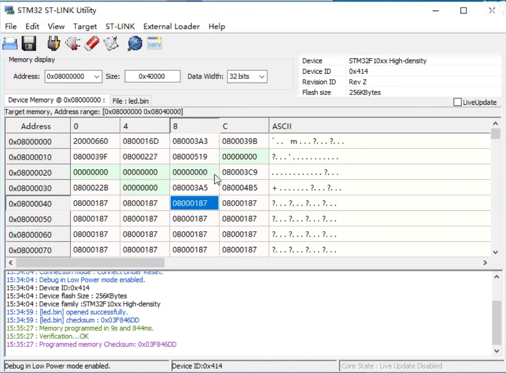

- 选项字节：相比FlyMCU，这个的选项字节可以单独设置
  - 点击Target，再选择Option Bytes即可打开选项字节页面；
  - 其也是分为了四大块，选择对应的配置后，直接Apply即可完成设置，而不像FlyMCU那样需要下载至Flash才顺便设置选项字节；

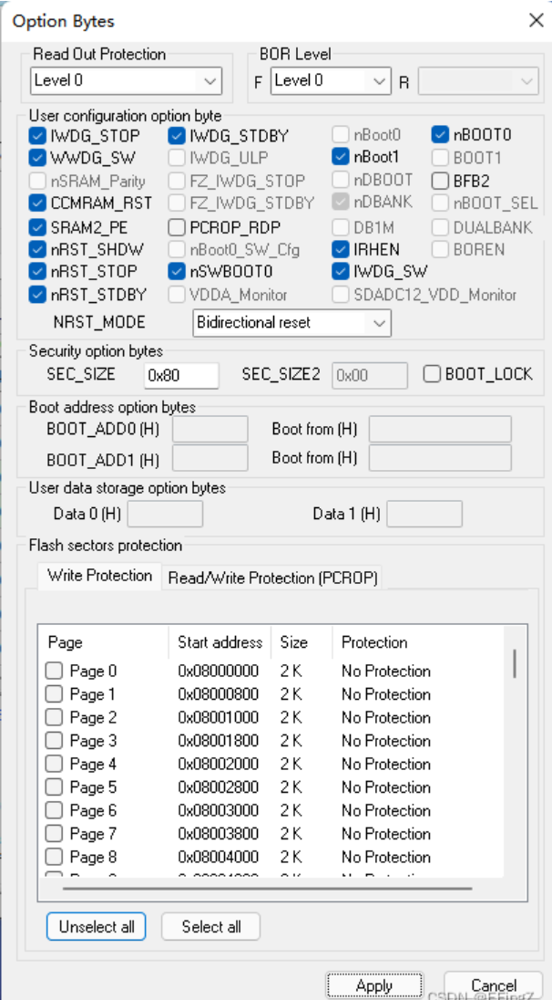

- 除了上述功能，STLINK Utility还可以对STLINK进行驱动更新

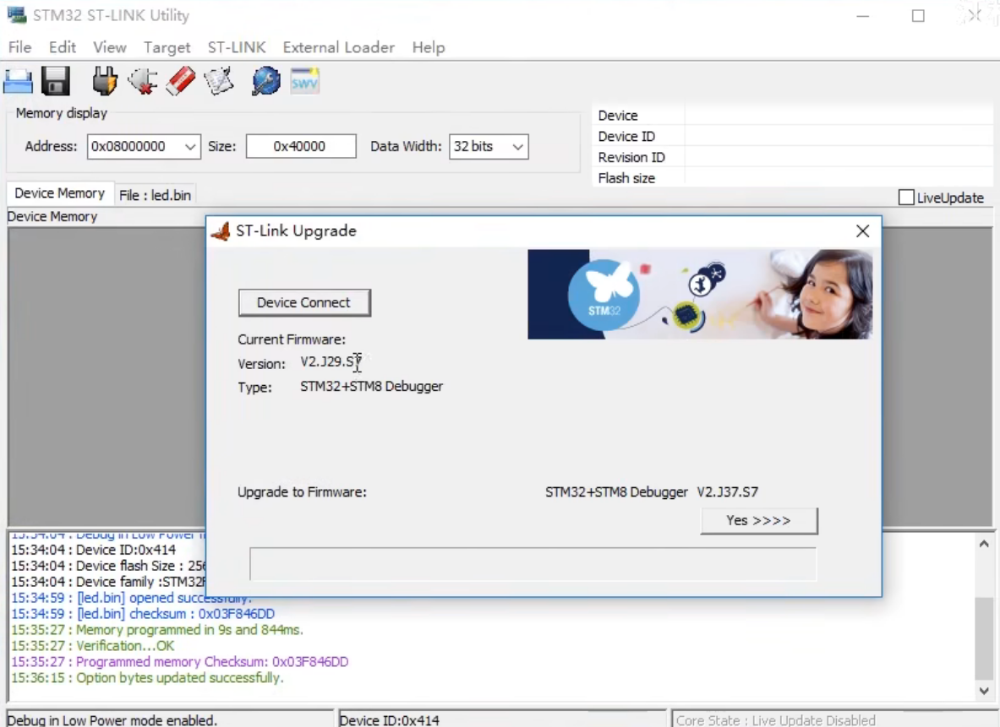

---


# 第三十一节课：10-1_I2C通信协议

## 1.I2C通信协议（同步的稳定性会更高）
- I2C总线：由**Philips公司**开发的一种通用数据总线；
- 两根通信线
  - SCL：为时钟线，Serial Clock；
  - SDA：为数据线，Serial Data；
- 特点
  - 同步时序的通信协议；
  - 半双工的通信协议，即同一时刻只有有一个人在读或写；
  - **带数据应答的通信协议**；
  - 支持总线挂载多设备，包括**一主多从和多主多从**；
- 由于是同步时序，所以可以很简单的由软件来模拟，而对于像串口那样的异步时序，就很难用软件模拟了；
- 控制外设的本质：即读写外设的寄存器，其与STM32内部的外设控制本质的一样的；

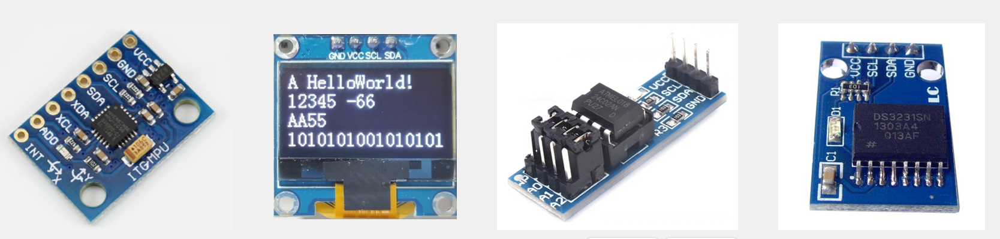


## 2.I2C的硬件电路连接

- 所有I2C设备的SCL连在一起，SDA连在一起；
- **任何时候SCL都是被主机控制的**；
- 总线的控制逻辑：
  - 设备的SCL和SDA均要求配置成**开漏输出模式**（右图所示），**这是为了防止数据线上两者同时输出了一个高电平和低电平**；
  - **开漏输出模式下，只能输出低电平，无法输出高电平，高电平表现为高阻态**；
  - 所以SCL和SDA各添加一个**上拉电阻**，阻值一般为4.7KΩ左右，是一种弱上拉，避免高电平的浮空；
  - **当要输出低电平时就放手就行了，电平被上拉电阻自动拉为高电平；**
  - 由于**在输出模式下输入模式仍有效**，所以释放总线相当于切换成了输入模式（直接读输入数据寄存器即可）；
  - 可完全杜绝电路的短接，保证电路的安全，当为空闲状态时，两者均为高电平；
- 线与的特性：
  - 任何一个从机输出低电平总线就是低电平，只有所有设备都输出高电平才是高电平；
  - 利用该特性可实现多主机模式下的时钟同步和总线仲裁；

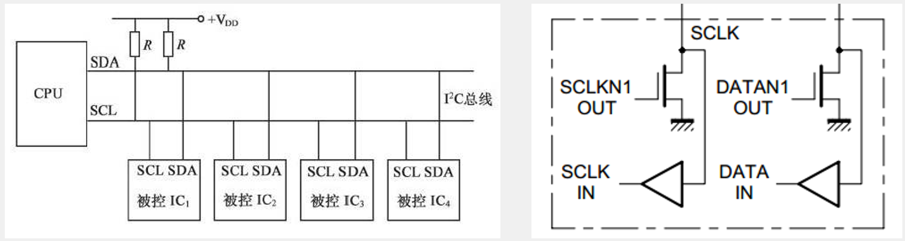


## 3.I2C时序基本单元

- 起始条件：SCL高电平期间，SDA从高电平切换到低电平

  - 空闲状态时SCL和SDA均为高电平，当**需要开始传输时就拉底一下SDA数据线**；
  - **SDA变为低电平后，再将SCL拉底，这是为了使得各时序能拼接得上；因为除了起始和结束条件外，每个时序的SCL都是以低电平开始和结束的**；
  - 当从机接收到这个SCL高电平、SDA下降沿的信息时就会复位等待主机的召唤；

  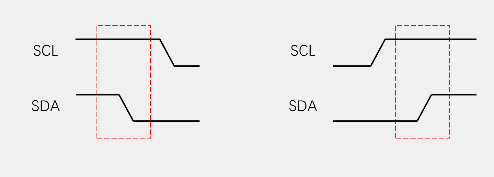

- 终止条件：SCL高电平期间，SDA从低电平切换到高电平

  - 先将SCL放手，恢复高电平；
  - 再将SDA放手，恢复高电平；
  - 两根线都是高电平，恢复空闲状态；

- 发送一个字节：

  - SCL低电平期间，主机将数据位依次放到SDA线上（**高位先行**），然后释放SCL；
  - 从机将在SCL高电平期间读取数据位，所以SCL高电平期间SDA不允许有数据变化；
  - 依次循环上述过程8次，即可发送一个字节；

  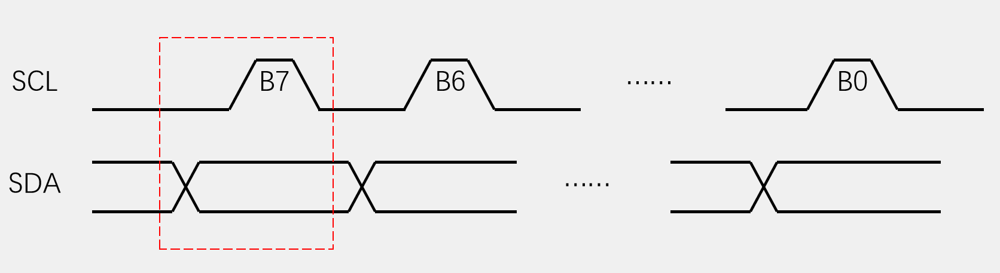

- 接收一个字节：

  - SCL低电平期间，从机将数据位依次放到SDA线上（**高位先行**），然后释放SCL；
  - 主机将在SCL高电平期间读取数据位，所以SCL高电平期间SDA不允许有数据变化；
  - 依次循环上述过程8次即可接收一个字节（**主机在接收之前，需要释放SDA，因为线与的特性，不释放就是低电平了，从机就无法控制了**）；

  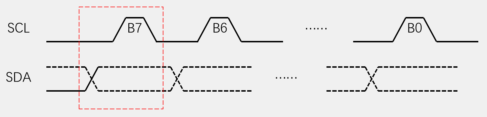

- 发送应答：

  - 主机在接收完一个字节后，在下一个时钟发送一位数据；
  - 数据0表示应答，数据1表示非应答；

- 接收应答：

  - 主机在发送完一个字节之后，在下一个时钟接收一位数据；
  - 判断从机是否应答，数据0表示应答，数据1表示非应答（**主机在接收之前，需要释放SDA**）；

  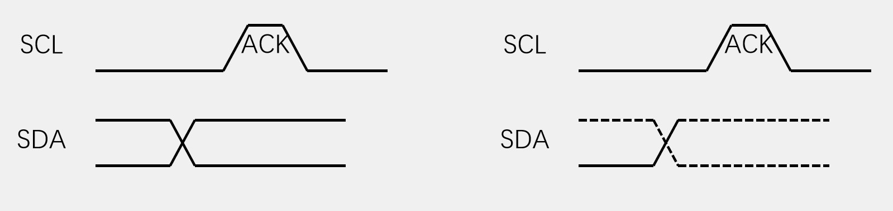


## 4.I2C的硬件地址

- 从机的地址：
  - 为了区分不同的从机，每个从机都有其从机地址，同一型号的芯片地址是一样的；
  - I2C标准分为7位地址和10位地址，广泛用的是7位地址；
- 地址的可变部分：
  - 若有相同的芯片挂载在同一条总线上就需要用到地址中的可变部分，一般器件地址的最后几位是可以在电路中改变的；
  - 对于MPU6050，地址为1101000，其最后一位可通过**AD0**引脚来确定，接低电平就是0，接高电平就是1；


## 5.I2C时序的三种形式——注意复合帧的Sr时序

- **指定地址写**：
  
  - 对于指定设备（**从机地址**），在指定地址下（**设备的寄存器地址**），写入指定数据；
  - 时序分析：
    - 在起始条件产生后，必须发送一字节的数据，包括了**从机地址+读写位**（**确定读入还是写出**），其中读写位0表示写入1表示读出；
    - 紧接着的单元就是从设备的**应答位**；
    - 接着第二个字节可以是**寄存器地址或者是指令控制字**等，紧接着也会有从设备的应答位；
    - 第三个字节是要**写入的内容**，紧接着是从设备应答位；
  
  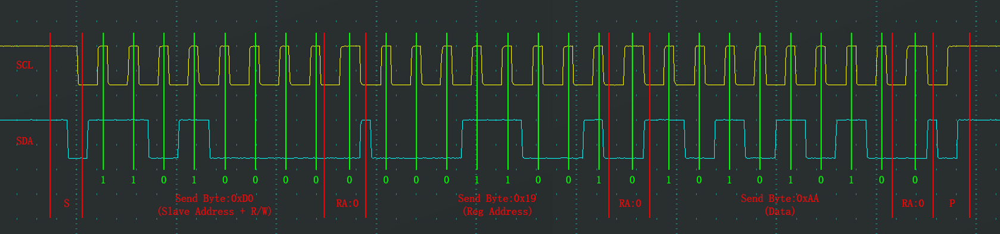
  
- 当前地址读：
  - 对于指定设备，在**当前地址指针指示的地址下，读取从机数据**；
  - 时序分析：
    - 在起始条件产生后，必须发送一字节数据，包括了**从机地址+读写位**（这里是1表示读），紧接着是应答位；
    - 接着SDA的控制权交到从机，主机调用接收一个字节的时序，从机在SDA上发送数据，主机在SCL高电平区间读取数据，紧接着是应答位；
    - 由于我们**没有办法指定读的寄存器的地址**，所以用的少；
  
  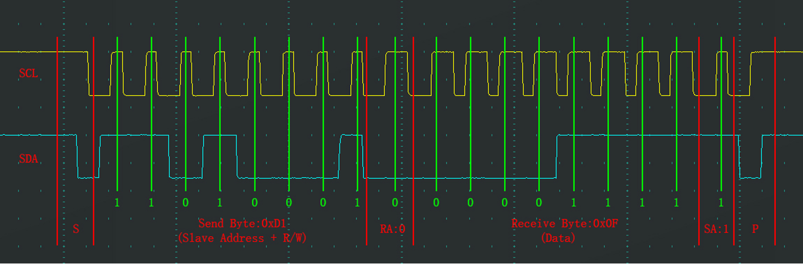
  
- **指定地址读（指定地址写前部分+当前地址读的复合）**
  
  - 对于指定设备，在指定地址下，读取从机数据；
  - 时序分析：
    - 起始条件产生后，发送一个字节，包括**从机地址+读写位**（**这里是0表示写的操作**），紧接着是从机的应答位；
    - 第二个字节用于指定**要读数据的寄存器地址**，这个数据就写入了从机的地址指针里，即从机接收到这个数据后它的**寄存器指针**就指向了这个位置，且当前地址指针不会因为时序结束而变化，**它只会在读或写后进行自增**；
    - 再来一个**起始条件Sr**，发送一个字节，从机地址+读写位（**这里是1表示读的操作**），接着就是当前地址读的操作了；
    - **接着的主机应答位若是只读一个字节就停止的话需要主机给一个非应答位（高位1），这样从机才知道主机不想要数据了，停止发送；**
    - **若是需要多个字节则需要在最后一个字节给非应答，在每一个字节最后都要给应答；**
    - 除了可以再来一个起始条件Sr外，也可以在Sr前加一个结束条件，这样就是两个完整的数据帧复合在一起了；
    - 尤其需要注意，三种时序都可以拓展为**n字节的时序包**；
  
  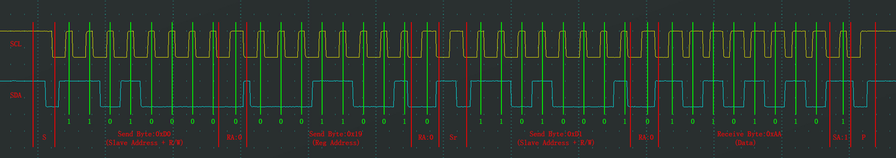

---


# 第三十二节课：10-2_MPU6050简介

## 1.MPU6050简介
- MPU6050是一个6轴姿态传感器，可测量芯片自身X、Y、Z轴的**加速度、角速度**参数，通过数据融合，可进一步得到姿态角；
- 3轴加速度计（ACC）：
  - 测量X、Y、Z轴的加速度，每个轴上都有一个加速度计；
  - 但是加速度计具有**静态稳定性不具有动态稳定性**；
  - 比如正在加速的汽车，底面和背面都有加速度，算出来的角度就是停在斜坡上，但实际却是水平的；
- 3轴陀螺仪传感器（Gyro）：
  - 测量X、Y、Z轴的角速度；
  - 但是陀螺仪具有**动态稳定性不具有静态稳定性**；
  - 比如静态的时候，存在零漂，角速度积分得到的角度，就会一直积累误差；
- 数据融合得到的姿态角就是**欧拉角**，上下俯仰、左右倾斜，但是任一个单独的三轴传感器都没有办法得到姿态角，需要数据融合；
- X、Y、Z轴的定义：芯片的字正看，向右为X的这个方向，向前是Y轴正方向，向上为Z轴的正方向；
- 飞控的姿态传感器
  - 6轴：3轴加速度计＋3轴陀螺仪；
  - 9轴：3轴加速度计＋3轴陀螺仪＋3轴磁强计；
  - 10轴：3轴加速度计＋3轴陀螺仪＋3轴磁强计＋气压计；

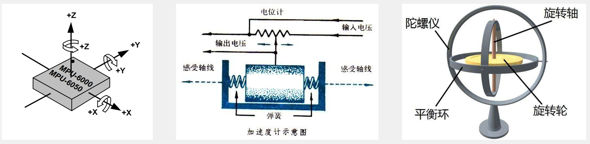


## 2.MPU6050参数

- 16位ADC采集传感器的模拟信号，量化范围：-32768~32767，就是内部有AD转换器，能对各种模拟量进行量化；
- 加速度计量程选择(就是对应ADC的Vref)：±2、±4、±8、±16（g）；
- 陀螺仪满量程选择：±250、±500、±1000、±2000（°/sec）；
- 可配置的数字低通滤波器：可以用于对输出的数据进行一定的滤波；
- 可配置的时钟源和采样分频：时钟经过分频为ADC等外设提供时钟；
- **地址的两种情况**：
  - 当AD0=0时为1101000，当AD0=1时为1101001；
  - 不融入数据位：1101000转换成十六进制为**0x68**，但是在发送第一个字节时（即寻址时）需要先将0x68左移一位，再**按位或上读写位**；
  - 融入数据位：先将0x68左移一位后的数据当作从机地址，即**0xD0**，这样MPU6050的地址就是0xD0了
    - 若要写则直接将**0xD0**（因为0xD0 | 0x00）作为第一个字节；
    - 若要读则直接将**0xD1**（因为0xD0 | 0x01）作为第一个字节；
    - 这样就不需要左移了，即将读写位也融入了地址里面；


## 3.硬件电路

- VCC、GND：两个电源接口；
- SCL、SDA：I2C通信引脚，**内部已经连接4.7KΩ的电阻了，直接连GPIO即可**；
- XCL、XDA：主机I2C通信引脚，如接入磁力计和气压计；
  - 读取磁力计和气压计的数据，MPU6050内部有DMP，可进行数据融合；
- AD0：从机地址最低位，**接了下拉电阻，默认是低电平了**；
- INT：**中断信号输出**，可配置内部的一些事件进行中断输出，如数据准备好了、芯片错误等；

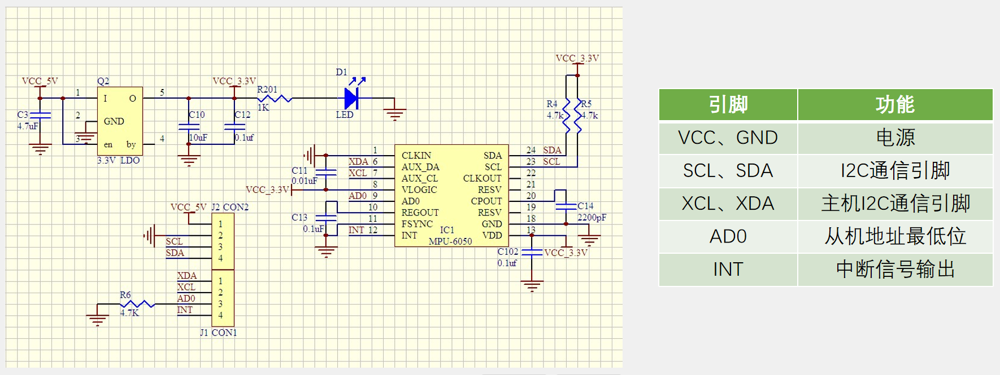


## 4.MPU6050框图

- 时钟部分：CLKIN、CLKOUT
  - 在原理图中，两个引脚一个接地，一个不引出，实际中我们用的是内部时钟为各个外设提供驱动；
- 传感器部分
  - 灰色的为6个传感器；
  - 除此之外还有一个Temp Sensor温度传感器，也可以用MPU6050进行温度测量；
  - 传感器的数据相当于是**“ADC＋DMA”**，会以设置的频率不断的刷新到数据寄存器中，直接读取即可；
- 自测功能：用于查看芯片好坏的
  - 使能自测，再失能自测，看自测响应在不在范围内，若在说明没问题，若不在可能就是坏了；
- 电荷泵：
  - 陀螺仪内部需要一个高电压支持，利用电荷泵进行**升压**提供一个高电压给陀螺仪；
  - CPOUT引脚需要接一个电容，其大小手册中有说明；
- 寄存器：
  - 中断状态寄存器，可以控制内部哪些事件到中断引脚的输出；
  - FIFO，先入先出寄存器，可对数据流进行缓存；
  - 配置寄存器，可以对内部的各个电路进行配置；
  - **传感器寄存器，即数据寄存器，存储了各个传感器的数据**；
  - 数字运动处理器，简称DMP，芯片内部自带的一个**姿态解算的硬件算法，配合官方的DMP库可进行姿态解算**；
  - **接口旁路选择器Serial Interface Bypass Mux**，用于控制I2C通信接口
    - 拨到上面则从机通信线和主机通信线连在一起，MPU6050和MPU6050的外设都是小弟；
    - 拨到下面则分开独立，MPU6050是STM32的小弟，但MPU6050是其他外设的大哥；
- 上电默认为睡眠状态，要使用**需要先解除睡眠**，这是因为107号寄存器的次高位为Sleep位，上电默认为1；

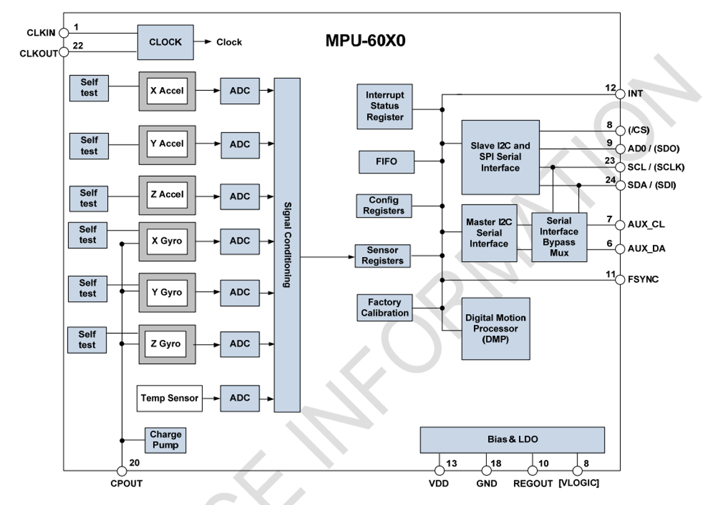


## 5.MPU6050的数据手册

MPU6050的寄存器主要有：

- SMPLRT_DIV：分频系数寄存器；
- CONFIG：配置寄存器；
- GYRO_CONFIG：陀螺仪寄存器；
- ACCEL_CONFIG：加速度计寄存器；
- ACCEL_X/Y/ZOUT_H/_L：加速度计数据寄存器，由于是16位的所以有H高八位和L低八位；
- GYRO_X/Y/ZOUT_H/_L：加速度计数据寄存器，由于是16位的所以有H高八位和L低八位；
- TEMP_OUT_H/L：温度数据寄存器，由于是16位的所以有H高八位和L低八位；
- PWR_MGMT_1/2：电源管理寄存器；
- WHO_AM_I：芯片ID寄存器，但其最后一位与AD0的电平是无关的，时钟读出来都是0x68；

---


# 第三十三节课：10-3_软件I2C读写MPU6050

## 1.接线图

- SCL对应PB10引脚，SDA对应PB11引脚；
- 对于SCL和SDA数据线应该要外接4.7kΩ的上拉电阻，但是MPU6050的板子上已经上拉了了，所以不用加；
- 软件I2C：用手动翻转电平来模拟I2C通信，引脚可随便选择GPIO口，所以也不需要查看I2C的库文件，只需要使用基本的GPIO口函数即可；
- 在**OLED显示屏**的工程基础上进行修改；


## 2.整体框架（理解模块架构的堆叠）

-  通信层
   - 首先建立I2C通信层的.c和.h模块；
   - 在通信层写好I2C底层的GPIO初始化和6个时序基本单元，即起始、终止、发送一个字节、接收一个字节、发送应答、接收应答；
   - 这样完成的就是软件层面的通信层，按照协议写即可（什么时候高电平、什么时候低电平）；
-  硬件驱动层
   - 建立MPU6050的.c和.h模块；
   - 在这一层将基于I2C通信的模块来实现指定地址读、指定地址写；
   - 再实现写寄存器对芯片进行配置，读寄存器得到传感器数据；
   - 关键是如何读写寄存器、如何配置寄存器以及如何读取数据这些驱动相关的内容；
-  应用层
   - 最后在main.c文件里，调用MPU6050的模块，初始化，拿到数据，显示数据


## 3.通信层编程

先在Hardware组中添加**MyI2C.c和MyI2C.h文件**；

### 3.1 MyI2C.c文件编程

```c
#include "stm32f10x.h"                  // Device header
#include "Delay.h"

/**
  * @brief  封装SCL线置位的函数
  * @param  BitValue 要置位的数据
  * @retval 无
  */
void MyI2C_W_SCL(uint8_t BitValue)
{
	GPIO_WriteBit(GPIOB, GPIO_Pin_10, (BitAction)BitValue);
	Delay_us(10);					// 延迟10us，防止速度过快
}

/**
  * @brief  封装SDA线置位的函数
  * @param  BitValue 要置位的数据
  * @retval 无
  */
void MyI2C_W_SDA(uint8_t BitValue)
{
	GPIO_WriteBit(GPIOB, GPIO_Pin_11, (BitAction)BitValue);
	Delay_us(10);					// 延迟10us，防止速度过快
}

/**
  * @brief  封装读SDA线数据的函数
  * @param  无
  * @retval 读取的电平值
  */
uint8_t MyI2C_R_SDA(void)
{
	uint8_t BitValue;
	BitValue = GPIO_ReadInputDataBit(GPIOB, GPIO_Pin_11);		// 读GPIO口的数据
	Delay_us(10);					// 延迟10us，防止速度过快
	return BitValue;
}

/**
  * @brief  软件I2C初始化函数
  * @param  无
  * @retval 无
  */
void MyI2C_Init(void)
{
	RCC_APB2PeriphClockCmd(RCC_APB2Periph_GPIOB, ENABLE);		// 使能GPIOB端口时钟
	
	GPIO_InitTypeDef GPIO_InitStructure;						// 定义结构体
	
	GPIO_InitStructure.GPIO_Mode = GPIO_Mode_Out_OD;			// 开漏输出模式
	GPIO_InitStructure.GPIO_Pin = GPIO_Pin_10 | GPIO_Pin_11;    // 选中10号引脚和11号引脚
	GPIO_InitStructure.GPIO_Speed = GPIO_Speed_50MHz;           // 定义速度为50MHz
	GPIO_Init(GPIOB, &GPIO_InitStructure);                      // 初始化端口

	GPIO_SetBits(GPIOB, GPIO_Pin_10 | GPIO_Pin_11);				// 把端口设置为高电平，对应I2C的空闲状态，此时总线是释放状态
}

/**
  * @brief  起始条件
  * @param  无
  * @retval 无
  */
void MyI2C_Start(void)
{
	// 起始条件：先释放总线，再先将SCL拉低，然后将SDA拉低，注意这里需要兼容重复起始条件的时序
	MyI2C_W_SDA(1);			// 先释放SDA总线，再释放SCL总线，才能防止被认为是终止信号
	MyI2C_W_SCL(1);
	MyI2C_W_SDA(0);			// 先拉低SDA总线
	MyI2C_W_SCL(0);			// 再拉低SCL总线
}

/**
  * @brief  终止条件
  * @param  无
  * @retval 无
  */
void MyI2C_Stop(void)
{
	// 先拉低SDA，再释放SCL和SDA
	// 先拉底SDA是因为终止时序开始时SDA不一定是低电平，所以为了确保之后释放SDA能产生上升沿，先将SDA拉低
	MyI2C_W_SDA(0);
	MyI2C_W_SCL(1);
	MyI2C_W_SDA(1);
}

/**
  * @brief  发送一个字节
  * @param  Byte 要发送的一个字节
  * @retval 无
  */
void MyI2c_SendByte(uint8_t Byte)
{
	uint8_t i;			// 定义迭代变量i
	
	for (i = 0; i < 8; i ++)                    // 迭代8次，发送一个字节
	{
		// 虽然传入的不是0/1，但是MyI2C_W_SDA()函数内部进行了枚举类型转换
		MyI2C_W_SDA(Byte & (0x80 >> i));		// 取出数据的位，通过移位操作实现不同位的读取
		MyI2C_W_SCL(1);							// 放完数据后释放SCL，这时候从机就会读取SDA的值
		MyI2C_W_SCL(0);							// 再拉低SCL，进入次高位的发送
	}
}

/**
  * @brief  接收一个字节
  * @param  无
  * @retval 接收到的字节数据
  */
uint8_t MyI2C_ReceiveByte(void)
{
	uint8_t i, Byte = 0x00;				// 定义迭代变量和数据存储变量
	MyI2C_W_SDA(1);						// 主机先释放SDA，让从机写数据
	for (i = 0; i < 8; i ++)			// 迭代八次，接收一个字节
	{
		MyI2C_W_SCL(1);					// 主机释放SCL，此时即可读数据了
		if (MyI2C_R_SDA() == 1)
		{
			Byte |= (0x80 >> i);		// 通过或的操作写入Byte的最高位
		}
		MyI2C_W_SCL(0);					// 读完数据后再将SCL拉低，这时从机就会把下一位数据放到SDA上
	}
	return Byte;
}

/**
  * @brief  发送应答，即发1位
  * @param  AckBit 要发送的应答位
  * @retval 无
  */
void MyI2c_SendAck(uint8_t AckBit)
{
	// 函数进来时SCL是低电平
	MyI2C_W_SDA(AckBit);		// 此时主机将应答位放上SDA上
	MyI2C_W_SCL(1);				// 放完数据后释放SCL，这时候从机就会读取应答
	MyI2C_W_SCL(0);				// 再拉低SCL，进入下一个单元
}

/**
  * @brief  接收应答，即收1位
  * @param  无
  * @retval 应答位数据
  */
uint8_t MyI2C_ReceiveAck(void)
{
	// 函数进来时SCL为低电平
	uint8_t AckBit;
	MyI2C_W_SDA(1);				// 主机先释放SDA，防止干扰从机，让从机写数据
	MyI2C_W_SCL(1);				// 主机释放SCL，此时即可读数据了
	AckBit = MyI2C_R_SDA();		// 直接将读到的值给AckBit
	MyI2C_W_SCL(0);				// 读完数据后再将SCL拉低，这时从机就会把下一位数据放到SDA上
	return AckBit;
}

```

### 3.2MyI2C.h文件编程

```c
#ifndef __MYI2C_
#define __MYI2C_

void MyI2C_Init(void);
void MyI2C_Start(void);
void MyI2C_Stop(void);
void MyI2c_SendByte(uint8_t Byte);
uint8_t MyI2C_ReceiveByte(void);
void MyI2c_SendAck(uint8_t AckBit);
uint8_t MyI2C_ReceiveAck(void);

#endif

```


## 4.硬件驱动层编程

在Hardware组中添加**MPU6050.c和MPU6050.h文件**

### 4.1 MPU6050_Reg.h文件编程

```c
#ifndef __MPU6050_REG_
#define __MPU6050_REG_

#define	MPU6050_SMPLRT_DIV		0x19
#define	MPU6050_CONFIG			0x1A
#define	MPU6050_GYRO_CONFIG		0x1B
#define	MPU6050_ACCEL_CONFIG	0x1C

#define	MPU6050_ACCEL_XOUT_H	0x3B
#define	MPU6050_ACCEL_XOUT_L	0x3C
#define	MPU6050_ACCEL_YOUT_H	0x3D
#define	MPU6050_ACCEL_YOUT_L	0x3E
#define	MPU6050_ACCEL_ZOUT_H	0x3F
#define	MPU6050_ACCEL_ZOUT_L	0x40
#define	MPU6050_TEMP_OUT_H		0x41
#define	MPU6050_TEMP_OUT_L		0x42
#define	MPU6050_GYRO_XOUT_H		0x43
#define	MPU6050_GYRO_XOUT_L		0x44
#define	MPU6050_GYRO_YOUT_H		0x45
#define	MPU6050_GYRO_YOUT_L		0x46
#define	MPU6050_GYRO_ZOUT_H		0x47
#define	MPU6050_GYRO_ZOUT_L		0x48

#define	MPU6050_PWR_MGMT_1		0x6B
#define	MPU6050_PWR_MGMT_2		0x6C
#define	MPU6050_WHO_AM_I		0x75

#endif

```

### 4.2 MPU6050.c文件编程

```c
#include "stm32f10x.h"            // Device header
#include "MyI2C.h"                //此模块要建立在MyI2C的基础上
#include "MPU6050_Reg.h"          //将宏定义6050寄存器的头文件加上

#define MPU6050_ADDRESS			0xD0			//宏定义MPU6050的地址

/**
  * @brief  指定地址写的函数封装
  * @param  RegAddress 地址
  * @param  Data 要写入的数据
  * @retval 无
  */
void MPU6050_WriteReg(uint8_t RegAddress, uint8_t Data)
{
	MyI2C_Start();						// 产生起始条件
	MyI2c_SendByte(MPU6050_ADDRESS);	// 第一个字节：发送地址＋读写位
	MyI2C_ReceiveAck();					// 接收应答位
	MyI2c_SendByte(RegAddress);			// 第二个字节：发送指定的寄存器地址
	MyI2C_ReceiveAck();					// 接收应答位
	// 若要发送多个字节，就可在后面两句套一个for循环
	MyI2c_SendByte(Data);				// 第三个字节：发送要写入寄存器的数据
	MyI2C_ReceiveAck();					// 接收应答位
	MyI2C_Stop();						// 产生终止条件
}

/**
  * @brief  指定地址读的函数封装
  * @param  RegAddress 地址
  * @retval 读取到的数据
  */
uint8_t MPU6050_ReadReg(uint8_t RegAddress)
{
	uint8_t Data;
	
	// 下面的这部分代码与指定地址写是一样的，指定了地址但是还没来得及写
	MyI2C_Start();						// 产生起始条件
	MyI2c_SendByte(MPU6050_ADDRESS);	// 第一个字节：发送地址＋读写位
	MyI2C_ReceiveAck();					// 接收应答位
	MyI2c_SendByte(RegAddress);			// 第二个字节：发送指定的寄存器地址
	MyI2C_ReceiveAck();					// 接收应答位
	
	// 上面是写的程序，将当前寄存器的地址指定到了想要的位置；下面是读的时序，需要产生重复起始位Sr
	MyI2C_Start();								// 产生起始位
	MyI2c_SendByte(MPU6050_ADDRESS | 0x01);		// 将读写位置位1，即读
	MyI2C_ReceiveAck();							// 接收应答位
	
	// 这里要读多个字节的话将下面两句套for循环，同时要加上给应答的语句
	Data = MyI2C_ReceiveByte();					// 接收数据
	MyI2c_SendAck(1);							// 给1表示没有应答，主机不想再要了
	MyI2C_Stop();
	
	return Data;
}

/**
  * @brief  初始化函数
  * @param  无
  * @retval 无
  */
void MPU6050_Init(void)
{
	// 先把底层初始化
	MyI2C_Init();
	MPU6050_WriteReg(MPU6050_PWR_MGMT_1, 0x01);			// 配置电源管理寄存器1，这里解除其睡眠状态，并选择陀螺仪时钟
	MPU6050_WriteReg(MPU6050_PWR_MGMT_2, 0x00);			// 配置电源管理寄存器2，将所有位设置为不待机，即6个轴均不待机
	MPU6050_WriteReg(MPU6050_SMPLRT_DIV, 0x09);			// 配置采样率分频，这里给10分频
	MPU6050_WriteReg(MPU6050_CONFIG, 0x06);				// MPU6050的配置寄存器，滤波参数给最大
	MPU6050_WriteReg(MPU6050_GYRO_CONFIG, 0x18);		// 选择最大量程16g，最大参数为32768，通过数据除以32768再乘以量程即为真是的加速度值
	MPU6050_WriteReg(MPU6050_ACCEL_CONFIG, 0x18);		// 加速度计配置寄存器，选择最大量程，同理上面
}

/**
  * @brief  获取芯片ID的函数
  * @param  无
  * @retval 返回ID号
  */
uint8_t MPU6050_GetID(void)
{
	return MPU6050_ReadReg(MPU6050_WHO_AM_I);
}

/**
  * @brief  读取多个数据寄存器的值的函数
  * @param  6个数组地址
  * @retval 无直接返回值，通过地址形式返回多个返回值
  */
void MPU6050_GetData(int16_t *Accx, int16_t *Accy, int16_t *Accz,
					 int16_t *Gyrox, int16_t *Gyroy, int16_t *Gyroz)
{
	// 前三部分用于读取加速度计的XYZ轴的数据
	uint8_t DataH, DataL;								// 定义变量存放数据
	DataH = MPU6050_ReadReg(MPU6050_ACCEL_XOUT_H);		// 读取加速度寄存器的高8位
	DataL = MPU6050_ReadReg(MPU6050_ACCEL_XOUT_L);		// 读取加速度寄存器的低8位
	*Accx = (DataH << 8) | DataL;						// 操作获得加速度计X轴的16位数据，并通过指针返回回去
	
	DataH = MPU6050_ReadReg(MPU6050_ACCEL_YOUT_H);		// 读取加速度寄存器的高8位
	DataL = MPU6050_ReadReg(MPU6050_ACCEL_YOUT_L);		// 读取加速度寄存器的低8位
	*Accy = (DataH << 8) | DataL;						// 操作获得加速度计Y轴的16位数据，并通过指针返回回去
	
	DataH = MPU6050_ReadReg(MPU6050_ACCEL_ZOUT_H);		// 读取加速度寄存器的高8位
	DataL = MPU6050_ReadReg(MPU6050_ACCEL_ZOUT_L);		// 读取加速度寄存器的低8位
	*Accz = (DataH << 8) | DataL;						// 操作获得加速度计Z轴的16位数据，并通过指针返回回去	
	
	// 这三部分用于读取陀螺仪的XYZ轴的数据
	DataH = MPU6050_ReadReg(MPU6050_GYRO_XOUT_H);		// 读取陀螺仪寄存器的高8位
	DataL = MPU6050_ReadReg(MPU6050_GYRO_XOUT_L);		// 读取陀螺仪寄存器的低8位
	*Gyrox = (DataH << 8) | DataL;						// 操作获得加速度计X轴的16位数据，并通过指针返回回去
	
	DataH = MPU6050_ReadReg(MPU6050_GYRO_YOUT_H);		// 读取陀螺仪寄存器的高8位
	DataL = MPU6050_ReadReg(MPU6050_GYRO_YOUT_L);		// 读取陀螺仪寄存器的低8位
	*Gyroy = (DataH << 8) | DataL;						// 操作获得加速度计Y轴的16位数据，并通过指针返回回去
	
	DataH = MPU6050_ReadReg(MPU6050_GYRO_ZOUT_H);		// 读取陀螺仪寄存器的高8位
	DataL = MPU6050_ReadReg(MPU6050_GYRO_ZOUT_L);		// 读取陀螺仪寄存器的低8位
	*Gyroz = (DataH << 8) | DataL;						// 操作获得加速度计Z轴的16位数据，并通过指针返回回去
}

```

### 4.3 MPU6050.h文件编程

```c
#ifndef __MPU6050_H
#define __MPU6050_H

void MPU6050_WriteReg(uint8_t RegAddress, uint8_t Data);
uint8_t MPU6050_ReadReg(uint8_t RegAddress);
void MPU6050_Init(void);
void MPU6050_GetData(int16_t *Accx, int16_t *Accy, int16_t *Accz,
					 int16_t *Gyrox, int16_t *Gyroy, int16_t *Gyroz);
uint8_t MPU6050_GetID(void);

#endif

```


## 5.应用层

- main.c文件内容如下：

```c
#include "stm32f10x.h"                  // Device header
#include "Delay.h"
#include "OLED.h"
#include "MPU6050.h"

uint8_t ID;
int16_t AX, AY, AZ, GX, GY, GZ;		// 定义变量分别用于接收XYZ轴的加速度值和陀螺仪值

int main(void)
{
	OLED_Init();
	MPU6050_Init();			// MPU6050的初始化就已经将I2C初始化了
	
	OLED_ShowString(1, 1, "ID:");
	ID = MPU6050_GetID();
	OLED_ShowHexNum(1, 4, ID, 2);
	
	while (1)
	{
		// 传入参数的地址，在子函数中直接处理参数的地址，实现指针传递
		MPU6050_GetData(&AX, &AY, &AZ, &GX, &GY, &GZ);
		OLED_ShowSignedNum(2, 1, AX, 5);
		OLED_ShowSignedNum(3, 1, AY, 5);
		OLED_ShowSignedNum(4, 1, AZ, 5);
		OLED_ShowSignedNum(2, 8, GX, 5);
		OLED_ShowSignedNum(3, 8, GY, 5);
		OLED_ShowSignedNum(4, 8, GZ, 5);
	}
}

```

---


# 第三十四节课：10-4_I2C通信外设

## 1.STM32内部的I2C外设简介
- STM32内部集成了**硬件I2C收发电路**，可以由硬件自动执行时钟生成、起始终止条件生成、应答位收发、数据收发等功能，减轻CPU的负担；
- 硬件I2C收发电路主要涉及**CR控制寄存器、DR数据寄存器和SR状态寄存器**；
- STM32的硬件I2C的特点：
  - 支持多主机模型，包括**固定多主机、可变多主机模式**；
  - **我们学一主多从，不存在冲突的情况，但STM32是按照可变多主机的模型设计的，所以需要按照可变多主机的思路来操作**；
  - **支持7位/10位地址模式，10位寻址需要两个字节用于寻址，第一个字节的前五位用于置标志位，为11110，告诉从机是10位地址模式，且11110不会出现在7位地址的情况**；
  - 支持不同的通讯速度，包括标准速度（高达100kHz）和快速速度（高达400kHz）；
  - 支持DMA：在多字节传输中更方便更高效；
  - 兼容**SMBus协议**；
- STM32F103C8T6有**I2C1、I2C2两个I2C外设**；


## 2.I2C框图

- **引脚部分**
  - SDA、SCL引脚，一般都是借用GPIO口的复用模式与外部世界相连的；
  - SMBALERT引脚是兼容SMBus使用的；
- **发送流程**
  - 包括数据寄存器与数据移位寄存器；
  - 当数据移位寄存器中没有数据移位时，数据寄存器中的值就转到移位寄存器里；
  - 在移位过程中即可将下一个数据放到数据寄存器里等着了；
  - 一旦前一个数据移位完成，下一个数据就可以无缝衔接，继续发送；
  - **当数据寄存器的值转到移位寄存器时，就会置状态寄存器的TXE位为1，表示发送寄存器为空**；
  - 这里的发送流程和串口非常类似，只不过串口的收和发是分开的；
- **接收流程**
  - 数据一位一位的移入移位寄存器中，当一个字节的数据收齐之后，数据就整体从移位寄存器转到数据寄存器；
  - **同时置标志位RXNE，表示接收寄存器非空，这时就可以从数据寄存器中读出数据**；
  - 同样的这里的接收流程和串口非常类似，只不过串口的收和发是分开的；
- **与串口的区别**
  - 串口中的发送和接收是分开的线，是全双工的，寄存器也是分开的；
  - 但是I2C这里的数据线只有一根，是半双工的，所以它们是不分开的，**接收和发送都是同一个寄存器**；
  - **对于是读还是写，可以写入控制寄存器的对应位进行操作**；
  - 对于起始条件、终止条件、应答位什么的有硬件电路可以**自动完成**；
- 比较器、自身地址寄存器与双地址寄存器
  - 作为从机的时候使用；
  - 自身地址寄存器和双地址寄存器就是存放着STM32作为从机的时候的地址；
- **帧错误校验计算**
  - 可进行CRC校验，与串口的类似；
- **控制逻辑电源**
  - 这里可以**申请中断**或是DMA请求；

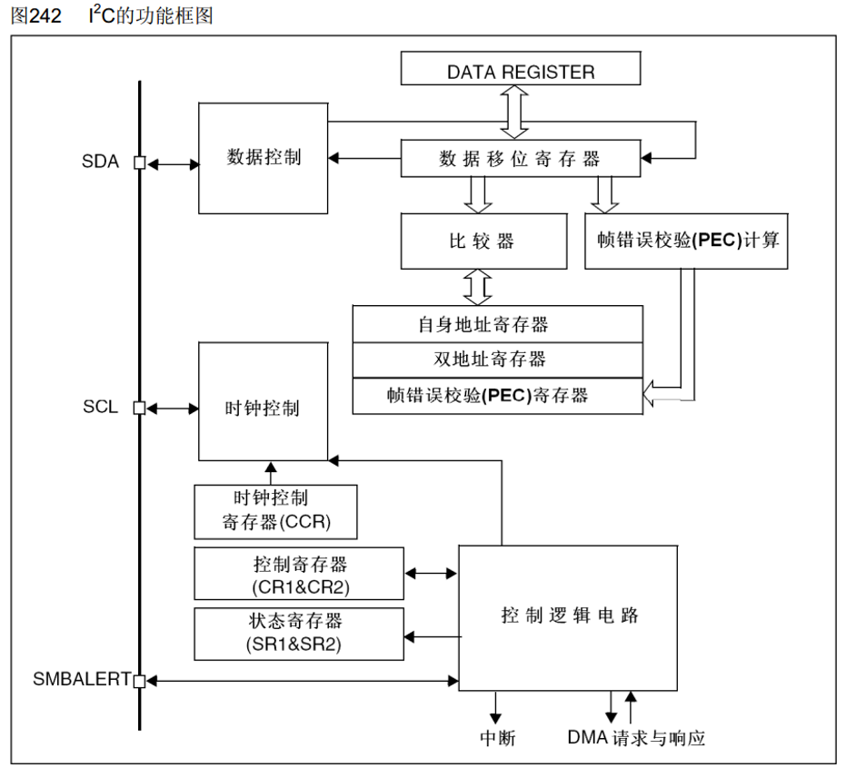


## 3.I2C基本结构

- 移位寄存器和数据寄存器的配合
  - 因为是高位先行，所以移位寄存器是向左移位，发送的时候是最高位先移出去，然后是次高位等等；
  - 一个SCL时钟移位一次，移位8次就是一个字节；
- 引脚配置
  - 使用硬件I2C的时候，GPIO口需要配置成**复用开漏输出的模式**；
  - **复用就是GPIO口的状态是由片上外设来控制的**；
  - 即使是复用开漏输出模式，也是不会影响到STM32对GPIO口的电平读取的；
- 开关控制：即I2C_Cmd()函数；

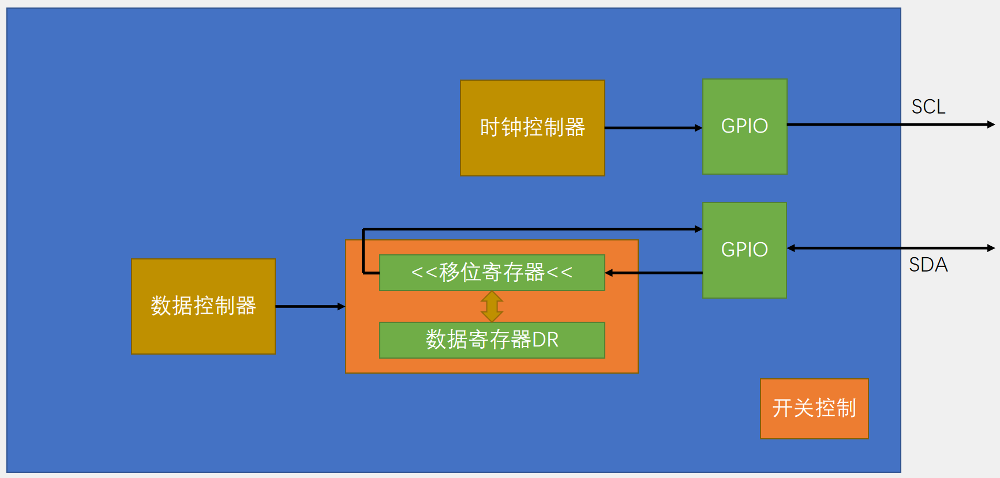


## 4.硬件I2C的执行过程

### 4.1 主机发送

- 当STM32执行指定地址写的时候就需要按照如下时序来完成，可分为**7位模式和10位模式**；
- 起始条件：
  - 初始化后STM32默认是从模式；
  - 为了产生一个起始条件，STM32需要写入控制寄存器，在CR1寄存器的START位中写入1；
  - 这样就变成**主机模式，产生起始条件**；
  - 当产生起始条件后，将会发生**EV5事件**，所谓事件会**同时置多个标志位，所以又叫大标志位**；
  - **事件的状态可以直接调用库函数来读取**；
- 其他的流程也是写入**控制寄存器**控制时序产生再查看**状态寄存器**查看标志位判断时序是否生成成功；

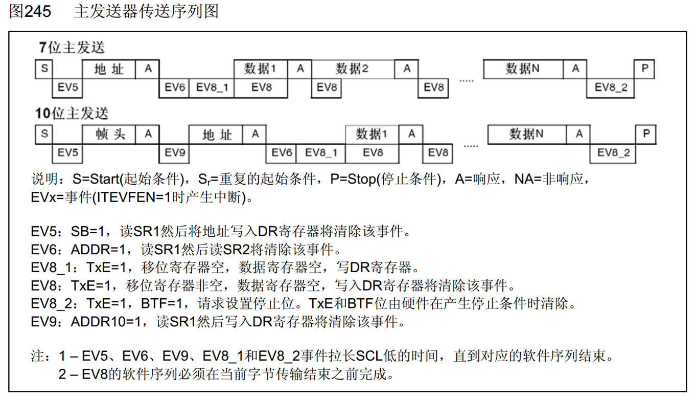

### 4.2 主机接收

- 写入控制寄存器CR和读取数据寄存器DR产生时序单元，然后等待相应的事件来确保时序单元完成，一样是大标志位，EV事件驱动时序进行；

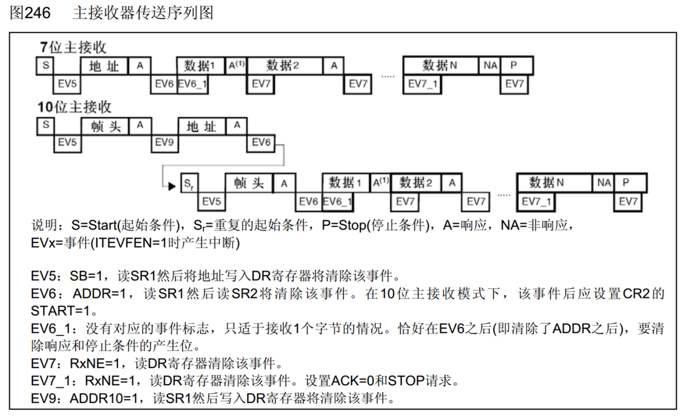


## 5.软件I2C与硬件I2C的对比

- 硬件I2C的时序更加规整；
- 由于I2C是同步时序，所以对时序的规整要求并没有这么高；

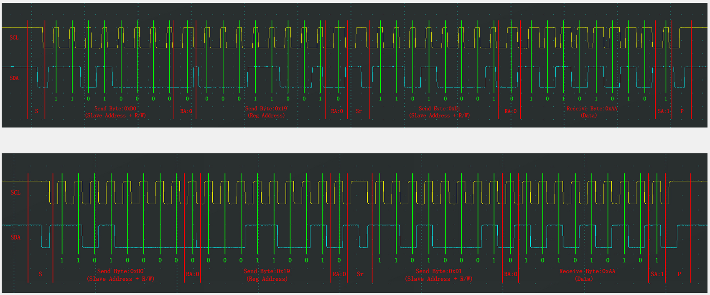

---


# 第三十五节课：10-5_硬件I2C读写MPU6050

## 1.接线图
- 用I2C2的外设，SCL接在PB10，SDA接在PB11，由于前面软件I2C也故意选择了这两个引脚，所以与上一节的相同；

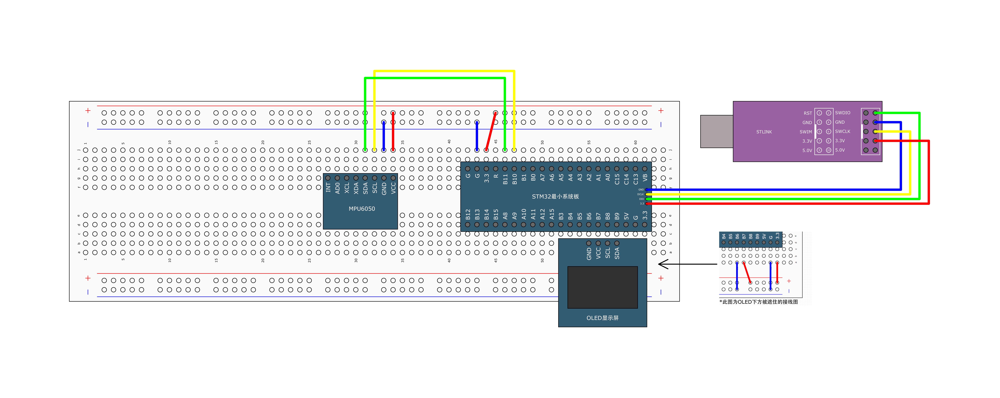


## 2.I2C初始化步骤以及库函数API

### 2.1 I2C的初始化步骤

- 第一步：开启I2C外设和对应GPIO口的时钟；
- 第二步：将I2C外设对应的GPIO口初始化为复用开漏模式；
- 第三步：使用结构体对整个I2C进行配置；
- 第四步：I2C_Cmd()，使能I2C；

### 2.2 I2C库函数API——stm32f10x_i2c.h文件

- 初始化与使能相关函数
  - I2C_DeInit()：恢复缺省配置；
  - I2C_Init()：初始化I2C；
  - I2C_StructInit()：为I2C结构体赋一个默认初始值；
  - I2C_Cmd()：使能I2C；
- 时序相关函数
  - I2C_GenerateSTART()：生成起始条件；
    I2C_GenerateSTOP()：生成终止条件；
  - I2C_AcknowledgeConfig()：是否给从机应答；
  - I2C_SendData()：发送数据；
  - I2C_ReceiveData()：接收数据；
  - I2C_Send7bitAddress()：发送地址的专门函数；

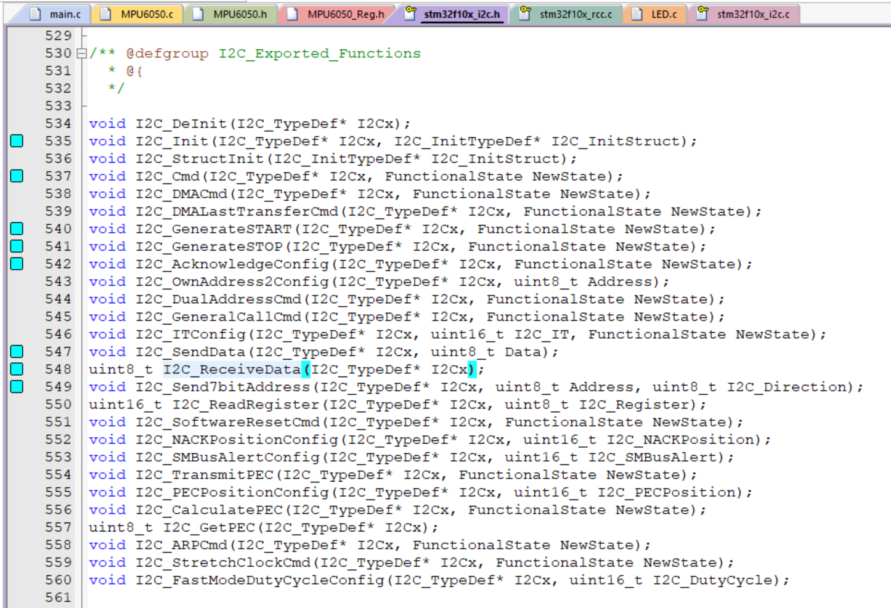

- EV事件相关函数
  - 基本状态监控方式：I2C_CheckEvent()，这节课使用这种方式；
  - 高级状态监控方式：I2C_GetLastEvent()；
  - 基于标志问的状态监控方式：I2C_GetFlagStatus()；

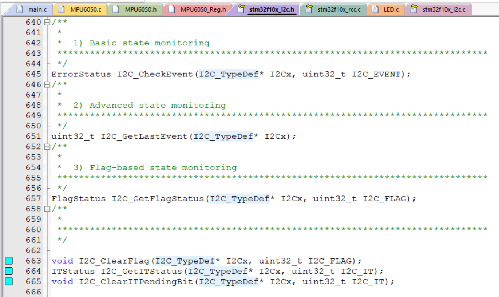


## 3.项目编程

- 在上一个工程的基础上进行修改；
- 由于不再依赖于底层的软件I2C，所以这里现在Keil中的工程树中将文件移除，然后再回到文件夹将文件也删除；
- **在之前的软件I2C中，底层通信时序都是阻塞性的，只要调用完就肯定发送时序了；但是硬件的I2C底层是非阻塞的，需要检查标志位来确保是否发送成功**；
- **在库函数中，发送数据和接收数据都是自带应答位的，发送或接收应答位后会置相关的标志位，我们直接查看EV大标志位即可**；
- MPU6050.c文件编程
  - 初始化函数按照上面的硬件I2C基本结构框图进行设置；
  - 发送字节函数按照上面的发送字节过程时序进行大标志位判断；
  - 接收字节函数按照上面的接受字节过程时序进行大标志位判断；
  - 注意需要加上超时机制函数封装，不要用大量的while()循环，导致程序死机；

```c
#include "stm32f10x.h"            // Device header
#include "MPU6050_Reg.h"          //将宏定义6050寄存器的头文件加上

#define MPU6050_ADDRESS       0xD0		//宏定义MPU6050的地址

/**
  * @brief  封装CheckEvent函数，用于改进超时的问题，将后面全部的等待时间函数改为该函数
  * @param  I2Cx 指定是哪个I2C外设
  * @param  I2C_EVENT 指定是等待那个事件
  * @retval 无
  */
void MPU6050_WaitEvent(I2C_TypeDef* I2Cx, uint32_t I2C_EVENT)
{
	uint32_t Timeout;				// 用于计数超时
	Timeout = 10000;
	while (I2C_CheckEvent(I2Cx, I2C_EVENT) != SUCCESS)
	{
		Timeout --;
		if (Timeout == 0)
		{
			break;					// 结束函数
		}
	}
}

/**
  * @brief  封装指定地址写寄存器的函数
  * @param  RegAddress 寄存器地址
  * @param  Data 要写入寄存器的数据
  * @retval 无
  */
void MPU6050_WriteReg(uint8_t RegAddress, uint8_t Data)
{
	// 产生起始信号，替换软件的Start函数
	I2C_GenerateSTART(I2C2, ENABLE);
	MPU6050_WaitEvent(I2C2, I2C_EVENT_MASTER_MODE_SELECT);					// 等待EV5事件，表示产生起始条件成功
	
	// 发送从机地址
	I2C_Send7bitAddress(I2C2, MPU6050_ADDRESS, I2C_Direction_Transmitter);
	MPU6050_WaitEvent(I2C2, I2C_EVENT_MASTER_TRANSMITTER_MODE_SELECTED);	// 等待EV6事件，表示发送地址成功
	
	// 发送地址数据
	I2C_SendData(I2C2, RegAddress);			// 这里发送寄存器地址
	MPU6050_WaitEvent(I2C2, I2C_EVENT_MASTER_BYTE_TRANSMITTING);			//等待EV8事件
	
	// 发送数据
	I2C_SendData(I2C2, Data);				//发送数据
	MPU6050_WaitEvent(I2C2, I2C_EVENT_MASTER_BYTE_TRANSMITTED);				//等待EV8_2事件，表示字节发送完毕
	
	// 发送终止条件
	I2C_GenerateSTOP(I2C2, ENABLE);
}

/**
  * @brief  封装指定地址读的函数
  * @param  RegAddress 寄存器地址
  * @retval 无
  */
uint8_t MPU6050_ReadReg(uint8_t RegAddress)
{
	uint8_t Data;

	// 下面的部分是发送数据的前面一部分，即产生起始条件+指定地址
	I2C_GenerateSTART(I2C2, ENABLE);
	MPU6050_WaitEvent(I2C2, I2C_EVENT_MASTER_MODE_SELECT);

	I2C_Send7bitAddress(I2C2, MPU6050_ADDRESS, I2C_Direction_Transmitter);
	MPU6050_WaitEvent(I2C2, I2C_EVENT_MASTER_TRANSMITTER_MODE_SELECTED);
	
	I2C_SendData(I2C2, RegAddress);
	MPU6050_WaitEvent(I2C2, I2C_EVENT_MASTER_BYTE_TRANSMITTED);
	
	// 生成重复起始条件
	I2C_GenerateSTART(I2C2, ENABLE);
	MPU6050_WaitEvent(I2C2, I2C_EVENT_MASTER_MODE_SELECT);				// 等待EV5事件
	
	// 发送地址，这里改参数为Receiver，函数内部会自动将最低位置为1，表示读
	I2C_Send7bitAddress(I2C2, MPU6050_ADDRESS, I2C_Direction_Receiver);
	MPU6050_WaitEvent(I2C2, I2C_EVENT_MASTER_RECEIVER_MODE_SELECTED);	// 等待EV6事件，但是这个EV6事件和发送的EV6事件不是同一个事件
	
	// 读取数据
	/**
	 ******************************************************************************
	 若读取多个字节，直接等待EV7事件，读取DR，即可收到数据；
	 在接收最后一个字节之前，即EV7_1事件，需要提前将ACK置零，STOP置1；
	 若读取一个字节，则需在EV6事件之后立刻ACK置零，STOP置1，否则时序会多一个字节；
	 若需要多字节只需要将后面四行套循环；
     ******************************************************************************
     */
	I2C_AcknowledgeConfig(I2C2, DISABLE);				// 直接配置ACK位，将其置零
	I2C_GenerateSTOP(I2C2, ENABLE);						// 配置停止位
	
	while (I2C_CheckEvent(I2C2, I2C_EVENT_MASTER_BYTE_RECEIVED) != SUCCESS);	// 等待EV7事件
	Data = I2C_ReceiveData(I2C2);
	
	//将应答位重置为1，方便后面接收多字节的程序改动
	I2C_AcknowledgeConfig(I2C2, ENABLE);
	
	return Data;
}

/**
  * @brief  初始化函数
  * @param  无
  * @retval 无
  */
void MPU6050_Init(void)
{
	// 初始化硬件I2C，替换之前的软件I2C初始化
	// 第一步：开启I2C和GPIO的时钟，I2C2是APB1上的外设
	RCC_APB1PeriphClockCmd(RCC_APB1Periph_I2C2, ENABLE);
	RCC_APB2PeriphClockCmd(RCC_APB2Periph_GPIOB, ENABLE);
	
	//第二步：将PB10和PB11都初始化为复用开漏模式
	GPIO_InitTypeDef GPIO_InitStructure;						// 定义结构体
	GPIO_InitStructure.GPIO_Mode = GPIO_Mode_AF_OD;				// 定义结构体的模式为复用开漏输出
	GPIO_InitStructure.GPIO_Pin = GPIO_Pin_10 | GPIO_Pin_11;	// 选中10号引脚和11号引脚
	GPIO_InitStructure.GPIO_Speed = GPIO_Speed_50MHz;			// 定义速度为50MHz
	GPIO_Init(GPIOB, &GPIO_InitStructure);						// 初始化端口
	
	// 第三步：初始化I2C2外设
	I2C_InitTypeDef I2C_InitStructure;
	I2C_InitStructure.I2C_Mode = I2C_Mode_I2C;	
	I2C_InitStructure.I2C_ClockSpeed = 50000;
	I2C_InitStructure.I2C_DutyCycle = I2C_DutyCycle_2;			// 占空比参数，只有在高速状态下才有用
	I2C_InitStructure.I2C_Ack = I2C_Ack_Enable;					// 接收完一位之后是否给应答位
	I2C_InitStructure.I2C_AcknowledgedAddress = I2C_AcknowledgedAddress_7bit;		// STM32作为从机可以响应多少位地址
	I2C_InitStructure.I2C_OwnAddress1 = 0x00;										// 指定自身地址
	I2C_Init(I2C2, &I2C_InitStructure);
	
	// 第四步：使能I2C
	I2C_Cmd(I2C2, ENABLE);
	
	MPU6050_WriteReg(MPU6050_PWR_MGMT_1, 0x01);			// 配置电源管理寄存器1，这里解除其睡眠状态，并选择陀螺仪时钟
	MPU6050_WriteReg(MPU6050_PWR_MGMT_2, 0x00);			// 配置电源管理寄存器2，将所有位设置为不待机，即6个轴均不待机
	MPU6050_WriteReg(MPU6050_SMPLRT_DIV, 0x09);			// 配置采样率分频，这里给10分频
	MPU6050_WriteReg(MPU6050_CONFIG, 0x06);				// MPU6050的配置寄存器，滤波参数给最大
	MPU6050_WriteReg(MPU6050_GYRO_CONFIG, 0x18);		// 选择最大量程，16g，最大参数为32768，通过数据除以32768再乘以量程即为真是的加速度值
	MPU6050_WriteReg(MPU6050_ACCEL_CONFIG, 0x18);		// 加速度计配置寄存器，选择最大量程，同理上面
}

/**
  * @brief  获取芯片ID的函数
  * @param  无
  * @retval 返回ID号
  */
uint8_t MPU6050_GetID(void)
{
	return MPU6050_ReadReg(MPU6050_WHO_AM_I);
}

/**
  * @brief  读取多个数据寄存器的值的函数
  * @param  6个数组地址
  * @retval 无直接返回值，通过地址形式返回多个返回值
  */
void MPU6050_GetData(int16_t *Accx, int16_t *Accy, int16_t *Accz,
					 int16_t *Gyrox, int16_t *Gyroy, int16_t *Gyroz)
{
	// 前三部分用于读取加速度计的XYZ轴的数据
	uint8_t DataH, DataL;								// 定义变量存放数据
	DataH = MPU6050_ReadReg(MPU6050_ACCEL_XOUT_H);		// 读取加速度寄存器的高8位
	DataL = MPU6050_ReadReg(MPU6050_ACCEL_XOUT_L);		// 读取加速度寄存器的低8位
	*Accx = (DataH << 8) | DataL;						// 操作获得加速度计X轴的16位数据，并通过指针返回回去
	
	DataH = MPU6050_ReadReg(MPU6050_ACCEL_YOUT_H);		// 读取加速度寄存器的高8位
	DataL = MPU6050_ReadReg(MPU6050_ACCEL_YOUT_L);		// 读取加速度寄存器的低8位
	*Accy = (DataH << 8) | DataL;						// 操作获得加速度计Y轴的16位数据，并通过指针返回回去
	
	DataH = MPU6050_ReadReg(MPU6050_ACCEL_ZOUT_H);		// 读取加速度寄存器的高8位
	DataL = MPU6050_ReadReg(MPU6050_ACCEL_ZOUT_L);		// 读取加速度寄存器的低8位
	*Accz = (DataH << 8) | DataL;						// 操作获得加速度计Z轴的16位数据，并通过指针返回回去	
	
	// 这三部分用于读取陀螺仪的XYZ轴的数据
	DataH = MPU6050_ReadReg(MPU6050_GYRO_XOUT_H);		// 读取陀螺仪寄存器的高8位
	DataL = MPU6050_ReadReg(MPU6050_GYRO_XOUT_L);		// 读取陀螺仪寄存器的低8位
	*Gyrox = (DataH << 8) | DataL;						// 操作获得加速度计X轴的16位数据，并通过指针返回回去
	
	DataH = MPU6050_ReadReg(MPU6050_GYRO_YOUT_H);		// 读取陀螺仪寄存器的高8位
	DataL = MPU6050_ReadReg(MPU6050_GYRO_YOUT_L);		// 读取陀螺仪寄存器的低8位
	*Gyroy = (DataH << 8) | DataL;						// 操作获得加速度计Y轴的16位数据，并通过指针返回回去
	
	DataH = MPU6050_ReadReg(MPU6050_GYRO_ZOUT_H);		// 读取陀螺仪寄存器的高8位
	DataL = MPU6050_ReadReg(MPU6050_GYRO_ZOUT_L);		// 读取陀螺仪寄存器的低8位
	*Gyroz = (DataH << 8) | DataL;						// 操作获得加速度计Z轴的16位数据，并通过指针返回回去
}

```

- MPU6050.h文件编程

```c
#ifndef __MPU6050_H
#define __MPU6050_H

void MPU6050_WriteReg(uint8_t RegAddress, uint8_t Data);
uint8_t MPU6050_ReadReg(uint8_t RegAddress);
void MPU6050_Init(void);
void MPU6050_GetData(int16_t *Accx, int16_t *Accy, int16_t *Accz,
					 int16_t *Gyrox, int16_t *Gyroy, int16_t *Gyroz);
uint8_t MPU6050_GetID(void);

#endif

```

- main.c应用层文件编程

```c
#include "stm32f10x.h"                  // Device header
#include "Delay.h"
#include "OLED.h"
#include "MPU6050.h"

/**
  ******************************************************************************
  * @project      : STM32F103C8T6的硬件I2C读写MPU6050工程
  * @brief        : 基于硬件I2C进行MPU6050的数据读写
  * @hardware     : STM32103C8T6 + MPU6050 + OLED，采用PB10和PB11驱动，对应I2C2
  * @software     : Keil MDK + 标准外设库，工程框架为：库函数层 + 硬件驱动层 + 应用层
  * @author       : blackghost
  * @date         : 2026-03-07
  * @version      : V1
  ******************************************************************************
  */

uint8_t ID;
int16_t AX, AY, AZ, GX, GY, GZ;		// 定义变量分别用于接收XYZ轴的加速度值和陀螺仪值

int main(void)
{
	OLED_Init();
	MPU6050_Init();					// MPU6050的初始化就已经将I2C初始化了
	
	OLED_ShowString(1, 1, "ID:");
	ID = MPU6050_GetID();
	OLED_ShowHexNum(1, 4, ID, 2);
	
	while (1)
	{
		// 传入参数的地址，在子函数中直接处理参数的地址，实现指针传递
		MPU6050_GetData(&AX, &AY, &AZ, &GX, &GY, &GZ);
		OLED_ShowSignedNum(2, 1, AX, 5);
		OLED_ShowSignedNum(3, 1, AY, 5);
		OLED_ShowSignedNum(4, 1, AZ, 5);
		OLED_ShowSignedNum(2, 8, GX, 5);
		OLED_ShowSignedNum(3, 8, GY, 5);
		OLED_ShowSignedNum(4, 8, GZ, 5);
	}
}

```

---


# 第三十六节课：11-1_SPI通信协议

## 1.SPI通信协议
- 简介：**Serial Peripheral Interface**，串行外设接口，是由Motorola公司开发的一种**通用数据总线**；
- 四根通信线：
  - **SCK**：Serial Clock，时钟信号线；
  - **MOSI**：Master Output Slave Input，主机输出从机输入；
  - **MISO**：Master Input Slave Output，主机输入从机输出；
  - **SS**：Slave Select，从机选择，可以是多条的，与每个从机都有一条，想要从机的时候给个低电平即可；
  - **SPI没有应答机制**；
- 特点：
  - 同步（有时钟线）、全双工（发送和接收单独用两条总线）；
  - 且支持总线挂载多个设备（**一主多从，不支持多主机**）；
  - SPI主要用于**单片机与存储模块**之间的通信；
- 与I2C的比较：
  - SPI速度更快、更简单、硬件开销比较大（通信线比较多）；
  - 对应的，I2C的速度较慢、很复杂，但硬件开销小；
  - I2C的速度慢是因为其高电平是弱上拉，在由低电平切换为高电平时其上升沿不够陡峭；

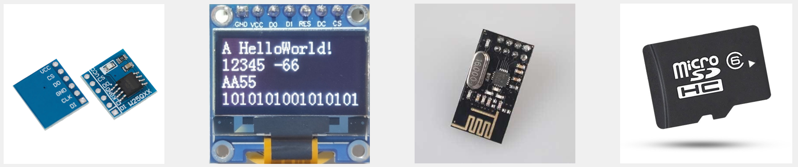


## 2.硬件电路

- 所有的SPI设备的SCK、MOSI、MISO分别连在一起，且是**单端信号，所以要全部设备共地**；
- 主机**另外引出多条SS控制线，分别接到各从机的SS引脚**；
- **引脚配置模式**：
  - 主机的输出引脚MOSI配置为**推挽输出**（这样输出的下降沿和上升沿都非常迅速，解决了**I2C中的速度问题**）；
  - 主机的输入引脚MISO配置为浮空或上拉输入；
  - 对于时钟，主机为输出，从机为输入；
  - 对于MOSI，主机为输出，从机为输入；
  - 对于MISO，主机为输入，从机为输出；
  - 对于SS，**主机为输出，从机为输入（低电平有效）**，但是同一时间**只能指定一个从机**进行数据传输；
  - 对于从机，当SS为高电平时，**其输出引脚MISO必须为高阻态**，这样防止对于主机的MISO产生电平冲突，在SS为低电平时，才允许从机的MISO为推挽输出；

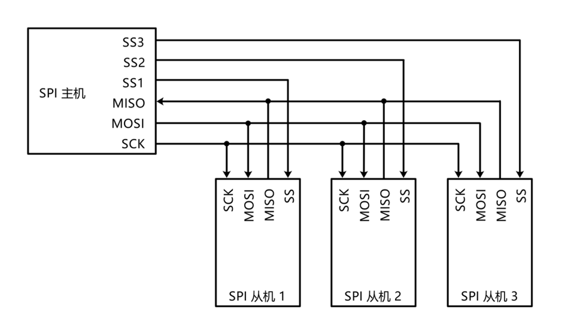


## 3.移位示意图（SPI为高位先行）

- SPI主机：
  - 有一个8位的移位寄存器，且有一个时钟输入端连接；
  - 每来一个时钟，移位寄存器就向左移动一位，因为是高位先行；
  - 且移位寄存器左边移出去的数据通过MOSI引脚输入到从机移位寄存器的右边；
- SPI从机：
  - 也有一个8位的移位寄存器，且有一个时钟输入端连接；
  - 每来一个时钟，移位寄存器就向左移动一位；
  - 且从机移位寄存器中左边移出去的数据通过MISO引脚输入到主机移位寄存器的右边；
- 时钟源：
  - 由主机提供的，叫波特率发生器；
  - **上升沿所有移位寄存器向左移动一位，移出去的位放到引脚上，即主机和从机都输出**；
  - **下降沿引脚上的位采样输入到移位寄存器的最低位，即主机和从机都进行采样输入**；
- 数据传输原理
  - SPI通信过程是基于如下图所示的一个字节交换这个基本过程的，即双方通信时交换一个字节；
  - 若只想发送不想接收，仍采用交换一个字节的时序，只需要不去读数据就行了；
  - 若只想接收不想发送，仍采用交换一个字节的时序，只是发送的数据默认为0x00或0xFF；

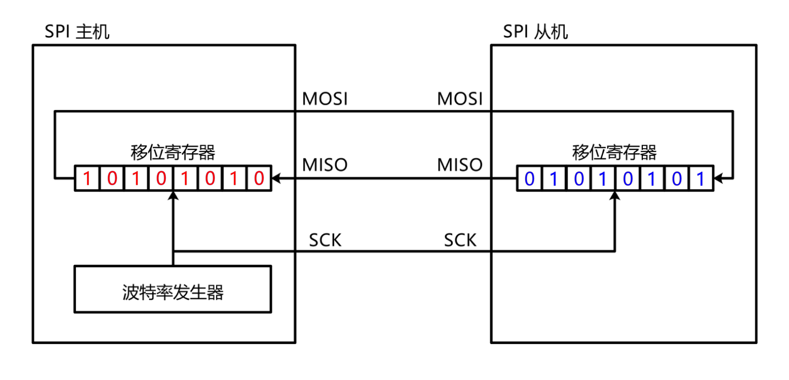


## 4.SPI时序基本单元

- 起始条件与终止条件：

  - 起始条件：SS从高电平切换到低电平，在整个选中过程中，需要始终保持低电平；
  - 终止条件：SS从低电平切换到高电平；

  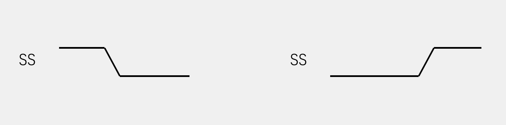

- SPI交换一个字节的4种模式

  - 模式配置选择：通过CPOL和CPHA配置决定
    - CPOL（时钟极性，可配置为1或0），CPOL=0，空闲状态时，SCK为低电平；
    - CPHA（时钟相位，可配置为1或0），CPHA=0，SCK第一个边沿移入数据，第二个边沿移出数据；
    - 两者组合可组成4个模式；
  - **交换一个字节（模式1）**
    - 模式配置：CPOL=0，CPHA=1；
    - 即空闲状态时SCK为低电平，且SCK的第一个边沿移出数据，第二个边沿移入数据；
    - 在SS的上升沿MISO和MOSI还可以进行最后一次变化以便下一次的数据传输；
      - 其中MISO需要置回高阻态，若主机的MISO为上拉输入，则默认电平为高电平；若主机的MISO为浮空输入则电平不确定；
      - 其中MOSI可以选择置为高电平或是低电平，但SPI没有规定MOSI的默认电平，这里也可以不改；
    - 图中MISO一开始的中间线代表高阻态；
    - 如果需要交换多个字节，就不需要把SS置回为高电平；

  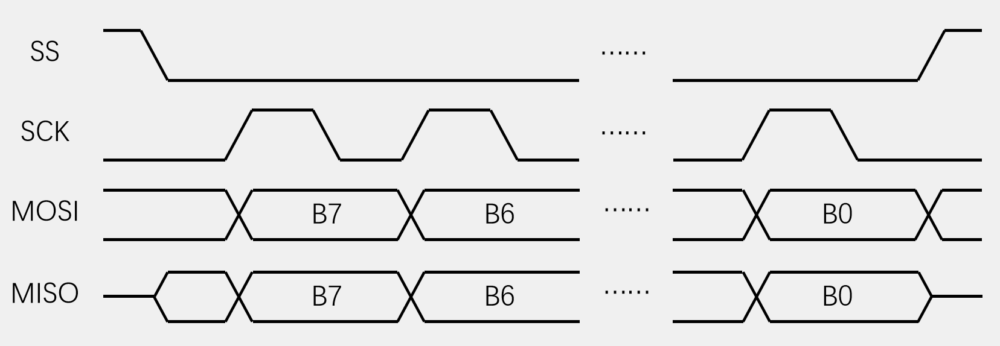

  - **交换一个字节（模式0）：该模式用的最多**
    - 模式设置：CPHA=0，CPOL=0；
    - 即空闲状态SCK为低电平，且SCK第一个边沿移入数据，第二个边沿移出数据；
    - 在SS开启后，需要马上先移出一个数据，即相当于SS的下降沿当作了时钟的一部分；
    - **MISO的下一个B7会冒个头，如果是传输多个字节就可以直接拼接上了**；
    - 注意，CPHA只可以决定第几个边沿输入或移出，不能决定是上升沿还是下降沿，需配合CPOL决定；

  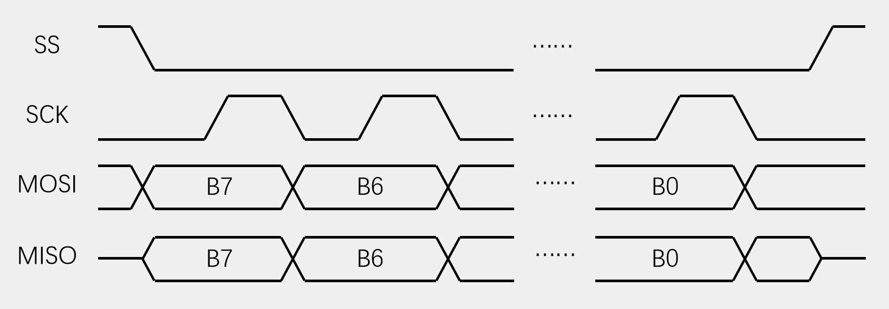

  - **交换一个字节（模式2）**
    - 相比模式0，只是进行了时钟极性的取反；

  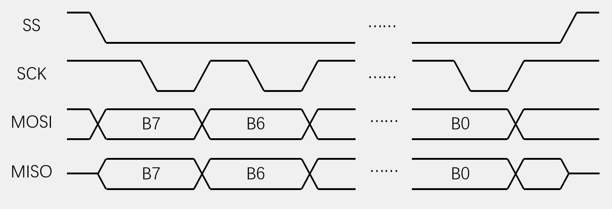

  - **交换一个字节（模式3）**
    - 相比模式1，只是进行了时钟极性的取反；

  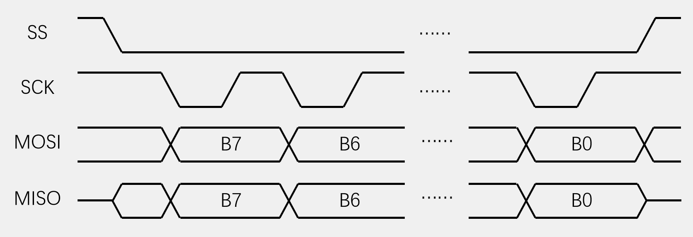


## 5.SPI时序

- 通信模式：

  - SPI采用**“指令码+读写数据”**的模型；
  - I2C中对应的是**读写寄存器的模型**；

- **“指令码＋读写数据”模型**：

  - SPI起始后，第一个交换发送给从机的数据叫指令码，而在从机中对应的会定义一个指令；
  - 发送什么指令时在起始后第一个字节发送指令集的数据，这样就可以指导从机完成相应的功能了；
  - 不同指令有不同的个数，有的指令只需要一个字节的指令码，而有的指令后面需要再跟读写的数据；

- **发送单字节指令的时序——只发送一个指令让从机完成某些状态设置**

  - 采用模式0进行发送，MISO由于STM32内部是**上拉输入**所以一直是高电平；
  - 这是一个给W25Q64写0x06写使能指令的时序；

  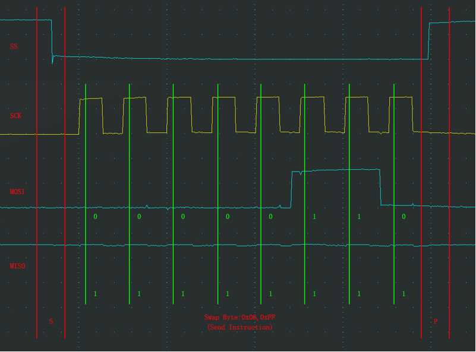

- **指定地址写的时序**

  - 向SS指定的设备，发送写指令（0x02）；
  - 随后在指定地址（Address[23:0]）下，写入指定数据Data；
  - 因为W25Q64有8M的存储空间，所以一个字节的8位地址不够，所以地址是3字节24位的；
  - **SPI中也有像I2C一样的地址指针，每读写一个字节，地址指针加1**；
  - MISO数据线始终处于挂机状态；

  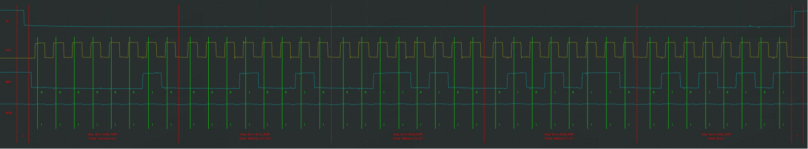

- **指定地址读的时序**

  - 向SS指定的设备，发送读指令（0x03）；
  - 随后在指定地址（Address[23:0]）下，读取从机数据（Data）；
  - 在最后一个字节传输过程中，MOSI发送字节0xFF，MISO则发送指定地址下的数据；
  - **需要注意的是，MISO的第一个高位数据是在上一个字节的下降沿就已经放在MISO数据线上了**；

  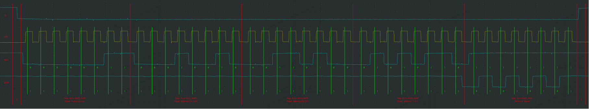

- 画龙点睛

  - 在指定地址写时序中，由于MOSI是软件的置引脚电平，所以相比于下降沿有一些延迟；
  - 在指定地址读时序中，由于MISO是从机硬件执行电平的，所以电平跳变是紧贴下降沿的；

---


# 第三十七节课：11-2_W25Q64简介

## 1.W25Q64简介
- W25Qxx简介
  - 是一种低成本、小型化、使用简单的非易失性存储器，其存储介质为**Nor Falsh闪存**；
  - STM32的程序存储器、U盘、电脑的固态硬盘等都是Flash闪存这种介质；
  - 闪存分为**Nor Flash和Nand Flash**；
  - 常用于数据存储、**字库存储**、固件程序存储等场景；
- 时钟频率：
  - **80MHz/160MHz（Dual SPI，双重SPI）/320MHz（Quad SPI，四重SPI）**；
  - Dual SPI即MOSI和MISO都可以同时用来发送和接收，但是SCLK是不变的，只是一个时钟传输了两位；
  - W25Qxx系列还有WP写保护引脚和HOLD引脚，这两个引脚也可用于传输数据，就是Quad SPI；
  - 由于速度很快，所以如果用软件来完成的话也不需要加延时，因为STM32本身的主频都没有这么高；
- 存储容量（**24位地址**）：
  - W25Q64为8MByte，24位地址可对应最大16MByte容量；
  - **对于W25Q256来说是24位地址不够的，可分为3字节地址或是4字节地址**；

| 系列    | 存储大小                     |
| ------- | ---------------------------- |
| W25Q40  | 4Mbit(比特) / 512KByte(字节) |
| W25Q80  | 8Mbit / 1MByte               |
| W25Q16  | 16Mbit / 2MByte              |
| W25Q32  | 32Mbit / 4MByte              |
| W25Q64  | 64Mbit / 8MByte              |
| W25Q128 | 128Mbit / 16MByte            |
| W25Q256 | 256Mbit / 32MByte            |


## 2.硬件电路

- VCC、GND：2.7~3.6V
- /CS（SS）：SPI片选引脚，/表示是低电平有效；
- CLK：SPI时钟线；
- DI：SPI主机输出从机输入；
- DO：SPI主机输入从机输出；
- /WP：写保护，/表示低电平有效，有效时保护住，不让写；原理图中接到了VCC，需要用时可以接到STM32的GPIO；
- /HOLD：数据保持，/表示低电平有效；
- DI的IO0、DO的IO1、/WP的IO2、/HOLD的IO3就是表示了四重SPI模式；

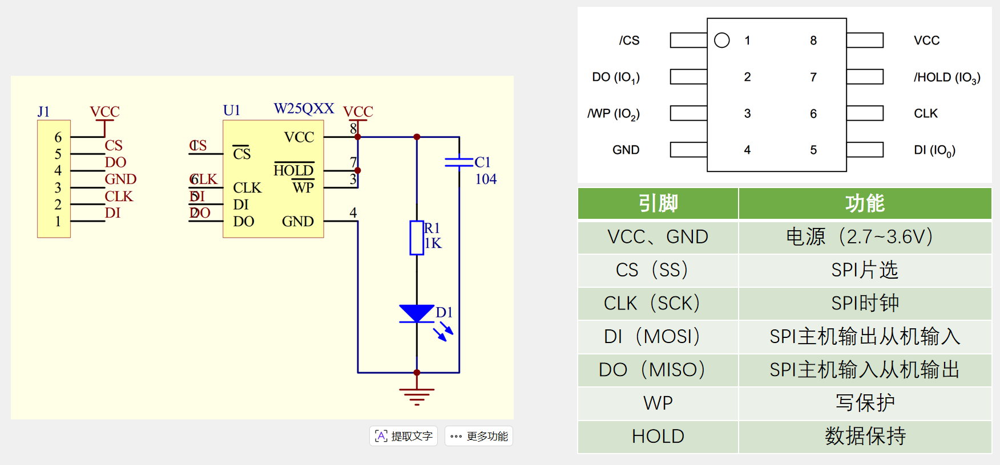


## 3.W25Q64框图

- **存储空间的划分**：
  - 由于8MB的空间已经很大了，如果直接作为一块操作起来就不方便，需要将其作为划分来处理；
  - Flash的常见划分方式
    - 先划分为若干个**Block**；
    - 然后每一个Block再划分为若干的**扇区Sector**；
    - 对于每个扇区内部又可以分成很多**页Page**；
- **W25Q64的划分**：
  - 框图中的最右部分即为整个存储空间，**每个字节分配一个地址**，3字节地址，8M空间所以只用了一半的地址，所以是**从000000到7FFFFF**；
  - 以**64KB**为一个基本单元，将存储空间划分为**若干个块Block**，就是128块，**从块0到块127**，每块地址开始是**xx0000**，结束是**xxFFFF**，也就是说每一块内地址变化范围是低位的2个字节；
  - 以**4KB**为一个基本单元，将块划分为**若干个扇区Sector**，一共是16份，**从Sector0到Sector15**，每个扇区的地址是**xxx000到xxxFFF**；
  - **地址划分到扇区就结束了，但是在写入数据时还有Page页这个更细致的划分**；
  - 以**256个字节**为一个基本单元，再划分为**若干页Page**，一共16页，**从Page0到Page15**，在一页中，地址变化范围是**xxxx00到xxxxFF**，最右框图的一行就代表一页；
- **SPI控制逻辑**：
  - 整个芯片的管理器，SPI的读、写都由它自动完成；
  - 控制逻辑的左边就是SPI的通信引脚；
- **状态寄存器：Status Register**
  - 芯片是否处于忙状态、是否写使能、是否写保护都体现在这个状态寄存器中；
- **写控制逻辑**：
  - 配合/WP引脚完成硬件的写保护自动化；
- **高电压生成器：High Voltage Generator**
  - 配合Flash进行编程，就是用高电压实现Flash闪存的掉电不丢失的；
- **页地址锁存/计数器(Page Address Latch / Counter)与字节锁存/计数器(Byte Address Latch / Counter)**
  - 三个地址前两个会进入页地址锁存计数器，然后页地址通过写保护和行解码来选择操作哪一页；
  - 最后一个字节会进到字节地址锁存计数器，然后通过列解码和256字节页缓存进行指定字节的读写操作；
  - 由于都存在计数器，所以地址指针在读写之后可以自动加1；
- **页缓存区**：Column Decode And 256-Byte Page Buffer
  - 其实是一个**256字节的RAM存储器**；
  - 数据读写就是通过这个缓存区进行的；
  - 就是SPI通信线传入的数据先写在这个缓存区，然后再写入Flash中，因为SPI的速度很快但Flash的写入速度是比较慢的，而RAM是很快的，可以直接将SPI时序的内容写进去；
  - 写入的一个时序中，**连续写入的数据量不能超过256字节**；
  - 等RAM存储器写完后，芯片再慢慢把数据写入到Flash中，由于数据从缓存区转到Flash中需要一定的时间，所以在写入时序结束后芯片会进入一段**“忙”的状态**，会通过导线给**状态寄存器的BUSY位置1**；
  - 读取也需要经过页缓存区，但是读取只是看一下Flash的状态，所以速度很快；

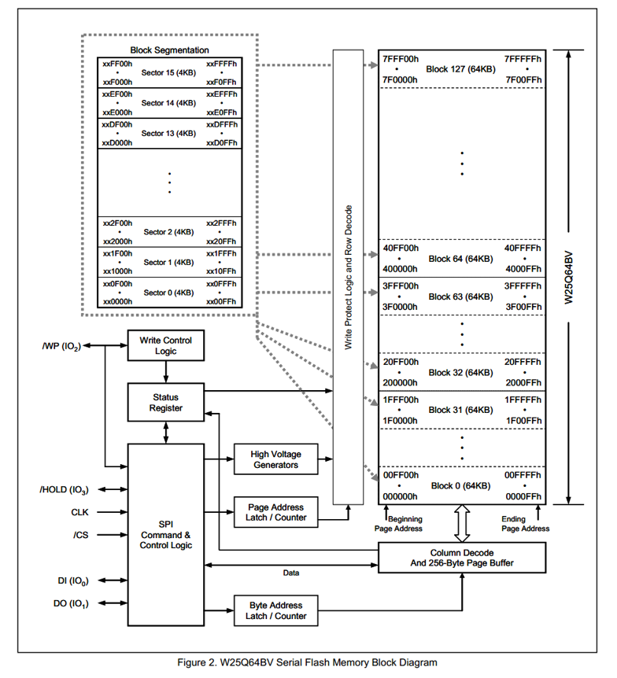


## 4.Flash操作注意事项

### 4.1 写入时：

- 写使能：
  - 写入操作前，必须先进行使能；
  - **WEL位置1，在使能后进行写入操作；**
  - **完成后会自动写失能，即在进行任何写操作前都需要写使能一遍**；
- 覆盖改写与擦除：
  - 每个数据位**只能由1改写为0，不能由0改写为1**（即没有RAM那样的直接完全覆盖改写的能力）；
  - 所以写入数据前必须**先擦除，擦除后，所有数据位变为1即0xFF**，再将1改位0；
  - 擦除必须按**最小擦除单位进行**，不能一个个字节擦除，最小是扇区擦除（即4096个字节）；
- 写入操作的限制：
  - 连续写入多字节时，最多写入一页的数据；
  - 超过页尾位置的数据，**会回到页首覆盖写入（环形Buffer）**；
  - 即一个时序不能超过**256个字节，因为页缓存区只有256个字节**；
  - 且这只是在首地址对准页的首地址的情况，如果从页的中间开始可能会发生地址错乱；
- 忙状态：
  - 写入操作结束后，芯片进入忙状态，**BUSY位置1**；
  - 且进入擦除也是忙状态，此时不会响应读写操作；
  - **Flash虽然没有RAM速度快，但是在非易失性存储介质 中Flash已经是很快的了**；

### 4.2 读取时：

- 直接调用读取时序时，无需使能，无需额外操作，**没有页的限制**；
- **读取操作结束后不会进入忙状态，但不能在忙状态时读取**；


## 5.数据手册解析

### 5.1 寄存器

- 重要的寄存器主要是状态寄存器；
- 状态寄存器有两个，为状态寄存器1和状态寄存器2；
- 在状态寄存器1中有两个重要的位(最低两位)：
  - **BUSY位**：”忙“状态标志位；
  - **Write Enable Latch(WEL)位**：即写保护位；

### 5.2 指令集

- 写使能：指令码是0x06；
- 写失能：指令码是0x04；
- 读状态寄存器1：指令码为0x05，后面有数据，需要继续交换字节，主要用于查看忙状态；
- 页编程：指令码为0x02，接着交换地址的23-16位、15-8位、7-0位，再之后就可以写入数据；
- 扇区擦除：指令码位0x20，起始后需要先发指令再发地址，是扇区擦除；
- 读JEDEC ID号：起始，交换发送0x9F，随后连续交换读取3个字节，终止，其中第一个字节是厂商ID，后两个字节是设备ID；

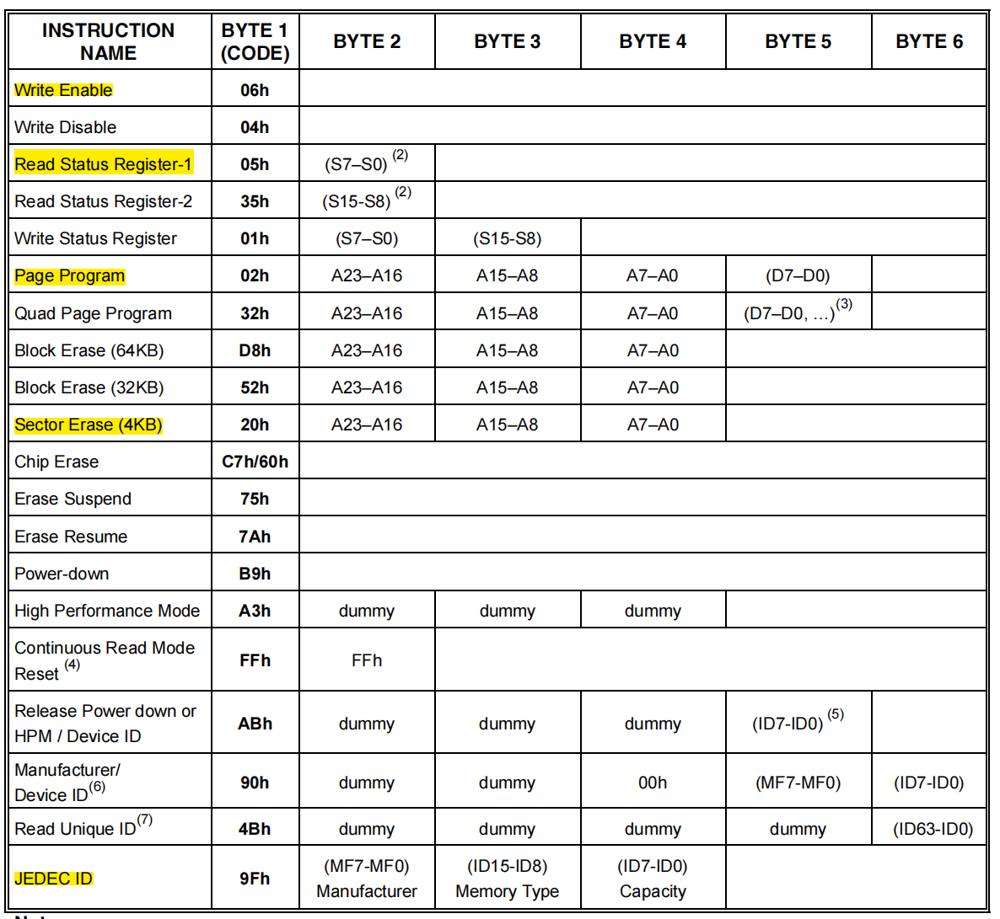

- 读取数据：起始，交换发送指令0x03，之后交换发送3个字节的地址，再之后就可以交换读取了；

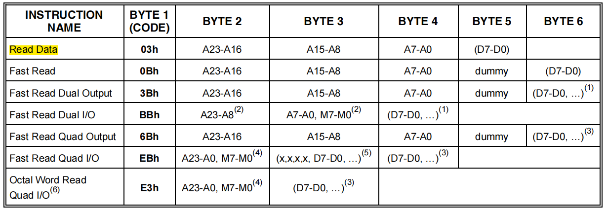

---


# 第三十八节课：11-3_软件SPI读写W25Q64

## 1.接线图

- 引脚（接到任意GPIO口都行）：
  - **CS：片选引脚，接到PA4；**
  - **DO：从机输出，接到PA6；**
  - **CLK：时钟信号，接到PA5；**
  - **DI：从机输入，接到PA7；**
- 这几个引脚分别**对应硬件SPI的引脚**，但这里只用作普通的GPIO口使用；
- 在OLED显示屏的工程下进一步修改；
- 注意抛砖引砖、抛砖引玉、抛玉引砖三个维度理解SPI通信；

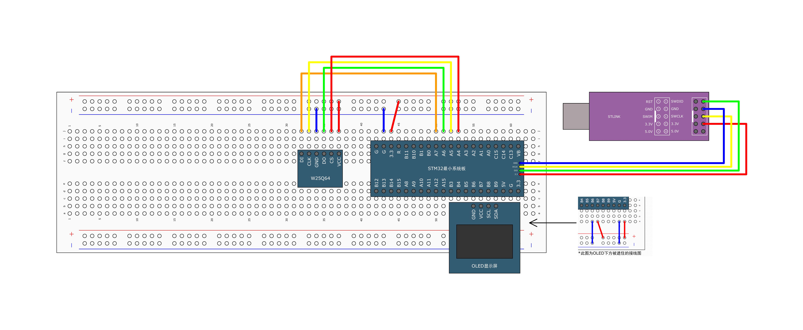


## 2.整体架构

- **SPI通信层：**
  - Hardware组中建一个MySPI模块，包括MySPI.c和MySPI.h文件；
  - 主要内容包括了通信引脚封装、初始化以及SPI通信的3个拼图（起始、终止、交换一个字节）；
- **W25Q64硬件驱动层：**
  - 基于MySPI层建立一个W25Q64模块；
  - 调用底层SPI的拼图，来拼接各种指令和功能的完整时序，如**写使能、擦除、页编程、读数据**；
- **main.c应用层：**
  - main.c函数里调用**驱动函数**来完成整体功能；


## 3.通信层编程

先在Hardware组中添加**MySPI.c和MySPI.h文件**；

### 3.1 MySPI.c文件封装

```c
#include "stm32f10x.h"                  // Device header

/**
  ******************************************************************************
  * @brief        : 这是软件SPI应用层封装
  * @brief        : 由于SPI的速度很快所以不需要加延时
  ******************************************************************************
  */

/**
  * @brief  片选引脚输出函数，引脚为PA4
  * @param  BitValue 片选引脚输出电平
  * @retval 无
  */
void MySPI_W_SS(uint8_t BitValue)
{
	GPIO_WriteBit(GPIOA, GPIO_Pin_4, (BitAction)BitValue);		// 在SS对应的引脚输出高低电平，表示从机选择
}

/**
  * @brief  时钟线输出函数，引脚为PA5
  * @param  BitValue 时钟线电平
  * @retval 无
  */
void MySPI_W_SCK(uint8_t BitValue)
{
	GPIO_WriteBit(GPIOA, GPIO_Pin_5, (BitAction)BitValue);
}

/**
  * @brief  主机输出函数，引脚为PA7
  * @param  BitValue 输出线电平
  * @retval 无
  */
void MySPI_W_MOSI(uint8_t BitValue)
{
	GPIO_WriteBit(GPIOA, GPIO_Pin_7, (BitAction)BitValue);
}

/**
  * @brief  主机输入函数，引脚为PA6
  * @param  无
  * @retval 输入的电平数据
  */
uint8_t MySPI_R_MISO(void)
{
	return GPIO_ReadInputDataBit(GPIOA, GPIO_Pin_6);		// 直接读MISO的对应引脚电平
}

/**
  * @brief  SPI初始化函数
  * @param  无
  * @retval 无
  */
void MySPI_Init(void)
{
	RCC_APB2PeriphClockCmd(RCC_APB2Periph_GPIOA, ENABLE);		// 使能GPIOA端口时钟
	
	GPIO_InitTypeDef GPIO_InitStructure;									// 定义结构体
	GPIO_InitStructure.GPIO_Mode = GPIO_Mode_Out_PP;						// 输出引脚配置为推挽输出
	GPIO_InitStructure.GPIO_Pin = GPIO_Pin_4 | GPIO_Pin_5 | GPIO_Pin_7;		// 选中4号引脚和5号引脚和7号引脚
	GPIO_InitStructure.GPIO_Speed = GPIO_Speed_50MHz;						// 定义速度为50MHz
	GPIO_Init(GPIOA, &GPIO_InitStructure);									// 初始化端口
	
	GPIO_InitStructure.GPIO_Mode = GPIO_Mode_IPU;			// 输入引脚配置为上拉输入
	GPIO_InitStructure.GPIO_Pin = GPIO_Pin_6;				// 选中1号引脚和2号引脚
	GPIO_InitStructure.GPIO_Speed = GPIO_Speed_50MHz;		// 定义速度为50MHz
	GPIO_Init(GPIOA, &GPIO_InitStructure);					// 初始化端口
	
	// 置一下初始化后引脚的默认电平，MOSI没有明确规定，可以不管，MISO是输入引脚所以不需要置电平
	MySPI_W_SS(1);		// 初始化后SS的引脚应为高电平，默认不选择从机
	MySPI_W_SCK(0);		// SPI模式0，对应为低电平
}

/**
  * @brief  起始信号
  * @param  无
  * @retval 无
  */
void MySPI_Start(void)
{
	MySPI_W_SS(0);		// 起始条件为SS置低电平
}

/**
  * @brief  终止信号
  * @param  无
  * @retval 无
  */
void MySPI_Stop(void)
{
	MySPI_W_SS(1);		// 终止条件为SS置高电平
}

/**
  * @brief  交换一个字节时序，基于模式0
  * @param  ByteSend 要发送的字节
  * @retval ByteReceive 接收到的字节
  */
uint8_t MySPI_SwapByte(uint8_t ByteSend)
{
	uint8_t i, ByteReceive = 0x00;		// 定义一个i用于计数，ByteReceive用于返回接收值
	
	for (i = 0; i < 8; i ++)			// 循环发送一个字节
	{
		MySPI_W_MOSI(ByteSend & (0x80 >> i));	// SS下降沿将主机数据移出到MOSI，这里的移位操作本质是掩码
		MySPI_W_SCK(1);							// 产生上升沿读数据
		if (MySPI_R_MISO() == 1)				// 读取MISO线上的数据，若为1则写入ByteReceive的最高位
		{
			ByteReceive |= (0x80 >> i);
		}
		MySPI_W_SCK(0);							// 产生下降沿移出数据
	}
	return ByteReceive;
}


```

### 3.2 MySPI.h文件封装

```c
#ifndef __MYSPI_H
#define __MYSPI_H

void MySPI_Init(void);
void MySPI_Start(void);
void MySPI_Stop(void);
uint8_t MySPI_SwapByte(uint8_t ByteSend);

#endif

```


## 4.硬件驱动层编程

先在Hardware组中添加**W25Q64.c、W25Q64.h文件和W25Q64_Ins.h宏定义文件**；

### 4.1 W25Q64_Ins.h文件封装

- 封装了**操作指令**；

```c
#ifndef __W25Q64_INS_H
#define __W25Q64_INS_H

#define W25Q64_WRITE_ENABLE							0x06
#define W25Q64_WRITE_DISABLE						0x04
#define W25Q64_READ_STATUS_REGISTER_1				0x05
#define W25Q64_READ_STATUS_REGISTER_2				0x35
#define W25Q64_WRITE_STATUS_REGISTER				0x01
#define W25Q64_PAGE_PROGRAM							0x02
#define W25Q64_QUAD_PAGE_PROGRAM					0x32
#define W25Q64_BLOCK_ERASE_64KB						0xD8
#define W25Q64_BLOCK_ERASE_32KB						0x52
#define W25Q64_SECTOR_ERASE_4KB						0x20
#define W25Q64_CHIP_ERASE							0xC7
#define W25Q64_ERASE_SUSPEND						0x75
#define W25Q64_ERASE_RESUME							0x7A
#define W25Q64_POWER_DOWN							0xB9
#define W25Q64_HIGH_PERFORMANCE_MODE				0xA3
#define W25Q64_CONTINUOUS_READ_MODE_RESET			0xFF
#define W25Q64_RELEASE_POWER_DOWN_HPM_DEVICE_ID		0xAB
#define W25Q64_MANUFACTURER_DEVICE_ID				0x90
#define W25Q64_READ_UNIQUE_ID						0x4B
#define W25Q64_JEDEC_ID								0x9F
#define W25Q64_READ_DATA							0x03
#define W25Q64_FAST_READ							0x0B
#define W25Q64_FAST_READ_DUAL_OUTPUT				0x3B
#define W25Q64_FAST_READ_DUAL_IO					0xBB
#define W25Q64_FAST_READ_QUAD_OUTPUT				0x6B
#define W25Q64_FAST_READ_QUAD_IO					0xEB
#define W25Q64_OCTAL_WORD_READ_QUAD_IO				0xE3

#define W25Q64_DUMMY_BYTE							0xFF

#endif

```

### 4.2 W25Q64.c文件封装

- 读取ID号的时序

  - 先起始条件后发送指令，然后连续接收3个字节；
  - 第一个字节是厂商ID，第二个字节是存储器类型，第三个字节是容量，其中第二三个字节就相当于是设备ID；

  

- 其他时序也是参照数据手册的时序进行拼接即可；

```c
#include "stm32f10x.h"                  // Device header
#include "MySPI.h"						// 引入底层
#include "W25Q64_Ins.h"					// W25Q64对应的操作集的宏定义

/**
  ******************************************************************************
  * @brief        : 这是W25Q64的硬件驱动层函数
  ******************************************************************************
  */

/**
  * @brief  硬件初始化函数
  * @param  无
  * @retval 无
  */
void W25Q64_Init(void)
{
	MySPI_Init();	// 只需要调用底层的初始化
}

/**
  * @brief  读取ID号函数
  * @param  无
  * @retval 指针实现多返回值
  */
void W25Q64_ReadID(uint8_t *MID, uint16_t *DID)
{
	MySPI_Start();		// 时序开始
	MySPI_SwapByte(W25Q64_JEDEC_ID);		// 发送接收ID指令0x9F，用宏定义代替
	
	*MID = MySPI_SwapByte(W25Q64_DUMMY_BYTE);		// 发送0xFF来读取厂商ID
	*DID = MySPI_SwapByte(W25Q64_DUMMY_BYTE);		// 发送0xFF返回设备ID的高八位
	*DID <<= 8;		// 将第一次的数据移到高八位
	*DID |= MySPI_SwapByte(W25Q64_DUMMY_BYTE);		// 发送0xFF返回设备ID的低八位，通过或操作实现
	MySPI_Stop();	// 时序结束 
}

/**
  * @brief  写使能函数，发一个指令码即可无需收数据
  * @param  无
  * @retval 无
  */
void W25Q64_WriteEnable(void)
{
	MySPI_Start();							// 起始信号
	MySPI_SwapByte(W25Q64_WRITE_ENABLE);	// 发送写使能指令
	MySPI_Stop();							// 不需要任何数据，直接stop
}

/**
  * @brief  读状态寄存器1，调用后跳出忙状态该函数才结束
  * @param  无
  * @retval 无
  */
void W25Q64_WaitBusy(void)
{
	uint32_t Timeout;		// 超时变量
	MySPI_Start();			// 起始信号
	MySPI_SwapByte(W25Q64_READ_STATUS_REGISTER_1);		// 发送读寄存器1的指令
	Timeout = 10000;
	while ((MySPI_SwapByte(W25Q64_DUMMY_BYTE) & 0x01) == 0x01)		// 掩码取出最低位，并判断是否为1，若为1 则循环等待
	{
		Timeout --;
		if (Timeout == 0)
		{
			break;
		}
	}
	MySPI_Stop();
}

/**
  * @brief  页编程函数
  * @param  Address 写入的地址
  * @param  *DataArray 写入数组地址
  * @param  Count 写入的数量，页编程有页的限制
  * @retval 无
  */
void W25Q64_PageProgram(uint32_t Address, uint8_t *DataArray, uint16_t Count)
{
	W25Q64_WriteEnable();		// 写入之前都需要先写使能
	
	uint16_t i;
	MySPI_Start();
	MySPI_SwapByte(W25Q64_PAGE_PROGRAM);	// 发送指令码
	MySPI_SwapByte(Address >> 16);			// 发送高8位
	MySPI_SwapByte(Address >> 8);			// 发送次高位的字节
	MySPI_SwapByte(Address);				// 发送最低位的字节
	for (i = 0; i < Count; i ++)			// 循环发送所有的数据
	{
		MySPI_SwapByte(DataArray[i]);
	}
	MySPI_Stop();
	
	W25Q64_WaitBusy();		//事后等待
}

/**
  * @brief  扇区擦除函数
  * @param  Address 需要擦除的扇区的地址
  * @retval 无
  */
void W25Q64_SectorErase(uint32_t Address)
{
	W25Q64_WriteEnable();		// 写入之前都需要先写使能
	
	MySPI_Start();
	MySPI_SwapByte(W25Q64_SECTOR_ERASE_4KB);
	MySPI_SwapByte(Address >> 16);		// 发送高8位
	MySPI_SwapByte(Address >> 8);		// 发送次高位的字节
	MySPI_SwapByte(Address);			// 发送最低位的字节
	MySPI_Stop();
	
	W25Q64_WaitBusy();		//事后等待
}

/**
  * @brief  读取数据的函数
  * @param  Address 读取数据的地址
  * @param  *DataArray 读取数据输出数组
  * @param  Count 记录读取的数量，读取没有页的限制
  * @retval 无
  */
void W25Q64_ReadData(uint32_t Address, uint8_t *DataArray, uint32_t Count)
{
	uint32_t i;
	MySPI_Start();
	MySPI_SwapByte(W25Q64_READ_DATA);	// 发送指令码
	MySPI_SwapByte(Address >> 16);		// 发送高8位
	MySPI_SwapByte(Address >> 8);		// 发送次高位的字节
	MySPI_SwapByte(Address);			// 发送最低位的字节
	for (i = 0; i < Count; i ++)		// 通过交换一个字节的程序循环读出数据
	{
		DataArray[i] = MySPI_SwapByte(W25Q64_DUMMY_BYTE);		//发送0xFF置换回有效的数据
	}
	MySPI_Stop();
}

```

### 4.3 W25Q64.h文件封装

```c
#ifndef __W25Q64_H
#define __W25Q64_H

void W25Q64_Init(void);
void W25Q64_ReadID(uint8_t *MID, uint16_t *DID);
void W25Q64_PageProgram(uint32_t Address, uint8_t *DataArray, uint16_t Count);
void W25Q64_SectorErase(uint32_t Address);
void W25Q64_ReadData(uint32_t Address, uint8_t *DataArray, uint32_t Count);


#endif

```


## 5.应用层编程

- main.c文件内容如下；
- 可以基于以下的main.c文件内容进行**读写功能判断、掉电不掉失、Flash可1改0不可0改1、不能跨页写入但可跨页读取**等实验；

```c
#include "stm32f10x.h"                  // Device header
#include "Delay.h"
#include "OLED.h"
#include "W25Q64.h"

/**
  ******************************************************************************
  * @project      : STM32F103C8T6的软件SPI读写W25Q64工程
  * @brief        : 基于软件I2C进行W25Q64的读写
  * @hardware     : STM32103C8T6 + OLED + W25Q64，采用软件SPI读写
  * @software     : Keil MDK + 标准外设库，通信层、硬件驱动层和应用层三部分
  * @author       : blackghost
  * @date         : 2026-03-09
  * @version      : V1
  ******************************************************************************
  */

uint8_t MID;
uint16_t DID;

uint8_t ArrayWrite[] = {0x01, 0x02, 0x03, 0x04};		// 写入的数组
uint8_t ArrayRead[4];		// 读出的数组

int main(void)
{
	OLED_Init();
	W25Q64_Init();
	
	OLED_ShowString(1, 1, "MID:   DID:");
	OLED_ShowString(2, 1, "W:");
	OLED_ShowString(3, 1, "R:");
	
	W25Q64_ReadID(&MID, &DID);
	OLED_ShowHexNum(1, 5, MID, 2);
	OLED_ShowHexNum(1, 12, DID, 4);
	
	W25Q64_SectorErase(0x000000);
	W25Q64_PageProgram(0x000000, ArrayWrite, 4);
	W25Q64_ReadData(0x000000, ArrayRead, 4);
	
	
	OLED_ShowHexNum(2, 3, ArrayWrite[0], 2);
	OLED_ShowHexNum(2, 6, ArrayWrite[1], 2);
	OLED_ShowHexNum(2, 9, ArrayWrite[2], 2);
	OLED_ShowHexNum(2, 12, ArrayWrite[3], 2);
	
	OLED_ShowHexNum(3, 3, ArrayRead[0], 2);
	OLED_ShowHexNum(3, 6, ArrayRead[1], 2);
	OLED_ShowHexNum(3, 9, ArrayRead[2], 2);
	OLED_ShowHexNum(3, 12, ArrayRead[3], 2);
	
	while (1)
	{
		
	}
}

```


## 6.注意事项总结

- 写使能和非忙等待的判断问题；

- 在写入操作前都加上写使能的函数；
- 非忙等待，可分为事前等待和时候等待，两者会有一些效率上的差别；
- 写入数据前一定要擦除，不然大概率是错的，读出来的数据就是原始数据&写入数据；
- **跨页写的问题：若是大量数据就需要软件手动分批写入**；

---


# 第三十九节课：11-4_SPI通信外设

## 1.SPI外设简介
- STM32内部集成了硬件SPI收发电路，可以由硬件自动执行**时钟生成、数据收发**等功能，减轻CPU的负担；
- 可配置**8位**/16位数据帧、**高位先行**/低位先行，最常见的就是**8位数据帧，高位先行**；
- 时钟频率：
  - fpclk/（2，4，8，16，32，64，128，256），就是SPI的时钟由PCLK分频得来；
  - PCLK即外设时钟，APB2的PCLK为72MHz，APB1的PCLK是36MHz；
  - SPI1是APB2的外设，所以最高是36MHz；
- 支持多主机模型、主或从操作
- 可精简为半双工/单工通信；
- **支持DMA，兼容I2S协议**；
  - **I2S是一种数字音频信号传输协议，注意不要和I2C混淆**；
- STM32F103C8T6有**SPI1（APB2，72MHz）、SPI2（APB1，36MHz）**；


## 2.SPI框图

- **接收缓冲区、移位寄存器、发送缓冲区：**
  - 移位寄存器在时钟的驱动下，右边的低位通过MOSI输出，左边的数据通过MISO输入，整个移位寄存器不断**右移**，这是低位先行的情况；
  - **LSBFIRST可控制低位先行还是高位先行**，给0是高位先行，给1是低位先行，图中是低位先行；
  - 引脚的MOSI和MISO内部做了交叉，**可选择SPI的主从模式变换**；
  - 发送数据寄存器就是发送缓冲区、接收数据寄存器就是接收缓冲区，两个寄存器占用同一个地址，统一叫做DR；
  - **两个寄存器占用同一个地址，但是不是同一个寄存器，只是为了软件的方便而已；**
- **发送与接收数据时序：**
  - 当移位寄存器没有数据移位时，TDR的数据会立刻转入移位寄存器，开始移位；转入时刻会置**TXE为1，表示发送寄存器空**；
  - 当检查到发送寄存器空时下一个数据就可以提前写入TDR里了；
  - 在移位寄存器移出的过程中，MISO的数据也会移入，一旦数据移出完成，数据移入也完成；
  - 这时移入的数据就会整体从移位寄存器转入接收缓冲区RDR，此时会置状态寄存器的**RXNE为1，表接收寄存器非空**；
  - 当检查到接受寄存器非空后就需要尽快把数据从RDR读出来，在下一个数据接收前读走就可实现连续读取了；
  - **三种协议的对比：**
    - SPI是同步的全双工协议，移位寄存器是公用的，但发送数据寄存器和接受数据寄存器是分开的；
    - I2C是同步的半双工协议，所以移位寄存器和发送数据寄存器以及接受数据寄存器都是公用的；
    - 串口是异步的全双工协议，所以移位寄存器和发送数据寄存器以及接受数据寄存器都是分开的；
- **波特率发生器**
  - 用于产生SCK时钟，其内部就是一个分频器；
  - 波特率发生器的输入是PCLK时钟，经过内部分频器分频得到SPI的速度；
- **控制寄存器控制位**
  - **分频系数由CR1寄存器的三个位BR0、BR1、BR2用于决定**；
  - **SPE位是SPI使能位，就是Cmd()函数配置的位；**
  - MSTR位用于配置主从模式，1是主模式，0是从模式；
  - **CPOL和CPHA两位用于选择SPI的4种模式；**
- **状态寄存器：**
  - 即SPI_SR寄存器；
  - **状态寄存器中的TXE和RXNE两个标志位是重要的；**
- **NSS引脚：**
  - 这里的NSS引脚主要是用来实现多主机模式的，一般不用这个脚做片选引脚；
  - **片选引脚需要用任意一个GPIO口来模拟；**

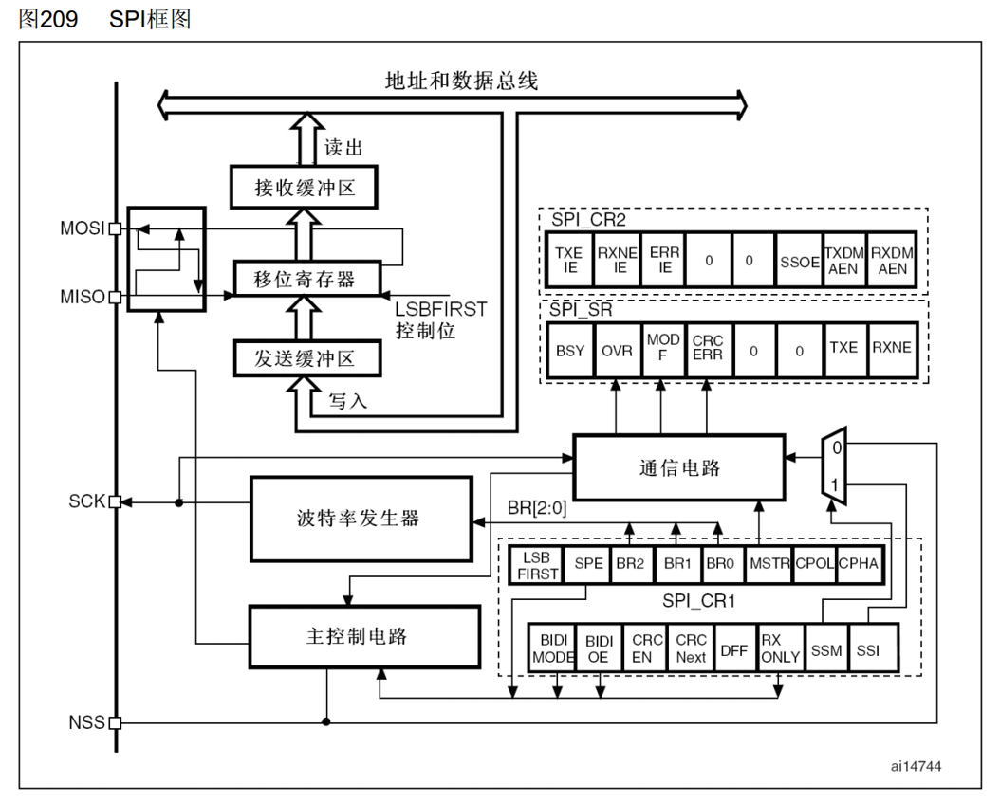


## 3.SPI基本结构

- **TDR发送数据寄存器、RDR接受数据寄存器、TXE发送数据寄存器空、RXNE接受数据寄存器非空**；
- 数据控制器：控制数据的发送和接收；
- **SS引脚用GPIO口来模拟；**
- 开关控制：即Cmd()函数使能SPI；

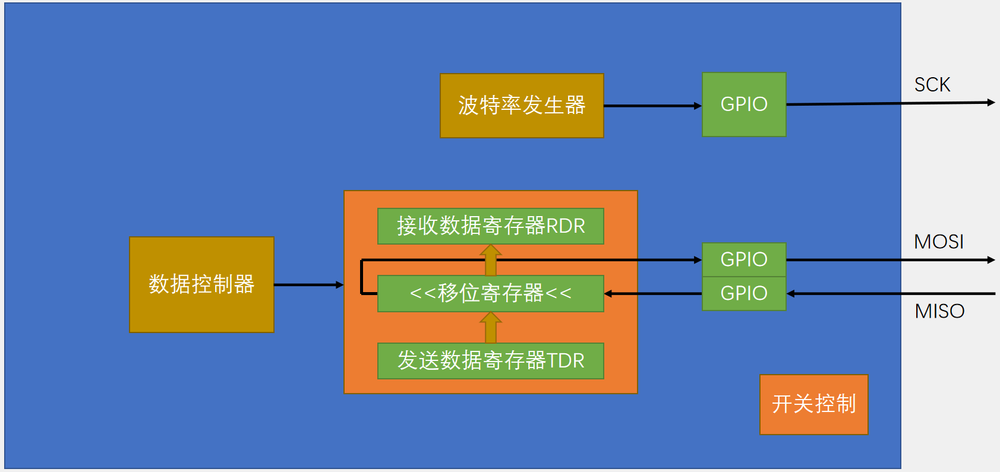


## 4.两种传输模式的时许图

### 4.1 主模式全双工连续传输

- 多字节数据流前仆后继的模式，速度快但操作复杂，**一般少用**，这里使用的是SPI模式3讲解的；
- **一旦TXE为1就将下一个数据写到TDR里面候着；**
- **由于数据之间的时序是错开的，所以不好封装代码；**

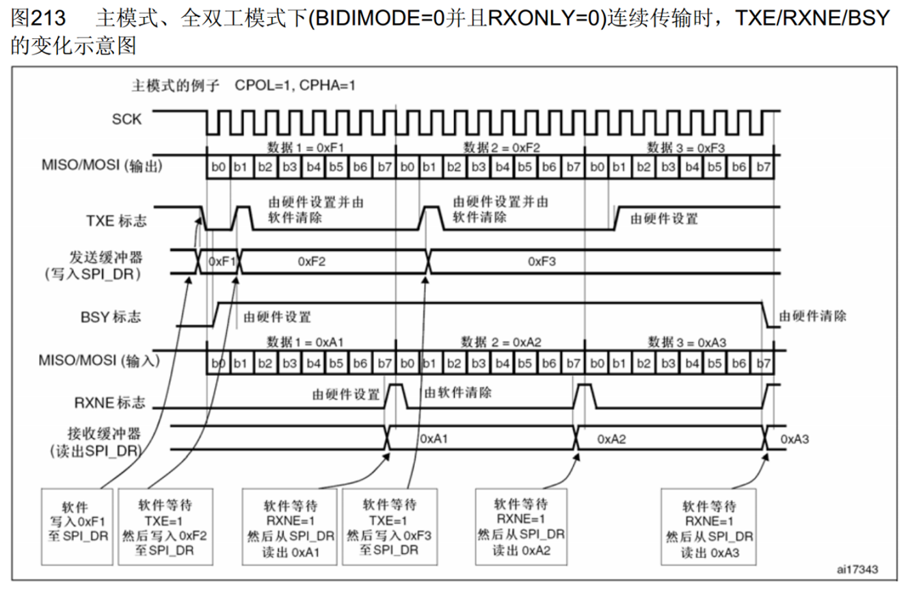

### 4.2 非连续传输（一般用这个）

- 丢掉一点性能，但是操作简单；
- **TXE等于1后不着急将下一个数据写进去，等第一个字节结束之后且RXNE为1后再写入下一个数据；**
- **字节间存在间断，但是数据的发送时序非常工整，代码封装简单；**

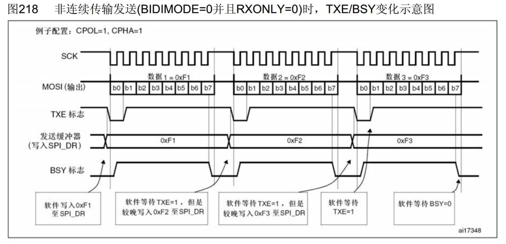


## 5.软硬件时序对比

- 上面是软件波形，下面是硬件波形；
- 两者的主要对比就是数据的变化和时钟边沿的对齐问题；

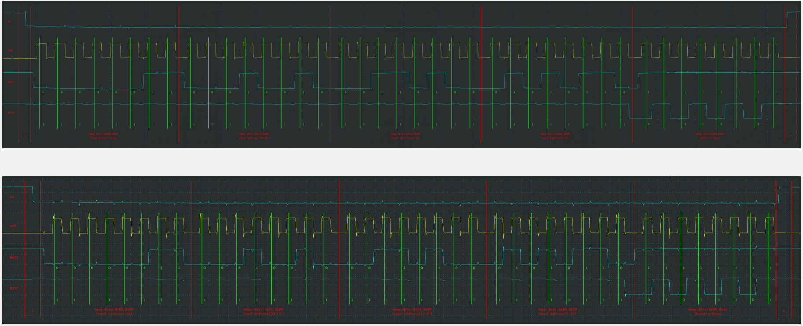

---


# 第四十节课：11-5_硬件SPI读写W25Q64

## 1.接线图

- 使用SPI1，根据引脚映射表，SCK接PA5，MISO接PA6，MOSI接PA7；
- NSS可以通过普通GPIO口模拟；


## 2.SPI初始化步骤以及库函数API

### 2.1 SPI初始化步骤

- 第一步：开启SPI和GPIO口的时钟；
- 第二步：初始化GPIO：
  - 其中SCK和MOSI是由硬件外设控制的输出信号，配置为**复用推挽输出**；
  - MISO是输入信号，可以配置为**上拉输入**；
  - SS引脚配置为**通用推挽输出**；
- 第三步：利用结构体配置SPI外设；
- 第四步：使能SPI，即Cmd()函数；

### 2.2 SPI库函数API——stm32f10x_spi.h

- 初始化相关函数：
  - SPI_I2S_DeInit()：恢复缺省配置；
  - **SPI_Init()**：初始化；
  - SPI_StructInit()：为结构体赋默认值
  - **SPI_Cmd()**：使能SPI外设；
- 外设使能相关函数：
  - SPI_I2S_ITConfig()：使能中断；
  - SPI_I2S_DMACmd()：使能DMA；
- 发送接收数据函数：
  - SPI_I2S_SendData()：发送数据到发送数据寄存器
  - uin16_t SPI_I2S_ReceiveData()：从接受数据寄存器中读数据
- 标志位相关函数：
  - FlagStatus SPI_I2S_GetFlagStatus()：获取标志位；
  - void SPI_I2S_ClearFlag()：清除标志位;
  - ITStatus SPI_I2S_GetITStatus()：获得中断标志位；
  - void SPI_I2S_ClearITPendingBit()：清除中断标志位；

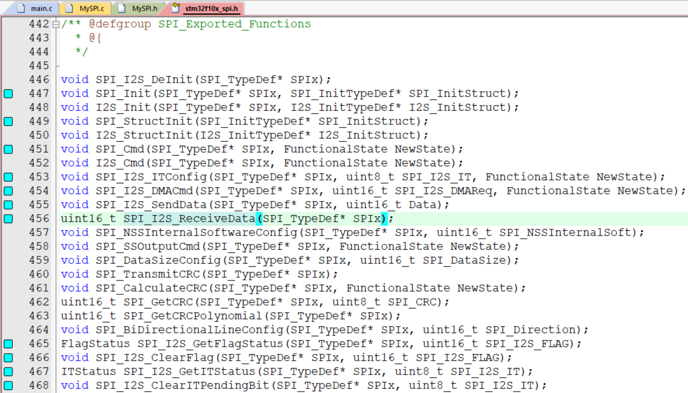


## 3.项目编程

- 在上一个工程的基础上进行修改，修改底层的MySPI文件即可，**将软件SPI换成硬件SPI，这样基于通信层的驱动代码就不用改了**；
- MySPI.c文件修改

```c
#include "stm32f10x.h"                  // Device header

/**
  * @brief  片选引脚输出函数，引脚为PA4，软件模拟
  * @param  BitValue 片选引脚输出电平
  * @retval 无
  */
void MySPI_W_SS(uint8_t BitValue)
{
	GPIO_WriteBit(GPIOA, GPIO_Pin_4, (BitAction)BitValue);    //在SS对应的引脚输出高低电平，表示从机选择
}

/**
  * @brief  SPI初始化函数
  * @param  无
  * @retval 无
  */
void MySPI_Init(void)
{
	// 第一步：开启时钟
	RCC_APB2PeriphClockCmd(RCC_APB2Periph_GPIOA, ENABLE);	// 使能GPIOA端口时钟
	RCC_APB2PeriphClockCmd(RCC_APB2Periph_SPI1, ENABLE);	// 开启SPI的时钟
	
	// 第二步：初始化GPIO
	// 初始化SS引脚，即PA4
	GPIO_InitTypeDef GPIO_InitStructure;
	GPIO_InitStructure.GPIO_Mode = GPIO_Mode_Out_PP;		// 输出引脚配置为推挽输出
	GPIO_InitStructure.GPIO_Pin = GPIO_Pin_4;				// 选中4号引脚
	GPIO_InitStructure.GPIO_Speed = GPIO_Speed_50MHz;		// 定义速度为50MHz
	GPIO_Init(GPIOA, &GPIO_InitStructure);
	
	// 初始化MISO引脚
	GPIO_InitStructure.GPIO_Mode = GPIO_Mode_IPU;			// 输入引脚配置为上拉输入模式
	GPIO_InitStructure.GPIO_Pin = GPIO_Pin_6;				// 选中6号引脚
	GPIO_InitStructure.GPIO_Speed = GPIO_Speed_50MHz;		// 定义速度为50MHz
	GPIO_Init(GPIOA, &GPIO_InitStructure);
	
	// 初始化MOSI和SCK引脚
	GPIO_InitStructure.GPIO_Mode = GPIO_Mode_AF_PP;			// 输出引脚配置为复用推挽输出
	GPIO_InitStructure.GPIO_Pin = GPIO_Pin_5 | GPIO_Pin_7;	// 选中5号引脚和7号引脚
	GPIO_InitStructure.GPIO_Speed = GPIO_Speed_50MHz;		// 定义速度为50MHz
	GPIO_Init(GPIOA, &GPIO_InitStructure);
	
	// 第三步：初始化SPI
	SPI_InitTypeDef SPI_InitStructure;
	SPI_InitStructure.SPI_BaudRatePrescaler = SPI_BaudRatePrescaler_128;	// 决定SCK时钟的频率，500多KHz
	SPI_InitStructure.SPI_CPHA = SPI_CPHA_1Edge;							// 与CPOL指定工作模式0
	SPI_InitStructure.SPI_CPOL = SPI_CPOL_Low;								// 与CPHA指定工作模式0
	SPI_InitStructure.SPI_CRCPolynomial = 7;								// CRC校验的多项式，不用理它给个默认值即可
	SPI_InitStructure.SPI_DataSize = SPI_DataSize_8b;						// 8位数据帧
	SPI_InitStructure.SPI_Direction = SPI_Direction_2Lines_FullDuplex;		// 对应的就是SPI的引脚裁剪功能，这里选择的就是双线全双工
	SPI_InitStructure.SPI_FirstBit = SPI_FirstBit_MSB;						// 高位先行
	SPI_InitStructure.SPI_Mode = SPI_Mode_Master;							// 决定是主机还是从机
	SPI_InitStructure.SPI_NSS = SPI_NSS_Soft;								// 利用引脚模拟NSS引脚，所以选择软件方式
	SPI_Init(SPI1, &SPI_InitStructure);
	
	// 第四步：使能SPI
	SPI_Cmd(SPI1, ENABLE);
	
	// 第五步：默认给SS输出高电平，默认不选择从机
	MySPI_W_SS(1);
}

/**
  * @brief  起始信号
  * @param  无
  * @retval 无
  */
void MySPI_Start(void)
{
	MySPI_W_SS(0);		//起始条件为SS置低电平
}

/**
  * @brief  终止信号
  * @param  无
  * @retval 无
  */
void MySPI_Stop(void)
{
	MySPI_W_SS(1);		//终止条件为SS置高电平
}

/**
  * @brief  交换一个字节时序，基于模式0
  * @param  ByteSend 要发送的字节
  * @retval ByteReceive 接收到的字节
  */
uint8_t MySPI_SwapByte(uint8_t ByteSend)
{
	// 先判断TXE是否置位，即判断是发送缓冲区是否为空，写入数据会自动清除标志位
	while (SPI_I2S_GetFlagStatus(SPI1, SPI_I2S_FLAG_TXE) != SET);
	
	// 写入要发送的数据，这里是写入TDR，即发送缓存器
	SPI_I2S_SendData(SPI1, ByteSend);
	
	// 等待RXNE，读数据会清除此标志位
	while (SPI_I2S_GetFlagStatus(SPI1, SPI_I2S_FLAG_RXNE) != SET);
	
	// 读取DR寄存器的值
	return SPI_I2S_ReceiveData(SPI1);
}

```

- MySPI.h文件修改

```c
#ifndef __MYSPI_H
#define __MYSPI_H

void MySPI_Init(void);
void MySPI_Start(void);
void MySPI_Stop(void);
uint8_t MySPI_SwapByte(uint8_t ByteSend);

#endif

```

- main.c应用层文件修改

```c
#include "stm32f10x.h"                  // Device header
#include "Delay.h"
#include "OLED.h"
#include "W25Q64.h"

/**
  ******************************************************************************
  * @project      : STM32F103C8T6的硬件SPI读写W25Q64工程
  * @brief        : 基于硬件I2C进行W25Q64的读写
  * @hardware     : STM32103C8T6 + OLED + W25Q64，采用硬件SPI读写
  * @software     : Keil MDK + 标准外设库，通信层(硬件SPI)、硬件驱动层和应用层三部分
  * @author       : blackghost
  * @date         : 2026-03-09
  * @version      : V1
  ******************************************************************************
  */

uint8_t MID;
uint16_t DID;

uint8_t ArrayWrite[] = {0x01, 0x02, 0x03, 0x04};	// 写入的数组
uint8_t ArrayRead[4];		// 读出的数组

int main(void)
{
	OLED_Init();
	W25Q64_Init();
	
	OLED_ShowString(1, 1, "MID:   DID:");
	OLED_ShowString(2, 1, "W:");
	OLED_ShowString(3, 1, "R:");
	
	W25Q64_ReadID(&MID, &DID);
	OLED_ShowHexNum(1, 5, MID, 2);
	OLED_ShowHexNum(1, 12, DID, 4);
	
	W25Q64_SectorErase(0x000000);
	W25Q64_PageProgram(0x000000, ArrayWrite, 4);
	W25Q64_ReadData(0x000000, ArrayRead, 4);
	
	
	OLED_ShowHexNum(2, 3, ArrayWrite[0], 2);
	OLED_ShowHexNum(2, 6, ArrayWrite[1], 2);
	OLED_ShowHexNum(2, 9, ArrayWrite[2], 2);
	OLED_ShowHexNum(2, 12, ArrayWrite[3], 2);
	
	OLED_ShowHexNum(3, 3, ArrayRead[0], 2);
	OLED_ShowHexNum(3, 6, ArrayRead[1], 2);
	OLED_ShowHexNum(3, 9, ArrayRead[2], 2);
	OLED_ShowHexNum(3, 12, ArrayRead[3], 2);
	
	while (1)
	{
		
	}
}

```

---


# 第四十一节课：12-1_Unix时间戳

## 1.Unix时间戳简介
- Unix时间戳最高在Unix系统中使用，所以叫Unix时间戳；
- Unix 时间戳（Unix Timestamp）
  - 定义为**从UTC/GMT的1970年1月1日0时0分0秒（伦敦时间）**开始所经过的秒数；
  - 时间戳**不考虑闰秒**，所以存在与国家授时中心的时间有偏差的情况；
- 时间戳存储在一个**秒计数器**中，秒计数器为**32位/64位**的整型变量；
  - 早期的Unix系统中是32位有符号数，大概最大为21亿多，存在2038年危机；
  - STM32中也是32位，但是是32位无符号数，可到2106年；
- 世界上所有时区的秒计数器相同，不同时区通过**添加偏移**来得到当地时间；
- 1970年-1-1之前的时间是无法用时间戳表示的；

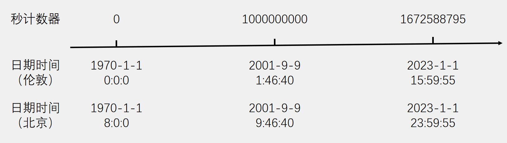


## 2.UTC/GMT

- **GMT：Greenwich Mean Time，格林尼治（伦敦的一个地方）标准时间**
  - 一种以**地球自转**为基础的时间计量系统；
  - 它将地球自转一周的时间间隔等分为24小时，以此确定计时标准；
  - **由于地球自转一周的时间是不固定的，所以存在误差；**
- **UTC：Universal Time Coordinated，协调世界时**
  - 是一种以**原子钟**为基础的时间计量系统；
  - 它规定铯133原子基态的两个超精细能级间在零磁场下跃迁辐射9,192,631,770周所持续的时间为1秒；
  - **当原子钟计时一天的时间与地球自转一周的时间相差超过0.9秒时，UTC会执行闰秒来保证其计时与地球自转的协调一致（即一分钟出现61秒的情况）；**


## 3.时间戳转化

- C语言的**time.h模块**提供了时间获取和时间戳转换的相关函数，可以方便地进行**秒计数器、日期时间和字符串之间的转换**；

- **时间戳转换中的数据类型：**

  - 以下所有内容可以直接打开time.c文件查看源码验证；

  - 秒计数器数据类型：time_t，是一个typedef重定义的数据类型；
  - 日期时间数据类型：struct tm，一整个代表是一个结构体的类型名；
  - 字符串数据类型：char *，即char型的指针，用于指向一个表示时间的字符串；

  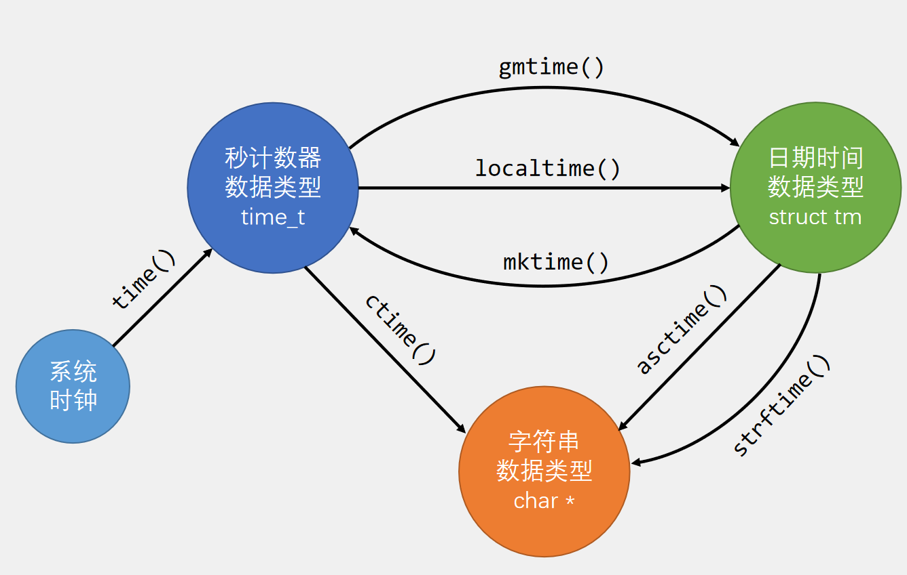

- **官方库函数**

  - ```c
    time_t time(time_t*)
    ```

    - 获取系统时钟，返回值是当前系统时钟的秒计数器值；
    - 参数类似于指针返回多个返回值的用法；
    - 但在STM32中无法调用这个函数的，因为STM32是一个离线系统；

  - ```c
    struct tm* gmtime(const time_t*)
    ```

    - 将秒计数器值转换为日期时间（格林尼治时间）；
    - 年是经过1900年到目前的年数，月是从1月经过的月数；

  - ```c
    struct tm* localtime(const time_t*)
    ```

    - 获取**当地的时间日期**，函数内部会自动获取当前位置的时区；

  - ```c
    time_t mktime(struct tm*)
    ```

    - 将日期时间转换为秒计数器值，**传入的时间需要是当地时间**；

  - ```c
    char* ctime(const time_t*)
    ```

    - 把秒计数器转换为字符串；

  - ```c
    char* asctime(const struct tm*)
    ```

    - 把日期时间转换为字符串；

  - ```c
    size_t strftime(char*, size_t, const char*, const struct tm*)
    ```

    - 日期时间转换为字符串，但是可以**自定义格式**；

  - ```c
    clock_t clock()
    ```

    - 计算程序的执行时间；

  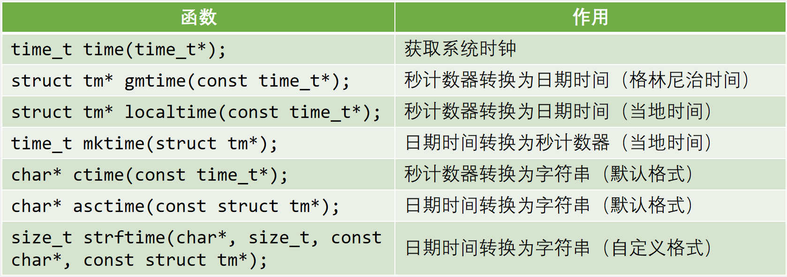

---


# 第四十二节课：12-2_BKP备份寄存器&RTC实时时钟

## 1.BKP简介
- **Backup Registers，备份寄存器；**
- **BKP的作用：**
  - 可用于存储用户应用程序数据，当VDD电源被切断，仍然由**VBAT（1.8V~3.6V）**维持供电；
  - VBAT只有一根正极引脚，电源的负极直接接STM32的GND即可；
  - 当系统在待机模式下被唤醒或系统复位或电源复位时，它们也不会被复位；
  - 若两者都没有电源则会被复位，**因为BKP的本质是RAM存储器；**
- **TAMPER引脚**：
  - 产生的侵入事件将所有备份寄存器内容清除；
  - 该引脚用于防止设备被偷；
- **RTC引脚**：
  - 输出**RTC校准时钟、RTC闹钟脉冲或者秒脉冲**；
  - 存储RTC时钟校准寄存器；
  - **PA13、TAMPER、RTC三个引脚共用，所以同一时间只能使用一个功能；**
- 用户数据存储容量：
  - 20字节（中容量和小容量，STM32F103C8T6就是）；
  -  84字节（大容量和互联型）；


## 2.BKP基本结构

- 引脚部分：
  - TAMPER：侵入信号检测引脚；
  - RTC：RTC的时钟输出可从这个引脚输出；
  - VBAT：备用电池供电；
- 后备区域：
  - 有电源时由电源供电，没电源时由VBAT供电；
  - 每个寄存器的大小是**16位的**，对于小容量和中容量STM32而言只有DR1到DR10，一共20字节；

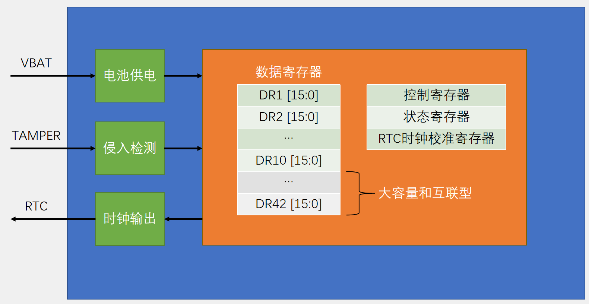


## 3.RTC外设简介

- 实时时钟，RTC是一个**独立的定时器，可为系统提供时钟和日历的功能**；

- 外设位置结构

  - RTC和时钟配置系统处于后备区域，系统复位时数据不清零；
  - **VDD（2.0~3.6V）断电后可借助VBAT（1.8~3.6V）**供电继续走时；
  - **即与BKP是同一套供电系统**；

- Unix计数器：

  - **具有32位的可编程计数器**，可对应Unix时间戳的秒计数器；
  - **20位的可编程预分频器**，可适配不同频率的输入时钟；
  - **即将RTCCLK降频，保证分频器给计数器的频率为1Hz**；

- 可选择**三种RTC时钟源**：在RCC中设置的

  - HSE时钟除以128（通常为8MHz / 128）；
  - LSE振荡器时钟（通常为32.768KHz）；
  - LSI振荡器时钟（40KHz，一般作为看门狗时钟）；
  - 选择一个接入RTCCLK，作为时钟来源，再经过分频器得到1Hz；
  - **用得最多的就是LSE振荡器时钟，因为即使电源断电这个时钟还是不会停，它是由VBAT供电的；**

  


## 4.RTC框图

- **后备区域部分：后背区域都是由VBAT供电的**
  - **分频和计数计时部分：**
    - 分频包含重装载寄存器和余数计数器，类似于定时器的计数器CNT和重装值ARR；
    - 余数计数器是一个**自减计数器**，当减到0时产生溢出信号，之后将重装载寄存器的值重新加载到余数计数器中，从而产生分频；
    - 分频系数是重装载寄存器的值加1；
    - 32位可编程计数器（CNT）就对应这Unix时间戳的秒计数器；
  - **PWR功耗部分：**
    - ALR是闹钟，写入一个秒数即可设置闹钟；
    - 当CNT的值与ALR设定的闹钟值一样时即可响闹钟；
    - 可以**触发中断或退出待机模式，且是一次性闹钟**；
- **中断与NVIC部分：**
  - **触发源：**
    - RTC_Second：秒中断，即时钟；
    - RTC_Overflow：CNT计数溢出；
    - RTC_Alram：闹钟中断；
- **总线部分：**
  - RTC是APB1上的设备；
  - 可通过APB1来读写寄存器；
- **芯片的工作模式部分**：
  - **WKUP Pin引脚**：与前面的闹钟一样，也可唤醒设备，对应**PA0引脚**；

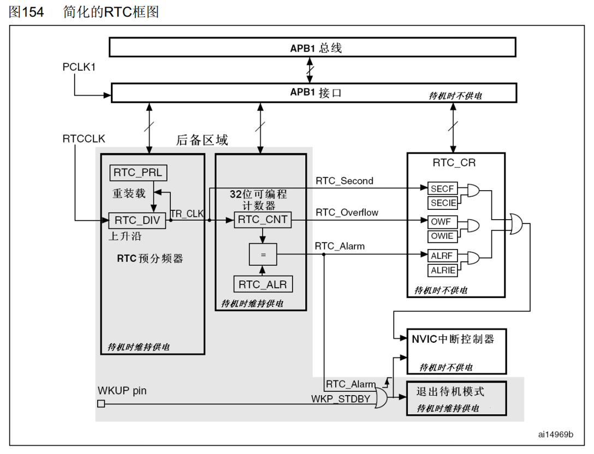


## 5.RTC基本结构

- 时钟来源：在RCC中设置；
- 分频：对RTCCLK进行分频；
- 重装寄存器、余数寄存器；
- CNT计数器、ALR闹钟值；
- 中断：三个中断触发源；

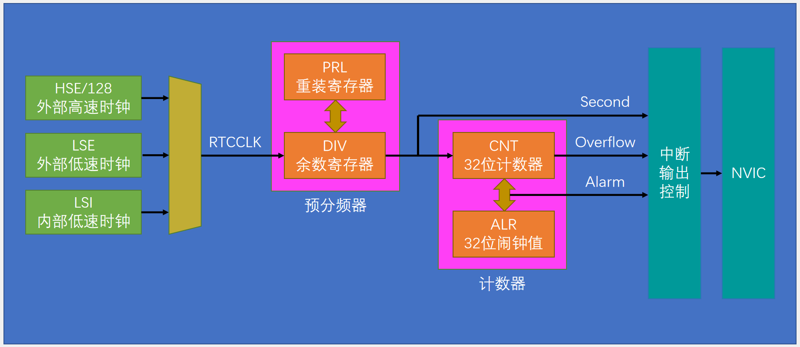


## 6.必须的外部硬件电路

要实现RTC实时时钟功能，除了最小系统板外，还需要以下外部硬件电路：

- 备用电源VBAT供电：图中给出了两种方案；
- 外部低速晶振：`32.768KHz`的晶振，是一个**石英晶体振荡器**；
- 在这块STM32最小系统板上已经有了外部低速晶振了，且VBAT引脚也引出来了；

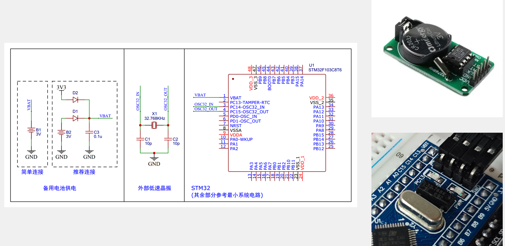


## 7.RTC操作注意事项

- **执行以下操作将使能对BKP和RTC的访问：**
  - 设置RCC_APB1ENR的PWREN和BKPEN，使能PWR和BKP时钟；
  - 设置PWR_CR的DBP，使能对BKP和RTC的访问；
  - **即若要开启BKP和RTC就需要经过上面两步，这和GPIO的简单开启时钟是不同的**；
- **时钟同步问题：**
  - 若在读取RTC寄存器时，RTC的APB1接口曾经处于禁止状态，则软件首先必须等待RTC_CRL寄存器中的RSF位（寄存器同步标志）被硬件置1；
  - 只需要在初始化时调用一个等待同步的函数即可；
  - **即读取寄存器时是用APB1总线的速度读的，但是读之前可能是RTCCLK时钟驱动RTC运行的，所以需要等待RTC的时钟变更为APB1才能同步读取；**
  - 这一点就类似于STM32上电瞬间的晶振工作一样；
- **写入时钟问题：**
  - 必须设置RTC_CRL寄存器中的CNF位，使RTC进入配置模式后，才能写入RTC_PRL、RTC_CNT、RTC_ALR寄存器；
  - 但是库函数中每个写寄存器的函数都帮我们自动加上这一步了，所以不需要理；
- **RTC寄存器的忙状态：**
  - 对RTC任何寄存器的写操作，都必须在前一次写操作结束后进行；
  - 可以通过查询RTC_CR寄存器中的RTOFF状态位，判断RTC寄存器是否处于更新中；
  - 仅当RTOFF状态位是1时，才可以写入RTC寄存器；
  - 跟Flash的BUSY位类似，写一个等待函数即可；

---


# 第四十三节课：12-3_读取备份寄存器&实时时钟

## 1.读写备份寄存器

### 1.1 接线图

- VB直接接STLINK的3.3V引脚，但别接成了5V，VBAT不支持5V供电；
- PB1接一个按键，用于控制；

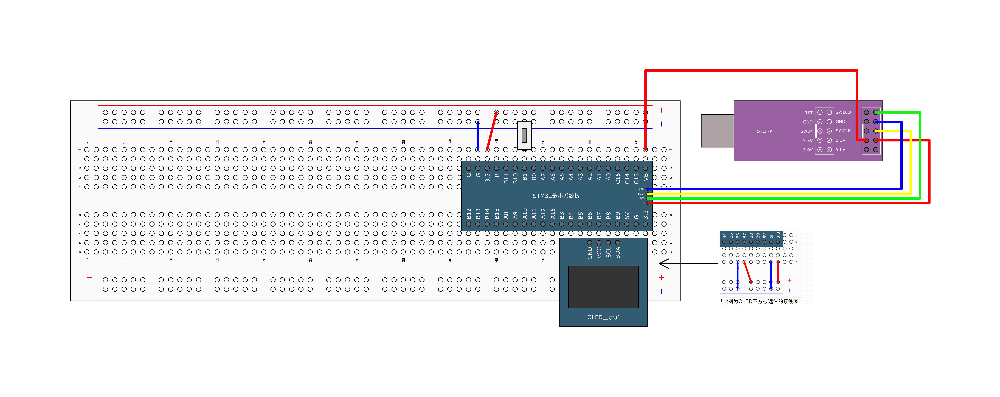

### 1.2 BKP的初始化步骤

- 第一步：开启PWR和BKP的时钟；
- 第二步：使用PWR的一个函数使能对BKP和RTC的访问；

### 1.3 BKP与PWR的相关库函数——stm32f10x_bkp.h与stm32f10x_pwr.h

- BKP_DeInit()：对BKP的所有寄存器清零，就是恢复缺省配置；
- 侵入检测功能相关函数：
  - BKP_TamperPinLevelConfig()：指定侵入检测引脚的有效电平；
  - BKP_TamperPinCmd()：使能侵入检测功能；
- BKP_ITConfig()：开启BKP备份寄存器的中断；
- BKP_RTCOutputCofig()：在RTC引脚上输出时钟信号；
- BKP_SetRTCCalibrationValue()：设置校准值；
- **BKP_WriteBackupRegister()**：写备份寄存器；
- **BKP_ReadBackupRegister()**：读备份寄存器；

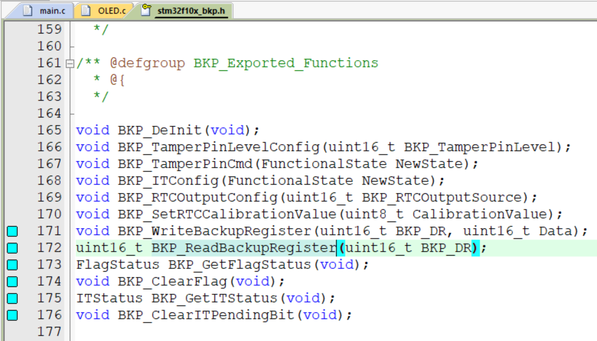

- **PWR_BackupAccessCmd()**：PWR的库函数，初始化时的第二步，使能对BKP和RTC的访问；

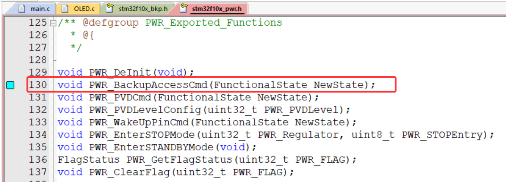

### 1.4 工程编程封装

- 在OLED显示屏工程的基础上进行修改；
- **思路：**
  - 对BKP初始化；
  - 写入BKP的DR，然后读初BKP的DR，验证两者是否相等；
  - 由于BKP的内容不多，所以直接在main.c文件中编程，不再独立封装模块；

```c
#include "stm32f10x.h"                  // Device header
#include "Delay.h"
#include "OLED.h"
#include "Key.h"

/**
  ******************************************************************************
  * @project      : STM32F103C8T6的读写备份寄存器工程
  * @brief        : 通过按键控制写入BKP的值，再直接读出BKP的值
  * @hardware     : STM32103C8T6 + OLED + 按键
  * @software     : Keil MDK + 标准外设库 + 按键封装模块，不封装BKP模块，直接在main.c中读写
  * @author       : blackghost
  * @date         : 2026-03-10
  * @version      : V1
  ******************************************************************************
  */

uint8_t KeyNum;

uint16_t ArrayWrite[] = {0x1234, 0x5678};	// 写入的数组
uint16_t ArrayRead[2];

int main(void)
{
	OLED_Init();
	Key_Init();
	
	OLED_ShowString(1, 1, "W:");
	OLED_ShowString(2, 1, "R:");
	
	
	// 初始化BKP
	// 第一步：开启PWR和BKP的时钟
	RCC_APB1PeriphClockCmd(RCC_APB1Periph_PWR, ENABLE);
	RCC_APB1PeriphClockCmd(RCC_APB1Periph_BKP, ENABLE);
	
	// 第二步：使能对BKP和RTC的访问
	PWR_BackupAccessCmd(ENABLE);
	
	while (1)
	{
		KeyNum = Key_GetNum();
		
		if (KeyNum == 1)
		{
			ArrayWrite[0] ++;
			ArrayWrite[1] ++;
			
			BKP_WriteBackupRegister(BKP_DR1, ArrayWrite[0]);	// DR的值从1到10
			BKP_WriteBackupRegister(BKP_DR2, ArrayWrite[1]);
			
			OLED_ShowHexNum(1, 3, ArrayWrite[0], 4);
			OLED_ShowHexNum(1, 8, ArrayWrite[1], 4);
		}
		
		ArrayRead[0] = BKP_ReadBackupRegister(BKP_DR1);
		ArrayRead[1] = BKP_ReadBackupRegister(BKP_DR2);
		
		OLED_ShowHexNum(2, 3, ArrayRead[0], 4);
		OLED_ShowHexNum(2, 8, ArrayRead[1], 4);
	}
}

```


## 2.实时时钟

### 2.1 接线图

- 直接将STLINK的3.3V供电接到VB引脚即可；

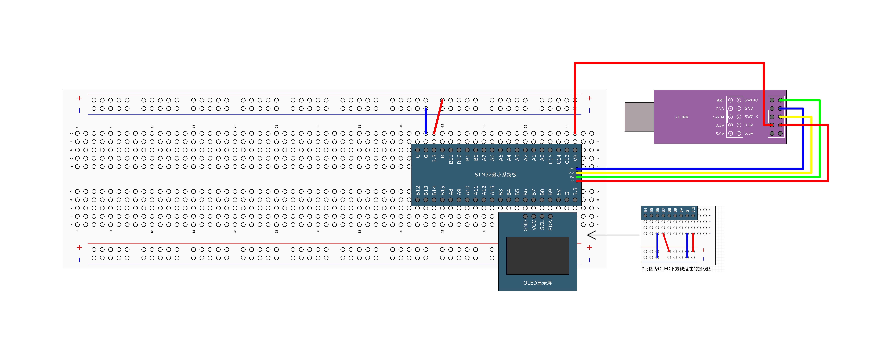

### 2.2 RTC的初始化步骤

- 第一步：开启PWR和BKP的时钟并使能对BKP和RTC的访问；
  - 第一步：开启PWR和BKP的时钟；
  - 第二步：使用PWR的一个函数使能对BKP和RTC的访问；
- 第二步：启用RTC的时钟；
  - 这里使用**LSE作为系统的时钟**；
  - 由于为了省电，LSE这个时钟默认是关闭的；
  - 故需要使用**RCC模块的函数**开启LSE的时钟还需要**等待其启动完成（调用一个等待函数）**；
- 第三步：配置RTCCLK这个数据选择器，**指定LSE为RTCCLK**，且还需要使能该时钟源；
- 第四步：**调用等待函数**，这里对应了RTC操作注意事项里面的两个等待
  - 等待同步；
  - 等待写操作完成；
- 第五步：配置分频器
  - 给PRL重装寄存器一个合适的分频值，确保输出的频率是1Hz；
- 第六步：**配置CNT的值，给RTC一个初始时间；**
- 第七步：**若需要则配置闹钟部分和中断部分；**
- 注意：**RTC没有Cmd()函数**，开启时钟即可自动运行；

### 2.3 RTC的相关库函数

- RCC库函数：stm32f10x_rcc.h
  - **RCC_LSEConfig()**：启动LSE外部低速时钟，即启动LSE时钟；
  - RCC_LSICmd()：配置LSI内部低速时钟，若LSE无法起振就可以用LSI晶振；
  - **RCC_RTCCLKConfig()**：用于选择RTCCLK的时钟源
  - RCC_RTCCLKCmd()：启动RTCCLK，即选择时钟之后还需要调用这个函数使能一下；
  - RCC_GetFlagStatus()：获取标志位，**即LSE启动时钟调用后还需要等待一下标志位，置1后才算稳定；**
  
  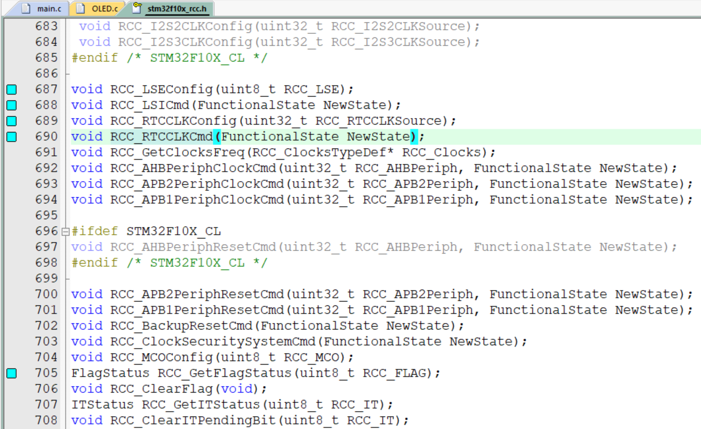
  
- RTC库函数：stm32f10x_rtc.h
  - RTC_ITConfig()：配置中断输出；
  - RTC_EnterConfigMode()：进入配置模式；
    - 对应的是注意事项的第三条；
    - 即必须设置RTC_CRL寄存器中的CNF位，使RTC进入配置模式后，才能写入RTC_PRL、RTC_CNT、RTC_ALR寄存器；
  - RTC_ExitConfigMode()：退出配置模式，把CNF位清零；
  - **RTC_GetCounter()：获取CNT计数器的值，即读出时间；**
  - **RTC_SetCounter()：写入CNT计数器的值，即设置时间；**
  - RTC_SetPrescaler()：写入预分频器，会写入到预分频器的PRL重装寄存器中，用于配置预分频器的分频系数；
  - RTC_GetDivider()：读取预分频器中的DIV余数寄存器，即获得比s更细的时间；
  - RTC_WaitForLastTask()：等待上次操作完成
    - 对应的就是注意事项的第四条；
    - 即对RTC任何寄存器的写操作，都必须在前一次写操作结束后进行；
  - RTC_WaitForSynchro()：等待同步
    - 对应的就是注意事项的第二条；
    - 即若在读取RTC寄存器时，RTC的APB1接口曾经处于禁止状态，则软件首先必须等待RTC_CRL寄存器中的RSF位（寄存器同步标志）被硬件置1；
  
  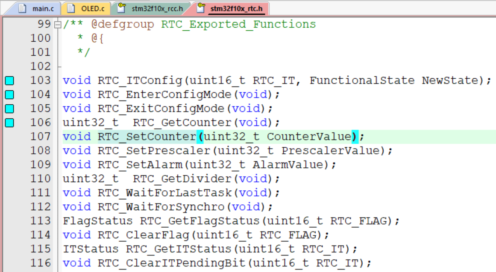

### 2.4 工程编程封装

- 在OLED显示屏工程的基础上进行修改；
- 在System组中新建**MyRTC.c和MyRTC.h文件**，进行模块封装；
- 注意如何利用BKP备份寄存器来判断是否完全断电来执行初始化代码
- MyRTC.c文件内容：

```c
#include "stm32f10x.h"                  // Device header
#include <time.h>                       // 导入C语言的time库

// 时间数组，存放写入寄存器的值或读出寄存器的值
uint16_t MyRTC_Time[] = {2023, 1, 1, 23, 59, 55};

void MyRTC_SetTime(void);	// 声明函数

/**
  * @brief  RTC初始化函数
  * @param  无
  * @retval 无
  */
void MyRTC_Init(void)
{
	// 第一步：开启PWR和BKP的时钟并使能对BKP和RTC的访问
	RCC_APB1PeriphClockCmd(RCC_APB1Periph_PWR, ENABLE);
	RCC_APB1PeriphClockCmd(RCC_APB1Periph_BKP, ENABLE);
	
	PWR_BackupAccessCmd(ENABLE);
	
	// 借用BKP的特性判断是否需要将RTC的值复位，若都断电则复位，若只是主电源断电则不复位
	if (BKP_ReadBackupRegister(BKP_DR1) != 0xA5A5)
	{
		// 第二步：开启LSE时钟，并等待LSE时钟启动完成
		RCC_LSEConfig(RCC_LSE_ON);								// 开启LSE的时钟
		while (RCC_GetFlagStatus(RCC_FLAG_LSERDY) != SET);		// 获取标志位，等待时钟开启完成
		
		// 第三步：选择RTCCLK时钟源
		RCC_RTCCLKConfig(RCC_RTCCLKSource_LSE);		// 选择LSE时钟
		RCC_RTCCLKCmd(ENABLE);						// 这里还需要使能时钟
		
		// 第四步：调用等待同步和上次写操作完成的函数
		RTC_WaitForSynchro();		// 等待同步
		RTC_WaitForLastTask();		// 等待上次操作完成
	
		// 第五步：配置预分频器，无需调用进入配置模式函数，下方函数内部包含了
		RTC_SetPrescaler(32768 - 1);	// 分频得到1Hz
		RTC_WaitForLastTask();			// 写入不是立刻完成的，需调用等待函数
	
		// 第六步：配置CNT，给一个初始时间
		MyRTC_SetTime();		// 给CNT一个初始值，不给也行，那就是默认的0
		
		// 若初始化则将DR1的位置为0xA5A5，这样就可以在初始化过后不进入这个分支复位
		BKP_WriteBackupRegister(BKP_DR1, 0xA5A5);
	}
	else		// 即使初始化了也调用一下等待函数
	{
		RTC_WaitForSynchro();
		RTC_WaitForLastTask();
	}
}

/**
  * @brief  RTC设置起始时间函数
  * @param  无
  * @retval 无
  */
void MyRTC_SetTime(void)
{
	// STM32中的time.h文件无法区分时区，换时区需要自己加偏移
	time_t time_cnt;		// 计数值变量
	struct tm time_data;	// 日期格式的结构体
	
	// 将数组的时间填充到time_data里面，注意偏移
	time_data.tm_year = MyRTC_Time[0] - 1900;
	time_data.tm_mon = MyRTC_Time[1] - 1;
	time_data.tm_mday = MyRTC_Time[2];	
	time_data.tm_hour = MyRTC_Time[3];
	time_data.tm_min = MyRTC_Time[4];	
	time_data.tm_sec = MyRTC_Time[5];
	
	time_cnt = mktime(&time_data) - 8 * 60 * 60;		// 日期到秒数的转换，需加上偏移
	
	RTC_SetCounter(time_cnt);		// 将秒数写入寄存器
	RTC_WaitForLastTask();			// 等待操作完成
}

/**
  * @brief  读取时间函数
  * @param  无
  * @retval 无
  */
void MyRTC_ReadTime(void)
{
	time_t time_cnt;
	struct tm time_data;
	
	time_cnt = RTC_GetCounter() + 8 * 60 * 60;		// 读取秒数，并加上偏移表示为北京时间
	
	// 这里需要先取内容再赋值，localtime默认的是伦敦时区时间，因为STM32无法识别时区
	time_data = *localtime(&time_cnt);
	
	// 将读出来的时间填充到time_data里面，注意偏移
	MyRTC_Time[0] = time_data.tm_year + 1900;
	MyRTC_Time[1] = time_data.tm_mon + 1;
	MyRTC_Time[2] = time_data.tm_mday;	
	MyRTC_Time[3] = time_data.tm_hour;
	MyRTC_Time[4] = time_data.tm_min;	
	MyRTC_Time[5] = time_data.tm_sec;
}

```

- MyRTC.h文件内容：

```c
#ifndef __MYRTC_H
#define __MYRTC_H

extern uint16_t MyRTC_Time[];	// 数组声明为外部可调用

void MyRTC_Init(void);
void MyRTC_SetTime(void);
void MyRTC_ReadTime(void);
	
#endif

```

- main.c文件内容：

```c
#include "stm32f10x.h"                  // Device header
#include "Delay.h"
#include "OLED.h"
#include "MyRTC.h"

/**
  ******************************************************************************
  * @project      : STM32F103C8T6的实时时钟工程
  * @brief        : 读取STM32的RTC寄存器获取时间
  * @hardware     : STM32103C8T6 + OLED
  * @software     : Keil MDK + 标准外设库 + 模块封装
  * @author       : blackghost
  * @date         : 2026-03-10
  * @version      : V1
  ******************************************************************************
  */

int main(void)
{
	OLED_Init();
	MyRTC_Init();
	
	OLED_ShowString(1, 1, "Date:xxxx-xx-xx");
	OLED_ShowString(2, 1, "Time:xx:xx:xx");
	OLED_ShowString(3, 1, "CNT :");
	OLED_ShowString(4, 1, "DIV :");
	
	while (1)
	{
		MyRTC_ReadTime();	// 调用后CNT的时间就会刷新到MyRTC_Time数组中
		
		OLED_ShowNum(1, 6, MyRTC_Time[0], 4);
		OLED_ShowNum(1, 11, MyRTC_Time[1], 2);
		OLED_ShowNum(1, 14, MyRTC_Time[2], 2);
		OLED_ShowNum(2, 6, MyRTC_Time[3], 2);
		OLED_ShowNum(2, 9, MyRTC_Time[4], 2);
		OLED_ShowNum(2, 12, MyRTC_Time[5], 2);
		
		OLED_ShowNum(3, 6, RTC_GetCounter(), 10);
		
		// 显示余数寄存器，余数寄存器每自减一轮CNT就加一，通过余数寄存器可以获得比秒更小的单位
		OLED_ShowNum(4, 6, RTC_GetDivider(), 10);
	}
}

```

---


# 第四十四节课：13-1_PWR电源控制

## 1.PWR简介
- PWR（Power Control）电源控制；
- PWR负责管理STM32内部的电源供电部分，可以实现可编程电压监测器和低功耗模式的功能；
- 可编程电压监测器（PVD）可以监控VDD电源电压，当VDD下降到PVD阀值以下或上升到PVD阀值之上时，PVD会触发中断，用于执行紧急关闭任务；
- 低功耗模式包括睡眠模式（Sleep）、停机模式（Stop）和待机模式（Standby），可在系统空闲时，降低STM32的功耗，延长设备使用时间，这节课就是对这三种模式的学习；


## 2.电源框图

- 模拟部分供电：VDDA，为模拟部分供电，包括AD转换器、温度传感器、复位模块、PLL锁相环等，这些模块的供电正极是VDDA，负极是VSSA；
- 数字部分供电：包括VDD供电区域和1.8V供电区域，前者包括待机电路、唤醒逻辑、电压调节器、看门狗等，后者包括CP核心、存储器、内置数字外设等，后者当需要使用时才通过IO电路转换到3.3V；电压调节器本质就是1.8V的供电，关了那1.8V的供电就没了；
- 后备供电：VBAT，包括LSE 32K晶体振荡器、后备寄存器、RCC BDCR寄存器、RTC；


## 3.上电复位和掉电复位

- 即当VDD或VDDA电压过低时，内部电路直接产生复位，让STM32复位住，不要乱操作；


## 4.可编程电压检测器（PVD）

- 跟上面差不多，但是它的阈值电压是可以使用程序指定的


## 5.低功耗模式

- 睡眠（浅睡眠）：通过WFI或WFE即可进入；前者唤醒条件为任一中断，后者唤醒条件为唤醒事件，前者唤醒后进入中断函数，后者唤醒后可以直接从暂停的地方开始运行；进入睡眠后CPU的时钟关，对其他时钟和ADC时钟无影响，对VDD区域时钟无影响，对电压调节器的操作是开；（唤醒后从暂停的地方开始运行，SLEEPONEXIT位决定是立刻睡眠还是处理完中断再睡眠；在睡眠模式下所有的IO引脚都保持运行模式时的状态）
- 停机：设置PDDS=0，LPDS=0/1（1则电压调节器进入低功耗，0则开启），SLEEPDEEP=1位+WFI或WFE进入停机状态；WFI只有任一外部中断（在外设终端寄存器中设置）才可以唤醒，WFE对应的只有外部中断的事件才可以唤醒；关闭所有1.8V区域的时钟，HSI和HSE的振荡器关闭，但是两个低速时钟继续运行，而电压调节器处于开启或是低功耗模式（通过PWR_CR的设定控制，所以CPU和存储器的数据还保持）；（唤醒后从暂停的地方开始执行，在睡眠模式下所有的IO引脚都保持运行模式时的状态；当退出停止模式后HSI被选为系统时钟；当电压调节器处于低功耗模式下，系统退出时会有一段额外的启动延时）
- 待机：设置PDDS=1，SLEEPDEEP=1位+WFI或WFE进入停机状态；WKUO引脚的上升沿、RTC闹钟事件、NRST引脚上的外部复位、IWDG复位才可以唤醒，普通外设的中断和外部中断都无法唤醒；关闭所有1.8V区域的时钟，HSI和HSE的振荡器关闭，但是两个低速时钟继续运行，电压调节器关闭（所以数据丢失）；（退出后从头开始运行；所有的IO引脚变为高阻态即浮空输入，）


## 6.模式选择

- 执行WFI（Wait For Interrupt）或者WFE（Wait For Event）指令后，STM32进入低功耗模式，配置其他寄存器都需要在这之前，但是写程序时调用函数即可将其他寄存器的位设置好

---


# 第四十五节课：13-2_修改主频&睡眠模式&停止模式&待机模式

## 1.system_stm32f10x.c与.h文件
- 作用：用于配置系统时钟，就是配置RCC时钟树；
- 两个外部可调用函数和一个外部可调用变量：SystemInit()、SystemCoreClock、SystemCoreClockUpdate()；SystemInit()用于配置时钟树（一进来时钟就被HSE配置好为72MHz了，若启动失败就用内部的HSI的8MHz），SystemCoreClock变量表示当前主频的值；SystemCoreClockUpdate()用于更新SystemCoreClock，因为这个变量只有一开始的一个赋值，后面更改主频是不会跟着变化的；
- 主频的更改：解除宏定义的注释即可，但是需要先将只读解除；
- 闪烁字符串，并修改主频


## 2.串口发送和接收

- 只能用睡眠模式串口才能接收和发送数据；
- 只需要在while循环最后加入WFI的指令即可；


## 3.停止模式+对射式红外传感计次
- 中断可以在没有时钟的情况下工作，所以这里使用了停止模式来对对射式红外传感进行计次；
- 睡眠模式只是对内核的操作，不需要PWR的库函数，但是停止模式和待机模式都需要PWR库函数；


## 4.待机模式+实时时钟

- 设置RTC闹钟；
- 进入待机模式；
- 使用闹钟信号，唤醒待机模式；

---


# 第四十六节课：14-1_WDG看门狗

## 1.WDG简介（喂狗晚了就硬件自动复位）
- WDG（Watchdog）看门狗
- 看门狗可以监控程序的运行状态，当程序因为设计漏洞、硬件故障、电磁干扰等原因，出现卡死或跑飞现象时，看门狗能及时复位程序，避免程序陷入长时间的罢工状态，保证系统的可靠性和安全性；
- 看门狗本质上是一个定时器，当指定时间范围内，程序没有执行喂狗（重置计数器）操作时，看门狗硬件电路就自动产生复位信号；
- STM32内置两个看门狗
  - 独立看门狗（IWDG）：独立工作，对时间精度要求较低
  - 窗口看门狗（WWDG）：要求看门狗在精确计时窗口起作用（APB1时钟）


## 2.IWDG框图

- 类似于定时器的时基单元；
- 预分频器、计数器、重装寄存器
- 预分频器的输入时钟为LSI，低速时钟，频率为40KHz，预分频器为8位，最大进行256分频；
- 计数器为自减计数器，每来一个时钟自减1，且是12位的，所以最大值为4095，自减到0后产生IWDG复位；
- 重装寄存器RLR，预先写好值，在运行过程中，在键寄存器里写一个特定数据控制电路进行喂狗，这时重装值就会复制到当前的计数器中；
- 状态寄存器SR，标志电路运行的状态；
- 看梦处于VDD供电区，停机和待机模式时仍能正常工作


## 3.IWDG键寄存器

- 键寄存器本质上是控制寄存器，用于控制硬件电路的工作；
- 在可能存在干扰的情况下，一般通过在整个键寄存器写入特定值来代替控制寄存器写入一位的功能，以降低硬件电路受到干扰的概率
- 写入0xCCCC则启动独立看门狗；
- 写入0xAAAA则重装值加载到计数器（喂狗）；
- 写入0x5555则解除IWDG_PR和IWDG_RLR的写保护；
- 写入0x5555外的其他值则启动IWDG_PR和IWDG_RLR的写保护；


## 4.IWDG超时时间

- 超时时间：TIWDG = TLSI × PR预分频系数 × (RL + 1)，其中：TLSI = 1 / FLSI，TLSI是固定的0.025ms；


## 5.WWDG框图

- 时钟源为PCLK1（36MHz），再经过预分频器WDGTB；
- 6位自减计数器，且与SR寄存器共用寄存器；T6为溢出标志位，不作为自减计数器的一部分，为1时表示计数器没溢出；且还有一个WDGA位，是窗口看门狗的使能位；
- 没有重装寄存器，CNT的值由自己写入；
- 配置寄存器，保存窗口的值，若CNT的值大于配置寄存器的值则申请复位，若CNT减到0也复位；


## 6.WWDG工作特性

- 递减计数器T[6:0]的值小于0x40时，WWDG产生复位，这里是T6也为计数器的位；
- 递减计数器T[6:0]在窗口W[6:0]外被重新装载时，WWDG产生复位，即不能过早喂狗；
- 递减计数器T[6:0]等于0x40时可以产生早期唤醒中断（EWI），用于重装载计数器以避免WWDG复位，这个中断就在溢出的前一刻产生，称为“死前中断”；
- 定期写入WWDG_CR寄存器（喂狗）以避免WWDG复位


## 7.WWDG超时时间

- 超时时间：TWWDG = TPCLK1 × 4096 × WDGTB预分频系数 × (T[5:0] + 1)，这里的4096是因为时钟进来后会先进行4096分频再进入到预分频器，而预分频系数只能是1、2、4、8；
- 窗口时间：TWIN = TPCLK1 × 4096 × WDGTB预分频系数 × (T[5:0] - W[5:0])
  其中：TPCLK1 = 1 / FPCLK1

---


# 第四十七节课：14-2_独立看门狗&窗口看门狗

## 1.独立看门狗的配置流程
- 开启LSI的时钟（但是如果我们打开了看门狗那LSI时钟会被强制打开，等LSI稳定后，就可以自动为独立看门狗提供时钟了，所以这一步不需要代码来执行）；
- 解除写保护
- 写入预分频器和重装寄存器；
- 启动看门狗；


## 2.窗口看门狗的配置流程

- 开启窗口看门狗APB1的时钟（不会像前面独立看门狗那样自己执行）；
- 配置寄存器，包括预分频、窗口值（窗口看门狗没有写保护，所以第二步可以直接写寄存器）；
- 写入控制寄存器CR，包含看门狗使能位、计数器溢出标志位和计数器有效位；

---


# 第四十八节课：15-1_FLASH闪存

## 1.FLASH简介
- STM32F1系列的FLASH包含程序存储器（主存储器）、系统存储器（启动程序代码）和选项字节（用户选择字节）三个部分，通过闪存存储器接口（外设）可以对程序存储器和选项字节进行擦除和编程，其中程序存储器是三者中空间最大、最主要的部分，而系统存储器是原厂写入的Bootloader程序，不允许修改；

- 起始地址：程序存储器为0x0800 0000，系统存储区为0x1FFF F000，选项字节为0x1FFF F800；

- 读写FLASH的用途

  - 利用程序存储器的剩余空间来保存掉电不丢失的用户数据；

  - 通过在程序中编程（IAP），实现程序的自我更新；

- 在线编程：用于更新程序存储器的全部内容，它通过JTAG、SWD协议或系统加载程序（Bootloader）下载程序，一句话就是我们平时的STLINK和串口下载程序是会把整个程序更新的；

- 在程序中编程：在程序中编程（In-Application Programming – IAP）可以使用微控制器支持的任一种通信接口下载程序（自己写一个Bootloader）；


## 2.闪存模块组织

- 主存储器：程序存储器；
- 信息块：包括系统存储器和选项字节；
- 闪存存储器接口寄存器：FLASH的管理员，但本身不属于闪存；


## 3.FLASH基本结构

- FPEC：闪存存储器接口；
- 选项字节可写入配置来对程序存储器进行读写保护；


## 4.控制FPEC对程序存储器和选项字节进行擦除和编程

- FLASH解锁（本质就是写使能）

  - 通过在键寄存器写入指定的键值来实现解锁；

  - FPEC有三个键值：

  - RDPRT键 = 0x000000A5（解除读写保护的密钥）；

  - KEY1 = 0x45670123；

  - KEY2 = 0xCDEF89AB；

- 解锁

  - 复位后，FPEC被保护，不能写入FLASH_CR（即复位后FLASH默认是锁着的）

  - 在FLASH_KEYR先写入KEY1，再写入KEY2，解锁

  - 错误的操作序列会在下次复位前锁死FPEC和FLASH_CR

- 加锁（操作完成后需要及时加锁）

  - 设置FLASH_CR中的LOCK位锁住FPEC和FLASH_CR；


## 5.使用指针访问存储器

- 使用指针读指定地址下的存储器（读取不需要解锁，因为读取只看寄存器，不对寄存器进行更改）：
  - uint16_t Data = *((__IO uint16_t *)(0x08000000));
- 使用指针写指定地址下的存储器（需要提前解锁）：
  - IO uint16_t *)(0x08000000)) = 0x1234；
  - 其中：#define    __IO    volatile，防止编译器优化；


## 6.流程

- 程序存储器全擦除：先解锁，然后置START位和MER位，再对BUSY位进行判断；
- 程序存储器页擦除：先解锁，然后置PER、AR、START位，再对BUSY位进行判断；
- 程序存储器编程：先解锁，然后置FLASH_CR的PG位为1，在指定地址写入半字（16位），最后判断BUSY；


## 7.选项字节

- 反码的写入

- 选项字节擦除

  - 检查FLASH_SR的BSY位，以确认没有其他正在进行的闪存操作
  - 解锁FLASH_CR的OPTWRE位
  - 设置FLASH_CR的OPTER位为1
  - 设置FLASH_CR的STRT位为1
  - 等待BSY位变为0
  - 读出被擦除的选择字节并做验证

- 选项字节的编程

  - 检查FLASH_SR的BSY位，以确认没有其他正在进行的编程操作
  - 解锁FLASH_CR的OPTWRE位
  - 设置FLASH_CR的OPTPG位为1
  - 写入要编程的半字到指定的地址
  - 等待BSY位变为0
  - 读出写入的地址并验证数据

  


## 8.器件电子签名

- 电子签名存放在闪存存储器模块的系统存储区域，包含的芯片识别信息在出厂时编写，不可更改，使用指针读指定地址下的存储器可获取电子签名；

- （2）闪存容量寄存器：

  - 基地址：0x1FFF F7E0

  - 大小：16位

- （3）产品唯一身份标识寄存器：

  - 基地址： 0x1FFF F7E8

  - 大小：96位

---


# 第四十九节课：15-2_读写内部FLASH&读取芯片ID

## 1.整体架构
- 最低层：MyFLASH，实现闪存最基本的3个功能即读取、擦除和编程
- 在最底层之上的store：主要实现参数数据的读写和存储管理，定义一个SRAM数据，需要掉电不丢失的数据就写入到这个SRAM数组中；
- 应用层部分：即main.c文件
- 闪存不需要初始化，直接操作即可


## 2.库函数

- FLASH_Unlock：解锁
- FLASH_Lock：加锁操作
- FLASH_ErasePage：页擦除；
- FLASH_EraseAllPages：擦除所有页
- FLASH_EraseOptionBytes：擦除选项字节；
- FLASH_ProgramWord：写入字
- FLASH_ProgramHalfWord：写入半字
- 上面的函数内部都已经调用等待忙的函数了，所以在程序中不需要再调用等待忙的函数；


## 3.大小冲突

- 程序文件是存在前面的字节的，我们打算用最后一个字节来存放参数，如果程序很大可能会出现Bug，这里可以在工程选项中选择程序的大小，若程序大于这个大小就会报错；

