# 1-1 CAN简介&硬件电路

## 1.课程简介

### 1.1 课程内容安排

本课程基于STM32F103C8T6单片机，介绍CAN通信总线，主要分为以下三个部分：

- CAN总线通信协议：只关注CAN总线协议，主要包括如下五章
  - **CAN总线的硬件电路**
    - 包括如何接线、电平标准、CAN收发器等；
  - **CAN总线的帧格式**
    - 即如何将要发送的数据转换成数据线上的波形；
    - 包括数据帧、遥控帧、错误帧、过载帧、帧间隔；
  - **接收方数据采样**
    - 即考虑接收方如何实现同步的问题；
  - **多设备发送的解决方法**
    - 主要介绍先占先得和非破坏性仲裁两种方式
  - **CAN总线的错误处理**
    - 包括位错误、填充错误、CRC错误、格式错误、应答错误等；
- STM32的CAN外设：STM32F103C8T6这款芯片的CAN外设；
  - STM32的CAN外设(上)；
  - STM32的CAN外设(下)；
- 实际项目开发：以STM32F103C8T6为硬件进行实际的项目开发；

### 1.2 资料获取

- **资料下载**
  - [资料下载官网](https://jiangxiekeji.com/download.html)；
  - 获取视频中出现的所有资料，包括程序源码、PPT和芯片资料等；

- **硬件设备获取**
  - [硬件淘宝官网](https://jiangxiekeji.taobao.com)；
  - 获取视频中实验所需硬件设备，主要是面包板、STM32、CAN收发器模块、STLink等；

### 1.3 最终实验现象

- 最终的实验现象对应的程序为**1.课程资料\程序源码\02-CAN总线三个设备互相通信**；
- 该项目的开发将在后续讲解，它可以实现三个设备之间的CAN总线数据广播；
- 其接线图如下：

## 2.CAN总线介绍

### 2.1 参考资料

本节内容的参考资料对应为**1.课程资料\参考文档下的四个文件**：

- CAN总线入门书；
- CAN总线协议-V2.0（英文）；
- CAN总线协议-V2.0（中文）；
- TJA1050数据手册；

### 2.2 CAN总线简介

- **CAN总线的定义**

  - **Controller Area Network Bus，即控制器局域网总线；**

  - 在CAN总线下，每个设备都享有平等的地位；
  - 每个设备都可以通过这个局域网发送信息和接收信息；

- **CAN总线的设计**

  - CAN总线是由BOSCH公司开发的一种简洁易用、传输速度快、易扩展、可靠性高的串行通信总线；
  - CAN总线广泛应用于汽车、嵌入式、工业控制等领域；

- **CAN总线特征**

  - 只需**两根通信线（CAN_H、CAN_L）**，线路少，虽然为差分信号但实际开发中一般还是会选择共地，如果加上供电就一共需要**四根线；**
  - CAN总线是**差分信号通信**，CAN_H和CAN_L就是一对差分线，抗干扰能力强；
  - **异步**，无需时钟线，通信速率由设备各自约定；
  - **半双工**，可挂载多设备，多设备同时发送数据时**过仲裁判断先后顺序；**
  - **11位/29位报文ID**，用于区分消息功能，同时决定优先级，即ID越小优先级越高；
  - 可配置**1~8字节**的有效载荷，对比串口的一字节数据灵活性更强；
  - 可实现**广播式和请求式**两种传输方式；
  - CAN总线具有**应答、CRC校验、位填充、位同步、错误处理**等特性；

- **CAN总线的两种标准**
  - **高速CAN（ISO11898）**：125k~1Mbps, <40m；
  - **低速CAN（ISO11519）**：10k~125kbps, <1km；

### 2.3 主流通信协议对比

| 名称     | 引脚                | 双工               | 时钟     | 电平              | 设备              | 应用场景                                               |
| -------- | ------------------- | ------------------ | -------- | ----------------- | ----------------- | ------------------------------------------------------ |
| UART     | TX、RX              | 全双工             | 异步     | 单端              | 点对点            | 两个设备近距离串口互通（单片机与蓝牙、GPS、模组通信）  |
| I2C      | SCL、SDA            | 半双工             | 同步     | 单端              | 一主多从          | 主控挂载低速外设（温湿度、EEPROM、陀螺仪、传感器阵列） |
| SPI      | SCK、MOSI、MISO、SS | 全双工             | 同步     | 单端              | 一主多从          | 高速短距通信（屏幕、Flash、SD 卡、ADC、高速传感器）    |
| CAN      | CAN_H、CAN_L        | 半双工             | 异步     | 差分              | 多主多从          | 工业、汽车、工控多设备组网，抗干扰强、远距离容错通信   |
| RS232    | TX、RX、GND         | 全双工             | 异步     | 单端（±12V/±15V） | 点对点            | 老式串口设备、电脑 DB9 串口、短距离本地调试通信        |
| RS485    | A、B、GND           | 半双工（可全双工） | 异步     | 差分              | 一主多从 / 多节点 | 工业现场、楼宇、仪表远距离组网，抗干扰、传输距离远     |
| I2S      | BCLK、LRCK、DATA    | 全双工 / 单工      | 同步     | 单端              | 点对点 / 一主多从 | 音频专用通信（麦克风、音响、音频解码芯片）             |
| USB      | D+、D-、VCC、GND    | 全双工             | 差分时钟 | 差分 + 单端       | 主从架构          | 高速数据传输、设备供电、外设连接（键鼠、U 盘、刷机）   |
| LIN      | LIN、GND            | 单工 / 半双工      | 异步     | 单端              | 单主多从          | 汽车低成本辅助通信（车灯、车窗、座椅等低优先级外设）   |
| EtherCAT | 网口差分线          | 全双工             | 同步     | 差分              | 环形 / 总线拓扑   | 高端运动控制、工业伺服、高精度实时工控通信             |

## 3.CAN的硬件电路

- **主控与收发器的连接**

  - 每个设备通过CAN收发器挂载在CAN总线网络上；
  - CAN收发器主要完成电平转换、输出驱动和输入采样；

- **收发器与总线的连接**

  - CAN控制器引出的TX和RX与CAN收发器相连(注意TX和RX不用交叉)；
  - CAN收发器引出的CAN_H和CAN_L分别与总线的CAN_H和CAN_L相连；

- **高速CAN使用闭环网络**

  - CAN_H和CAN_L两端添加120Ω的终端电阻；

  - 120Ω电阻可起到**防止回波反射的作用；**
  - 还可以收紧两根总线的差分信号，使其电压一致，**这个状态为1状态，类似于I2C中的上拉电阻的作用；**
  - 注意：在高速CAN网络中，**发送状态1时是不需要操作总线的**，默认状态就是1状态，这与I2C的1状态类似；

- **低速CAN使用开环网络**

  - CAN_H和CAN_L其中一端添加2.2kΩ的终端电阻；
  - 2.2kΩ电阻可起到**防止回波反射的作用；**

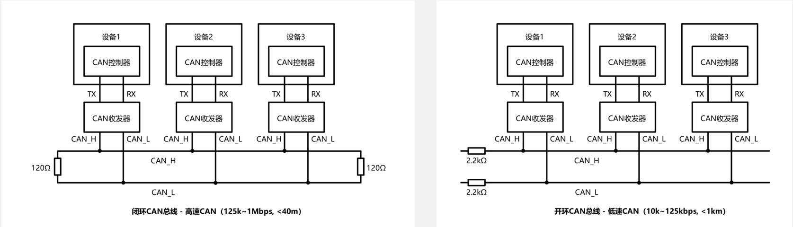

## 4.CAN总线的电平标准

- CAN总线采用**差分信号，即两线电压差（VCAN_H-VCAN_L）传输数据位；**
- **高速CAN规定**
  - 电压差为0V时表示逻辑1（隐性电平），即收紧状态；
  - 电压差为2V时表示逻辑0（显性电平），即松开状态；
- **低速CAN规定**
  - 电压差为-1.5V时表示逻辑1（隐性电平）；
  - 电压差为3V时表示逻辑0（显性电平）；
  - 因为隐形电平下，两线电压差 不等，所以前面的开环CAN总线中两个终端电阻不能形成回路；

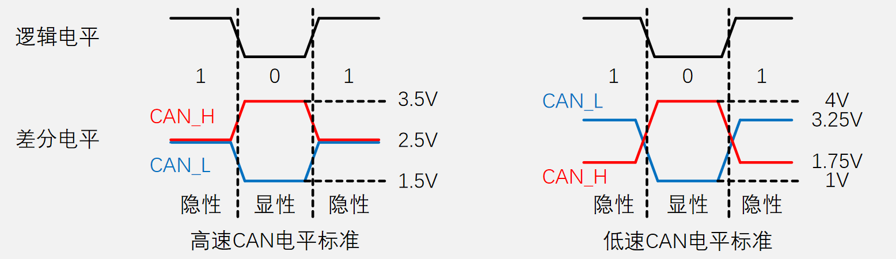

## 5.CAN收发器——TJA1050

- **TJA1050的引脚**
  - 控制器端：TXD、RXD；
  - 总线端：CANH、CANL；
  - 电源类：VCC、GND；
  - 其他控制端：Vref、S，前者为参考电压输出，后者为选择高速模式还是静默模式；
- **JA1050的输入部分**
  - CANH和CANL为总线的电平，RECEIVER检测器时刻检测两线的电压差；
  - 当两线没有电压差时，RECEIVER为0，否则为1；
  - RECEIVER检测得到的电压经过一个由两个场效应管组成的反相器，最后得到RXD的数据；
- **TJA1050的输出部分**
  - 当TXD数据为1时，输出驱动器DRIVER控制上管和下管都断开，即对总线没有任何操作，总线由终端电阻保持收紧状态；
  - TJA1050内部有两个25kΩ的电阻，可将两根线拉至0.5VCC的中值电平，即默认对地电压为2.5V左右，也有收紧作用，但没有终端电阻的作用大；
  - 当TXD数据为0时，输出驱动器的上管和下管都导通，两根总线被拉开；
  - TXD引脚在悬空时保持高电平即输出1，S引脚在悬空时保持低电平；
  - TEMPERATURE PROTECTION负责温度检测，当温度异常时直接断开CAN总线；
  - TXD DOMINANT TIME-OUT TIMER是TXD显性超时计时器，即当TXD始终输出0超过时间时将由这个部件释放总线；

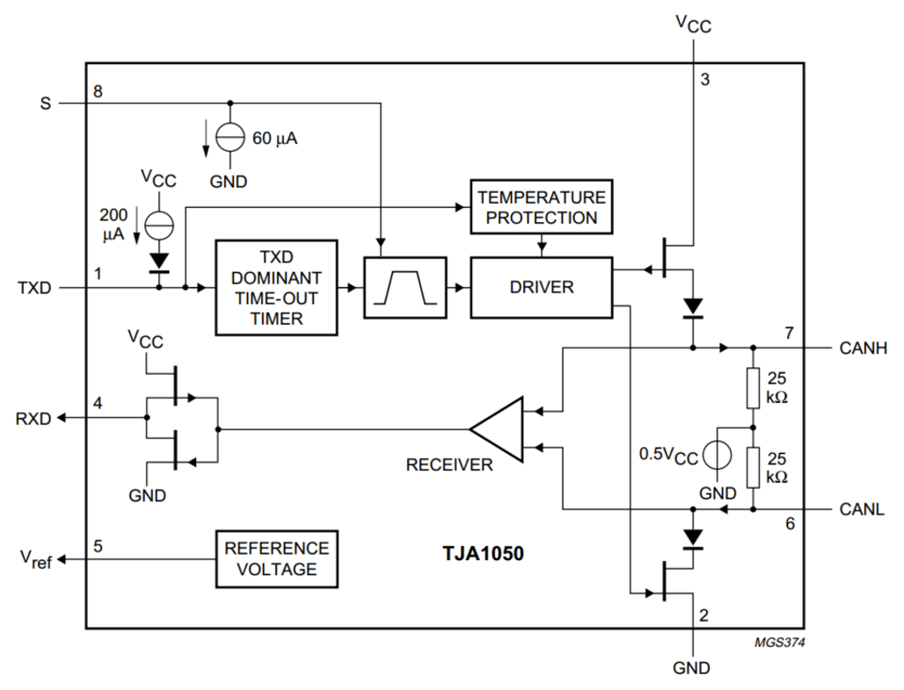

## 6.CAN总线物理层总结

本节介绍了CAN总线在物理层上的相关知识，可将其总结下表：

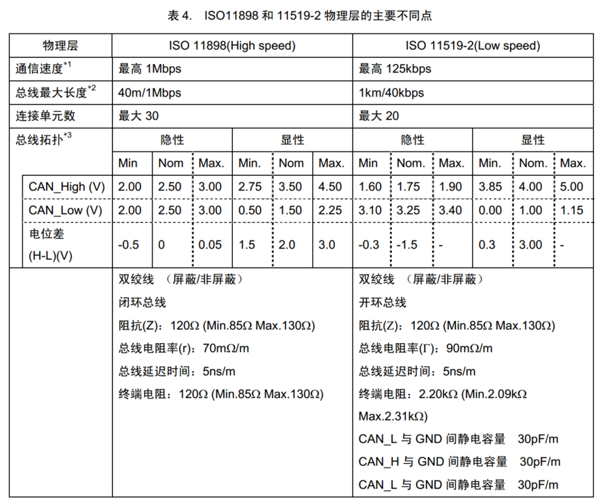

---

# 1-2 帧格式

## 1.CAN总线的五种帧格式

帧格式就是规定数据流是如何生成和如何解析的，CAN总结有如下五种帧格式：

| **帧类型** | **用途**                               |
| ---------- | -------------------------------------- |
| 数据帧     | 发送设备主动发送数据（广播式）         |
| 遥控帧     | 接收设备主动请求数据（请求式）         |
| 错误帧     | 某个设备检测出错误时向其他设备通知错误 |
| 过载帧     | 接收设备通知其尚未做好接收准备         |
| 帧间隔     | 用于将数据帧及遥控帧与前面的帧分离开   |

## 2.数据帧

### 2.0 图例解释

- **灰色**：表示必须为显性电平，即0；
- **紫色**：表示可为显性电平或隐形电平，此位由发送数据决定；
- **白色**：表示必须为隐形电平，即1；
- **一半白一半灰**：表示为应答位，此时发送方必须释放总线，接收方必须控制总线；
- **中间的数字**：表示的是该部分的**数据位数**；

### 2.1 标准格式

- **空闲状态**

  - 在发送数据帧之前，总线必须处于空闲状态，即隐形电平状态，这里用逻辑电平表示为高电平的1；

- **帧起始段**

  - 在开始发送数据时，需要先有一个**帧起始位即SOF(Start of Frame)位**，它必须为显性电平，即打破先前的空闲状态；

- **仲裁段**

  - **报文ID段**
    - 这一段发送的是**报文的ID**，一共是**11位**，由发送方决定其电平变换；
    - 报文ID可以表示**后续的消息的功能并标定优先级**，用于后续仲裁；

  - **RTR远程请求标志位**
    - RTR位用于区分数据帧和遥控帧；
    - 数据帧该位必须为显性0，遥控帧该位必须为隐形1；

  - **仲裁段**
    - 报文ID段和RTR组成仲裁段，**相同ID的数据帧优先级会大于遥控帧；**
    - 这里的仲裁段和I2C中的**`7位从机地址＋1位读写位`**的设计是一样的；

- **控制段**

  - **IDE扩展标志位**
    - 用于区分标准格式和扩展格式；
    - 标准格式固定为显性0，扩展格式固定为显性1；
  - **r0 / r1保留位**
    - 为后续协议升级留下空间；
    - 原本的IDE位为r1位，后面在升级扩展格式时将r1位作为了IDE位；
  - **DLC数据长度段**
    - CAN总线一帧可以有1~8字节的数据载荷；
    - DLC数据长度段就是用来指示数据段有几个字节的；

- **数据段**

  - 这段即要发送的实际数据，范围是0~64，即0~8字节；
  - 实际中CAN总线也是可以发送0个字节的，但一般实际开发不会做这种无意义的事情；
  - CAN总线的数据段是高位先行的；

- **CRC段**

  - **CRC序列**
    - CRC段一共有15位数据；
    - 用于循环冗余校验，校验数据是否正确；
  - **CRC界定符**
    - 1位，必须为隐形电平；

- **ACK段**

  - **ACK槽**
    - 应答位，判断数据有没有被接收方接收；
    - 当发送发发完一帧数据后释放总线，恢复隐形电平1；
    - 若接收方收到数据了就拉开总线，呈现显性电平0，表示收到数据，这个设计和I2C是一样的；
    - 注意的是，这里的接收方拉开总线，是可以多个接收方同时拉开总线的；
  - **ACK界定符**
    - 1位，必须为隐性电平1；
    - ACK界定符和CRC界定符共同保证了总线的交接变换；

- **帧结束段**

  - 帧结束段表示数据位已经传输完毕；
  - 帧结束段连续发送7个隐性电平1，类似于串口结束的标志位一样；

### 2.2 扩展格式

扩展格式是因为标准格式中报文ID位数不够用而设计的，同时它需要兼容标准格式，它主要有如下改动：

- **帧起始段与报文ID11位段**
  - 这部分与标准格式保持一致；
- **SRR段**
  - 替代RTR，协议升级时留下的无意义位，必须给隐性电平1；
  - 它的目的主要有两个：
    - 为了保证**标准格式的优先级比扩展格式优先级高；**
    - 为了保证**两种格式的IDE位的时序的一致，否则会将扩展格式的IDE当成了标准格式的RTR位解析了；**
- **IDE段**
  - 这段保持与标准格式的一致，由于是扩展格式所以必须为隐性电平1；
- **报文ID18位段**
  - 这一段是扩展格式相比于标准格式多的主要部分，这一段一共18位；
- **后续兼容段**
  - 在报文ID18位段后，保持了与标准格式的一致；
  - 这是因为仲裁时先比较报文ID，再比较RTR位，所以RTR必须在所有的报文ID之后；
  - 由于前面出现了IDE，所以原来的r1位就成了保留位，一共有两位保留位r1 / r0；

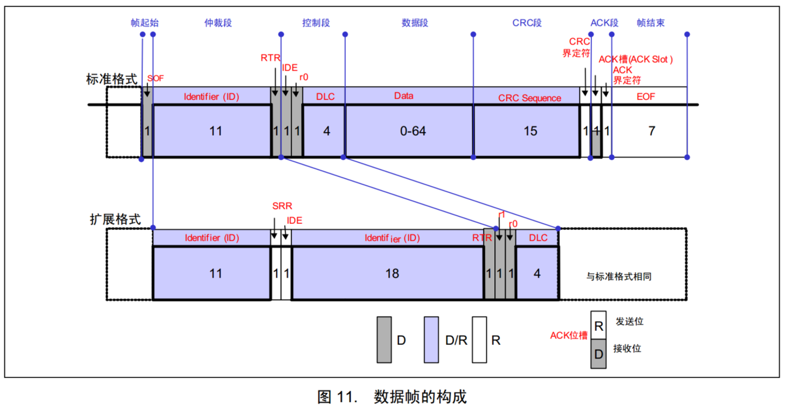

### 2.3 数据帧的发展历史

- **CAN1.2时期**
  - 仅存在标准格式，IDE位当时仍为保留位r1；
- **CAN 2.0时期**
  - ID不够用，出现了扩展格式，增加了ID的位数；
  - 为了区分标准格式与扩展格式，协议将标准格式中的r1赋予了新功能—IDE；

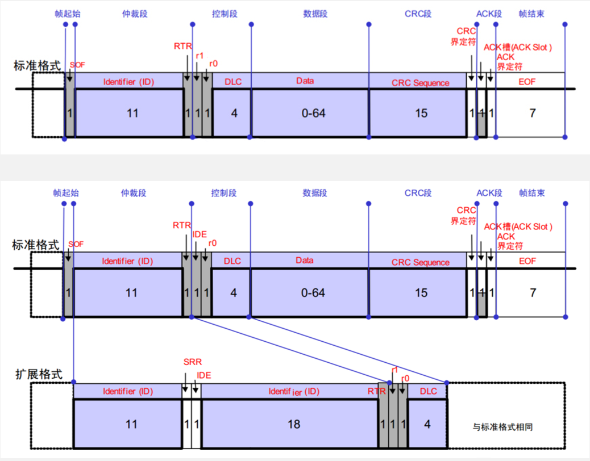

## 3.遥控帧

- **遥控帧的时序定义**
  - 遥控帧无数据段，RTR为隐性电平1，其他部分与数据帧相同；
- **遥控帧的用途**
  - 遥控帧主要用在通信速率要求较低的情况，即接收方发送一个遥控帧，发送方再发送一个数据帧；
  - 由于遥控帧本身就占用总线资源，所以不适用于速率要求高的场景；
- **遥控帧的机制**
  - 接收方先广播一个遥控帧，其中遥控帧中包含了报文ID；
  - 当总线中某一个设备有对应报文ID的数据时，它就会广播相同报文ID的数据帧；
  - 在实际通信中，遥控帧必须与数据帧配合使用，且**数据帧的优先级是高于遥控帧的；**

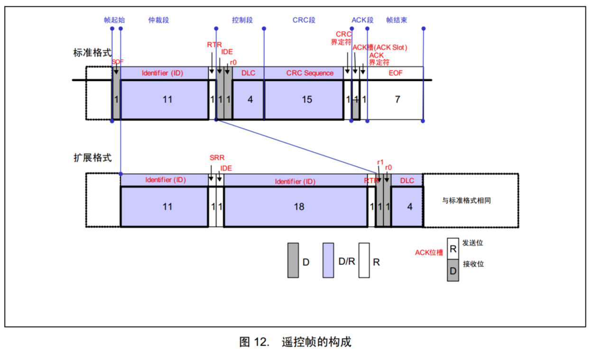

## 4.错误帧

- **错误帧的机制**
  - 总线上所有设备都会监督总线的数据；
  - 如果发现**“位错误”或“填充错误”或“CRC错误”或“格式错误”或“应答错误” **，这些设备便会发出错误帧来破坏数据，同时终止当前的发送设备；
- **错误帧的时序**
  - 错误帧可以直接叠加在数据帧上，并破坏数据帧的数据，让所有设备都不使用这个错误的数据；
  - 错误帧分为主动错误和被动错误，主动错误是连续6个显性0，被动错误是连续6个隐性1；
  - 某个设备发送错误帧，可能引起其他设备也发生错误帧，所以存在0~6的错误标志的重叠部分；

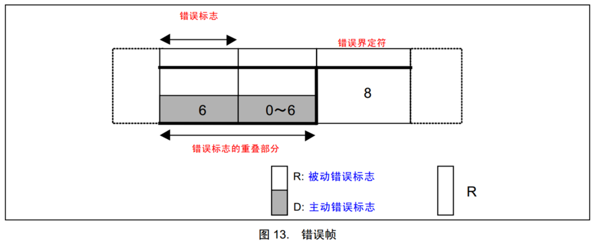

## 5.过载帧

- **过载帧的意义**
  - 当接收方收到大量数据而无法处理时，其可以发出过载帧，延缓发送方的数据发送，以平衡总线负载，避免数据丢失；
- **过载帧的时序**
  - 过载帧是连续6个显性0电平的过载标志；
  - 外接连续8个隐性电平1的过载界定符；
- **过载帧的机制**
  - 直接破坏总线上的数据，发送方发现数据错误会不断重试，通过重试降低发送频率；
  - 接收方发送过载帧，发送方可以根据过载帧的出现适当降低发送频率；

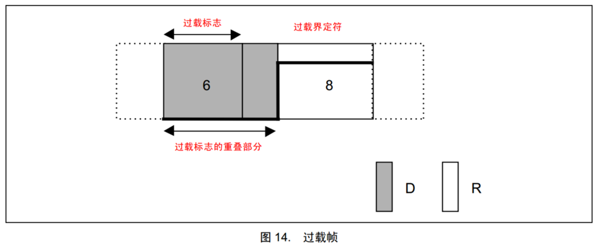

## 6.帧间隔

- **帧间隔的意义**
  - 将数据帧和遥控帧与前面的帧分离开；
- **帧间隔的时序**
  - 帧间隔是连续3个隐性电平1；
  - 帧间隔也分主动错误状态和被动错误状态，被动错误还需要加上8个隐性位的延迟传送；

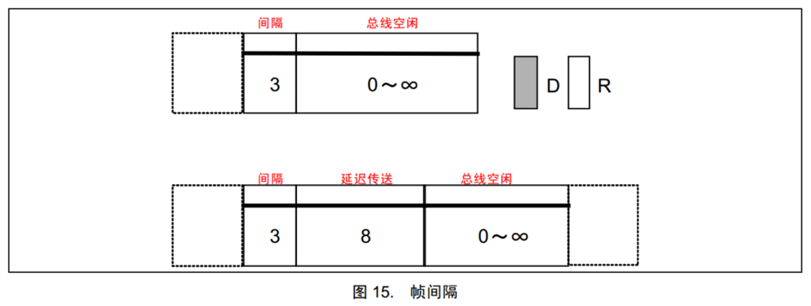

## 7.位填充

数据帧和遥控帧在输入到总线前需要进行位填充。

- **位填充规则**
  - 发送方每发送**5个相同电平**后，自动追加一个相反电平的填充位，接收方检测到填充位时，会**自动移除填充位**，恢复原始数据；
  - 例如：
    - 即将发送：    100000110	   10000011110	0111111111110
    - 实际发送：    100000**1**110	   100000**1**1111**0**0	011111**0**11111**0**10
    - 实际接收：    100000**1**110	   100000**1**1111**0**0	011111**0**11111**0**10
    - 移除填充后： 100000110	   10000011110	0111111111110
  - 位填充只在SOF和CRC界定符之间的这段数据起作用；

- **位填充作用**
  - 增加波形的定时信息，利于接收方执行**“再同步”**，防止波形长时间无变化，导致接收方不能精确掌握数据采样时机；
  - 将正常数据流与“错误帧”和“过载帧”区分开，标志“错误帧”和“过载帧”的特异性，因为错误帧和过载帧会**连续发送6个隐性电平1；**
  - 保持CAN总线在发送正常数据流时的活跃状态，防止被误认为总线空闲，因为CAN协议中默认**连续11个隐性电平**就是空闲状态；

## 8.波形实例

- **标准数据帧波形**

  - 标准数据帧，报文ID为0x555，数据长度1字节，数据内容为0xAA

  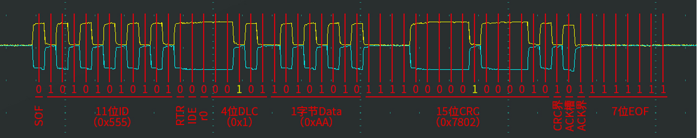

  - 标准数据帧，报文ID为0x666，数据长度2字节，数据内容为0x12, 0x34

  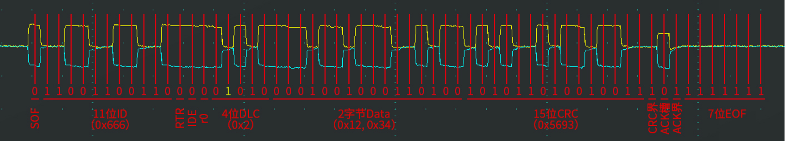

- **扩展数据帧与标准遥控帧波形**

  - 扩展数据帧，报文ID为0x0789ABCD，数据长度1字节，数据内容为0x56

  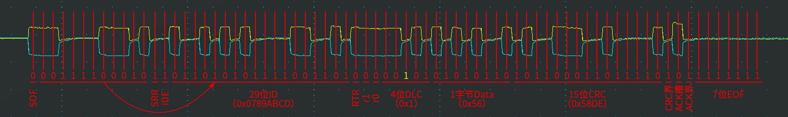

  - 标准遥控帧，报文ID为0x088，数据长度1字节，无数据内容

  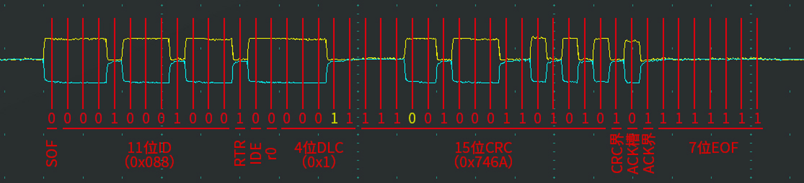

---

# 1-3 位同步

本节要解决的问题是**接收方的数据采样和同步问题。**

## 1.接收方数据采样的理想情况

- CAN总线**没有时钟线**，所以CAN总线是一种异步通信方式；
- 总线上的所有设备通过约定波特率的方式确定每一个数据位的时长，即通过软件的方式指定所有设备的波特率都保持一致；
- 发送方以约定的位时长每隔固定时间输出一个数据位；
- 接收方以约定的位时长每隔固定时间采样总线的电平，输入一个数据位；
- 理想状态下，接收方能依次采样到发送方发出的每个数据位，**且采样点位于数据位中心附近；**

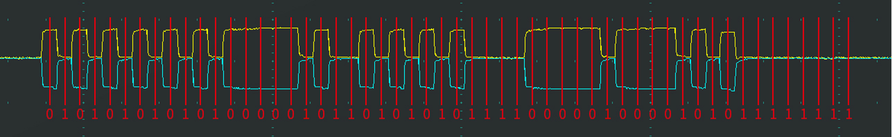

## 2.数据采样的两个问题

- **采样中心未对齐**

  - 接收方以约定的位时长进行采样，但是采样点没有对齐数据位中心附近；
  - 这个问题可以通过后面的**硬同步**解决；

  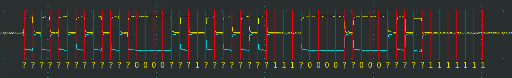

- **时钟存在误差**

  - 接收方刚开始采样正确，但是时钟有误差，随着误差积累，采样点逐渐偏离；
  - 这个问题可以通过后面的**再同步**解决；

  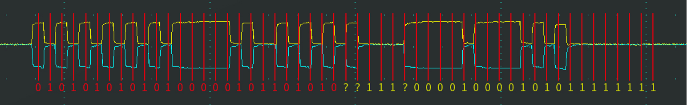

## 3.位时序

- 为了**灵活调整每个采样点的位置，使采样点对齐数据位中心附近**，CAN总线对每一个数据位的时长进行了更细的划分；
- 分为**同步段（SS）、传播时间段（PTS）、相位缓冲段1（PBS1）和相位缓冲段2（PBS2）；**
- 位时序中的每个段又由若干个**最小时间单位（Tq）**构成，其中Tq可由程序直接指定；
- 每个段的时间有如下要求：**SS = 1Tq、PTS = 1~8Tq、PBS1 = 1~8Tq、PBS2 = 2~8Tq；**

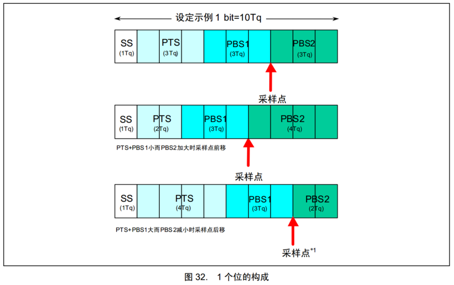

- **同步段SS**
  - 这个段用于实现同步，即电平的跳变沿需要发生在SS段，这样才是同步状态；
- **播时间段PTS**
  - 这个时间段用于吸收CAN总线在实际传输波形时的物理延迟；
- **相位缓冲段**
  - 相位缓冲段包括了相位缓冲段1和相位缓冲段2；
  - 采样点在相位缓冲段1和相位缓冲段2的交界处；
  - 通过改变相位缓冲段1和相位缓冲段2的相对时长就可以调整采样点的位置；

## 4.硬同步

- **要解决的问题**
  - 硬同步解决的问题是让接收方的第一个采样点与波形的第一位对齐，解决前面提到的中心不对齐问题；

- **设计机制**
  - 每个设备都有一个位时序计时周期，它对应着上面的四个段；
  - 当发送方率先发送报文，其他接收方收到SOF的下降沿时，接收方会将位时序计时周期拨到SS段的位置，与发送方的位时序计时周期保持同步；
  - 硬同步只在帧的第一个下降沿（SOF下降沿）有效；
  - 经过硬同步后，若发送方和接收方的时钟没有误差，则后续所有数据位的采样点必然都会对齐数据位中心附近；

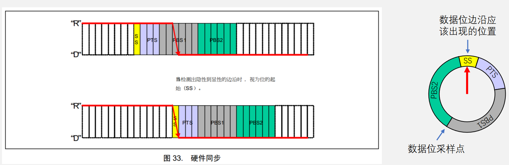

## 5.再同步

- **要解决的问题**
  - 再同步要解决的问题是设备存在时钟误差导致不再同步的问题，即前面提到的第二个问题；
- **设计机制**
  - 若发送方或接收方的时钟有误差，随着误差积累，数据位边沿逐渐偏离SS段；
  - 此时接收方根据**再同步补偿宽度值（SJW）通过加长PBS1段，或缩短PBS2段，以调整同步，SJW的取值范围为1~4Tq；**
  - 再同步可以发生在第一个下降沿之后的每个数据位跳变边沿；
  - SJW是最大补偿宽度，不是实际的补偿宽度，实际补偿宽度由SJW和实际误差决定，**SJW相当于是PID中的限幅左右；**

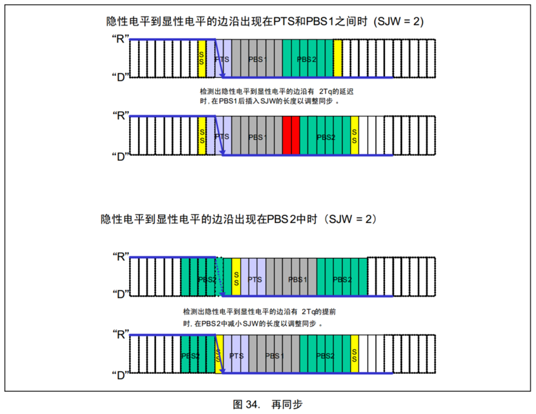

## 6.波特率的计算

- **波特率计算公式**

$$
\text{波特率} = \frac{1}{\text{一个数据位的时长}} 
= \frac{1}{T_{\text{SS}} + T_{\text{PTS}} + T_{\text{PBS1}} + T_{\text{PBS2}}}
$$

- **波特率计算举例**

$$
 \begin{aligned} &\text{SS} = 1T_q,\ \text{PTS} = 3T_q,\ \text{PBS1} = 3T_q,\ \text{PBS2} = 3T_q \\ &T_q = 0.5\ \mu\text{s} \\ &\text{波特率} = \frac{1}{0.5\ \mu\text{s} + 1.5\ \mu\text{s} + 1.5\ \mu\text{s} + 1.5\ \mu\text{s}} = 200\ \text{kbps} \end{aligned} 
$$

---

# 1-4 仲裁

## 1.多设备同时发送数据的问题

- CAN总线只有一对差分信号线，同一时间只能有一个设备操作总线发送数据，若多个设备同时有发送需求，会呈现**线与的特性；**
- 解决问题的思路：制定资源分配规则，依次满足多个设备的发送需求，**确保同一时间只有一个设备操作总线；**

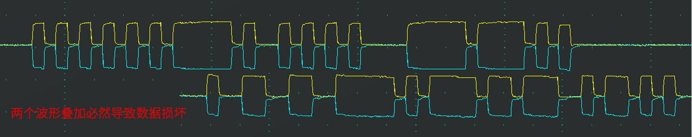

## 2.资源分配规则

### 2.1 资源分配规则1-先占先得

- 若当前已经有设备正在操作总线发送数据帧/遥控帧，则其他任何设备不能再同时发送数据帧/遥控帧**（可以发送错误帧/过载帧破坏当前数据）；**
- 任何设备检测到**连续11个隐性电平**，即认为总线空闲，只有在总线空闲时，设备才能发送数据帧/遥控帧；
- 一旦有设备正在发送数据帧/遥控帧，总线就会变为活跃状态，必然不会出现连续11个隐性电平，其他设备自然也不会破坏当前发送；
- 若总线活跃状态其他设备有发送需求，则需要等待总线变为空闲，才能执行发送需求；
- **这里可以用STM32的中断来类比，相当于只有响应优先级，没有抢占优先级；**

### 2.2 资源分配规则2-非破坏性仲裁

- 若**多个设备的发送需求同时到来或因等待而同时到来**，则CAN总线协议会根据**ID号（仲裁段）**进行非破坏性仲裁；
- ID号小的（优先级高）取到总线控制权，ID号大的（优先级低）仲裁失利后将转入接收状态，等待下一次总线空闲时再尝试发送；
- 实现非破坏性仲裁需要两个要求
  - **线与特性**
    - 总线上任何一个设备发送显性电平0时，总线就会呈现显性电平0状态；
    - 只有当所有设备都发送隐性电平1时，总线才呈现隐性电平1状态；
    - 即：0 & X & X = 0，1 & 1 & 1 = 1；
  - **回读机制**
    - 每个设备发出一个数据位后，都会**读回总线当前的电平状态**，以确认自己发出的电平是否被真实地发送出去了；
    - 根据线与特性，**发出0读回必然是0，发出1读回不一定是1；**

## 3.仲裁的过程

### 3.1 仲裁机制

- 数据位从前到后依次比较，出现差异且数据位为1的设备仲裁失利；

- **仲裁过程**

  - 由于线与特性，设备1的数据被破坏了，所以没必要再继续发了，设备1主动退出；
  - 设备2的数据没有被破坏，所以也感知不到别的设备的存在，它继续发送数据；

- **由此可引出几个结论**

  - 当多个设备同时仲裁时，每个设备的仲裁段都不一样，所以最后必然只有一个设备在发送；
  - ID号小的仲裁优先级高是由线与特性决定的，因为ID号越小，1出现得就越晚，；
  - 位填充发生在起始帧到CRC检验段，但是它不会改变设备的仲裁优先级；
  - 由于总线上的数据与仲裁胜利者的数据始终保持一致，所以称为非破坏性仲裁；

  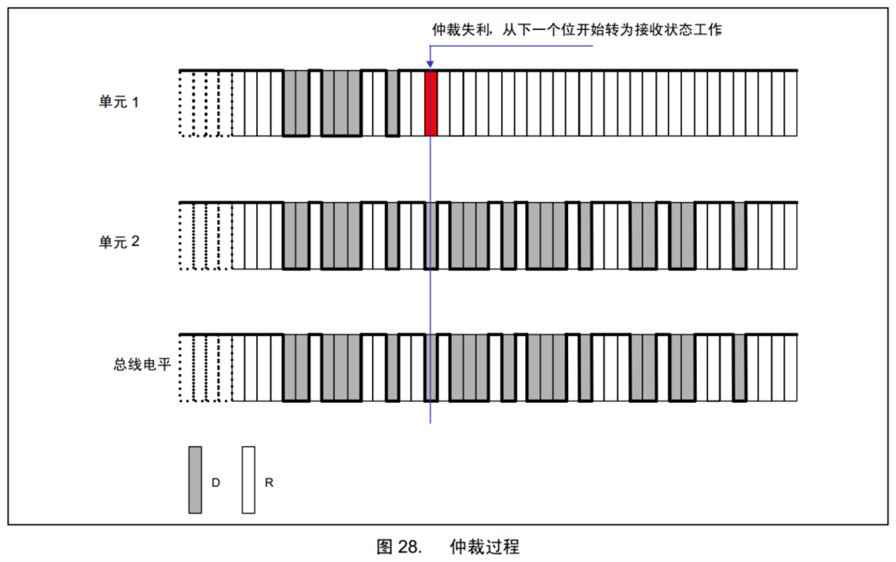

### 3.2 仲裁的两个细节

- **数据帧和遥控帧的优先级**

  - 数据帧和遥控帧ID号一样时，数据帧的优先级高于遥控帧；
  - 从意义上来看，当两者ID号相同时，起始遥控帧想要的就是这个数据帧，所以遥控帧直接接收就可以了；

  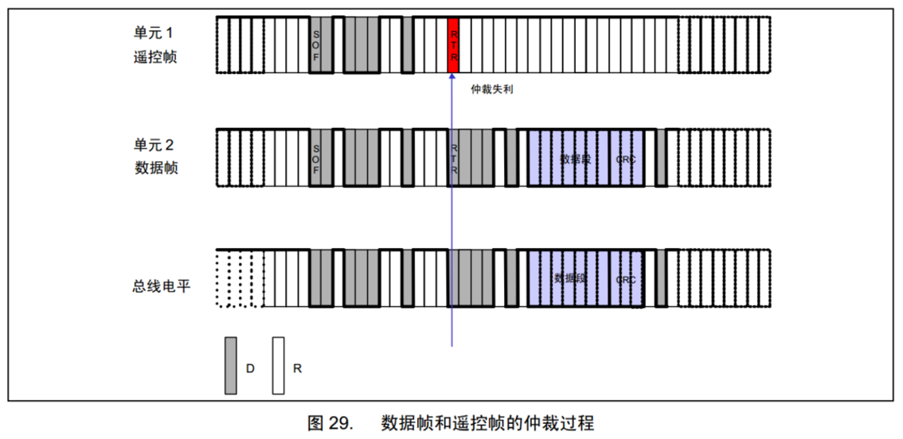

- **标准数据帧与扩展数据帧的优先级**

  - 标准格式11位ID号和扩展格式29位ID号的高11位一样时，标准格式的优先级高于扩展格式（SRR必须始终为1，以保证此要求）；

  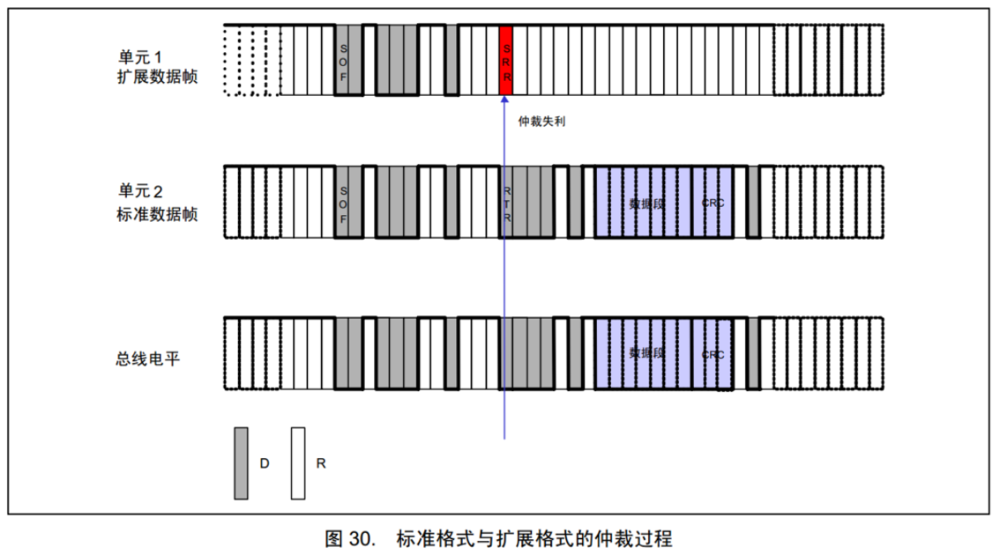

- **标准遥控帧与扩展数据帧的优先级**
  - 两者将在仲裁至标准遥控帧的下一位IDE才能决出胜负；
- **总结**
  - 原先的CAN总线设计是比较完美的，但是由于ID号的升级，给CAN总线带来了一些臃肿；
  - 但所幸的是，这次ID号的升级也没有让CAN总线出现冲突，保证了一切运行的正常；

---

# 1-5 错误处理

## 1.CAN总线的5种错误类型

- **错误处理的介绍**
  - 错误共有5种： 位错误、填充错误、CRC错误、格式错误、应答错误；
  - 当发生错误处理时，将会破坏原有的数据帧，直到错误处理结束，总线回归空闲状态，设备才能重新发送数据帧；
- **位错误**
  - 即上一节课讲到的**回读机制；**
  - 但是需要注意，**仲裁段和应答位**的回读不同并不是位错误；
- **填充错误**
  - 位填充的范围是**SOF到CRC段**，理论上不会出现连续**6个相同的电平；**
  - 对于CRC段后面的部分是固定的电平，所以不进行检测；
  - 当SOF到CRC段出现连续6个相同的电平时，就视为填充错误；
- **CRC错误**
  - 发送端会根据SOF到数据段的数据流进行CRC计算得到CRC段；
  - 接收端根据接收到的SOF到数据段的数据流也进行CRC计算，得到一个CRC码；
  - 对比接收到的CRC码和计算得到的CRC码是否相同，不同则发生CRC错误；
- **格式错误**
  - 对于帧格式种固定电平的那些位置，如果出现了相反的格式就发生格式错误；
- **ACK错误**
  - 即如果没有设备应答时就产生ACK错误；

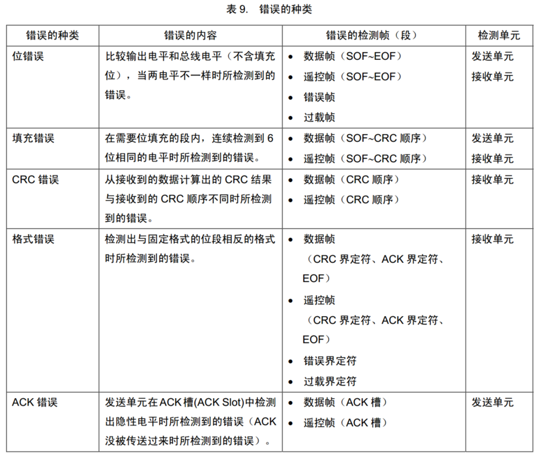

## 2.错误状态

### 2.1 错误状态

由于错误处理的存在，每个设备都具有了破坏数据的能力，**如果由于设备自身出了问题，导致它一直破坏数据时，就需要添加保护措施。**

- 主动错误状态的设备正常参与通信并在检测到错误时发出主动错误帧；
- 被动错误状态的设备正常参与通信但检测到错误时只能发出被动错误帧；
- 总线关闭状态的设备不能参与通信；
- 每个设备内部管理一个**TEC（发送错误计数器）和REC**，根据TEC和REC的值确定自己的状态；

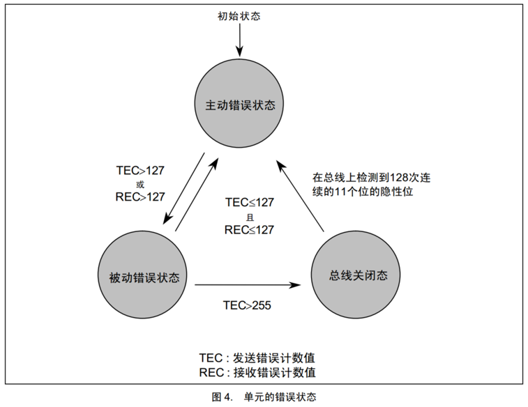

### 2.2 TEC与REC

- **TEC：Transmit Error Countor**
  - TEC即发送错误计数器；
  - 设备在发送时，每发现一次错误，这个TEC就会增加1次；
  - 且每进行一次正常的发送后，TEC也会减小一次；
- **REC：Receive Error Countor**
  - REC即接收错误计数器；
  - 设备在接收时，每发现一个错误，这个REC就会增加1次；
  - 且每进行一次正常的接收后，REC也会减小一次；

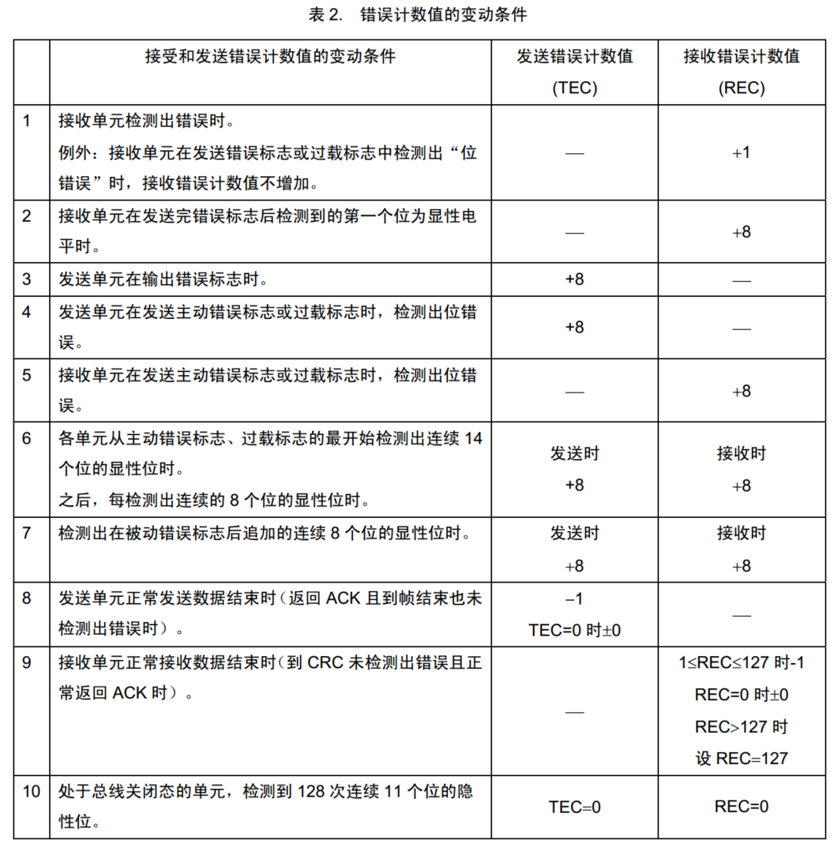

## 3.错误帧实例

- 设备处于主动错误状态，发送标准数据帧，正常传输

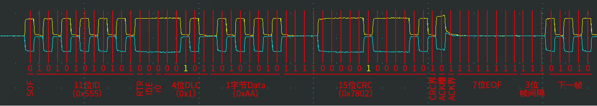

- 设备处于主动错误状态，发送标准数据帧，检测到ACK错误

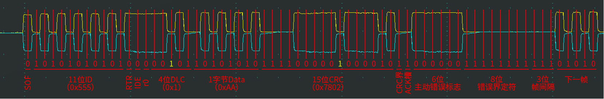

- 设备处于被动错误状态，发送标准数据帧，检测到ACK错误
  - 对于被动错误状态的设备，它会多8位延迟传送部分；
  - 所以主动错误状态的设备和被动错误状态的设备不需要仲裁，主动错误状态的设备将直接获得总线控制权；

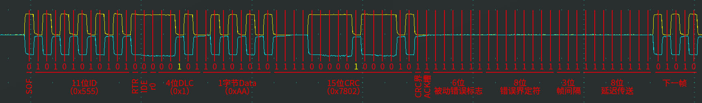

---

# 2-1 STM32的CAN外设(上)

## 1.内容介绍

- 这节与下一节课是本课程的第二部分，即STM32的硬件CAN外设；
- 本部分内容对应的参考资料为`1.课程资料\STM32资料\参考文档`下的`STM32F10xxx参考手册（中文）`的**第22章——控制器局域网(bxCAN)；**

## 2.STM32的CAN外设简介

- STM32内置bxCAN外设（CAN控制器），支持CAN2.0A和2.0B；
- **CAN外设可以自动发送CAN报文和按照过滤器自动接收指定CAN报文，程序只需处理报文数据而无需关注总线的电平细节；**
- 波特率最高可达1兆位/秒；
- 3个可配置优先级的发送邮箱，**即发送时有3个缓存区，可存入3个报文；**
- 2个3级深度的接收FIFO，**即接收时有6个缓存区，可存入6个报文；**
- 14个过滤器组（互联型28个），即**只接收固定报文的数据；**
- STM32的CAN外设的特色功能：时间触发通信、自动离线恢复、自动唤醒、禁止自动重传、接收FIFO溢出处理方式可配置、发送优先级可配置、双CAN模式；
- STM32F103C8T6的CAN资源：CAN1；

## 3.CAN硬件拓扑结构

### 3.1 CAN网拓扑结构

- 如下图所示为CAN实际通信种的网拓扑结构；
- 其中，每个MCU都是一个CAN节点，且每个MCU内部都有CAN控制器，MCU内部运行应用程序；
- CAN控制器引出CAN_Rx和CAN_Tx，与CAN收发器连接；
- CAN收发器引出CAN_H和CAN_L，分别接到CAN总线上；

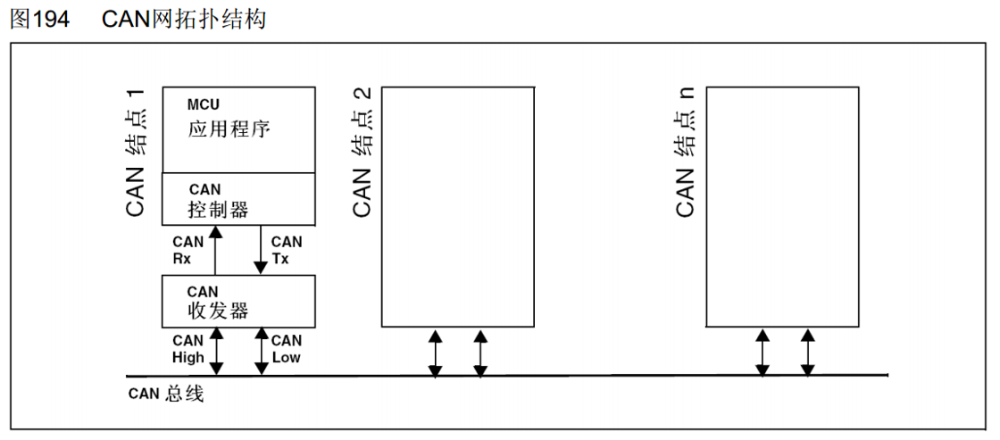

### 3.2 STM32F103C8T6的CAN外设

- 在STM32F103C8T6种，CAN_RX和CAN_TX默认复用在**PA11和PA12引脚上；**
- 除此之外，还可以通过AFIO重映射到**PB8和PB9引脚上；**

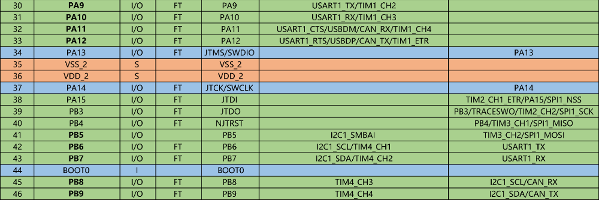

### 3.3 CAN收发器电路

- **左下角为参考手册的参考电路**
  - CANH和CANL分别接到CAN总线上，两个120Ω电阻为终端电阻；
  - VCC通过两个电容接到＋5V上，因为CANH需要为3.5V，所以必须接＋5V电压；
  - TXD和RXD分别接到CAN控制器的TX引脚和RX引脚；
  - SJA1000为独立的CAN控制器，若MCU没有内置CAN控制器，就可以外接这么一个控制器进行CAN通信；
- **左上角为实际的电路原理图**
  - 原理图大体与参考电路保持一致，但在CANH、CANL外接到端子时添加了一些元件；
  - R1和R2、C5和C6组成了滤波电路，减小电平抖动，虽然是差分信号，但也设计了滤波；
  - R3电阻为终端电阻，为120Ω，实际中当三个节点接在一起时，会有三个终端电阻，违背了协议，但实测这里影响不大；
  - 若为了考虑协议的正确性，可以直接将某个终端电阻卸下来即可；

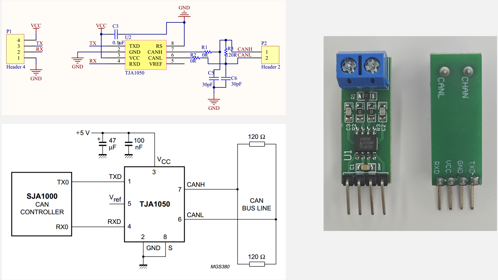

## 4.STM32的内部硬件CAN外设

### 4.1 CAN框图

- **CAN核心**
  - 对于互联型设备，有主CAN——CAN1和从CAN——CAN2，其中CAN2是辅助CAN1工作的，两者并不独立；
  - 对于STM32F103C8T6而言，它不是互联型设备，所以没有下面的从CAN，只有上面的主CAN；
- **发送部分**
  - 主发送邮箱即发送缓冲器，一共有三个邮箱，可存放3个报文；
  - 当要发送某个报文时，将报文写入某个空闲的邮箱中，设置寄存器发送即可，时序将由硬件自动生成；
- **接收部分**
  - 接收滤波器用于过滤报文，只有能够通过某个过滤器才能把对应报文接收；
  - 通过接收滤波器的报文将存入到主接收FIFO0/主接收FIFO1中，它起到了缓存报文的作用；

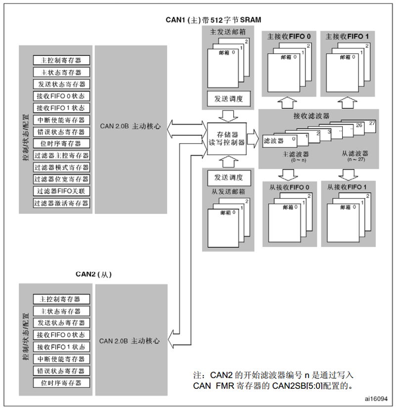

### 4.2 CAN基本结构框图

- **GPIO配置**
  - CAN控制器通过GPIO复用功能引出引脚；
  - CAN_TX为输出引脚，需要设置为**复用推挽输出；**
  - CAN_RX为输入引脚，需设置为**上拉输入模式；**
- **发送部分**
  - CPU直接将一个报文的各个数据段写入到某个邮箱即可，可减少CPU的等待时间；
  - 当邮箱中存着多个数据时，可选择发送策略为**先到先发或是按优先级发；**
- **接收部分**
  - 数据帧或是遥控帧需要先经过过滤器，这里的过滤器有**14个；**
  - 每个过滤器都可以在程序中配置参数，可以把想要接收的ID规则写入到滤波器中，它就可以只过滤想要的报文；
  - 通过过滤器后的报文会进入FIFO0/1中，具体是进入哪个是有过滤器的配置决定的；
  - 当某个FIFO存满时，可配置FIFO的锁定状态：
    - 当FIFO为**锁定状态**时，FIFO满了之后新的报文直接丢弃；
    - 当FIFO为**不锁定状态**时，FIFO满了之后新的报文会挤掉邮箱2的位置，自己占据；

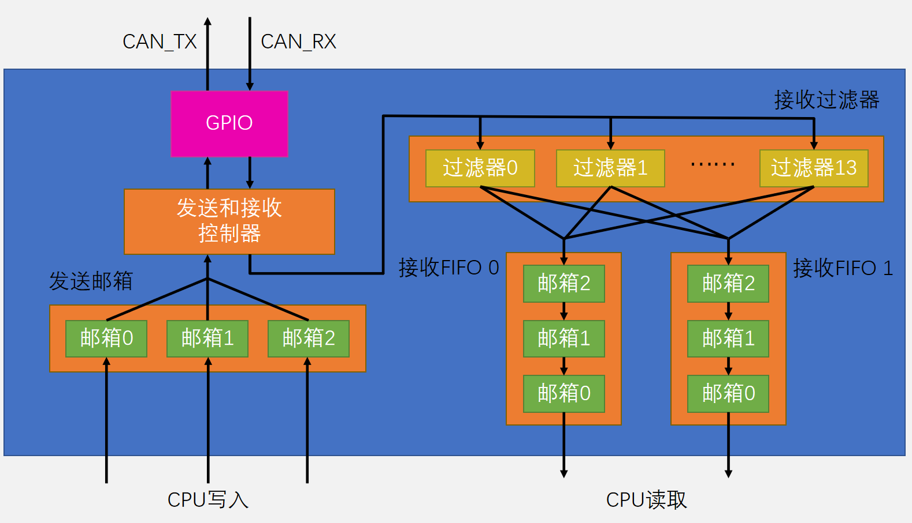

## 5.实际通信的流程图

### 5.1 发送流程图

- 基本流程：选择一个空置邮箱→写入报文 →请求发送；
- TXRQ：请求发送控制位；
- RQCP：发送成功标志位；
- TME：邮箱空标志位；
- 除此之外，还有ABRQ终止发送控制位和NART禁止自动重发控制位；
- 在发送过程中，邮箱就通过着五个标志位/控制位实现状态的变换；

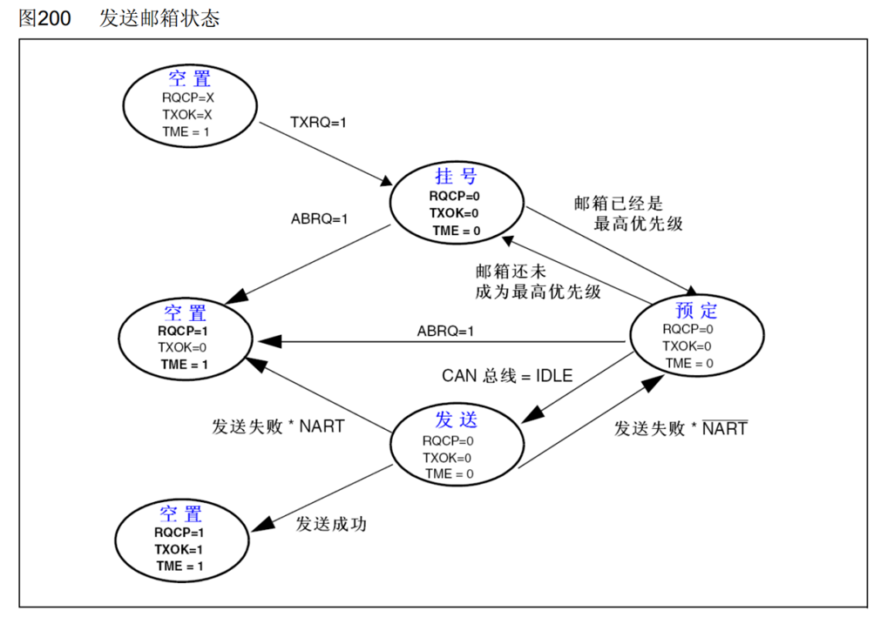

### 5.2 接收流程图

- 基本流程：接收到一个报文→匹配过滤器后进入FIFO 0或FIFO 1→CPU读取；
- FMP：报文数目位；
- FOVR：报文溢出标志位；
- RFOM：释放邮箱控制位；
- 在接收过程中，邮箱就通过这几个标志位/控制位实现状态的变换；

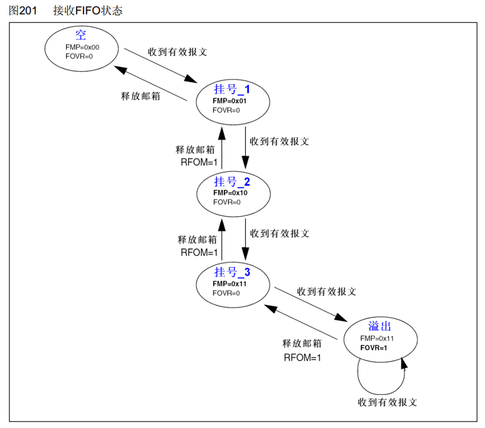

### 5.3 发送和接收配置位总结

- **NART：禁止自动重发控制位**
  - 置1，关闭自动重传，CAN报文只被发送1次，不管发送的结果如何（成功、出错或仲裁丢失）；
  - 置0，自动重传，CAN硬件在发送报文失败时会一直自动重传直到发送成功；
- **TXFP：发送优先级**
  - 置1，优先级由发送请求的顺序来决定，**先请求的先发送；**
  - 置0，优先级由报文标识符来决定，**标识符值小的先发送**（标识符值相等时，邮箱号小的报文先发送）；
- **RFLM：接收FIFO锁定模式**
  - 置1，接收FIFO锁定，FIFO溢出时，新收到的报文会被丢弃；
  - 置0，禁用FIFO锁定，FIFO溢出时，FIFO中最后收到的报文被新报文覆盖；

---

# 2-2 STM32的CAN外设(下)

# 3-1 单个设备环回测试&三个设备互相通信

# 3-2 标准格式-扩展格式-数据帧-遥控帧&标识符过滤器

# 3-3 中断式接收&数据传输策略

