# FreeRTOS学习笔记

本笔记是基于B站韦东山的《FreeRTOS入门与工程实践》课程整理的：

- 视频链接：[视频链接](https://www.bilibili.com/video/BV1Jw411i7Fz?p=4&vd_source=b7453c324b64db9c455fd1d20572810d)；
- 官网资源：[官网资源](https://rtos.100ask.net/zh/FreeRTOS/DShanMCU-F103/)；

本笔记的组织形式：

- 与课程不完全一致，对于一些推销类课时不做记录，且对于一些课程的标题进行了更清晰的描述；
- 每个课时的标号与课程保持一致，采用**x-x**的形式；

---


# 0-1 课程配套硬件介绍

本课程主要由硬件和软件两部分构成，课程的内容就是在硬件的基础上去实现这个软件项目的效果，分别介绍如下：

- **硬件部分：**

  - 硬件是韦东山开发的**瑞士军刀开发板**；
  - 开发板的具体样子如下图所示：

  

  - 板子的原理图和PCB文件可在文件夹`1.课程资料\2.闲鱼发货\2.底板\韦东山瑞士军刀RTOS底板PCB`下找到；

- **软件部分：**

  - 软件部分基于开源项目NWatch；
  - NWatch的项目地址如下：[NWatch项目地址](https://github.com/ZakKemble/NWatch)；

  

---


# 1-1 单片机的工作方式与FreeRTOS简介

---

## 1.内容介绍

- 本节对应了教程资料**第二章——单片机程序设计模式。**
- 单片机的工作方式主要可分为**裸机开发和多任务系统**，本小节分别介绍；
- 本节内容以下方图片的场景进行讲解：


## 2.裸机开发模式

### 2.1 轮询模式

- 在main函数中是一个while循环，里面依次调用2个函数，这两个函数相互之间有影响；
- 使用轮询模式编写程序简单，但要求while循环里调用到的函数要执行得非常快；

```c
// 经典单片机程序: 轮询
void main()
{
	while (1)
	{
		喂一口饭();
		回一个信息();
	}
}

```

### 2.2 前后台——中断驱动模式

- **所谓“前后台”就是使用中断程序；**
- 假设收到同事发来的信息时，电脑会发出“滴”的一声，这时候妈妈才需要去回复信息；

```c
// 前后台程序
void main()
{
	while (1)
	{
		// 后台程序
		喂一口饭();
	}
}

// 前台程序
void 滴_中断()
{
	回一个信息();
}

```

- 可以进一步优化，两个事件都通过中断驱动：
  - 当两个中断不同时发生时，之间没有影响；
  - 当两者同时发生时，必定会相互影响；
  - **此时while循环是空的；**

```c
// 前后台程序
void main()
{
	while (1)
	{
		// 后台程序
	}
}

// 前台程序
void 滴_中断()
{
	回一个信息();
}

// 前台程序
void 啊_中断()
{
	喂一口饭();
}
```

### 2.3 定时器驱动

- 定时器驱动模式，是前后台模式的一种，可以按照不用的频率执行各种函数；
- **此时main函数中的while循环是空的；**
- 这种方式的前提是每个函数的执行时间不能超过一个定时器周期，否则两个函数发生影响；

```c
// 前后台程序: 定时器驱动
void main()
{
	while (1)
	{
		// 后台程序
	}
}

// 前台程序: 每 1 分钟触发一次中断
void 定时器_中断()
{
	static int cnt = 0;
	cnt++;
	if (cnt % 2 == 0)
	{
		喂一口饭();
	}
	else if (cnt % 5 == 0)
	{
		回一个信息();
	}
}
```

### 2.4 基于状态机

- 使用状态机模式，可以解决裸机程序的难题；
- 假设有 A、B 两个都很耗时的函数，这样可以降低它们相互之间的影响；
- 但是很多场景里，**函数 A、B 并不容易拆分为多个状态**，并且这些状态执行的时间并不好控制；

```c
// 状态机
void main()
{
	while (1)
	{
		喂一口饭();
		回一个信息();
	}
}

void 喂一口饭(void)
{
	static int state = 0;
	switch (state)
	{
		case 0:
		{
			/* 舀饭 */
			state++;
			break;
		}
		case 1:
     	{
			/* 喂饭 */
			state++;
			break;
		}
		case 2:
		{
			/* 舀菜 */
			state++;
			break;
		}
		case 3:
		{
			/* 喂菜 */
			state = 0;
			break;
		}
	}
}

void 回一个信息(void)
{
	static int state = 0;

	switch (state)
	{
		case 0:
		{
			/* 查看信息 */
			state++;
			break;
		}
		case 1:
		{
			/* 打字 */
			state++;
			break;
		}
		case 2:
		{
			/* 发送 */
			state = 0;
			break;
		}
	}
}
```


## 3.多任务系统

### 3.1 多任务模式

- **机理介绍：**

  - 多任务系统会依次给这些任务分配时间：你执行一会，我执行一会，如此循环；
  - 只要切换的间隔足够短，用户会“感觉这些任务在同时运行”；
  - 其时间切片如下图所示：

  

- **软件编写：**

  - main函数中创建 2 个任务；，然后启动调度器，之后，这 2 个任务就会交叉执行了；

  - 基于多任务系统编写程序时，反而更简单了：

    - 上面是“喂饭任务”的代码；

    - 下面是“回信息任务”的代码；
    - **编写它们时甚至都不需要考虑它和其他函数的相互影响；**

```c
// RTOS 程序
喂饭任务()
{
	while (1)
	{
		喂一口饭();
	}
}

回信息任务()
{
	while (1)
	{
		回一个信息();
	}
}

void main()
{
	// 创建 2 个任务
	create_task(喂饭任务);
	create_task(回信息任务);

	// 启动调度器
	start_scheduler();
}
```

### 3.2 多任务系统中的通讯问题

在多任务系统中，不同任务之间需要通讯，**通讯问题可分为互斥操作与同步操作。**

#### 3.2.1 互斥操作

- 多任务系统中，**多个任务可能会“同时”访问某些资源**，需要增加保护措施以防止混乱，这就是互斥操作；

- **用全局变量实现互斥操作1：**

  - 如下方代码所示，两个任务都要用同一个串口进行打印，它们之间是互斥的；
  - 在下方代码中，通过全局变量的方式进行互斥操作的保护；
  - 但是在任务切换中很可能在刚进入if判断后就发生了切换，所以用全局变量保护互斥操作会存在很大的偶然性；

  ```c
  // RTOS 程序
  int g_canuse = 1;
  
  void uart_print(char *str)
  {
  	if (g_canuse)
  	{
  		g_canuse = 0;
  		printf(str);
  		g_canuse = 1;
  	}
  }
  
  task_A()
  {
  	while (1)
  	{
  		uart_print("0123456789\n");
  	}
  }
  
  task_B()
  {
  	while (1)
  	{
  		uart_print("abcdefghij");
  }
  
  }
  
  void main()
  {
  	// 创建 2 个任务
  	create_task(task_A);
  	create_task(task_B);
  	// 启动调度器
  	start_scheduler();
  }
  ```

- **用全局变量实现互斥操作2：**

  - 在原来的基础上做修改，如下方代码所示；
  - 但是由于“减1”这个操作在底层的汇编实现上需要三步，所以仍然可能存在冲突的风险；

  ```c
  void uart_print(char *str)
  {
      g_canuse--;				① 减一
      if( g_canuse == 0 )		② 判断
      {
          printf(str);		③ 打印
      }
      g_canuse++;				④ 加一
  }
  ```

- **用全局变量实现互斥操作3：**

  - 要解决上面的问题，可以通过关闭中断来实现

  ```c
  int LCD_PrintString(int x, int y, char *str) 
  {
      static int bCanUse = 1;
      disable_irq();
      if (bCanUse)
      { 
          bCanUse = 0;
          enable_irq();
          /* 使用LCD */
          bCanUse = 1;
          return 0;
      }
      enable_irq();
      return -1;
  }
  
  int LCD_PrintString(int x, int y, char *str) 
  {
      static int bCanUse = 1;
      disable_irq();
      bCanUse--;
      enable_irq();
      if (bCanUse == 0)
      { 
          /* 使用LCD */
          bCanUse++;
          return 0;
      }
      else
      {
          disable_irq();
          bCanUse++;
          enable_irq();
          return -1;
      }
  }
  ```

- 所以，为了解决多任务系统中的互斥操作问题，FreeRTOS内部封装了API，后续利用FreeRTOS提供的API就能解决这些问题；

#### 3.2.2 同步操作

- 若任务之间有依赖关系，如任务A执行了某个操作之后，需要任务B进行后续的处理，这就是同步操作；

- **全局变量实现同步操作1：**

  - 下方代码中，在任务A没有设置flag为1之前，任务B的代码都只是去判断flag；
  - 而任务A、B的函数是依次轮流运行的，假设系统运行了100秒，其中任务A总共运行了50秒，任务B总共运行了50秒；
  - **任务A在努力处理复杂的运算，任务B仅仅是浪费CPU资源；**

  ```c
  // RTOS程序
  int flag = 0;
  
  void task_A()
  {
      while (1)
      {
          // 做某些复杂的事情，完成后把flag设置为1
          flag = 1;
      }
  }
  
  void task_B()
  {
      while (1)
      {
          if (flag)
          {
              // 做后续的操作
          }
      }
  }
  
  void main()
  {
      // 创建2个任务
      create_task(task_A);
      create_task(task_B);
      // 启动调度器
      start_scheduler();
  }
  ```

- **FreeRTOS中处理同步操作：**

  - 如下方代码所示，可以通过FreeRTOS提供的信号量，来实现A、B任务之间的同步操作；
  - 在此期间，**任务B会被阻塞，不参与调度，知道任务A完成并释放信号量；**

  ```c
  // RTOS程序
  void task_A()
  {
      while (1)
      {
          // 做某些复杂的事情
          // 释放信号量,会唤醒任务B;
      }
  }
  
  void task_B()
  {
      while (1)
      {
          // 等待信号量, 会让任务B阻塞
          // 做后续的操作
      }
  }
  
  void main()
  {
      // 创建2个任务
      create_task(task_A);
      create_task(task_B);
      // 启动调度器
      start_scheduler();
  }
  ```


---


# 1-2 项目展示

- 整个工程包括3个项目：音乐播放、打砖块游戏、汽车游戏；

- 最后整个项目完成的程序的整体框架如下图所示：


---


# 2-1 开发板使用

## 1.内容介绍

- 本节内容对应了**教程资料的第三章和第四章；**
- 本节内容涉及的工程有：
  - **00_FreeRTOS_Template**
    - 由STM32CubeMX创建的添加了DshanMCU-F103驱动代码的空白的FreeRTOS工程；
    - 这个工程主要提供给学者学习由STM32CubeMX创建的FreeRTOS的工程结构；
  - **00_Driver_Test**
    - 开发板测试的FreeRTOS工程；
    - 这个工程是本节的主要工程，用于测试开发板的各个模块；
    - 这个工程只是在00_FreeRTOS_Template工程的基础上，在freertos.c文件中添加了驱动代码；


## 2.开发板介绍与硬件连接

- DshanMCU-103上有4个插针，它们分别是GND、SWCLK、SWDIO、3.3V；
- ST-Link上有10个插针，它们的功能在外壳上有标注；接线方法如下图所示：


- 连接好的实物图如下（ST-Link的USB口要插到电脑上）：


## 3.打开工程

- 测试开发板的项目工程是**00_Driver_Test**；
- 打开文件夹，选择MDK-ARM，然后用Keil打开：


## 4.修改代码

- 本工程主要涉及的文件是freertos.c，除了这个文件外，其他文件与空白工程的文件完全相同；
- 在该文件中有一个默认任务，这个任务由STM32CubeMX自动生成；
- 这个任务主要做的事情是初始化LCD，然后在循环中添加了驱动的测试代码；
- 由于每个测试函数内部都是一个死循环（可自己打开驱动源码查看），所以在测试开发板时，只能取消注释一个测试函数，逐个完成模块的测试；


## 5.注意事项

- 有些模块的引脚是共用的，所以它们要么不能同时接，要么不能同时使用；

- 可参照教程资料的第四章，里面有详细的说明，可将它们列表如下：

| 模块1            | 模块2                | 备注                       |
| ---------------- | -------------------- | -------------------------- |
| M2(DS18B20)      | M10(DHT11温湿度模块) | 不能同时接                 |
| M4(红外发射模块) | M9(蜂鸣器)           | 不能同时接                 |
| M6(超声波模块)   | M12(Flash模块)       | 可以同时接，但是要互斥访问 |


---


# 2-2 模块使用说明与STM32CubeMX配置

## 1.内容介绍

- 本节内容对应**课程资料的第五章——模块使用说明与 STM32CubeMX 配置；**
- **前面的00_Driver_Test工程就是这个课程的模板教程，可在这个工程的基础上跟着教程一步步完善工程；**
- 本小节的内容主要是讲解整个项目从零搭建的思路，具体的搭建过程见2-3节；


## 2.项目搭建的思路说明

- **驱动代码**

  - 在这个开发板上，要使用各个模块，需要用到各个模块的驱动代码；
  - 对于每一个模块，课程都提供了对应的驱动代码，路径在：`.\2.Project\01_Driver_Test\Project\Drivers\DshanMCU-F103`；

- **外设**

  - 要使用上面的驱动代码来驱动模块，需要用到STM32的各个外设和它们打交道；
  - 比如对于OLED而言，它需要用到I2C1，那就需要对I2C1这个外设进行配置；

- **初始化**

  - 初始化指的是初始化外设，这个工作由STM32CubeMX来做；
  - 由于驱动代码底层是用HAL库来写的，所以需要用STM32CubeMX来做初始化；

  

---


# 2-3 自己创建FreeRTOS工程

## 1.内容介绍

- 本节内容对应课程资料的：
  - **第五章——模块使用说明与 STM32CubeMX 配置；**
  - **第六章——创建FreeRTOS工程；**

- 本节主要介绍如何基于STM32CubeMX创建一个FreeRTOS工程，包括驱动代码的移植和默认任务的改写；


## 2.工程创建

具体如何创建一个工程请详细查看教程资料，在此不再赘述。


## 3.工程移植

在完成空白的FreeRTOS项目的创建后，接下来移植LED和OLED的驱动代码，这里已经假设前面的工程创建中完成了GPIO和I2C的初始化，具体见教程第六章。

- **LED的移植**

  - 首先需要添加驱动文件driver_led.c和driver_led.h文件，其具体过程见教程；
  - 接着就可以在freertos.c文件中添加测试代码：

  ```c
  /* USER CODE BEGIN Header */
  #include "driver_led.h"
  
  /* USER CODE END Header_StartDefaultTask */
  void StartDefaultTask(void *argument)
  {
    /* USER CODE BEGIN StartDefaultTask */
    /* Infinite loop */
    for(;;)
    {
      //osDelay(1);
  	  Led_Test();
    }
    /* USER CODE END StartDefaultTask */
  }
  
  ```

- **OLED的移植**

  - LCD的项目移植与LED相同，只是需要添加的驱动文件较多；
  - 驱动文件有：ascii_font.c、driver_lcd.c、driver_lcd.h、driver_led.c、driver_led.h、driver_timer.c和driver_timer.h；
  - 接着就可以在上面的基础上测试OLED的测试函数：

  ```c
  /* USER CODE BEGIN Header */
  #include "driver_led.h"
  #include "driver_lcd.h"
  
  /* USER CODE END Header_StartDefaultTask */
  void StartDefaultTask(void *argument)
  {
    /* USER CODE BEGIN StartDefaultTask */
    /* Infinite loop */
    for(;;)
    {
      //osDelay(1);
  	//LCD_Test();
  	  Led_Test();
    }
    /* USER CODE END StartDefaultTask */
  }
  
  ```

- 本完整工程对应着Project文件夹下的**01_FreeRTOS_Create_LCD_LED**；


## 4.说明

- 强烈建议就在**00_FreeRTOS_Template**或**00_Driver_Test**工程的基础上进行开发；
- 两者的区别主要就是freertos.c文件中是否加入了驱动代码；
- 对于想要从零构建这个项目的学者，需要具有一定的STM32基础以及STM32CubeMX的基础；
- 若在原来两个工程的基础上开发，只需要创建一个新的文件夹，该文件夹以项目名称命名，然后把前面任何一个项目的整个Project文件夹拷贝下来即可；

---


# 3-1 创建第一个多任务程序

## 1.内容介绍

- 本节内容主要介绍如何创建一个多任务的程序；
- 本节内容对应课程资料的**第九章第二节——任务创建与删除；**

- 本节所完成的工程项目为**02_Chapter9_First_FreeRTOS_App；**


## 2.FreeRTOS中创建任务的API介绍

### 2.1 接口层提供的函数

- **接口层**

  - 在嵌入式的RTOS中存在一个接口层，这个接口层提供了一个适配不同RTOS操作系统的**任务创建函数——osThreadNew()；**
  - 这个接口层对应的文件是**cmsis_os2.c**，它由STM32CubeMX在初始化时生成；

- **默认任务**

  - 前面分析过，在STM32CubeMX中生成的空白的FreeRTOS工程会存在一个默认的任务——**defaultTask；**
  - 在这个默认任务的创建中就是用了osThreadNew()函数创建的：

  

- **源码分析**

  - 可以打开cmsis_os2.c文件查看osThreadNew()函数的源码：

  ```c
  osThreadId_t osThreadNew (...) {
    // ... 省略参数处理 ...
  
    // ==============================================
    // 关键：这里只分 FreeRTOS 的 静态/动态 创建
    // 根本没有其他操作系统的分支！
    // ==============================================
    if (mem == 1) {
      // FreeRTOS 静态创建任务（唯一调用）
      hTask = xTaskCreateStatic(...);
    } else {
      if (mem == 0) {
        // FreeRTOS 动态创建任务（唯一调用）
        xTaskCreate(...);
      }
    }
  
    return ((osThreadId_t)hTask);
  }
  ```

  - 在函数实现内部，通过条件判断来选取不同的任务创建函数——**xTaskCreateStatic()或xTaskCreate()**，这两个函数是原生的FreeRTOS函数；
  - 在STM32CubeMX初始化时，它会根据我们选择的操作系统，**在osThreadNew()函数底层调用不同操作系统的任务创建函数；**
  - 这样，无论我们使用的是什么操作系统，在实际开发中都可以统一用这个函数进行任务的创建；
  - **在本课程中，统一使用FreeRTOS原生的API创建任务，即xTaskCreateStatic()或xTaskCreate()；**

### 2.2 原生FreeRTOS函数

- **动态分配内存创建任务**

  - **API介绍：**

  ```c
  BaseType_t xTaskCreate( TaskFunction_t pxTaskCode, // 函数指针, 任务函数
                          const char * const pcName, // 任务的名字
                          const configSTACK_DEPTH_TYPE usStackDepth, // 栈大小,单位为word,10表示40字节
                          void * const pvParameters, // 调用任务函数时传入的参数
                          UBaseType_t uxPriority,    // 优先级
                          TaskHandle_t * const pxCreatedTask ); // 任务句柄, 以后使用它来操作这个任务
  ```

  - **参数说明：**

  | **参数**      | **描述**                                                     |
  | ------------- | ------------------------------------------------------------ |
  | pvTaskCode    | 函数指针，任务对应的 C 函数。任务应该永远不退出，或者在退出时调用 "vTaskDelete(NULL)"。 |
  | pcName        | 任务的名称，仅用于调试目的，FreeRTOS 内部不使用。pcName 的长度为 configMAX_TASK_NAME_LEN。 |
  | usStackDepth  | 每个任务都有自己的栈，usStackDepth 指定了栈的大小，单位为 word。例如，如果传入 100，表示栈的大小为 100 word，即 400 字节。最大值为 uint16_t 的最大值。确定栈的大小并不容易，通常是根据估计来设定。精确的办法是查看反汇编代码。 |
  | pvParameters  | 调用 pvTaskCode 函数指针时使用的参数：pvTaskCode(pvParameters)。 |
  | uxPriority    | 任务的优先级范围为 0~(configMAX_PRIORITIES – 1)。数值越小，优先级越低。如果传入的值过大，xTaskCreate 会将其调整为 (configMAX_PRIORITIES – 1)。 |
  | pxCreatedTask | 用于保存 xTaskCreate 的输出结果，即任务的句柄（task handle）。如果以后需要对该任务进行操作，如修改优先级，则需要使用此句柄。如果不需要使用该句柄，可以传入 NULL。 |
  | 返回值        | 成功时返回 pdPASS，失败时返回 errCOULD_NOT_ALLOCATE_REQUIRED_MEMORY（失败原因是内存不足）。请注意，文档中提到的失败返回值是 pdFAIL 是不正确的。pdFAIL 的值为 0，而 errCOULD_NOT_ALLOCATE_REQUIRED_MEMORY 的值为 -1。 |

- **静态分配内存创建任务：**

  - **API介绍：**

  ```c
  TaskHandle_t xTaskCreateStatic ( 
      TaskFunction_t pxTaskCode,   // 函数指针, 任务函数
      const char * const pcName,   // 任务的名字
      const uint32_t ulStackDepth, // 栈大小,单位为word,10表示40字节
      void * const pvParameters,   // 调用任务函数时传入的参数
      UBaseType_t uxPriority,      // 优先级
      StackType_t * const puxStackBuffer, // 静态分配的栈，就是一个buffer
      StaticTask_t * const pxTaskBuffer // 静态分配的任务结构体的指针，用它来操作这个任务
  );
  ```

  - **参数说明：**

  | **参数**       | **描述**                                                     |
  | -------------- | ------------------------------------------------------------ |
  | pvTaskCode     | 函数指针，可以简单地认为任务就是一个C函数。 它稍微特殊一点：永远不退出，或者退出时要调用"vTaskDelete(NULL)" |
  | pcName         | 任务的名字，FreeRTOS内部不使用它，仅仅起调试作用。 长度为：configMAX_TASK_NAME_LEN |
  | usStackDepth   | 每个任务都有自己的栈，这里指定栈大小。 单位是word，比如传入100，表示栈大小为100 word，也就是400字节。 最大值为uint16_t的最大值。 怎么确定栈的大小，并不容易，很多时候是估计。 精确的办法是看反汇编码。 |
  | pvParameters   | 调用pvTaskCode函数指针时用到：pvTaskCode(pvParameters)       |
  | uxPriority     | 优先级范围：0~(configMAX_PRIORITIES – 1) 数值越小优先级越低， 如果传入过大的值，xTaskCreate会把它调整为(configMAX_PRIORITIES – 1) |
  | puxStackBuffer | 静态分配的栈内存，比如可以传入一个数组， 它的大小是usStackDepth*4。 |
  | pxTaskBuffer   | 静态分配的StaticTask_t结构体的指针                           |
  | 返回值         | 成功：返回任务句柄； 失败：NULL                              |


## 3.任务函数

### 3.1 什么是任务

- 在FreeRTOS中，任务就是一个函数，一个任务执行的东西本质就是在创建任务时传入的**pvTaskCode函数**；
- 在FreeRTOS中，**函数的格式是固定的，必须按照固定的格式封装函数，否则会报错；**
- 即我们平时写的驱动函数不能直接传入任务创建函数中，需要再按照固定格式封装一个函数，把这个函数的指针传递给任务创建函数；

### 3.2 任务函数的格式

- FreeRTOS中，**pvTaskCode()函数**原型如下：

```c
void ATaskFunction( void *pvParameters);
```

- **参数说明：**
  - 这个函数不能有返回值；
  - 同一个函数，可以用来创建多个任务，即多个任务可以运行同一个函数；
  - 函数内部，尽量使用局部变量，这是因为：
    - 每个任务都有自己的栈；
    - 每个任务运行这个函数时，任务A的局部变量放在任务A的栈里、任务B的局部变量放在任务B的栈里；
    - 不同任务的局部变量，有自己的副本；
    - 函数使用全局变量、静态变量的话，只有一个副本：多个任务使用的是同一个副本，要防止冲突；
- **实例说明：**

```c
void ATaskFunction( void *pvParameters )
{
	/* 对于不同的任务，局部变量放在任务的栈里，有各自的副本 */
	int32_t lVariableExample = 0;
	
    /* 任务函数通常实现为一个无限循环 */
	for( ;; )
	{
		/* 任务的代码 */
	}

    /* 如果程序从循环中退出，一定要使用vTaskDelete删除自己
     * NULL表示删除的是自己
     */
	vTaskDelete( NULL );
    
    /* 程序不会执行到这里, 如果执行到这里就出错了 */
}
```


## 4.创建第一个多任务程序

### 4.1 工程说明

本工程项目在工程**00_Driver_Test**的基础上修改：

- 进入原来的**00_Driver_Test**文件夹；
- 复制整个**Project**文件夹；
- 将其复制到新创建的文件夹**02_Chapter9_First_FreeRTOS_App**下；
- 再打开Keil文件进行编辑即可；

### 4.2 工程开发

- **创建任务**

  - 首先在freertos.c文件中创建任务；
  - 先定义任务函数：

  ```c
  /* USER CODE BEGIN FunctionPrototypes */
  void MyTask(void *argument)
  {
  	while(1)
  	{
  		Led_Test();
  	}
  }
  /* USER CODE END FunctionPrototypes */
  ```

  - 创建任务：

  ```c
    /* USER CODE BEGIN RTOS_THREADS */
    /* add threads, ... */
    xTaskCreate(MyTask, "myfirsttask", 128, NULL, osPriorityNormal, NULL);
    /* USER CODE END RTOS_THREADS */
  ```

- **修改默认任务**

  - 在原来的默认任务的任务函数中，添加LCD的测试程序；

  ```c
  /* USER CODE END Header_StartDefaultTask */
  void StartDefaultTask(void *argument)
  {
    /* USER CODE BEGIN StartDefaultTask */
    /* Infinite loop */
    LCD_Init();
    LCD_Clear();
    
    for(;;)
    {
      LCD_Test();
    }
    /* USER CODE END StartDefaultTask */
  }
  ```

- **修改驱动程序**

  - 在原来的LCD测试程序中，只有打印字符串的程序；
  - 现在在原来的基础上，添加打印变量数据的程序；

  ```c
  void OLED_Test(void)
  {
  	int cnt = 0;
      OLED_Init();
  	// 清屏
  	OLED_Clear();
      
  	while (1)
  	{
  		// 在(0, 0)打印'A'
  		OLED_PutChar(0, 0, 'A');
  		// 在(1, 0)打印'Y'
  		OLED_PutChar(1, 0, 'Y');
  		// 在第0列第2页打印一个字符串"Hello World!"
  		OLED_PrintString(0, 2, "Hello World!");
  		OLED_PrintSignedVal(0, 4, cnt++);
  	}
  }
  ```

- **注意：工程基于STM32CubeMX生成，所以一定要在代码沙盒中写，否则重新生成初始化代码后添加的代码将被删除；**


## 5.编译下载

- 在完成上面的程序开发后，可点击Keil中的Build按钮进行编译，然后将其下载到单片机中；
- 最后的运行效果如下图所示：


---


# 3-2-1 ARM架构简明教程_硬件架构与汇编指令

## 1.内容简介

- 上一节创建任务时指定了**栈**，想要了解RTOS就得理解栈，要理解栈就必须对处理器的架构有一定的了解；
- 本节对处理器的结构的讲解与**微机原理的内容**是相似的，只是**微机原理中的89C51的架构和ARM架构**不一样而已；


## 2.电脑与单片机

- 电脑：通过主板连接，CPU、内存条、硬盘等全部接在主板上；
- 单片机：SOC，片上系统，CPU、内存、Flash都集成在了一块芯片上面，这块芯片就是单片机；


## 3.ARM芯片的RISC架构 

- **RISC架构：**
  - ARM芯片属于精简指令集计算机(RISC：Reduced Instruction Set Computing)，它所用的指令比较简单；
- **特点：**
  - 对内存只有读、写指令；
  - 对于数据的运算是在CPU内部实现；
  -  使用RISC指令的CPU复杂度小一点，易于设计；
- **RISC架构的运算逻辑：**
  - 以乘法运算a = a * b为例；
  - 在RISC中要使用4条汇编指令：① 读内存a、② 读内存b、③ 计算a*b、④ 把结果写入内存；


## 4.CPU内部寄存器

- **CPU的内部寄存器结构**

  - 无论是cortex-M3/M4，还是cortex-A7，CPU内部都有R0、R1、……、R15、xPSR寄存器，它们可以用来**“暂存”数据**；
  - 对于R13、R14、R15、xPSR，还另有用途：
    - **R13：别名SP(Stack Pointer)，栈指针；**
    - **R14：别名LR(Link Register)，用来保存返回地址；**
    - **R15：别名PC(Program Counter)，程序计数器，表示当前指令地址，写入新值即可跳转；**
    - **xPSR：寄存器是程序状态寄存器；**

  

- **CPU的计算过程**

  - 下图即为CPU的真实计算过程；
  - 在CPU中，只有计算单元ALU具有计算功能；
  - R0~R15寄存器都只是起到存数据的作用；
  - 临时的变量存在内存中，代码存在Flash中，通过PC指针取指令；


## 5. 汇编指令

- **数据传输三要素**
  - 数据传输只需要确定三个要素：
  - 目的、源和长度；

* **读内存：Load**

  ```shell
  # 示例
  LDR  R0, [R1, #4]	; 读地址"R1+4", 得到的4字节数据存入R0
  
  LDRB  R0, [R1, #4]	; 读地址"R1+4", 得到的1字节数据存入R0
  
  LDRH  R0, [R1, #4]	; 读地址"R1+4", 得到的2字节数据存入R0
  ```

* **写内存：Store**

  ```shell
  # 示例
  STR  R0, [R1, #4]	; 把R0的4字节数据写入地址"R1+4"
  
  STRB  R0, [R1, #4]	; 把R0的1字节数据写入地址"R1+4"
  
  STRH  R0, [R1, #4]	; 把R0的2字节数据写入地址"R1+4"
  ```

* **加减**

  ```shell
  ADD R0, R1, R2  ; R0=R1+R2
  ADD R0, R0, #1  ; R0=R0+1
  SUB R0, R1, R2  ; R0=R1-R2
  SUB R0, R0, #1  ; R0=R0-1
  ```

* **比较**

  ```shell
  CMP R0, R1  ; 结果保存在PSR(程序状态寄存器)
  ```

* **跳转**

  - B指令是直接让R15寄存器为main函数的地址，就是执行main函数；
  - BL指令需要先让R14寄存器为返回地址，再让R15为main函数的地址，这样执行完main函数后跳回到原来的地址（类似于嵌套中所讲的保护现场）；

  ```shell
  B  main  ; Branch, 直接跳转
  BL main  ; Branch and Link, 先把返回地址保存在LR寄存器里再跳转
  ```


# 3-2-2 ARM架构简明教程_汇编实例

## 1.内容简介

- 本节内容主要是基于上一小节的内容，即在上一节的基础上添加代码，生成反汇编，并分析它的汇编代码；
- 本节内容的完整工程是项目——**03_ARM_ASM；**
- 本项目在上一个项目**02_Chapter9_First_FreeRTOS_App**的基础上修改，直接将上一个项目的Project文件复制到新文件夹03_ARM_ASM即可；


## 2.汇编代码的生成

- 在User栏中的最后两行选择一行写入下面的指令：

```c
fromelf --text -a -c --output=test.dis xxx.axf
```

- 接着打开Linker栏，把最后面部分替换dis后面的xxx；
- 点击编译即可实现反汇编的生成，生成文件在**MDK-ARM**文件夹下，文件名为**test.dis**；


## 3.修改项目

- 在driver_oled.c文件中添加如下函数：

```c
int add(volatile int a, volatile int b)
{
	volatile int sum;
    sum = a + b;
    return sum;
}
```

- 然后把先前的变量自增改为函数实现：

```c
void OLED_Test(void)
{
	int cnt = 0;
    OLED_Init();
	// 清屏
	OLED_Clear();
    
	while (1)
	{
		// 在(0, 0)打印'A'
		OLED_PutChar(0, 0, 'A');
		// 在(1, 0)打印'Y'
		OLED_PutChar(1, 0, 'Y');
		// 在第0列第2页打印一个字符串"Hello World!"
		OLED_PrintString(0, 2, "Hello World!");
		OLED_PrintSignedVal(0, 4, cnt);
		
		cnt = add(cnt, 1);
	}
}
```


## 4.查看反汇编

- 完成上面的工程修改后，直接编译，就会在MDK-ARM目录下生成一个文件**test.axf**；
- 将其用记事本打开，并搜索**add**，可得到add()函数的汇编实现：


- 可结合主函数main的汇编代码以及原本的C代码的调用关系分析C函数在汇编层面的实现；
- 这部分内容与微机原理内容重叠，我本人能够完全理解，故不再记录笔记；


# 3-3-1 堆的概念

## 1.堆的概念

- 堆即使一片连续的空闲内存，可以对这块内存进行管理；
- 从堆里面取出一部分内存，用完之后再把它释放回去，这就是堆；
- 本节内容对应的程序为**04_Heap_Stack**；


## 2.堆的普通管理——索引实现

- 假如用以下的函数实现堆的管理：

```c
char heap_buf[1024];
int pos = 0;
int g_cnt = 0;

void *my_malloc(int size)
{
	int old_pos = pos;
	pos += size;
	return &heap_buf[old_pos];
}

void my_free(void *buf)
{
	/* err */
}
```

- 上面的代码实现可以用下图演示：
  - 如下图所示，可以用简单的malloc函数开辟一片内存出来，然后对这块内存进行管理，但是无法实现free函数；
  - 因为使用free函数时，它并不知道我们要释放多大的内存，所以malloc没有对应的free函数，也就是无法释放内存；


## 3.堆的管理函数——添加头部信息

- 前面提到普通的malloc无法实现对应的free函数，一般使用堆的管理函数，能够实现内存的释放；

- 可以采用如下方法：

  - 在实现my_malloc()函数时，不仅仅只是分配100个字节，而是分配了100个字节加上一个头部；
  - 这个头部里面记录了可以存数据的大小，而堆返回的首地址是可以存储数据的首地址；
  - 接着在my_free()函数中，其内部可以实现从首地址减去头部的大小，读取头部的内容，知道堆的大小是多少；
  - 然后再减去对应的堆的大小，就可以实现free()释放函数了；

  

 

## 4.堆的管理函数——用链表实现

- 在分配多块内存后，需要释放中间内存时，通过链表的方式指定下一个空闲地址的首位置，再通过链表的方式将空闲内存连起来，可实现碎片堆的管理
- 这样通过这些操作，我们就能够实现开辟一块内存空间——>取出一部分内存使用——>用完之后再释放回去的操作了；


# 3-3-2 栈的概念_函数调用

## 1.栈的概念

- 也是一块内存空间，**CPU的SP寄存器指向它；**
- 它可以用于函数调用、局部变量、多任务系统里保存现场；
- 本节内容对应的程序为**04_Heap_Stack**；


## 2.函数调用中栈的作用

- **代码添加**

  - 即在原来的程序的基础上，添加a_func()、b_func()、c_func()；
  - 然后函数间相互调用，通过这个例子来理解函数调用中栈的作用；

  ```c
  int g_cnt = 0;
  
  int b_func(volatile int a)
  {
  	a += 2;
  	return a;
  }
  
  int c_func(volatile int a)
  {
  	a += 3;
  	return a;
  }
  
  void a_func(volatile int a)
  {
  	g_cnt = b_func(a);
  	g_cnt = c_func(g_cnt);
  }
  
  int main(void)
  {
  	char ch = 65; // char ch = 'A';
  	volatile int i = 99;
  	char *buf = my_malloc(100);
  	
  	unsigned char uch = 200;
  	
  	for (i = 0; i < 26; i++)
  		buf[i] = 'A' + i;
  	
  	a_func(i);
  	
  	return 0;
  }
  
  ```

- **添加反汇编生成**

  - 像3-2-2节一样，添加指令并生成反汇编文件；
  - 操作过程一样，在此不再赘述；编译后它将**在Project文件夹下生成test.dis文件；**

- **函数调用关系**

  - 在上面添加的代码中，函数间的调用关系如下：

  ```c
  main
      a_func
      	b_func
      	c_func
  ```

- **栈在函数调用中的作用**

  - 打开上面生成的反汇编代码test.dis，然后搜索**main、a_func、b_func、c_func**四个函数的汇编实现，它们的关系如下图所示：

  

  - 基于此，可以提出三个问题：
    - 问题1：每调用一个函数都会写一遍LR，如何防止覆盖；
    - 问题2：局部变量是在栈中分配的，那是如何分配的；
    - 问题3：为何每个RTOS任务都要有自己的栈；

- **问题1解答**

  - 在上图中，每个C函数的入口都会调用PUSH指令进行压栈；
  - LR寄存器在被修改之前，它的值会压入栈中，防止被覆盖；

- **函数调用中栈的变化**

  - 将上面的函数调用过程的栈变化用下图总结；
  - 需要注意的是函数b_func()、和c_func()它们的栈的关系；
  - **b_func()执行完后再执行c_func()，所以是先回收b_func()的栈，再开辟c_func()的栈的；**

  


# 3-3-3 栈的概念_局部变量

## 1.内容介绍

- 本节内容回答上一节中提到的栈在局部变量中的作用；
- 本节内容仍以上一节的工程为基础进行讲解，**主要以main()函数中的局部变量为例讲解；**


## 2.栈在局部变量中的作用

- 以main函数的局部变量为例进行讲解；
- 将main函数的汇编代码和源码进行分析，可画出栈的变化如下图所示：
  - 可以看到，**有一些局部变量是直接存放在了寄存器（CPU的寄存器，运行更快）中，有一些局部变量是放在栈中的；**
    - 如第二行汇编的MOVS r5, #0x41，就是将65这个局部变量存入r5寄存器中；
    - 而对于变量i，它加了volatile，先是将0x63复制到了r0寄存器，然后在下一行将r0的值压入sp指针指向的位置，即r3；
    - 寄存器是在CPU内部的存储器，而栈是在内存中划分的，所以它们两者的速度是不一样的；
  - volatile指定的变量一般存在栈中，且当分配的局部变量过多时，寄存器没有办法再存数据也会把局部变量放到栈中；


# 3-3-4 栈的概念_RTOS如何使用栈

## 1.内容介绍

- 本节内容回答上一节中提到的为何每个RTOS任务都要有自己的栈；
- 本节内容仍以上一节的工程为基础进行讲解，**主要讲解两个任务同时调用b_func()函数时现场的保护和恢复问题；**


## 2.RTOS中如何使用栈

- 如下图所示，**Task_A和Task_B同时调用了b_func()函数，但是它们的参数完全不一样**；
- **保护现场**
  - 对于RTOS中的任务，内核的Tick中断不断运行，随时都可能切换任务；
  - 在切换任务时，每个任务都需要有自己的栈，栈用来保护现场；
  - 如下图所示中，当进行任务切换时，就需要在Task_A的栈、b_func函数的栈的下面，继续划分一个保护现场的栈；
  - 保护现场需要把所有的寄存器和返回地址都记录下来，**同时把当前的栈顶指针sp记录到任务控制结构体TCB中；**
- **恢复现场**
  - 当恢复现场时，**需要先找到任务的TCB结构体，结构体中存在保护现场的栈顶指针sp；**
  - 然后循着sp指针，不断的恢复现场，包括寄存器和返回地址，这样就可以接着上一个状态继续运行了；


# 4-1 Free RTOS源码概述

## 1.内容介绍

- 本节内容主要介绍**FreeRTOS项目的目录结构**；
- 本节内容主要基于**00_FreeRTOS_Tamplate**工程讲解；
- 这节内容对应课程资料的**第七章——FreeRTOS源码概述；**


## 2.FreeRTOS目录结构

### 2.1 FreeRTOS工程目录结构

使用STM32CubeMX创建的FreeRTOS工程中，FreeRTOS相关的源码如下：

- 左图为列出文件后的目录结构；
- 右图为实际的项目中文件的包含关系；


### 2.2 FreeRTOS的主要目录

FreeRTOS工程主要涉及两个文件目录：

- **Core目录**
  - Inc目录下的**FreeRTOSConfig.h**：
    - 是配置文件，对应着在STM32CubeMX中对FreeRTOS的配置；
  - Src目录下的**freertos.c**：
    - 是STM32CubeMX创建的默认任务，后续的任务创建都是在这个文件上进行的；
    - 它的主要函数是**MX_FREERTOS_Init()**，用于创建任务；
- **Middlewares\Third_Party\FreeRTOS\Source**
  - 根目录下是核心文件，这些文件是通用的；
  - portable目录下是移植时需要实现的文件：
    - 目录名为：[compiler]/[architecture]；
    - 比如：RVDS/ARM_CM3，这表示cortexM3架构在RVDS工具上的移植文件；


## 3.FreeRTOS的核心文件

- FreeRTOS工程必须的核心文件主要有两个：
  - **FreeRTOS/Source/tasks.c；**
  - **FreeRTOS/Source/list.c；**

- 其他文件的作用也一起列表如下：

  - 在这些文件中，**提供了开发FreeRTOS工程必须的API；**
  - 比如前面创建工程时提到的**xTaskCreate()**就是在tasks.c文件定义的；

  


## 4.移植时涉及的文件

- 移植FreeRTOS时涉及的文件放在 **FreeRTOS/Source/portable/[compiler]/[architecture]** 目录下；
- 这个目录的文件是与**IDE和芯片的架构**密切相关的；
- 如RVDS/ARM_CM3，这**表示cortexM3架构在RVDS或Keil工具上的移植文件**，里面有2个文件：
  - port.c文件；
  - portmacro.h文件；


## 5.头文件相关

### 5.1 头文件目录

FreeRTOS需要3个头文件目录：

- FreeRTOS本身的头文件：
  - **Middlewares/Third_Party/FreeRTOS/Source/include；**
  - 这里面的是FreeRTOS的核心文件的头文件，如tasks.h等；

- 移植时用到的头文件：
  - **Middlewares/Third_Party/FreeRTOS/Source/portable/[compiler]/[architecture]；**
  - 主要就是上面提到的移植相关的文件；

- 含有配置文件FreeRTOSConfig.h的目录：
  - **Core/Inc；**
  - FreeRTOSConfig.h文件中记录了STM32CubeMX中对FreeRTOS的设置；

### 5.2 头文件

列表如下：


## 6.内存管理

- 文件在**Middlewares\Third_Party\FreeRTOS\Source\portable\MemMang下；**
- 它也是放在“portable”目录下，表示你**可以提供自己的函数**；
- 源码中默认提供了5个文件，对应内存管理的5种方法：

| 文件     | 优点                             | 缺点                     |
| -------- | -------------------------------- | ------------------------ |
| heap_1.c | 分配简单，时间确定               | 只分配、不回收           |
| heap_2.c | 动态分配、最佳匹配               | 碎片、时间不定           |
| heap_3.c | 调用标准库函数                   | 速度慢、时间不定         |
| heap_4.c | 相邻空闲内存可合并               | 可解决碎片问题、时间不定 |
| heap_5.c | 在 heap_4 基础上支持分隔的内存块 | 可解决碎片问题、时间不定 |


## 7.入口函数

- 所有的C工程的入口函数都是main函数，FreeRTOS工程也是如此；
- 入口函数在Core\Src\main.c的main函数里，初始化了FreeRTOS环境、创建了任务，然后启动调度器；
- 入口函数的源码如下：

```c
int main(void)
{
  HAL_Init();				// HAL库初始化

  SystemClock_Config();		// 系统时钟配置

  osKernelInitialize();		// 启动FreeRTOS的内核
  
  MX_FREERTOS_Init();		// 创建任务

  osKernelStart();			// 启动调度器

  while (1)
  {
      
  }
}
```


## 8.数据类型和编程规范

### 8.1 数据类型

每个移植的版本都含有自己的portmacro.h头文件，里面定义了2个数据类型：

- **TickType_t变量类型：**

  - FreeRTOS配置了一个**周期性的时钟中断：Tick Interrupt**，每发生一次中断，中断次数累加，这被称为**tick count**；
  - tick count这个变量的类型就是TickType_t，**TickType_t可以是16位的，也可以是32位的**；
  - FreeRTOSConfig.h中定义configUSE_16_BIT_TICKS时，TickType_t就是uint16_t，否则TickType_t就是uint32_t；
  - 对于32位架构，建议把TickType_t配置为uint32_t；
  - 可以打开portmacro.h文件查看是什么类型：

  

- **BaseType_t变量类型：**

  - 这是该架构最高效的数据类型：
    - 32位架构中，它就是uint32_t；
    - 16位架构中，它就是uint16_t；
    - 8位架构中，它就是uint8_t；
  - **BaseType_t通常用作简单的返回值的类型，还有逻辑值，比如pdTRUE/pdFALSE；**

### 8.2 变量名

- 在FreeRTOS的源码中，变量名的命名方式是有规律的；
- 即可以在变量前面加前缀，以表示它是什么类型的变量，规律如下表所示：

| 变量名前缀 | 含义                                                         |
| ---------- | ------------------------------------------------------------ |
| c          | char                                                         |
| s          | int16_t, short                                               |
| l          | int32_t, long                                                |
| x          | BaseType_t，其他非标准的类型：结构体、task handle、queue handle 等 |
| u          | unsigned                                                     |
| p          | 指针                                                         |
| uc         | uint8_t, unsigned char                                       |
| pc         | char 指针                                                    |

- 如下图即为例子：

  - u表示unsigned的意思，而c表示是一个char形变量；

  

### 8.3 函数名

- 在FreeRTOS的源码中，函数名的命名方式是有规律的；
- 即可以在变量前面加前缀，以表示它的返回值类型以及在哪个文件中定义，规律如下表所示：

| 函数名前缀示例    | 含义                                          |
| ----------------- | --------------------------------------------- |
| vTaskPrioritySet  | 返回值类型：void；在 task.c 中定义            |
| xQueueReceive     | 返回值类型：BaseType_t；在 queue.c 中定义     |
| pvTimerGetTimerID | 返回值类型：pointer to void；在 tmer.c 中定义 |

- 如下图即为例子：

  - x表示它的返回值为BaseType_t，而Task便是它是在tasks.c文件中定义的；

  

### 8.4 宏的名

- 在FreeRTOS的源码中，宏的名字的命名方式是有规律的；
- 宏的名字是大写，可以添加小写的前缀；
- 前缀是用来表示：宏在哪个文件中定义。规律如下表所示：

| 宏的前缀（示例）                    | 含义：在哪个文件里定义    |
| ----------------------------------- | ------------------------- |
| port（比如 portMAX_DELAY）          | portable.h 或 portmacro.h |
| task（比如 taskENTER_CRITICAL ()）  | task.h                    |
| pd（比如 pdTRUE）                   | projdefs.h                |
| config（比如 configUSE_PREEMPTION） | FreeRTOSConfig.h          |
| err（比如 errQUEUE_FULL）           | projdefs.h                |

- 通用的宏定义如下：

| 宏      | 值   |
| ------- | ---- |
| pdTRUE  | 1    |
| pdFALSE | 0    |
| pdPASS  | 1    |
| pdFAIL  | 0    |


# 4-2 内存管理

## 1.内容介绍

- 本节内容介绍FreeRTOS中是如何管理内存的，它是**3-3-1堆的概念的FreeRTOS版本；**
- 本节内容以**00_Driver_Test**工程为基础进行讲解，其对应的内容在**课程资料的第八章——内存管理；**


## 2.malloc函数与free函数

- **malloc函数与free函数**

  - 在3-3-1堆的概念中有提到了几种堆的管理方法，其中就有malloc函数和free函数；
  - 对于malloc函数和free函数而言，它们是动态分配的，所谓动态分配就是可以不断释放然后又创建，它有个致命问题那就是**内存的碎片化；**
  - 在3-3-1堆的概念中的第四点——堆用链表实现管理，它就是malloc和free函数的本质；
  - 当我们在中间释放一片内存时，多片空闲内存是不连续的，被头部隔离，导致了很多的碎片；
  - **如果不断的malloc然后free，就会把内存切得稀巴烂；**

  

- **堆和栈的区别**

  - 堆，heap，就是一块空闲的内存，需要提供管理函数
    - malloc：从堆里划出一块空间给程序使用；
    - free：用完后，再把它标记为"空闲"的，可以再次使用；
  - 栈，stack，函数调用时局部变量保存在栈中，当前程序的环境也是保存在栈中
    - 可以从堆中分配一块空间用作栈；

  

- **FreeRTOS中的内存管理**
  - FreeRtOS涉及的内核对象有：**task、queue、semaphores和event group**等；
  - 为了让FreeRTOS更容易使用，这些内核对象一般都是**动态分配：用到时分配，不使用时释放；**
  - 使用内存的动态管理功能，简化了程序设计：不再需要小心翼翼地提前规划各类对象，简化API函数的涉及，甚至可以减少内存的使用；
  - **FreeRTOS的内存管理接口**
    - 但是像前面说的，如果只是用malloc和free函数实现简单的动态分配，会存在严重的内存碎片；
    - 所以FreeRTOS中的动态分配不是简单的malloc和free函数的封装，而是基于这些函数进行了优化，解决内存碎片化的问题；
    - 在FreeRTOS中，提供的内存管理接口主要是：**pvPortMalloc() 、vPortFree()**；


## 3.FreeRTOS的5中内存管理方法

- FreeRTOS中内存管理的相关文件**FreeRTOS/Source/portable/MemMang**下，它放在portable目录下，表示你可以提供自己的函数；
- 文件提供的接口函数为：**pvPortMalloc() 、vPortFree()，对应于C库的malloc()、free()；**

- 源码中默认提供了5个文件，对应内存管理的5种方法：

| **文件** | **优点**                       | **缺点**                 |
| -------- | ------------------------------ | ------------------------ |
| heap_1.c | 分配简单，时间确定             | 只分配、不回收           |
| heap_2.c | 动态分配、最佳匹配             | 碎片、时间不定           |
| heap_3.c | 调用标准库函数                 | 速度慢、时间不定         |
| heap_4.c | 相邻空闲内存可合并             | 可解决碎片问题、时间不定 |
| heap_5.c | 在heap_4基础上支持分隔的内存块 | 可解决碎片问题、时间不定 |

### 3.1 Heap_1

- **文件内容**
  - 它只实现了pvPortMalloc，没有实现vPortFree；
  - 如果程序不需要删除内核对象，齐不允许使用动态内存，那么可以使用heap_1；

- **内存管理的实现**

  - 它的实现原理很简单，首先定义一个大数组；
  - 然后，对于pvPortMalloc调用时，从这个数组中分配空间；

  ```c
  /* Allocate the memory for the heap. */
  ##if ( configAPPLICATION_ALLOCATED_HEAP == 1 )
  
  /* The application writer has already defined the array used for the RTOS
  * heap -  probably so it can be placed in a special segment or address. */
      extern uint8_t ucHeap[ configTOTAL_HEAP_SIZE ];
  ##else
      static uint8_t ucHeap[ configTOTAL_HEAP_SIZE ];
  ##endif /* configAPPLICATION_ALLOCATED_HEAP */
  ```

- **实际的内存分配**

  - FreeRTOS在创建任务时，需要2个内核对象：**task control block(TCB)、stack，即TCB结构体和每个任务自己的栈**；
  -  使用heap_1时，内存分配过程如下图所示：
    - A：创建任务之前整个数组都是空闲的；
    - B：创建第1个任务之后，蓝色区域被分配出去了；
    - C：创建3个任务之后的数组使用情况；


### 3.2 Heap_2

**Heap_2之所以还保留，只是为了兼容以前的代码，新设计中不再推荐使用Heap_2；建议使用Heap_4来替代Heap_2，更加高效；**

- **内存管理的实现**
  - Heap_2也是**在数组上分配内存**，跟Heap_1不一样的地方在于：
    - Heap_2使用**最佳匹配算法(best fit)**来分配内存；
    - 它支持**vPortFree()**；

- **最佳匹配算法**
  - 假设heap有3块空闲内存：5字节、25字节、100字节；
  - pvPortMalloc()想申请20字节；
  - 找出最小的、能满足pvPortMalloc()的内存：25字节；
  - 把它划分为20字节、5字节；
    - 返回这20字节的地址
    - 剩下的5字节仍然是空闲状态，留给后续的pvPortMalloc使用；

- **缺点与优点**
  - 与Heap_4相比，**Heap_2不会合并相邻的空闲内存**，所以Heap_2会导致严重的"碎片化"问题；
  - 但是，**如果申请、分配内存时大小总是相同的，这类场景下Heap_2没有碎片化的问题**；
  - 所以它适合这种场景频繁：创建、删除任务，但是**任务的栈大小都是相同的**(创建任务时，需要分配TCB和栈，TCB总是一样的)；
  - 虽然不再推荐使用heap_2，但是它的效率还是远高于malloc、free；

- **实际的内存分配**
  - 使用heap_2时，内存分配过程如下图所示：
    - A：创建了3个任务；
    - B：删除了一个任务，空闲内存有3部分：顶层的、被删除任务的TCB空间、被删除任务的Stack空间；
    - C：创建了一个新任务，因为TCB、栈大小跟前面被删除任务的TCB、栈大小一致，所以刚好分配到原来的内存；


### 3.3 Heap_3

- **内存管理的实现**
  - Heap_3使用**标准C库里的malloc、free函数；**
  - **所以堆大小由链接器的配置决定，配置项configTOTAL_HEAP_SIZE不再起作用；**

- **线程安全**
  - C库里的malloc、free函数并非线程安全的；
  - **Heap_3中先暂停FreeRTOS的调度器，再去调用这些函数**，使用这种方法实现了线程安全；

### 3.4 Heap_4

- **内存管理的实现**
  - 跟Heap_1、Heap_2一样，Heap_4也是**使用大数组来分配内存**；
  - Heap_4使用 **首次适应算法(first fit)来分配内存** ；
  - 它还会**把相邻的空闲内存合并为一个更大的空闲内存**，这有助于较少内存的碎片问题。

- **首次适应算法**
  - 假设堆中有3块空闲内存：5字节、200字节、100字节；
  - pvPortMalloc()想申请20字节；
  - 找出第1个能满足pvPortMalloc()的内存：200字节；
  - 把它划分为20字节、180字节，并返回这20字节的地址；
  - 剩下的180字节仍然是空闲状态，留给后续的pvPortMalloc使用；

- **优点和适用场景**
  - Heap_4会把**相邻空闲内存合并为一个大的空闲内存**，可以较少内存的碎片化问题；
  - 适用于这种场景：频繁地分配、释放**不同大小的内存**；
  - **Heap_4执行的时间是不确定的**，但是它的效率高于标准库的malloc、free；

- **实际的内存分配**
  - Heap_4的使用过程举例如下：
    - A：创建了3个任务；
    - B：删除了一个任务，空闲内存有2部分：顶层的空闲内存、被删除任务的TCB空间和被删除任务的Stack空间合并起来的空闲内存；
    - C：分配了一个Queue，从第1个空闲块中分配空间；
    - D：分配了一个User数据，从Queue之后的空闲块中分配；
    - E：释放的Queue，User前后都有一块空闲内存；
    - F：释放了User数据，User前后的内存、User本身占据的内存，合并为一个大的空闲内存；


### 3.5 Heap_5

- **内存管理的实现**
  - Heap_5分配内存、释放内存的算法跟Heap_4是一样的；
  - 相比于Heap_4，Heap_5并不局限于管理一个大数组：**它可以管理多块、分隔开的内存；**
  - 在嵌入式系统中，**内存的地址可能并不连续，这种场景下可以使用Heap_5；**

- **实际的内存分配**

  - 既然内存是分隔开的，那么就需要进行初始化：确定这些内存块在哪、多大
    - 在使用**pvPortMalloc()**之前，必须先指定内存块的信息；
    - 实际中使用**vPortDefineHeapRegions()**来指定这些信息；
  - **指定一块内存：HeapRegain_t结构体**

  ```c
  typedef struct HeapRegion
  {
      uint8_t * pucStartAddress; // 起始地址
      size_t xSizeInBytes;       // 大小
  } HeapRegion_t;
  ```

  - **指定多块内存：使用HeapRegion_t数组**

  ```c
  HeapRegion_t xHeapRegions[] =
  {
    { ( uint8_t * ) 0x80000000UL, 0x10000 }, // 起始地址0x80000000，大小0x10000
    { ( uint8_t * ) 0x90000000UL, 0xa0000 }, // 起始地址0x90000000，大小0xa0000
    { NULL, 0 } // 表示数组结束
   };
  ```

  - **Heap_5的初始化：vPortDefineHeapRegions()函数**

    - 把xHeapRegions数组传给vPortDefineHeapRegions函数，即可初始化Heap_5；

    - vPortDefineHeapRegions()函数原型如下：

    ```c
    void vPortDefineHeapRegions( const HeapRegion_t * const pxHeapRegions);
    ```


## 4.Heap提供的函数API

### 4.1 pvPortMalloc()/vPortFree()

- **函数API原型**

```c
void * pvPortMalloc( size_t xWantedSize );
void vPortFree( void * pv );
```

- **作用与返回值**
  - 作用：分配内存、释放内存；
  - 返回值：如果分配内存不成功，则返回值为NULL；

### 4.2 xPortGetFreeHeapSize()

- **函数API原型：**

```c
size_t xPortGetFreeHeapSize( void );
```

- **作用与返回值**
  - 返回值：返回当前还有多少空闲内存；
  - 作用：
    - 这函数可以用来优化内存的使用情况；
    - 如当所有内核对象都分配好后，执行此函数返回2000，那么configTOTAL_HEAP_SIZE就可减小2000；
  - 注意：在heap_3中无法使用；

### 4.3 xPortGetMinimumEverFreeHeapSize()

- **函数API原型**

```c
size_t xPortGetMinimumEverFreeHeapSize( void );
```

- **返回值与注意事项**
  - 返回：程序运行过程中，空闲内存容量的最小值；
  - 注意：只有heap_4、heap_5支持此函数；

### 4.4 malloc失败的钩子函数

- **源码分析**

  - 在pvPortMalloc()函数内部有一个**钩子函数vApplicationMallocFailedHook()：**

  ```c
  void * pvPortMalloc( size_t xWantedSize )vPortDefineHeapRegions
  {
      ......
      #if ( configUSE_MALLOC_FAILED_HOOK == 1 )
          {
              if( pvReturn == NULL )
              {
                  extern void vApplicationMallocFailedHook( void );
                  vApplicationMallocFailedHook();
              }
          }
      #endif
      
      return pvReturn;        
  }
  ```

  - 这个函数是一个弱函数，由cmsis_os2.c文件定义；

  ```c
  /**
    Dummy implementation of the callback function vApplicationMallocFailedHook().
  */
  #if (configUSE_MALLOC_FAILED_HOOK == 1)
  __WEAK void vApplicationMallocFailedHook (void){}
  #endif
  ```

- **钩子函数的使用**
  - 由源码分析可知，如果想使用这个钩子函数，必须完成如下设置：
    - 在FreeRTOSConfig.h中，把configUSE_MALLOC_FAILED_HOOK定义为1；
    - 需要自己重新提供vApplicationMallocFailedHook()函数；
    - pvPortMalloc()失败时，才会调用此函数；
  - 由于只有pvPortMalloc()失败时才会调用此函数，所以可以用这个钩子函数来打印一些提示信息；


## 5.课外补充——回调函数与钩子函数的区别

### 5.1 回调函数（Callback Function）

- **基本定义**

  - 回调函数是**由用户实现、通过函数指针注册给系统 / 驱动 / 第三方库**，在**特定事件触发时由系统主动调用**的函数；

    核心逻辑：**用户定义 → 注册给别人 → 事件发生 → 别人调用用户函数**；

- **核心用途**
  - 处理**异步事件**：串口收发完成、定时器溢出、按键触发、网络数据到达；
  - 实现解耦：库 / 驱动不关心上层业务，只在事件发生时 “通知” 上层；
  - 模块化、可扩展设计；

- **标准实现特征**
  - 函数名**由用户自定义**，不强制固定；
  - **必须手动注册**（将函数指针传入注册接口）；
  - 一般**不使用 `__weak` 弱定义；**
  - 同一模块可注册多个不同回调（灵活度高）；
- **标准回调代码示例**

```c
// 驱动层提供注册接口
typedef void (*UART_RxCallback)(uint8_t byte);
void UART_SetRxCallback(UART_RxCallback cb);

// 用户层自定义回调函数
void My_UART_RxHandler(uint8_t data) {
    // 业务处理
}

// 主动注册回调
UART_SetRxCallback(My_UART_RxHandler);

```

### 5.2 钩子函数（Hook Function）

- **基本定义**
  - 钩子函数是**系统 / 内核预先定义好函数名与原型**，并预留为弱符号，用户只需**重新实现该函数**，系统在**固定执行流程节点自动调用**；
  - 可以理解为：系统在运行流程中 “挖了一个坑”，用户把业务逻辑填进去，流程执行到此处就会 “勾” 一下用户函数；

- **核心用途**
  - 扩展 / 监控**系统内部流程**：空闲任务执行、系统时钟节拍、栈溢出检测、内存分配失败；
  - 调试、追踪、系统状态统计；
  - 不改变内核源码，实现外部逻辑注入；

- **标准实现特征**
  - 函数名**由系统强制固定**，用户不可修改；
  - **无需手动注册**，实现即生效；
  - 通常使用 `__weak` 弱定义，库提供空实现；
  - 同一钩子只能有一个有效实现；

- **标准钩子代码示例（FreeRTOS）**

```c
// 系统已通过 __weak 定义 vApplicationIdleHook
// 用户直接重写实现
void vApplicationIdleHook(void) {
    // 空闲任务运行时执行
}
```

### 5.3 回调函数与钩子函数核心对比

|   对比项   |            回调函数 Callback             |            钩子函数 Hook             |
| :--------: | :--------------------------------------: | :----------------------------------: |
|  命名规则  |             用户自定义函数名             |            系统固定函数名            |
|  注册方式  |           必须手动注册函数指针           |         无需注册，实现即生效         |
| 关键字特征 |             一般无 `__weak`              |         常用 `__weak` 弱定义         |
|  调用时机  | 异步事件触发（收发完成、中断、消息到达） | 系统固定流程节点（空闲、Tick、异常） |
|  设计目的  |       事件通知、业务响应、模块解耦       |     流程扩展、系统监控、调试统计     |
|   灵活度   |          高，可注册多个不同回调          |       低，同名钩子只能实现一次       |
|  典型场景  |    串口、定时器、按键、队列、网络事件    |  空闲钩子、栈溢出钩子、内存失败钩子  |

### 5.4 STM32的HAL库中的 “回调函数”—— 特殊混合形式

- **STM32中的回调函数**

  - STM32的HAL库中大量存在如下函数：

  ```c
  __weak void HAL_ADCEx_InjectedConvCpltCallback(ADC_HandleTypeDef *hadc)
  {
    /* Prevent unused argument(s) compilation warning */
    UNUSED(hadc);
    /* NOTE : This function Should not be modified, when the callback is needed,
              the HAL_ADC_InjectedConvCpltCallback could be implemented in the user file
     */
  }
  ```

  - 它们有如下特点：
    - 函数名固定、带 `__weak` 弱定义、无需注册、用户重写后自动生效；
    - 从**实现形式**看，这完全是**钩子函数**；但从**功能用途**看，它用于串口接收完成事件，属于**回调函数**；

- **STM32的回调函数的本质**

  - STM32 HAL 回调 = 用钩子的实现方式，实现回调的事件功能；
  - 所以在STM32的HAL库开发中，只需要用钩子函数的方式实现对应中断的回调函数即可完成中断的逻辑业务；
  - 可将区别总结如下：

  |         类型         | 函数名 | 需注册 | __weak |       本质归类       |
  | :------------------: | :----: | :----: | :----: | :------------------: |
  |       标准回调       | 用户定 |   是   |   否   |       事件回调       |
  | 标准钩子（FreeRTOS） | 系统定 |   否   |   是   |       流程扩展       |
  | STM32 HAL 库回调函数 | 系统定 |   否   |   是   | 事件回调（钩子实现） |

---


# 5-1-1 创建任务_声光色影

## 1.任务的三要素

- **任务的三要素**

  - 函数：即指定函数做什么事情，这个函数需要有固定的格式，但即使没有按固定格式也可以运行，只是编译有警告；
  - 栈和TCB的分配：每个任务都需要有自己的栈和TCB结构体，用于恢复现场和保护现场以及切换任务；
  - 优先级：优先级不是任务必须的，但是有优先级可以实现更灵活的结构；

- **任务的切换**

  - 当任务切换出去之后，只能通过**链表**找到**任务的控制结构体TCB**才能重新找到任务；
  - 对于**栈和TCB**，它们有两种方式进行分配：
    - 一种是通过**malloc**进行动态分配，对应xTaskCreate()函数；
    - 一种是**事先静态分配**，对应xTaskCreateStatic()函数；

  

 

## 2.任务的创建

### 2.1 动态分配内存创建任务

- **API介绍：**

```c
BaseType_t xTaskCreate( TaskFunction_t pxTaskCode,					// 函数指针, 任务函数
                        const char * const pcName,					// 任务的名字
                        const configSTACK_DEPTH_TYPE usStackDepth,	// 栈大小,单位为word,10表示40字节
                        void * const pvParameters,					// 调用任务函数时传入的参数
                        UBaseType_t uxPriority,						// 优先级
                        TaskHandle_t * const pxCreatedTask );		// 任务句柄, 以后使用它来操作这个任务
```

- **参数说明：**

| **参数**      | **描述**                                                     |
| ------------- | ------------------------------------------------------------ |
| pvTaskCode    | 函数指针，任务对应的 C 函数。任务应该永远不退出，或者在退出时调用 "vTaskDelete(NULL)"。 |
| pcName        | 任务的名称，仅用于调试目的，FreeRTOS 内部不使用。pcName 的长度为 configMAX_TASK_NAME_LEN。 |
| usStackDepth  | 每个任务都有自己的栈，usStackDepth 指定了栈的大小，**单位为 word**。例如，如果传入 100，表示栈的大小为 100 word，即 400 字节。最大值为 uint16_t 的最大值。确定栈的大小并不容易，通常是根据估计来设定。精确的办法是查看反汇编代码。 |
| pvParameters  | 调用 pvTaskCode 函数指针时使用的参数：pvTaskCode(pvParameters)。 |
| uxPriority    | 任务的优先级范围为 0~(configMAX_PRIORITIES – 1)。数值越小，优先级越低。如果传入的值过大，xTaskCreate 会将其调整为 (configMAX_PRIORITIES – 1)。 |
| pxCreatedTask | 用于保存 xTaskCreate 的输出结果，即任务的句柄（task handle）。如果以后需要对该任务进行操作，如修改优先级，则需要使用此句柄。如果不需要使用该句柄，可以传入 NULL。 |
| 返回值        | 成功时返回 pdPASS，失败时返回 errCOULD_NOT_ALLOCATE_REQUIRED_MEMORY（失败原因是内存不足）。请注意，文档中提到的失败返回值是 pdFAIL 是不正确的。pdFAIL 的值为 0，而 errCOULD_NOT_ALLOCATE_REQUIRED_MEMORY 的值为 -1。 |

### 2.2 静态分配内存创建任务

- **API介绍：**

```c
TaskHandle_t xTaskCreateStatic ( 
    TaskFunction_t pxTaskCode,				// 函数指针, 任务函数
    const char * const pcName,				// 任务的名字
    const uint32_t ulStackDepth,			// 栈大小,单位为word,10表示40字节
    void * const pvParameters,				// 调用任务函数时传入的参数
    UBaseType_t uxPriority,					// 优先级
    StackType_t * const puxStackBuffer,		// 静态分配的栈，就是一个buffer
    StaticTask_t * const pxTaskBuffer		// 静态分配的任务结构体的指针，用它来操作这个任务，即TCB结构体指针
);
```

- **参数说明：**

| **参数**       | **描述**                                                     |
| -------------- | ------------------------------------------------------------ |
| pvTaskCode     | 函数指针，可以简单地认为任务就是一个C函数。 它稍微特殊一点：永远不退出，或者退出时要调用"vTaskDelete(NULL)" |
| pcName         | 任务的名字，FreeRTOS内部不使用它，仅仅起调试作用。 长度为：configMAX_TASK_NAME_LEN |
| usStackDepth   | 每个任务都有自己的栈，这里指定栈大小。 单位是word，比如传入100，表示栈大小为100 word，也就是400字节。 最大值为uint16_t的最大值。 怎么确定栈的大小，并不容易，很多时候是估计。 精确的办法是看反汇编码。由于是静态分配，所以必须告诉函数栈的大小； |
| pvParameters   | 调用pvTaskCode函数指针时用到：pvTaskCode(pvParameters)       |
| uxPriority     | 优先级范围：0~(configMAX_PRIORITIES – 1) 数值越小优先级越低， 如果传入过大的值，xTaskCreate会把它调整为(configMAX_PRIORITIES – 1) |
| puxStackBuffer | 静态分配的栈内存，比如可以传入一个数组， 它的大小是usStackDepth*4。 |
| pxTaskBuffer   | 静态分配的StaticTask_t结构体的指针，**即TCB结构体的指针**    |
| 返回值         | 成功：返回任务句柄； 失败：NULL                              |

 ### 2.3 用上层的函数创建任务

- 上面的方式都是FreeRTOS提供的API，除了这些API还可以用**osThreadNew()**创建任务；

- 默认任务的创建

  - 在生成的工程中，一般会有一个默认任务，它的创建过程如下

  ```c
  /* Definitions for defaultTask */
  osThreadId_t defaultTaskHandle;
  const osThreadAttr_t defaultTask_attributes = {
    .name = "defaultTask",
    .stack_size = 128 * 4,
    .priority = (osPriority_t) osPriorityNormal,
  };
  
  /* USER CODE END FunctionPrototypes */
  
  void StartDefaultTask(void *argument);
  
  void MX_FREERTOS_Init(void) {
    /* USER CODE BEGIN Init */
  
    /* Create the thread(s) */
    /* creation of defaultTask */
    defaultTaskHandle = osThreadNew(StartDefaultTask, NULL, &defaultTask_attributes);
  }
  ```

  - 即先定义任务句柄，在定义属性结构体，最后在MX_FreeRTOS_Init()函数中用osThreadNew进行任务创建；

- 二维云台中FOC软件的任务创建

  - 在二维云台的任务创建中，也使用了这种方法，举例如下

  ```c
  /* USER CODE END Variables */
  /* Definitions for DebugTask */
  osThreadId_t DebugTaskHandle;
  const osThreadAttr_t DebugTask_attributes = {
    .name = "DebugTask",
    .priority = (osPriority_t) osPriorityNormal,
    .stack_size = 128 * 4
  };
  /* Definitions for FOCTask */
  osThreadId_t FOCTaskHandle;
  const osThreadAttr_t FOCTask_attributes = {
    .name = "FOCTask",
    .priority = (osPriority_t) osPriorityRealtime,
    .stack_size = 256 * 4
  };
  /* Definitions for CommunicateTask */
  osThreadId_t CommunicateTaskHandle;
  const osThreadAttr_t CommunicateTask_attributes = {
    .name = "CommunicateTask",
    .priority = (osPriority_t) osPriorityAboveNormal,
    .stack_size = 256 * 4
  };
  /* Definitions for StartShell */
  osThreadId_t StartShellHandle;
  const osThreadAttr_t StartShell_attributes = {
    .name = "StartShell",
    .priority = (osPriority_t) osPriorityNormal,
    .stack_size = 128 * 4
  };
  
  /* Private function prototypes -----------------------------------------------*/
  /* USER CODE BEGIN FunctionPrototypes */
  
  /* USER CODE END FunctionPrototypes */
  
  void StartDebugTask(void *argument);
  extern void StartFOCTask(void *argument);
  extern void StartCommunicateTask(void *argument);
  extern void StartStartShell(void *argument);
  
  void MX_FREERTOS_Init(void); /* (MISRA C 2004 rule 8.1) */
  
  /**
    * @brief  FreeRTOS initialization
    * @param  None
    * @retval None
    */
  void MX_FREERTOS_Init(void) {
    /* USER CODE BEGIN Init */
  
    /* USER CODE END Init */
  
    /* USER CODE BEGIN RTOS_MUTEX */
      /* add mutexes, ... */
    /* USER CODE END RTOS_MUTEX */
  
    /* USER CODE BEGIN RTOS_SEMAPHORES */
      /* add semaphores, ... */
    /* USER CODE END RTOS_SEMAPHORES */
  
    /* USER CODE BEGIN RTOS_TIMERS */
      /* start timers, add new ones, ... */
    /* USER CODE END RTOS_TIMERS */
  
    /* USER CODE BEGIN RTOS_QUEUES */
      /* add queues, ... */
    /* USER CODE END RTOS_QUEUES */
  
    /* Create the thread(s) */
    /* creation of DebugTask */
    DebugTaskHandle = osThreadNew(StartDebugTask, NULL, &DebugTask_attributes);
  
    /* creation of FOCTask */
    FOCTaskHandle = osThreadNew(StartFOCTask, NULL, &FOCTask_attributes);
  
    /* creation of CommunicateTask */
    CommunicateTaskHandle = osThreadNew(StartCommunicateTask, NULL, &CommunicateTask_attributes);
  
    /* creation of StartShell */
    StartShellHandle = osThreadNew(StartStartShell, NULL, &StartShell_attributes);
  
    /* USER CODE BEGIN RTOS_THREADS */
      /* add threads, ... */
    /* USER CODE END RTOS_THREADS */
  
    /* USER CODE BEGIN RTOS_EVENTS */
      /* add events, ... */
    /* USER CODE END RTOS_EVENTS */
  
  }
  ```

  

## 3.项目的开发

本节课程内容对应的程序为**05_Chapter9_Create_Task**，它是在**00_Driver_Test**项目的基础上修改的，声光色影对应以下四个任务：

- **任务1：声**
  - 即蜂鸣器播放孤勇者，采用了**动态分配栈**的方式，参考了Github项目；
  - 注意的是里面几个函数的修改，以及变量的定义；除此之外还有music.c文件的改造；

- **任务2：光**
  - 即LED的闪烁，采用**静态分配栈**的方式，需要注意的是几个变量的定义，函数直接使用的driver_led里面的函数；

- **任务3：色**
  - 即全彩LED的闪烁，采用**静态分配栈**的方式，需要注意的是几个变量的定义；
  - 函数直接使用的driver_color_led里面的函数；**（注意注释这个函数里面调用的LCD的部分）**

- **任务4：影**
  - 监测遥控器并在LCD上显示；
  - 默认任务中，只指定了栈的大小，不指定栈的地址，所以用的是**动态分配；**

### 3.1 创建任务1：声

- **创建任务**

  - 声任务采用动态分配内存的方式创建任务：

  ```c
  void MX_FREERTOS_Init(void)
  {
      // 音乐任务的句柄和返回值
      TaskHandle_t xMusicTaskHandle;
  	BaseType_t ret;
      
      ret = xTaskCreate(PlayMusic, "MusicTask", 128, NULL, osPriorityNormal, &xMusicTaskHandle);
  }
  ```

  - 其中xMusicTaskHandle是任务的返回句柄，ret是任务创建的返回状态；

- **Music函数的实现**

  - 现在文件系统中的Core目录下的Src目录新建问价music.c，然后在Keil中将其添加到Core目录下；
  - 声任务是通过无源蜂鸣器实现音乐播放，它参考了Github的开源项目：

  ```c
  【用单片机吟唱孤勇者(STM32+无源蜂鸣器）】 
  https://github.com/Lesterbor/GuYongZhe_PassiveBuzzer_STM32
  https://www.bilibili.com/video/BV1TF411p78W
  ```

  - 该文件过大，无法直接将其代码复制到本笔记中，可直接参考工程项目中的文件；

  - 对Github开源项目的移植主要做了以下事情：

    - 复制music.h文件中必要的宏定义等；
    - 将music.c文件中的代码完全复制；
    - 改写music.c文件中MUSIC_Analysis()函数的蜂鸣器频率设置，将其更换为课程提供的函数PassiveBuzzer_Set_Freq_Duty()；
    - 改写music.c文件中MUSIC_Analysis()函数的延时函数，将其更换为课程提供的函数mdelay()；
    - 完成Playmusic()函数的封装：

    ```c
    void PlayMusic(void *params)
    {
    	PassiveBuzzer_Init();
    	
    	while(1)
    	{
    		MUSIC_Analysis();
    	}
    }
    ```

### 3.2 创建任务2：光

- **创建任务**

  - 光任务采用静态分配内存的方式创建任务：

  ```c
  // 光任务的栈、TCB和返回句柄
  static StackType_t g_pucStackOfLightTask[128];
  static StaticTask_t g_TCBOfLightTask;
  static TaskHandle_t xLightTaskHandle;
  
  void MX_FREERTOS_Init(void)
  {
  	// 创建任务2：光
    	xLightTaskHandle = xTaskCreateStatic(Led_Test, "LightTask", 128, NULL, 
                                           osPriorityNormal, g_pucStackOfLightTask, &g_TCBOfLightTask);
  }
  ```

  - 静态分配的方式创建任务需要实现静态的分配栈、TCB结构体以及句柄；
  - **Led_Test()函数的实现并不符合FreeRTOS任务函数的格式，但可以勉强用，只是会有警告：**

  ```c
  void Led_Test(void)
  {
      Led_Init();
  
      while (1)
      {
          Led_Control(LED_GREEN, 1);
          mdelay(500);
  
          Led_Control(LED_GREEN, 0);
          mdelay(500);
      }
  }
  ```

### 3.3 创建任务3：色

- **创建任务**

  - 色任务采用静态分配内存的方式创建任务：

  ```c
  // 色任务的栈、TCB和返回句柄
  static StackType_t g_pucStackOfColorTask[128];
  static StaticTask_t g_TCBOfColorTask;
  static TaskHandle_t xColorTaskHandle;
  
  void MX_FREERTOS_Init(void)
  {
  	// 创建任务3：色
    	xColorTaskHandle = xTaskCreateStatic(ColorLED_Test, "ColorTask", 128, NULL, 
                                           osPriorityNormal, g_pucStackOfColorTask, &g_TCBOfColorTask);
  }
  ```

  - 静态分配的方式创建任务需要实现静态的分配栈、TCB结构体以及句柄；
  - **ColorLED_Test()函数的实现并不符合FreeRTOS任务函数的格式，但可以勉强用，只是会有警告：**

  ```c
  void ColorLED_Test(void)
  {
      uint32_t color = 0;
  
      ColorLED_Init();
  
      while (1)
      {
          //LCD_PrintString(0, 0, "Show Color: ");
          //LCD_PrintHex(0, 2, color, 1);
          
          ColorLED_Set(color);
  
          color += 200000;
          color &= 0x00ffffff;
          mdelay(1000);
      }    
  }
  ```

  - 除此之外，记得把这个测试函数中的LCD部分注释掉，防止与影任务的LCD冲突；

### 3.4 创建任务4：影

- 直接将原来的StartDefaultTask()函数的红外接收取消注释：

```c
void StartDefaultTask(void *argument)
{
  /* USER CODE BEGIN StartDefaultTask */
  /* Infinite loop */
  LCD_Init();
  LCD_Clear();
  
  for(;;)
  {
	IRReceiver_Test();		// 任务4：影
  }
  /* USER CODE END StartDefaultTask */
}
```

 

## 4.总结

**由于各个任务间的交叉，孤勇者会变得很慢，后面会有办法解决。**

---


# 5-1-2 创建任务_估算栈大小

## 1.栈的内容

- 栈主要需要存三部分的内容
  - **返回地址LR和其他寄存器**：这取决于调用的深度，深度越深LR返回地址越多；
  - **局部变量**：即任务或函数的局部变量，这取决于程序本身的涉及；
  - **现场**：当任务切换时会保护现场，主要是16个寄存器，即16×4＝64Byte


## 2.估算栈大小

- 可以用下图例子来简单的估算一个任务的栈大小；
- 在估算任务的栈大小时，需要综合考虑上面提到的栈的三大部分内容；


---


# 5-2 创建任务_使用任务参数

## 1.内容介绍

- **本节内容介绍在不同任务中，调用同一个函数，并给不同的任务传入不同的参数；**
- 本节内容对应的程序为**06_Chapter9_Create_Task_Use_Params**，该工程在**05_Chapter9_Create_Task**的基础上修改；
- 本节内容对应课程资料的**108页——9.2.4示例2：使用任务参数；**


## 2.任务参数的介绍

在FreeRTOS中，能够用同一个函数创建不同的任务，原因如下：

- 不同的任务使用不同的栈；
- 创建任务时传入的参数不同；
- 对于局部变量，各个任务的同一个参数有不同的版本；
- 对于全局变量需要考虑互斥问题，防止任务间的冲突；


## 3.项目开发

### 3.1 项目目的

- 本节内容通过**使用同一个LCD显示函数来理解任务参数**的作用，其效果如下图所示：


### 3.2 源工程的移植

- 05_Chapter9_Create_Task工程打开后，需要先将原先创建的4个任务全部注释，包括默认任务；

### 3.3 定义显示结构体

- 要实现的用三个任务分别在OLED的不同位置显示一个变量，就需要给每个任务的函数传入坐标位置信息；
- 可以提供一个如上图右下角定义的打印信息结构体：

```c
struct TaskPrintInfo {
	uint8_t x;
	uint8_t y;
	char name[16];
};
```

### 3.4 定义任务函数

- 接下来需要按照FreeRTOS中对任务函数的规定来实现一个任务函数；
- 任务函数的原型如下：使用打印信息结构体作为参数，控制不同任务信息打印的位置；

```c
void Lcd_PrintTask(void *params)
{
	struct TaskPrintInfo *pInfo = params;
	uint32_t cnt = 0;
	int len;
	
	while (1)
	{
		// 打印信息
		len = LCD_PrintString(pInfo->x, pInfo->y, pInfo->name);
		len = LCD_PrintString(len, pInfo->y, ":");
		LCD_PrintSignedVal(len, pInfo->y, cnt++);
	}
}
```

### 3.5 创建任务

- 使用上面实现的任务函数创建3个不同的任务；
- 其中创建每个任务时传入的是不同的全局结构体变量；

```c
static struct TaskPrintInfo g_Task1Info = {0, 0, "Task1"};
static struct TaskPrintInfo g_Task2Info = {0, 3, "Task2"};
static struct TaskPrintInfo g_Task3Info = {0, 6, "Task3"};

xTaskCreate(Lcd_PrintTask, "task1", 128, &g_Task1Info, osPriorityNormal, NULL);
xTaskCreate(Lcd_PrintTask, "task2", 128, &g_Task2Info, osPriorityNormal, NULL);
xTaskCreate(Lcd_PrintTask, "task3", 128, &g_Task3Info, osPriorityNormal, NULL);
```

### 3.6 全局变量保护I2C通信及任务切换的保证

- **全局变量保护I2C通信**

  - 由于任务随时可能切换，可能会导致I2C的通信的中断；
  - 本节课先通过全局变量g_LCDCanUse状态来实现I2C通信的不中断；
  - **后续会通过FreeRTOS提供的API来实现互斥的访问，这里用全局变量仍然可能出问题；**

- **任务切换问题**

  - 在整个任务函数中，由于I2C操作占了绝大多数时间，所以任务的切换大概率会出现在这几行代码中；
  - 这是的g_LCDCanUse为0，即使切换到其他任务也无法访问OLED的资源，这将导致其他任务的信息无法打印；
  - 所以可以在if执行完后添加一段delay来降低在I2C操作时发生切换的概率；

- **最终代码**

  - 在前任务函数的基础上，添加互斥操作保护和任务切换保证：

  ```c
  static int g_LCDCanUse = 1;
  
  /* 任务函数 */
  void Lcd_PrintTask(void *params)
  {
  	struct TaskPrintInfo *pInfo = params;
  	uint32_t cnt = 0;
  	int len;
  	
  	while (1)
  	{
  		// 打印信息
  		if (g_LCDCanUse)
  		{
  			g_LCDCanUse = 0;
  			len = LCD_PrintString(pInfo->x, pInfo->y, pInfo->name);
  			len = LCD_PrintString(len, pInfo->y, ":");
  			LCD_PrintSignedVal(len, pInfo->y, cnt++);
  			g_LCDCanUse = 1;
  		}
          mdelay(500);
  	}
  }
  ```


## 4.编译烧录与问题总结

- 在完成上面的项目开发后，就可以编译并且烧录了；
- 由于任务的切换是随机的，所以在实际运行中，数字的增加是不规律的；
- **在实际运行中会发现，总是Task3先运行，这个问题留到后面解答；**

---


# 5-3 删除任务_用遥控器控制音乐

## 1.内容介绍

- 本节课程要学习的是如何删除任务；
- 本节内容对应课程资料的——**9.2.5 任务的删除和9.2.6 示例3: 删除任务**；
- 本节内容对应的工程程序为**07_Chapter9_Delete_Task，该工程在05_Chapter9_Create_Task的基础上修改；；**

- 本节课要完成的内容现象是：按下遥控器的播放键时创建任务并播放音乐，按下遥控器的电源键时删除任务；


## 2.任务删除API介绍

- **删除任务API**

```c
void vTaskDelete( TaskHandle_t xTaskToDelete );
```

- **参数说明**

| **参数**   | **描述**                                                     |
| ---------- | ------------------------------------------------------------ |
| pvTaskCode | 任务句柄，使用xTaskCreate创建任务时可以得到一个句柄。 也可传入NULL，这表示删除自己。 |

- **任务删除的三种方式**
  - **自杀**：vTaskDelete(NULL)；
  - **被杀**：别的任务执行vTaskDelete(pvTaskCode)，pvTaskCode是自己的句柄；
  - **杀人**：执行vTaskDelete(pvTaskCode)，pvTaskCode是别的任务的句柄；


## 3.项目开发

### 3.1 源工程的移植

- 本工程使用蜂鸣器播放音乐，并用默认任务创建音乐播放；
- 即不单独创建音乐播放任务，而是由默认任务来选择是否创建任务；
- 所以先注释源工程中的任务1：声，其他两个任务和默认任务保持不变；

```c
  // 创建任务1：声
  //extern void PlayMusic(void *params);
  //ret = xTaskCreate(PlayMusic, "MusicTask", 128, NULL, osPriorityNormal, &xMusicTaskHandle);
```

### 3.2 任务的修改

- 接着修改默认任务，即修改默认任务函数内部的操作；
- **StartDefaultTask()函数中原本为红外遥控器的测试程序；**
- **现在改变其逻辑，改为判断遥控器的键值并进行任务的创建和删除进而控制音乐的播放；**

```c
void StartDefaultTask(void *argument)
{
  /* USER CODE BEGIN StartDefaultTask */
  /* Infinite loop */
	uint8_t dev, data;
	int len;
	
	TaskHandle_t xSoundTaskHandle = NULL;
	BaseType_t ret;
	
	LCD_Init();
	LCD_Clear();
	
	IRReceiver_Init();
	LCD_PrintString(0, 0, "Waiting Control");

	while (1)
	{
		/* 读取红外遥控器 */
		if (0 == IRReceiver_Read(&dev, &data))
		{
			if (data == 0xa8)		// play，表示按下播放键
			{
				/* 创建播放音乐的任务 */
				extern void PlayMusic(void *params);
				if (xSoundTaskHandle == NULL)	// 只有没了任务才创建
				{
					LCD_ClearLine(0, 0);
					LCD_PrintString(0, 0, "Create Task");
					ret = xTaskCreate(PlayMusic, "SoundTask", 128, NULL, osPriorityNormal, &xSoundTaskHandle);
				}
			}
		}
		else if (data == 0xa2)		// power，表示按下电源键
		{
			/* 删除播放音乐的任务 */
			if (xSoundTaskHandle != NULL)	//只有存在任务才创建
			{
				LCD_ClearLine(0, 0);
				LCD_PrintString(0, 0, "Delete Task");
				vTaskDelete(xSoundTaskHandle);
				PassiveBuzzer_Control(0);        /* 停止蜂鸣器 */
				xSoundTaskHandle = NULL;
			}
		}
	}
  /* USER CODE END StartDefaultTask */
}

```


## 4.问题总结

- 无论使用什么内存管理方法，都只是能把相邻的空闲块合并而已；
- **所以频繁的创建、删除任务但又不去清理遗留工作，必然导致存在大量的内存碎片，可能导致后面再次创建无法分配内存；**
- 关于如何在删除任务后清理遗留工作，留在后面回答；

---


# 5-4 优先级与阻塞_改善播放效果

## 1.内容介绍

- 在前面的任务中，播放的音乐都是比较卡顿的；
- 本节课的内容就是解决音乐卡顿的问题，同时不影响其他任务的运行；
- 本节课对应的项目工程为**08_Chapter9_Task_Priority**，它在**07_Chapter9_Delete_Task**基础上进行修改；

- 本节课对应的课程资料为**9.3——任务优先级和Tick；**


## 2.项目开发

- **修改音乐播放任务的优先级**

  - 在上一个工程的freertos.c文件中，默认任务接受按键创建音乐播放时把**音乐播放的优先级＋1；**
  - 修改后的StartDefaultTask()函数如下：

  ```c
  void StartDefaultTask(void *argument)
  {
    /* USER CODE BEGIN StartDefaultTask */
    /* Infinite loop */
  	uint8_t dev, data;
  	int len;
  	
  	TaskHandle_t xSoundTaskHandle = NULL;
  	BaseType_t ret;
  	
  	LCD_Init();
  	LCD_Clear();
  	
  	IRReceiver_Init();
  	LCD_PrintString(0, 0, "Waiting Control");
  
  	while (1)
  	{
  		/* 读取红外遥控器 */
  		if (0 == IRReceiver_Read(&dev, &data))
  		{
  			if (data == 0xa8)		// play，表示按下播放键
  			{
  				/* 创建播放音乐的任务 */
  				extern void PlayMusic(void *params);
  				if (xSoundTaskHandle == NULL)		// 只有没了任务才创建
  				{
  					LCD_ClearLine(0, 0);
  					LCD_PrintString(0, 0, "Create Task");
  					ret = xTaskCreate(PlayMusic, "SoundTask", 128, NULL, osPriorityNormal+1, &xSoundTaskHandle);
  				}
  			}
  		}
  		else if (data == 0xa2)		// power，表示按下电源键
  		{
  			/* 删除播放音乐的任务 */
  			if (xSoundTaskHandle != NULL)		//只有存在任务才创建
  			{
  				LCD_ClearLine(0, 0);
  				LCD_PrintString(0, 0, "Delete Task");
  				vTaskDelete(xSoundTaskHandle);
  				PassiveBuzzer_Control(0);        /* 停止蜂鸣器 */
  				xSoundTaskHandle = NULL;
  			}
  		}
  	}
    /* USER CODE END StartDefaultTask */
  }
  ```

- **修改延时函数**

  - 接着只需在music.c文件中修改MUSIC_Analysis()函数中的延时：**mdelay()——>vTaskDelay()**，让CPU主动放弃调度；
  - 如果这里还用的是之前的mdelay()函数，会存在如下问题：
    - 音乐播放优先级最高，且用mdelay导致没有释放CPU资源，所以创建音乐播放后，任何其他任务都无法运行，包括默认任务接收指令删除任务；
    - 若用vTaskDelay()，这个函数会在延时时将任务挂起，这样其他任务就可以运行了，也就可以删除音乐任务了；
  - 修改后的函数如下：

  ```c
  void MUSIC_Analysis(void){
  	//切换数组即可更改音乐
  	uint16_t MusicBeatNum = ((((sizeof(Music_Lone_Brave))/2)/3)-1);
  	
  	uint16_t MusicSpeed = Music_Lone_Brave[0][2];
  	for(uint16_t i = 1;i<=MusicBeatNum;i++)
  	{
  		// 改写原来工程的频率设置函数
  		//BSP_Buzzer_SetFrequency(Tone_Index[Music_Lone_Brave[i][0]][Music_Lone_Brave[i][1]]);
  		PassiveBuzzer_Set_Freq_Duty(Tone_Index[Music_Lone_Brave[i][0]][Music_Lone_Brave[i][1]], 50);
  		
  		// 改写原来工程的延时函数
  		//HAL_Delay(MusicSpeed/Music_Lone_Brave[i][2]);
  		//mdelay(MusicSpeed/Music_Lone_Brave[i][2]);
  		vTaskDelay(MusicSpeed/Music_Lone_Brave[i][2]);
  	}
  }
  ```

---


# 5-5-1 任务状态_改进播放控制

## 1.内容介绍

- 本节内容介绍任务的四种状态，并在**08_Chapter9_Task_Priority**的基础上修改出**09_Chapter9_Task_Suspend_Learning_State**程序；
- 源程序只能停止并从头播放音乐，该程序在原来程序的基础上添加了音乐的播放和暂停功能；
- 本节内容对应的课程资料为**9.4——任务状态**；


## 2.任务的四种状态

### 2.1 四种状态

- **Ready状态**：就绪状态，有机会就可运行；
- **Running状态**：运行状态；
- **Suspended状态**：暂停状态（挂起），这时候它不是等待事件的，就是单纯的暂停了；
- **Blocked状态**：阻塞状态，此时它需要等到某个事件的带来，是事件驱动的；

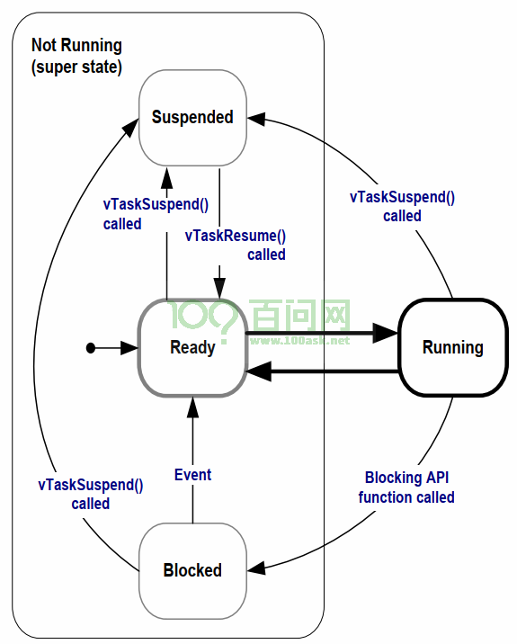

### 2.2 任务的运转过程

- 所有任务创建后都处于Ready状态；

- 处于Ready状态的任务，根据优先级，只要有机会马上进入Running状态；

- 当调用某个等待函数时，它将进入Blocked状态即阻塞状态，等待某个事件的到来，如上一节中音乐播放中添加的**vTaskDelay()函数；**

- 要进入Suspend状态，有如下方法：
  - **处于Running状态由自己调用vTaskSuspend()函数，或是处于Ready状态和Blocked状态时由其他任务调用vTaskSuspend()函数；**
  - 进入Suspend状态后，可以调用vTaskResume()函数重新回到Ready状态，然后执行前面逻辑；


## 3.项目开发

- 改工程主要在源工程的基础上进行音乐暂停和继续播放的功能；

- 复制源Project文件夹到新的文件夹下，然后打开freertos.c文件，只需要将原StartDefaultTask()函数修改即可：

  - 添加标志位，判断上一个状态是否处于Suspend状态；
  - 根据bRunning状态位，执行vTaskSuspend()和vTaskResume()函数；

  ```c
  void StartDefaultTask(void *argument)
  {
    /* USER CODE BEGIN StartDefaultTask */
    /* Infinite loop */
  	uint8_t dev, data;
  	int len;
  	int bRunning;
  	
  	TaskHandle_t xSoundTaskHandle = NULL;
  	BaseType_t ret;
  	
  	LCD_Init();
  	LCD_Clear();
  	
  	IRReceiver_Init();
  	LCD_PrintString(0, 0, "Waiting Control");
  
  	while (1)
  	{
  		/* 读取红外遥控器 */
  		if (0 == IRReceiver_Read(&dev, &data))
  		{
  			if (data == 0xa8)		// play，表示按下播放键
  			{
  				/* 创建播放音乐的任务 */
  				extern void PlayMusic(void *params);
  				if (xSoundTaskHandle == NULL)		// 只有没了任务才创建
  				{
  					LCD_ClearLine(0, 0);
  					LCD_PrintString(0, 0, "Create Task");
  					ret = xTaskCreate(PlayMusic, "SoundTask", 128, NULL, osPriorityNormal+1, &xSoundTaskHandle);
  					bRunning = 1;
  				}
  				else
  				{
  					// 要么Suspend要么Resume
  					if (bRunning)
  					{
  						LCD_ClearLine(0, 0);
  						LCD_PrintString(0, 0, "Suspend Task");
  						vTaskSuspend(xSoundTaskHandle);
  						PassiveBuzzer_Control(0);
  						bRunning = 0;
  					}
  					else
  					{
  						LCD_ClearLine(0, 0);
  						LCD_PrintString(0, 0, "Resume Task");
  						vTaskResume(xSoundTaskHandle);
  						bRunning = 1;
  					}
  				}
  			}
  		}
  		else if (data == 0xa2)		// power，表示按下电源键
  		{
  			/* 删除播放音乐的任务 */
  			if (xSoundTaskHandle != NULL)		//只有存在任务才创建
  			{
  				LCD_ClearLine(0, 0);
  				LCD_PrintString(0, 0, "Delete Task");
  				vTaskDelete(xSoundTaskHandle);
  				PassiveBuzzer_Control(0);        /* 停止蜂鸣器 */
  				xSoundTaskHandle = NULL;
  			}
  		}
  	}
    /* USER CODE END StartDefaultTask */
  }
  ```

---


# 5-5-2 任务管理与调度

## 1.任务的调度原则

- 相同优先级的任务轮流运行；

- 最高优先级的任务先运行；

- 由上面可以得出以下结论：
  - 高优先级的任务未执行完，低优先级的任务无法运行；
  - 一旦高优先级的任务就绪，马上运行；
  - 最高优先级的任务多个时，它们轮流运行；


## 2.调度的实现——链表

本小节的调度的实现以**09_Chapter9_Task_Suspend_Learning_State**工程为例进行讲解。

### 2.1 三个链表

- **打开工程的.ioc文件**

  - 打开工程的**.ioc文件**，查看FREERTOS中间件的参数配置；
  - 可以看到，在配置中**最大优先级MAX_PRIORITIES为56；**
  - 接着回到Keil中，打开**FreeRTOSConfig.h文件**，可以看到这个宏定义也为56；

  |  | 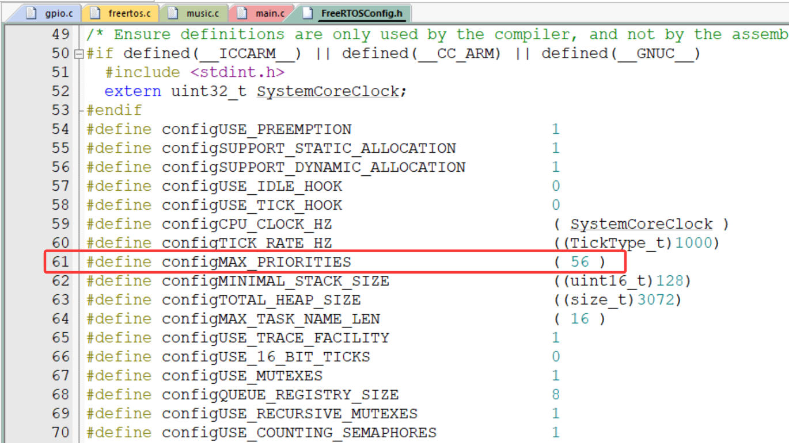 |
  | ------------------------------------------------------------ | ------------------------------------------------------------ |

- **三个链表**

  - 接着在工程中直接搜索这个宏定义**configMAX_PRIORITIES**，双击第一个结果打开**task.c文件**；
  - 可以看到这里有三个链表：
    - **pxReadyTaskLists链表**：这个链表的大小就是56，用于存放**处于就绪状态（Ready/Running）**的任务，它是一个数组；
    - **xDelayTaskList1/2链表**：它用于存放**处于阻塞态**的任务；
    - **xSuspendedTaskList链表**：它用于存放**处于挂起（暂停）状态**的任务；

  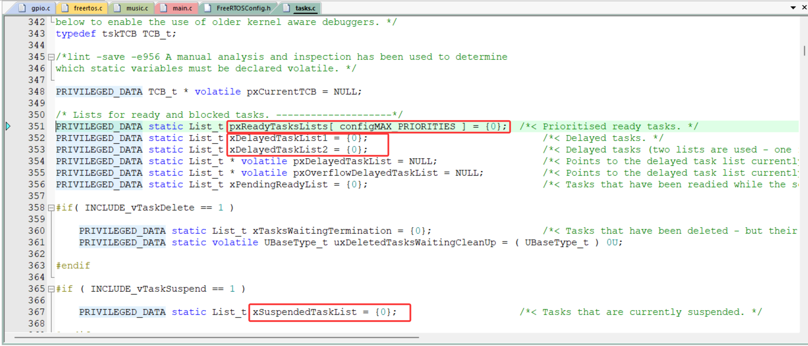

### 2.2 pxReadyTaskLists链表

- **链表的组成形式**
  - pxReadyTaskLists链表组成如下，它有**56（configMAX_PRIORITIES）个元素**，每一个元素是一个链表；
  - 每一个链表中都放着对应优先级的**处于Ready/Running状态**的任务；


- **项目的实际链表**

  - 每一个链表都是对应的**任务的TCB结构体**，只有找到了TCB结构体才能找到对应的任务；
  - 在我们前面创建的几个任务中，它们的优先级是**osPriorityNormal，对应的数值是24；**
  - 所以在**ReadyTaskLists[24]**位置会存放着它们的链表**（也就是每个任务的TCB结构体）**，整个链表的结构如下：

  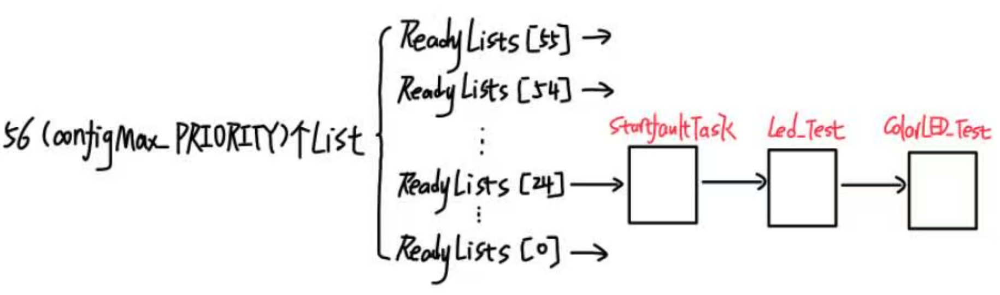

### 2.3 空闲任务

- **项目入口**

  - 整个项目的入口文件是main.c文件，文件中完成了：

    - **osKernelInitialize()**初始化内核；
    - **MX_FREERTOS_Init()**创建任务；
    - **osKernelStart()**启动内核即开启调度器；

    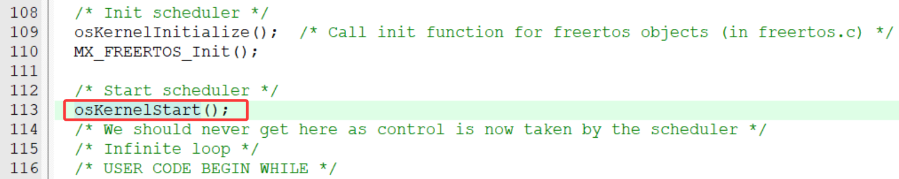

- **启动内核内部实现**
  - 跳转找到这个函数的定义，在文件cmsis_os2.c文件中：

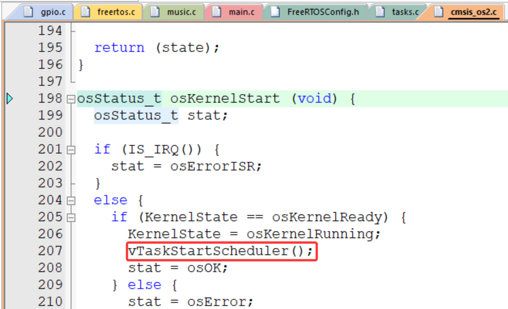

- **vTaskStartScheduler()函数**
  - 函数中调用了**vTaskStartScheduler()**函数，即启动调度器的函数；
  - 再转到这个函数的定义，在文件task.c文件中，如下图：

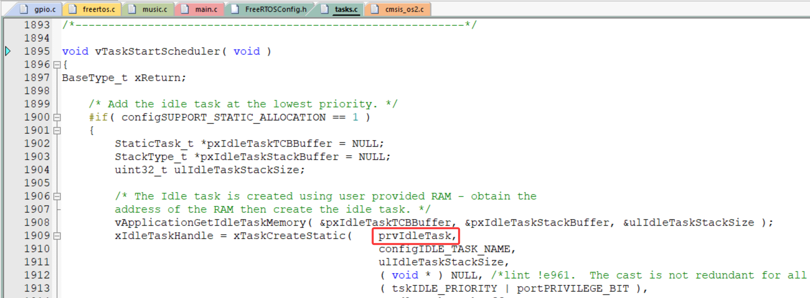

- **空闲任务**
  - 可以看到，在启动调度器时还会创建一个空闲任务，**这个任务的优先级为0；**
  - 所以整个**pxReadyTaskLists链表**的结构如下图所示： 

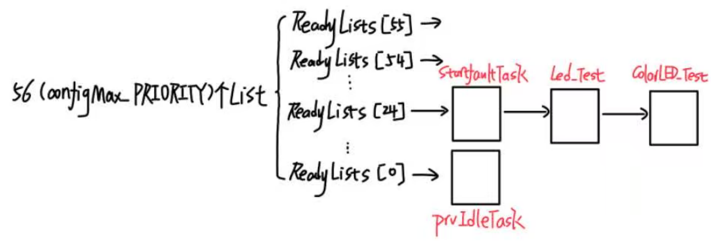


## 3.实际的任务调度过程

### 3.1 全局变量找链表

- **任务创建函数**

  - 当运行项目后，项目从main.c文件开始运行，将执行**MX_FREERTOS_Init()**函数，这个函数就在**freertos.c**文件中；
  - 这个函数实际上就是进行任务的创建，如下图所示：

  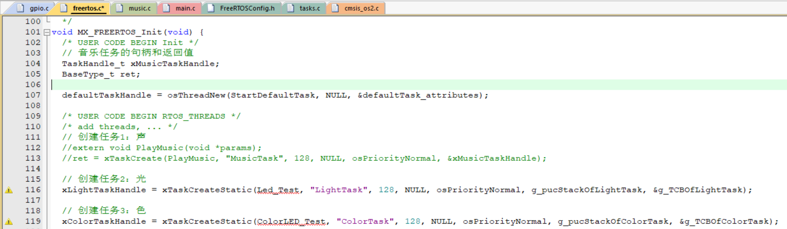 

- **xTaskCreateStatic()函数**

  - 接着跳转**xTaskCreateStatic()**函数中，这个是静态创建任务的函数，它在**task.c**文件中进行定义：

  | 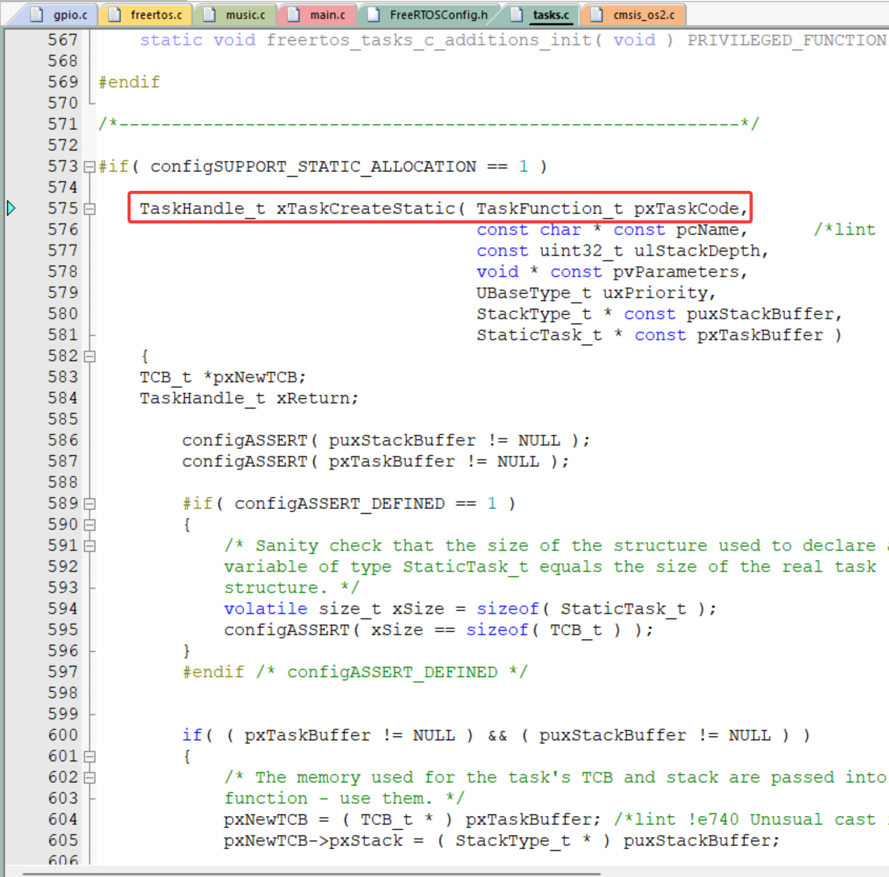 | 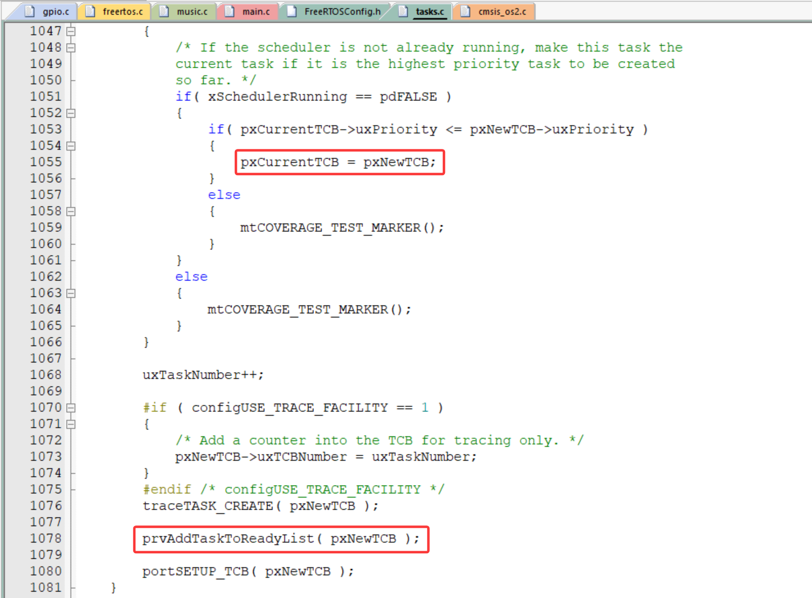 |
  | ------------------------------------------------------------ | ------------------------------------------------------------ |

- **全局指针变量**
  -  继续往下找，可以看到添加任务到ReadyList的函数**prvAddTaskToReadyList()**，且有一个全局变量**pxNewTCB**；
  - 它会根据优先级创建任务，每当我们创建一个任务时，**这个全局变量就会指向对应任务的链表；**

- **机理解释**
  - 前面的那个pxReadyTaskLists链表结构图中，创建完所有任务后，**pxNewTCB就应该指向colorLED_Test这个链表，因为空闲任务优先级比较低；**
  - 当启动调度器后，这个**全局变量指向clorLED_Test这个链表**，所以项目会先从这个任务开始运行；
  - 这也是之前的演示中为什么第三个项目先开始计数的原因；
  - 注意：上面所说的创建完所有任务指的是MX_FREERTOS_Init()函数执行完后，FreeRTOS内核才启动调度；

### 3.2 Tick中断

- 任务的切换调度是靠**Tick中断**进行的；

- 在配置工程的过程中，配置了Tick中断，如下图所示，它的频率是1000，所以**每1ms产生一次中断**；
- 也就是说，**对于同等优先级的任务，它们每1ms切换一次任务；**
- 对于每一次Tick中断，它都会完成任务的调度，整个调度的过程如右下图所示：

|  | 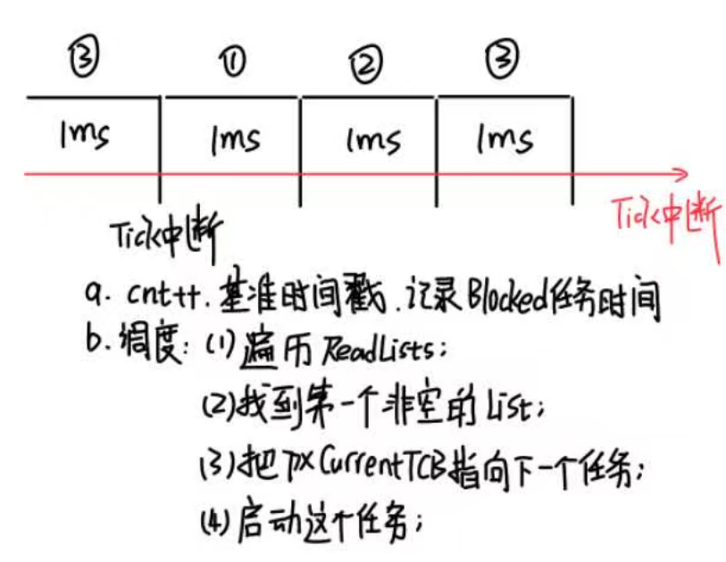 |
| ------------------------------------------------------------ | ------------------------------------------------------------ |

### 3.3 不同优先级时的调度

- **任务创建时的链表变化**

  - 在默认任务中，当我们接收到指令时，我们将创建一个**音乐播放的任务；**
  - **这个任务的优先级比前面的优先级高1（即25）**，所以它会在**ReadyList[25]**重新创建一个链表，这个链表就是音乐播放对应的链表：

  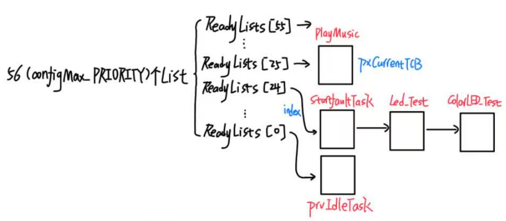

- **任务调度**
  - 由于这个任务的优先级最高，创建完后**处于Ready状态，所以它将马上进入Running状态**，无论这时其他任务有没有完成一个中断内的时间片；
  - 所以创建了任务后音乐播放任务马上运行，且由于其优先级最高，除非它主动Delay或是Suspend，否则其他任务无法运行；

### 3.4 涉及任务状态的任务调度

- **Blocked状态的切换**

  - 在这个音乐播方任务中，先进行了蜂鸣器频率的设置，然后马上调用了**vTaskDelay()函数；**
  - 这时候任务就会被放入某一个**DelayTaskList链表**中，并发起一次触发调度，这个调度和前面的中断调度功能一样；
  - 当经过**两个Tick**后（即设置前面的那个Delay就是延时两个Tick），延时时间已经到了；
  - 它就会再次发起调度，将**音乐播放任务从DelayLists链表移出来移到ReadyLists链表里面，并再次遍历ReadyLists链表**；
  - 由于音乐播放优先级最高，故又运行到音乐播放的任务；
  - 设置完频率后，它又进入Delay状态，并再次发起了触发调度；

  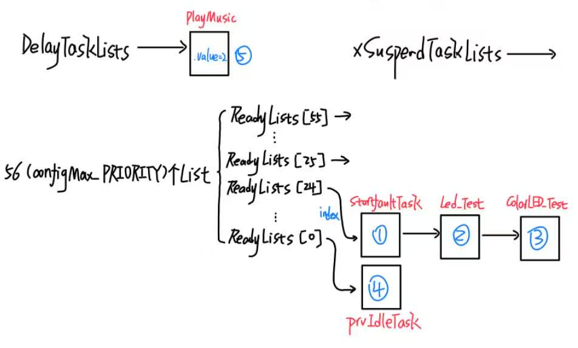

- **Suspended状态的切换**

  - 若运行到任务1时，按下了**暂停按键**，这时音乐播放的任务**将从DelayTaskLists链表里面移到SuspendTaskLists链表**中；
  - 这时候不会再进行时间等待，而是**完全暂停**，只有再次**调用Rusume()函数将其移到ReadyTaskList链表**中才可以运行；

  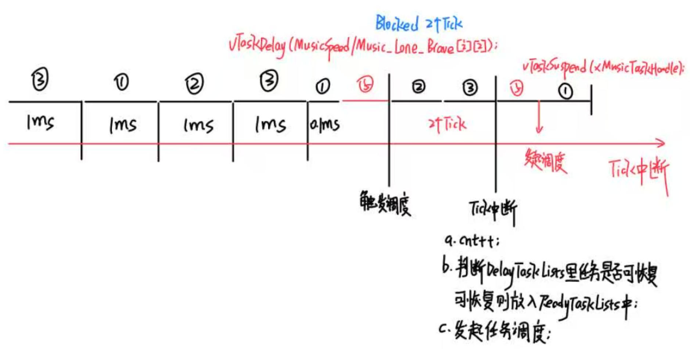

---


# 5-5-3 空闲任务

## 1.内容介绍

- 本节内容介绍上一节留下来的**空闲任务**的问题，并深入介绍**FreeRTOS中的任务函数；**
- 本节内容对应的课程资料为**9.7——空闲任务及其钩子函数；**

- 本节内容对应的工程项目为**10_Chapter9_Idle_Task**，该程序在**09_Chapter9_Task_Suspend_Learning_State**基础上修改；


## 2.任务创建的底部实现

### 2.1 接口层

- 在freertos.c文件中，通过xTaskCreate()或是xTaskCreateStatic()函数进行任务的创建；
- 这是内核提供的接口层，创建任务时给参数即可，不需要理解其底层；

### 2.2 内核层

- 接口层的xTaskCreate()和xTaskCreateStatic()是在task.c文件中实现的；
- task.c是通用内核层，即FreeRTOS系统提供的统一内核；
- 在task.c文件中，无论是实现xTaskCreate()还是xTaskCreateStatic()，其底层都会调用**prvInitialiseNewTask()函数；**
- prvInitialiseNewTask()函数负责初始化栈，该函数也是在task.c文件中实现的；

### 2.3 硬件底层

- 在task.c文件的prvInitialiseNewTask()函数实现中，它会调用底层的pxPortInitialiseStack()函数，这个函数在port.c文件中定义；
- port.c文件和硬件底层相关，所以这是一个移植层或叫硬件底层；
- 在port.c文件实现pxPortInitialiseStack()函数时，它会为每个任务都伪造一个返回地址LR，即prvTaskExitError()，这是一个错误处理函数；

```c
StackType_t *pxPortInitialiseStack( StackType_t *pxTopOfStack, TaskFunction_t pxCode, void *pvParameters )
{
	/* Simulate the stack frame as it would be created by a context switch
	interrupt. */
	pxTopOfStack--; /* Offset added to account for the way the MCU uses the stack on entry/exit of interrupts. */
	*pxTopOfStack = portINITIAL_XPSR;	/* xPSR */
	pxTopOfStack--;
	*pxTopOfStack = ( ( StackType_t ) pxCode ) & portSTART_ADDRESS_MASK;	/* PC */
	pxTopOfStack--;
	*pxTopOfStack = ( StackType_t ) prvTaskExitError;	/* LR */

	pxTopOfStack -= 5;	/* R12, R3, R2 and R1. */
	*pxTopOfStack = ( StackType_t ) pvParameters;	/* R0 */
	pxTopOfStack -= 8;	/* R11, R10, R9, R8, R7, R6, R5 and R4. */

	return pxTopOfStack;
}
```

- prvTaskExitError()函数的原型如下：

  - 先关闭所有的中断，这样Tick中断关闭无法调度任务；
  - 接着是一个死循环for( ;; )；
  - 这样，只要任务函数返回就会执行这个函数，所有任务都无法调度，只能在这死循环，系统崩溃；

  ```c
  static void prvTaskExitError( void )
  {
  	/* A function that implements a task must not exit or attempt to return to
  	its caller as there is nothing to return to.  If a task wants to exit it
  	should instead call vTaskDelete( NULL ).
  
  	Artificially force an assert() to be triggered if configASSERT() is
  	defined, then stop here so application writers can catch the error. */
  	configASSERT( uxCriticalNesting == ~0UL );
  	portDISABLE_INTERRUPTS();
  	for( ;; );
  }
  ```


## 3.任务的正确退出流程

### 3.1 任务的退出

要让函数退出但又不会让整个系统崩溃，就得让任务能够正常的退出。任务的退出有两种方法：

- **自杀**
  - vTaskDelete(NULL)；
  - 需要空闲任务进行收尸，即回收TCB和Stack等；

- **他杀**
  - vTaskDelete(handle)；
  - 由杀它的人帮它收尸，即回收TCB和Stack等；

### 3.2 任务的收尸

- 在前面提到的自杀中，自杀的任务的TCB和Stack只能由空闲任务回收；
- 但空闲任务的优先级是0，如果其他任务不主动让出CPU，那空闲任务永远无法运行；
- 如果一直自杀，一直新建，就会导致内存很快被消耗殆尽；
- 所以为了让空闲任务能够运行，要注意以下事项：
  - **事件驱动**：如按下某个按键之后再做某一件事情（后面的同步互斥操作）；
  - **延时函数不要使用死循环**：如以前自己写的Delay()；
    - 对于所有的死循环的延时函数都要改为阻塞式的“vTaskDelay()”函数，这个函数由FreeRTOS自己提供，当调用时对应的任务将处于阻塞态；
    - 需要注意的是，空闲任务永远都处于就绪态，当所有任务都处于vTaskDelay()函数的阻塞态时，就可以由调度器调用空闲任务，实现对“尸体”的清理；

### 3.3 程序的修改

- **任务2函数修改**

  - 在原来的驱动函数基础上修改如下；
  - 将原来的while死循环改为有循环次数的for循环，并将原来的死循环延时mdelay()改为阻塞态的vTaskDelay()；
  - 执行完后会返回：
    - 若最后不进行vTaskDelete(NULL)则系统崩溃；
    - 执行vTaskDelete(NULL)则能继续正常运行；

  ```c
  void Led_Test(void)
  {
  	int i;
      Led_Init();
  
      for(i = 0; i < 10; i++)
      {
          Led_Control(LED_GREEN, 1);
          //mdelay(500);
  		vTaskDelay(500);
  
          Led_Control(LED_GREEN, 0);
          //mdelay(500);
  		vTaskDelay(500);
      }
      vTaskDelete(NULL);
  }
  ```

- **任务3函数修改**

  - 在原来的驱动函数基础上修改如下；
  - 即将mdelay(1000)改为vTaskDelay(1000)；

  ```c
  void ColorLED_Test(void)
  {
      uint32_t color = 0;
  
      ColorLED_Init();
  
      while (1)
      {
          //LCD_PrintString(0, 0, "Show Color: ");
          //LCD_PrintHex(0, 2, color, 1);
          
          ColorLED_Set(color);
  
          color += 200000;
          color &= 0x00ffffff;
          //mdelay(1000);
  		vTaskDelay(1000);
      }    
  }
  ```


## 4.空闲任务的钩子函数

在FreeRTOS\Source\tasks.c中，可以看到如下代码，所以前提就是：

- 把这个宏定义为1：configUSE_IDLE_HOOK；
- 实现vApplicationIdleHook()函数；
- 在实现这个函数时，可以添加自己要打印的提示信息；

```c
#if ( configUSE_IDLE_HOOK == 1 )
{
    extern void vApplicationIdleHook( void );

    /* Call the user defined function from within the idle task.  This
                allows the application designer to add background functionality
                without the overhead of a separate task.
                NOTE: vApplicationIdleHook() MUST NOT, UNDER ANY CIRCUMSTANCES,
                CALL A FUNCTION THAT MIGHT BLOCK. */
    vApplicationIdleHook();
}
#endif /* configUSE_IDLE_HOOK */
```

---


# 5-6 两个Delay函数

## 1.内容介绍

- 在前面对音乐播放任务进行改进时，曾把**延时函数mdelay()改为vTaskDelay()函数；**
- 其中vTaskDelay()就是FreeRTOS提供的延时函数，除此之外FreeRTOS还提供了**vTaskDelayUntil()函数**；
- 本节内容对应的课程资料为**9.6——Delay函数；**
- 本节内容对应的工程程序为**11_Chapter9_TaskDelay**，它在**06_Chapter9_Create_Task_Use_Params**基础上修改；


## 2.两个Delay函数

### 2.1 API介绍

- vTaskDelay()：至少等待指定个数的Tick Interrupt才能变为就绪状态；

```c
void vTaskDelay( const TickType_t xTicksToDelay ); /* xTicksToDelay: 等待多少给Tick */
```

- vTaskDelayUntil()：等待到指定的绝对时刻，才能变为就绪态；

```c
/* pxPreviousWakeTime: 上一次被唤醒的时间
 * xTimeIncrement: 要阻塞到(pxPreviousWakeTime + xTimeIncrement)
 * 单位都是Tick Count
 */
BaseType_t xTaskDelayUntil( TickType_t * const pxPreviousWakeTime,
                            const TickType_t xTimeIncrement );
```

### 2.2 画图介绍

- 使用vTaskDelay(n)时，进入、退出vTaskDelay()的时间间隔至少是n个Tick中断；

- 使用xTaskDelayUntil(&Pre, n)时，前后两次退出xTaskDelayUntil()的时间至少是n个Tick中断；

  - 退出xTaskDelayUntil()时任务就进入的就绪状态，一般都能得到执行机会；
  - 所以可以使用xTaskDelayUntil()来让任务周期性地运行；
  - 注意使用这个函数需要调用**vTaskGetTickCount()**函数获取上一次时间；

  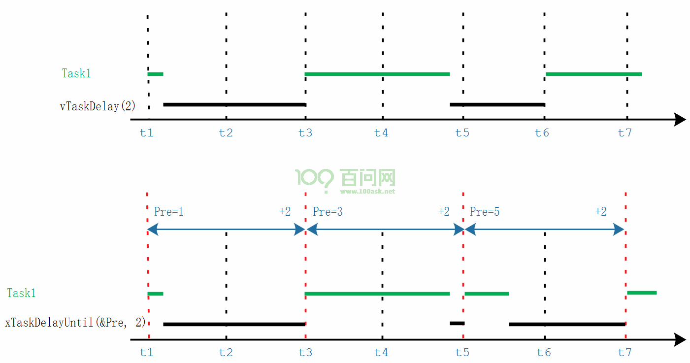


## 3.项目演示

- 在**06_Chapter9_Create_Task_Use_Params**中，创建了三个相同函数但参数不同的任务；
- 现在注释其中，两个，只保留一个，用这个任务来演示两个函数的不同；
- **注释任务2和任务3**

```c
  xTaskCreate(Lcd_PrintTask, "task1", 128, &g_Task1Info, osPriorityNormal, NULL);
  //xTaskCreate(Lcd_PrintTask, "task2", 128, &g_Task2Info, osPriorityNormal, NULL);
  //xTaskCreate(Lcd_PrintTask, "task3", 128, &g_Task3Info, osPriorityNormal, NULL);
```

- **修改任务函数**

```c
void Lcd_PrintTask(void *params)
{
	struct TaskPrintInfo *pInfo = params;
	uint32_t cnt = 0;		// 要显示的数字
	int len;				// 记录当前打印的列
	BaseType_t pretime;
	uint64_t t1, t2;
	
	/* 替换不同的Delay()函数进行测试它们的不同 */
	//pretime = xTaskGetTickCount();
	while(1)
	{
		/* 打印信息 */
		if (g_LCDCanUse)
		{
			g_LCDCanUse = 0;
			len = LCD_PrintString(pInfo->x, pInfo->y, pInfo->name);		// 先打印任务的名字，并返回打印的名字的长度
			len += LCD_PrintString(len, pInfo->y, ":");                 // 在名字后面打印：，并同时返回打印后的列的位置
			LCD_PrintSignedVal(len, pInfo->y, cnt++);		            // 在：后面打印数字
			g_LCDCanUse = 1;
			mdelay(cnt & 0x3);
		}
		
		t1 = system_get_ns();
		vTaskDelay(500);
		
		//vTaskDelayUtil(&pretime, 500);
		t2 = system_get_ns();
		
		LCD_ClearLine(pInfo->x, pInfo->y+2);
		LCD_PrintSignedVal(pInfo->x, pInfo->y+2, t2-t1);
	}
}
```

- **烧录和效果**
  - 上面版本是测试vTaskDelay()函数的格式，若要测试vTaskDelayUtil()则将pretime和vTaskDelayUtil()两行代码取消注释，并将vTaskDelay()注释；
  - 烧录代码后会发现，vTaskDelay版本的信息基本不变，vTaskDelayUtil版本的信息会跳变；

---


# 6-1 同步互斥与通信_有缺陷的同步示例

## 1.内容介绍

- 本节介绍**同步和互斥的概念**，并以一个有缺陷的同步示例来讲解FreeRTOS中同步问题该注意的问题；
- 本节内容对应的程序为**12_Chatpter10_Task_Sync_Exclusion**，它在**06_Chapter9_Create_Task_Use_Params**的基础上修改得到；
- 本节内容对应的课程资料为**10.1——同步与互斥的概念；**


## 2.同步和互斥的概念

- **同步**：即任务B等任务A做完某件事情之后才做某个动作，常用sync缩写表示；
- **互斥**：即两个任务不能同时对某一个物理实体进行访问，如LCD、串口等不能同时被访问；
- **“互斥”操作可以使用“同步”来实现；**


## 3.有缺陷的同步示例——全局变量同步

### 3.1 整体思路

- 在**06_Chapter9_Create_Task_Use_Params**中，一共有三个相同函数但不同参数的任务；
- 现在注释第三个任务，采用前面两个任务，让它们完成如下的同步操作：
  - **A任务计算一个比较大的值，B任务等待A任务计算完成后再打印计算的值和计算所消耗的时间；** 
  - 下面所有的修改都是在freertos.c文件中进行的，注意代码沙盒的位置；

### 3.2 项目开发

- **新建计算任务函数**

  - 在这个函数中，计算一个比较大的数g_sum；
  - 通过全局标志位g_clac_end实现两个任务的同步；
  - 用g_time变量来获取整个计算任务消耗的时间；

  ```c
  /* 计算结果和时间及同步标志位变量 */
  static uint64_t g_time = 0;
  static uint32_t g_sum = 0;
  static int g_calc_end = 0;
  
  /* 任务task1函数 */
  void ClacTask(void *params)
  {
  	uint32_t i = 0;
  	g_time = system_get_ns();
  	
  	for (i = 0; i < 1000000; i++)
  	{
  		g_sum += i;
  	}
  	g_calc_end = 1;
  	g_time = system_get_ns() - g_time;
  	vTaskDelete(NULL);
  }
  ```

- **修改打印任务函数**

  - 在这个任务函数中，它需要检查全局标志位来选择是否执行打印信息；
  - 在OLED中，打印出g_sum的值和计算任务所消耗的时间g_time；

  ```c
  /* 任务task2函数 */
  void Lcd_PrintTask(void *params)
  {
  	int len;
  	while(1)
  	{
  		LCD_PrintString(0, 0, "Waiting");
  		
  		while (g_calc_end == 0);
  			
  		/* 打印信息 */
  		if (g_LCDCanUse)
  		{
  			g_LCDCanUse = 0;
  			
  			LCD_ClearLine(0, 0);
  			len = LCD_PrintString(0, 0, "Sum: ");
  			LCD_PrintHex(len, 0, g_sum, 1);
  			
  			LCD_ClearLine(0, 2);
  			len = LCD_PrintString(0, 2, "Time(ms): ");
  			LCD_PrintSignedVal(len, 0, g_time/1000000);
  			
  			g_LCDCanUse = 1;
  		}
  		vTaskDelete(NULL);
  	}
  }
  ```

- **注释原来的第三个任务**

  - 注释原来的第三个任务，保留前两个；
  - 修改任务的函数，并更改参数；

  ```c
  // 使用同一个任务函数创建不同的任务
  xTaskCreate(ClacTask, "task1", 128, NULL, osPriorityNormal, NULL);
  xTaskCreate(Lcd_PrintTask, "task2", 128, &g_Task2Info, osPriorityNormal, NULL);
  //xTaskCreate(Lcd_PrintTask, "task3", 128, &g_Task3Info, osPriorityNormal, NULL);
  ```

### 3.3 bug分析

- 将上面修改的代码烧录进去后会发现，项目根本无法运行，任务2永远不可能打印信息；
- 上面的项目存在两个问题：
  - **全局变量问题**
    - g_calc_end全局变量没有加volatile关键字，编译器会对其进行优化；
    - 两个任务调度后会将内存的变量加载到寄存器中，即使任务切换了，任务读到的仍是旧的值，而不是内存中新的值；
    - 这导致任务2读到的g_calc_end永远都是0，所以不会执行下面的打印信息；
    - 解决办法是加volatile关键字，让编译器不要做优化；
  - **效率问题**
    - 在任务1进行计算时，Tick中断会调度任务，任务2即使无法执行下面的打印信息的代码，但当它参与调度时，它一直在做没有意义的循环判断；
    - 两个任务轮流运行，只有任务1在做计算，任务2纯纯浪费CPU资源，大概会浪费一般的时间；
    - 解决办法是可以先让任务2阻塞一段时间，阻塞的大概时间是前面显示的总时间的一半；

### 3.4 bug修复

- 基于上面的分析，对上面的代码修改；
- 完整的两个任务函数和全局变量的代码如下，任务创建部分不需要更改：

```c
/* 计算结果和时间及同步标志位变量 */
static uint64_t g_time = 0;
static uint32_t g_sum = 0;
static volatile int g_calc_end = 0;

/* 任务task1函数 */
void ClacTask(void *params)
{
	uint32_t i = 0;
	g_time = system_get_ns();
	
	for (i = 0; i < 1000000; i++)
	{
		g_sum += i;
	}
	g_calc_end = 1;
	g_time = system_get_ns() - g_time;
	vTaskDelete(NULL);
}

/* 任务task2函数 */
void Lcd_PrintTask(void *params)
{
	int len;
	while(1)
	{
		LCD_PrintString(0, 0, "Waiting");
		
        vTaskDelay(3000);
        
		while (g_calc_end == 0);
			
		/* 打印信息 */
		if (g_LCDCanUse)
		{
			g_LCDCanUse = 0;
			
			LCD_ClearLine(0, 0);
			len = LCD_PrintString(0, 0, "Sum: ");
			LCD_PrintHex(len, 0, g_sum, 1);
			
			LCD_ClearLine(0, 2);
			len = LCD_PrintString(0, 2, "Time(ms): ");
			LCD_PrintSignedVal(len, 0, g_time/1000000);
			
			g_LCDCanUse = 1;
		}
		vTaskDelete(NULL);
	}
}
```


## 4.总结

在用普通方法即全局变量实现FreeRTOS中的同步操作时，会存在如下两个问题：

- **系统正确性**
  - 无法保证全局变量在不同任务间的正确流转；
  - 尤其是在编译器做优化的条件下，极有可能使系统无法正常运行；
- **系统效率问题**
  - 在全局变量实现同步操作时，等待同步的任务总是在做无意义的循环判断，极大地浪费了CPU资源；
  - 在少任务前提下，可以通过提前运行查看总时间来将等待同步的任务先阻塞一段时间，但任务多起来后这种方法不现实；

---


# 6-2 同步互斥与通信_有缺陷的互斥示例

## 1.用全局变量实现互斥操作1

- 如下方代码所示，两个任务都要用同一个串口进行打印，它们之间是互斥的；
- 在下方代码中，通过全局变量的方式进行互斥操作的保护；
- 但是在任务切换中很可能在刚进入if判断后就发生了切换，所以用全局变量保护互斥操作会存在很大的偶然性；

```c
// RTOS 程序
int g_canuse = 1;

void uart_print(char *str)
{
	if (g_canuse)
	{
		g_canuse = 0;
		printf(str);
		g_canuse = 1;
	}
}

task_A()
{
	while (1)
	{
		uart_print("0123456789\n");
	}
}

task_B()
{
	while (1)
	{
		uart_print("abcdefghij");
}

}

void main()
{
	// 创建 2 个任务
	create_task(task_A);
	create_task(task_B);
	// 启动调度器
	start_scheduler();
}
```

## 2.用全局变量实现互斥操作2

- 在原来的基础上做修改，如下方代码所示；
- 但是由于“减1”这个操作在底层的汇编实现上需要三步，所以仍然可能存在冲突的风险；

```c
void uart_print(char *str)
{
    g_canuse--;				① 减一
    if( g_canuse == 0 )		② 判断
    {
        printf(str);		③ 打印
    }
    g_canuse++;				④ 加一
}
```

## 3.用全局变量实现互斥操作3

- 要解决上面的问题，可以通过关闭中断来实现；
- 但是在用关闭中断的方式实现时，会存在与同步操作相同的效率的问题；

```c
int LCD_PrintString(int x, int y, char *str) 
{
    static int bCanUse = 1;
    disable_irq();
    if (bCanUse)
    { 
        bCanUse = 0;
        enable_irq();
        /* 使用LCD */
        bCanUse = 1;
        return 0;
    }
    enable_irq();
    return -1;
}

int LCD_PrintString(int x, int y, char *str) 
{
    static int bCanUse = 1;
    disable_irq();
    bCanUse--;
    enable_irq();
    if (bCanUse == 0)
    { 
        /* 使用LCD */
        bCanUse++;
        return 0;
    }
    else
    {
        disable_irq();
        bCanUse++;
        enable_irq();
        return -1;
    }
}
```

---


# 6-3 同步互斥与通信_FreeRTOS提供的方法

## 1.问题回顾

在同步互斥与通信中需要解决两个问题：

- **正确性**：FreeRTOS通过**互斥操作**进行解决，保证数据资源的互斥访问；

- **效率性**：FreeRTOS通过**阻塞和唤醒的方式(同步操作)**解决；


## 2.FreeRTOS提供的方法

能实现同步、互斥的内核方法有：**任务通知(task notification)、队列(queue)、事件组(event group)、信号量(semaphoe)、互斥量(mutex)。**

### 2.1 方法的概述

它们都有类似的操作方法：**获取/释放、阻塞/唤醒、超时**

- 任务A获取资源，用完后任务A释放资源；
- 任务A获取不到资源则阻塞，任务B释放资源并把任务A唤醒；
- 任务A获取不到资源则阻塞，并定个闹钟；A要么超时返回，要么在这段时间内因为任务B释放资源而被唤醒；

| **内核对象** | **生产者** | **消费者** | **数据/状态**                                                | **说明**                                                     |
| ------------ | ---------- | ---------- | ------------------------------------------------------------ | ------------------------------------------------------------ |
| 队列         | ALL        | ALL        | 数据：若干个数据 谁都可以往队列里扔数据， 谁都可以从队列里读数据 | 用来传递数据， 发送者、接收者无限制， **一个数据只能唤醒一个接收者 ** |
| 事件组       | ALL        | ALL        | 多个位：或、与 谁都可以设置(生产)多个位， 谁都可以等待某个位、若干个位 | 用来传递事件， 可以是N个事件， 发送者、接受者无限制， 可以唤醒多个接收者：像广播 |
| 信号量       | ALL        | ALL        | 数量：0~n 谁都可以增加一个数量， 谁都可消耗一个数量          | 用来维持资源的个数， 生产者、消费者无限制， 1个资源只能唤醒1个接收者 |
| 任务通知     | ALL        | 只有我     | 数据、状态都可以传输， 使用任务通知时， 必须指定接受者       | N对1的关系： 发送者无限制， 接收者只能是这个任务             |
| 互斥量       | 只能A开锁  | A上锁      | 位：0、1 我上锁：1变为0， 只能由我开锁：0变为1               | 就像一个空厕所， 谁使用谁上锁， 也只能由他开锁               |

### 2.2 方法的介绍

- **队列**
  - 里面可以放任意数据，可以放多个数据；
  - 任务、ISR都可以放入数据；任务、ISR都可以从中读出数据；
- **事件组**
  - 一个事件用1bit表示，1表示事件发生了，0表示事件没发生；
  - 可以用来表示事件、事件的组合发生了，不能传递数据；
  - 有广播效果：事件或事件的组合发生了，等待它的多个任务都会被唤醒；
- **信号量**
  - 核心是"计数值"；
  - 任务、ISR释放信号量时让计数值加1；
  - 任务、ISR获得信号量时，让计数值减1；
- **任务通知**
  - 核心是任务的TCB里的数值；
  - 会被覆盖；
  - 发通知给谁？必须指定接收任务；
  - 只能由接收任务本身获取该通知；
- **互斥量**
  - 数值只有0或1；
  - 谁获得互斥量，就必须由谁释放同一个互斥量；

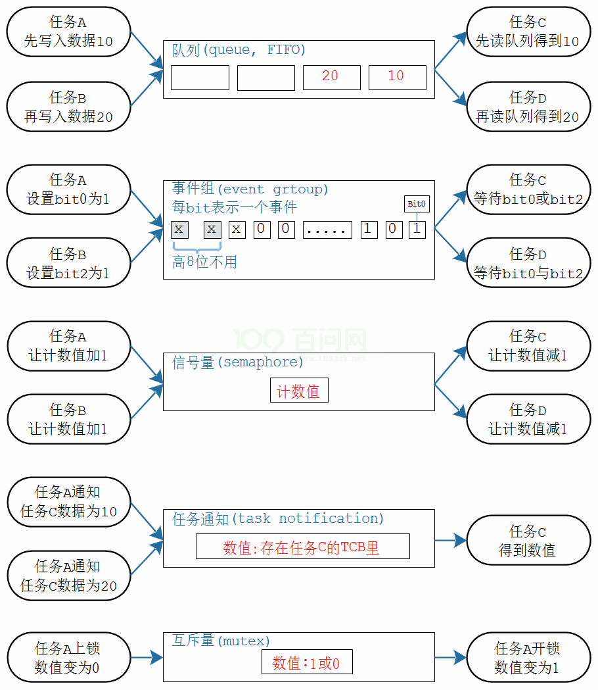

---


# 7 游戏机项目说明

## 1.NWatch项目

NWatch是一个很漂亮的、基于STM32的开源手表项目，我们的后续的软件部分都是基于这个项目的，官方链接为：

* GITHUB：https://github.com/ZakKemble/NWatch ；
* 作者博客：https://blog.zakkemble.net/diy-digital-wristwatch/；


## 2.项目移植

老师已经下载了这套代码，并且移植出了自己的版本，源码在**5.NWatch参考源码**下：

* **NWatch-master**：官方源码；
* **"DshanMCU-F103"**目录是给百问网DshanMCU-F103移植好的代码
  * **01_nwatch_game.7z**：只有打砖块的游戏，裸机程序，未优化；
  * **02_nwatch_game_freertos.7z**：只有打砖块游戏，FreeRTOS程序，优化了OLED的显示效率，把按键控制、球的控制拆分为2个任务；
  * **03_nwatch_dshanmcu-f103_all.7z**：NWatch的完全版本，裸机程序；
* **Nwatch-Stm32f103-master**：其他作者对NWatch项目的移植
  - 这是一个开源up将NWatch移植到STM32F1系列单片机的工程；
  - GITHUB：[https://github.com/Soysauce007/Nwatch-Stm32f103](https://github.com/Soysauce007/Nwatch-Stm32f103)；


## 3.课程后续

- 本课程不是要去移植完整的NWatch项目，而只是移植其中的**赛车游戏和打砖块游戏；****
- 后续的程序在**02_nwatch_game_freertos**的基础上修改；
- **后续要学习的就是基于这个项目，不断地将前面提到的FreeRTOS提供的同步互斥和通信的API加入到项目中；**


## 4.项目源码概述

- 本项目的底层本质就是不断地在OLED上绘制响应的图形；

- 在项目中的game1.c和game2.c文件中，有如下几个模块的数组：

  - 只要把这些数组通过I2C送到**OLED的显存**中，就可以把它们的图形绘制出来了；
  - 至于在实际运行中，这些图形如何变化，需要通过游戏的逻辑来实现；

  ```c
  /* 方块数组 */
  static const byte block[] ={
  	0x07,0x07,0x07,
  };
  
  /* 平台数组 */
  static const byte platform[] ={
  	0x60,0x70,0x50,0x10,0x30,0xF0,0xF0,0x30,0x10,0x50,0x70,0x60,
  };
  
  /* 球数组 */
  static const byte ballImg[] ={
  	0x03,0x03,
  };
  
  /* 清除画面 */
  static const byte clearImg[] ={
  	0,0,0,0,0,0,0,0,0,0,0,0,
  }
  
  /* 小车数组 */
  static const byte carImg[] PROGMEM ={
  	0x40,0xF8,0xEC,0x2C,0x2C,0x38,0xF0,0x10,0xD0,0x30,0xE8,0x4C,0x4C,0x9C,0xF0,
  	0x02,0x1F,0x37,0x34,0x34,0x1C,0x0F,0x08,0x0B,0x0C,0x17,0x32,0x32,0x39,0x0F,
  };
  
  /* 路数组 */
  static const byte roadMarking[] PROGMEM ={
  	0x01,0x01,0x01,0x01,0x01,0x01,0x01,0x01,
  };
  ```

- 如下图所示就是实际的画面呈现的原理

  - 整个OLED的大小是64×128，其中64是y方向，128是x方向；
  - 要绘制的某个图形，以数组的形式存在，一个元素为两位16进制，也就是8位二进制；
  - 这8位二进制按纵向即y方向排列，且是按低位在前排序，这样1个元素的显示就是16×1；
  - **对于某个图形，它的数组有n行m列，则图像在OLED上的显示大小为16·n×m；**

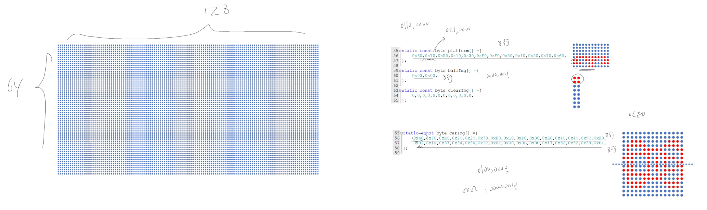

---


# 8-1-1 数据传输的方法_环形Buffer

## 1.内容介绍

- 本节内容首先介绍一下在FreeRTOS中进行数据传输的方法，其中重点讲解**环形Buffer如何传输数据；**
- 本节内容对应的课程资料为**第11章——队列；**


## 2.数据传输的主要方法

- FreeRTOS系统中，数据传输的方法有如下几种：**全局变量、环形缓冲区、队列；**
- **前面提到的信号量、互斥量、任务通知、事件组等，都只能传输标志位状态而已；**

|            | 数据个数 | 互斥措施 | 阻塞-唤醒 | 使用场景 |
| ---------- | -------- | -------- | --------- | -------- |
| 全局变量   | 1        | 无       | 无        | 一读一写 |
| 环形缓冲区 | 多个     | 无       | 无        | 一读一写 |
| 队列       | 多个     | 有       | 有        | 多读多写 |

### 2.1 全局变量

- **全局变量的特点**
  - 每个全局变量只能传送一个数据；
  - 全局变量没有互斥操作也没有阻塞-唤醒机制；
- **全局变量的问题**
  - 在前面讲解有缺陷的互斥操作和同步操作时已经演示了全局变量的问题；
  - 由于没有互斥措施，所以全局变量无法保证数据的正确性；
  - 由于没有阻塞-唤醒机制，所以全局变量的效率低下；

- **示例**

  - 如下面的示例所示，定义了一个全局结构体，还有两个任务；
  - 如果Task_A只是运行到了修改完x坐标，就切换到了Task_B，这样Task_B得到的就是错误的数据；

  ```c
  struct Position
  {
      int x;
      int y
  };
  
  struct Position g_pos;
  
  Task_A()
  {
      g_pos.x = 1;
      g_pos.y = 2;
  }
  
  Task_B()
  {
      // 访问g_pos
  }
  ```

### 2.2 环形Buffer

- **环形Buffer的介绍**
  - 环形Buffer的本质是一个**循环的数组；**
  - 环形Buffer只能适合只有**两个任务通信时的场景；**

- **正确的环形Buffer设计**

  - 下图为正确的环形Buffer设计方法，即通过下一个读的位置r和下一个写的位置w来完成对环形Buffer的互斥写和读；
  - **由于对r的修改只在读任务中进行，对w的修改只在写任务中进行，所以这样不会产生冲突；**
  - 在这里，也可能存在全局变量中那样的问题，即w/r还没完全改完就切换任务了，但是只有对应任务会修改变量，所以这没有影响，只是效率问题而已；

  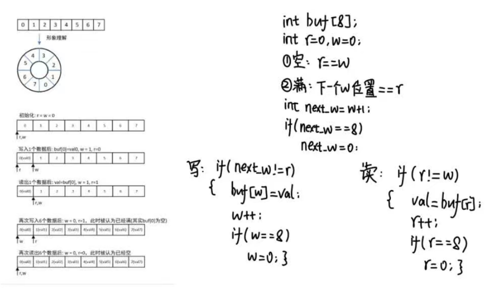

- **有问题的环形Buffer设计**

  - 在下图的环形Buffer设计中，它加多了一个指示当前所剩数据的num变量；
  - **这个变量是全局变量，且是一个读任务和写任务都会访问修改的变量，这样就又回到了一开始的全局变量的互斥访问问题上；**

  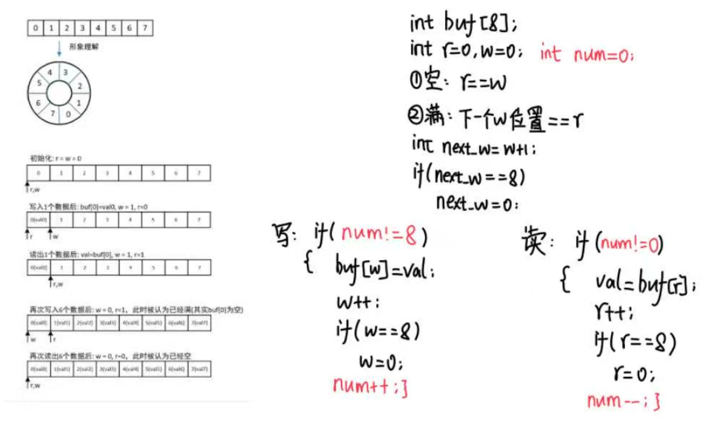

---


# 8-1-2 数据传输的方法_队列的本质

## 1.队列的概述

### 1.1 队列与环形Buffer的区别

- 队列中，**数据的读写本质就是环形缓冲区**，在这个基础上**增加了互斥措施、阻塞-唤醒机制；**
- 队列的三要素就是上一节提到的有问题的环形Buffer设计的**三个要素：w、r、num；**
- 正是由于队列中比环形Buffer多了一个num变量，所以它在设计上需要采取保护措施；
- 环形Buffer是**单生产者、单消费者的**，且在设计上就已经杜绝了变量的冲突访问，所以不需要设计互斥措施；
- 队列是**多生产者、多消费者的**，它必须考虑互斥措施解决正确性的问题以及阻塞-唤醒机制解决效率的问题；

### 1.2 队列与其他方法的联系

- 如果这个队列不传输数据，只调整"数据个数"，它就是**信号量(semaphore)；**

- 如果信号量中，限定"数据个数"最大值为1，它就是**互斥量(mutex)；**

### 1.3 梳理总结

- 队列的本质是加了**互斥措施和阻塞-唤醒机制**的环形Buffer；
- 信号量和互斥量的本质是队列，即其本质也是环形Buffer；


## 2.队列的操作

### 2.1 创建队列

- **动态分配内存**

  - **函数API原型**

  ```c
  QueueHandle_t xQueueCreate(UBaseType_t uxQueueLength, UBaseType_t uxItemSize);
  ```

  - **参数**

  | **参数**      | **说明**                                                     |
  | ------------- | ------------------------------------------------------------ |
  | uxQueueLength | 队列长度，最多能存放多少个数据(item)                         |
  | uxItemSize    | 每个数据(item)的大小：以字节为单位                           |
  | 返回值        | 非0：成功，返回句柄，以后使用句柄来操作队列 NULL：失败，因为内存不足 |

- **静态分配内存**

  - **函数API原型**

  ```c
  QueueHandle_t xQueueCreateStatic(*
                		UBaseType_t uxQueueLength,*
                		UBaseType_t uxItemSize,*
                		uint8_t *pucQueueStorageBuffer,*
                		StaticQueue_t *pxQueueBuffer*
             		 );
  ```

  - **参数**

  | **参数**              | **说明**                                                     |
  | --------------------- | ------------------------------------------------------------ |
  | uxQueueLength         | 队列长度，最多能存放多少个数据(item)                         |
  | uxItemSize            | 每个数据(item)的大小：以字节为单位                           |
  | pucQueueStorageBuffer | 如果uxItemSize非0，pucQueueStorageBuffer必须指向一个uint8_t数组， 此数组大小至少为"uxQueueLength * uxItemSize" |
  | pxQueueBuffer         | 必须执行一个StaticQueue_t结构体，用来保存队列的数据结构      |
  | 返回值                | 非0：成功，返回句柄，以后使用句柄来操作队列 NULL：失败，因为pxQueueBuffer为NULL |

### 2.2 写队列

- **函数API原型**

  - 可以把数据写到队列头部，也可以写到尾部；
  - 这些函数有两个版本：在任务中使用、在ISR中使用。函数原型如下：

  ```c
  /* 等同于xQueueSendToBack
   * 往队列尾部写入数据，如果没有空间，阻塞时间为xTicksToWait
   */
  BaseType_t xQueueSend(
                                  QueueHandle_t    xQueue,
                                  const void       *pvItemToQueue,
                                  TickType_t       xTicksToWait
                              );
  
  /* 
   * 往队列尾部写入数据，如果没有空间，阻塞时间为xTicksToWait
   */
  BaseType_t xQueueSendToBack(
                                  QueueHandle_t    xQueue,
                                  const void       *pvItemToQueue,
                                  TickType_t       xTicksToWait
                              );
  
  
  /* 
   * 往队列尾部写入数据，此函数可以在中断函数中使用，不可阻塞
   */
  BaseType_t xQueueSendToBackFromISR(
                                        QueueHandle_t xQueue,
                                        const void *pvItemToQueue,
                                        BaseType_t *pxHigherPriorityTaskWoken
                                     );
  
  /* 
   * 往队列头部写入数据，如果没有空间，阻塞时间为xTicksToWait
   */
  BaseType_t xQueueSendToFront(
                                  QueueHandle_t    xQueue,
                                  const void       *pvItemToQueue,
                                  TickType_t       xTicksToWait
                              );
  
  /* 
   * 往队列头部写入数据，此函数可以在中断函数中使用，不可阻塞
   */
  BaseType_t xQueueSendToFrontFromISR(
                                        QueueHandle_t xQueue,
                                        const void *pvItemToQueue,
                                        BaseType_t *pxHigherPriorityTaskWoken
                                     );
  ```

- **参数**

| 参数          | 说明                                                         |
| ------------- | ------------------------------------------------------------ |
| xQueue        | 队列句柄，要写哪个队列                                       |
| pvItemToQueue | 数据指针，这个数据的值会被复制进队列， 复制多大的数据？在创建队列时已经指定了数据大小 |
| xTicksToWait  | 如果队列满则无法写入新数据，可以让任务进入阻塞状态， xTicksToWait表示阻塞的最大时间(Tick Count)。 如果被设为0，无法写入数据时函数会立刻返回； 如果被设为portMAX_DELAY，则会一直阻塞直到有空间可写 |
| 返回值        | pdPASS：数据成功写入了队列 errQUEUE_FULL：写入失败，因为队列满了。 |

### 2.3 读队列

- **函数API原型**

  - 使用 **xQueueReceive()**函数读队列，读到一个数据后，队列中该数据会被移除；
  - 这个函数有两个版本：在任务中使用、在ISR中使用。函数原型如下：

  ```c
  BaseType_t xQueueReceive( QueueHandle_t xQueue,
                            void * const pvBuffer,
                            TickType_t xTicksToWait );
  
  BaseType_t xQueueReceiveFromISR(
                                      QueueHandle_t    xQueue,
                                      void             *pvBuffer,
                                      BaseType_t       *pxTaskWoken
                                  );
  ```

- **参数**

| **参数**     | **说明**                                                     |
| ------------ | ------------------------------------------------------------ |
| xQueue       | 队列句柄，要读哪个队列                                       |
| pvBuffer     | bufer指针，队列的数据会被复制到这个buffer 复制多大的数据？在创建队列时已经指定了数据大小 |
| xTicksToWait | 果队列空则无法读出数据，可以让任务进入阻塞状态， xTicksToWait表示阻塞的最大时间(Tick Count)。 如果被设为0，无法读出数据时函数会立刻返回； 如果被设为portMAX_DELAY，则会一直阻塞直到有数据可写 |
| 返回值       | pdPASS：从队列读出数据入 errQUEUE_EMPTY：读取失败，因为队列空了。 |

### 2.4 删除队列

- 删除队列的函数为 **vQueueDelete()** ；
- 只能删除使用动态方法创建的队列，它会释放内存。原型如下：

```c
void vQueueDelete( QueueHandle_t xQueue );
```

### 2.5 复位队列

- 队列刚被创建时，里面没有数据；
- 使用过程中可以调用 **xQueueReset()**把队列恢复为初始状态，此函数原型为：

```c
/*  pxQueue : 复位哪个队列;
 * 返回值: pdPASS(必定成功)
*/
BaseType_t xQueueReset(QueueHandle_t pxQueue);
```

### 2.6 查询队列

- 可以查询队列中有多少个数据、有多少空余空间。函数原型如下：

```c
/* 返回队列中可用数据的个数 */
UBaseType_t uxQueueMessagesWaiting( const QueueHandle_t xQueue );

/* 返回队列中可用空间的个数 */
UBaseType_t uxQueueSpacesAvailable( const QueueHandle_t xQueue );
```

### 2.7 覆盖/偷看队列

- **覆盖队列**

  - 当队列长度为1时，可以使用 **xQueueOverwrite()** 或 **xQueueOverwriteFromISR()**来覆盖数据；
  - 注意，队列长度必须为1；当队列满时，这些函数会覆盖里面的数据，这也意味着这些函数不会被阻塞；
  - 函数原型如下：

  ```c
  /* 覆盖队列
   * xQueue: 写哪个队列
   * pvItemToQueue: 数据地址
   * 返回值: pdTRUE表示成功, pdFALSE表示失败
   */
  BaseType_t xQueueOverwrite(
                             QueueHandle_t xQueue,
                             const void * pvItemToQueue
                        );
  
  BaseType_t xQueueOverwriteFromISR(
                             QueueHandle_t xQueue,
                             const void * pvItemToQueue,
                             BaseType_t *pxHigherPriorityTaskWoken
                        );
  ```

- **偷看队列**

  - 如果想让队列中的数据供多方读取，也就是说读取时不要移除数据，要留给后来人；
  - 那么可以使用"窥视"，也就是**xQueuePeek()或xQueuePeekFromISR()**，这些函数会从队列中复制出数据，但是不移除数据；
  - 这也意味着如果队列中没有数据，那么"偷看"时会导致阻塞；一旦队列中有数据，以后每次"偷看"都会成功；
  - 函数原型如下：

  ```c
  /* 偷看队列
   * xQueue: 偷看哪个队列
   * pvItemToQueue: 数据地址, 用来保存复制出来的数据
   * xTicksToWait: 没有数据的话阻塞一会
   * 返回值: pdTRUE表示成功, pdFALSE表示失败
   */
  BaseType_t xQueuePeek(
                            QueueHandle_t xQueue,
                            void * const pvBuffer,
                            TickType_t xTicksToWait
                        );
  
  BaseType_t xQueuePeekFromISR(
                                   QueueHandle_t xQueue,
                                   void *pvBuffer,
                               );
  ```


## 3.队列通信的流程

### 3.1 队列的两个链表

可以从两个角度去看队列如何传输数据：

- **从接收者角度**
  - ①它需要读队列，但是一直没有产品的话，它就设一个“闹钟”即超时，此时它将进入Blocked状态，即阻塞态；
  - ②若某时刻A放入产品并敲敲流水线唤醒B，B将重新开始读队列，进入就绪态；
  - ③若A一直不放入产品，B将由Tick中断唤醒；

- **从发送者角度**
  - ①它需要写队列，但是可能队列是满的，它将进入阻塞态；
  - ②若某时刻B取走产品，并敲敲流水线唤醒A，A将重新进入就绪态；
  - ③若B一直都没有取走产品，那A将由Tick中断唤醒；

- **两个链表**
  - 在上面所提到的“敲敲”流水线是由链表实现的，分别有一个链表指向发送者、一个链表指向接收者；
  - **所以队列包括：①环形Buffer；②链表：Sender List、Receiver List；**

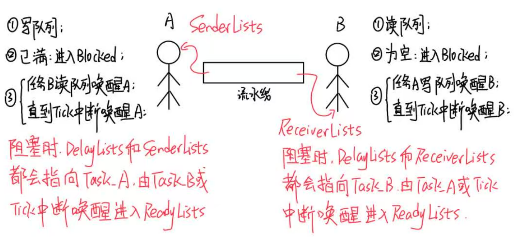

### 3.2 实际工程中任务的变化

在上面的流程中，两个任务的状态的变化如下：

- 对于Task_B，一创建将处于**Ready状态**，所以它会存在于**ReadyList链表**中；
- 当它开始接收数据但一直没有数据，它将进入**阻塞态**，**Queue.rece_List和DelayedList链表**将指向Task_B；
- **任务唤醒**：若任务A开始传输数据，写入队列，同时从**Queue.rece_List链**表取出第一个任务唤醒，这样Task_B又进入就绪态**ReadyList链表**，并运行；
- **中断唤醒**：若任务A一直没有写入队列，直至Tick中断达到设定的超时时间，**Tick中断将从两个链表中将Task_B任务移到ReadyList链表中**，实现唤醒；

---


# 8-2-1 队列实验_多设备玩游戏(思路)

## 1.项目工程结构

### 1.1 项目内容说明

- 后续的工程都基于工程`02_nwatch_game_freertos`进行改进；
- 打开`5.NWatch参考源码\DshanMCU-F103`，解压缩下面的`02_nwatch_game_freertos`；
- 本节工程的项目为`13_Chapter11_Queue_Game`，只需新建一个这样的文件夹，然后将`02_nwatch_game_freertos`复制到文件夹下即可；

### 1.2 项目结构剖析

- **两个任务**

  - MX_FREERTOS_Init()函数只基于**game1_task()函数**创建了一个任务：**GameTask**；

  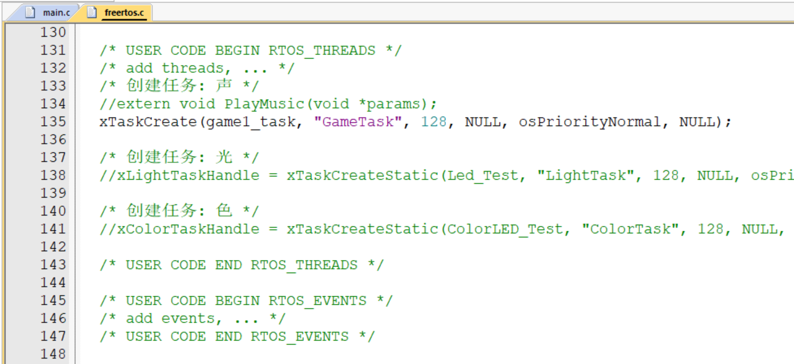

  - **主要的两个任务**
    - 进入game1_task()函数，可以看到函数内部基于**platform_task()函数**创建了挡球板的任务**platform_task**；
    - while(1)循环是**game1_task()函数**的逻辑，负责球的位置的更新，主要包括了是否碰墙、是否碰挡球板、是否碰砖块等，这是基于游戏规则变化的；
    - 后续主要的改进就是针对任务**platform_task**，因为它涉及了外部控制设备如何控制挡球板；

  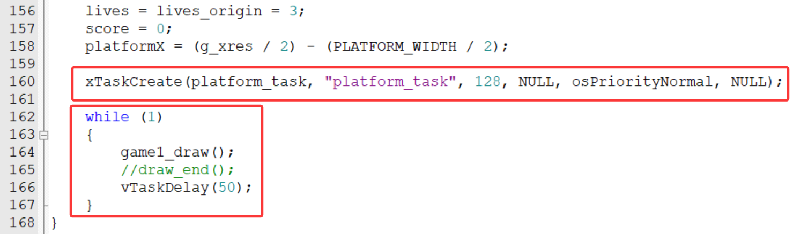

- **挡球板任务**

  - 进入platform_task()函数中，可以看到它内部就是一个死循环，不断的读取红外遥控器的值，来控制左右移动挡球板；

  ```c
  /* 挡球板任务 */
  static void platform_task(void *params)
  {
      /* ... */
      while (1)
      {
          /* 读取红外遥控器 */
  		if (0 == IRReceiver_Read(&dev, &data))
  		{
              if (data == 0x00)
              {
                  data = last_data;
              }
          }
      }
      /* ... */
  }
  ```

  - 查看IRReceeiver_Read()函数，它的内部是去**读一个环形缓冲区；**

  ```c
  int IRReceiver_Read(uint8_t *pDev, uint8_t *pData)
  {
      if (isKeysBufEmpty())
          return -1;
      
      *pDev  = GetKeyFromBuf();
      *pData = GetKeyFromBuf();
      return 0;
  }
  ```

  - 上面的环形Buffer由红外中断函数在解析数据后写入；

  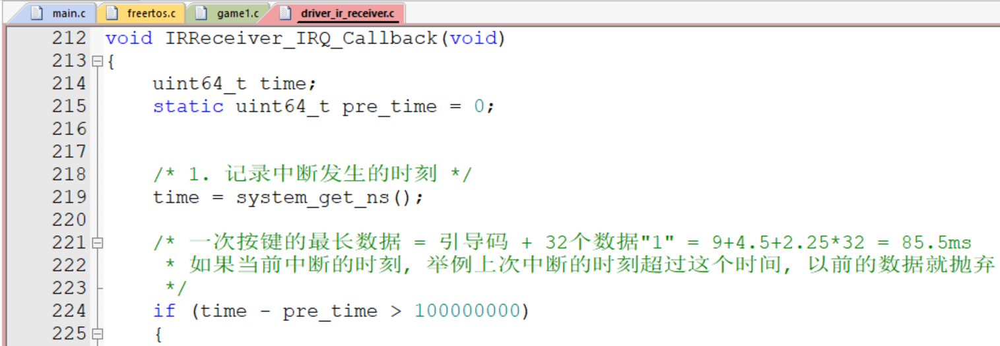

- **项目结构总结**
  - 缓冲区是没有阻塞的，效率是低下的，只要while(1)成立就一直读取红外遥控器的键值；
  - 我们要做的就是改进这个程序，**把读写环形缓冲器改为读写队列；**


## 2.项目工程改进

- **红外改造**
  - 让**红外接收函数**去读队列而不是读环形缓冲区；
  - 让**中断服务函数**写队列而不是写环形缓冲区；

- **多设备问题**
  - 对于红外遥控器而言，它发送一个键值最长需要85ms，这对于游戏是很慢的，只有在连续按着某个键使其发重复码才能较快；
  - 所以希望用增加另外一个设备来实现——旋转编码器；

- **旋转编码器改造**

  - 旋转编码器的内部实现也是通过**中断服务函数**来实现解码的；
  - 但是对于旋转编码器，除了中断的个数外，它的速度也是很重要的，速度的处理较为麻烦，如果在中断中进行解析就会导致中断时间过长；
  - 所以选择将这个速度的解码放到任务中去做；
  - 先让**中断服务函数**写一个队列B，然后再**通过任务去读队列B并解读它的数据，写入到队列A中**，这样就实现了多设备玩游戏；
  - 需要注意，在任务中写队列和在中断中写队列的函数是不一样的；

- **整体框架图**

  - 整体改进后的项目结构图如下图所示：

  /改进后的项目结构.png)

---


# 8-2-2 队列实验_多设备玩游戏(红外改造)

本节内容完成上节课程介绍的红外遥控器的框架改造。

## 1.创建队列

### 1.1 新建结构体变量

- 在新建队列之前，需要先给遥控器的数据新建一个结构体变量，这是由课程的红外驱动决定的；
- 在nwatch/game1.c/typedefs.h文件里面定义结构体变量：

```c
struct input_data {
	uint32_t dev;
	uint32_t val;
};
```

### 1.2 创建队列

- 在gaim1.c文件的game1_task()函数中创建队列，完整代码如下所示

```c
/* 挡球板队列 */
QueueHandle_t g_xQueuePlatform;

/* 游戏任务 */
void game1_task(void *params)
{		
    uint8_t dev, data, last_data;
    
    g_framebuffer = LCD_GetFrameBuffer(&g_xres, &g_yres, &g_bpp);
    draw_init();
    draw_end();
    
	/* 创建队列:平台任务从里面读到设备控制数据 */
	g_xQueuePlatform = xQueueCreate(10, sizeof(struct input_data));
	
	uptMove = UPT_MOVE_NONE;

	ball.x = g_xres / 2;
	ball.y = g_yres - 10;
        
	ball.velX = -0.5;
	ball.velY = -0.6;
//	ball.velX = -1;
//	ball.velY = -1.1;

	blocks = pvPortMalloc(BLOCK_COUNT);
    memset(blocks, 0, BLOCK_COUNT);
	
	lives = lives_origin = 3;
	score = 0;
	platformX = (g_xres / 2) - (PLATFORM_WIDTH / 2);

    xTaskCreate(platform_task, "platform_task", 128, NULL, osPriorityNormal, NULL);

    while (1)
    {
        game1_draw();
        //draw_end();
        vTaskDelay(50);
    }
}
```


## 2.写队列

- 接下来需要在中断函数中将解析出来的数据写入队列中；
- 打开driver_ir_receiver.c驱动文件，

```c
#include "FreeRTOS.h"
#include "queue.h"
#include "typedefs.h"

extern QueueHandle_t g_xQueuePlatform;		/* 挡球板队列 */

static int IRReceiver_IRQTimes_Parse(void)
{
    // ...
	//PutKeyToBuf(datas[0]);
	//PutKeyToBuf(datas[2]);
	
    /* 写入队列 */
	idata.dev = datas[0];
	idata.val = datas[2];
	xQueueSendToBackFromISR(g_xQueuePlatform, &idata, NULL);
    return 0;
}

void IRReceiver_IRQ_Callback(void)
{
	// ...

	/* 3. 次数达标后, 解析数据, 放入buffer */
	if (g_IRReceiverIRQ_Cnt == 4)
	{
		/* 是否重复码 */
		if (isRepeatedKey())
		{
			/* device: 0, val: 0, 表示重复码 */
			//PutKeyToBuf(0);
			//PutKeyToBuf(0);
			/* 改为写队列 */
			idata.dev = 0;
			idata.val = 0;
			xQueueSendToBackFromISR(g_xQueuePlatform, &idata, NULL);
			
			g_IRReceiverIRQ_Cnt = 0;
		}
	}
    // ...
}
```


## 3.读队列

- 接下来需要在在挡球板任务中读取队列，完整代码如下：

```c
/* 挡球板任务 */
static void platform_task(void *params)
{
    byte platformXtmp = platformX;    
    uint8_t dev, data, last_data;
	
	struct input_data idata;		// 新增

    // Draw platform
    draw_bitmap(platformXtmp, g_yres - 8, platform, 12, 8, NOINVERT, 0);
    draw_flushArea(platformXtmp, g_yres - 8, 12, 8);
    
    while (1)
    {
        /* 读取红外遥控器 */
		// if (0 == IRReceiver_Read(&dev, &data))
		if (pdPASS == xQueueReceive(&g_xQueuePlatform, &idata, portMAX_DELAY))		// 将原先的判断环形Buffer改为判断队列
		{
			data = idata.val;			// input_data结构体中的成员是val，为兼容源代码，直接赋值
            if (data == 0x00)
            {
                data = last_data;
            }
			/ ... /
            
		}
```


## 4.编译烧录

- 在完成上述任务改造后，可直接编译烧录，就可以用遥控器控制挡球板了；
- 如果要同时运行音乐任务的话，可在freertos.c文件中，创建一个音乐播放的任务；

---


# 8-2-3 队列实验_多设备玩游戏(旋转编码器)

## 1.内容介绍

- 本节课程要完成的是8-2-1中提到的旋转编码器的程序框架；

- 本节课程的项目在`13_Chapter11_Queue_Game`的基础上改造出`14_Chapter11_Queue_Game_Multi_Input`；

- 程序框架说明
  - 这里最大的区别是中断不直接给队列A写数据，而是先写队列B，然后任务处理后再写入队列A；
  - 这是因为我们假设了写入队列A的数据需要经过长时间的处理；
  - 即便可能实际上并不需要长时间，但是为了学习新技能，我们假设它需要长时间，并采取这种方式来写入队列A；


## 2.创建旋转编码器队列B

- 采用静态创建的方法，创建的过程如下：
  - 首先定义一个旋转编码器的结构体存放数据，同样在typedefs.h文件中定义；
  - 然后在game1.c文件的game1_task()函数中创建队列；
  - 采用静态创建队列的方法，需要限定旋转编码器的环形Buffer和句柄和结构体；

- **game1.c文件的修改如下**

```c
/* 旋转编码器队列 */
QueueHandle_t g_xQueueRotary;

/* 旋转编码器的队列Buffer和队列结构体 */
static uint8_t g_ucQueueRotaryBuf[10 * sizeof(struct rotary_data)];
static StaticQueue_t g_xQueueRotaryStaticStructure;

/* 游戏任务 */
void game1_task(void *params)
{
	// ...
    
	/* 创建队列，创建旋转编码器的任务 */
	g_xQueuePlatform = xQueueCreate(10, sizeof(struct input_data));
	
	g_xQueueRotary = xQueueCreateStatic(10, sizeof(struct rotary_data), 
										g_ucQueueRotaryBuf, &g_xQueueRotaryStaticStructure);
	
	// ...
}
```

- **typedefs.h文件的修改如下**

```c
/* 旋转编码器数据结构体 */
struct rotary_data {
	int32_t cnt;
	int32_t speed;
};
```


## 3.中断服务函数写入队列B

- 定义一个结构体变量，然后将前面运算的数据写入这个结构体变量中，并将这个结构体写入前面创建的队列中：

```c
#include "FreeRTOS.h"
#include "queue.h"
#include "typedefs.h"

extern QueueHandle_t g_xQueueRotary;

void RotaryEncoder_IRQ_Callback(void)
{
	// ...
    struct rotary_data rdata;
    
	/* 写队列 */
    rdata.cnt = g_count;
	rdata.speed = g_speed;
	xQueueSendFromISR(g_xQueueRotary, &rdata, NULL);
}
```

 

## 4.数据处理任务写入队列A

- 首先创建一个数据处理任务；
- 然后把一个实际做数据处理的函数传进去作为任务函数；
- 这个任务函数读取队列B，处理数据后再写入队列A；

```c
/* 旋转编码器数据处理任务 */
static void RotaryEncoderTask(void *params)
{
	struct rotary_data rdata;
	struct input_data idata;
	
	int left;
	int i,cnt;
	
	while(1)
	{
		/* 读旋转编码器队列 */
		xQueueReceive(&g_xQueueRotary, &rdata, portMAX_DELAY);
		
		/* 处理数据 */
		/* 判度速度:负数表示向左，正数表示向右 */
		if (rdata.speed < 0)
		{
			left = 1;
			rdata.speed = 0 - rdata.speed;
		}
		else
		{
			left = 0;
		}
		
		if (rdata.speed > 100)
			cnt = 4;
		else if (rdata.speed > 50)
			cnt = 2;
		else
			cnt = 1;
		
		/* 写挡球板队列 */
		idata.dev = 1;
		idata.val = left ? 0xe0 : 0x90;		// 由于队列A是红外遥控器式数据，所以这里的数据和红外数据耦合起来了
		for (i = 0; i < cnt; i ++)
		{
			xQueueSend(g_xQueuePlatform, &idata, 0);
		}
	}
}

/* 游戏任务 */
void game1_task(void *params)
{
    // ...
    
	/* 创建队列 */
	g_xQueuePlatform = xQueueCreate(10, sizeof(struct input_data));
	
	g_xQueueRotary = xQueueCreateStatic(10, sizeof(struct rotary_data), 
										g_ucQueueRotaryBuf, &g_xQueueRotaryStaticStructure);
	
	/* 创建旋转编码器数据处理任务 */
	xTaskCreate(RotaryEncoderTask, "RotaryEncoderTask", 128, NULL, osPriorityNormal, NULL);
	
	// ...
} 
```


## 5.程序解耦_改造当前挡球板的数据格式

### 5.1 耦合性讲解

- 在前面写入挡球板队列时，需要判断左右将**idata.val**属性改造成红外接收器的数据格式；
- 这样导致任务间的耦合性过强，下面对队列A进行改造，解耦程序；

### 5.2 解耦改造

- **应用层的方向设定**

  - 在应用层game1.c文件中，我们定义的左右的数据如下面所示；
  - **想要把红外和旋转编码器解耦，其实就是让它们两个在底层将数据先转化成应用层类型再写入队列A，当然队列A的val值也要改成这样；**
  - 先将这三句代码复制到typedefs.h文件中；

  ```c
  #define UPT_MOVE_NONE	0
  #define UPT_MOVE_RIGHT	1
  #define UPT_MOVE_LEFT	2
  ```

- **红外改造**

  - 在数据解析函数中，根据红外的键码，更改写入队列的数据；
  - 除了数据解析，红外发送还有**重复码需要解决；**
  - 完整修改的代码如下：

  ```c
  /* 解决红外的重复码问题 */
  static uint32_t g_last_val;
  
  static int IRReceiver_IRQTimes_Parse(void)
  {
  	// ...
      
  	//PutKeyToBuf(datas[0]);
  	//PutKeyToBuf(datas[2]);
  	
  	/* 改为写队列 */
  	idata.dev = datas[0];
  	
  	if (datas[2] == 0xe0)
  		idata.val = UPT_MOVE_LEFT;
  	else if (datas[2] == 0x90)
  		idata.val = UPT_MOVE_RIGHT;
  	else
  		idata.val = UPT_MOVE_NONE;
      
  	g_last_val = idata.val;		// 修改
      
  	idata.val = datas[2];
  	xQueueSendToBackFromISR(g_xQueuePlatform, &idata, NULL);
      return 0;
  }
  
  void IRReceiver_IRQ_Callback(void)
  {
  	// ...
      
  	if (g_IRReceiverIRQ_Cnt == 4)
  	{
  		/* 是否重复码 */
  		if (isRepeatedKey())
  		{
  			/* device: 0, val: 0, 表示重复码 */
  			//PutKeyToBuf(0);
  			//PutKeyToBuf(0);
  			
  			/* 改为写队列 */
  			idata.dev = 0;
  			idata.val = g_last_val;			// 修改
  			xQueueSendToBackFromISR(g_xQueuePlatform, &idata, NULL);
  			
  			g_IRReceiverIRQ_Cnt = 0;
  		}
  	}
  	// ...
  }
  ```

- **旋转编码器改造**

  - 将前面数据处理函数的最后改为一样的数据格式：

  ```c
  static void RotaryEncoderTask(void *params)
  {
  		// ...	
      
  		/* 写挡球板队列 */
  		idata.dev = 1;
  		idata.val = left ? UPT_MOVE_LEFT : UPT_MOVE_RIGHT;
  		for (i = 0; i < cnt; i ++)
  		{
  			xQueueSend(g_xQueuePlatform, &idata, 0);
  		}
  }
  ```

- **挡球板任务改造**

  - 先前的挡球板任务也是和红外数据直接耦合的，因为先前的队列A的数据和红外耦合；
  - 这里直接读取队列A的新的数据，将其复制给uptMove变量即可：

  ```c
  /* 挡球板任务 */
  static void platform_task(void *params)
  {
      // ...
      
      while (1)
      {
          /* 读取红外遥控器 */
  		// if (0 == IRReceiver_Read(&dev, &data))
  		if (pdPASS == xQueueReceive(&g_xQueuePlatform, &idata, portMAX_DELAY))	/* 读取队列 */
  		{
  			uptMove = idata.val;
  			
              // Hide platform
              draw_bitmap(platformXtmp, g_yres - 8, clearImg, 12, 8, NOINVERT, 0);
              draw_flushArea(platformXtmp, g_yres - 8, 12, 8);
              
              // Move platform
              if(uptMove == UPT_MOVE_RIGHT)
                  platformXtmp += 3;
              else if(uptMove == UPT_MOVE_LEFT)
                  platformXtmp -= 3;
              uptMove = UPT_MOVE_NONE;
              
              // Make sure platform stays on screen
              if(platformXtmp > 250)
                  platformXtmp = 0;
              else if(platformXtmp > g_xres - PLATFORM_WIDTH)
                  platformXtmp = g_xres - PLATFORM_WIDTH;
              
              // Draw platform
              draw_bitmap(platformXtmp, g_yres - 8, platform, 12, 8, NOINVERT, 0);
              draw_flushArea(platformXtmp, g_yres - 8, 12, 8);
              
              platformX = platformXtmp;
  		}
      }
  }
  
  ```


## 6.总结

- 将上面的程序编译烧录，就可以同时用旋转编码器和红外遥控器同时控制挡球板的移动了；
- 这两节课的主要目的就是学会如何利用队列来传递数据，解决环形Buffer的低效率的问题；

---


# 8-2-4 勘误_解决旋转编码器不好用的问题

- 前面的程序中，旋转编码器不是很好用，可以更改驱动代码中回调函数的两个地方；
- 将上一节课的程序复制，并重命名为`14_Chapter11_Queue_Game_Multi_Input_Better；`
- 完整代码如下：

```c
void RotaryEncoder_IRQ_Callback(void)
{
	// ...
    
    //mdelay(2);
	if (time - pre_time < 2000000)	// 修改
	{
		pre_time = time;
		return;
	}
    if (!RotaryEncoder_Get_S1())
        return;

    /* S1上升沿触发中断
     * S2为0表示逆时针转, 为1表示顺时针转
     */
    g_speed = (uint64_t)1000000000/(time - pre_time);
	
	if (g_speed == 0)		// 修改
		g_speed = 1;
	
	// ...
}
```

---


# 8-3-1 队列集实验_改进程序框架(思路)

## 1.程序框架综述

### 1.1 驱动层与业务层的耦合问题

下图即为上一节的程序框架：

- **对于红外接收而言**
  - 在中断服务函数中，先判断了接收到的键值（硬件数据），然后将键值转换成游戏业务的控制（软件数据），这样和游戏业务密切相关了；
  - 如果后续不再开发游戏了，而是开发电视机，就需要重新修改代码，这样的耦合性太强了；
- **对于旋转编码器而言**
  - 它的中断服务函数只是产生硬件数据，这个数据与游戏业务无关；
  - 游戏业务的数据是由旋转编码器的任务函数处理的，再写入挡球板队列中，这种程序框架是低耦合的；
- 在正常是开发中，一般都会采用旋转编码器的架构，而不是外红接收的框架；

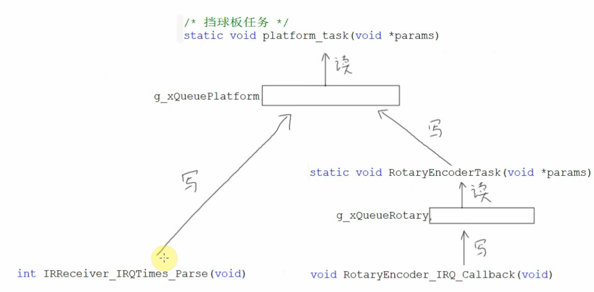

### 1.2 多任务的空间浪费问题

- 但采用旋转编码器的架构也存在一定的弊端；
- 如果有多个设备，每一个设备都通过这种方式来写数据，因为创建任务都是需要分配栈的，会极度的消耗内存；

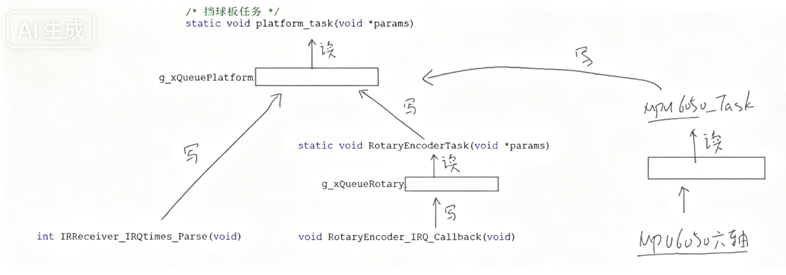

### 1.3 改进的程序框架

- 可以采用如下的程序框架；
- **框架好处：**
  - 即使有多个设备，它们分别通过自己的中断服务函数来写入硬件数据到队列中；
  - 而顶层只是有一个任务进行读取他们的队列，这样就可以节省资源了；
  - 这个任务及时读取它们三者的队列有两种方式：**轮询方式、队列集方式；**

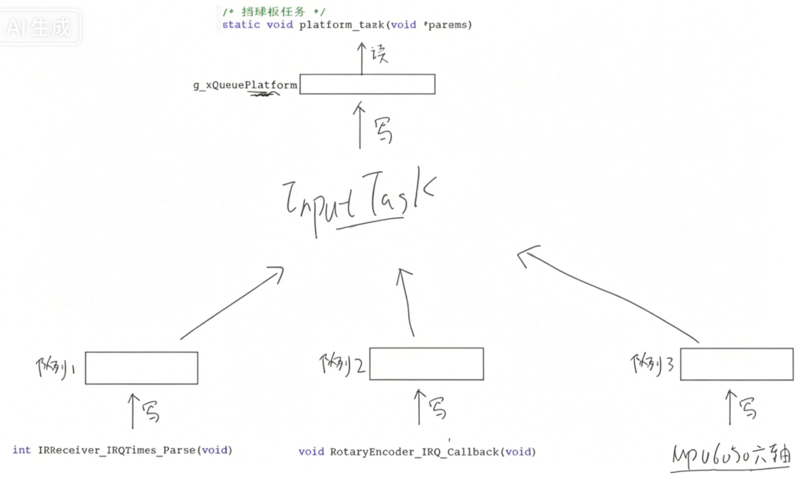


## 2.两种读取队列的方式

### 2.1 轮询方式

- 在while(1)循环中，不断的去轮询三个队列，当某一个队列有数据时就读取并进行数据的处理；
- 如果没有数据就必须得跳出，也就是说它的等待时间必须为0，否则的话其他队列的数据就可能会错过；
- 也就是说，三个队列的读取都是处于不断读取的状态的，无法实现阻塞的功能；
- 这将导致无论某个队列是否有数据它都得去读它，这将导致极大的CPU资源的浪费；

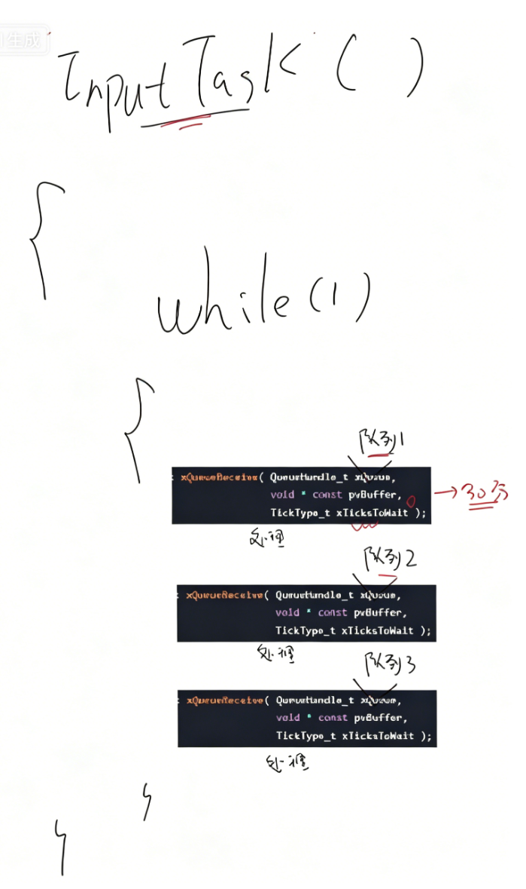

### 2.2 队列集方式

- 创建队列A、B，创建队列集S，并将队列A、B加入队列集S中；
- 当调用函数每写入一个数据到队列A或队列B时，函数内容会判断队列是否属于某个队列集，若属于会将队列A或队列B的句柄写入到队列集S中；
- 但需要注意的是S中的两个句柄A是相同的，都是队列A的句柄；
- 当上层任务调用函数读取队列集S的数据时，将得到一个句柄，然后顺着句柄就可以读到数据了，每读一个数据这个数据就会被删除；
- 这样，下次再读到队列A的句柄就可以读下一个数据了，句柄的本质就是一个指向队列的地址；

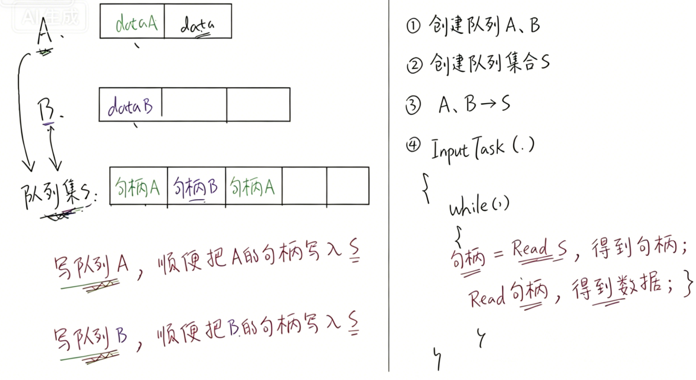


## 3.队列集相关API

### 3.1 创建队列集

- 函数原型

```c
QueueSetHandle_t xQueueCreateSet( const UBaseType_t uxEventQueueLength )
```

- 参数

| **参数**      | **说明**                                                     |
| ------------- | ------------------------------------------------------------ |
| uxQueueLength | 队列集长度，最多能存放多少个数据(队列句柄)                   |
| 返回值        | 非0：成功，返回句柄，以后使用句柄来操作队列NULL：失败，因为内存不足 |

### 3.2 把队列加入队列集

- 函数原型

```c
BaseType_t xQueueAddToSet(QueueSetMemberHandle_t xQueueOrSemaphore, QueueSetHandle_t xQueueSet);
```

- 参数

| **参数**          | **说明**                       |
| ----------------- | ------------------------------ |
| xQueueOrSemaphore | 队列句柄，这个队列要加入队列集 |
| xQueueSet         | 队列集句柄                     |
| 返回值            | pdTRUE：成功pdFALSE：失败      |

### 3.3 读取队列集

- 函数原型

```c
QueueSetMemberHandle_t xQueueSelectFromSet(QueueSetHandle_t xQueueSet, TickType_t const xTicksToWait);
```

- 参数

| **参数**     | **说明**                                                     |
| ------------ | ------------------------------------------------------------ |
| xQueueSet    | 队列集句柄                                                   |
| xTicksToWait | 如果队列集空则无法读出数据，可以让任务进入阻塞状态，xTicksToWait表示阻塞的最大时间(Tick Count)。如果被设为0，无法读出数据时函数会立刻返回；如果被设为portMAX_DELAY，则会一直阻塞直到有数据可写 |
| 返回值       | NULL：失败，队列句柄：成功                                   |


## 4.最终的程序框架

- 根据上面的队列集的思想，最终的程序框架如下：

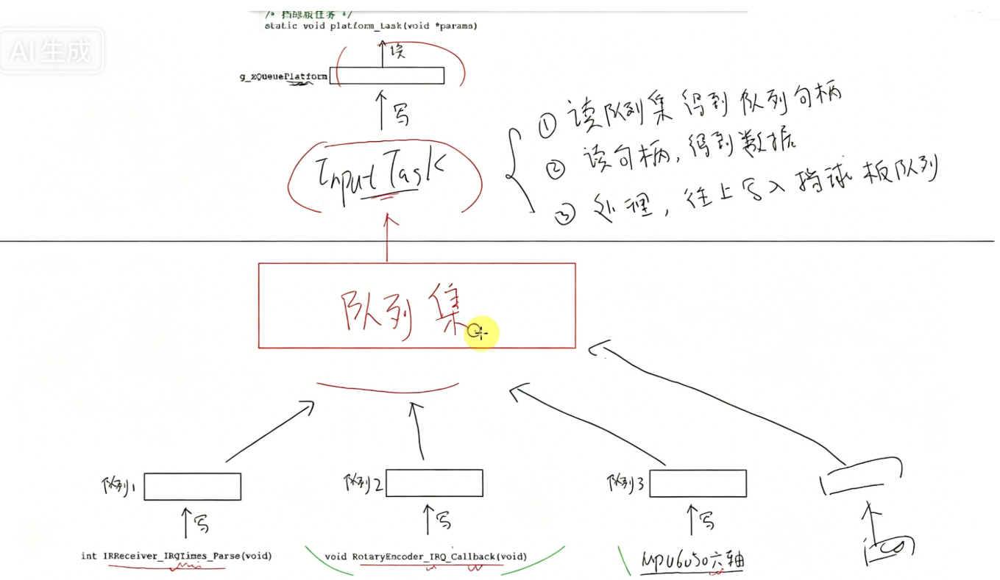

---


# 8-3-2 队列集实验_改进程序框架(编程)

## 1.内容介绍

- 本节课程完成对上一节课的最终程序框架；
- 本节课程的工程项目基于上一节课`14_Chapter11_Queue_Game_Multi_Input_Better`的工程修改；
- 复制`14_Chapter11_Queue_Game_Multi_Input_Better`工程，重命名为`15_Chapter11_QueueSet_Game`；


## 2.红外改造

### 2.1 修改数据结构体

- 前面我们定义的input_data结构体，这个结构体是根据**游戏的挡球板队列的数据格式**来定义的；
- 下面我们定义只针对**红外接收的硬件数据的结构体**；
- 将先前**typedefs.h**文件中定义的结构体，复制到**driver_ir_receiver.h**文件中定义，这样我们从红外遥控器中得到的键值就存在**ir_data.val**中；
- 在新的结构体中，val值只能取与红外遥控器硬件数据，即键值；

```c
/* 遥控器数据结构体 */
struct ir_data {
	uint32_t dev;
	uint32_t val;
};
```

### 2.2 修改红外遥控键值对应的宏

- 在**driver_ir_receiver.c**文件中，我们定义了很多键值；

```c
/* driver_ir_receiver.c文件 */
const char *IRReceiver_CodeToString(uint8_t code)
{
    const uint8_t codes[]= {0xa2, 0xe2, 0x22, 0x02, 0xc2, 0xe0, 0xa8, 0x90, \
                            0x68, 0x98, 0xb0, 0x30, 0x18, 0x7a, 0x10, 0x38, \
                            0x5a, 0x42, 0x4a, 0x52, 0x00};
    const char *names[]= {"Power", "Menu", "Test", "+", "Return", "Left", "Play", "Right", \
                            "0", "-", "C", "1", "2", "3", "4", "5", \
                            "6", "7", "8", "9", "Repeat"};
    int i;
    
    for (i = 0; i < sizeof(codes)/sizeof(codes[0]); i++)
    {
        if (code == codes[i])
        {
            return names[i];
        }
    }
    return "Error";
}
```

- 为了更好的可读性，将这些键值通过宏定义的方式写在**driver_ir_receiver.h**文件中；

```c
/* 红外键值宏定义 */
#define IR_KEY_POWER	0xa2
#define IR_KEY_MENU		0xe2
#define IR_KEY_TEST		0x22
#define IR_KEY_ADD		0x02
#define IR_KEY_RETURN	0xc2
#define IR_KEY_LEFT		0xe0
#define IR_KEY_PLAY		0xa8
#define IR_KEY_RIGHT	0x90
#define IR_KEY_0		0x68
#define IR_KEY_DEC		0x98
#define IR_KEY_C		0xb0
#define IR_KEY_1		0x30
#define IR_KEY_2		0x18
#define IR_KEY_3		0x7a
#define IR_KEY_4		0x10
#define IR_KEY_5		0x38
#define IR_KEY_6		0x5a
#define IR_KEY_7		0x42
#define IR_KEY_8		0x4a
#define IR_KEY_9		0x52
#define IR_KEY_REPEAT	0x00
```

### 2.3 重复码数据的修改

- 红外驱动中，写入队列的数据需要全部改为硬件数据；
- 将中断服务函数对应的队列就是硬件数据，数据得到什么数据我们直接就写，不用处理；
- 需要注意定义的结构体的修改；
- **先前定义的g_last_val也可以删掉了；**

```c
void IRReceiver_IRQ_Callback(void)
{
    // ...
	struct ir_data idata;
    
    // ...
	
	if (g_IRReceiverIRQ_Cnt == 4)
	{
		/* 是否重复码 */
		if (isRepeatedKey())
		{
			/* device: 0, val: 0, 表示重复码 */
			//PutKeyToBuf(0);
			//PutKeyToBuf(0);
			
			/* 改为写队列 */
			idata.dev = 0;
			idata.val = 0;		// 修改
			xQueueSendToBackFromISR(g_xQueuePlatform, &idata, NULL);
			
			g_IRReceiverIRQ_Cnt = 0;
		}
	}
	// ...
}
```

### 2.4 数据解析部分的修改

- 直接将最原始的值写入队列中：

```c
static int IRReceiver_IRQTimes_Parse(void)
{
	// ...
	
	struct ir_data idata;	// 修改

	// ...

	//PutKeyToBuf(datas[0]);
	//PutKeyToBuf(datas[2]);
	
	/* 改为写队列 */
	idata.dev = datas[0];
	idata.val = datas[2];
	
	xQueueSendToBackFromISR(g_xQueuePlatform, &idata, NULL);
    
	return 0;
}
```

### 2.5 修改写入的队列

现在不再是将中断函数的数据写入挡球板的队列，而是写入红外接收的队列。

- **先定义队列的句柄**

```c
/* 红外队列,将原先的Platform队列改为红外队列 */
static QueueHandle_t g_xQueueIR;
```

- **在初始化函数中创建队列**

  - 我们在driver_ir_receiver.c文件的初始化函数中创建队列，并返回上面的句柄；
  - 后续只要在freertos.c文件中调用这个初始化函数即可实现队列的创建；

  ```c
  void IRReceiver_Init(void)
  {
      /* PA10在MX_GPIO_Init()中已经被配置为双边沿触发, 并使能了中断 */
  #if 0
      /*Configure GPIO pin : PB10 */
      GPIO_InitStruct.Pin = GPIO_PIN_10;
      GPIO_InitStruct.Mode = GPIO_MODE_EVT_RISING_FALLING;
      GPIO_InitStruct.Pull = GPIO_PULLUP;
      HAL_GPIO_Init(GPIOB, &GPIO_InitStruct);
  #endif
  	/* 创建红外队列 */
  	g_xQueueIR = xQueueCreate(10, sizeof(struct ir_data));
  }
  ```

- **将写入的队列改为红外的队列**

  - 需要将解析函数和回调函数中写入队列改为红外的队列；

  ```c
  static int IRReceiver_IRQTimes_Parse(void)
  {
  	// ...
  	
  	struct ir_data idata;
  
  	// ...
  
  	//PutKeyToBuf(datas[0]);
  	//PutKeyToBuf(datas[2]);
  	
  	/* 改为写队列 */
  	idata.dev = datas[0];
  	idata.val = datas[2];
  	
  	xQueueSendToBackFromISR(g_xQueueIR, &idata, NULL);	// 修改
      
  	return 0;
  }
  
  void IRReceiver_IRQ_Callback(void)
  {
      // ...
  	struct ir_data idata;
      
      // ...
  	
  	if (g_IRReceiverIRQ_Cnt == 4)
  	{
  		/* 是否重复码 */
  		if (isRepeatedKey())
  		{
  			/* device: 0, val: 0, 表示重复码 */
  			//PutKeyToBuf(0);
  			//PutKeyToBuf(0);
  			
  			/* 改为写队列 */
  			idata.dev = 0;
  			idata.val = 0;
  			xQueueSendToBackFromISR(g_xQueueIR, &idata, NULL);	// 修改
  			
  			g_IRReceiverIRQ_Cnt = 0;
  		}
  	}
  	// ...
  }
  ```


## 3.旋转编码器改造

### 3.1 创建数据结构体

- 同样的，我们创建一个只与旋转编码器硬件相关的数据结构；
- 由于前面在typedefs.h文件中定义了这个结构体，我们直接将它挪到driver_rotary_encoder.h中；

```c
/* 旋转编码器数据结构体 */
struct rotary_data {
	int32_t cnt;
	int32_t speed;
};
```

### 3.2 修改写入的队列

- 之前是在game1.c文件中定义了旋转编码器的队列，我们现在将队列放在driver_rotary_encoder.c文件中进行定义；
- 把game1.c文件中的相关变量剪切掉，然后复制到driver_rotary_encoder.c文件中；
- 接着在初始化函数中创建队列，后续只需要在freertos.c文件中调用这个函数即可创建对应的队列；

```c
/* 旋转编码器队列 */
static QueueHandle_t g_xQueueRotary;

/* 旋转编码器的队列Buffer和队列句柄 */
static uint8_t g_ucQueueRotaryBuf[10 * sizeof(struct rotary_data)];
static StaticQueue_t g_xQueueRotaryStaticStructure;

void RotaryEncoder_Init(void)
{
    /* PB0,PB1在MX_GPIO_Init中被配置为输入引脚 */
    /* PB12在MX_GPIO_Init中被配置为中断引脚,上升沿触发 */
	g_xQueueRotary = xQueueCreateStatic(10, sizeof(struct rotary_data), 
										g_ucQueueRotaryBuf, &g_xQueueRotaryStaticStructure);
}
```

### 3.3 调用初始化函数实现队列的创建

- 在freertos.c文件中，调用两个初始化函数，这样上电即可创建两个队列：

```c
void MX_FREERTOS_Init(void) {
  /* USER CODE BEGIN Init */
  LCD_Init();
  LCD_Clear();
  
  RotaryEncoder_Init();
  IRReceiver_Init();
    
  IRReceiver_Init();
  LCD_PrintString(0, 0, "Starting");

  // ...

}
```


## 4.创建队列集

### 4.1 定义句柄

- 队列集是和游戏耦合的部分，直接在game1.c文件中定义即可；

```c
/* 队列集句柄 */
static QueueSetHandle_t g_xQueueSetInput;
```

### 4.2 创建队列集

- 如图所示在game1_task中创建队列集；
- 为了增加代码的健壮性，其长度通过宏定义方式确定，两个宏定义分别定义在两个外设的.h文件中；
- 注意需要把底层硬件驱动创建队列时的大小也换成宏；

```c
/* game1.c文件 */
void game1_task(void *params)
{		
    // ...
    
	/* 创建队列 */
	g_xQueuePlatform = xQueueCreate(10, sizeof(struct input_data));
	
	/* 创建队列集 */
	g_xQueueSetInput = xQueueCreateSet(ROTARY_QUEUE_LEN + IR_QUEUE_LEN);
	
	// ...
}

/* driver_ir_receiver.h文件 */
#define IR_QUEUE_LEN		10

/*driver_rotary_encoder.h文件 */
#define ROTARY_QUEUE_LEN	10
```

### 4.3 将队列加入队列集

- **良好的编程习惯**

  - 创建队列集时，需要得到两个底层驱动的队列；
  - 各自的硬件驱动文件中，都采用了局部变量，以免变量暴露，可以采用函数的方式向外部文件提供这个队列的句柄；
  - 红外驱动底层

  ```c
  /* .c文件实现 */
  QueueHandle_t GetQueueIR(void)
  {
  	return g_xQueueIR;
  }
  
  /* .h文件声明 */
  QueueHandle_t GetQueueRotary(void);
  ```

  - 旋转编码器驱动底层

  ```c
  /* .c文件实现 */
  QueueHandle_t GetQueueRotary(void)
  {
  	return g_xQueueRotary;
  }
  
  /* .h文件声明 */
  QueueHandle_t GetQueueIR(void);
  ```

- **将队列加入队列集**

  - 在game1_task函数中完成上面功能，这样就将两个队列加入队列集了；

  ```c
  /* 红外队列句柄 */
  static QueueHandle_t g_xQueueIR;
  
  /*  旋转编码器句柄*/
  static QueueHandle_t g_xQueueRotary;
  
  /* 游戏任务 */
  void game1_task(void *params)
  {
      // ...
      
  	/* 创建队列 */
  	g_xQueuePlatform = xQueueCreate(10, sizeof(struct input_data));
  	
  	/* 创建队列集 */
  	g_xQueueSetInput = xQueueCreateSet(ROTARY_QUEUE_LEN + IR_QUEUE_LEN);
  	
      /* 将队列加入队列集 */
  	g_xQueueIR = GetQueueIR();
  	g_xQueueRotary = GetQueueRotary();
  	xQueueAddToSet(g_xQueueIR, g_xQueueSetInput);
  	xQueueAddToSet(g_xQueueRotary, g_xQueueSetInput);
  	
  	// ...
  }
  ```


## 5.创建InputTask

### 5.1 创建数据处理任务InputTask

- 将原先的旋转编码器数据处理任务改为InputTask，然后再在InputTask函数中进行操作的实现；

```c
void game1_task(void *params)
{
	// ...
    
	/* 创建输入任务 */
	xTaskCreate(InputTask, "InputTask", 128, NULL, osPriorityNormal, NULL);
	
	// ...
}
```

### 5.2 实现InputTask任务函数

- 将原来的旋转编码器数据处理函数改为InputTask函数；
- 这个函数做的事情主要有：读队列集，判断是否有数据，有数据再判断属于哪个设备，再进入对应的设备数据处理函数进行数据处理；

```c
/* 输入任务函数 */
static void InputTask(void *params)
{
	QueueSetMemberHandle_t xQueueHandle;
	
	while (1)
	{
		/* 读队列集，得到队列句柄 */
		xQueueHandle = xQueueSelectFromSet(g_xQueueSetInput, portMAX_DELAY);
		
		if (xQueueHandle)
		{
			/* 读队列句柄得到数据并处理数据 */
			if (xQueueHandle == g_xQueueIR)
			{
				ProcessIRData();
			}
			else if (xQueueHandle == g_xQueueRotary)
			{
				ProcessRotaryData();
			}
		}
	}
}
```

### 5.3 数据处理函数

- 然后实现ProcessIRData()函数和ProcessRotaryData()函数；
- **读取对应结构体数据，然后将硬件结构体数据转换为需要写入挡球板队列的结构体形式；**

```c
/* 红外数据处理函数，将硬件数据转换成游戏数据 */
static void ProcessIRData(void)
{
	struct ir_data idata;
	static struct input_data input;
	
	xQueueReceive(g_xQueueIR, &idata, 0);
	
	if (idata.val == IR_KEY_LEFT)
	{
		input.dev = idata.dev;
		input.val = UPT_MOVE_LEFT;
	}
	else if (idata.val == IR_KEY_RIGHT)
	{
		input.dev = idata.dev;
		input.val = UPT_MOVE_RIGHT;
	}
	else if (idata.val == IR_KEY_REPEAT)
	{
		/* 保持不变 */
	}
	else
	{
		input.dev = idata.dev;
		input.val = UPT_MOVE_NONE;
	}
	
	/* 写挡球板队列 */
	xQueueSend(g_xQueuePlatform, &input, 0);
}

/* 旋转编码器数据处理函数，将硬件数据转换成游戏数据 */
static void ProcessRotaryData(void)
{
	struct rotary_data rdata;
	static struct input_data idata;
	int left;
	int i, cnt;
	
	/* 读旋转编码器队列 */
	xQueueReceive(&g_xQueueRotary, &rdata, 0);
	
	/* 处理数据 */
	/* 判度速度:负数表示向左，正数表示向右 */
	if (rdata.speed < 0)
	{
		left = 1;
		rdata.speed = 0 - rdata.speed;
	}
	else
	{
		left = 0;
	}
	
	if (rdata.speed > 100)
		cnt = 4;
	else if (rdata.speed > 50)
		cnt = 2;
	else
		cnt = 1;
	
	/* 写挡球板队列 */
	idata.dev = 1;
	idata.val = left ? UPT_MOVE_LEFT : UPT_MOVE_RIGHT;
	for (i = 0; i < cnt; i ++)
	{
		xQueueSend(g_xQueuePlatform, &idata, 0);
	}
}
```

### 5.4 开启使用队列集

- 由于在STM32CubeMX中无法直接配置是否使用队列集，所以我们需要自己在配置文件中配置是否使用队列集；
- 打开FreeRTOS.h文件，发现有如下代码
  - 即默认下使用队列集是关闭的；
  - 无法通过修改这里直接配置，因为用CubeMX再次生成代码时它会重新回到0；

```c
#ifndef configUSE_QUEUE_SETS
	#define configUSE_QUEUE_SETS 0
#endif
```

- 打开FreeRTOSConfig.h文件，直接在下方添加配置：

```c
/* USER CODE BEGIN Includes */
#define configUSE_QUEUE_SETS 1
/* Section where include file can be added */
/* USER CODE END Includes */
```

### 5.5 默认任务自杀

- 在默认任务中，我们也会去读红外接收的值，我们这里直接让它执行后就自杀，这样就不妨碍我们游戏那边的情况了；

```c
void StartDefaultTask(void *argument)
{
	// ...
	TaskHandle_t xSoundTaskHandle = NULL;
	BaseType_t ret;
	
	vTaskDelete(NULL);
	
	LCD_Init();
	// ...
}
```

### 5.6 栈的分配太小

- 在前面我们分配的栈是3072，当我们使用队列集后，这个内存太小，我们可以将它增大到8000；

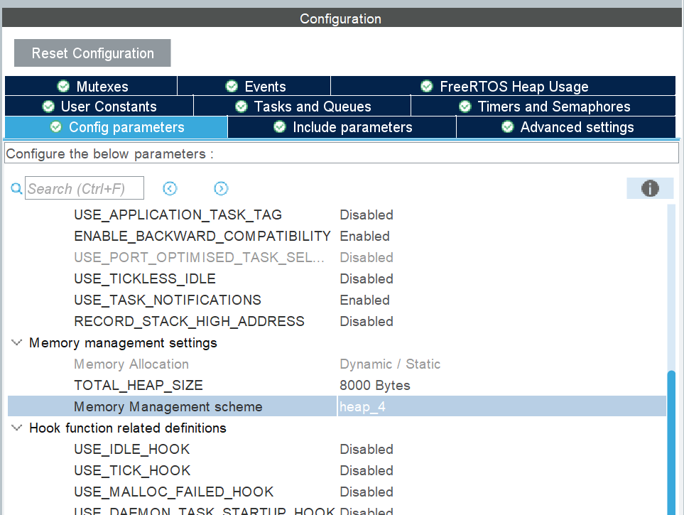

### 5.7 编译烧录

- 完成上面的改造后，直接编译烧录；
- 这个工程的效果和上一个工程的效果是一样的，只是程序框架更漂亮了；


## 8.总结

- 在本节课程中，通过队列集的引入，改善了整个程序的程序框架，效率更高了；
- 整个程序的框架思路如下：
  - 硬件驱动底层只负责把硬件原始数据写入各自的硬件队列中；
  - 新建一个队列集，把原始硬件数据写入队列集中；
  - 将原来的旋转编码器的数据处理任务改为上层的数据处理任务；
  - 在数据处理任务函数中，根据句柄的不同，把不同的硬件原始数据处理成游戏格式的数据，这样就可以控制挡球板了；


---


# 8-3-3 队列集实验_增加姿态控制

## 1.内容介绍

- 前面按照队列集的思想把红外接收和旋转编码器的整个项目框架给改造了一下，改造后的项目结构很适合我们去增加硬件设备；
- 下面我们就在这个基础上去**增加MPU6050姿态控制**的效果；
- 本节源码在`15_Chapter11_QueueSet_Game`的基础上，改出`16_Chapter11_QueueSet_Game_Add_MPU6050`，支持6轴传感器，使用姿态控制玩游戏；
- MPU6050的操作可以参考：https://zhuanlan.zhihu.com/p/30621372；


## 2.项目思路

- 与前面两者不同的是，我们这里不使用中断的方式去写队列；
- 而是**通过创建任务的方式，让任务去读I2C的数据**，并将数据写入到属于MPU6050的队列；
- 然后再将MPU6050的队列加入到队列集，上层的**InputTask()函数**中需要增加处理MPU6050数据的函数；

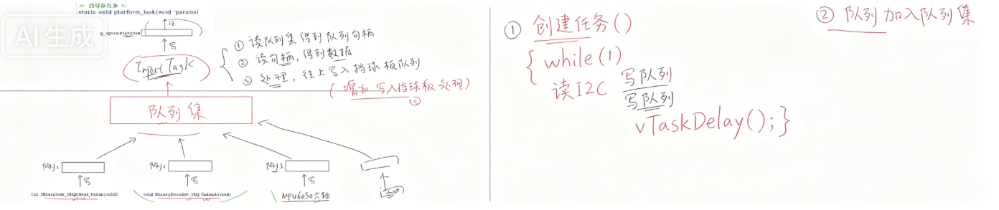


## 3.程序改造

### 3.1 定义结构体形式及队列长度宏定义

- 在驱动的头文件driver_mpu6050.h中定义好**结构体的形式，并写好MPU6050的队列的长度的宏定义**；

```c
#define MPU6050_QUEUE_LEN	10

/* MPU6050数据结构体 */
struct mpu6050_data {
	int32_t angle_x;
};
```

### 3.2 在初始化函数中完成队列的创建

- 在**driver_mpu6050.c**件的初始化函数中创建队列；
- 同时在该文件中**实现取句柄函数**，防止变量泄露，养成良好的编程习惯，别忘在在.h文件中声明；

```c
#include "FreeRTOS.h"
#include "queue.h"

/* MPU6050队列 */
static QueueHandle_t g_xQueueMPU6050;

QueueHandle_t GetQueueMPU6050(void)
{
	return g_xQueueMPU6050;
}

int MPU6050_Init(void)
{
	MPU6050_WriteRegister(MPU6050_PWR_MGMT_1, 0x00);	//解除休眠状态
	MPU6050_WriteRegister(MPU6050_PWR_MGMT_2, 0x00);
	MPU6050_WriteRegister(MPU6050_SMPLRT_DIV, 0x09);
	MPU6050_WriteRegister(MPU6050_CONFIG, 0x06);
	MPU6050_WriteRegister(MPU6050_GYRO_CONFIG, 0x18);
	MPU6050_WriteRegister(MPU6050_ACCEL_CONFIG, 0x18);
    return 0;
	
	g_xQueueMPU6050 = xQueueCreate(MPU6050_QUEUE_LEN, sizeof(struct mpu6050_data));
}
```

### 3.3 调用初始化函数完成队列创建

- 同前面一样的，在**freertos.c**文件中的入口函数中调用MPU6050的初始化函数，完成MPU6050的队列的创建；

```c
void MX_FREERTOS_Init(void) {
  /* USER CODE BEGIN Init */
  LCD_Init();
  LCD_Clear();
  
  RotaryEncoder_Init();
  IRReceiver_Init();
  MPU6050_Init();
	
  // ...
}
```

### 3.4 任务函数的创建

- 在任务函数中，我们**只读取x方向上的数值**，然后解析这个数值，最后写入队列中去；
- 注意后面的vTaskDelay()函数，养成良好的编程习惯；
- **这里的数据解析函数MPU6050_ParseData()在前面的工程中是没有的，可直接从我提供的工程里面复制；**

```c
/* MPU6050任务函数 */
void MPU6050_Task(void *params)
{
	int16_t AccX;
	struct mpu6050_data result;
	
	while(1)
	{
		/* 读数据 */
		if (0 == MPU6050_ReadData(&AccX, NULL, NULL, NULL, NULL, NULL))
		{
			/* 解析数据 */
			MPU6050_ParseData(AccX, 0, 0, 0, 0, 0, &result);
			
			/* 写队列 */
			xQueueSend(g_xQueueMPU6050, &result, 0);
		}
		/* Delay */
		vTaskDelay(50);
	}
}
```

### 3.5 把队列加入到队列集

- 在game1.c文件中调用辅助函数获取句柄，然后将队列加入到队列集中去；
- 注意要记得把队列集的大小加上MPU6050队列的大小；

```c
#include "driver_mpu6050.h"

/* MPU6050队列 */
static QueueHandle_t g_xQueueMPU6050;

/* 游戏任务 */
void game1_task(void *params)
{		
	// ...
    
	/* 创建队列集 */
	g_xQueueSetInput = xQueueCreateSet(ROTARY_QUEUE_LEN + IR_QUEUE_LEN + MPU6050_QUEUE_LEN);
	
	/* 获取底层硬件队列的句柄 */
	g_xQueueIR = GetQueueIR();
	g_xQueueRotary = GetQueueRotary();
	g_xQueueMPU6050 = GetQueueMPU6050();
	
	/* 将队列加入队列集 */
	xQueueAddToSet(g_xQueueIR, g_xQueueSetInput);
	xQueueAddToSet(g_xQueueRotary, g_xQueueSetInput);
	xQueueAddToSet(g_xQueueMPU6050, g_xQueueSetInput);
	
    // ...
}

```

### 3.6 创建MPU6050任务

- 前面只是完成了任务函数的创建，接下来需要创建其任务；

```c
void MX_FREERTOS_Init(void) {
  // ...
    
  /* USER CODE BEGIN RTOS_THREADS */
  /* add threads, ... */
  /* 创建任务: 声 */
  //extern void PlayMusic(void *params);
  /* 创建游戏任务 */
  xTaskCreate(game1_task, "GameTask", 128, NULL, osPriorityNormal, NULL);
  
  /* 创建MPU6050任务 */
  extern void MPU6050_Task(void *params);
  xTaskCreate(MPU6050_Task, "MPU6050Task", 128, NULL, osPriorityNormal, NULL);
    
  // ...
}
```

### 3.7 添加队列集任务函数中处理MPU6050的操作

- 在InputTask中添加处理MPU6050数据的操作，再定义MPU6050处理数据的函数，保持与前面完全相同的结构；

```c
/* MPU6050数据处理函数，将底层硬件数据转换成游戏数据 */
void ProcessMPU6050Data()
{
	struct mpu6050_data mdata;
	struct input_data idata;
	
	/* 读取MPU6050的数据 */
	/* 判断角度，大于90表示向左，小于90表示向右 */
	if (mdata.angle_x > 90)
	{
		idata.val = UPT_MOVE_LEFT;
	}
	else if (mdata.angle_x < 90)
	{
		idata.val = UPT_MOVE_RIGHT;
	}
	else
	{
		idata.val = UPT_MOVE_NONE;
	}
	
	/* 写挡球板队列 */
	idata.dev = 2;
	xQueueSend(g_xQueuePlatform, &idata, 0);
}

/* 输入任务函数 */
static void InputTask(void *params)
{
	QueueSetMemberHandle_t xQueueHandle;
	
	while (1)
	{
		/* 读队列集，得到队列句柄 */
		xQueueHandle = xQueueSelectFromSet(g_xQueueSetInput, portMAX_DELAY);
		
		if (xQueueHandle)
		{
			/* 读队列句柄得到数据并处理数据 */
			if (xQueueHandle == g_xQueueIR)
			{
				ProcessIRData();
			}
			else if (xQueueHandle == g_xQueueRotary)
			{
				ProcessRotaryData();
			}
			else if (xQueueHandle == g_xQueueMPU6050)
			{
				ProcessMPU6050Data();
			}
		}
	}
}
```

### 3.8 Bugger调试

- 在上述代码烧写进去后，无法运行，可能是由于先创建了MPU6050，导致它已经将它的队列写满了，再放入到队列集中；
- 这样它无法继续写入数据，也就无法唤醒InputTask任务；
- 需要**先将它放入到队列集中再去创建任务**，也就是将创建任务从freertos.c文件中移到game1.c文件中；
- 修改步骤：将freertos.c中创建任务的两句代码挪到加入队列集后面；

```c
void game1_task(void *params)
{		
   // ...
	
	/* 将队列加入队列集 */
	xQueueAddToSet(g_xQueueIR, g_xQueueSetInput);
	xQueueAddToSet(g_xQueueRotary, g_xQueueSetInput);
	xQueueAddToSet(g_xQueueMPU6050, g_xQueueSetInput);
	
	/* 创建MPU6050任务，在将队列集加入后再创建，防止直接队列满了 */
	extern void MPU6050_Task(void *params);
	xTaskCreate(MPU6050_Task, "MPU6050Task", 128, NULL, osPriorityNormal, NULL);
	
	/* 创建输入任务 */
	xTaskCreate(InputTask, "InputTask", 128, NULL, osPriorityNormal, NULL);
    
	// ...
}
```


## 3.互斥问题解决

- 屏幕显示和MPU6050读取数据都用到了I2C，两者会发生互斥，这里先用全局变量的方式保护一下；
- 先前的OLED画面呈现逻辑
  - 在draw.c文件中，它的函数实现也是用全局变量实现的；
  - 现在我们也用这个全局变量，避免MPU6050访问的冲突；
  - 将这个变量移到函数外，声明为全局变量；

```c
/* 修改前 */
void draw_flushArea(byte x, byte y, byte w, byte h)
{
    static volatile int bInUsed = 0;
    while (bInUsed);
    //taskENTER_CRITICAL();
    bInUsed = 1;
    LCD_FlushRegion(x, y, w, h);
    bInUsed = 0;
    //taskEXIT_CRITICAL();
}

/* 修改后 */
volatile int bInUsed = 0;
void draw_flushArea(byte x, byte y, byte w, byte h)
{
    while (bInUsed);
    //taskENTER_CRITICAL();
    bInUsed = 1;
    LCD_FlushRegion(x, y, w, h);
    bInUsed = 0;
    //taskEXIT_CRITICAL();
}
```

- 然后在MPU6050的任务函数中，在访问数据时，也用这个全局变量；

```c
/* MPU6050任务函数 */
void MPU6050_Task(void *params)
{
	int16_t AccX;
	struct mpu6050_data result;
	int ret;
	extern volatile  int bInUsed;
	
	while(1)
	{
		/* 读数据 */
		while (bInUsed);
		bInUsed = 1;
		ret = MPU6050_ReadData(&AccX, NULL, NULL, NULL, NULL, NULL);
		bInUsed = 0;
		
		if (0 == ret)
		{
			/* 解析数据 */
			MPU6050_ParseData(AccX, 0, 0, 0, 0, 0, &result);
			
			/* 写队列 */
			xQueueSend(g_xQueueMPU6050, &result, 0);
		}
		/* Delay */
		vTaskDelay(50);
	}
}
```

---


# 8-4 队列实验_分发数据给多个任务(赛车游戏)

## 1.内容介绍

- 本节源码`16_Chapter11_QueueSet_Game_Add_MPU6050`的基础上修改，得到`17_Chapter11_QueueCar_Dispatch`；
- 实现的功能为：红外遥控器的中断函数解析出按键值后，写入3个队列，3个赛车任务读取其中一个队列得到按键数据；
- 最终实现用遥控器上3个不同的按键控制赛车的移动；


## 2.添加赛车显示代码

- 解压`5.NWatch参考源码\DshanMCU-F103\03_nwatch_dshanmcu-f103_all.7z`；
- 在`\03_nwatch_dshanmcu-f103_all\NWatch-DShanMCU-F103\NWatch`目录下找目录下找到`game2.c和game2.h`两个文件；
- 复制到上一节课的nwatch文件夹下，并在Keil中把它们添加进去；


## 3.game2.c文件移植

- 删除所有其他东西，把game1.c文件的头文件都复制过来；
- 保留`carImg和roadMarking`即可，其他的在此基础上进行添加；
- 然后再从game1.c文件中将清屏数组也拷贝过来，将其数组改为30，初始值为0；

```c
/*
 * Project: N|Watch
 * Author: Zak Kemble, contact@zakkemble.co.uk
 * Copyright: (C) 2013 by Zak Kemble
 * License: GNU GPL v3 (see License.txt)
 * Web: http://blog.zakkemble.co.uk/diy-digital-wristwatch/
 */
#include <stdlib.h>
#include <stdio.h>

#include "cmsis_os.h"
#include "FreeRTOS.h"                   // ARM.FreeRTOS::RTOS:Core
#include "task.h"                       // ARM.FreeRTOS::RTOS:Core
#include "event_groups.h"               // ARM.FreeRTOS::RTOS:Event Groups
#include "semphr.h"                     // ARM.FreeRTOS::RTOS:Core

#include "draw.h"
#include "resources.h"

#include "driver_lcd.h"
#include "driver_rotary_encoder.h"
#include "driver_ir_receiver.h"
#include "driver_mpu6050.h"

#define CAR_COUNT	3
#define CAR_WIDTH	12
#define CAR_LENGTH	15
#define ROAD_SPEED	6

static const byte carImg[] ={
	0x40,0xF8,0xEC,0x2C,0x2C,0x38,0xF0,0x10,0xD0,0x30,0xE8,0x4C,0x4C,0x9C,0xF0,
	0x02,0x1F,0x37,0x34,0x34,0x1C,0x0F,0x08,0x0B,0x0C,0x17,0x32,0x32,0x39,0x0F,
};

static const byte clearImg[30] ={0};

static const byte roadMarking[] ={
	0x01,0x01,0x01,0x01,0x01,0x01,0x01,0x01,
};

```


## 4.小车和赛道显示测试

### 4.1 测试小车和赛道显示

- 仿照game1.c文件中显示挡球板的程序，在game2.c文件中自己写car_test()函数，测试动画显示；
- **关于在OLED上显示图形的原理及其关系可见`7 游戏机项目说明`节；**
- 这个函数实现在OLED的左上角显示一辆小车和一个路标：
  - 小车在y方向占用16个像素，在x方向占用15个像素；
  - 路标在y方向只占用一个像素，在x方向占用8个像素，但它只用到了1个像素而已；
  - 其中draw.c文件是nwatch项目的显示文件，我们直接拿来用；
- **当然，我们不只是显示这两个东西而已，这只是一个测试函数，用预编译来把它框起来，后续可以用来测试；**
- 直接参考game1.c文件中绘制平台的方式，写出下面的程序：

```c
#define NOINVERT	false
#define INVERT		true

static uint32_t g_xres, g_yres, g_bpp;
static uint8_t *g_framebuffer;

#if 0
void car_test(void)
{
	g_framebuffer = LCD_GetFrameBuffer(&g_xres, &g_yres, &g_bpp);
    draw_init();
    draw_end();
	
    /* 前面两个参数是位置，后面两个参数是大小 */
	draw_bitmap(0, 0, carImg, 15, 16, NOINVERT, 0);
    draw_flushArea(0, 0, 15, 16);
	
	draw_bitmap(0, 16, roadMarking, 8, 1, NOINVERT, 0);
    draw_flushArea(0, 16, 8, 1);
	
	while(1);
}
#endif

```

- 测试的时候将其放到**MX_FREERTOS_Init()**初始化函数中；

```c
void MX_FREERTOS_Init(void) {
  /* USER CODE BEGIN Init */
  extern void car_test(void);
  
  LCD_Init();
  LCD_Clear();
  
  RotaryEncoder_Init();
  IRReceiver_Init();
  MPU6050_Init();
	
  LCD_PrintString(0, 0, "Starting");
  
  car_test();	// 添加

  // ...
}
```

### 4.2 画出静态赛道

- 绘制三条路标，每一段路标占用8个像素，OLED屏幕水平方向一共128个像素；
- 采用显示一段、空白一段，一共显示8个周期，且三条路标是一直不变的，静态显示即可；
- **基于上面的car_test()函数创建汽车游戏函数，每次改完后，将car_game()名称改为car_test()，先测试看看对不对；**
- 此时的代码效果应该是左上角有一辆赛车，然后整个屏幕有三条赛道；

```c
void car_game(void)
{
	int x;
	int i, j;
	
	g_framebuffer = LCD_GetFrameBuffer(&g_xres, &g_yres, &g_bpp);
    draw_init();
    draw_end();
	
	/* 画出路标 */
	for (i = 0; i < 3; i++)
	{
		for (j = 0; j < 8; j ++)
		{
			draw_bitmap(16 * j, 16 + 17 * i, roadMarking, 8, 1, NOINVERT, 0);
			draw_flushArea(16 * j, 16 + 17 * i, 8, 1);
		}
		
	}
	
	/* 前面两个参数是位置，后面两个参数是大小 */
	draw_bitmap(0, 0, carImg, 15, 16, NOINVERT, 0);
    draw_flushArea(0, 0, 15, 16);
	
	while(1);
}
```


## 5.画出三辆汽车并创建三辆汽车任务

### 5.1 工程思路

- 创建3个不同的汽车任务，它们可以调用同一个函数；
- 但是它们的位置、控制键值不一样；
- 然后通过红外按键控制每辆车的移动；

### 5.2 画出三辆汽车

- 定义结构体变量，它包含了**汽车显示的位置以及汽车的控制按键**；
- 再定义三个汽车结构体实体，它们的初始位置不同，并且控制的按键也不同；
- **IR_KEY_1、IR_KEY_2、IR_KEY_3是宏定义，分别对应着红外遥控器的三个数字：1、2、3；**
- 然后先实现静态显示三辆小车，完整代码如下：

```c
/* 汽车结构体 */
struct car {
	int x;
	int y;
	int control_key;
};

/* 3辆汽车实例 */
struct car g_cars[3] = {
	{0, 0, IR_KEY_1},
	{0, 17, IR_KEY_2},
	{0, 34, IR_KEY_3},
	
};

void car_game(void)
{
	int x;
	int i, j;
	
	g_framebuffer = LCD_GetFrameBuffer(&g_xres, &g_yres, &g_bpp);
    draw_init();
    draw_end();
	
	/* 画出路标 */
	for (i = 0; i < 3; i++)
	{
		for (j = 0; j < 8; j ++)
		{
			draw_bitmap(16 * j, 16 + 17 * i, roadMarking, 8, 1, NOINVERT, 0);
			draw_flushArea(16 * j, 16 + 17 * i, 8, 1);
		}
		
	}
	
	/* 前面两个参数是位置，后面两个参数是大小 */
	/* 画出3辆汽车 */
	for (i = 0; i < 3; i ++)
	{
		draw_bitmap(g_cars[i].x, g_cars[i].y, carImg, 15, 16, NOINVERT, 0);
		draw_flushArea(g_cars[i].x, g_cars[i].y, 15, 16);
	}
	
	while(1);
}

```

### 5.3 创建三个汽车任务

- 创建三个汽车任务，它们使用的是同一个任务函数；
- 但是每一个任务传入给函数的参数是不同的，分别对应着三个汽车：g_cars[0]、g_cars[1]、g_cars[2]；

```c
void car_game(void)
{
	int x;
	int i, j;
	
	g_framebuffer = LCD_GetFrameBuffer(&g_xres, &g_yres, &g_bpp);
    draw_init();
    draw_end();
	
	/* 画出路标 */
	for (i = 0; i < 3; i++)
	{
		for (j = 0; j < 8; j ++)
		{
			draw_bitmap(16 * j, 16 + 17 * i, roadMarking, 8, 1, NOINVERT, 0);
			draw_flushArea(16 * j, 16 + 17 * i, 8, 1);
		}
		
	}
	
#if 0
	/* 前面两个参数是位置，后面两个参数是大小 */
	/* 画出3辆汽车 */
	for (i = 0; i < 3; i ++)
	{
		draw_bitmap(g_cars[i].x, g_cars[i].y, carImg, 15, 16, NOINVERT, 0);
		draw_flushArea(g_cars[i].x, g_cars[i].y, 15, 16);
	}
#endif	
	
	/* 创建3辆汽车的任务 */
	xTaskCreate(CarTask, "car1", 128, &g_cars[0], osPriorityNormal, NULL);
	xTaskCreate(CarTask, "car2", 128, &g_cars[1], osPriorityNormal, NULL);
	xTaskCreate(CarTask, "car3", 128, &g_cars[2], osPriorityNormal, NULL);
}
```


## 6.数据分发队列的改造

### 6.1 数据分发框架

- 我们的任务函数要做的应该是**读取红外接收的队列**，然后去判断接收到的是哪一个按键，然后再去控制对应的车辆进行移动；
- 但是，由于在之前的硬件中，红外中断接收并处理数据后只是写一个队列；
- **如果写入的2号按键，但是此时这个数据被1号小车给读走了，这样2号小车就无法再度到这个数据了**，导致按键使用不了；
- 我们采用**队列分发的方式**解决这个问题，这就是这节课的主要内容；
- 整体的数据分发框架如下：**红外中断广播数据到每个队列中，每个任务读取队列判断数据；**

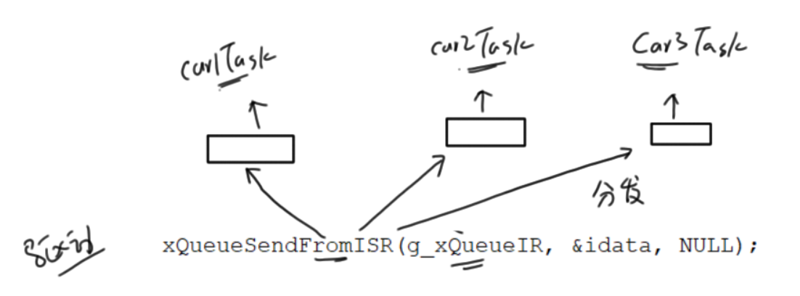

### 6.2 数据分发丑陋版本实现

- 修改红外接收的底层代码，定义一个**分发函数**，这个函数中会写三个队列；
- 这样我们在**红外中断和红外重复码中断函数中，只需要调用这个函数并传入红外中断解析的数据**，它就可以把输入写入三个队列中了；
- 但是这样代码耦合性太强了，只能用于car这个游戏；

```c
/* 数据分发函数 */
void DispatchKey(struct ir_data *pidata)
{
	extern QueueHandle_t g_xQueueCar1;
	extern QueueHandle_t g_xQueueCar2;
	extern QueueHandle_t g_xQueueCar3;
	
	xQueueSendFromISR(g_xQueueCar1, &pidata, NULL);
	xQueueSendFromISR(g_xQueueCar2, &pidata, NULL);
	xQueueSendFromISR(g_xQueueCar3, &pidata, NULL);
}

static int IRReceiver_IRQTimes_Parse(void)
{
	// ...
	/* 改为写队列 */
	idata.dev = datas[0];
	idata.val = datas[2];
	
	DispatchKey(&idata);
    
	return 0;
    // ...
}

void IRReceiver_IRQ_Callback(void)
{
	// ...
			/* 改为写队列 */
			idata.dev = 0;
			idata.val = 0;
			DispatchKey(&idata);
			
			g_IRReceiverIRQ_Cnt = 0;
	
    // ...
}
```

### 6.3 数据分发改进版本实现

- 首先定义一个**元素为队列句柄的数组**，在这个数组中我们将存储那些创建的队列的句柄；
- 接着写一个**动态注册队列的函数**，这个函数很简单，它只是把传入的队列句柄写入到这个数组中而已；
- 这样对于所有的任务，它们创建的任何队列，只需要调用这个函数，我们就可以在这个数组中找到它创建的队列；
- 最后在分发函数中，**将红外接收解析的数据写入这个数组的每一个队列，这样就实现了队列分发；**
- **对于红外队列也一样，我们可以在红外初始化函数一开始就也把这个队列加入到这个数组中去；**

```c
/* 注册队列相关变量 */
static QueueHandle_t g_xQueues[10];
static int g_queue_cnt = 0;/* 队列注册函数 */

void RegisterQueueHandle(QueueHandle_t queueHandle)
{
	if (g_queue_cnt < 10)
	{
		g_xQueues[g_queue_cnt] = queueHandle;
		g_queue_cnt ++;
	}
	
}

/* 数据分发函数 */
void DispatchKey(struct ir_data *pidata)
{
#if 0
	extern QueueHandle_t g_xQueueCar1;
	extern QueueHandle_t g_xQueueCar2;
	extern QueueHandle_t g_xQueueCar3;
	
	xQueueSendFromISR(g_xQueueCar1, &pidata, NULL);
	xQueueSendFromISR(g_xQueueCar2, &pidata, NULL);
	xQueueSendFromISR(g_xQueueCar3, &pidata, NULL);
#endif
	int i;
	for (i = 0; i < g_queue_cnt; i ++)
	{
		xQueueSendFromISR(g_xQueues[i], pidata, NULL);
	}
}

void IRReceiver_Init(void)
{
    /* PA10在MX_GPIO_Init()中已经被配置为双边沿触发, 并使能了中断 */
#if 0
    /*Configure GPIO pin : PB10 */
    GPIO_InitStruct.Pin = GPIO_PIN_10;
    GPIO_InitStruct.Mode = GPIO_MODE_EVT_RISING_FALLING;
    GPIO_InitStruct.Pull = GPIO_PULLUP;
    HAL_GPIO_Init(GPIOB, &GPIO_InitStruct);
#endif
	/* 创建红外队列 */
	g_xQueueIR = xQueueCreate(IR_QUEUE_LEN, sizeof(struct ir_data));
	RegisterQueueHandle(g_xQueueIR);
}
```

### 6.4 任务函数的创建

- **这样我们在CatTask()函数中要做的就是**

  - 创建一个队列，然后将这个队列注册进那个数组；
  - 这样当红外中断函数解析完数据后，就会将数组写入这个队列，而不管这个队列到底是谁的；
  - 然后再读取自己的队列，判断红外接收到的键值是否等于自己的键值，若等于则更新汽车的位置，这就是最简单的逻辑；
  - 在进入循环前先显示小车，否则会等按下按键才有小车，在FreeRTOS操作系统中常常会忽略这样的问题；

  ```c
  static void CarTask(void *params)
  {
  	struct car *pcar = params;
  	struct ir_data idata;
  	
  	/* 创建自己的队列 */
  	QueueHandle_t xQueueIR = xQueueCreate(10, sizeof(struct ir_data));
  	
  	/* 注册队列 */
  	RegisterQueueHandle(xQueueIR);
  	
      /* 先显示汽车 */
  	ShowCar(pcar);
      
  	while(1)
  	{
  		/* 读取按键值:读队列 */
  		xQueueReceive(xQueueIR, &idata, portMAX_DELAY);
  		
  		/* 控制汽车往右移动 */
  		if (idata.val == pcar->control_key)
  		{
  			if (pcar->x < g_xres - CAR_LENGTH)
  			{
  				/* 隐藏汽车 */
  				HideCar(pcar);
  				
  				/* 调整位置 */
  				pcar->x += 20;
  				if (pcar->x > g_xres - CAR_LENGTH)
  				{
  					pcar->x = g_xres - CAR_LENGTH;
  				}
  				
  				/* 重新显示汽车 */
  				ShowCar(pcar);
  			}
  		}
  	}
  }
  ```

- 在逻辑操作过程中，我们需要隐藏汽车、显示汽车，我们把他们定义为函数：

```c
/* game2.c文件中 */

/* 汽车变换逻辑 */
/* 显示汽车 */
static void ShowCar(struct car *pcar)
{
	draw_bitmap(pcar->x, pcar->y, carImg, 15, 16, NOINVERT, 0);
    draw_flushArea(pcar->x, pcar->y, 15, 16);
}

/* 隐藏汽车 */
static void HideCar(struct car *pcar)
{
	draw_bitmap(pcar->x, pcar->y, clearImg, 15, 16, NOINVERT, 0);
    draw_flushArea(pcar->x, pcar->y, 15, 16);
}
```

### 6.5 入口函数调用

- 最后回到freertos.c文件的MX_FREERTOS_Init()函数中调用**car_game()**函数即可，记得将car_test()注释掉；

```c
void MX_FREERTOS_Init(void) {
  /* USER CODE BEGIN Init */
  // ...
  
  //car_test();
    
  // ...
  extern void car_game(void);
  car_game();
  
    // ...
}
```


## 7.总结

这个项目的总体逻辑如下：

- 上电瞬间，初始化函数**调用car_game()函数**，在car_game()函数内部将创建三个汽车的任务，各任务轮流运行；
- 在各自的任务中，会先显示静态的汽车和路标，并创建队列，然后**将队列注册到数组中**；
- 直到红外遥控器发出指令，各任务开始读取指令，执行任务函数**CarTask()**并作出下一步的动作；

---


# 9-1 信号量的本质

## 1.内容介绍

- 本节主要讲解FreeRTOS中的信号量；
- 本节内容对应的课程资料为**第12章——信号量**；


## 2.队列与信号量的区别

### 2.1 生活例子的讲解

可以用进城的票来比作信号量：

- **想要进城时**
  - 必须先买票，对应的就是**take操作**；
  - 买票必然导致票数的减少，对应的是**cnt--操作**；
  - 如果已经没有票了，可以选择等待，即**阻塞操作**；
- **城市放票时**
  - 放票对应的操作是**give操作**；
  - 放票必然导致票数的增加，对应的是**cnt++操作**；
  - 如果票数达到上限了，无法继续放票了，城市也不会在那等着，即give操作必然是**没有阻塞机制的**；

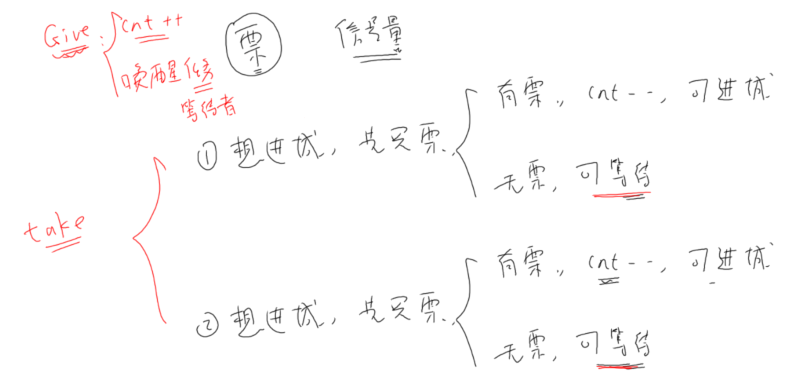

### 2.2 队列与信号量的区别

- **对于队列**

  - 包括**长度、写位置、读位置、计数值、接收等待者链表、发送等待者链表**；

  - **写的时候**
    - 用send命令，它会先copy数据（将数据写入环形缓冲区），然后计数值cnt＋＋，同时去唤醒等待读数据的人，若满可选择等待；
  - **读的时候**
    - 用receive命令，它会先copy数据（存入自己的存储地方），然后计数值cnt--，同时去唤醒等待写数据的人，若空可选择等待；

- **对于信号量**

  - 包括**最大信号量、信号量本身的值、接收等待者链表**；

  - **发放信息量**
    - 用give命令，信息量cnt自增，同时去唤醒等待的人，**即使是达到最大值了，它也不会去等待（阻塞），而是直接返回失败**；
  - **获得信息量**
    - 用take命令，信息量cnt自减，**不会去唤醒任何东西**，如果cnt已经为0，可以选择是否等待（阻塞）；
    - 如果等待，任务就会进入**receive_list链表**中，发放信息时会按照**优先级/等待时间长短**去唤醒这个链表的任务；

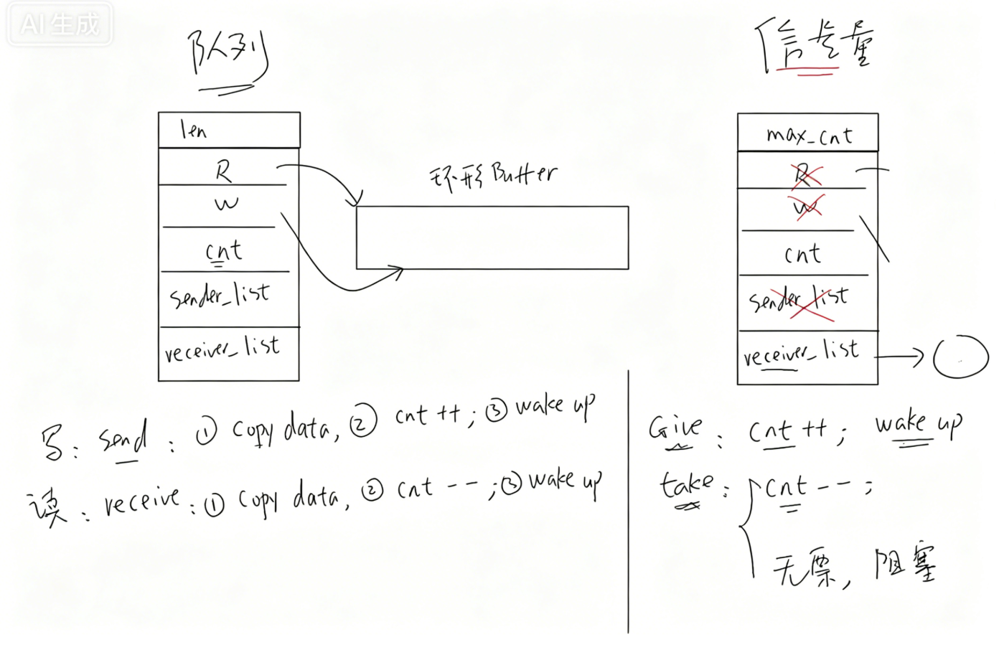


## 3.信号量相关API

### 3.1 创建信号量

- **API介绍**

  - 使用信号量之前，要先创建，得到一个句柄，使用信号量时，要使用句柄来表明使用哪个信号量；
  -  对于**二进制信号量、计数型信号量**，它们的创建函数不一样：

  |          | 二进制信号量                                   | 计数型信号量                   |
  | -------- | ---------------------------------------------- | ------------------------------ |
  | 动态创建 | xSemaphoreCreateBinary 计数值初始值为0         | xSemaphoreCreateCounting       |
  |          | vSemaphoreCreateBinary(过时了) 计数值初始值为1 |                                |
  | 静态创建 | xSemaphoreCreateBinaryStatic                   | xSemaphoreCreateCountingStatic |

- **函数原型**

  - 创建二进制信号量的函数原型如下

  ```c
  /* 创建一个二进制信号量，返回它的句柄。
   * 此函数内部会分配信号量结构体 
   * 返回值: 返回句柄，非NULL表示成功
   */
  SemaphoreHandle_t xSemaphoreCreateBinary( void );
  
  /* 创建一个二进制信号量，返回它的句柄。
   * 此函数无需动态分配内存，所以需要先有一个StaticSemaphore_t结构体，并传入它的指针
   * 返回值: 返回句柄，非NULL表示成功
   */
  SemaphoreHandle_t xSemaphoreCreateBinaryStatic( StaticSemaphore_t *pxSemaphoreBuffer );
  ```

  - 创建计数型信号量的函数原型如下

  ```c
  /* 创建一个计数型信号量，返回它的句柄。
   * 此函数内部会分配信号量结构体 
   * uxMaxCount: 最大计数值
   * uxInitialCount: 初始计数值
   * 返回值: 返回句柄，非NULL表示成功
   */
  SemaphoreHandle_t xSemaphoreCreateCounting(UBaseType_t uxMaxCount, UBaseType_t uxInitialCount);
  
  /* 创建一个计数型信号量，返回它的句柄。
   * 此函数无需动态分配内存，所以需要先有一个StaticSemaphore_t结构体，并传入它的指针
   * uxMaxCount: 最大计数值
   * uxInitialCount: 初始计数值
   * pxSemaphoreBuffer: StaticSemaphore_t结构体指针
   * 返回值: 返回句柄，非NULL表示成功
   */
  SemaphoreHandle_t xSemaphoreCreateCountingStatic( UBaseType_t uxMaxCount, 
                                                   UBaseType_t uxInitialCount, 
                                                   StaticSemaphore_t *pxSemaphoreBuffer );
  ```

### 3.2 删除

- 对于动态创建的信号量，不再需要它们时，可以删除它们以回收内存；
- **vSemaphoreDelete()**可以用来删除二进制信号量、计数型信号量，函数原型如下：

```c
/*
 * xSemaphore: 信号量句柄，你要删除哪个信号量
 */
void vSemaphoreDelete( SemaphoreHandle_t xSemaphore );
```

### 3.3 give/take

- 二进制信号量、计数型信号量的give、take操作函数是一样的；
- 这些函数也分为2个版本：给任务使用，给ISR使用。列表如下：

|      | 在任务中使用   | 在ISR中使用           |
| ---- | -------------- | --------------------- |
| give | xSemaphoreGive | xSemaphoreGiveFromISR |
| take | xSemaphoreTake | xSemaphoreTakeFromISR |

- **Give函数**

  - xSemaphoreGive的函数原型如下

  ```c
  BaseType_t xSemaphoreGive( SemaphoreHandle_t xSemaphore );
  ```

  - xSemaphoreGive函数的参数与返回值列表如下

  | 参数       | 说明                                                         |
  | ---------- | ------------------------------------------------------------ |
  | xSemaphore | 信号量句柄，释放哪个信号量                                   |
  | 返回值     | pdTRUE表示成功, 如果二进制信号量的计数值已经是1，再次调用此函数则返回失败； 如果计数型信号量的计数值已经是最大值，再次调用此函数则返回失败 |

  - xSemaphoreGiveFromISR函数的参数与返回值列表如下

  | 参数                      | 说明                                                         |
  | ------------------------- | ------------------------------------------------------------ |
  | xSemaphore                | 信号量句柄，释放哪个信号量                                   |
  | pxHigherPriorityTaskWoken | 如果释放信号量导致更高优先级的任务变为了就绪态， 则*pxHigherPriorityTaskWoken = pdTRUE |
  | 返回值                    | pdTRUE表示成功, 如果二进制信号量的计数值已经是1，再次调用此函数则返回失败； 如果计数型信号量的计数值已经是最大值，再次调用此函数则返回失败 |

- **Take函数**

  - xSemaphoreTake的函数原型如下

  ```
  BaseType_t xSemaphoreTake(
                     SemaphoreHandle_t xSemaphore,
                     TickType_t xTicksToWait
                 );
  ```

  - xSemaphoreTake函数的参数与返回值列表如下

  | 参数         | 说明                                                         |
  | ------------ | ------------------------------------------------------------ |
  | xSemaphore   | 信号量句柄，获取哪个信号量                                   |
  | xTicksToWait | 如果无法马上获得信号量，阻塞一会： 0：不阻塞，马上返回 portMAX_DELAY: 一直阻塞直到成功 其他值: 阻塞的Tick个数，可以使用*pdMS_TO_TICKS()*来指定阻塞时间为若干ms |
  | 返回值       | pdTRUE表示成功                                               |

  - xSemaphoreTakeFromISR的函数原型如下

  ```c
  BaseType_t xSemaphoreTakeFromISR(
                          SemaphoreHandle_t xSemaphore,
                          BaseType_t *pxHigherPriorityTaskWoken
                      );
  ```

  - xSemaphoreTakeFromISR函数的参数与返回值列表如下

  | 参数                      | 说明                                                         |
  | ------------------------- | ------------------------------------------------------------ |
  | xSemaphore                | 信号量句柄，获取哪个信号量                                   |
  | pxHigherPriorityTaskWoken | 如果获取信号量导致更高优先级的任务变为了就绪态， 则*pxHigherPriorityTaskWoken = pdTRUE |
  | 返回值                    | pdTRUE表示成功                                               |

- **pxHigherPriorityTaskWoken()函数**

  - 函数原型如下

  ```c
  BaseType_t xSemaphoreGiveFromISR(
                          SemaphoreHandle_t xSemaphore,
                          BaseType_t *pxHigherPriorityTaskWoken
                      );
  ```

---


# 9-2-1 信号量实验_控制车辆运行

本节课在上一个程序的基础上，演示信号量的几种情况。

## 1.不使用信号量：让三辆车同时到达最右边

- 复制上一个程序，重命名为`18_Chapter12_Semaphore_Not_Use`；
- 在上个程序的基础上，我们不需要等待任何红外遥控器的信号，让它简单的从左跑到右，只改变**CarTask()**函数，代码改造如下；
- 这样，汽车的移动不需要任何控制，上电后，三个任务轮流跑，它们每个50ms移动一个像素，最后移动到最右时就不动了；

```c
static void CarTask(void *params)
{
	struct car *pcar = params;
	struct ir_data idata;
	
	/* 创建自己的队列 */
	QueueHandle_t xQueueIR = xQueueCreate(10, sizeof(struct ir_data));
	
	/* 注册队列 */
	RegisterQueueHandle(xQueueIR);
	
	/* 先显示汽车 */
	ShowCar(pcar);
	
	while(1)
	{
		/* 读取按键值:读队列 */
		//xQueueReceive(xQueueIR, &idata, portMAX_DELAY);
		
		/* 控制汽车往右移动 */
		//if (idata.val == pcar->control_key)
		{
			if (pcar->x < g_xres - CAR_LENGTH)
			{
				/* 隐藏汽车 */
				HideCar(pcar);
				
				/* 调整位置 */
				pcar->x += 1;
				if (pcar->x > g_xres - CAR_LENGTH)
				{
					pcar->x = g_xres - CAR_LENGTH;
				}
				
				/* 重新显示汽车 */
				ShowCar(pcar);
				
				vTaskDelay(50);
				
				if (pcar->x == g_xres - CAR_LENGTH)
					vTaskDelete(NULL);
			}
		}
	}
}
```


## 2.使用计数型信号量

### 2.1 只有两辆车可以进城

- 复制上一个程序，重命名为`19_Chapter12_Semaphore_Count`；

- 本程序使用计数型信号量，同时允许多辆车进城；

- **程序完善**

  - 在上一个代码的基础上，在car_game()函数中创建一个初始值为2、最大值为3的信号量；
  - 然后在CarTask()函数中获得信号量，只有成功获取了信号量才能够运行后续代码；
  - 这样，烧录代码后就只有两辆车能够进城，剩下的一辆将永远都停在起始点；

  ```c
  /* 信号量句柄 */
  static SemaphoreHandle_t g_xSemTicks;
  
  static void CarTask(void *params)
  {
  	// ...
      
  	/* 先获取信号量 */
  	xSemaphoreTake(g_xSemTicks, portMAX_DELAY);
  	
  	// ...
  }
  
  void car_game(void)
  {
  	// ...
      
      /* 创建信号量 */
  	g_xSemTicks = xSemaphoreCreateCounting(3, 2);
  	
  	// ...
  }
   
  ```

### 2.2 两辆车进城后第三辆车才进城

- 我们在上一个代码的基础上，在任务函数中添加“释放信号量”的操作；
- 当小车进城达到最右边后，它会释放信号量，然后再自杀，这样最后一辆车就可以获取信号量了，然后开始进城；

```c
/* 汽车任务函数 */
static void CarTask(void *params)
{
	// ...
	while(1)
	{
		/* 读取按键值:读队列 */
		//xQueueReceive(xQueueIR, &idata, portMAX_DELAY);
		
		/* 控制汽车往右移动 */
		//if (idata.val == pcar->control_key)
		{
			if (pcar->x < g_xres - CAR_LENGTH)
			{
				/* 隐藏汽车 */
				HideCar(pcar);
				
				/* 调整位置 */
				pcar->x += 1;
				if (pcar->x > g_xres - CAR_LENGTH)
				{
					pcar->x = g_xres - CAR_LENGTH;
				}
				
				/* 重新显示汽车 */
				ShowCar(pcar);
				
				vTaskDelay(50);
				
				if (pcar->x == g_xres - CAR_LENGTH)
				{
					/* 到达最右边后释放信号量 */
					xSemaphoreGive(g_xSemTicks);			// 增加释放信号量的操作
					vTaskDelete(NULL);
				}
			}
		}
	}
}
```

### 2.3 一辆一辆车进城

- 把上述创建的信号量的最大值限定为1的话，就只能是一辆一辆的进城；
- 将之前的程序复制，重命名为`20_Chapter12_Semaphore_Binary`；
- **在这个程序中，将之前创建的信号量的初始值改为1，这样就同一时间只能有一辆车在走；**

```c
/* 汽车业务层逻辑 */
void car_game(void)
{
	// ...
	
	/* 创建信号量 */
	g_xSemTicks = xSemaphoreCreateCounting(3, 1);
	
	// ...
}

```

### 2.4 执行顺序问题

- 处于阻塞状态的任务会在一个receive链表中，等待信息量的唤醒；
- **receive链表中的排序原则为**
  - 高优先级的可以插队，只要来了高优先级的则它排在最前面；
  - 同等优先级的根据调用Take函数的时刻排队，早调用的排在前面；
- **最终的顺序如下**
  - 如果项目中最后还创建了一个music任务，那么执行顺序应该是1、2、3；
  - 如果没有打开music任务，最终的执行顺序应该是3、1、2；
- **执行顺序机理解释**
  - 如果没有打开music任务，在MX_FREERTOS_Init()函数中调用car_game()后，创建3个任务；
  - 执行完MX_FREERTOS_Init()函数后，FreeRTOS内核才开始调度，这是由main函数的执行逻辑决定的；
  - 由于任务3最后创建，所以全局指针现在指向任务3，任务3先开始运行，获得信号量，进城后释放信号量；
  - 此时指针回到最开始，即任务1，因为任务3后面没有任务了，所以任务1运行，再到任务2运行；
  - 如果在最后还创建了music任务，那内核启动后music任务先运行，在没插蜂鸣器条件下察觉不到；
  - 然后任何就会直接切换到任务1了，接着到任务2，再到任务3；


## 3.使用二进制信号量

- 还可以使用二进制信号量进行汽车控制；
- 二进制信号量的初始值为0，这样每一辆车都无法获得信号量，都无法运行；
- **所以需要创建任务前先give一下，但是无论give多少下，对于二进制而言都只有一个有效；**
- 经过这样的改造，就会变成一辆辆车进城了；

---


# 9-2-2 信号量实验_优先级反转

## 1.优先级反转

- 低优先级的任务先创建并先运行，它take信号量，并开始运行；
- 中优先级的任务不需要信号量，它就绪后马上运行，且由于优先级更高，所以它会阻塞低优先级的任务，直到跑完并把cpu资源让给低优先级的任务；
- 对于高优先级的任务，当它就绪后想要take信号量，但是信号量已经被低优先级的任务给占有了，它也无法运行；
- 所以最后运行情况是
  - ①先运行，一段时间后②任务就绪，开始运行；
  - 然后③任务就绪，想要运行，但是没有信号量了，只能阻塞，再到②任务运行；
  - 若②任务运行完后放弃cpu资源那就会让①运行，否则另外两个都要一直等；

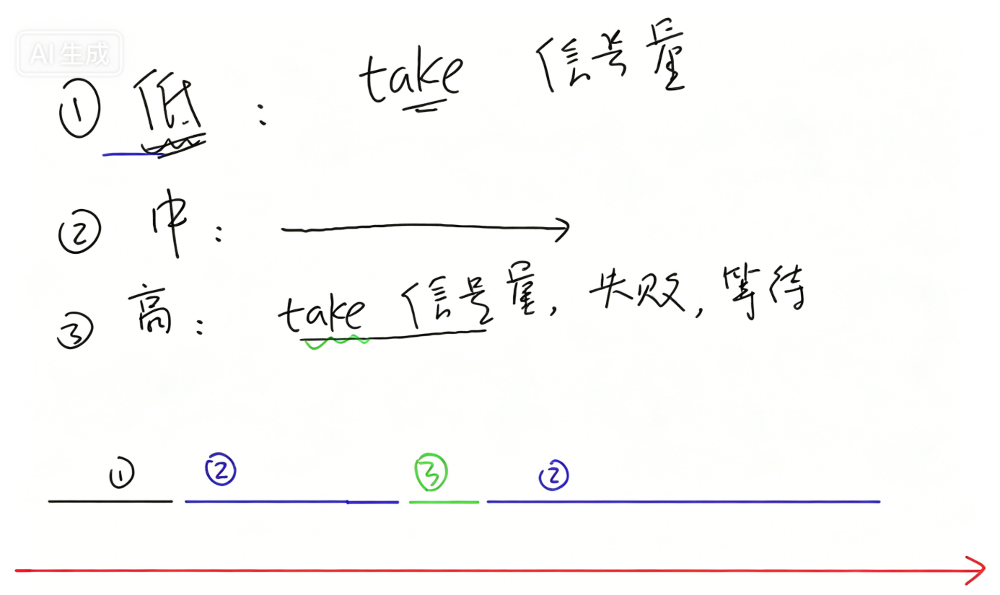


## 2.实验演示

### 2.1 项目移植

- 本节源码在`20_Chapter12_Semaphore_Binary`的基础上，改出`21_Chapter12_Semaphore_Priority_Inversion`；
- 复制上一个项目，然后重命名为`21_Chapter12_Semaphore_Priority_Inversion`；

### 2.1 项目改造

- v改变优先级**

  - 先让上一节课的三个任务的优先级不同，构造低、中、高优先级任务；

  ```c
  /* car_game函数中 */
  
  /* 创建3辆汽车的任务 */
  xTaskCreate(CarTask, "car1", 128, &g_cars[0], osPriorityNormal, NULL);
  xTaskCreate(CarTask, "car2", 128, &g_cars[1], osPriorityNormal + 2, NULL);
  xTaskCreate(CarTask, "car3", 128, &g_cars[2], osPriorityNormal + 3, NULL);
  ```

- **修改三个任务函数**

  - 任务1：与先前的任务函数基本一致，显示获得信号量，然后运行完后释放任务量并自杀；
  - 任务2：它创建之后先vTaskDelay(1000)，即创建后需要1s后才运行，并且它不获取信号量，**在while(1)里面使用的是mdelay()**，运行完后自杀；
  - 任务3：它创建之后先vTaskDelay(2000)，即创建后需要2s后才运行，它需要获得信号量，**while(1)里面使用的是mdelay()**，运行完后自杀；

  ```c
  /* 汽车1任务函数 */
  static void Car1Task(void *params)
  {
  	struct car *pcar = params;
  	struct ir_data idata;
  	
  	/* 创建自己的队列 */
  	QueueHandle_t xQueueIR = xQueueCreate(10, sizeof(struct ir_data));
  	
  	/* 注册队列 */
  	RegisterQueueHandle(xQueueIR);
  	
  	/* 先显示汽车 */
  	ShowCar(pcar);
  	
  	/* 先获取信号量 */
  	xSemaphoreTake(g_xSemTicks, portMAX_DELAY);
  	
  	while(1)
  	{
  		/* 读取按键值:读队列 */
  		//xQueueReceive(xQueueIR, &idata, portMAX_DELAY);
  		
  		/* 控制汽车往右移动 */
  		//if (idata.val == pcar->control_key)
  		{
  			if (pcar->x < g_xres - CAR_LENGTH)
  			{
  				/* 隐藏汽车 */
  				HideCar(pcar);
  				
  				/* 调整位置 */
  				pcar->x += 1;
  				if (pcar->x > g_xres - CAR_LENGTH)
  				{
  					pcar->x = g_xres - CAR_LENGTH;
  				}
  				
  				/* 重新显示汽车 */
  				ShowCar(pcar);
  				
  				vTaskDelay(50);
  				
  				if (pcar->x == g_xres - CAR_LENGTH)
  				{
  					/* 到达最右边后释放信号量 */
  					xSemaphoreGive(g_xSemTicks);
  					vTaskDelete(NULL);
  				}
  			}
  		}
  	}
  }
  
  /* 汽车2任务函数 */
  static void Car2Task(void *params)
  {
  	struct car *pcar = params;
  	struct ir_data idata;
  	
  	vTaskDelay(1000);
  	
  	/* 创建自己的队列 */
  	QueueHandle_t xQueueIR = xQueueCreate(10, sizeof(struct ir_data));
  	
  	/* 注册队列 */
  	RegisterQueueHandle(xQueueIR);
  	
  	/* 先显示汽车 */
  	ShowCar(pcar);
  	
  	/* 先获取信号量 */
  	//xSemaphoreTake(g_xSemTicks, portMAX_DELAY);
  	
  	while(1)
  	{
  		/* 读取按键值:读队列 */
  		//xQueueReceive(xQueueIR, &idata, portMAX_DELAY);
  		
  		/* 控制汽车往右移动 */
  		//if (idata.val == pcar->control_key)
  		{
  			if (pcar->x < g_xres - CAR_LENGTH)
  			{
  				/* 隐藏汽车 */
  				HideCar(pcar);
  				
  				/* 调整位置 */
  				pcar->x += 1;
  				if (pcar->x > g_xres - CAR_LENGTH)
  				{
  					pcar->x = g_xres - CAR_LENGTH;
  				}
  				
  				/* 重新显示汽车 */
  				ShowCar(pcar);
  				
  				//vTaskDelay(50);
  				mdelay(50);
  				
  				if (pcar->x == g_xres - CAR_LENGTH)
  				{
  					/* 到达最右边后释放信号量 */
  					//xSemaphoreGive(g_xSemTicks);
  					vTaskDelete(NULL);
  				}
  			}
  		}
  	}
  }
  
  /* 汽车3任务函数 */
  static void Car3Task(void *params)
  {
  	struct car *pcar = params;
  	struct ir_data idata;
  	
  	/* 创建自己的队列 */
  	QueueHandle_t xQueueIR = xQueueCreate(10, sizeof(struct ir_data));
  	
  	/* 注册队列 */
  	RegisterQueueHandle(xQueueIR);
  	
  	/* 先显示汽车 */
  	ShowCar(pcar);
  	
  	vTaskDelay(2000);
  	
  	/* 先获取信号量 */
  	xSemaphoreTake(g_xSemTicks, portMAX_DELAY);
  	
  	while(1)
  	{
  		/* 读取按键值:读队列 */
  		//xQueueReceive(xQueueIR, &idata, portMAX_DELAY);
  		
  		/* 控制汽车往右移动 */
  		//if (idata.val == pcar->control_key)
  		{
  			if (pcar->x < g_xres - CAR_LENGTH)
  			{
  				/* 隐藏汽车 */
  				HideCar(pcar);
  				
  				/* 调整位置 */
  				pcar->x += 1;
  				if (pcar->x > g_xres - CAR_LENGTH)
  				{
  					pcar->x = g_xres - CAR_LENGTH;
  				}
  				
  				/* 重新显示汽车 */
  				ShowCar(pcar);
  				
  				//vTaskDelay(50);
  				mdelay(50);
  				
  				if (pcar->x == g_xres - CAR_LENGTH)
  				{
  					/* 到达最右边后释放信号量 */
  					xSemaphoreGive(g_xSemTicks);
  					vTaskDelete(NULL);
  				}
  			}
  		}
  	}
  }
  ```

- **项目效果**
  - 上电后，任务1先运行，它占据信号量；
  - 1s后，任务2就绪，它的优先级更高，它运行，任务1进入阻塞态；
  - 等到任务2运行完后自杀，继续由任务1运行，任务1运行完后释放信号量并自杀，任务3才开始运行；
  - **将任务2最后的自杀注释掉，由于它内部使用的是mdelay()，它将永远都不让出cpu资源，即使是任务2的车跑到最右边了，其余车也无法运行；**

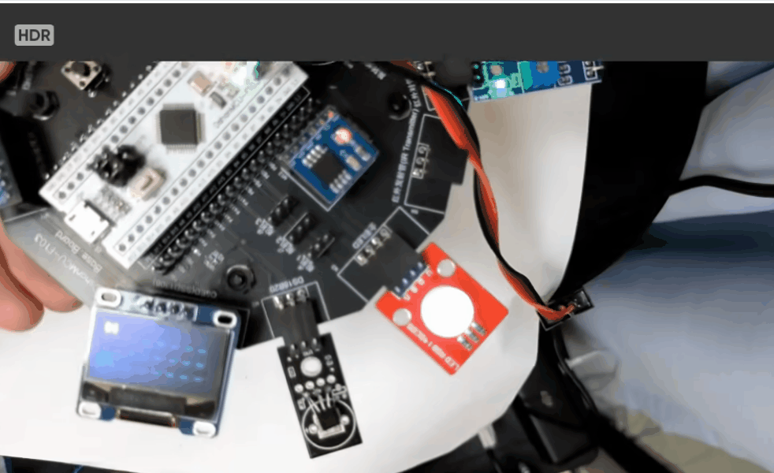


## 3.生活例子再现

上面的情况可以用下面的生活例子来解释：

- 学校有一个超算，学生先来按了指纹，它正在用超算；
- 然后后面主任来了，他带了一群人来参观，说超算太吵了让学生先关了超算；
- 后面校长又来了，他也要用超算，但是超算已经按了学生的指纹了，所以必须等学生的超算任务完成才能轮到校长；
- 在这里，校长优先级最高，主任次之，学生再次之；
- 但是最低优先级的学生被中优先级的主人卡住了，但最高优先级的校长又必须等待最低优先级的学生，这样就发生了优先级反转；

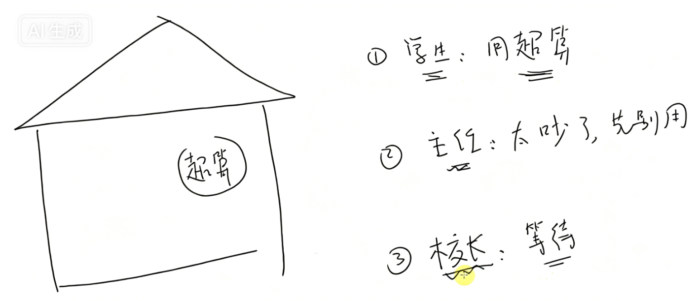

---


# 9-3 互斥量_领导临时提拔你(解决优先级反转)

## 1.内容介绍

- 本节课程讲解互斥量，对应的课程资料为**第13章——互斥量(mutex)；**
- 本节源码在`21_Chapter12_Semaphore_Priority_Inversion`的基础上，改出`22_Chapter13_Mutex_Priority_Inversion`；
- 复制上一节源码，重命名为`22_Chapter13_Mutex_Priority_Inversion`；


## 2.互斥量的定义

### 2.1 生活例子讲解

- 学生正在用超算，这时候主任突然带一群人来参观，主任的优先级更高，学生只能先停等待主任参观完；
- 这是校长也过来了，他也要用超算，但是学生没办法让给校长，因为有个高优先级的主任不让他用超算；
- 这时候，校长提升学生的优先级至与自己相等，这样学生就能先用而不理主任了；
- **等到学生用完后需要主动恢复自己的优先级，校长就可以运行了**，主任需要等到校长用完才能继续运行；
- 互斥量就可以实现这样的目的，本质就是**学生继承了校长的优先级，所以互斥量又叫优先级继承**；
- 这里的互斥量就是一开始Give的那个信号量，它们两个任务要抢一个东西，所以是互斥量，**互斥量即为互斥锁；**

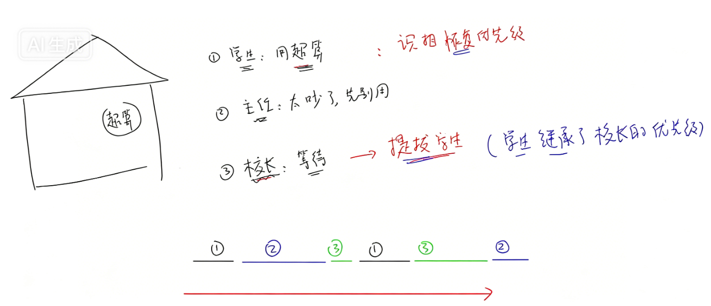

### 2.2 FreeRTOS中互斥量的本质

- 三个任务：高优先级H、中优先级M、低优先级L；
- **信号量的优先级反转**
  - 低优先级L拿到**信号量**正在运行；
  - 高优先级H也要这个信号量，阻塞等待；
  - 此时中优先级M就绪开始跑；
  - M一直占用CPU，L得不到运行、释放不了信号量；
  - **高优先级 H 被中优先级 M 卡死；**
  - **即普通信号量（二值 / 计数）存在优先级反转问题**
- **互斥量内置优先级继承机制**
  - 低优先级**L**持有互斥量；
  - 高优先级**H**申请不到互斥量，阻塞；
  - **FreeRTOS内核自动把L的优先级临时提升到和H一样高**；
  - L变成高优先级，**不会被中优先级M抢占**；
  - L快速跑完、释放互斥量；
  - L优先级**自动恢复原值**，H立刻拿到互斥量运行；
  - 互斥量可以完美避开中间优先级任务插队，**彻底解决优先级反转；**

- 注意：优先级继承是互斥量的天然属性，是由FreeRTOS内核逻辑决定的，它不能在中断中执行，而且也不能在项目中一直使用互斥量；


## 3.互斥量相关API

### 3.1 创建

- **信号量**

  - **互斥量是一种特殊的二进制信号量，它的句柄类型和各个API保持与信号量的一致；**
  - 使用互斥量时，先创建、然后去获得、释放它；
  - 使用句柄来表示一个互斥量；

- **创建互斥量**

  - 创建互斥量的函数有2种：动态分配内存，静态分配内存，函数原型如下

  ```c
  /* 创建一个互斥量，返回它的句柄。
   * 此函数内部会分配互斥量结构体 
   * 返回值: 返回句柄，非NULL表示成功
   */
  SemaphoreHandle_t xSemaphoreCreateMutex( void );
  
  /* 创建一个互斥量，返回它的句柄。
   * 此函数无需动态分配内存，所以需要先有一个StaticSemaphore_t结构体，并传入它的指针
   * 返回值: 返回句柄，非NULL表示成功
   */
  SemaphoreHandle_t xSemaphoreCreateMutexStatic( StaticSemaphore_t *pxMutexBuffer );
  ```

- **使用互斥量的前提**

  - **要想使用互斥量，需要在配置文件FreeRTOSConfig.h中定义**

  ```c
  #define configUSE_MUTEXES 1
  ```

### 3.2 其他函数

- **要注意的是，互斥量不能在ISR中使用；**

- 各类操作函数，比如删除、give/take，跟一般信号量一样；

```c
/*
 * xSemaphore: 信号量句柄，你要删除哪个信号量, 互斥量也是一种信号量
 */
void vSemaphoreDelete( SemaphoreHandle_t xSemaphore );

/* 释放 */
BaseType_t xSemaphoreGive( SemaphoreHandle_t xSemaphore );


/* 获得 */
BaseType_t xSemaphoreTake(
                   SemaphoreHandle_t xSemaphore,
                   TickType_t xTicksToWait
               );
```


## 4.程序实验

### 4.1 把创建信号量改为创建互斥量

- 在game2.c文件的car_game()函数中，把原来创建信息量的代码改为创建互斥量；
- **系统创建时它会把互斥量默认的设为1**，这样应当三辆汽车按照上述的效果运行；

```c
/* 汽车业务层逻辑 */
void car_game(void)
{
	// ...
	
	/* 创建信号量 */
	//g_xSemTicks = xSemaphoreCreateCounting(3, 1);
	g_xSemTicks = xSemaphoreCreateMutex();			// 初始值为1
	
	// ...
}
```

- 但是实际效果中，当任务3想要获得互斥量并将任务1提高优先级后，任务1并没有继续走；

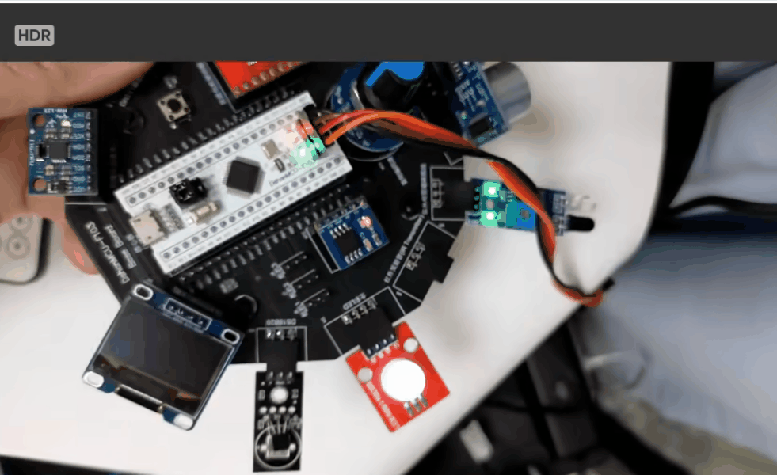

- 这是因为在draw.c文件以及driver_mpu6050.c文件使用了**全局变量保护I2C**，这个全局变量在这里变得危险，两个任务产生了冲突；

  - 任务2在跑的时候，才跑到LCD_FlushRegion()函数时，就被切换了，此时bInUsed变量还是1；
  - 任务3跑来到这里，一直卡在while循环中，且它的优先级最高，任务2没有机会更改这个变量，所以导致卡住了；

  ```c
  /* draw.c文件 */
  
  volatile int bInUsed = 0;
  void draw_flushArea(byte x, byte y, byte w, byte h)
  {
      while (bInUsed);		// 全局变量保护
      //taskENTER_CRITICAL();
      bInUsed = 1;
      LCD_FlushRegion(x, y, w, h);
      bInUsed = 0;
      //taskEXIT_CRITICAL();
  }
  
  /* driver_mpu6050.c文件 */
  /* MPU6050任务函数 */
  void MPU6050_Task(void *params)
  {
  	int16_t AccX;
  	struct mpu6050_data result;
  	int ret;
  	extern volatile int bInUsed;
  	
  	while(1)
  	{
  		/* 读数据 */
  		while (bInUsed);		// 全局变量保护
  		bInUsed = 1;
  		ret = MPU6050_ReadData(&AccX, NULL, NULL, NULL, NULL, NULL);
  		bInUsed = 0;
  		
  		if (0 == ret)
  		{
  			/* 解析数据 */
  			MPU6050_ParseData(AccX, 0, 0, 0, 0, 0, &result);
  			
  			/* 写队列 */
  			xQueueSend(g_xQueueMPU6050, &result, 0);
  		}
  		/* Delay */
  		vTaskDelay(50);
  	}
  }
  
  ```

### 4.2 用互斥量解决I2C访问冲突的问题

- 可以用互斥量改造**前面的draw.c文件以及driver_mpu6050.c文件**中使用全局变量来保护I2C这个临界资源的问题；
- 在freertos.c文件中定义两个函数，它们实现对全局互斥量的获取和释放；

```c
#include "semphr.h"

static SemaphoreHandle_t g_xI2CMutex;

void GetI2C(void)
{
	/* 等待一个互斥量 */
	xSemaphoreTake(g_xI2CMutex, portMAX_DELAY);
}

void PutI2C(void)
{
	/* 释放互斥量 */
	xSemaphoreGive(g_xI2CMutex);
}

```

- 接着把draw.c文件刷新显存函数中的全局变量保护改为互斥量保护；

```c
extern void GetI2C(void);
extern void PutI2C(void);

//volatile int bInUsed = 0;
void draw_flushArea(byte x, byte y, byte w, byte h)
{
    //while (bInUsed);
    //taskENTER_CRITICAL();
    //bInUsed = 1;
	GetI2C();
    LCD_FlushRegion(x, y, w, h);
	PutI2C();
    //bInUsed = 0;
    //taskEXIT_CRITICAL();
}
```

- 同样的把driver_mpu6050.c文件中的全局变量也改为互斥量保护；

```c
/* MPU6050任务函数 */
void MPU6050_Task(void *params)
{
	int16_t AccX;
	struct mpu6050_data result;
	int ret;
	//extern volatile int bInUsed;
	extern void GetI2C(void);
	extern void PutI2C(void);
	
	while(1)
	{
		/* 读数据 */
		//while (bInUsed);
		//bInUsed = 1;
		GetI2C();
		ret = MPU6050_ReadData(&AccX, NULL, NULL, NULL, NULL, NULL);
		//bInUsed = 0;
		PutI2C();
		
		if (0 == ret)
		{
			/* 解析数据 */
			MPU6050_ParseData(AccX, 0, 0, 0, 0, 0, &result);
			
			/* 写队列 */
			xQueueSend(g_xQueueMPU6050, &result, 0);
		}
		/* Delay */
		vTaskDelay(50);
	}
}
```

### 4.3 程序烧录

- 经过这样改造之后，效果如下：
  - 一开始任务1先跑，1s后任务2再跑，2s后任务3启动；
  - 但是由于任务3没有互斥量，它无法运行，但它会提升任务1的优先级；
  - 但是由于任务1内部有vTaskDelay()函数，所以后续任务1和任务2交替跑；
  - 直到1跑完后，互斥量给到任务3，任务3跑完才轮到任务2跑；


## 5.总结

本节课主要学习了互斥量的问题，用它完成了两个问题：

- 解决信号量中优先级反转的问题；
- 解决OLED显示和MPU6050数据获取中全局变量保护的资源冲突隐患问题；

---


# 10-1 事件组的本质

## 1.事件组的目的

- 在前面的列表、信号量、互斥量中，写入或是读取都只是能够唤醒一个任务，无法唤醒多个任务；
- 而事件组要解决的就是**能够唤醒多个任务**的问题；

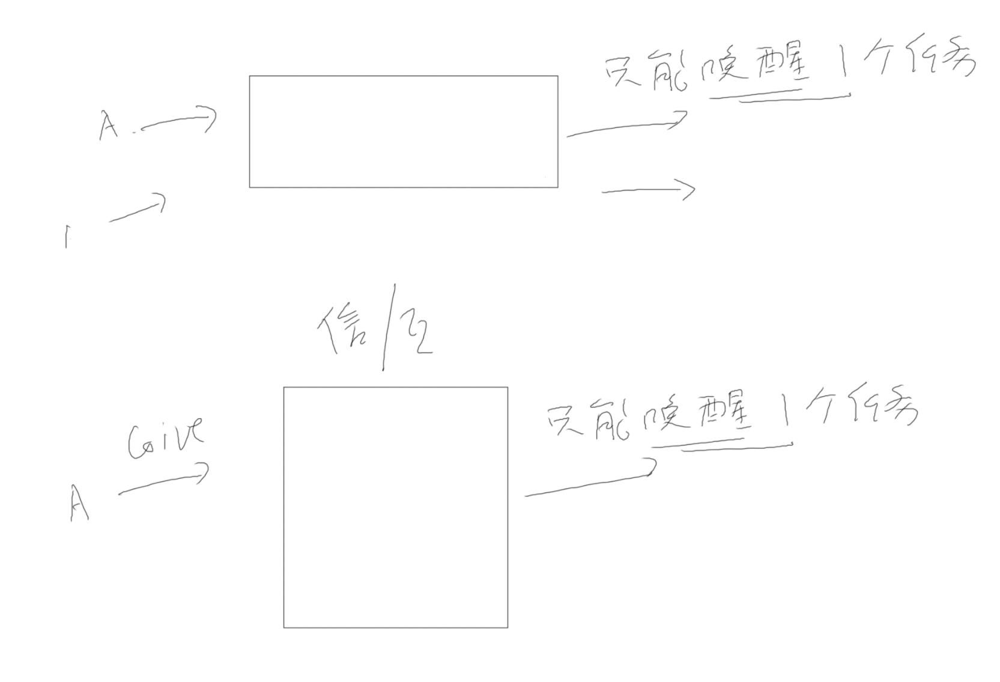


## 2.事件组的机制

如由下图所示即为事件组的实现机制。一个事件组除了有一个int数值外，还有一个链表，这个链表中存放着一个个正在等待的任务。

- **int数值**
  - 这个int数值中，高8位不用，它只用于表示事件的关系；
  - 对于低位，每一位表示一个事件，当对应位的事件发生时它就在对应位写入1，否则为0；

- **链表数据**
  - 在链表中存放着一个个任务的结构体，这个结构体中也有一个int值；
  - 对于高八位，它存放了各个事件的关系，低位则表示这个任务正在等待哪些事件发生；

- **作用机制**
  - 假设存在任务C，这个任务C会写入数据到事件组；
  - 当事件组写入数据后它将遍历整个链表，看一下是否有任务满足目前的事件发生关系，若满足则唤醒否则继续阻塞等待；

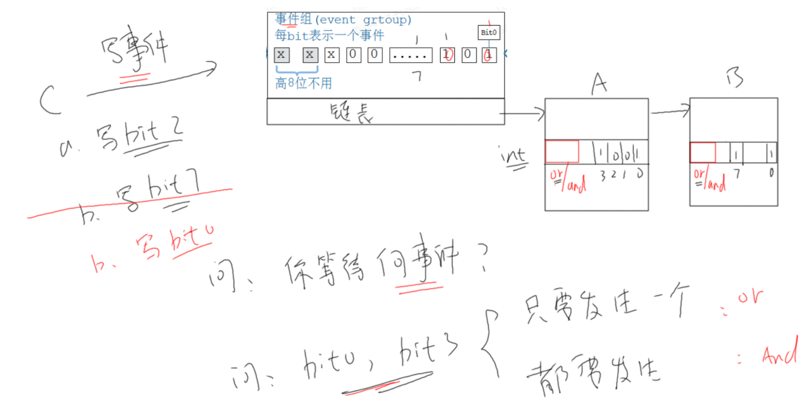


## 3.事件组相关API

### 3.1 创建

- 有两种创建方法：动态分配内存、静态分配内存；
- 函数原型如下

```c
/* 创建一个事件组，返回它的句柄。
 * 此函数内部会分配事件组结构体 
 * 返回值: 返回句柄，非NULL表示成功
 */
EventGroupHandle_t xEventGroupCreate( void );

/* 创建一个事件组，返回它的句柄。
 * 此函数无需动态分配内存，所以需要先有一个StaticEventGroup_t结构体，并传入它的指针
 * 返回值: 返回句柄，非NULL表示成功
 */
EventGroupHandle_t xEventGroupCreateStatic( StaticEventGroup_t * pxEventGroupBuffer );
```

### 3.2 删除

- 删除事件组的函数原型如下

```c
/*
 * xEventGroup: 事件组句柄，你要删除哪个事件组
 */
void vEventGroupDelete( EventGroupHandle_t xEventGroup )
```

### 3.3 设置事件

- 可以设置事件组的某个位、某些位，使用的函数有2个
  - 在任务中使用**xEventGroupSetBits()**；
  - 在ISR中使用**xEventGroupSetBitsFromISR()**

- 函数原型如下

```c
/* 设置事件组中的位
 * xEventGroup: 哪个事件组
 * uxBitsToSet: 设置哪些位? 
 *              如果uxBitsToSet的bitX, bitY为1, 那么事件组中的bitX, bitY被设置为1
 *              可以用来设置多个位，比如 0x15 就表示设置bit4, bit2, bit0
 * 返回值: 返回原来的事件值(没什么意义, 因为很可能已经被其他任务修改了)
 */
EventBits_t xEventGroupSetBits( EventGroupHandle_t xEventGroup,
                                    const EventBits_t uxBitsToSet );

/* 设置事件组中的位
 * xEventGroup: 哪个事件组
 * uxBitsToSet: 设置哪些位? 
 *              如果uxBitsToSet的bitX, bitY为1, 那么事件组中的bitX, bitY被设置为1
 *              可以用来设置多个位，比如 0x15 就表示设置bit4, bit2, bit0
 * pxHigherPriorityTaskWoken: 有没有导致更高优先级的任务进入就绪态? pdTRUE-有, pdFALSE-没有
 * 返回值: pdPASS-成功, pdFALSE-失败
 */
BaseType_t xEventGroupSetBitsFromISR( EventGroupHandle_t xEventGroup,
									  const EventBits_t uxBitsToSet,
									  BaseType_t * pxHigherPriorityTaskWoken );
```

- **xEventGroupSetBitsFromISR**函数问题
  - ISR中的函数，比如队列函数**xQueueSendToBackFromISR**、信号量函数**xSemaphoreGiveFromISR**，它们会唤醒某个任务，最多只会唤醒1个任务；
  - 但设置事件组时，有可能导致多个任务被唤醒，这会带来很大的不确定性；
  - 所以**xEventGroupSetBitsFromISR**函数不直接设置事件组，而是给一个FreeRTOS后台任务daemon task发送队列数据，由这个任务来设置事件组；
  - 如果后台任务的优先级比当前被中断的任务优先级高，**xEventGroupSetBitsFromISR**会设置**pxHigherPriorityTaskWoken**为pdTRUE；
  - 如果daemon task成功地把队列数据发送给了后台任务，那么**xEventGroupSetBitsFromISR**的返回值就是pdPASS；

### 3.4 等待事件

- 使用**xEventGroupWaitBits**来等待事件
  - 可以等待某一位、某些位中的任意一个，也可以等待多位；
  - 等到期望的事件后，还可以清除某些位；

- 函数原型如下

```c
EventBits_t xEventGroupWaitBits( EventGroupHandle_t xEventGroup,
                                 const EventBits_t uxBitsToWaitFor,
                                 const BaseType_t xClearOnExit,
                                 const BaseType_t xWaitForAllBits,
                                 TickType_t xTicksToWait );
```

- 函数参数说明列表如下

|    **参数**     | **说明**                                                     |
| :-------------: | :----------------------------------------------------------- |
|   xEventGroup   | 等待哪个事件组？                                             |
| uxBitsToWaitFor | 等待哪些位？哪些位要被测试？                                 |
| xWaitForAllBits | 怎么测试？是"AND"还是"OR"？ pdTRUE: 等待的位，全部为1; pdFALSE: 等待的位，某一个为1即可 |
|  xClearOnExit   | 函数提出前是否要清除事件？ pdTRUE: 清除uxBitsToWaitFor指定的位 pdFALSE: 不清除 |
|  xTicksToWait   | 如果期待的事件未发生，阻塞多久。 可以设置为0：判断后即刻返回； 可设置为portMAX_DELAY：一定等到成功才返回； 可以设置为期望的Tick Count，一般用*pdMS_TO_TICKS()*把ms转换为Tick Count |
|     返回值      | 返回的是事件值， 如果期待的事件发生了，返回的是"非阻塞条件成立"时的事件值； 如果是超时退出，返回的是超时时刻的事件值。 |

- 举例如下
  - 可以使用*xEventGroupWaitBits()*等待期望的事件，它发生之后再使用*xEventGroupClearBits()*来清除；
  - 但是这两个函数之间，有可能被其他任务或中断抢占，它们可能会修改事件组；
  - 可以使用设置*xClearOnExit*为pdTRUE，使得对事件组的测试、清零都在*xEventGroupWaitBits()*函数内部完成，这是一个原子操作；

| 事件组的值 | uxBitsToWaitFor | xWaitForAllBits | 说明                                                         |
| :--------: | :-------------: | :-------------: | :----------------------------------------------------------- |
|    0100    |      0101       |     pdTRUE      | 任务期望bit0,bit2都为1， 当前值只有bit2满足，任务进入阻塞态； 当事件组中bit0,bit2都为1时退出阻塞态 |
|    0100    |      0110       |     pdFALSE     | 任务期望bit0,bit2某一个为1， 当前值满足，所以任务成功退出    |
|    0100    |      0110       |     pdTRUE      | 任务期望bit1,bit2都为1， 当前值不满足，任务进入阻塞态； 当事件组中bit1,bit2都为1时退出阻塞态 |

### 3.5 同步点

- 使用 **xEventGroupSync()** 函数可以同步多个任务
  - 可以设置某位、某些位，表示自己做了什么事
  - 可以等待某位、某些位，表示要等等其他任务
  - 期望的时间发生后， **xEventGroupSync()** 才会成功返回。
  - **xEventGroupSync**成功返回后，会清除事件

- **xEventGroupSync** 函数原型如下：

```text
EventBits_t xEventGroupSync(    EventGroupHandle_t xEventGroup,
                                const EventBits_t uxBitsToSet,
                                const EventBits_t uxBitsToWaitFor,
                                TickType_t xTicksToWait );
```

- 参数列表如下：

|    **参数**     | **说明**                                                     |
| :-------------: | ------------------------------------------------------------ |
|   xEventGroup   | 哪个事件组？                                                 |
|   uxBitsToSet   | 要设置哪些事件？我完成了哪些事件？ 比如0x05(二进制为0101)会导致事件组的bit0,bit2被设置为1 |
| uxBitsToWaitFor | 等待那个位、哪些位？ 比如0x15(二级制10101)，表示要等待bit0,bit2,bit4都为1 |
|  xTicksToWait   | 如果期待的事件未发生，阻塞多久。 可以设置为0：判断后即刻返回； 可设置为portMAX_DELAY：一定等到成功才返回； 可以设置为期望的Tick Count，一般用*pdMS_TO_TICKS()*把ms转换为Tick Count |
|     返回值      | 返回的是事件值， 如果期待的事件发生了，返回的是"非阻塞条件成立"时的事件值； 如果是超时退出，返回的是超时时刻的事件值。 |

---


# 10-2 事件组实验_车辆协同

## 1.事件组广播

### 1.1 内容介绍

- 本节源码在`22_Chapter13_Mutex_Priority_Inversion`的基础上，改出`23_Chapter14_Eventgroup_Broadcast`；
- 复制`22_Chapter13_Mutex_Priority_Inversion`，重命名为`23_Chapter14_Eventgroup_Broadcast`；

* `23_Chapter14_Eventgroup_Broadcast`功能：car1到站后，广播通知car2，car3启动；

### 1.2 项目改造

- **创建一个事件组并修改优先级**

  - 注释原来的互斥量，并创建一个事件组，同样的是需要先在前面定义一个全局的事件组变量；
  - 除此之外，为了让任务2和任务3同时运行，将两者的优先级改为相同；

  ```c
  /* 事件组 */
  static EventGroupHandle_t g_xEventCar;
  
  /* 汽车业务层逻辑 */
  void car_game(void)
  {
  	// ...
  	
  	/* 创建信号量 */
  	//g_xSemTicks = xSemaphoreCreateCounting(3, 1);
  	//g_xSemTicks = xSemaphoreCreateMutex();			// 初始值为1
  	
  	g_xEventCar = xEventGroupCreate();		/* 创建事件组 */
  	
  	//  ...
  	
  	/* 创建3辆汽车的任务 */
  	xTaskCreate(Car1Task, "car1", 128, &g_cars[0], osPriorityNormal, NULL);
  	xTaskCreate(Car2Task, "car2", 128, &g_cars[1], osPriorityNormal + 2, NULL);		/* 两者优先级一致 */
  	xTaskCreate(Car3Task, "car3", 128, &g_cars[2], osPriorityNormal + 2, NULL);
  }
  ```

- **任务1设置事件组**

  - 任务1函数在到达最右边后设置事件组的bit0位；
  - 并取消任务1的获取信号量，让它上电就能运行；

  ```c
  /* 汽车1任务函数 */
  static void Car1Task(void *params)
  {
  	// ...
  	
  	/* 先获取信号量 */
  	//xSemaphoreTake(g_xSemTicks, portMAX_DELAY);
  	
  	// ...
  					/* 到达最右边后释放信号量 */
  					//xSemaphoreGive(g_xSemTicks);
  					
  					/* 设置事件组：bit0 */
  					xEventGroupSetBits(g_xEventCar, (1<<0));
  					
  					vTaskDelete(NULL);
  	// ...
  }
  ```

- **务2和任务3等待事件**

  - 任务2函数和任务3函数在while(1)循环前都等待bit0事件，这样只有当任务1的车辆达到最右边后任务2和任务3才能运行；
  - 删除一开始的阻塞vTaskDelay()、注释掉获取信号量、释放信号量等；

  ```c
  /* 汽车2任务函数 */
  static void Car2Task(void *params)
  {
  	// ...
  	
  	/* 先获取信号量 */
  	//xSemaphoreTake(g_xSemTicks, portMAX_DELAY);
  	
  	/* 等待事件组：bit0 */
  	xEventGroupWaitBits(g_xEventCar, (1<<0), pdTRUE, pdFALSE, portMAX_DELAY);	/* pdTRUE表示读后清除，pdFALSE表示或的关系 */
  	
  	// ...
  					/* 到达最右边后释放信号量 */
  					//xSemaphoreGive(g_xSemTicks);
  					vTaskDelete(NULL);
  	// ...
  }
  
  /* 汽车3任务函数 */
  static void Car3Task(void *params)
  {
  	// ...
  	
  	/* 先获取信号量 */
  	//xSemaphoreTake(g_xSemTicks, portMAX_DELAY);
  	
  	/* 等待事件组：bit0 */
  	xEventGroupWaitBits(g_xEventCar, (1<<0), pdTRUE, pdFALSE, portMAX_DELAY);	/* pdTRUE表示读后清除，pdFALSE表示或的关系 */
  	
  	// ...
  					/* 到达最右边后释放信号量 */
  					//xSemaphoreGive(g_xSemTicks);
  					vTaskDelete(NULL);
  	// ...
  }
  ```

- **编译烧录**
  
  - 编译烧录后，任务1小车先走，走到最右边后，任务2和任务3的小车同时一块走；


## 2.等待或事件

### 2.1 内容介绍

- 本节源码在`23_Chapter14_Eventgroup_Broadcast`的基础上，改出`24_Chapter14_Eventgroup_Or`；
- 复制`23_Chapter14_Eventgroup_Broadcast`，重命名为`24_Chapter14_Eventgroup_Or`；

* `24_Chapter14_Eventgroup_Or`功能：car1或car2到站后，car3启动；

### 2.2 项目改造

- **对于任务1**

  - 保持原有操作不变，即任务1函数在到达最右边后设置事件组的bit0位；

- **对于任务2**

  - 注释等待事件组的代码，将中间的mdelay()函数改为vTaskDelay()函数，让它和任务1同时运行；
  - 在任务2函数在到达最右边后设置事件组的bit1位；

  ```c
  /* 汽车2任务函数 */
  static void Car2Task(void *params)
  {
  	// ...
  	
  	/* 等待事件组：bit0 */
  	//xEventGroupWaitBits(g_xEventCar, (1<<0), pdTRUE, pdFALSE, portMAX_DELAY);	/* pdTRUE表示读后清除，pdFALSE表示或的关系 */
  	
  	while(1)
  	{
  	// ...
  				
  				vTaskDelay(50);
  				//mdelay(50);
  				
  				if (pcar->x == g_xres - CAR_LENGTH)
  				{
  					/* 到达最右边后释放信号量 */
  					//xSemaphoreGive(g_xSemTicks);
  					
  					/* 设置事件组：bit0 */
  					xEventGroupSetBits(g_xEventCar, (1<<1));
  					
  					vTaskDelete(NULL);
  				}
  	// ...
  }
  ```

- **对于任务3**

  - 等待两个事件的或；

  ```c
  /* 汽车3任务函数 */
  static void Car3Task(void *params)
  {
  	/* 等待事件组：bit0 or bit1 */
      /* pdTRUE表示读后清除，pdFALSE表示或的关系 */
  	xEventGroupWaitBits(g_xEventCar, (1<<0) | (1<<1), pdTRUE, pdFALSE, portMAX_DELAY);
      
  	// ...
  }
  
  ```

- **编译烧录**

  - 这样上电瞬间任务1的小车先跑，我们可以条件任务1和任务2中小车的vTaskDelay()的大小来控制小车的速度，以控制哪个小车先到达；
  - 由于上一个工程将任务2和任务3的优先级设为一样了，所以如果任务1先达到，后面任务2和任务3会同时跑；
  - 可以把任务3的优先级＋1；


## 3.等待与事件

### 3.1 内容介绍

- 本节源码在`24_Chapter14_Eventgroup_Or`的基础上，改出`25_Chapter14_Eventgroup_And`；
- 复制`24_Chapter14_Eventgroup_Or`，重命名为`25_Chapter14_Eventgroup_And`；

* `25_Chapter14_Eventgroup_And`功能：car1和car2都到站后，car3启动；

### 3.2 项目改造

- 等待与事件只需把等待事件函数的第四个参数改为pdTRUE即可，这就表示等待与事件；
- 修改后只有任务1和任务2两辆车都到达了才能跑第三辆车；

```c
/* 汽车3任务函数 */
static void Car3Task(void *params)
{
	// ...
    
	/* 等待事件组：bit0 and bit1 */
	/* pdTRUE表示读后清除，pdFALSE表示或的关系 */
	xEventGroupWaitBits(g_xEventCar, (1<<0) | (1<<1), pdTRUE, pdTRUE, portMAX_DELAY);
	
	// ...
}
```

---


# 10-3 事件组实验_改进姿态控制

## 1.内容介绍

### 1.1 项目移植

- 本节源码在`"25_Chapter14_Eventgroup_And"`的基础上，改出`"26_Chapter14_Eventgroup_MPU6050"`；
- 本节课的主要内容是改进先前的MPU6050驱动的低效率问题；

### 1.2 项目框架回顾

- 在先前的姿态控制的程序框架中，用任务来执行I2C操作，每隔50ms就去读一次I2C数据；
- 但是I2C是很慢的，这必然带来了很大的CPU资源的浪费；
- **现在改进程序框架：用中断来实现事件组，让任务等待事件，而不是vTaskDelay()，这样就可以大大的节省了CPU的资源；**

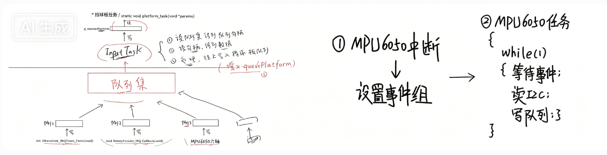


## 2.编程实现

### 2.1 创建事件组

- 先在初始化函数中创建事件组，这样项目一上电瞬间就会创建事件组；

```c
#include "event_groups.h"/* MPU6050事件组 */

static EventGroupHandle_t g_xEventMPU6050;

int MPU6050_Init(void)
{
	MPU6050_WriteRegister(MPU6050_PWR_MGMT_1, 0x00);	//解除休眠状态
	MPU6050_WriteRegister(MPU6050_PWR_MGMT_2, 0x00);
	MPU6050_WriteRegister(MPU6050_SMPLRT_DIV, 0x09);
	MPU6050_WriteRegister(MPU6050_CONFIG, 0x06);
	MPU6050_WriteRegister(MPU6050_GYRO_CONFIG, 0x18);
	MPU6050_WriteRegister(MPU6050_ACCEL_CONFIG, 0x18);
    return 0;
	
	g_xQueueMPU6050 = xQueueCreate(MPU6050_QUEUE_LEN, sizeof(struct mpu6050_data));
	g_xEventMPU6050 = xEventGroupCreate();
}
```

### 2.2 MPU6050任务函数等待事件组

- 在while循环进去之后，调用等待事件组让它等待事件；
- 每当这个事件组的bit0设为1时，它将读取I2C数据，如果等待不到事件组就阻塞，提高CPU效率；
- 防止中断产生得太频繁，将原来的延时改为20；

```c
/* MPU6050任务函数 */
void MPU6050_Task(void *params)
{
	// ...
	while(1)
	{
		/* 等待事件组 */
		xEventGroupWaitBits(g_xEventMPU6050, (1<<0), pdTRUE, pdFALSE, portMAX_DELAY);
		
	// ...
        
		/* Delay */
		vTaskDelay(20);
	}
}
```

### 2.3 设置写事件组

按照先前的程序框架思想，我们需要在MPU6050的中断函数中去写事件组。

- **配置中断引脚**

  - 在硬件上，MPU6050的中断引脚是**PB5**，所以需要先到CubeMX配置中断引脚；
  - 先设置引脚为中断引脚，因为MPU6050的中断引脚在产生中断时为高电平，所以再将中断引脚设置为上升沿触发；
  - **最后点击NVIC使能整个中断，即点击NVIC，然后将EXTI line[9:5] interru勾选；**

  | 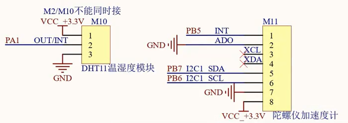 | 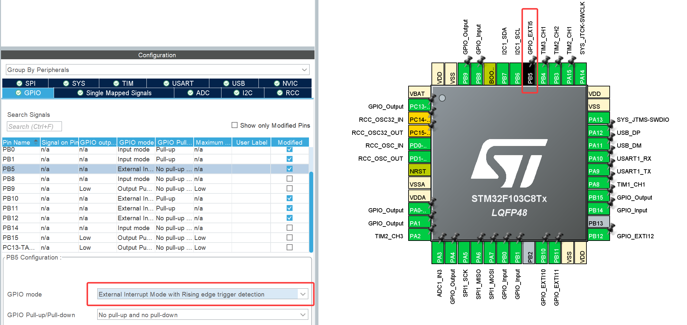 |
  | ------------------------------------------------------------ | ------------------------------------------------------------ |

- **写中断函数让它写事件组**

  - 完成上面配置后CubeMX将自动为我们生成**中断函数**，这个中断函数在文件**stm32f1xx_it.c**中；
  - 当中断引脚出现指定电平跳变时，中断函数被调用，它的内部调用**HAL_GPIO_EXTI_IRQHandler(GPIO_PIN_5)**这个中断任务处理函数；
  - 该函数在文件**stm32f1xx_hal_gpio.c**中，而在函数内部，它又会调用**HAL_GPIO_EXTI_Callback()**回调函数；
  - 所以我们可以提供**HAL_GPIO_EXTI_Callback()**函数，这个函数内部写事件组即可；

  | 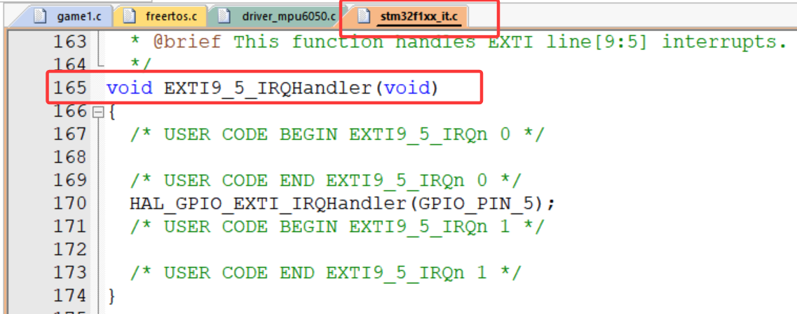 | 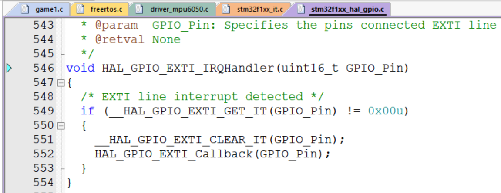 |
  | ------------------------------------------------------------ | ------------------------------------------------------------ |

  - 这个函数老师在**driver_irq.c**文件中已经提供了，只需如左下图所示的拓展即可；
  - 内部执行的**MPU6050_Callback()**函数在**driver_mpu6050.c**文件中定义，它就是一个设置事件组的函数；

  ```c
  /* driver_irq.c文件 */
  extern void MPU6050_Callback(void);
  void HAL_GPIO_EXTI_Callback(uint16_t GPIO_Pin)
  {
      switch (GPIO_Pin)
      {
  		case GPIO_PIN_5:
          {
              MPU6050_Callback();
              break;
          }
  
          case GPIO_PIN_10:
          {
              IRReceiver_IRQ_Callback();
              break;
          }
  
          case GPIO_PIN_12:
          {
              RotaryEncoder_IRQ_Callback();
              break;
          }
  
          default:
          {
              break;
          }
      }
  }
  
  /* driver_mpu6050.c文件 */
  void MPU6050_Callback(void)
  {
  	/* 设置事件组 */
  	xEventGroupSetBitsFromISR(g_xEventMPU6050, (1<<0), NULL);
  }
  
  ```

### 2.4 使能MPU6050的中断

- 在初始化函数中配置中断引脚并使能中断，这样就改造完成了；
- 这里完全是MPU6050这个外设的知识，可先不理；
- **要记得把freertos.c文件中的game1打开，并注释掉game2；**

```c
#define MPU6050_INT_PIN_CFG		0x37
#define MPU6050_INT_ENABLE		0x38

int MPU6050_Init(void)
{
	MPU6050_WriteRegister(MPU6050_PWR_MGMT_1, 0x00);	//解除休眠状态
	MPU6050_WriteRegister(MPU6050_PWR_MGMT_2, 0x00);
	MPU6050_WriteRegister(MPU6050_SMPLRT_DIV, 0x09);
	MPU6050_WriteRegister(MPU6050_CONFIG, 0x06);
	MPU6050_WriteRegister(MPU6050_GYRO_CONFIG, 0x18);
	MPU6050_WriteRegister(MPU6050_ACCEL_CONFIG, 0x18);
    return 0;
	
	/* 配置中断引脚 */
	MPU6050_WriteRegister(MPU6050_INT_PIN_CFG, 0);
	
	/* 使能中断 */
	MPU6050_WriteRegister(MPU6050_INT_ENABLE, 0xff);
	
	/* 初始化时创建队列和事件组 */
	g_xQueueMPU6050 = xQueueCreate(MPU6050_QUEUE_LEN, sizeof(struct mpu6050_data));
	g_xEventMPU6050 = xEventGroupCreate();
}
```

---


# 11-1 任务通知的本质

## 1.内容介绍

- 本节内容讲解任务通知的本质，不涉及项目工程开发；
- 本节内容对应的课程资料为——`第15章 任务通知(Task Notifications)`；


## 2.前面内容回顾

如图所示即为前面三种手段的相同点：

- 对于它们三者而言，任务 / 中断都可以通过它们来实现同步/互斥的操作；
- 但是双方不知道谁是谁，它只知道去链表里面唤醒第一个任务，但这个第一个任务是谁它是不知道的；
- 这三种手段只是一个盲盒或者是邮局，我们只知道存在了就可以做了，但是不知道是谁让我做的；

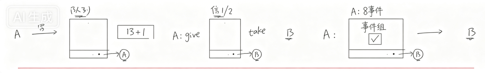


## 3.任务通知的介绍

### 3.1 任务通知的概述

- 如下图所示中，任务 / 中断知道对象任务B的存在，它们可以直接给任务B发信息；

- 即直接修改任务B的TCB结构体里面的值和状态等，这样就实现了任务通知；

- 它与前面的区别就是任务通知无需再跨越中间的一层，即无需创建其他结构体，即它是**任务间的直接通信**；

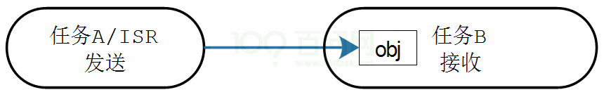

### 3.2 任务通知的内部机制

- **任务的TCB结构体**

  - 任何一个任务创建后都会有**TCB结构体**；
  - 这个结构体包含两个与任务通知直接关联的成员，**一个是通知状态、一个是通知值**；
  - TCB结构体定义：两个成员都是数组，数组大小的宏定义为1，故它们是只含有一个数值的数组

  ```c
  typedef struct tskTaskControlBlock
  {
      ......
      /* configTASK_NOTIFICATION_ARRAY_ENTRIES = 1 */
      volatile uint32_t ulNotifiedValue[ configTASK_NOTIFICATION_ARRAY_ENTRIES ];
      volatile uint8_t ucNotifyState[ configTASK_NOTIFICATION_ARRAY_ENTRIES ];
      ......
  } tskTCB;
  ```

  - **通知状态**：三种取值：没有等待通知（默认状态）、等待通知和接收到了通知；

  ```c
  ##define taskNOT_WAITING_NOTIFICATION              ( ( uint8_t ) 0 )  /* 也是初始状态 */
  ##define taskWAITING_NOTIFICATION                  ( ( uint8_t ) 1 )
  ##define taskNOTIFICATION_RECEIVED                 ( ( uint8_t ) 2 )
  ```

  - **通知值**：可有计数值、位（类似于事件组）、任意数值三种类型；

- **两个例子**

  - **场景一**
    - 前半部分，B不是因为等待A的通知而阻塞，无论A发什么过来，都无法影响B的运行状态；
    - 任务A只会把B的通知状态改为接收到了通知而已，但是B不会去处理这个通知；
    - 后半部分，B调用等待任务A通知的函数；
    - 前面它的通知状态是收到通知了，故后面调用函数去等待通知它的状态会马上变为不等待通知；

  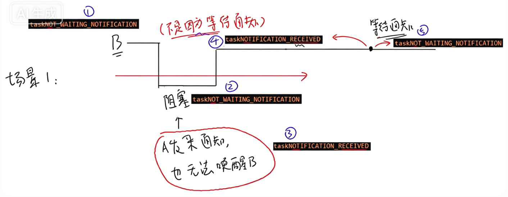

  - **场景二**
    - 任务B调用等待任务A的函数，因为一开始没有任务通知，所以进入阻塞状态，状态值为等待通知；
    - 任务A发来通知，任务B的状态值变为收到通知，并被唤醒；
    - 当任务B从就绪态变为运行时，它的状态值会变为不等待通知；

  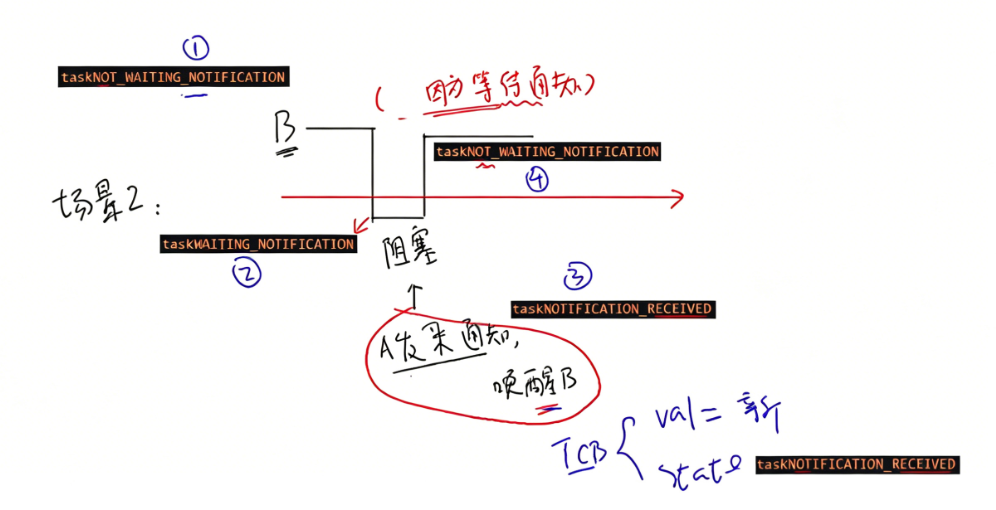


## 4.任务通知的两套函数

任务通知有如下两套函数，分别为简化版和专业版。

### 4.1 普通函数与中断函数

- **在中断中用的函数**

  - 中断中不能阻塞，所以中断中只有发出通知的函数；

  |          | 简化版                   | 专业版               |
  | -------- | ------------------------ | -------------------- |
  | 发出通知 | vTaskNotifyGiveFromISR() | xTaskNotifyFromISR() |

- **在一般情况下用的函数**

  - 一般情况下，发出通知和取出通知都有函数；

  |          | 简化版             | 专业版            |
  | -------- | ------------------ | ----------------- |
  | 发出通知 | xTaskNotifyGive()  | xTaskNotify()     |
  | 取出通知 | ulTaskNotifyTake() | xTaskNotifyWait() |

### 4.2 简化版

只看一般情况下用的简化版的函数，**它相当于是实现了一个简单的计数型信号量模型**：

- 调用xTaskNotifyGive()会让指定的任务的TCB中的cnt++，无论对象是否在等待通知，且一定会改变对象的通知状态为接收到了通知；
- 调用ulTaskNotifyTake()会让自身等待通知，若被唤醒则cnt--；
- 简化版的函数也是通过专业版函数实现的，只是限制了专业版函数的参数；

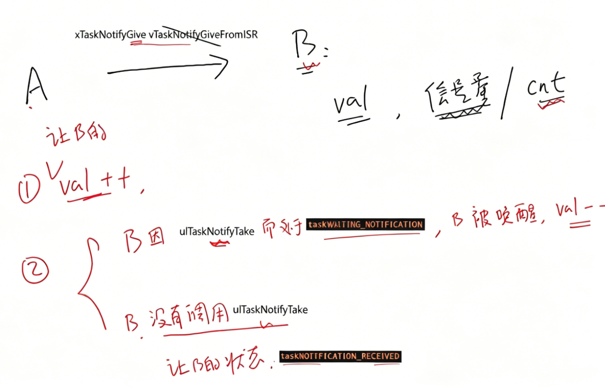

### 4.3 专业版

只看一般情况下用的专业版的函数，**它可以实现复杂的事件＋数据＋位操作模型**：

- **xTaskNotify()函数的操作过程**

  - **函数原型**

  ```c
  BaseType_t xTaskNotify( TaskHandle_t xTaskToNotify, uint32_t ulValue, eNotifyAction eAction );
  ```

  - **参数说明**

  |   **参数**    | **说明**                                                     |
  | :-----------: | ------------------------------------------------------------ |
  | xTaskToNotify | 任务句柄(创建任务时得到)，给哪个任务发通知                   |
  |    ulValue    | 怎么使用ulValue，由eAction参数决定                           |
  |    eAction    | 见下表                                                       |
  |    返回值     | pdPASS：成功，大部分调用都会成功 pdFAIL：只有一种情况会失败，当eAction为eSetValueWithoutOverwrite， 并且通知状态为"pending"(表示有新数据未读)，这时就会失败。 |

  - **eAction参数说明**

  |   **eNotifyAction取值**   | **说明**                                                     |
  | :-----------------------: | ------------------------------------------------------------ |
  |         eNoAction         | 仅仅是更新通知状态为"pending"，未使用ulValue。 这个选项相当于轻量级的、更高效的二进制信号量。 |
  |         eSetBits          | 通知值 = 原来的通知值 \| ulValue，按位或。 相当于轻量级的、更高效的事件组。 |
  |        eIncrement         | 通知值 = 原来的通知值 + 1，未使用ulValue。 相当于轻量级的、更高效的二进制信号量、计数型信号量。 相当于**xTaskNotifyGive()**函数。 |
  | eSetValueWithoutOverwrite | 不覆盖。 如果通知状态为"pending"(表示有数据未读)， 则此次调用xTaskNotify不做任何事，返回pdFAIL。 如果通知状态不是"pending"(表示没有新数据)， 则：通知值 = ulValue。 |
  |  eSetValueWithOverwrite   | 覆盖。 无论如何，不管通知状态是否为"pendng"， 通知值 = ulValue。 |

  - **实例操作**

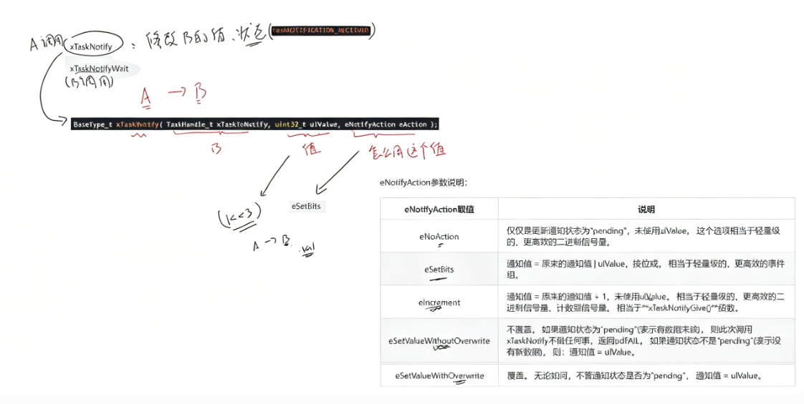

- **xTaskNotifyWait()函数的操作过程**

  - **函数原型**

  ```c
  BaseType_t xTaskNotifyWait( uint32_t ulBitsToClearOnEntry, 
                              uint32_t ulBitsToClearOnExit, 
                              uint32_t *pulNotificationValue, 
                              TickType_t xTicksToWait );
  ```

  - **参数说明**

  |       **参数**       | **说明**                                                     |
  | :------------------: | ------------------------------------------------------------ |
  | ulBitsToClearOnEntry | 在xTaskNotifyWait入口处，要清除通知值的哪些位？ 通知状态不是"pending"的情况下，才会清除。 它的本意是：我想等待某些事件发生，所以先把"旧数据"的某些位清零。 能清零的话：通知值 = 通知值 & ~(ulBitsToClearOnEntry)。 比如传入0x01，表示清除通知值的bit0； 传入0xffffffff即ULONG_MAX，表示清除所有位，即把值设置为0 |
  | ulBitsToClearOnExit  | 在xTaskNotifyWait出口处，如果不是因为超时推出，而是因为得到了数据而退出时： 通知值 = 通知值 & ~(ulBitsToClearOnExit)。 在清除某些位之前，通知值先被赋给"*pulNotificationValue"。 比如入0x03，表示清除通知值的bit0、bit1； 传入0xffffffff即ULONG_MAX，表示清除所有位，即把值设置为0 |
  | pulNotificationValue | 用来取出通知值。 在函数退出时，使用ulBitsToClearOnExit清除之前，把通知值赋给"*pulNotificationValue"。 如果不需要取出通知值，可以设为NULL。 |
  |     xTicksToWait     | 任务进入阻塞态的超时时间，它在等待通知状态变为"pending"。 0：不等待，即刻返回； portMAX_DELAY：一直等待，直到通知状态变为"pending"； 其他值：Tick Count，可以用*pdMS_TO_TICKS()*把ms转换为Tick Count |
  |        返回值        | 1. pdPASS：成功 这表示xTaskNotifyWait成功获得了通知： 可能是调用函数之前，通知状态就是"pending"； 也可能是在阻塞期间，通知状态变为了"pending"。 2. pdFAIL：没有得到通知。 |

  - **实例操作**

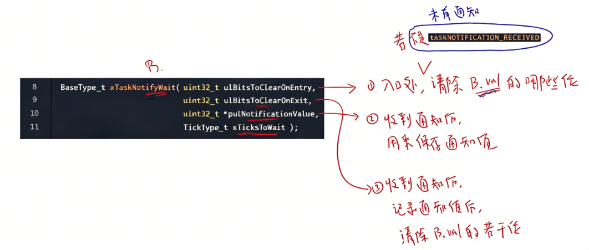

---


# 11-2 任务通知实验_通知车辆运行

## 1.项目移植

- 本节源码在`26_Chapter14_Eventgroup_MPU6050`的基础上，改出`27_Chapter15_TaskNotification_Car_Game`；
- 本节课要解决的主要是把原来的通信方式用任务通知来实现；

- 最终实现的效果是，第一辆车到达终点后，发送任务通知给第二辆车和第三辆车，让它们开始运行；


## 2.项目开发

### 2.1 游戏项目更改

- 打开工程的freertos.c文件，上一节课注释了汽车游戏打开了挡球板游戏；
- 这节课需要打开汽车游戏注释挡球板游戏；

```c
void MX_FREERTOS_Init(void) {
  /* USER CODE BEGIN Init */
  extern void car_test(void);

  defaultTaskHandle = osThreadNew(StartDefaultTask, NULL, &defaultTask_attributes);

  /* 创建游戏任务 */
  //xTaskCreate(game1_task, "GameTask", 128, NULL, osPriorityNormal, NULL);
  extern void car_game(void);
  car_game();

}
```

### 2.2 更改优先级

- 在game2.c文件中将car2和car3的优先级改为一样，这样任务通知后两辆车可以同时跑；
- 同时后面任务通知需要得到任务2和任务3的句柄，所以需要在前面定义句柄并传入函数中；

```c
/* 汽车任务的句柄 */
static TaskHandle_t g_TaskHandleCar2;
static TaskHandle_t g_TaskHandleCar3;

/* 创建3辆汽车的任务 */
xTaskCreate(Car1Task, "car1", 128, &g_cars[0], osPriorityNormal, NULL);
xTaskCreate(Car2Task, "car2", 128, &g_cars[1], osPriorityNormal + 2, g_TaskHandleCar2);
xTaskCreate(Car3Task, "car3", 128, &g_cars[2], osPriorityNormal + 2, g_TaskHandleCar3);
```

### 2.3 修改car1的任务函数

- 将原来的设置事件组注释，改为任务通知；
- 分别使用简化版和高级版，熟练任务通知的API用法；

```c
/* 汽车1任务函数 */
static void Car1Task(void *params)
{
	// ...
	
	while(1)
	{
		// ...
		{
			if (pcar->x < g_xres - CAR_LENGTH)
			{
				// ...
				
				if (pcar->x == g_xres - CAR_LENGTH)
				{
					/* 到达最右边后释放信号量 */
					//xSemaphoreGive(g_xSemTicks);
					
					/* 设置事件组：bit0 */
					//xEventGroupSetBits(g_xEventCar, (1<<0));
					
					/* 发出任务通知给car2和car3 */
					/* 简化版本通知car2 */
					xTaskNotifyGive(g_TaskHandleCar2);
					/* 复杂版本通知car3，让100覆盖原来的值 */
					xTaskNotify(g_TaskHandleCar3, 100, eSetValueWithoutOverwrite);
					
					vTaskDelete(NULL);
				}
			}
		}
	}
}
```

### 2.4 修改car2的任务函数

- 修改car2的任务函数，将原来的等待事件组注释，改为等待任务通知；

```c
/* 汽车2任务函数 */
static void Car2Task(void *params)
{
	// ...
	
	/* 等待事件组：bit0 */
	//xEventGroupWaitBits(g_xEventCar, (1<<0), pdTRUE, pdFALSE, portMAX_DELAY);	/* pdTRUE表示读后清除，pdFALSE表示或的关系 */
	
	/* 等待任务通知，得到通知清零否则永远等待 */
	ulTaskNotifyTake(pdTRUE, portMAX_DELAY);
	
	while(1)
	{
		
        if (pcar->x < g_xres - CAR_LENGTH)
        {
            // ...

            if (pcar->x == g_xres - CAR_LENGTH)
            {
                /* 到达最右边后释放信号量 */
                //xSemaphoreGive(g_xSemTicks);

                /* 设置事件组：bit0 */
                //xEventGroupSetBits(g_xEventCar, (1<<1));

                vTaskDelete(NULL);
            }
		}
	}
}
```

### 2.5 修改car3的任务函数

- 修改car3的任务函数，注释原来的等待事件组，改为判断任务通知的值 ；

```c
/* 汽车3任务函数 */
static void Car3Task(void *params)
{
	// ...
	uint32_t val;	// 通知值
	
	// ...
	
	/* 等待事件组：bit0 and bit1 */
	/* pdTRUE表示读后清除，pdFALSE表示或的关系 */
	//xEventGroupWaitBits(g_xEventCar, (1<<0) | (1<<1), pdTRUE, pdTRUE, portMAX_DELAY);
	
	/* 等待任务通知，入口处和出口处都清0 */
	do
	{
		xTaskNotifyWait(~0, ~0, &val, portMAX_DELAY);
	}
	while (val != 100);
	
	// ...
}
```


## 3.编译运行

- 在完成上面的项目移植后，直接编译并烧录即可；
- 最终的程序现象如下：


---


# 12-1 软件定时器的本质

## 1.内容介绍

- 本节介绍软件定时器的本质，对应的课程资料为——`第16章 软件定时器(software timer)`；
- **软件定时器的相对于硬件定时器而言的，硬件定时器即Tick中断；**


## 2.硬件定时器

- 硬件定时器就是FreeRTOS的Tick中断，它的中断周期由我们在CubeMX中的配置决定；
- 每当到达一个Tick中断时，它就会自动调用Tick中断函数，发起一次任务的调度；
- **Tick中断调用Tick中断函数时还可以实现软件定时器，软件定时器就是在Tick中断函数中实现的；**


## 3.软件定时器

### 3.1 软件定时器的结构体

- **普通的生活闹钟**
  - 对于平时的闹钟，需要设置它什么时候响、是一次性的还是周期性的、如果是周期性的它的周期为多少；
  - 这个闹钟需要做什么、如果是播放音乐那这个音乐又是什么、各个闹钟怎么管理等；
- **软件定时器**
  - 对于软件定时器而言，它也有这些属性，所以它的本质是一个结构体，结构体属性主要有：
    - flag：决定这个定时器是一次性的还是周期性的；
    - period：如果是周期性的它的周期是多少；
    - fun：该软件定时器的函数；
    - params：不同软件定时器可能调用同一个函数，需要不同的参数来区分；
    - 链表项：实现多个软件定时器的管理；

### 3.2 软件定时器的两种实现

- **中断上下文**

  - 软件定时器函数直接放在Tick中断函数中；
  - 当发生Tick中断时，先去链表查询是否存在超时的软件定时器，若有则直接调用其函数；
  - 中断上下文的缺陷是不能放执行时间太长的软件定时器函数，否则影响执行效率；

  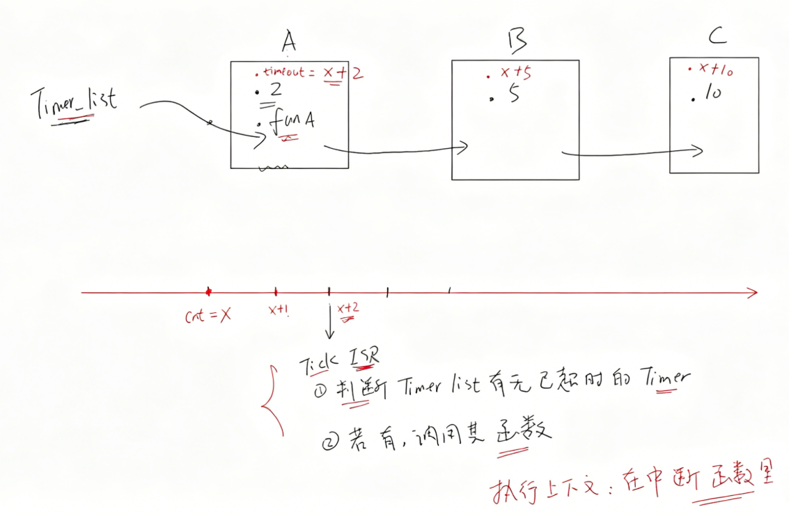

- **任务上下文**

  - 任务上下文和中断上下文的架构一样；
  - 软件定时器的函数不直接放在Tick中断函数中，而是让Tick中断函数通知/唤醒一个“Timer任务”；
  - **“Timer”任务由FreeRTOS内核提供，它内部一直读队列，当中断函数通过写队列方式唤醒“Timer”任务时，它就会去处理超时的定时器的函数；**
  - 任务上下文没有中断上下文这么多限制；
  - 对于FreeRTOS系统而言，它用的就是任务上下文的方式；

  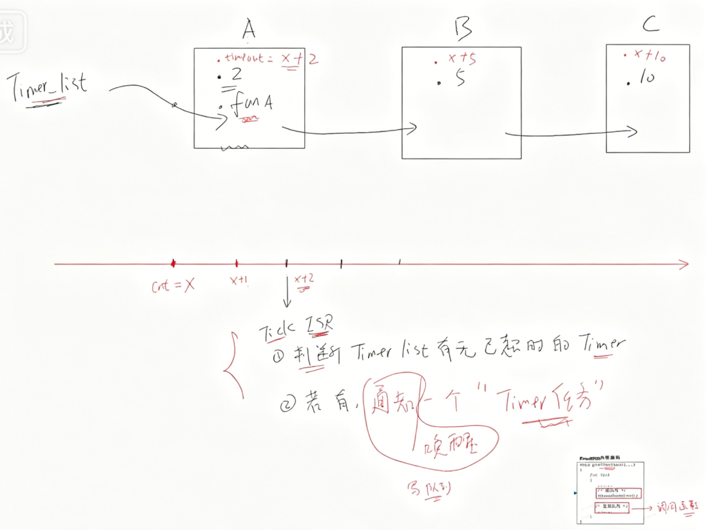


## 4.FreeRTOS的源码实现

### 4.1 Timer任务的机理

- 在FreeRTOS的内核源码中，会有一个定时器任务，它会一直处于读队列、处理队列的运行状态；
- FreeRTOS提供给我们的关于定时器的函数，我们在调用时它的本质就是先在队列中写值；
- 然后定时器任务读到队列后就根据队列的内容调用这个定时器的函数；

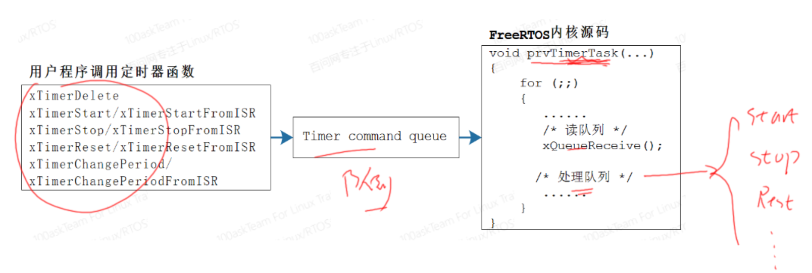

### 4.2 源码分析

- **Timer任务的优先级**
  - 由上述可知，定时器任务要能及时的处理软件定时器的话就必须能够读队列才行；
  - 这就需要这个任务有足够高的优先级才能读队列，解决方式有两种：
    - ①其他任务都采用事件驱动，让定时器任务有机会运行；
    - ②提高定时器任务的优先级或是降低其他任务的优先级；

- **Timer任务的创建(源码分析)**
  - 在main.c文件中先启动内核osKernelStart()；
  - cmsis_os2.c文件中启动调度器vTaskStartScheduler()；
  - task.c文件中定义空闲任务xIdleTaskHandle和定时器任务xTimerCreateTimerTask()；
  - timers.c文件中定义创建定时器任务的函数并指定了该任务的优先级；
  - 任务的优先级在FreeRTOSConfig.h文件中宏定义为了2，这个优先级可以在CubeMX配置中进行修改；

| 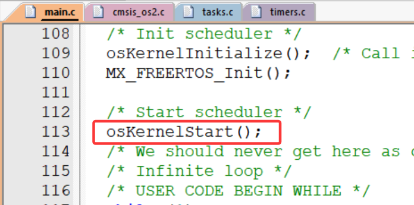 | 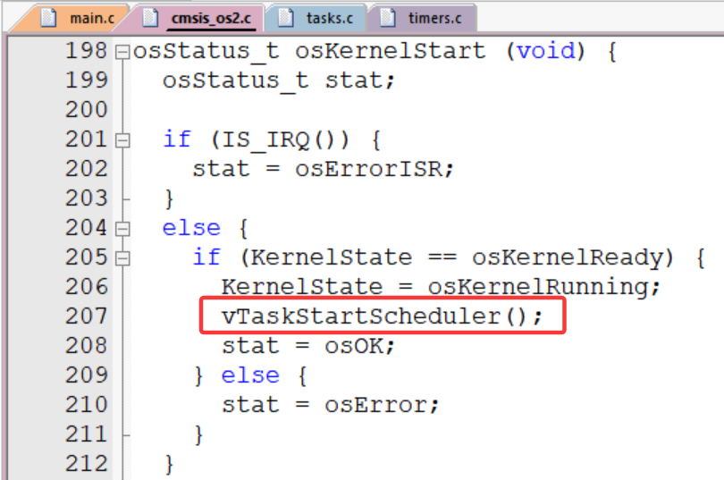 | 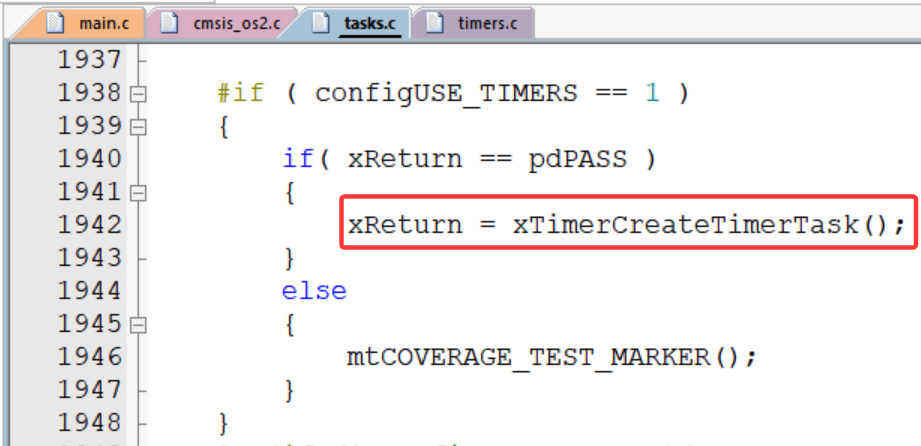 |
| ------------------------------------------------------------ | ------------------------------------------------------------ | ------------------------------------------------------------ |

| 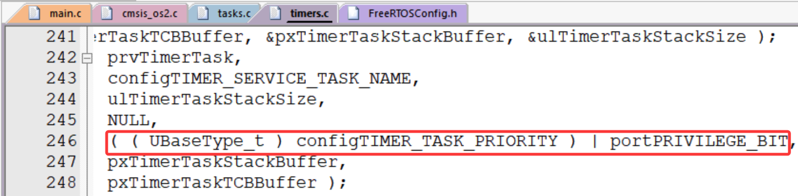 |
| ------------------------------------------------------------ |
| 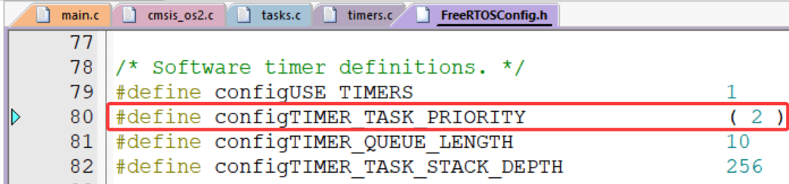  |

---


# 12-2 软件定时器_增加游戏音效


# 13-1 任务和中断的两套API函数


# 13-2 FromISR示例_改进实时性


# 14-1 资源管理_互斥操作的本质


# 14-2 资源管理示例_解解DHT11经常出错的问题


# 15-1 优化系统_精细调整栈大小


# 15-2 优化系统_打印所有任务的栈信息


# 15-3 优化系统_统计CPU占比找出有问题的任务


# 15-4 优化系统_改进MPU6050驱动


