# FreeRTOS学习笔记

本笔记是基于B站韦东山的《FreeRTOS入门与工程实践》课程整理的：

- 视频链接：[视频链接](https://www.bilibili.com/video/BV1Jw411i7Fz?p=4&vd_source=b7453c324b64db9c455fd1d20572810d)；
- 官网资源：[官网资源](https://rtos.100ask.net/zh/FreeRTOS/DShanMCU-F103/)；

本笔记的组织形式：

- 与课程不完全一致，对于一些推销类课时不做记录，且对于一些课程的标题进行了更清晰的描述；
- 每个课时的标号与课程保持一致，采用**x-x**的形式；

---


# 0-1 课程配套硬件介绍

本课程主要由硬件和软件两部分构成，课程的内容就是在硬件的基础上去实现这个软件项目的效果，分别介绍如下：

- **硬件部分：**

  - 硬件是韦东山开发的**瑞士军刀开发板**；
  - 开发板的具体样子如下图所示：

  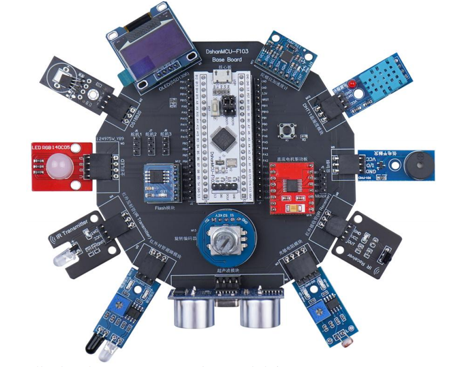

  - 板子的原理图和PCB文件可在文件夹`1.课程资料\2.闲鱼发货\2.底板\韦东山瑞士军刀RTOS底板PCB`下找到；

- **软件部分：**

  - 软件部分基于开源项目NWatch；
  - NWatch的项目地址如下：[NWatch项目地址](https://github.com/ZakKemble/NWatch)；

  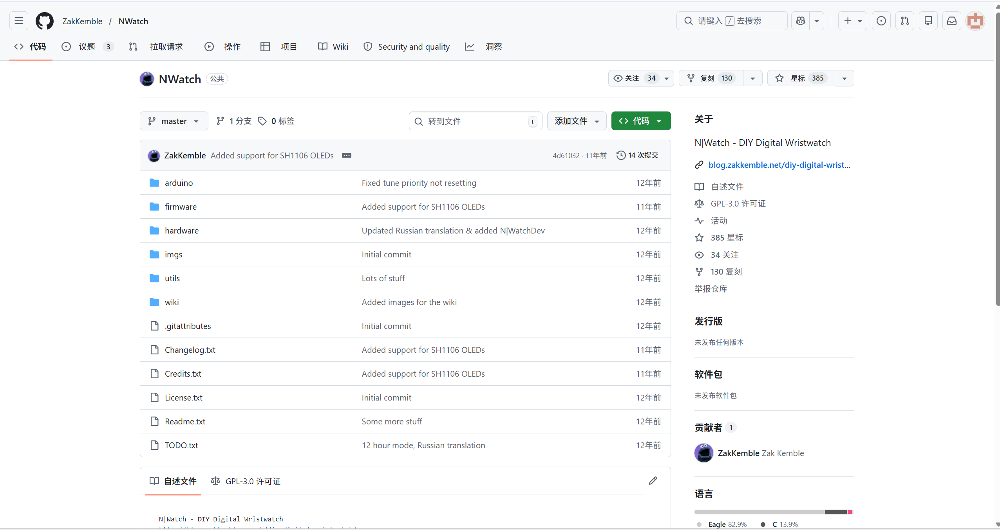

---


# 1-1 单片机的工作方式与FreeRTOS简介

---

## 1.内容介绍

- 本节对应了教程资料**第二章——单片机程序设计模式。**
- 单片机的工作方式主要可分为**裸机开发和多任务系统**，本小节分别介绍；
- 本节内容以下方图片的场景进行讲解：


## 2.裸机开发模式

### 2.1 轮询模式

- 在main函数中是一个while循环，里面依次调用2个函数，这两个函数相互之间有影响；
- 使用轮询模式编写程序简单，但要求while循环里调用到的函数要执行得非常快；

```c
// 经典单片机程序: 轮询
void main()
{
	while (1)
	{
		喂一口饭();
		回一个信息();
	}
}

```

### 2.2 前后台——中断驱动模式

- **所谓“前后台”就是使用中断程序；**
- 假设收到同事发来的信息时，电脑会发出“滴”的一声，这时候妈妈才需要去回复信息；

```c
// 前后台程序
void main()
{
	while (1)
	{
		// 后台程序
		喂一口饭();
	}
}

// 前台程序
void 滴_中断()
{
	回一个信息();
}

```

- 可以进一步优化，两个事件都通过中断驱动：
  - 当两个中断不同时发生时，之间没有影响；
  - 当两者同时发生时，必定会相互影响；
  - **此时while循环是空的；**

```c
// 前后台程序
void main()
{
	while (1)
	{
		// 后台程序
	}
}

// 前台程序
void 滴_中断()
{
	回一个信息();
}

// 前台程序
void 啊_中断()
{
	喂一口饭();
}
```

### 2.3 定时器驱动

- 定时器驱动模式，是前后台模式的一种，可以按照不用的频率执行各种函数；
- **此时main函数中的while循环是空的；**
- 这种方式的前提是每个函数的执行时间不能超过一个定时器周期，否则两个函数发生影响；

```c
// 前后台程序: 定时器驱动
void main()
{
	while (1)
	{
		// 后台程序
	}
}

// 前台程序: 每 1 分钟触发一次中断
void 定时器_中断()
{
	static int cnt = 0;
	cnt++;
	if (cnt % 2 == 0)
	{
		喂一口饭();
	}
	else if (cnt % 5 == 0)
	{
		回一个信息();
	}
}
```

### 2.4 基于状态机

- 使用状态机模式，可以解决裸机程序的难题；
- 假设有 A、B 两个都很耗时的函数，这样可以降低它们相互之间的影响；
- 但是很多场景里，**函数 A、B 并不容易拆分为多个状态**，并且这些状态执行的时间并不好控制；

```c
// 状态机
void main()
{
	while (1)
	{
		喂一口饭();
		回一个信息();
	}
}

void 喂一口饭(void)
{
	static int state = 0;
	switch (state)
	{
		case 0:
		{
			/* 舀饭 */
			state++;
			break;
		}
		case 1:
     	{
			/* 喂饭 */
			state++;
			break;
		}
		case 2:
		{
			/* 舀菜 */
			state++;
			break;
		}
		case 3:
		{
			/* 喂菜 */
			state = 0;
			break;
		}
	}
}

void 回一个信息(void)
{
	static int state = 0;

	switch (state)
	{
		case 0:
		{
			/* 查看信息 */
			state++;
			break;
		}
		case 1:
		{
			/* 打字 */
			state++;
			break;
		}
		case 2:
		{
			/* 发送 */
			state = 0;
			break;
		}
	}
}
```


## 3.多任务系统

### 3.1 多任务模式

- **机理介绍：**

  - 多任务系统会依次给这些任务分配时间：你执行一会，我执行一会，如此循环；
  - 只要切换的间隔足够短，用户会“感觉这些任务在同时运行”；
  - 其时间切片如下图所示：

  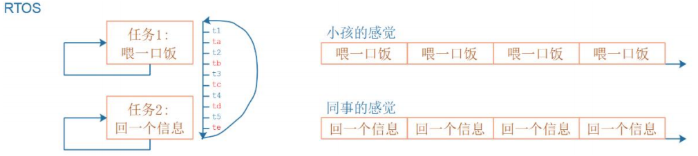

- **软件编写：**

  - main函数中创建 2 个任务；，然后启动调度器，之后，这 2 个任务就会交叉执行了；

  - 基于多任务系统编写程序时，反而更简单了：

    - 上面是“喂饭任务”的代码；

    - 下面是“回信息任务”的代码；
    - **编写它们时甚至都不需要考虑它和其他函数的相互影响；**

```c
// RTOS 程序
喂饭任务()
{
	while (1)
	{
		喂一口饭();
	}
}

回信息任务()
{
	while (1)
	{
		回一个信息();
	}
}

void main()
{
	// 创建 2 个任务
	create_task(喂饭任务);
	create_task(回信息任务);

	// 启动调度器
	start_scheduler();
}
```

### 3.2 多任务系统中的通讯问题

在多任务系统中，不同任务之间需要通讯，**通讯问题可分为互斥操作与同步操作。**

#### 3.2.1 互斥操作

- 多任务系统中，**多个任务可能会“同时”访问某些资源**，需要增加保护措施以防止混乱，这就是互斥操作；

- **用全局变量实现互斥操作1：**

  - 如下方代码所示，两个任务都要用同一个串口进行打印，它们之间是互斥的；
  - 在下方代码中，通过全局变量的方式进行互斥操作的保护；
  - 但是在任务切换中很可能在刚进入if判断后就发生了切换，所以用全局变量保护互斥操作会存在很大的偶然性；

  ```c
  // RTOS 程序
  int g_canuse = 1;
  
  void uart_print(char *str)
  {
  	if (g_canuse)
  	{
  		g_canuse = 0;
  		printf(str);
  		g_canuse = 1;
  	}
  }
  
  task_A()
  {
  	while (1)
  	{
  		uart_print("0123456789\n");
  	}
  }
  
  task_B()
  {
  	while (1)
  	{
  		uart_print("abcdefghij");
  }
  
  }
  
  void main()
  {
  	// 创建 2 个任务
  	create_task(task_A);
  	create_task(task_B);
  	// 启动调度器
  	start_scheduler();
  }
  ```

- **用全局变量实现互斥操作2：**

  - 在原来的基础上做修改，如下方代码所示；
  - 但是由于“减1”这个操作在底层的汇编实现上需要三步，所以仍然可能存在冲突的风险；

  ```c
  void uart_print(char *str)
  {
      g_canuse--;				① 减一
      if( g_canuse == 0 )		② 判断
      {
          printf(str);		③ 打印
      }
      g_canuse++;				④ 加一
  }
  ```

- 所以，为了解决多任务系统中的互斥操作问题，FreeRTOS内部封装了API，后续利用FreeRTOS提供的API就能解决这些问题；

#### 3.2.2 同步操作

- 若任务之间有依赖关系，如任务A执行了某个操作之后，需要任务B进行后续的处理，这就是同步操作；

- **全局变量实现同步操作1：**

  - 下方代码中，在任务A没有设置flag为1之前，任务B的代码都只是去判断flag；
  - 而任务A、B的函数是依次轮流运行的，假设系统运行了100秒，其中任务A总共运行了50秒，任务B总共运行了50秒；
  - **任务A在努力处理复杂的运算，任务B仅仅是浪费CPU资源；**

  ```c
  // RTOS程序
  int flag = 0;
  
  void task_A()
  {
      while (1)
      {
          // 做某些复杂的事情，完成后把flag设置为1
          flag = 1;
      }
  }
  
  void task_B()
  {
      while (1)
      {
          if (flag)
          {
              // 做后续的操作
          }
      }
  }
  
  void main()
  {
      // 创建2个任务
      create_task(task_A);
      create_task(task_B);
      // 启动调度器
      start_scheduler();
  }
  ```

- **FreeRTOS中处理同步操作：**

  - 如下方代码所示，可以通过FreeRTOS提供的信号量，来实现A、B任务之间的同步操作；
  - 在此期间，**任务B会被阻塞，不参与调度，知道任务A完成并释放信号量；**

  ```c
  // RTOS程序
  void task_A()
  {
      while (1)
      {
          // 做某些复杂的事情
          // 释放信号量,会唤醒任务B;
      }
  }
  
  void task_B()
  {
      while (1)
      {
          // 等待信号量, 会让任务B阻塞
          // 做后续的操作
      }
  }
  
  void main()
  {
      // 创建2个任务
      create_task(task_A);
      create_task(task_B);
      // 启动调度器
      start_scheduler();
  }
  ```


---


# 1-2 项目展示

- 整个工程包括3个项目：音乐播放、打砖块游戏、汽车游戏；

- 最后整个项目完成的程序的整体框架如下图所示：

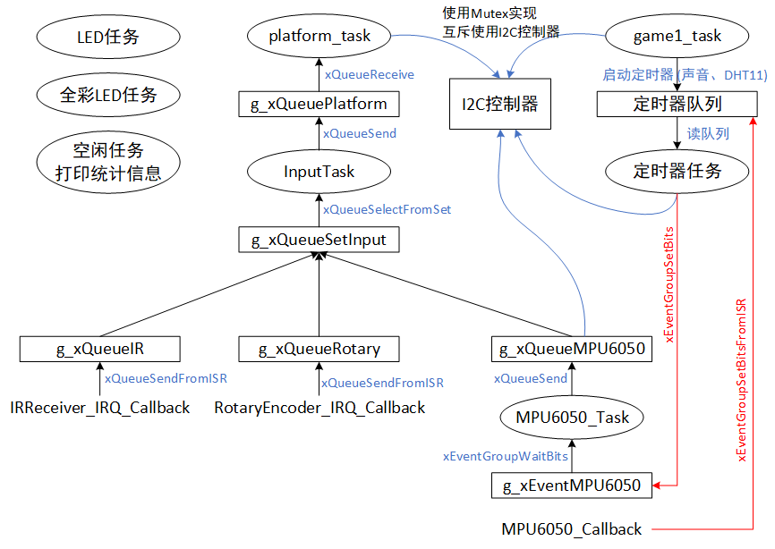

---


# 2-1 开发板使用

## 1.内容介绍

- 本节内容对应了**教程资料的第三章和第四章；**
- 本节内容涉及的工程有：
  - **00_FreeRTOS_Template**
    - 由STM32CubeMX创建的添加了DshanMCU-F103驱动代码的空白的FreeRTOS工程；
    - 这个工程主要提供给学者学习由STM32CubeMX创建的FreeRTOS的工程结构；
  - **00_Driver_Test**
    - 开发板测试的FreeRTOS工程；
    - 这个工程是本节的主要工程，用于测试开发板的各个模块；
    - 这个工程只是在00_FreeRTOS_Template工程的基础上，在freertos.c文件中添加了驱动代码；


## 2.开发板介绍与硬件连接

- DshanMCU-103上有4个插针，它们分别是GND、SWCLK、SWDIO、3.3V；
- ST-Link上有10个插针，它们的功能在外壳上有标注；接线方法如下图所示：

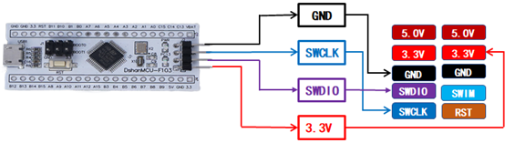

- 连接好的实物图如下（ST-Link的USB口要插到电脑上）：

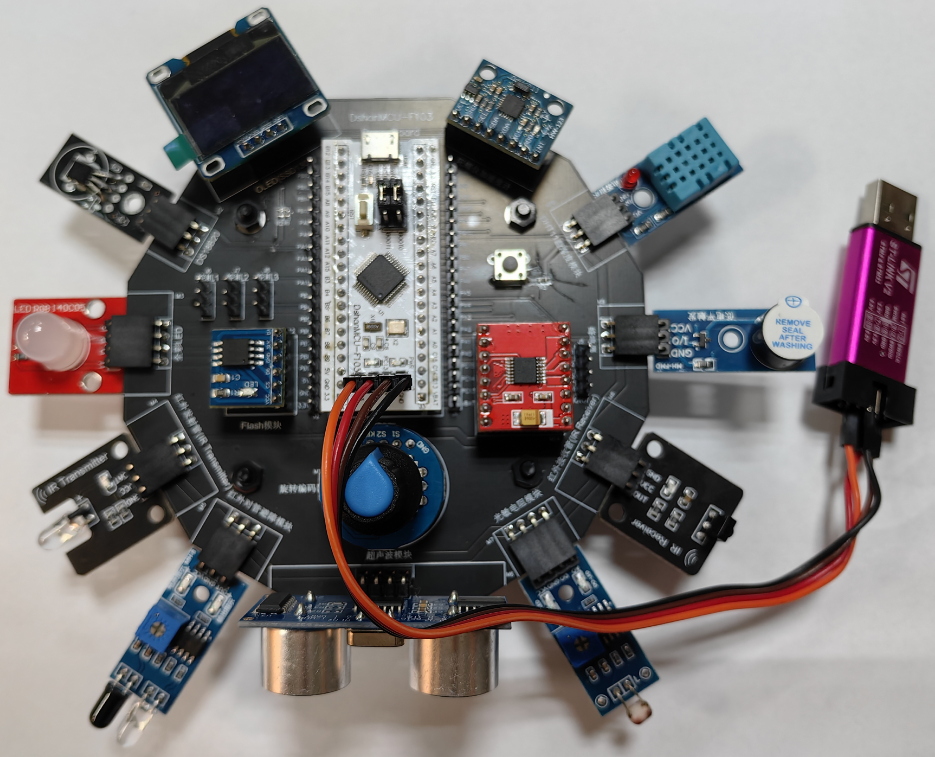


## 3.打开工程

- 测试开发板的项目工程是**00_Driver_Test**；
- 打开文件夹，选择MDK-ARM，然后用Keil打开：

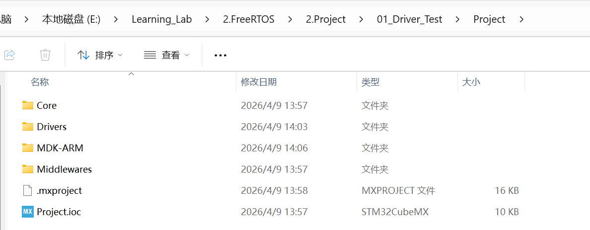


## 4.修改代码

- 本工程主要涉及的文件是freertos.c，除了这个文件外，其他文件与空白工程的文件完全相同；
- 在该文件中有一个默认任务，这个任务由STM32CubeMX自动生成；
- 这个任务主要做的事情是初始化LCD，然后在循环中添加了驱动的测试代码；
- 由于每个测试函数内部都是一个死循环（可自己打开驱动源码查看），所以在测试开发板时，只能取消注释一个测试函数，逐个完成模块的测试；

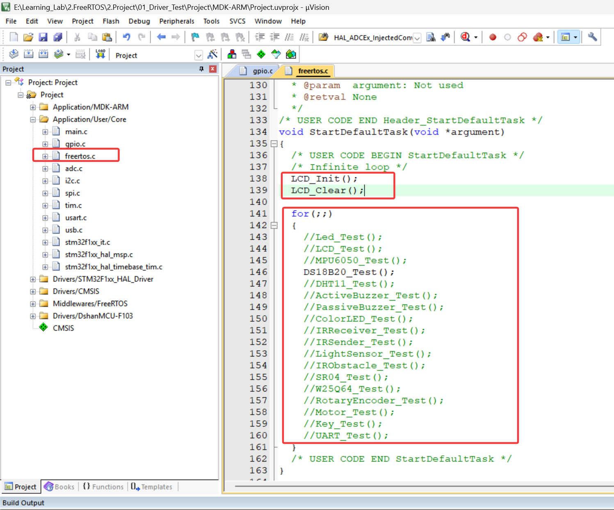


## 5.注意事项

- 有些模块的引脚是共用的，所以它们要么不能同时接，要么不能同时使用；

- 可参照教程资料的第四章，里面有详细的说明，可将它们列表如下：

| 模块1            | 模块2                | 备注                       |
| ---------------- | -------------------- | -------------------------- |
| M2(DS18B20)      | M10(DHT11温湿度模块) | 不能同时接                 |
| M4(红外发射模块) | M9(蜂鸣器)           | 不能同时接                 |
| M6(超声波模块)   | M12(Flash模块)       | 可以同时接，但是要互斥访问 |

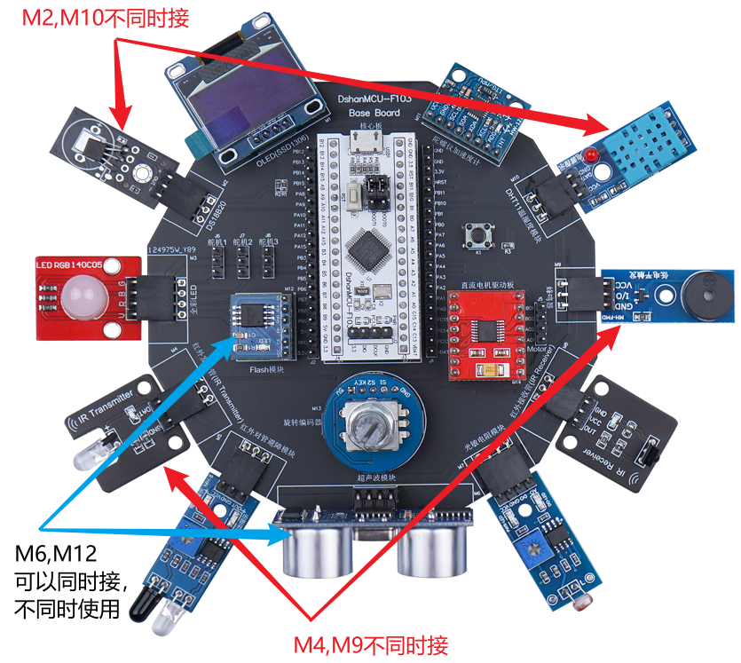

---


# 2-2 模块使用说明与STM32CubeMX配置

## 1.内容介绍

- 本节内容对应**课程资料的第五章——模块使用说明与 STM32CubeMX 配置；**
- **前面的00_Driver_Test工程就是这个课程的模板教程，可在这个工程的基础上跟着教程一步步完善工程；**
- 本小节的内容主要是讲解整个项目从零搭建的思路，具体的搭建过程见2-3节；


## 2.项目搭建的思路说明

- **驱动代码**

  - 在这个开发板上，要使用各个模块，需要用到各个模块的驱动代码；
  - 对于每一个模块，课程都提供了对应的驱动代码，路径在：`.\2.Project\01_Driver_Test\Project\Drivers\DshanMCU-F103`；

- **外设**

  - 要使用上面的驱动代码来驱动模块，需要用到STM32的各个外设和它们打交道；
  - 比如对于OLED而言，它需要用到I2C1，那就需要对I2C1这个外设进行配置；

- **初始化**

  - 初始化指的是初始化外设，这个工作由STM32CubeMX来做；
  - 由于驱动代码底层是用HAL库来写的，所以需要用STM32CubeMX来做初始化；

  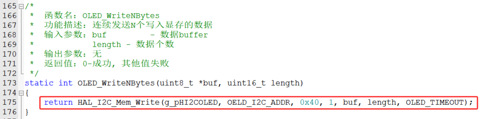

---


# 2-3 自己创建FreeRTOS工程

## 1.内容介绍

- 本节内容对应课程资料的：
  - **第五章——模块使用说明与 STM32CubeMX 配置；**
  - **第六章——创建FreeRTOS工程；**

- 本节主要介绍如何基于STM32CubeMX创建一个FreeRTOS工程，包括驱动代码的移植和默认任务的改写；


## 2.工程创建

具体如何创建一个工程请详细查看教程资料，在此不再赘述。

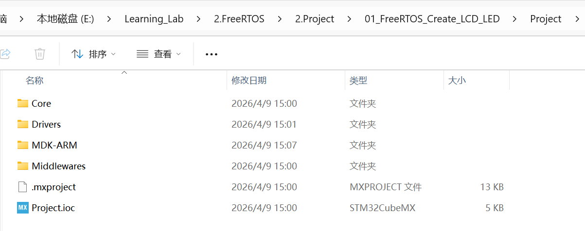


## 3.工程移植

在完成空白的FreeRTOS项目的创建后，接下来移植LED和OLED的驱动代码，这里已经假设前面的工程创建中完成了GPIO和I2C的初始化，具体见教程第六章。

- **LED的移植**

  - 首先需要添加驱动文件driver_led.c和driver_led.h文件，其具体过程见教程；
  - 接着就可以在freertos.c文件中添加测试代码：

  ```c
  /* USER CODE BEGIN Header */
  #include "driver_led.h"
  
  /* USER CODE END Header_StartDefaultTask */
  void StartDefaultTask(void *argument)
  {
    /* USER CODE BEGIN StartDefaultTask */
    /* Infinite loop */
    for(;;)
    {
      //osDelay(1);
  	  Led_Test();
    }
    /* USER CODE END StartDefaultTask */
  }
  
  ```

- **OLED的移植**

  - LCD的项目移植与LED相同，只是需要添加的驱动文件较多；
  - 驱动文件有：ascii_font.c、driver_lcd.c、driver_lcd.h、driver_led.c、driver_led.h、driver_timer.c和driver_timer.h；
  - 接着就可以在上面的基础上测试OLED的测试函数：

  ```c
  /* USER CODE BEGIN Header */
  #include "driver_led.h"
  #include "driver_lcd.h"
  
  /* USER CODE END Header_StartDefaultTask */
  void StartDefaultTask(void *argument)
  {
    /* USER CODE BEGIN StartDefaultTask */
    /* Infinite loop */
    for(;;)
    {
      //osDelay(1);
  	//LCD_Test();
  	  Led_Test();
    }
    /* USER CODE END StartDefaultTask */
  }
  
  ```

- 本完整工程对应着Project文件夹下的**01_FreeRTOS_Create_LCD_LED**；


## 4.说明

- 强烈建议就在**00_FreeRTOS_Template**或**00_Driver_Test**工程的基础上进行开发；
- 两者的区别主要就是freertos.c文件中是否加入了驱动代码；
- 对于想要从零构建这个项目的学者，需要具有一定的STM32基础以及STM32CubeMX的基础；
- 若在原来两个工程的基础上开发，只需要创建一个新的文件夹，该文件夹以项目名称命名，然后把前面任何一个项目的整个Project文件夹拷贝下来即可；

---


# 3-1 创建第一个多任务程序

## 1.内容介绍

- 本节内容主要介绍如何创建一个多任务的程序；
- 本节内容对应课程资料的**第九章第二节——任务创建与删除；**

- 本节所完成的工程项目为**02_Chapter9_First_FreeRTOS_App；**


## 2.FreeRTOS中创建任务的API介绍

### 2.1 接口层提供的函数

- **接口层**

  - 在嵌入式的RTOS中存在一个接口层，这个接口层提供了一个适配不同RTOS操作系统的**任务创建函数——osThreadNew()；**
  - 这个接口层对应的文件是**cmsis_os2.c**，它由STM32CubeMX在初始化时生成；

- **默认任务**

  - 前面分析过，在STM32CubeMX中生成的空白的FreeRTOS工程会存在一个默认的任务——**defaultTask；**
  - 在这个默认任务的创建中就是用了osThreadNew()函数创建的：

  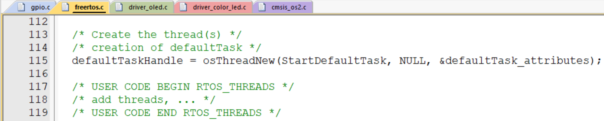

- **源码分析**

  - 可以打开cmsis_os2.c文件查看osThreadNew()函数的源码：

  ```c
  osThreadId_t osThreadNew (...) {
    // ... 省略参数处理 ...
  
    // ==============================================
    // 关键：这里只分 FreeRTOS 的 静态/动态 创建
    // 根本没有其他操作系统的分支！
    // ==============================================
    if (mem == 1) {
      // FreeRTOS 静态创建任务（唯一调用）
      hTask = xTaskCreateStatic(...);
    } else {
      if (mem == 0) {
        // FreeRTOS 动态创建任务（唯一调用）
        xTaskCreate(...);
      }
    }
  
    return ((osThreadId_t)hTask);
  }
  ```

  - 在函数实现内部，通过条件判断来选取不同的任务创建函数——**xTaskCreateStatic()或xTaskCreate()**，这两个函数是原生的FreeRTOS函数；
  - 在STM32CubeMX初始化时，它会根据我们选择的操作系统，**在osThreadNew()函数底层调用不同操作系统的任务创建函数；**
  - 这样，无论我们使用的是什么操作系统，在实际开发中都可以统一用这个函数进行任务的创建；
  - **在本课程中，统一使用FreeRTOS原生的API创建任务，即xTaskCreateStatic()或xTaskCreate()；**

### 2.2 原生FreeRTOS函数

- **动态分配内存创建任务**

  - **API介绍：**

  ```c
  BaseType_t xTaskCreate( TaskFunction_t pxTaskCode, // 函数指针, 任务函数
                          const char * const pcName, // 任务的名字
                          const configSTACK_DEPTH_TYPE usStackDepth, // 栈大小,单位为word,10表示40字节
                          void * const pvParameters, // 调用任务函数时传入的参数
                          UBaseType_t uxPriority,    // 优先级
                          TaskHandle_t * const pxCreatedTask ); // 任务句柄, 以后使用它来操作这个任务
  ```

  - **参数说明：**

  | **参数**      | **描述**                                                     |
  | ------------- | ------------------------------------------------------------ |
  | pvTaskCode    | 函数指针，任务对应的 C 函数。任务应该永远不退出，或者在退出时调用 "vTaskDelete(NULL)"。 |
  | pcName        | 任务的名称，仅用于调试目的，FreeRTOS 内部不使用。pcName 的长度为 configMAX_TASK_NAME_LEN。 |
  | usStackDepth  | 每个任务都有自己的栈，usStackDepth 指定了栈的大小，单位为 word。例如，如果传入 100，表示栈的大小为 100 word，即 400 字节。最大值为 uint16_t 的最大值。确定栈的大小并不容易，通常是根据估计来设定。精确的办法是查看反汇编代码。 |
  | pvParameters  | 调用 pvTaskCode 函数指针时使用的参数：pvTaskCode(pvParameters)。 |
  | uxPriority    | 任务的优先级范围为 0~(configMAX_PRIORITIES – 1)。数值越小，优先级越低。如果传入的值过大，xTaskCreate 会将其调整为 (configMAX_PRIORITIES – 1)。 |
  | pxCreatedTask | 用于保存 xTaskCreate 的输出结果，即任务的句柄（task handle）。如果以后需要对该任务进行操作，如修改优先级，则需要使用此句柄。如果不需要使用该句柄，可以传入 NULL。 |
  | 返回值        | 成功时返回 pdPASS，失败时返回 errCOULD_NOT_ALLOCATE_REQUIRED_MEMORY（失败原因是内存不足）。请注意，文档中提到的失败返回值是 pdFAIL 是不正确的。pdFAIL 的值为 0，而 errCOULD_NOT_ALLOCATE_REQUIRED_MEMORY 的值为 -1。 |

- **静态分配内存创建任务：**

  - **API介绍：**

  ```c
  TaskHandle_t xTaskCreateStatic ( 
      TaskFunction_t pxTaskCode,   // 函数指针, 任务函数
      const char * const pcName,   // 任务的名字
      const uint32_t ulStackDepth, // 栈大小,单位为word,10表示40字节
      void * const pvParameters,   // 调用任务函数时传入的参数
      UBaseType_t uxPriority,      // 优先级
      StackType_t * const puxStackBuffer, // 静态分配的栈，就是一个buffer
      StaticTask_t * const pxTaskBuffer // 静态分配的任务结构体的指针，用它来操作这个任务
  );
  ```

  - **参数说明：**

  | **参数**       | **描述**                                                     |
  | -------------- | ------------------------------------------------------------ |
  | pvTaskCode     | 函数指针，可以简单地认为任务就是一个C函数。 它稍微特殊一点：永远不退出，或者退出时要调用"vTaskDelete(NULL)" |
  | pcName         | 任务的名字，FreeRTOS内部不使用它，仅仅起调试作用。 长度为：configMAX_TASK_NAME_LEN |
  | usStackDepth   | 每个任务都有自己的栈，这里指定栈大小。 单位是word，比如传入100，表示栈大小为100 word，也就是400字节。 最大值为uint16_t的最大值。 怎么确定栈的大小，并不容易，很多时候是估计。 精确的办法是看反汇编码。 |
  | pvParameters   | 调用pvTaskCode函数指针时用到：pvTaskCode(pvParameters)       |
  | uxPriority     | 优先级范围：0~(configMAX_PRIORITIES – 1) 数值越小优先级越低， 如果传入过大的值，xTaskCreate会把它调整为(configMAX_PRIORITIES – 1) |
  | puxStackBuffer | 静态分配的栈内存，比如可以传入一个数组， 它的大小是usStackDepth*4。 |
  | pxTaskBuffer   | 静态分配的StaticTask_t结构体的指针                           |
  | 返回值         | 成功：返回任务句柄； 失败：NULL                              |


## 3.任务函数

### 3.1 什么是任务

- 在FreeRTOS中，任务就是一个函数，一个任务执行的东西本质就是在创建任务时传入的**pvTaskCode函数**；
- 在FreeRTOS中，**函数的格式是固定的，必须按照固定的格式封装函数，否则会报错；**
- 即我们平时写的驱动函数不能直接传入任务创建函数中，需要再按照固定格式封装一个函数，把这个函数的指针传递给任务创建函数；

### 3.2 任务函数的格式

- FreeRTOS中，**pvTaskCode()函数**原型如下：

```c
void ATaskFunction( void *pvParameters);
```

- **参数说明：**
  - 这个函数不能有返回值；
  - 同一个函数，可以用来创建多个任务，即多个任务可以运行同一个函数；
  - 函数内部，尽量使用局部变量，这是因为：
    - 每个任务都有自己的栈；
    - 每个任务运行这个函数时，任务A的局部变量放在任务A的栈里、任务B的局部变量放在任务B的栈里；
    - 不同任务的局部变量，有自己的副本；
    - 函数使用全局变量、静态变量的话，只有一个副本：多个任务使用的是同一个副本，要防止冲突；
- **实例说明：**

```c
void ATaskFunction( void *pvParameters )
{
	/* 对于不同的任务，局部变量放在任务的栈里，有各自的副本 */
	int32_t lVariableExample = 0;
	
    /* 任务函数通常实现为一个无限循环 */
	for( ;; )
	{
		/* 任务的代码 */
	}

    /* 如果程序从循环中退出，一定要使用vTaskDelete删除自己
     * NULL表示删除的是自己
     */
	vTaskDelete( NULL );
    
    /* 程序不会执行到这里, 如果执行到这里就出错了 */
}
```


## 4.创建第一个多任务程序

### 4.1 工程说明

本工程项目在工程**00_Driver_Test**的基础上修改：

- 进入原来的**00_Driver_Test**文件夹；
- 复制整个**Project**文件夹；
- 将其复制到新创建的文件夹**02_Chapter9_First_FreeRTOS_App**下；
- 再打开Keil文件进行编辑即可；

### 4.2 工程开发

- **创建任务**

  - 首先在freertos.c文件中创建任务；
  - 先定义任务函数：

  ```c
  /* USER CODE BEGIN FunctionPrototypes */
  void MyTask(void *argument)
  {
  	while(1)
  	{
  		Led_Test();
  	}
  }
  /* USER CODE END FunctionPrototypes */
  ```

  - 创建任务：

  ```c
    /* USER CODE BEGIN RTOS_THREADS */
    /* add threads, ... */
    xTaskCreate(MyTask, "myfirsttask", 128, NULL, osPriorityNormal, NULL);
    /* USER CODE END RTOS_THREADS */
  ```

- **修改默认任务**

  - 在原来的默认任务的任务函数中，添加LCD的测试程序；

  ```c
  /* USER CODE END Header_StartDefaultTask */
  void StartDefaultTask(void *argument)
  {
    /* USER CODE BEGIN StartDefaultTask */
    /* Infinite loop */
    LCD_Init();
    LCD_Clear();
    
    for(;;)
    {
      LCD_Test();
    }
    /* USER CODE END StartDefaultTask */
  }
  ```

- **修改驱动程序**

  - 在原来的LCD测试程序中，只有打印字符串的程序；
  - 现在在原来的基础上，添加打印变量数据的程序；

  ```c
  void OLED_Test(void)
  {
  	int cnt = 0;
      OLED_Init();
  	// 清屏
  	OLED_Clear();
      
  	while (1)
  	{
  		// 在(0, 0)打印'A'
  		OLED_PutChar(0, 0, 'A');
  		// 在(1, 0)打印'Y'
  		OLED_PutChar(1, 0, 'Y');
  		// 在第0列第2页打印一个字符串"Hello World!"
  		OLED_PrintString(0, 2, "Hello World!");
  		OLED_PrintSignedVal(0, 4, cnt++);
  	}
  }
  ```

- **注意：工程基于STM32CubeMX生成，所以一定要在代码沙盒中写，否则重新生成初始化代码后添加的代码将被删除；**


## 5.编译下载

- 在完成上面的程序开发后，可点击Keil中的Build按钮进行编译，然后将其下载到单片机中；
- 最后的运行效果如下图所示：


---


# 3-2-1 ARM架构简明教程_硬件架构与汇编指令

## 1.内容简介

- 上一节创建任务时指定了**栈**，想要了解RTOS就得理解栈，要理解栈就必须对处理器的架构有一定的了解；
- 本节对处理器的结构的讲解与**微机原理的内容**是相似的，只是**微机原理中的89C51的架构和ARM架构**不一样而已；


## 2.电脑与单片机

- 电脑：通过主板连接，CPU、内存条、硬盘等全部接在主板上；
- 单片机：SOC，片上系统，CPU、内存、Flash都集成在了一块芯片上面，这块芯片就是单片机；

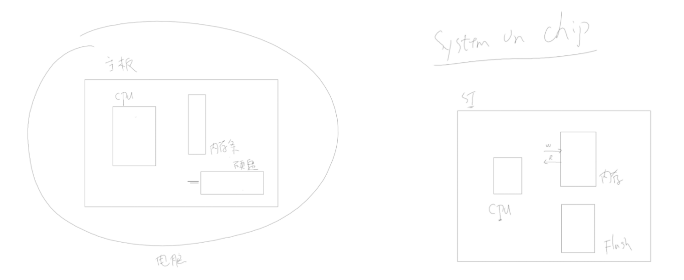


## 3.ARM芯片的RISC架构 

- **RISC架构：**
  - ARM芯片属于精简指令集计算机(RISC：Reduced Instruction Set Computing)，它所用的指令比较简单；
- **特点：**
  - 对内存只有读、写指令；
  - 对于数据的运算是在CPU内部实现；
  -  使用RISC指令的CPU复杂度小一点，易于设计；
- **RISC架构的运算逻辑：**
  - 以乘法运算a = a * b为例；
  - 在RISC中要使用4条汇编指令：① 读内存a、② 读内存b、③ 计算a*b、④ 把结果写入内存；


## 4.CPU内部寄存器

- **CPU的内部寄存器结构**

  - 无论是cortex-M3/M4，还是cortex-A7，CPU内部都有R0、R1、……、R15、xPSR寄存器，它们可以用来**“暂存”数据**；
  - 对于R13、R14、R15、xPSR，还另有用途：
    - **R13：别名SP(Stack Pointer)，栈指针；**
    - **R14：别名LR(Link Register)，用来保存返回地址；**
    - **R15：别名PC(Program Counter)，程序计数器，表示当前指令地址，写入新值即可跳转；**
    - **xPSR：寄存器是程序状态寄存器；**

  

- **CPU的计算过程**

  - 下图即为CPU的真实计算过程；
  - 在CPU中，只有计算单元ALU具有计算功能；
  - R0~R15寄存器都只是起到存数据的作用；
  - 临时的变量存在内存中，代码存在Flash中，通过PC指针取指令；

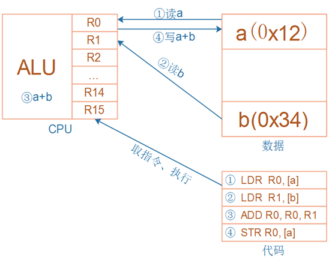


## 5. 汇编指令

- **数据传输三要素**
  - 数据传输只需要确定三个要素：
  - 目的、源和长度；

* **读内存：Load**

  ```shell
  # 示例
  LDR  R0, [R1, #4]	; 读地址"R1+4", 得到的4字节数据存入R0
  
  LDRB  R0, [R1, #4]	; 读地址"R1+4", 得到的1字节数据存入R0
  
  LDRH  R0, [R1, #4]	; 读地址"R1+4", 得到的2字节数据存入R0
  ```

* **写内存：Store**

  ```shell
  # 示例
  STR  R0, [R1, #4]	; 把R0的4字节数据写入地址"R1+4"
  
  STRB  R0, [R1, #4]	; 把R0的1字节数据写入地址"R1+4"
  
  STRH  R0, [R1, #4]	; 把R0的2字节数据写入地址"R1+4"
  ```

* **加减**

  ```shell
  ADD R0, R1, R2  ; R0=R1+R2
  ADD R0, R0, #1  ; R0=R0+1
  SUB R0, R1, R2  ; R0=R1-R2
  SUB R0, R0, #1  ; R0=R0-1
  ```

* **比较**

  ```shell
  CMP R0, R1  ; 结果保存在PSR(程序状态寄存器)
  ```

* **跳转**

  - B指令是直接让R15寄存器为main函数的地址，就是执行main函数；
  - BL指令需要先让R14寄存器为返回地址，再让R15为main函数的地址，这样执行完main函数后跳回到原来的地址（类似于嵌套中所讲的保护现场）；

  ```shell
  B  main  ; Branch, 直接跳转
  BL main  ; Branch and Link, 先把返回地址保存在LR寄存器里再跳转
  ```


# 3-2-2 ARM架构简明教程_汇编实例

## 1.内容简介

- 本节内容主要是基于上一小节的内容，即在上一节的基础上添加代码，生成反汇编，并分析它的汇编代码；
- 本节内容的完整工程是项目——**03_ARM_ASM；**
- 本项目在上一个项目**02_Chapter9_First_FreeRTOS_App**的基础上修改，直接将上一个项目的Project文件复制到新文件夹03_ARM_ASM即可；


## 2.汇编代码的生成

- 在User栏中的最后两行选择一行写入下面的指令：

```c
fromelf --text -a -c --output=test.dis xxx.axf
```

- 接着打开Linker栏，把最后面部分替换dis后面的xxx；
- 点击编译即可实现反汇编的生成，生成文件在**MDK-ARM**文件夹下，文件名为**test.dis**；

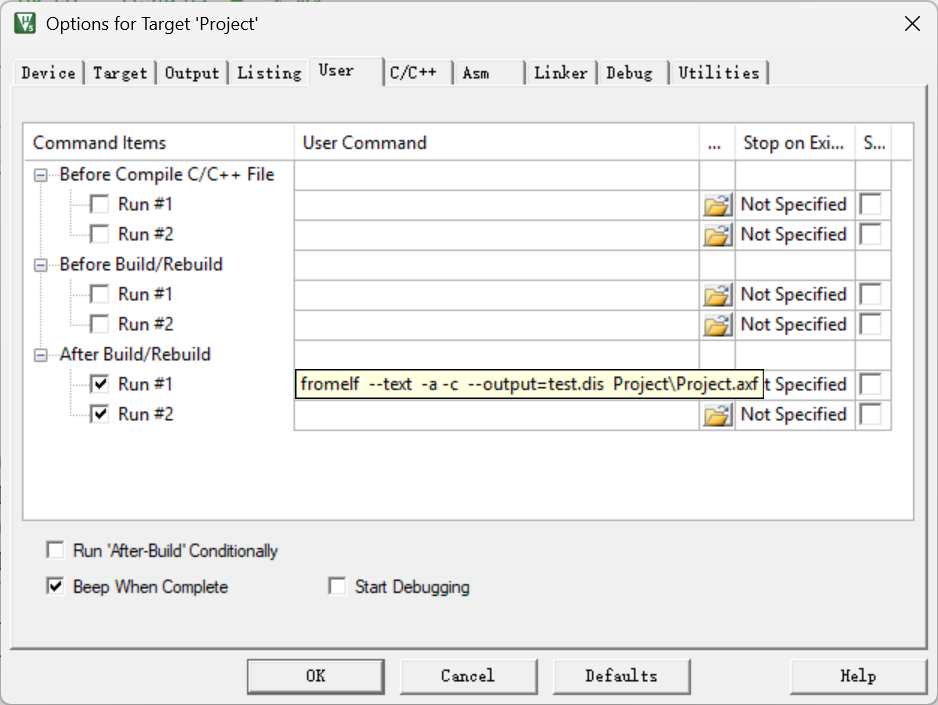


## 3.修改项目

- 在driver_oled.c文件中添加如下函数：

```c
int add(volatile int a, volatile int b)
{
	volatile int sum;
    sum = a + b;
    return sum;
}
```

- 然后把先前的变量自增改为函数实现：

```c
void OLED_Test(void)
{
	int cnt = 0;
    OLED_Init();
	// 清屏
	OLED_Clear();
    
	while (1)
	{
		// 在(0, 0)打印'A'
		OLED_PutChar(0, 0, 'A');
		// 在(1, 0)打印'Y'
		OLED_PutChar(1, 0, 'Y');
		// 在第0列第2页打印一个字符串"Hello World!"
		OLED_PrintString(0, 2, "Hello World!");
		OLED_PrintSignedVal(0, 4, cnt);
		
		cnt = add(cnt, 1);
	}
}
```


## 4.查看反汇编

- 完成上面的工程修改后，直接编译，就会在MDK-ARM目录下生成一个文件**test.axf**；
- 将其用记事本打开，并搜索**add**，可得到add()函数的汇编实现：

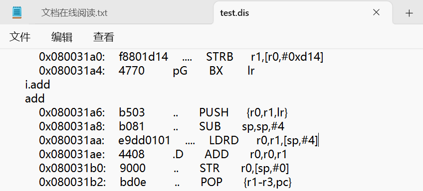

- 可结合主函数main的汇编代码以及原本的C代码的调用关系分析C函数在汇编层面的实现；
- 这部分内容与微机原理内容重叠，我本人能够完全理解，故不再记录笔记；


# 3-3-1 堆的概念

## 1.堆的概念

- 堆即使一片连续的空闲内存，可以对这块内存进行管理；
- 从堆里面取出一部分内存，用完之后再把它释放回去，这就是堆；
- 本节内容对应的程序为**04_Heap_Stack**；


## 2.堆的普通管理——索引实现

- 假如用以下的函数实现堆的管理：

```c
char heap_buf[1024];
int pos = 0;
int g_cnt = 0;

void *my_malloc(int size)
{
	int old_pos = pos;
	pos += size;
	return &heap_buf[old_pos];
}

void my_free(void *buf)
{
	/* err */
}
```

- 上面的代码实现可以用下图演示：
  - 如下图所示，可以用简单的malloc函数开辟一片内存出来，然后对这块内存进行管理，但是无法实现free函数；
  - 因为使用free函数时，它并不知道我们要释放多大的内存，所以malloc没有对应的free函数，也就是无法释放内存；

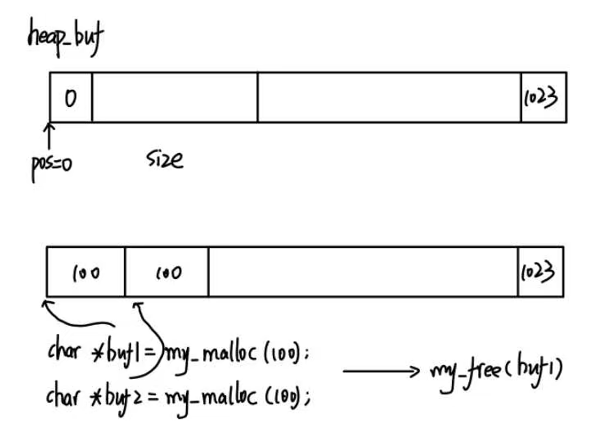


## 3.堆的管理函数——添加头部信息

- 前面提到普通的malloc无法实现对应的free函数，一般使用堆的管理函数，能够实现内存的释放；

- 可以采用如下方法：

  - 在实现my_malloc()函数时，不仅仅只是分配100个字节，而是分配了100个字节加上一个头部；
  - 这个头部里面记录了可以存数据的大小，而堆返回的首地址是可以存储数据的首地址；
  - 接着在my_free()函数中，其内部可以实现从首地址减去头部的大小，读取头部的内容，知道堆的大小是多少；
  - 然后再减去对应的堆的大小，就可以实现free()释放函数了；

  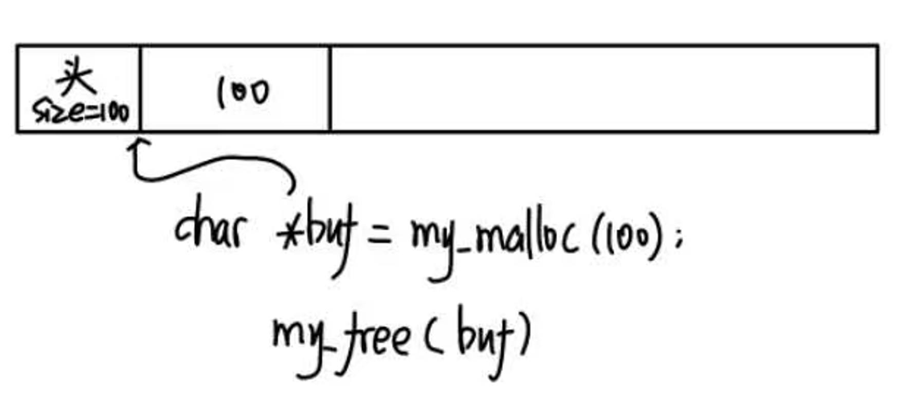

 

## 4.堆的管理函数——用链表实现

- 在分配多块内存后，需要释放中间内存时，通过链表的方式指定下一个空闲地址的首位置，再通过链表的方式将空闲内存连起来，可实现碎片堆的管理
- 这样通过这些操作，我们就能够实现开辟一块内存空间——>取出一部分内存使用——>用完之后再释放回去的操作了；


# 3-3-2 栈的概念_函数调用

## 1.栈的概念

- 也是一块内存空间，**CPU的SP寄存器指向它；**
- 它可以用于函数调用、局部变量、多任务系统里保存现场；
- 本节内容对应的程序为**04_Heap_Stack**；


## 2.函数调用中栈的作用

- **代码添加**

  - 即在原来的程序的基础上，添加a_func()、b_func()、c_func()；
  - 然后函数间相互调用，通过这个例子来理解函数调用中栈的作用；

  ```c
  int g_cnt = 0;
  
  int b_func(volatile int a)
  {
  	a += 2;
  	return a;
  }
  
  int c_func(volatile int a)
  {
  	a += 3;
  	return a;
  }
  
  void a_func(volatile int a)
  {
  	g_cnt = b_func(a);
  	g_cnt = c_func(g_cnt);
  }
  
  int main(void)
  {
  	char ch = 65; // char ch = 'A';
  	volatile int i = 99;
  	char *buf = my_malloc(100);
  	
  	unsigned char uch = 200;
  	
  	for (i = 0; i < 26; i++)
  		buf[i] = 'A' + i;
  	
  	a_func(i);
  	
  	return 0;
  }
  
  ```

- **添加反汇编生成**

  - 像3-2-2节一样，添加指令并生成反汇编文件；
  - 操作过程一样，在此不再赘述；编译后它将**在Project文件夹下生成test.dis文件；**

- **函数调用关系**

  - 在上面添加的代码中，函数间的调用关系如下：

  ```c
  main
      a_func
      	b_func
      	c_func
  ```

- **栈在函数调用中的作用**

  - 打开上面生成的反汇编代码test.dis，然后搜索**main、a_func、b_func、c_func**四个函数的汇编实现，它们的关系如下图所示：

  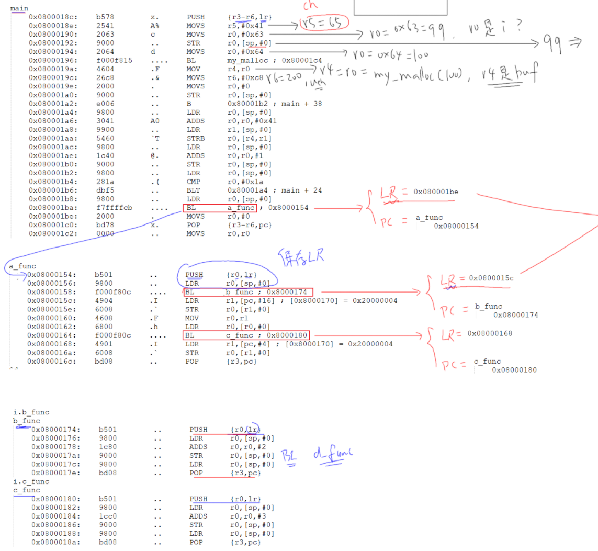

  - 基于此，可以提出三个问题：
    - 问题1：每调用一个函数都会写一遍LR，如何防止覆盖；
    - 问题2：局部变量是在栈中分配的，那是如何分配的；
    - 问题3：为何每个RTOS任务都要有自己的栈；

- **问题1解答**

  - 在上图中，每个C函数的入口都会调用PUSH指令进行压栈；
  - LR寄存器在被修改之前，它的值会压入栈中，防止被覆盖；

- **函数调用中栈的变化**

  - 将上面的函数调用过程的栈变化用下图总结；
  - 需要注意的是函数b_func()、和c_func()它们的栈的关系；
  - **b_func()执行完后再执行c_func()，所以是先回收b_func()的栈，再开辟c_func()的栈的；**

  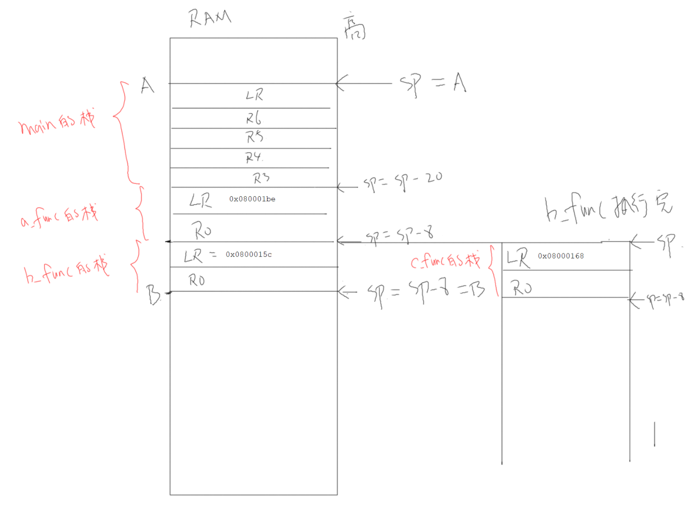


# 3-3-3 栈的概念_局部变量

## 1.内容介绍

- 本节内容回答上一节中提到的栈在局部变量中的作用；
- 本节内容仍以上一节的工程为基础进行讲解，**主要以main()函数中的局部变量为例讲解；**


## 2.栈在局部变量中的作用

- 以main函数的局部变量为例进行讲解；
- 将main函数的汇编代码和源码进行分析，可画出栈的变化如下图所示：
  - 可以看到，**有一些局部变量是直接存放在了寄存器（CPU的寄存器，运行更快）中，有一些局部变量是放在栈中的；**
    - 如第二行汇编的MOVS r5, #0x41，就是将65这个局部变量存入r5寄存器中；
    - 而对于变量i，它加了volatile，先是将0x63复制到了r0寄存器，然后在下一行将r0的值压入sp指针指向的位置，即r3；
    - 寄存器是在CPU内部的存储器，而栈是在内存中划分的，所以它们两者的速度是不一样的；
  - volatile指定的变量一般存在栈中，且当分配的局部变量过多时，寄存器没有办法再存数据也会把局部变量放到栈中；

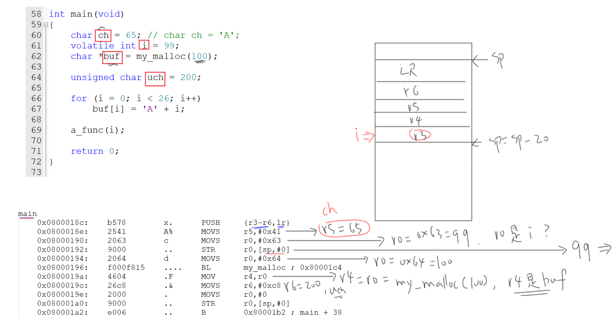


# 3-3-4 栈的概念_RTOS如何使用栈

## 1.内容介绍

- 本节内容回答上一节中提到的为何每个RTOS任务都要有自己的栈；
- 本节内容仍以上一节的工程为基础进行讲解，**主要讲解两个任务同时调用b_func()函数时现场的保护和恢复问题；**


## 2.RTOS中如何使用栈

- 如下图所示，**Task_A和Task_B同时调用了b_func()函数，但是它们的参数完全不一样**；
- **保护现场**
  - 对于RTOS中的任务，内核的Tick中断不断运行，随时都可能切换任务；
  - 在切换任务时，每个任务都需要有自己的栈，栈用来保护现场；
  - 如下图所示中，当进行任务切换时，就需要在Task_A的栈、b_func函数的栈的下面，继续划分一个保护现场的栈；
  - 保护现场需要把所有的寄存器和返回地址都记录下来，**同时把当前的栈顶指针sp记录到任务控制结构体TCB中；**
- **恢复现场**
  - 当恢复现场时，**需要先找到任务的TCB结构体，结构体中存在保护现场的栈顶指针sp；**
  - 然后循着sp指针，不断的恢复现场，包括寄存器和返回地址，这样就可以接着上一个状态继续运行了；

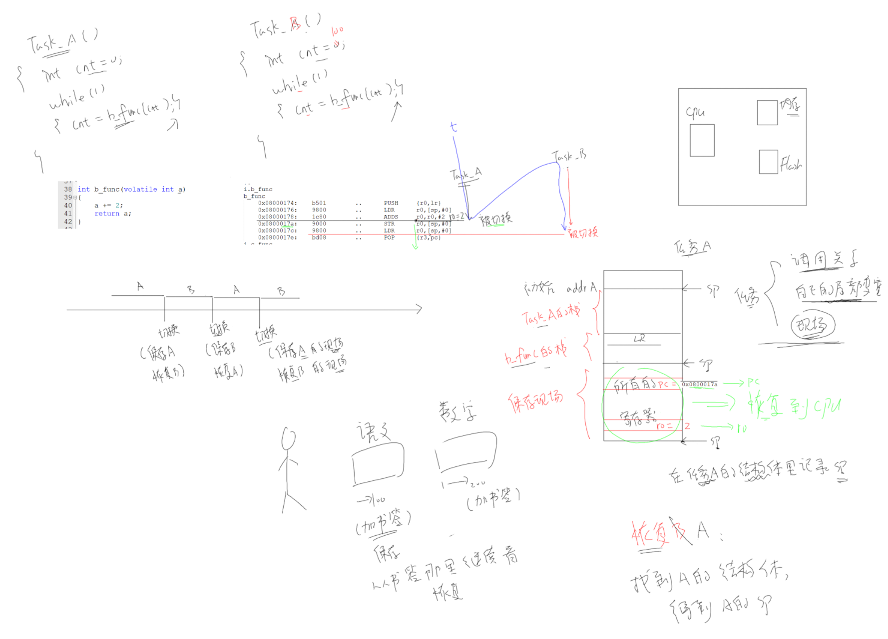


# 4-1 Free RTOS源码概述

## 1.内容介绍

- 本节内容主要介绍**FreeRTOS项目的目录结构**；
- 本节内容主要基于**00_FreeRTOS_Tamplate**工程讲解；
- 这节内容对应课程资料的**第七章——FreeRTOS源码概述；**


## 2.FreeRTOS目录结构

### 2.1 FreeRTOS工程目录结构

使用STM32CubeMX创建的FreeRTOS工程中，FreeRTOS相关的源码如下：

- 左图为列出文件后的目录结构；
- 右图为实际的项目中文件的包含关系；

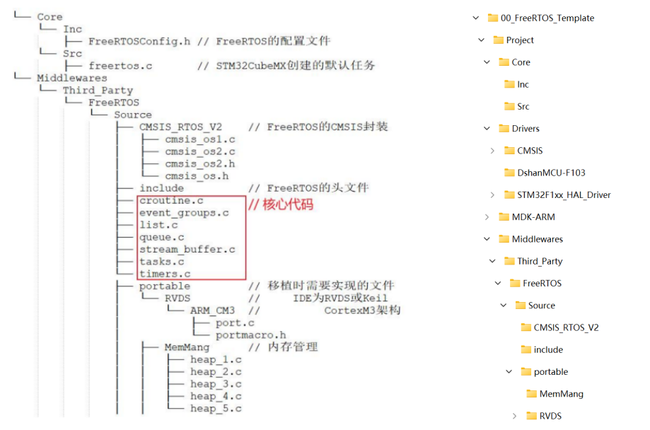

### 2.2 FreeRTOS的主要目录

FreeRTOS工程主要涉及两个文件目录：

- **Core目录**
  - Inc目录下的**FreeRTOSConfig.h**：
    - 是配置文件，对应着在STM32CubeMX中对FreeRTOS的配置；
  - Src目录下的**freertos.c**：
    - 是STM32CubeMX创建的默认任务，后续的任务创建都是在这个文件上进行的；
    - 它的主要函数是**MX_FREERTOS_Init()**，用于创建任务；
- **Middlewares\Third_Party\FreeRTOS\Source**
  - 根目录下是核心文件，这些文件是通用的；
  - portable目录下是移植时需要实现的文件：
    - 目录名为：[compiler]/[architecture]；
    - 比如：RVDS/ARM_CM3，这表示cortexM3架构在RVDS工具上的移植文件；


## 3.FreeRTOS的核心文件

- FreeRTOS工程必须的核心文件主要有两个：
  - **FreeRTOS/Source/tasks.c；**
  - **FreeRTOS/Source/list.c；**

- 其他文件的作用也一起列表如下：

  - 在这些文件中，**提供了开发FreeRTOS工程必须的API；**
  - 比如前面创建工程时提到的**xTaskCreate()**就是在tasks.c文件定义的；

  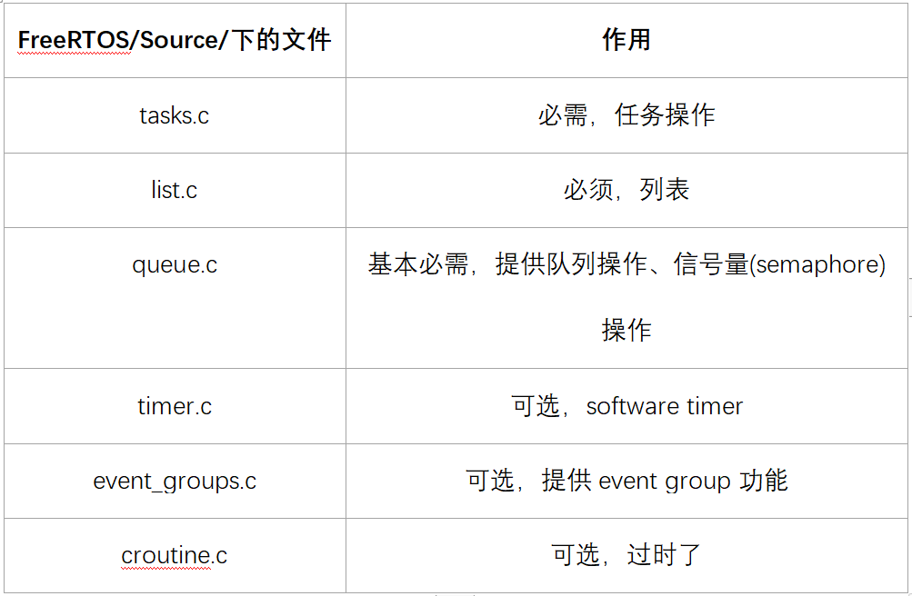


## 4.移植时涉及的文件

- 移植FreeRTOS时涉及的文件放在 **FreeRTOS/Source/portable/[compiler]/[architecture]** 目录下；
- 这个目录的文件是与**IDE和芯片的架构**密切相关的；
- 如RVDS/ARM_CM3，这**表示cortexM3架构在RVDS或Keil工具上的移植文件**，里面有2个文件：
  - port.c文件；
  - portmacro.h文件；


## 5.头文件相关

### 5.1 头文件目录

FreeRTOS需要3个头文件目录：

- FreeRTOS本身的头文件：
  - **Middlewares/Third_Party/FreeRTOS/Source/include；**
  - 这里面的是FreeRTOS的核心文件的头文件，如tasks.h等；

- 移植时用到的头文件：
  - **Middlewares/Third_Party/FreeRTOS/Source/portable/[compiler]/[architecture]；**
  - 主要就是上面提到的移植相关的文件；

- 含有配置文件FreeRTOSConfig.h的目录：
  - **Core/Inc；**
  - FreeRTOSConfig.h文件中记录了STM32CubeMX中对FreeRTOS的设置；

### 5.2 头文件

列表如下：

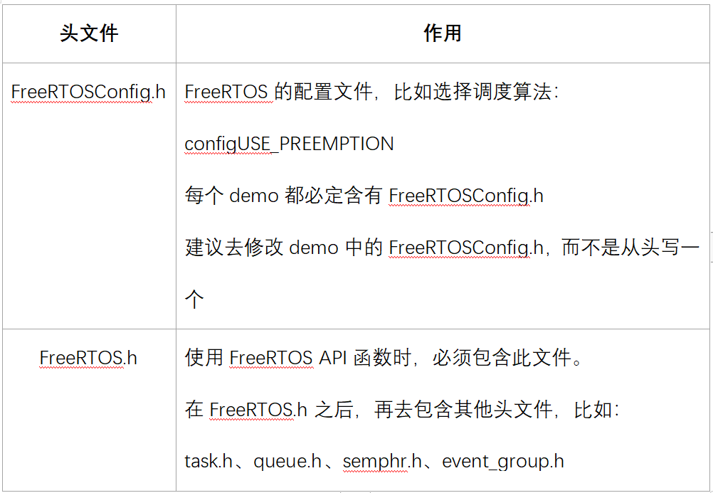


## 6.内存管理

- 文件在**Middlewares\Third_Party\FreeRTOS\Source\portable\MemMang下；**
- 它也是放在“portable”目录下，表示你**可以提供自己的函数**；
- 源码中默认提供了5个文件，对应内存管理的5种方法：

| 文件     | 优点                             | 缺点                     |
| -------- | -------------------------------- | ------------------------ |
| heap_1.c | 分配简单，时间确定               | 只分配、不回收           |
| heap_2.c | 动态分配、最佳匹配               | 碎片、时间不定           |
| heap_3.c | 调用标准库函数                   | 速度慢、时间不定         |
| heap_4.c | 相邻空闲内存可合并               | 可解决碎片问题、时间不定 |
| heap_5.c | 在 heap_4 基础上支持分隔的内存块 | 可解决碎片问题、时间不定 |


## 7.入口函数

- 所有的C工程的入口函数都是main函数，FreeRTOS工程也是如此；
- 入口函数在Core\Src\main.c的main函数里，初始化了FreeRTOS环境、创建了任务，然后启动调度器；
- 入口函数的源码如下：

```c
int main(void)
{
  HAL_Init();				// HAL库初始化

  SystemClock_Config();		// 系统时钟配置

  osKernelInitialize();		// 启动FreeRTOS的内核
  
  MX_FREERTOS_Init();		// 创建任务

  osKernelStart();			// 启动调度器

  while (1)
  {
      
  }
}
```


## 8.数据类型和编程规范

### 8.1 数据类型

每个移植的版本都含有自己的portmacro.h头文件，里面定义了2个数据类型：

- **TickType_t变量类型：**

  - FreeRTOS配置了一个**周期性的时钟中断：Tick Interrupt**，每发生一次中断，中断次数累加，这被称为**tick count**；
  - tick count这个变量的类型就是TickType_t，**TickType_t可以是16位的，也可以是32位的**；
  - FreeRTOSConfig.h中定义configUSE_16_BIT_TICKS时，TickType_t就是uint16_t，否则TickType_t就是uint32_t；
  - 对于32位架构，建议把TickType_t配置为uint32_t；
  - 可以打开portmacro.h文件查看是什么类型：

  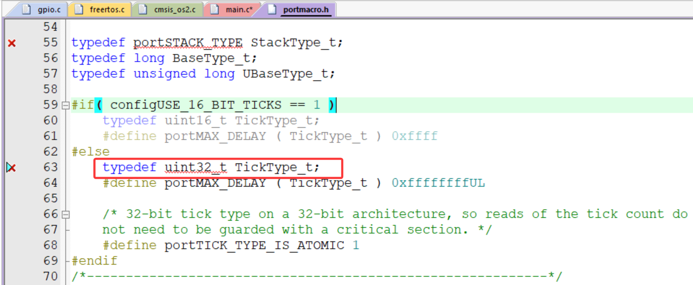

- **BaseType_t变量类型：**

  - 这是该架构最高效的数据类型：
    - 32位架构中，它就是uint32_t；
    - 16位架构中，它就是uint16_t；
    - 8位架构中，它就是uint8_t；
  - **BaseType_t通常用作简单的返回值的类型，还有逻辑值，比如pdTRUE/pdFALSE；**

### 8.2 变量名

- 在FreeRTOS的源码中，变量名的命名方式是有规律的；
- 即可以在变量前面加前缀，以表示它是什么类型的变量，规律如下表所示：

| 变量名前缀 | 含义                                                         |
| ---------- | ------------------------------------------------------------ |
| c          | char                                                         |
| s          | int16_t, short                                               |
| l          | int32_t, long                                                |
| x          | BaseType_t，其他非标准的类型：结构体、task handle、queue handle 等 |
| u          | unsigned                                                     |
| p          | 指针                                                         |
| uc         | uint8_t, unsigned char                                       |
| pc         | char 指针                                                    |

- 如下图即为例子：

  - u表示unsigned的意思，而c表示是一个char形变量；

  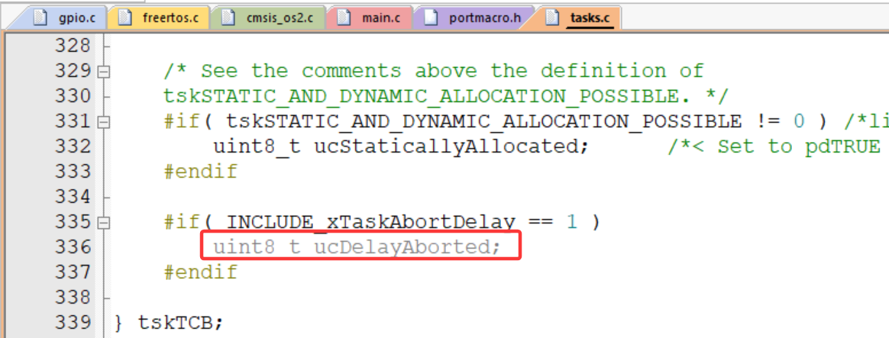

### 8.3 函数名

- 在FreeRTOS的源码中，函数名的命名方式是有规律的；
- 即可以在变量前面加前缀，以表示它的返回值类型以及在哪个文件中定义，规律如下表所示：

| 函数名前缀示例    | 含义                                          |
| ----------------- | --------------------------------------------- |
| vTaskPrioritySet  | 返回值类型：void；在 task.c 中定义            |
| xQueueReceive     | 返回值类型：BaseType_t；在 queue.c 中定义     |
| pvTimerGetTimerID | 返回值类型：pointer to void；在 tmer.c 中定义 |

- 如下图即为例子：

  - x表示它的返回值为BaseType_t，而Task便是它是在tasks.c文件中定义的；

  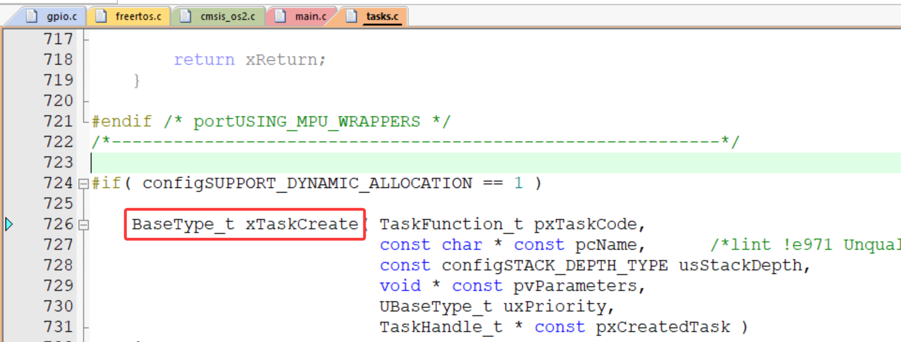

### 8.4 宏的名

- 在FreeRTOS的源码中，宏的名字的命名方式是有规律的；
- 宏的名字是大写，可以添加小写的前缀；
- 前缀是用来表示：宏在哪个文件中定义。规律如下表所示：

| 宏的前缀（示例）                    | 含义：在哪个文件里定义    |
| ----------------------------------- | ------------------------- |
| port（比如 portMAX_DELAY）          | portable.h 或 portmacro.h |
| task（比如 taskENTER_CRITICAL ()）  | task.h                    |
| pd（比如 pdTRUE）                   | projdefs.h                |
| config（比如 configUSE_PREEMPTION） | FreeRTOSConfig.h          |
| err（比如 errQUEUE_FULL）           | projdefs.h                |

- 通用的宏定义如下：

| 宏      | 值   |
| ------- | ---- |
| pdTRUE  | 1    |
| pdFALSE | 0    |
| pdPASS  | 1    |
| pdFAIL  | 0    |


# 4-2 内存管理

## 1.内容介绍

- 本节内容介绍FreeRTOS中是如何管理内存的，它是**3-3-1堆的概念的FreeRTOS版本；**
- 本节内容以**00_Driver_Test**工程为基础进行讲解，其对应的内容在**课程资料的第八章——内存管理；**


## 2.malloc函数与free函数

- **malloc函数与free函数**

  - 在3-3-1堆的概念中有提到了几种堆的管理方法，其中就有malloc函数和free函数；
  - 对于malloc函数和free函数而言，它们是动态分配的，它有个致命问题那就是**内存的碎片化；**
  - 在3-3-1堆的概念中的第四点——堆用链表实现管理，它就是malloc和free函数的本质；
  - 当我们在中间释放一片内存时，多片空闲内存是不连续的，被头部隔离，导致了很多的碎片；
  - **如果不断的malloc然后free，就会把内存切得稀巴烂；**

  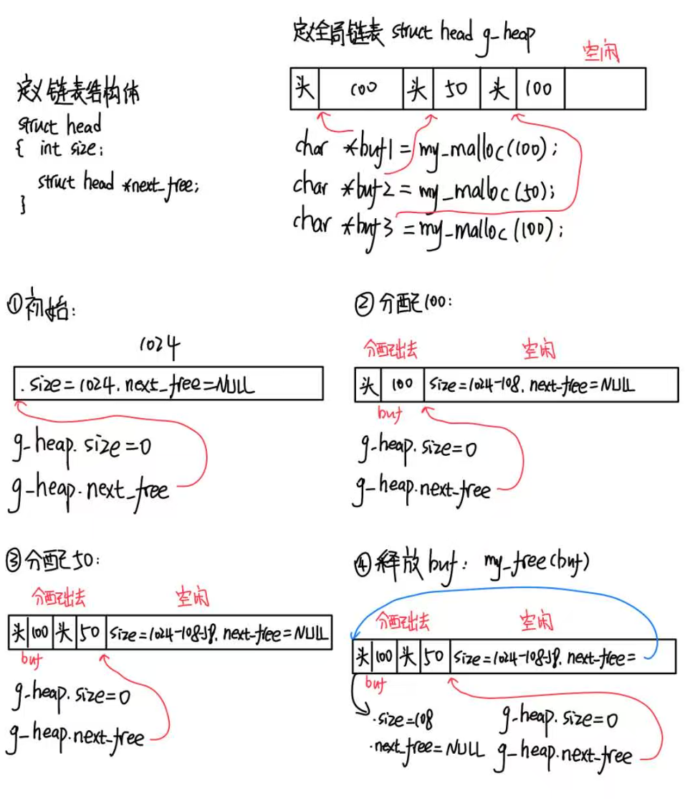

- **堆和栈的区别**

  - 堆，heap，就是一块空闲的内存，需要提供管理函数
    - malloc：从堆里划出一块空间给程序使用；
    - free：用完后，再把它标记为"空闲"的，可以再次使用；
  - 栈，stack，函数调用时局部变量保存在栈中，当前程序的环境也是保存在栈中
    - 可以从堆中分配一块空间用作栈；

  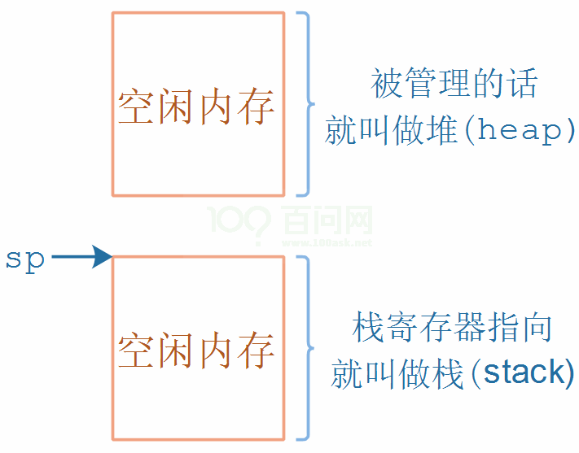

- **FreeRTOS中的内存管理**
  - FreeRtOS涉及的内核对象有：**task、queue、semaphores和event group**等；
  - 为了让FreeRTOS更容易使用，这些内核对象一般都是**动态分配：用到时分配，不使用时释放；**
  - 使用内存的动态管理功能，简化了程序设计：不再需要小心翼翼地提前规划各类对象，简化API函数的涉及，甚至可以减少内存的使用；
  - **FreeRTOS的内存管理接口**
    - 但是像前面说的，如果只是用malloc和free函数实现简单的动态分配，会存在严重的内存碎片；
    - 所以FreeRTOS中的动态分配不是简单的malloc和free函数的封装，而是基于这些函数进行了优化，解决内存碎片化的问题；
    - 在FreeRTOS中，提供的内存管理接口主要是：**pvPortMalloc() 、vPortFree()**；


## 3.FreeRTOS的5中内存管理方法

- FreeRTOS中内存管理的相关文件**FreeRTOS/Source/portable/MemMang**下，它放在portable目录下，表示你可以提供自己的函数；
- 文件提供的接口函数为：**pvPortMalloc() 、vPortFree()，对应于C库的malloc()、free()；**

- 源码中默认提供了5个文件，对应内存管理的5种方法：

| **文件** | **优点**                       | **缺点**                 |
| -------- | ------------------------------ | ------------------------ |
| heap_1.c | 分配简单，时间确定             | 只分配、不回收           |
| heap_2.c | 动态分配、最佳匹配             | 碎片、时间不定           |
| heap_3.c | 调用标准库函数                 | 速度慢、时间不定         |
| heap_4.c | 相邻空闲内存可合并             | 可解决碎片问题、时间不定 |
| heap_5.c | 在heap_4基础上支持分隔的内存块 | 可解决碎片问题、时间不定 |

### 3.1 Heap_1

- **文件内容**
  - 它只实现了pvPortMalloc，没有实现vPortFree；
  - 如果程序不需要删除内核对象，齐不允许使用动态内存，那么可以使用heap_1；

- **内存管理的实现**

  - 它的实现原理很简单，首先定义一个大数组；
  - 然后，对于pvPortMalloc调用时，从这个数组中分配空间；

  ```c
  /* Allocate the memory for the heap. */
  ##if ( configAPPLICATION_ALLOCATED_HEAP == 1 )
  
  /* The application writer has already defined the array used for the RTOS
  * heap -  probably so it can be placed in a special segment or address. */
      extern uint8_t ucHeap[ configTOTAL_HEAP_SIZE ];
  ##else
      static uint8_t ucHeap[ configTOTAL_HEAP_SIZE ];
  ##endif /* configAPPLICATION_ALLOCATED_HEAP */
  ```

- **实际的内存分配**

  - FreeRTOS在创建任务时，需要2个内核对象：**task control block(TCB)、stack，即TCB结构体和每个任务自己的栈**；
  -  使用heap_1时，内存分配过程如下图所示：
    - A：创建任务之前整个数组都是空闲的；
    - B：创建第1个任务之后，蓝色区域被分配出去了；
    - C：创建3个任务之后的数组使用情况；

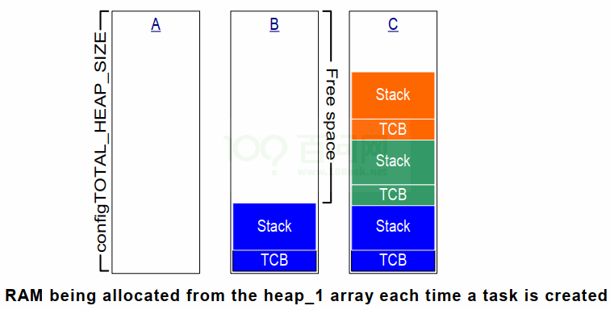

### 3.2 Heap_2

**Heap_2之所以还保留，只是为了兼容以前的代码，新设计中不再推荐使用Heap_2；建议使用Heap_4来替代Heap_2，更加高效；**

- **内存管理的实现**
  - Heap_2也是**在数组上分配内存**，跟Heap_1不一样的地方在于：
    - Heap_2使用**最佳匹配算法(best fit)**来分配内存；
    - 它支持**vPortFree()**；

- **最佳匹配算法**
  - 假设heap有3块空闲内存：5字节、25字节、100字节；
  - pvPortMalloc()想申请20字节；
  - 找出最小的、能满足pvPortMalloc()的内存：25字节；
  - 把它划分为20字节、5字节；
    - 返回这20字节的地址
    - 剩下的5字节仍然是空闲状态，留给后续的pvPortMalloc使用；

- **缺点与优点**
  - 与Heap_4相比，**Heap_2不会合并相邻的空闲内存**，所以Heap_2会导致严重的"碎片化"问题；
  - 但是，**如果申请、分配内存时大小总是相同的，这类场景下Heap_2没有碎片化的问题**；
  - 所以它适合这种场景频繁：创建、删除任务，但是**任务的栈大小都是相同的**(创建任务时，需要分配TCB和栈，TCB总是一样的)；
  - 虽然不再推荐使用heap_2，但是它的效率还是远高于malloc、free；

- **实际的内存分配**
  - 使用heap_2时，内存分配过程如下图所示：
    - A：创建了3个任务；
    - B：删除了一个任务，空闲内存有3部分：顶层的、被删除任务的TCB空间、被删除任务的Stack空间；
    - C：创建了一个新任务，因为TCB、栈大小跟前面被删除任务的TCB、栈大小一致，所以刚好分配到原来的内存；

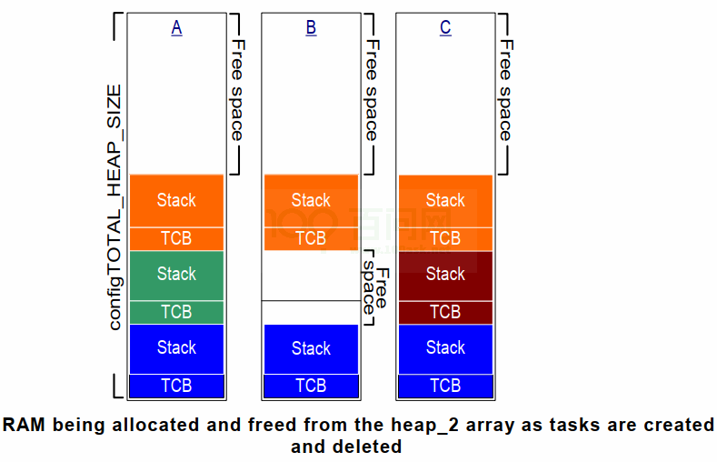

### 3.3 Heap_3

- **内存管理的实现**
  - Heap_3使用**标准C库里的malloc、free函数；**
  - **所以堆大小由链接器的配置决定，配置项configTOTAL_HEAP_SIZE不再起作用；**

- **线程安全**
  - C库里的malloc、free函数并非线程安全的；
  - **Heap_3中先暂停FreeRTOS的调度器，再去调用这些函数**，使用这种方法实现了线程安全；

### 3.4 Heap_4

- **内存管理的实现**
  - 跟Heap_1、Heap_2一样，Heap_4也是**使用大数组来分配内存**；
  - Heap_4使用 **首次适应算法(first fit)来分配内存** ；
  - 它还会**把相邻的空闲内存合并为一个更大的空闲内存**，这有助于较少内存的碎片问题。

- **首次适应算法**
  - 假设堆中有3块空闲内存：5字节、200字节、100字节；
  - pvPortMalloc()想申请20字节；
  - 找出第1个能满足pvPortMalloc()的内存：200字节；
  - 把它划分为20字节、180字节，并返回这20字节的地址；
  - 剩下的180字节仍然是空闲状态，留给后续的pvPortMalloc使用；

- **优点和适用场景**
  - Heap_4会把**相邻空闲内存合并为一个大的空闲内存**，可以较少内存的碎片化问题；
  - 适用于这种场景：频繁地分配、释放**不同大小的内存**；
  - **Heap_4执行的时间是不确定的**，但是它的效率高于标准库的malloc、free；

- **实际的内存分配**
  - Heap_4的使用过程举例如下：
    - A：创建了3个任务；
    - B：删除了一个任务，空闲内存有2部分：顶层的空闲内存、被删除任务的TCB空间和被删除任务的Stack空间合并起来的空闲内存；
    - C：分配了一个Queue，从第1个空闲块中分配空间；
    - D：分配了一个User数据，从Queue之后的空闲块中分配；
    - E：释放的Queue，User前后都有一块空闲内存；
    - F：释放了User数据，User前后的内存、User本身占据的内存，合并为一个大的空闲内存；

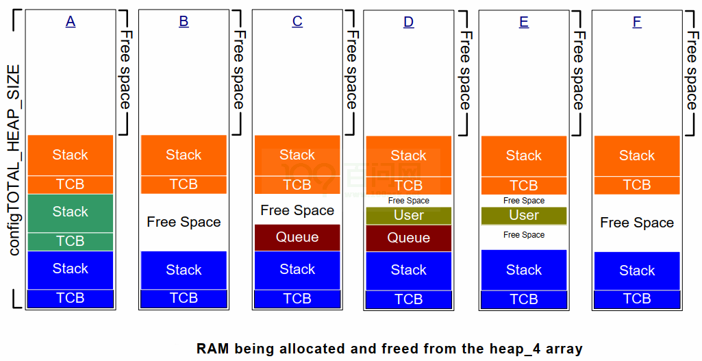

### 3.5 Heap_5

- **内存管理的实现**
  - Heap_5分配内存、释放内存的算法跟Heap_4是一样的；
  - 相比于Heap_4，Heap_5并不局限于管理一个大数组：**它可以管理多块、分隔开的内存；**
  - 在嵌入式系统中，**内存的地址可能并不连续，这种场景下可以使用Heap_5；**

- **实际的内存分配**

  - 既然内存是分隔开的，那么就需要进行初始化：确定这些内存块在哪、多大
    - 在使用**pvPortMalloc()**之前，必须先指定内存块的信息；
    - 实际中使用**vPortDefineHeapRegions()**来指定这些信息；
  - **指定一块内存：HeapRegain_t结构体**

  ```c
  typedef struct HeapRegion
  {
      uint8_t * pucStartAddress; // 起始地址
      size_t xSizeInBytes;       // 大小
  } HeapRegion_t;
  ```

  - **指定多块内存：使用HeapRegion_t数组**

  ```c
  HeapRegion_t xHeapRegions[] =
  {
    { ( uint8_t * ) 0x80000000UL, 0x10000 }, // 起始地址0x80000000，大小0x10000
    { ( uint8_t * ) 0x90000000UL, 0xa0000 }, // 起始地址0x90000000，大小0xa0000
    { NULL, 0 } // 表示数组结束
   };
  ```

  - **Heap_5的初始化：vPortDefineHeapRegions()函数**

    - 把xHeapRegions数组传给vPortDefineHeapRegions函数，即可初始化Heap_5；

    - vPortDefineHeapRegions()函数原型如下：

    ```c
    void vPortDefineHeapRegions( const HeapRegion_t * const pxHeapRegions);
    ```


## 4.Heap提供的函数API

### 4.1 pvPortMalloc()/vPortFree()

- **函数API原型**

```c
void * pvPortMalloc( size_t xWantedSize );
void vPortFree( void * pv );
```

- **作用与返回值**
  - 作用：分配内存、释放内存；
  - 返回值：如果分配内存不成功，则返回值为NULL；

### 4.2 xPortGetFreeHeapSize()

- **函数API原型：**

```c
size_t xPortGetFreeHeapSize( void );
```

- **作用与返回值**
  - 返回值：返回当前还有多少空闲内存；
  - 作用：
    - 这函数可以用来优化内存的使用情况；
    - 如当所有内核对象都分配好后，执行此函数返回2000，那么configTOTAL_HEAP_SIZE就可减小2000；
  - 注意：在heap_3中无法使用；

### 4.3 xPortGetMinimumEverFreeHeapSize()

- **函数API原型**

```c
size_t xPortGetMinimumEverFreeHeapSize( void );
```

- **返回值与注意事项**
  - 返回：程序运行过程中，空闲内存容量的最小值；
  - 注意：只有heap_4、heap_5支持此函数；

### 4.4 malloc失败的钩子函数

- **源码分析**

  - 在pvPortMalloc()函数内部有一个**钩子函数vApplicationMallocFailedHook()：**

  ```c
  void * pvPortMalloc( size_t xWantedSize )vPortDefineHeapRegions
  {
      ......
      #if ( configUSE_MALLOC_FAILED_HOOK == 1 )
          {
              if( pvReturn == NULL )
              {
                  extern void vApplicationMallocFailedHook( void );
                  vApplicationMallocFailedHook();
              }
          }
      #endif
      
      return pvReturn;        
  }
  ```

  - 这个函数是一个弱函数，由cmsis_os2.c文件定义；

  ```c
  /**
    Dummy implementation of the callback function vApplicationMallocFailedHook().
  */
  #if (configUSE_MALLOC_FAILED_HOOK == 1)
  __WEAK void vApplicationMallocFailedHook (void){}
  #endif
  ```

- **钩子函数的使用**
  - 由源码分析可知，如果想使用这个钩子函数，必须完成如下设置：
    - 在FreeRTOSConfig.h中，把configUSE_MALLOC_FAILED_HOOK定义为1；
    - 需要自己重新提供vApplicationMallocFailedHook()函数；
    - pvPortMalloc()失败时，才会调用此函数；
  - 由于只有pvPortMalloc()失败时才会调用此函数，所以可以用这个钩子函数来打印一些提示信息；


## 5.课外补充——回调函数与钩子函数的区别

### 5.1 回调函数（Callback Function）

- **基本定义**

  - 回调函数是**由用户实现、通过函数指针注册给系统 / 驱动 / 第三方库**，在**特定事件触发时由系统主动调用**的函数；

    核心逻辑：**用户定义 → 注册给别人 → 事件发生 → 别人调用用户函数**；

- **核心用途**
  - 处理**异步事件**：串口收发完成、定时器溢出、按键触发、网络数据到达；
  - 实现解耦：库 / 驱动不关心上层业务，只在事件发生时 “通知” 上层；
  - 模块化、可扩展设计；

- **标准实现特征**
  - 函数名**由用户自定义**，不强制固定；
  - **必须手动注册**（将函数指针传入注册接口）；
  - 一般**不使用 `__weak` 弱定义；**
  - 同一模块可注册多个不同回调（灵活度高）；
- **标准回调代码示例**

```c
// 驱动层提供注册接口
typedef void (*UART_RxCallback)(uint8_t byte);
void UART_SetRxCallback(UART_RxCallback cb);

// 用户层自定义回调函数
void My_UART_RxHandler(uint8_t data) {
    // 业务处理
}

// 主动注册回调
UART_SetRxCallback(My_UART_RxHandler);

```

### 5.2 钩子函数（Hook Function）

- **基本定义**
  - 钩子函数是**系统 / 内核预先定义好函数名与原型**，并预留为弱符号，用户只需**重新实现该函数**，系统在**固定执行流程节点自动调用**；
  - 可以理解为：系统在运行流程中 “挖了一个坑”，用户把业务逻辑填进去，流程执行到此处就会 “勾” 一下用户函数；

- **核心用途**
  - 扩展 / 监控**系统内部流程**：空闲任务执行、系统时钟节拍、栈溢出检测、内存分配失败；
  - 调试、追踪、系统状态统计；
  - 不改变内核源码，实现外部逻辑注入；

- **标准实现特征**
  - 函数名**由系统强制固定**，用户不可修改；
  - **无需手动注册**，实现即生效；
  - 通常使用 `__weak` 弱定义，库提供空实现；
  - 同一钩子只能有一个有效实现；

- **标准钩子代码示例（FreeRTOS）**

```c
// 系统已通过 __weak 定义 vApplicationIdleHook
// 用户直接重写实现
void vApplicationIdleHook(void) {
    // 空闲任务运行时执行
}
```

### 5.3 回调函数与钩子函数核心对比

|   对比项   |            回调函数 Callback             |            钩子函数 Hook             |
| :--------: | :--------------------------------------: | :----------------------------------: |
|  命名规则  |             用户自定义函数名             |            系统固定函数名            |
|  注册方式  |           必须手动注册函数指针           |         无需注册，实现即生效         |
| 关键字特征 |             一般无 `__weak`              |         常用 `__weak` 弱定义         |
|  调用时机  | 异步事件触发（收发完成、中断、消息到达） | 系统固定流程节点（空闲、Tick、异常） |
|  设计目的  |       事件通知、业务响应、模块解耦       |     流程扩展、系统监控、调试统计     |
|   灵活度   |          高，可注册多个不同回调          |       低，同名钩子只能实现一次       |
|  典型场景  |    串口、定时器、按键、队列、网络事件    |  空闲钩子、栈溢出钩子、内存失败钩子  |

### 5.4 STM32的HAL库中的 “回调函数”—— 特殊混合形式

- **STM32中的回调函数**

  - STM32的HAL库中大量存在如下函数：

  ```c
  __weak void HAL_ADCEx_InjectedConvCpltCallback(ADC_HandleTypeDef *hadc)
  {
    /* Prevent unused argument(s) compilation warning */
    UNUSED(hadc);
    /* NOTE : This function Should not be modified, when the callback is needed,
              the HAL_ADC_InjectedConvCpltCallback could be implemented in the user file
     */
  }
  ```

  - 它们有如下特点：
    - 函数名固定、带 `__weak` 弱定义、无需注册、用户重写后自动生效；
    - 从**实现形式**看，这完全是**钩子函数**；但从**功能用途**看，它用于串口接收完成事件，属于**回调函数**；

- **STM32的回调函数的本质**

  - STM32 HAL 回调 = 用钩子的实现方式，实现回调的事件功能；
  - 所以在STM32的HAL库开发中，只需要用钩子函数的方式实现对应中断的回调函数即可完成中断的逻辑业务；
  - 可将区别总结如下：

  |         类型         | 函数名 | 需注册 | __weak |       本质归类       |
  | :------------------: | :----: | :----: | :----: | :------------------: |
  |       标准回调       | 用户定 |   是   |   否   |       事件回调       |
  | 标准钩子（FreeRTOS） | 系统定 |   否   |   是   |       流程扩展       |
  | STM32 HAL 库回调函数 | 系统定 |   否   |   是   | 事件回调（钩子实现） |

---


# 5-1-1 创建任务_声光色影

## 1.任务的三要素

- **任务的三要素**

  - 函数：即指定函数做什么事情，这个函数需要有固定的格式，但即使没有按固定格式也可以运行，只是编译有警告；
  - 栈和TCB的分配：每个任务都需要有自己的栈和TCB结构体，用于恢复现场和保护现场以及切换任务；
  - 优先级：优先级不是任务必须的，但是有优先级可以实现更灵活的结构；

- **任务的切换**

  - 当任务切换出去之后，只能通过**链表**找到**任务的控制结构体TCB**才能重新找到任务；
  - 对于**栈和TCB**，它们有两种方式进行分配：
    - 一种是通过**malloc**进行动态分配，对应xTaskCreate()函数；
    - 一种是**事先静态分配**，对应xTaskCreateStatic()函数；

  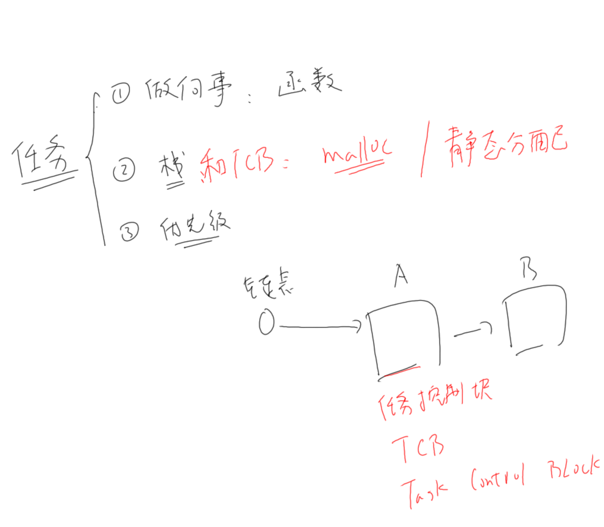

 

## 2.任务的创建

### 2.1 动态分配内存创建任务

- **API介绍：**

```c
BaseType_t xTaskCreate( TaskFunction_t pxTaskCode,					// 函数指针, 任务函数
                        const char * const pcName,					// 任务的名字
                        const configSTACK_DEPTH_TYPE usStackDepth,	// 栈大小,单位为word,10表示40字节
                        void * const pvParameters,					// 调用任务函数时传入的参数
                        UBaseType_t uxPriority,						// 优先级
                        TaskHandle_t * const pxCreatedTask );		// 任务句柄, 以后使用它来操作这个任务
```

- **参数说明：**

| **参数**      | **描述**                                                     |
| ------------- | ------------------------------------------------------------ |
| pvTaskCode    | 函数指针，任务对应的 C 函数。任务应该永远不退出，或者在退出时调用 "vTaskDelete(NULL)"。 |
| pcName        | 任务的名称，仅用于调试目的，FreeRTOS 内部不使用。pcName 的长度为 configMAX_TASK_NAME_LEN。 |
| usStackDepth  | 每个任务都有自己的栈，usStackDepth 指定了栈的大小，**单位为 word**。例如，如果传入 100，表示栈的大小为 100 word，即 400 字节。最大值为 uint16_t 的最大值。确定栈的大小并不容易，通常是根据估计来设定。精确的办法是查看反汇编代码。 |
| pvParameters  | 调用 pvTaskCode 函数指针时使用的参数：pvTaskCode(pvParameters)。 |
| uxPriority    | 任务的优先级范围为 0~(configMAX_PRIORITIES – 1)。数值越小，优先级越低。如果传入的值过大，xTaskCreate 会将其调整为 (configMAX_PRIORITIES – 1)。 |
| pxCreatedTask | 用于保存 xTaskCreate 的输出结果，即任务的句柄（task handle）。如果以后需要对该任务进行操作，如修改优先级，则需要使用此句柄。如果不需要使用该句柄，可以传入 NULL。 |
| 返回值        | 成功时返回 pdPASS，失败时返回 errCOULD_NOT_ALLOCATE_REQUIRED_MEMORY（失败原因是内存不足）。请注意，文档中提到的失败返回值是 pdFAIL 是不正确的。pdFAIL 的值为 0，而 errCOULD_NOT_ALLOCATE_REQUIRED_MEMORY 的值为 -1。 |

### 2.2 静态分配内存创建任务

- **API介绍：**

```c
TaskHandle_t xTaskCreateStatic ( 
    TaskFunction_t pxTaskCode,				// 函数指针, 任务函数
    const char * const pcName,				// 任务的名字
    const uint32_t ulStackDepth,			// 栈大小,单位为word,10表示40字节
    void * const pvParameters,				// 调用任务函数时传入的参数
    UBaseType_t uxPriority,					// 优先级
    StackType_t * const puxStackBuffer,		// 静态分配的栈，就是一个buffer
    StaticTask_t * const pxTaskBuffer		// 静态分配的任务结构体的指针，用它来操作这个任务，即TCB结构体指针
);
```

- **参数说明：**

| **参数**       | **描述**                                                     |
| -------------- | ------------------------------------------------------------ |
| pvTaskCode     | 函数指针，可以简单地认为任务就是一个C函数。 它稍微特殊一点：永远不退出，或者退出时要调用"vTaskDelete(NULL)" |
| pcName         | 任务的名字，FreeRTOS内部不使用它，仅仅起调试作用。 长度为：configMAX_TASK_NAME_LEN |
| usStackDepth   | 每个任务都有自己的栈，这里指定栈大小。 单位是word，比如传入100，表示栈大小为100 word，也就是400字节。 最大值为uint16_t的最大值。 怎么确定栈的大小，并不容易，很多时候是估计。 精确的办法是看反汇编码。由于是静态分配，所以必须告诉函数栈的大小； |
| pvParameters   | 调用pvTaskCode函数指针时用到：pvTaskCode(pvParameters)       |
| uxPriority     | 优先级范围：0~(configMAX_PRIORITIES – 1) 数值越小优先级越低， 如果传入过大的值，xTaskCreate会把它调整为(configMAX_PRIORITIES – 1) |
| puxStackBuffer | 静态分配的栈内存，比如可以传入一个数组， 它的大小是usStackDepth*4。 |
| pxTaskBuffer   | 静态分配的StaticTask_t结构体的指针，**即TCB结构体的指针**    |
| 返回值         | 成功：返回任务句柄； 失败：NULL                              |

 

## 3.项目的开发

本节课程内容对应的程序为**05_Chapter9_Create_Task**，它是在**00_Driver_Test**项目的基础上修改的，声光色影对应以下四个任务：

- **任务1：声**
  - 即蜂鸣器播放孤勇者，采用了**动态分配栈**的方式，参考了Github项目；
  - 注意的是里面几个函数的修改，以及变量的定义；除此之外还有music.c文件的改造；

- **任务2：光**
  - 即LED的闪烁，采用**静态分配栈**的方式，需要注意的是几个变量的定义，函数直接使用的driver_led里面的函数；

- **任务3：色**
  - 即全彩LED的闪烁，采用**静态分配栈**的方式，需要注意的是几个变量的定义；
  - 函数直接使用的driver_color_led里面的函数；**（注意注释这个函数里面调用的LCD的部分）**

- **任务4：影**
  - 监测遥控器并在LCD上显示；
  - 默认任务中，只指定了栈的大小，不指定栈的地址，所以用的是**动态分配；**

### 3.1 创建任务1：声

- **创建任务**

  - 声任务采用动态分配内存的方式创建任务：

  ```c
  void MX_FREERTOS_Init(void)
  {
      // 音乐任务的句柄和返回值
      TaskHandle_t xMusicTaskHandle;
  	BaseType_t ret;
      
      ret = xTaskCreate(PlayMusic, "MusicTask", 128, NULL, osPriorityNormal, &xMusicTaskHandle);
  }
  ```

  - 其中xMusicTaskHandle是任务的返回句柄，ret是任务创建的返回状态；

- **Music函数的实现**

  - 现在文件系统中的Core目录下的Src目录新建问价music.c，然后在Keil中将其添加到Core目录下；
  - 声任务是通过无源蜂鸣器实现音乐播放，它参考了Github的开源项目：

  ```c
  【用单片机吟唱孤勇者(STM32+无源蜂鸣器）】 
  https://github.com/Lesterbor/GuYongZhe_PassiveBuzzer_STM32
  https://www.bilibili.com/video/BV1TF411p78W
  ```

  - 该文件过大，无法直接将其代码复制到本笔记中，可直接参考工程项目中的文件；

  - 对Github开源项目的移植主要做了以下事情：

    - 复制music.h文件中必要的宏定义等；
    - 将music.c文件中的代码完全复制；
    - 改写music.c文件中MUSIC_Analysis()函数的蜂鸣器频率设置，将其更换为课程提供的函数PassiveBuzzer_Set_Freq_Duty()；
    - 改写music.c文件中MUSIC_Analysis()函数的延时函数，将其更换为课程提供的函数mdelay()；
    - 完成Playmusic()函数的封装：

    ```c
    void PlayMusic(void *params)
    {
    	PassiveBuzzer_Init();
    	
    	while(1)
    	{
    		MUSIC_Analysis();
    	}
    }
    ```

### 3.2 创建任务2：光

- **创建任务**

  - 光任务采用静态分配内存的方式创建任务：

  ```c
  // 光任务的栈、TCB和返回句柄
  static StackType_t g_pucStackOfLightTask[128];
  static StaticTask_t g_TCBOfLightTask;
  static TaskHandle_t xLightTaskHandle;
  
  void MX_FREERTOS_Init(void)
  {
  	// 创建任务2：光
    	xLightTaskHandle = xTaskCreateStatic(Led_Test, "LightTask", 128, NULL, 
                                           osPriorityNormal, g_pucStackOfLightTask, &g_TCBOfLightTask);
  }
  ```

  - 静态分配的方式创建任务需要实现静态的分配栈、TCB结构体以及句柄；
  - **Led_Test()函数的实现并不符合FreeRTOS任务函数的格式，但可以勉强用，只是会有警告：**

  ```c
  void Led_Test(void)
  {
      Led_Init();
  
      while (1)
      {
          Led_Control(LED_GREEN, 1);
          mdelay(500);
  
          Led_Control(LED_GREEN, 0);
          mdelay(500);
      }
  }
  ```

### 3.3 创建任务3：色

- **创建任务**

  - 色任务采用静态分配内存的方式创建任务：

  ```c
  // 色任务的栈、TCB和返回句柄
  static StackType_t g_pucStackOfColorTask[128];
  static StaticTask_t g_TCBOfColorTask;
  static TaskHandle_t xColorTaskHandle;
  
  void MX_FREERTOS_Init(void)
  {
  	// 创建任务3：色
    	xColorTaskHandle = xTaskCreateStatic(ColorLED_Test, "ColorTask", 128, NULL, 
                                           osPriorityNormal, g_pucStackOfColorTask, &g_TCBOfColorTask);
  }
  ```

  - 静态分配的方式创建任务需要实现静态的分配栈、TCB结构体以及句柄；
  - **ColorLED_Test()函数的实现并不符合FreeRTOS任务函数的格式，但可以勉强用，只是会有警告：**

  ```c
  void ColorLED_Test(void)
  {
      uint32_t color = 0;
  
      ColorLED_Init();
  
      while (1)
      {
          //LCD_PrintString(0, 0, "Show Color: ");
          //LCD_PrintHex(0, 2, color, 1);
          
          ColorLED_Set(color);
  
          color += 200000;
          color &= 0x00ffffff;
          mdelay(1000);
      }    
  }
  ```

  - 除此之外，记得把这个测试函数中的LCD部分注释掉，防止与影任务的LCD冲突；

### 3.4 创建任务4：影

- 直接将原来的StartDefaultTask()函数的红外接收取消注释：

```c
void StartDefaultTask(void *argument)
{
  /* USER CODE BEGIN StartDefaultTask */
  /* Infinite loop */
  LCD_Init();
  LCD_Clear();
  
  for(;;)
  {
	IRReceiver_Test();		// 任务4：影
  }
  /* USER CODE END StartDefaultTask */
}
```

 

## 4.总结

**由于各个任务间的交叉，孤勇者会变得很慢，后面会有办法解决。**

---


# 5-1-2 创建任务_估算栈大小

## 1.栈的内容

- 栈主要需要存三部分的内容
  - **返回地址LR和其他寄存器**：这取决于调用的深度，深度越深LR返回地址越多；
  - **局部变量**：即任务或函数的局部变量，这取决于程序本身的涉及；
  - **现场**：当任务切换时会保护现场，主要是16个寄存器，即16×4＝64Byte


## 2.估算栈大小

- 可以用下图例子来简单的估算一个任务的栈大小；
- 在估算任务的栈大小时，需要综合考虑上面提到的栈的三大部分内容；

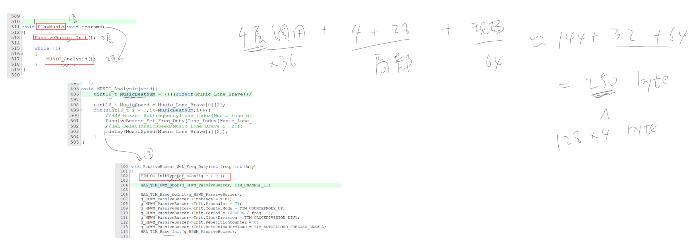


# 5-2 创建任务_使用任务参数


# 5-3 删除任务_用遥控器控制音乐


# 5-4 优先级与阻塞_改善播放效果


# 5-5-1 任务状态_改进播放控制


# 5-5-2 任务管理与调度


# 5-5-3 空闲任务


# 5-6 两个Delay函数


