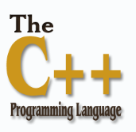

# 第一节课：Cpp教程

## 1.C++简介

- C++是一种高级语言，它是由Bjarne Stroustrup于1979年在贝尔实验室开始设计开发的；
- C++进一步扩充和完善了 C 语言，是一种**面向对象**的程序设计语言；
- C++可运行于多种平台上，如Windows、MAC操作系统以及UNIX的各种版本。




## 2.第一个C++程序

- 在屏幕上打印“Hello, World!”

```c++
#include <iostream>
using namespace std;
int main()
{
    cout << "Hello, World!" << endl;
    return 0;
}

```

- 可以用“\n”代替上面代码的"endl"：

```c++
#include <iostream>
using namespace std;
int main()
{
    cout << "Hello, World!" << "\n";
    return 0;
}

```

