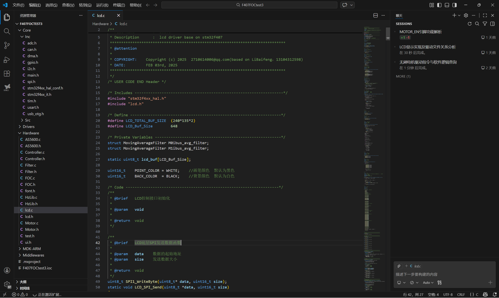
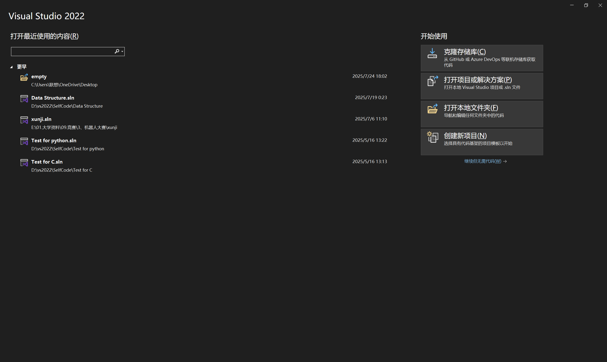
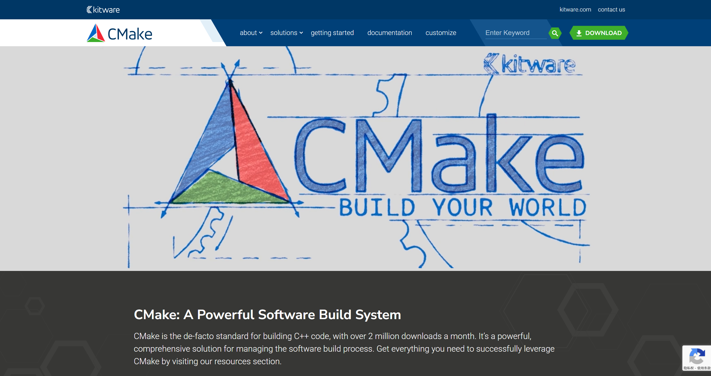

# 第三节课：C++环境设置

## 1.环境设置

- 要在电脑上进行C++开发，需要确保电脑中有文本编辑器和C++编译器，在电脑中配置文本编辑器和C++编译器的过程就是C++环境设置。

## 2.文本编辑器

- 文本编辑器的作用：文本编辑器用于编写代码，通过编辑器创建的文件称为源文件，里面的内容就是程序源代码；

- C++程序的源文件的扩展名常常为`.cpp、.cp或.c`；

- 主要的文本编辑器有：

  - **Visual Studio Code**：
    - 即VsCode，它是一个通用的文本编辑器，但它可以通过安装插件和调整设置来支持C/C++的开发;
    - [安装教程网址](https://www.runoob.com/w3cnote/vscode-tutorial.html)；
    - [官网](https://code.visualstudio.com/)；

  

  - **Visual Studio**：
    - 微软的IDE，面向.NET和C++开发人员的综合性Windows版IDE，可用于构建Web、云、桌面、移动应用、服务和游戏等；
    - [官网](https://visualstudio.microsoft.com/zh-hans/downloads/)；

  

  - **Vim和Emacs**：这两个是传统的文本编辑器，它们有强大的编辑功能和高度的可定制性，有很多插件和配置可以让它们支持C/C++的开发；
    - [Vim官网](https://www.vim.org/)；
    - [Emacs官网](https://www.gnu.org/emacs)；
  - **Eclipse**：Eclipse是一个功能强大的集成开发环境，它最初为Java开发设计，但通过安装C/C++插件，可以使其支持C/C++开发；
    - [Eclipse官网](https://eclipseide.org/)；

## 3.C++编译器

### 3.1 编译器的作用

- 源文件中写的是高级语言，只有人能读得懂，计算机是读不懂的；
- 源文件需要经过”编译“，转为机器语言，这样CPU才能按照指令集执行程序；
- C++编译器就是将源代码编译成最终的可执行程序；
- 大多数的C++编译器不在乎源文件的扩展名，如果未指定扩展名则默认使用`.cpp`；

### 3.2 主要的C/C++编译器

主要的C/C++编译器有：

- **gcc**
  - GCC是**GNU项目**出品的**开源编译器套件**，支持C/C++、Java等多种语言的编译；
  - gcc是GCC中的主要编译器，支持C/C++、Java等多种语言的编译；
  - **g++**是GCC的特定版本，它的默认编译语言是C++；
  - g++和gcc的主要区别在命令行的执行命令上，如果是集成开发环境则无太大区别；
  - 主要运用在Linux系统中；
- **Clang**
  - Clang是基于LLVM架构的开源编译器，但Clang只是编译器的前端；
  - 相比GCC，Clang的编译速度快、报错信息更友好，兼容GCC语法；
  - 可用于MacOS、Linux、Windows；
- **MSVC/MSVC++**：Microsoft Visual C/C++
  - 微软专属的C/C++编译器，仅支持Windows，对Windows API支持最好；
  - 主要用在Visual Studio集成开发环境中；
- **MinGW**
  - GCC开源编译器套件的Windows移植版，即Minimal GNU for Windows；
  - 可在Windows编译出跨平台程序；
  - 主要用在Dev-C++、VsCode和Git等工具中；

### 3.3 主要的集成开发环境中的编译器

| IDE/编辑器/继承开发环境 | 系统    | 默认编译器                               | 备注                                                         |
| ----------------------- | ------- | ---------------------------------------- | ------------------------------------------------------------ |
| Dev-C++                 | Windows | MinGW/GCC                                | 默认捆绑MinGW版本的GCC                                       |
| Visual Studio           | Windows | MSVC/MSVC++                              | 可手动切换为MinGW/GCC等编译器                                |
| VsCode                  | 跨平台  | 无默认编译器，需手动配置                 | Windows：常配置为MinGW/GCC或MSVC； Linux：GCC/Clang； macOS：Clang； |
| CLion                   | 跨平台  | 自动适配，优先系统默认                   | MinGW/GCC（Windows）； GCC（Linux）； Clang（macOS） |
| Qt Creator              | 跨平台  |                                          | 主打Qt开发，也适配OpenCV/ROS2                                |
| Code::Blocks            | 跨平台  | MinGW/GCC（Windows）； GCC（Linux） | 轻量，可手动切换编译器                                       |
| Xcode                   | macOS   | Clang（基于LLVM）                        | 苹果官方IDE，仅支持macOS/iOS                                 |
| git                     | 跨平台  | MinGW                                    | 在Windows中默认即为MinGW；                                   |

### 3.4 其他编译工具

- C/C++的编译工具有CMake；
- CMake可用于配置编译指令，可用于跨平台一直编译指令，它的使用主要有CMake执行程序和CMakeLists.txt配置文件
  - CMake执行程序
    - 它是一个可执行程序，在Windows下是cmake.exe，在Linux/macOS下是cmake命令，是安装在系统里的”软件工具“，类似于git这样的工具；
    - 它会读取CMakeLists.txt配置文件，解析其中的指令，然后根据系统和编译器，自动生成适配的构建脚本；
    - 其核心能力是”跨平台“，只需要写一份配置，CMake就能适配不同环境；
  - CMakeLists.txt配置文件
    - 它是一个纯文本文件，且必须起这个名字，是给CMake工具的”配置脚本“；
    - 其作用有是告诉CMake：
      - 项目有哪些源文件；
      - 项目依赖哪些库；
      - 编译选项，如C++版本，是否开启调试模式、输出可执行文件的名字等；
      - 编译产物要放在哪个目录等；
- [CMake官网](https://cmake.org/)；

## 4.编辑器与编译器在电脑中的关系

- 编辑器：
  - 编辑器只负责写源文件，这个编辑器甚至可以是电脑下的”文本编辑器“，只是它没有代码高亮功能而已；
  - 只要按照语言标准写好源文件即可，而不管它是否是IDE；
- 编译器
  - **编译器的本质是一个可执行的工具，被安装在了电脑中，我们需要设置环境变量，然后在执行终端中运行命令来让它编译文件**；
  - 对于Python而言，我们在下载Python时本质就是下载了Python解释器
    - 我们可以用记事本写一个`.py`的脚本；
    - 然后在Windows下的执行终端中进入这个脚本的目录，然后用python解释器解释运行即可；
  - 编译器的运行方式就像是git一样
    - 在需要操作的目录中打开终端；
    - 在终端中可以写编译器的各种指令进行文件的操作和编译、运行
- 现代的项目开发
  - 现在的项目开发不再是这种命令行的方式了；
  - 大部分的IDE都继承了编译器，如Visual Studio、VsCode、Dev-C++等；
  - IDE内部都集成了编译器，我们只需要点击`运行`的图形化界面即可完成编译和调试；
  - 这个的发展历程与Linux的开发历程是一样的；

