# 第一节：环境的搭建

- 本小节介绍如何**配置C++环境**进行OpenCV的开发。在介绍环境的配置之前需要先搞清楚几个概念——**静态库、静态链、动态库、动态链**。

## 1.静态库、静态链、动态库、动态链

这一小节将重点讲解清楚**静态库、静态链、动态库和动态链**这几者之间的关系。线索如下：

- 从STM32标准外设库的工程文件出发，讲明白**静态库和静态链**；
- 然后过渡到用Python调用OpenCV时的情况，讲明白**动态库和动态链**；
- 接着讲解C++中又是如何调用OpenCV的，讲明白C++中的**动态库和动态链**；
- 最后用一个实际的库封装来把所有关系串起来，实现自己的库设计；

这几者的关系与编译原理及开发方式有着密切的联系。

### 1.1 STM32开发中的库管理

本小节用STM32的标准库开发中的库管理来说明**静态库和静态链**的概念。

#### 1.1.1 未编译的STM32空白目录结构

STM32的开发需要先建立空白工程，然后再在此基础上进一步封装自己的代码，完成工程项目的开发，我们以**STM32F4系列的工程**为例讲解其库管理。

我们可以在Keil中建立一个空白工程，创建完后其工程目录如下：

- **DebugConfig目录：用于存放Debug的基本调试信息**
  - Target_1_STM32F407VETx.dbgconf文件
- **Listings目录：用于存放编译器在编译和链接过程中生成的列表文件**
  - 空白
- **Objects目录：用于存放编译器编译和链接后生成的二进制中间文件**
  - 空白
- **RTE目录：主要用于管理项目所依赖的CMSIS组件、设备驱动和软件包配置文件**
  - Device目录……


#### 1.1.2 编译后的STM32空白目录结构

在空白工程的基础上，我们可以给它添加**库函数、启动文件、寄存器描述文件**等内容，让它能够基于标准外设库进行开发。

如下图所示即为添加了库函数文件之后的空白工程。

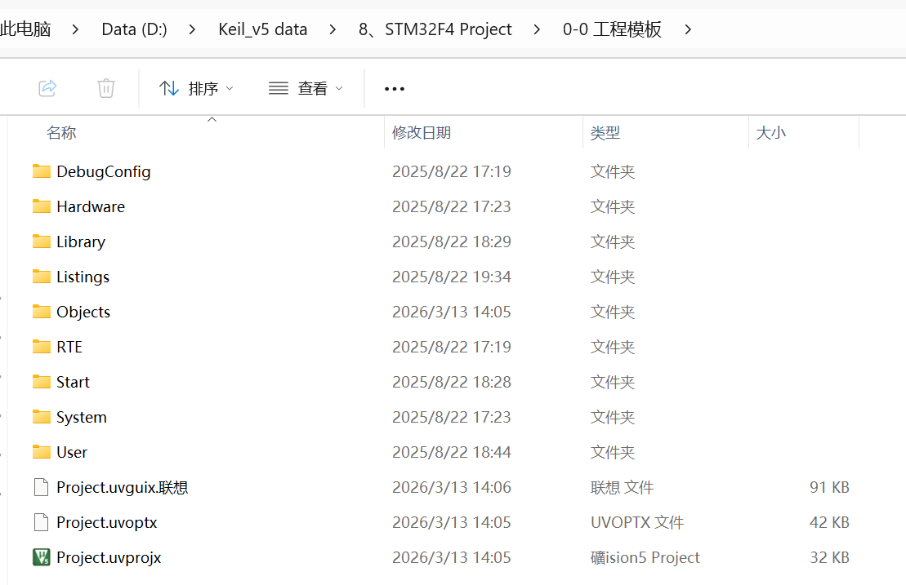

接着我们在此工程的基础上进行**编译**，就会发现在**Objects文件夹**下会多这几类文件：

- **`.o文件`：核心目标文件**
  - 每个`.c`源文件经过编译器单独编译后生成的**二进制中间文件**；
  - `.o文件`内容包括了：
    - 只包含.c文件里的函数、变量的机器码（二进制指令）；
    - 还保留了符号信息（函数名、变量名），方便后续连接器查找；
  - **单个`.o文件`不是库，当把多个`.o文件`打包成`.a(Linux/GCC)`或`.lib(Windows/Keil)`才是静态库；**
- **`.d文件`：依赖文件**
  - 编译器自动生成的依赖记录文件；
  - 记录当前 `.c` 文件依赖了哪些 `.h` 头文件（比如 `main.c` 依赖 `stm32f4xx.h`、`main.h`）；
- **`.crf文件`：编译信息文件**
  - Keil MDK 专用的编译信息文件；
  - 主要内容是存储编译过程中的调试信息、代码映射关系（比如哪一行源码对应哪一段机器码）
- **`.axf文件`：可执行文件**
  - 这个文件类型的文件只有`Project.axf`文件；
  - 它是链接器把所有 `.o` 文件、启动文件、库文件链接后生成的**最终可执行文件**；
  - 点击Keil中的`Download`时就是下载了这个文件；
  - 该文件可以被 `fromelf` 工具转换成 `.hex` 或 `.bin` 文件，用于烧录到单片机（串口烧录）；
- **`.lnp文件`：Keil工程连接器参数文件，记录链接选项；**
- **`.dep文件`：工程级依赖文件，记录整个工程的依赖关系；**


在这种情况下，Keil编译的逻辑进程是这样的：

**.c文件——>编译——>.o文件——>静态链接——>.axf可执行文件。**

#### 1.1.3 Keil中生成静态库

在上面的这种情况下，STM32的工程中并**不会生成静态库，而只是用静态链接的方式把所有的.o文件合成了一个.axf的可执行文件。**

但是在Keil中，可以有选项让我们选择生成静态库：

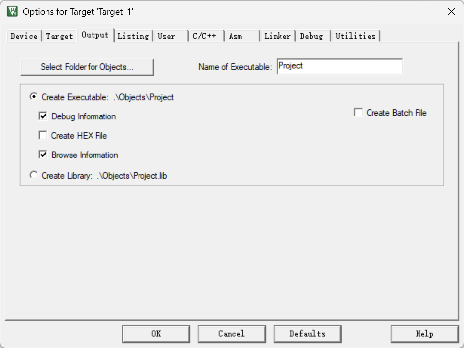

目前选择的**`Create Executable`**就是只生成`.axf`可执行文件。我们选择下方的选项，然后再次编译，可得Object文件夹的内容如下：


- 这样，在Project.lib文件内就已经把所有的.o文件都写进去了。

- 它是本质是.c文件的所有源代码操作，但是不是以源代码形式存在的，这样就可以实现源代码的保护了，防止其他人偷程序；

- 我们只需要给这个.lib文件和头文件，人家的工程还是一样可以调用我们的库进行开发，只是他不知道我们的内部实现是怎么样的；
- 这种情况下，Keil编译的逻辑进程是这样的：**.c文件——>编译——>.o文件——>打包——>Project.lib静态库——>.axf可执行文件；**
- **注意，除了.lib文件是静态库外，.a文件类型也是静态库；**

#### 1.1.4 静态链接

前面几点已经讲清楚了静态库是什么 了：**源文件的二进制代码的封装；**

封装成静态库的原因有如下几点：

- **可以不暴露源代码，保护了知识产权；**
- **封装成静态库后，每次编译不再需要全部编译，节省了时间；**
- **方便别人调用，在静态库的背景下新建工程不再需要一个个.c文件复制，只需要一个.lib静态库和.h文件即可实现开发；**

那讲明白了静态库，那静态链接是在做什么呢？

静态链接就是把你自己写的代码和依赖库糅合在一起，生成完整的可执行文件，这个依赖库可以是库函数文件也可以是静态库，所以说前面提到的Keil的两种开发方式都是静态链接的方式。静态链接主要做这几件事：

- 把**依赖库（库函数/静态库）**中用到的代码合并进可执行文件中，这个用到的代码分两个层面：
  - 依赖库中没有用到的库文件它不会合并；
  - 用到的库文件中的没用到的函数它不会合并；
- **链接过程：给函数调用补上真是地址**
  - 写好程序后进行编译，函数的调用编译器是无法翻译的，它无法告诉程序去哪个地址找这个执行函数；
  - 这个过程由链接器来做，它会把函数的真实地址链接进去，就像是链表的指针一样指向函数地址；
  - 整个过程是这样的：
    - 函数的二进制代码放在Flash中的某个地址下；
    - 调用这个函数的地方需要得到这个地址才能完成跳转；
    - 这个工作就是链接器干的，相当于**中断向量表指向中断函数地址**一样；

**总结起来说也就是链接器就是程序的地址管理员。**


### 1.2 Python调用OpenCV的库管理

本小节用Python中调用OpenCV的例子来讲明白动态库和动态加载。

#### 1.2.1 pip install opencv-python的本质

我们以一个新的Python项目来讲解Python安装OpenCV的本质。在PyCharm中创建一个项目，并选择自己创建虚拟环境，**这样下载的包都在本项目内**：

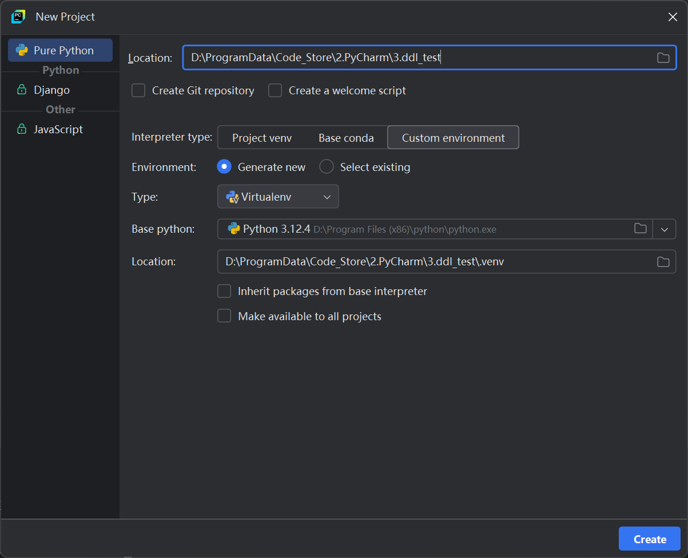

现在我们可以打开项目的文件夹，看一下文件夹下的虚拟环境文件夹下都有什么包：

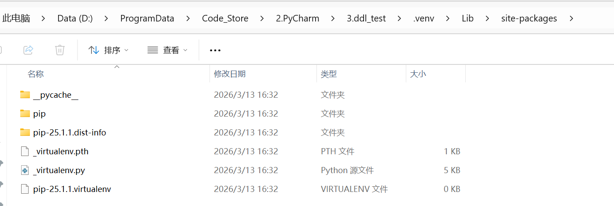

基本可以看到是没有任何包的，主要的就是pip包管理这个工具而已。

现在我们尝试安装OpenCV，在该项目的终端中输入以下代码安装OpenCV：

```bash
pip install opencv-python
```

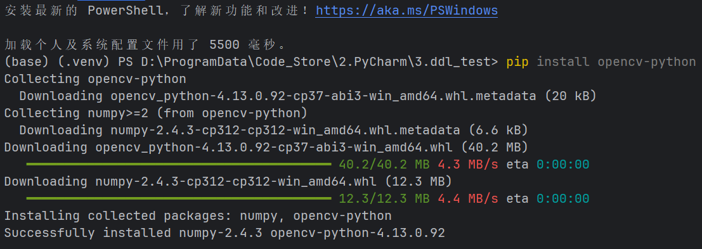

现在我们再次回到项目的库文件路径，可以看到：

- 一个`cv2`的文件夹，这个就是安装opencv的文件夹；
- 其他的文件是安装opencv时必须安装的依赖包，不需要理；

在打开`cv2`文件夹后，找到最下方的**`cv2.pyd`**，这个就是OpenCV的**`动态库`**，它是下载OpenCV时所有文件中最重要的文件，它的内容是：

- **OpenCV源码编译后的二进制代码；**
- **.pyd就是Python动态库的文件类型，对应Windows中的.ddl文件；**


**总结起来一句话：pip install opencv-python就是下载了这个cv2.pyd动态库；**

#### 1.2.2 import cv2的本质

我们在项目中新建一个文件夹`Scripts`用于存放脚本文件，然后在这个文件夹下新建文件`test.py`，这个就是我们的测试脚本；

在测试脚本中输入以下代码：注意需要把任一张图片复制到Scripts并改名为test.png

```python
import cv2

# 读取图片
img = cv2.imread('test.png')

# 检查是否读取成功
if img is None:
    print("错误：无法读取图片，请检查文件路径和文件名")
else:
    # 显示图片
    cv2.imshow('Test Image', img)

    # 等待按键
    print("按任意键关闭窗口")
    cv2.waitKey(0)

    # 关闭所有窗口
    cv2.destroyAllWindows()

    # 打印图片信息
    print(f"图片尺寸: {img.shape}")
    print(f"图片数据类型: {img.dtype}")

```

我们在`import cv2`的时候，其底层就是去调用 了上一小节的动态库，可知：

- **为什么不是import opencv了，而是import cv2；**
- **cv2.imread()函数是在cv2动态库中实现的；**

也就是说，在程序中执行import cv2的本质就是动态加载了cv2.pyd这个动态库而已。

#### 1.2.3 总结

前面用Python调用OpenCV的例子引出了动态库和动态加载的概念，那它们对比与静态库和静态链的区别是什么呢？主要如下：

- **动态库只有在运行时才会被调用；**
- **动态库的代码实现不会直接复制到脚本文件中；**
- **动态库的调用由动态加载完成；**

对比STM32开发中的**静态库和静态链**，它们是直接糅合到可执行文件中的，所以导致**可执行文件的大小很大**；但是对于动态库和动态加载而言，它们不需要完整的代码实现，所以脚本文件很小；但是最大的问题就是不好移植。

因为无论如何，我们在调用函数时是一定要知道它的逻辑实现的，所以如果我们要把我们的一个脚本文件发给另外一个同学，那这个同学的Python环境就需要有我们的动态库才能正常的跑起来，这也就是所谓的**生产环境和测试环境的区别**。

在动态加载过程中，其主要做的事情如下：

- **程序启动，找到cv2.pyd，并把这个动态库加载进内存；**
- **查到imread()函数在内存中的地址；**
- **把这个地址填到我们调用该函数的地方；**

所以静态链接和动态加载的区别只有一个：

- **静态链接是编译时就将地址链接死；**
- **动态加载是运行时才将地址链接好；**

| 库的类型 | 库的文件类型                                           |
| -------- | ------------------------------------------------------ |
| 静态库   | .a(Linux/GCC)或是.lib(Windows/Keil)                    |
| 动态库   | .dll(Windows)或.so(Linux)或.dylib/.ramework(macOS/iOS) |

- **Python的所有库都是动态的，它也只能是动态加载的，其根本原因是因为Python是解释性语言，根本没有编译这个过程，那就不可能实现静态链接；**
- **不要混淆这里的动态加载和后面C++讨论的动态链接，只有编译型语言才有链接，解释性语言没有链接的过程；**


### 1.3 C++调用OpenCV的库管理

本小节介绍C++中调用OpenCV的库管理。

#### 1.3.1 .lib的小静态库

结合前面的STM32开发逻辑和Python的开发逻辑，我们可以总结出以下几点：

- **只有编译型语言才有链接的过程，因为需要在编译的时候把一些东西给标记好；**
- **静态库的开发容易导致最后的可执行文件过大，因为链接过程会把代码都糅合在一起；**
- **动态库的好处是可以减小可执行文件的大小，但是它需要动态加载，即需要环境配置；**

那有没有什么方案能够实现可执行文件的小型化又能解决编译型语言编译时就写死的缺点呢？那就是C++的开发方式。

虽然编译型语言在编译时就需要把用到的代码都糅合进可执行文件中，但是我们能不能把糅合进的内容变成一个很小的索引表，然后这个索引表中写好了动态库的信息，这样不就完美的解决了上面的两个问题了吗？这就是**.lib小静态库（索引库）**的作用。

在C++中，它通过.lib文件实现静态编译和动态链接的过程，.lib文件在的内容主要有：

- **函数名字表；**
- **某个函数属于哪个.dll动态库；**

所以，它是一张通信证，它不存实际的代码实现，而是相当于记录了代码实现的地址。

由于它只在编译过程中参与，且文件格式也是.lib，所以我们也叫它静态库。在编译时做的主要内容就是：

- 链接器读取.lib文件；
- 知道函数在.dll动态库文件中；
- 在可执行文件中记下：调用xxx函数需要去xxx.dll文件中找；
- 但是它不复制任何代码进可执行文件中；

#### 1.3.2 .dll的动态库

有了`.lib`的静态库了，接下来就需要`.dll`的动态库了。跟Python中的动态库`.pyd`一样，它的内容主要就是：

- **源代码的实现编译后的二进制代码；**

这样我们就可以像Python中的那样，极大的减小源程序的大小，而是使用动态链接的方式参与运行。

在动态链接过程中，其主要的内容也是：

- 系统加载.dll动态库文件；
- 填写函数的真实地址；
- 程序调用时完整正确的地址跳转，执行正确的代码逻辑；

#### 1.3.3 总结

- 前面已经讲完了三种情况下的静态库、静态链接、动态库、动态链接，总结下来静态库和动态库各有优点：
  - C++则是结合了两者的优点，完成了兼容；
  - 但是它还是会存在需要配置环境的问题，即配置动态库的问题，但这是容易实现的。


## 2.环境的搭建

在介绍完了上面的几个名词的关系后，接下来就可以完成C++环境的搭建了，这里使用的是Visual Studio开发环境进行配置。

### 2.1 下载OpenCV库

#### 2.1.1 OpenCV库的下载安装

根据前面所说的，我们需要先下载C++版本的OpenCV库的动态库和静态库。

打开OpenCV的官网并下载**Windows版本的OpenCV**：[OpenCV官网](https://opencv.org/releases/)；

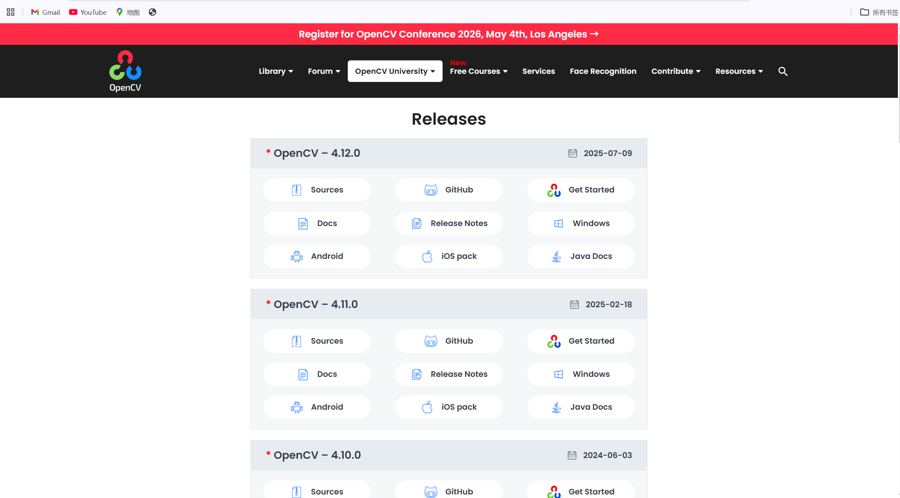

下载完后，它是一个**.exe可执行文件**，本质是一个自解压缩的文件，其内容就是一个**SDK包**；

双击运行后把它解压到一个**不带中文**的路径下，即可完成OpenCV的Windows版本的安装；

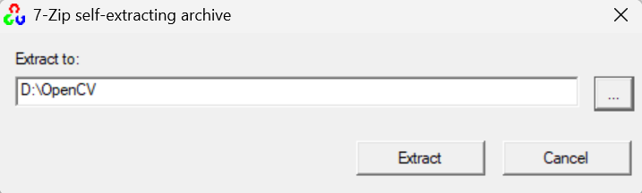

#### 2.1.2 OpenCV工程目录简析

安装完成后有一个opencv文件夹，下面主要有：

- build目录：这个目录是已经编译后的目录
- source目录：这个目录是源码目录

我们用的主要就是已经编译后的目录，即build目录。所谓配置环境就是把build目录下的头文件、静态库和动态库添加到VS中的配置信息里面。


### 2.2 基于Visual Studio配置开发环境

#### 2.2.1 新建工程

- 首先新建一个VS工程，并将选项选择为**Release版本，且选择为x64**：
  - 一定要按照：**新建项目——>Windows桌面向导——>空项目**的方式创建新项目；
- 选择Release版本的原因是这个模式下不会生成调试信息，编译更快；

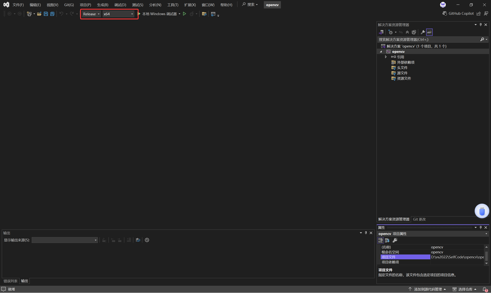

#### 2.2.2 添加头文件——包含目录设置

- 前面提到，采用链接的方式时需要将头文件、静态库/动态库链接到项目中，接下来一步步完成这个环境的配置；

- 首先需要添加头文件路径：

  - 打开属性管理器，找到对应的Release | x64选项；

  - 在下方的`Microsoft.Cpp.x64.user`选项下点击，并选择编辑；

  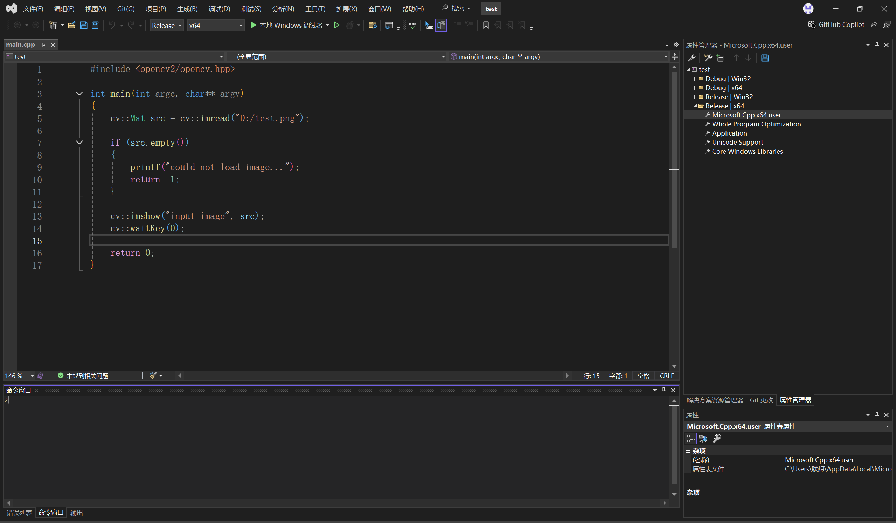

  - 在VC++目录中，选择包含目录，点击编辑，然后新加opencv下的build目录下的头文件目录include；

  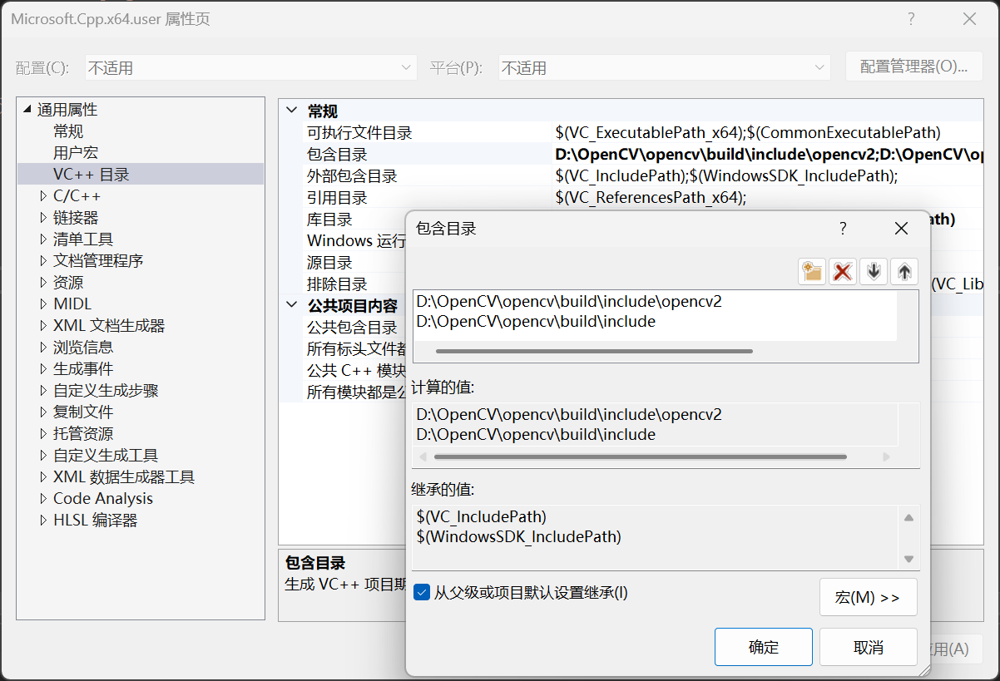

---

#### 新版本VS没有Microsoft.Cpp.x64.user的解决方法

- 在新版本的Visual Studio中没有Microsoft.Cpp.x64.user的选项，因为新版本的Visual Studio在安装时不再安装一些拓展文件；
- 打开目录：C:\Users\用户名\AppData\Local\Microsoft，如果该目录下没有MSBuild文件夹就不会有Microsoft.Cpp.x64.user的选项；
- 可以打开百度网盘链接：[MSBuild文件链接](https://pan.baidu.com/s/1bzHyTaKFWXy7zuSVbW5lxw)，提取码为txii；
- 下载该文件后再将其复制到上面的目录，关闭VS再重开即可；

---

#### 2.2.3 包含静态库目录

- 接着需要给它配置静态库的文件目录：

  - 选择库目录，然后点击编辑，将对应的目录添加进去；

  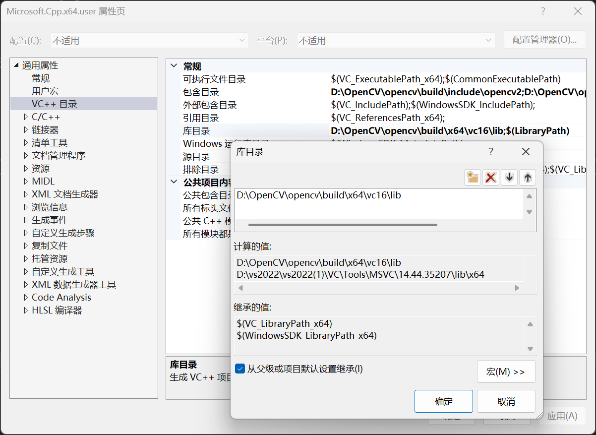

  - 上面只是指定了静态库目录，我们还需要指定我们使用的是哪个静态库：

  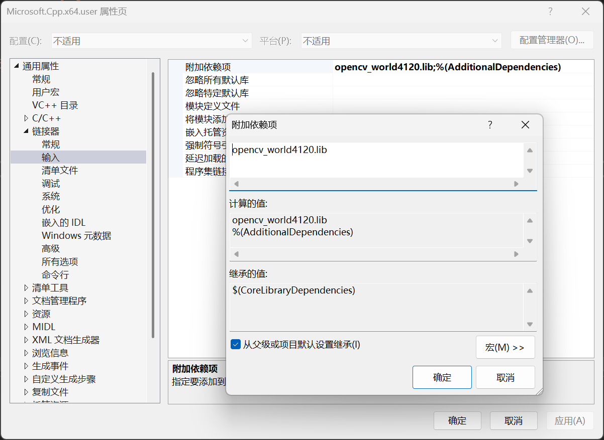

#### 2.2.4 添加动态库环境变量

- 最后还需要添加动态库的目录；

- 动态库目录需要通过环境变量的方式添加：

  - 电脑——>搜索环境变量——>点击环境变量——>找到系统变量下的Path变量——>添加对应目录

  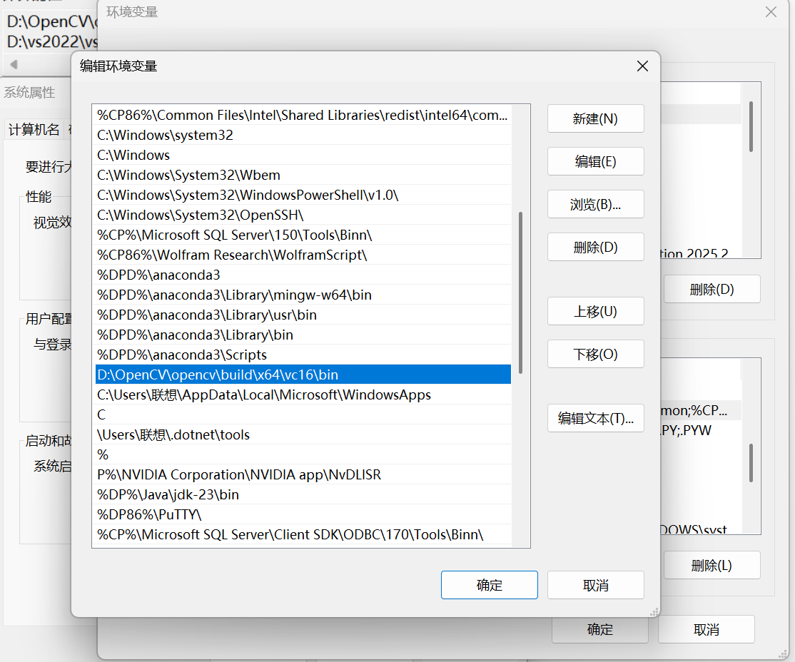

#### 2.2.5 验证——编译运行

- 在工程的源文件下新添main.cpp文件，并写上如下的源代码；
- 编译，然后运行即可完成环境的配置；

```c++
#include <opencv2/opencv.hpp>

int main(int argc, char** argv)
{
    cv::Mat src = cv::imread("D:/test.png");    // 记得更改为自己的目录

    if (src.empty())
    {
        printf("could not load image...");
        return -1;
    }

    cv::imshow("input image", src);
    cv::waitKey(0);

    return 0;
}

```


# 第二节：图像读取与显示


