# 第零章：课程简介

本章主要对课程的内容进行介绍。


## 第一节课：0-0_课程简介

本课程以OpenCV开源图像处理库为基础，介绍相关的图像处理方法：

- **基本的图像处理方法：**
  - **几何变换**：图像的放大缩小、平移旋转；
  - **形态学变换**：膨胀、填充；
  - **图像平滑**：去噪声，包括取出椒盐噪声、高斯噪声；
  - **直方图操作**：查看图像的灰度直方图，对其直方图进行均衡化，提高其对比度；
  - **模板匹配**：拿一个模板与图像中相似的内容；
  - **霍夫变换**：检测图像中的圆、直线等形状；
- **特征提取和描述方法：**
  - **理解角点特征**：关键点特征；
  - **Harris和Shi-Tomas算法**：即理解角点特征对应的算法；
  - **SIFT/SURF算法**：尺度不变特征算法；
  - **Fast算法**：前面的算法都比较慢，Fast算法更快，但只有特征提取算法没有描述方法；
  - **ORB算法**：用Fast算法进行特征提取，再用另一算法进行描述；
- **视频操作中的应用：**
  - **视频的读写和保存、目标追踪；**
  - **但是无法处理声音，需要用其他库；**
- **人脸检测：**
  - 作为案例实施来讲；


# 第一章：OpenCV简介

本章主要对图像处理中的基本概念以及OpenCV进行介绍。


## 第二节课：1-1_图像处理简介

### 1.图像是什么

图像可以分为两部分：

- 图：物体反射或投射光的分布；
- 像：人的视觉系统所接受的图在人脑中所形成的印象或认识；


### 2.模拟图像和数字图像

- **模拟图像**

  - 第一张图像就是模拟图像；
  - 模拟图像又称为连续图像；
  - 它通过某种物理量（如光、电）的强弱变化来记录图像亮度信息，故是连续变换的；
  - 模拟图像容易受到干扰，目前已经全部被数字图像替代；

- **数字图像**

  - 数字图像的亮度用离散数值表示，图片编码成5个灰度值；
  - 在发送端图片被编码并使用打孔带记录，通过系统传输后在接收方使用特殊的打印机恢复成图像；

  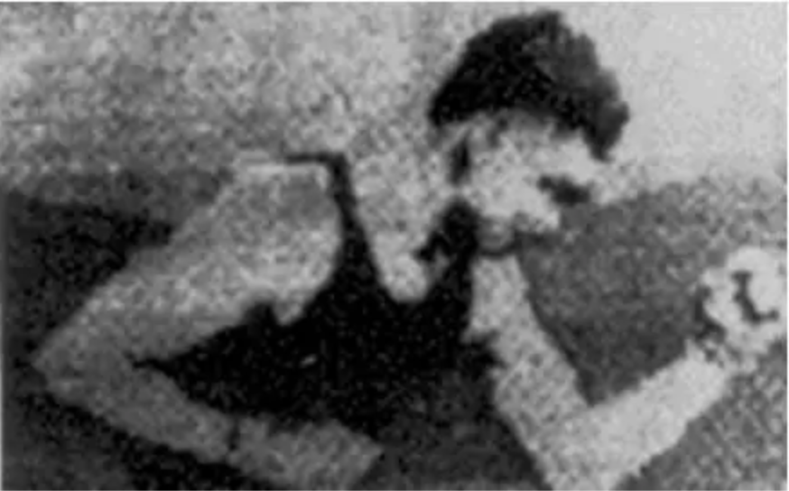


### 3.数字图像的表示

- **灰度的概念**

  - 计算机采用0/1编码的系统，数字图像也是利用0/1来记录信息；
  - 我们平常接触的图像都是**8位数**图像，包含0～255灰度，其中0，代表最黑，1，表示最白；

  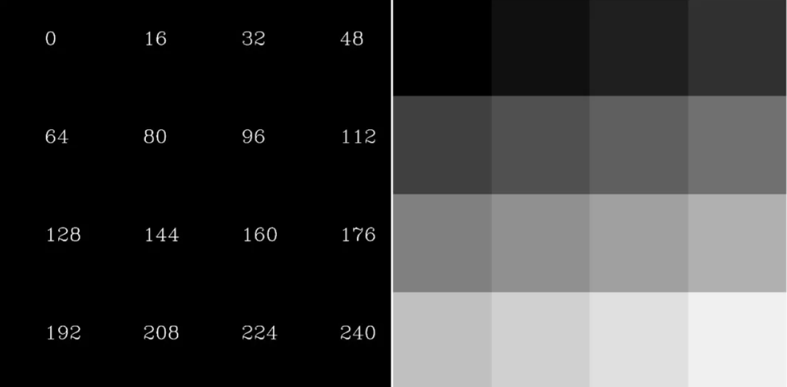

  - 人的眼睛对灰度更敏感，一般在**16位到32位**之间，下方的两条线实质上是灰度一样的：

  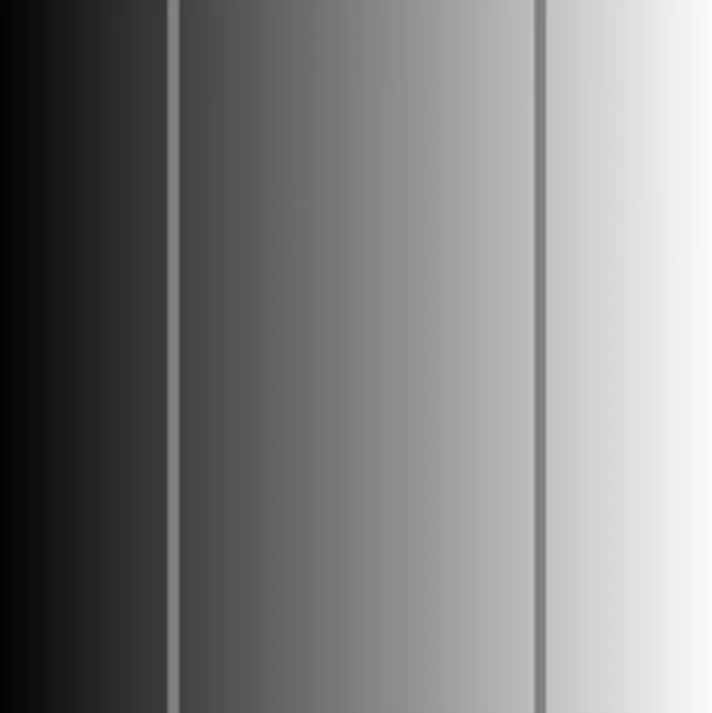

- **图像的分类：**

  - **二值图像：**
    - 一幅二值图像的二维矩阵仅由0、1两个值构成，“0”代表黑色，“1”代白色；
    - 由于每一像素取值仅有0、1两种可能，所以计算机中二值图像的数据类型通常为**1个二进制位**；
    - 二值图像通常用于文字、线条图的扫描识别（OCR）和**掩膜图像**的存储；
  - **灰度图：**
    - 灰度图像在黑色与白色之间还有许多级的颜色深度；
    - 灰度图像经常是在单个电磁波频谱如可见光内测量每个像素的亮度得到的；
    - 用于显示的灰度图像通常用**每个采样像素8位的非线性尺度来保存**，这样可以有256级灰度；
  - **彩色图：**
    - 每个像素通常是由**红（R）、绿（G）、蓝（B）**三个分量来表示的，分量介于（0，255）；
    - RGB图像与索引图像一样都可以用来表示彩色图像；
      - 与索引图像一样，它分别用红（R）、绿（G）、蓝（B）三原色的组合来表示每个像素的颜色；
      - 不同的是，RGB图像每一个像素的颜色值（由RGB三原色表示）直接存放在图像矩阵中；
      - 由于每一像素需由R、G、B三个分量来表示，M、N分别表示图像的行列数，**三个M x N的二维矩阵**分别表示各个像素的R、G、B三个颜色分量；
      - 也就是说RGB图像是用一个张量来表示的；
    - RGB图像的数据类型一般为**8位无符号整形**，通常用于表示和存放真彩色图；


## 第三节课：1-2_OpenCV简介及其安装方法

### 1.OpenCV简介

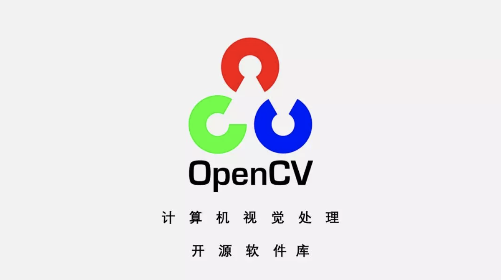

- **OpenCV简介：**
  - OpenCV是一款由**Intel公司俄罗斯团队**发起并参与和维护的一个计算机视觉处理开源软件库；
  - 支持与计算机视觉和机器学习相关的众多算法；
- **OpenCV的优势有：**
  - **编程语言：**
    - OpenCV基于**C++**实现，同时提供python, Ruby, Matlab等语言的接口；
    - **OpenCV-Python**是OpenCV的Python API，结合了OpenCV C++ API和Python语言的最佳特性。
  - **跨平台：**
    - 可以在不同的系统平台上使用，包括Windows，Linux，OS X，Android和iOS；
    - 基于**CUDA和OpenCL的高速GPU操作接口**也在积极开发中；
  - **丰富的API：**
    - 完善的**传统计算机视觉算法**，涵盖主流的机器学习算法，同时添加了对深度学习的支持；


### 2.OpenCV-Python的介绍

- **OpenCV的介绍：**
  - OpenCV-Python是一个**Python绑定库**，旨在解决计算机视觉问题；
- **OpenCV-Python开发的原因：**
  - Python语言语法简单，易于使用，且可读性高；
  - 但与C / C++等语言相比，Python速度较慢；
  - 那就底层用C/C++写，然后封装成Python的库，就把两者的优点结合起来了；
  - 也就是说OpenCV-Python是**原始OpenCV C++实现的Python包装器**；
- **OpenCV-Python中的数据类型：**
  - OpenCV-Python使用**Numpy**，这是一个高度优化的数据库操作库，具有MATLAB风格的语法；
  - 所有OpenCV数组结构都转换为Numpy数组


### 3.OpenCV的部署

- 创建Python的虚拟环境，然后在虚拟环境中安装即可；
- 在安装OpenCV之前需要先安装**numpy, matplotlib；**
- 由于一些经典的算法被申请了版权，新版本有很大的限制，所以选用**3.4.3**以下的版本：

```bash
pip install opencv-python==3.4.2.17
```

- 可通过运行如下脚本验证是否安装成功：

```python
import cv2

# 读一个图片并进行显示(图片路径需自己指定)
lena=cv2.imread("1.jpg")
cv2.imshow("image",lena)
cv2.waitKey(0)

```

- 如果我们要利用**SIFT和SURF**等进行特征提取时，还需要安装：

```bash
pip install opencv-contrib-python==3.4.2.17
```


## 第四节课：1-3_OpenCV模块

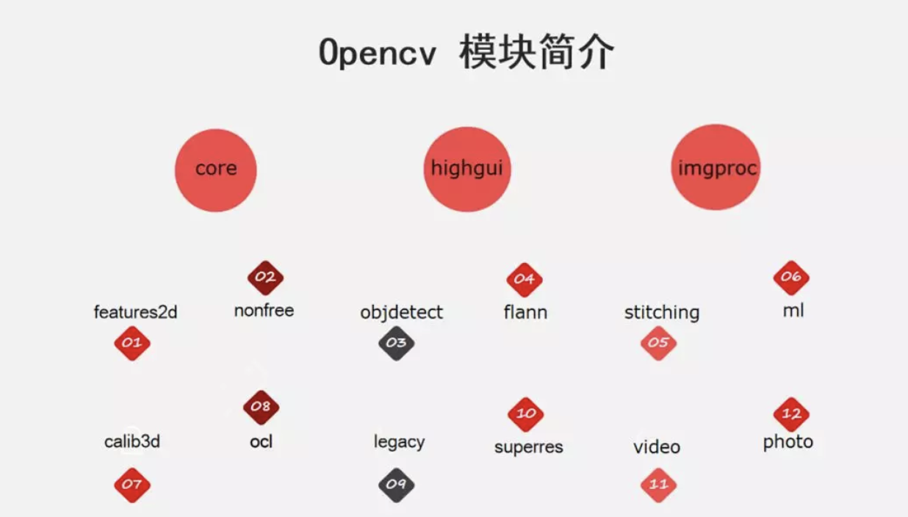

- 最基础的模块：core、highgui、imgproc
  - **core模块**实现了最核心的数据结构及其基本运算，如绘图函数、数组操作相关函数等
  - **highgui模块**实现了视频与图像的读取、显示、存储等接口；
  - **imgproc模块**实现了图像处理的基础方法，包括图像滤波、图像的几何变换、平滑、阈值分割、形态学处理、边缘检测、目标检测、运动分析和对象跟踪等；
- 更改层次的模块：
  - **features2d模块**用于提取图像特征以及特征匹配；
  - **nonfree模块**实现了一些专利算法，如sift特征（**3.4.3版本以下没有这个模块**）；
  - **objdetect模块**实现了一些目标检测的功能，经典的基于Haar、LBP特征的人脸检测，基于HOG的行人、汽车等目标检测，分类器使用Cascade Classification（级联分类）和Latent SVM等；
  - **FLANN模块**（Fast Library for Approximate Nearest Neighbors），包含快速近似最近邻搜索FLANN 和聚类Clustering算法；
  - **stitching模块**实现了图像拼接功能，主要用在遥感成像上；
  - **ml模块**机器学习模块（SVM，决策树，Boosting等等）；
  - **calib3d模块**即Calibration（校准）3D，这个模块主要是相机校准和三维重建相关的内容。包含了基本的多视角几何算法，单个立体摄像头标定，物体姿态估计，立体相似性算法，3D信息的重建等等；
  - **ocl模块**即Open Computing Language模块，该模块的主要作用是利用 **GPU**（以及其他异构加速器）来加速图像处理算法，是对OpenCL的封装，在OpenCV3.x以后就不再独立了；
  - **superres** 是  **超分辨率（Super Resolution）** 模块，通过算法将**低分辨率（LR）**的图像或视频序列，重建为**高分辨率（HR）**的图像，试图“恢复”出细节；
  - **photo模块**包含图像修复和图像去噪两部分；
  - **video模块**针对视频处理，如背景分离，前景检测、对象跟踪等；
  - **G-API模块**包含超高效的图像处理pipeline引擎；


# 第二章：OpenCV基本操作

本章主要介绍OpenCV中的基本操作。


## 第五课：2-0_OpenCV基本操作内容介绍

本章主要介绍图像的基本操作，包括：

- 图像的**IO操作**，读取和保存方法；
- 在图像上绘制几何图形；
- 怎么获取图像的属性；
- 怎么访问图像的像素，进行通道分离，合并等；
- 怎么实现**颜色空间的变换**；
- 图像的算术运算；


## 第六课：2-1_图像的IO操作

这一小节将介绍如何读取图像、如何显示图像和如何保存图像。

### 1.读取图像

- **API：**

```python
cv.imread()
```

- **参数：**
  - 要读取的图像的路径，可采用**相对或绝对路径**；
  - 读取方式的标志：
    - **cv.IMREAD*COLOR**：以彩色模式加载图像，任何图像的透明度都将被忽略。这是默认参数；
    - **cv.IMREAD*GRAYSCALE**：以灰度模式加载图像；
    - **cv.IMREAD_UNCHANGED**：包括alpha通道的加载图像模式；
    - **可以使用1、0或者-1来替代上面三个标志**；
  - **注意：**
    - **如果加载的路径有错误，不会报错，会返回一个None值；**
    - **OpenCV中读取出来的图像是按BGR的格式存储的，后期若用matplotlib显示的话要翻转通道**；
- **参考代码：**

```python
import numpy as np
import cv2 as cv

# 以灰度图的形式读取图像
img = cv.imread('messi5.jpg',0)
```


### 2.显示图像

- **API：**

```python
cv.imshow()
```

- **参数：**
  - 显示图像的窗口名称，以字符串类型表示；
  - 要加载的图像，一般是**调用读取图像API时的返回值**；
  - **注意：在调用显示图像的API后，要调用cv.waitKey()给图像绘制留下时间，否则窗口会出现无响应情况，并且图像无法显示出来**；
- **参考代码：**

```python
# opencv中显示
cv.imshow('image',img)
cv.waitKey(0)		# 永远等待

# matplotlib中展示
plt.imshow(img[:,:,::-1])

```


### 3.保存图像

- **API：**

```python
cv.imwrite()
```

- **参数：**
  - 文件名，要保存在哪里，即保存的路径；
  - 要保存的图像；
- **参考代码：**

```python
cv.imwrite('messigray.png',img)
```


### 4.上机实验

```python
import numpy as np
import cv2 as cv
import matplotlib.pyplot as plt

# 1 读取图像
img = cv.imread('images/Chapter2/2-1-1.png',1)

# 2 显示图像
# 2.1 利用opencv展示图像
# cv.imshow('image',img)

# 2.2 在matplotlib中展示图像
# OpenCV读取的图像是按BGR格式存储的，需转换成matplotlib的RGB格式
plt.imshow(img[:,:,::-1])		# plt.imshow(img, cmap=plot.cm.gray)
plt.title('匹配结果'), plt.xticks([]), plt.yticks([])
plt.show()
k = cv.waitKey(0)

# 3 保存图像
cv.imwrite('images/Chapter2/2-1-1_save.png',img)

```


## 第七课：2-1_在图像上绘制图形

### 1.绘制直线

- **API：**

```python
cv.line(img, start, end, color, thickness)
```

- **参数：**
  - **img**：要绘制直线的图像；
  - **start,end**： 直线的起点和终点；
  - **color**：线条的颜色；
  - **thickness**： 线条宽度；


### 2.绘制圆形

- **API：**

```python
cv.circle(img, centerpoint, r, color, thickness)
```

- **参数：**
  - **img**：要绘制圆形的图像；
  - **Centerpoint, r**：圆心和半径；
  - **color**：线条的颜色；
  - **thickness**：线条宽度，为**-1**时生成闭合图案并填充颜色；


### 3.绘制矩形

- **API：**

```python
cv.rectangle(img,leftupper,rightdown,color,thickness)
```

- **参数：**
  - **img**：要绘制矩形的图像；
  - **leftupper, rightdown**：矩形的左上角和右下角坐标；
  - **color**：线条的颜色；
  - **thickness**：线条宽度；


### 4.向图像中添加文字

- **API：**

```python
cv.putText(img,text,station, font, fontsize,color,thickness,cv.LINE_AA)
```

- **参数：**
  - **img**：图像；
  - **text**：要写入的文本数据；
  - **station**：文本的放置位置；
  - **font**：字体；
  - **fontsize**：字体大小；


### 5.上机实验

```python
import numpy as np
import cv2 as cv
import matplotlib.pyplot as plt

# 1 创建一个空白的图像
img = np.zeros((512,512,3), np.uint8)

# 2 绘制图形
cv.line(img, (0,0), (511,511), (255,0,0), 5)	# 左上角为(0, 0)坐标
cv.rectangle(img, (384,0), (510,128), (0,255,0), 3)
cv.circle(img, (447,63), 63, (0,0,255), -1)
font = cv.FONT_HERSHEY_SIMPLEX
cv.putText(img,'OpenCV', (10,500), font, 4, (255,255,255), 2 , cv.LINE_AA)

# 3 图像展示
plt.imshow(img[:,:,::-1])
plt.title('匹配结果'), plt.xticks([]), plt.yticks([])
plt.show()

# 4 保存图像
cv.imwrite('images/Chapter2/2-1-2_save.png',img)

```

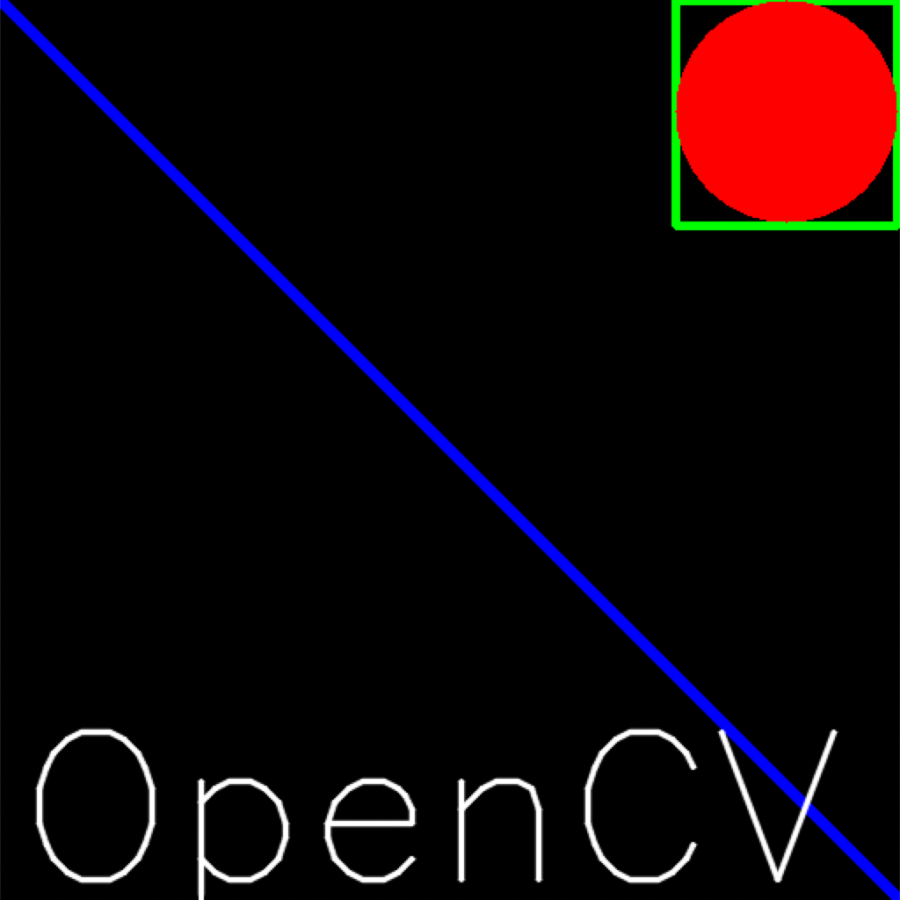


## 第八课：2-1_图像基本操作的其他内容

### 1.获取并修改图像中的像素点

- 我们可以通过**行和列的坐标值**获取该像素点的像素值；
- 对于BGR图像，它返回一个**蓝，绿，红值的数组**；
- 对于灰度图像，仅返回**相应的强度值**；
- 使用相同的方法对像素值进行修改；
- 示例代码如下：可在**jupyter notebook**中验证

```python
import numpy as np
import cv2 as cv

img = cv.imread('messi5.jpg')

# 获取某个像素点的值
px = img[100,100]

# 仅获取蓝色通道的强度值
blue = img[100,100,0]

# 修改某个位置的像素值
img[100,100] = [255,255,255]

```


### 2.获取图像的属性

- 图像属性包括行数、列数和通道数、图像数据类型、像素数等；

| 属性                     | API       |
| ------------------------ | --------- |
| 形状                     | img.shape |
| 图像大小，即一共多少像素 | img.size  |
| 数据类型                 | img.dtype |


### 3.图像通道的拆分和合并

- 有时需要**在B，G，R通道图像上单独工作**，在这种情况下，需要将BGR图像分割为**单个通道**；
- 或者在其他情况下，可能需要将这些单独的通道合并到BGR图像；
- 示例代码：注意OpenCV的BGR颜色顺序

```python
# 通道拆分
b,g,r = cv.split(img)

# 通道合并
img = cv.merge((b,g,r))

```


### 4.色彩空间的改变

- OpenCV中有150多种颜色空间转换方法；
- 最广泛使用的转换方法有两种：
  - **BGR↔Gray；**
  - **BGR↔HSV；**
- API：

```python
cv.cvtColor(input_image，flag)
```

- 参数：
  - input_image：进行颜色空间转换的图像；
  - flag：转换类型：
    - cv.COLOR_BGR2GRAY：BGR↔Gray；
    - cv.COLOR_BGR2HSV：BGR→HSV；


## 第九课：2-1_图像基础处理总结

- 图像IO操作的API：
  - cv.imread()：读取图像
  - cv.imshow()：显示图像
  - cv.imwrite()：保存图像

- 在图像上绘制几何图像：
  - cv.line()：绘制直线
  - cv.circle()：绘制圆形
  - cv.rectangle()：绘制矩形
  - cv.putText()：在图像上添加文字

- 直接使用行列索引获取图像中的像素并进行修改；

- 图像的属性

| 属性                     | API       |
| ------------------------ | --------- |
| 形状                     | img.shape |
| 图像大小，即一共多少像素 | img.size  |
| 数据类型                 | img.dtype |

- 拆分通道与合并通道：
  - 拆分通道：cv.split()
  - 合并通道：cv.merge()

- 色彩空间的改变：
  - cv.cvtColor(input_image，flag)


## 第十节课：2-2图像的加法

### 1.图像的加法简介

- 使用OpenCV的**cv.add()函数**把两幅图像相加，或通过numpy操作添加两个图像，如res = img1 + img2；
- 两个图像应该具有相同的大小和类型，或者第二个图像可以是标量值；
- 两者的不同：
  - **OpenCV的加法是饱和操作；**
  - **Numpy添加是模运算；**
  - **一般而言OpenCV的加法操作会更好一些**


### 2.上机实验

- 示例代码1：

```python
>>> x = np.uint8([250])
>>> y = np.uint8([10])
>>> print( cv.add(x,y) ) # 250+10 = 260 => 255
[[255]]
>>> print( x+y )          # 250+10 = 260 % 256 = 4
[4]
```

- 示例代码2：

```python
import numpy as np
import cv2 as cv
import matplotlib.pyplot as plt

# 设置字体为微软雅黑
plt.rcParams['font.family'] = 'Microsoft YaHei'
plt.rcParams['axes.unicode_minus'] = False

# 1 读取图像
img1 = cv.imread("images/Chapter2/view.jpg")
img2 = cv.imread("images/Chapter2/rain.jpg")

# 2 加法操作
img3 = cv.add(img1,img2) # cv中的加法
img4 = img1+img2 # 直接相加

# 3 图像显示
fig,axes=plt.subplots(nrows=1,ncols=2,figsize=(10,8),dpi=100)
axes[0].imshow(img3[:,:,::-1])
axes[0].set_title("cv中的加法")
axes[1].imshow(img4[:,:,::-1])
axes[1].set_title("直接相加")
plt.show()

# 4 保存图像
cv.imwrite('images/Chapter2/2-2-1_save.png',img3)
cv.imwrite('images/Chapter2/2-2-2_save.png',img4)

```

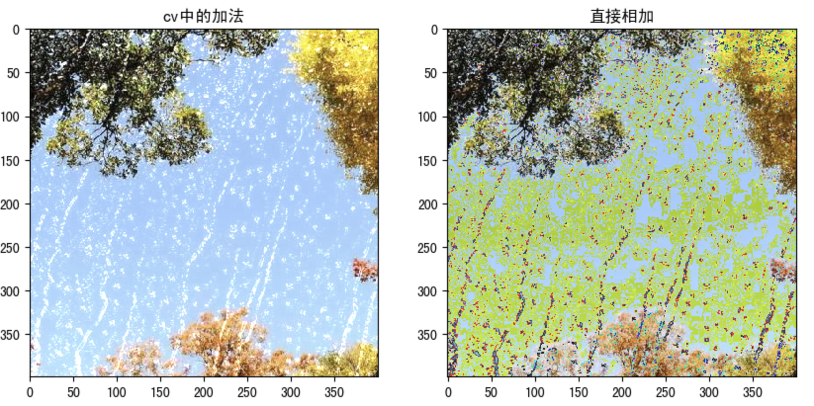


## 第十一节课：2-2图像的混合

- **定义：**

  - 混合也是加法，但是不同的是**两幅图像的权重不同**，这就会给人一种混合或者透明的感觉；

- **图像混合的计算公式如下：**

  - ```latex
    g(x) = (1−α)f0(x) + αf1(x)
    ```

  - 通过修改**α的值（0 → 1）**，可以实现非常炫酷的混合；

- **API：**

```python
cv2.addWeighted()
```

- **参数：**

```python
dst = α⋅img1 + β⋅img2 + γ
```

- **参考代码：**

```python
import numpy as np
import cv2 as cv
import matplotlib.pyplot as plt

# 1 读取图像
img1 = cv.imread("images/Chapter2/view.jpg")
img2 = cv.imread("images/Chapter2/rain.jpg")

# 2 图像混合
img3 = cv.addWeighted(img1, 0.7, img2, 0.3, 0)

# 3 图像显示
plt.figure(figsize=(8,8))
plt.imshow(img3[:,:,::-1])
plt.show()

# 4 保存图像
cv.imwrite('images/Chapter2/2-2-2_save.png',img3)

```

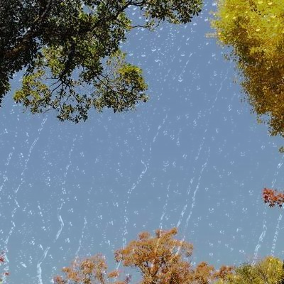


# 第三章：OpenCV图像处理

本章主要讲解OpenCV中对于图像的处理部分，主要包括：

- 3-1_图像的几何变换；
- 3-2_图像的形态学转换；
- 3-3_图像的平滑方法；
- 3-4_直方图的方法；
- 3-5_边缘检测的方法；
- 3-6_模板匹配和霍夫变换的应用；


## 第十二节课：3-1_图像缩放

### 1.内容介绍

- 缩放是对图像的大小进行调整，即是图像放大或缩小；
- **API：**

```python
cv2.resize(src, dsize, fx=0, fy=0, interpolation=cv2.INTER_LINEAR)
```

- **参数：**

  - src：输入图像；
  - dsize：绝对尺寸，直接指定调整后图像的大小；
  - fx,fy：相对尺寸，将dsize设置为None，然后将fx和fy设置为比例因子即可；
  - interpolation：插值方法

  | 插值              | 含义                   |
  | ----------------- | ---------------------- |
  | cv2.INTER_LINEAR  | 双线性插值法           |
  | cv2.INTER_NEAREST | 最近邻插值             |
  | cv2.INTER_AREA    | 像素区域重采样（默认） |
  | cv2.INTER_CUBIC   | 双三次插值             |


### 2.上机实验

```python
# 图像的缩放示例代码

import numpy as np
import cv2 as cv
import matplotlib.pyplot as plt

# 设置字体为微软雅黑
plt.rcParams['font.family'] = 'Microsoft YaHei'
plt.rcParams['axes.unicode_minus'] = False

# 1. 读取图片
img1 = cv.imread("images/Chapter3/kid.jpg")
# 2.图像缩放
# 2.1 绝对尺寸
rows,cols = img1.shape[:2]      # 获取行列的像素值
res1 = cv.resize(img1,(2*cols,2*rows),interpolation=cv.INTER_CUBIC)      # 绝对缩放

# 2.2 相对尺寸
res2 = cv.resize(img1,None,fx=0.5,fy=0.5)

# 3 图像显示
# 3.1 使用opencv显示图像(不推荐)
# cv.imshow("orignal",img1)
# cv.imshow("enlarge",res)
# cv.imshow("shrink）",res1)
# cv.waitKey(0)

# 3.2 使用matplotlib显示图像
fig,axes=plt.subplots(nrows=1,ncols=3,figsize=(10,8),dpi=100)
axes[0].imshow(res1[:,:,::-1])
axes[0].set_title("绝对尺度（放大）")
axes[1].imshow(img1[:,:,::-1])
axes[1].set_title("原图")
axes[2].imshow(res2[:,:,::-1])
axes[2].set_title("相对尺度（缩小）")
plt.show()

```


## 第十三节课：3-1_图像平移

### 1.内容介绍

- 图像平移将图像按照**指定方向和距离**，移动到相应的位置；
- **API：**

```python
cv.warpAffine(img, M, dsize)
```

- **参数：**

  - img：输入图像；
  - **M：2*3移动矩阵**

  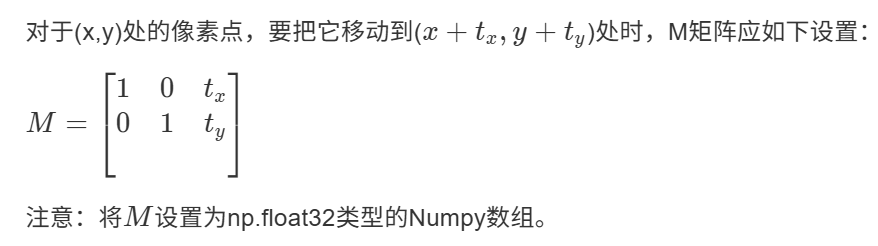

  - dsize：输出图像的大小；
  - **注意：输出图像的大小，它应该是(宽度，高度)的形式。请记住，width=列数，height=行数；**


### 2.上机实验

```python
# 图像的平移示例代码

import numpy as np
import cv2 as cv
import matplotlib.pyplot as plt

# 设置字体为微软雅黑
plt.rcParams['font.family'] = 'Microsoft YaHei'
plt.rcParams['axes.unicode_minus'] = False

# 1. 读取图像
img1 = cv.imread("images/Chapter3/kid.jpg")

# 2. 图像平移
rows,cols = img1.shape[:2]
M = np.float32([[1, 0, 100], [0, 1, 50]])	# 平移矩阵
dst = cv.warpAffine(img1, M, (cols, rows))

# 3. 图像显示
fig, axes=plt.subplots(nrows=1, ncols=2, figsize=(10,8), dpi=100)
axes[0].imshow(img1[:,:,::-1])
axes[0].set_title("原图")
axes[1].imshow(dst[:,:,::-1])
axes[1].set_title("平移后结果")
plt.show()

```


## 第十四节课：3-1_图像旋转

### 1.内容介绍

- **基本定义：**
  - 图像旋转是指图像按照某个位置转动一定角度的过程，旋转中图像仍保持原始尺寸；
  - 图像旋转后图像的水平对称轴、垂直对称轴及中心坐标原点都可能会发生变换；
  - 因此需要对图像旋转中的坐标进行相应转换；

- **理论推导：**

---

图像的旋转，本质是**坐标轴的旋转：**

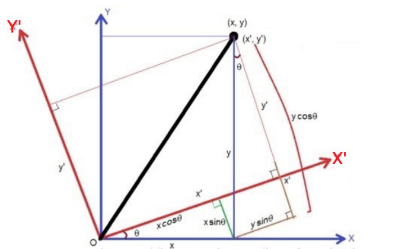

假设图像逆时针旋转了θ角，则根据坐标转换可得：

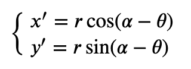

其中有：

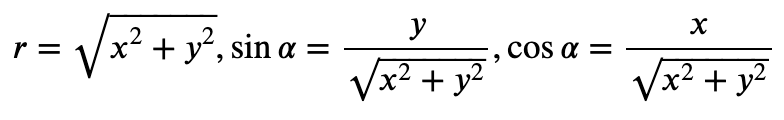

将其带入上面的公式中可得：

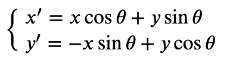

用旋转矩阵来表示为：

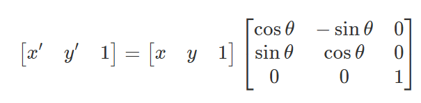

也就是说，**相对于原来的那个坐标系而言，原本为(x, y)的坐标将变为(x', y')，这样就得到了坐标**。

除此之外我们还要修正原点的位置，因为原图像中的坐标原点在图像的左上角，经过旋转后图像的大小会有所变化，原点也需要修正。

假设在旋转的时候是以旋转中心为坐标原点的，旋转结束后还需要将坐标原点移到图像左上角，也就是还要进行一次变换。

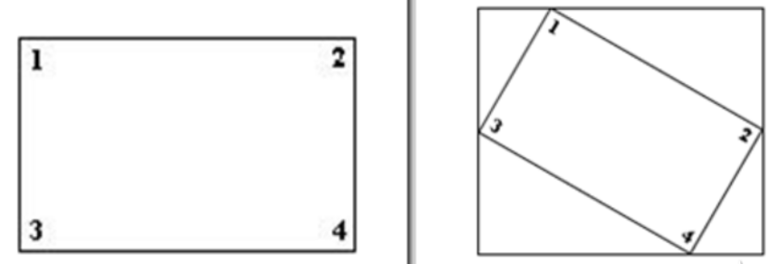

即在原有的矩阵变换的基础上还需要再次进行一次矩阵变换：

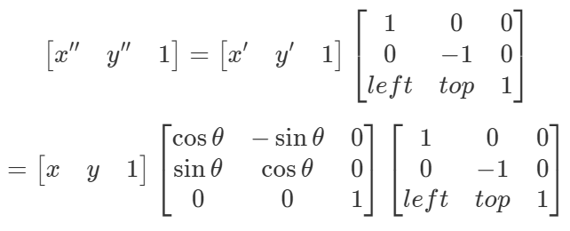

---


### 2.API介绍

- **思想：**
  - **在OpenCV中图像旋转首先根据旋转角度和旋转中心获取旋转矩阵；**
  - **然后根据旋转矩阵进行变换，即可实现任意角度和任意中心的旋转效果；**
- **API：**

```python
cv2.getRotationMatrix2D(center, angle, scale)
```

- **参数：**
  - center：旋转中心；
  - angle：旋转角度；
  - scale：缩放比例；
- **返回：**
  - M：旋转矩阵；
  - 需要再调用cv.warpAffine完成图像的旋转；


### 3.上机实验

```python
# 图像旋转的示例代码

import numpy as np
import cv2 as cv
import matplotlib.pyplot as plt

# 设置字体为微软雅黑
plt.rcParams['font.family'] = 'Microsoft YaHei'
plt.rcParams['axes.unicode_minus'] = False

# 1 读取图像
img = cv.imread("images/Chapter3/kid.jpg")

# 2 图像旋转
rows,cols = img.shape[:2]
# 2.1 生成旋转矩阵
M = cv.getRotationMatrix2D((cols/2,rows/2),90,1)
# 2.2 进行旋转变换
dst = cv.warpAffine(img,M,(cols,rows))

# 3 图像展示
fig,axes=plt.subplots(nrows=1,ncols=2,figsize=(10,8),dpi=100)
axes[0].imshow(img[:,:,::-1])
axes[0].set_title("原图")
axes[1].imshow(dst[:,:,::-1])
axes[1].set_title("旋转后结果")
plt.show()

```

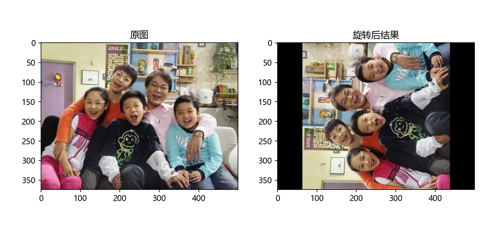


## 第十五节课：3-1_图像的仿射变换

### 1.内容介绍

- 图像的仿射变换涉及到图像的**形状位置角度**的变化，是对图像的缩放，旋转，翻转和平移等操作的组合；
- **原理介绍：**
  - 图1中的点1，2和3与图二中三个点一一映射，仍然形成三角形，但形状已经大大改变；
  - **通过两组三点求出仿射变换**， 就能把仿射变换应用到图像中所有的点中，完成图像的仿射变换；

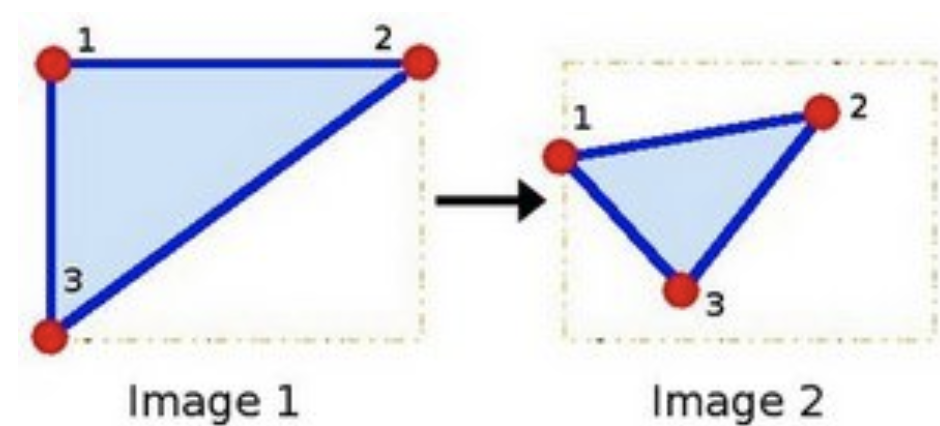

- **OpenCV中的原理做法**

  - 在OpenCV中，仿射变换的矩阵是一个**2×3的矩阵**：

  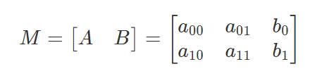

  - 其中左边的2×2子矩阵A是线性变换矩阵，右边的2×1子矩阵B是平移项：

  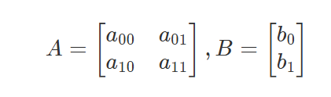

  - 对于图像上的任一位置(x,y)，仿射变换执行的是如下的操作：

  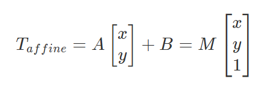

  - 对于图像，宽度方向是x，高度方向是y，坐标的顺序和图像像素对应下标一致。所以原点的位置是左上角，y的方向是向下；
  - **基本思想总结：**
    - 在仿射变换中，原图中所有的平行线在结果图像中同样平行；
    - 为了创建这个矩阵我们需要从原图像中**找到三个点以及他们在输出图像中的位置**；
    - 然后**cv2.getAffineTransform**会创建一个 2x3 的矩阵，最后这个矩阵会被传给函数**cv2.warpAffine；**


### 2.API介绍

- 获取变换矩阵：

  ````python
  cv2.getAffineTransform()
  ````

  - 传入变换前的三个点坐标和变换后的三个点坐标即可得到仿射变换矩阵；

- 进行仿射变换：

  ```python
  cv2.warpAffine()
  ```

  - 仍是是将变换矩阵传递给平移函数，然后得到效果；


### 3.上机实验

```python
# 图像的仿射变换的示例代码

import numpy as np
import cv2 as cv
import matplotlib.pyplot as plt

# 设置字体为微软雅黑
plt.rcParams['font.family'] = 'Microsoft YaHei'
plt.rcParams['axes.unicode_minus'] = False

# 1 图像读取
img = cv.imread("images/Chapter3/kid.jpg")

# 2 仿射变换
rows,cols = img.shape[:2]
# 2.1 创建变换矩阵
pts1 = np.float32([[50,50],[200,50],[50,200]])
pts2 = np.float32([[100,100],[200,50],[100,250]])
M = cv.getAffineTransform(pts1,pts2)
# 2.2 完成仿射变换
dst = cv.warpAffine(img,M,(cols,rows))

# 3 图像显示
fig,axes=plt.subplots(nrows=1,ncols=2,figsize=(10,8),dpi=100)
axes[0].imshow(img[:,:,::-1])
axes[0].set_title("原图")
axes[1].imshow(dst[:,:,::-1])
axes[1].set_title("仿射后结果")
plt.show()

```

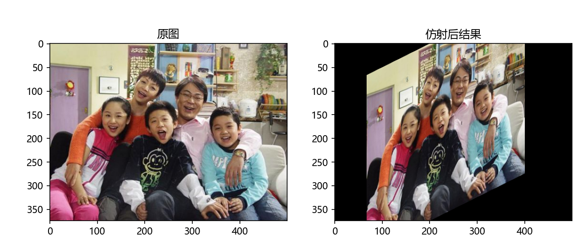


## 第十六节课：3-1_图像的透射变换

### 1.内容介绍

- **定义：**

  - 透射变换是视角变化的结果；
  - 利用透视中心、像点、目标点三点共线的条件；

  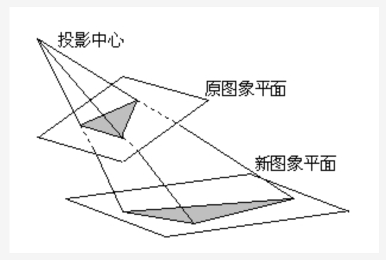

- **OpenCv中的原理作用：**

  - 它的本质将图像投影到一个新的视平面，其通用变换公式为：

  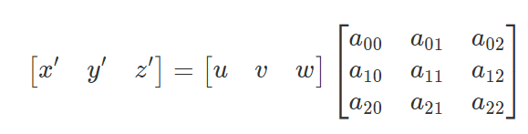

  - 其中，(u,v)是原始的图像像素坐标，w取值为1；
  - (x=x'/z',y=y'/z')是透射变换后的结果；
  - 后面的矩阵称为透视变换矩阵，一般情况下，我们将其分为三部分：

  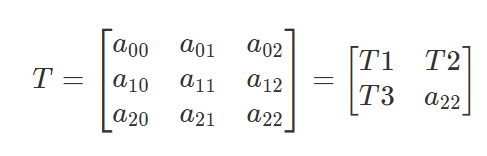

  - T1表示对图像进行线性变换，T2对图像进行平移，T3表示对图像进行投射变换，最后一个数一般设为1；
  - **基本思想总结：**
    - 在opencv中，我们要找到四个点，其中任意三个不共线，然后获取变换矩阵T，再进行透射变换；
    - 通过函数**cv.getPerspectiveTransform()**找到变换矩阵；
    - 将**cv.warpPerspective()**应用于此3x3变换矩阵；


### 2.API介绍

- 获取变换矩阵：

  ````python
  cv.getPerspectiveTransform()
  ````

  - 传入变换前的四个点坐标和变换后的四个点坐标即可得到仿射变换矩阵；

- 进行仿射变换：

  ```python
  cv.warpPerspective()
  ```

  - 仍是是将变换矩阵传递给函数，然后得到效果；


### 3.上机实验

```python
# 图像的透射 变换的示例代码

import numpy as np
import cv2 as cv
import matplotlib.pyplot as plt

# 设置字体为微软雅黑
plt.rcParams['font.family'] = 'Microsoft YaHei'
plt.rcParams['axes.unicode_minus'] = False

# 1 读取图像
img = cv.imread("images/Chapter3/kid.jpg")

# 2 透射变换
rows,cols = img.shape[:2]
# 2.1 创建变换矩阵
pts1 = np.float32([[56,65],[368,52],[28,387],[389,390]])
pts2 = np.float32([[100,145],[300,100],[80,290],[310,300]])

T = cv.getPerspectiveTransform(pts1,pts2)
# 2.2 进行变换
dst = cv.warpPerspective(img,T,(cols,rows))

# 3 图像显示
fig,axes=plt.subplots(nrows=1,ncols=2,figsize=(10,8),dpi=100)
axes[0].imshow(img[:,:,::-1])
axes[0].set_title("原图")
axes[1].imshow(dst[:,:,::-1])
axes[1].set_title("透射后结果")
plt.show()
```

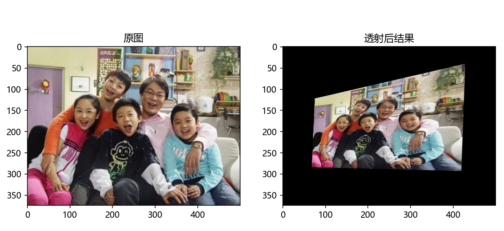


## 第十七节课：3-1_图像金字塔

### 1.内容介绍

- 图像金字塔是图像多尺度表达的一种，主要用于图像的分割，是一种以多分辨率来解释图像的有效但概念简单的结构；
- 一幅图像的金字塔是一系列以金字塔形状排列的分辨率逐步降低，且来源于同一张原始图的图像集合；
- 其通过梯次向下采样获得，直到达到某个终止条件才停止采样；

- **金字塔的底部是待处理图像的高分辨率表示，而顶部是低分辨率的近似，层级越高，图像越小，分辨率越低；**

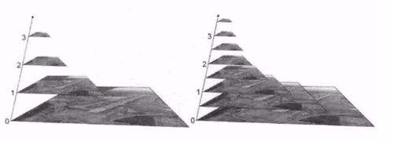


### 2.API介绍

```python
cv.pyrUp(img)		# 对图像进行上采样
cv.pyrDown(img)		# 对图像进行下采样
```


### 3.上机实验

```python
import numpy as np
import cv2 as cv
import matplotlib.pyplot as plt

# 1 图像读取
img = cv.imread("./image/image2.jpg")

# 2 进行图像采样
up_img = cv.pyrUp(img)  # 上采样操作
img_1 = cv.pyrDown(img)  # 下采样操作

# 3 图像显示
cv.imshow('enlarge', up_img)
cv.imshow('original', img)
cv.imshow('shrink', img_1)
cv.waitKey(0)
cv.destroyAllWindows()
```

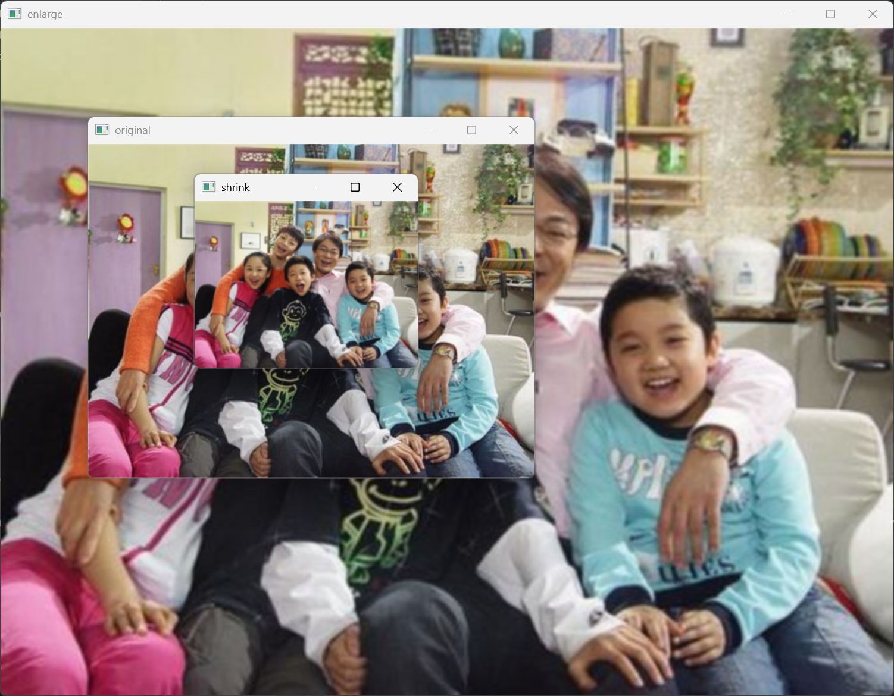


## 第十八节课：3-1_几何变换总结

- 图像缩放：对图像进行放大或缩小
  - **cv.resize()**

- 图像平移：
  - 指定平移矩阵后，调用**cv.warpAffine()**平移图像

- 图像旋转：
  - 调用**cv.getRotationMatrix2D()**获取旋转矩阵，然后调用**cv.warpAffine()**进行旋转

- 仿射变换：
  - 调用**cv.getAffineTransform()**将创建变换矩阵，最后该矩阵将传递给**cv.warpAffine()**进行变换

- 透射变换：
  - 通过函数**cv.getPerspectiveTransform()**找到变换矩阵，将**cv.warpPerspective()**进行投射变换

- 金字塔
  - 图像金字塔是图像多尺度表达的一种，使用的API：
    - **cv.pyrUp()**：向上采样
    - **cv.pyrDown()**：向下采样


## 第十九节课：3-2_连通性

### 1.邻接

- 图像中，最小的单位是像素，每个像素周围有8个邻接像素，常见的邻接关系有3种：
  - **4邻接**：像素p(x,y)的4邻域是：(x+1,y)；(x-1,y)；(x,y+1)；(x,y-1)，用*N*4(*p*)表示像素p的4邻接；
  - **D邻接**：像素p(x,y)的D邻域是：对角上的点 (x+1,y+1)；(x+1,y-1)；(x-1,y+1)；(x-1,y-1)，用*ND(p)*表示像素p的D邻域；
  - **8邻接**：像素p(x,y)的8邻域是： 4邻域的点＋D邻域的点，用*N*8(*p*)表示像素p的8邻域；

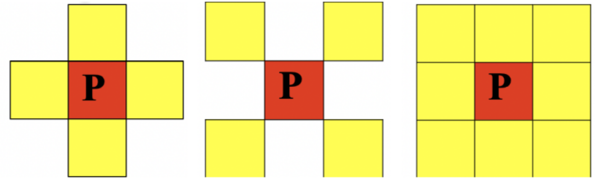


### 2.连通性

- **连通性**是描述区域和边界的重要概念，两个像素连通的两个必要条件是：

  - 两个像素的位置是否相邻；
  - **两个像素的灰度值是否满足特定的相似性准则或者是否相等**；

- 根据连通性的定义，有4联通、8联通和m联通三种：

  - **4连通**：对于具有值*V*的像素*p*和*q*，如果*q*在集合*N*4(*p*)中，则称这两个像素是4连通；
  - **8连通**：对于具有值*V*的像素*p*和*q*，如果*q*在集合*N*8(*p*)中，则称这两个像素是8连通；

  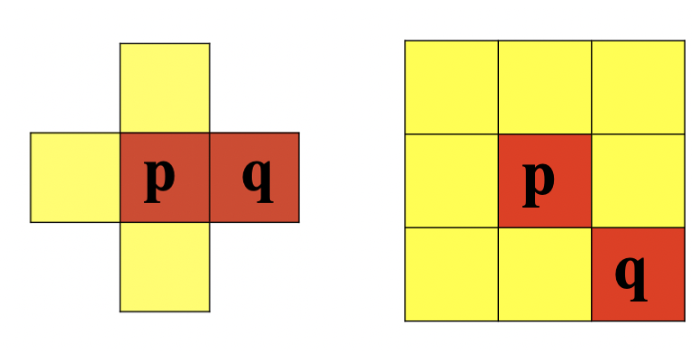

  - **m连通**：对于具有值*V*的像素*p*和*q*，如果：

    - *q*在集合*N*4(*p*)中，或
    - *q*在集合*N**D*(*p*)中，并且***N*4(*p*)与*N*4(*q*)的交集没有值*V*的像素**；
    - 则称这两个像素是*m*连通的，即4连通和D连通的混合连通；

    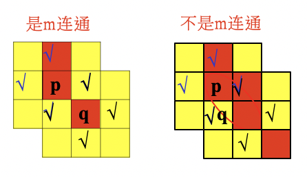


## 第二十节课：3-2_膨胀与腐蚀

### 1.内容介绍

- **膨胀**

  - 膨胀是使图像中高亮部分扩张，效果图拥有比原图更大的高亮区域，本质是求局部最大值的操作；

  - 用一个结构元素扫描图像中的每一个像素，用结构元素中的每一个像素与其覆盖的像素做“与”操作，如果都为0，则该像素为0，否则为1；
  - **膨胀的作用是将与物体接触的所有背景点合并到物体中，使目标增大，可添补目标中的孔洞**；

  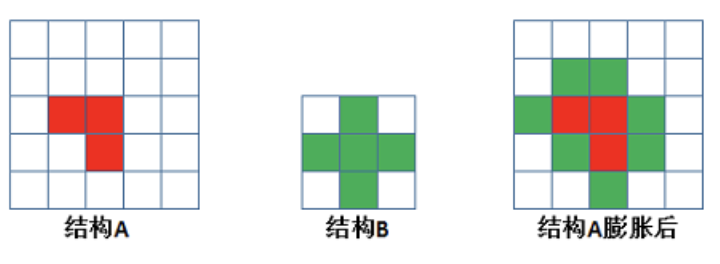

  - **API：**

    - img：要处理的图像
    - kernel：核结构
    - iterations：膨胀的次数，默认是1

    ```python
    cv.dilate(img,kernel,iterations)
    ```

- **腐蚀**

  - 腐蚀是原图中的高亮区域被蚕食，效果图拥有比原图更小的高亮区域，腐蚀是求局部最小值的操作；
  - 用一个结构元素扫描图像中的每一个像素，用结构元素中的每一个像素与其覆盖的像素做“与”操作，如果都为1，则该像素为1，否则为0；
  - **腐蚀的作用是消除物体边界点，使目标缩小，可以消除小于结构元素的噪声点**；

  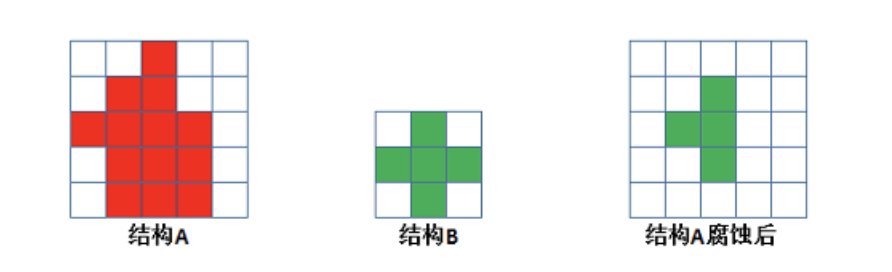

  - **API：**

    - img：要处理的图像
    - kernel：核结构
    - iterations：腐蚀的次数，默认是1

    ```python
    cv.erode(img,kernel,iterations)
    ```

  

### 2.上机实验

```python
# 腐蚀与膨胀示例代码

import numpy as np
import cv2 as cv
import matplotlib.pyplot as plt

# 设置字体为微软雅黑
plt.rcParams['font.family'] = 'Microsoft YaHei'
plt.rcParams['axes.unicode_minus'] = False

# 1 读取图像
img = cv.imread("images/Chapter3/letter.png")

# 2 创建核结构
kernel = np.ones((5, 5), np.uint8)

# 3 图像腐蚀和膨胀
erosion = cv.erode(img, kernel) # 腐蚀
dilate = cv.dilate(img,kernel) # 膨胀

# 4 图像展示
fig,axes=plt.subplots(nrows=1,ncols=3,figsize=(10,8),dpi=100)
axes[0].imshow(img)
axes[0].set_title("原图")
axes[1].imshow(erosion)
axes[1].set_title("腐蚀后结果")
axes[2].imshow(dilate)
axes[2].set_title("膨胀后结果")
plt.show()

```

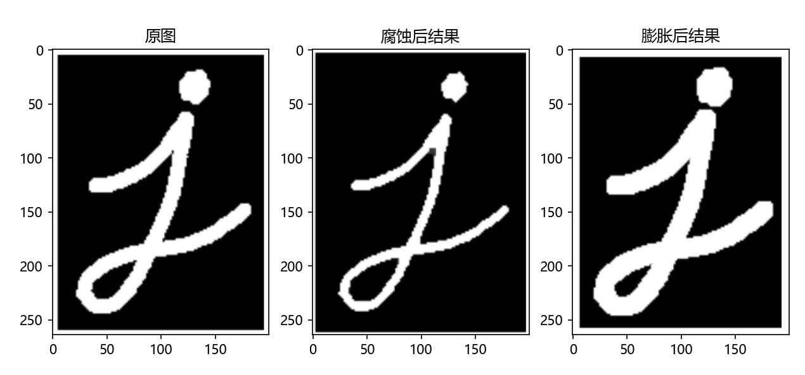


## 第二十一节课：3-2_开闭运算

### 1.总括

- 开运算和闭运算是将腐蚀和膨胀按照一定的次序进行处理；
- 这两者并不是可逆的，即先开后闭并不能得到原来的图像；


### 2.开运算

- 开运算是**先腐蚀后膨胀**；
- 作用：分离物体，消除小区域；
- 特点：消除噪点，去除小的干扰块，而不影响原来的图像；

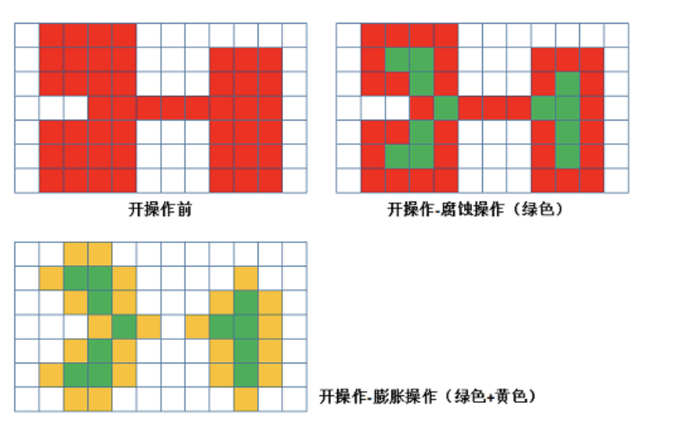


### 3.闭运算

- 闭运算与开运算相反，是**先膨胀后腐蚀**；
- 作用：消除/闭合物体里面的孔洞；
- 特点：可以填充闭合区域；

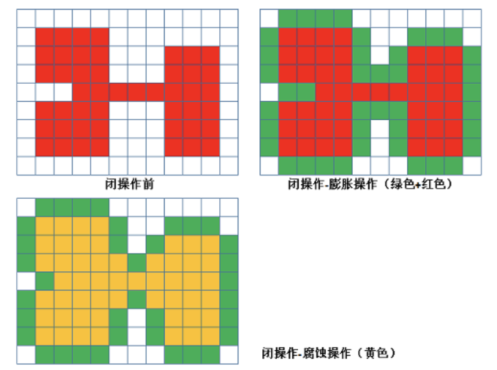


### 4.上机实验

- **API：**

```python
cv.morphologyEx(img, op, kernel)
```

- **参数：**
  - img：要处理的图像；
  - op：处理方式
    - 若进行开运算，则设为cv.MORPH_OPEN；
    - 若进行闭运算，则设为cv.MORPH_CLOSE；
  - Kernel：核结构；
- **示例代码：**

```python
# 开闭运算的示例代码

import numpy as np
import cv2 as cv
import matplotlib.pyplot as plt

# 设置字体为微软雅黑
plt.rcParams['font.family'] = 'Microsoft YaHei'
plt.rcParams['axes.unicode_minus'] = False

# 1 读取图像
img1 = cv.imread("images/Chapter3/letteropen.png")
img2 = cv.imread("images/Chapter3/letterclose.png")

# 2 创建核结构
kernel = np.ones((10, 10), np.uint8)

# 3 图像的开闭运算
cvOpen = cv.morphologyEx(img1,cv.MORPH_OPEN,kernel)     # 开运算
cvClose = cv.morphologyEx(img2,cv.MORPH_CLOSE,kernel)   # 闭运算

# 4 图像展示
fig,axes=plt.subplots(nrows=2,ncols=2,figsize=(10,8))
axes[0,0].imshow(img1)
axes[0,0].set_title("原图")
axes[0,1].imshow(cvOpen)
axes[0,1].set_title("开运算结果")
axes[1,0].imshow(img2)
axes[1,0].set_title("原图")
axes[1,1].imshow(cvClose)
axes[1,1].set_title("闭运算结果")
plt.show()

```

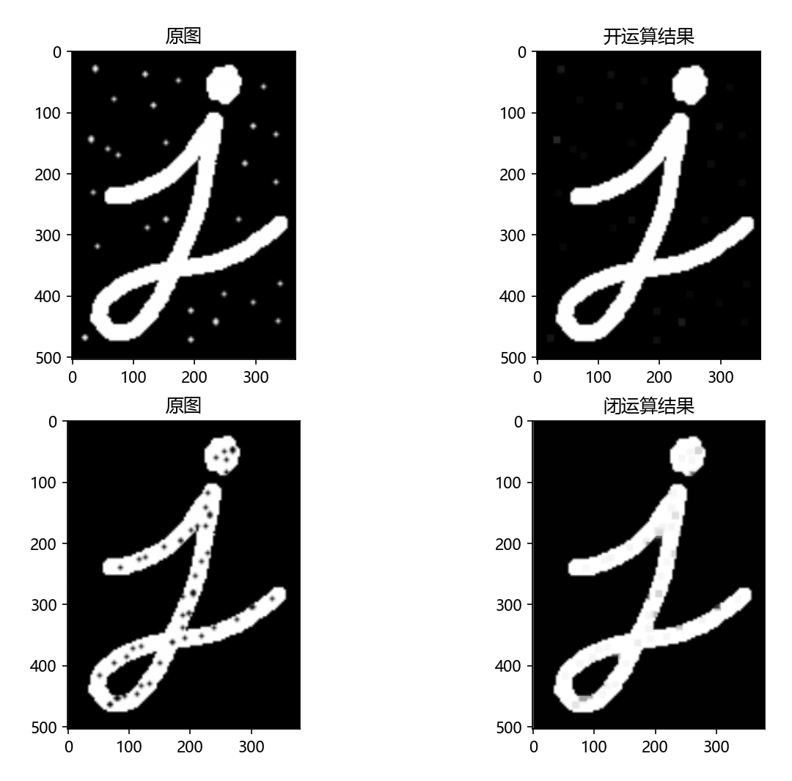


## 第二十二节课：3-2_黑帽与礼帽

### 1.礼帽运算

- 原图像与“开运算“的结果图之差，如下式计算：

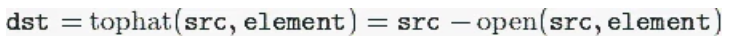

- 因为开运算带来的结果是放大了裂缝或者局部低亮度的区域，因此，从原图中减去开运算后的图，得到的效果图突出了比原图轮廓周围的区域更明亮的区域，且这一操作和选择的核的大小相关；
- 礼帽运算用来分离比邻近点亮一些的斑块。当一幅图像具有大幅的背景的时候，而微小物品比较有规律的情况下，可以使用顶帽运算进行背景提取；


### 2.黑帽运算

- 为”闭运算“的结果图与原图像之差。数学表达式为：

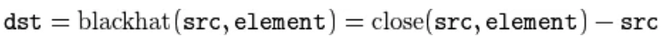

- 黑帽运算后的效果图突出了比原图轮廓周围的区域更暗的区域，且这一操作和选择的核的大小相关；
- 黑帽运算用来分离比邻近点暗一些的斑块；


### 3.API

- 由前面的概念可以知道，礼帽和黑帽本质上是在**提取背景**；

- **API：**

```python
cv.morphologyEx(img, op, kernel)
```

- **参数：**

  - img：要处理的图像；
  - op：处理方式：

  

  - Kernel：核结构；

- **示例代码：**

```python
# 黑帽礼帽示例代码

import numpy as np
import cv2 as cv
import matplotlib.pyplot as plt

# 设置字体为微软雅黑
plt.rcParams['font.family'] = 'Microsoft YaHei'
plt.rcParams['axes.unicode_minus'] = False

# 1 读取图像
img1 = cv.imread("images/Chapter3/letteropen.png")
img2 = cv.imread("images/Chapter3/letterclose.png")

# 2 创建核结构
kernel = np.ones((10, 10), np.uint8)

# 3 图像的礼帽和黑帽运算
cvOpen = cv.morphologyEx(img1,cv.MORPH_TOPHAT,kernel)       # 礼帽运算
cvClose = cv.morphologyEx(img2,cv.MORPH_BLACKHAT,kernel)    # 黑帽运算

# 4 图像显示
fig,axes=plt.subplots(nrows=2,ncols=2,figsize=(10,8))
axes[0,0].imshow(img1)
axes[0,0].set_title("原图")
axes[0,1].imshow(cvOpen)
axes[0,1].set_title("礼帽运算结果")
axes[1,0].imshow(img2)
axes[1,0].set_title("原图")
axes[1,1].imshow(cvClose)
axes[1,1].set_title("黑帽运算结果")
plt.show()

```

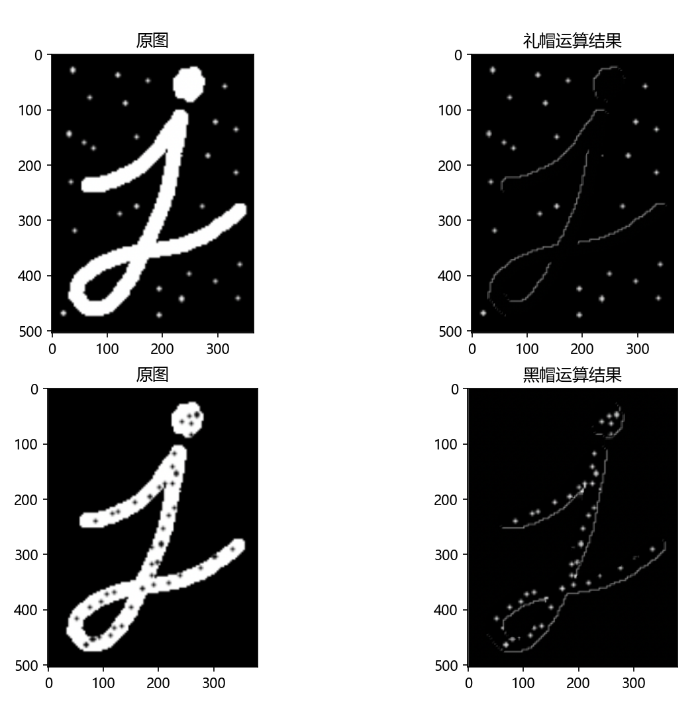


## 第二十三节课：3-2_形态学操作总结

### 1.**连通性**

- 邻接关系：4邻接，8邻接和D邻接；
- 连通性：4连通，8连通和m连通；


### 2.**形态学操作**

- **腐蚀和膨胀：**
  - 腐蚀：求局部最小值；
  - 膨胀：求局部最大值；
- **开闭运算：**
  - 开：先腐蚀后膨胀；
  - 闭：先膨胀后腐蚀；
- **礼帽和黑帽：**
  - 礼帽：原图像与开运算之差；
  - 黑帽：闭运算与原图像之差；


## 第二十四节课：3-3_图像噪声

### 1.椒盐噪声

- 椒盐噪声也称为脉冲噪声，是图像中经常见到的一种噪声；
- 它是一种随机出现的白点或者黑点，亮的区域有黑色像素或是在暗的区域有白色像素或是两者皆有；
- 椒盐噪声的成因可能是影像讯号受到突如其来的强烈干扰而产生、类比数位转换器或位元传输错误等；
- 例如失效的感应器导致像素值为最小值，饱和的感应器导致像素值为最大值；

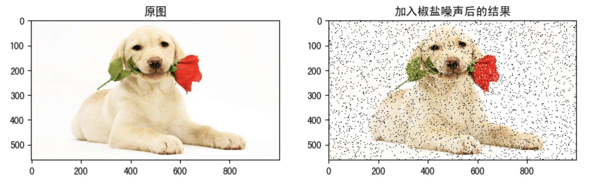


### 2.高斯噪声

- 高斯噪声是指噪声密度函数服从高斯分布的一类噪声；
- 由于高斯噪声在空间和频域中数学上的易处理性，这种噪声(也称为正态噪声)模型经常被用于实践中；
- 高斯随机变量z的概率密度函数由下式给出：
  - 其中z表示灰度值，μ表示z的平均值或期望值，σ表示z的标准差，标准差的平方称为z的方差；

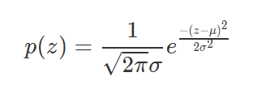

- 高斯函数的曲线如图所示：


- 带有高斯噪声的图片如图所示：

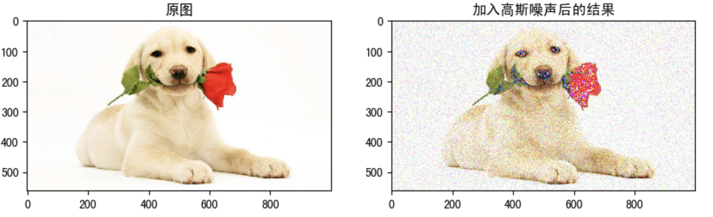


## 第二十五节课：3-3_均值滤波

### 1.图像平滑介绍

- 图像平滑从信号处理的角度看就是**去除其中的高频信息，保留低频信息**；
- 因此我们可以对图像实施**低通滤波，低通滤波可以去除图像中的噪声，对图像进行平滑**；

- 根据滤波器的不同可分为：
  - **均值滤波；**
  - **高斯滤波；**
  - **中值滤波； **
  - **双边滤波；**


### 2.均值滤波

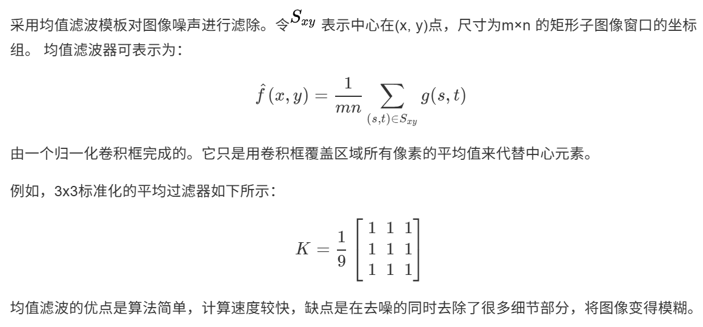


### 3.均值滤波API

- **API：**

```
cv.blur(src, ksize, anchor, borderType)
```

- **参数：**
  - src：输入图像；
  - ksize：卷积核的大小；
  - anchor：默认值 (-1,-1) ，表示核中心；
  - borderType：边界类型；


### 4.均值滤波上机实验

```python
# 均值滤波示例代码

import cv2 as cv
import numpy as np
from matplotlib import pyplot as plt

# 设置字体为微软雅黑
plt.rcParams['font.family'] = 'Microsoft YaHei'
plt.rcParams['axes.unicode_minus'] = False

# 1 图像读取
img1 = cv.imread('images/Chapter3/dogsp.jpeg')
img2 = cv.imread('images/Chapter3/dogGauss.jpeg')

# 2 均值滤波
blur1 = cv.blur(img1,(5,5))
blur2 = cv.blur(img2,(5,5))

# 3 图像显示
fig,axes=plt.subplots(nrows=2,ncols=2,figsize=(10,8))
axes[0,0].imshow(img1[:,:,::-1])
axes[0,0].set_title("椒盐狗原图")
axes[0,1].imshow(blur1[:,:,::-1])
axes[0,1].set_title("均值滤波椒盐狗")
axes[1,0].imshow(img2[:,:,::-1])
axes[1,0].set_title("高斯狗原图")
axes[1,1].imshow(blur2[:,:,::-1])
axes[1,1].set_title("均值滤波高斯狗")
plt.show()

```

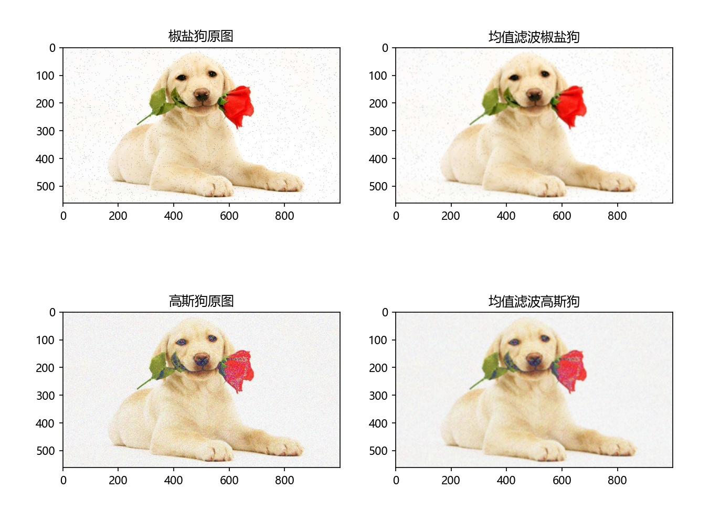


## 第二十六节课：3-3_高斯滤波


## 第二十七节课：3-3_中值滤波


## 第二十八节课：3-3_图像平滑总结


