# 第零章：课程简介

本章主要对课程的内容进行介绍。


## 第一节课：0-0_课程简介

本课程以OpenCV开源图像处理库为基础，介绍相关的图像处理方法：

- **基本的图像处理方法：**
  - **几何变换**：图像的放大缩小、平移旋转；
  - **形态学变换**：膨胀、填充；
  - **图像平滑**：去噪声，包括取出椒盐噪声、高斯噪声；
  - **直方图操作**：查看图像的灰度直方图，对其直方图进行均衡化，提高其对比度；
  - **模板匹配**：拿一个模板与图像中相似的内容；
  - **霍夫变换**：检测图像中的圆、直线等形状；
- **特征提取和描述方法：**
  - **理解角点特征**：关键点特征；
  - **Harris和Shi-Tomas算法**：即理解角点特征对应的算法；
  - **SIFT/SURF算法**：尺度不变特征算法；
  - **Fast算法**：前面的算法都比较慢，Fast算法更快，但只有特征提取算法没有描述方法；
  - **ORB算法**：用Fast算法进行特征提取，再用另一算法进行描述；
- **视频操作中的应用：**
  - **视频的读写和保存、目标追踪；**
  - **但是无法处理声音，需要用其他库；**
- **人脸检测：**
  - 作为案例实施来讲；


# 第一章：OpenCV简介

本章主要对图像处理中的基本概念以及OpenCV进行介绍。


## 第二节课：1-1_图像处理简介

### 1.图像是什么

图像可以分为两部分：

- 图：物体反射或投射光的分布；
- 像：人的视觉系统所接受的图在人脑中所形成的印象或认识；


### 2.模拟图像和数字图像

- **模拟图像**

  - 第一张图像就是模拟图像；
  - 模拟图像又称为连续图像；
  - 它通过某种物理量（如光、电）的强弱变化来记录图像亮度信息，故是连续变换的；
  - 模拟图像容易受到干扰，目前已经全部被数字图像替代；

- **数字图像**

  - 数字图像的亮度用离散数值表示，图片编码成5个灰度值；
  - 在发送端图片被编码并使用打孔带记录，通过系统传输后在接收方使用特殊的打印机恢复成图像；

  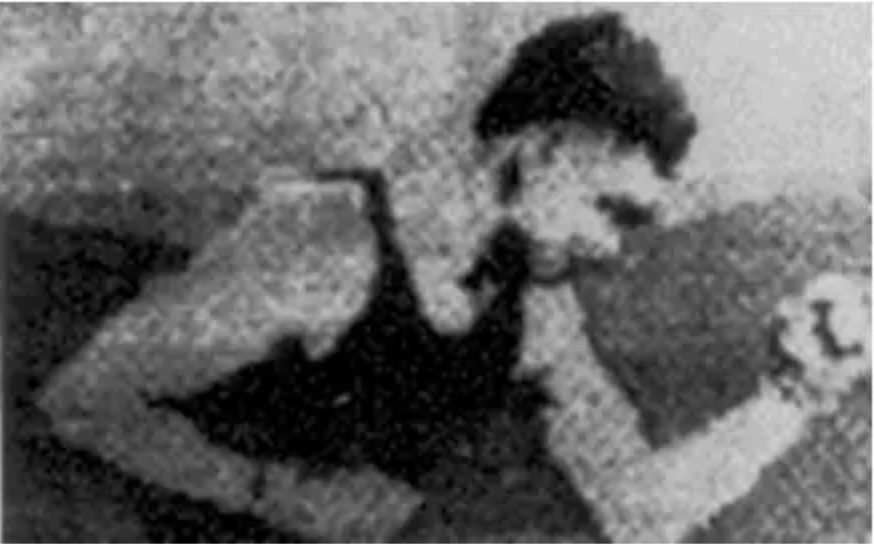


### 3.数字图像的表示

- **灰度的概念**

  - 计算机采用0/1编码的系统，数字图像也是利用0/1来记录信息；
  - 我们平常接触的图像都是**8位数**图像，包含0～255灰度，其中0，代表最黑，1，表示最白；

  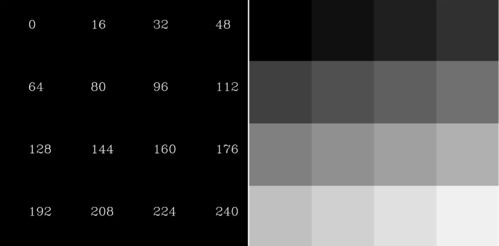

  - 人的眼睛对灰度更敏感，一般在**16位到32位**之间，下方的两条线实质上是灰度一样的：

  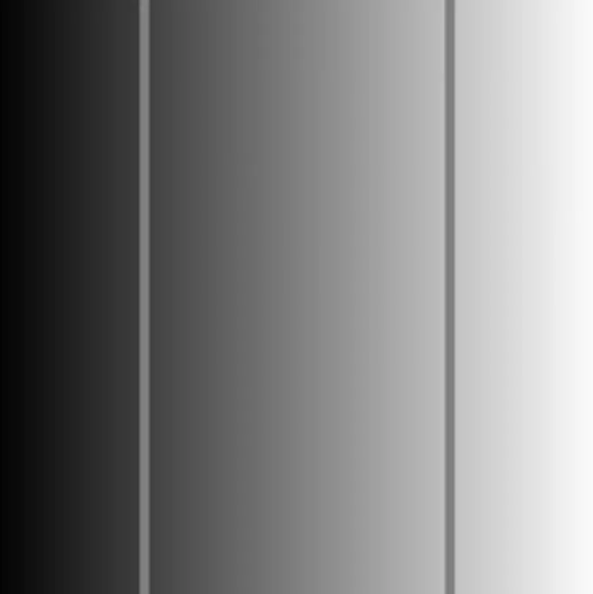

- **图像的分类：**

  - **二值图像：**
    - 一幅二值图像的二维矩阵仅由0、1两个值构成，“0”代表黑色，“1”代白色；
    - 由于每一像素取值仅有0、1两种可能，所以计算机中二值图像的数据类型通常为**1个二进制位**；
    - 二值图像通常用于文字、线条图的扫描识别（OCR）和**掩膜图像**的存储；
  - **灰度图：**
    - 灰度图像在黑色与白色之间还有许多级的颜色深度；
    - 灰度图像经常是在单个电磁波频谱如可见光内测量每个像素的亮度得到的；
    - 用于显示的灰度图像通常用**每个采样像素8位的非线性尺度来保存**，这样可以有256级灰度；
  - **彩色图：**
    - 每个像素通常是由**红（R）、绿（G）、蓝（B）**三个分量来表示的，分量介于（0，255）；
    - RGB图像与索引图像一样都可以用来表示彩色图像；
      - 与索引图像一样，它分别用红（R）、绿（G）、蓝（B）三原色的组合来表示每个像素的颜色；
      - 不同的是，RGB图像每一个像素的颜色值（由RGB三原色表示）直接存放在图像矩阵中；
      - 由于每一像素需由R、G、B三个分量来表示，M、N分别表示图像的行列数，**三个M x N的二维矩阵**分别表示各个像素的R、G、B三个颜色分量；
      - 也就是说RGB图像是用一个张量来表示的；
    - RGB图像的数据类型一般为**8位无符号整形**，通常用于表示和存放真彩色图；


## 第三节课：1-2_OpenCV简介及其安装方法

### 1.OpenCV简介


- **OpenCV简介：**
  - OpenCV是一款由**Intel公司俄罗斯团队**发起并参与和维护的一个计算机视觉处理开源软件库；
  - 支持与计算机视觉和机器学习相关的众多算法；
- **OpenCV的优势有：**
  - **编程语言：**
    - OpenCV基于**C++**实现，同时提供python, Ruby, Matlab等语言的接口；
    - **OpenCV-Python**是OpenCV的Python API，结合了OpenCV C++ API和Python语言的最佳特性。
  - **跨平台：**
    - 可以在不同的系统平台上使用，包括Windows，Linux，OS X，Android和iOS；
    - 基于**CUDA和OpenCL的高速GPU操作接口**也在积极开发中；
  - **丰富的API：**
    - 完善的**传统计算机视觉算法**，涵盖主流的机器学习算法，同时添加了对深度学习的支持；


### 2.OpenCV-Python的介绍

- **OpenCV的介绍：**
  - OpenCV-Python是一个**Python绑定库**，旨在解决计算机视觉问题；
- **OpenCV-Python开发的原因：**
  - Python语言语法简单，易于使用，且可读性高；
  - 但与C / C++等语言相比，Python速度较慢；
  - 那就底层用C/C++写，然后封装成Python的库，就把两者的优点结合起来了；
  - 也就是说OpenCV-Python是**原始OpenCV C++实现的Python包装器**；
- **OpenCV-Python中的数据类型：**
  - OpenCV-Python使用**Numpy**，这是一个高度优化的数据库操作库，具有MATLAB风格的语法；
  - 所有OpenCV数组结构都转换为Numpy数组


### 3.OpenCV的部署

- 创建Python的虚拟环境，然后在虚拟环境中安装即可；
- 在安装OpenCV之前需要先安装**numpy, matplotlib；**
- 由于一些经典的算法被申请了版权，新版本有很大的限制，所以选用**3.4.3**以下的版本：

```bash
pip install opencv-python==3.4.2.17
```

- 可通过运行如下脚本验证是否安装成功：

```python
import cv2

# 读一个图片并进行显示(图片路径需自己指定)
lena=cv2.imread("1.jpg")
cv2.imshow("image",lena)
cv2.waitKey(0)

```

- 如果我们要利用**SIFT和SURF**等进行特征提取时，还需要安装：

```bash
pip install opencv-contrib-python==3.4.2.17
```


## 第四节课：1-3_OpenCV模块

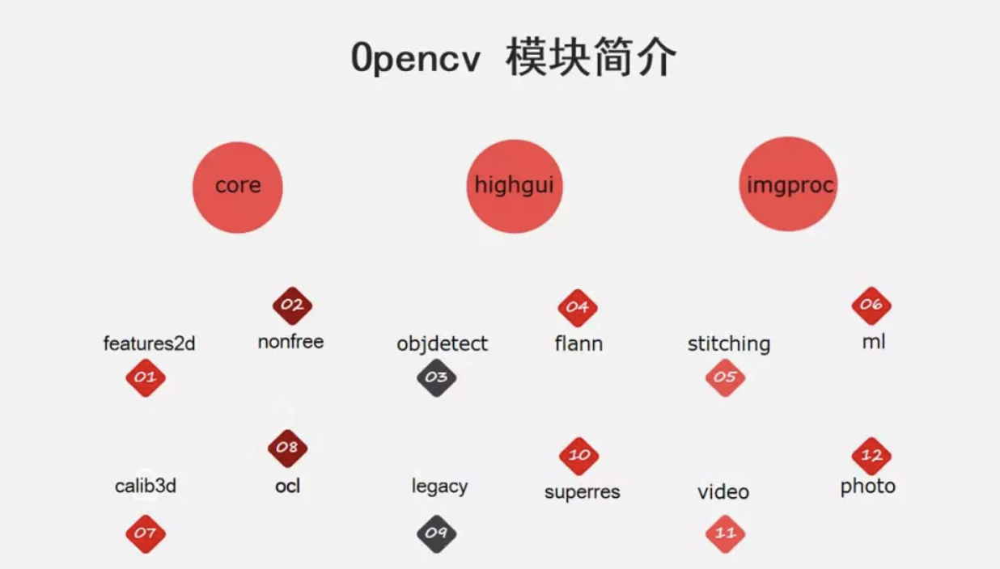

- 最基础的模块：core、highgui、imgproc
  - **core模块**实现了最核心的数据结构及其基本运算，如绘图函数、数组操作相关函数等
  - **highgui模块**实现了视频与图像的读取、显示、存储等接口；
  - **imgproc模块**实现了图像处理的基础方法，包括图像滤波、图像的几何变换、平滑、阈值分割、形态学处理、边缘检测、目标检测、运动分析和对象跟踪等；
- 更改层次的模块：
  - **features2d模块**用于提取图像特征以及特征匹配；
  - **nonfree模块**实现了一些专利算法，如sift特征（**3.4.3版本以下没有这个模块**）；
  - **objdetect模块**实现了一些目标检测的功能，经典的基于Haar、LBP特征的人脸检测，基于HOG的行人、汽车等目标检测，分类器使用Cascade Classification（级联分类）和Latent SVM等；
  - **FLANN模块**（Fast Library for Approximate Nearest Neighbors），包含快速近似最近邻搜索FLANN 和聚类Clustering算法；
  - **stitching模块**实现了图像拼接功能，主要用在遥感成像上；
  - **ml模块**机器学习模块（SVM，决策树，Boosting等等）；
  - **calib3d模块**即Calibration（校准）3D，这个模块主要是相机校准和三维重建相关的内容。包含了基本的多视角几何算法，单个立体摄像头标定，物体姿态估计，立体相似性算法，3D信息的重建等等；
  - **ocl模块**即Open Computing Language模块，该模块的主要作用是利用 **GPU**（以及其他异构加速器）来加速图像处理算法，是对OpenCL的封装，在OpenCV3.x以后就不再独立了；
  - **superres** 是  **超分辨率（Super Resolution）** 模块，通过算法将**低分辨率（LR）**的图像或视频序列，重建为**高分辨率（HR）**的图像，试图“恢复”出细节；
  - **photo模块**包含图像修复和图像去噪两部分；
  - **video模块**针对视频处理，如背景分离，前景检测、对象跟踪等；
  - **G-API模块**包含超高效的图像处理pipeline引擎；


# 第二章：OpenCV基本操作

本章主要介绍OpenCV中的基本操作。


## 第五课：2-0_OpenCV基本操作内容介绍

本章主要介绍图像的基本操作，包括：

- 图像的**IO操作**，读取和保存方法；
- 在图像上绘制几何图形；
- 怎么获取图像的属性；
- 怎么访问图像的像素，进行通道分离，合并等；
- 怎么实现**颜色空间的变换**；
- 图像的算术运算；


## 第六课：2-1_图像的IO操作

这一小节将介绍如何读取图像、如何显示图像和如何保存图像。

### 1.读取图像

- **API：**

```python
cv.imread()
```

- **参数：**
  - 要读取的图像的路径，可采用**相对或绝对路径**；
  - 读取方式的标志：
    - **cv.IMREAD*COLOR**：以彩色模式加载图像，任何图像的透明度都将被忽略。这是默认参数；
    - **cv.IMREAD*GRAYSCALE**：以灰度模式加载图像；
    - **cv.IMREAD_UNCHANGED**：包括alpha通道的加载图像模式；
    - **可以使用1、0或者-1来替代上面三个标志**；
  - **注意：**
    - **如果加载的路径有错误，不会报错，会返回一个None值；**
    - **OpenCV中读取出来的图像是按BGR的格式存储的，后期若用matplotlib显示的话要翻转通道**；
- **参考代码：**

```python
import numpy as np
import cv2 as cv

# 以灰度图的形式读取图像
img = cv.imread('messi5.jpg',0)
```


### 2.显示图像

- **API：**

```python
cv.imshow()
```

- **参数：**
  - 显示图像的窗口名称，以字符串类型表示；
  - 要加载的图像，一般是**调用读取图像API时的返回值**；
  - **注意：在调用显示图像的API后，要调用cv.waitKey()给图像绘制留下时间，否则窗口会出现无响应情况，并且图像无法显示出来**；
- **参考代码：**

```python
# opencv中显示
cv.imshow('image',img)
cv.waitKey(0)		# 永远等待

# matplotlib中展示
plt.imshow(img[:,:,::-1])

```


### 3.保存图像

- **API：**

```python
cv.imwrite()
```

- **参数：**
  - 文件名，要保存在哪里，即保存的路径；
  - 要保存的图像；
- **参考代码：**

```python
cv.imwrite('messigray.png',img)
```


### 4.上机实验

```python
import numpy as np
import cv2 as cv
import matplotlib.pyplot as plt

# 1 读取图像
img = cv.imread('images/Chapter2/2-1-1.png',1)

# 2 显示图像
# 2.1 利用opencv展示图像
# cv.imshow('image',img)

# 2.2 在matplotlib中展示图像
# OpenCV读取的图像是按BGR格式存储的，需转换成matplotlib的RGB格式
plt.imshow(img[:,:,::-1])		# plt.imshow(img, cmap=plot.cm.gray)
plt.title('匹配结果'), plt.xticks([]), plt.yticks([])
plt.show()
k = cv.waitKey(0)

# 3 保存图像
cv.imwrite('images/Chapter2/2-1-1_save.png',img)

```


## 第七课：2-1_在图像上绘制图形

### 1.绘制直线

- **API：**

```python
cv.line(img, start, end, color, thickness)
```

- **参数：**
  - **img**：要绘制直线的图像；
  - **start,end**： 直线的起点和终点；
  - **color**：线条的颜色；
  - **thickness**： 线条宽度；


### 2.绘制圆形

- **API：**

```python
cv.circle(img, centerpoint, r, color, thickness)
```

- **参数：**
  - **img**：要绘制圆形的图像；
  - **Centerpoint, r**：圆心和半径；
  - **color**：线条的颜色；
  - **thickness**：线条宽度，为**-1**时生成闭合图案并填充颜色；


### 3.绘制矩形

- **API：**

```python
cv.rectangle(img,leftupper,rightdown,color,thickness)
```

- **参数：**
  - **img**：要绘制矩形的图像；
  - **leftupper, rightdown**：矩形的左上角和右下角坐标；
  - **color**：线条的颜色；
  - **thickness**：线条宽度；


### 4.向图像中添加文字

- **API：**

```python
cv.putText(img,text,station, font, fontsize,color,thickness,cv.LINE_AA)
```

- **参数：**
  - **img**：图像；
  - **text**：要写入的文本数据；
  - **station**：文本的放置位置；
  - **font**：字体；
  - **fontsize**：字体大小；


### 5.上机实验

```python
import numpy as np
import cv2 as cv
import matplotlib.pyplot as plt

# 1 创建一个空白的图像
img = np.zeros((512,512,3), np.uint8)

# 2 绘制图形
cv.line(img, (0,0), (511,511), (255,0,0), 5)	# 左上角为(0, 0)坐标
cv.rectangle(img, (384,0), (510,128), (0,255,0), 3)
cv.circle(img, (447,63), 63, (0,0,255), -1)
font = cv.FONT_HERSHEY_SIMPLEX
cv.putText(img,'OpenCV', (10,500), font, 4, (255,255,255), 2 , cv.LINE_AA)

# 3 图像展示
plt.imshow(img[:,:,::-1])
plt.title('匹配结果'), plt.xticks([]), plt.yticks([])
plt.show()

# 4 保存图像
cv.imwrite('images/Chapter2/2-1-2_save.png',img)

```

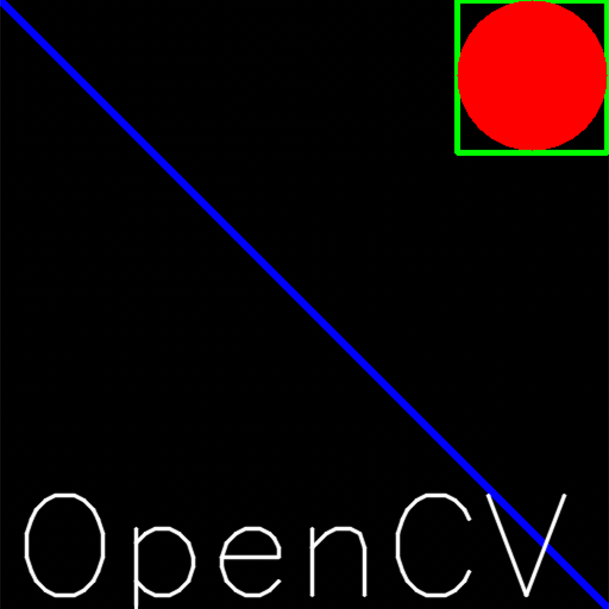


## 第八课：2-1_图像基本操作的其他内容

### 1.获取并修改图像中的像素点

- 我们可以通过**行和列的坐标值**获取该像素点的像素值；
- 对于BGR图像，它返回一个**蓝，绿，红值的数组**；
- 对于灰度图像，仅返回**相应的强度值**；
- 使用相同的方法对像素值进行修改；
- 示例代码如下：可在**jupyter notebook**中验证

```python
import numpy as np
import cv2 as cv

img = cv.imread('messi5.jpg')

# 获取某个像素点的值
px = img[100,100]

# 仅获取蓝色通道的强度值
blue = img[100,100,0]

# 修改某个位置的像素值
img[100,100] = [255,255,255]

```


### 2.获取图像的属性

- 图像属性包括行数、列数和通道数、图像数据类型、像素数等；

| 属性                     | API       |
| ------------------------ | --------- |
| 形状                     | img.shape |
| 图像大小，即一共多少像素 | img.size  |
| 数据类型                 | img.dtype |


### 3.图像通道的拆分和合并

- 有时需要**在B，G，R通道图像上单独工作**，在这种情况下，需要将BGR图像分割为**单个通道**；
- 或者在其他情况下，可能需要将这些单独的通道合并到BGR图像；
- 示例代码：注意OpenCV的BGR颜色顺序

```python
# 通道拆分
b,g,r = cv.split(img)

# 通道合并
img = cv.merge((b,g,r))

```


### 4.色彩空间的改变

- OpenCV中有150多种颜色空间转换方法；
- 最广泛使用的转换方法有两种：
  - **BGR↔Gray；**
  - **BGR↔HSV；**
- API：

```python
cv.cvtColor(input_image，flag)
```

- 参数：
  - input_image：进行颜色空间转换的图像；
  - flag：转换类型：
    - cv.COLOR_BGR2GRAY：BGR↔Gray；
    - cv.COLOR_BGR2HSV：BGR→HSV；


## 第九课：2-1_图像基础处理总结

- 图像IO操作的API：
  - cv.imread()：读取图像
  - cv.imshow()：显示图像
  - cv.imwrite()：保存图像

- 在图像上绘制几何图像：
  - cv.line()：绘制直线
  - cv.circle()：绘制圆形
  - cv.rectangle()：绘制矩形
  - cv.putText()：在图像上添加文字

- 直接使用行列索引获取图像中的像素并进行修改；

- 图像的属性

| 属性                     | API       |
| ------------------------ | --------- |
| 形状                     | img.shape |
| 图像大小，即一共多少像素 | img.size  |
| 数据类型                 | img.dtype |

- 拆分通道与合并通道：
  - 拆分通道：cv.split()
  - 合并通道：cv.merge()

- 色彩空间的改变：
  - cv.cvtColor(input_image，flag)


## 第十节课：2-2图像的加法

### 1.图像的加法简介

- 使用OpenCV的**cv.add()函数**把两幅图像相加，或通过numpy操作添加两个图像，如res = img1 + img2；
- 两个图像应该具有相同的大小和类型，或者第二个图像可以是标量值；
- 两者的不同：
  - **OpenCV的加法是饱和操作；**
  - **Numpy添加是模运算；**
  - **一般而言OpenCV的加法操作会更好一些**


### 2.上机实验

- 示例代码1：

```python
>>> x = np.uint8([250])
>>> y = np.uint8([10])
>>> print( cv.add(x,y) ) # 250+10 = 260 => 255
[[255]]
>>> print( x+y )          # 250+10 = 260 % 256 = 4
[4]
```

- 示例代码2：

```python
import numpy as np
import cv2 as cv
import matplotlib.pyplot as plt

# 设置字体为微软雅黑
plt.rcParams['font.family'] = 'Microsoft YaHei'
plt.rcParams['axes.unicode_minus'] = False

# 1 读取图像
img1 = cv.imread("images/Chapter2/view.jpg")
img2 = cv.imread("images/Chapter2/rain.jpg")

# 2 加法操作
img3 = cv.add(img1,img2) # cv中的加法
img4 = img1+img2 # 直接相加

# 3 图像显示
fig,axes=plt.subplots(nrows=1,ncols=2,figsize=(10,8),dpi=100)
axes[0].imshow(img3[:,:,::-1])
axes[0].set_title("cv中的加法")
axes[1].imshow(img4[:,:,::-1])
axes[1].set_title("直接相加")
plt.show()

# 4 保存图像
cv.imwrite('images/Chapter2/2-2-1_save.png',img3)
cv.imwrite('images/Chapter2/2-2-2_save.png',img4)

```

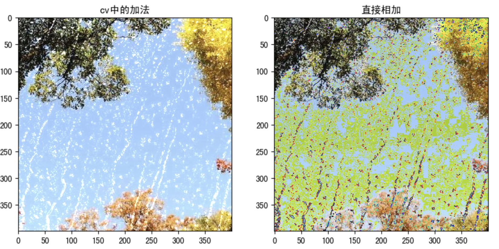


## 第十一节课：2-2图像的混合

- **定义：**

  - 混合也是加法，但是不同的是**两幅图像的权重不同**，这就会给人一种混合或者透明的感觉；

- **图像混合的计算公式如下：**

  - ```latex
    g(x) = (1−α)f0(x) + αf1(x)
    ```

  - 通过修改**α的值（0 → 1）**，可以实现非常炫酷的混合；

- **API：**

```python
cv2.addWeighted()
```

- **参数：**

```python
dst = α⋅img1 + β⋅img2 + γ
```

- **参考代码：**

```python
import numpy as np
import cv2 as cv
import matplotlib.pyplot as plt

# 1 读取图像
img1 = cv.imread("images/Chapter2/view.jpg")
img2 = cv.imread("images/Chapter2/rain.jpg")

# 2 图像混合
img3 = cv.addWeighted(img1, 0.7, img2, 0.3, 0)

# 3 图像显示
plt.figure(figsize=(8,8))
plt.imshow(img3[:,:,::-1])
plt.show()

# 4 保存图像
cv.imwrite('images/Chapter2/2-2-2_save.png',img3)

```

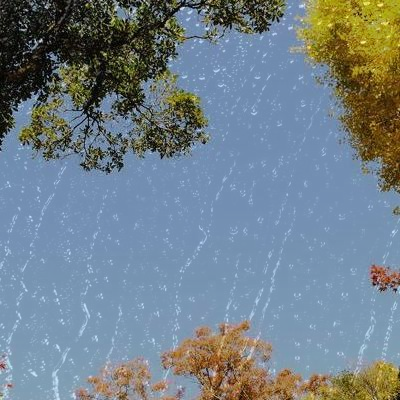


# 第三章：OpenCV图像处理

本章主要讲解OpenCV中对于图像的处理部分，主要包括：

- 3-1_图像的几何变换；
- 3-2_图像的形态学转换；
- 3-3_图像的平滑方法；
- 3-4_直方图的方法；
- 3-5_边缘检测的方法；
- 3-6_模板匹配和霍夫变换的应用；


## 第十二节课：3-1_图像缩放

### 1.内容介绍

- 缩放是对图像的大小进行调整，即是图像放大或缩小；
- **API：**

```python
cv2.resize(src, dsize, fx=0, fy=0, interpolation=cv2.INTER_LINEAR)
```

- **参数：**

  - src：输入图像；
  - dsize：绝对尺寸，直接指定调整后图像的大小；
  - fx,fy：相对尺寸，将dsize设置为None，然后将fx和fy设置为比例因子即可；
  - interpolation：插值方法

  | 插值              | 含义                   |
  | ----------------- | ---------------------- |
  | cv2.INTER_LINEAR  | 双线性插值法           |
  | cv2.INTER_NEAREST | 最近邻插值             |
  | cv2.INTER_AREA    | 像素区域重采样（默认） |
  | cv2.INTER_CUBIC   | 双三次插值             |


### 2.上机实验

```python
# 图像的缩放示例代码

import numpy as np
import cv2 as cv
import matplotlib.pyplot as plt

# 设置字体为微软雅黑
plt.rcParams['font.family'] = 'Microsoft YaHei'
plt.rcParams['axes.unicode_minus'] = False

# 1. 读取图片
img1 = cv.imread("images/Chapter3/kid.jpg")
# 2.图像缩放
# 2.1 绝对尺寸
rows,cols = img1.shape[:2]      # 获取行列的像素值
res1 = cv.resize(img1,(2*cols,2*rows),interpolation=cv.INTER_CUBIC)      # 绝对缩放

# 2.2 相对尺寸
res2 = cv.resize(img1,None,fx=0.5,fy=0.5)

# 3 图像显示
# 3.1 使用opencv显示图像(不推荐)
# cv.imshow("orignal",img1)
# cv.imshow("enlarge",res)
# cv.imshow("shrink）",res1)
# cv.waitKey(0)

# 3.2 使用matplotlib显示图像
fig,axes=plt.subplots(nrows=1,ncols=3,figsize=(10,8),dpi=100)
axes[0].imshow(res1[:,:,::-1])
axes[0].set_title("绝对尺度（放大）")
axes[1].imshow(img1[:,:,::-1])
axes[1].set_title("原图")
axes[2].imshow(res2[:,:,::-1])
axes[2].set_title("相对尺度（缩小）")
plt.show()

```


## 第十三节课：3-1_图像平移

### 1.内容介绍

- 图像平移将图像按照**指定方向和距离**，移动到相应的位置；
- **API：**

```python
cv.warpAffine(img, M, dsize)
```

- **参数：**

  - img：输入图像；
  - **M：2*3移动矩阵**

  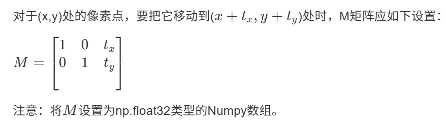

  - dsize：输出图像的大小；
  - **注意：输出图像的大小，它应该是(宽度，高度)的形式。请记住，width=列数，height=行数；**


### 2.上机实验

```python
# 图像的平移示例代码

import numpy as np
import cv2 as cv
import matplotlib.pyplot as plt

# 设置字体为微软雅黑
plt.rcParams['font.family'] = 'Microsoft YaHei'
plt.rcParams['axes.unicode_minus'] = False

# 1. 读取图像
img1 = cv.imread("images/Chapter3/kid.jpg")

# 2. 图像平移
rows,cols = img1.shape[:2]
M = np.float32([[1, 0, 100], [0, 1, 50]])	# 平移矩阵
dst = cv.warpAffine(img1, M, (cols, rows))

# 3. 图像显示
fig, axes=plt.subplots(nrows=1, ncols=2, figsize=(10,8), dpi=100)
axes[0].imshow(img1[:,:,::-1])
axes[0].set_title("原图")
axes[1].imshow(dst[:,:,::-1])
axes[1].set_title("平移后结果")
plt.show()

```


## 第十四节课：3-1_图像旋转

### 1.内容介绍

- **基本定义：**
  - 图像旋转是指图像按照某个位置转动一定角度的过程，旋转中图像仍保持原始尺寸；
  - 图像旋转后图像的水平对称轴、垂直对称轴及中心坐标原点都可能会发生变换；
  - 因此需要对图像旋转中的坐标进行相应转换；

- **理论推导：**

---

图像的旋转，本质是**坐标轴的旋转：**

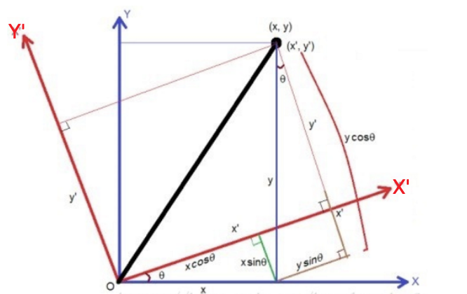

假设图像逆时针旋转了θ角，则根据坐标转换可得：

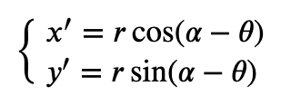

其中有：

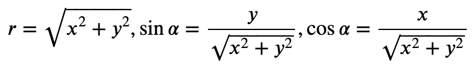

将其带入上面的公式中可得：

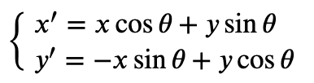

用旋转矩阵来表示为：

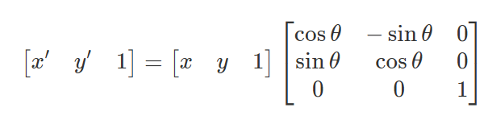

也就是说，**相对于原来的那个坐标系而言，原本为(x, y)的坐标将变为(x', y')，这样就得到了坐标**。

除此之外我们还要修正原点的位置，因为原图像中的坐标原点在图像的左上角，经过旋转后图像的大小会有所变化，原点也需要修正。

假设在旋转的时候是以旋转中心为坐标原点的，旋转结束后还需要将坐标原点移到图像左上角，也就是还要进行一次变换。

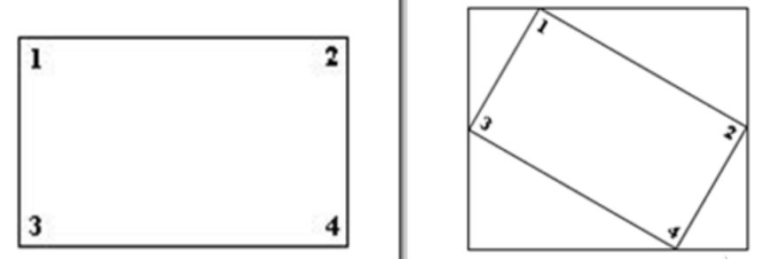

即在原有的矩阵变换的基础上还需要再次进行一次矩阵变换：

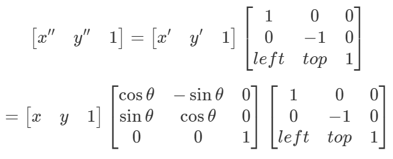

---


### 2.API介绍

- **思想：**
  - **在OpenCV中图像旋转首先根据旋转角度和旋转中心获取旋转矩阵；**
  - **然后根据旋转矩阵进行变换，即可实现任意角度和任意中心的旋转效果；**
- **API：**

```python
cv2.getRotationMatrix2D(center, angle, scale)
```

- **参数：**
  - center：旋转中心；
  - angle：旋转角度；
  - scale：缩放比例；
- **返回：**
  - M：旋转矩阵；
  - 需要再调用cv.warpAffine完成图像的旋转；


### 3.上机实验

```python
# 图像旋转的示例代码

import numpy as np
import cv2 as cv
import matplotlib.pyplot as plt

# 设置字体为微软雅黑
plt.rcParams['font.family'] = 'Microsoft YaHei'
plt.rcParams['axes.unicode_minus'] = False

# 1 读取图像
img = cv.imread("images/Chapter3/kid.jpg")

# 2 图像旋转
rows,cols = img.shape[:2]
# 2.1 生成旋转矩阵
M = cv.getRotationMatrix2D((cols/2,rows/2),90,1)
# 2.2 进行旋转变换
dst = cv.warpAffine(img,M,(cols,rows))

# 3 图像展示
fig,axes=plt.subplots(nrows=1,ncols=2,figsize=(10,8),dpi=100)
axes[0].imshow(img[:,:,::-1])
axes[0].set_title("原图")
axes[1].imshow(dst[:,:,::-1])
axes[1].set_title("旋转后结果")
plt.show()

```

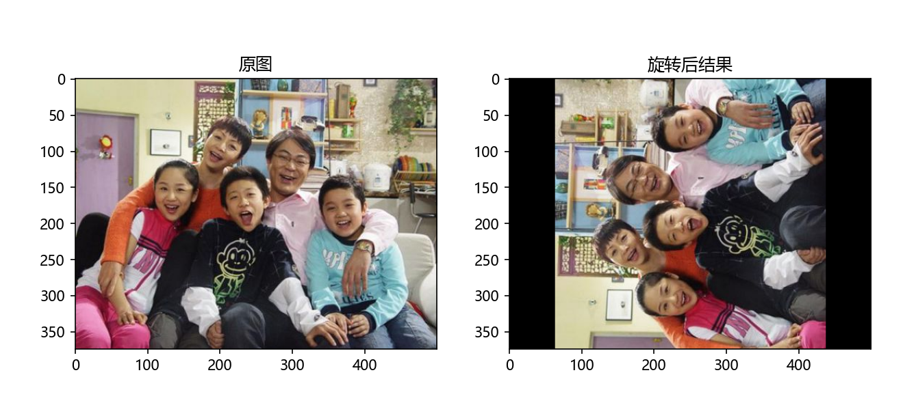


## 第十五节课：3-1_图像的仿射变换

### 1.内容介绍

- 图像的仿射变换涉及到图像的**形状位置角度**的变化，是对图像的缩放，旋转，翻转和平移等操作的组合；
- **原理介绍：**
  - 图1中的点1，2和3与图二中三个点一一映射，仍然形成三角形，但形状已经大大改变；
  - **通过两组三点求出仿射变换**， 就能把仿射变换应用到图像中所有的点中，完成图像的仿射变换；

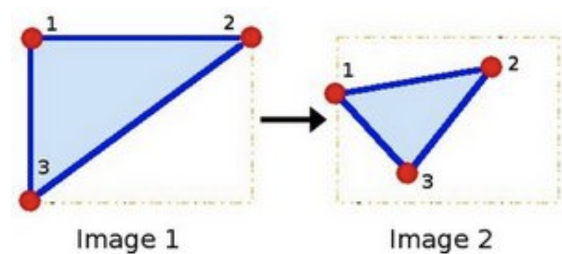

- **OpenCV中的原理做法**

  - 在OpenCV中，仿射变换的矩阵是一个**2×3的矩阵**：

  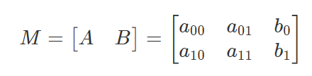

  - 其中左边的2×2子矩阵A是线性变换矩阵，右边的2×1子矩阵B是平移项：

  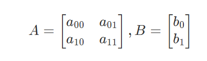

  - 对于图像上的任一位置(x,y)，仿射变换执行的是如下的操作：

  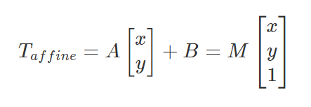

  - 对于图像，宽度方向是x，高度方向是y，坐标的顺序和图像像素对应下标一致。所以原点的位置是左上角，y的方向是向下；
  - **基本思想总结：**
    - 在仿射变换中，原图中所有的平行线在结果图像中同样平行；
    - 为了创建这个矩阵我们需要从原图像中**找到三个点以及他们在输出图像中的位置**；
    - 然后**cv2.getAffineTransform**会创建一个 2x3 的矩阵，最后这个矩阵会被传给函数**cv2.warpAffine；**


### 2.API介绍

- 获取变换矩阵：

  ````python
  cv2.getAffineTransform()
  ````

  - 传入变换前的三个点坐标和变换后的三个点坐标即可得到仿射变换矩阵；

- 进行仿射变换：

  ```python
  cv2.warpAffine()
  ```

  - 仍是是将变换矩阵传递给平移函数，然后得到效果；


### 3.上机实验

```python
# 图像的仿射变换的示例代码

import numpy as np
import cv2 as cv
import matplotlib.pyplot as plt

# 设置字体为微软雅黑
plt.rcParams['font.family'] = 'Microsoft YaHei'
plt.rcParams['axes.unicode_minus'] = False

# 1 图像读取
img = cv.imread("images/Chapter3/kid.jpg")

# 2 仿射变换
rows,cols = img.shape[:2]
# 2.1 创建变换矩阵
pts1 = np.float32([[50,50],[200,50],[50,200]])
pts2 = np.float32([[100,100],[200,50],[100,250]])
M = cv.getAffineTransform(pts1,pts2)
# 2.2 完成仿射变换
dst = cv.warpAffine(img,M,(cols,rows))

# 3 图像显示
fig,axes=plt.subplots(nrows=1,ncols=2,figsize=(10,8),dpi=100)
axes[0].imshow(img[:,:,::-1])
axes[0].set_title("原图")
axes[1].imshow(dst[:,:,::-1])
axes[1].set_title("仿射后结果")
plt.show()

```

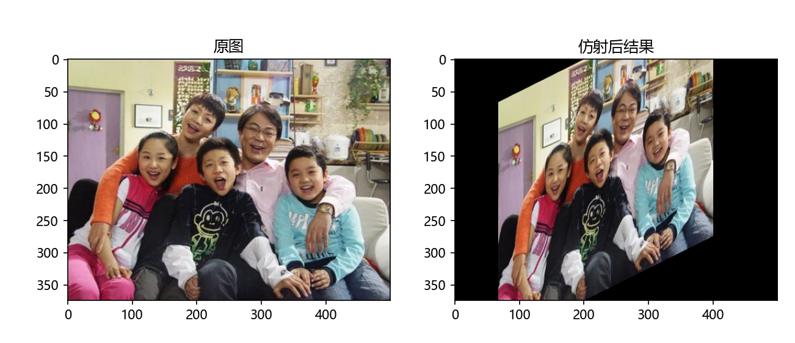


## 第十六节课：3-1_图像的透射变换

### 1.内容介绍

- **定义：**

  - 透射变换是视角变化的结果；
  - 利用透视中心、像点、目标点三点共线的条件；

  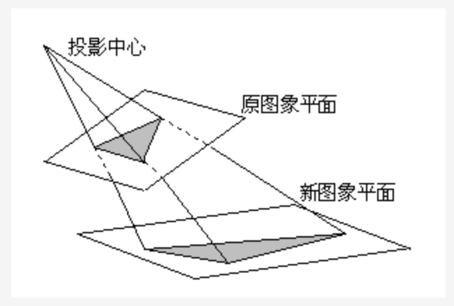

- **OpenCv中的原理作用：**

  - 它的本质将图像投影到一个新的视平面，其通用变换公式为：

  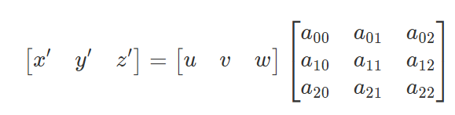

  - 其中，(u,v)是原始的图像像素坐标，w取值为1；
  - (x=x'/z',y=y'/z')是透射变换后的结果；
  - 后面的矩阵称为透视变换矩阵，一般情况下，我们将其分为三部分：

  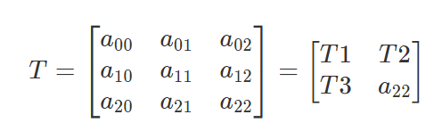

  - T1表示对图像进行线性变换，T2对图像进行平移，T3表示对图像进行投射变换，最后一个数一般设为1；
  - **基本思想总结：**
    - 在opencv中，我们要找到四个点，其中任意三个不共线，然后获取变换矩阵T，再进行透射变换；
    - 通过函数**cv.getPerspectiveTransform()**找到变换矩阵；
    - 将**cv.warpPerspective()**应用于此3x3变换矩阵；


### 2.API介绍

- 获取变换矩阵：

  ````python
  cv.getPerspectiveTransform()
  ````

  - 传入变换前的四个点坐标和变换后的四个点坐标即可得到仿射变换矩阵；

- 进行仿射变换：

  ```python
  cv.warpPerspective()
  ```

  - 仍是是将变换矩阵传递给函数，然后得到效果；


### 3.上机实验

```python
# 图像的透射 变换的示例代码

import numpy as np
import cv2 as cv
import matplotlib.pyplot as plt

# 设置字体为微软雅黑
plt.rcParams['font.family'] = 'Microsoft YaHei'
plt.rcParams['axes.unicode_minus'] = False

# 1 读取图像
img = cv.imread("images/Chapter3/kid.jpg")

# 2 透射变换
rows,cols = img.shape[:2]
# 2.1 创建变换矩阵
pts1 = np.float32([[56,65],[368,52],[28,387],[389,390]])
pts2 = np.float32([[100,145],[300,100],[80,290],[310,300]])

T = cv.getPerspectiveTransform(pts1,pts2)
# 2.2 进行变换
dst = cv.warpPerspective(img,T,(cols,rows))

# 3 图像显示
fig,axes=plt.subplots(nrows=1,ncols=2,figsize=(10,8),dpi=100)
axes[0].imshow(img[:,:,::-1])
axes[0].set_title("原图")
axes[1].imshow(dst[:,:,::-1])
axes[1].set_title("透射后结果")
plt.show()
```

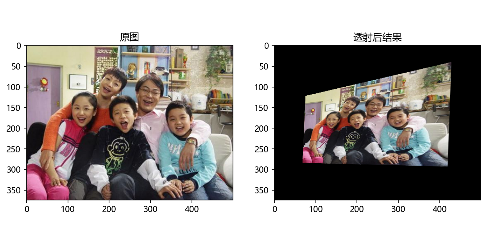


## 第十七节课：3-1_图像金字塔

### 1.内容介绍

- 图像金字塔是图像多尺度表达的一种，主要用于图像的分割，是一种以多分辨率来解释图像的有效但概念简单的结构；
- 一幅图像的金字塔是一系列以金字塔形状排列的分辨率逐步降低，且来源于同一张原始图的图像集合；
- 其通过梯次向下采样获得，直到达到某个终止条件才停止采样；

- **金字塔的底部是待处理图像的高分辨率表示，而顶部是低分辨率的近似，层级越高，图像越小，分辨率越低；**

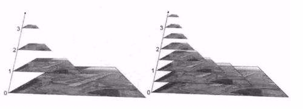


### 2.API介绍

```python
cv.pyrUp(img)		# 对图像进行上采样
cv.pyrDown(img)		# 对图像进行下采样
```


### 3.上机实验

```python
import numpy as np
import cv2 as cv
import matplotlib.pyplot as plt

# 1 图像读取
img = cv.imread("./image/image2.jpg")

# 2 进行图像采样
up_img = cv.pyrUp(img)  # 上采样操作
img_1 = cv.pyrDown(img)  # 下采样操作

# 3 图像显示
cv.imshow('enlarge', up_img)
cv.imshow('original', img)
cv.imshow('shrink', img_1)
cv.waitKey(0)
cv.destroyAllWindows()
```

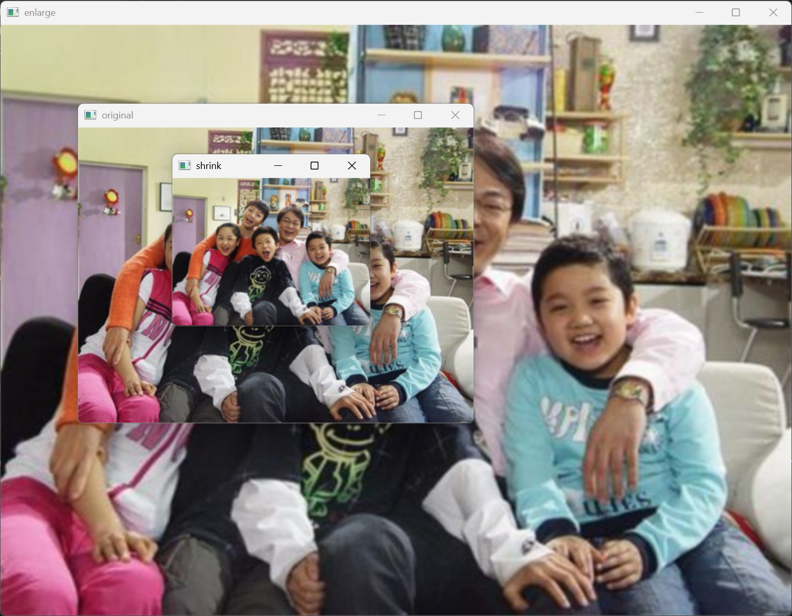


## 第十八节课：3-1_几何变换总结

- 图像缩放：对图像进行放大或缩小
  - **cv.resize()**

- 图像平移：
  - 指定平移矩阵后，调用**cv.warpAffine()**平移图像

- 图像旋转：
  - 调用**cv.getRotationMatrix2D()**获取旋转矩阵，然后调用**cv.warpAffine()**进行旋转

- 仿射变换：
  - 调用**cv.getAffineTransform()**将创建变换矩阵，最后该矩阵将传递给**cv.warpAffine()**进行变换

- 透射变换：
  - 通过函数**cv.getPerspectiveTransform()**找到变换矩阵，将**cv.warpPerspective()**进行投射变换

- 金字塔
  - 图像金字塔是图像多尺度表达的一种，使用的API：
    - **cv.pyrUp()**：向上采样
    - **cv.pyrDown()**：向下采样


## 第十九节课：3-2_连通性

### 1.邻接

- 图像中，最小的单位是像素，每个像素周围有8个邻接像素，常见的邻接关系有3种：
  - **4邻接**：像素p(x,y)的4邻域是：(x+1,y)；(x-1,y)；(x,y+1)；(x,y-1)，用*N*4(*p*)表示像素p的4邻接；
  - **D邻接**：像素p(x,y)的D邻域是：对角上的点 (x+1,y+1)；(x+1,y-1)；(x-1,y+1)；(x-1,y-1)，用*ND(p)*表示像素p的D邻域；
  - **8邻接**：像素p(x,y)的8邻域是： 4邻域的点＋D邻域的点，用*N*8(*p*)表示像素p的8邻域；

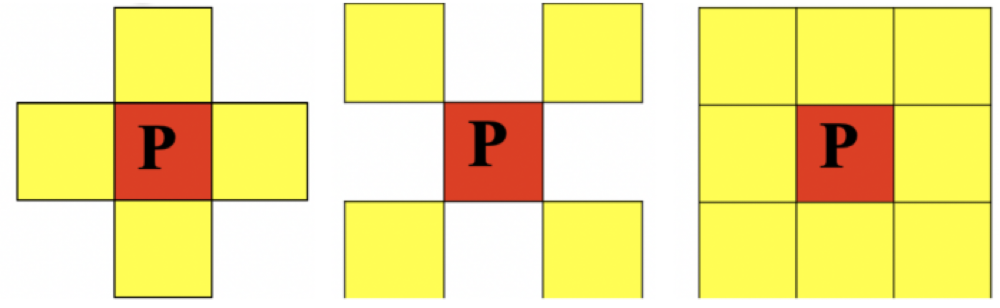


### 2.连通性

- **连通性**是描述区域和边界的重要概念，两个像素连通的两个必要条件是：

  - 两个像素的位置是否相邻；
  - **两个像素的灰度值是否满足特定的相似性准则或者是否相等**；

- 根据连通性的定义，有4联通、8联通和m联通三种：

  - **4连通**：对于具有值*V*的像素*p*和*q*，如果*q*在集合*N*4(*p*)中，则称这两个像素是4连通；
  - **8连通**：对于具有值*V*的像素*p*和*q*，如果*q*在集合*N*8(*p*)中，则称这两个像素是8连通；

  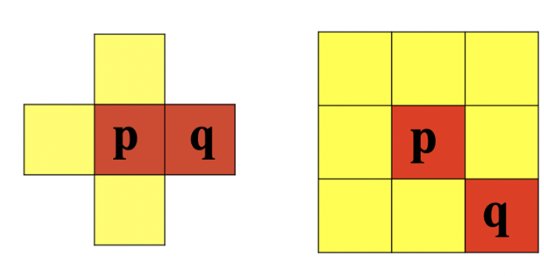

  - **m连通**：对于具有值*V*的像素*p*和*q*，如果：

    - *q*在集合*N*4(*p*)中，或
    - *q*在集合*N**D*(*p*)中，并且***N*4(*p*)与*N*4(*q*)的交集没有值*V*的像素**；
    - 则称这两个像素是*m*连通的，即4连通和D连通的混合连通；

    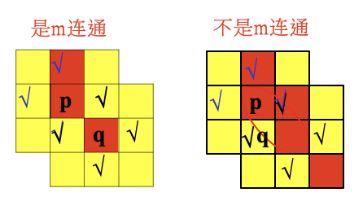


## 第二十节课：3-2_膨胀与腐蚀

### 1.内容介绍

- **膨胀**

  - 膨胀是使图像中高亮部分扩张，效果图拥有比原图更大的高亮区域，本质是求局部最大值的操作；

  - 用一个结构元素扫描图像中的每一个像素，用结构元素中的每一个像素与其覆盖的像素做“与”操作，如果都为0，则该像素为0，否则为1；
  - **膨胀的作用是将与物体接触的所有背景点合并到物体中，使目标增大，可添补目标中的孔洞**；

  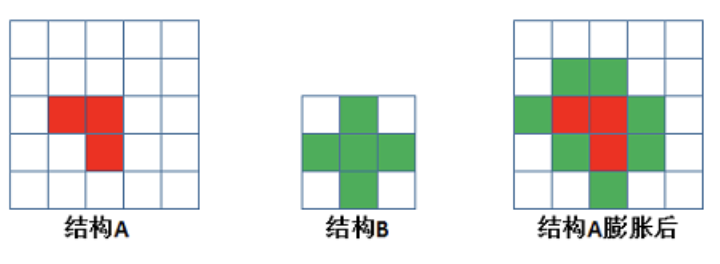

  - **API：**

    - img：要处理的图像
    - kernel：核结构
    - iterations：膨胀的次数，默认是1

    ```python
    cv.dilate(img,kernel,iterations)
    ```

- **腐蚀**

  - 腐蚀是原图中的高亮区域被蚕食，效果图拥有比原图更小的高亮区域，腐蚀是求局部最小值的操作；
  - 用一个结构元素扫描图像中的每一个像素，用结构元素中的每一个像素与其覆盖的像素做“与”操作，如果都为1，则该像素为1，否则为0；
  - **腐蚀的作用是消除物体边界点，使目标缩小，可以消除小于结构元素的噪声点**；

  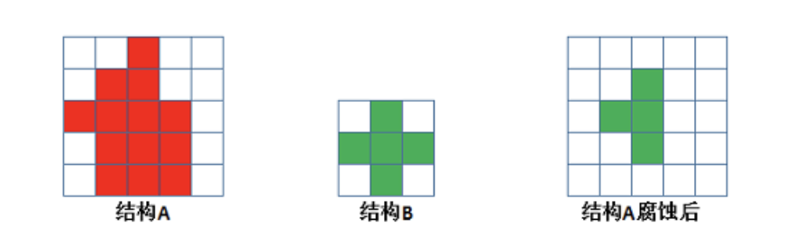

  - **API：**

    - img：要处理的图像
    - kernel：核结构
    - iterations：腐蚀的次数，默认是1

    ```python
    cv.erode(img,kernel,iterations)
    ```

  

### 2.上机实验

```python
# 腐蚀与膨胀示例代码

import numpy as np
import cv2 as cv
import matplotlib.pyplot as plt

# 设置字体为微软雅黑
plt.rcParams['font.family'] = 'Microsoft YaHei'
plt.rcParams['axes.unicode_minus'] = False

# 1 读取图像
img = cv.imread("images/Chapter3/letter.png")

# 2 创建核结构
kernel = np.ones((5, 5), np.uint8)

# 3 图像腐蚀和膨胀
erosion = cv.erode(img, kernel) # 腐蚀
dilate = cv.dilate(img,kernel) # 膨胀

# 4 图像展示
fig,axes=plt.subplots(nrows=1,ncols=3,figsize=(10,8),dpi=100)
axes[0].imshow(img)
axes[0].set_title("原图")
axes[1].imshow(erosion)
axes[1].set_title("腐蚀后结果")
axes[2].imshow(dilate)
axes[2].set_title("膨胀后结果")
plt.show()

```

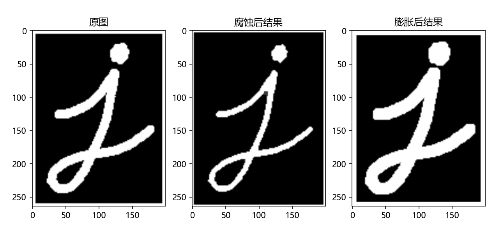


## 第二十一节课：3-2_开闭运算

### 1.总括

- 开运算和闭运算是将腐蚀和膨胀按照一定的次序进行处理；
- 这两者并不是可逆的，即先开后闭并不能得到原来的图像；


### 2.开运算

- 开运算是**先腐蚀后膨胀**；
- 作用：分离物体，消除小区域；
- 特点：消除噪点，去除小的干扰块，而不影响原来的图像；

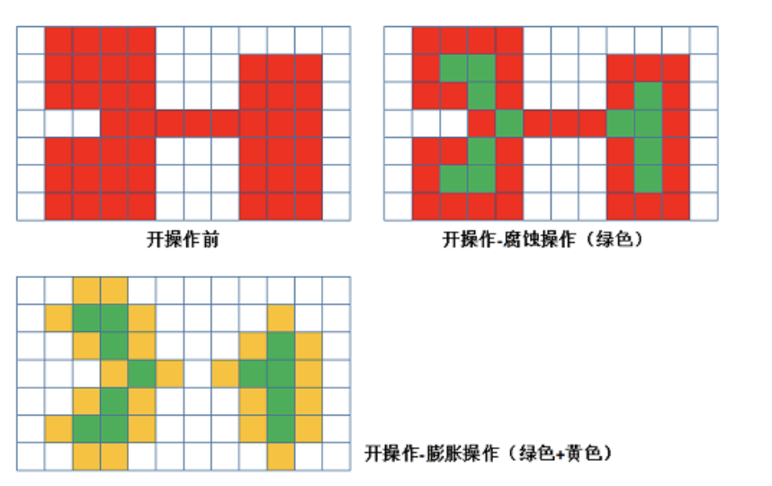


### 3.闭运算

- 闭运算与开运算相反，是**先膨胀后腐蚀**；
- 作用：消除/闭合物体里面的孔洞；
- 特点：可以填充闭合区域；

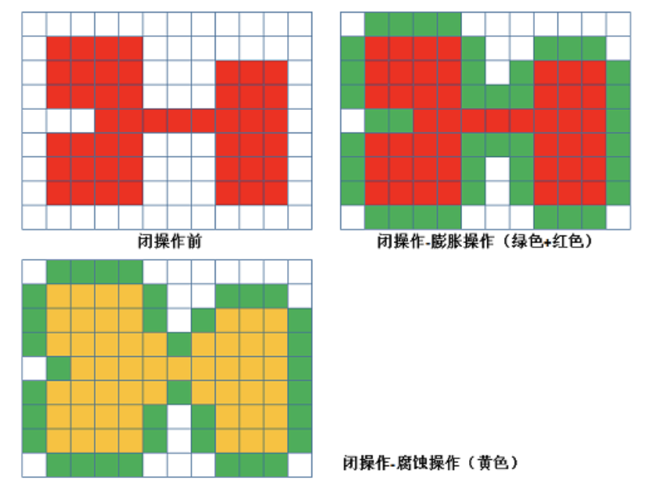


### 4.上机实验

- **API：**

```python
cv.morphologyEx(img, op, kernel)
```

- **参数：**
  - img：要处理的图像；
  - op：处理方式
    - 若进行开运算，则设为cv.MORPH_OPEN；
    - 若进行闭运算，则设为cv.MORPH_CLOSE；
  - Kernel：核结构；
- **示例代码：**

```python
# 开闭运算的示例代码

import numpy as np
import cv2 as cv
import matplotlib.pyplot as plt

# 设置字体为微软雅黑
plt.rcParams['font.family'] = 'Microsoft YaHei'
plt.rcParams['axes.unicode_minus'] = False

# 1 读取图像
img1 = cv.imread("images/Chapter3/letteropen.png")
img2 = cv.imread("images/Chapter3/letterclose.png")

# 2 创建核结构
kernel = np.ones((10, 10), np.uint8)

# 3 图像的开闭运算
cvOpen = cv.morphologyEx(img1,cv.MORPH_OPEN,kernel)     # 开运算
cvClose = cv.morphologyEx(img2,cv.MORPH_CLOSE,kernel)   # 闭运算

# 4 图像展示
fig,axes=plt.subplots(nrows=2,ncols=2,figsize=(10,8))
axes[0,0].imshow(img1)
axes[0,0].set_title("原图")
axes[0,1].imshow(cvOpen)
axes[0,1].set_title("开运算结果")
axes[1,0].imshow(img2)
axes[1,0].set_title("原图")
axes[1,1].imshow(cvClose)
axes[1,1].set_title("闭运算结果")
plt.show()

```

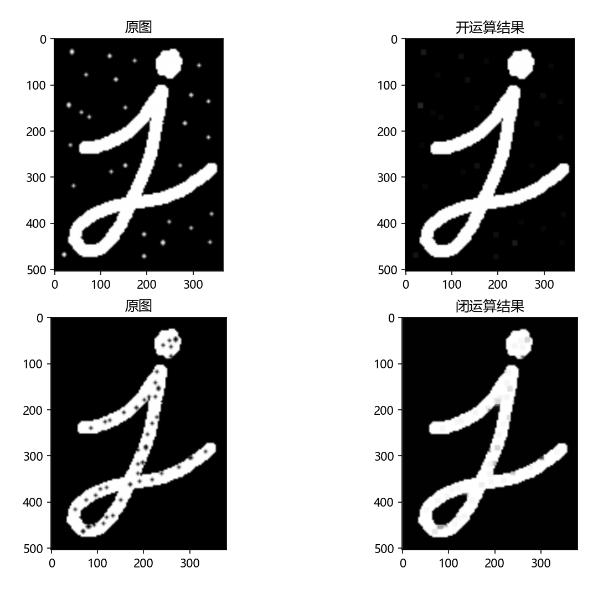


## 第二十二节课：3-2_黑帽与礼帽

### 1.礼帽运算

- 原图像与“开运算“的结果图之差，如下式计算：

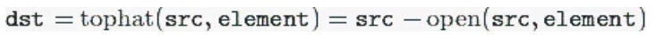

- 因为开运算带来的结果是放大了裂缝或者局部低亮度的区域，因此，从原图中减去开运算后的图，得到的效果图突出了比原图轮廓周围的区域更明亮的区域，且这一操作和选择的核的大小相关；
- 礼帽运算用来分离比邻近点亮一些的斑块。当一幅图像具有大幅的背景的时候，而微小物品比较有规律的情况下，可以使用顶帽运算进行背景提取；


### 2.黑帽运算

- 为”闭运算“的结果图与原图像之差。数学表达式为：

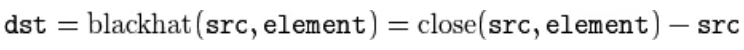

- 黑帽运算后的效果图突出了比原图轮廓周围的区域更暗的区域，且这一操作和选择的核的大小相关；
- 黑帽运算用来分离比邻近点暗一些的斑块；


### 3.API

- 由前面的概念可以知道，礼帽和黑帽本质上是在**提取背景**；

- **API：**

```python
cv.morphologyEx(img, op, kernel)
```

- **参数：**

  - img：要处理的图像；
  - op：处理方式：

  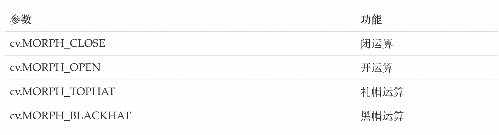

  - Kernel：核结构；

- **示例代码：**

```python
# 黑帽礼帽示例代码

import numpy as np
import cv2 as cv
import matplotlib.pyplot as plt

# 设置字体为微软雅黑
plt.rcParams['font.family'] = 'Microsoft YaHei'
plt.rcParams['axes.unicode_minus'] = False

# 1 读取图像
img1 = cv.imread("images/Chapter3/letteropen.png")
img2 = cv.imread("images/Chapter3/letterclose.png")

# 2 创建核结构
kernel = np.ones((10, 10), np.uint8)

# 3 图像的礼帽和黑帽运算
cvOpen = cv.morphologyEx(img1,cv.MORPH_TOPHAT,kernel)       # 礼帽运算
cvClose = cv.morphologyEx(img2,cv.MORPH_BLACKHAT,kernel)    # 黑帽运算

# 4 图像显示
fig,axes=plt.subplots(nrows=2,ncols=2,figsize=(10,8))
axes[0,0].imshow(img1)
axes[0,0].set_title("原图")
axes[0,1].imshow(cvOpen)
axes[0,1].set_title("礼帽运算结果")
axes[1,0].imshow(img2)
axes[1,0].set_title("原图")
axes[1,1].imshow(cvClose)
axes[1,1].set_title("黑帽运算结果")
plt.show()

```

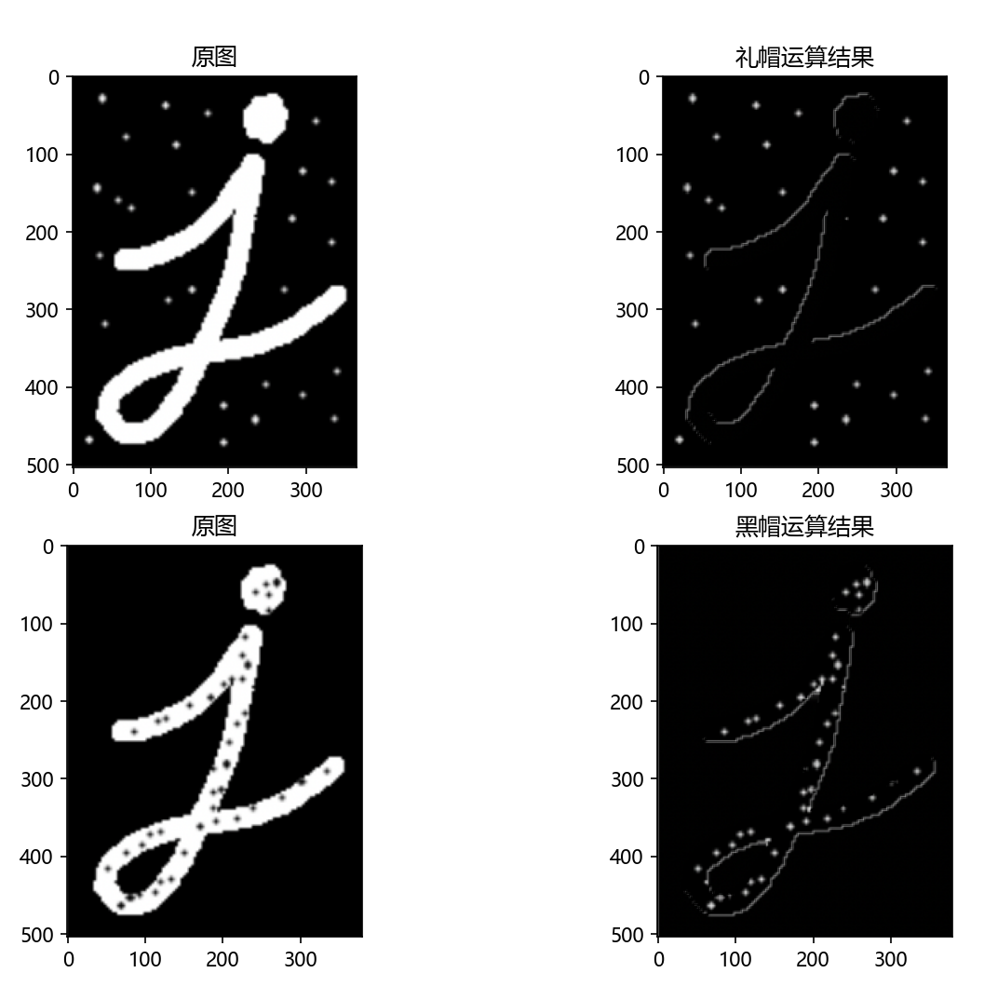


## 第二十三节课：3-2_形态学操作总结

### 1.**连通性**

- 邻接关系：4邻接，8邻接和D邻接；
- 连通性：4连通，8连通和m连通；


### 2.**形态学操作**

- **腐蚀和膨胀：**
  - 腐蚀：求局部最小值；
  - 膨胀：求局部最大值；
- **开闭运算：**
  - 开：先腐蚀后膨胀；
  - 闭：先膨胀后腐蚀；
- **礼帽和黑帽：**
  - 礼帽：原图像与开运算之差；
  - 黑帽：闭运算与原图像之差；


## 第二十四节课：3-3_图像噪声

### 1.椒盐噪声

- 椒盐噪声也称为脉冲噪声，是图像中经常见到的一种噪声；
- 它是一种随机出现的白点或者黑点，亮的区域有黑色像素或是在暗的区域有白色像素或是两者皆有；
- 椒盐噪声的成因可能是影像讯号受到突如其来的强烈干扰而产生、类比数位转换器或位元传输错误等；
- 例如失效的感应器导致像素值为最小值，饱和的感应器导致像素值为最大值；

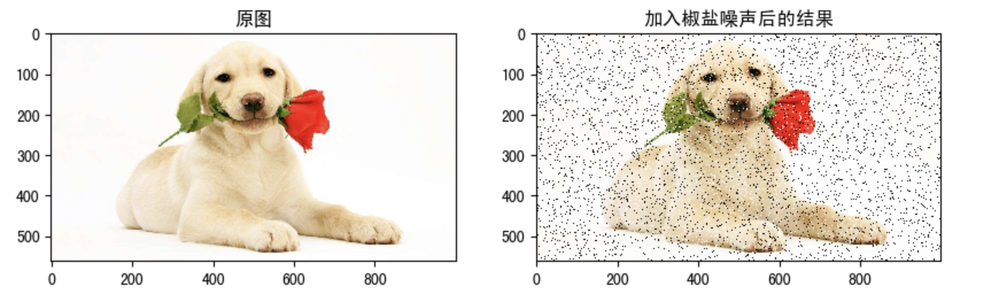


### 2.高斯噪声

- 高斯噪声是指噪声密度函数服从高斯分布的一类噪声；
- 由于高斯噪声在空间和频域中数学上的易处理性，这种噪声(也称为正态噪声)模型经常被用于实践中；
- 高斯随机变量z的概率密度函数由下式给出：
  - 其中z表示灰度值，μ表示z的平均值或期望值，σ表示z的标准差，标准差的平方称为z的方差；

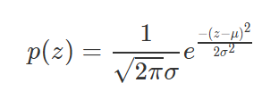

- 高斯函数的曲线如图所示：

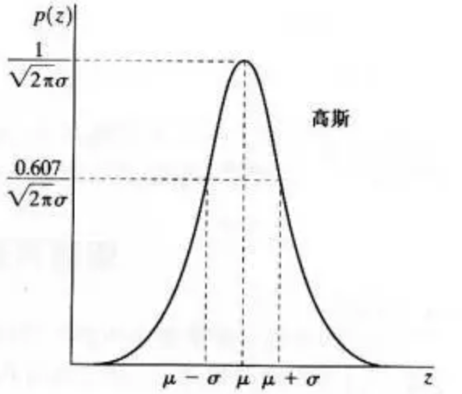

- 带有高斯噪声的图片如图所示：

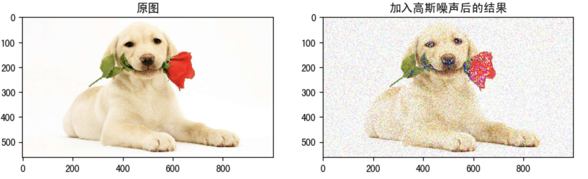


## 第二十五节课：3-3_均值滤波

### 1.图像平滑介绍

- 图像平滑从信号处理的角度看就是**去除其中的高频信息，保留低频信息**；
- 因此我们可以对图像实施**低通滤波，低通滤波可以去除图像中的噪声，对图像进行平滑**；

- 根据滤波器的不同可分为：
  - **均值滤波；**
  - **高斯滤波；**
  - **中值滤波； **
  - **双边滤波；**


### 2.均值滤波

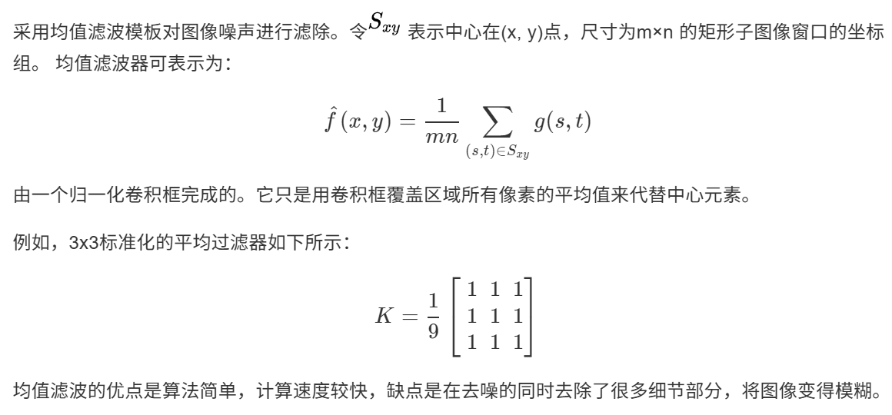


### 3.均值滤波API

- **API：**

```
cv.blur(src, ksize, anchor, borderType)
```

- **参数：**
  - src：输入图像；
  - ksize：卷积核的大小；
  - anchor：默认值 (-1,-1) ，表示核中心；
  - borderType：边界类型；


### 4.均值滤波上机实验

```python
# 均值滤波示例代码

import cv2 as cv
import numpy as np
from matplotlib import pyplot as plt

# 设置字体为微软雅黑
plt.rcParams['font.family'] = 'Microsoft YaHei'
plt.rcParams['axes.unicode_minus'] = False

# 1 图像读取
img1 = cv.imread('images/Chapter3/dogsp.jpeg')
img2 = cv.imread('images/Chapter3/dogGauss.jpeg')

# 2 均值滤波
blur1 = cv.blur(img1,(5,5))
blur2 = cv.blur(img2,(5,5))

# 3 图像显示
fig,axes=plt.subplots(nrows=2,ncols=2,figsize=(10,8))
axes[0,0].imshow(img1[:,:,::-1])
axes[0,0].set_title("椒盐狗原图")
axes[0,1].imshow(blur1[:,:,::-1])
axes[0,1].set_title("均值滤波椒盐狗")
axes[1,0].imshow(img2[:,:,::-1])
axes[1,0].set_title("高斯狗原图")
axes[1,1].imshow(blur2[:,:,::-1])
axes[1,1].set_title("均值滤波高斯狗")
plt.show()

```

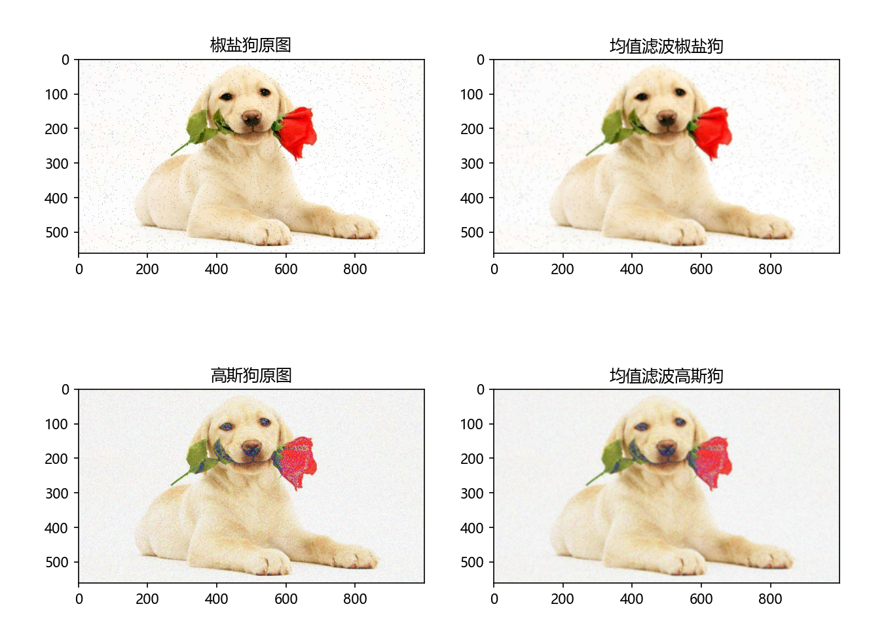


## 第二十六节课：3-3_高斯滤波

### 1.高斯滤波简介

#### 1.1 高斯分布的介绍

- 对于图像而言，其为二维的矩阵形式，所以常常用二维高斯对图形进行高斯滤波处理；
- 二维高斯的概率分布函数如下所示：

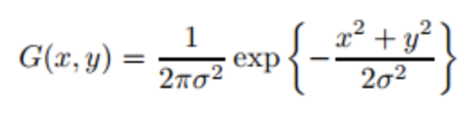

- 二维高斯在可视化上是一个突起的帽子的形状，其中σ可看成两个值，分别为x、y方向标准差：
  - 两个σ的取值越大，整个形状越平坦；两个σ的取值越小，整个形状越突起；

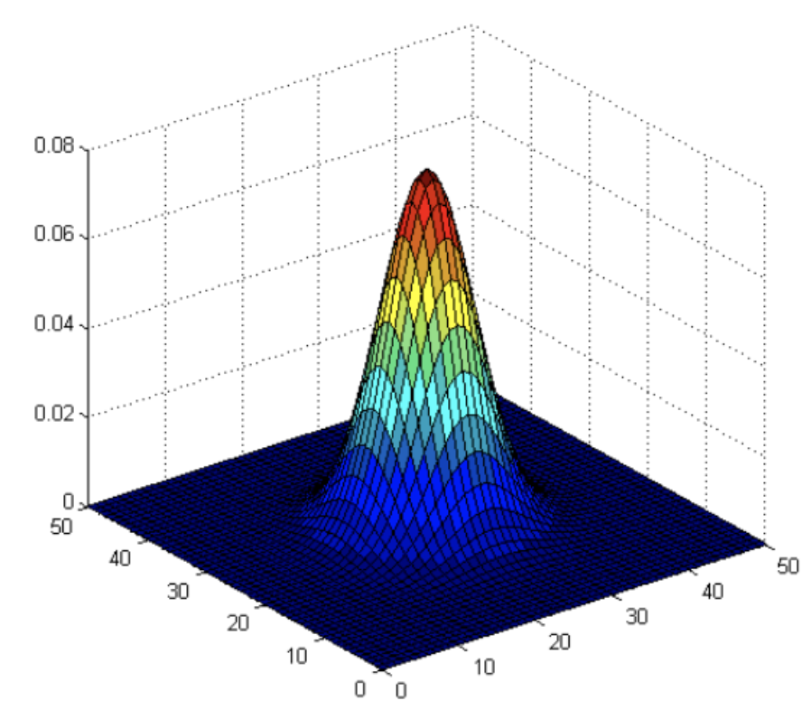

#### 1.2 高斯平滑介绍

- **高斯平滑的基本思想**

  - 正态分布是一种钟形曲线，越接近中心，取值越大，越远离中心，取值越小；
  - 计算结果时，将"中心点"作为原点，其他点按其在正态曲线上的位置分配权重，即可以得到平均值；
  - 与均值滤波的区别就是，高斯滤波对于不同像素点是有权重分配的；

- **高斯滤波的流程**

  - 首先确定权重矩阵的形状：假设取3×3矩阵，则矩阵形状如图所示

  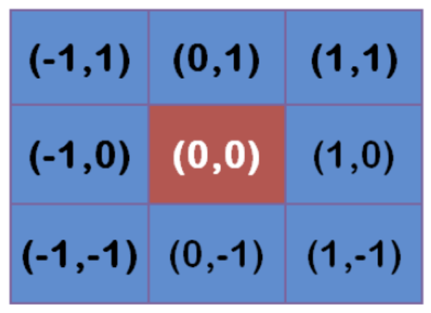

  - 确定权重矩阵的取值：指定两个σ的值，权重矩阵随之确定，这里取1.5

  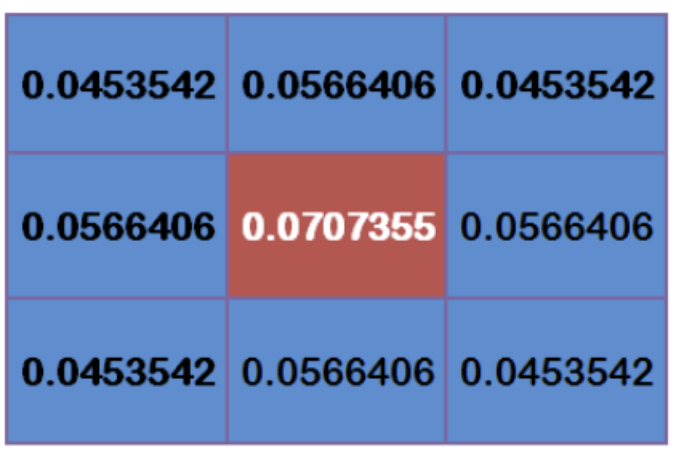

  - 归一化权重矩阵：由于指定σ后的权重矩阵不是归一化的，需要将其归一化

  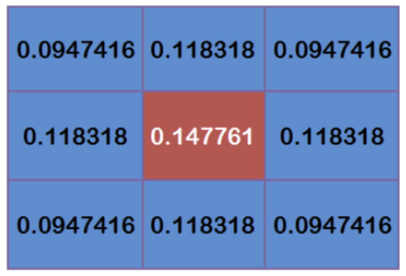

  - 获得原图像像素的取值：

  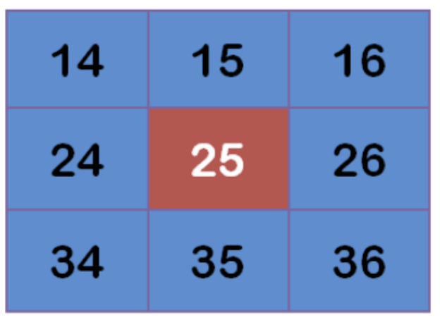

  - 进行高斯滤波：接着就可以进行高斯模糊了

  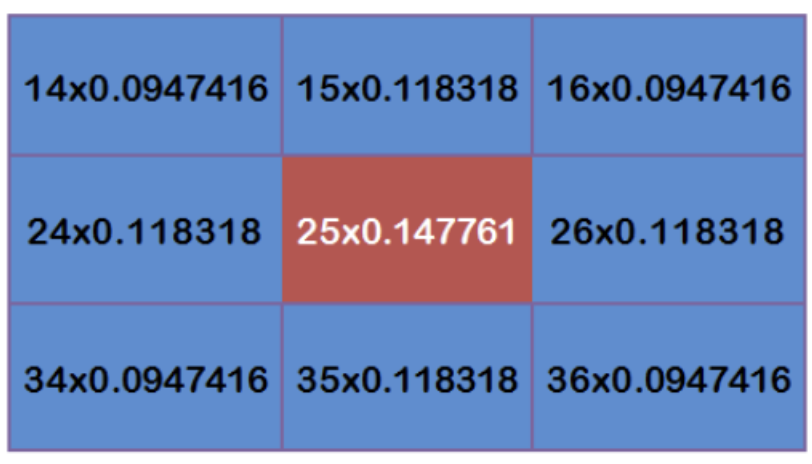

  - 得到高斯结果：

  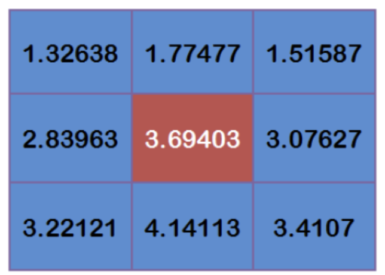

  - **最后将九个值加起来即为中心点的高斯模糊的值；**

#### 1.3 API介绍

- **API：**

```python
cv2.GaussianBlur(src,ksize,sigmaX,sigmay,borderType)
```

- **参数：**
  - src：输入图像；
  - ksize：高斯卷积核的大小，**注意** ： 卷积核的宽度和高度都应为奇数，且可以不同；
  - sigmaX：水平方向的标准差；
  - sigmaY：垂直方向的标准差，默认值为0，表示与sigmaX相同；
  - borderType：填充边界类型；


### 2.上级实验

```python
# 高斯滤波示例代码

import cv2 as cv
import numpy as np
from matplotlib import pyplot as plt

# 设置字体为微软雅黑
plt.rcParams['font.family'] = 'Microsoft YaHei'
plt.rcParams['axes.unicode_minus'] = False

# 1 图像读取
img = cv.imread('images/Chapter3/dogGauss.jpeg')

# 2 高斯滤波
blur = cv.GaussianBlur(img,(3,3),1)

# 3 图像显示
plt.figure(figsize=(10,8),dpi=100)
plt.subplot(121),plt.imshow(img[:,:,::-1]),plt.title('原图')
plt.xticks([]), plt.yticks([])
plt.subplot(122),plt.imshow(blur[:,:,::-1]),plt.title('高斯滤波后结果')
plt.xticks([]), plt.yticks([])
plt.show()

```

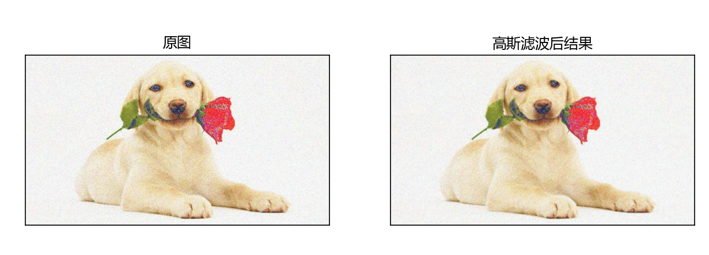


## 第二十七节课：3-3_中值滤波

### 1.中值滤波介绍

- 中值滤波是一种典型的**非线性滤波技术**，基本思想是用像素点邻域灰度值的中值来代替该像素点的灰度值；

- 中值滤波对**椒盐噪声**来说尤其有用，因为它不依赖于邻域内那些与典型值差别很大的值；


### 2.API介绍

- API：

```python
cv.medianBlur(src, ksize)
```

- 参数：
  - src：输入图像；
  - ksize：卷积核的大小；


### 3.上机实验

```python
# 中值滤波示例代码

import cv2 as cv
import numpy as np
from matplotlib import pyplot as plt

# 设置字体为微软雅黑
plt.rcParams['font.family'] = 'Microsoft YaHei'
plt.rcParams['axes.unicode_minus'] = False

# 1 图像读取
img = cv.imread('images/Chapter3/dogsp.jpeg')

# 2 中值滤波
blur = cv.medianBlur(img,5)

# 3 图像展示
plt.figure(figsize=(10,8),dpi=100)
plt.subplot(121),plt.imshow(img[:,:,::-1]),plt.title('原图')
plt.xticks([]), plt.yticks([])
plt.subplot(122),plt.imshow(blur[:,:,::-1]),plt.title('中值滤波后结果')
plt.xticks([]), plt.yticks([])
plt.show()

```

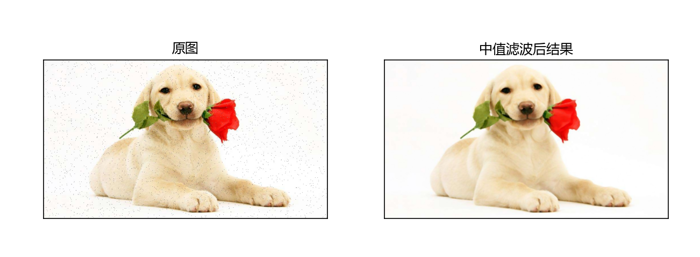


## 第二十八节课：3-3_图像平滑总结

### 1.图像噪声的介绍

- 椒盐噪声：图像中随机出现的白点或者黑点；
- 高斯噪声：噪声的概率密度分布是正态分布；


### 2.图像平滑操作

- **均值滤波**

  - 算法简单，计算速度快；
  - 但是在去噪的同时去除了很多细节部分，将图像变得模糊；
  - **API：cv.blur()；**

- **高斯滤波**

  - 去除高斯噪声；

  - **API：cv.GaussianBlur()；**

- **中值滤波**

  - 去除椒盐噪声；

  - **API：cv.medianBlur()；**


## 第二十九节课：3-4_直方图的原理与显示

### 1.直方图的原理

- **直方图的形成：**
  - 图像直方图用以表示数字图像中亮度分布，标绘了图像中每个亮度值的像素个数；
  - 这种直方图中，横坐标的左侧为较暗的区域，而右侧为较亮的区域；
  - 一张较暗图片的直方图中的数据多集中于左侧和中间部分，而整体明亮、只有少量阴影的图像则相反；

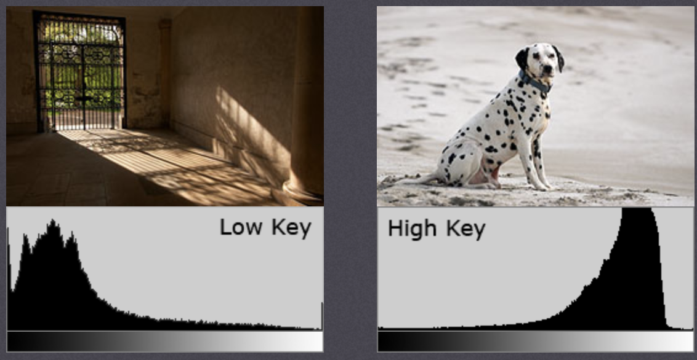

- **直方图的相关术语有：**
  - dims：需要统计的特征数目。在上例中，dims=1 ，因为仅仅统计了灰度值；
  - bins：每个特征空间子区段的数目，可译为 “直条” 或 “组距”，在上例中， bins = 16；
  - range：要统计特征的取值范围，在上例中，range = [0, 255]；

- **直方图的意义：**
  - 直方图是图像中像素强度分布的图形表达方式；
  - 它统计了每一个强度值所具有的像素个数；
  - 不同的图像的直方图可能是相同的；

- **彩色图像的直方图：**
  - 对于彩色图像而言，不能直接根据彩色图像绘制直方图，而是将其分离通道后进行直方图绘制；


### 2.直方图计算的API

我们使用OpenCV中的方法统计直方图，并使用matplotlib将其绘制出来。

- **API：**

```python
cv2.calcHist(images, channels, mask, histSize, ranges[,hist[,accumulate]])
```

- **参数（都要用中括号传进来）：**
  - **images：原图像**
    - 当传入函数时应该用中括号 [] 括起来，例如：[img]；
  - **channels：通道**
    - 如果输入图像是灰度图，它的值就是 [0]；
    - 如果是彩色图像的话，传入的参数可以是 [0]，[1]，[2] 它们分别对应着通道 B，G，R；
  - **mask：掩模图像**
    - 要统计整幅图像的直方图就把它设为 None；
    - 但是如果想统计图像某一部分的直方图的话，就需要制作一个掩模图像，并使用它；
  - **histSize：BIN 的数目**
    - 也应该用中括号括起来，例如：[256]；
  - **ranges：**
    - 像素值范围，通常为 [0，256]


### 3.上机实验

```python
# 直方图的示例代码

import numpy as np
import cv2 as cv
from matplotlib import pyplot as plt

# 设置字体为微软雅黑
plt.rcParams['font.family'] = 'Microsoft YaHei'
plt.rcParams['axes.unicode_minus'] = False

# 1 直接以灰度图的方式读入
img = cv.imread('images/Chapter3/cat.jpeg',0)

# 2 统计灰度图
histr = cv.calcHist([img],[0],None,[256],[0,256])

# 3 绘制灰度图
plt.figure(figsize=(10,6),dpi=100)
plt.plot(histr)
plt.grid()
plt.show()

```

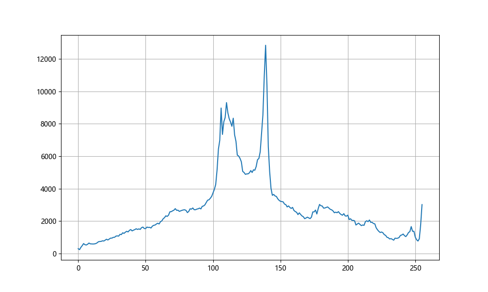


## 第三十节课：3-4_掩膜的运用

### 1.掩膜的介绍

- **掩膜的介绍：**
  - 在数字图像处理中，我们通常使用二维矩阵数组进行掩膜；
  - 掩膜是**由0和1组成一个二进制图像**，利用该掩膜图像对要处理的图像进行掩膜；
  - **其中1值的区域被处理，0 值区域被屏蔽，不会处理**；

- **掩膜的主要用途是：**
  - **提取感兴趣区域：**
    - 用预先制作的感兴趣区掩模与待处理图像进行”与“操作，得到感兴趣区图像；
    - 感兴趣区内图像值保持不变，而区外图像值都为0；
  - **屏蔽作用：**
    - 用掩模对图像上某些区域作屏蔽，使其不参加处理或不参加处理参数的计算；
    - 或仅对屏蔽区作处理或统计；
  - **结构特征提取：**
    - 用相似性变量或图像匹配方法检测和提取图像中与掩模相似的结构特征；
  - **特殊形状图像制作：**
    - 可以在原来的图像基础上制作出特殊的形状图像；

- **OpenCV中的掩膜：**
  - 使用cv.calcHist()来查找**完整图像的直方图**；
  -  如果要查找图像某些区域的直方图，只需**在要查找直方图的区域上创建一个白色的掩膜图像**；
  - 否则创建黑色， 然后将其作为掩码mask传递即可；


### 2.上机实验

```python
# 掩膜图像的示例代码

import numpy as np
import cv2 as cv
from matplotlib import pyplot as plt

# 设置字体为微软雅黑
plt.rcParams['font.family'] = 'Microsoft YaHei'
plt.rcParams['axes.unicode_minus'] = False

# 1. 直接以灰度图的方式读入
img = cv.imread('images/Chapter3/cat.jpeg',0)

# 2. 创建蒙版
mask = np.zeros(img.shape[:2], np.uint8)        # 创建全黑图像
mask[400:650, 200:500] = 255                    # 指定区域为1

# 3.掩模
masked_img = cv.bitwise_and(img,img,mask = mask)        # 进行与操作，得到特定区域的原图像

# 4. 统计掩膜后图像的灰度图
mask_histr = cv.calcHist([img],[0],mask,[256],[1,256])

# 5. 图像展示
fig,axes=plt.subplots(nrows=2,ncols=2,figsize=(10,8))
axes[0,0].imshow(img,cmap=plt.cm.gray)
axes[0,0].set_title("原图")
axes[0,1].imshow(mask,cmap=plt.cm.gray)
axes[0,1].set_title("蒙版数据")
axes[1,0].imshow(masked_img,cmap=plt.cm.gray)
axes[1,0].set_title("掩膜后数据")
axes[1,1].plot(mask_histr)
axes[1,1].grid()
axes[1,1].set_title("灰度直方图")
plt.show()

```

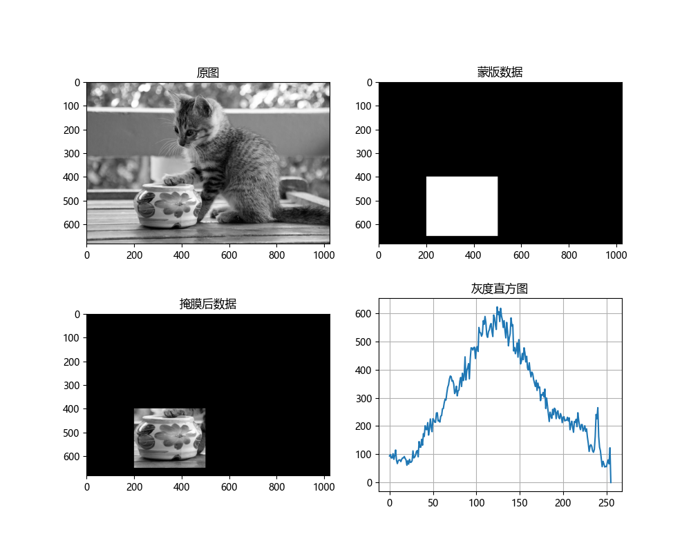


## 第三十一节课：3-4_直方图均衡化

### 1.原理与应用

- **直方图均衡化**把原始图像的灰度直方图从比较集中的某个灰度区间变成在更广泛灰度范围内的分布；
- 是对图像进行**非线性拉伸**，重新分配图像像素值，使一定灰度范围内的像素数量大致相同；

- 可以提高**图像整体的对比度**，特别是**有用数据的像素值分布比较接近时**；
- 在**曝光过度或不足的图像**中也可以更好的突出细节；

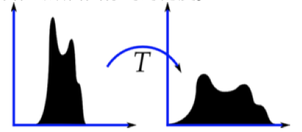


### 2.API介绍

- **API：**

```python
dst = cv.equalizeHist(img)
```

- **参数与返回：**
  - **参数：**
    - img：灰度图像；
  - **返回：**
    - dst：均衡化后的结果；


### 3.上机实验

```python
# 直方图均衡化的示例代码

import numpy as np
import cv2 as cv
from matplotlib import pyplot as plt

# 设置字体为微软雅黑
plt.rcParams['font.family'] = 'Microsoft YaHei'
plt.rcParams['axes.unicode_minus'] = False

# 1. 直接以灰度图的方式读入
img = cv.imread('images/Chapter3/cat.jpeg',0)

# 2. 均衡化处理
dst = cv.equalizeHist(img)

# 3. 结果展示
fig,axes=plt.subplots(nrows=1,ncols=2,figsize=(10,8),dpi=100)
axes[0].imshow(img,cmap=plt.cm.gray)
axes[0].set_title("原图")
axes[1].imshow(dst,cmap=plt.cm.gray)
axes[1].set_title("均衡化后结果")
plt.show()

```

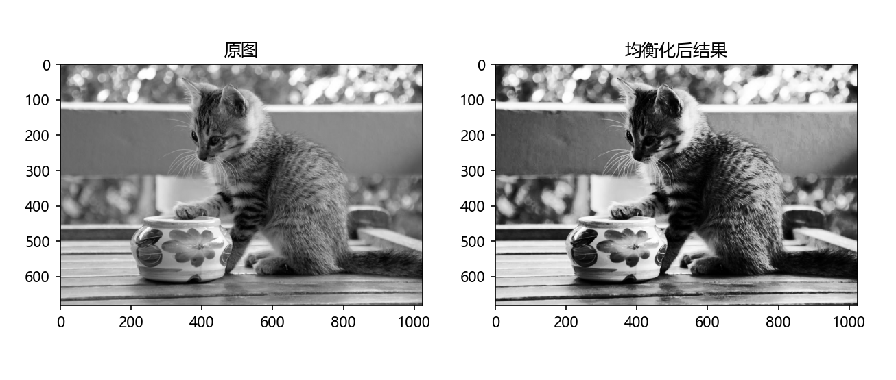


## 第三十二节课：3-4_自适应均衡化

### 1.自适应均衡化的介绍

- **均衡化的缺点：**

  - 上一节课的均衡化中，虽然提高了对比度，但猫腿部分损失了太多的细节，均衡化常常效果不好；

- **自适应均衡化：解决均衡化的缺点**

  -   整幅图像被分成很多小块，这些小块被称为**“tiles”（在 OpenCV 中 tiles 的 大小默认是 8x8）**；
  - 然后再对每一个小块分别进行直方图均衡化；
  -  在每一个区域中， 直方图会集中在某一个小的区域中，**如果有噪声的话，噪声会被放大**；
  - 对于每个小块来说，如果直方图中的bin超过对比度的上限的话，就把其中的像素点均匀分散到其他bins中，然后再进行直方图均衡化；
  - 最后，为了去除每一个小块之间的边界，再使用**双线性差值**，对每一小块进行拼接；

  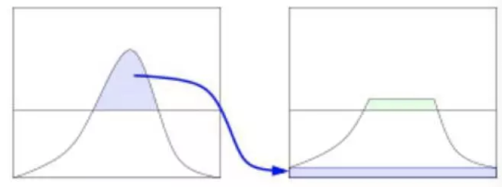

- **API介绍：**

  - **API：**

  ```python
  cv.createCLAHE(clipLimit, tileGridSize)
  ```

  - **参数：**
    - clipLimit：对比度限制，默认是40；
    - tileGridSize：分块的大小，默认为8∗8；
  - **注意：**
    - 这个API只是进行自适应均衡化对象的创建，还需要将该对象应用于图像；


### 2.上机实验

```python
# 自适应均衡化的示例代码

import numpy as np
import cv2 as cv
import matplotlib.pyplot as plt

# 设置字体为微软雅黑
plt.rcParams['font.family'] = 'Microsoft YaHei'
plt.rcParams['axes.unicode_minus'] = False

# 1. 以灰度图形式读取图像
img = cv.imread('images/Chapter3/cat.jpeg',0)

# 2. 创建一个自适应均衡化的对象，并应用于图像
clahe = cv.createCLAHE(clipLimit=2.0, tileGridSize=(8,8))
cl1 = clahe.apply(img)

# 3. 图像展示
fig,axes=plt.subplots(nrows=1,ncols=2,figsize=(10,8),dpi=100)
axes[0].imshow(img,cmap=plt.cm.gray)
axes[0].set_title("原图")
axes[1].imshow(cl1,cmap=plt.cm.gray)
axes[1].set_title("自适应均衡化后的结果")
plt.show()

```

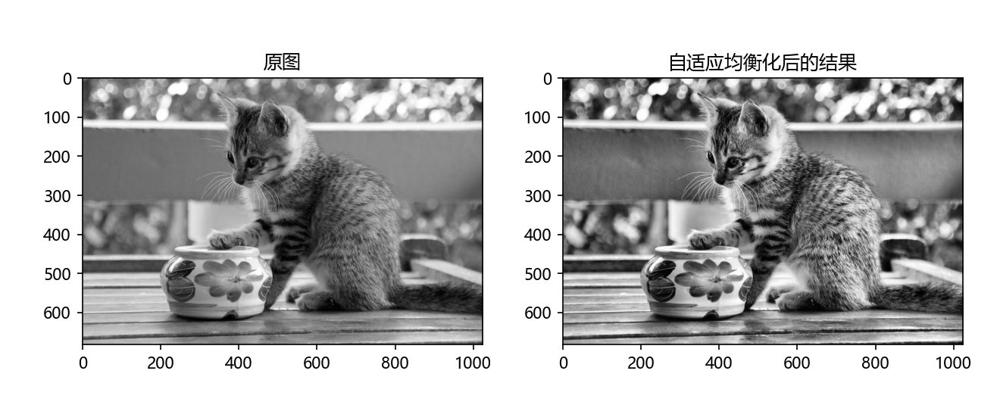


## 第三十三节课：3-4_直方图总结

- **灰度直方图**
  - 直方图是图像中像素强度分布的图形表达方式；
  - 它统计了每一个强度值所具有的像素个数；
  - 不同的图像的直方图可能是相同的；
  - **cv.calcHist（images，channels，mask，histSize，ranges [，hist [，accumulate]]）**

- **掩膜**
  - 创建蒙版，透过mask进行传递，可获取感兴趣区域的直方图；

- **直方图均衡化**

  - 增强图像对比度的一种方法；

  - **cv.equalizeHist()**

-  **自适应的直方图均衡**
  - 将整幅图像分成很多小块，然后再对每一个小块分别进行直方图均衡化，最后进行拼接；
  - **clahe = cv.createCLAHE(clipLimit, tileGridSize)**


## 第三十四节课：3-5_边缘检测原理

### 1.边缘检测原理及其表现形式

- 边缘检测的目的是标识数字图像中**亮度变化明显的点**；
- 换句话来说，边缘就是图像中灰度变化剧烈的区域；
- 图像属性中的**显著变化**通常反映了属性的重要事件和变化，如下图所示即为边缘的实际表现形式：

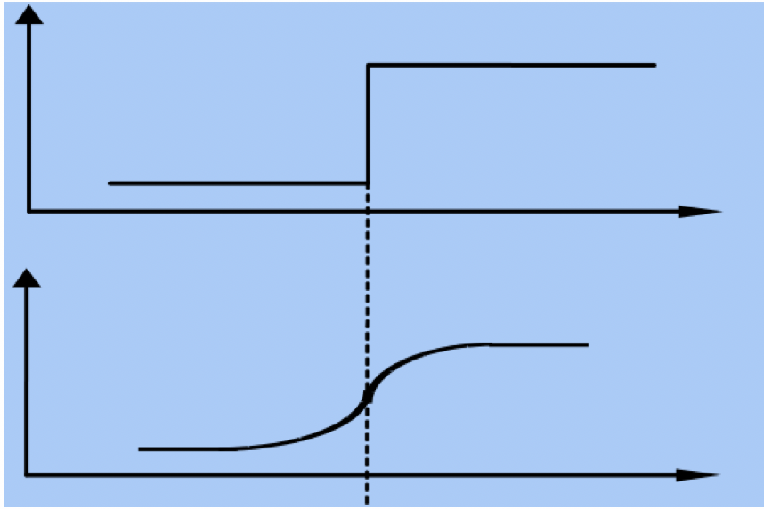


### 2.边缘检测的分类

- **基于搜索的边缘检测：**
  - 通过寻找图像**一阶导数中的最大值**来检测边界；
  - 利用计算结果估计边缘的局部方向，通常采用梯度的方向，并利用此方向找到局部梯度模的最大值；
  - 代表算法是**Sobel算子和Scharr算子**；

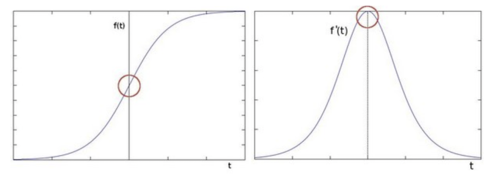

- **基于零穿越的边缘检测：**
  - 通过寻找**图像二阶导数零穿越**来寻找边界；
  - 代表算法是**Laplacian算子**；

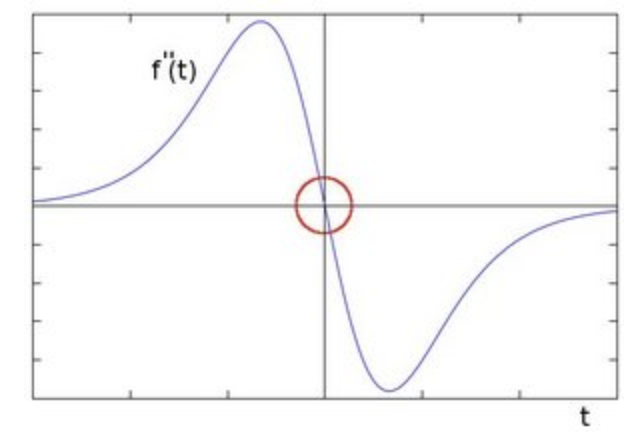


## 第三十五节课：3-5_sobel算子

### 1.原理

#### 1.1 sobel算子简介

- Sobel算法比较简单，实际中效率比**canny边缘检测**效率要高，但边缘不如Canny检测的准确；
- Sobel算子是**高斯平滑与微分操作的结合体**，所以其抗噪声能力很强，用途较多；

#### 1.2 sobel算子的原理

- **不连续函数的一阶导数：**

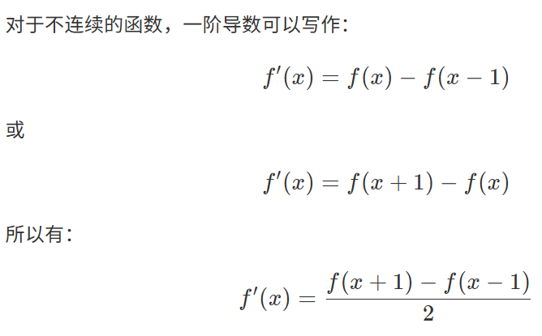

- **实际中sobel算子的卷积核运算：高斯权重加一阶微分**

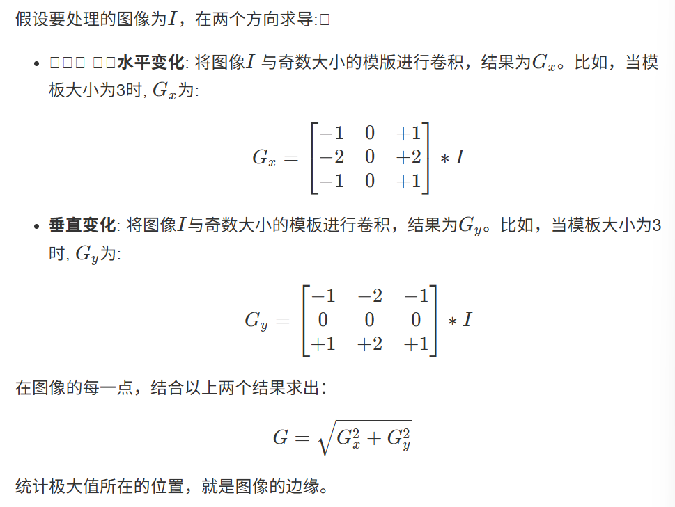

#### 1.3 Scharr算子

- 原先的sobel算子的权重分别为2和1；
- scharr算子在sobel算子的基础上，增大了权重，使得边缘检测更加敏感：

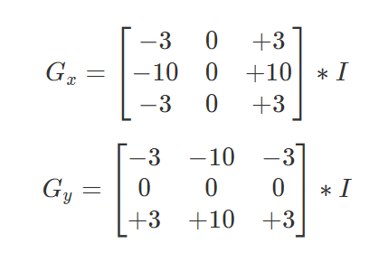

#### 1.4 算法的本质剖析

- 这两个算子的本质是在做**“卷积+数据融合”**；
- 卷积就是在求微分，融合是为了得到两个方向的和；
- 最后所呈现出来的所谓的图像，实际上就是**梯度的分布图**；


### 2.API介绍

- **API：**

```python
Sobel_x_or_y = cv2.Sobel(src, ddepth, dx, dy, dst, ksize, scale, delta, borderType)
```

- **参数：**
  - src：传入的图像；
  - ddepth：图像的深度；
  - dx和dy：指求导的阶数，0表示这个方向上没有求导，取值为0、1；
  - ksize：是Sobel算子的大小，即卷积核的大小，必须为奇数1、3、5、7，默认为3；
    - 如果ksize=-1，就演变成为3x3的Scharr算子；
  - scale：缩放导数的比例常数，默认情况为没有伸缩系数；
  - borderType：图像边界的模式，默认值为cv2.BORDER_DEFAULT；

- **位数问题：**

  - Sobel函数求完导数后会有负值，还有会大于255的值；
  - 而原图像是uint8，即8位无符号数，所以Sobel建立的图像位数不够，会有截断；
  - 因此要使用16位有符号的数据类型，即cv2.CV_16S；
  - 处理完图像后，再使用cv2.convertScaleAbs()函数将其转回原来的uint8格式，否则图像无法显示；

  ```python
  Scale_abs = cv2.convertScaleAbs(x)  # 格式转换函数
  ```

- **通道融合：**

  - Sobel算子是在两个方向计算的，最后还需要用cv2.addWeighted( )函数将其组合起来；

  ```python
  result = cv2.addWeighted(src1, alpha, src2, beta) # 图像混合
  ```


### 3.上机实验

#### 3.1 sobel算子

```python
# sobel算子的示例代码

import cv2 as cv
import numpy as np
from matplotlib import pyplot as plt

# 设置字体为微软雅黑
plt.rcParams['font.family'] = 'Microsoft YaHei'
plt.rcParams['axes.unicode_minus'] = False

# 1 读取图像
img = cv.imread('images/Chapter3/horse.jpg',0)

# 2 计算Sobel卷积结果
x = cv.Sobel(img, cv.CV_16S, 1, 0)
y = cv.Sobel(img, cv.CV_16S, 0, 1)

# 3 将数据进行转换
Scale_absX = cv.convertScaleAbs(x)      # convert 转换  scale 缩放
Scale_absY = cv.convertScaleAbs(y)

# 4 结果合成
result = cv.addWeighted(Scale_absX, 0.5, Scale_absY, 0.5, 0)

# 5 图像显示
plt.figure(figsize=(10,8),dpi=100)
plt.subplot(121),plt.imshow(img,cmap=plt.cm.gray),plt.title('原图')
plt.xticks([]), plt.yticks([])
plt.subplot(122),plt.imshow(result,cmap = plt.cm.gray),plt.title('Sobel滤波后结果')
plt.xticks([]), plt.yticks([])
plt.show()

```

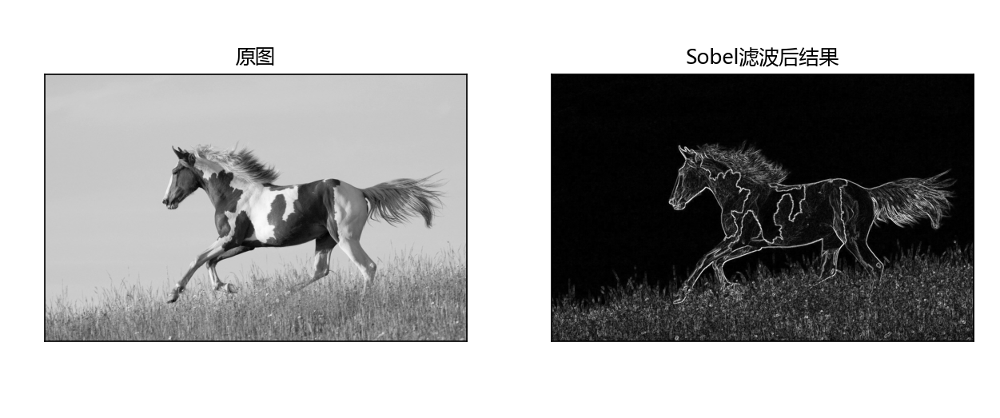

#### 3.2 scharr算子

```python
# scharr算子的示例代码

import cv2 as cv
import numpy as np
from matplotlib import pyplot as plt

# 设置字体为微软雅黑
plt.rcParams['font.family'] = 'Microsoft YaHei'
plt.rcParams['axes.unicode_minus'] = False

# 1 读取图像
img = cv.imread('images/Chapter3/horse.jpg',0)

# 2 计算scharr卷积结果
x = cv.Sobel(img, cv.CV_16S, 1, 0, ksize = -1)
y = cv.Sobel(img, cv.CV_16S, 0, 1, ksize = -1)

# 3 将数据进行转换
Scale_absX = cv.convertScaleAbs(x)      # convert 转换  scale 缩放
Scale_absY = cv.convertScaleAbs(y)

# 4 结果合成
result = cv.addWeighted(Scale_absX, 0.5, Scale_absY, 0.5, 0)

# 5 图像显示
plt.figure(figsize=(10,8),dpi=100)
plt.subplot(121),plt.imshow(img,cmap=plt.cm.gray),plt.title('原图')
plt.xticks([]), plt.yticks([])
plt.subplot(122),plt.imshow(result,cmap = plt.cm.gray),plt.title('Sobel滤波后结果')
plt.xticks([]), plt.yticks([])
plt.show()

```

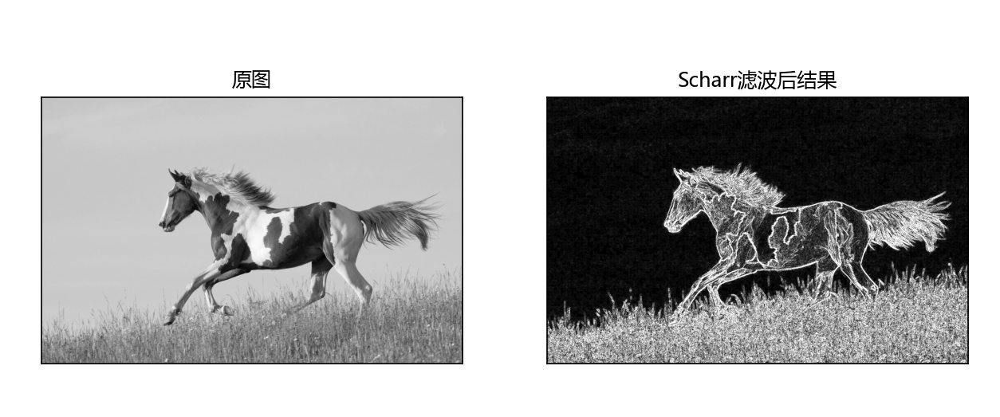


## 第三十六节课：3-5_laplacian算子

### 1.laplacian算子的介绍

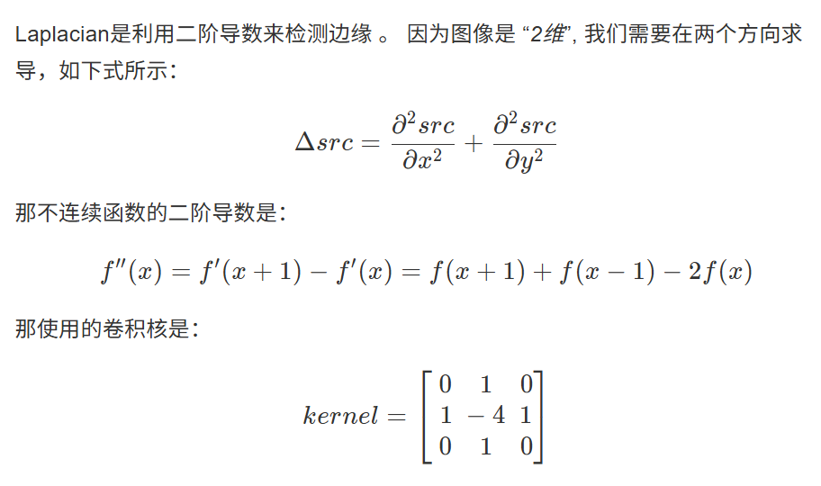


### 2.API介绍

- **API：**

```python
laplacian = cv2.Laplacian(src, ddepth[, dst[, ksize[, scale[, delta[, borderType]]]]])
```

- **参数：**
  - Src：需要处理的图像；
  - Ddepth：图像的深度，-1表示采用的是原图像相同的深度，目标图像的深度必须大于等于原图像的深度；与前面一样，一般指定为**CV_16S**；
  - ksize：算子的大小，即卷积核的大小，必须为1,3,5,7；


### 3.上机实验

```python
# 拉普拉斯算子的示例代码

import cv2 as cv
import numpy as np
from matplotlib import pyplot as plt

# 设置字体为微软雅黑
plt.rcParams['font.family'] = 'Microsoft YaHei'
plt.rcParams['axes.unicode_minus'] = False

# 1 读取图像
img = cv.imread('images/Chapter3/horse.jpg',0)

# 2 laplacian转换
result = cv.Laplacian(img,cv.CV_16S)
Scale_abs = cv.convertScaleAbs(result)

# 3 图像展示
plt.figure(figsize=(10,8),dpi=100)
plt.subplot(121),plt.imshow(img,cmap=plt.cm.gray),plt.title('原图')
plt.xticks([]), plt.yticks([])
plt.subplot(122),plt.imshow(Scale_abs,cmap = plt.cm.gray),plt.title('Laplacian检测后结果')
plt.xticks([]), plt.yticks([])
plt.show()

```

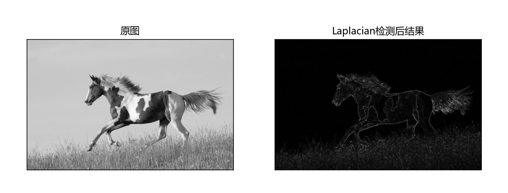


## 第三十七节课：3-5_Canny边缘检测

### 1.Canny边缘检测的原理

#### 1.1 Canny算法的简介

- Canny 边缘检测算法是一种非常流行的边缘检测算法；
- 由**John F. Canny**于1986年提出的，被认为是最优的边缘检测算法；

#### 1.2 Canny算法的原理

Canny边缘检测算法是由4步构成，分别介绍如下：

- **第一步：噪声去除**
  
  - 边缘检测很容易受到噪声的影响，所以首先使用5*5高斯滤波器去除噪声；
  
- **第二步：计算图像梯度**

  - 对平滑后的图像使用**Sobel算子**计算水平方向和竖直方向的一阶导数（Gx 和 Gy）；
  - 根据得到的这两幅梯度图（Gx 和 Gy）找到边界的梯度和方向；
  - **若某个像素点是边缘，其梯度方向总是垂直与边缘垂直；梯度方向被归为四类：垂直，水平，和两个对角线方向；**
  - 公式如下：

  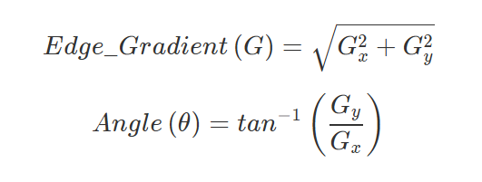

- **第三步：非极大值抑制**

  - 在获得梯度的方向和大小之后，对整幅图像进行扫描，去除**那些非边界上的点**；
  - 对每一个像素进行检查，**看这个点的梯度是不是周围具有相同梯度方向的点中最大的**；
  - 如下图所示：
    - A点位于图像的边缘，在其梯度变化方向，选择像素点B和C，用来检验A点的梯度是否为极大值；
    - 若为极大值，则进行保留，否则A点被抑制，最终的结果是具有“细边”的二进制图像；

  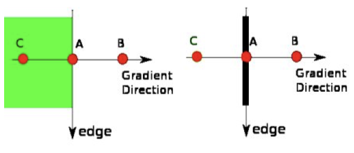

- **第四步：滞后阈值**

  - 接下来就是确定真正的边界。
  - 设置两个阈值： minVal和maxVal，当图像的灰度梯度高于maxVal时被认为是真的边界， 低于minVal 的边界会被抛弃；
  - 如果介于两者之间的话，就要看这个点是否与某个被确定为真正的边界点相连，如果是就认为它也是边界点，如果不是就抛弃，如下图：
    - A高于阈值maxVal所以是真正的边界点，C虽然低于maxVal但高于minVal并且与A相连，所以也被认为是真正的边界点；
    - 而B就会被抛弃，因为低于maxVal而且不与真正的边界点相连；
    - 所以选择合适的maxVal和minVal对于能否得到好的结果非常重要；

  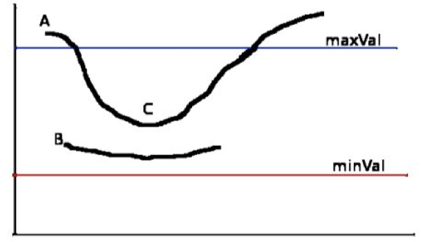


### 2.API介绍

- **API：**

```python
canny = cv2.Canny(image, threshold1, threshold2)
```

- **参数：**
  - image：灰度图；
  - threshold1：minval，**较小的阈值将间断的边缘连接起来**；
  - threshold2：maxval，**较大的阈值检测图像中明显的边缘**；
- **上机实验：**

```python
# Canny算子示例代码

import cv2 as cv
import numpy as np
from matplotlib import pyplot as plt

# 设置字体为微软雅黑
plt.rcParams['font.family'] = 'Microsoft YaHei'
plt.rcParams['axes.unicode_minus'] = False

# 1 图像读取
img = cv.imread('images/Chapter3/horse.jpg',0)

# 2 Canny边缘检测
lowThreshold = 0
max_lowThreshold = 100
canny = cv.Canny(img, lowThreshold, max_lowThreshold)

# 3 图像展示
plt.figure(figsize=(10,8),dpi=100)
plt.subplot(121),plt.imshow(img,cmap=plt.cm.gray),plt.title('原图')
plt.xticks([]), plt.yticks([])
plt.subplot(122),plt.imshow(canny,cmap = plt.cm.gray),plt.title('Canny检测后结果')
plt.xticks([]), plt.yticks([])
plt.show()

```

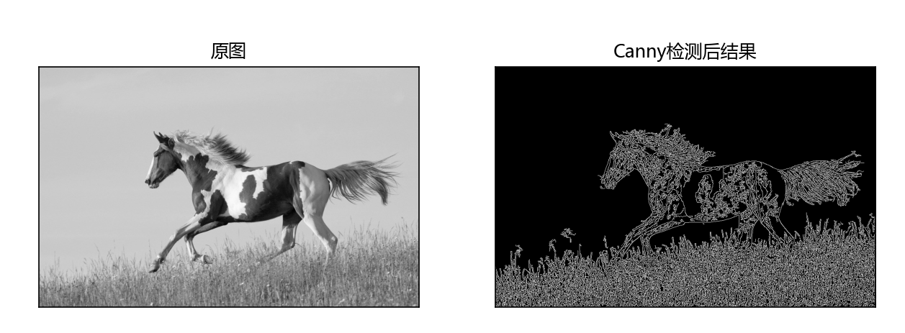


## 第三十八节课：3-5_边缘检测总结

- **边缘检测的原理**
  - 基于搜索：利用一阶导数的最大值获取边界；
  - 基于零穿越：利用二阶导数为0获取边界；

- **Sobel算子**
  - 基于搜索的方法获取边界；
  - cv.sobel()——>cv.convertScaleAbs()——>cv.addweights()

- **Laplacian算子**
  - 基于零穿越获取边界；
  - cv.Laplacian()

- **Canny算法**
  - 噪声去除：高斯滤波；
  - 计算图像梯度：sobel算子，计算梯度大小和方向；
  - 非极大值抑制：利用梯度方向像素来判断当前像素是否为边界点；
  - 滞后阈值：设置两个阈值，确定最终的边界；

- **算子比较**

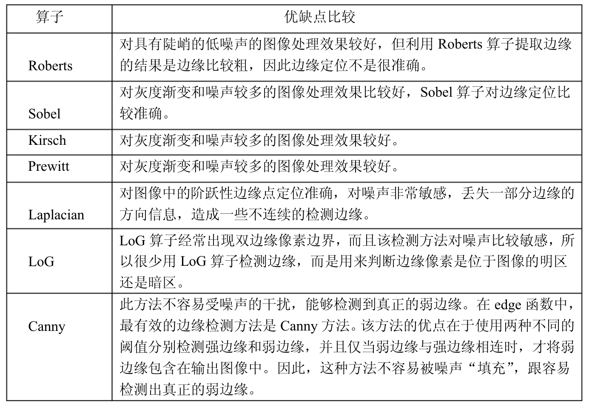


## 第三十九节课：3-6_模板匹配

### 1.模板匹配的原理

- **思路：**

  - 模板匹配是在给定的图片中查找和模板最相似的区域，该算法的输入包括模板和图片；
  - 任务的思路是不断的移动模板图片，计算其与图像中对应区域的匹配度，并将匹配度最高的区域选择为最终的结果；

- **实现流程：**

  - **准备两幅图像：**
    - 原图像(I)：在这幅图中，找到与模板相匹配的区域；
    - 模板(T)：与原图像进行比对的图像块；

  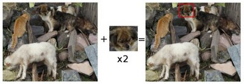

  - **滑动模板图像和原图像进行比对：**

    - 模板每次移动一个像素 (从左往右，从上往下)，在每一个位置，都计算与模板图像的相似程度：

    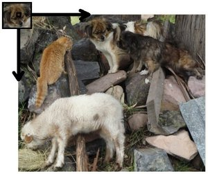

  - **模板比对的结果：**

    - 对于每一个位置将计算的相似结果保存在结果矩阵（R）中；
    - 如果输入图像的大小(WxH)且模板图像的大小(wxh)，则输出矩阵R的大小为(W-w+1,H-h+1)
    - 将R显示为图像，如下图所示：

    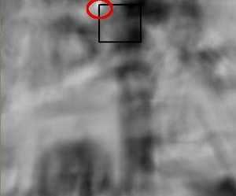

  - **筛选匹配：**

    - 获得上述图像后，查找最大值所在的位置，那么该位置对应的区域就被认为是最匹配的；
    - **对应的区域就是以该点为顶点，长宽和模板图像一样大小的矩阵；**


### 2.API实现

- **API：**

```python
res = cv.matchTemplate(img,template,method)
```

- **参数：**

  - img：要进行模板匹配的图像；

  - Template：模板；

  - method：实现模板匹配的算法，主要有：

    - 平方差匹配(CV_TM_SQDIFF)：利用模板与图像之间的平方差进行匹配，最好的匹配是0，匹配越差，匹配的值越大；

    - 相关匹配(CV_TM_CCORR)：利用模板与图像间的乘法进行匹配，数值越大表示匹配程度较高，越小表示匹配效果差；

    - 利用相关系数匹配(CV_TM_CCOEFF)：利用模板与图像间的相关系数匹配，1表示完美的匹配，-1表示最差的匹配；

- **结果选择：**
  - **完成匹配后，使用cv.minMaxLoc()方法查找最大值所在的位置即可；**
  - 如果使用平方差作为比较方法，则最小值位置是最佳匹配位置。


### 3.上机实验

```python
# 模板匹配示例代码

import cv2 as cv
import numpy as np
from matplotlib import pyplot as plt

# 设置字体为微软雅黑
plt.rcParams['font.family'] = 'Microsoft YaHei'
plt.rcParams['axes.unicode_minus'] = False

# 1 图像和模板读取
img = cv.imread('images/Chapter3/wulin.jpeg')
template = cv.imread('images/Chapter3/bai.jpeg')
h,w,l = template.shape

# 2 模板匹配
# 2.1 模板匹配
res = cv.matchTemplate(img, template, cv.TM_CCORR)
# 2.2 返回图像中最匹配的位置，确定左上角的坐标，并将匹配位置绘制在图像上
min_val, max_val, min_loc, max_loc = cv.minMaxLoc(res)
# 使用平方差时最小值为最佳匹配位置
# top_left = min_loc
top_left = max_loc
bottom_right = (top_left[0] + w, top_left[1] + h)
cv.rectangle(img, top_left, bottom_right, (0,255,0), 2)

# 3 图像显示
plt.imshow(img[:,:,::-1])
plt.title('匹配结果'), plt.xticks([]), plt.yticks([])
plt.show()

```

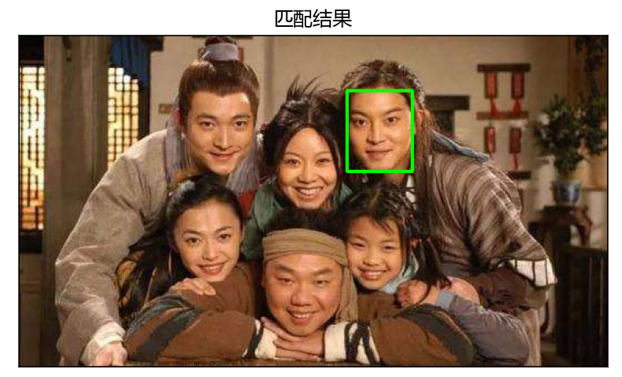


## 第四十节课：3-6_霍夫线变换原理

### 1.霍夫变换简介

- 霍夫变换常用来**提取图像中的直线和圆等几何形状**，如下图所示：

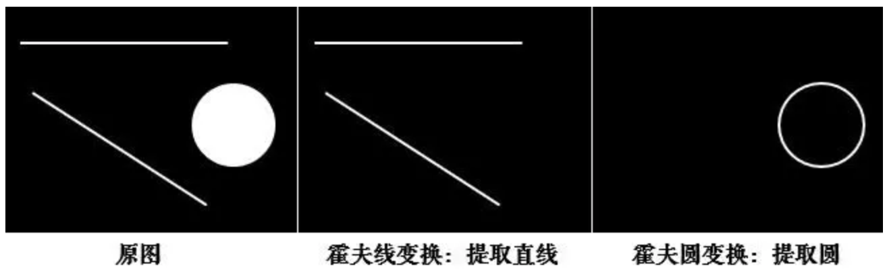


### 2.霍夫变换的原理

#### 2.1 笛卡尔坐标系

- 在笛卡尔坐标系下，一条直线可由两个点确定，如下图所示：

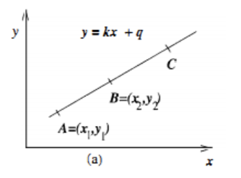

#### 2.2 霍夫坐标系

- 可以**将直线y=kx＋q写成以k和q作为变量**的形式：

$$
\begin{cases}
q = -kx_1 + y_1 \\
q = -kx_2 + y_2
\end{cases}
$$

- 对应的变换用图形表示如下：变换后的空间叫做**霍夫空间**

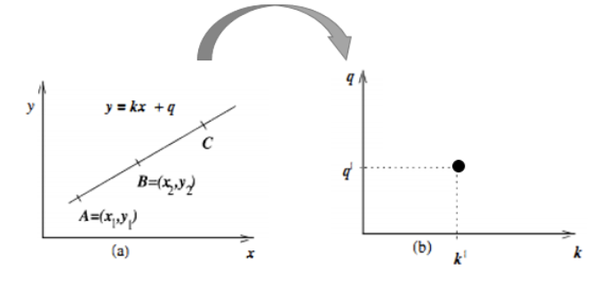

- **规律总结：**
  - **笛卡尔坐标系中的一条直线，对应于霍夫空间中的一个点；**
  - **霍夫空间中的一条直线，对应笛卡尔坐标系中的一个点**：

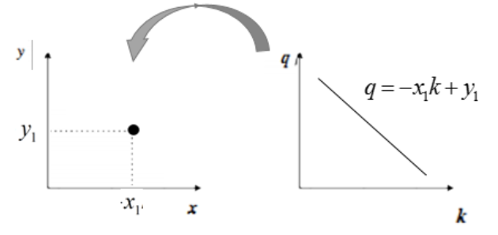

#### 2.3 笛卡尔坐标系的点共线与霍夫空间的线相交

- 笛卡尔坐标系中的三点共线，与霍夫空间的**三线相交**：

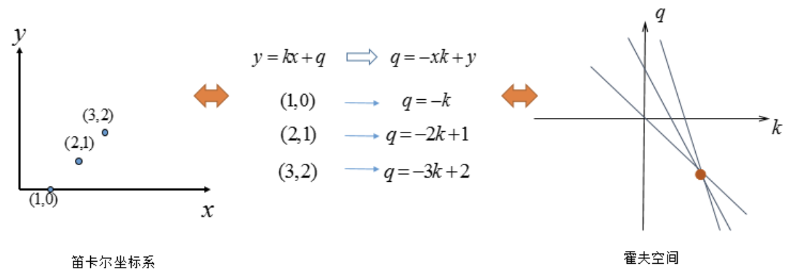

- 如果笛卡尔坐标系中**存在不共线的点**，可以得到如下情况：
  - 其本质是看笛卡尔坐标系中存在多少条可由点连成的直线；
  - 每条直线的斜率和截距对应着霍夫空间中的某个点；
  - 同理地，可**由霍夫空间中交点最多的两个点对应会笛卡尔坐标系中点最多的两点直线**；


#### 2.4 极坐标下的霍夫变换

- 霍夫空间的某个点，本质对应了笛卡尔坐标系中**某条直线的斜率和截距**，可能会出现**斜率和截距为∞**的情况：


- 可采用**极坐标的方式**解决这个问题：

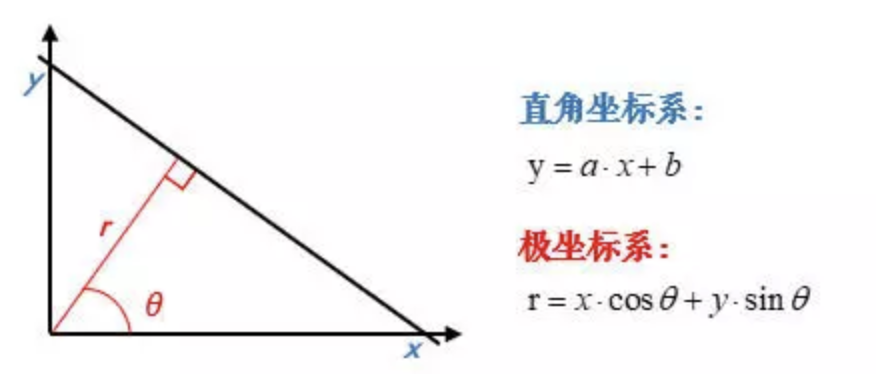

- 以**r和ρ为空间**，其中ρ是原点到直线的垂直距离，θ表示直线的垂线与横轴顺时针方向的夹角：
  - 原坐标系中的一个点在极坐标系下的霍夫空间是一条正弦曲线；
  - 当原坐标系中多个点共线，在极坐标下的霍夫空间则多条线共点；

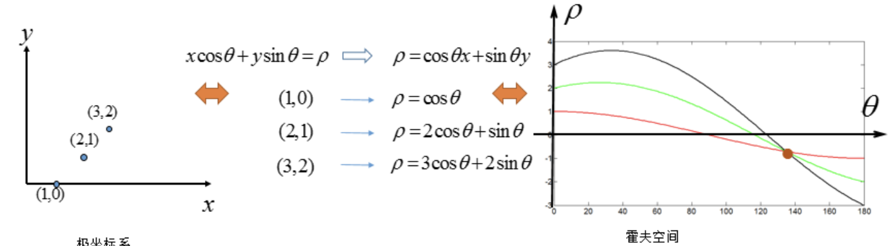


- 这样，只要求得**霍夫空间中的交点的位置，即可得到原坐标系下的直线；**
  - 其本质是，在原来的极坐标下，每一条直线的r和ρ都是固定的；
  - **所以在极坐标系下的霍夫空间中，一条直线对应着一个点；**


### 3.实现流程

假设有一个大小为100∗100的图片，使用霍夫变换检测图片中的直线，则步骤如下所示：

- **初始化累加器：**

  - 首先创建一个2D数组，叫做**累加器**，初始化所有值为0，行表示ρ ，列表示θ：

  - 该数组的大小决定了结果的准确性，若**希望角度的精度为1度，那就需要180列**；
  - 对于ρ，最大值为图片对角线的距离，若**希望精度达到像素级别，行数应该与图像的对角线的距离相等**；

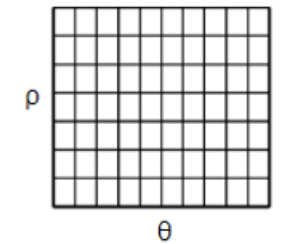

- **在累加器中画线：**

  - 原来的图像中的每一个点对应了霍夫空间的一条正弦曲线；
  - 所以选取原图像中的 某个点，即可得到(x, y)；
  - 不断遍历θ，并带入公式ρ=xcosθ＋ysinθ，得到ρ；
  - 若对应的(θ, ρ)在累加器中存在，则对应位置＋1；
  - 在某一个点，把θ全部遍历，即可得到该点在霍夫空间下的正弦曲线；
  - 然后再遍历全部的点，即可把所有点都映射到霍夫空间中；
  - 累加器中最大的值，即对应着原空间中的直线；
  - 搜索累加器中的最大值，并找到其对应的(*ρ*,*θ*)，就可将图像中的直线表示出来；

  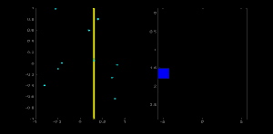


## 第四十一节课：3-6_霍夫线检测

### 1.API介绍

- **API：**

```python
cv.HoughLines(img, rho, theta, threshold)
```

- **参数：**
  - img：检测的图像，要求是二值化图像；在调用霍夫变换前首先要进行二值化，或进行Canny边缘检测；
  - rho、theta：ρ和θ的精确度；
  - threshold：阈值，只有累加器中的值高于该阈值时才被认为是直线；

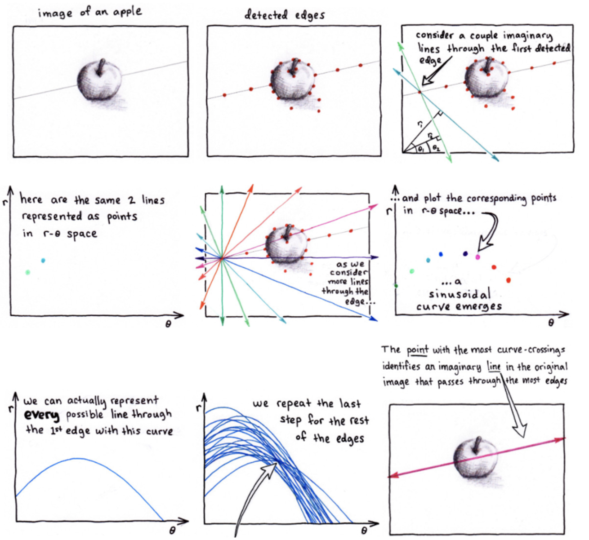


### 2.上级实验

```python
# 霍夫线变换的示例代码

import numpy as np
import random
import cv2 as cv
import matplotlib.pyplot as plt

# 设置字体为微软雅黑
plt.rcParams['font.family'] = 'Microsoft YaHei'
plt.rcParams['axes.unicode_minus'] = False

# 1.加载图片，转为二值图
img = cv.imread('images/Chapter3/rili.jpg')
gray = cv.cvtColor(img, cv.COLOR_BGR2GRAY)
edges = cv.Canny(gray, 50, 150)

# 2.霍夫直线变换
lines = cv.HoughLines(edges, 0.8, np.pi / 180, 150)		# lines是一个数组，记录了所有满足的直线

# 3.将检测的线绘制在图像上（注意是极坐标）
for line in lines:
    rho, theta = line[0]	# 获取霍夫空间中的每一个点
    a = np.cos(theta)
    b = np.sin(theta)
    
    x0 = a * rho
    y0 = b * rho
    
    x1 = int(x0 + 1000 * (-b))
    y1 = int(y0 + 1000 * (a))
    
    x2 = int(x0 - 1000 * (-b))
    y2 = int(y0 - 1000 * (a))
    
    cv.line(img, (x1, y1), (x2, y2), (0, 255, 0))

# 4. 图像显示
plt.figure(figsize=(10,8),dpi=100)
plt.imshow(img[:,:,::-1]),plt.title('霍夫变换线检测')
plt.xticks([]), plt.yticks([])
plt.show()

```

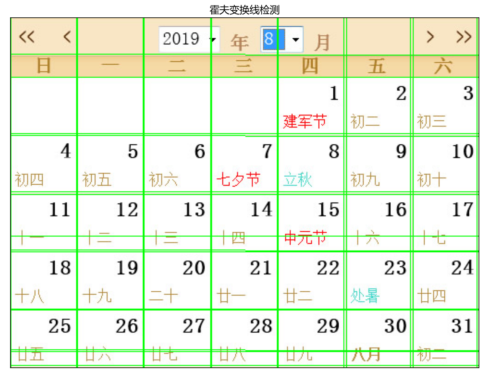


## 第四十二节课：3-6_霍夫圆检测

### 1.霍夫圆的检测原理

- **圆的表达式为：**
  - 标准的霍夫圆检测就是在这三个参数组成的三维空间累加器上进行圆形检测；
  - 此时效率就会很低，所以OpenCV中使用**霍夫梯度法**进行圆形的检测

$$
(x−a)^2+(y−b)^2=r^2
$$

- **霍夫梯度法：**
  - 霍夫梯度法将霍夫圆检测范围两个阶段，**第一阶段检测圆心，第二阶段利用圆心推导出圆半径；**
    - **圆心检测的原理**：圆心是圆周法线的交汇处，设置一个阈值，在某点的相交的直线的条数大于这个阈值就认为该交汇点为圆心；
    - **圆半径确定原理**：圆心到圆周上的距离（半径）是相同的，确定一个阈值，只要相同距离的数量大于该阈值，就认为该距离是该圆心的半径；
  - 原则上霍夫变换可以检测任何形状：
    - 但复杂的形状需要的参数就多，霍夫空间的维数就多；
    - 故程序实现上所需内存空间以及运行效率上都不利于把标准霍夫变换应用于实际复杂图形的检测中；
    - 霍夫梯度法是霍夫变换的改进，它的目的是减小霍夫空间的维度，提高效率；


### 2.API介绍

- **API：**

```python
circles = cv.HoughCircles(image, method, dp, minDist, param1=100, param2=100, minRadius=0,maxRadius=0)
```

- **参数：**
  - image：输入图像，应输入灰度图像；
  - method：使用霍夫变换圆检测的算法，它的参数是CV_HOUGH_GRADIENT；
  - dp：霍夫空间的分辨率，dp=1时表示霍夫空间与输入图像空间的大小一致，dp=2时霍夫空间是输入图像空间的一半，以此类推；
  - minDist：圆心之间的最小距离，如果检测到的两个圆心之间距离小于该值，则认为它们是同一个圆心；
  - param1：边缘检测时使用Canny算子的高阈值，低阈值是高阈值的一半，即**内置了Canny检测**；
  - param2：检测圆心和确定半径时所共有的阈值；
  - minRadius和maxRadius为所检测到的圆半径的最小值和最大值；

- **返回：**
  - circles：输出圆向量，包括三个浮点型的元素——**圆心横坐标，圆心纵坐标和圆半径；**


## 3.上机实验

由于霍夫圆检测对噪声比较敏感，所以首先对图像进行中值滤波：

```python
# 霍夫圆检测的示例代码

import cv2 as cv
import numpy as np
import matplotlib.pyplot as plt

# 设置字体为微软雅黑
plt.rcParams['font.family'] = 'Microsoft YaHei'
plt.rcParams['axes.unicode_minus'] = False

# 1 读取图像，并转换为灰度图
star = cv.imread("images/Chapter3/star.jpeg")
gay_img = cv.cvtColor(star, cv.COLOR_BGRA2GRAY)

# 2 进行中值模糊，去噪点
img = cv.medianBlur(gay_img, 7)

# 3 霍夫圆检测
circles = cv.HoughCircles(img, cv.HOUGH_GRADIENT, 1, 200, param1=100, param2=50, minRadius=0, maxRadius=100)

# 4 将检测结果绘制在图像上
if circles is not None:
    circles = np.uint16(np.around(circles))  # 转成整数
    for i in circles[0, :]:  # 遍历矩阵每一行的数据
        # 绘制圆形
        cv.circle(star, (i[0], i[1]), i[2], (0, 255, 0), 2)
        # 绘制圆心
        cv.circle(star, (i[0], i[1]), 2, (0, 255, 0), -1)

# 5 图像显示
plt.figure(figsize=(10,8),dpi=100)
plt.imshow(star[:,:,::-1]),plt.title('霍夫变换圆检测')
plt.xticks([]), plt.yticks([])
plt.show()

```

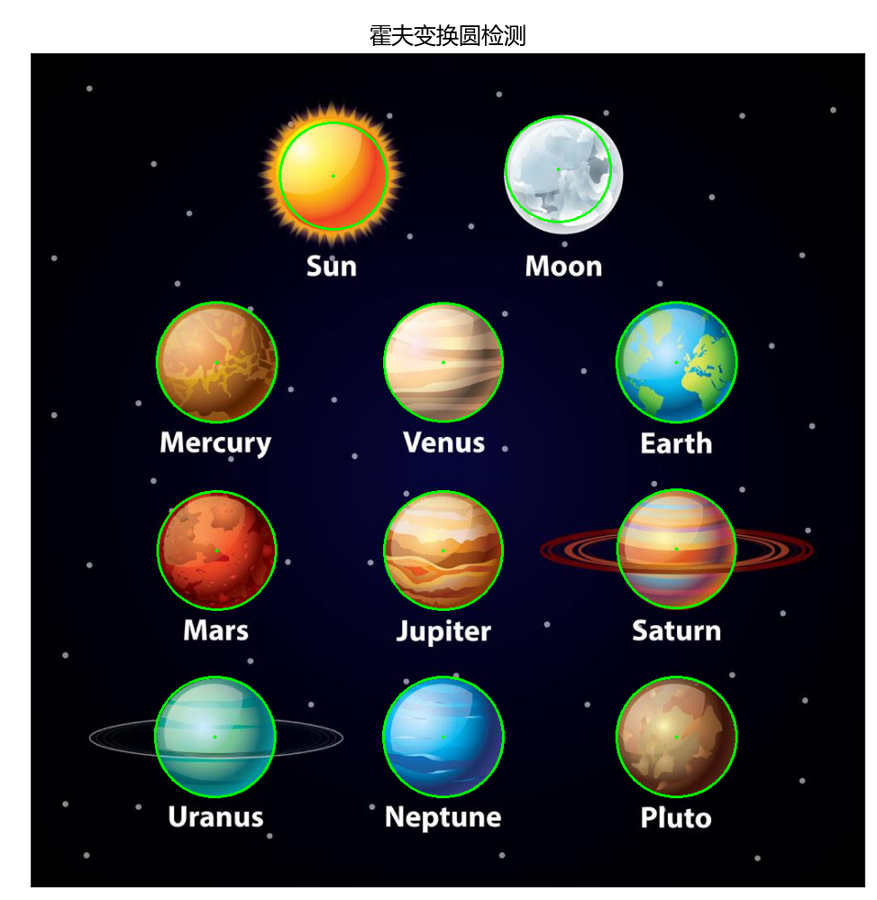


## 第四十三节课：3-6_模板匹配和霍夫检测总结

- **模板匹配：**
  - 原理：在给定的图片中查找和模板最相似的区域；
  - API：利用cv.matchTemplate()进行模板匹配，然后使用cv.minMaxLoc()搜索最匹配的位置。

- **霍夫线检测：**
  - 原理：将要检测的内容转换到霍夫空间中，利用累加器统计最优解，将检测结果表示处理；
  - API：cv2.HoughLines()；
  - 注意：该方法输入是的二值化图像，在进行检测前要将图像进行二值化处理；

- **霍夫圆检测：**
  - 方法：霍夫梯度法；
  - API：cv.HoughCircles()


# 第四章：图像特征提取与描述

本章主要讲解图像特征的提取，主要内容是：

- 图像的特征；
- **Harris和Shi-Tomasi算法**的原理及角点检测的实现；
- **SIFT/SURF算法**的原理及使用SIFT/SURF进行关键点的检测方法；
- **Fast算法**角点检测的原理角及其应用；
- **ORB算法**的原理及特征点检测的实现；


## 第四十四节课：4-1_角点特征

- 图像特征要有**区分性**，容易被比较。一般认为**角点、斑点**等是较好的图像特征；
- 特征提取主要有两方面的内容：
  - **特征检测**：找到图像中的特征；
  - **特征描述**：对特征及其周围的区域进行描述


## 第四十五节课：4-2_Harris检测原理

### 1.角点检测的基本原理

#### 1.1 基本原理

- 角点检测的基本思想是通过图像局部小窗口观察图像，角点特征是**窗口沿任意方向移动都会导致图像灰度的明显变化**，如下图：

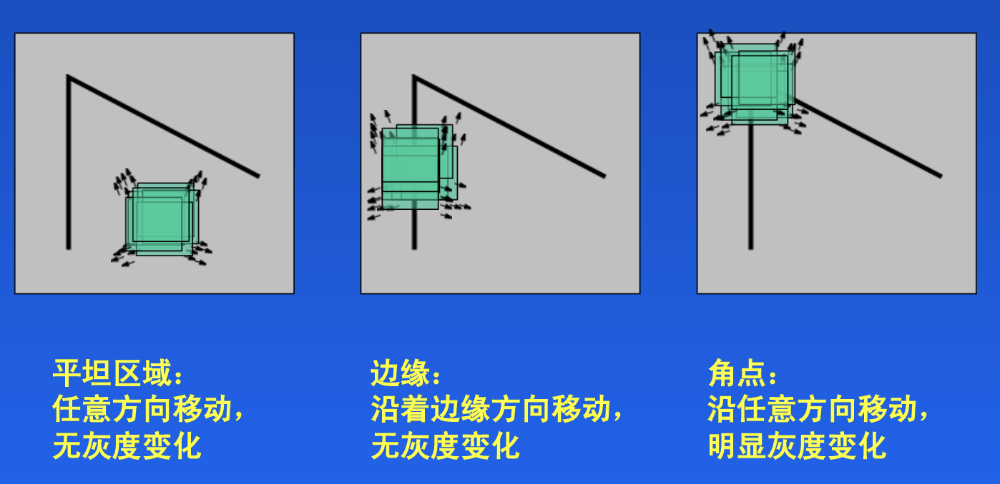

#### 1.2 基本原理的数学描述

- 用数学公式描述上面的过程：

$$
E(u, v) = \sum_{x,y} w(x, y) \left[ I(x + u, y + v) - I(x, y) \right]^2
$$

- 其中 $I(x,y)$ 是局部窗口的图像灰度，$I(x+u, y+v)$ 是平移后的图像灰度；
- **$w(x,y)$是窗口函数**，该可以是矩形窗口，也可以是对每一个像素赋予不同权重的高斯窗口，如下所示：

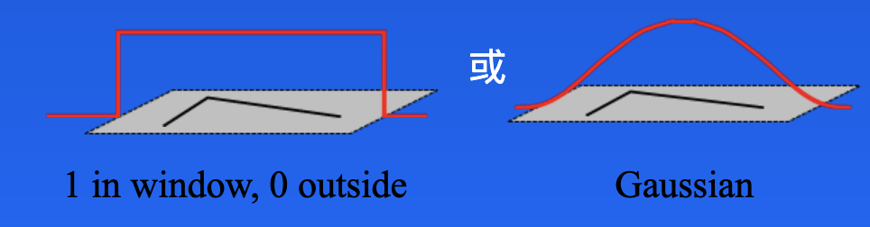

#### 1.3 结果推导与图形化解释

- **目标：**
  - 角点检测的结果即是**使$E(u, v)$的值最大**；

- **公式推导：**

  - 对平移后的图像灰度进行一阶泰勒展开：$I_x$和$I_y$是沿x和y方向的导数，可用**sobel算子**计算；

  $$
  I(x+u,y+v)=I(x,y)+I_xu+I_yv
  $$

  - 进一步推导如下：$M$矩阵决定了$E(u,v)$的取值，下面我们利用$M$来求角点；

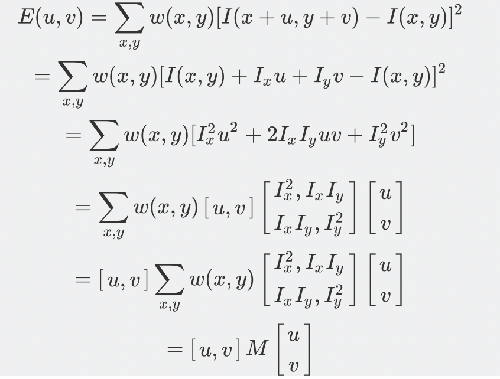

- **图形化结果：**
  - $M$是$I_x$和$I_y$的二次项函数，可以表示成椭圆的形状，椭圆的长短半轴由$M$的特征值$λ_1$和$λ_2$决定，方向由特征矢量决定，如下图所示：

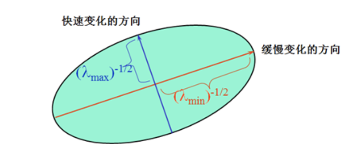

#### 1.4 结果判断

- 椭圆函数特征值与图像中的角点、直线（边缘）和平面之间的关系如下图所示：
  - 图像中的直线：一个特征值大，另一个特征值小，λ1>>λ2或 λ2>>λ1；
  - 图像中的平面：两个特征值都小，且近似相等，即椭圆函数数值在各个方向上都小。
  - 图像中的角点：两个特征值都大，且近似相等，椭圆函数在所有方向都增大；

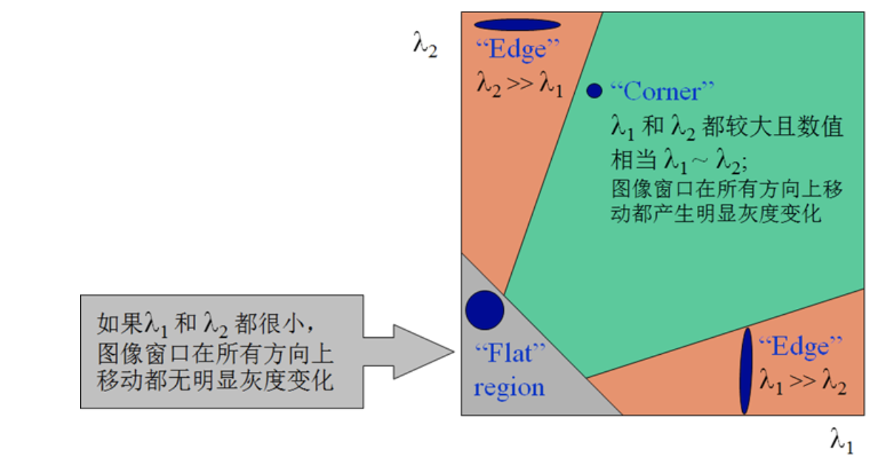


### 2.Harris算法

- 在上面的基本原理部分已经将角点检测的基本思路讲清楚了；

- **Harris算法的检测原理：**

  - Harris给出的角点计算方法并不需要计算具体的特征值，而是计算一个**角点响应值R**来判断角点；
  - **角点响应值R**的计算公式为：
    - 式中，detM为矩阵M的行列式；traceM为矩阵M的迹；α为常数，取值范围为0.04~0.06；

  $$
  R=detM−α(traceM)^2
  $$

  - 虽然在Harris算法中不需要像前面那样计算特征值，但其实特征值已经隐含在两个值中了：

  $$
  detM=λ_1λ_2\\
  traceM=λ_1+λ_2
  $$

- **角点的判断：**根据前面的角点响应值可以判断角点

  - 当R为大数值的正数时是角点；
  - 当R为大数值的负数时是边界；
  - 当R为小数是认为是平坦区域；

  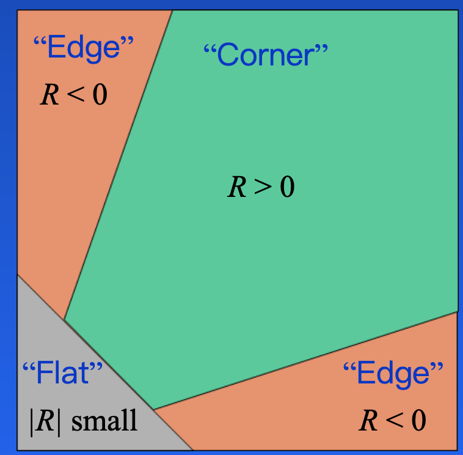


## 第四十六节课：4-2_Harris检测演示

### 1.API介绍

- **API：**

```python
dst=cv.cornerHarris(src, blockSize, ksize, k)
```

- **参数：**
  - img：数据类型为**float32**的输入图像；
  - blockSize：角点检测中要考虑的邻域大小；
  - ksize：sobel求导使用的核大小；
  - k：角点检测方程中的自由参数，取值参数为 [0.04，0.06]；


### 2.上机实验

```python
# Harris算法的示例代码

import cv2 as cv
import numpy as np
import matplotlib.pyplot as plt

# 设置字体为微软雅黑
plt.rcParams['font.family'] = 'Microsoft YaHei'
plt.rcParams['axes.unicode_minus'] = False

# 1 读取图像，并转换成灰度图像
img = cv.imread('../../images/Chapter4/chessboard.jpg')
gray = cv.cvtColor(img, cv.COLOR_BGR2GRAY)

# 2 角点检测
# 2.1 输入图像必须是 float32
gray = np.float32(gray)

# 2.2 最后一个参数在 0.04 到 0.05 之间
dst = cv.cornerHarris(gray,2,3,0.04)

# 3 设置阈值，将角点绘制出来，阈值根据图像进行选择
img[dst>0.001*dst.max()] = [0,0,255]

# 4 图像显示
plt.figure(figsize=(10,8),dpi=100)
plt.imshow(img[:,:,::-1]),plt.title('Harris角点检测')
plt.xticks([]), plt.yticks([])
plt.show()

```

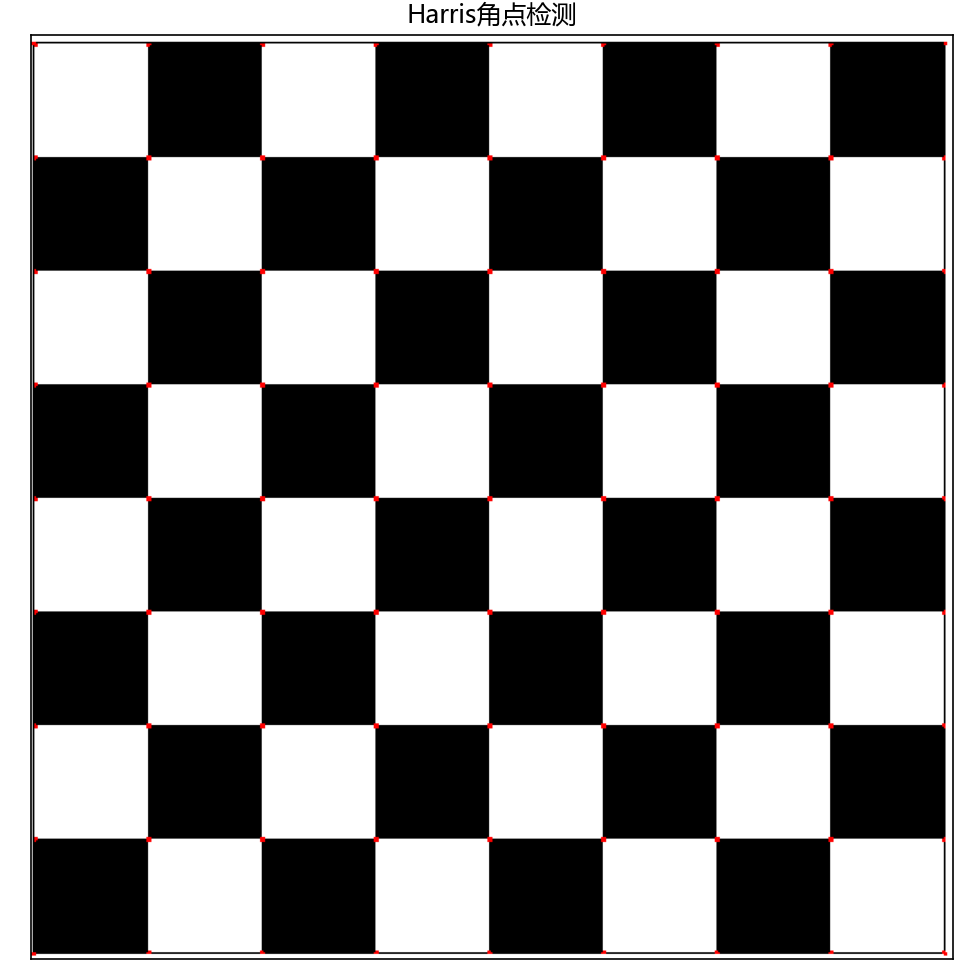


## 第四十七节课：4-2_shi-tomas检点检测

### 1.shi-tomas算法

- shi-Tomasi算法是对Harris角点检测算法的改进，一般会比Harris算法得到更好的角点；
- Harris 算法的角点响应函数是将矩阵 M 的行列式值与 M 的迹相减，利用差值判断是否为角点；
- shi-tomas算法是：**若矩阵M的两个特征值中较小的一个大于阈值，则认为是角点**，即：

$$
R=min(λ_1,λ_2)
$$

- 结果的显示可由下图解释：
  - 只有当λ1和λ 2都大于最小值时，才被认为是角点；

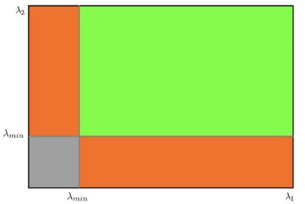


### 2.API介绍

- **API：**

```python
corners = cv2.goodFeaturesToTrack(image, maxcorners, qualityLevel, minDistance)
```

- **参数：**
  - Image：输入灰度图像；
  - maxCorners：获取角点数的数目；
  - qualityLevel：该参数指出最低可接受的角点质量水平，在0-1之间；
  - minDistance：角点之间最小的欧式距离，避免得到相邻特征点；
- **返回值：**
  - Corners：搜索到的角点；
  - 在这里**所有低于质量水平的角点被排除掉**，然后把合格的角点按质量排序；
  - 将**质量较好的角点附近（小于最小欧式距离）的角点删掉**，最后找到**maxCorners个**角点返回；


### 3.上机实验

```python
# shi-tomas算法的示例代码

import numpy as np
import cv2 as cv
import matplotlib.pyplot as plt

# 设置字体为微软雅黑
plt.rcParams['font.family'] = 'Microsoft YaHei'
plt.rcParams['axes.unicode_minus'] = False

# 1 读取图像
img = cv.imread('../../images/Chapter4/tv.jpg')
gray = cv.cvtColor(img,cv.COLOR_BGR2GRAY)

# 2 角点检测
corners = cv.goodFeaturesToTrack(gray,1000,0.01,10)

# 3 绘制角点
if corners is not None:
    corners = np.uint16(np.around(corners))  # 转成整数
    for i in corners:
        x,y = i.ravel()
        cv.circle(img,(x,y),2,(0,0,255),-1)

# 4 图像展示
plt.figure(figsize=(10,8),dpi=100)
plt.imshow(img[:,:,::-1]),plt.title('shi-tomasi角点检测')
plt.xticks([]), plt.yticks([])
plt.show()

```

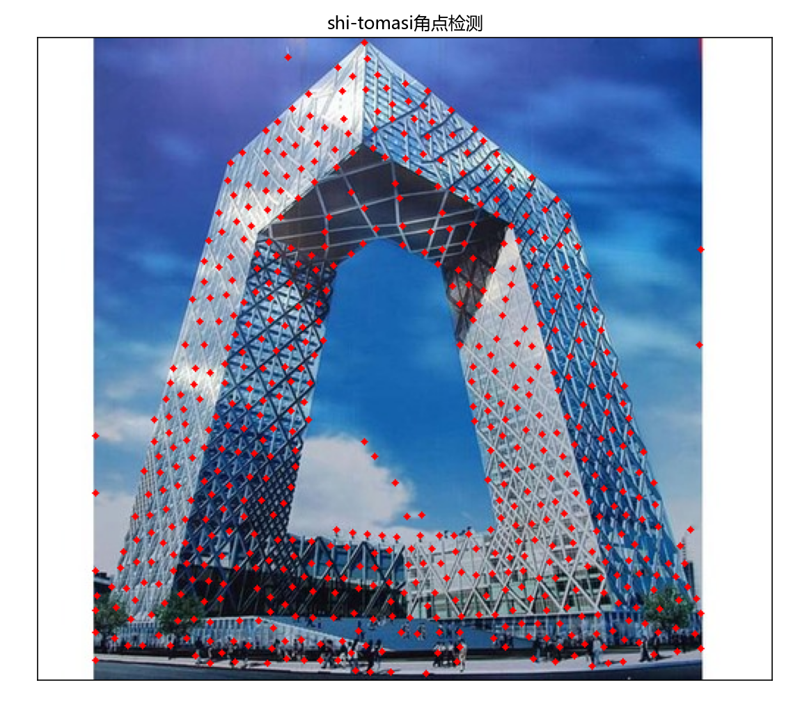


## 第四十八节课：4-2_Harris和shi-tamos总结

- **Harris算法**
  - 思想：通过图像局部小窗口观察图像，角点特征是窗口沿任意方向移动都会导致图像灰度的明显变化；
  - API：cv.cornerHarris()；

- **Shi-Tomasi算法**
  - 对Harris算法的改进，能够更好地检测角点；
  - API：cv2.goodFeatureToTrack()


## 第四十九节课：4-3_SIFT算法简介

### 1.Harris算法与Shi-tomas算法的缺点

- 前面两节介绍了Harris和Shi-Tomasi角点检测算法，这两种算法**具有旋转不变性，但不具有尺度不变性**；
- 以下图为例，左侧小图中可以检测到角点，但图像被放大后，再使用同样的窗口，就检测不到角点了：

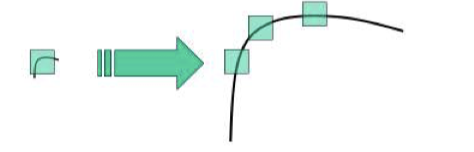


### 2.SIFT算法介绍

- **简介：**
  - SIFT算法是一种计算机视觉算法，即**Scale-invariant feature transform，尺度不变特征转换**；
- **SIFT算法的本质意义：**
  - SIFT算法的实质是在不同的尺度空间上查找关键点(特征点)，并计算出关键点的方向；
  - SIFT所查找到的关键点是一些十分突出，不会因光照，仿射变换和噪音等因素而变化的点；
  - 如角点、边缘点、暗区的亮点及亮区的暗点等；
  - **即相比于前面的Harris和Shi-tomas算法，SIFT算法具有旋转不变性和尺度不变性**；
- **SIFT算法的作用：**
  - 用来侦测与描述影像的局部性特征，它在空间尺度中寻找极值点，并**提取其位置、尺度、旋转不变量**；
- **基本流程：**
  - **尺度空间极值检测：**
    - 搜索所有尺度上的图像位置，通过高斯差分函数来识别潜在的**对于尺度和旋转不变的关键点**；
  - **关键点定位：**
    - 在每个候选的位置上，通过一个**拟合精细的模型来确定位置和尺度**；
    - 关键点的选择依据于它们的稳定程度；
  - **关键点方向确定：**
    - 基于图像**局部的梯度方向**，分配给每个关键点位置一个或多个方向；
    - 所有后面的对图像数据的操作都相对于**关键点的方向、尺度和位置进行变换**；
    - 从而保证了对于这些变换的不变性；
  - **关键点描述：**
    - 在每个关键点周围的邻域内，在选定的尺度上测量图像局部的梯度；
    - **这些梯度作为关键点的描述符**，它允许比较大的局部形状的变形或光照变化；


## 第五十节课：4-3_SIFT算法-尺度空间极值点搜索和极值点定位

### 1.尺度空间滤波器

- **矛盾与滤波器的引入：**

  - 在不同的尺度空间是不能使用相同的窗口检测极值点；
  - **对小的关键点使用小的窗口，对大的关键点使用大的窗口；**
  - 为了达到上述目的，我们使用**尺度空间滤波器**；
  - **而高斯核是唯一可以产生多尺度空间的核函数；**

- **图像的尺度空间：**

  - 图像的尺度空间$L(x,y,σ)$，定义为原始图像$I(x,y)$与一个可变尺度的2维高斯函数$G(x,y,σ)$的卷积运算 ，即：

  $$
  L(x,y,σ)=G(x,y,σ)∗I(x,y)
  $$

  - 其中：$G(x,y,σ)=\frac{1}{2\pi\sigma^2}e^{-(x^2+y^2)/(2\sigma^2)}$；
  - ***σ*是尺度空间因子，它决定了图像的模糊的程度：**
    - 在大尺度下（*σ*值大）表现的是图像的概貌信息；
    - 在小尺度下（*σ*值小）表现的是图像的细节信息；

- **高斯卷积核的选择：**

  - 计算高斯函数的离散近似时，在3σ距离之外的像素可以看作不起作用，这些像素的计算可以忽略；
  - 所以，在实际应用中，只计算**(6σ+1)\*(6σ+1)**的高斯卷积核就可以保证相关像素影响；


### 2.图像的高斯金字塔

- 图像的高斯金字塔是采用高斯函数对图像进行模糊以及降采样处理得到的；
- **高斯金字塔构建过程：**
  - 首先将图像扩大一倍，在扩大的图像的基础之上构建高斯金字塔；
  - 然后对该尺寸下图像进行高斯模糊，几幅模糊之后的图像集合构成了一个Octave；
  - 然后对该Octave下选择一幅图像进行下采样，长和宽分别缩短一倍，图像面积变为原来四分之一；
  - 这幅图像就是下一个Octave的初始图像，在初始图像的基础上完成属于这个Octave的高斯模糊处理；
  - 以此类推完成整个算法所需要的所有八度构建，这样这个高斯金字塔就构建出来了；
  - 整个流程如下图所示：


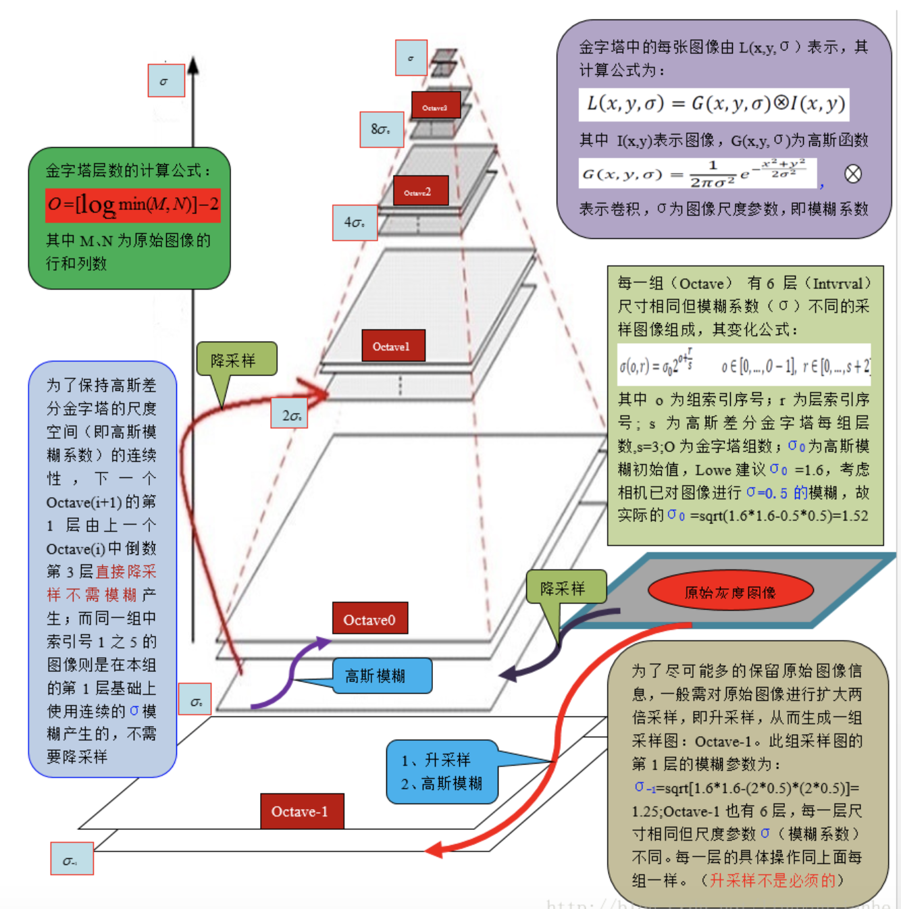


### 3.高斯差分金字塔

#### 3.1 DoG近似LoG

- 利用**LoG(高斯拉普拉斯方法)即图像的二阶导数**，可在不同尺度下检测图像关键点信息，确定图像特征点；

- 但LoG计算量大，效率低，可通过两个相邻高斯尺度空间的图像的相减，得到**DoG(高斯差分)来近似LoG**；

#### 3.2 高斯差分金字塔

- 为了计算DoG需要构建高斯差分金字塔，该金字塔是在上述的高斯金字塔的基础上构建而成的；
- 建立过程是：在高斯金字塔中每个Octave中相邻两层相减就构成了高斯差分金字塔；
- 如下图所示：

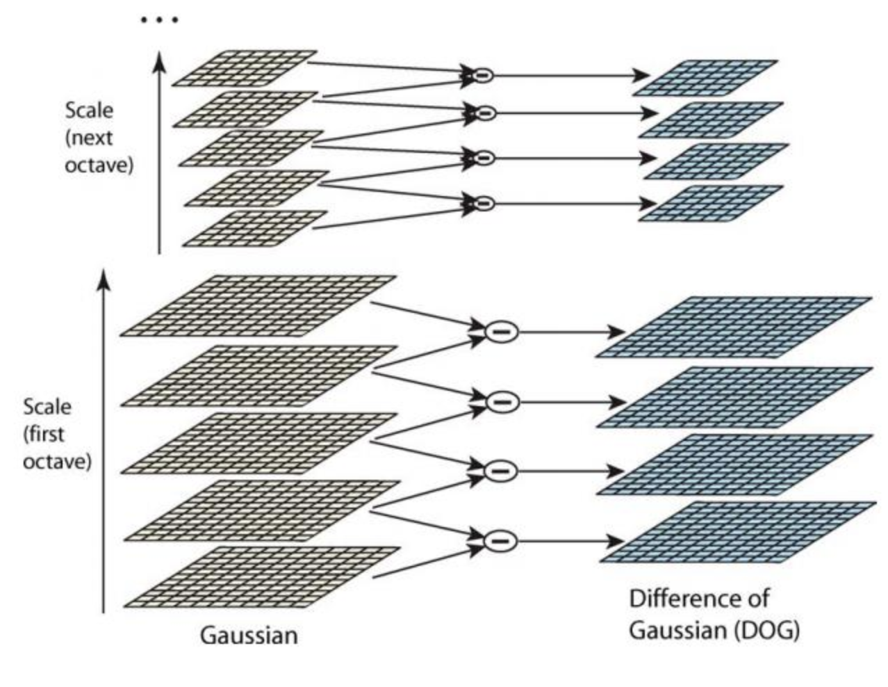

- **本质解释与规律：**
  - 高斯差分金字塔的第1组第1层是由高斯金字塔的第1组第2层减第1组第1层得到的；
  - 以此类推，逐组逐层生成每一个差分图像，所有差分图像构成差分金字塔；
  - 概括为**DOG金字塔的第o组第l层图像是由高斯金字塔的第o组第l+1层减第o组第l层得到的；**
  - 后续Sift特征点的提取都是在DOG金字塔上进行的；


### 4.极值点的搜索

- **极值点搜索的原理：**

  - 在 DoG 搞定之后，就可以**在不同的尺度空间中搜索局部最大值了**；
  - 图中的一个像素点，需要与自己周围的8邻域，及尺度空间上下两层中的相邻的18（2x9）个点相比；
  - 如果是局部最大值，它就可能是一个关键点；
  - 基本上来说关键点是图像在相应尺度空间中的最好代表，如下图所示：

  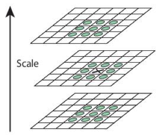

- **搜索过程举例：**

  - 搜索过程**从每组的第二层开始**；
  - 以第二层为当前层，第二层的DoG图像中每个点取一个3×3的立方体，立方体上下层为第一层与第三层；
  - 这样，搜索得到的极值点**既有位置坐标（DoG的图像坐标），又有空间尺度坐标（层坐标）**；
  - 当第二层搜索完成后，再以**第三层作为当前层**，其过程与第二层的搜索类似；
  - **当S=3时，每组里面要搜索3层，所以在DOG中就有S+2层，在初使构建的金字塔中每组有S+3层；**


### 5.极值点的定位

#### 5.1 噪声和边缘的去除

- DoG对噪声和边缘比较敏感，在上面检测到的局部极值点需经过进一步的检验才能精确定位为特征点；
- 使用尺度空间的泰勒级数展开来获得极值的准确位置：
  - 如果**极值点的灰度值小于阈值**（一般为0.03或0.04）就会被忽略掉；
  - 在 OpenCV 中这种阈值被称为**contrastThreshold**；

#### 5.2 边界的去除

- DoG算法对边界非常敏感， 所以我们必须要把边界去除；
- **Harris算法中的边界去除：**
  - 从Harris角点检测的算法中，当一个特征值远远大于另外一个特征值时检测到的是边界；
- **SIFT算法中的边界去除：**
  - 在DoG算法中欠佳的关键点在平行边缘的方向有较大的主曲率；
  - 而在垂直于边缘的方向有较小的曲率；
  - 两者的比值如果高于某个阈值（在OpenCV中叫做边界阈值），就认为该关键点为边界，将被忽略；
  - 一般将该阈值设置为10；
- 将低对比度和边界的关键点去除，得到的就是我们感兴趣的关键点；


## 第五十一节课：4-3_SIFT算法-关键点方向与描述符

### 1.关键点方向的确定

- **背景：**
  - 经过上述两个步骤，图像的关键点就完全找到了，这些关键点具有尺度不变性；
  - 为了实现旋转不变性，还需要为每个关键点分配一个方向角度；

- **梯度特征的采集：**

  - 对于任一关键点，我们采集其所在高斯金字塔图像以r为半径的区域内所有像素的梯度特征；
  - 梯度特征包括幅值和幅角，半径r为$r=3×1.5σ$
  - 其中σ是关键点所在octave的图像的尺度，**可以得到对应的尺度图像**；
  - 梯度的幅值和方向的计算公式为：

  $$
  \begin{align*}
  m(x, y) &= \sqrt{\left(L(x+1,y) - L(x-1,y)\right)^2 + \left(L(x,y+1) - L(x,y-1)\right)^2} \\
  \theta(x, y) &= \arctan\left( \frac{L(x,y+1) - L(x,y-1)}{L(x+1,y) - L(x-1,y)} \right)
  \end{align*}
  $$

  - 邻域像素梯度的计算结果如下图所示：

  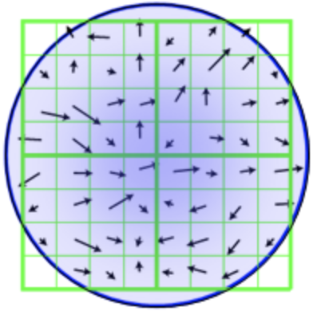

- **梯度特征的统计：**

  - 完成关键点梯度计算后，**使用直方图统计关键点邻域内像素的梯度幅值和方向**；

  - **具体做法是：**

    - 将360°分为36柱，每10°为一柱；
    - 在以r为半径的区域内，将梯度方向在某一个柱内的像素找出来，然后将他们的幅值相加在一起作为柱的高度；
    - 因为在r为半径的区域内像素的梯度幅值对中心像素的贡献是不同的，因此还需要对幅值进行加权处理，采用高斯加权，方差为1.5σ；
    - 如下图所示，为简化图中只画了8个方向的直方图：

    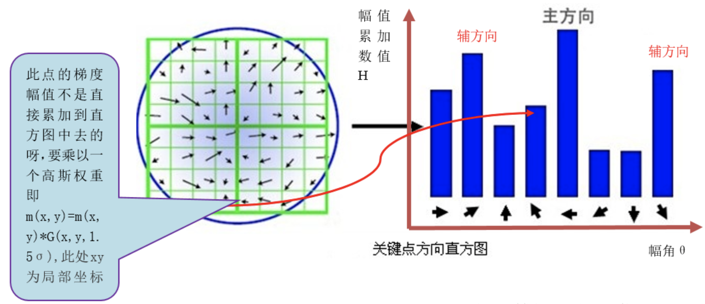

  - **主方向与辅方向：**

    - 每个特征点必须分配一个主方向，还需要一个或多个辅方向；
    - 增加辅方向的目的是为了增强图像匹配的鲁棒性；
    - 当一个柱体的高度大于主方向柱体高度的80%时，则该柱体所代表的的方向就是给特征点的辅方向；

- **梯度特征的插值拟合：**

  - 直方图的峰值，即最高的柱代表的方向是特征点邻域范围内图像梯度的主方向；
  - 柱体代表的角度是一个范围，所以还要对离散的直方图进行插值拟合，以得到更精确的方向角度值；
  - 利用抛物线对离散的直方图进行拟合，如下图所示：

  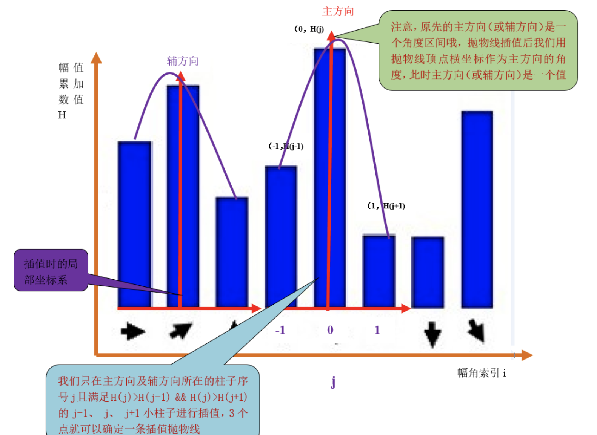

- **关键点方向的确定：**

  - 获得图像关键点主方向后，每个关键点有三个信息(x,y,σ,θ)：位置、尺度、方向；

  - 由此可以确定一个SIFT特征区域；

  - 通常使用一个带箭头的圆或直接使用箭头表示SIFT区域的三个值：

    - 中心表示特征点位置；
    - 半径表示关键点尺度；
    - 箭头表示方向；

    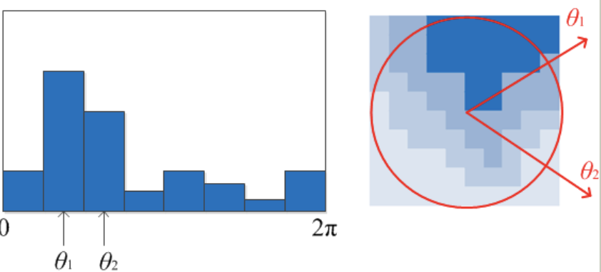


### 2.关键点描述

- **背景：**

  - 通过前面步骤，每个关键点就被分配了位置，尺度和方向信息；
  - 接下来为每个关键点建立一个描述符，该描述符有如下特点：
    - 既具有可区分性，如位置、尺度和方向等；
    - 又具有对某些变量的不变性，如光照，视角等；
    - 描述符不仅仅包含关键点，也包括关键点周围对其有贡献的的像素点；
  - 主要思路：
    - 通过将关键点周围图像区域分块，计算块内的梯度直方图；
    - 生成具有特征向量，对图像信息进行抽象；

- **子区域的划分：**

  - 描述符与特征点所在的尺度有关，所以我们在关键点所在的高斯尺度图像上生成对应的描述符；
  - 以特征点为中心，将附近邻域划分为d∗d个子区域（一般d=4)，每个子区域为一个正方形，边长为3σ；
  - 考虑到实际计算时，需进行三次线性插值，所以特征点邻域的为3σ(d+1)∗3σ(d+1)的范围，如下图所示：

  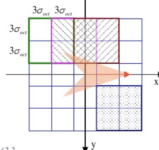

- **旋转不变性的保持：**

  - 为了保证特征点的旋转不变性，以特征点为中心，将坐标轴旋转为关键点的主方向，如下图所示：

  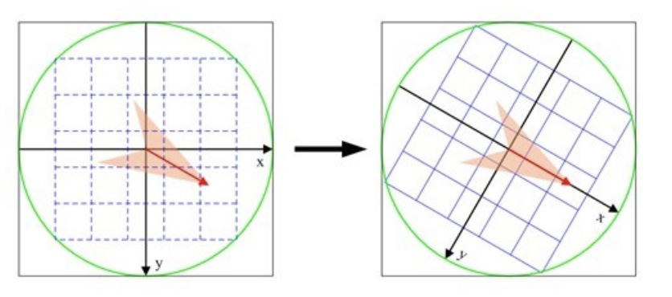

- **插值法确定像素梯度：**

  - 计算子区域内的像素的梯度，并按照σ=0.5d进行高斯加权；
  - 然后插值计算得到每个种子点的八个方向的梯度，插值方法如下图所示：

  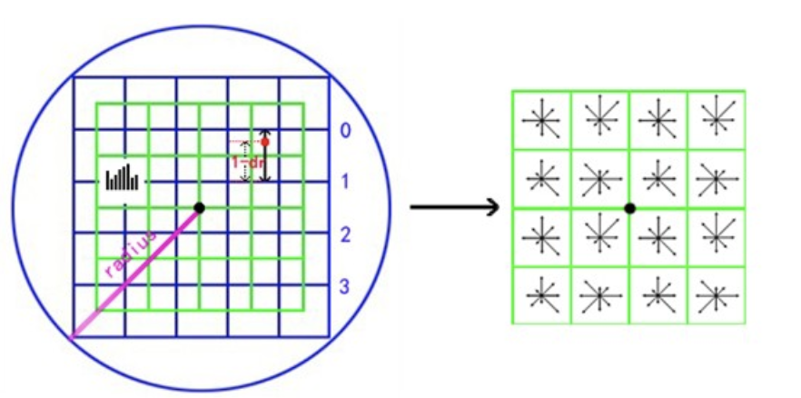

- **插值法的解释：**

  - 每个种子点的梯度都是由覆盖其的4个子区域插值而得的；
  - 如图中的红色点，落在第0行和第1行之间，对这两行都有贡献；
  - 对第0行第3列种子点的贡献因子为$dr$，对第1行第3列的贡献因子为$1-dr$；
  - 同理，对邻近两列的贡献因子为$dc$和$1-dc$，对邻近两个方向的贡献因子为$do$和$1-do$；
  - 则最终累加在每个方向上的梯度大小为：

  $$
  weight=w∗dr^k(1−dr)^{(1−k)}dc^m(1−dc)^{1−m}do^n(1−do)^{1−n}
  $$

  - 如上统计$4∗4∗8=128$个梯度信息即为该关键点的特征向量，按照特征点的对每个关键点的特征向量进行排序，就得到了SIFT特征描述向量；


## 第五十二节课：4-3_SIFT算法总结与SURF算法简介

### 1.SIFT算法的总结

- SIFT在图像的不变特征提取方面拥有无与伦比的优势，但并不完美：
  - **存在实时性不高，有时特征点较少；**
  - **对边缘光滑的目标无法准确提取特征点等缺陷；**

- 自SIFT算法问世以来，人们就一直对其进行优化和改进，其中最著名的就是**SURF算法**；


### 2.SURF算法

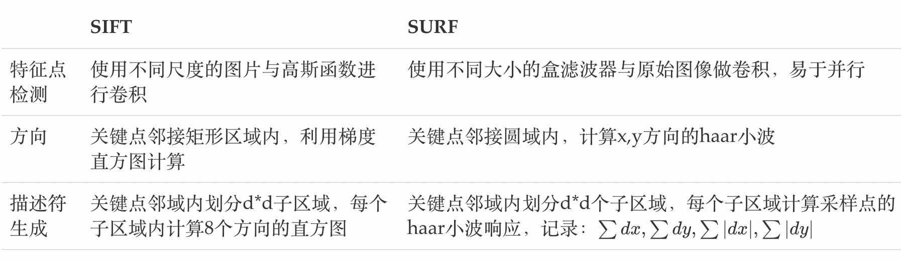


## 第五十三节课：4-3_SIFT算法实现

### 1.实例化sift

```python
sift = cv.xfeatures2d.SIFT_create()
```

### 2.利用sift.detectAndCompute()检测关键点并计算

- **API：**

```python
kp,des = sift.detectAndCompute(gray,None)
```

- **参数：**
  - gray：进行关键点检测的图像，注意是灰度图像；
- **返回：**
  - kp：关键点信息，包括位置，尺度，方向信息；
  - des：关键点描述符，每个关键点对应128个梯度信息的特征向量；


### 3.将关键点检测结果绘制在图像上

```python
cv.drawKeypoints(image, keypoints, outputimage, color, flags)
```

- **参数：**

  - image：原始图像；

  - keypoints：关键点信息，将其绘制在图像上；

  - outputimage：输出图片，可以是原始图像；

  - color：颜色设置，通过修改（b,g,r）的值，更改画笔的颜色，b=蓝色，g=绿色，r=红色；

  - flags：绘图功能的标识设置

    - cv2.DRAW_MATCHES_FLAGS_DEFAULT：创建输出图像矩阵，使用现存的输出图像绘制匹配对和特征点，对每一个关键点只绘制中间点；

    - cv2.DRAW_MATCHES_FLAGS_DRAW_OVER_OUTIMG：不创建输出图像矩阵，而是在输出图像上绘制匹配对；

    - cv2.DRAW_MATCHES_FLAGS_DRAW_RICH_KEYPOINTS：对每一个特征点绘制带大小和方向的关键点图形；

    - cv2.DRAW_MATCHES_FLAGS_NOT_DRAW_SINGLE_POINTS：单点的特征点不被绘制；


### 4.上机实验

```python
# SIFT算法示例代码

import cv2 as cv
import numpy as np
import matplotlib.pyplot as plt

# 设置字体为微软雅黑
plt.rcParams['font.family'] = 'Microsoft YaHei'
plt.rcParams['axes.unicode_minus'] = False

# 1 读取图像
img = cv.imread('../../images/Chapter4/tv.jpg')
gray= cv.cvtColor(img,cv.COLOR_BGR2GRAY)

# 2 sift关键点检测
# 2.1 实例化sift对象
sift = cv.SIFT_create()
# 2.2 关键点检测：kp关键点信息包括方向，尺度，位置信息，des是关键点的描述符
kp,des=sift.detectAndCompute(gray,None)
# 2.3 在图像上绘制关键点的检测结果
cv.drawKeypoints(img,kp,img,flags=cv.DRAW_MATCHES_FLAGS_DRAW_RICH_KEYPOINTS)

# 3 图像显示
plt.figure(figsize=(8,6),dpi=100)
plt.imshow(img[:,:,::-1]),plt.title('sift检测')
plt.xticks([]), plt.yticks([])
plt.show()

```


## 第五十四节课：4-4_FAST算法原理

### 1.FAST算法的原理

#### 1.1 背景

- 前面介绍的几个特征检测器，它们的效果都很好，但是从实时处理的角度来看，效率还是太低了；
- 为了解决这个问题，FAST算法可以解决上面的问题；

#### 1.2 FAST的介绍

- **FAST**，全称Features from accelerated segment test，是一种用于角点检测的算法；
- 该算法的原理是取图像中检测点，以该点为圆心的周围邻域内像素点判断检测点是否为角点；
- 通俗的讲就是**若一个像素周围有一定数量的像素与该点像素值不同，则认为其为角点**；

#### 1.3 FAST算法的基本流程

- 在图像中选取一个像素点 p，来判断它是不是关键点，$$I_p$$等于像素点 p的灰度值；

- 以r为半径画圆，覆盖p点周围的**M个像素**，通常情况下，设置**r=3，则M=16**，如下图所示：

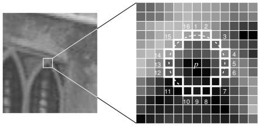

- **阈值判断：**
  - 设置一个阈值t，用于比较像素及其周围情况；
  - 若16个像素点中存在**n个连续像素点**灰度值都高于$$I_p + t$$或低于$$I_p - t$$，则像素点p被认为是角点；
  - 如上图中的虚线所示，n一般取值为12；

- **效率优化：**
  - 图像大部分不是特征点，若全部像素都计算，仍然无法满足实时性的要求 ；
  - 因此采用一种进行**非特征点判别**的方法：
    - 首先对候选点的周围每个90度的点：1，9，5，13进行测试；
    - 先测试1和19, 如果它们符合阈值要求再测试5和13；
    - 如果p是角点，那么这四个点中至少有3个要符合阈值要求，否则直接剔除；
    - 对保留下来的点再继续进行测试（是否有12的点符合阈值要求）； 

#### 1.4 FAST算法的缺点

虽然这个检测器的效率很高，但它有以下几条缺点：

- 获得的候选点比较多；
- 特征点的选取不是最优的，因为它的效果取决与要解决的问题和角点的分布情况；
- 进行非特征点判别时大量的点被丢弃；
- 检测到的很多特征点都是相邻的；

前 3 个问题可以通过机器学习的方法解决，最后一个问题可以使用非最大值抑制的方法解决；且注意，**FAST算法只有角点检测，没有特征描述**。


### 2.机器学习的角点检测器

- 选择一组训练图片（最好是跟最后应用相关的图片）；

- 使用FAST算法找出每幅图像的特征点，图像中每一个特征点，将其周围的16个像素存储构成一个向量P：

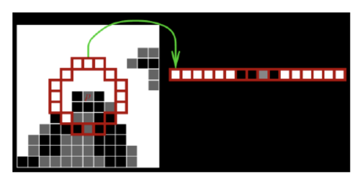

- 每一个特征点的 16 像素点都属于下列三类中的一种


- 根据这些像素点的分类，特征向量 P 也被分为 3 个子集：Pd ，Ps ，Pb；

- 定义一个新的布尔变量$$K_p$$，如果 p 是角点就设置为 Ture，如果不是就设置为 False；

- 利用特征值向量p，目标值是$K_p$，训练ID3 树（决策树分类器）；

- 将构建好的决策树运用于其他图像的快速的检测；


### 3.非极大值抑制

- 在筛选出来的候选角点中有很多是紧挨在一起的，需要通过非极大值抑制来消除这种影响；

- **解决方法：**

  - 为所有的候选角点都确定一个打分函数$$V $$ ， $$V $$的值可这样计算：

    - 先计算$$I_p$$与圆上16个点的像素值差值，取绝对值，再将这16个绝对值相加，就得到了$$V $$的值：

    $$
    V = \sum_{i}^{16}|I_p-I_i|
    $$

  - 最后比较毗邻候选角点的V值，把V值较小的候选角点pass掉；


## 第五十五节课：4-4_FAST算法实现

OpenCV中的FAST检测算法是**用传统方法实现的**，即没有使用机器学习的方法。

### 1.实例化fast

```python
fast = =cv.FastFeatureDetector_create(threshold, nonmaxSuppression)
```

- **参数：**
  - threshold：阈值t，有默认值10；
  - nonmaxSuppression：是否进行非极大值抑制，默认值True；

- **返回：**
  - Fast：创建的FastFeatureDetector对象；


### 2.利用fast.detect检测关键点，没有对应的关键点描述

```python
kp = fast.detect(grayImg, None)
```

- **参数：**
  - ray：进行关键点检测的图像，注意是灰度图像；

- **返回：**
  - kp：关键点信息，包括位置，尺度，方向信息；


### 3.将关键点检测结果绘制在图像上

```python
cv.drawKeypoints(image, keypoints, outputimage, color, flags)
```


### 4.上机实验

```python
# FAST算法的示例代码

import numpy as np
import cv2 as cv
from matplotlib import pyplot as plt

# 设置字体为微软雅黑
plt.rcParams['font.family'] = 'Microsoft YaHei'
plt.rcParams['axes.unicode_minus'] = False

# 1 读取图像
img = cv.imread('../../images/Chapter4/tv.jpg')

# 2 Fast角点检测
# 2.1 创建一个Fast对象，传入阈值，注意：可以处理彩色空间图像
fast = cv.FastFeatureDetector_create(threshold=30)

# 2.2 检测图像上的关键点
kp = fast.detect(img,None)

# 2.3 在图像上绘制关键点
img2 = cv.drawKeypoints(img, kp, None, color=(0,0,255))

# 2.4 输出默认参数
print( "Threshold: {}".format(fast.getThreshold()) )
print( "nonmaxSuppression:{}".format(fast.getNonmaxSuppression()) )
print( "neighborhood: {}".format(fast.getType()) )
print( "Total Keypoints with nonmaxSuppression: {}".format(len(kp)) )

# 2.5 关闭非极大值抑制
fast.setNonmaxSuppression(0)
kp = fast.detect(img,None)
print( "Total Keypoints without nonmaxSuppression: {}".format(len(kp)) )

# 2.6 绘制为进行非极大值抑制的结果
img3 = cv.drawKeypoints(img, kp, None, color=(0,0,255))

# 3 绘制图像
fig,axes=plt.subplots(nrows=1,ncols=2,figsize=(10,8),dpi=100)
axes[0].imshow(img2[:,:,::-1])
axes[0].set_title("加入非极大值抑制")
axes[1].imshow(img3[:,:,::-1])
axes[1].set_title("未加入非极大值抑制")
plt.show()

```


## 第五十六节课：4-4_ORB算法原理

- SIFT和SURF算法是**受专利保护**的，在使用他们时我们是要付费的；
- ORB（Oriented Fast and Rotated Brief）不需要收费；
- 它可以用来**对图像中的关键点快速创建特征向量**，并用这些特征向量来识别图像中的对象；

### 1.ORB算法原理

- ORB算法**结合了Fast和Brief算法**，提出了构造金字塔，**为Fast特征点添加了方向**，从而使得关键点具有了尺度不变性和旋转不变性；

- **具体流程描述如下：**

  - **构造尺度金字塔：**

    - 金字塔共有n层，与SIFT不同的是，**每一层仅有一幅图像**，第s层的尺度为：

    $$
    \sigma_s=\sigma_0^s
    $$

  - **图像的尺度关系：**

    - $$\sigma_0$$是初始尺度，默认为1.2，原图在第0层；
    - 第s层图像的大小为：

    $$
    SIZE = (H*\frac{1}{\sigma_s})\times(W*\frac{1}{\sigma_s})
    $$

  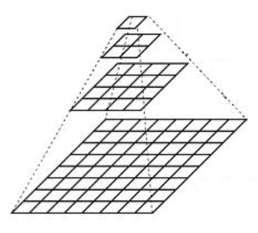

  - **图像的操作：**
    - 在不同的尺度上利用Fast算法检测特征点，采用Harris角点响应函数，根据角点的响应值排序，选取前N个特征点，作为本尺度的特征点；
    - 计算特征点的主方向，计算以特征点为圆心半径为r的圆形邻域内的灰度质心位置，将从特征点位置到质心位置的方向做特征点的主方向；
  - **上述的计算方法如下：**
    - $m_{pq}=\sum_{x,y}x^py^qI(x,y)$
    - 质心的位置：$C=(\frac{m_{10}}{m_{00}},\frac{m_{01}}{m_{10}})$；
    - 主方向：$\theta = arctan(m_{01},m_{10})$；
  - **旋转不变性问题：**
    - 为了解决旋转不变性，将特征点的邻域旋转到主方向上利用Brief算法构建特征描述符；
    - 至此就得到了ORB的特征描述向量；


### 2.BRIEF算法

#### 2.1 背景

- **FAST的缺点：**
  - **FAST没有旋转不变性**，在前面中已经解决了这个问题；
  - 除此之外，**FAST算法还没有特征描述**；
- **BRIEF算法的作用：**
  - BRIEF是一种**特征描述子提取算法**，非特征点提取算法，一种生成**二值**化描述子的算法，不提取代价低；
  - 匹配只需要使用简单的**汉明距离(Hamming Distance)**，利用比特之间的异或操作就可以完成；

#### 2.2 BRIEF算法的步骤

- **图像滤波**

  - 原始图像中存在噪声时，会对结果产生影响，所以需要对图像进行滤波，去除部分噪声；

- **选取点对**

  - 以特征点为中心，取S*S的邻域窗口，在窗口内随机选取N组点对，一般N=128,256,512，默认是256；
  - 随机点对选取，提供了五种形式，结果如下图所示：
    - x,y方向平均分布采样；
    - x,y均服从Gauss(0,S^2/25)各向同性采样；
    - x服从Gauss(0,S^2/25)，y服从Gauss(0,S^2/100)采样；
    - x,y从网格中随机获取；
    - x一直在(0,0)，y从网格中随机选取；
  - 各种形式的效果如图所示：
    - 图中**一条线段的两个端点就是一组点对，其中第二种方法的结果比较好**；

  

- **构建描述符**

  - 假设x,y是某个点对的两个端点，p(x),p(y)是两点对应的像素值，则有：

  $$
  t(x,y)=\begin{cases}1	&if p(x)>p(y)\\
  0&	else\end{cases}
  $$

  

  - 对每一个点对都进行上述的二进制赋值，形成BRIEF的关键点的描述特征向量；
  - 该向量一般为128-512位的字符串，其中仅包含 1 和 0，如下图所示：

  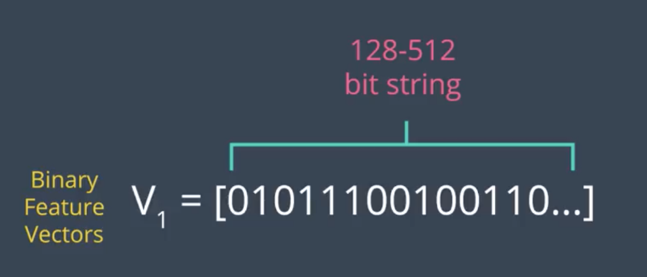


## 第五十七节课：4-4_ORB算法实现

### 1.实例化ORB

- **API：**

```python
orb = cv.xfeatures2d.orb_create(nfeatures)
```

- **参数：**
  - nfeatures：特征点的最大数量；


### 2.利用orb.detectAndCompute()检测关键点并计算

```python
kp,des = orb.detectAndCompute(gray,None)
```

- **参数：**
  - gray：进行关键点检测的图像，注意是灰度图像；

- **返回：**
  - **kp：关键点信息，包括位置，尺度，方向信息；**
  - **des：关键点描述符，每个关键点BRIEF特征向量，二进制字符串；**


### 3.将关键点检测结果绘制在图像上

```python
cv.drawKeypoints(image, keypoints, outputimage, color, flags)
```


### 4.上机实验

```Python
# ORB算法的示例代码

import numpy as np
import cv2 as cv
from matplotlib import pyplot as plt

# 设置字体为微软雅黑
plt.rcParams['font.family'] = 'Microsoft YaHei'
plt.rcParams['axes.unicode_minus'] = False

# 1 读取图像
img = cv.imread('../../images/Chapter4/tv.jpg')

# 2 ORB角点检测
# 2.1 实例化ORB对象
orb = cv.ORB_create(nfeatures=500)

# 2.2 检测关键点,并计算特征描述符
kp,des = orb.detectAndCompute(img,None)

print(des.shape)

# 3 将关键点绘制在图像上
img2 = cv.drawKeypoints(img, kp, None, color=(0,0,255), flags=0)

# 4. 绘制图像
plt.figure(figsize=(10,8),dpi=100)
plt.imshow(img2[:,:,::-1])
plt.xticks([]), plt.yticks([])
plt.show()

```

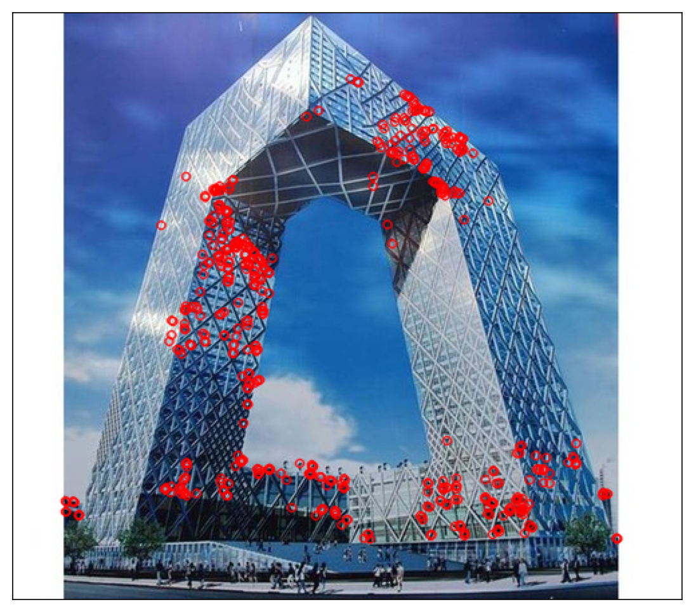


## 第五十八节课：4-4_FAST和ORB算法总结

- **Fast算法**
  - 原理：若一个像素周围有一定数量的像素与该点像素值不同，则认为其为角点；
  - API：cv.FastFeatureDetector_create()

- **ORB算法**
  - 原理：是FAST算法和BRIEF算法的结合；
  - API：cv.ORB_create()


# 第五章：视频操作

本章主要讲解OpenCV中的视频操作，主要内容有：

- 视频文件的读取和存储；
- **视频追踪中的meanshift和camshift算法**；


## 第五十九节课：5-1_视频读取与显示

### 1.视频读取和显示的步骤

在OpenCV中要获取一个视频并播放，一般通过如下步骤：

- **创建读取视频的对象**

  - **API：**

  ```python
  cap = cv.VideoCapture(filepath)
  ```

  - **参数：**
    - filepath：视频文件路径；
    - **如果参数写0即为电脑摄像头的视频文件；**

- **视频的属性信息**

  - **API：**

  ```python
  retval = cap.get(propId)
  ```

  - **参数：**

    - pId：从0到18的数字，每个数字表示视频的属性；
    - 常用属性有：

    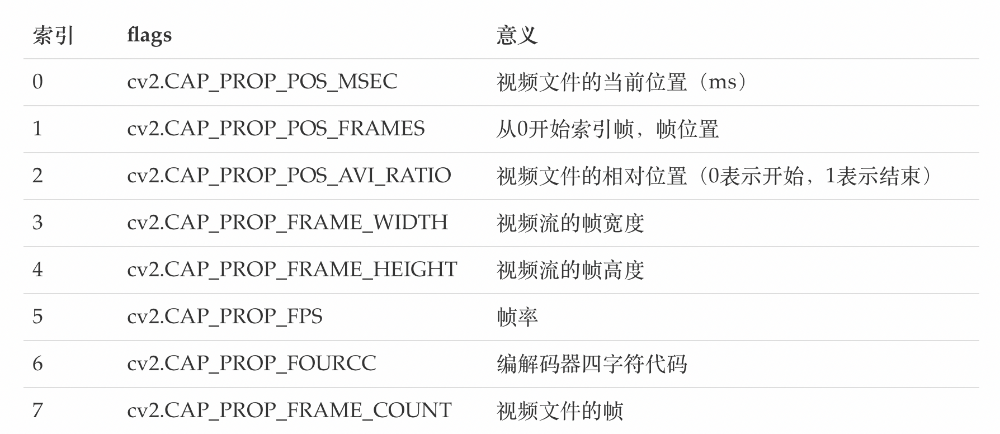

- **修改视频的属性信息**

  - **API：**

  ```python
  cap.set(propId，value)
  ```

  - **参数：**
    - proid：属性的索引，与上面的表格相对应；
    - value：修改后的属性值；

- **判断图像是否读取成功**

  - **API：**

  ```python
  isornot = cap.isOpened()
  ```

  - **返回值：**
    - 若读取成功则返回true，否则返回False；

- **获取视频的一帧图像**

  - **API：**

  ```python
  ret, frame = cap.read()
  ```

  - **参数：**
    - ret：若获取成功返回True，获取失败，返回False；
    - Frame：获取到的某一帧的图像；

- **视频的显示**

  - 调用**cv.imshow()**显示图像，在显示图像时使用cv.waitkey()设置适当的持续时间；
  - 如果太低视频会播放的非常快，如果太高就会播放的非常慢；
  - 通常情况下我们设置25ms就可以了；

- **视频文件的关闭**

  - 最后，调用cap.realease()将视频释放掉；


### 2.上机实验

```python
# 视频读取和显示的示例代码

import numpy as np
import cv2 as cv

# 1.获取视频对象
cap = cv.VideoCapture('../../images/Chapter5/DOG.wmv')
# cap = cv.VideoCapture(0)

# 2.判断是否读取成功
while(cap.isOpened()):
    # 3.获取每一帧图像
    ret, frame = cap.read()

    # 4. 获取成功显示图像
    if ret == True:
        cv.imshow('frame',frame)

    # 5.每一帧间隔为25ms
    if cv.waitKey(25) & 0xFF == ord('q'):
        break

# 6.释放视频对象
cap.release()
cv.destoryAllWindows()

```


## 第六十节课：5-1_视频文件保存

### 1.API介绍

#### 1.1 创建视频写入对象的API

- API：

```python
out = cv2.VideoWriter(filename,fourcc, fps, frameSize)
```

- 参数：
  - filename：视频保存的位置；
  - fourcc：指定视频编解码器的4字节代码；
  - fps：帧率；
  - frameSize：帧大小；

#### 1.2 设置视频的编解码器的API

- API：

```
retval = cv2.VideoWriter_fourcc(c1, c2, c3, c4)
```

- 参数：
  - c1,c2,c3,c4：是视频编解码器的4字节代码；
  - 在[fourcc.org](http://www.fourcc.org/codecs.php)中找到可用代码列表，与平台紧密相关，常用的有：
    - 在Windows中：DIVX（.avi）；
    - 在OS中：MJPG（.mp4）、DIVX（.avi）、X264（.mkv）；

#### 1.3 视频的写入

- **读取：**
  - 利用**cap.read()**获取视频中的每一帧图像；
  - 并使用**out.write()**将某一帧图像写入视频中；

- **释放：**
  - 使用**cap.release()和out.release()**释放资源；


### 2.上机实验

```python
import cv2 as cv
import numpy as np

# 1. 读取视频
cap = cv.VideoCapture("DOG.wmv")

# 2. 获取图像的属性（宽和高，）,并将其转换为整数
frame_width = int(cap.get(3))
frame_height = int(cap.get(4))

# 3. 创建保存视频的对象，设置编码格式，帧率，图像的宽高等
out = cv.VideoWriter('outpy.avi',cv.VideoWriter_fourcc('M','J','P','G'), 10, (frame_width,frame_height))

while(True):
    # 4.获取视频中的每一帧图像
    ret, frame = cap.read()
    if ret == True: 
        # 5.将每一帧图像写入到输出文件中
        out.write(frame)
    else:
        break 

# 6.释放资源
cap.release()
out.release()
cv.destroyAllWindows()

```


## 第六十一节课：5-1_视频读写总结

- **读取视频：**
  - 读取视频：cap = cv.VideoCapture()；
  - 判断读取成功：cap.isOpened()；
  - 读取每一帧图像：ret,frame = cap.read()；
  - 获取属性：cap.get(proid)；
  - 设置属性：cap.set(proid,value)；
  - 资源释放：cap.release()；

- **保存视频：**
  - 保存视频： out = cv.VideoWrite()；
  - 视频写入：out.write()；
  - 资源释放：out.release()；


## 第六十二节课：5-2_meanshift原理


## 第六十三节课：5-2_meanshift实现


## 第六十四节课：5-2_camshift算法及总结


# 第六章：案例


## 第六十五节课：6-1_人脸检测基础


## 第六十六节课：6-2_人脸检测实现


## 第六十七节课：6-3_人脸检测总结


