第一节课：ROS是什么

## 1.手机操作系统

### 1.1 以前的手机开发模式


### 1.2 后来的手机开发模式

- **Android：**

  - Linux——>Android：

  - Android在Linux内核的基础上添加了原生App，并集成了一个虚拟环境可以运行Java开发的应用；
  - 开发者只要将应用上传到应用商店即可下载；

- **IOS：**
  - 一个完整的iphone操作系统，运行方式同Android；


## 2.机器人操作系统

### 2.1 以前的机器人开发模式

- 每造一台机器人就需要从硬件到软件重新开发一遍；

### 2.2 后来的机器人开发模式

- **“模块化”的开发方式：**
  - 每个传感器对应一个特定的程序模块、每个执行器对应一个特定的程序模块、每个算法对应一个特定的程序模块;
  - 下次再开发机器人时，只需要把它们组合起来就可以跑了；
- **“分布式”的开发方式：**
  - 每个模块可以独立运行在不同的电脑;
  - 比如用单独的电脑运行视觉算法，这样整体的效率就大大提高了；


### 2.3 ROS的介绍

- **ROS的模式**
  
  - 每个**“launch”**文件是**一个乐高房子**；
  - 每个node相当于**一个乐高砖块**；
  - 而每个Package相当于是**一袋乐高砖块**；
  
- **ROS的开发方式：**

  - 从官方**APT源**中下载安装包；
  - 从**Github**中下载源码；
  - 自己按照**接口规范**写源码并编译运行；

  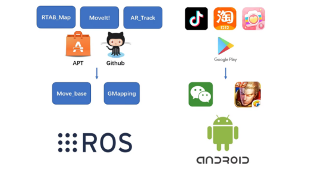


# 第二节课：如何学习ROS

## 1.搭建环境

- 目的：**安装Ubuntu＋安装ROS**；

- ROS版本选择：ROS的版本更新主要是为了适应Ubuntu更新中大量依赖库的更新，两者的更新基本保持统一步调；


## 2.学习的方式

- 自己买一个机器人；
- 基于ROS自带的仿真环境进行学习；


# 第三节课：Ubuntu系统的安装

Ubuntu系统的安装主要可以有以下几种选择：

- 虚拟机方式；
- 双系统的方式；
- WSL的方式；
- 安装在树莓派上；


# 第四节课：Ubuntu使用入门

## 1.程序菜单和任务栏

- 左下角——>开始；
- 添加到收藏夹——>任务栏；

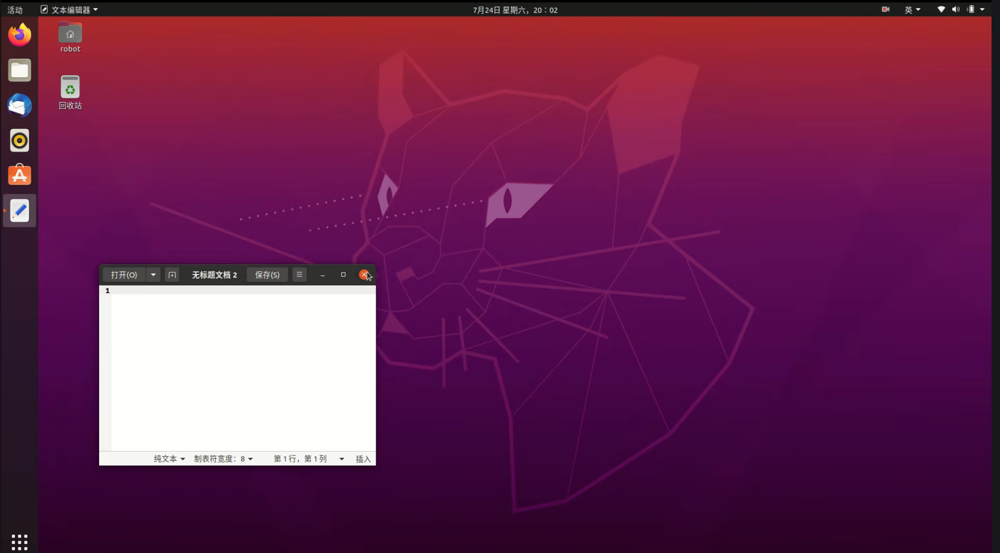


## 2.输入法中英文切换

- Shift或Alt＋Space；
- 若不行就自行安装中文包；


## 3.Ubuntu文件系统

- **主目录：**
  - 即HOME目录；
  - 可通过：cd ~快速回到主目录
- **根目录/：**
  - 整个系统的系统盘；
- 大部分时间都只需要在主目录下操作即可；

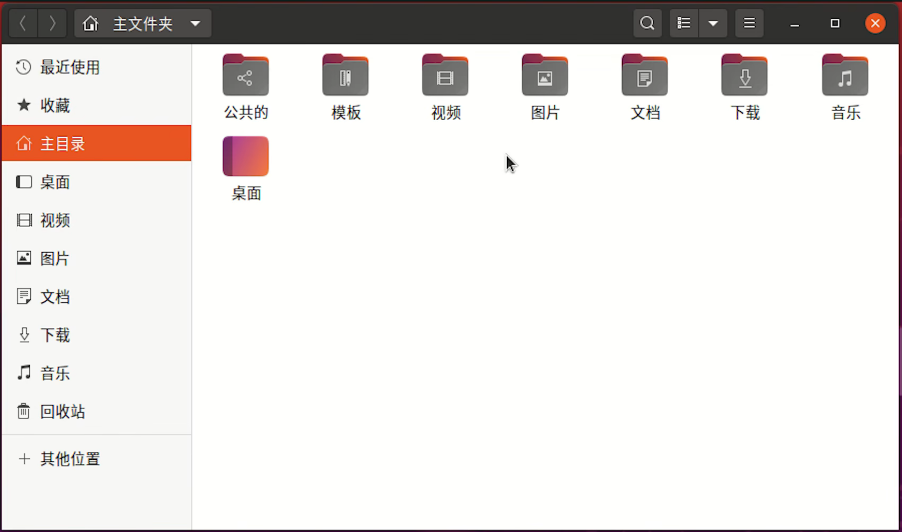


## 4.连接无线网

- 非虚拟机：像平常电脑一样连接WiFi即可；

- 虚拟机：只要主机连接了WiFi，它就会连接；

- 注意几种连接方式的不同（NAT、桥接等）、如何给虚拟机配置代理（ip地址）


## 5.终端程序和常用指令

- **终端程序的开启：**
  - 在开始菜单中启动；
  - 快捷键：Ctrl+Alt+T；

- **ls指令：**
  - 列出当前文件夹的内容；
  - 列出所有文件包括隐藏文件：**ls -a**；

- **mkdir指令：**
  - **mkdir [文件夹名称]**；
  - 用于在当前文件夹在创建文件夹；

- **cd指令：**
  - **cd [相对路径/绝对路径]**；
  - 用于切换目录；
  - 注意“cd ..”是返回父目录；

- **Tab键：**
  - 自动补全；


## 6.文本编辑器——gedit

- **edit命令：**
  - **gedit [文件名称]**；
  - 是一个文本编辑器（Windows中的记事本）；
  - 我们要改某个文件的内容都是通过这个指令来改的；

- **其他文本编辑器：**
  - vim；
  - nano；


## 7.source指令

- **source指令：**
  - **source [文件名]**；
  - 它会执行这个文件中的一系列指令；

- **.sh文件：**
  - 一般会把一连串的指令写在.sh文件中；
  - echo指令是打印显示；


## 8.终端启动脚本——.bashrc文件

- **~/.bashrc：**
  - 是一个文件，位于主文件夹里，但是是一个隐藏文件；
  - 其中rc是run command的意思；

- **作用：**
  - 终端的**初始化脚本**；
  - 每次执行终端程序时，都会首先执行这个脚本，完成一些**环境变量的赋值操作**；
  - 在ROS中，可以在该文件下加入ROS的初始化指令；

 

## 9.执行管理员权限

- **sudo指令：**
  - 在某一条指令前面加上sudo就可以以管理员权限运行；

- **从APT源上下载安装包：**
  - sudo install [软件包名称]；


# 第五节课：ROS系统安装

## 0.版本选择：

- 安装的Ubuntu版本是20.04，与之对应的ROS版本是Noetic；
- 与Ubuntu的离线安装不同，ROS的安装就像安装应用一样，需要联网在线安装；


## 1.ROS官方安装步骤

- ROS的官方网站：[ROS官网](https://www.ros.org/)；

- Noetic版本的官方安装教程：[Noetic版本ROS的官方教程](https://wiki.ros.org/noetic/Installation/Ubuntu)；

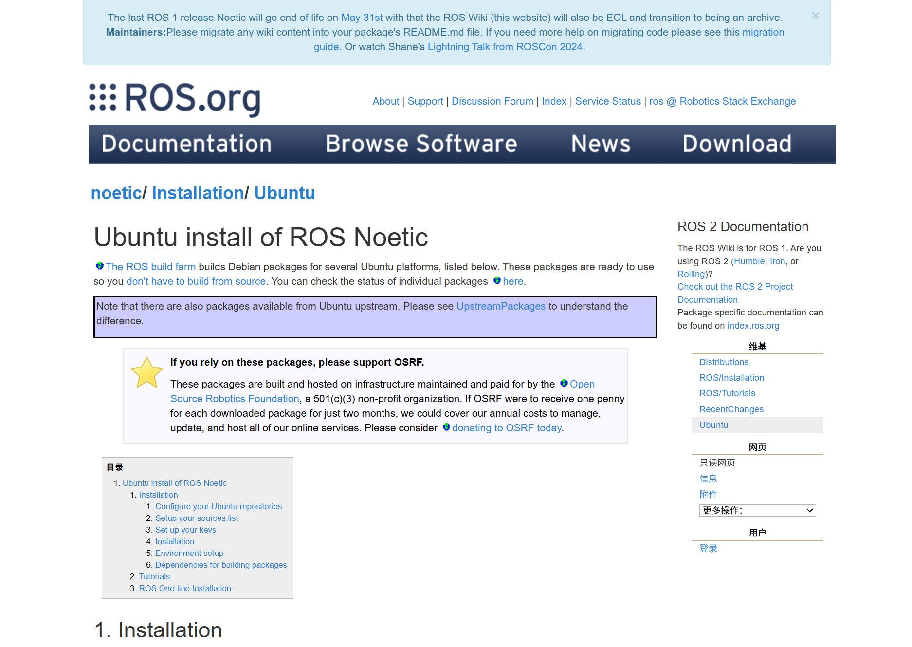 

- **配置Ubuntu的远程仓库**
  - 安装ROS需要先配置Ubuntu的远程仓库；
  - 但一般在安装系统时就配置好了，所以这里不需要再配置；
  - 这里可以选择添加清华源的链接到配置文件中；


## 2.导入ROS安装源

- ROS是一个包含了非常多包的一个集合，这些包都放在一个地方进行管理，那就是**ROS安装源**；
- 我们需要先将ROS的**安装源地址**添加到Ubuntu的**APT包管理器源列表**；
- 这个列表写明了有什么“应用商店”，在初始条件下系统中写有了Ubuntu的官方应用商店，即APT官方源；
- 它会告诉APT包管理器下载ROS包的下载地址；
- 其实就是相当于告诉Ubuntu：我可以从哪些源里面下载软件包，用安卓的角度来说就是给Ubuntu安装了一个ROS的应用商店；

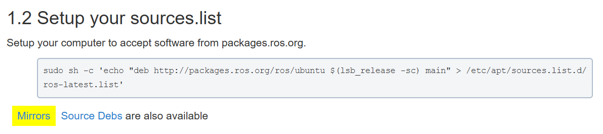

- 官方给的链接是国外的链接，可以点击下方的**Mirrors**选择国内镜像；
- 一共有四个镜像，这里选择中科大，把命令复制到终端执行即可；

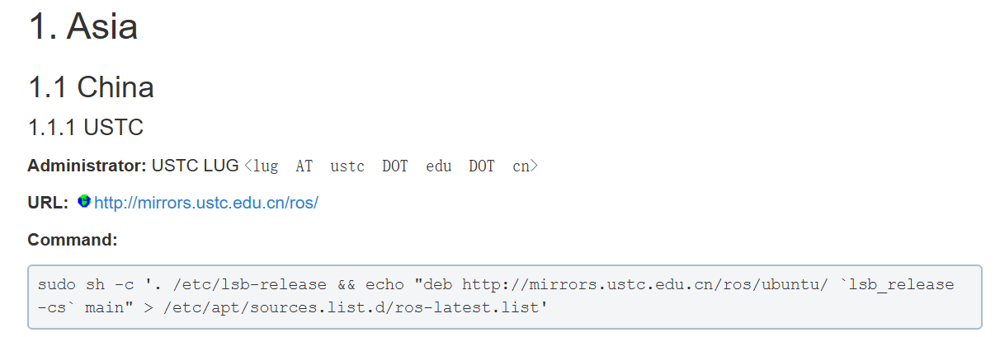

- 最终的运行效果如下：

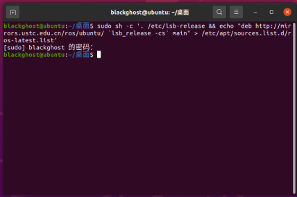


## 3.设置安装密钥

- 第三步是进行密钥安装，复制一下两行代码在终端运行即可，如下图所示：

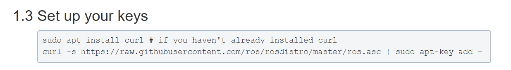 

- 方框中是两条指令：
  - 第一条是安装curl这个工具，复制#前面内容到终端执行；
  - 第二条可分两部分：
    - 管道符前面是从ROS的Github仓库中下载GPG公钥；
    - 管道符后面是将该公钥添加到apt的系统可信密钥库中；
    - 主要是为了后续验证ROS软件包的合法性做准备，防止下载到被篡改的文件；
- 运行两行代码后，若返回“OK”即代表成功安装了密钥。

---

**专栏：Linux中的软件安装**

Linux中的下载可以分为：普通文件下载和APT包管理器安装软件

- **普通下载**：即通过**curl/wget**下载压缩包、文档，它不需要密钥，可随意从任何网站下载，需要用户自己判断安全性；

- **APT包管理器安装软件：这种方式可以分为从Ubuntu官方软件源下载和从第三方软件源下载**
  - 前者在系统安装时已经默认预装了官方的**GPG密钥**，不需手动添加；
  - 后者需要手动添加该第三方的**GPG密钥**，否则APT会拒绝从这个源安装软件；
  - **这种GPG密钥就是git在提交Github时的一种密钥配对协议；**

---


## 4.下载安装ROS

- 接下来安装ROS，分别执行下面两句代码，安装完成即证明ROS安装成功。

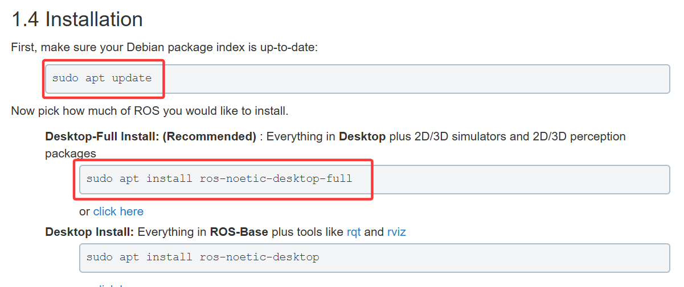 

 

## 5.环境参数设置

- 接下来需要将ROS的环境设置脚本添加到终端程序的初始化脚本里，即.bashrc文件；
- 我们要做的就是在.bashrc文件中source一下ROS的环境设置脚本即可；
- 这样每次打开终端它都会执行一遍ROS的环境参数设置，完成ROS的初始化；

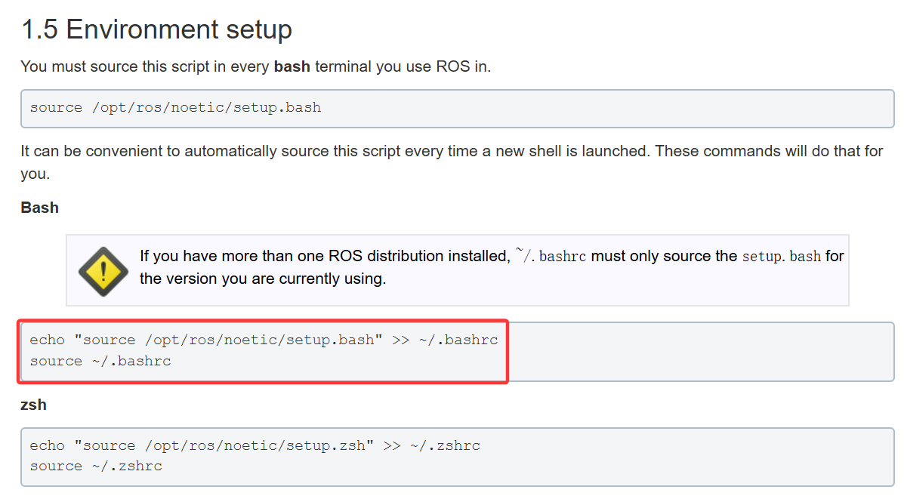

- 分别在终端执行这两句代码即可；
- 如果要测试是否安装成功，可以在终端执行：roscore，出现下面信息表示成功启动了ROS的核心：


 

## 6.rosdep初始化

- 最后还需要对ROS的依赖包工具进行初始化，方便以后下载第三方的扩展软件包；
- 在终端执行下面三条指令，即可完成rosdep的初始化，其中中间框的之前已经安装过了不需要再装；

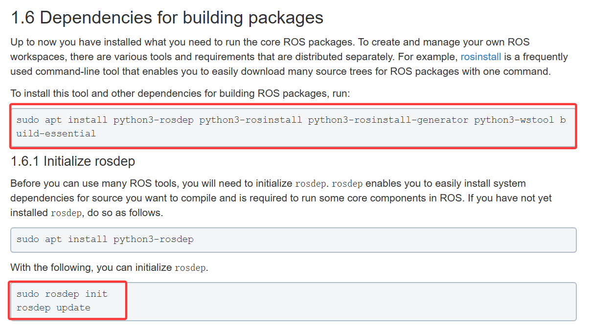


# 第六节课：应用商店APT源

## 1.APT工具介绍

- **定义：**
  - APT是Ubuntu自带的一套软件包下载工具；
  - 可以使用它从网上的源服务器下载指定的软件包并自动安装；
  - 与手机上的应用商店很类似；

- **APT的源列表：**
  - Ubuntu安装时，默认APT的源服务器只有Ubuntu的官方源（应用商店）；
  - 我们可以通过编辑APT的源列表增加新的应用商店；
  - **前面添加的ROS的源，就是添加了ROS的应用商店（前面是中科大的源）**；

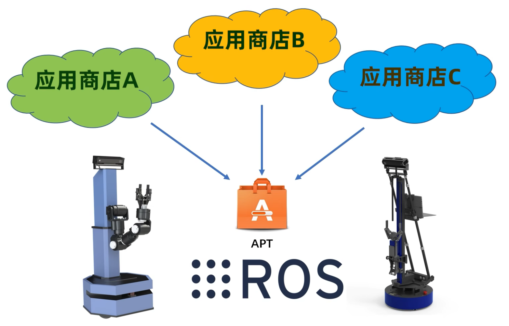


## 2.ROS的“应用商店”

### 2.1 应用商店长什么样

- 应用商店是通俗的叫法，实际上是**存放ROS的各种包的源服务器**，就像**Github那样的托管平**台;
- 网址为：[ROS应用商店网站](https://index.ros.org)

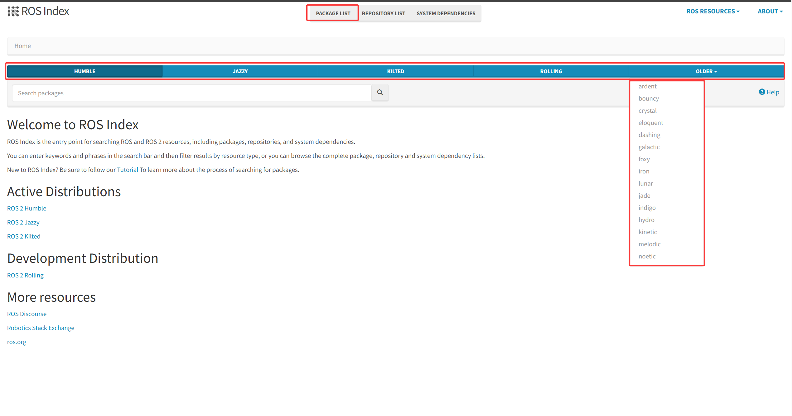

- 可点击**Package List**，网页将展示几乎**所有的ROS的资源，包括软件库、依赖包、源码**等等；

- 当然，我们需要选择我们对应的系统，我们选择了自己的版本：noetic；

- 这些软件包我们都可以通过apt命令来安装，安装的格式是：

  - ```bash
    sudo apt install ros-[ros版本]-name
    ```

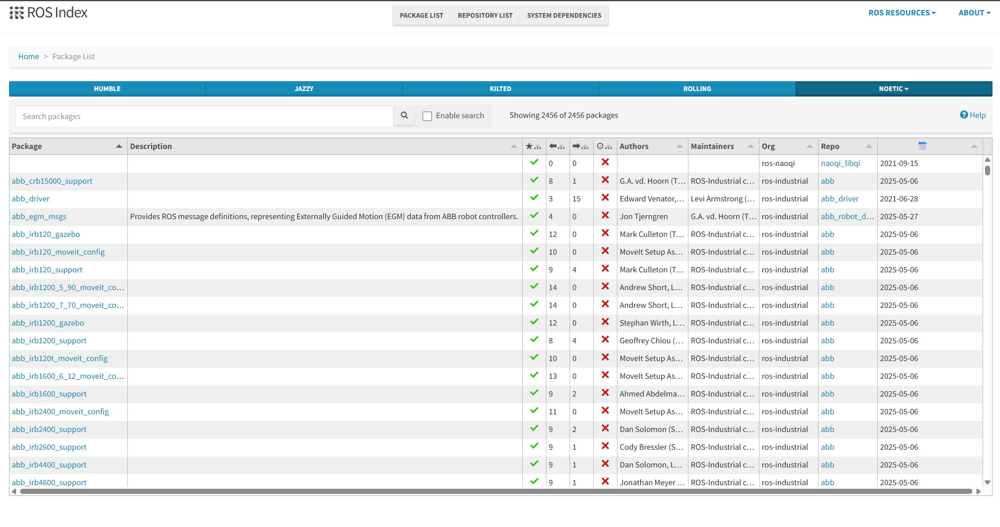

### 2.2 每个软件包长什么样

- 我们选择里面的一个包：**rqt_robot_steering**，双击这个包进入它的界面；
  - 可以看到它们有关于这个包的**基本信息、包的源码信息以及对于这个包的关于作者等的介绍；**
  - **Website**界面有关于这个包的详细介绍；

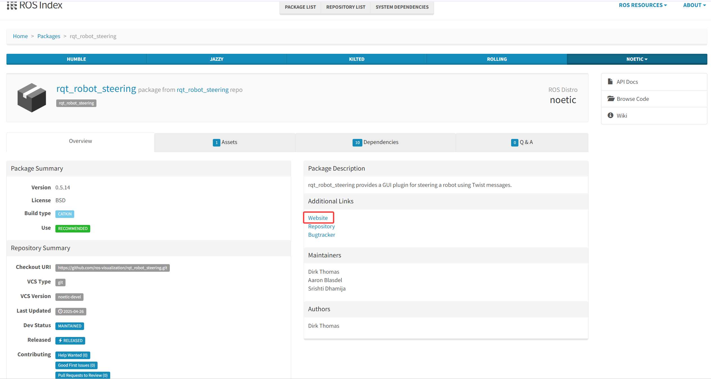 

- 点击右侧的**Website**，进入这个包的具体演示界面，它会详细的描述楚这个包的作用以及如何使用：

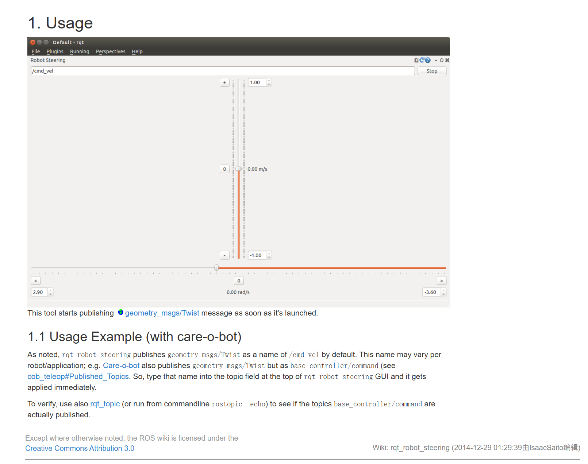


## 3.运行一个ROS实例

### 3.1 rqt_robot_steering实例

以上一小节的**rqt_robot_steering**这个软件包为例，讲解如何**运行一个ROS实例**。

- **安装rqt_robot_steering软件包**

  - ```bash
    sudo apt install ros-noetic-rqt-robot-steering
    ```

  - 终端运行上面指令以安装软件包；

- **运行ROS内核**

  - 另外打开一个终端，运行如下指令：

  - ```bash
    roscore
    ```

- **运行rqt_robot_steering软件包**

  - 在原来的终端中运行：

  - ```bash
    rosrun rqt_robot_steering rqt_robot_steering
    ```

  - 两个rqt_robot_steering：

    - 前面一个是包名称；
    - 后面一个是节点名称；

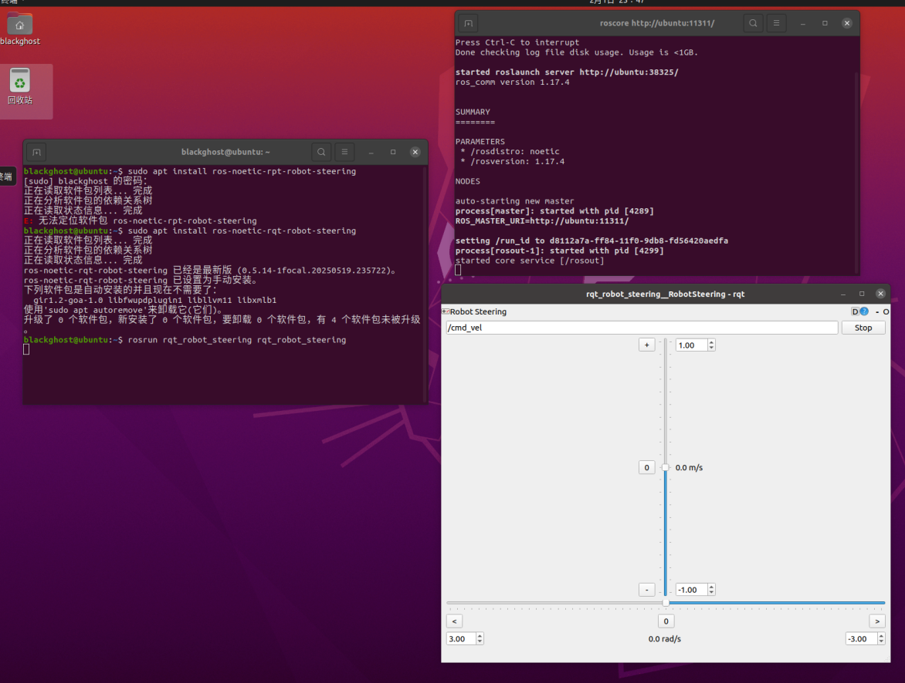 

### 3.2 turtlesim实例

- **再开一个终端，输入指令安装小乌龟：**

  - ```Bash
    sudo apt install ros-noetic-turtlesim
    ```

- **接着在这一个终端运行小乌龟：**

  - ```bash
    rosrun turtlesim turtlesim_node
    ```

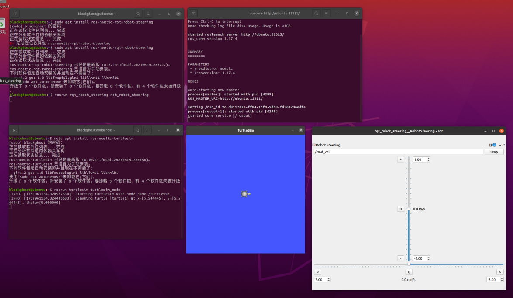 

### 3.3 用rqt_robot_steering控制turtlesim

- 这样，小乌龟出来了，rqt_robot_steering软件包的控制界面也出来了；
- 在软件包界面的输入栏前面加上turtle1（任意写，不然不会启动）；
- 我们就可以用竖直杆控制速度，水平杆控制旋转的方向来完成仿真实验了；


# 第七节课：开源自由市场Github

## 1 Github应用商店

- 除了ROS的官方应用商店，Github中也有很多优质的ROS软件包；
- ROS本身和index.ros上的大部分软件包在Github都开放了源代码；

 

## 2 Github与index.ros的不同

- Github中的软件包都是以**源代码的形式**开源，我们下载下来后还需要**编译**才能运行；
- 所以需要先建立一个**工作空间，来进行源代码编译**；
- 所谓工作空间就是建立一个**符合某种要求的目录结构，编译器会按照这个目录建构去检索源代码完成编译**；

 

## 3 建立目录结构并安装Git工具

### 3.1 建立目录结构

- 目录结构：**HOME——>catkin_ws——>src**；

- 下载的源代码就需要放在src目录里才能正常编译，所以在终端分别执行：

  ```bash
  mkdir catkin_ws
  
  cd catkin_ws
  
  mkdir src
  
  cd src
  ```

- 这样就创建好工作空间了，后续我们自己写的源代码也会放在这个工作空间中；
- **catkin是ROS1中的系统构工具，catkin_ws就是catkin workplace的意思**；

### 3.2 安装Git工具

- 从GitHub下载或上传文件需要用到**git工具**，在终端执行：
- 注意，这句终端执行目录需要在**src目录**下执行；

```bash
sudo apt install git
```

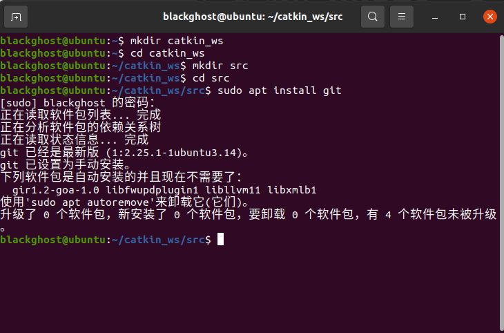


## 4 下载源码包

- 完成上述工作后就可以进行源码的下载了；
- 在GitHub搜索栏中搜索：**wpr_simulation**，找到**6-robot**这一项；
- 点击进入选择**Code按钮**，复制弹出来的一串网址：https://github.com/6-robot/wpr_simulation.git；
- 接着回到终端，执行命令：

```bash
git clone https://github.com/6-robot/wpr_simulation.git
```

- 这样就可以把源代码下载到我们的**src文件夹下了（要保证在src文件夹执行）**；

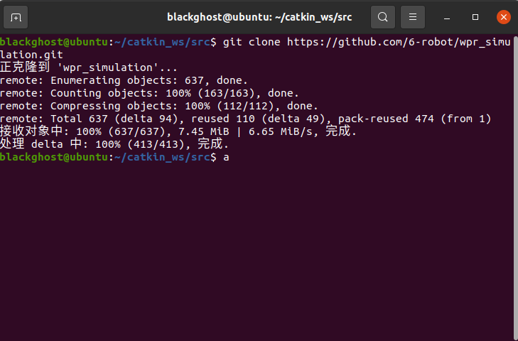

 

## 5 查看下载内容并进行编译

### 5.1 查看文件内容

- **wpr_simulation目录：**
  - 如下图所示即为我们从GitHub上clone下来的文件，全部文件在wpr_simulation文件夹下；

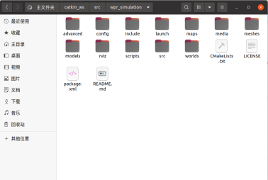

- **scripts文件夹：**
  - 先看**scripts**文件夹，可以看到它里面放了一些**脚本文件(.sh文件)和python程序**；
  - 这些文件主要是完成**依赖包的安装和为机器人映射端口**，这类操作一般进行**一次**即可；

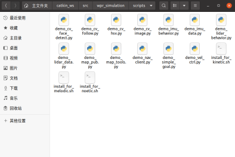

### 5.2 安装依赖包

- **依赖包文件：**

  - 在scripts文件夹下可以看到有**install_for_noetic.sh**文件；
  - 这个就是用于给noetic系统**安装这个项目的依赖包**的执行文件；

- **安装依赖包：**

  - 在这个文件夹下右键，选择在终端打开，然后输入执行下面的指令，输入密码即可安装依赖包；

  ```bash
  ./install_for_noetic.sh
  ```

### 5.3 编译

- 安装好依赖包后，回到工作空间的入口地址：**catkin_ws**；
- **输入catkin_make指令后它自己会读取CMakeList.txt文件并调用系统的gcc编译器进行编译；**
- 然后输入指令，它将会编译**src文件夹下的所有源代码**：

```bash
catkin_make
```

- **注意：catkin_make命令必须要在catkin_ws目录下运行。而不是src子目录，编译后catkin_ws目录会多出几个文件夹，那是编译产生的文件**；

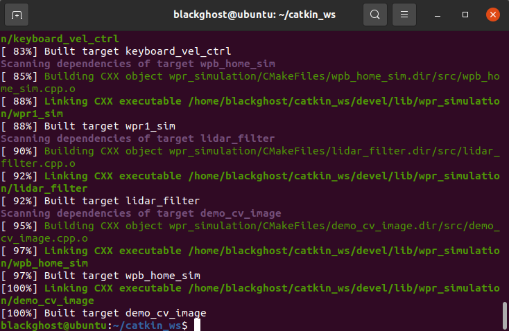


## 6 运行包的功能

### 6.1 加载包的环境参数到终端命令

- 首先需要**将catkin_ws工作空间里的环境参数加载到终端里**，否则运行指令会提示找不到软件包；
- 即**用source指令载入工作空间的环境设置**，终端中执行：

```bash
source ~/catkin_ws/devel/steup.bash
```

### 6.2 运行编译好的ROS程序

- 完成上一步后，即可运行程序，输入指令：

```bash
roslaunch wpr_simulation wpb_simple.launch
```

- 然后就会得到如下界面：

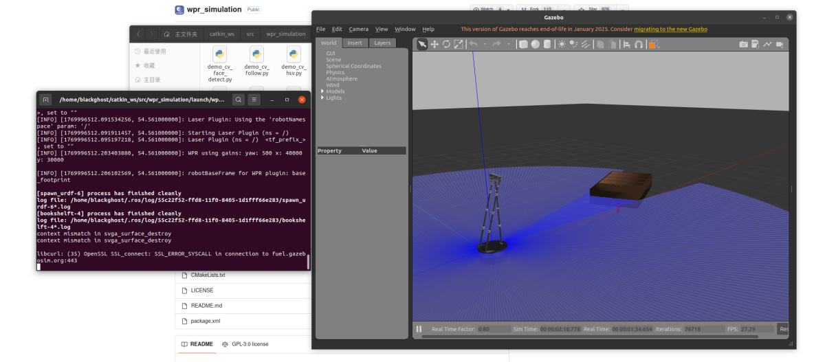 

- 这就是我们后面会经常用到的**仿真环境Gazebo**；
- 再次打开上一节课的**rqt_robot_steering**，删除前面的turtle1，就可以用这个工具控制机器人的运动了；

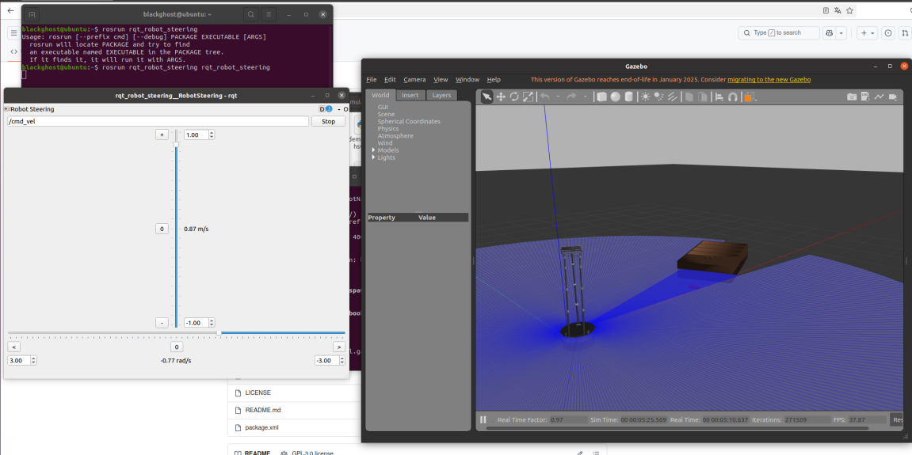 


## 7 将环境参数初始化指令添加到终端初始化脚本中

- 我们当然希望每次启动终端，它就会自动的帮我们初始化环境参数；
- 我们只需要**把source指令加入到~/.bashrc文件**即可；
- 终端中输入：

```bash
gedit ~/.bashrc
```

- 在弹出的文本编辑器中，划到末尾，加上：

```bash
source ~/catkin_ws/devel/setup.bash
```

- 这样，每次启动终端它就会自动帮我们初始化;

 

## 8 修改ROS软件包的源代码

以之前的小乌龟为例，讲解如何**从index.ros到GitHub再自己修改源代码并编译**。

- 打开index.ros，并搜索turtlesim：

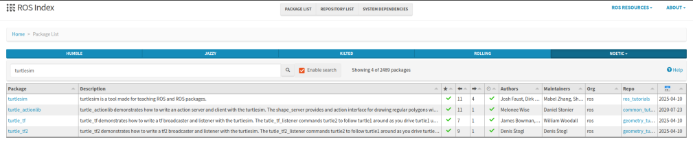 

- 点击第一个，然后点击它的GitHub链接：

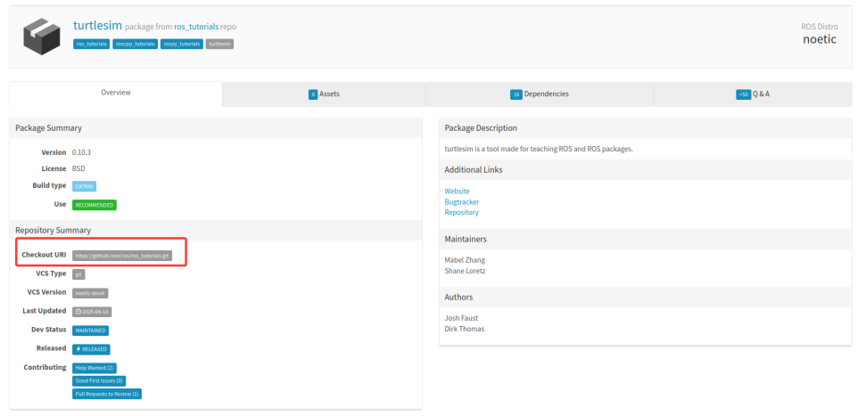 

- 进入Github，点击Code，复制链接：

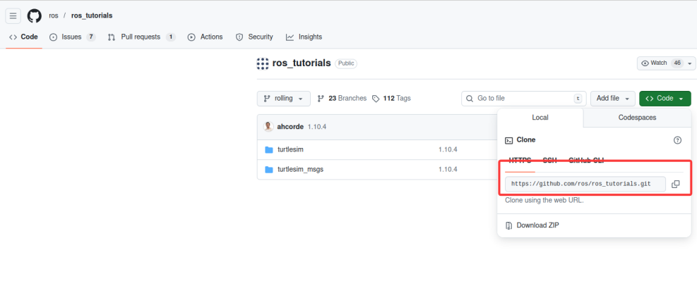 

- 打开终端，切换到src目录下，安装源码：

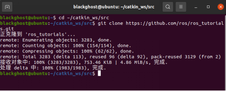

- 切换版本
  - 由于下载默认是ROS2的版本，需要将它切换为ROS1版本，否则会编译报错，依次进行如下操作：
    - 先进入小海龟的文件夹：**cd ros_tutorials/**；
    - 然后切换版本：**git checkout noetic-devel**；

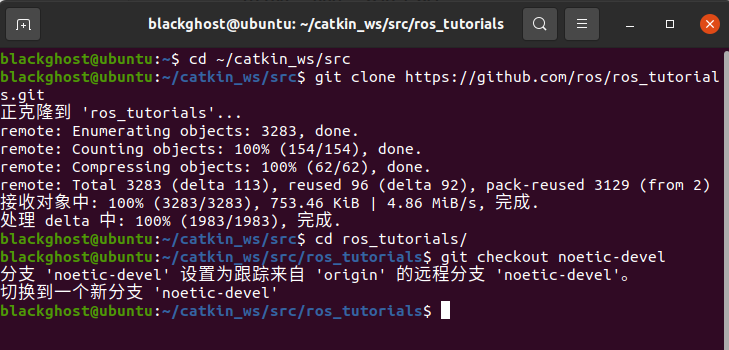

- 编译
  - 切换版本后我们可以进行编译，同样的执行下面代码：
    - 切换回入口：cd ~/catkin_ws；
    - 编译：catkin_make；

- 把小海龟跑起来
  - 编译完成后我们既可以运行这个小海龟了：
    - 先是启动ros内核：**roscore**；
    - 然后新开窗口，运行小海龟：**rosrun turtlesim turtlesim_node**；

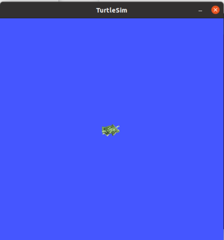

- 修改源代码

  - 打开**"~/catkin_ws/src/ros_tutorials/turtlesim/src/tutrle_frame.cpp"**文件；
  - 修改如下几个地方：改变框的大小和名字还有背景颜色，再次编译并运行；

  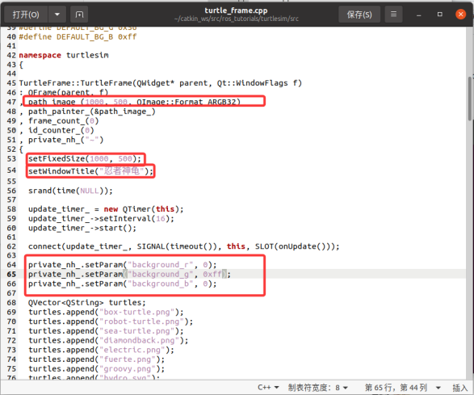

  - 可以看到它的框的大小、名字还有背景颜色都变了；
  - **这就是ROS中修改源代码整个流程和逻辑；**

  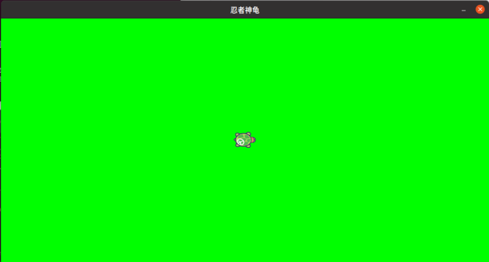

 

## 9 总结

- 这节课讲了**如何从Github中下载源码并进行编译然后运行**；
- 并展示了**如何修改源码增加自己想要的功能**；
- 这就是真正实现工程时的开发逻辑和流程；


# 第八节课：代码神器Visual Studio Code

## 1.VsCode的安装

- **下载安装包**

  - 浏览器搜索VsCode，网页中选择**Ubuntu**，它将自动下载文件至**“下载”文件夹**；

  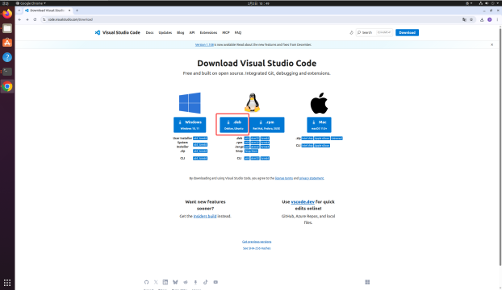

- **安装VsCode**

  - 在“下载”文件夹下，右键选择在终端打开，然后在终端中输入并执行如下指令：

  ```bash
  sudo dpkg -i code_1.108.2-1769004815_amd64.deb
  ```

  - 安装完成后，我们输入指令：**code**，它将运行VsCode，我们可以将其添加到收藏夹；

  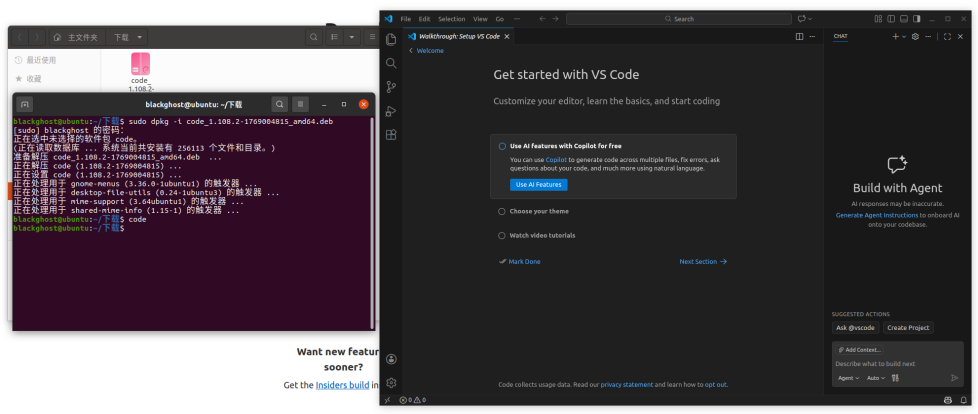

 

## 2.导入工作空间

- 点击File，然后选择“Add Folder to Workspace”；
- 选择之前创建的**catkin_ws文件夹下的src目录**，即可完成工作空间的导入；

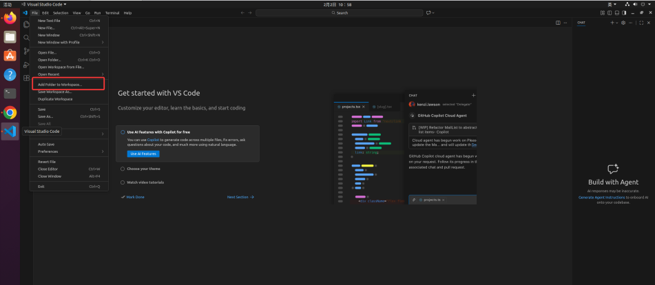 

 

## 3.插件安装

### 3.1 安装简体中文包

- **安装：**
  - 插件广场——Chinese——安装——重启；

- **作用：**
  - 该插件可以把VsCode的界面变成中文；

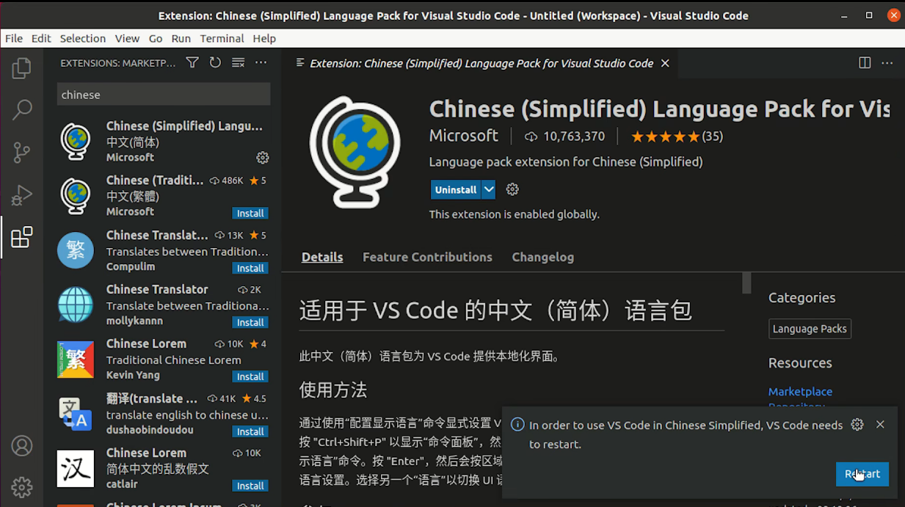

### 3.2 安装ROS插件

- **安装：**
  - 插件广场——ROS——选择**Robot Development Extension for ROS1**——安装；

- **作用：**
  - 这个插件会对**VsCode的设置功能进行一些扩充**，添加一些**ROS的专用菜单项**；
  - 且**代码提示和拼写检查都会加入ROS的编程接口**，非常方便；
  - 且它会**自动安装C/C++以及Python相关的插件**，省得我们再手动安装；

### 3.3 安装CMake插件

- **安装：**
  - 插件广场——CMake——CMake Tools——安装；

- **更新：**
  - 由于插件更新，安装前面的ROS插件时它就自动帮我们安装好CMake Tools了；
  - 但是没有帮我们安装CMake，我们这里可以去安装CMake（当然也可以不装）；
  - 安装CMake Tools后，工作空间下的CMakeLists.txt文件就有颜色区分了；

### 3.4 安装括号颜色插件

- **安装：**
  - 插件广场——bracket——选择Bracket Pair Colorizer 2——安装；

- **更新：**
  - 但是现在的VsCode已经内置这个功能了。

 

## 4.快捷键设置

### 4.1 设置编译快捷键Ctrl＋Shift＋B

- **编译项目：**
  - 按下：**Ctrl＋Shift＋B**，选择**catkin_make:Build**，它将帮我们编译整个文件夹；

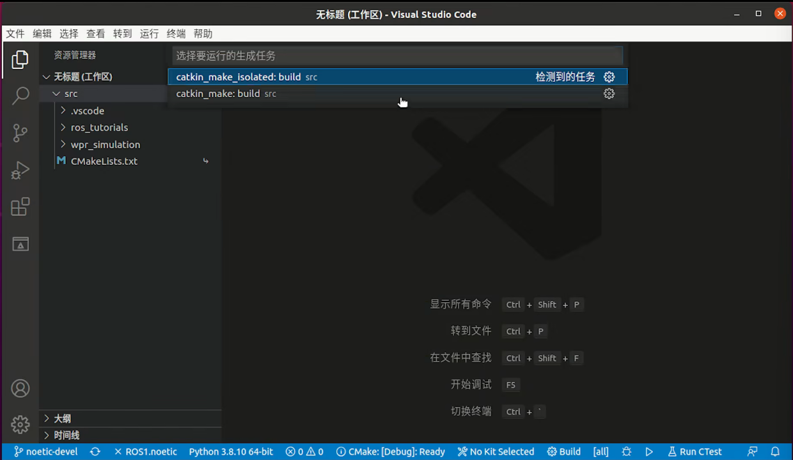 

- **将快捷键设置成默认的编译项：**

  - 接着我们再次按下Ctrl＋Shift＋B，然后点击小齿轮；
  - 它将在**.vscode**目录下生成**tasks.json**文件，在该文件中，我们在**group字段**增加内容：

  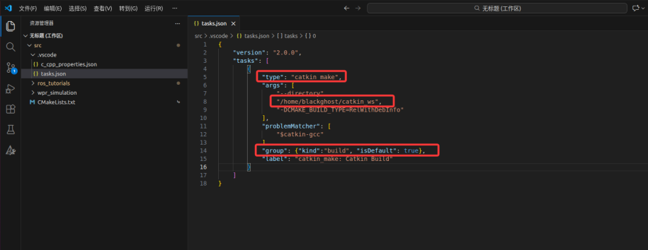

  -  第一个框的**type**表示我们这个快捷键执行的命令，与我们在终端输入的：**catkin_make**是一样的；
  - 第二个框的内容表示**在哪个目录下进行操作**，即**catkin_ws**，与终端保持一致；
  - 在group字段中，**增加isDefault字段，表示我们的这个快捷键默认为这个操作**；
  - 这样下次我们再次按下快捷键它直接会进行编译，不需要再进行选择；

### 4.2 设置拼写错误检查

在文件中，有些函数或头文件找不到时，VsCode会在下方添加红色波浪线，这里我们有两个方法解决：

- **重新加载**

  - 项目的头文件路径写在了**.vscode/c_cpp_properties.json**这个文件下；
  - 删除这个文件，关闭VsCode，重新打开，ROS插件会自动生成文件并找到头文件路径添加进去；
  - 但是有时候一些角落的文件也不一定能找到；

  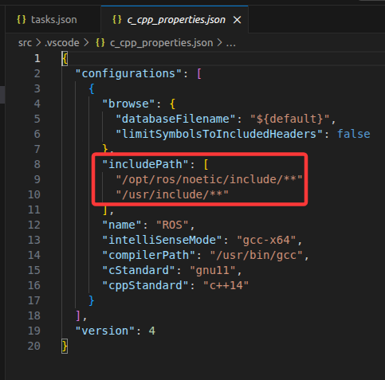

- **修改设置**

  - 既然上一个方法无法解决，可以直接关闭错误提示；
  - 按下**Ctrl＋Shift＋P**快捷键，在弹出栏中输入：**error squiggles**，然后选择禁用选项；

  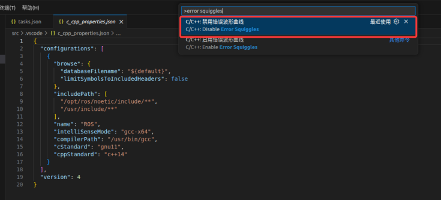

  - 这时候会生成**.vscode/settings.json**文件，内容如下；
  - 可见设置为了**disabled**，如果想启用，改为**enabled**即可；
  - 一般而言，不建议关闭；

  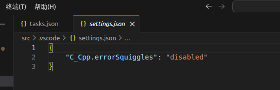


# 第九节课：超级终端Terminator

## 1.目的

- Ubuntu自带了一个终端，**一般的软件下载和程序编译够用了**；
- 但是在**运行ROS程序**时，一般都需要**同时运行多个窗口**，这是有点不方便的；

 

## 2.超级终端Terminator下载安装

- **安装terminator**

  - 在命令行中运行：

  ```bash
  sudo apt install terminator
  ```

- **启动Terminator**
  - 同时按下快捷键：**Ctrl＋Alt＋T**，即可打开Terminator；

- **Terminator的使用**
  - Terminator可在同一个窗口上割开多个小窗口；
  - 我们要终止某个程序时直接在对应的窗口左键再**Ctrl＋C**既可以暂停了；

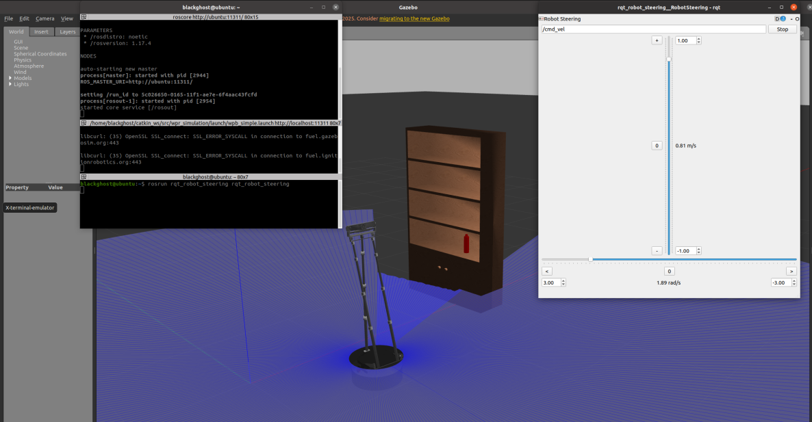 

 

## 3.Terminator的快捷键

- **Ctrl＋Shift＋E：水平分割窗口；**

- **Ctrl＋Shift＋O：垂直分割窗口；**

- **Alt＋上下左右键：切换当前窗口；**

- **Ctrl＋Shift＋W：取消分屏；**


## 4.Ctrl＋Shift＋E快捷键无效的问题

在Terminator中敲下快捷键Ctrl＋Shift＋E时可能无法分屏，而是出现了一个e＋下划线的符号，且其他快捷键也无效了，这是因为和Ubuntu系统的输入法快捷键冲突了。解决办法如下：

- 终端中输入：**ibus-setup**；
- 其中IBUS是**常见的Linux的输入法框架**；

- 在弹出窗口中选择**表情符号页**，把这个快捷键删除即可；


# 第十节课：Node节点和Package包

## 1.安卓系统的App

- 安卓系统的组成：一个个App;
- 打电话、发短信、玩游戏都是一个App；
- 使用安卓系统的过程实际上就是使用App的过程；

 

## 2.ROS系统的Node节点

ROS系统由一个个Node节点组成，Node节点的特征如下：

- 每个Node具有不同的功能；

- 在使用ROS时，可能**调用一个Node节点或多个Node节点**；

- 每个Node节点的**代码结构相同**，规定了先干嘛、再干嘛、最后干嘛，否则就可能和ROS的核心有冲突；

- 单个Node节点的功能一般不会太复杂，机器人的复杂动作由一系列Node节点组合得到；

 

## 3.ROS系统的Package包

- **Package包：**

  - ROS系统中无法单独下个某个Node节点，而是需要完整的下载一个软件包Package；
  - Package是Node的集合，调用Node节点时即调用某个Package中的Node节点；
  - 前面下载的三个工具都是Package；

  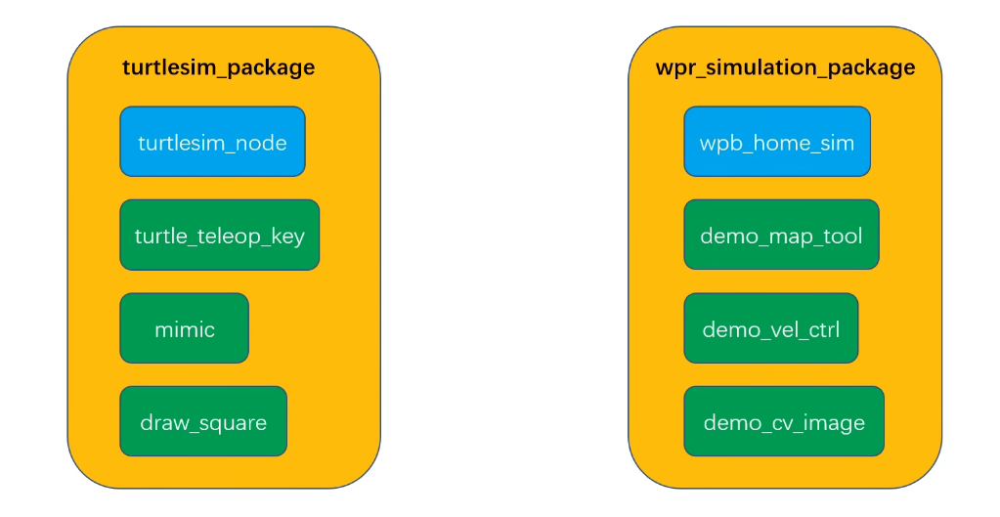

- **ROS的编译工具**
  - ROS使用**CMake**和**catkin**作为编译工具，可以引入包的概念；
  - 可以把散乱的Node节点组织起来得到一个个Package包，省去了一个个Node节点下载的繁琐操作；


# 第十一节课：年轻人的第一个Node节点

## 0.课程内容

- 本节课的内容：**创建一个处于ssr_pkg包下的超声波_Node节点。**

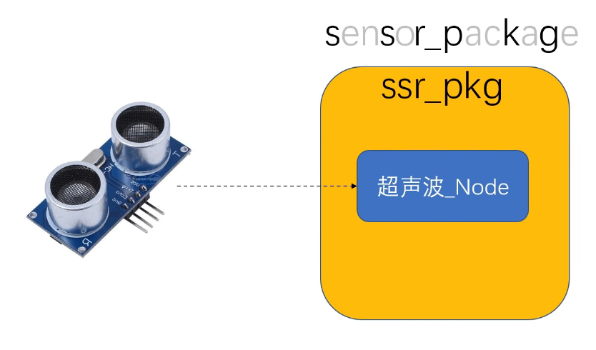


## 1.工作空间设置

- **CMake Tools插件**在每次启动VsCode时候会编译整个工作空间，可以通过设置关闭掉它；
- 左下角点击**设置**搜索**cmake:config**，在得到的结果中关闭如下两个选项即可；
- 然后再把工作空间的build文件夹删除即可，这样下次启动就不会自动编译了；

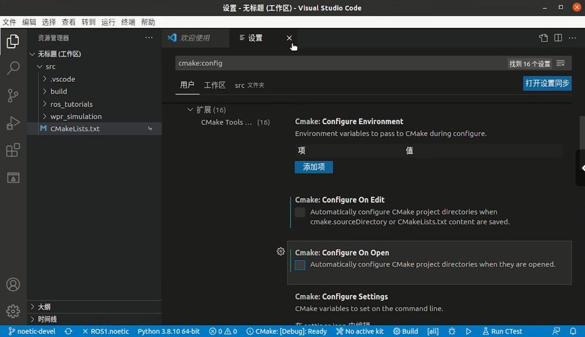 

 

## 2.创建Package包

### 2.1 创建Package包

- **切换到工作空间的src目录：**

  ```bash
  cd catkin_ws/src/
  ```

- **创建包：Teminator中执行下面指令**

  ```bash
  catkin_create_pkg ssr_pkg rospy roscpp std_msgs
  ```

  - catkin工具创建Package包的命令为：**catkin_create_pkg <包名> <依赖项列表>**
    - **catkin_create_pkg**是创建包的指令；
    - **<包名>**就是你要创建的包的名称；
    - 其中**<依赖项列表>**就是一个装满了通用节点的Package包；

- 执行完后就可以看到它在目录下创建了**两个文件、两个文件夹**；

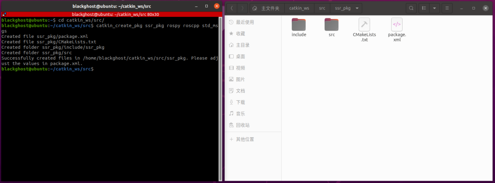

### 2.2 查看文件内容

可以用VsCode来打开上述创建的文件：

- **CMakeLists.txt编译设置文件**
  - 第一行为编译器最低版本要求；
  - 第二行为包的名字；
  - **后面的为寻找依赖包，即前面创建时的依赖项列表**；
  - 除此之外还有注释，**双#号的是对指令的解释，单#的是对应指令的示例**；
  - **实际的编译过程：**
    - 编写CMakeLists.txt；
    - catkin_make调用CMake；
    - CMake读取CMakeLists.txt；
    - CMake生成Makefile；
    - make/g++使用Makefile进行实际编译；

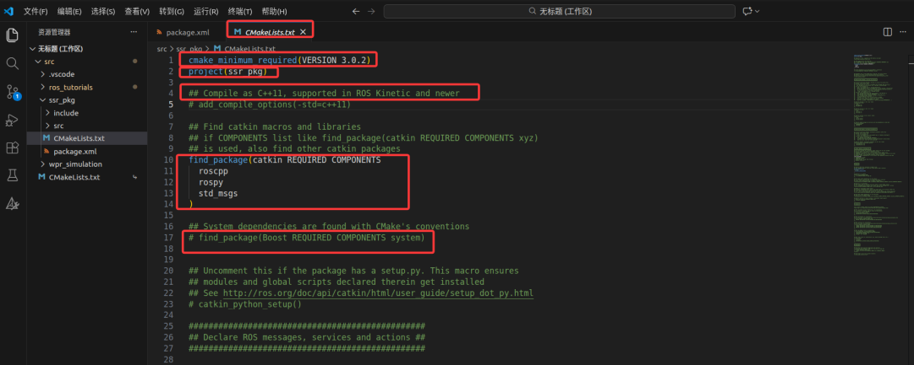

- **package.xml文件**
  - 该文件包括包的名字、版本号、包的描述、包的作者、包的开源协议以及一些依赖库引用，可以认为这个是包的描述文件；
  - package.xml是catkin软件包的必备文件，当看到一个文件夹中有这个文件时很可能这个文件夹就是一个package；

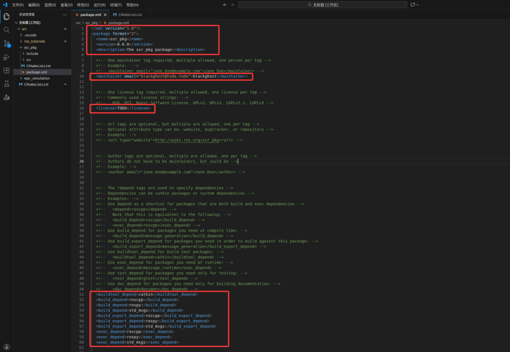

 

## 3.回访依赖项

接下来回头看一下那三个依赖项的位置都在哪里。

### 3.1 查找之前的依赖项

- 查找软件包的地址：**roscd <软件包名字>**，这样终端会自动跳转到包的位置；

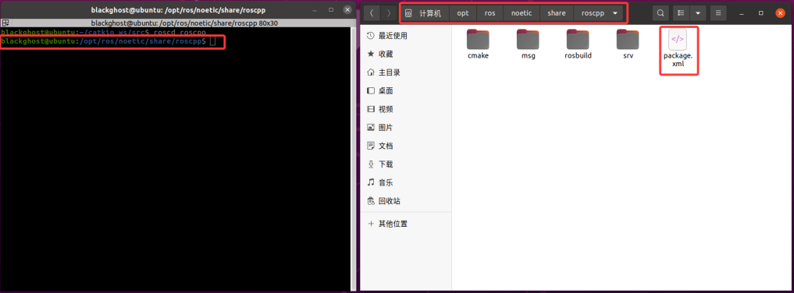

- 在该目录下也有package.xml文件，用VsCode打开这个文件，发现它与先前创建的包的package.xml文件内容差不多，所以这个文件夹是一个软件包文件夹；

### 3.2 软件包的两个位置

- **/opt/ros/noetic/share/文件夹**
  - 这个文件夹中存放着很多的软件包，它的来源有两种：
    - **“sudo apt-get install ros-<ROS版本>-desktop-full”**下载的基础包；
    - **“sudo apt-get install ros-<ROS版本>-xxx”**下载的独立扩展包；

- **catkin_ws文件夹**
  - 这个文件夹下也存放着包，它主要是我们**通过Github下载的源码和我们自己手动创建的源码**；
  - 它和前者最大的区别就是这个文件夹下的文件需要编译后才能执行，而前者是已经编译完的可执行文件；

### 3.3 .bashrc文件的添加内容回顾

- 在先前的.bashrc文件中添加的两行，就是对应了我们上面的两个位置；
- **在创建软件包时指定的依赖项要在这两个文件夹存在才行，否则编译报错**；

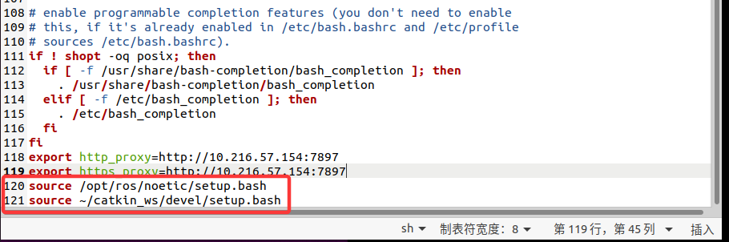


## 4.创建Node节点

- **添加节点的源代码**

  - 在软件包的文件夹的**src文件夹**下新建文件，起名**chao_node.cpp**，这是一个超声波传感器节点，然后在文件中添加源码；

  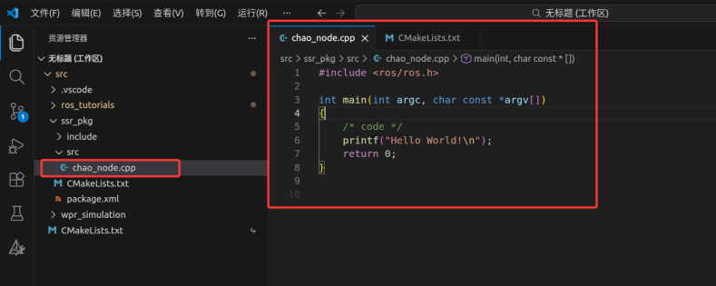

- **添加编译规则（重要）**

  - 打开CMakeLists.txt文件，找到**“build”**章节，再找到**add_executable()**函数，这相当于是一条示例代码；

  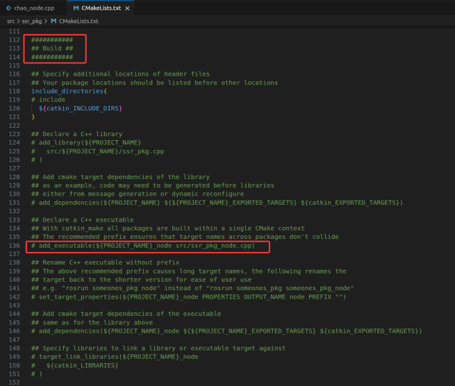

  - 将它复制到最后，**第一个参数是设置这个可执行文件的名字，最好保持与包名字相同**；
  - 第二个参数是**指定从那个源文件编译，指定刚才写的源代码即可**；

  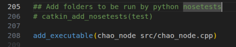

  - 然后**“Ctrl＋Shift＋B”**编译；

- **运行Node节点**
  - 编译完成后可在终端执行ROS节点，在终端可以看到已经成功打印出了**“Hello World!”**这句话；
  - 如果这里提示无法找到包，就需要先把工作空间的环境参数导入到终端，即指令：**source ~/catkin_ws/devel/setup.bash**；
  - 若之前已经添加到.bashrc文件中的话这里应该能正常运行；

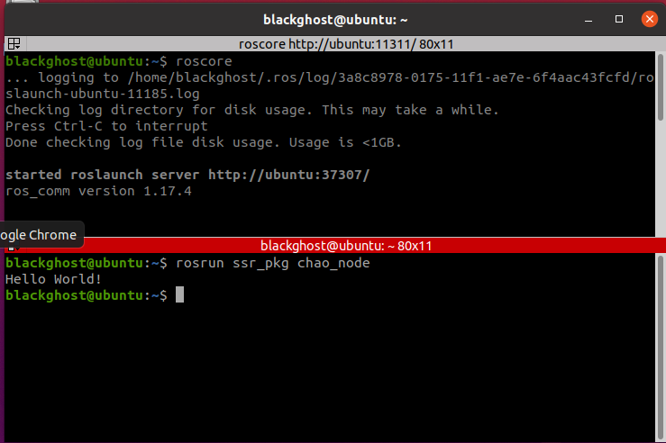

- **总结**
  - **Node节点的本质就是C/C++的程序，节点的运行本质就是执行一个C/C++文件；**


## 5.Node节点的完善

**前面写的源代码还无法与ROS产生互动，因为它并没有任何与ROS框架相关的东西**。下面按照ROS的框架添加代码。

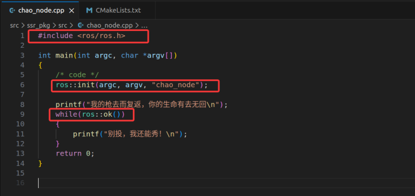

- 如上图所示添加代码：
  - 添加ros的头文件：#include <ros/ros.h>；
  - 在main()函数的开头**初始化ros：ros::init()**；
    - **注意里面的第二个参数不能是const变量，需要把main()函数传入的第二个const变量的const去掉**；
  - 增加循环，不让它马上退出：
    - 添加while()循环；
    - **但是while()循环中的添加需要用ros::ok()，不然的话终端不会响应任何外部事件**；

- **添加编译条件**

  - 添加代码后引入了头文件，需要在编译文件中添加头文件的信息；
  - 打开CMakeLists.txt文件，同样在“Build”章节找到**target_link_libraries()**函数，复制到最后并指定编译信息：

  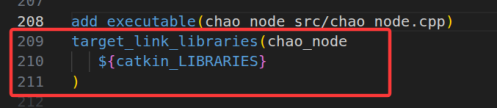

- **编译并运行节点**

  - 按下快捷键进行编译，然后打开超级终端，先启动ROS的核心，然后运行节点：**rosrun ssr_pkg chao_node**；
  - 可以看到它成功运行，且按下Ctrl＋C后成功停止运行；

  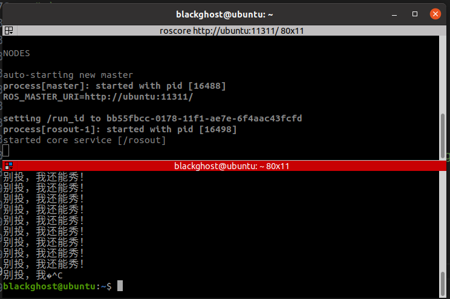


## 6.总结——ROS开发框架

- 在今后的所有的ROS包或节点的开发中都是按照这个框架进行的。

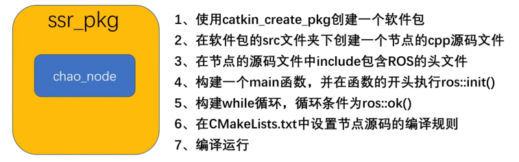


# 第十二节课：Topic话题和Message消息

## 1.Topic话题的定义及其特点

### 1.1 一个发布者的情况

- 话题Topic是节点间进行**持续通讯**的一种形式；
- 话题通讯的两个节点通过**话题的名称**建立起话题通讯连接；
- 话题中通讯的数据，叫做**消息Message**；
- 消息Message通常会按照一定的频率持续不断的发送，以保证消息数据的实时性；
- 消息的发送方叫做话题的**发布者Publisher**；
- 消息的接收方叫做话题的**订阅者Subscriber**；

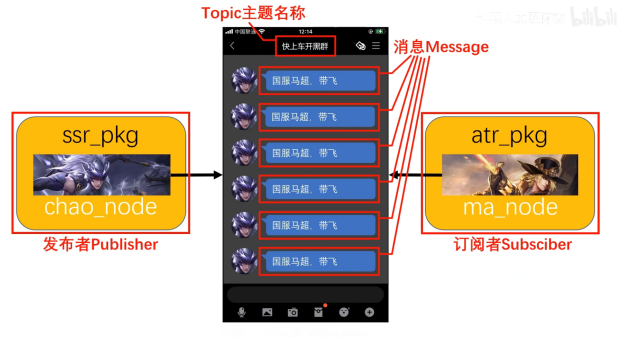

### 1.2 多个发布者的情况

- 多个发布者的情况可以分两种：

  - 不同发布者只管理自己的话题：

  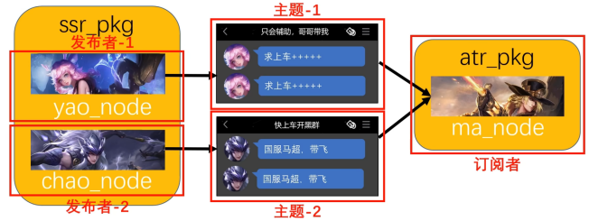

  - 不同发布者处在同一个话题：

  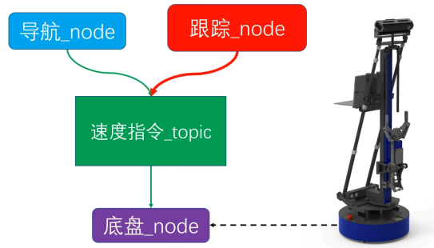

- 多个发布者时的Topic的特点：
  - 一个ROS节点网络中，可以同时存在多个话题；
  - 一个话题可以有多个发布者，也可以有多个订阅者；
  - 一个节点可以对多个话题进行订阅，也可以发布多个话题；
  - 不同的传感器消息通常会拥有各自独立话题名称，每个话题只有一个发布者；
  - 机器人速度指令话题通常有多个发布者，但同一时间只能有一个发言人；


## 2.Message消息的定义及其特点

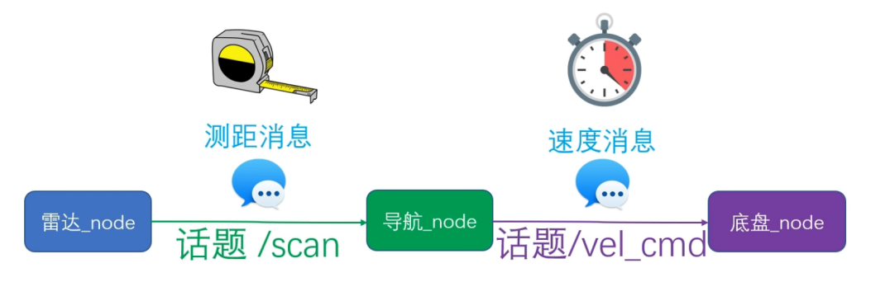

- **消息的类型：**
  - 如上图所示，为满足不同传输的要求，消息会存在很多种类型，在生成消息包时需要指定消息的类型；

- **类型的来源：**
  - 上一节课创建的软件包中，有一个依赖项：**std_msgs**，这个软件包中就包含了很多的消息类型；

- **std_msgs消息类型：**

  - 打开index网站，搜索**std_msgs**，然后点击Msg API，就可以看到这个软件包中存在的消息类型；
  - 点击某些类型可以看到，它们内部存在一些嵌套关系，其实消息类型本质上就类似于C的结构体；
  - 若软件包中不存在想要的消息类型，后续可以通过自组装定义我们自己想要的消息类型；

  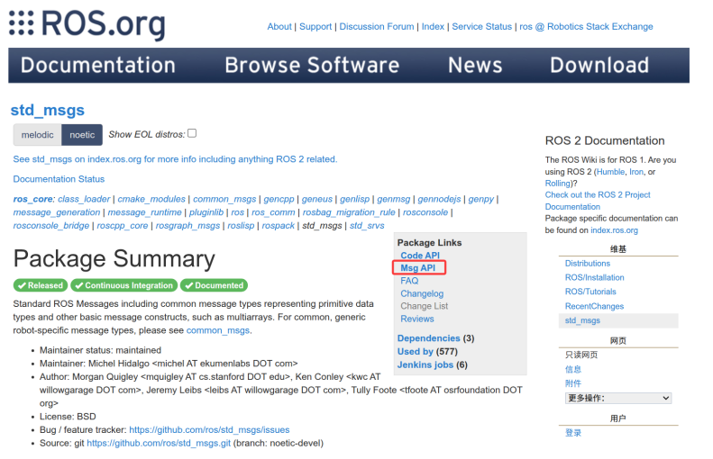


# 第十三节课：Publisher发布者的C++实现

## 1.整体项目框架

- 在这一节课中，将完成下图中的两个发布者：


## 2.chao_node的话题发布

- **首先需要引入头文件：**

  ```C++
  #include <std_msgs/String.h>
  ```

- **初始化ROS核心：**

  ```c++
  ros:init(argc, argv, "chao_node")
  ```

- **创建管理节点的管家：**

  ```c++
  ros:NodeHandle nh
  ```

- **创建发布的话题：**

  ```c++
  ros::Publisher pub = nh.advertise<std_msgs::String>("kuai_shang_che_kai_hei_qun", 10)
  ```

  - 第一个参数是话题名称，不能是中文；
  - 第二个是缓冲区的大小；

- **创建一个ROS时间控制对象：**

  ```c++
  ros::Rate loop_rate(10)
  ```

- **在while循环中：**

  - **创建消息：**

    ```c++
    std_msgs::String msg	// 在while循环内部再创建变量虽然可能内存消耗大一点，但每次循环后都会回收内存，问题不大
    ```

  - **给消息赋值：**

    ```c++
    msg.data = "国服马超，带飞"
    ```

  - **往话题中发布消息：**

    ```c++
    pub.publish(msg)
    ```

  - **延时阻塞：**

    ```c++
    loop_rate.sleep()
    ```

```c++
#include <ros/ros.h>
#include <std_msgs/String.h>

int main(int argc, char *argv[])
{
    /* code */
    ros::init(argc, argv, "chao_node");         // 初始化ROS核心
    printf("我的枪去而复返，你的生命有去无回\n");

    ros::NodeHandle nh;			// 创建一个ros中的NodeHandle类，这个类的节点的管家
    ros::Publisher pub = nh.advertise<std_msgs::String>("kuai_shang_che_kai_hei_qun", 10);  // 创建一个发布话题

    ros::Rate loop_rate(10);    // ros的时间控制对象

    while(ros::ok())
    {
        printf("我要开始刷屏了！\n");
        std_msgs::String msg;           // 定义一个String类型的消息
        msg.data = "国服马超，带飞";      // 赋值给消息
        pub.publish(msg);               // 发布消息
        loop_rate.sleep();              // 延时阻塞
    }
    return 0;
}

```


## 3.ROS中的话题工具：rostopic

- ```c++
  // 列出当前系统中所有活跃着的话题
  rostopic list
  ```

- ```c++
  // 显示指定话题中发送的消息包内容
  rostopic echo 主题名称
  
  // 如果由于中文，Unicode字符显示乱码，可用如下指令转义
  echo -e <上一句指令的输出>
  ```

- ```c++
  // 统计指定话题中消息包发送频率
  rostopic hz 主题名称
  ```


## 4.消息发送的步骤总结

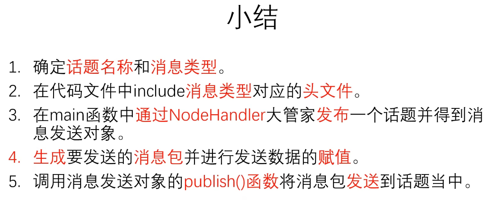


## 5.yao_node的话题发布

- 复制原来的chao_node.cpp文件，改名为yao_node.cpp；
- **修改内容如下：**

```c++
#include <ros/ros.h>
#include <std_msgs/String.h>

int main(int argc, char *argv[])
{
    /* code */
    ros::init(argc, argv, "yao_node");         // 注册节点
    printf("过去生于未来!\n");

    ros::NodeHandle nh;     // 创建一个ros中的NodeHandle类，这个类的节点的管家
    ros::Publisher pub = nh.advertise<std_msgs::String>("gie_gie_dai_wo", 10);  // 创建一个发布话题

    ros::Rate loop_rate(10);    // ros的时间控制对象

    while(ros::ok())
    {
        printf("我要开始刷屏了！\n");
        std_msgs::String msg;           // 定义一个String类型的消息
        msg.data = "求上车++++";		  // 赋值给消息
        pub.publish(msg);               // 发布消息
        loop_rate.sleep();              // 延时阻塞
    }
    return 0;
}

```

- **修改编译配置文件：**

```c++
add_executable(chao_node src/chao_node.cpp)
target_link_libraries(chao_node
   ${catkin_LIBRARIES}
)

add_executable(yao_node src/yao_node.cpp)
target_link_libraries(yao_node
   ${catkin_LIBRARIES}
)
```

- **编译后在终端执行：**

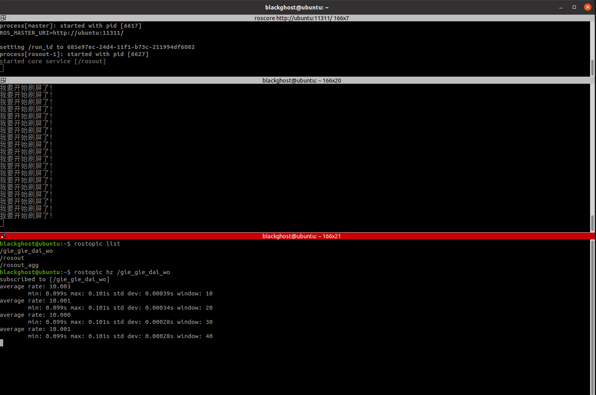


# 第十四节课：Subscriber订阅者的C++实现

## 1.整体项目框架

- 在这一节课中，将实现**右边的订阅者**；


## 2.创建订阅者节点

### 2.1 创建atr_pkg包

- 在终端中输入如下命令创建软件包：

```bash
catkin_create_pkg atr_pkg rospy roscpp std_msgs
```

- **注意一定要在catkin_ws/src目录创建才行，下图的目录是错误的**；

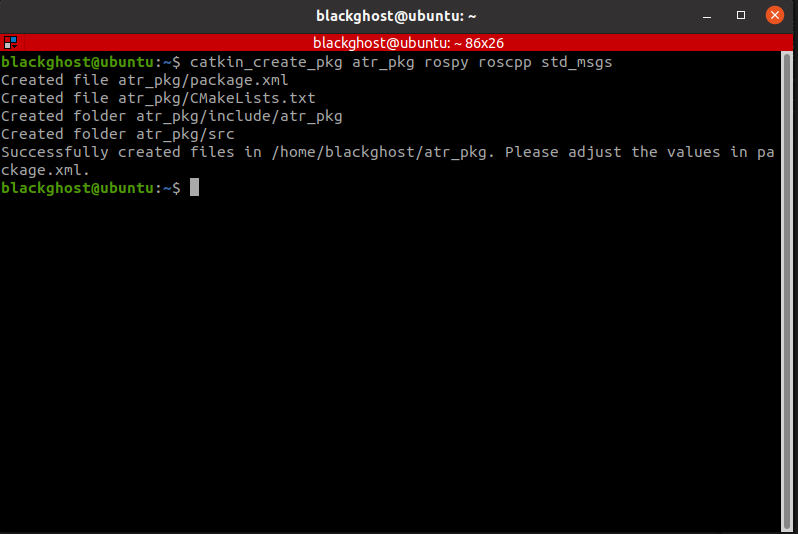

### 2.2 创建ma_node节点

- 在VsCode中打开atr_pkg，然后在其src目录下新建ma_node.cpp文件；
- 在**ma_node.cpp**文件中添加如下内容：
  - 引入头文件；
  - 注册节点；
  - 新建管家，并用管家新建订阅；
  - **定义订阅者的回调函数；**
  - 在while()循环中加入**回看消息包的函数**；

```c++
#include <ros/ros.h>
#include <std_msgs/String.h>

void chao_callback(std_msgs::String msg)	// 订阅者的回调函数
{
    printf(msg.data.c_str());	// 打印消息内容
    printf("\n");
}

int main(int argc, char *argv[])
{
    ros::init(argc, argv, "ma_node");	// 注册节点

    ros::NodeHandle nh;		// 新建管家
    ros::Subscriber sub = nh.subscribe("kuai_shang_che_kai_hei_qun", 10, chao_callback);	// 新建订阅，注意这里还需要传入回调函数名

    while(ros::ok())
    {
        ros::spinOnce();	// 必须加，其作用是转过头看一下有没有新的消息包
    }

    return 0;
}

```

### 2.3 添加编译条件

- 在CMakeList.txt文件中的最后添加如下内容：

```c++
add_executable(ma_node src/ma_node.cpp)
target_link_libraries(ma_node
  ${catkin_LIBRARIES}
)
```

- **Ctrl+Shift+B**编译；


## 3.运行效果

- 在终端中运行ROS核心

```bash
roscore
```

- 在终端中启动chao_node节点

```bash
rosrun ssr_pkg chao_node
```

- 在终端中启动ma_node节点

```bash
rosrun atr_pkg ma_node
```

- 最后的运行效果如图所示：

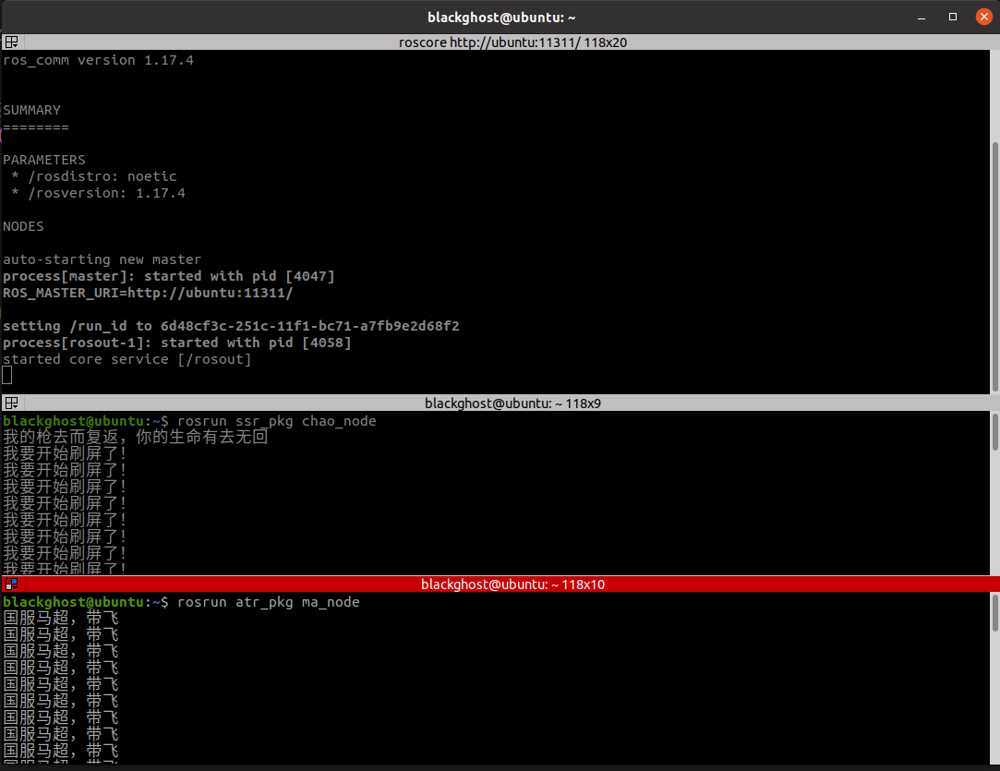


## 4.调整和优化

- 在上面的运行效果中，每一条的打印消息都是一样的；
- 可以使用带有显示时间的函数进行打印；
- 改造：
  - **将ma_node.cpp文件中的printf()函数改为ROS_INFO()函数**：
  - **除此之外，还要在main函数内部添加setlocale(LC_ALL, "")函数，因为ROS_INFO()函数会受C++的locale环境影响，需要将其设置成中文环境**；

```c++
#include <ros/ros.h>
#include <std_msgs/String.h>

void chao_callback(std_msgs::String msg)
{
    ROS_INFO(msg.data.c_str());
}

int main(int argc, char *argv[])
{
    setlocale(LC_ALL, "");
    ros::init(argc, argv, "ma_node");

    ros::NodeHandle nh;
    ros::Subscriber sub = nh.subscribe("kuai_shang_che_kai_hei_qun", 10, chao_callback);

    while(ros::ok())
    {
        ros::spinOnce();
    }

    return 0;
}

```

- 再次编译并运行，得到如下运行效果，其中前面的数字是时间戳：

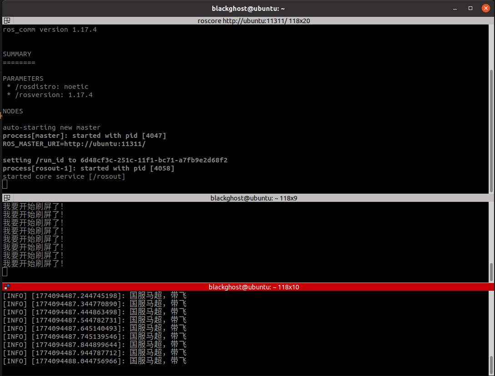


## 5.添加订阅瑶妹妹的消息

- 同样的，直接在原来的ma_node.cpp文件中添加内容：
  - 从管家中重新获取一个订阅，这个订阅对象的名称不能与前面的相同；
  - 定义回调函数，这里显示用ROS_WARN()，它会以黄色显示；

```c++
#include <ros/ros.h>
#include <std_msgs/String.h>

void chao_callback(std_msgs::String msg)
{
    ROS_INFO(msg.data.c_str());
}

void yao_callback(std_msgs::String msg)
{
    ROS_WARN(msg.data.c_str());
}

int main(int argc, char *argv[])
{
    setlocale(LC_ALL, "");
    ros::init(argc, argv, "ma_node");

    ros::NodeHandle nh;
    ros::Subscriber sub = nh.subscribe("kuai_shang_che_kai_hei_qun", 10, chao_callback);

    ros::Subscriber sub2 = nh.subscribe("gie_gie_dai_wo", 10, yao_callback);
    
    while(ros::ok())
    {
        ros::spinOnce();
    }

    return 0;
}

```

- 编译后重新运行，得到效果图如下：

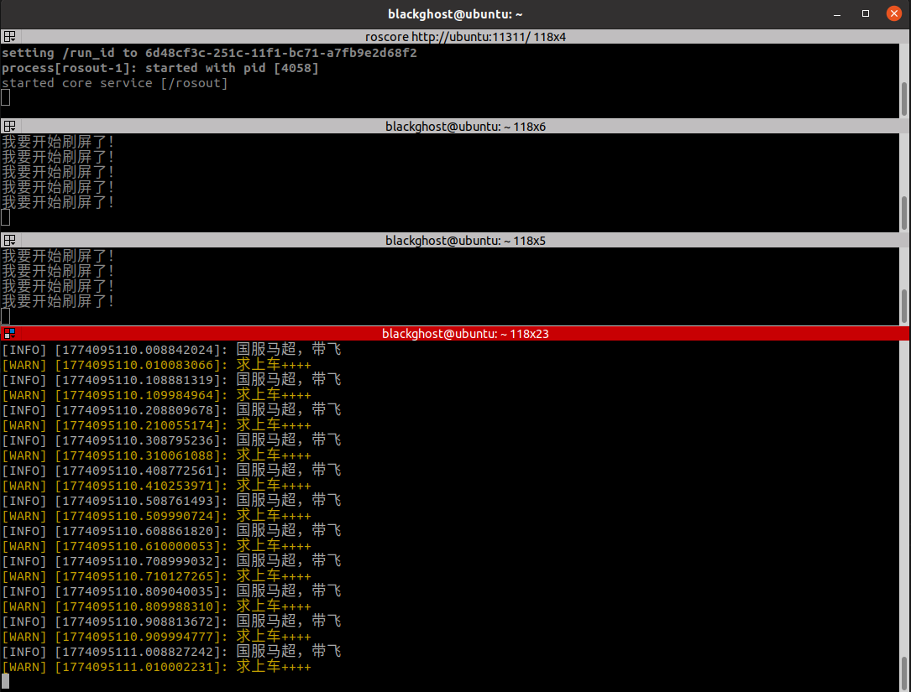


## 6.图形化显示话题通信的工具

- 在保持上面全部节点通信的同时，再开一个终端，执行指令：

```bash
rqt_graph
```

- 执行后得到效果图如图所示：
  - **椭圆形的是节点；**
  - **横线上的是话题；**
  - **横线代表数据的流向；**

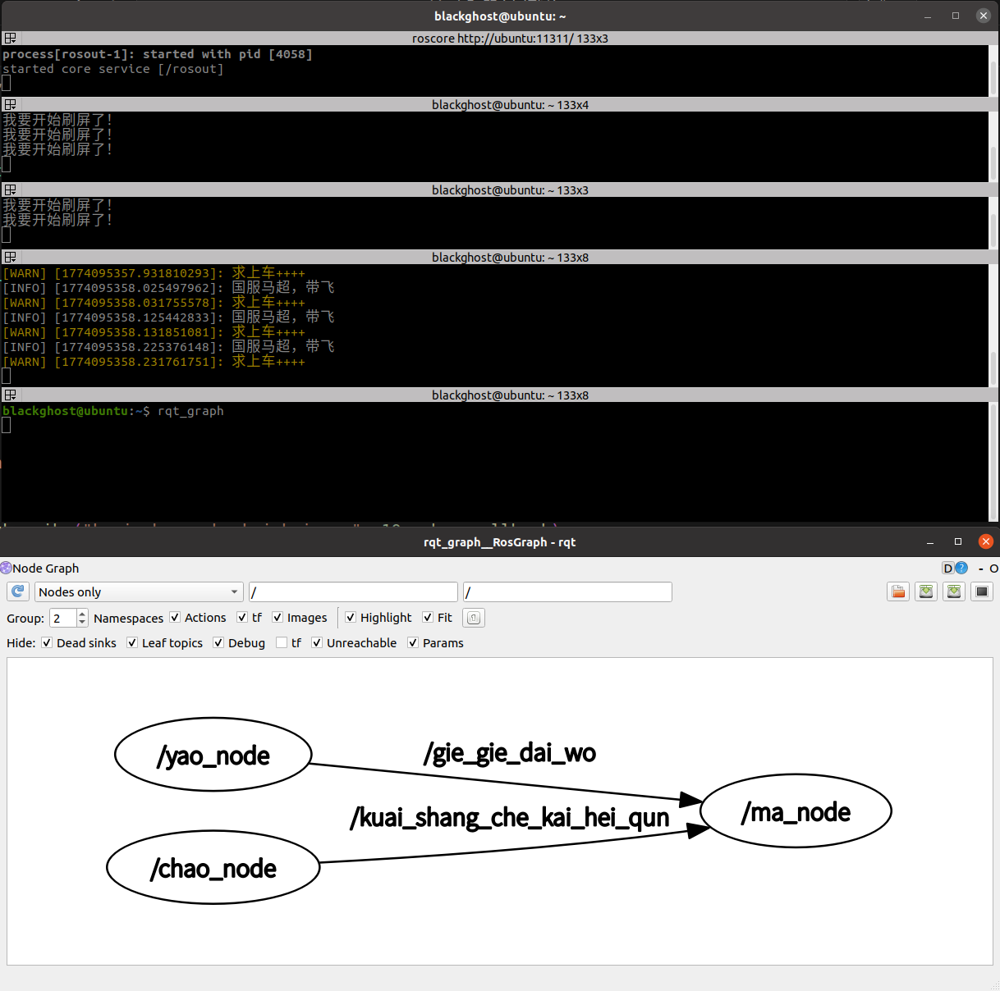


## 7.总结

### 7.1 话题是谁的话题

- 话题不单单只是发布者或订阅者的话题；
- 话题是ROS系统自己创建的，即使发布者没有在运行，如果有节点订阅了话题，这个话题就会自动被ROS系统创建；

### 7.2 小节

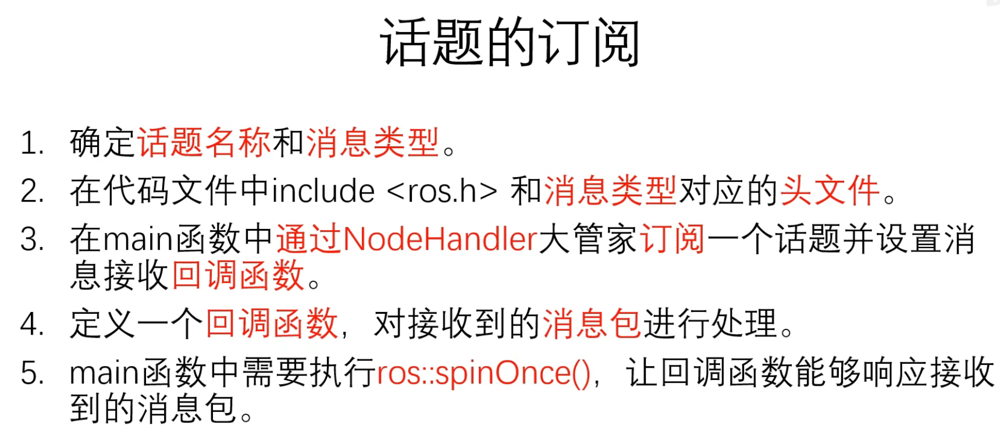


# 第十五节课：launch启动多个ROS节点

## 1.使用launch启动节点

### 1.1 launch文件的介绍

- launch文件是一种遵循**XML语法**的描述文件；
- **可以使用launch实现启动ROS的节点**；
- XML语法启动节点：**当内容为空时可以省略后面的</标记名称>，直接将/移到第一个<>中**

```xml
<标记名称 属性名1= "属性值1" ...>
    内容
</标记名称>
```

- **描述多层嵌套结构是XML语法的主要作用之一：**


- 可以用一个王者荣耀的例子来解释XML语法的使用：

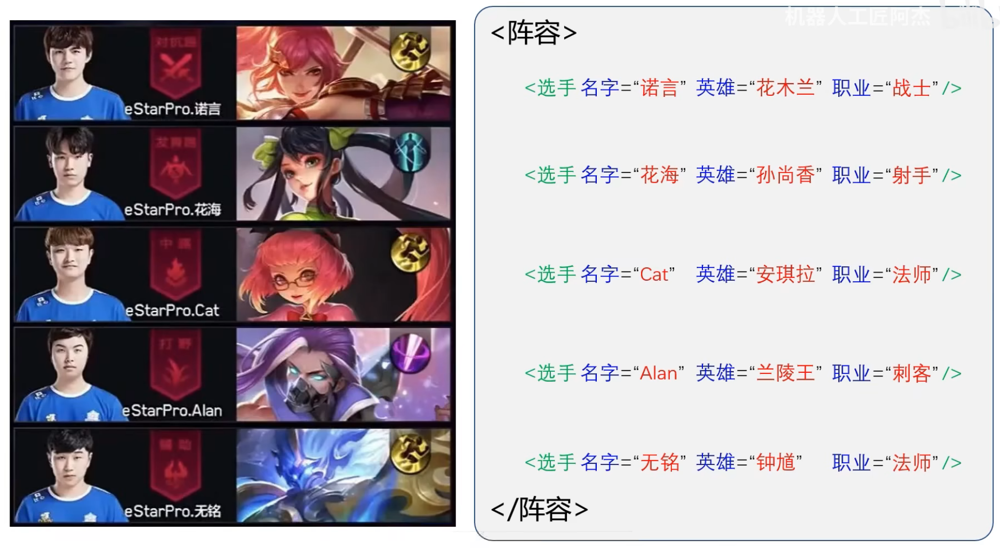

### 1.2 如何用launch描述一个ROS启动

- 以上一节课中的例子，可以用launch文件的XML语法描述如下：
- 注意：**这里不需要单独为roscore添加描述，因为launch文件的机制是只要有一个节点就会启动ROS核心**；
- 描述内容中的name用于解决**同名不同包**的问题；

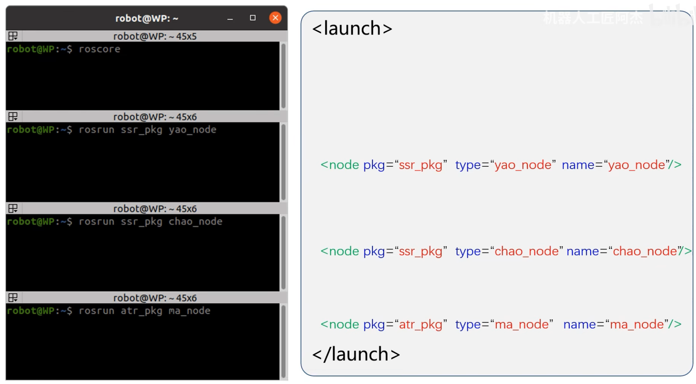


## 2.编写运行launch文件

- launch文件只需要放在某个软件包下即可，它会自动遍历整个文件夹；
- **我们在atr_pkg下创建launch文件夹用来存放launch文件，然后新建launch文件kai_hei.launch**，然后添加如下内容：
  - launch-prefix="gnome-terminel -e：可以指定该节点在另一个终端输出；
  - output="screen：可解决ROS_INFO不显示的问题，但对ROS_WARN不起作用，它会暴力的输出；

```xml
<launch>
    
    <node pkg="ssr_pkg" type="yao_node" name="yao_node"/>

    <node pkg="ssr_pkg" type="chao_node" name="chao_node" launch-prefix="gnome-terminel -e"/>

    <node pkg="atr_pkg" type="ma_node" name="ma_node" output="screen"/>

</launch>
```

- 然后在终端中输入下列指令即可同时运行之前的几个节点：

```bash
roslaunch atr_pkg kai_hei.launch
```

- 最终的效果如图所示：

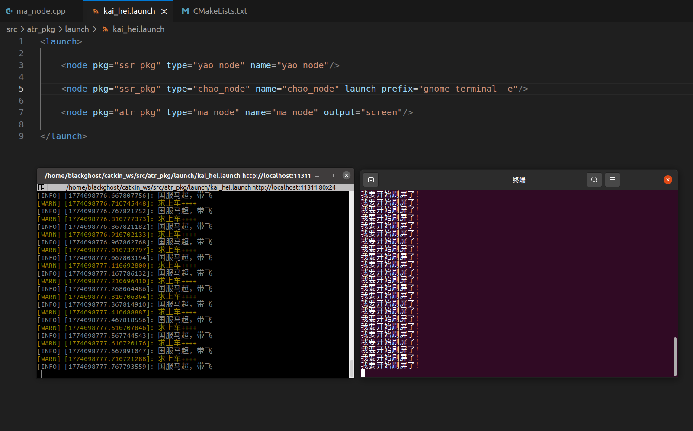


## 3.总结

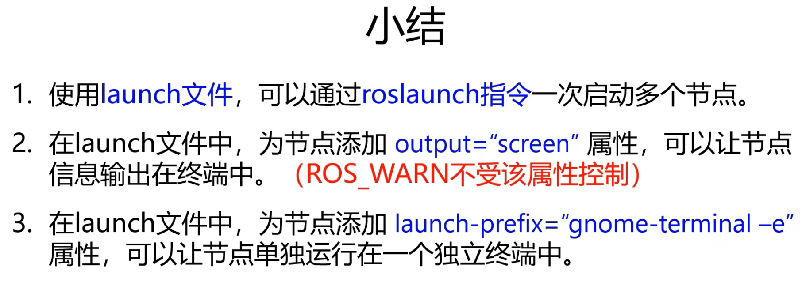


# 第十六节课：Publisher发布者的Python实现

## 1.整体项目框架

- 本节用Python语言实现两个发布者；


## 2.整体项目编程

### 2.1 创建软件包

- 在终端中切换到**~/catkin_ws/src**目录；
- 执行以下指令完成软件包的创建：

```bash
catkin_create_pkg ssr_py_pkg rospy std_msgs
```

### 2.2 编译软件包

- 在创建完包后需要直接编译一下，但需要区分：
  - Python是解释性语言，是不需要编译的；
  - 这里的编译是为了让ROS在后续能够找到ROS节点；
  - 对于用Python开发的软件包而言，只需要编译一次即可；

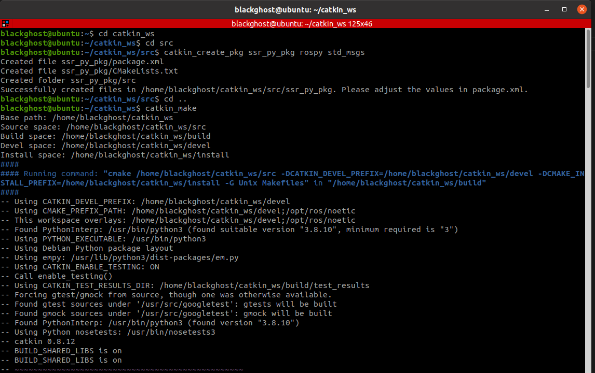

### 2.3 编辑节点

- 打开VsCode后，发现ssr_py_pkg中只有**src、CMakeList.txt和package.xml**三个文件；

- 在ssr_py_pkg下新建**scripts**文件夹，然后在此文件夹下添加节点；

- **chao_node.py节点编辑：**

  - 在scripts文件夹下新建文件**chao_node.py**文件；
  - python创建发布者节点的过程如下：

  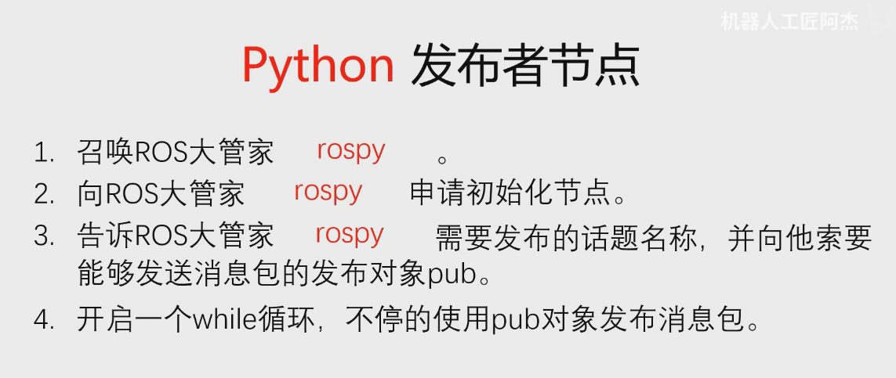

  - **文件编程：**

  ```python
  #!/usr/bin/env python3
  #coding=utf-8
  
  import rospy
  from std_msgs.msg import String
  
  if __name__ == "__main__":
      rospy.init_node("chao_node")	# 注册节点
      rospy.logwarn("我的枪去而复返，你的生命有去无回！")	# 打印信息
  
      pub = rospy.Publisher("kuai_shang_che_kai_hei_qun", String, queue_size=10)	# 获取发布对象
  
      rate = rospy.Rate(10)	# 获取时间控制对象
  
      while not rospy.is_shutdown():		 # 注意while循环的条件
          rospy.loginfo("我要开始刷屏了")	# 打印提示信息
  
          msg = String()					# 获取一个消息对象
          msg.data = "国服马超，带飞"		# 复制内容
          pub.publish(msg)				# 发布内容
          rate.sleep()					# 控制速率
  
  ```

  - **运行节点：**

    - **Ubuntu中新创建的文件不带有执行权限，需要先把文件的执行权限打开**；
    - 在对应文件夹下打开终端，输入如下指令给文件**添加执行权限**：

    ```bash
    chmod +x chao_node.py
    ```

    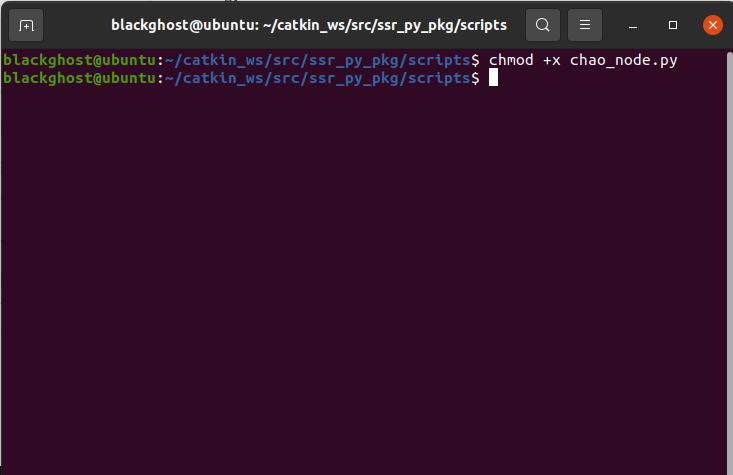

    - 接着在终端中执行ROS初始化以及运行节点即可：

    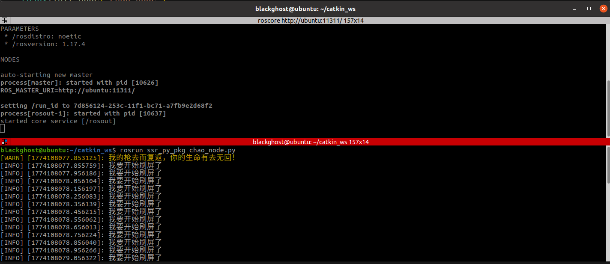

- **yao_node.py节点编程：**

  - 在原目录下直接复制chao_node.py，改名为**yao_node.py**；
  - **更改文件的内容如下：**

  ```python
  #!/usr/bin/env python3
  #coding=utf-8
  
  import rospy
  from std_msgs.msg import String
  
  if __name__ == "__main__":
      rospy.init_node("yao_node")
      rospy.logwarn("过去生于未来")
  
      pub = rospy.Publisher("gie_gie_dai_wo", String, queue_size=10)
  
      rate = rospy.Rate(10)
  
      while not rospy.is_shutdown():
          rospy.loginfo("我要开始刷屏了")
  
          msg = String()
          msg.data = "求上车++++"
          pub.publish(msg)
          rate.sleep()
  
  ```

  - **运行节点：**

    - 同样地按照前面的先初始化ROS然后再运行节点，即可成功运行：

    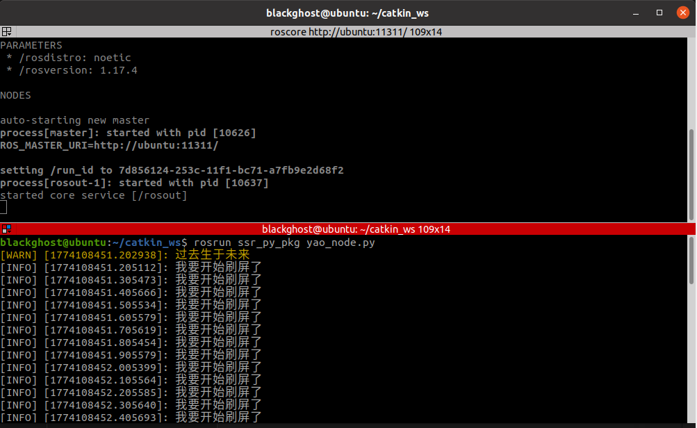


# 第十七节课：Subscriber订阅者的Python实现

## 1.整体项目框架

- 本节用Python语言实现**右边的订阅者**；


## 2.整体项目编程

### 2.1 创建软件包

- 在终端中切换到**~/catkin_ws/src**目录；
- 执行以下指令完成软件包的创建：

```bash
catkin_create_pkg atr_py_pkg rospy std_msgs
```

### 2.2 编译软件包

- 在创建完包后需要直接编译一下，但需要区分：
  - Python是解释性语言，是不需要编译的；
  - 这里的编译是为了让ROS在后续能够找到ROS节点；
  - 对于用Python开发的软件包而言，只需要编译一次即可；

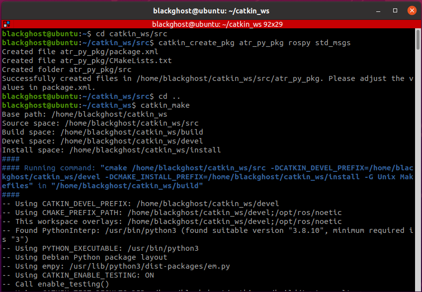

### 2.3 编辑节点

- 打开VsCode后，发现atr_py_pkg中只有**src、CMakeList.txt和package.xml**三个文件；

- 在atr_py_pkg下新建**scripts**文件夹，然后在此文件夹下添加节点；

- **ma_node.py节点编辑：**

  - 在scripts文件夹下新建文件**ma_node.py**文件；
  - python创建订阅者节点的过程如下：

  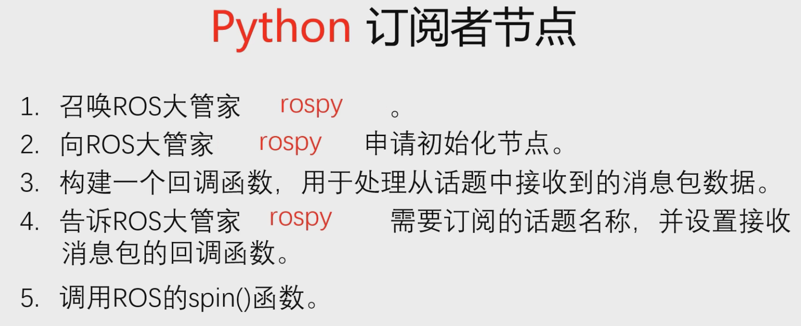

  - **文件编程：**

  ```python
  #!/usr/bin/env python3
  #coding=utf-8
  
  import rospy
  from std_msgs.msg import String
  
  def chao_callback(msg):
      rospy.loginfo(msg.data)
  
  def yao_callback(msg):
      rospy.logwarn(msg.data)
  
  if __name__ == "__main__":
      rospy.init_node("ma_node")
  
      sub = rospy.Subscriber("kuai_shang_che_kai_hei_qun", String, chao_callback, queue_size=10)
  
      sub2 = rospy.Subscriber("gie_gie_dai_wo", String, yao_callback, queue_size=10)
  
      rospy.spin()
  
  ```

  - **运行节点：**

    - **Ubuntu中新创建的文件不带有执行权限，需要先把文件的执行权限打开**；
    - 在对应文件夹下打开终端，输入如下指令给文件**添加执行权限**：

    ```bash
    chmod +x ma_node.py
    ```

    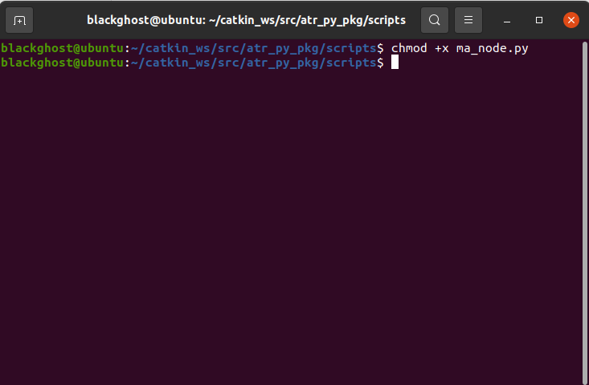

    - 接着在终端中执行ROS初始化以及运行节点即可：

    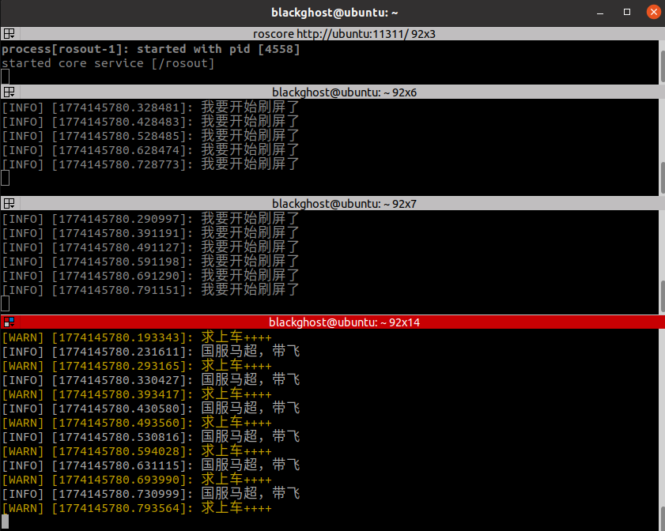


## 3.用.launch文件同时启动多个ROS节点

- **我们在atr_py_pkg下创建launch文件夹用来存放launch文件，然后新建launch文件kai_hei.launch**，然后添加如下内容：
  - launch-prefix="gnome-terminel -e：可以指定该节点在另一个终端输出；
  - **之前的C++文件编译后不带CPP后缀，所以type中没有后缀，但是.py是可执行文件，不编译，需要加后缀；**

```xml
<launch>

    <node pkg="ssr_py_pkg" type="chao_node.py" name="chao_node"/>

    <node pkg="ssr_py_pkg" type="yao_node.py" name="yao_node"/>

    <node pkg="atr_py_pkg" type="ma_node.py" name="ma_node" launch-prefix="gnome-terminal -e"/>

</launch>
```

- 然后在终端中输入下列指令即可同时运行之前的几个节点：

```bash
roslaunch atr_py_pkg kai_hei.launch
```

- 最终的效果如图所示：

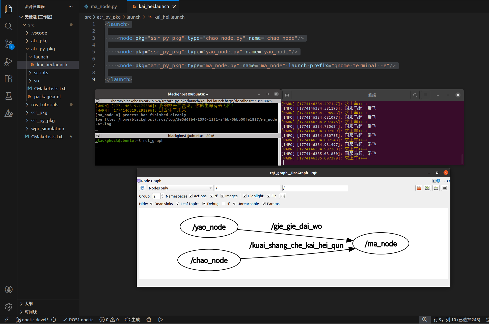


# 第十八节课：ROS机器人运动控制

## 1.机器人运动控制的分解描述

- 机器人的运动可以分解为两部分：
  - **矢量运动**：包括前后、左右、上下的直线运动；
  - **旋转运动**：包括左右旋转运动、左右的倾倒运动（滚转运动）、前后倾倒（俯仰运动）；

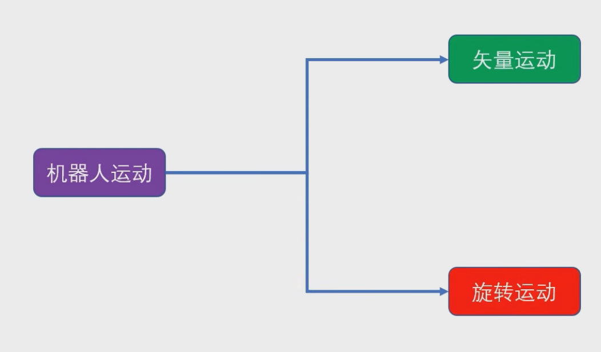

- 所有的三维运动都可以由上面的矢量运动和旋转运动合成得到：


## 2.机器人运动分解的量化表示

### 2.1 平移运动的量化

- 右手做出打枪的手势，其中食指指向机器人运动的正前方，可以得到机器人平移运动的坐标系；
- 机器人的任意平移运动，都可以通过这三个矢量表示；

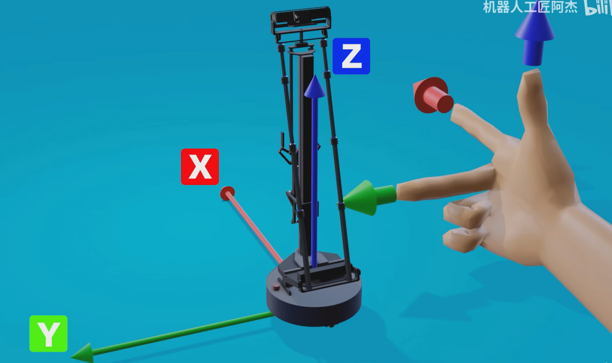

### 2.2 旋转运动的量化

- 右手四指握拳，只剩下拇指，当：
  - 拇指指向x轴正方向时，四指的旋转方向即滚转运动的正方向；
  - 拇指指向y轴正方向时，四指的旋转方向即俯仰运动的正方向；
  - 拇指指向z轴正方向时，四指的旋转方式即旋转运动的正方向；

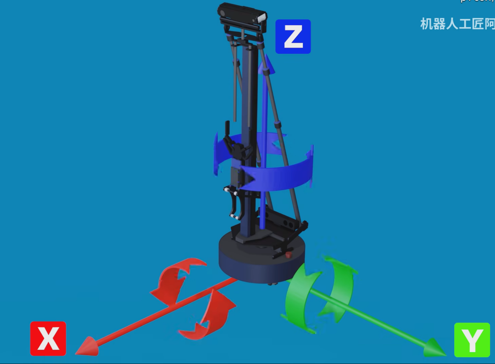

- 所有的三维旋转运动都可以由上面的三个方向合成得到：

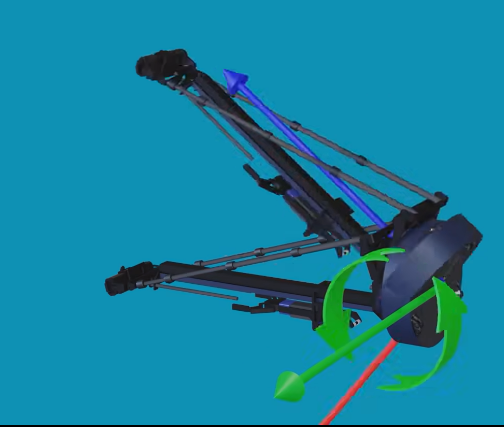


## 3.ROS中的运动控制中的消息包

- 在ROS中，单位如下统一：
  - 平移运动的单位是m/s；
  - 旋转运动的单位是rad/s；
- ROS中的机器人运动控制，是通过消息包的方式来控制的，消息包的格式如下：

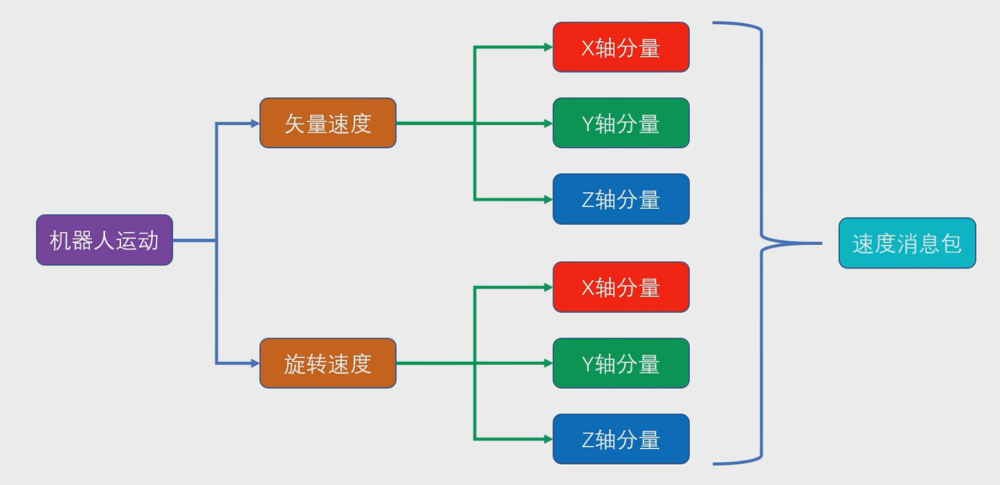


## 4.geometry_msgs软件包介绍

- geometry_msgs软件包是ROS中的运动控制消息包；
- 在index.ros.rog网站中，可以查看对它的详细描述：
  - Twist就是geometry_msgs中的运动控制消息包；
  - Twist里面包含了两个Vector3的变量，对应了平移运动和旋转运动；
  - 每个Vector3变量内部又有x、y、z三个变量描述；

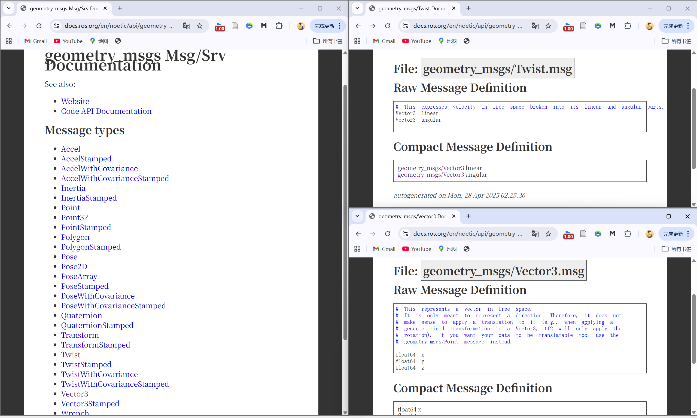


## 5.ROS中的运动控制话题消息架构

- 机器人出厂时会自带一个机器人核心节点，这个节点可以直接驱动机器人的底层硬件；
- 机器人核心节点会向上订阅一个话题，这个话题叫cmd_vel；
- 我们在开发过程中，就只需要写一个速度控制节点，并往cmd_vel话题中发布消息即可，这个消息的格式就是前面的Twist；

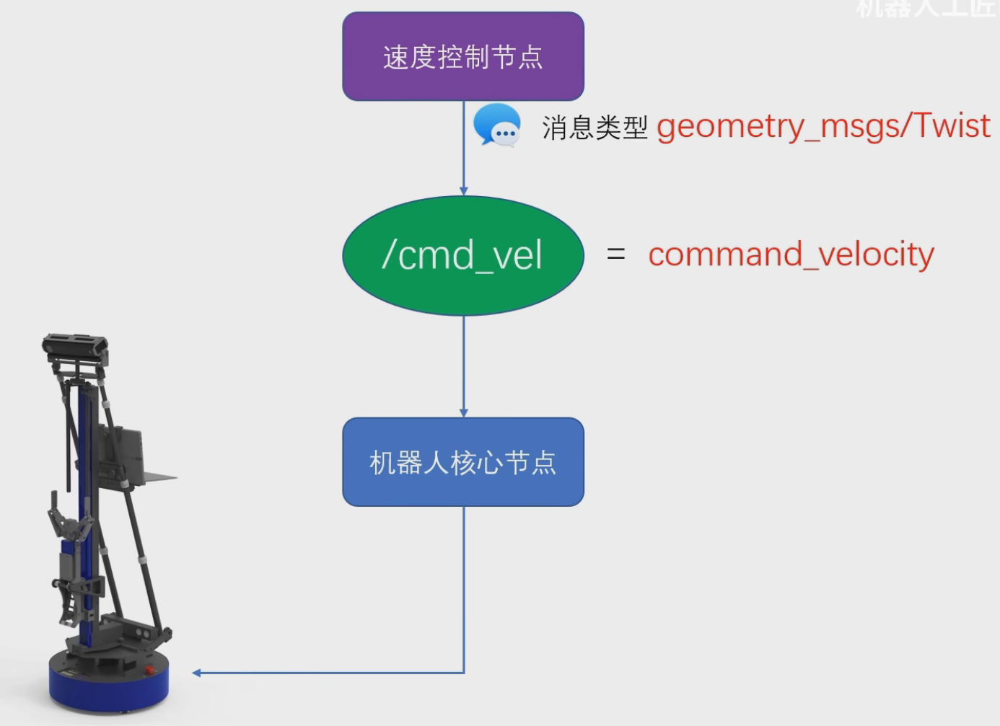


# 第十九节课：机器人运动控制的C++实现

## 1.环境的搭建

- 由于没有实体的机器人，所以采用ROS中的仿真进行模拟；

- 本节课程用之前介绍过的wpr_simulation开源项目进行仿真，前面已经下载过了源码，也就是**仿真环境Gazebo**；

- 根据下面步骤进行环境的搭建：

  - 进入**wpr_simulation软件包目录**中；
  - 执行**git pull**完成软件包的更新；
  - 回退到**catkin_ws**下，执行**catkin_make**进行编译；

  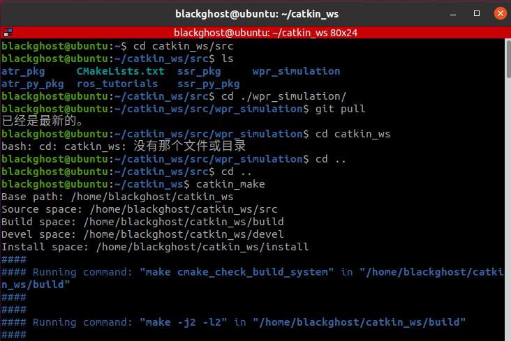

  - 编译完成后，可以选择启动该仿真程序（在主目录下执行）：

  ```bash
  roslaunch wpr_simulation wpb_simple.launch
  ```

  - 然后可以运行该项目中的一个运动控制小例程：

  ```bash
  rosrun wpr_simulation demo_vel_ctrl
  ```


## 2.开发软件包

### 2.1 整体思路框架

- 整体思路如下：
  - **我们完全不需要去操作底层的控制，只需要完成上层的速度控制节点即可**；

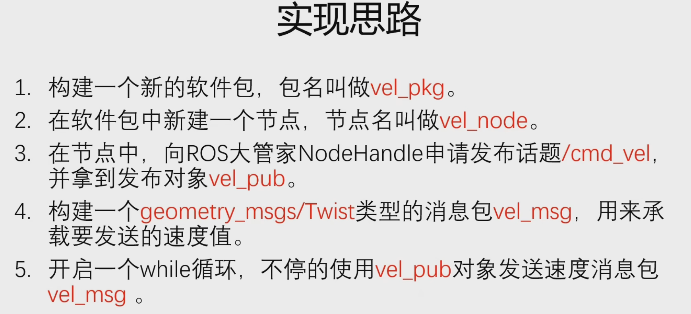

### 2.2 软件包开发

- **首先创建软件包vel_pkg**

  - 切换目录：

  ```bash
  cd catkin_ws/src
  ```

  - 创建软件包：

  ```bash
  catkin_create_pkg vel_pkg roscpp rospy geometry_msgs
  ```

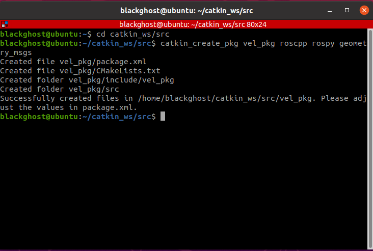

- **创建节点**

  - 在src目录下新建文件：vel_node.cpp
  - 然后在文件中添加如下内容：

  ```cpp
  #include <ros/ros.h>
  #include <geometry_msgs/Twist.h>
  
  int main(int argc, char *argv[])
  {
      ros::init(argc, argv, "vel_node");
  
      ros::NodeHandle n;
      ros::Publisher vel_pub = n.advertise<geometry_msgs::Twist>("/cmd_vel", 10);
  
      geometry_msgs::Twist vel_msg;
  
      vel_msg.linear.x = 0.1;
      vel_msg.linear.y = 0;
      vel_msg.linear.z = 0;
  
      vel_msg.angular.x = 0;
      vel_msg.angular.y = 0;
      vel_msg.angular.z = 0;
  
      ros::Rate r(30);
  
      while(ros::ok())
      {
          vel_pub.publish(vel_msg);
          r.sleep();
      }
  
      return 0;
  }
  
  ```

- **添加编译条件**

  - 在CMakeList.txt文件中，添加如下代码：
  - 然后直接编译即可，如果没有抄错基本能够成功编译；

  ```bash
  add_executable(vel_node src/vel_node.cpp)
  add_dependencies(vel_node ${${PROJECT_NAME}_EXPORTED_TARGETS} ${catkin_EXPORTED_TARGETS})
  target_link_libraries(vel_node
   ${catkin_LIBRARIES}
  )
  ```


## 3.运行节点仿真程序

- 先启动仿真环境

```bash
roslaunch wpr_simulation wpb_simple.launch
```

- 运行自己写的节点：

```bash
rosrun vel_pkg vel_node
```


## 4.逻辑总结

整个过程的逻辑如下：

- wpr_simulation是一个仿真环境；
- 当启动了demo_vel_ctrl这个小例程后，它就会发布/cmd_vel话题，为wpr_simulation中的wpb_simple.launch提供消息；
- 我们现在所创建的节点就是替代demo_vel_ctrl这个节点；
- 我们在写完节点后不启动demo_vel_ctrl，而是启动了我们自己的节点，机器人也能正常的跑起来；
- 这证明了我们的节点是工作正常的；


# 第二十节课：机器人运动控制的Python实现

## 1.项目思路

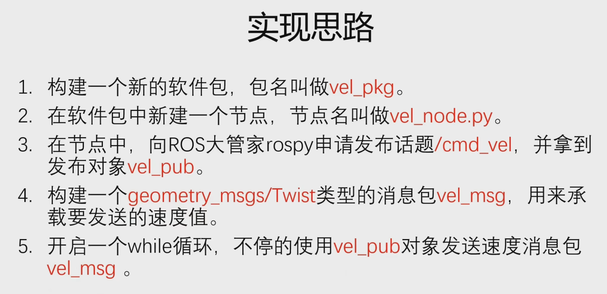


## 2.开发软件包

### 2.1 创建软件包

- 在工作空间的src目录下创建软件包**vel_py_pkg**：

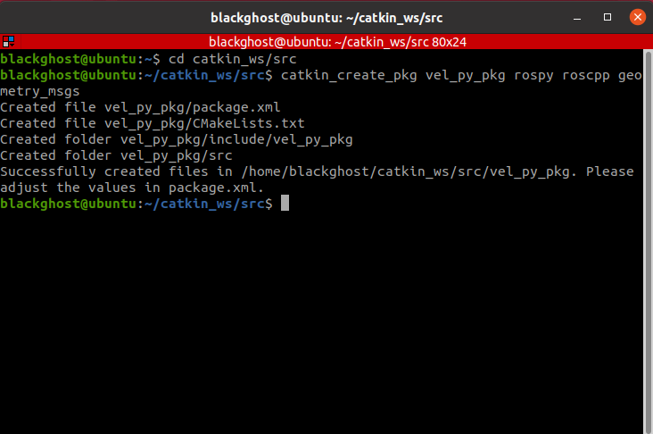

### 2.2 开发软件包

- 回到VsCode中，在软件包下新建**文件夹scripts**；
- 在scripts文件夹下新建文件，**vel_node.py**；
- 然后在vel_node.py文件下添加如下内容：

```python
#!/usr/bin/env python3
#coding=utf-8

import rospy
from geometry_msgs.msg import Twist

if __name__ == "__main__":
    rospy.init_node("vel_node")

    vel_pub = rospy.Publisher("cmd_vel", Twist, queue_size=10)

    vel_msg = Twist()

    vel_msg.linear.x = 0.1

    rate = rospy.Rate(30)

    while not rospy.is_shutdown():
        vel_pub.publish(vel_msg)
        rate.sleep()

```

- 为文件添加可执行权限：

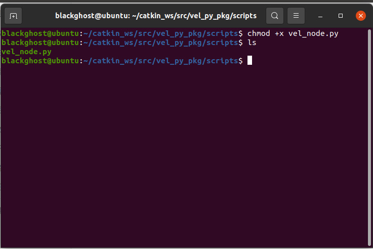


## 3.运行节点仿真程序

- 先启动仿真环境

```bash
roslaunch wpr_simulation wpb_simple.launch
```

- 运行自己写的节点：

```bash
rosrun vel_py_pkg vel_node.py
```


# 第二十一节课：激光雷达工作原理

## 1.激光雷达的分类

- **按测量维度分：**
  - 单线雷达与多线雷达；

- **按测量原理分：**
  - 三角测距雷达和TOF雷达；

- **按工作方式分：**
  - 机械旋转雷达和固态雷达；

- **激光雷达的分类有很多种，但是在ROS中激光雷达的数据格式都是一样的；**

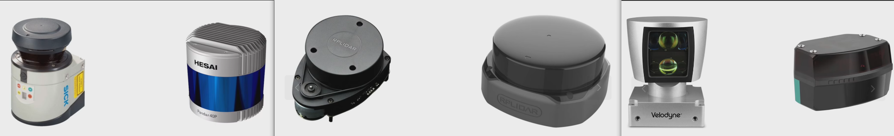


## 2.激光雷达的原理

- 不断的按如下方式进行扫描即可得到周围环境的点阵图；

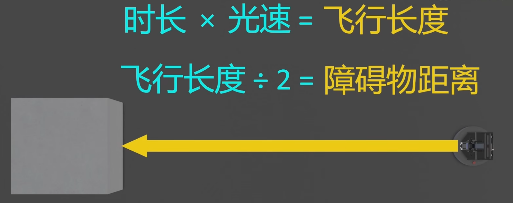


# 第二十二节课：使用RViz观测传感器数据

## 1.RViz简介

- 全名：The Robot Visualization Tool；
- 这是一个可视化工具，主要用来：
  - 可视化传感器的数据；
  - 可视化机器人运算处理的中间结果；
  - 可视化即将执行的目标指示；


## 2.RViz的使用

### 2.1 RViz的启动

- 在终端中启动仿真环境

```bash
roslaunch wpr_simulation wpb_simple.launch
```

- 打开RViz可视化工具：

```bash
rviz
```

- RViz界面的主要内容有：
  - 菜单栏；
  - 工具栏；
  - 当前可视化项目的列表；
  - 对可视化项目的操作；
  - 图形化显示窗口；
  - 视角位置数值调整窗口，一般不用，而是直接手动调整视角；
  - 状态栏；

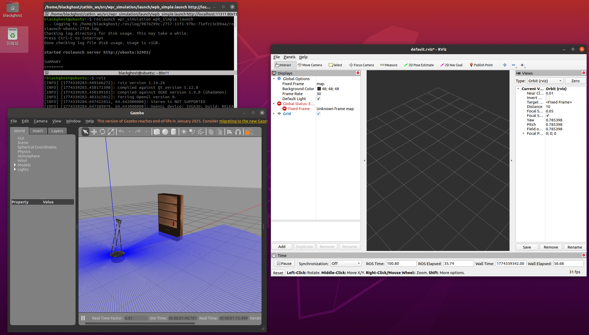

### 2.2 RViz的使用

- **修改Fixed Frame并添加机器人模型：**

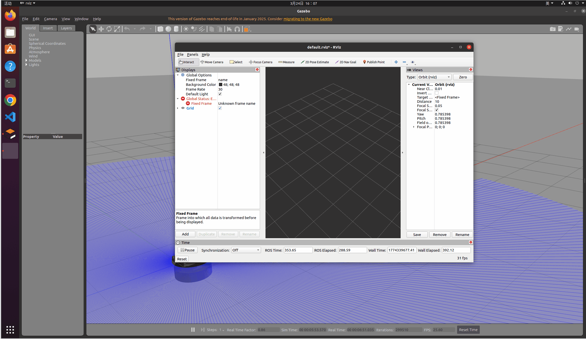

- **添加激光雷达并选择订阅话题：**


- **在仿真环境中添加障碍物，RViz将实时显示点阵：**


### 2.3 RViz配置文件的保存

- 在RViz中可以电机File将当前的环境格式保存为.rviz格式的文件；
- 在下次打开RViz时可以直接点击File将该文件环境读取进来；

- 除此之外，还可以通过launch文件启动RViz，如wpr_simulation中自带的一个launch文件：

```bash
roslaunch wpr_simulation wpb_rviz.launch
```

- 后续的RViz启动就通过这个方式来启动；


## 3.RViz与Gazebo的区别

- **Gazebo：**
  - 是模拟真是机器人发出传感器数据的工具；
  - 在实际的机器人开发中，Gazebo是不存在的，由真实的机器人和真实的环境代替；
- **RViz：**
  - 是接收传感器数据并进行显示的工具，即它显示的是机器人实际能检测的环境状况；
  - 在实际的机器人开发中，RViz可能还存在，它仍然可以接收实际机器人的传感器数据并显示；


# 第二十三节课：激光雷达消息包格式

## 1.启动仿真环境与RViz

- ```bash
  roslaunch wpr_simulation wpb_simple.launch
  ```

- ```bash
  roslaunch wpr_simulation wpb_rviz.launch
  ```

- 然后在机器人周围放上障碍物，即可得到点阵图；

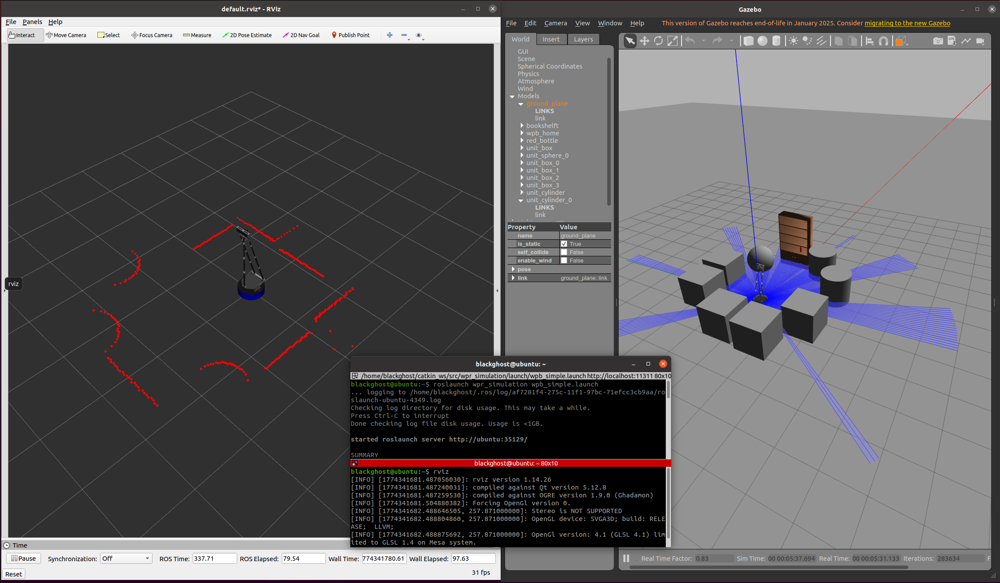


## 2.官网查看ROS中对激光雷达点阵数据的封装

- 官网中选择**Package**和**Noetic的版本**；
- 然后在搜索框中搜索：**sensor_msgs**；
- 进去后点击**Website**进入其描述网址，然后选择**LaserScan Message**：

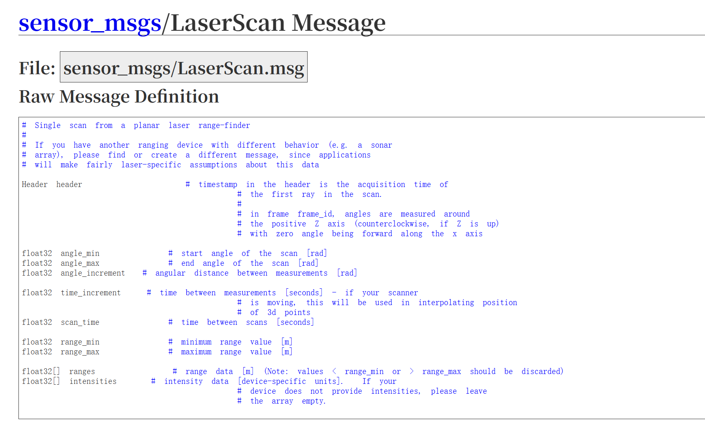

- 中文翻译如下：

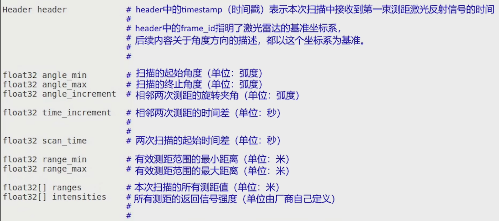


## 3.用rostopic查看仿真中的数据格式

- **在终端中执行：**

```bash
rostopic echo /scan --noarr
```

- 得到如下结果：

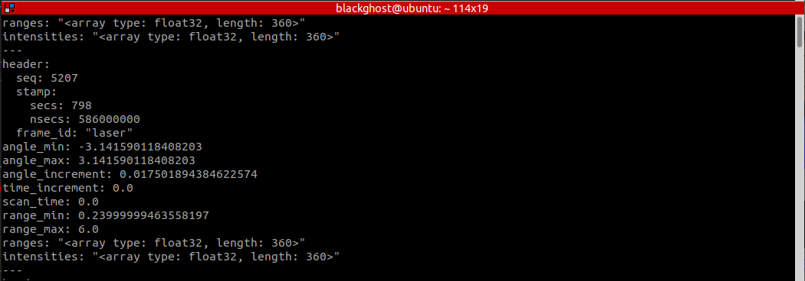

- **数据格式剖析：**
  - header：主要是存储时间戳和坐标系ID
    - 时间戳：消息包发送的时间；
    - 坐标系ID：涉及到TF系统；
  - angle_min和angle_max：对应了激光雷达的起始角度和终止角度（弧度）；
  - angle_increment：相邻两次测距的旋转夹角（弧度）；
  - time_increment：相邻两次测距的时间差（s）；
  - scan_time：两次扫描的起始时间差（s），即扫描周期；
  - range_min和range_max：雷达扫描的最小距离和最大距离（m）；
  - ranges：数据数组
    - 包含360个float32的数据，即旋转一周扫描360个点，然后存入数组中；
    - 数据的排序跟扫描的起始角度和终止角度对应，就是360个值；
    - 若测量距离过大，数据就是INF；
  - intensities：360个float32数据，与ranges对应，是测距返回的信号强度；


# 第二十四节课：获取激光雷达数据的C++节点

## 1.环境搭建

- 本节课的依赖环境就是之前说的wpr_simulation；
- 整个环境的搭建可参照《第十九节课的环境搭建》；
- 思路：
  - 若已经下载了就可以直接编译并运行；
  - 若还没下载就下载源码然后编译运行；


## 2.运行环境

- 仿真环境的运行：

```bash
roslaunch wpr_simulation wpb_simple.launch
```

- wpr_simulation中有一个获取雷达数据的例子程序。可运行查看效果：

```bash
rosrun wpr_simulation demo_lidar_data
```

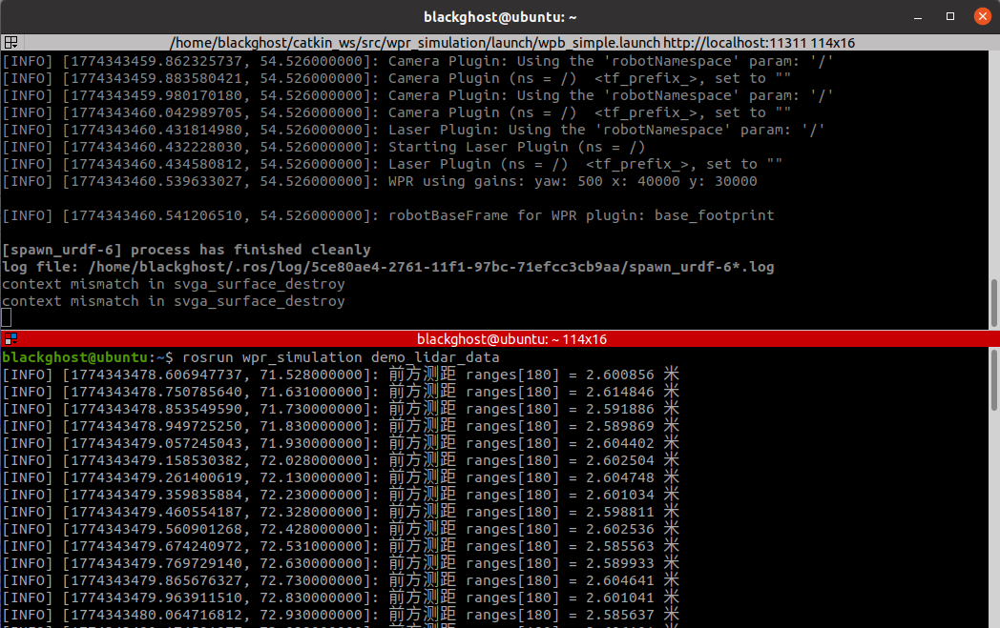


## 3.项目框架

- ROS开发中，激光雷达会有一个节点，这个节点是由厂商提供的，**配置一下端口即可将激光雷达的电路数据传输到这个节点中**；
- 这个节点会发布一个话题，消息的格式就是之前的sensor_msgs::LaserScan，话题的名称是约定的/scan；
- 我们只需要完成数据获取节点，订阅/scan话题即可得到数据；

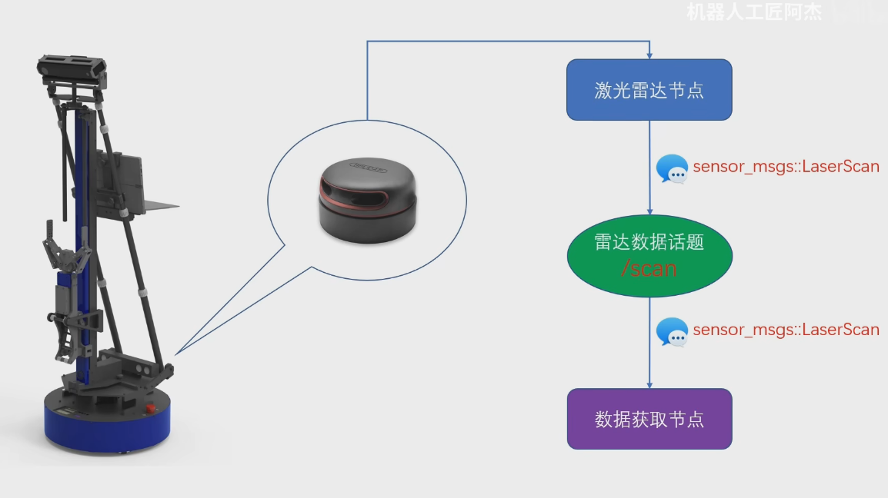

- **最后总结一下实现步骤如下：**

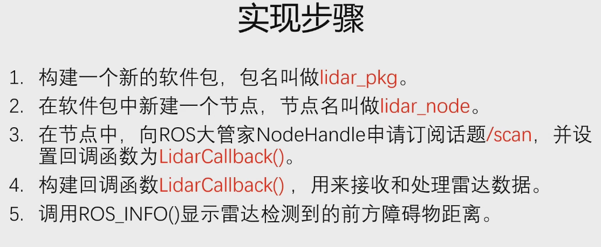


## 4.项目开发

- **创建软件包：catkin_ws src目录下**

```bash
catkin_create_pkg lidar_pkg roscpp rospy sensor_msgs
```

- **VsCode中，在lidar_pkg目录下的src目录下创建lidar_node.cpp文件，然后编程：**

```cpp
#include <ros/ros.h>
#include <sensor_msgs/LaserScan.h>

void LidarCallback(const sensor_msgs::LaserScan msg)
{
    float fMidDist = msg.ranges[180];
    ROS_INFO("前方测距 ranges[180] = %f 米", fMidDist);
}

int main(int argc, char *argv[])
{
    setlocale(LC_ALL, "");
    ros::init(argc, argv, "lidar_node");
    
    ros::NodeHandle n;
    ros::Subscriber lidar_sub = n.subscribe("/scan", 10, &LidarCallback);
    
    ros::spin();		// 内部自带了循环，不需要再套个while
    
    return 0;
}

```

- **添加编译规则：CMakeList.txt文件最后添加：**

```cpp
add_executable(lidar_node src/lidar_node.cpp)
target_link_libraries(lidar_node
  ${catkin_LIBRARIES}
)
```

- **编译：catkin_ws下，终端执行命令**

```bash
catkin_make
```


## 5.运行查看数据

- **启动仿真环境：**

```bash
roslaunch wpr_simulation wpb.simple.launch
```

- **启动节点：**

```bash
rosrun lidar_pkg lidar_node
```

- **实际效果：**
  - 可不断移动仿真环境中的书柜，然后观察终端数据的变化；

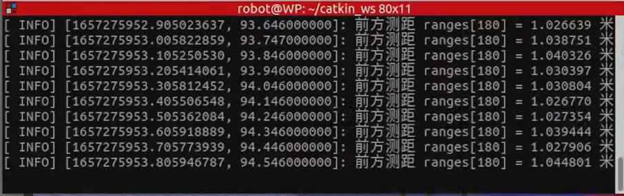


# 第二十五节课：获取激光雷达数据的Python节点

## 1.项目整体结构

- 在我的开发中，为了区分前面的lidar_pkg，我改为了lidar_py_pkg；

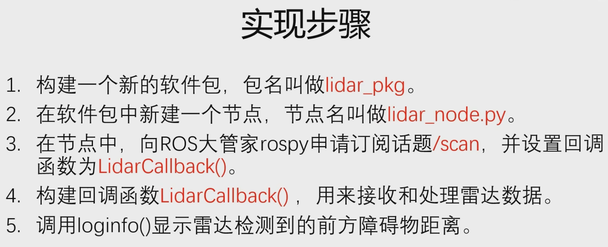


## 2.项目开发

- 创建软件包：

```bash
cd catkin_ws/src
catkin_create_pkg lidar_py_pkg roscpp rospy sensor_msgs
```

- 编译：

```bash
cd ..			# 回退到catkin_ws目录
catkin_make		# 编译
```

- 创建文件：
  - 在VsCode中，在lidar_py_pkg文件夹下创建scripts文件夹；
  - 再在这个文件夹下创建lidar_node.py文件；

- 编辑文件：

```python
#!/usr/bin/env python3
#coding=utf-8

import rospy
from sensor_msgs.msg import LaserScan

def LidarCallback(msg):
    dist = msg.ranges[180]
    rospy.loginfo("前方测距 range[180] = %f 米", dist)


if __name__ == "__main__":
    rospy.init_node("lidar_node")
    lidar_sub = rospy.Subscriber("/scan", LaserScan, LidarCallback, queue_size=10)
    rospy.spin()

```

- 为文件添加可执行权限

```bash
cd catkin_ws/src/lidar_py_pkg/scripts
chmod +x lidar_node.py
```

- 运行仿真环境并运行节点

```bash
roslaunch wpr_simulation wpb_simple.launch
rosrun lidar_py_pkg lidar_node.py
```

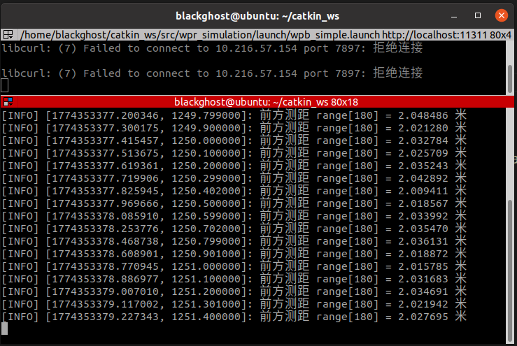


# 第二十六节课：激光雷达避障的C++节点

## 1.项目框架

- 在前面的基础上，使节点订阅雷达数据的同时，发布速度控制话题；

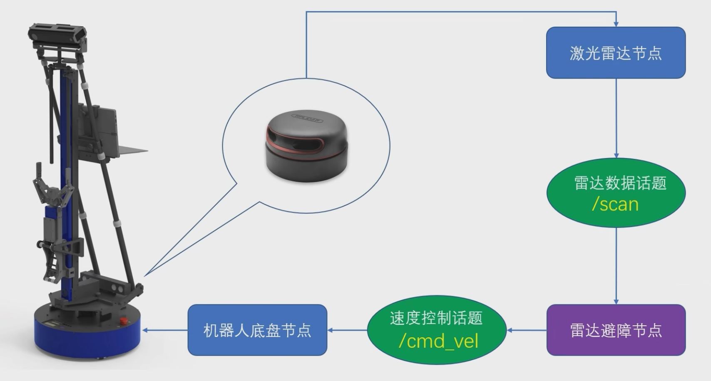

- 实现步骤：

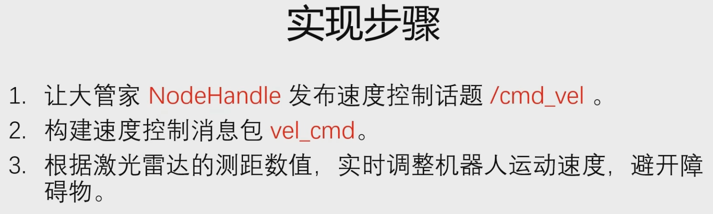


## 2.项目开发

- 在原来的lidar_pkg软件包的lidar_node.cpp文件基础上增加：
  - 每调用回调函数50次就发布一次速度指令；

```cpp
#include <ros/ros.h>
#include <sensor_msgs/LaserScan.h>
#include <geometry_msgs/Twist.h>

ros::Publisher vel_pub;     // 声明为全局变量
int nCount = 0;				// 计数值变量，用于延长旋转时间

void LidarCallback(const sensor_msgs::LaserScan msg)
{
    float fMidDist = msg.ranges[180];
    ROS_INFO("前方测距 ranges[180] = %f 米", fMidDist);

    if(nCount > 0)
    {
        nCount --;
        return;
    }

    geometry_msgs::Twist vel_cmd;
    if(fMidDist < 1.5)
    {
        vel_cmd.angular.z = 0.3;
        nCount = 50;
    }
    else
    {
        vel_cmd.linear.x = 0.05;
    }
    vel_pub.publish(vel_cmd);
}

int main(int argc, char *argv[])
{
    setlocale(LC_ALL, "");
    ros::init(argc, argv, "lidar_node");
    
    ros::NodeHandle n;
    ros::Subscriber lidar_sub = n.subscribe("/scan", 10, &LidarCallback);   // 订阅激光雷达话题
    
    vel_pub = n.advertise<geometry_msgs::Twist>("/cmd_vel", 10);            // 发布速度话题

    ros::spin();
    
    return 0;
}

```


## 3.编译运行

- 启动仿真环境：

```bash
roslaunch wpr_simulation wpb_simple.launch
```

- 运行节点：

```bash
rosrun lidar_pkg lidar_node
```

- 效果如下：


# 第二十七节课：激光雷达避障的Python节点


# 第二十八节课：ROS中的IMU惯性测量单元的消息包


# 第二十九节课：获取IMU数据的C++节点


# 第三十节课：获取IMU数据的Python节点


# 第三十一节课：IMU航向锁定的C++节点


# 第三十二节课：IMU航向锁定的Python节点


