# 第一节课：ROS是什么

## 1.手机操作系统

### 1.1 以前的手机开发模式


### 1.2 后来的手机开发模式

- **Android：**

  - Linux——>Android；

  - **Android在Linux内核的基础上添加了原生App，并集成了一个虚拟环境可以运行Java开发的应用；**
  - 开发者只要将应用上传到应用商店即可下载；

- **IOS：**
  - 一个完整的iphone操作系统，运行方式同Android；


## 2.机器人操作系统

### 2.1 以前的机器人开发模式

- 每造一台机器人就需要从硬件到软件重新开发一遍；

### 2.2 后来的机器人开发模式

- **“模块化”的开发方式**
  
  - 每个传感器对应一个特定的程序模块、每个执行器对应一个特定的程序模块、每个算法对应一个特定的程序模块；
  - 下次再开发机器人时，只需要把它们组合起来就可以跑了；
  
- **“分布式”的开发方式**
  
  - 每个模块可以独立运行在不同的电脑；
  - 比如用单独的电脑运行视觉算法，这样整体的效率就大大提高了；
  
  

### 2.3 ROS的介绍

- **ROS的模式**
  
  - 每个**“launch”**文件是**一个乐高房子**，由不同的乐高砖块构成；
  - 每个node相当于**一个乐高砖块**，由它组成乐高房子；
  - 而每个Package相当于是**一袋乐高砖块**；
  
- **ROS的开发方式**

  - 从官方**APT源**中下载安装包，可以直接用无需编译；
  - 从**Github**中下载源码，编译之后再运行；
  - 自己按照**接口规范**写源码并编译运行；

  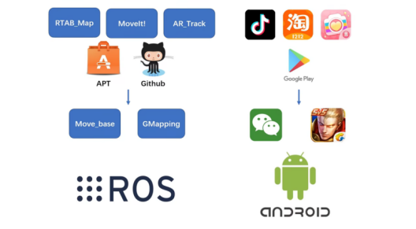

---


# 第二节课：如何学习ROS

## 1.搭建环境

- 目的：**安装Ubuntu＋安装ROS**；

- ROS版本选择：ROS的版本更新主要是为了适应Ubuntu更新中大量依赖库的更新，两者的更新基本保持统一步调；


## 2.学习的方式

- 自己买一个机器人；
- 基于**ROS自带的仿真环境**进行学习；

---


# 第三节课：Ubuntu系统的安装

Ubuntu系统的安装主要可以有以下几种选择：

- 虚拟机方式：跑在虚拟机软件上，性能较差；
- 双系统的方式：开机选择系统；
- WSL的方式：只有命令行；
- 安装在树莓派上：特定的硬件上，性能可能不足；

---


# 第四节课：Ubuntu使用入门

## 1.程序菜单和任务栏

- 左下角——>开始；
- 添加到收藏夹——>任务栏；

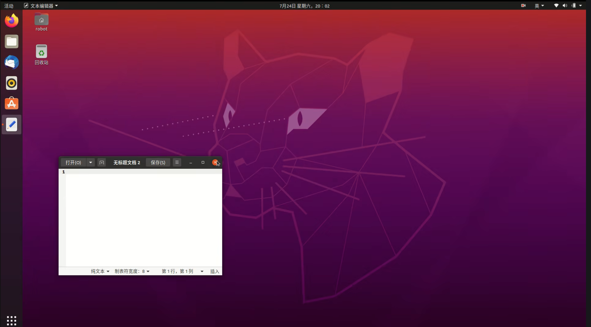


## 2.输入法中英文切换

- Shift或Alt＋Space；
- 若不行就自行安装中文包；


## 3.Ubuntu文件系统

- **主目录：**
  - 即HOME目录；
  - 可通过：`cd ~`快速回到主目录
- **根目录/：**
  - 整个系统的系统盘；
  - 对应的就是下图的其他位置；
- 大部分时间都只需要在主目录下操作即可；

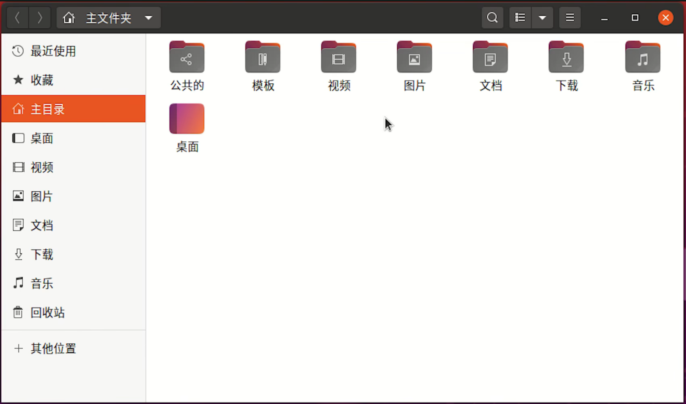


## 4.连接无线网

- 非虚拟机：像平常电脑一样连接WiFi即可；

- 虚拟机：只要主机连接了WiFi，它就会连接；

- **注意几种连接方式的不同（NAT、桥接等）、如何给虚拟机配置代理（ip地址）；**


## 5.终端程序和常用指令

- **终端程序的开启：**
  - 在开始菜单中启动；
  - 快捷键：Ctrl+Alt+T；

- **ls指令：**
  - 列出当前文件夹的内容；
  - 列出所有文件包括隐藏文件：**ls -a**；

- **mkdir指令：**
  - **mkdir [文件夹名称]**；
  - 用于在当前文件夹在创建文件夹；

- **cd指令：**
  - **cd [相对路径/绝对路径]**；
  - 用于切换目录；
  - 注意“cd ..”是返回父目录；

- **Tab键：**
  - 自动补全；


## 6.文本编辑器——gedit

- **edit命令：**
  - **gedit [文件名称]**；
  - 是一个文本编辑器（相当于Windows中的记事本）；
  - 我们要改某个文件的内容都是通过这个指令来改的；

- **其他文本编辑器：**
  - vim：老牌编辑器，通过状态转换来使用；
  - nano：同普通的文本编辑器相同；


## 7.source指令

- **source指令：**
  - **source [文件名]**；
  - 它会执行这个文件中的一系列指令；

- **.sh文件：**
  - 一般会把一连串的指令写在.sh文件中，.sh文件是一个SHELL执行脚本；
  - echo指令是打印显示；


## 8.终端启动脚本——.bashrc文件

- **~/.bashrc：**
  - 是一个文件，位于主文件夹里，但是是一个隐藏文件；
  - 其中rc是run command的意思；

- **作用：**
  - 终端的**初始化脚本**；
  - 每次执行终端程序时，都会首先执行这个脚本，完成一些**环境变量的赋值操作**；
  - 在ROS中，可以在该文件下加入ROS的初始化指令；
  - **注意该文件中可以配置终端的VPN代理；**

 

## 9.执行管理员权限

- **sudo指令：**
  - 在某一条指令前面加上sudo就可以以管理员权限运行；

- **从APT源上下载安装包：**
  - sudo install [软件包名称]；

---


# 第五节课：ROS系统安装

## 0.版本选择：

- 安装的Ubuntu版本是20.04，与之对应的ROS版本是Noetic；
- 与Ubuntu的离线安装不同，ROS的安装就像安装应用一样，需要联网在线安装；


## 1.ROS官方安装步骤

- ROS的官方网站：[ROS官网](https://www.ros.org/)；

- Noetic版本的官方安装教程：[Noetic版本ROS的官方教程](https://wiki.ros.org/noetic/Installation/Ubuntu)；

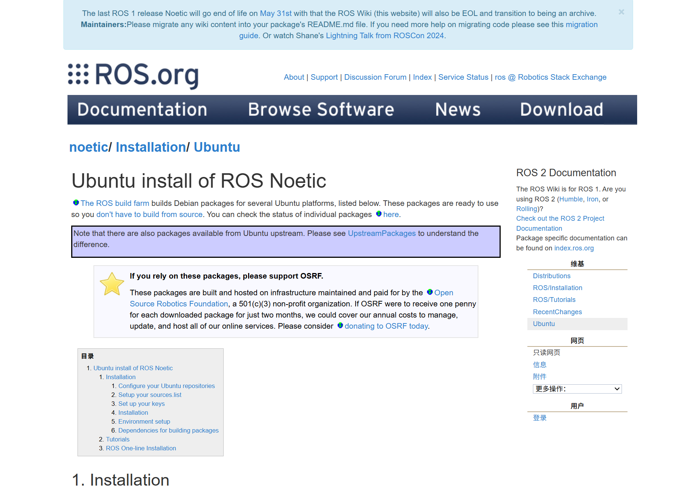 

- **配置Ubuntu的远程仓库**
  - 安装ROS需要先配置Ubuntu的远程仓库；
  - 但一般在安装系统时就配置好了，所以这里不需要再配置；
  - 这里可以选择添加清华源的链接到配置文件中；


## 2.导入ROS安装源

- ROS是一个包含了非常多包的一个集合，这些包都放在一个地方进行管理，那就是**ROS安装源**；
- 我们需要先将ROS的**安装源地址**添加到Ubuntu的**APT包管理器源列表**；
- 这个列表写明了有什么“应用商店”，在初始条件下系统中写有了Ubuntu的官方应用商店，即APT官方源；
- 它会告诉APT包管理器下载ROS包的下载地址；
- 其实就是相当于告诉Ubuntu：我可以从哪些源里面下载软件包，用安卓的角度来说就是给Ubuntu安装了一个ROS的应用商店；

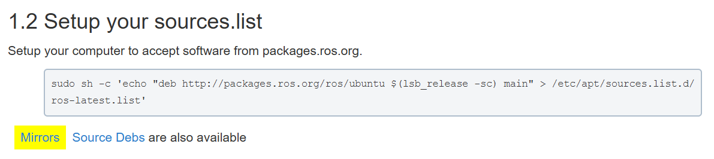

- 官方给的链接是国外的链接，可以点击下方的**Mirrors**选择国内镜像；
- 一共有四个镜像，这里选择中科大，把命令复制到终端执行即可；

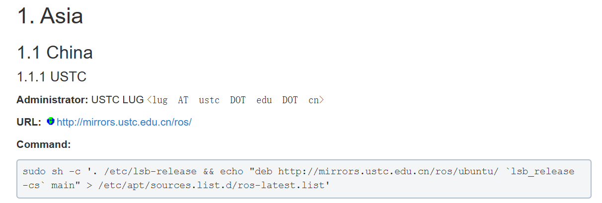

- 最终的运行效果如下：

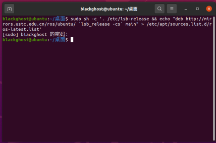


## 3.设置安装密钥

- 第三步是进行密钥安装，复制一下两行代码在终端运行即可，如下图所示：

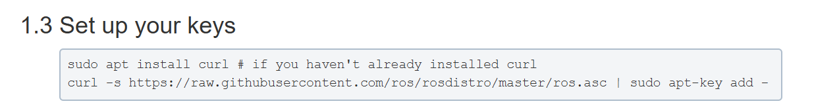

- 方框中是两条指令：
  - 第一条是安装curl这个工具，复制#前面内容到终端执行；
  - 第二条可分两部分：
    - 管道符前面是从ROS的Github仓库中下载GPG公钥；
    - 管道符后面是将该公钥添加到apt的系统可信密钥库中；
    - 主要是为了后续验证ROS软件包的合法性做准备，防止下载到被篡改的文件；

- 运行两行代码后，若返回“OK”即代表成功安装了密钥。

---

**专栏：Linux中的软件安装**

Linux中的下载可以分为：普通文件下载和APT包管理器安装软件

- **普通下载**：即通过**curl/wget**下载压缩包、文档，它不需要密钥，可随意从任何网站下载，需要用户自己判断安全性；

- **APT包管理器安装软件：这种方式可以分为从Ubuntu官方软件源下载和从第三方软件源下载**
  - 前者在系统安装时已经默认预装了官方的**GPG密钥**，不需手动添加；
  - 后者需要手动添加该第三方的**GPG密钥**，否则APT会拒绝从这个源安装软件；
  - **这种GPG密钥就是git在提交Github时的一种密钥配对协议；**

---


## 4.下载安装ROS

- 接下来安装ROS，分别执行下面两句代码，安装完成即证明ROS安装成功。

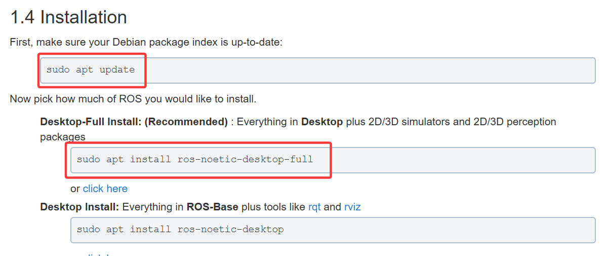

 

## 5.环境参数设置

- 接下来需要将**ROS的环境设置脚本**添加到终端程序的初始化脚本里，即**~/.bashrc文件**；
- 我们要做的就是在.bashrc文件中source一下ROS的环境设置脚本即可；
- 这样每次打开终端它都会执行一遍ROS的环境参数设置，完成ROS的初始化；

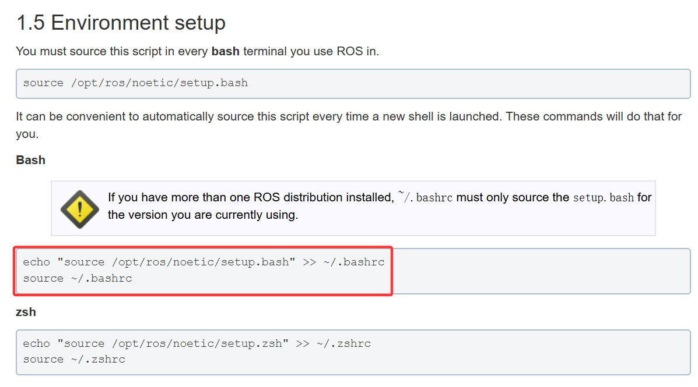

- 分别在终端执行这两句代码即可；
- 如果要测试是否安装成功，可以在终端执行：roscore，出现下面信息表示成功启动了ROS的核心：


 

## 6.rosdep初始化

- 最后还需要对ROS的依赖包工具进行初始化，方便以后下载第三方的扩展软件包；
- 在终端执行下面三条指令，即可完成rosdep的初始化，其中中间框的之前已经安装过了不需要再装；

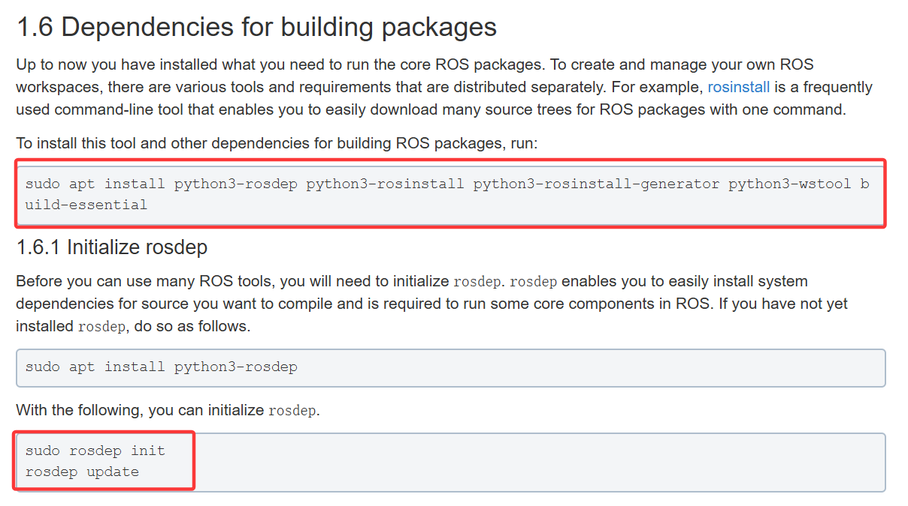

---


# 第六节课：应用商店APT源

## 1.APT工具介绍

- **定义：**
  - APT是Ubuntu自带的一套软件包下载工具；
  - 可以使用它从网上的源服务器下载指定的软件包并自动安装；
  - 与手机上的应用商店很类似；

- **APT的源列表：**
  - Ubuntu安装时，默认APT的源服务器只有Ubuntu的官方源（应用商店）；
  - 我们可以通过编辑APT的源列表增加新的应用商店；
  - **前面添加的ROS的源，就是添加了ROS的应用商店（前面是中科大的源）**；

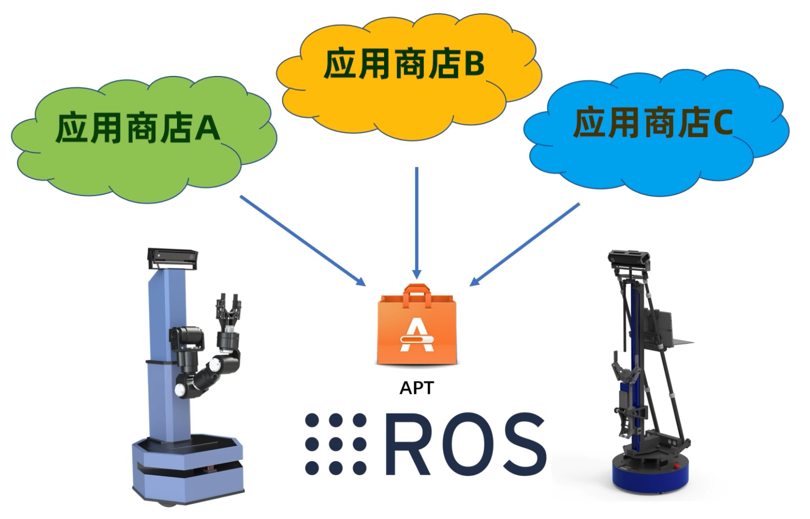


## 2.ROS的“应用商店”

### 2.1 应用商店长什么样

- 应用商店是通俗的叫法，实际上是**存放ROS的各种包的源服务器**，就像**Github那样的托管平**台;
- 网址为：[ROS应用商店网站](https://index.ros.org)；

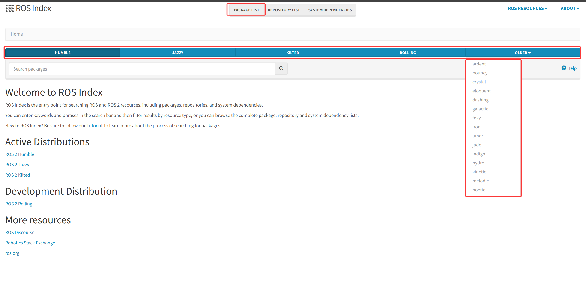

- 可点击**Package List**，网页将展示几乎**所有的ROS的资源，包括软件库、依赖包、源码**等等；

- 当然，我们需要选择我们对应的系统，我们选择了自己的版本：noetic；

- 这些软件包我们都可以通过apt命令来安装，安装的格式是：

  - ```bash
    sudo apt install ros-[ros版本]-name
    ```

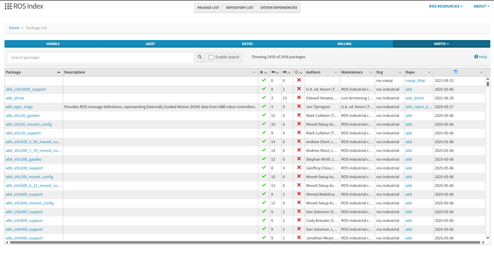

### 2.2 每个软件包长什么样

- 我们选择里面的一个包：**rqt_robot_steering**，双击这个包进入它的界面；
  - 可以看到它们有关于这个包的**基本信息、包的源码信息以及对于这个包的关于作者等的介绍；**
  - **Website**界面有关于这个包的详细介绍；
  
  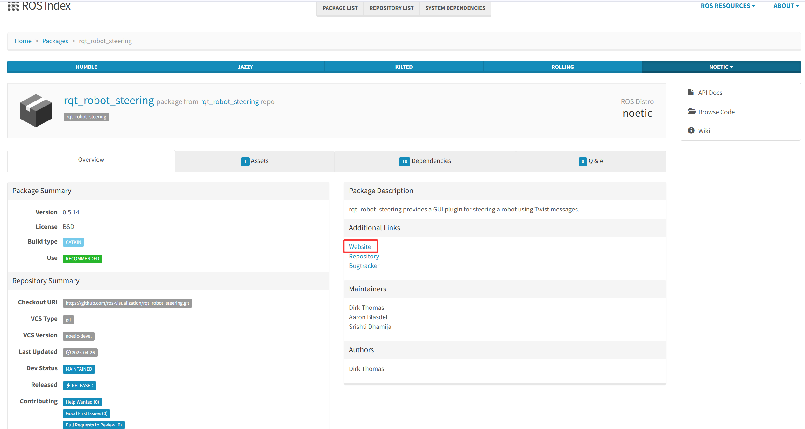

-  点击右侧的**Website**，进入这个包的具体演示界面，它会详细的描述楚这个包的作用以及如何使用：

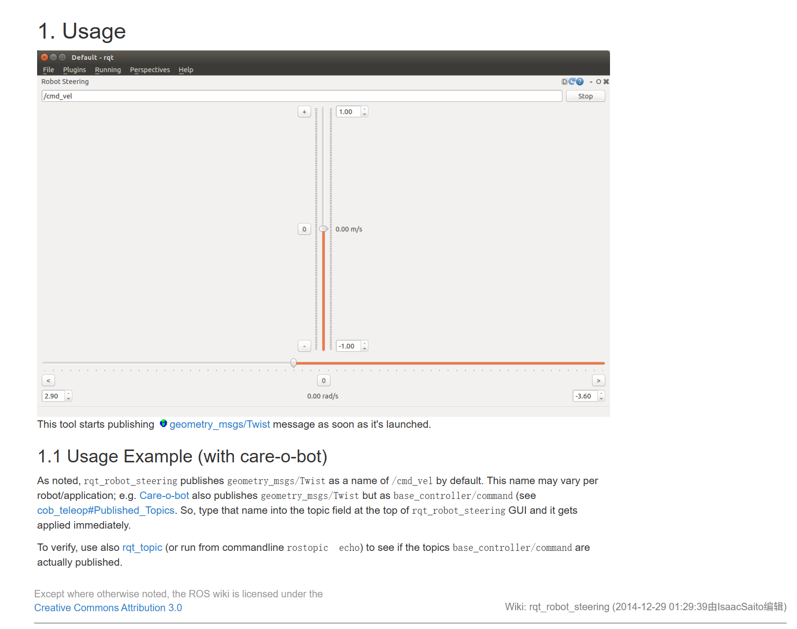


## 3.运行一个ROS实例

### 3.1 rqt_robot_steering实例

以上一小节的**rqt_robot_steering**这个软件包为例，讲解如何**运行一个ROS实例**。

- **安装rqt_robot_steering软件包**

  - ```bash
    sudo apt install ros-noetic-rqt-robot-steering
    ```

  - 终端运行上面指令以安装软件包；

- **运行ROS内核**

  - 另外打开一个终端，运行如下指令：

  - ```bash
    roscore
    ```

- **运行rqt_robot_steering节点**

  - 在原来的终端中运行：

  - ```bash
    rosrun rqt_robot_steering rqt_robot_steering
    ```

  - 两个rqt_robot_steering：前面一个是包名称、后面一个是节点名称；

  
  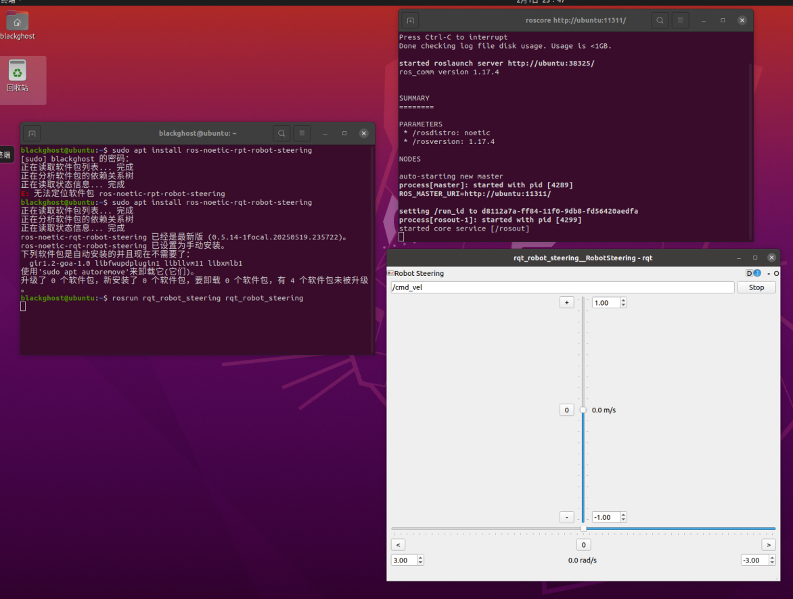

 ### 3.2 turtlesim实例

- **再开一个终端，输入指令安装小乌龟：**

```bash
sudo apt install ros-noetic-turtlesim
```

- **接着在这一个终端运行小乌龟：**

```bash
rosrun turtlesim turtlesim_node
```

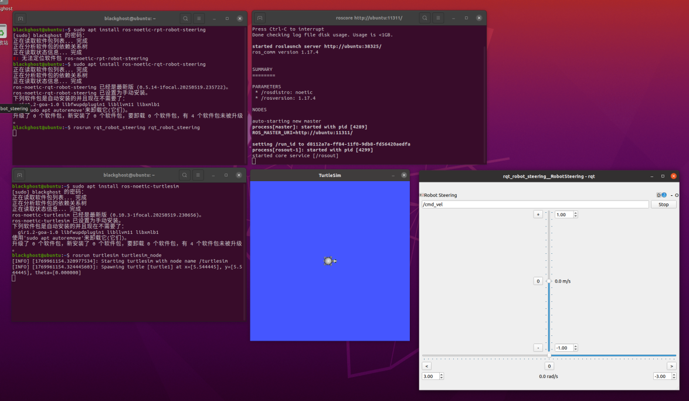

 ### 3.3 用rqt_robot_steering控制turtlesim

- 这样，小乌龟出来了，rqt_robot_steering软件包的控制界面也出来了；
- 在软件包界面的输入栏前面加上turtle1（任意写，不然不会启动）；
- 我们就可以用竖直杆控制速度，水平杆控制旋转的方向来完成仿真实验了；

---


# 第七节课：开源自由市场Github

## 1 Github应用商店

- 除了ROS的官方应用商店，Github中也有很多优质的ROS软件包；
- ROS本身和index.ros上的大部分软件包在Github都开放了源代码；

 

## 2 Github与index.ros的不同

- Github中的软件包都是以**源代码的形式**开源，我们下载下来后还需要**编译**才能运行；
- 所以需要先建立一个**工作空间，来进行源代码编译**；
- 所谓工作空间就是建立一个**符合某种要求的目录结构，编译器会按照这个目录建构去检索源代码完成编译**；

 

## 3 建立目录结构并安装Git工具

### 3.1 建立目录结构

- 目录结构：**HOME——>catkin_ws——>src**；
- 下载的源代码就需要放在src目录里才能正常编译，所以在终端分别执行：

```bash
mkdir catkin_ws

cd catkin_ws

mkdir src

cd src
```

- 这样就创建好工作空间了，后续我们自己写的源代码也会放在这个工作空间中；
- **catkin是ROS1中的系统构工具，catkin_ws就是catkin workplace的意思**；

### 3.2 安装Git工具

- 从GitHub下载或上传文件需要用到**git工具**，在终端执行

```bash
sudo apt install git
```

- 注意，这句终端执行目录需要在**src目录**下执行；

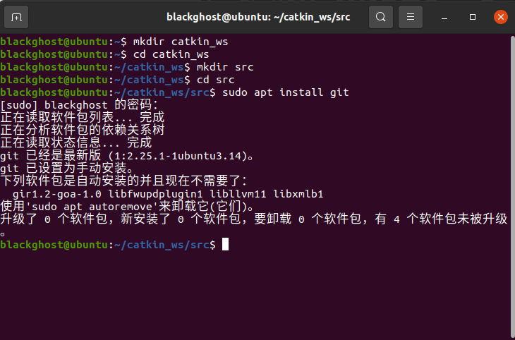


## 4 下载源码包

- 完成上述工作后就可以进行源码的下载了；
- 在GitHub搜索栏中搜索：**wpr_simulation**，找到**6-robot**这一项；
- 点击进入选择**Code按钮**，复制弹出来的一串网址：https://github.com/6-robot/wpr_simulation.git；
- 接着回到终端，执行命令

```bash
git clone https://github.com/6-robot/wpr_simulation.git
```

- 这样就可以把源代码下载到我们的**src文件夹下了（要保证在src文件夹执行）**；

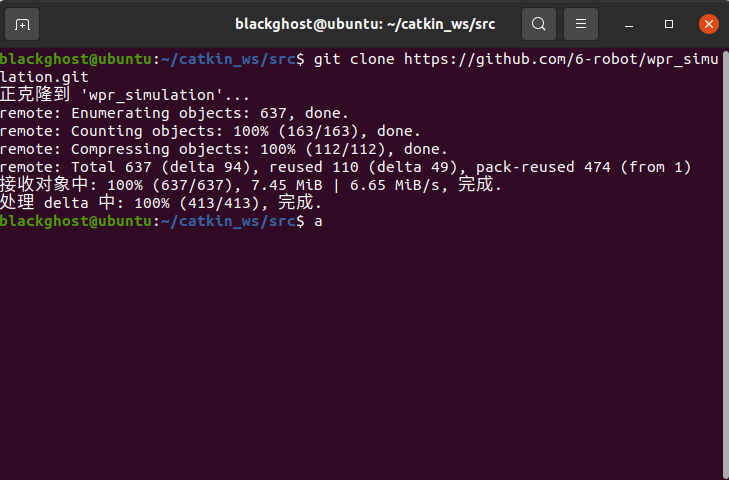


## 5 查看下载内容并进行编译

### 5.1 查看文件内容

- **wpr_simulation目录：**
  
  - 如下图所示即为我们从GitHub上clone下来的文件，全部文件在wpr_simulation文件夹下；
  
  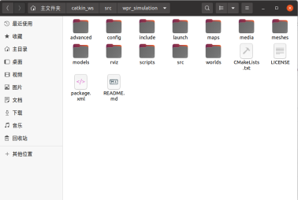
  
- **scripts文件夹：**
  - 先看**scripts**文件夹，可以看到它里面放了一些**脚本文件(.sh文件)和python程序**；
  - 这些文件主要是完成**依赖包的安装和为机器人映射端口**，这类操作一般进行**一次**即可；
  
  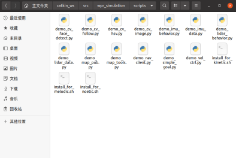

### 5.2 安装依赖包

- **依赖包文件：**

  - 在scripts文件夹下可以看到有**install_for_noetic.sh**文件；
  - 这个就是用于给noetic系统**安装这个项目的依赖包**的执行文件；

- **安装依赖包：**

  - 在这个文件夹下右键，选择在终端打开，然后输入执行下面的指令，输入密码即可安装依赖包；

  ```bash
  ./install_for_noetic.sh
  ```

### 5.3 编译

- 安装好依赖包后，回到工作空间的入口地址：**catkin_ws**；
- **输入catkin_make指令后它自己会读取CMakeList.txt文件并调用系统的gcc编译器进行编译；**
- 然后输入指令，它将会编译**src文件夹下的所有源代码**：

```bash
catkin_make
```

- **注意：catkin_make命令必须要在catkin_ws目录下运行，而不是src子目录，编译后catkin_ws目录会多出几个文件夹，那是编译产生的文件**；

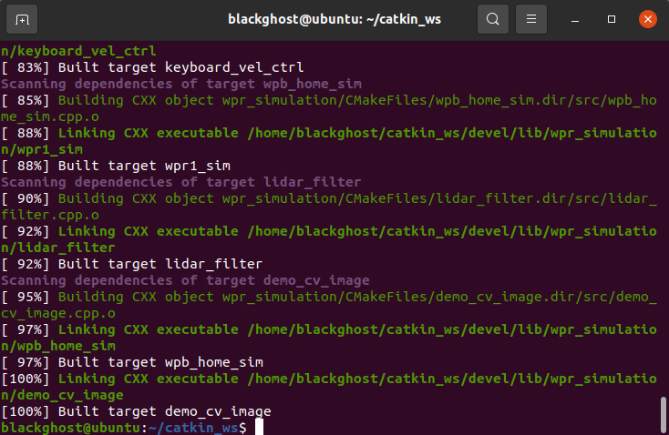


## 6 运行包的功能

### 6.1 加载包的环境参数到终端命令

- 首先需要**将catkin_ws工作空间里的环境参数加载到终端里**，否则运行指令会提示找不到软件包；
- 即**用source指令载入工作空间的环境设置**，终端中执行：

```bash
source ~/catkin_ws/devel/steup.bash
```

### 6.2 运行编译好的ROS程序

- 完成上一步后，即可运行程序，输入指令：

```bash
roslaunch wpr_simulation wpb_simple.launch
```

- 然后就会得到如下界面：

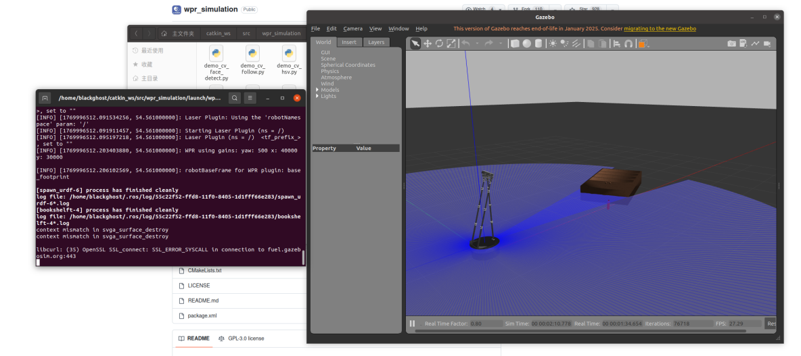

- 这就是我们后面会经常用到的**仿真环境Gazebo**；

- 再次打开上一节课的**rqt_robot_steering**，删除前面的turtle1，就可以用这个工具控制机器人的运动了；

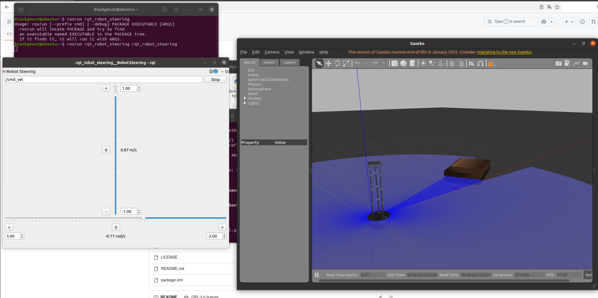

 

## 7 将环境参数初始化指令添加到终端初始化脚本中

- 我们当然希望每次启动终端，它就会自动的帮我们初始化环境参数；
- 我们只需要**把source指令加入到~/.bashrc文件**即可；
- 终端中输入：

```bash
gedit ~/.bashrc
```

- 在弹出的文本编辑器中，划到末尾，加上：

```bash
source ~/catkin_ws/devel/setup.bash
```

- 这样，每次启动终端它就会自动帮我们初始化；

 

## 8 修改ROS软件包的源代码

以之前的小乌龟为例，讲解如何**从index.ros到GitHub再自己修改源代码并编译**。

### 8.1 下载源码

- 打开index.ros，并搜索turtlesim；

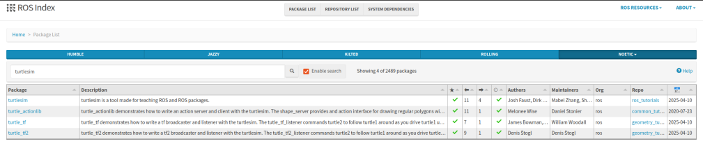

- 点击第一个，然后点击它的GitHub链接；

| 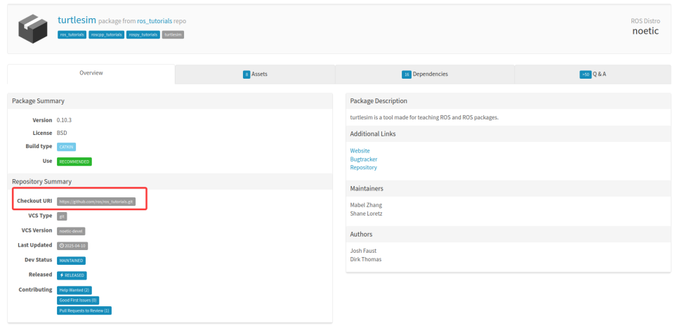 | 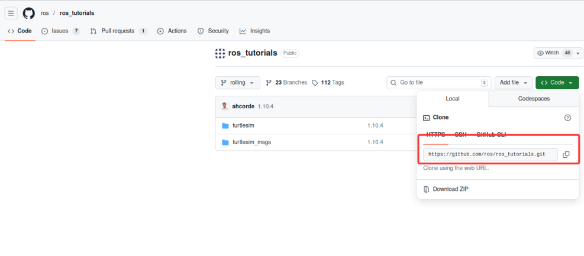 |
| ------------------------------------------------------------ | ------------------------------------------------------------ |

- 进入Github，点击Code，复制链接；

- 打开终端，切换到src目录下，安装源码；

| 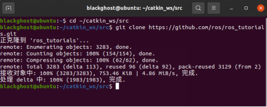 | 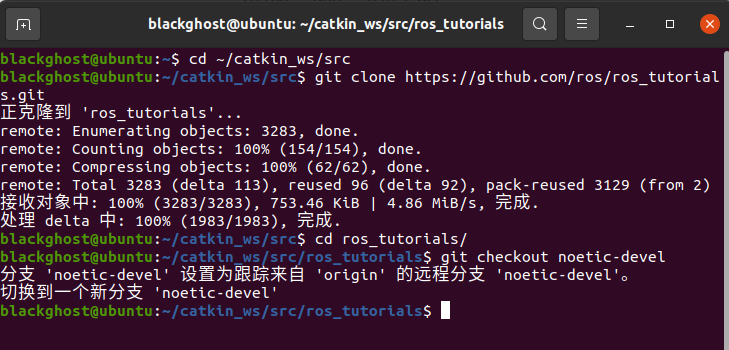 |
| ------------------------------------------------------------ | ------------------------------------------------------------ |

### 8.2 切换版本并编译

- **切换版本**：由于下载默认是ROS2的版本，需要将它切换为ROS1版本，否则会编译报错，依次进行如下操作

```bash
cd ros_tutorials
git checkout noetic-devel
```

- **编译**：切换版本后我们可以进行编译，同样的执行下面代码

```bash
cd ~/catkin_ws
catkin_make
```

- **运行**

```bash
roscore

# 打开新终端
rosrun turtlesim turtlesim_node
```

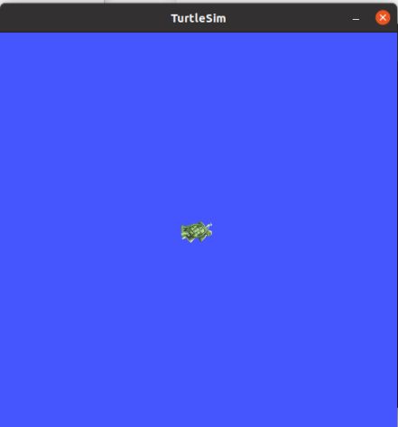

### 8.3 修改源码

- 打开**"~/catkin_ws/src/ros_tutorials/turtlesim/src/tutrle_frame.cpp"**文件；
- 修改如下几个地方：改变框的大小和名字还有背景颜色，再次编译并运行；
- 可以看到它的框的大小、名字还有背景颜色都变了；
- **这就是ROS中修改源代码整个流程和逻辑；**

| 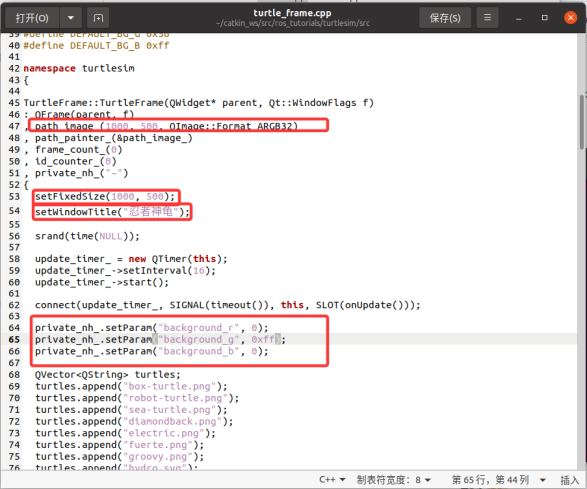 | 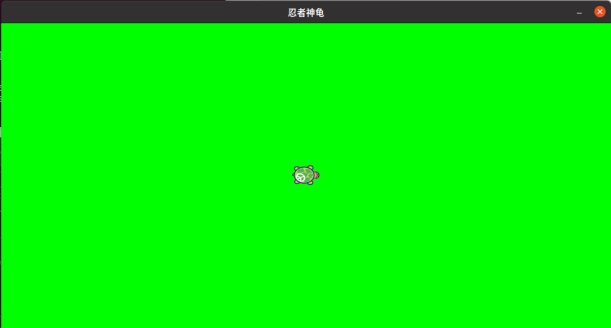 |
| ------------------------------------------------------------ | ------------------------------------------------------------ |


## 9 总结

- 这节课讲了**如何从Github中下载源码并进行编译然后运行**；
- 并展示了**如何修改源码增加自己想要的功能**；
- 这就是真正实现工程时的开发逻辑和流程；

---


# 第八节课：代码神器Visual Studio Code

## 1.VsCode的安装

- **下载安装包**

  - 浏览器搜索VsCode，网页中选择**Ubuntu**，它将自动下载文件至**“下载”文件夹**；

  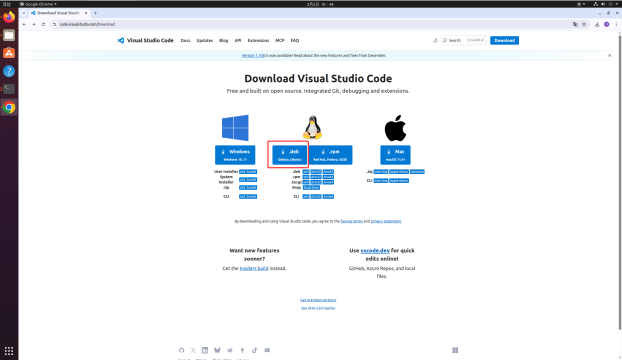

- **安装VsCode**

  - 在“下载”文件夹下，右键选择在终端打开，然后在终端中输入并执行如下指令：

  ```bash
  sudo dpkg -i code_1.108.2-1769004815_amd64.deb
  ```

  - 安装完成后，我们输入指令：**code**，它将运行VsCode，我们可以将其添加到收藏夹；

  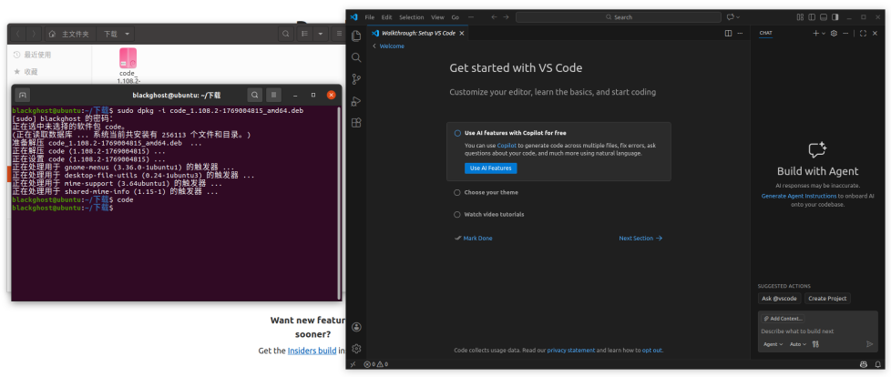

 

## 2.导入工作空间

- 点击File，然后选择“Add Folder to Workspace”；
- 选择之前创建的**catkin_ws文件夹下的src目录**，即可完成工作空间的导入；

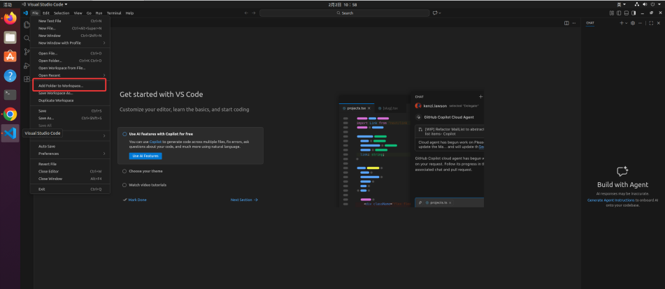

 

## 3.插件安装

### 3.1 安装简体中文包

- **安装：**
  - 插件广场——Chinese——安装——重启；

- **作用：**
  - 该插件可以把VsCode的界面变成中文；

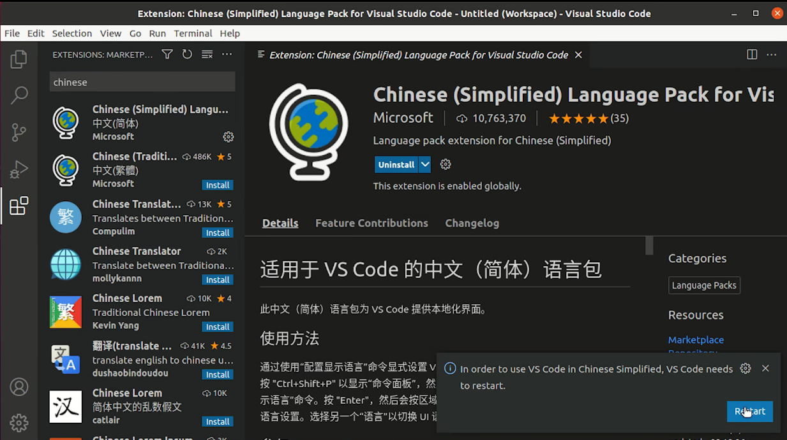

### 3.2 安装ROS插件

- **安装：**
  - 插件广场——ROS——选择**Robot Development Extension for ROS1**——安装；

- **作用：**
  - 这个插件会对**VsCode的设置功能进行一些扩充**，添加一些**ROS的专用菜单项**；
  - 且**代码提示和拼写检查都会加入ROS的编程接口**，非常方便；
  - 且它会**自动安装C/C++以及Python相关的插件**，省得我们再手动安装；

### 3.3 安装CMake插件

- **安装：**
  - 插件广场——CMake——CMake Tools——安装；

- **更新：**
  - 由于插件更新，安装前面的ROS插件时它就自动帮我们安装好CMake Tools了；
  - 但是没有帮我们安装CMake，我们这里可以去安装CMake（当然也可以不装）；
  - 安装CMake Tools后，工作空间下的CMakeLists.txt文件就有颜色区分了；

### 3.4 安装括号颜色插件

- **安装：**
  - 插件广场——bracket——选择Bracket Pair Colorizer 2——安装；

- **更新：**
  - 但是现在的VsCode已经内置这个功能了。

 

## 4.快捷键设置

### 4.1 设置编译快捷键Ctrl＋Shift＋B

- **编译项目：**
  
  - 按下：**Ctrl＋Shift＋B**，选择**catkin_make:Build**，它将帮我们编译整个文件夹；
  
  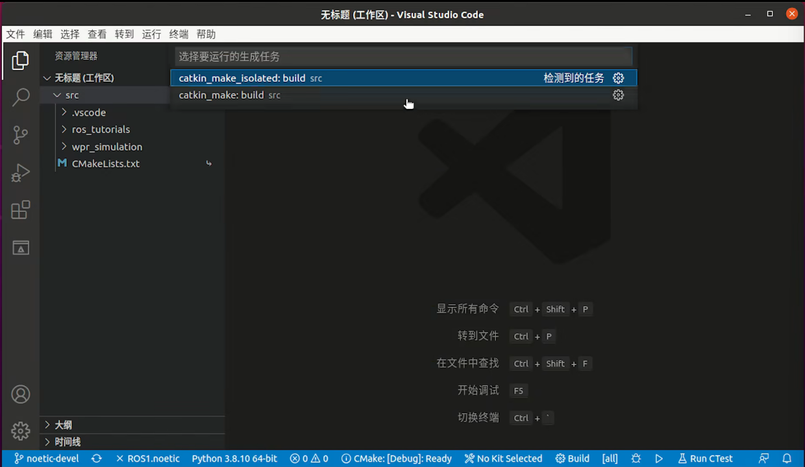

- **将快捷键设置成默认的编译项：**
  - 接着我们再次按下Ctrl＋Shift＋B，然后点击小齿轮；
  - 它将在**.vscode**目录下生成**tasks.json**文件，在该文件中，我们在**group字段**增加内容：

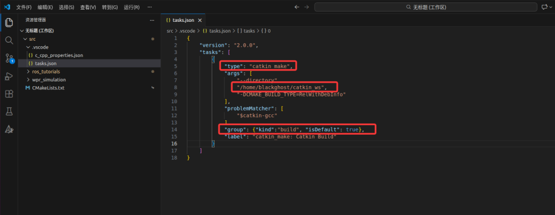

-  第一个框的**type**表示我们这个快捷键执行的命令，与我们在终端输入的：**catkin_make**是一样的；
- 第二个框的内容表示**在哪个目录下进行操作**，即**catkin_ws**，与终端保持一致；
- 在group字段中，**增加isDefault字段，表示我们的这个快捷键默认为这个操作**；
- 这样下次我们再次按下快捷键它直接会进行编译，不需要再进行选择；

### 4.2 设置拼写错误检查

在文件中，有些函数或头文件找不到时，VsCode会在下方添加红色波浪线，这里我们有两个方法解决：

- **重新加载**

  - 项目的头文件路径写在了**.vscode/c_cpp_properties.json**这个文件下；
  - 删除这个文件，关闭VsCode，重新打开，ROS插件会自动生成文件并找到头文件路径添加进去；
  - 但是有时候一些角落的文件也不一定能找到；

  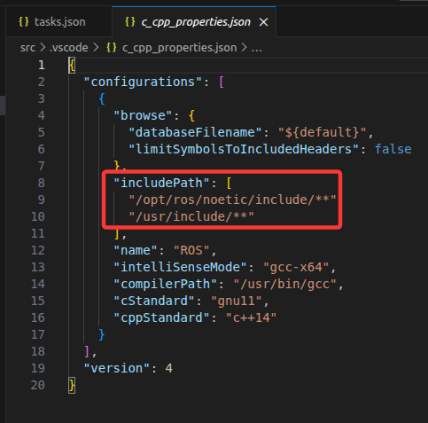

- **修改设置**

  - 既然上一个方法无法解决，可以直接关闭错误提示；
  - 按下**Ctrl＋Shift＋P**快捷键，在弹出栏中输入：**error squiggles**，然后选择禁用选项；

  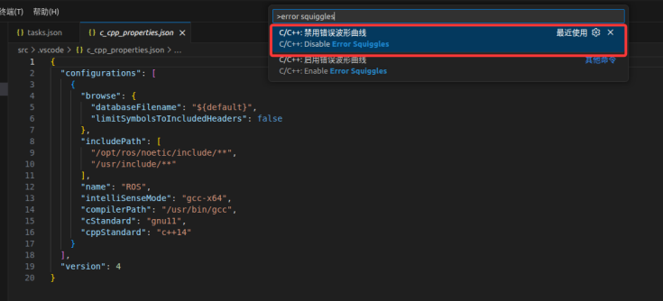

  - 这时候会生成**.vscode/settings.json**文件，内容如下；
  - 可见设置为了**disabled**，如果想启用，改为**enabled**即可；
  - 一般而言，不建议关闭；

  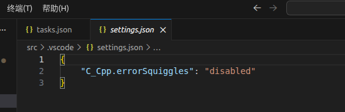

---


# 第九节课：超级终端Terminator

## 1.目的

- Ubuntu自带了一个终端，**一般的软件下载和程序编译够用了**；
- 但是在**运行ROS程序**时，一般都需要**同时运行多个窗口**，这是有点不方便的；

 

## 2.超级终端Terminator下载安装

- **安装terminator**

  - 在命令行中运行：

  ```bash
  sudo apt install terminator
  ```

- **启动Terminator**
  - 同时按下快捷键：**Ctrl＋Alt＋T**，即可打开Terminator；

- **Terminator的使用**
  - Terminator可在同一个窗口上割开多个小窗口；
  - 我们要终止某个程序时直接在对应的窗口左键再**Ctrl＋C**既可以暂停了；
  
  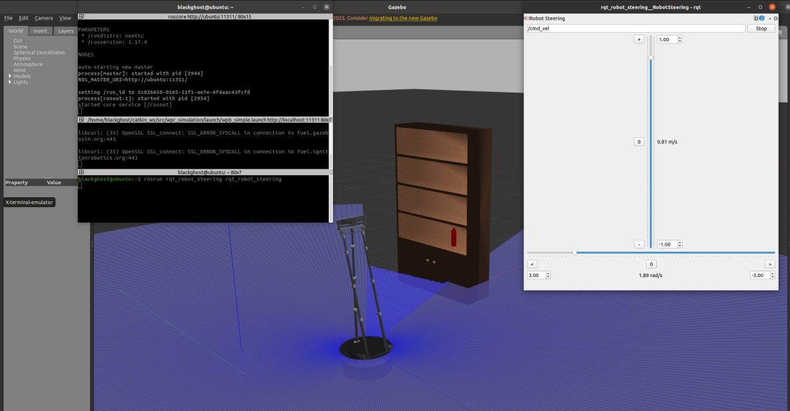

 

## 3.Terminator的快捷键

- **Ctrl＋Shift＋E：水平分割窗口；**

- **Ctrl＋Shift＋O：垂直分割窗口；**

- **Alt＋上下左右键：切换当前窗口；**

- **Ctrl＋Shift＋W：取消分屏；**


## 4.Ctrl＋Shift＋E快捷键无效的问题

在Terminator中敲下快捷键Ctrl＋Shift＋E时可能无法分屏，而是出现了一个e＋下划线的符号，且其他快捷键也无效了，这是因为和Ubuntu系统的输入法快捷键冲突了。解决办法如下：

- 终端中输入：**ibus-setup**；
- 其中IBUS是**常见的Linux的输入法框架**；

- 在弹出窗口中选择**表情符号页**，把这个快捷键删除即可；

---


# 第十节课：Node节点和Package包

## 1.安卓系统的App

- 安卓系统的组成：一个个App；
- 打电话、发短信、玩游戏都是一个App；
- 使用安卓系统的过程实际上就是使用App的过程；

 

## 2.ROS系统的Node节点

ROS系统由一个个Node节点组成，Node节点的特征如下：

- 每个Node具有不同的功能；

- 在使用ROS时，可能**调用一个Node节点或多个Node节点**；

- 每个Node节点的**代码结构相同**，规定了先干嘛、再干嘛、最后干嘛，否则就可能和ROS的核心有冲突；

- 单个Node节点的功能一般不会太复杂，机器人的复杂动作由一系列Node节点组合得到；

 

## 3.ROS系统的Package包

- **Package包：**

  - ROS系统中无法单独下个某个Node节点，而是需要完整的下载一个软件包Package；
  - Package是Node的集合，调用Node节点时即调用某个Package中的Node节点；
  - 前面下载的三个工具都是Package；

  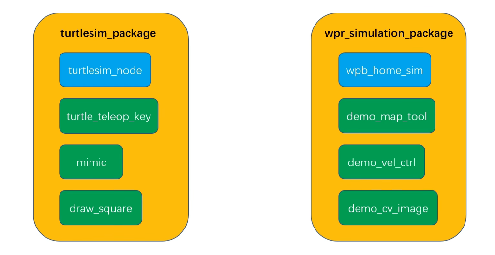

- **ROS的编译工具**
  - ROS使用**CMake**和**catkin**作为编译工具，可以引入包的概念；
  - 可以把散乱的Node节点组织起来得到一个个Package包，省去了一个个Node节点下载的繁琐操作；

---


# 第十一节课：年轻人的第一个Node节点

## 0.课程内容

- 本节课的内容：**创建一个处于ssr_pkg包下的超声波_Node节点。**

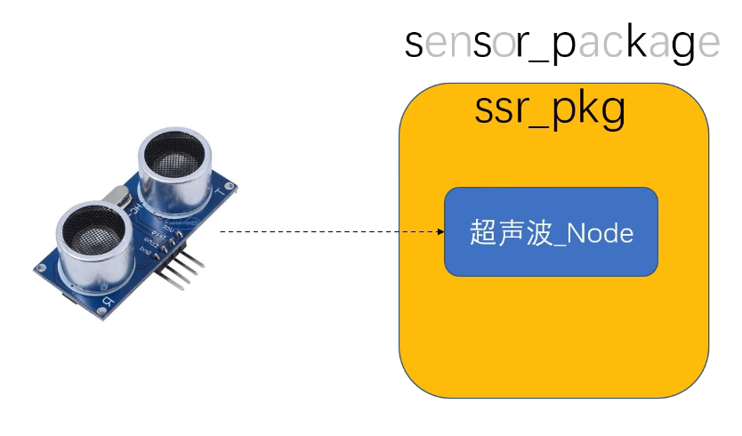


## 1.工作空间设置

- **CMake Tools插件**在每次启动VsCode时候会编译整个工作空间，可以通过设置关闭掉它；
- 左下角点击**设置**搜索**cmake:config**，在得到的结果中关闭如下两个选项即可；
- 然后再把工作空间的build文件夹删除即可，这样下次启动就不会自动编译了；

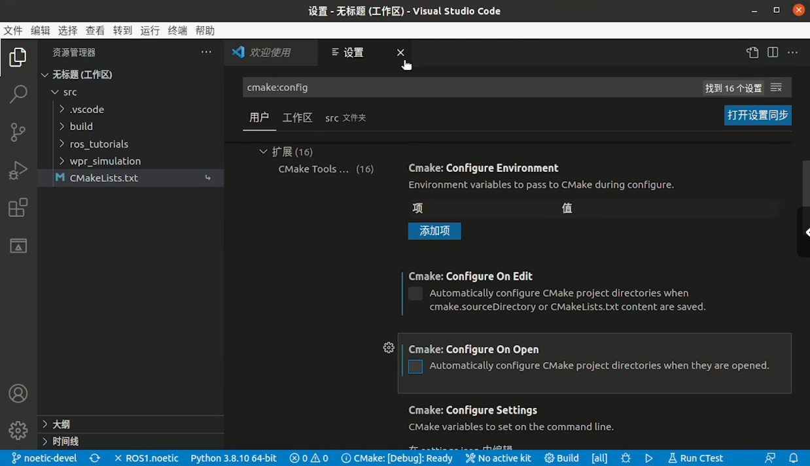

 

## 2.创建Package包

### 2.1 创建Package包

- **切换到工作空间的src目录：**

  ```bash
  cd catkin_ws/src/
  ```

- **创建包：Teminator中执行下面指令**

  ```bash
  catkin_create_pkg ssr_pkg rospy roscpp std_msgs
  ```

  - catkin工具创建Package包的命令为：**catkin_create_pkg <包名> <依赖项列表>**
    - **catkin_create_pkg**是创建包的指令；
    - **<包名>**就是你要创建的包的名称；
    - 其中**<依赖项列表>**就是一个装满了通用节点的Package包；

- 执行完后就可以看到它在目录下创建了**两个文件、两个文件夹**；

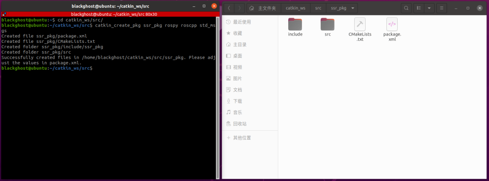

### 2.2 查看文件内容

可以用VsCode来打开上述创建的文件：

- **CMakeLists.txt编译设置文件**
  - 第一行为编译器最低版本要求；
  - 第二行为包的名字；
  - **后面的为寻找依赖包，即前面创建时的依赖项列表**；
  - 除此之外还有注释，**双#号的是对指令的解释，单#的是对应指令的示例**；
  - **实际的编译过程：**
    - 编写CMakeLists.txt；
    - catkin_make调用CMake；
    - CMake读取CMakeLists.txt；
    - CMake生成Makefile；
    - make/g++使用Makefile进行实际编译；

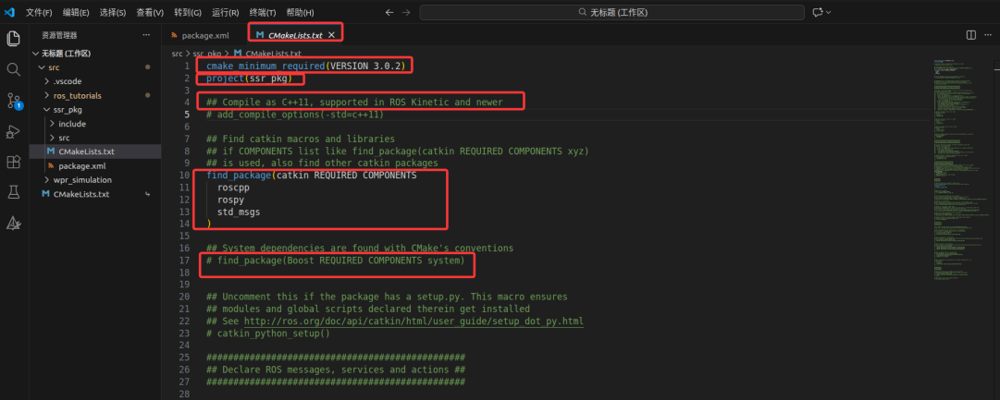

- **package.xml文件**
  - 该文件包括包的名字、版本号、包的描述、包的作者、包的开源协议以及一些依赖库引用，可以认为这个是包的描述文件；
  - package.xml是catkin软件包的必备文件，当看到一个文件夹中有这个文件时很可能这个文件夹就是一个package；

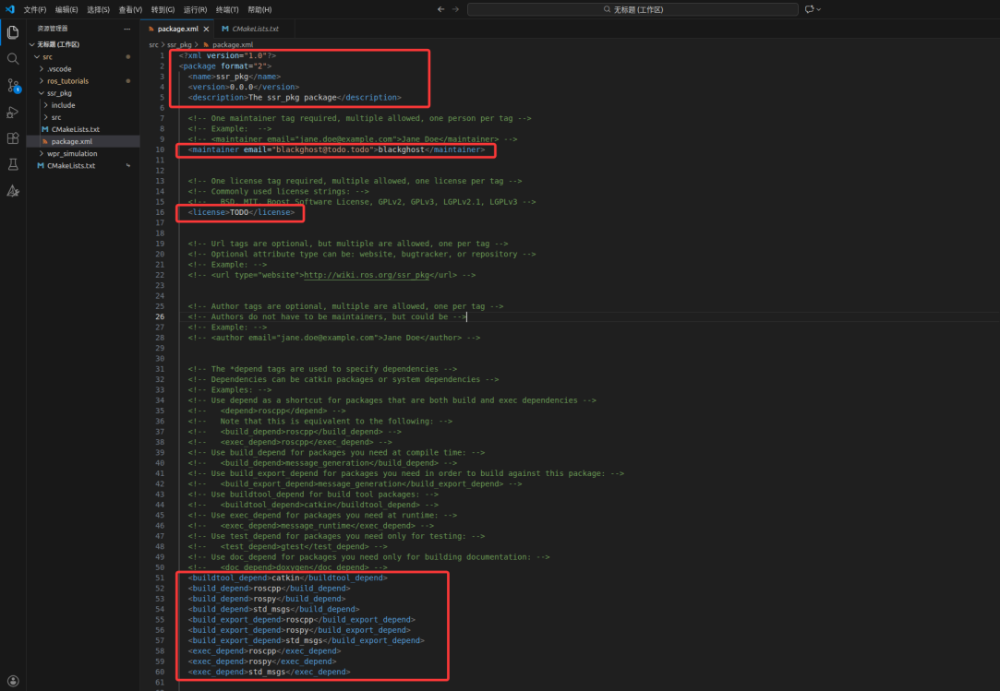

 

## 3.回访依赖项

接下来回头看一下那三个依赖项的位置都在哪里。

### 3.1 查找之前的依赖项

- 查找软件包的地址：**roscd <软件包名字>**，这样终端会自动跳转到包的位置；

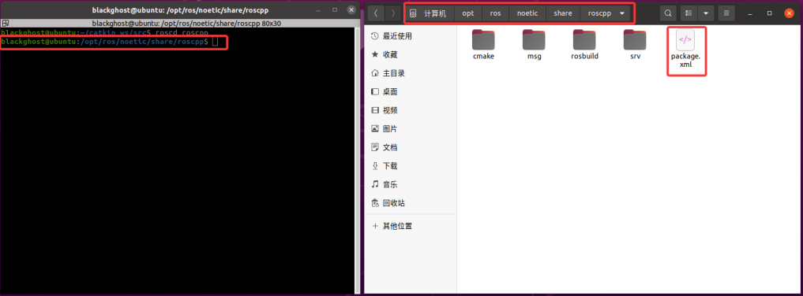

- 在该目录下也有package.xml文件，用VsCode打开这个文件，发现它与先前创建的包的package.xml文件内容差不多，所以这个文件夹是一个软件包文件夹；

### 3.2 软件包的两个位置

- **/opt/ros/noetic/share/文件夹**
  - 这个文件夹中存放着很多的软件包，它的来源有两种：
    - **“sudo apt-get install ros-<ROS版本>-desktop-full”**下载的基础包；
    - **“sudo apt-get install ros-<ROS版本>-xxx”**下载的独立扩展包；

- **catkin_ws文件夹**
  - 这个文件夹下也存放着包，它主要是我们**通过Github下载的源码和我们自己手动创建的源码**；
  - 它和前者最大的区别就是这个文件夹下的文件需要编译后才能执行，而前者是已经编译完的可执行文件；

### 3.3 .bashrc文件的添加内容回顾

- 在先前的.bashrc文件中添加的两行，就是对应了我们上面的两个位置；
- **在创建软件包时指定的依赖项要在这两个文件夹存在才行，否则编译报错**；

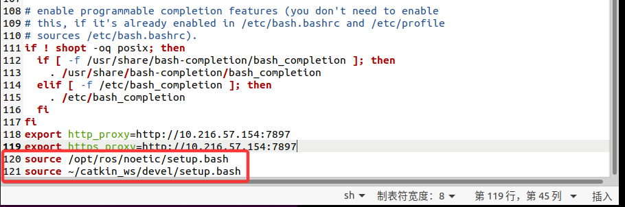


## 4.创建Node节点

- **添加节点的源代码**

  - 在软件包的文件夹的**src文件夹**下新建文件，起名**chao_node.cpp**，这是一个超声波传感器节点，然后在文件中添加源码；

  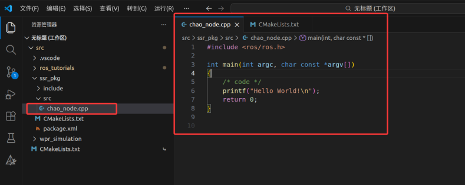

- **添加编译规则（重要）**

  - 打开CMakeLists.txt文件，找到**“build”**章节，再找到**add_executable()**函数，这相当于是一条示例代码；

  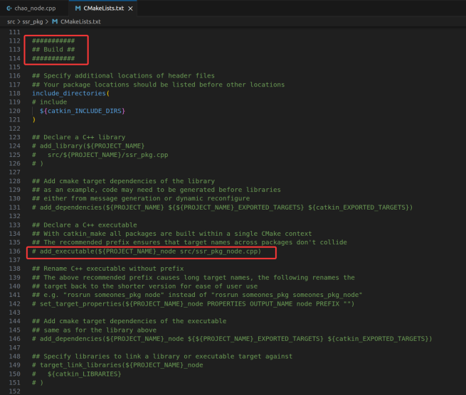

  - 将它复制到最后，**第一个参数是设置这个可执行文件的名字，最好保持与包名字相同**；
  - 第二个参数是**指定从那个源文件编译，指定刚才写的源代码即可**；

  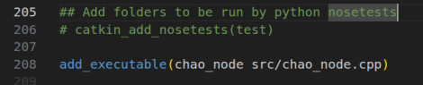

  - 然后**“Ctrl＋Shift＋B”**编译；

- **运行Node节点**
  - 编译完成后可在终端执行ROS节点，在终端可以看到已经成功打印出了**“Hello World!”**这句话；
  - 如果这里提示无法找到包，就需要先把工作空间的环境参数导入到终端，即指令：**source ~/catkin_ws/devel/setup.bash**；
  - 若之前已经添加到.bashrc文件中的话这里应该能正常运行；

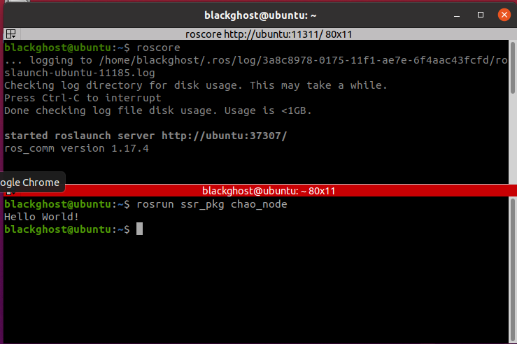

- **总结**：Node节点的本质就是C/C++的程序，节点的运行本质就是执行一个C/C++文件；


## 5.Node节点的完善

**前面写的源代码还无法与ROS产生互动，因为它并没有任何与ROS框架相关的东西**。下面按照ROS的框架添加代码。

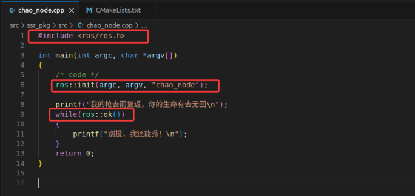

- 如上图所示添加代码：
  - 添加ros的头文件：#include <ros/ros.h>；
  - 在main()函数的开头**初始化ros：ros::init()**；
    - **注意里面的第二个参数不能是const变量，需要把main()函数传入的第二个const变量的const去掉**；
  - 增加循环，不让它马上退出：
    - 添加while()循环；
    - **但是while()循环中的添加需要用ros::ok()，不然的话终端不会响应任何外部事件**；

- **添加编译条件**

  - 添加代码后引入了头文件，需要在编译文件中添加头文件的信息；
  - 打开CMakeLists.txt文件，同样在“Build”章节找到**target_link_libraries()**函数，复制到最后并指定编译信息：

  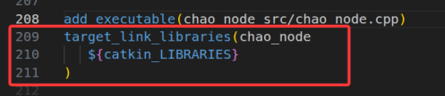

- **编译并运行节点**

  - 按下快捷键进行编译，然后打开超级终端，先启动ROS的核心，然后运行节点：**rosrun ssr_pkg chao_node**；
  - 可以看到它成功运行，且按下Ctrl＋C后成功停止运行；

  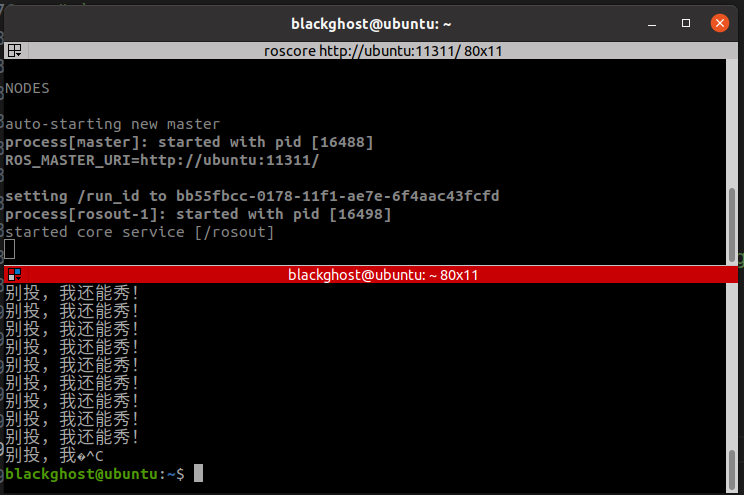


## 6.总结——ROS开发框架

- 在今后的所有的ROS包或节点的开发中都是按照这个框架进行的；

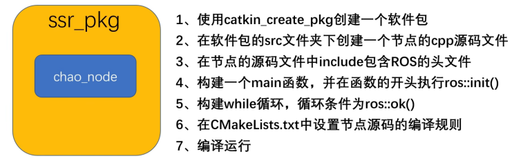

---


# 第十二节课：Topic话题和Message消息

## 1.Topic话题的定义及其特点

### 1.1 一个发布者的情况

- 话题Topic是节点间进行**持续通讯**的一种形式；
- 话题通讯的两个节点通过**话题的名称**建立起话题通讯连接；
- 话题中通讯的数据，叫做**消息Message**；
- 消息Message通常会按照一定的频率持续不断的发送，以保证消息数据的实时性；
- 消息的发送方叫做话题的**发布者Publisher**；
- 消息的接收方叫做话题的**订阅者Subscriber**；

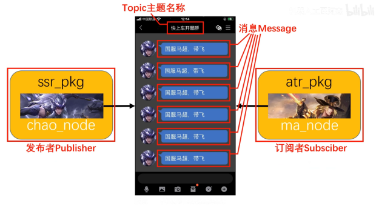

### 1.2 多个发布者的情况

- 多个发布者的情况可以分两种：

  - 不同发布者只管理自己的话题：

  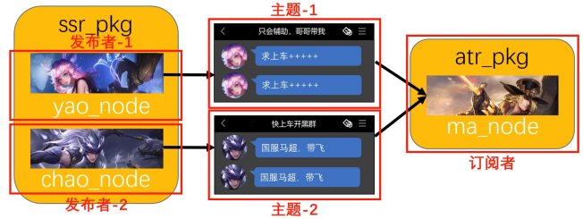

  - 不同发布者处在同一个话题：

  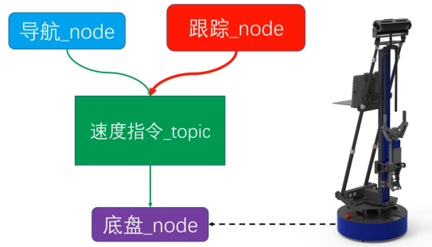

- 多个发布者时的Topic的特点：
  - 一个ROS节点网络中，可以同时存在多个话题；
  - 一个话题可以有多个发布者，也可以有多个订阅者；
  - 一个节点可以对多个话题进行订阅，也可以发布多个话题；
  - 不同的传感器消息通常会拥有各自独立话题名称，每个话题只有一个发布者；
  - 机器人速度指令话题通常有多个发布者，但同一时间只能有一个发言人；


## 2.Message消息的定义及其特点

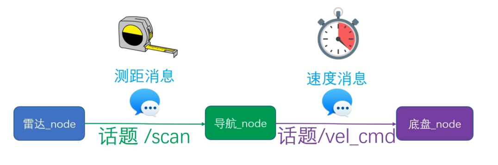

- **消息的类型：**
  - 如上图所示，为满足不同传输的要求，消息会存在很多种类型，在生成消息包时需要指定消息的类型；

- **类型的来源：**
  - 上一节课创建的软件包中，有一个依赖项：**std_msgs**，这个软件包中就包含了很多的消息类型；

- **std_msgs消息类型：**

  - 打开index网站，搜索**std_msgs**，然后点击Msg API，就可以看到这个软件包中存在的消息类型；
  - 点击某些类型可以看到，它们内部存在一些嵌套关系，其实消息类型本质上就类似于C的结构体；
  - 若软件包中不存在想要的消息类型，后续可以通过自组装定义我们自己想要的消息类型；

  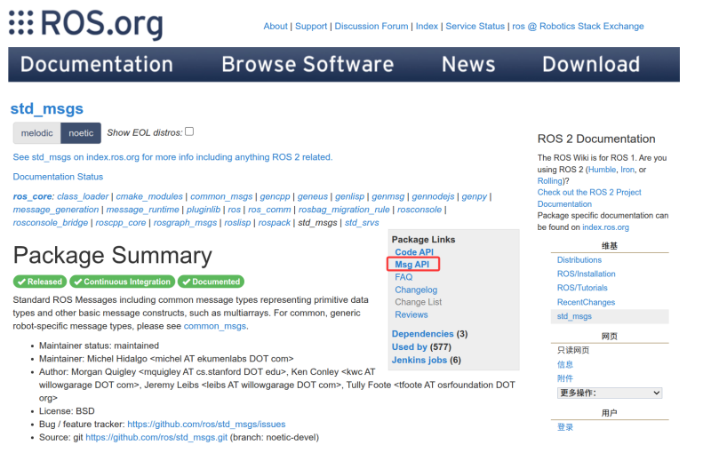

---


# 第十三节课：Publisher发布者的C++实现

## 1.整体项目框架

- 在这一节课中，将完成下图中的两个发布者：


## 2.chao_node的话题发布

- **首先需要引入头文件：**

  ```C++
  #include <std_msgs/String.h>
  ```

- **初始化ROS核心：**

  ```c++
  ros:init(argc, argv, "chao_node")
  ```

- **创建管理节点的管家：**

  ```c++
  ros:NodeHandle nh
  ```

- **创建发布的话题：**

  ```c++
  ros::Publisher pub = nh.advertise<std_msgs::String>("kuai_shang_che_kai_hei_qun", 10)
  ```

  - 第一个参数是话题名称，不能是中文；
  - 第二个是缓冲区的大小；

- **创建一个ROS时间控制对象：**

  ```c++
  ros::Rate loop_rate(10)
  ```

- **在while循环中：**

  - **创建消息：**

    ```c++
    std_msgs::String msg	// 在while循环内部再创建变量虽然可能内存消耗大一点，但每次循环后都会回收内存，问题不大
    ```

  - **给消息赋值：**

    ```c++
    msg.data = "国服马超，带飞"
    ```

  - **往话题中发布消息：**

    ```c++
    pub.publish(msg)
    ```

  - **延时阻塞：**

    ```c++
    loop_rate.sleep()
    ```

```c++
#include <ros/ros.h>
#include <std_msgs/String.h>

int main(int argc, char *argv[])
{
    /* code */
    ros::init(argc, argv, "chao_node");         // 初始化ROS核心
    printf("我的枪去而复返，你的生命有去无回\n");

    ros::NodeHandle nh;			// 创建一个ros中的NodeHandle类，这个类的节点的管家
    ros::Publisher pub = nh.advertise<std_msgs::String>("kuai_shang_che_kai_hei_qun", 10);  // 创建一个发布话题

    ros::Rate loop_rate(10);    // ros的时间控制对象

    while(ros::ok())
    {
        printf("我要开始刷屏了！\n");
        std_msgs::String msg;           // 定义一个String类型的消息
        msg.data = "国服马超，带飞";      // 赋值给消息
        pub.publish(msg);               // 发布消息
        loop_rate.sleep();              // 延时阻塞
    }
    return 0;
}

```


## 3.ROS中的话题工具：rostopic

- ```c++
  // 列出当前系统中所有活跃着的话题
  rostopic list
  ```

- ```c++
  // 显示指定话题中发送的消息包内容
  rostopic echo 主题名称
  
  // 如果由于中文，Unicode字符显示乱码，可用如下指令转义
  echo -e <上一句指令的输出>
  ```

- ```c++
  // 统计指定话题中消息包发送频率
  rostopic hz 主题名称
  ```


## 4.消息发送的步骤总结

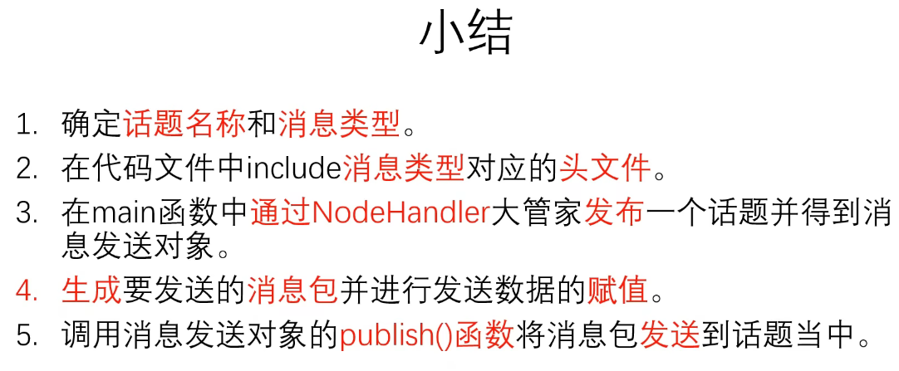


## 5.yao_node的话题发布

- 复制原来的chao_node.cpp文件，改名为yao_node.cpp；
- **修改内容如下：**

```c++
#include <ros/ros.h>
#include <std_msgs/String.h>

int main(int argc, char *argv[])
{
    /* code */
    ros::init(argc, argv, "yao_node");         // 注册节点
    printf("过去生于未来!\n");

    ros::NodeHandle nh;     // 创建一个ros中的NodeHandle类，这个类的节点的管家
    ros::Publisher pub = nh.advertise<std_msgs::String>("gie_gie_dai_wo", 10);  // 创建一个发布话题

    ros::Rate loop_rate(10);    // ros的时间控制对象

    while(ros::ok())
    {
        printf("我要开始刷屏了！\n");
        std_msgs::String msg;           // 定义一个String类型的消息
        msg.data = "求上车++++";		  // 赋值给消息
        pub.publish(msg);               // 发布消息
        loop_rate.sleep();              // 延时阻塞
    }
    return 0;
}

```

- **修改编译配置文件：**

```c++
add_executable(chao_node src/chao_node.cpp)
target_link_libraries(chao_node
   ${catkin_LIBRARIES}
)

add_executable(yao_node src/yao_node.cpp)
target_link_libraries(yao_node
   ${catkin_LIBRARIES}
)
```

- **编译后在终端执行：**

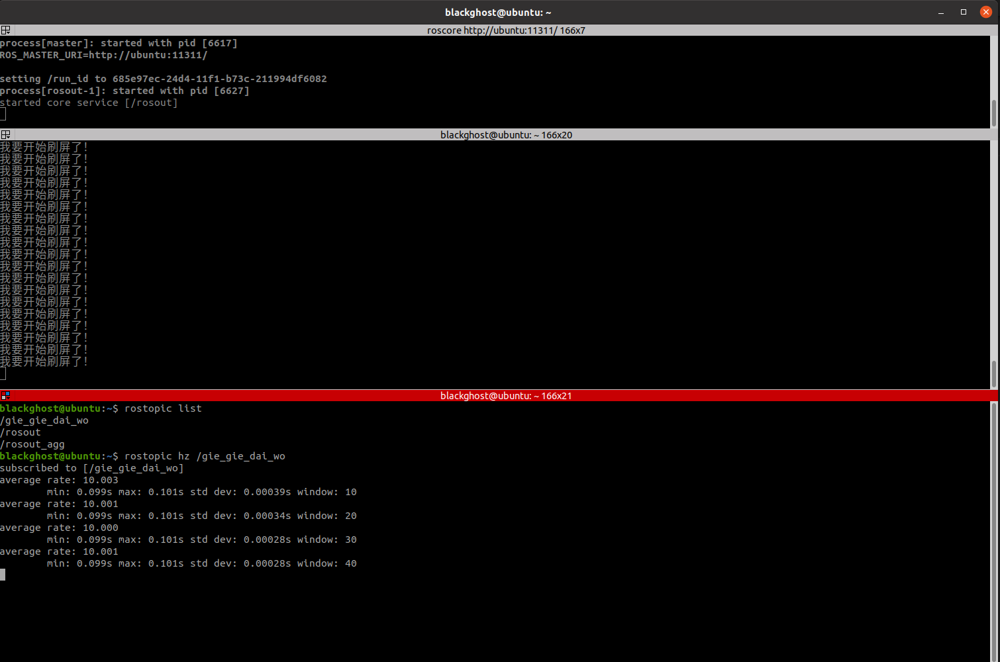

---


# 第十四节课：Subscriber订阅者的C++实现

## 1.整体项目框架

- 在这一节课中，将实现**右边的订阅者**；


## 2.创建订阅者节点

### 2.1 创建atr_pkg包

- 在终端中输入如下命令创建软件包：

```bash
catkin_create_pkg atr_pkg rospy roscpp std_msgs
```

- **注意一定要在catkin_ws/src目录创建才行，下图的目录是错误的**；

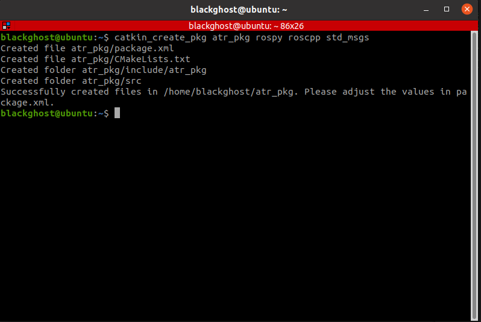

### 2.2 创建ma_node节点

- 在VsCode中打开atr_pkg，然后在其src目录下新建ma_node.cpp文件；
- 在**ma_node.cpp**文件中添加如下内容：
  - 引入头文件；
  - 注册节点；
  - 新建管家，并用管家新建订阅；
  - **定义订阅者的回调函数；**
  - 在while()循环中加入**回看消息包的函数**；

```c++
#include <ros/ros.h>
#include <std_msgs/String.h>

void chao_callback(std_msgs::String msg)	// 订阅者的回调函数
{
    printf(msg.data.c_str());	// 打印消息内容
    printf("\n");
}

int main(int argc, char *argv[])
{
    ros::init(argc, argv, "ma_node");	// 注册节点

    ros::NodeHandle nh;		// 新建管家
    ros::Subscriber sub = nh.subscribe("kuai_shang_che_kai_hei_qun", 10, chao_callback);	// 新建订阅，注意这里还需要传入回调函数名

    while(ros::ok())
    {
        ros::spinOnce();	// 必须加，其作用是转过头看一下有没有新的消息包
    }

    return 0;
}

```

### 2.3 添加编译条件

- 在CMakeList.txt文件中的最后添加如下内容：

```c++
add_executable(ma_node src/ma_node.cpp)
target_link_libraries(ma_node
  ${catkin_LIBRARIES}
)
```

- **Ctrl+Shift+B**编译；


## 3.运行效果

- 在终端中运行ROS核心

```bash
roscore
```

- 在终端中启动chao_node节点

```bash
rosrun ssr_pkg chao_node
```

- 在终端中启动ma_node节点

```bash
rosrun atr_pkg ma_node
```

- 最后的运行效果如图所示：

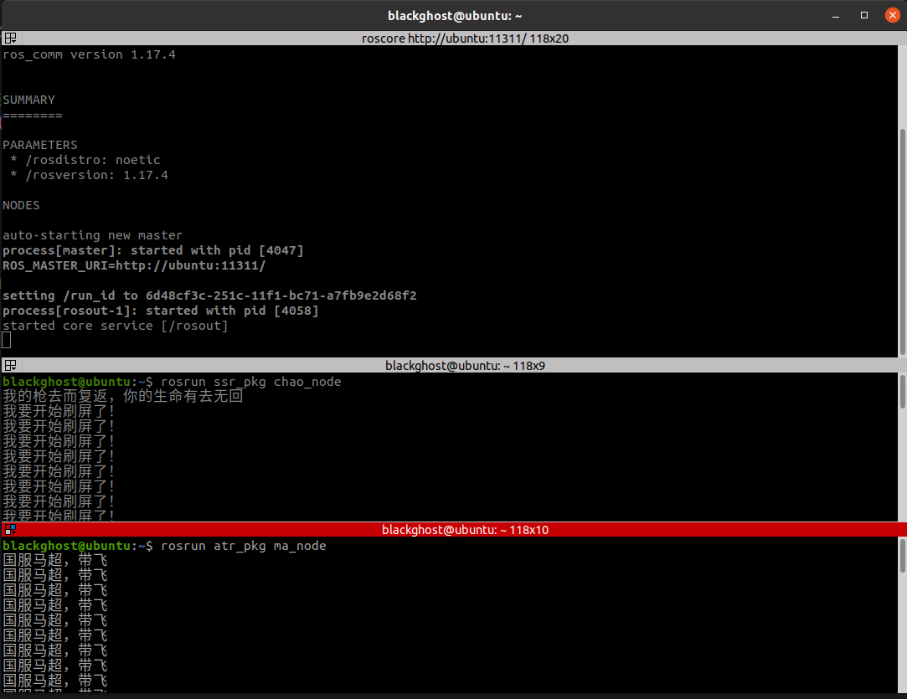


## 4.调整和优化

- 在上面的运行效果中，每一条的打印消息都是一样的；
- 可以使用带有显示时间的函数进行打印；
- 改造：
  - **将ma_node.cpp文件中的printf()函数改为ROS_INFO()函数**：
  - **除此之外，还要在main函数内部添加setlocale(LC_ALL, "")函数，因为ROS_INFO()函数会受C++的locale环境影响，需要将其设置成中文环境**；

```c++
#include <ros/ros.h>
#include <std_msgs/String.h>

void chao_callback(std_msgs::String msg)
{
    ROS_INFO(msg.data.c_str());
}

int main(int argc, char *argv[])
{
    setlocale(LC_ALL, "");
    ros::init(argc, argv, "ma_node");

    ros::NodeHandle nh;
    ros::Subscriber sub = nh.subscribe("kuai_shang_che_kai_hei_qun", 10, chao_callback);

    while(ros::ok())
    {
        ros::spinOnce();
    }

    return 0;
}

```

- 再次编译并运行，得到如下运行效果，其中前面的数字是时间戳：

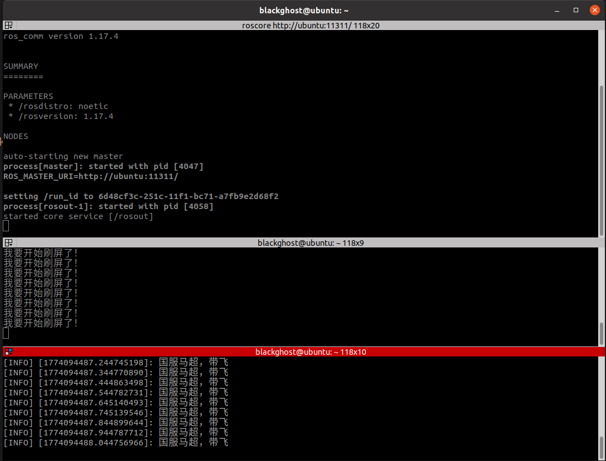


## 5.添加订阅瑶妹妹的消息

- 同样的，直接在原来的ma_node.cpp文件中添加内容：
  - 从管家中重新获取一个订阅，这个订阅对象的名称不能与前面的相同；
  - 定义回调函数，这里显示用ROS_WARN()，它会以黄色显示；

```c++
#include <ros/ros.h>
#include <std_msgs/String.h>

void chao_callback(std_msgs::String msg)
{
    ROS_INFO(msg.data.c_str());
}

void yao_callback(std_msgs::String msg)
{
    ROS_WARN(msg.data.c_str());
}

int main(int argc, char *argv[])
{
    setlocale(LC_ALL, "");
    ros::init(argc, argv, "ma_node");

    ros::NodeHandle nh;
    ros::Subscriber sub = nh.subscribe("kuai_shang_che_kai_hei_qun", 10, chao_callback);

    ros::Subscriber sub2 = nh.subscribe("gie_gie_dai_wo", 10, yao_callback);
    
    while(ros::ok())
    {
        ros::spinOnce();
    }

    return 0;
}

```

- 编译后重新运行，得到效果图如下：

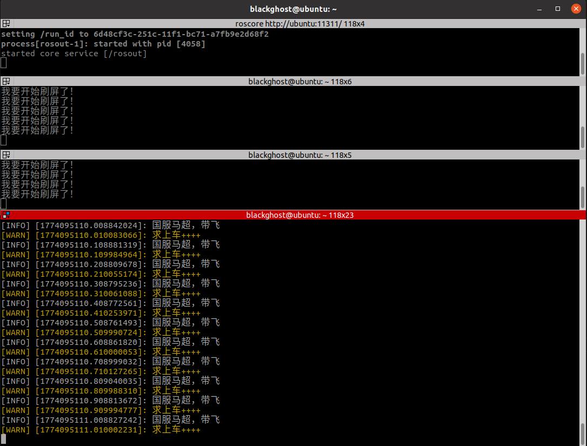


## 6.图形化显示话题通信的工具

- 在保持上面全部节点通信的同时，再开一个终端，执行指令：

```bash
rqt_graph
```

- 执行后得到效果图如图所示：
  - **椭圆形的是节点；**
  - **横线上的是话题；**
  - **横线代表数据的流向；**

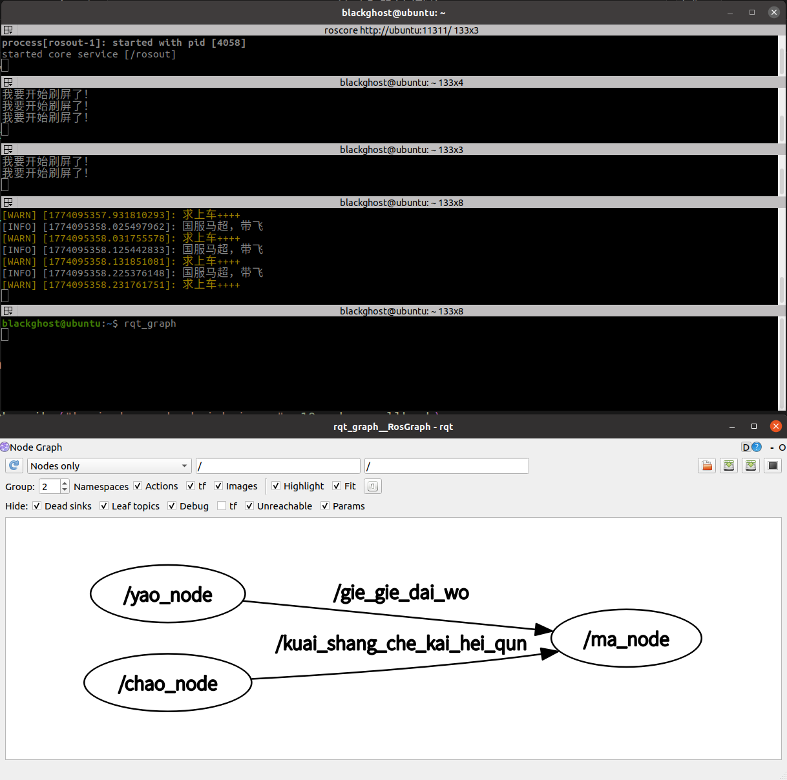


## 7.总结

### 7.1 话题是谁的话题

- 话题不单单只是发布者或订阅者的话题；
- 话题是ROS系统自己创建的，即使发布者没有在运行，如果有节点订阅了话题，这个话题就会自动被ROS系统创建；

### 7.2 小结

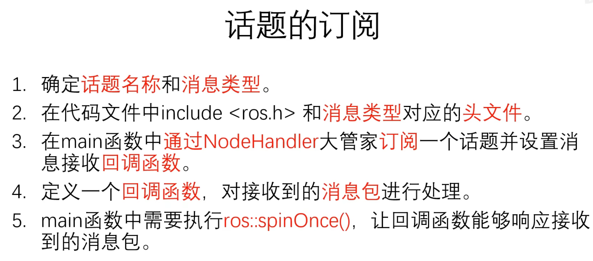

---


# 第十五节课：launch启动多个ROS节点

## 1.使用launch启动节点

### 1.1 launch文件的介绍

- launch文件是一种遵循**XML语法**的描述文件；
- **可以使用launch实现启动ROS的节点**；
- XML语法启动节点：**当内容为空时可以省略后面的</标记名称>，直接将/移到第一个<>中**

```xml
<标记名称 属性名1= "属性值1" ...>
    内容
</标记名称>
```

- **描述多层嵌套结构是XML语法的主要作用之一：**


- 可以用一个王者荣耀的例子来解释XML语法的使用：

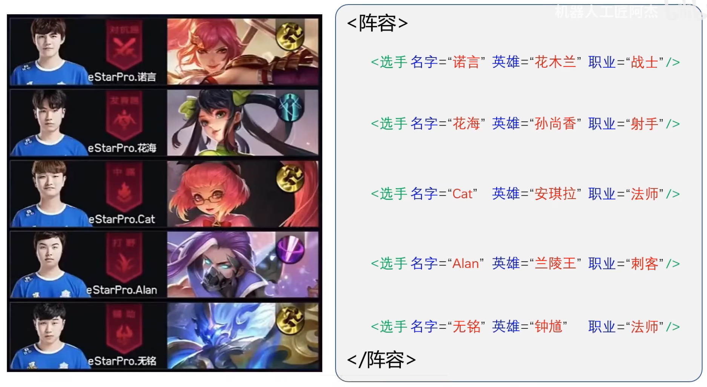

### 1.2 如何用launch描述一个ROS启动

- 以上一节课中的例子，可以用launch文件的XML语法描述如下：
- 注意：**这里不需要单独为roscore添加描述，因为launch文件的机制是只要有一个节点就会启动ROS核心**；
- 描述内容中的name用于解决**同名不同包**的问题；

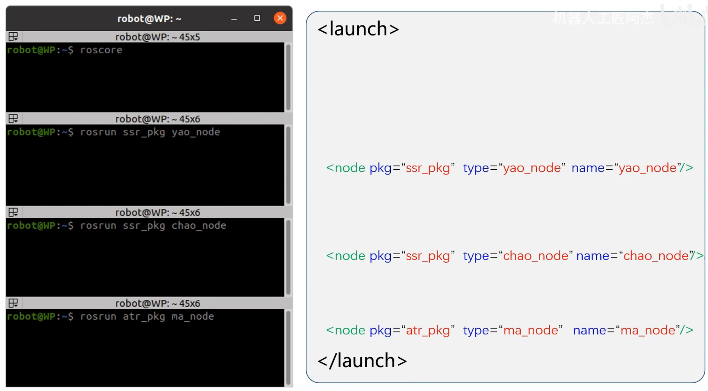


## 2.编写运行launch文件

- launch文件只需要放在某个软件包下即可，它会自动遍历整个文件夹；
- **我们在atr_pkg下创建launch文件夹用来存放launch文件，然后新建launch文件kai_hei.launch**，然后添加如下内容：
  - launch-prefix="gnome-terminel -e：可以指定该节点在另一个终端输出；
  - output="screen：可解决ROS_INFO不显示的问题，但对ROS_WARN不起作用，它会暴力的输出；

```xml
<launch>
    
    <node pkg="ssr_pkg" type="yao_node" name="yao_node"/>

    <node pkg="ssr_pkg" type="chao_node" name="chao_node" launch-prefix="gnome-terminel -e"/>

    <node pkg="atr_pkg" type="ma_node" name="ma_node" output="screen"/>

</launch>
```

- 然后在终端中输入下列指令即可同时运行之前的几个节点：

```bash
roslaunch atr_pkg kai_hei.launch
```

- 最终的效果如图所示：

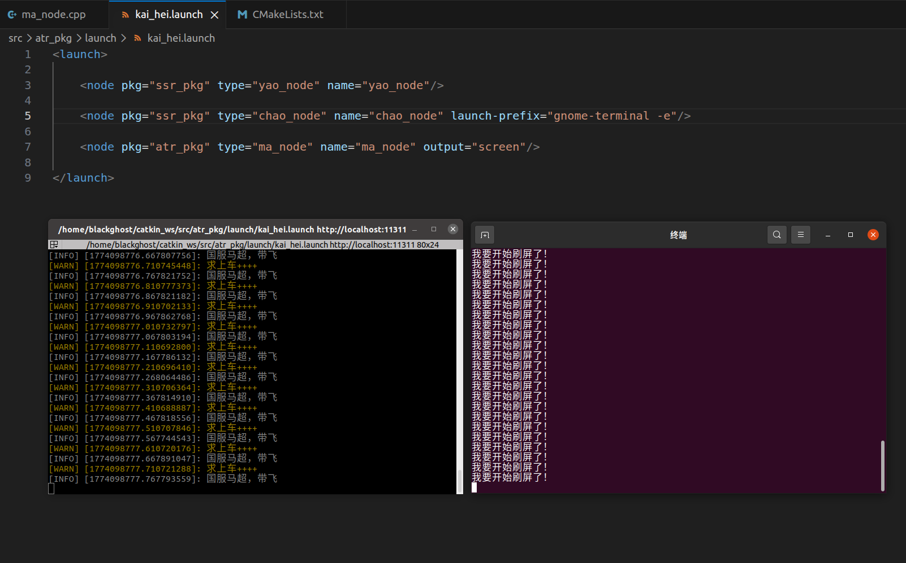


## 3.总结

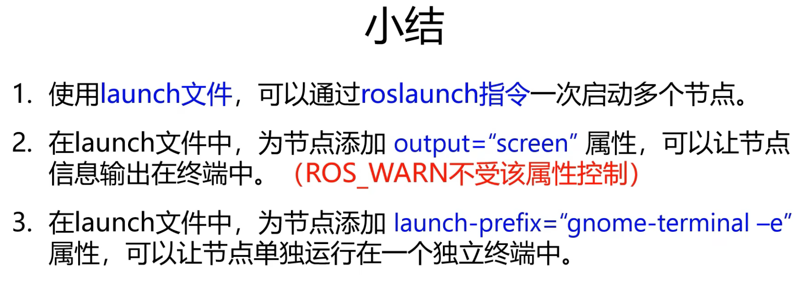

---


# 第十六节课：Publisher发布者的Python实现

## 1.整体项目框架

- 本节用Python语言实现两个发布者；


## 2.整体项目编程

### 2.1 创建软件包

- 在终端中切换到**~/catkin_ws/src**目录；
- 执行以下指令完成软件包的创建：

```bash
catkin_create_pkg ssr_py_pkg rospy std_msgs
```

### 2.2 编译软件包

- 在创建完包后需要直接编译一下，但需要区分：
  - Python是解释性语言，是不需要编译的；
  - 这里的编译是为了让ROS在后续能够找到ROS节点；
  - 对于用Python开发的软件包而言，只需要编译一次即可；

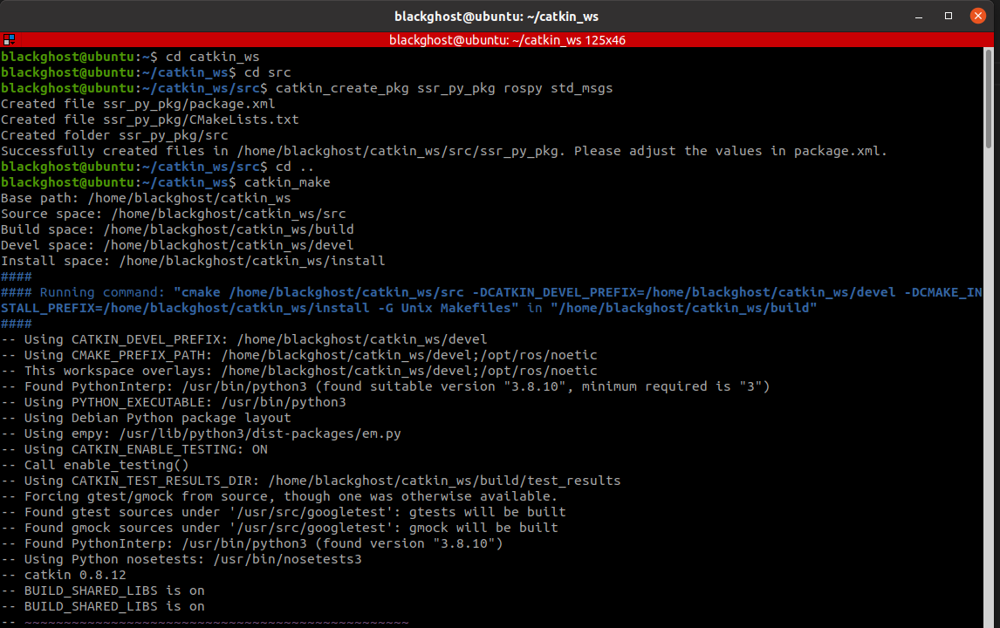

### 2.3 编辑节点

- 打开VsCode后，发现ssr_py_pkg中只有**src、CMakeList.txt和package.xml**三个文件；

- 在ssr_py_pkg下新建**scripts**文件夹，然后在此文件夹下添加节点；

- **chao_node.py节点编辑：**

  - 在scripts文件夹下新建文件**chao_node.py**文件；
  - python创建发布者节点的过程如下：

  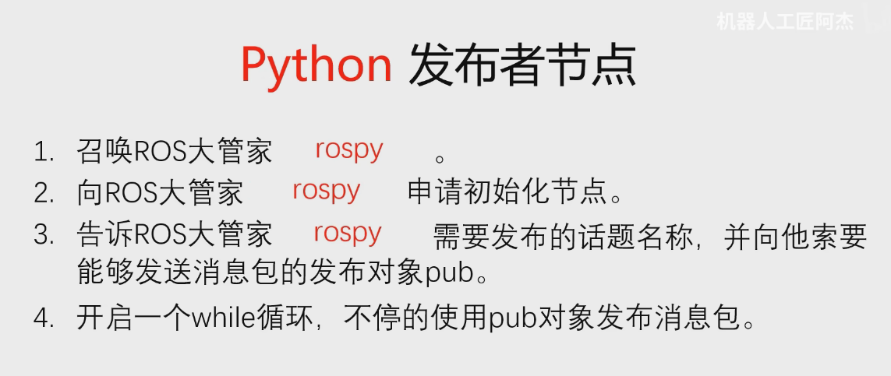

  - **文件编程：**

  ```python
  #!/usr/bin/env python3
  #coding=utf-8
  
  import rospy
  from std_msgs.msg import String
  
  if __name__ == "__main__":
      rospy.init_node("chao_node")	# 注册节点
      rospy.logwarn("我的枪去而复返，你的生命有去无回！")	# 打印信息
  
      pub = rospy.Publisher("kuai_shang_che_kai_hei_qun", String, queue_size=10)	# 获取发布对象
  
      rate = rospy.Rate(10)	# 获取时间控制对象
  
      while not rospy.is_shutdown():		 # 注意while循环的条件
          rospy.loginfo("我要开始刷屏了")	# 打印提示信息
  
          msg = String()					# 获取一个消息对象
          msg.data = "国服马超，带飞"		# 复制内容
          pub.publish(msg)				# 发布内容
          rate.sleep()					# 控制速率
  
  ```

  - **运行节点：**

    - **Ubuntu中新创建的文件不带有执行权限，需要先把文件的执行权限打开**；
    - 在对应文件夹下打开终端，输入如下指令给文件**添加执行权限**：

    ```bash
    chmod +x chao_node.py
    ```

    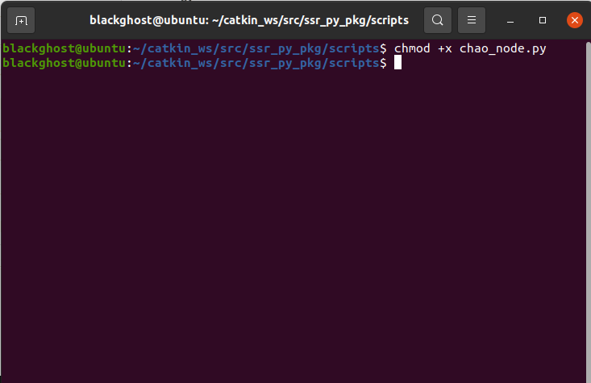

    - 接着在终端中执行ROS初始化以及运行节点即可：

    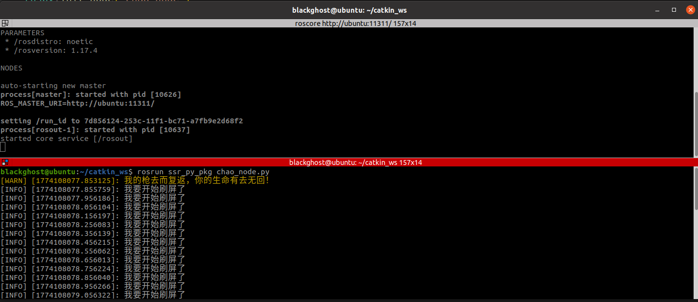

- **yao_node.py节点编程：**

  - 在原目录下直接复制chao_node.py，改名为**yao_node.py**；
  - **更改文件的内容如下：**

  ```python
  #!/usr/bin/env python3
  #coding=utf-8
  
  import rospy
  from std_msgs.msg import String
  
  if __name__ == "__main__":
      rospy.init_node("yao_node")
      rospy.logwarn("过去生于未来")
  
      pub = rospy.Publisher("gie_gie_dai_wo", String, queue_size=10)
  
      rate = rospy.Rate(10)
  
      while not rospy.is_shutdown():
          rospy.loginfo("我要开始刷屏了")
  
          msg = String()
          msg.data = "求上车++++"
          pub.publish(msg)
          rate.sleep()
  
  ```

  - **运行节点：**

    - 同样地按照前面的先初始化ROS然后再运行节点，即可成功运行：

    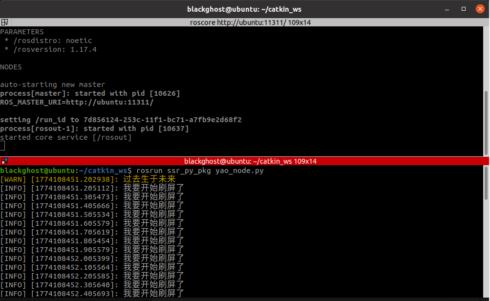

---


# 第十七节课：Subscriber订阅者的Python实现

## 1.整体项目框架

- 本节用Python语言实现**右边的订阅者**；


## 2.整体项目编程

### 2.1 创建软件包

- 在终端中切换到**~/catkin_ws/src**目录；
- 执行以下指令完成软件包的创建：

```bash
catkin_create_pkg atr_py_pkg rospy std_msgs
```

### 2.2 编译软件包

- 在创建完包后需要直接编译一下，但需要区分：
  - Python是解释性语言，是不需要编译的；
  - 这里的编译是为了让ROS在后续能够找到ROS节点；
  - 对于用Python开发的软件包而言，只需要编译一次即可；

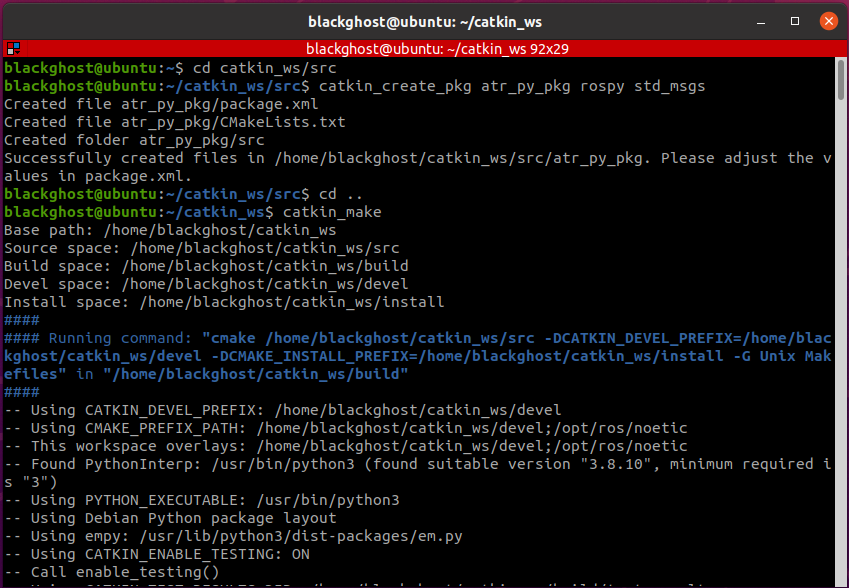

### 2.3 编辑节点

- 打开VsCode后，发现atr_py_pkg中只有**src、CMakeList.txt和package.xml**三个文件；

- 在atr_py_pkg下新建**scripts**文件夹，然后在此文件夹下添加节点；

- **ma_node.py节点编辑：**

  - 在scripts文件夹下新建文件**ma_node.py**文件；
  - python创建订阅者节点的过程如下：

  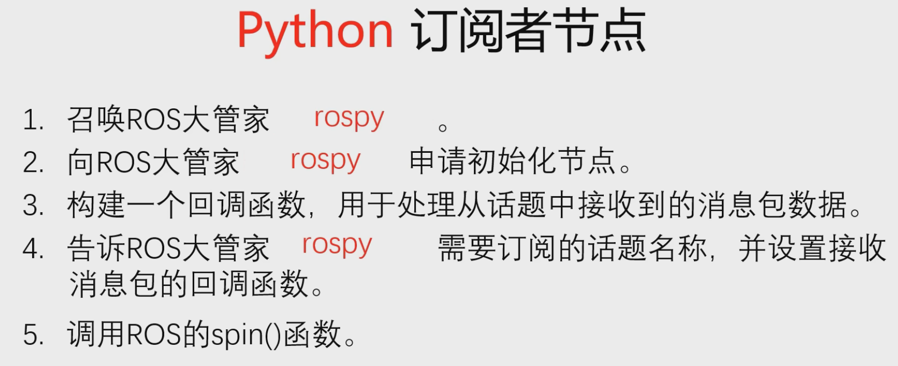

  - **文件编程：**

  ```python
  #!/usr/bin/env python3
  #coding=utf-8
  
  import rospy
  from std_msgs.msg import String
  
  def chao_callback(msg):
      rospy.loginfo(msg.data)
  
  def yao_callback(msg):
      rospy.logwarn(msg.data)
  
  if __name__ == "__main__":
      rospy.init_node("ma_node")
  
      sub = rospy.Subscriber("kuai_shang_che_kai_hei_qun", String, chao_callback, queue_size=10)
  
      sub2 = rospy.Subscriber("gie_gie_dai_wo", String, yao_callback, queue_size=10)
  
      rospy.spin()
  
  ```

  - **运行节点：**

    - **Ubuntu中新创建的文件不带有执行权限，需要先把文件的执行权限打开**；
    - 在对应文件夹下打开终端，输入如下指令给文件**添加执行权限**：

    ```bash
    chmod +x ma_node.py
    ```

    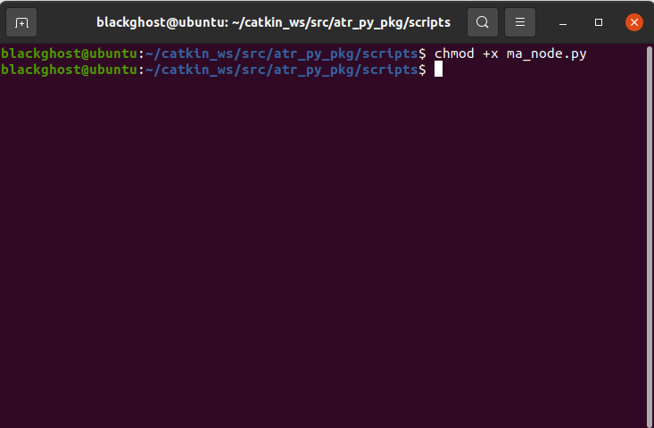

    - 接着在终端中执行ROS初始化以及运行节点即可：

    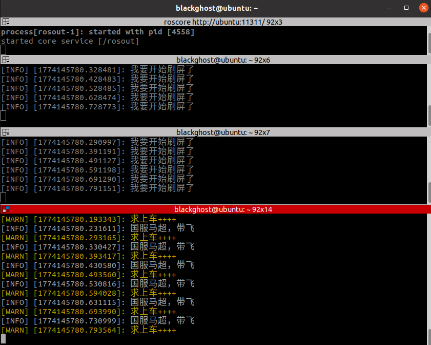


## 3.用.launch文件同时启动多个ROS节点

- **我们在atr_py_pkg下创建launch文件夹用来存放launch文件，然后新建launch文件kai_hei.launch**，然后添加如下内容：
  - launch-prefix="gnome-terminel -e：可以指定该节点在另一个终端输出；
  - **之前的C++文件编译后不带CPP后缀，所以type中没有后缀，但是.py是可执行文件，不编译，需要加后缀；**

```xml
<launch>

    <node pkg="ssr_py_pkg" type="chao_node.py" name="chao_node"/>

    <node pkg="ssr_py_pkg" type="yao_node.py" name="yao_node"/>

    <node pkg="atr_py_pkg" type="ma_node.py" name="ma_node" launch-prefix="gnome-terminal -e"/>

</launch>
```

- 然后在终端中输入下列指令即可同时运行之前的几个节点：

```bash
roslaunch atr_py_pkg kai_hei.launch
```

- 最终的效果如图所示：

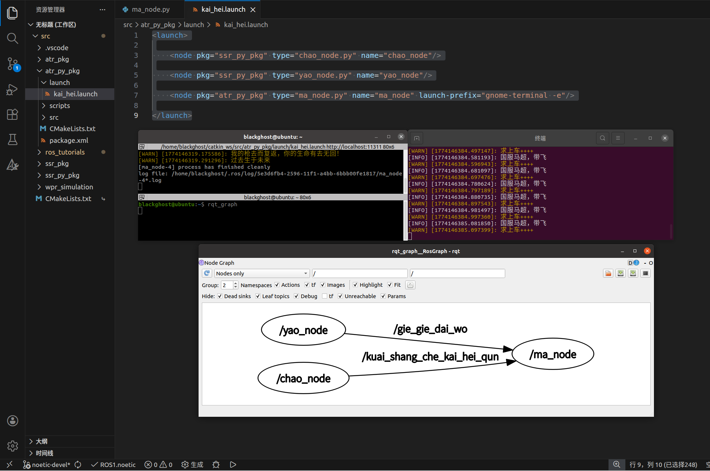

---


# 第十八节课：ROS机器人运动控制

## 1.机器人运动控制的分解描述

- 机器人的运动可以分解为两部分：
  - **矢量运动**：包括前后、左右、上下的直线运动；
  - **旋转运动**：包括左右旋转运动、左右的倾倒运动（滚转运动）、前后倾倒（俯仰运动）；

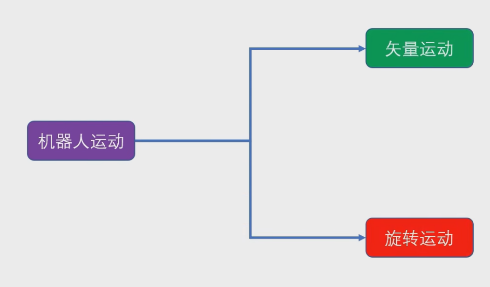

- 所有的三维运动都可以由上面的矢量运动和旋转运动合成得到：

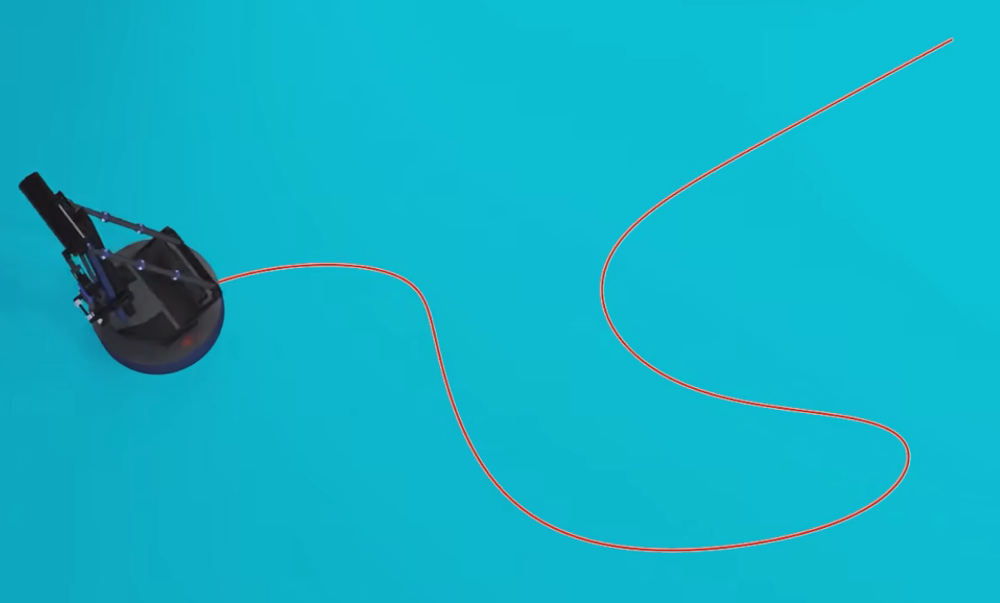


## 2.机器人运动分解的量化表示

### 2.1 平移运动的量化

- 右手做出打枪的手势，其中食指指向机器人运动的正前方，可以得到机器人平移运动的坐标系；
- 机器人的任意平移运动，都可以通过这三个矢量表示；

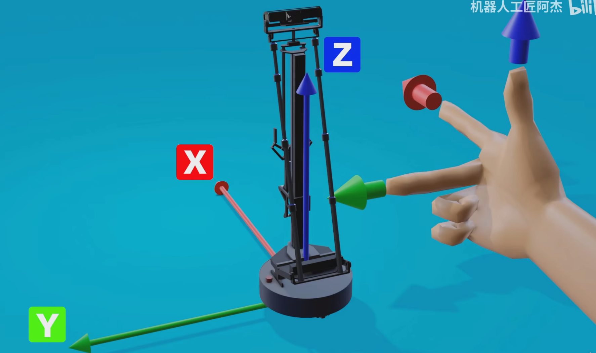

### 2.2 旋转运动的量化

- 右手四指握拳，只剩下拇指，当：
  - 拇指指向x轴正方向时，四指的旋转方向即滚转运动的正方向；
  - 拇指指向y轴正方向时，四指的旋转方向即俯仰运动的正方向；
  - 拇指指向z轴正方向时，四指的旋转方式即旋转运动的正方向；
  
  | 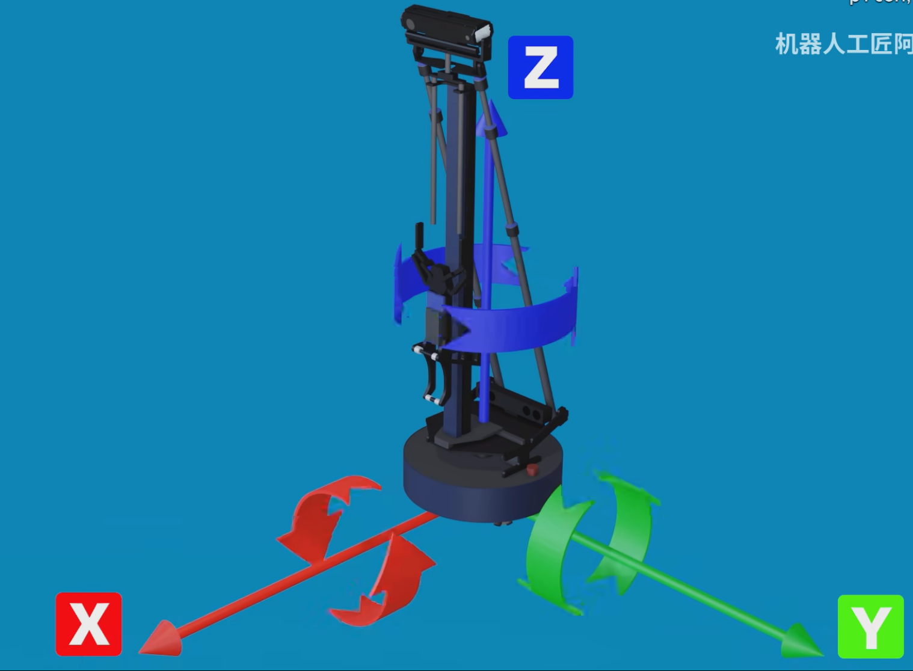 | 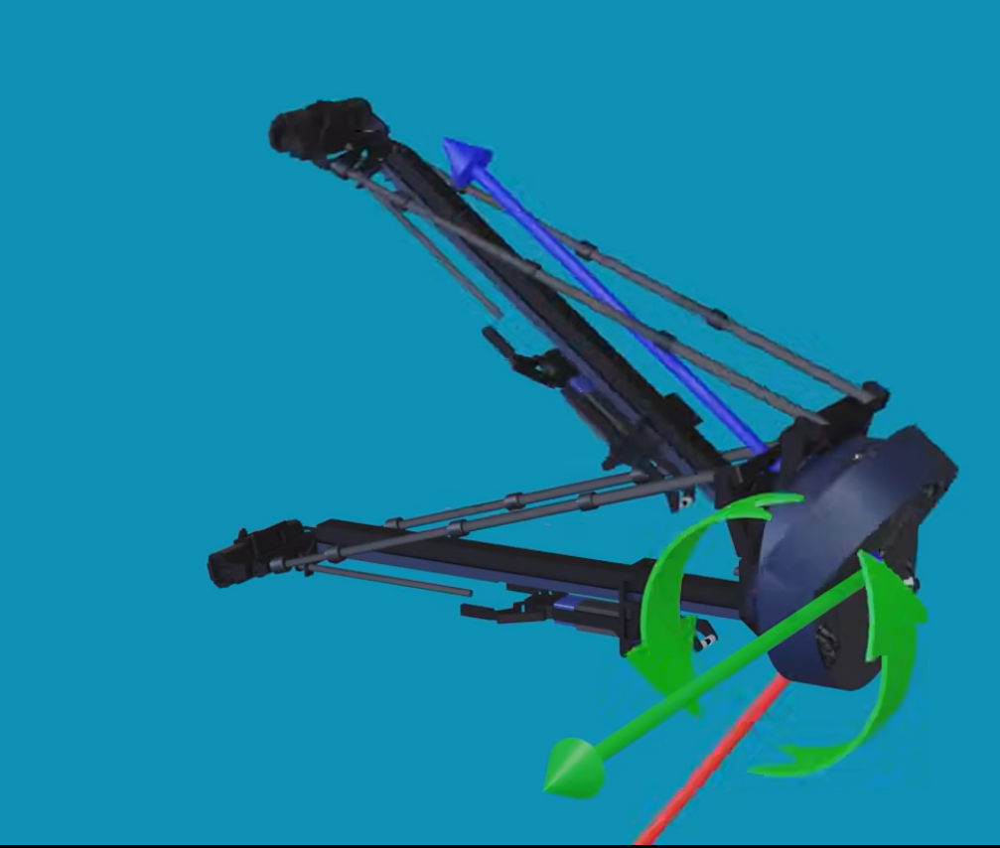 |
  | ------------------------------------------------------------ | ------------------------------------------------------------ |

- 所有的三维旋转运动都可以由上面的三个方向合成得到；


## 3.ROS中的运动控制中的消息包

- 在ROS中，单位如下统一：
  - 平移运动的单位是m/s；
  - 旋转运动的单位是rad/s；
- ROS中的机器人运动控制，是通过消息包的方式来控制的，消息包的格式如下：

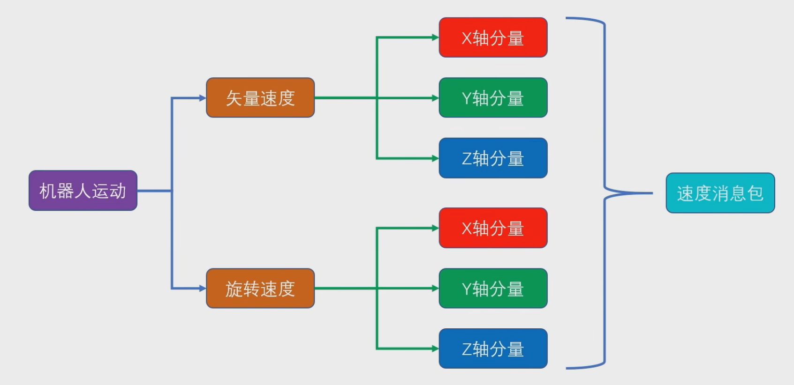


## 4.geometry_msgs软件包介绍

- geometry_msgs软件包是ROS中的运动控制消息包；
- 在index.ros.rog网站中，可以查看对它的详细描述：
  - Twist就是geometry_msgs中的运动控制消息包；
  - Twist里面包含了两个Vector3的变量，对应了平移运动和旋转运动；
  - 每个Vector3变量内部又有x、y、z三个变量描述；

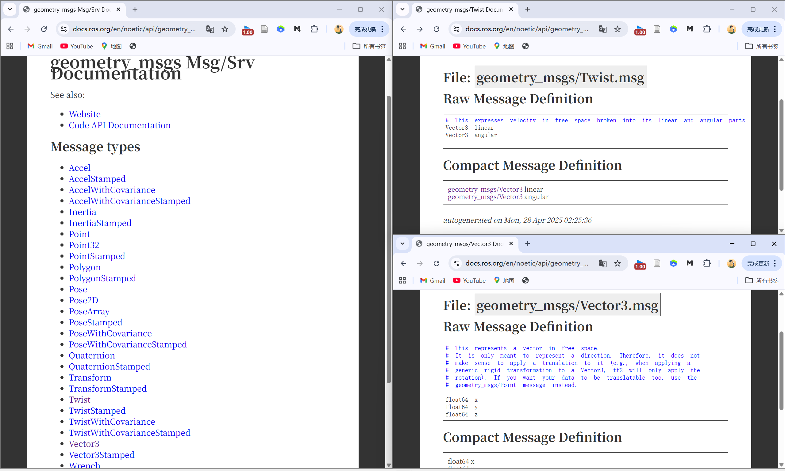


## 5.ROS中的运动控制话题消息架构

- 机器人出厂时会自带一个机器人核心节点，这个节点可以直接驱动机器人的底层硬件；
- 机器人核心节点会向上订阅一个话题，这个话题叫cmd_vel；
- 我们在开发过程中，就只需要写一个速度控制节点，并往cmd_vel话题中发布消息即可，这个消息的格式就是前面的Twist；

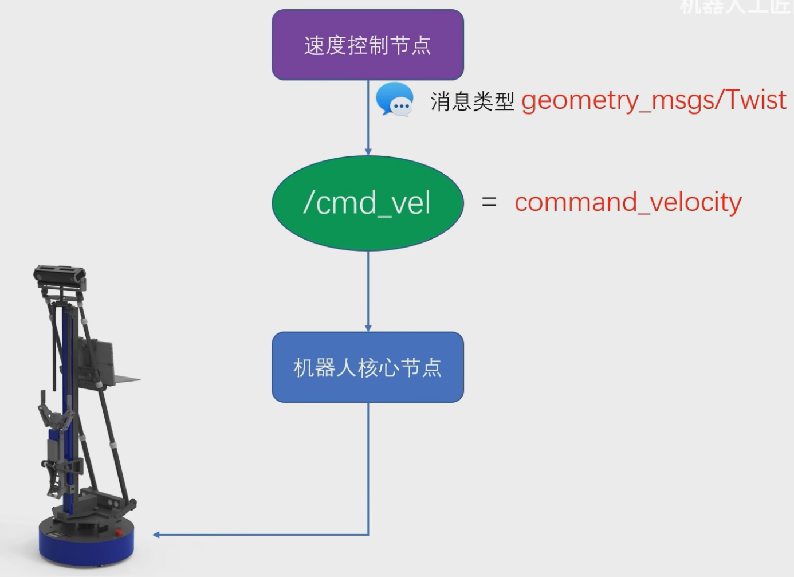

---


# 第十九节课：机器人运动控制的C++实现

## 1.环境的搭建

- 由于没有实体的机器人，所以采用ROS中的仿真进行模拟；

- 本节课程用之前介绍过的wpr_simulation开源项目进行仿真，前面已经下载过了源码，也就是**仿真环境Gazebo**；

- 根据下面步骤进行环境的搭建：

  - 进入**wpr_simulation软件包目录**中；
  - 执行**git pull**完成软件包的更新；
  - 回退到**catkin_ws**下，执行**catkin_make**进行编译；

  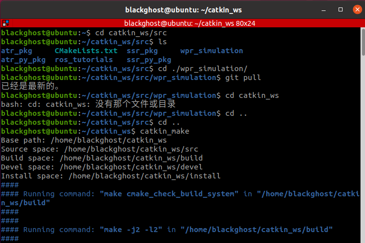

  - 编译完成后，可以选择启动该仿真程序（在主目录下执行）：

  ```bash
  roslaunch wpr_simulation wpb_simple.launch
  ```

  - 然后可以运行该项目中的一个运动控制小例程：

  ```bash
  rosrun wpr_simulation demo_vel_ctrl
  ```


## 2.开发软件包

### 2.1 整体思路框架

- 整体思路如下：
  - **我们完全不需要去操作底层的控制，只需要完成上层的速度控制节点即可**；

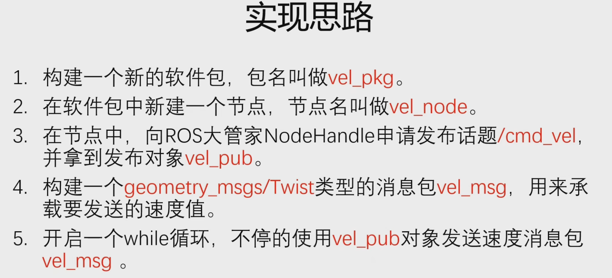

### 2.2 软件包开发

- **首先创建软件包vel_pkg**

  - 切换目录：

  ```bash
  cd catkin_ws/src
  ```

  - 创建软件包：

  ```bash
  catkin_create_pkg vel_pkg roscpp rospy geometry_msgs
  ```

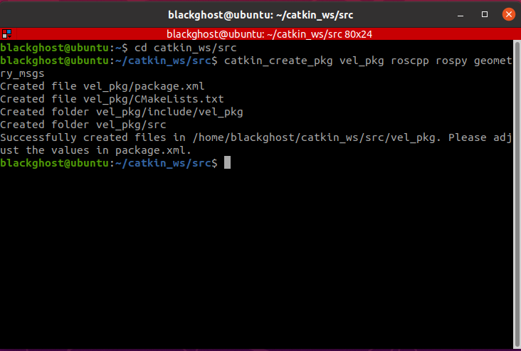

- **创建节点**

  - 在src目录下新建文件：vel_node.cpp
  - 然后在文件中添加如下内容：

  ```cpp
  #include <ros/ros.h>
  #include <geometry_msgs/Twist.h>
  
  int main(int argc, char *argv[])
  {
      ros::init(argc, argv, "vel_node");
  
      ros::NodeHandle n;
      ros::Publisher vel_pub = n.advertise<geometry_msgs::Twist>("/cmd_vel", 10);
  
      geometry_msgs::Twist vel_msg;
  
      vel_msg.linear.x = 0.1;
      vel_msg.linear.y = 0;
      vel_msg.linear.z = 0;
  
      vel_msg.angular.x = 0;
      vel_msg.angular.y = 0;
      vel_msg.angular.z = 0;
  
      ros::Rate r(30);
  
      while(ros::ok())
      {
          vel_pub.publish(vel_msg);
          r.sleep();
      }
  
      return 0;
  }
  
  ```

- **添加编译条件**

  - 在CMakeList.txt文件中，添加如下代码：
  - 然后直接编译即可，如果没有抄错基本能够成功编译；

  ```bash
  add_executable(vel_node src/vel_node.cpp)
  add_dependencies(vel_node ${${PROJECT_NAME}_EXPORTED_TARGETS} ${catkin_EXPORTED_TARGETS})
  target_link_libraries(vel_node
   ${catkin_LIBRARIES}
  )
  ```


## 3.运行节点仿真程序

- 先启动仿真环境

```bash
roslaunch wpr_simulation wpb_simple.launch
```

- 运行自己写的节点：

```bash
rosrun vel_pkg vel_node
```

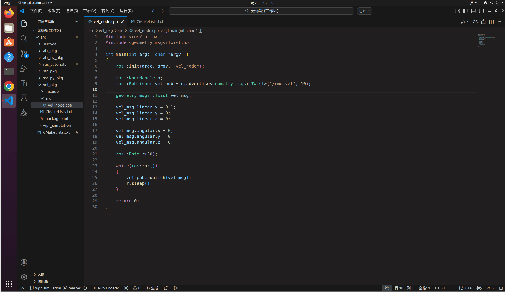


## 4.逻辑总结

整个过程的逻辑如下：

- wpr_simulation是一个仿真环境；
- 当启动了demo_vel_ctrl这个小例程后，它就会发布/cmd_vel话题，为wpr_simulation中的wpb_simple.launch提供消息；
- 我们现在所创建的节点就是替代demo_vel_ctrl这个节点；
- 我们在写完节点后不启动demo_vel_ctrl，而是启动了我们自己的节点，机器人也能正常的跑起来；
- 这证明了我们的节点是工作正常的；

---


# 第二十节课：机器人运动控制的Python实现

## 1.项目思路

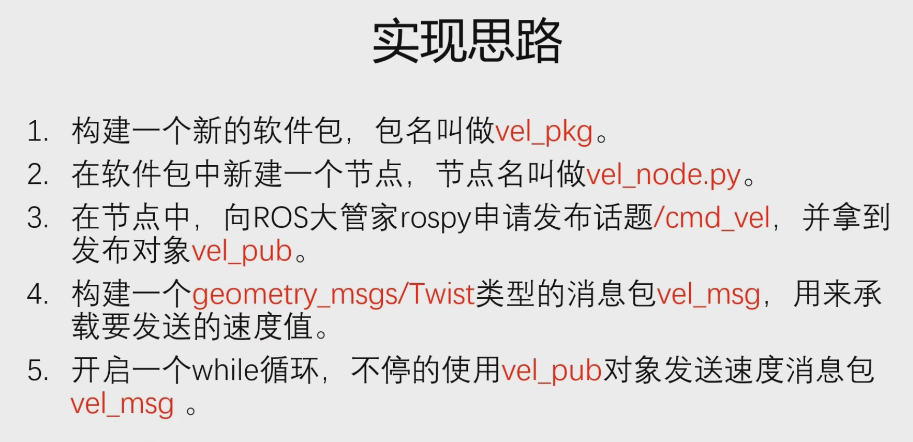


## 2.开发软件包

### 2.1 创建软件包

- 在工作空间的src目录下创建软件包**vel_py_pkg**：

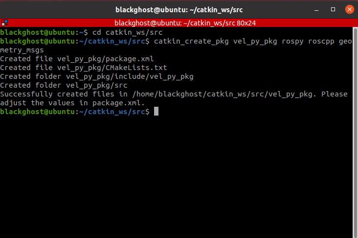

### 2.2 开发软件包

- 回到VsCode中，在软件包下新建**文件夹scripts**；
- 在scripts文件夹下新建文件，**vel_node.py**；
- 然后在vel_node.py文件下添加如下内容：

```python
#!/usr/bin/env python3
#coding=utf-8

import rospy
from geometry_msgs.msg import Twist

if __name__ == "__main__":
    rospy.init_node("vel_node")

    vel_pub = rospy.Publisher("cmd_vel", Twist, queue_size=10)

    vel_msg = Twist()

    vel_msg.linear.x = 0.1

    rate = rospy.Rate(30)

    while not rospy.is_shutdown():
        vel_pub.publish(vel_msg)
        rate.sleep()

```

- 为文件添加可执行权限：

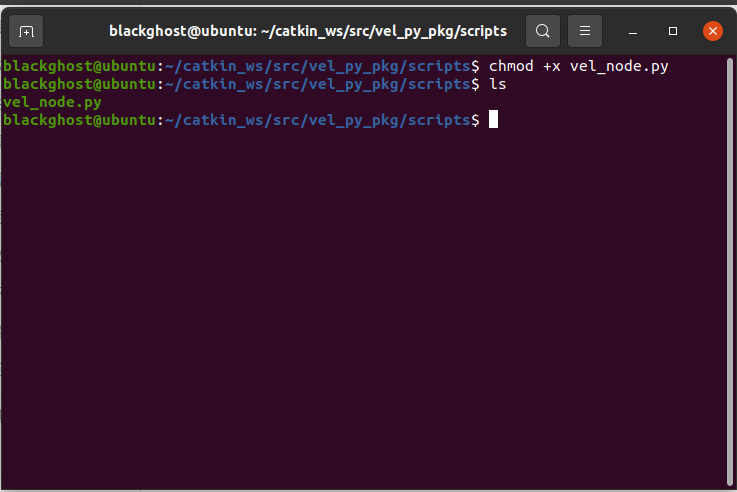


## 3.运行节点仿真程序

- 先启动仿真环境

```bash
roslaunch wpr_simulation wpb_simple.launch
```

- 运行自己写的节点：

```bash
rosrun vel_py_pkg vel_node.py
```

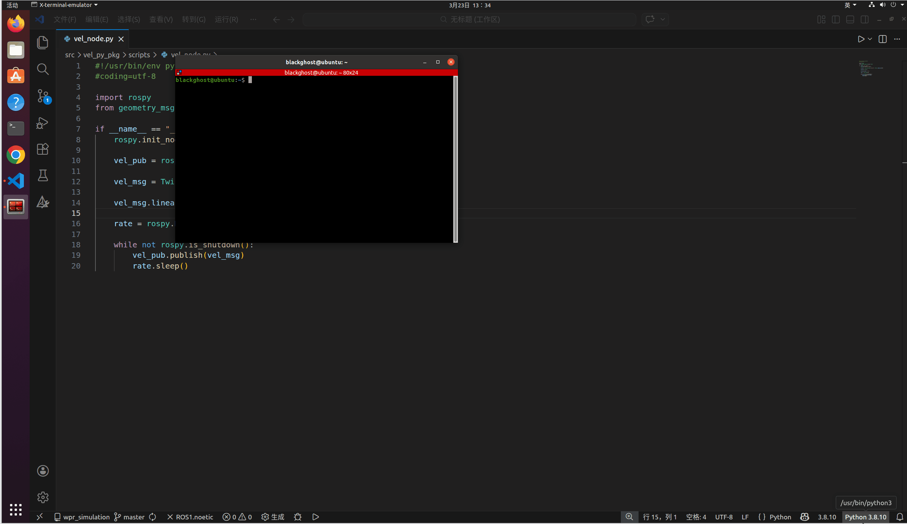

---


# 第二十一节课：激光雷达工作原理

## 1.激光雷达的分类

- **按测量维度分：**
  - 单线雷达与多线雷达；

- **按测量原理分：**
  - 三角测距雷达和TOF雷达；

- **按工作方式分：**
  - 机械旋转雷达和固态雷达；

- **激光雷达的分类有很多种，但是在ROS中激光雷达的数据格式都是一样的；**

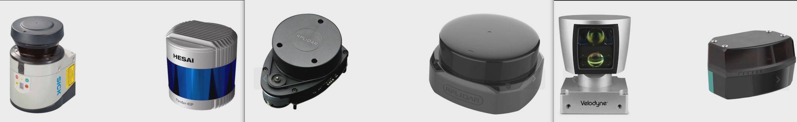


## 2.激光雷达的原理

- 不断的按如下方式进行扫描即可得到周围环境的点阵图；

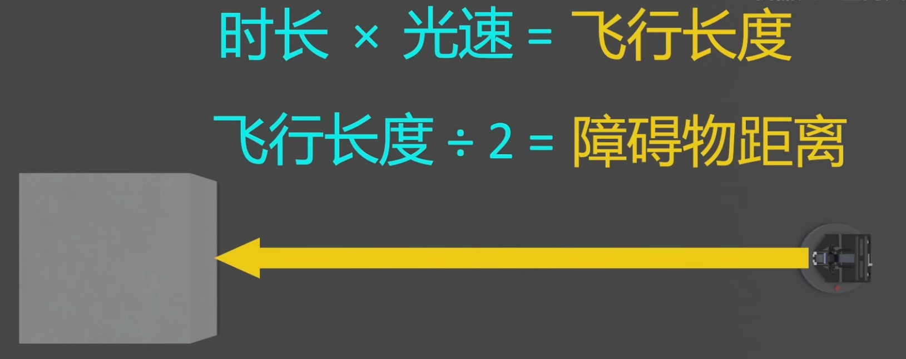

---


# 第二十二节课：使用RViz观测传感器数据

## 1.RViz简介

- 全名：The Robot Visualization Tool；
- 这是一个可视化工具，主要用来：
  - 可视化传感器的数据；
  - 可视化机器人运算处理的中间结果；
  - 可视化即将执行的目标指示；


## 2.RViz的使用

### 2.1 RViz的启动

- 在终端中启动仿真环境

```bash
roslaunch wpr_simulation wpb_simple.launch
```

- 打开RViz可视化工具：

```bash
rviz
```

- RViz界面的主要内容有：
  - 菜单栏；
  - 工具栏；
  - 当前可视化项目的列表；
  - 对可视化项目的操作；
  - 图形化显示窗口；
  - 视角位置数值调整窗口，一般不用，而是直接手动调整视角；
  - 状态栏；

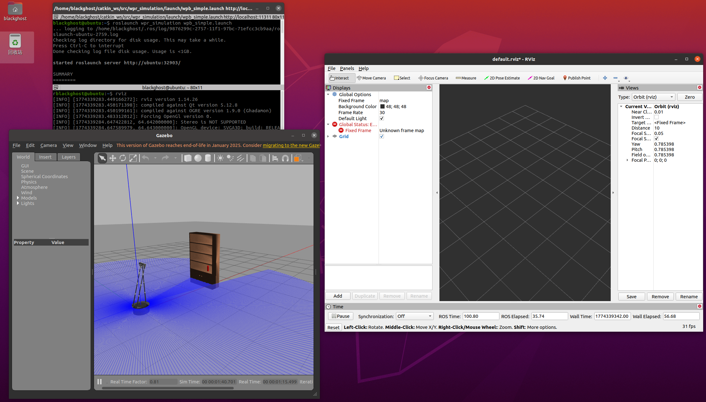

### 2.2 RViz的使用

- **修改Fixed Frame并添加机器人模型：**

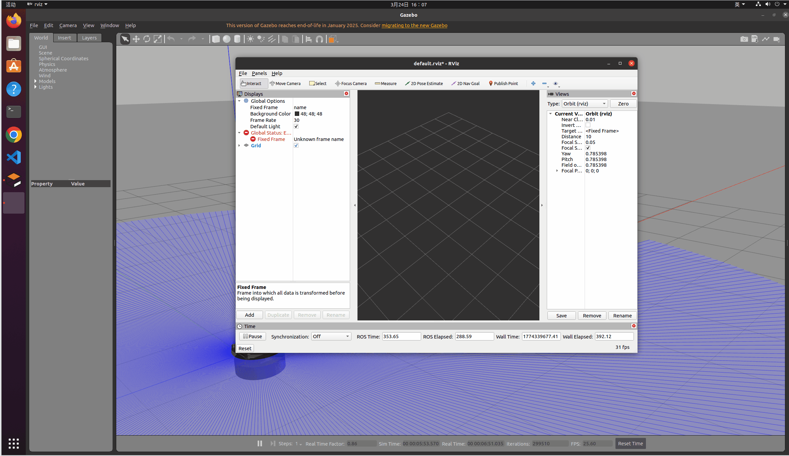

- **添加激光雷达并选择订阅话题：**

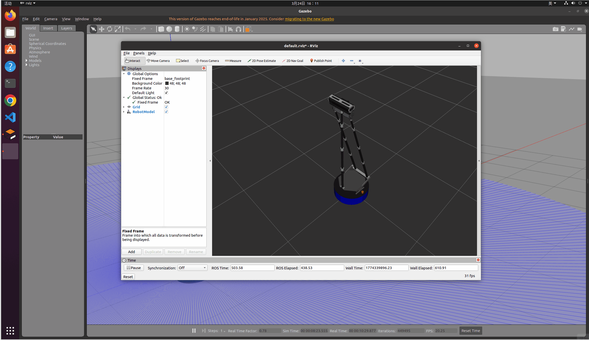

- **在仿真环境中添加障碍物，RViz将实时显示点阵：**

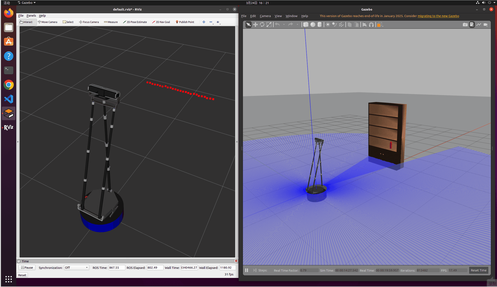

### 2.3 RViz配置文件的保存

- 在RViz中可以电机File将当前的环境格式保存为.rviz格式的文件；
- 在下次打开RViz时可以直接点击File将该文件环境读取进来；

- 除此之外，还可以通过launch文件启动RViz，如wpr_simulation中自带的一个launch文件：

```bash
roslaunch wpr_simulation wpb_rviz.launch
```

- 后续的RViz启动就通过这个方式来启动；


## 3.RViz与Gazebo的区别

- **Gazebo：**
  - 是模拟真是机器人发出传感器数据的工具；
  - 在实际的机器人开发中，Gazebo是不存在的，由真实的机器人和真实的环境代替；
- **RViz：**
  - 是接收传感器数据并进行显示的工具，即它显示的是机器人实际能检测的环境状况；
  - 在实际的机器人开发中，RViz可能还存在，它仍然可以接收实际机器人的传感器数据并显示；

---


# 第二十三节课：激光雷达消息包格式

## 1.启动仿真环境与RViz

- ```bash
  roslaunch wpr_simulation wpb_simple.launch
  ```

- ```bash
  roslaunch wpr_simulation wpb_rviz.launch
  ```

- 然后在机器人周围放上障碍物，即可得到点阵图；

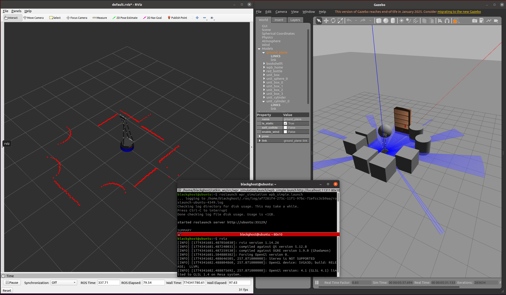


## 2.官网查看ROS中对激光雷达点阵数据的封装

- 官网中选择**Package**和**Noetic的版本**；
- 然后在搜索框中搜索：**sensor_msgs**；
- 进去后点击**Website**进入其描述网址，然后选择**LaserScan Message**：

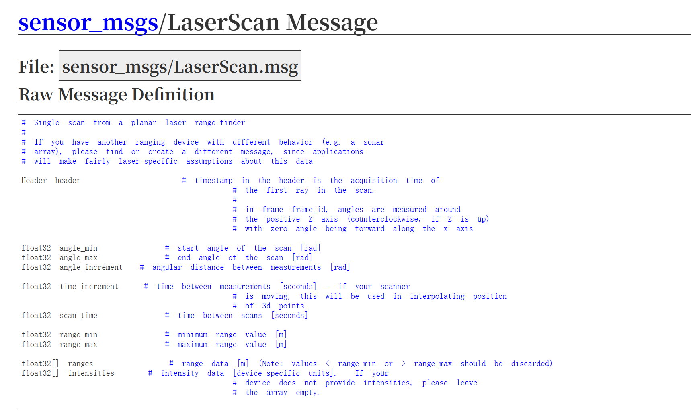

- 中文翻译如下：

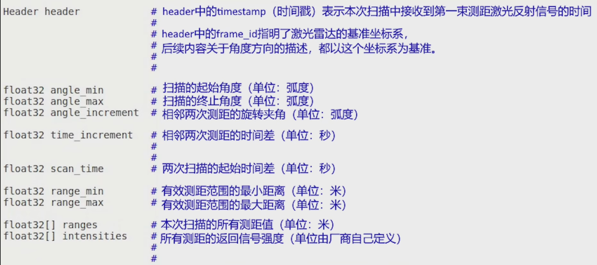


## 3.用rostopic查看仿真中的数据格式

- **在终端中执行：**

```bash
rostopic echo /scan --noarr
```

- 得到如下结果：

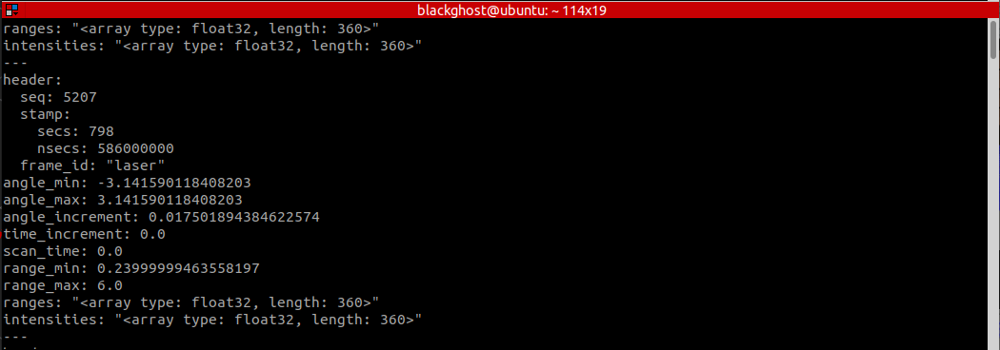

- **数据格式剖析：**
  - header：主要是存储时间戳和坐标系ID
    - 时间戳：消息包发送的时间；
    - 坐标系ID：涉及到TF系统；
  - angle_min和angle_max：对应了激光雷达的起始角度和终止角度（弧度）；
  - angle_increment：相邻两次测距的旋转夹角（弧度）；
  - time_increment：相邻两次测距的时间差（s）；
  - scan_time：两次扫描的起始时间差（s），即扫描周期；
  - range_min和range_max：雷达扫描的最小距离和最大距离（m）；
  - ranges：数据数组
    - 包含360个float32的数据，即旋转一周扫描360个点，然后存入数组中；
    - 数据的排序跟扫描的起始角度和终止角度对应，就是360个值；
    - 若测量距离过大，数据就是INF；
  - intensities：360个float32数据，与ranges对应，是测距返回的信号强度；

---


# 第二十四节课：获取激光雷达数据的C++节点

## 1.环境搭建

- 本节课的依赖环境就是之前说的wpr_simulation；
- 整个环境的搭建可参照《第十九节课的环境搭建》；
- 思路：
  - 若已经下载了就可以直接编译并运行；
  - 若还没下载就下载源码然后编译运行；


## 2.运行环境

- 仿真环境的运行：

```bash
roslaunch wpr_simulation wpb_simple.launch
```

- wpr_simulation中有一个获取雷达数据的例子程序。可运行查看效果：

```bash
rosrun wpr_simulation demo_lidar_data
```

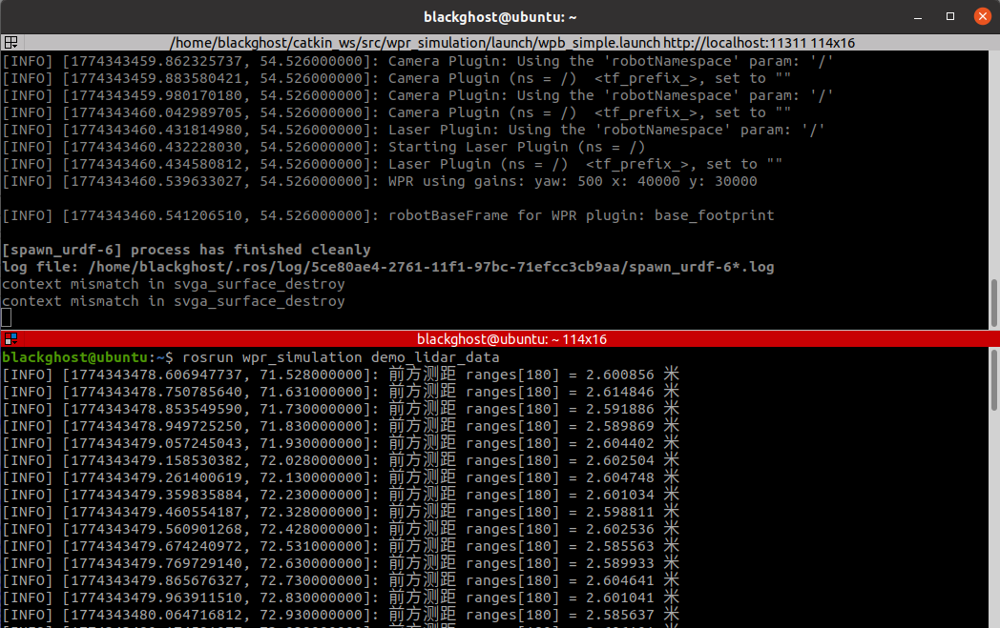


## 3.项目框架

- ROS开发中，激光雷达会有一个节点，这个节点是由厂商提供的，**配置一下端口即可将激光雷达的电路数据传输到这个节点中**；
- 这个节点会发布一个话题，消息的格式就是之前的sensor_msgs::LaserScan，话题的名称是约定的/scan；
- 我们只需要完成数据获取节点，订阅/scan话题即可得到数据；

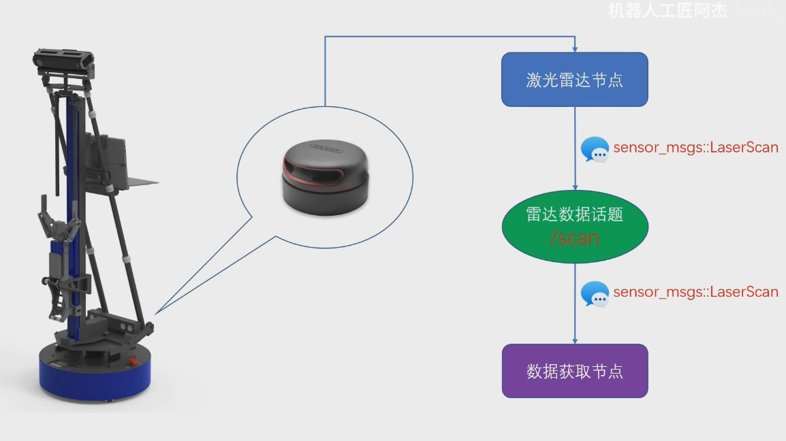

- **最后总结一下实现步骤如下：**

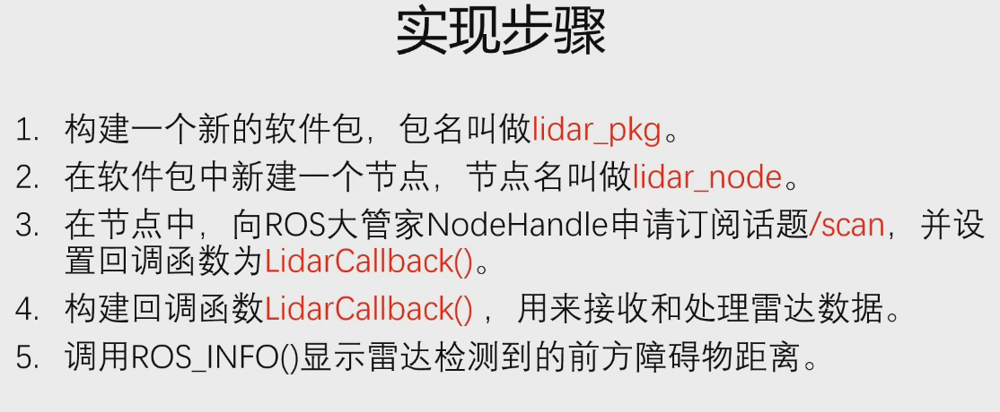


## 4.项目开发

- **创建软件包：catkin_ws src目录下**

```bash
catkin_create_pkg lidar_pkg roscpp rospy sensor_msgs
```

- **VsCode中，在lidar_pkg目录下的src目录下创建lidar_node.cpp文件，然后编程：**

```cpp
#include <ros/ros.h>
#include <sensor_msgs/LaserScan.h>

void LidarCallback(const sensor_msgs::LaserScan msg)
{
    float fMidDist = msg.ranges[180];
    ROS_INFO("前方测距 ranges[180] = %f 米", fMidDist);
}

int main(int argc, char *argv[])
{
    setlocale(LC_ALL, "");
    ros::init(argc, argv, "lidar_node");
    
    ros::NodeHandle n;
    ros::Subscriber lidar_sub = n.subscribe("/scan", 10, &LidarCallback);
    
    ros::spin();		// 内部自带了循环，不需要再套个while
    
    return 0;
}

```

- **添加编译规则：CMakeList.txt文件最后添加：**

```cpp
add_executable(lidar_node src/lidar_node.cpp)
target_link_libraries(lidar_node
  ${catkin_LIBRARIES}
)
```

- **编译：catkin_ws下，终端执行命令**

```bash
catkin_make
```


## 5.运行查看数据

- **启动仿真环境：**

```bash
roslaunch wpr_simulation wpb.simple.launch
```

- **启动节点：**

```bash
rosrun lidar_pkg lidar_node
```

- **实际效果：**
  - 可不断移动仿真环境中的书柜，然后观察终端数据的变化；

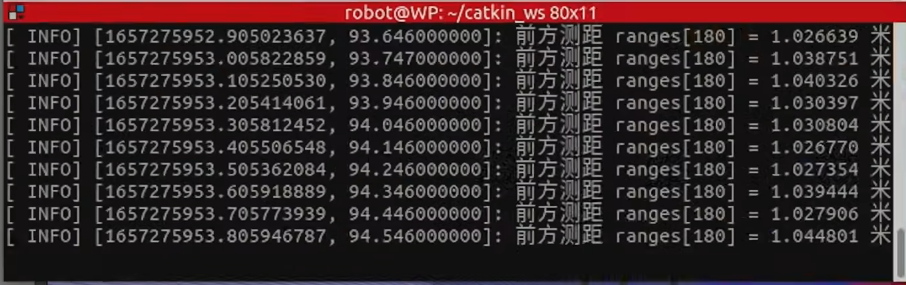

---


# 第二十五节课：获取激光雷达数据的Python节点

## 1.项目整体结构

- 在我的开发中，为了区分前面的lidar_pkg，我改为了lidar_py_pkg；

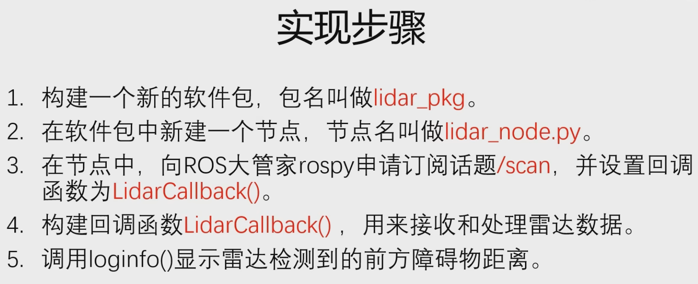


## 2.项目开发

- 创建软件包：

```bash
cd catkin_ws/src
catkin_create_pkg lidar_py_pkg roscpp rospy sensor_msgs
```

- 编译：

```bash
cd ..			# 回退到catkin_ws目录
catkin_make		# 编译
```

- 创建文件：
  - 在VsCode中，在lidar_py_pkg文件夹下创建scripts文件夹；
  - 再在这个文件夹下创建lidar_node.py文件；

- 编辑文件：

```python
#!/usr/bin/env python3
#coding=utf-8

import rospy
from sensor_msgs.msg import LaserScan

def LidarCallback(msg):
    dist = msg.ranges[180]
    rospy.loginfo("前方测距 range[180] = %f 米", dist)


if __name__ == "__main__":
    rospy.init_node("lidar_node")
    lidar_sub = rospy.Subscriber("/scan", LaserScan, LidarCallback, queue_size=10)
    rospy.spin()

```

- 为文件添加可执行权限

```bash
cd catkin_ws/src/lidar_py_pkg/scripts
chmod +x lidar_node.py
```

- 运行仿真环境并运行节点

```bash
roslaunch wpr_simulation wpb_simple.launch
rosrun lidar_py_pkg lidar_node.py
```

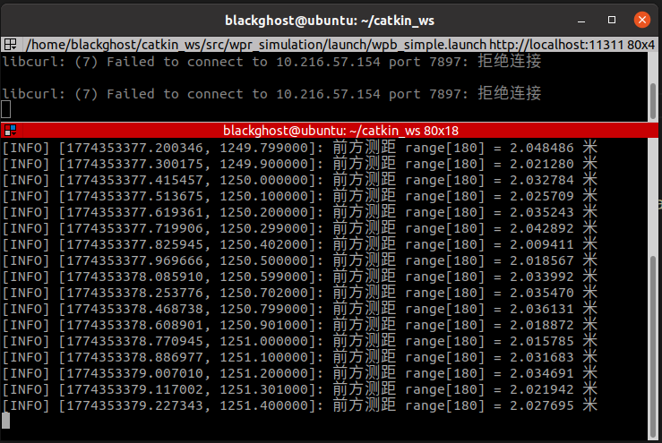

---


# 第二十六节课：激光雷达避障的C++节点

## 1.项目框架

- 在前面的基础上，使节点订阅雷达数据的同时，发布速度控制话题；

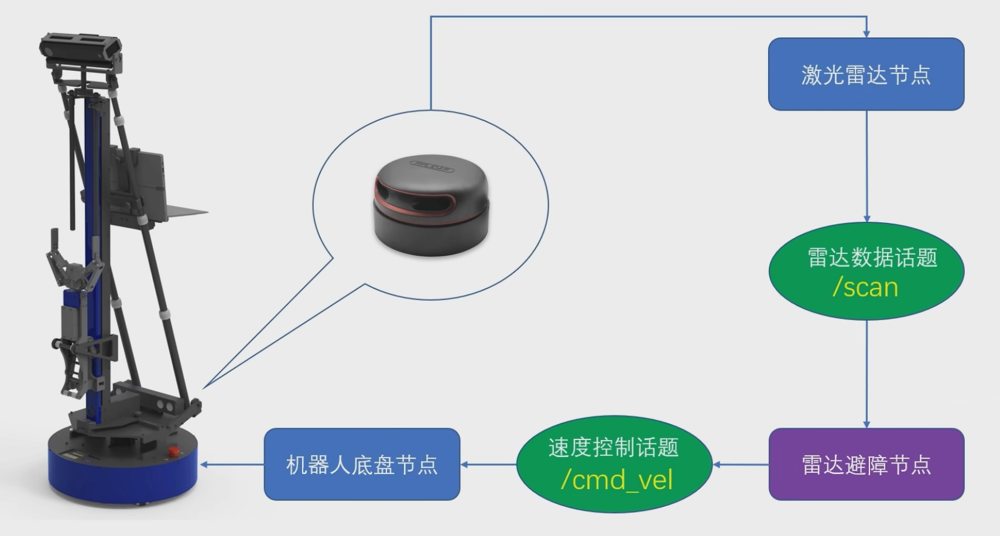

- 实现步骤：

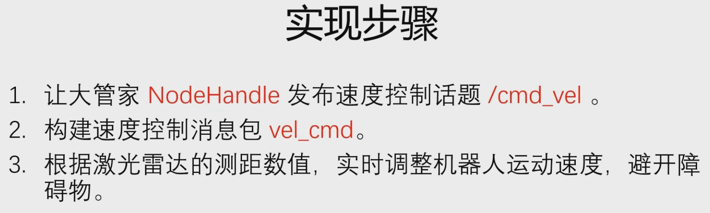


## 2.项目开发

- 在原来的lidar_pkg软件包的lidar_node.cpp文件基础上增加：
  - 每调用回调函数50次就发布一次速度指令；

```cpp
#include <ros/ros.h>
#include <sensor_msgs/LaserScan.h>
#include <geometry_msgs/Twist.h>

ros::Publisher vel_pub;     // 声明为全局变量
int nCount = 0;				// 计数值变量，用于延长旋转时间

void LidarCallback(const sensor_msgs::LaserScan msg)
{
    float fMidDist = msg.ranges[180];
    ROS_INFO("前方测距 ranges[180] = %f 米", fMidDist);

    if(nCount > 0)
    {
        nCount --;
        return;
    }

    geometry_msgs::Twist vel_cmd;
    if(fMidDist < 1.5)
    {
        vel_cmd.angular.z = 0.3;
        nCount = 50;
    }
    else
    {
        vel_cmd.linear.x = 0.05;
    }
    vel_pub.publish(vel_cmd);
}

int main(int argc, char *argv[])
{
    setlocale(LC_ALL, "");
    ros::init(argc, argv, "lidar_node");
    
    ros::NodeHandle n;
    ros::Subscriber lidar_sub = n.subscribe("/scan", 10, &LidarCallback);   // 订阅激光雷达话题
    
    vel_pub = n.advertise<geometry_msgs::Twist>("/cmd_vel", 10);            // 发布速度话题

    ros::spin();
    
    return 0;
}

```


## 3.编译运行

- 启动仿真环境：

```bash
roslaunch wpr_simulation wpb_simple.launch
```

- 运行节点：

```bash
rosrun lidar_pkg lidar_node
```

- 效果如下：


---


# 第二十七节课：激光雷达避障的Python节点

## 1.整体思路

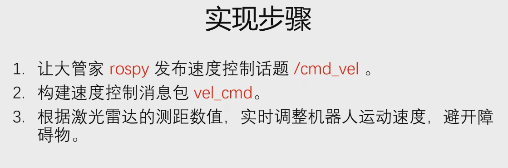


## 2.项目开发

- 在原来的lidar_py_pkg的lidar_node.py文件基础上完善：

```python
#!/usr/bin/env python3
#coding=utf-8

import rospy
from sensor_msgs.msg import LaserScan
from geometry_msgs.msg import Twist

count = 0

def LidarCallback(msg):
    global vel_pub
    global count
    
    dist = msg.ranges[180]
    rospy.loginfo("前方测距 range[180] = %f 米", dist)
    
    if count > 0:
        count = count - 1
        return
    
    vel_cmd = Twist()
    if dist < 1.5:
        vel_cmd.angular.z = 0.3
    else:
        vel_cmd.linear.x = 0.05
    vel_pub.publish(vel_cmd)

if __name__ == "__main__":
    rospy.init_node("lidar_node")
    lidar_sub = rospy.Subscriber("/scan", LaserScan, LidarCallback, queue_size=10)
    vel_pub = rospy.Publisher("/cmd_vel", Twist, queue_size=10)
    rospy.spin()

```


## 3.运行

- 启动仿真环境：

```bash
roslaunch wpr_simulation wpb_simple.launch
```

- 运行节点：

```bash
rosrun lidar_pkg lidar_node
```

- 效果如下：


---


# 第二十八节课：ROS中的IMU惯性测量单元的消息包

- 在官网中搜索sensor_msgs，进入其Website，可以找到Imu，点进去可以看到它的数据格式描述：
  - header里面也包含了时间戳等信息；
  - orientation是其内部根据裸数据解读出来的姿态角，它是一个四元数；
  - angular_velocity是三轴角速度；
  - linear_acceleration是三轴加速度；
  - 该数据包中还包含了各自的协方差矩阵，协方差矩阵有特殊用途；

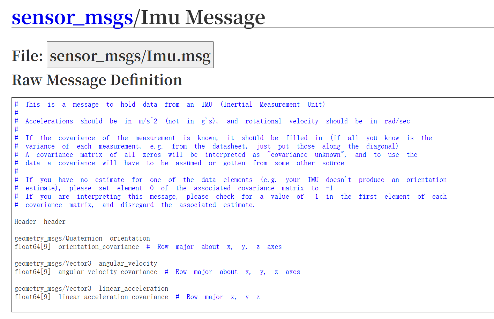

- 中文翻译版如下：

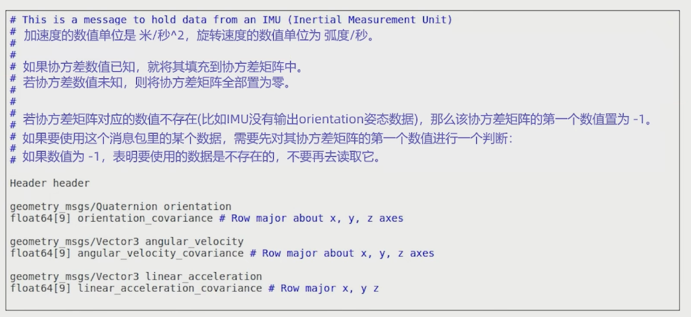

---


# 第二十九节课：获取IMU数据的C++节点

## 1.IMU的三个话题

- 在ROS官方规定中，IMU包含三个话题：
  - data_raw：即原始的六轴数据；
  - data：原始数据+数据融合后的四元数姿态角；
  - mag：磁强计的磁强数据，只有九轴IMU才发布这个话题；
- 一般而言，直接订阅data这个话题即可；

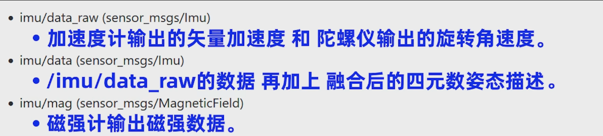


## 2.整体框架与实现步骤

- 整体框架如下：只需要实现一个节点订阅话题即可


- 整个项目的实现步骤：

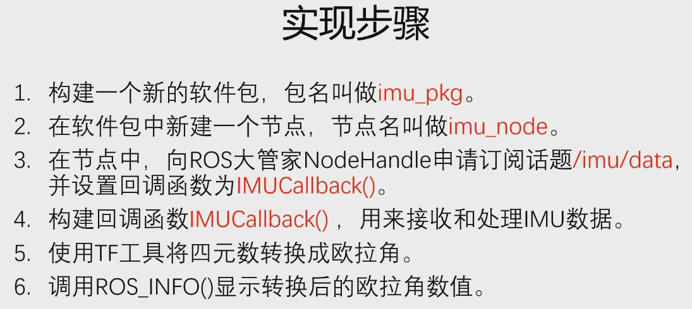


## 3.项目开发

- **终端中创建软件包：**

```bash
cd catkin_ws/src
catkin_create_pkg imu_pkg roscpp rospy sensor_msgs
```

- **创建节点**
  - 打开VsCode；
  - 在imu_pkg下的src目录下创建文件imu_node.cpp；

- **编辑imu_node.cpp文件**
  - 注意这里的TF库提供的将四元数信息直接转换为欧拉角的数学功能；

```cpp
#include "ros/ros.h"
#include "sensor_msgs/Imu.h"    // 引入消息包头文件
#include "tf/tf.h"              // 引入TF的头文件

void IMUCallback(sensor_msgs::Imu msg)
{
    if(msg.orientation_covariance[0] < 0)   // 协方差矩阵判断数据是否有效
        return;
    tf::Quaternion quaternion(          // 将消息包四元数转换为TF的四元数对象
        msg.orientation.x,
        msg.orientation.y,
        msg.orientation.z,
        msg.orientation.w
    );

    double roll, pitch, yaw;        // 用于存放欧拉角结果的变量

    // 将四元数对象转换为矩阵然后再调用API获取欧拉角，TF库提供运算API
    tf::Matrix3x3(quaternion).getRPY(roll, pitch, yaw);
    
    //将弧度的欧拉角转换为角度的欧拉角
    roll = roll*180/M_PI;
    pitch = pitch*180/M_PI;
    yaw = yaw*180/M_PI;

    ROS_INFO("滚转 = %.0f 俯仰 = %.0f 朝向 = %.0f", roll, pitch, yaw);  // 显示欧拉角
}

int main(int argc, char *argv[])
{
    setlocale(LC_ALL, "");
    ros::init(argc, argv, "imu_node");      // 注册节点

    ros::NodeHandle n;      // 创建大管家对象
    ros::Subscriber imu_sub = n.subscribe("/imu/data", 10, IMUCallback);    // 获取话题订阅对象

    ros::spin();

    return 0;
}

```

- **添加编译规则**
  - CMakeList.txt文件中添加如下规则：

```cpp
add_executable(imu_node src/imu_node.cpp)
add_dependencies(imu_node ${${PROJECT_NAME}_EXPORTED_TARGETS} ${catkin_EXPORTED_TARGETS})
target_link_libraries(imu_node
  ${catkin_LIBRARIES}
)
```

- **编译并运行**

  - Ctrl+Shift+B进行编译；
  - 运行仿真环境：

  ```bash
  roslaunch wpr_simulation wpb_simple.launch
  ```

  - 运行节点：

  ```bash
  rosrun imu_pkg imu_node
  ```


---


# 第三十节课：获取IMU数据的Python节点

## 1.IMU的三个话题

- 在ROS官方规定中，IMU包含三个话题：
  - data_raw：即原始的六轴数据；
  - data：原始数据+数据融合后的四元数姿态角；
  - mag：磁强计的磁强数据，只有九轴IMU才发布这个话题；
- 一般而言，直接订阅data这个话题即可；


## 2.整体框架与实现步骤

- 整体框架如下：只需要实现一个节点订阅话题即可

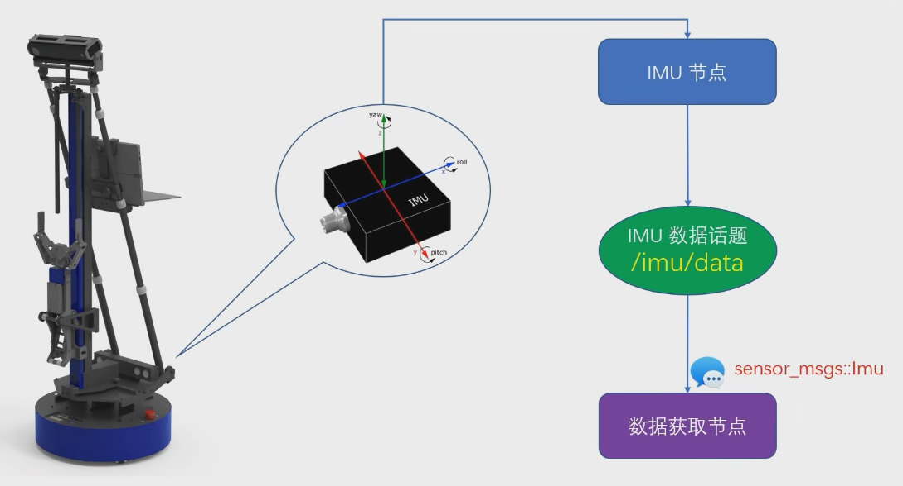

- 整个项目的实现步骤：
  - 我创建的包名叫imu_py_pkg，主要是为了区分前面的imu_pkg；

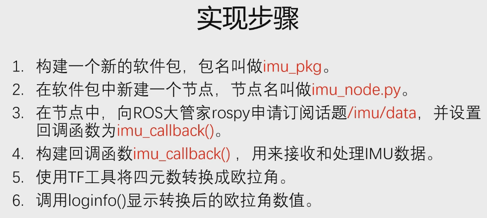


## 3.项目开发

- 创建软件包并编译：

```bash
cd catkin_ws/src

catkin_create_pkg imu_py_pkg roscpp rospy sensor_msgs

cd ..

catkin_make
```

- 新建节点：

  - 打开VsCode；

  - 在imu_py_pkg文件夹下，新建文件夹scripts，在此文件夹下新建文件imu_node.py；

- 编程文件：

```python
#!/usr/bin/env python3
#coding=utf-8

import rospy
from sensor_msgs.msg import Imu
from tf.transformations import euler_from_quaternion
import math

def imu_callback(msg):
    if msg.orientation_covariance[0] < 0:
        return
    
    quaternion = [
        msg.orientation.x,
        msg.orientation.y,
        msg.orientation.z,
        msg.orientation.w
    ]

    (roll, pitch, yaw) = euler_from_quaternion(quaternion)
    
    roll = roll*180/math.pi
    pitch = pitch*180/math.pi
    yaw = yaw*180/math.pi

    rospy.loginfo("滚转 = %.0f 俯仰 = %.0f 朝向 = %.0f", roll, pitch, yaw)

if __name__ == "__main__":
    rospy.init_node("imu_node")
    imu_sub = rospy.Subscriber("/imu/data", Imu, imu_callback, queue_size=10)
    rospy.spin()

```

- 添加可执行权限：

```bash
cd catkin_ws/src/imu_py_pkg/scripts

chmod +x imu_node.py

```

- 执行文件：

```bash
cd ~

roslaunch wpr_simulation wpb_simple.launch

# Ctrl+Shift+O分屏

rosrun imu_py_pkg imu_node.py

```

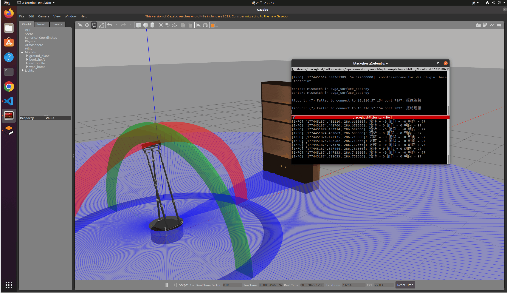

---


# 第三十一节课：IMU航向锁定的C++节点

## 1.项目框架与实现步骤

- 在原来节点的基础上，添加速度话题的发布，然后根据获取的姿态角调整机器人的朝向；

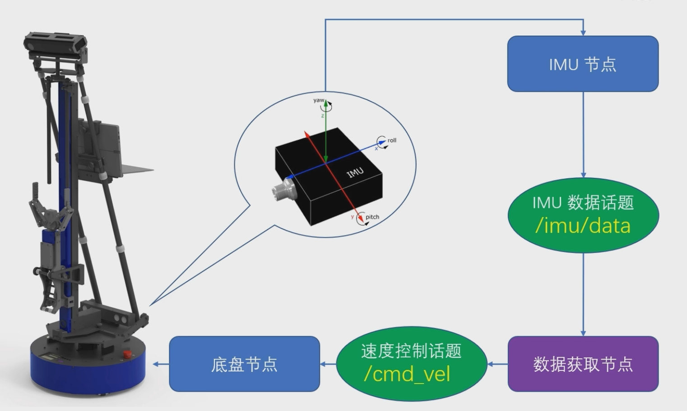

- 实现步骤：

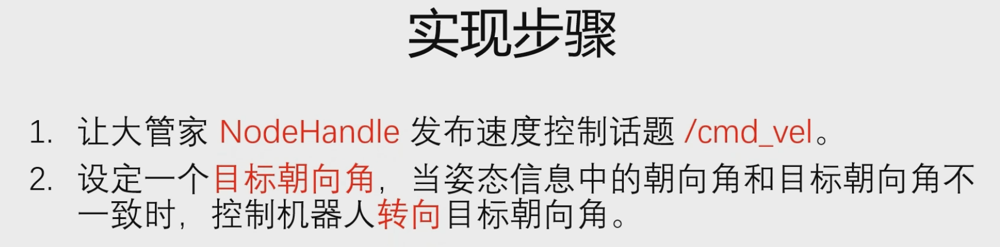


## 2.项目开发与编译运行

- 在原来的imu_pkg下的imu_node.cpp文件的基础上进行修改：
  - 加入了速度话题的发布；
  - 添加了PID参数的控制；

```cpp
#include "ros/ros.h"
#include "sensor_msgs/Imu.h"    // 引入消息包头文件
#include "tf/tf.h"              // 引入TF的头文件
#include "geometry_msgs/Twist.h"

ros::Publisher vel_pub;

void IMUCallback(sensor_msgs::Imu msg)
{
    if(msg.orientation_covariance[0] < 0)   // 协方差矩阵判断数据是否有效
        return;
    tf::Quaternion quaternion(          // 将消息包四元数转换为TF的四元数对象
        msg.orientation.x,
        msg.orientation.y,
        msg.orientation.z,
        msg.orientation.w
    );

    double roll, pitch, yaw;        // 用于存放欧拉角结果的变量

    // 将四元数对象转换为矩阵然后再调用API获取欧拉角
    tf::Matrix3x3(quaternion).getRPY(roll, pitch, yaw);
    
    //将弧度的欧拉角转换为角度的欧拉角
    roll = roll*180/M_PI;
    pitch = pitch*180/M_PI;
    yaw = yaw*180/M_PI;

    ROS_INFO("滚转 = %.0f 俯仰 = %.0f 朝向 = %.0f", roll, pitch, yaw);  // 显示欧拉角

    double target_yaw = 90;                     // 目标角度
    double diff_angle = target_yaw - yaw;       // PID的误差
    geometry_msgs::Twist vel_cmd;               // 速度变量
    vel_cmd.angular.z = diff_angle * 0.01;      // 误差控制PID
    vel_cmd.linear.x = 0.1;                     // 向前运动的速度
    vel_pub.publish(vel_cmd);                   // 发布速度话题

}

int main(int argc, char *argv[])
{
    setlocale(LC_ALL, "");
    ros::init(argc, argv, "imu_node");      // 注册节点

    ros::NodeHandle n;      // 创建大管家对象
    ros::Subscriber imu_sub = n.subscribe("/imu/data", 10, IMUCallback);    // 获取话题订阅对象

    vel_pub = n.advertise<geometry_msgs::Twist>("/cmd_vel", 10);

    ros::spin();

    return 0;
}

```

- 编译

  - Ctrl+Shift+B进行编译;

- 运行

  - 打开终端,运行仿真环境

  ```bash
  roslaunch wpr_simulation wpb_simple.launch
  ```

  - 运行节点

  ```bash
  rosrun imu_pkg imu_node
  ```

  - 最终运行效果如下所示：

  

---


# 第三十二节课：IMU航向锁定的Python节点

## 1.项目框架与实现步骤

- 项目框架与实现步骤与前一小节保持一致，只是把C++节点改为了Python节点；

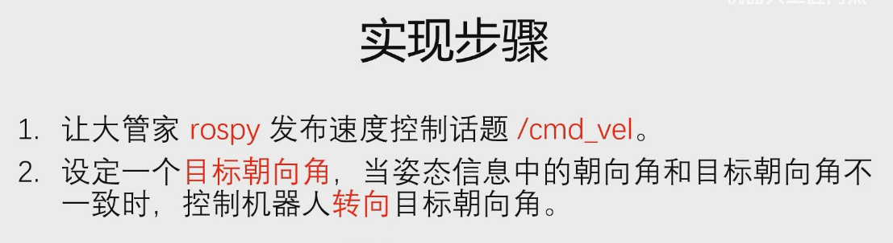


## 2.项目开发

- 在原来的imu_node.py文件的基础上进行修改：

```python
#!/usr/bin/env python3
#coding=utf-8

import rospy
from sensor_msgs.msg import Imu
from tf.transformations import euler_from_quaternion
import math
from geometry_msgs.msg import Twist

def imu_callback(msg):
    if msg.orientation_covariance[0] < 0:
        return
    
    quaternion = [
        msg.orientation.x,
        msg.orientation.y,
        msg.orientation.z,
        msg.orientation.w
    ]

    (roll, pitch, yaw) = euler_from_quaternion(quaternion)
    
    roll = roll*180/math.pi
    pitch = pitch*180/math.pi
    yaw = yaw*180/math.pi

    rospy.loginfo("滚转 = %.0f 俯仰 = %.0f 朝向 = %.0f", roll, pitch, yaw)

    target_yaw = 90
    diff_angle = target_yaw - yaw
    vel_cmd = Twist()
    vel_cmd.angular.z = diff_angle * 0.01
    vel_cmd.linear.x = 0.1
    global vel_pub
    vel_pub.publish(vel_cmd)

if __name__ == "__main__":
    rospy.init_node("imu_node")
    imu_sub = rospy.Subscriber("/imu/data", Imu, imu_callback, queue_size=10)
    vel_pub = rospy.Publisher("/cmd_vel", Twist, queue_size=10)
    rospy.spin()

```

- 运行环境和节点：

  - 运行环境：

  ```bash
  roslaunch wpr_simulation wpb_simple.launch
  ```

  - 运行节点：

  ```bash
  rosrun imu_py_pkg imu_node.py
  ```

  - 效果如下：

  

---


# 第三十三节课：标准消息包std_msgs

## 1.ROS中的消息包分类

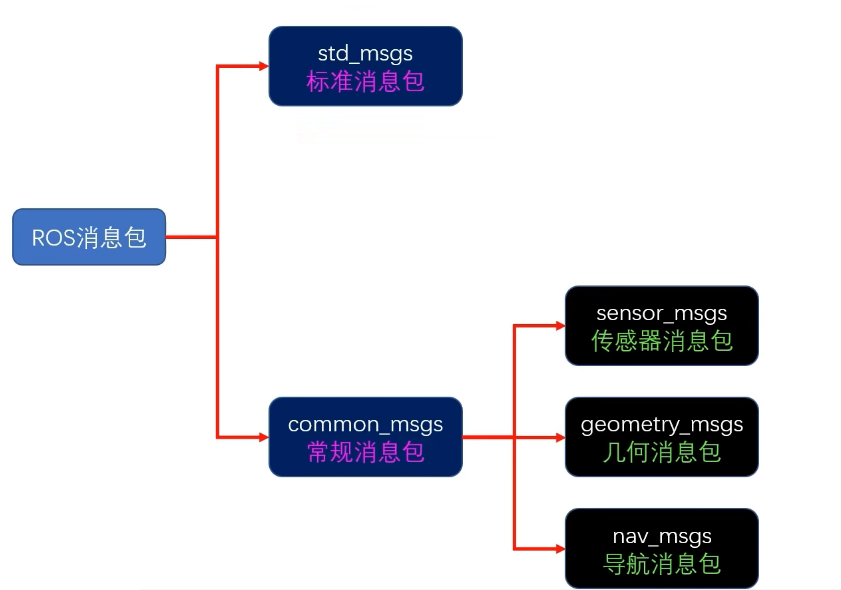


## 2.标准消息包std_msgs

- std_msgs中的数据类型可单独使用，像前面使用String那样；
- 也可以被其他消息包包含，构建更复杂的数据类型；

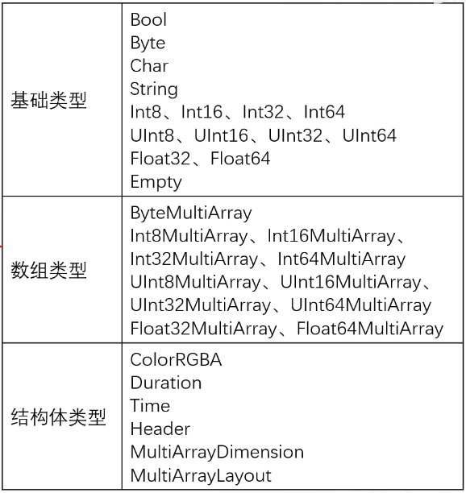

---


# 第三十四节课：几何消息包geometry_msgs和传感器消息包sensor_msgs

## 1.common消息包的组成

- 主要用到的就是前面使用过的geometry_msgs和sensor_msgs消息包；

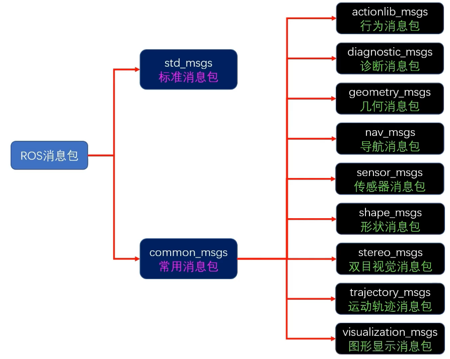

- 可以在ROS的官网中，搜索common_msgs，选择对应的版本，查看common_msgs消息包包含的内容
  - 官网中只列出了其中的五种消息包；

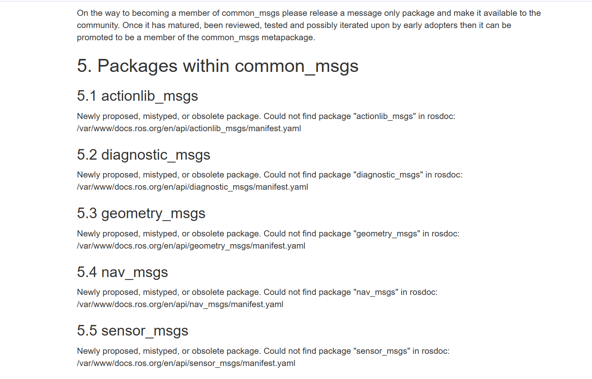


## 2.geometry_msgs几何消息包

- 带有Stamped字样的都会包含header，带有时间戳和坐标系ID信息；

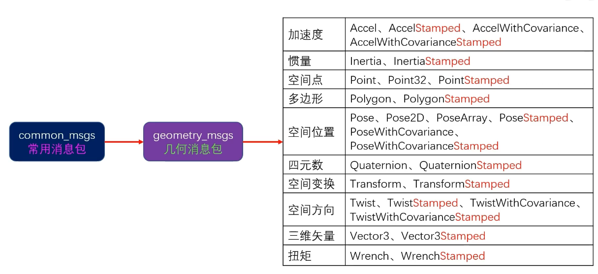


## 3.sensor_msgs传感器消息包

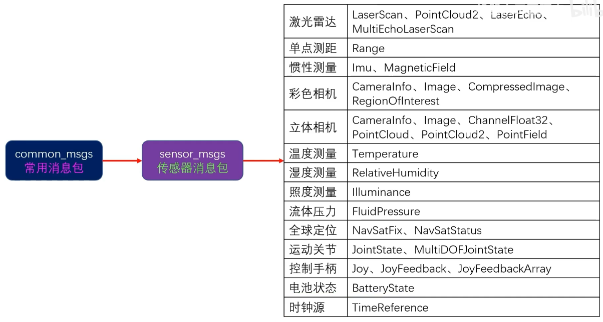

---


# 第三十五节课：自定义消息类型

## 1.自定义消息类型的必要性

- 在原来的“kuai_shang_che_kai_hei_qun”话题中，如果想要加上段位信息和星星数时，原来的string消息类型就无法满足了；
- 可以在原来的基础上添加这两个信息，然后组成一个新的消息类型；

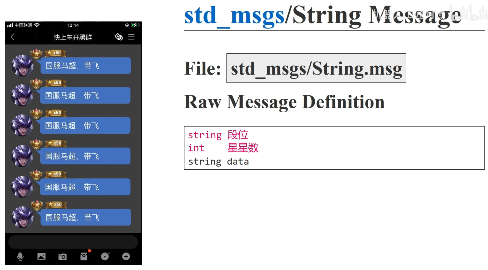


## 2.自定义消息类型的实现

- **创建消息包**
  - 消息包的本质也是一个包；
  - message_generation和message_runtime是消息包运行的依赖项；

```bash
cd ~/catkin_ws/src

catkin_create_pkg qq_msgs roscpp rospy std_msgs message_generation message_runtime
```

- **创建文件**
  - 创建完消息包后打开VsCode；
  - 在qq_msgs文件夹下创建文件夹msg，然后在该文件夹下创建文件Carry.msg文件；

- **可使用的基本消息类型**
  - 可以在原来的已经定义过的消息包的数据类型上无限套娃；

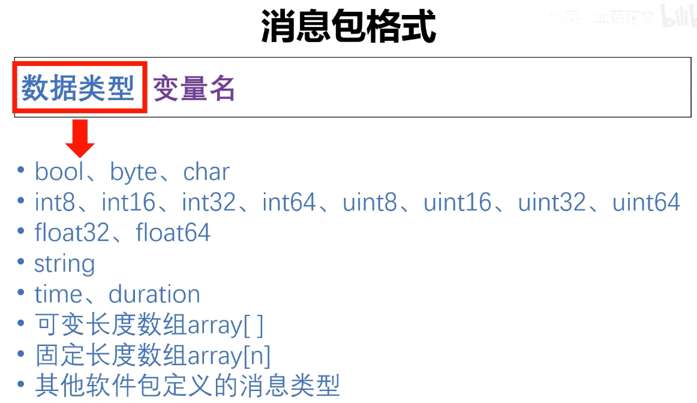

- **编程Carry.msg文件**
  - 按照前面消息包的数据要求：段位、星星数和要说的话，封装好消息类型数据；

```cpp
string grade
int64 star
string data
```

- **添加编译规则**

  - 编译规则1：
    - **将add_message_files中的字段添加已经定义的文件名称；**
    - **在generate_message字段中添加自己依赖的消息包；**

  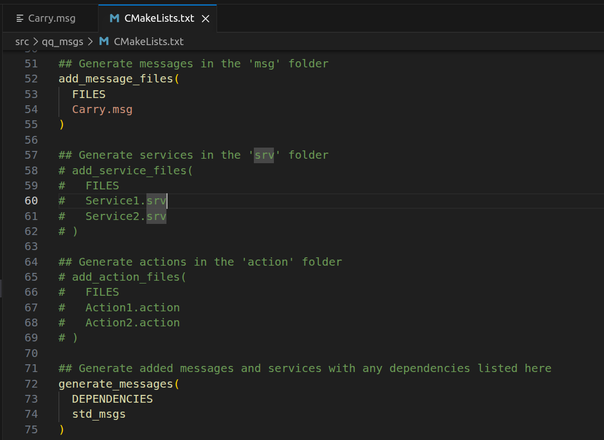

  - 编译规则2：
    - 找到catkin_package字段，将第三行解除注释，同时需要全部里面包含了message_runtime；

  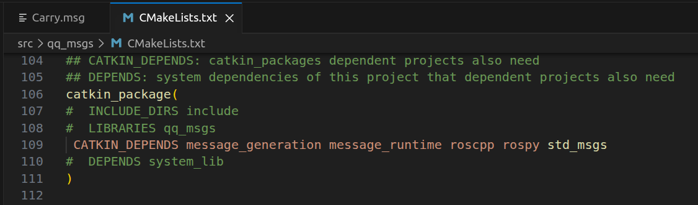

- **编辑package.xml文件**
  - 确保build_depend字段和exec_depend字段都包含了message_runtime和message_generation；
  - 如果没有就手动补全；

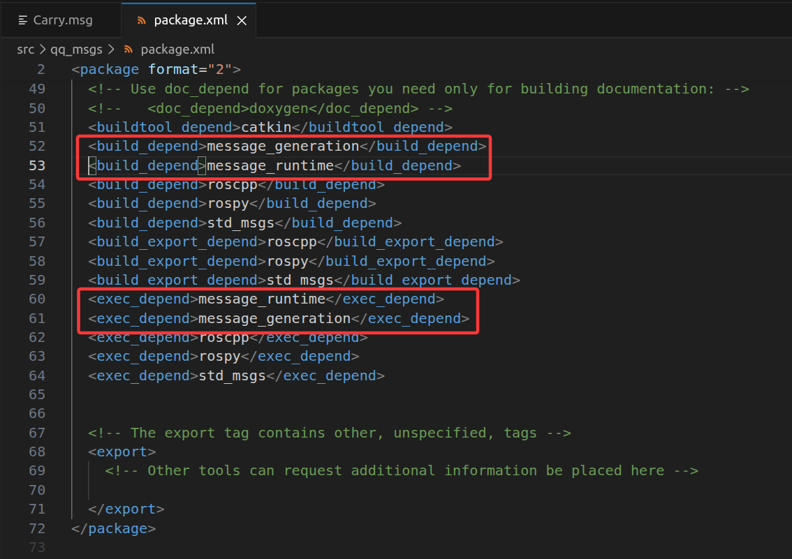

- **编译**

```bash
cd catkin_ws

catkin_make

```

- **验证是否创建成功**

```bash
cd catkin_ws

rosmsg show qq_msgs/Carry

```

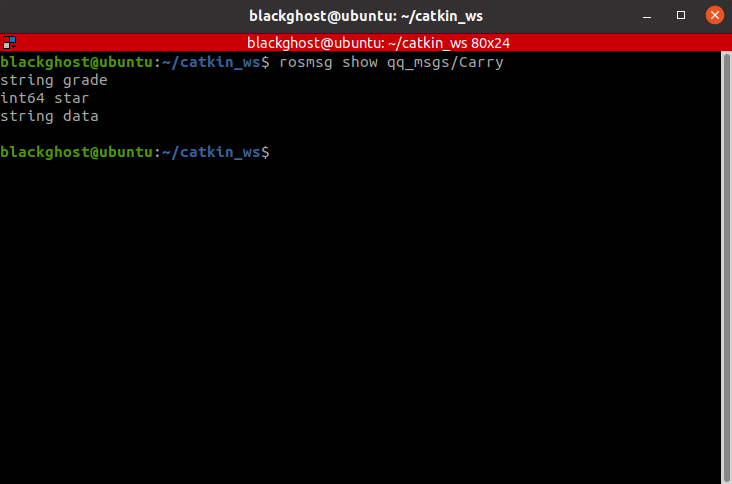


## 3.总结

- 总结生成自定义消息类型的步骤如下：

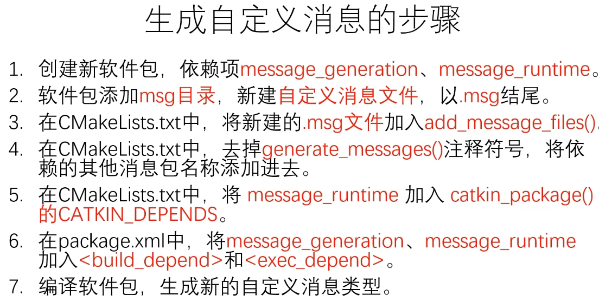

---


# 第三十六节课：自定义消息类型在C++节点中的应用

## 1.项目结构

- 在原来的那个实验（第十三十四节课）的基础上，将原来的std_msgs中的string类型改为自己的Carry类型；


## 2.项目开发

### 2.1 修改发布节点

- **修改发布者节点文件：**
  - 在原来的ssr_pkg下的src下的chao_node.cpp文件的基础上修改数据类型：

```cpp
#include <ros/ros.h>
#include <std_msgs/String.h>
#include <qq_msgs/Carry.h>

int main(int argc, char *argv[])
{
    /* code */
    ros::init(argc, argv, "chao_node");         // 初始化ROS核心
    printf("我的枪去而复返，你的生命有去无回\n");

    ros::NodeHandle nh;     // 创建一个ros中的NodeHandle类，这个类的节点的管家
    ros::Publisher pub = nh.advertise<qq_msgs::Carry>("kuai_shang_che_kai_hei_qun", 10);  // 创建一个发布话题

    ros::Rate loop_rate(10);    // ros的时间控制对象

    while(ros::ok())
    {
        printf("我要开始刷屏了！\n");
        qq_msgs::Carry msg;           // 定义一个Carry类型的消息
        msg.grade = "王者";
        msg.star = 50;
        msg.data = "国服马超，带飞";      // 赋值给消息
        pub.publish(msg);               // 发布消息
        loop_rate.sleep();              // 延时阻塞
    }
    return 0;
}

```

- **添加编译规则**

  - 添加find_package字段的软件包依赖，加入qq_msgs

  ```cpp
  find_package(catkin REQUIRED COMPONENTS
    roscpp
    rospy
    std_msgs
    qq_msgs
  )
  ```

  - 添加add_dependencies字段，指定先进行qq_msgs的编译；

  ```cpp
  target_link_libraries(chao_node
     ${catkin_LIBRARIES}
  )
  add_dependencies(chao_node qq_msgs_generate_messages_cpp)
  ```

- **修改.xml文件**

  - 同前面一样的，需要添加qq_msgs消息包的依赖

  ```xml
  <build_depend>qq_msgs</build_depend>
  <exec_depend>qq_msgs</exec_depend>
  ```

- **编译**

  - 回到终端中进行编译

  ```bash
  cd catkin_ws
  catkin_make
  ```

### 2.2 修改订阅者节点

- **修改订阅者节点文件**

  - 在原来的atr_pkg下的ma_chao.cpp文件的基础上修改回调函数的内容：

  ```cpp
  #include <ros/ros.h>
  #include <std_msgs/String.h>
  #include <qq_msgs/Carry.h>
  
  void chao_callback(qq_msgs::Carry msg)
  {
      ROS_WARN(msg.grade.c_str());
      ROS_WARN("%d 星", msg.star);
      ROS_INFO(msg.data.c_str());
  }
  
  void yao_callback(std_msgs::String msg)
  {
      ROS_WARN(msg.data.c_str());
  }
  
  int main(int argc, char *argv[])
  {
      setlocale(LC_ALL, "");
      ros::init(argc, argv, "ma_node");
  
      ros::NodeHandle nh;
      ros::Subscriber sub = nh.subscribe("kuai_shang_che_kai_hei_qun", 10, chao_callback);
  
      ros::Subscriber sub2 = nh.subscribe("gie_gie_dai_wo", 10, yao_callback);
      
      while(ros::ok())
      {
          ros::spinOnce();
      }
  
      return 0;
  }
  
  ```

- **添加编译规则**

  - 添加find_package字段的软件包依赖，加入qq_msgs

  ```cpp
  find_package(catkin REQUIRED COMPONENTS
    roscpp
    rospy
    std_msgs
    qq_msgs
  )
  ```

  - 添加add_dependencies字段，指定先进行qq_msgs的编译；

  ```cpp
  target_link_libraries(chao_node
     ${catkin_LIBRARIES}
  )
  add_dependencies(ma_node qq_msgs_generate_messages_cpp)
  ```

- **修改.xml文件**

  - 同前面一样的，需要添加qq_msgs消息包的依赖

  ```xml
  <build_depend>qq_msgs</build_depend>
  <exec_depend>qq_msgs</exec_depend>
  ```

- **编译**

  - 回到终端中进行编译

  ```bash
  cd catkin_ws
  catkin_make
  ```


## 3.运行项目

- 运行ROS核心

```BASH
roscore
```

- 运行发布节点

```bash
rosrun ssr_pkg chao_node
```

- 运行接收节点

```bash
rosrun atr_pkg ma_node
```

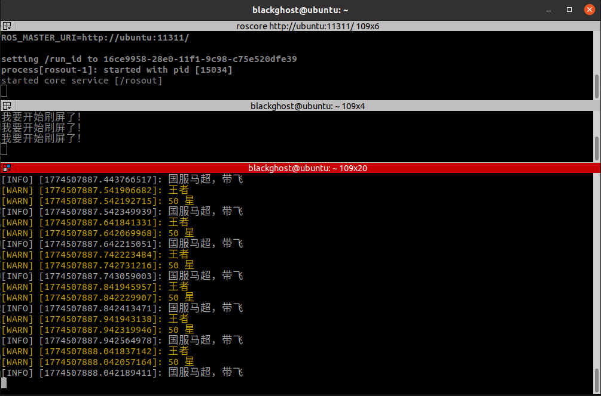


## 4.总结

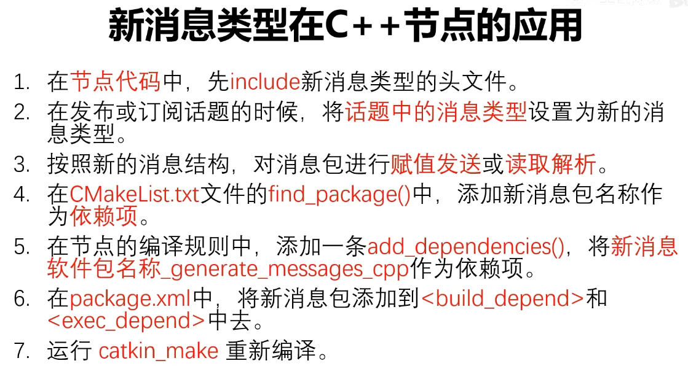

---


# 第三十七节课：自定义消息类型在Python节点中的应用

## 1.项目结构

- 同样的只是在原来的实验（第十六、十七节课）的基础上将消息类型改为我们自己的就可以了；

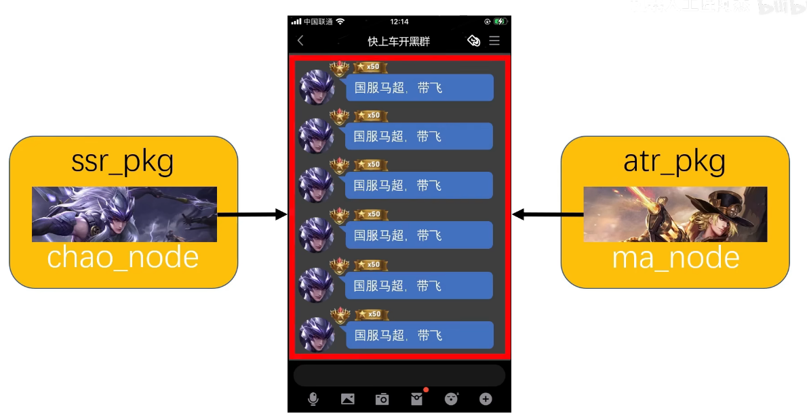


## 2.项目编程

### 2.1 修改发布节点

- **修改发布者节点文件：**
  - 在原来的ssr_py_pkg下的scripts下的chao_node.py文件的基础上修改数据类型：

```cpp
#!/usr/bin/env python3
#coding=utf-8

import rospy
from std_msgs.msg import String
from qq_msgs.msg import Carry

if __name__ == "__main__":
    rospy.init_node("chao_node")
    rospy.logwarn("我的枪去而复返，你的生命有去无回！")

    pub = rospy.Publisher("kuai_shang_che_kai_hei_qun", Carry, queue_size=10)

    rate = rospy.Rate(10)

    while not rospy.is_shutdown():
        rospy.loginfo("我要开始刷屏了")

        msg = Carry()
        msg.grade = "王者"
        msg.star = 50
        msg.data = "国服马超，带飞"
        pub.publish(msg)
        rate.sleep()

```

- **添加编译规则**

  - 添加find_package字段的软件包依赖，加入qq_msgs

  ```cpp
  find_package(catkin REQUIRED COMPONENTS
    rospy
    std_msgs
    qq_msgs
  )
  ```

- **修改.xml文件**

  - 同前面一样的，需要添加qq_msgs消息包的依赖

  ```xml
  <build_depend>qq_msgs</build_depend>
  <exec_depend>qq_msgs</exec_depend>
  ```

- **编译**

  - 回到终端中进行编译

  ```bash
  cd catkin_ws
  catkin_make
  ```

### 2.2 修改订阅者节点

- **修改订阅者节点文件**

  - 在原来的atr_pkg下的ma_chao.cpp文件的基础上修改回调函数的内容：

  ```cpp
  #!/usr/bin/env python3
  #coding=utf-8
  
  import rospy
  from std_msgs.msg import String
  from qq_msgs.msg import Carry
  
  def chao_callback(msg):
      rospy.logwarn(msg.grade)
      rospy.logwarn(str(msg.star)+'星')
      rospy.loginfo(msg.data)
  
  def yao_callback(msg):
      rospy.logwarn(msg.data)
  
  if __name__ == "__main__":
      rospy.init_node("ma_node")
  
      sub = rospy.Subscriber("kuai_shang_che_kai_hei_qun", Carry, chao_callback, queue_size=10)
  
      sub2 = rospy.Subscriber("gie_gie_dai_wo", Carry, yao_callback, queue_size=10)
  
      rospy.spin()
  
  ```

- **添加编译规则**

  - 添加find_package字段的软件包依赖，加入qq_msgs

  ```cpp
  find_package(catkin REQUIRED COMPONENTS
    rospy
    std_msgs
    qq_msgs
  )
  ```

- **修改.xml文件**

  - 同前面一样的，需要添加qq_msgs消息包的依赖

  ```xml
  <build_depend>qq_msgs</build_depend>
  <exec_depend>qq_msgs</exec_depend>
  ```

- **编译**

  - 回到终端中进行编译

  ```bash
  cd catkin_ws
  catkin_make
  ```


## 3.运行项目

- 运行ROS核心

```BASH
roscore
```

- 运行发布节点

```bash
rosrun ssr_py_pkg chao_node.py
```

- 运行接收节点

```bash
rosrun atr_py_pkg ma_node.py
```

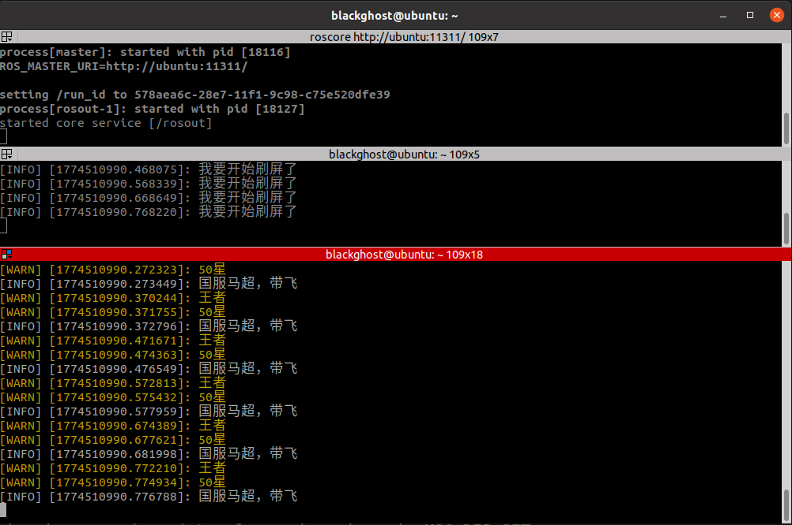


## 3.总结

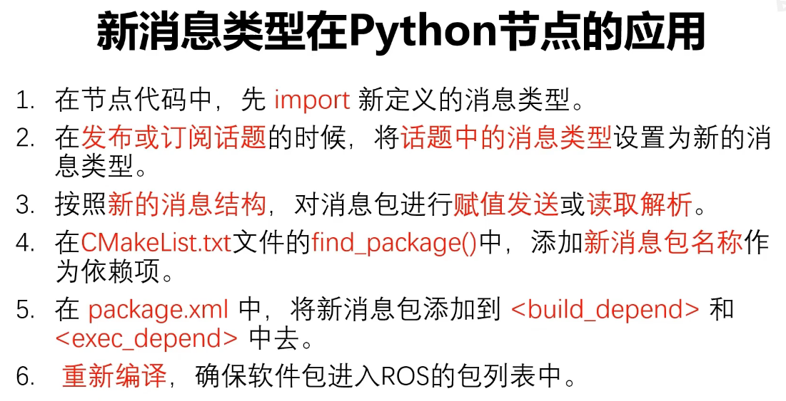

---


# 第三十八节课：栅格地图格式

## 1.机器人导航数据格式

- 机器人导航会用到**地图数据**；
- **ROS导航软件包**里有一个**map_server节点**，节点会发布一个**/map话题**，话题中的消息类型就是**地图数据**；
- 这个地图数据类型就是**nav_msgs下的OccupancyGrid**，即占据栅格；
- 每个格子中填入一个数值，表示障碍物的占据情况；

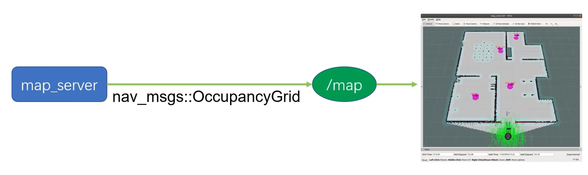

- 栅格地图数据类型是以**数组形式**存在的：
  - 栅格的大小决定了**地图的分辨率**；
  - ROS中栅格的大小默认是**0.05米**；

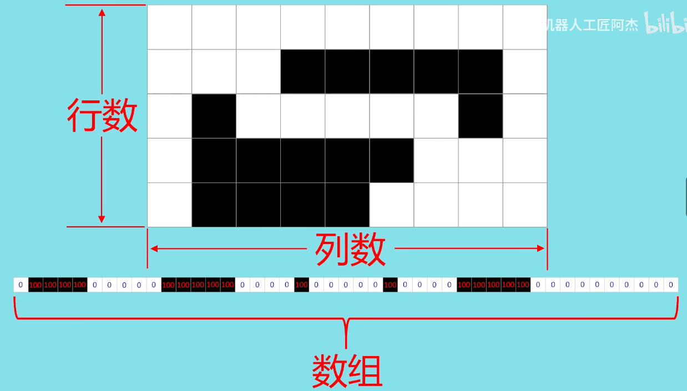


## 2.官网描述

- 搜索栏搜索**map_server**——>点击进入后点击Website——>在主页面中的目录中选择**Published Topics**——>选择nav_msgs/OccupancyGrid：

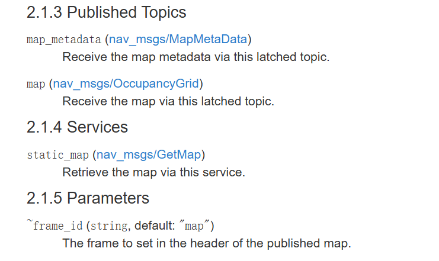

- **av_msgs/OccupancyGrid消息类型内容**

  - **header：记录了时间戳和坐标系ID；**

  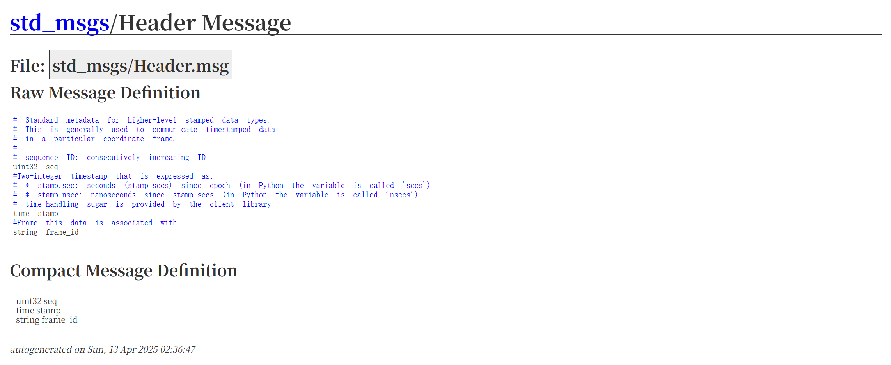

  - **info：记录了地图的参数信息；**

  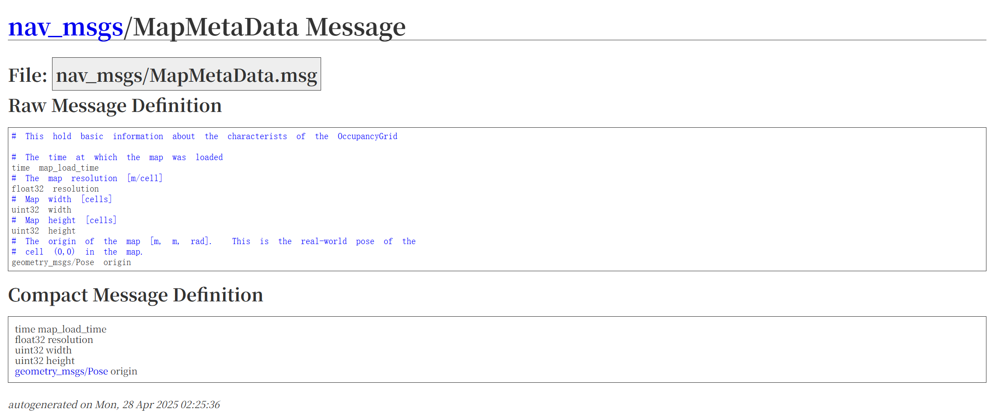

  - **data：8位整型的数组，栅格位置的（0, 0）指的是左下角的位置；**

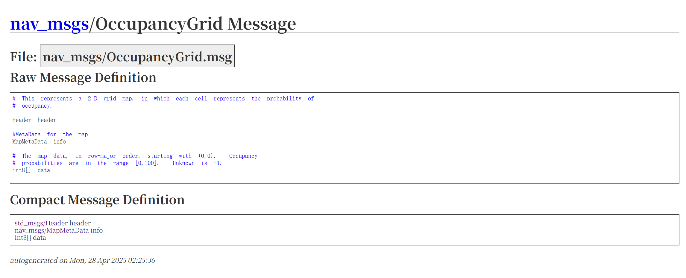

---


# 第三十九节课：C++节点发布地图

## 1.项目结构

- 项目结构：
  - 自己用C++创建一个地图发布节点；
  - 在地图发布节点中发布一个/map话题；
  - 话题的消息类型就是nav_msgs::OccupancyGrid；


- 要实现的地图如下：


- 可将实现步骤总结如下：

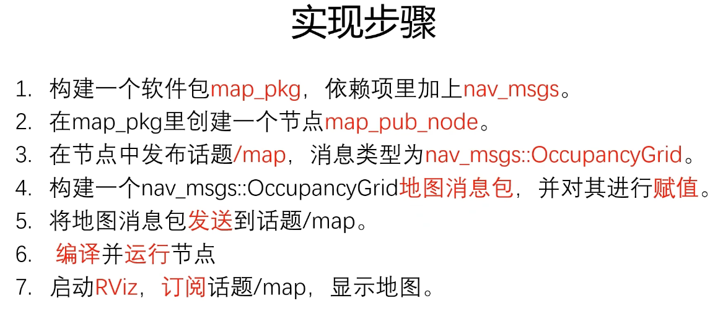


## 2.项目开发

- **创建软件包：**

```bash
cd catkin_ws/src

catkin_create_pkg map_pkg roscpp rospy nav_msgs
```

- **创建节点：**
  - 打开VsCode；
  - 在map_pkg/src目录创建节点文件：map_pub_node.cpp；

- **文件编程：**

  - 在map_pub_node.cpp文件中编程：

  ```cpp
  #include <ros/ros.h>
  #include <nav_msgs/OccupancyGrid.h>     // 引入消息类型
  
  int main(int argc, char *argv[])
  {
      ros::init(argc, argv, "mao_pub_node");  // 注册节点
      ros::NodeHandle n;
      ros::Publisher pub = n.advertise<nav_msgs::OccupancyGrid>("/map", 10);  //获取发布对象
  
      ros::Rate r(1); // 速率控制对象
  
      while(ros::ok())
      {
          nav_msgs::OccupancyGrid msg;    // 定义发布消息变量
  
          // 赋值消息变量的header数据
          msg.header.frame_id = "map";
          msg.header.stamp = ros::Time::now();
  
          // 赋值消息变量的info数据
          msg.info.origin.position.x = 0;
          msg.info.origin.position.y = 0;
          msg.info.resolution = 1.0;
          msg.info.width = 4;
          msg.info.height = 2;
  
          // 赋值消息变量的data数据
          msg.data.resize(4*2);
          msg.data[0] = 100;
          msg.data[1] = 100;
          msg.data[2] = 0;
          msg.data[3] = -1;
  
          pub.publish(msg);   // 发布消息数据
          r.sleep();
      }
      return 0;
  }
  
  ```

- **添加编译规则：**

  - 在CMakeList.txt文件中添加如下内容：

  ```CPP
  add_executable(map_pub_node src/map_pub_node.cpp)
  target_link_libraries(map_pub_node
    ${catkin_LIBRARIES}
  )

- **编译：**

  - 在终端中执行：

  ```bash
  cd catkin_ws
  catkin_make
  ```

- **运行：**

  - 先在终端启动ROS：

  ```bash
  roscore
  ```

  - 运行节点：

  ```bash
  rosrun map_pkg map_pub_node
  ```

  - 运行RViz：

  ```bash
  rviz
  ```

- **配置RViz来查看效果：**

  - 确定世界坐标系的原点位置：
    - 点击Add——>选择Axes——>OK——>出现一个标识的位置——>这个位置就是世界坐标系的原点；
  - 添加地图显示：
    - 点击Add——>选择Map——>将Map的话题名称选择为/map——>显示出地图；

  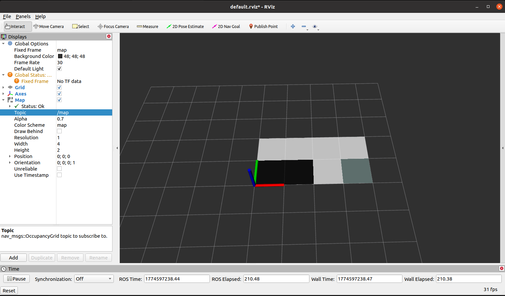

- **参数验证：**
  - 在上一节介绍消息类型时，info数据的最后一个内容是地图远点和世界坐标系的偏移量；
  - 在程序中设置的是0、0，所以在仿真结果中世界坐标系的原点和我们的栅格地图的左下角是重合的；

---


# 第四十节课：Python节点发布地图

## 1.项目结构

- 项目结构：
  - 自己用Python创建一个地图发布节点；
  - 在地图发布节点中发布一个/map话题；
  - 话题的消息类型就是nav_msgs::OccupancyGrid；

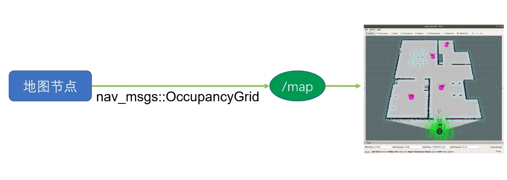

- 要实现的地图如下：


- 可将实现步骤总结如下：
  - 为了区别前面的map_pkg，这里创建**map_py_pkg**；

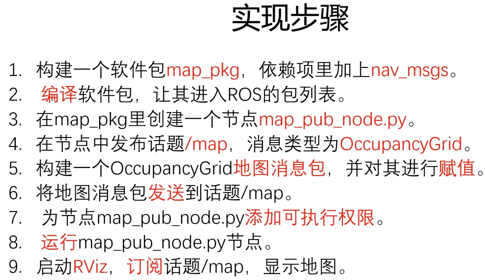


## 2.项目开发

- **创建软件包：**

```bash
cd catkin_ws/src

catkin_create_pkg map_py_pkg roscpp rospy nav_msgs

cd ..

catkin_make

```

- **创建节点：**
  - 打开VsCode，在map_py_pkg下创建新文件夹scripts；
  - 在scripts目录创建节点文件：map_pub_node.py；

- **文件编程：**

  - 在map_pub_node.py文件中编程：

  ```cpp
  #!/usr/bin/env python3
  # coding=utf-8
  
  import rospy
  from nav_msgs.msg import OccupancyGrid  # 引入消息类型
  
  if __name__ == "__main__":
      rospy.init_node("map_pub_node") # 注册节点
  
      pub = rospy.Publisher("/map", OccupancyGrid, queue_size=10) # 获取发布对象
  
      rate = rospy.Rate(1)
  
      while not rospy.is_shutdown():
          msg = OccupancyGrid()   # 定义发布数据变量
  
          # 赋值header数据
          msg.header.frame_id = "map"
          msg.header.stamp = rospy.Time.now()
  
          # 赋值info数据
          msg.info.origin.position.x = 0
          msg.info.origin.position.y = 0
          msg.info.resolution = 1.0
          msg.info.width = 4
          msg.info.height = 2
  
          # 赋值data数据
          msg.data = [0]*4*2
          msg.data[0] = 100
          msg.data[1] = 100
          msg.data[2] = 0
          msg.data[3] = -1
  
          pub.publish(msg)    # 发布数据
          rate.sleep()
  
  ```

- **添加可执行权限：**

  - 在终端中执行如下内容：

  ```bash
  cd catkin_ws/src/map_py_pkg/scripts
  
  chmod +x map_pub_node.py
  ```

- **运行：**

  - 先在终端启动ROS：

  ```bash
  roscore
  ```

  - 运行节点：

  ```bash
  rosrun map_py_pkg map_pub_node.py
  ```

  - 运行RViz：

  ```bash
  rviz
  ```

- **配置RViz来查看效果：**

  - 确定世界坐标系的原点位置：
    - 点击Add——>选择Axes——>OK——>出现一个标识的位置——>这个位置就是世界坐标系的原点；
  - 添加地图显示：
    - 点击Add——>选择Map——>将Map的话题名称选择为/map——>显示出地图；

  

- **参数验证：**
  - 在上一节介绍消息类型时，info数据的最后一个内容是地图远点和世界坐标系的偏移量；
  - 在程序中设置的是0、0，所以在仿真结果中世界坐标系的原点和我们的栅格地图的左下角是重合的；

---


# 第四十一节课：什么是SLAM

## 1.SLAM的应用

- 在ROS中，栅格地图是通过SLAM生成的；

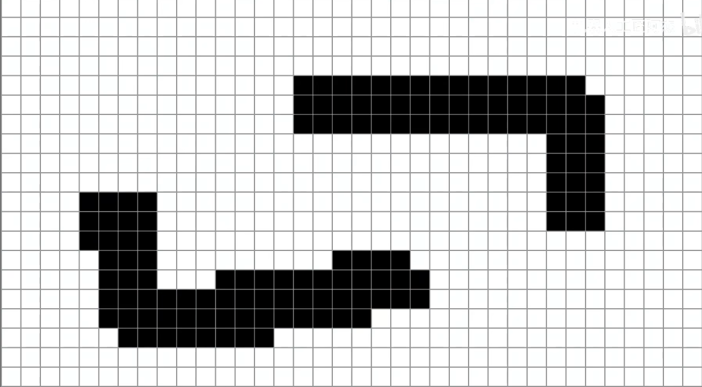


## 2.SLAM的简介

- SLAM的全称：**Simultaneous Localization And Mapping**，即同时定位与地图创建；
- **定位：Localization**
  - 在整个过程中完成了对主体的移动轨迹的定位问题；

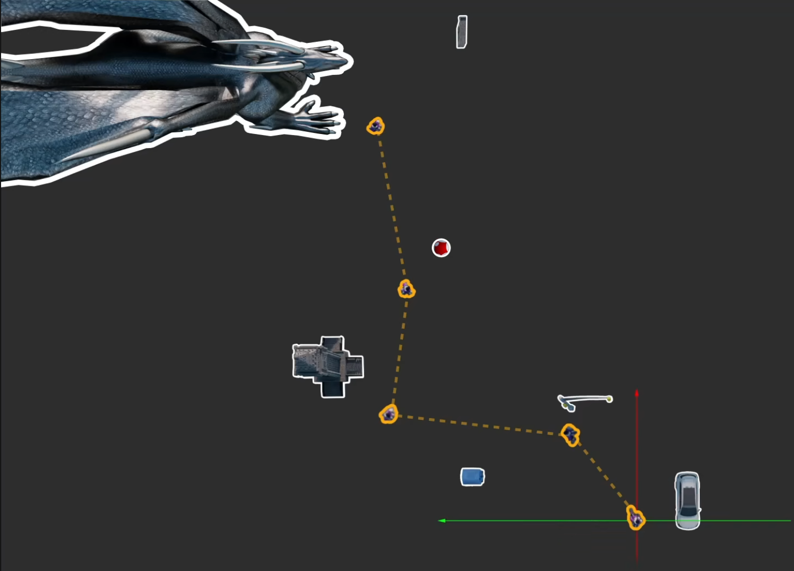

- **建图：Mapping**
  - 在整个过程中同时完成了对周围环境的建图过程；

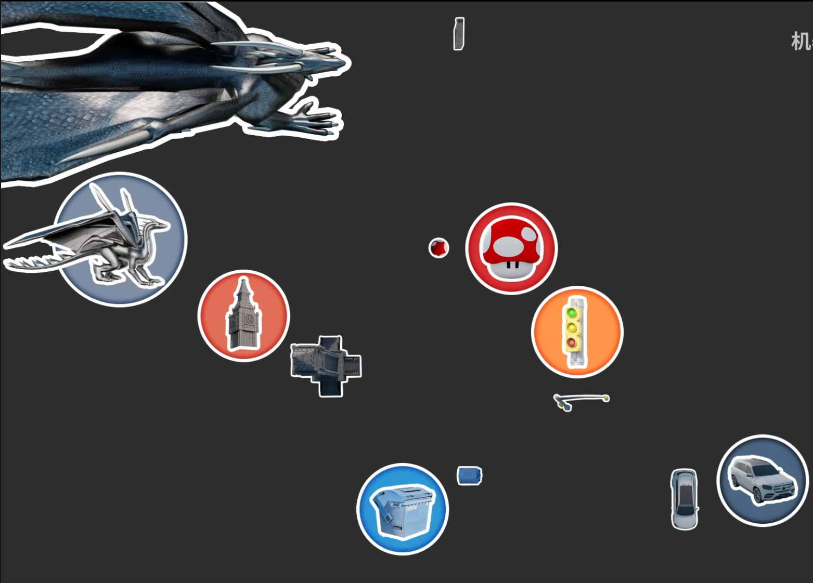


## 3.激光SLAM

- 激光SLAM使用栅格地图，初始状态下全部栅格均为未知状态，值为-1：

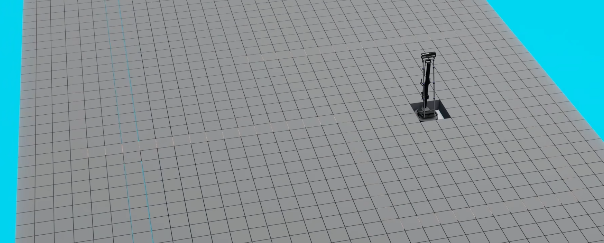

- 激光雷达开始扫描，当遇到障碍物时标为100，没有障碍物则标为0：

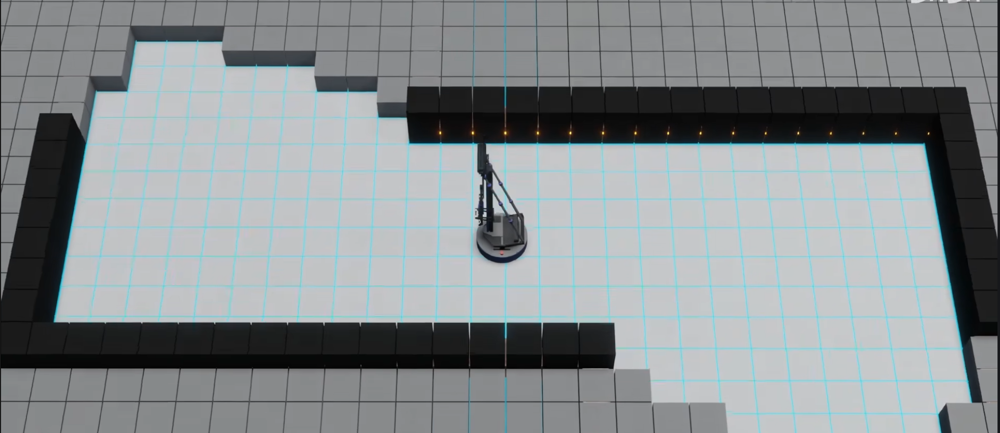

- 机器人不断运动，在新的位置得到新的栅格地图，不同栅格地图进行基于障碍物栅格的排布形状的拼图组合：

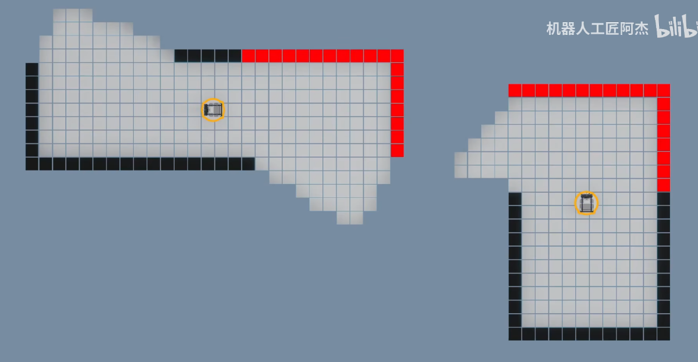

- 不断进行激光雷达扫描，最后得到整个地图，其中探明的区域为0、障碍物区域为100、未知区域为-1：

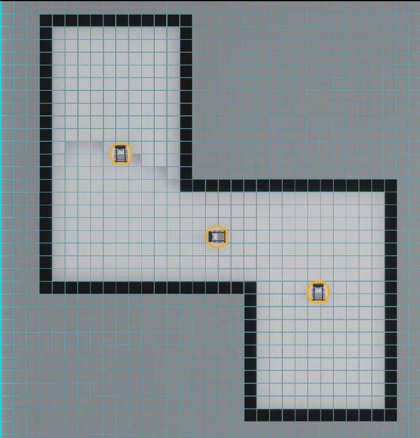

---


# 第四十二节课：Hector_Mapping初体验

## 1.项目结构

- 在前面已经实现了**激光雷达数据话题/scan的订阅**；
- 在前面中也实现了**栅格地图话题/map的订阅**；
- 现在要做的就是在原来的节点上添加上**SLAM算法**，将激光雷达数据通过算法转换为栅格地图即可；
- 从零编写一套SLAM算法是困难的，我们可以利用开源的SLAM算法完成项目，那就是**Hector_Mapping**；

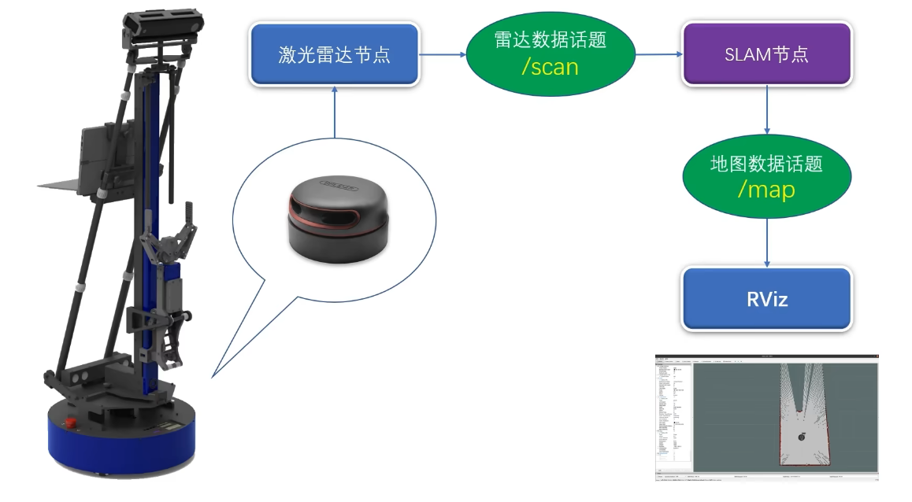


## 2.Hector_Mapping的介绍

- **官网中搜索hector_mapping——>noetic——>进入Website页面——>拉到ROS API部分**；
- Hector_Mapping的输入输出：
  - **输入：**
    - scan话题(sensor_msgs/LaserScan)：即激光雷达数据话题；
    - syscommand画图(std_msgs/String)：主要用于响应reset这类重新建图的系统指令；
  - **输出：**
    - map_metadata话题(nav_msgs/MapMetadata)：类似于前面的栅格地图消息格式中的header和info数据内容，即地图的描述信息；
    - map话题(nav_msgs/OccupancyGrid)：真正的地图数据；
    - slam_out_pose话题：原始的机器人定位信息；
    - poseupdate话题：矫正后的机器人定位信息；

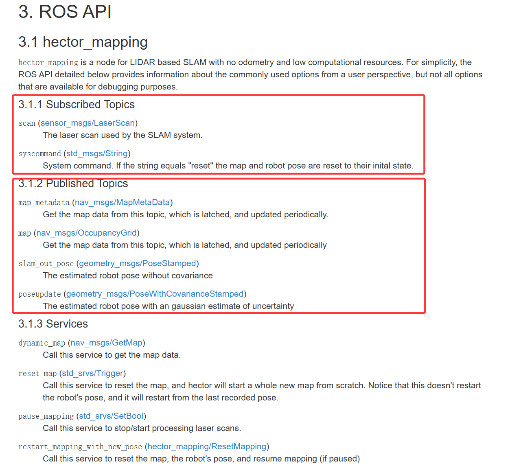


## 3.初次体验Hector_Mapping

- **安装Hector_Mapping：**

  - 终端中输入如下指令：（如果之前安装了wpr_simulation的话会将它一起下载）

  ```bash
  sudo apt install ros-noetic-hector-mapping
  ```

- **启动仿真环境：这是一个专门用于建图的环境**

  - 终端中执行：

  ```bash
  roslaunch wpr_simulation wpb_stage_slam.launch
  ```

  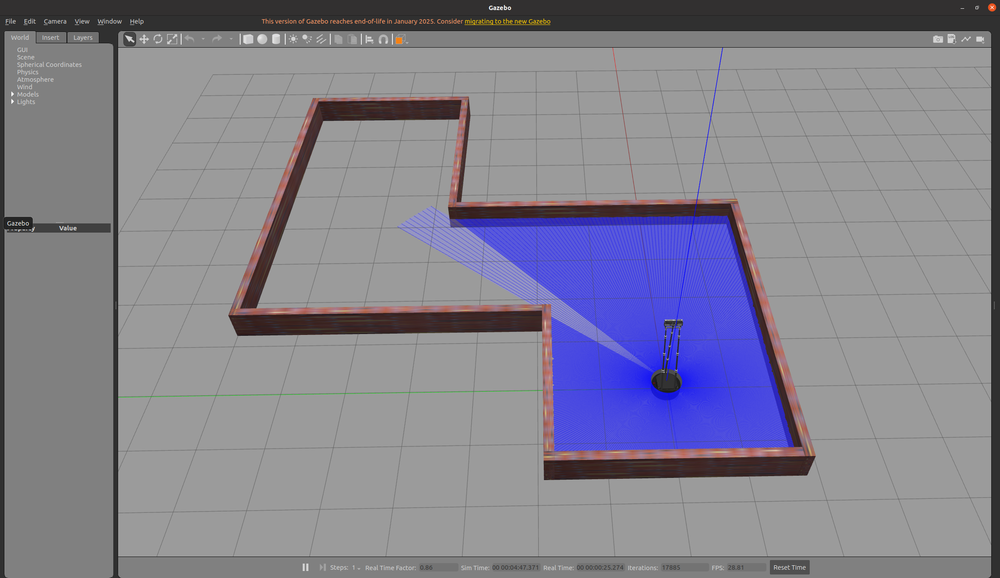

- **运行SLAM节点：**

  - 终端中执行：

  ```bash
  rosrun hector_mapping hector_mapping
  ```

- **运行RViz查看地图：**

  - 终端中执行：

  ```bash
  rosrun rviz rviz
  ```

- **设置RViz查看数据：**

  - 添加机器人模型：Add——>RobotModle；
  - 添加激光雷达的扫描测距点：Add——>LaserScan——>Topic选择/scan；
  - 添加地图：Add——>Map——>Topic选择/map；

  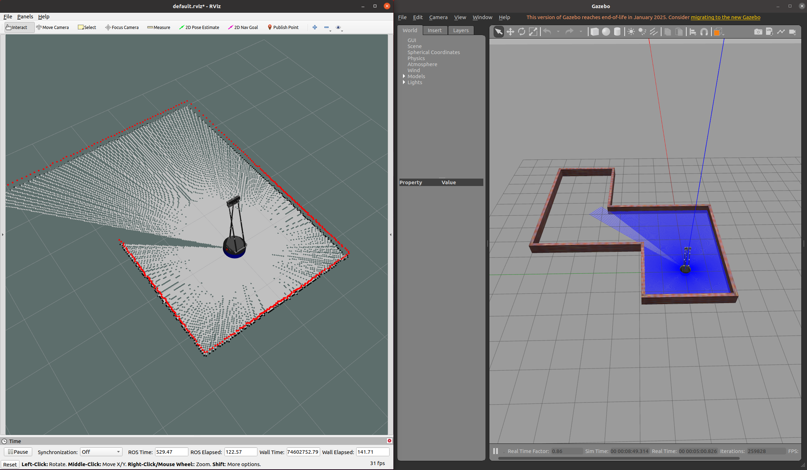

- **运行速度控制，让机器人不断运动并扫描建图：**

  - 终端运行：

  ```bash
  rosrun rqt_robot_steering rqt_robot_steering
  ```

- **最终运行效果如图所示：**

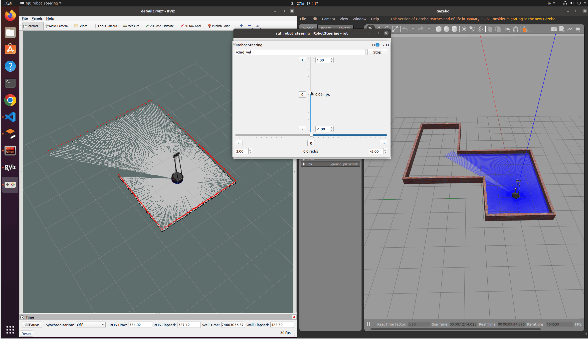

---


# 第四十三节课：launch启动Hector_Mapping

## 1.前情回顾

- 在上一小节中，实现了SLAM算法；
- 但是需要使用4条指令，非常麻烦；
- 这一节课尝试写一个launch文件，来一次性启动这个SLAM算法；


## 2.项目开发

- **创建存放launch文件的软件包：**

  - 在终端中执行：

  ```bash
  cd catkin_ws/src
  
  catkin_create_pkg slam_pkg roscpp rospy std_msgs
  
  ```

- **新建文件：**

  - 进入VsCode；
  - 在slam_pkg文件夹下，创建子文件夹launch；
  - 在该文件夹下新建文件hector.launch；

- **编程文件：**

  - 在hector.launch文件下写入如下内容：
  - 注意第一行的在launch文件中执行另外一个launch文件的写法；

  ```xml
  <launch>
  
      <include file="$(find wpr_simulation)/launch/wpb_stage_slam.launch"/>
  
      <node pkg="hector_mapping" type="hector_mapping" name="hector_mapping"/>
  
      <node pkg="rviz" type="rviz" name="rviz"/>
  
      <node pkg="rqt_robot_steering" type="rqt_robot_steering" name="rqt_robot_steering"/>
  
  </launch>
  
  ```

- **编译软件包：让hector.launch文件进入ROS的软件包**

  - 终端中执行：

  ```bash
  cd catkin_ws
  catkin_make
  ```

- **运行launch文件：**

  - 终端执行下面指令，就可以一下子打开四个终端了；

  ```bash
  roslaunch slam_pkg hector.launch
  ```

- **保存RViz配置文件：**

  - 在每次打开RViz中时都需要从零配置一遍，很麻烦；
  - **可以将配置保存成文件形式，然后在launch文件中指定启动时加载的配置文件，就可以不用配置了**；
  - 按上一节的选项配置好RViz；
  - 然后选择File——>Save Config As——>**选择在slam_pkg目录下创建一个rviz文件夹**——>在该文件夹下保存配置文件为**slam.rviz**；

- **重新启动RViz：**

  - 关闭RViz；
  - 然后在终端执行下面指令，即可直接配置好RViz；

  ```bash
  rosrun rviz rviz -d ~/catkin_ws/src/slam_pkg/rviz/slam.rviz
  ```

  - 在launch文件中指定配置文件：

  ```xml
  <launch>
  
      <include file="$(find wpr_simulation)/launch/wpb_stage_slam.launch"/>
  
      <node pkg="hector_mapping" type="hector_mapping" name="hector_mapping"/>
  
      <node pkg="rviz" type="rviz" name="rviz" args="-d $(find slam_pkg)/rviz/slam.rviz"/>
  
      <node pkg="rqt_robot_steering" type="rqt_robot_steering" name="rqt_robot_steering"/>
  
  </launch>
  
  ```

- **重新运行launch文件：**

  - 在终端执行：

  ```bash
  roslaunch slam_pkg hector.launch
  ```

- **文件兼容：**

  - **在后续的开发中，如果机器人变成了真实机器人，只需要将launch文件的第一句修改为启动实体机器人激光雷达和底盘控制的launch文件即可；**
  - **或者只启动激光雷达，然后自己手动推着机器人建图也是可以的；**

---


# 第四十四节课：Hector_Mapping的参数设置

## 1.Hector_Mapping的参数

- 在官网的Website页面中，翻到3.1.4小节，即可看到所有的参数；
- 首先关注三个参数：
  - **map_update_distance_thresh**：更新的距离；
  - map_update_angle_thresh：更新的角度；
  - map_pub_period：更新的时间；

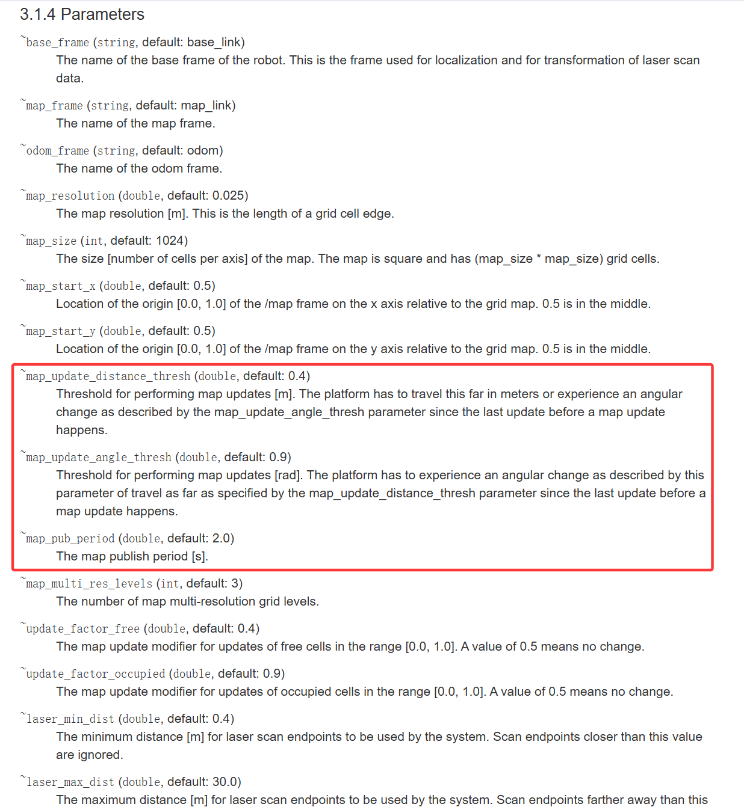


## 2.修改launch文件

- 在原来的launch文件中修改：

```xml
<launch>

    <include file="$(find wpr_simulation)/launch/wpb_stage_slam.launch"/>

    <node pkg="hector_mapping" type="hector_mapping" name="hector_mapping">
        <param name="map_update_distance_thresh" value="0.1"/>
        <param name="map_update_angle_thresh" value="0.1"/>
        <param name="map_pub_period" value="0.1"/>
    </node>

    <node pkg="rviz" type="rviz" name="rviz" args="-d $(find slam_pkg)/rviz/slam.rviz"/>

    <node pkg="rqt_robot_steering" type="rqt_robot_steering" name="rqt_robot_steering"/>

</launch>

```


## 3.启动两个机器人查看差异

- 在上面修改参数后，看起来SLAM建模并没有快多少；
- 可以运行wpr_simulation中的wpb_hector_comparison.launch文件来查看差异；
- 可修改文件中的参数，让两者看起来更明显；
- 终端中运行：

```bash
roslaunch wpr_simulation wpb_hector_comparison.launch
```

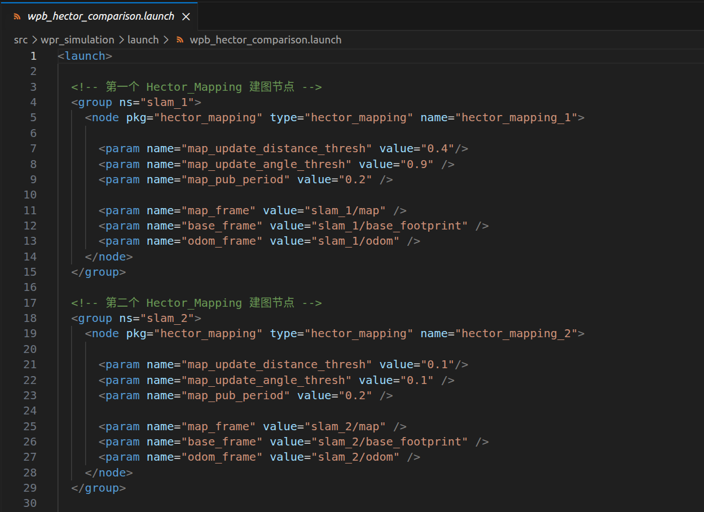

---


# 第四十五节课：初始ROS的TF系统

## 1.前情回顾

- 在前面的SLAM中，已经可以获得了栅格地图数据；
- 但SLAM除了栅格地图数据之外，还应该有定位数据；


## 2.定位数据的描述

- **为了确定定位信息，需要确定两个坐标系：**

  - map坐标系：是父坐标系，原点在机器人的起始位置，坐标系遵循右手法则；
  - base_frrtprint坐标系：是子坐标系，原点在机器人的底盘中心，也遵循右手法则；

- **定位信息就是描述两个坐标系的相对关系：**

  - **距离关系：**
    - 需要确定子坐标系相对于父坐标系的X、Y、Z轴的距离偏移量；
    - 由于地面机器人无法在Z轴上移动，所以一般Z=0；

  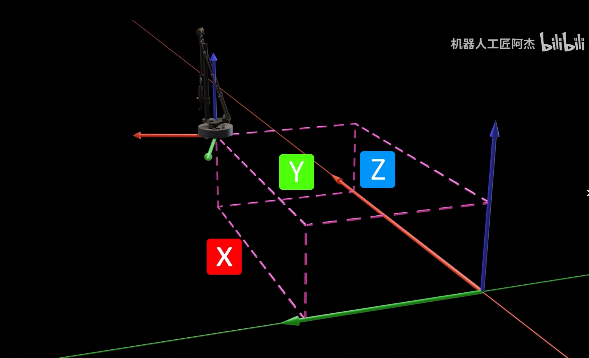

  - **角度关系：**
    - 还需要确定子坐标系相对于父坐标系的X、Y、Z轴的角度偏移量；
    - 由于地面机器人没有俯仰运动和滚转运动，所以一般X=Y=0，即只有绕着Z轴的角度偏移量；

  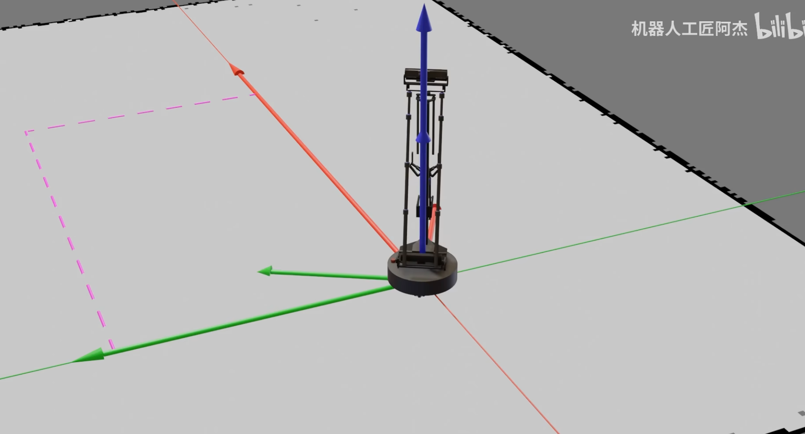

- **描述定位的数据格式：**

  - 由前面讨论可知，可以用子坐标系相对于父坐标系的X、Y、Z轴的距离分量和角度分量，一共六个量描述定位信息；
  - 由于地面机器人只能在地面运动，最后就退化为了只需要**X、Y轴的距离分量和Z轴的角度分量**；

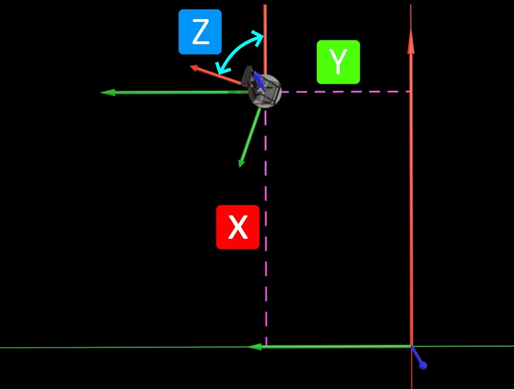


## 3.TF系统

### 3.1 TF系统的基本介绍

- Transform的缩写，描述两个坐标系的相对关系，可理解为**坐标系变换**；

### 3.2 ROS中的TF关系

- 在ROS中，会存在一个**TF发布节点，它会发布一个/tf话题**；
- 其他节点可以订阅该话题，获得TF数据；
- **在RViz中，能够显示定位信息就是因为它订阅了/tf话题**；

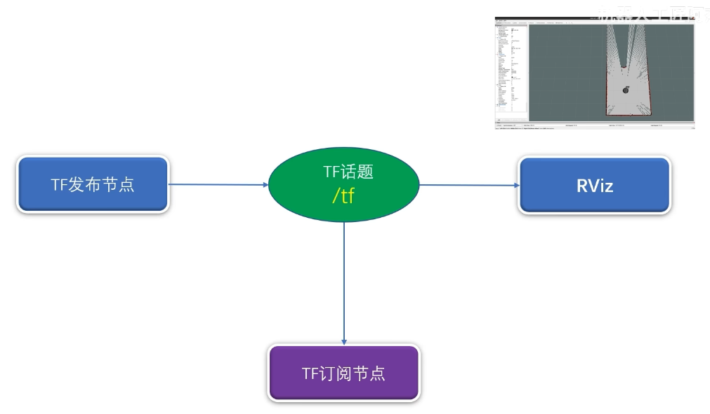

### 3.3 在RViz中查看TF系统

- **在终端中先运行SLAM建图程序：**

```bash
roslaunch wpr_simulation wpb_hector.launch
```

- **添加TF显示项目：**
  - 在RViz中添加TF系统 ：Add——>TF；
  - 修改坐标系的大小：展开TF——>Marker Scale——>5；
  - 修改显示的坐标系：展开TF——>Frames——>只选择base_footprint和map；

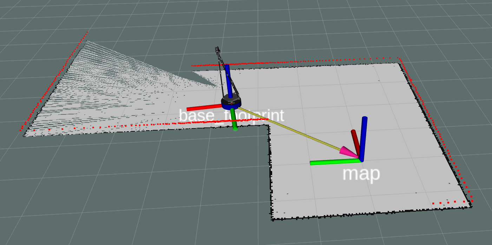

### 3.4 TF的数据格式

- **查看话题：**
  - 在新终端中执行：可以看到**/tf话题；**

```bash
rostopic list
```

- **查看/tf话题的数据格式：**
  - 终端执行下面指令，输出为**tf2_msgs/TFMessage**

```bash
rostopic type /tf
```

- **官网查看具体的数据格式：**

  - 官网搜索**tf2_msgs**，可见是一个**TransformStamped类型的transform数组；**

  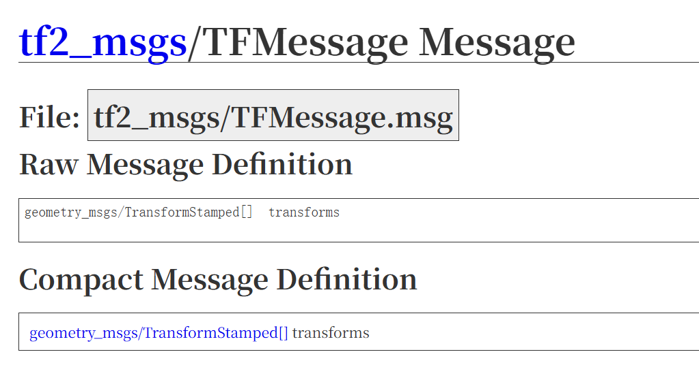

  - **TransformStamped类型**
    - 包含了header、child_frame_id和transform三个数据；
    - header中包含了父坐标系的名称frame_id；
    - child_frame_id就是子坐标系的名称；
    - transform数据中包含了距离变量和角度变量的四元数；

  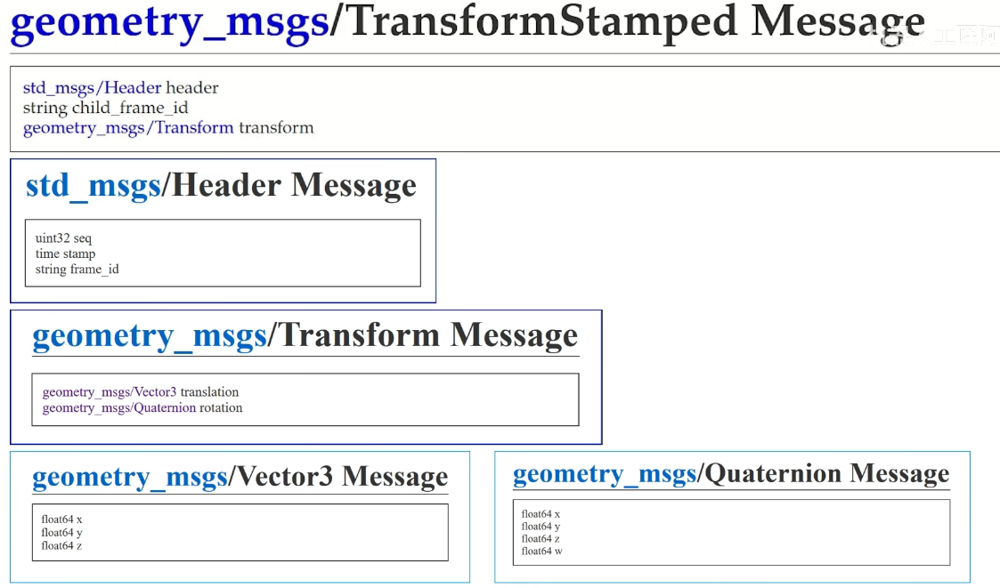

### 3.5 查看TF的具体内容

- **终端中执行：**

```bash
rostopic echo /tf
```

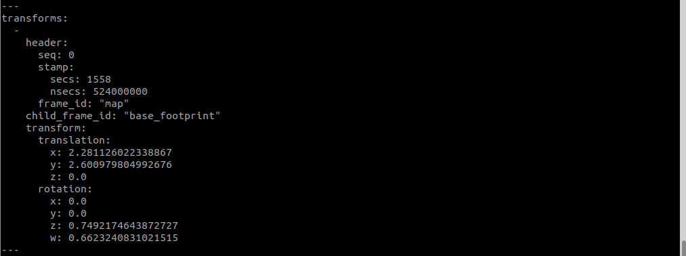

- **可视化工具：TF树**

  - 在之前提到的TransformStamped类型的transform数组中，它会包含很多坐标系之间的数据；
  - 上图中的map和base_footprint只是数组中的一个元素而已；
  - 可以通过**tf树来查看tf系统中所包含的坐标关系**；
  - 终端中执行：

  ```bash
  rosrun rqt_tf_tree rqt_tf_tree
  ```

  - 最后的整个tf_tree如下图所示：
  
  
  
  
  
  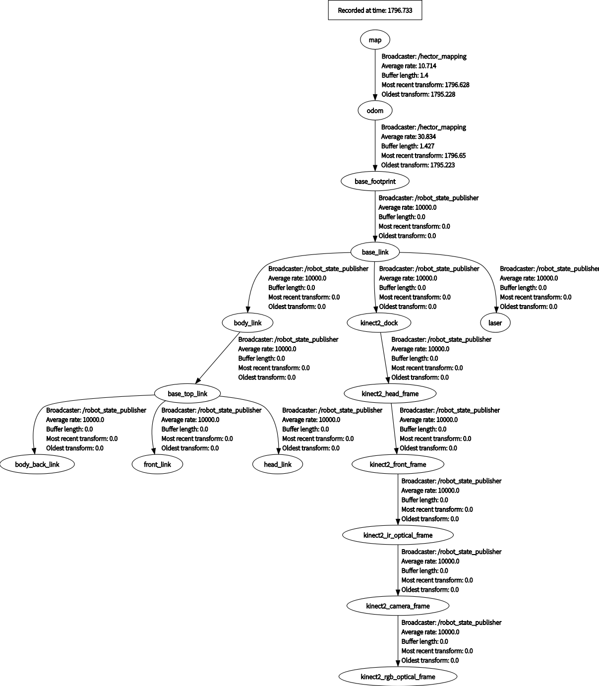

---


# 第四十六节课：里程计在激光雷达SLAM中的作用

## 1.矛盾点

### 1.1 Hector建图

- 在终端中启动一个Hector Mapping的建图程序：

  - ```bash
    roslaunch wpr_simulation wpb_corridor_hector.launch
    ```

  - 仍然是使用hector建图，只是周围的仿真环境不同而已；

  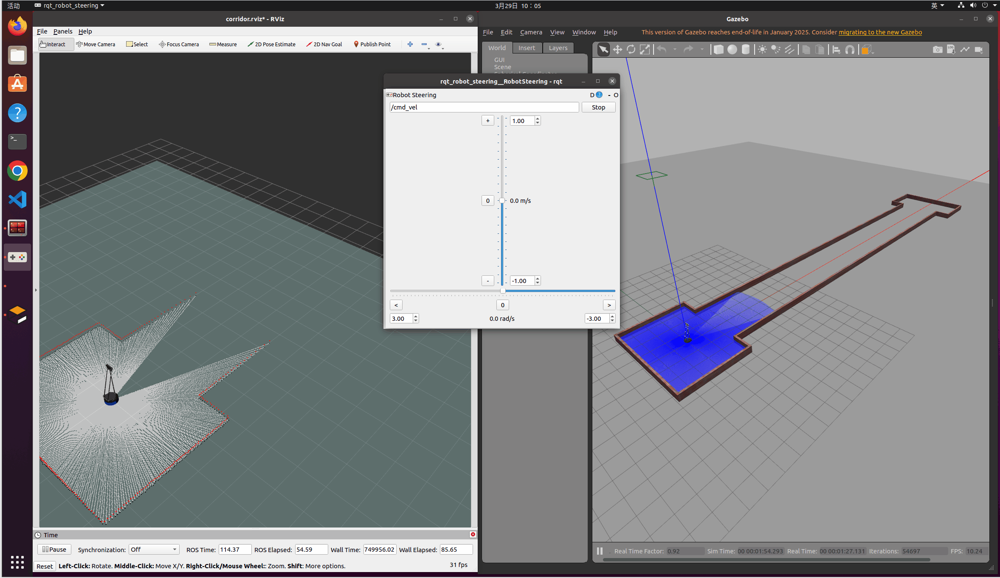

- 可以看到，在经过长长的走廊时，仿真环境的机器人在走，但是RViz中的建图机器人却卡住了；

### 1.2 Gmapping建图

- 在终端中启动一个Gmapping的建图程序

  - ```bash
    roslaunch wpr_simulation wpb_corridor_gmapping.launch
    ```

  - 仿真环境仍然是上面那个，但是SLAM算法换成了Gmapping；

  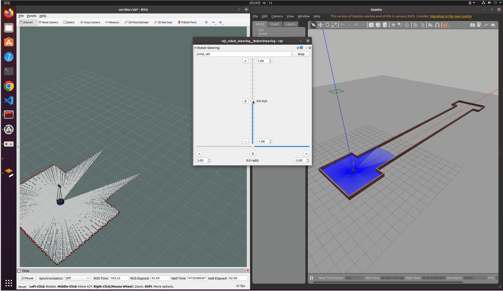

- 在这个建图中，在经过长廊时，仿真机器人和RViz机器人是都移动的；


## 2.里程计

### 2.1 机理解释

- 在SLAM建图中时，经过长廊时，因为周围没有任何纹理的变化，之前基于特征的SLAM建图拼接就无法起效了，机器人感觉自己没有在动过；
- 但是机器人的轮子是在转动的，即使周围没有纹理的变化，通过机器人轮子的转动速度也是可以知道它走过的距离的，这就是电机里程计；
- 里程计不是一个硬件设备，而是一个软件算法，在ROS系统中，它的关系如下：
  - 里程计软件算法在驱动节点中；
  - 里程计计算出来的位移数据在驱动节点中发布到/tf话题中；


### 2.2 里程计的输出信息

- 在之前的SLAM建图中，它在/tf中输出的是map坐标系和base_footprint坐标系之间的关系；
- 而对于里程计而言，它在/tf中输出的是odom坐标系到base_footprint坐标系之间的关系，odom即odometry里程计的缩写；

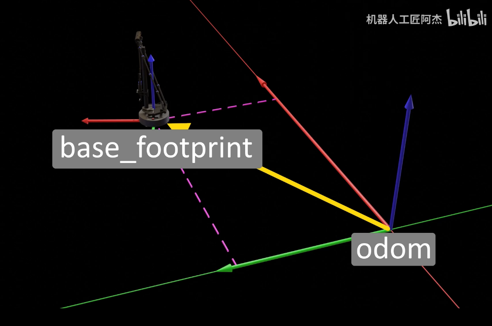

### 2.3 SLAM和里程计配合的意义：

- 里程计的劣势：

  - 里程计可以直接得到机器人的位置；
  - 但是它的数据完全是靠轮子的转动速度计算的，当出现打滑等情况时将出现误差；

- SLAM障碍物点云配对的补充：

  - 为了解决这个误差，可以将SLAM的障碍物点云匹配和里程计综合起来；
  - 如下图所示，红色线段就是里程计输出的数据，而SLAM可以基于点云匹配在前面补充绿色线段的数据，这样两段加起来就是真实的机器人的位置，这就是Gmapping的核心算法：

  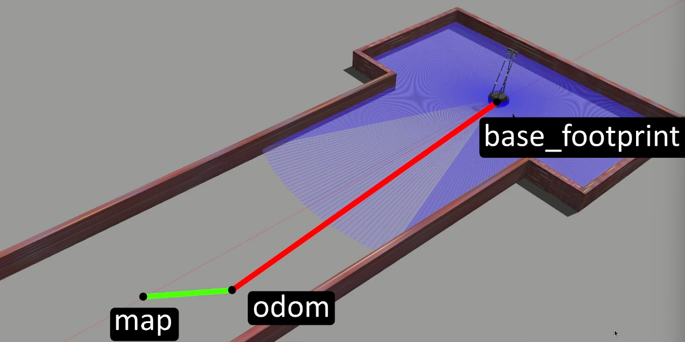


## 3.Hector与Gmapping的区别

### 3.1 Hector建图的机理

- 在Hector中，输出的/tf关系是map和scanmacher_frame的关系；
- 但为了RViz中能显示出map与base_footprint之间的关系，它必须输出一段map和odom之间的关系，好让scanmacher_frame和base_footprint是重合的；
- 但是Hector中map和odom这段关系不是为了修正里程计误差，而是为了让scanmacher_frame和base_footprint是重合的；
- 即Hector是以扫描为准的，它并不考虑里程计，它输出的里程计信息只是为了抵消里程计带来的数据；

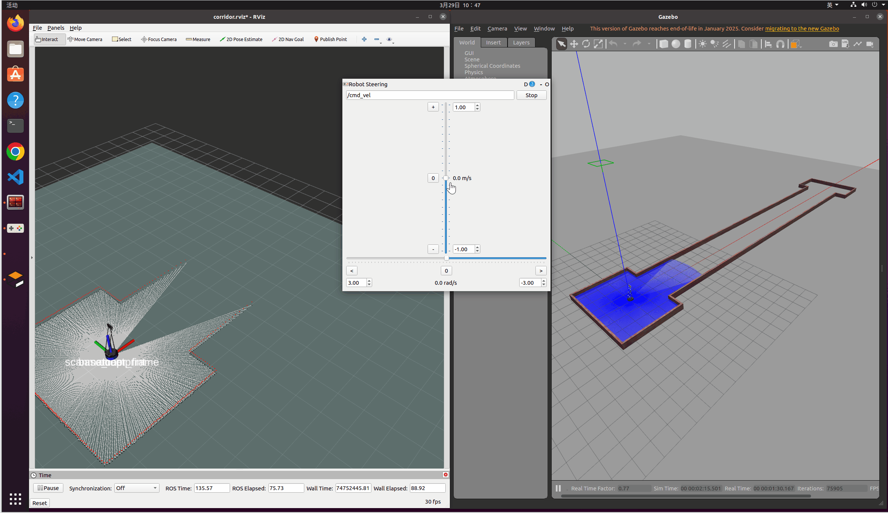

### 3.2 Gmapping建图的机理

- 在Gmapping中，输出的是里程计和激光点云匹配的双重配合结果；
- 它输出的里程计信息是真实利用的，而不是Hector中的只是让两个坐标系重合；

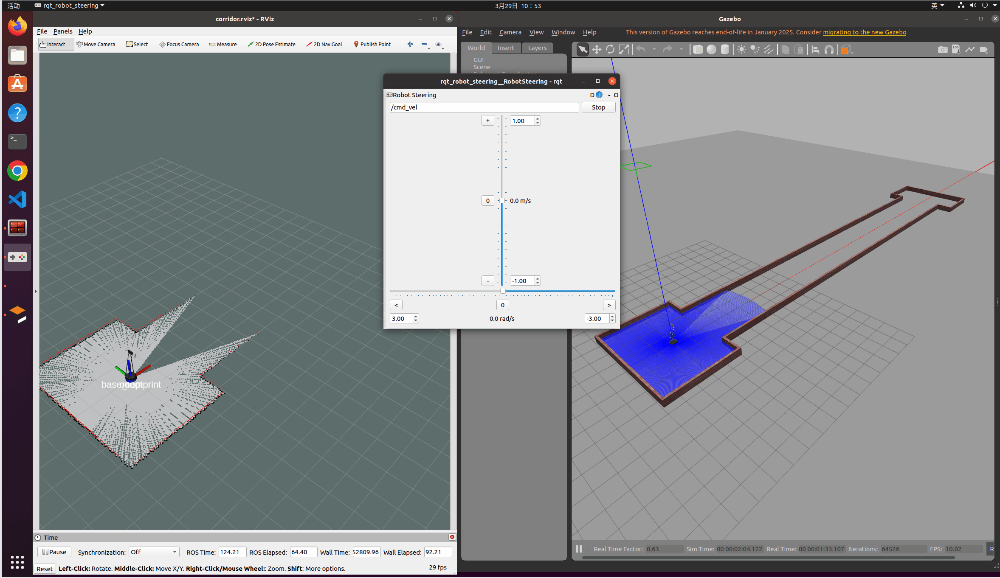

---


# 第四十七节课：Gmapping的使用

## 1.Gmapping的数据格式

- 在官网中搜索gmapping，注意需要选择noetic，否则后续的更新版本中已经没有这个软件包了；

- 在官网中可以看到它的**节点：slam_gmapping**；

- 在这个节点中**订阅的话题即需要的数据**有两个：

  - **tf**：即需要一些坐标系转换关系，包括：

    - 雷达坐标系到地盘坐标系的base_link的TF关系，其中雷达坐标系的名称需要与/scan话题中的父坐标系名称保持一致；
    - base_link到odom的坐标系关系，即上一节课提到的里程计输出的TF关系；

    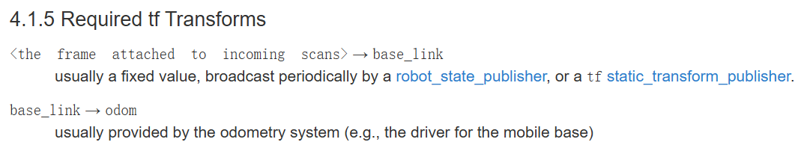

  - **scan**：即需要订阅激光雷达的数据话题；

- 在这个节点中**发布的话题即输出的数据**有三个：

  - **map_metadata**：即输出的地图信息；
  - **map**：栅格地图数据；
  - **entropy**：机器人误差，值越大表明越不可信；

  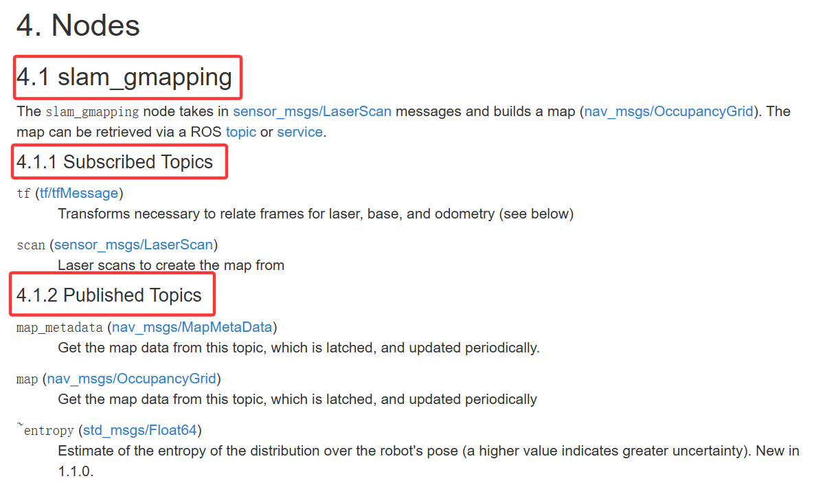

- **输出的TF关系：**

  - Gmapping还输出了一个地图map到里程计odom的TF关系；

  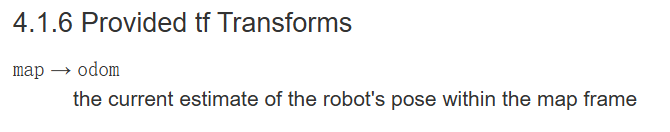


## 2.运行Gmapping并进行建图

### 2.1 查看所需数据是否都已存在

- 运行仿真环境：

```bash
roslaunch wpr_simulaton wpb_stage_robocup.launch
```

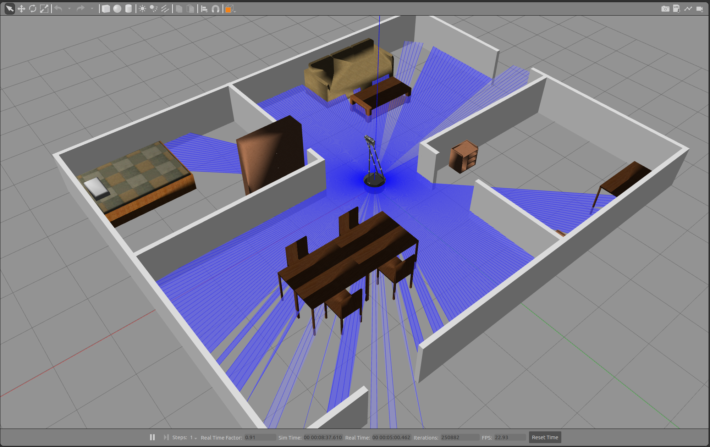

- 查看仿真机器人提供的话题

```bash
rostopic list
```

- 获取激光雷达的父坐标系

```bash
rostopic echo /scan --noarr
```

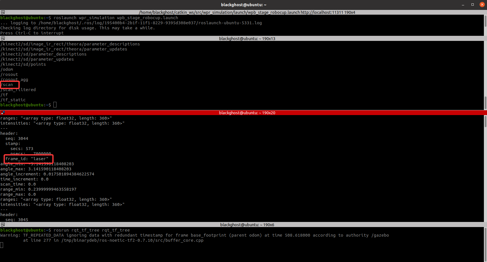

- 查看是否存在必须的TF关系

```bash
rosrun rqt_tf_tree rqt_tf_tree
```

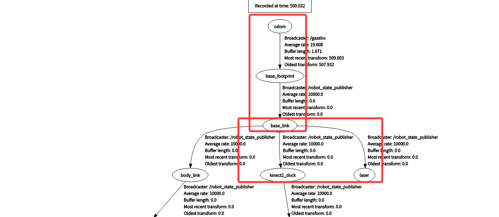

- 可见在启动仿真环境后，已经准备好了所有的关系，接下来就可以运行仿真环境并建图了；

### 2.2 运行Gmapping并进行建图

- 运行Gmapping节点：

```bash
rosrun gmapping slam_gmapping
```

- 启动RViz：

```bash
rosrun rviz rviz
```

- 然后在RViz中添加机器人模型、激光雷达和地图数据即可显示初始状态；
- 启动速度控制程序：

```bash
rosrun wpr_simulation keyboard_vel_ctrl
```

- 最后效果如下：


---


# 第四十八节课：launch启动Gmapping建图

## 1.课程目标

- 实现一条指令启动Gmapping建图；


## 2.项目开发

- **创建软件包**

```bash
cd catkin_ws/src
catkin_create_pkg slam_gmapping_pkg rospy roscpp std_msgs
```

- **新建文件**
  - 在slam_gmapping_pkg文件夹下创建文件夹launch；
  - 在launch文件夹下创建文件gmapping.launch；

- **编写gmapping.launch文件**

```xml
<launch>
    
    <include file="$(find wpr_simulation)/launch/wpb_stage_robocup.launch"/>
    
    <node pkg="gmapping" type="slam_gmapping" name="slam_gmapping"/>
    
    <node pkg="rviz" type="rviz" name="rviz"/>
    
     <node pkg="wpr_simulation" type="keyboard_vel_ctrl" name="keyboard_vel_ctrl"/>
    
</launch>
```

- **编译该软件包：将该软件包添加入ROS的软件包列表**

```bash
cd catkin_ws
catkin_make
```

- **运行launch文件**

```bash
roslaunch slam_gmapping_pkg gmapping.launch
```

- **新加地图的保存和打开：**
  - 如果只是像上面那样编写，每次打开RViz都是空的；
  - 运行launch文件后，在RViz中按上一节课配置好RViz，然后将其保存；
  - 保存至slam_gmapping_pkg文件下的rviz文件夹(自己新建)，起名gmapping.rviz；

- **更改launch文件：**

```xml
<launch>
    
    <include file="$(find wpr_simulation)/launch/wpb_stage_robocup.launch"/>
    
    <node pkg="gmapping" type="slam_gmapping" name="slam_gmapping"/>
    
    <node pkg="rviz" type="rviz" name="rviz" args="-d $(find slam_gmapping_pkg)/rviz/gmapping.rviz"/>
    
     <node pkg="wpr_simulation" type="keyboard_vel_ctrl" name="keyboard_vel_ctrl"/>
    
</launch>
```

- **再次运行：**
  - 再次运行launch文件，一开始即可配置好RViz，再像前面一样建图即可；

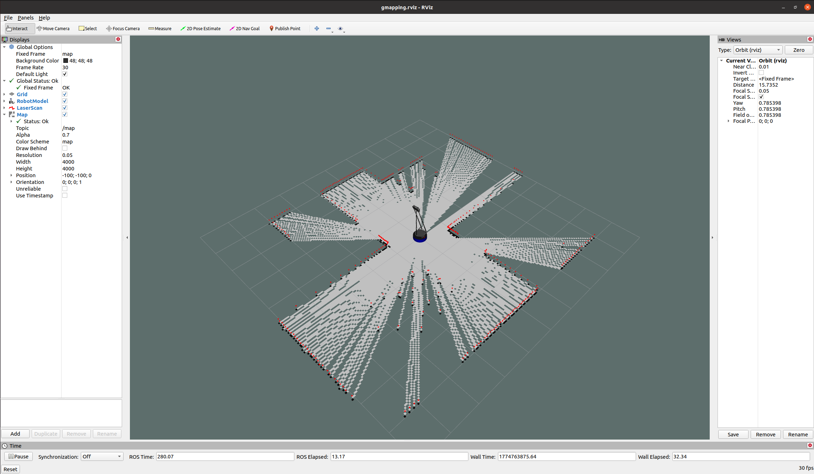

---


# 第四十九节课：Gmapping的参数设置

## 1.Gmapping的参数

- 在官网中可以看到Gmapping的所有参数，可将其分类如下：

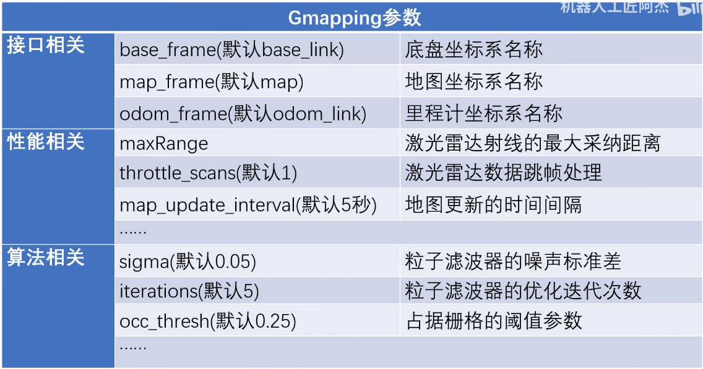

- 第一类接口相关参数：
  - 即base_frame、map_frame、odom_frame三个TF坐标系；
  - 它主要是用于当我们实际机器人的TF树和之前的三个TF坐标系不同时，可以直接在这里改以告诉Gmapping实际的TF树；

- 第二类性能相关参数：
  - 这类参数是直接影响实际运算量的参数；
  - 可分为如下四类：

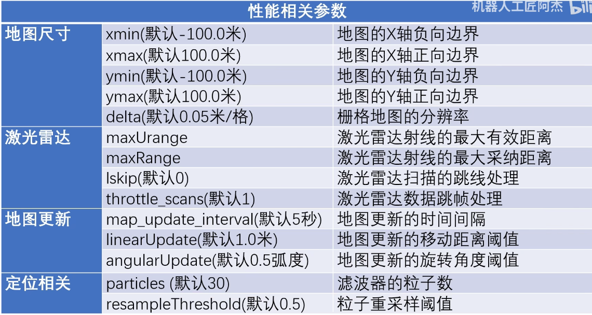

- 第三类算法相关参数：
  - 这类参数是与粒子算法有关的，难度系数较大，一般不更改；


## 2.实际参数修改

- 修改gmapping.launch文件：

```xml
<launch>
    
    <include file="$(find wpr_simulation)/launch/wpb_stage_robocup.launch"/>
    
    <node pkg="gmapping" type="slam_gmapping" name="slam_gmapping">
    	
        <param name="maxUrange" value="3.0"/>
        
    </node>
    
    <node pkg="rviz" type="rviz" name="rviz" args="-d $(find slam_gmapping_pkg)/rviz/gmapping.rviz"/>
    
     <node pkg="wpr_simulation" type="keyboard_vel_ctrl" name="keyboard_vel_ctrl"/>
    
</launch>
```

---


# 第五十节课：地图的保存和加载

## 1.map_server软件包

- 在前面的Gmapping建图中，已经得到了栅格地图，可以用map_server软件包将其保存；
- map_server软件包介绍：
  - 在官网中搜索map_server；
  - 找到下面的map_saver，这就是map_server软件包中用于保存地图的节点；
  - 其基本用法已列举在下面，我们只需要运行即可将地图保存；

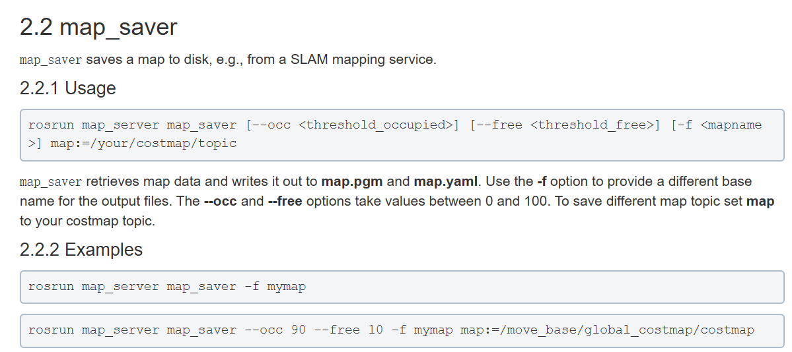


## 2.实际操作

- 先运行之前的**gmapping.launch**完成建图；
- 在完成建图后，**在保持建图程序运行的前提下，再打开一个终端**，执行：

```bash
cd ~
rosrun map_server map_saver -f map
```

- 在上面的执行中，我们处在主目录下，所以会在主目录中**生成map.pgm和map.yaml文件**；

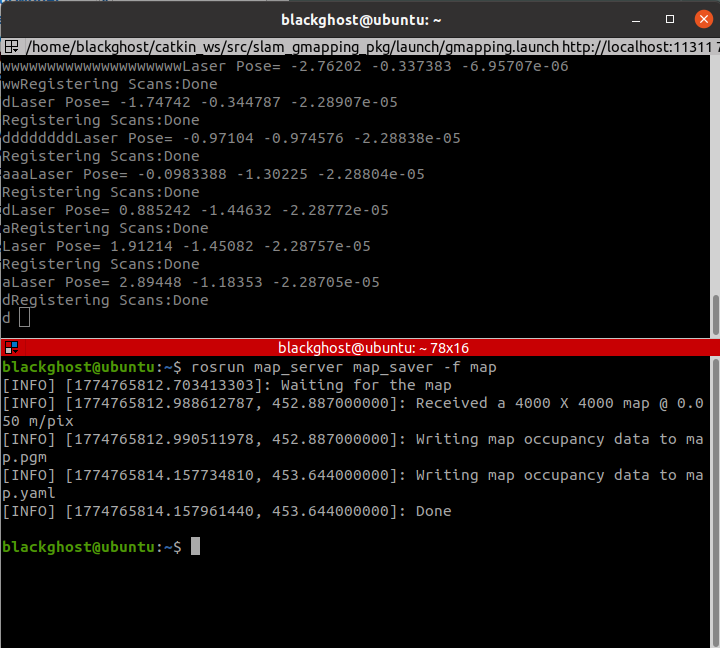

- **map.pgm文件：**

  - 这个文件就是一个图片文件：

  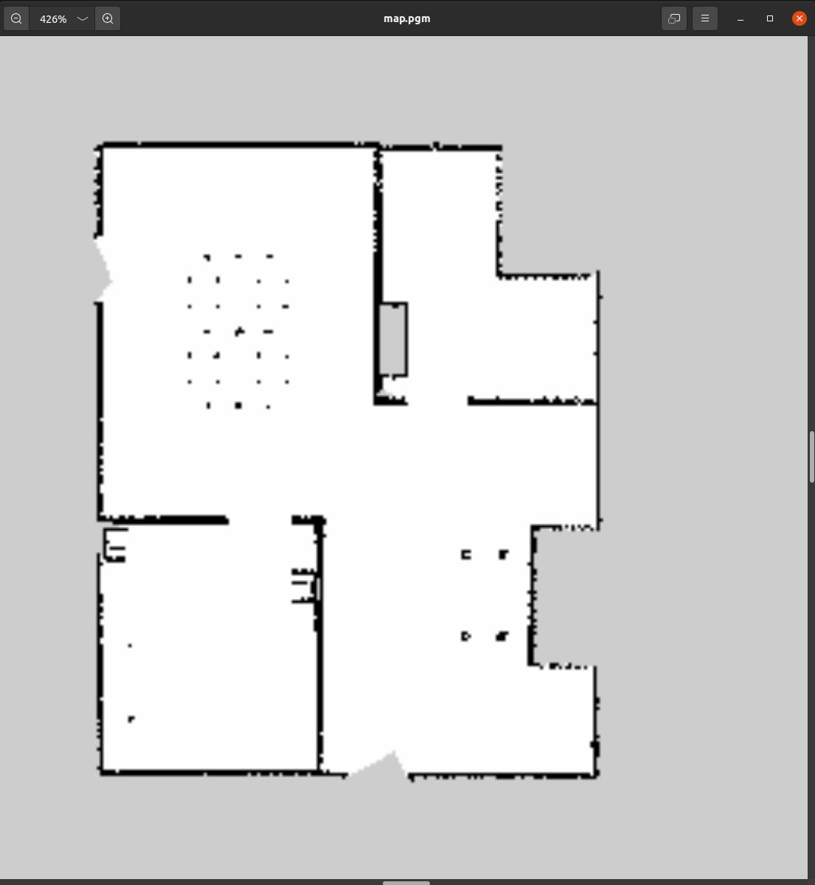

- **map.yaml文件：**

  - 这个文件中记录了地图的基本信息：

  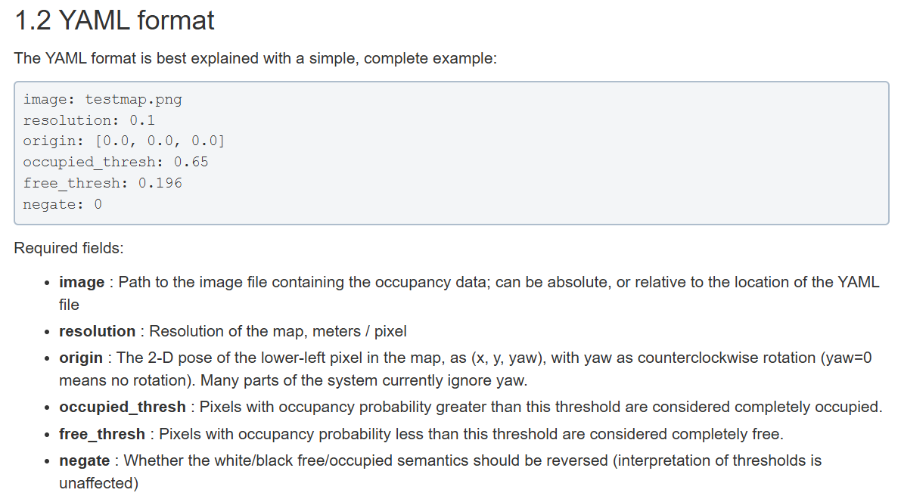


## 3.地图的使用

### 3.1 map_server节点介绍

- 在前面已经保存了地图，地图主要用于**导航作用**；
- 我们可以用**map_server的map_server节点**来启用地图；
- **该节点发布的话题是map，在加载地图后需用RViz来查看地图，即添加map然后Topic选择map；**

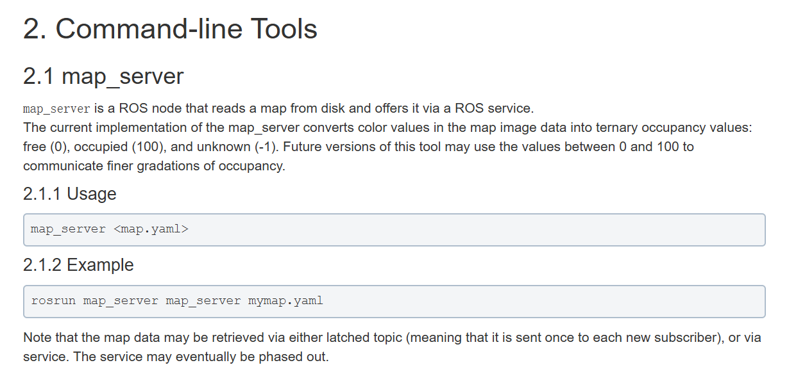

### 3.2 map_server节点的使用

- **启动ROS核心**

```bash
roscore
```

- **加载地图**

```bash
rosrun map_server map_server map.yaml
```

- **RViz显示地图**

```bash
rosrun rviz rviz
```

- **然后在RViz中添加map并订阅话题map即可得到地图：**

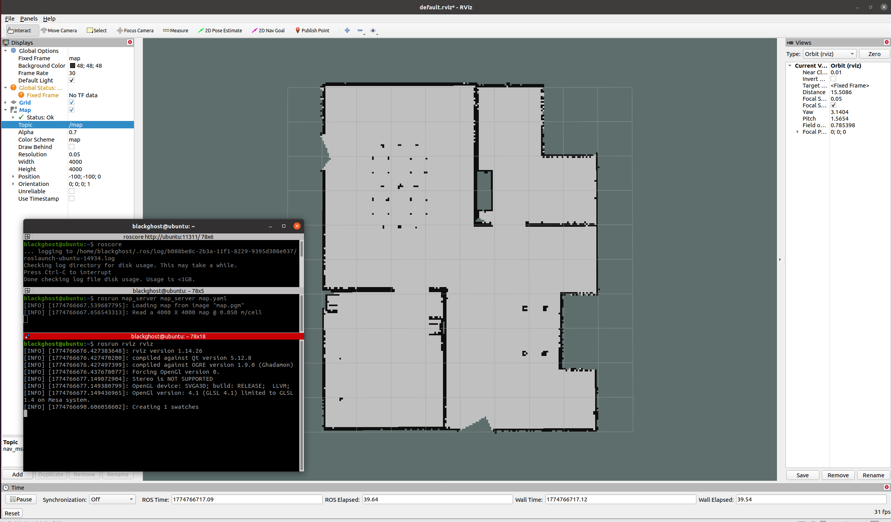

---

---


# 第五十一节课：Navigator导航系统

## 1.内容介绍

- 前面一节课中，我们已经完成了地图的保存和加载；
- 有了地图，我们就可以在地图上导航，到达我们想要的目的地；
- 本节课就介绍ROS中的导航系统——Navigator；


## 2.实际生活中的导航

下图所示为一个实际生活中的导航的构架图，它的主要流程如下：

- 首先从地图服务器上下载全局地图数据，把这个全局地图数据输入到地图App中，这是地图的加载；
- 接着在地图App上输入导航的目的地，地图App将会得出一条基于原始全局地图的最优导航路线；
- 将这条最优导航路线输入到脑子，再由脑子控制运动神经带动腿脚运动；
- 在实际的运动过程中，还需要眼睛、脚步数等更新自己的定位，避免走错路了；
- 然后在实际运行中，导航的路线可能出现建图时没有的障碍物，这是可分为两种情况：
  - 眼睛观察将障碍物信息更新到脑子中，如果周围有小路线可以绕过障碍物并重新回到原来的导航路线上，那就是局部规划；
  - 若障碍物堵死了，不能继续回到原来航线，它就会把障碍物信息更新到全局地图上，并启动应急机制从更新的全局地图上重新规划一条新的路线；

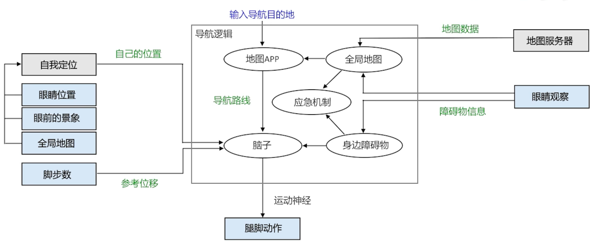


## 3.ROS中的导航

下面是ROS官方资料中的导航结构，它和上面的实际生活的导航结构有如下几点相同点：

- **global_planner全局规划器**相当于上图的地图App；
- **local_planner局部规划器**即脑子，里面有避障算法；
- local_costmap是临时地图，即障碍物地图；
- amcl即定位算法，实时更新自己的定位，避免走错路线；
- base controller是底层通讯节点，即腿脚动作的施发者；


---


# 第五十二节课：move_base节点

## 1.导航结构图再解析

在下面的ROS导航架构中，主要有两类图形：

- 一类是矩形，这些都是**一个个节点；**
- 其中的**move_base**也是一个节点；


## 2.move_base节点介绍

### 2.1 move_base官网介绍

在ROS官网上搜索move_base，可以得到如下的解释：

- move_base是一个软件包，该软件包下有一个move_base 节点；
- 在这个节点中，会有一个全局规划器和一个局部规划器；
- 而且还会管理着两个地图，分别给两个规划器使用；
- 可见move_base节点就是上图中间的那个大节点，它里面就已经包含了那几个椭圆的内容；

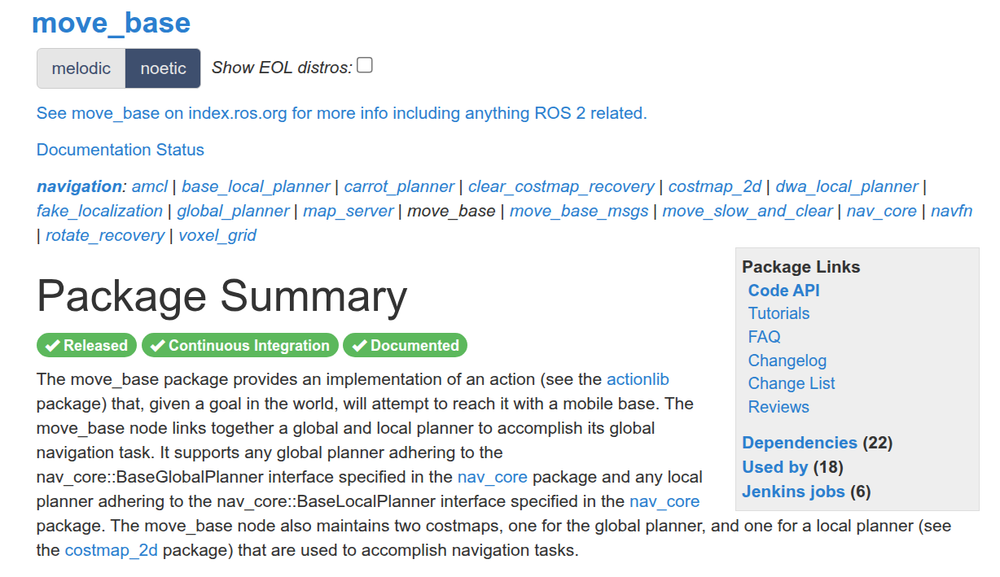

### 2.2 move_base节点的使用

- 上面介绍到，主要把move_base节点运行起来，它就可以把节点内的组件准备好；
- **但是要使用move_base节点，需要提供下图所示的原数据，并给出目的地，这样move_base节点才能输出底盘节点数据，驱动底盘运行到目的地；**

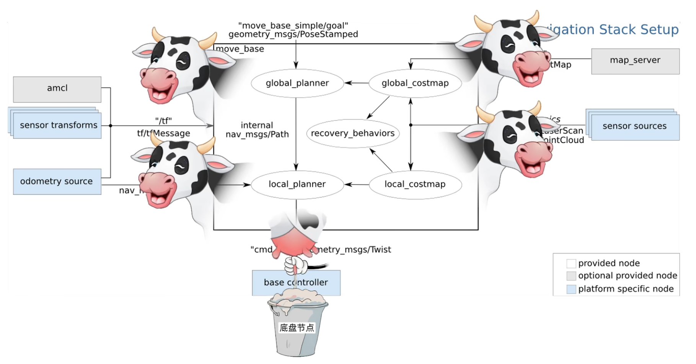

- **原数据1：map_server**

  - 该数据即全局地图数据；
  - 直接运行map_server地图服务节点，将导航需要的地图文件加载进去，move_base就会自动获取数据；
  - map_server节点对应的就是上一节课的内容；

- **原数据2：sensor sources**

  - 该数据为多个传感器节点；
  - 在仿真机器人环节中，它会输出所有的这些sensor topics，这部分不需要操心；

- **原数据3：odometry source**

  - 该数据即里程计数据；

  - 里程计节点可以由仿真机器人自己提供，不需要担心；

- **数据4：tf**

  - 该数据即传感器位置的tf；
  - 仿真机器人也自带了，不需要担心；

- **原数据5：amcl**

  - 该数据即定位数据节点；
  - 这个节点需要我们自己手动运行；
  - amcl节点的具体介绍可见官网，它有一个软件包名为amcl和一个节点名为amcl；

### 2.3 总结

总结下来，要运行move_base节点，需要完成如下工作：

- 运行move_base导航节点；
- 运行map_server地图服务节点；
- 运行amcl定位节点；
- 给定目的地；


## 3.实际操作

### 3.1 环境配置

- **仿真环境配置**

  - 仿真环境用的还是wpr_simulation开源项目，先前已经配置好了，无需重新配置；

- **配置机器人的驱动源码包**

  - 导航过程中会用到里面的一些参数文件，使用这些参数文件可以简化参数设置步骤；
  - 具体的参数后面会介绍，这里先用起来；
  - 配置过程如下

  ```bash
  # 打开终端，进入工作空间的源码目录
  cd catkin_ws/src
  
  # 下载源码包
  git clone https://github.com/6-robot/wpb_home.git
  
  # 进入脚本文件夹
  cd wpb_home/wpb_home_bringup/scripts/
  
  # 执行依赖项安装脚本
  ./install_for_noetic.sh
  
  # 编译
  cd ~/catkin_ws
  catkin_make
  ```

- **准备导航用的地图**

  - 前面课程已经完成了导航地图的建图和保存；
  - 将前面保存地图生成的两个文件直接复制到wpr_simulation下的maps文件夹里；

### 3.2 导航代码编写

- 本小节的内容就是编写launch文件完成前面三个节点的启动工作；
- **打开终端，创建软件包**

```bash
cd catkin_ws/src
catkin_create_pkg nav_pkg roscpp rospy move_base_msgs actionlib
```

- **打开VsCode，进行编写**

  - 在nav_pkg下，新建一个名为launch的文件夹；
  - 在launch文件夹下新建nav.launch文件；
  - 写入如下内容：其中第一个节点的中间部分的内容是复制wpr_simulation/launch/wpb_demo_nav.launch的内容，这些参数后续会讲；

  ```c
  <launch>
  
      <node pkg="move_base" type="move_base" name="move_base">
          <rosparam file="$(find wpb_home_tutorials)/nav_lidar/costmap_common_params.yaml" command="load" ns="global_costmap" />
          <rosparam file="$(find wpb_home_tutorials)/nav_lidar/costmap_common_params.yaml" command="load" ns="local_costmap" />
          <rosparam file="$(find wpb_home_tutorials)/nav_lidar/global_costmap_params.yaml" command="load" />
          <rosparam file="$(find wpb_home_tutorials)/nav_lidar/local_costmap_params.yaml" command="load" />
          <param name="base_global_planner" value="global_planner/GlobalPlanner" /> 
          <param name="base_local_planner" value="wpbh_local_planner/WpbhLocalPlanner" />
      </node>
  
      <node pkg="map_server" type="map_server" name="map_server" args="$(find wpr_simulation)/maps/map.yaml"/>
  
      <node pkg="amcl" type="amcl" name="amcl"/>
  
  
  </launch>
  ```

- **编译nav_pkg软件包**

  - 终端执行下面代码

  ```c
  cd ~/catkin_ws
  catkin_make
  ```

### 3.3 运行环境并导航

- **运行仿真环境**

```c
roslaunch wpr_simulation wpb_stage_robocup.launch
```

- **运行导航程序**

```c
roslaunch nav_pkg nav.launch
```

- **设置目的地**

  - 执行下面命令打开RVIZ

  ```c
  rviz
  ```

  - 然后在rviz中添加地图(话题/map)、机器人、path路线(话题选择第一个)；
  - 然后点击2D Nav Gobal设定目的地，就可以实现导航了；

- **运行的效果如下图所示**

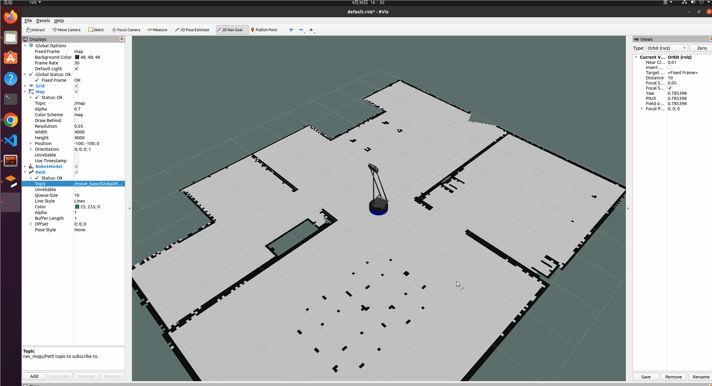

---


# 第五十三节课：全局规划器

## 1.全局规划器介绍

- 全局规划器即下面架构图中的move_base中的global_planner；
- 它相当于是手机上的导航App，如高德地图、百度地图中；
- **在ROS中，就像手机的导航一样，也存在很多不同的全局规划器，而且每一种规划器还可以有不同的路径搜索算法；**
- 全局规划器的选择和不同的路径搜索算法的选择就是上节课提到的参数的配置；


## 2.两种常见的导航算法

- **Dijkstra算法**
  - 它采用一种大水灌溉的方法搜索路径，是一种深度优先的算法；
  - 有Dijkstra算法搜索的路径一般是最短的；
- **A*算法**
  - 它采用定向检索的方法，是一种广度优先的算法；
  - A*算法的路径不一定是最短的，它是通过降低路径生成质量来降低了运算的数量；

| 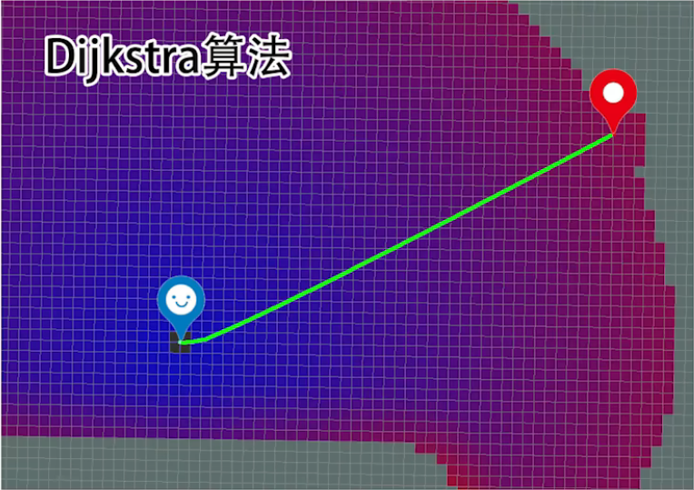 | 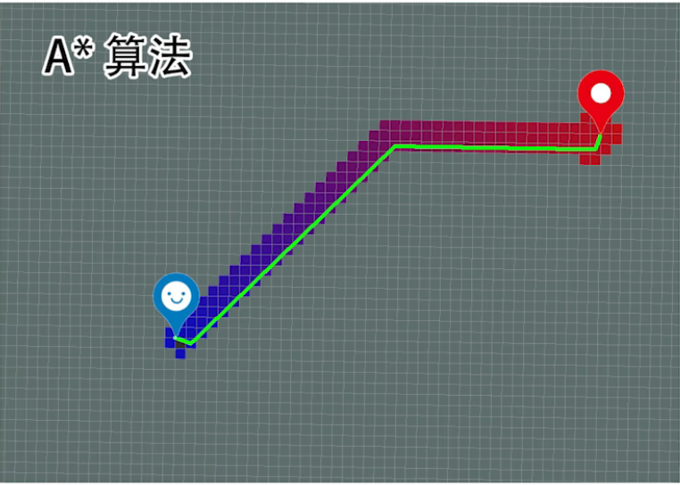 |
| ------------------------------------------------------------ | ------------------------------------------------------------ |


## 3.全局规划器的参数设置

- 在ROS中，内置了下表所示的3种全局规划器；

- **Navfn/Global_planner**

  - 前面两种的功能是完全一样的，只是后者是前面的一个迭代版本而已，一般采用前者即可，它也是ROS的默认规划器；
  - 它们两者的内部都包含了Dijkstra算法和A算法，但是Navfn的A算法有bugger，Global_planner就是修复了A*算法的Navfn；
  - 在默认下，使用Dijkstra算法即可，两者的算法消耗没有太大差别；

- **arrot_planner**

  - 它的代码简单，原理是原点和目的地连一条直线，遇到障碍物就避开它；
  - 这种方式很简单，但是一般都不会使用它，**通常是以它为模板，进行自定义规划器的设计；**

- **自定义规划器**

  - move_base是支持自己编写全局规划器的；
  - 它提供了一种Plugin插件接口，只需按照规定的格式就能把自己的算法写成新的规划器；

  

- **参数设置**

  - 只需在上一节课提到的launch文件种，修改base_global_planner这个变量值即可；

  ```yaml
  <launch>
  
      <node pkg="move_base" type="move_base" name="move_base">
          <rosparam file="$(find wpb_home_tutorials)/nav_lidar/costmap_common_params.yaml" command="load" ns="global_costmap" />
          <rosparam file="$(find wpb_home_tutorials)/nav_lidar/costmap_common_params.yaml" command="load" ns="local_costmap" />
          <rosparam file="$(find wpb_home_tutorials)/nav_lidar/global_costmap_params.yaml" command="load" />
          <rosparam file="$(find wpb_home_tutorials)/nav_lidar/local_costmap_params.yaml" command="load" />
          <param name="base_global_planner" value="global_planner/GlobalPlanner" /> 
          <param name="base_local_planner" value="wpbh_local_planner/WpbhLocalPlanner" />
      </node>
  
      <node pkg="map_server" type="map_server" name="map_server" args="$(find wpr_simulation)/maps/map.yaml"/>
  
      <node pkg="amcl" type="amcl" name="amcl"/>
  
  
  </launch>
  ```

---


# 第五十四节课：AMCL定位算法

## 1.AMCL介绍

### 1.1 AMCL基本介绍

- 全称为Adaptive Monte Carlo Localization，即自适应蒙特卡洛定位算法；
- 是一种使用粒子滤波在已知地图中进行定位的算法；
- 它需要同时使用里程计和激光雷达数据，具有较强的自我纠错能力；

### 1.2 AMCL中粒子滤波机制

- 如下图所示就是AMCL算法在实际定位中的机理；
- 它采用了粒子滤波的算法，即每一次都分裂粒子，粒子即自己的分身，它在位置和朝向上与本体会有所不同；
- 然后每一次移动时，AMCL算法都会获取里程计信息和激光雷达信息，将这些信息叠加到粒子和本体中，采用末位淘汰方式将差别很大的粒子或本体淘汰掉；
- 在实际的AMCL算法中，粒子数可达100到5000个；

| 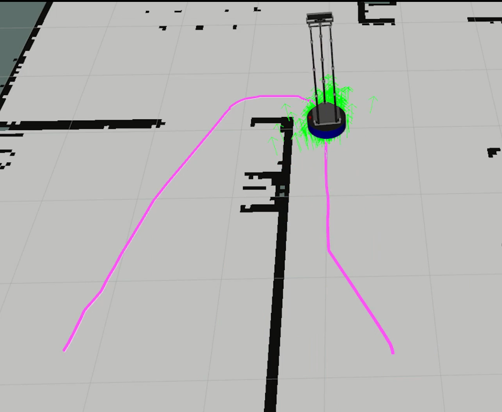 | 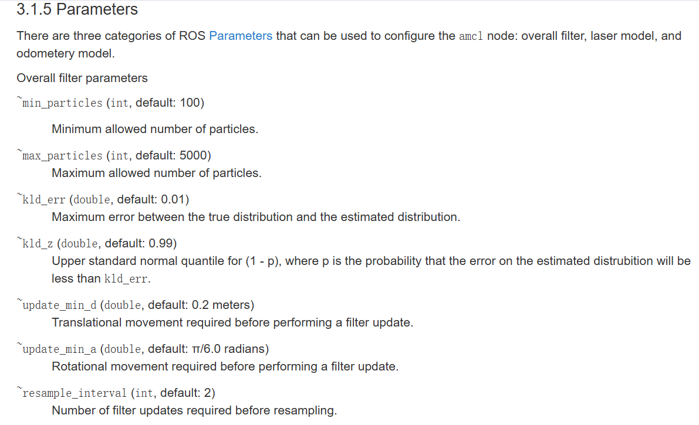 |
| ------------------------------------------------------------ | ------------------------------------------------------------ |


## 2.AMCL的参数

### 2.1 AMCL的参数示例

- AMCL算法有很多的参数，可以打开官网搜索amcl，然后打开介绍网页；
- 划到3.1.5节，可以查看它的所有参数，一些示例参数可见上图；

### 2.2 AMCL的参数设置

AMCL的参数设置可以参照如下两个.launch文件，实际开发中直接复制过来用即可：

- **~/catkin_ws/src/wpb_home/wpb_home_tutorials/nav_lidar/amcl_diff.launch；**
- **~/catkin_ws/src/wpb_home/wpb_home_tutorials/nav_lidar/amcl_omni.launch；**


## 3.Rviz中显示定位的原理

### 3.1 AMCL节点和里程计节点的TF输出机制

- 在官网的3.1.6节中，还提到了AMCL节点和里程计节点的TF输出机制；
- AMCL节点负责输出map到odom的tf关系；
- 里程计负责输出odom到base_footprint的tf关系；
- 两者结合就可以输出一条完整的map到base_footprint即地图到机器人底盘的tf关系；
- 需要注意的是，AMCL节点切换本体和分身是通过map到odom这段tf关系产生跳跃突变来实现的；
- 而里程计输出的odom到base_footprint这段tf是连续变化的，这在代价地图那还会讲到；

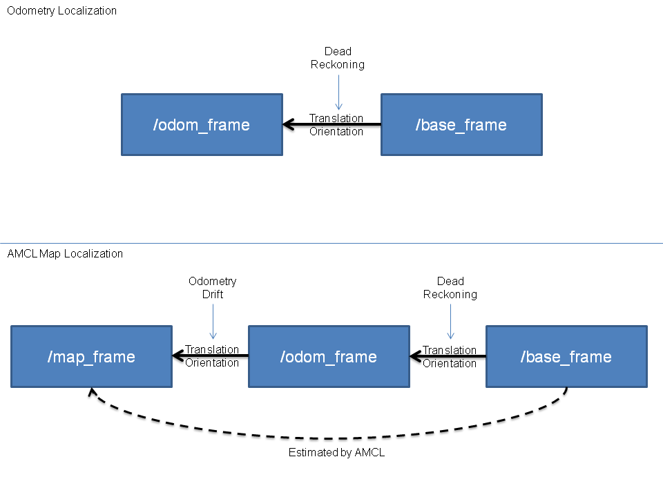

### 3.2 在Rviz中查看分身的位置

- **运行仿真环境**

```c
roslaunch wpr_simulation wpb_stage_robocup.launch
```

- **运行导航程序**

```c
roslaunch nav_pkg nav.launch
```

- **打开Rviz**

```c
rviz
```

- **设置Rviz**
  - 在rviz中添加地图(话题/map)、机器人、path路线(话题选择第一个)；
  - 添加poseArray项目，并订阅话题/particlecloud，并将其设为绿色；
  - 然后点击2D Nav Gobal设定目的地，就可以实现导航了并显示分身了；

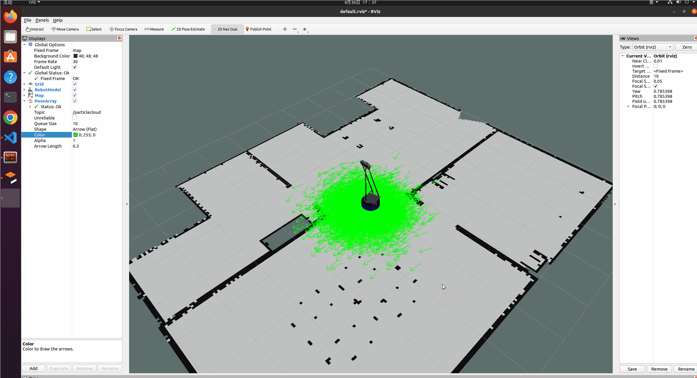

---


# 第五十五节课：代价地图Costmap

## 1.代价地图介绍

### 1.1 代价地图简介

- 在下面的导航框架中，**global_costmap和local_costmap**分别是全局代价地图和局部代价地图；
- 代价地图的作用是在障碍物的周围膨胀，如果机器人走进了这块膨胀的部分，是不允许的；
- 代价地图的设置，可以让机器人在路径规划时，有充分的空间避免因为没有考虑自身体积而导致装上障碍物；


### 1.2 全局代价地图与局部代价地图

- 如下图所示是真实的代价地图；
- **全局代价地图global_costmap**
  - 全局代价地图是用来全局路径规划用的；
  - 全局代价地图只需要在一开始的路径规划时生成一遍，它比较耗费时间，但一般只算一次；
- **局部代价地图local_costmap**
  - 局部代价地图是用来实际运行时的避障用的；
  - 局部代价地图需要实时计算，它计算很快，不需要浪费很多时间；
  - 不能采用全局代价地图的切片来做，因为在实时运行中可能随时会出现新的障碍物；

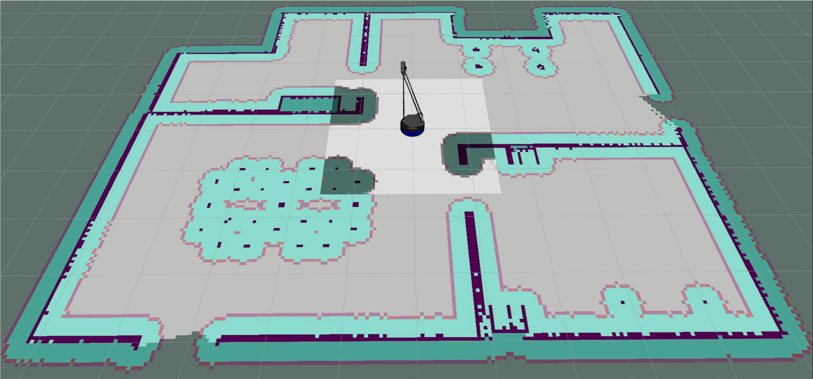


## 2.Rviz中代价地图的加载

- **运行仿真环境**

```c
roslaunch wpr_simulation wpb_stage_robocup.launch
```

- **运行导航程序**

```c
roslaunch nav_pkg nav.launch
```

- **打开Rviz**

```c
rviz
```

- **设置Rviz**

  - 在rviz中添加map(话题/map)、机器人、path路线(话题选择第一个、并将Line Style选择为BillBoards、颜色选择为紫色)；
  - 重新选择map，将其名称改为GlobalCostMap，然后选择其话题为/move_base/global_costmap/costmap，ColorScheme选择为costmap；
  - 再次选择map，将其名称改为LocalCostMap，然后选择其话题为/move_base/local_costmap/costmap；

- **将Rviz配置保存**

  - 点击Rviz的File选项，将这个配置保存到nav_pkg下的rviz文件夹(自己新建)下，命名为nav.rviz；

- **修改launch文件**

  - 修改launch文件，将Rviz启动写入launch文件中；

  ```yaml
  <launch>
  
      <node pkg="move_base" type="move_base" name="move_base">
          <rosparam file="$(find wpb_home_tutorials)/nav_lidar/costmap_common_params.yaml" command="load" ns="global_costmap" />
          <rosparam file="$(find wpb_home_tutorials)/nav_lidar/costmap_common_params.yaml" command="load" ns="local_costmap" />
          <rosparam file="$(find wpb_home_tutorials)/nav_lidar/global_costmap_params.yaml" command="load" />
          <rosparam file="$(find wpb_home_tutorials)/nav_lidar/local_costmap_params.yaml" command="load" />
          <param name="base_global_planner" value="global_planner/GlobalPlanner" /> 
          <param name="base_local_planner" value="wpbh_local_planner/WpbhLocalPlanner" />
      </node>
  
      <node pkg="map_server" type="map_server" name="map_server" args="$(find wpr_simulation)/maps/map.yaml"/>
  
      <node pkg="amcl" type="amcl" name="amcl"/>
  
      <node name="rviz" pkg="rviz" type="rviz" args="-d $(find nav_pkg)/rviz/nav.rviz"/>
  
  </launch>
  ```

- **重新加载**

  - 这样配置完后，直接按照之前的方式启动，就可以看见代价地图了；

  ```bash
  roslaunch wpr_simulation wpb_stage_robocup.launch
  
  # 新开一个终端
  roslaunch nav_pkg nav.launch
  ```

- **运行效果：最终运行效果如图所示**

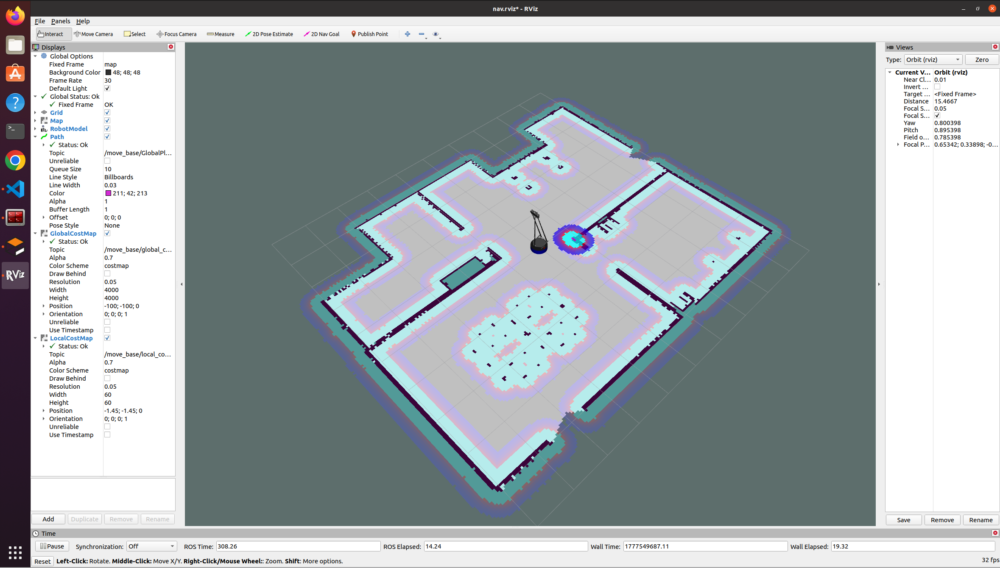

---


# 第五十六节课：代价地图的参数设置

## 1.参数设置回顾

回顾之前的launch文件中配置的参数，它们是通过文件的形式来配置的：

- 中间前面的4行就是给代价地图设置的参数；
- 其中第1行和第3行都是为全局代价地图设置的参数；
- 第2和第4行是为局部代价地图设置的参数；

```yaml
<launch>

    <node pkg="move_base" type="move_base" name="move_base">
        <rosparam file="$(find wpb_home_tutorials)/nav_lidar/costmap_common_params.yaml" command="load" ns="global_costmap" />
        <rosparam file="$(find wpb_home_tutorials)/nav_lidar/costmap_common_params.yaml" command="load" ns="local_costmap" />
        <rosparam file="$(find wpb_home_tutorials)/nav_lidar/global_costmap_params.yaml" command="load" />
        <rosparam file="$(find wpb_home_tutorials)/nav_lidar/local_costmap_params.yaml" command="load" />
        <param name="base_global_planner" value="global_planner/GlobalPlanner" /> 
        <param name="base_local_planner" value="wpbh_local_planner/WpbhLocalPlanner" />
    </node>

    <node pkg="map_server" type="map_server" name="map_server" args="$(find wpr_simulation)/maps/map.yaml"/>

    <node pkg="amcl" type="amcl" name="amcl"/>

    <node name="rviz" pkg="rviz" type="rviz" args="-d $(find nav_pkg)/rviz/nav.rviz"/>

</launch>
```


## 2.配置文件概述

### 2.1 代价地图的形状配置文件

- 文件的路径为：~/catkin_ws/src/wpb_home/wpb_home_tutorials/nav_lidar/costmap_common_params.yaml；

- **该文件的内容如下**

  - 它没有命名空间，需要在设置参数时通过ns关键字来指定命名空间；
  - **这样做的目的是让同一个配置文件可以同时用于两个地图，避免分发给全局规划器和局部规划器的地图形状不同；**

  ```c
  robot_radius: 0.25
  inflation_radius: 0.5
  obstacle_range: 1.0
  raytrace_range: 6.0
  observation_sources: base_lidar
  base_lidar: {
      data_type: LaserScan,
      topic: /scan, 
      marking: true, 
      clearing: true
      }
  ```

### 2.2 全局代价地图的配置文件

- 文件路径为：~/catkin_ws/src/wpb_home/wpb_home_tutorials/nav_lidar/global_costmap_params.yaml；

- 该文件的内容如下：

  - 其中一开头的local_costmap下面参数所从属的命名空间；
  - 通过命名空间就可以知道参数是为哪个代价地图设置的；

  ```c
  global_costmap:
    global_frame: map
    robot_base_frame: base_footprint
    static_map: true
    update_frequency: 1.0
    publish_frequency: 1.0
    transform_tolerance: 1.0
  
  recovery_behaviors:
    - name: 'conservative_reset'
      type: 'clear_costmap_recovery/ClearCostmapRecovery'
    - name: 'rotate_recovery'
      type: 'rotate_recovery/RotateRecovery'
    - name: 'aggressive_reset'
      type: 'clear_costmap_recovery/ClearCostmapRecovery'
  
  conservative_reset:
    reset_distance: 2.0
    layer_names: ["obstacle_layer"]
  
  aggressive_reset:
    reset_distance: 0.0
    layer_names: ["obstacle_layer"]
  ```

### 2.3 局部代价地图的配置文件

- 文件路径为：~/catkin_ws/src/wpb_home/wpb_home_tutorials/nav_lidar/local_costmap_params.yaml；

- 该文件的内容如下

  - 其中一开头的local_costmap下面参数所从属的命名空间；
  - 通过命名空间就可以知道参数是为哪个代价地图设置的；

  ```c
  local_costmap:
    global_frame: odom
    robot_base_frame: base_footprint
    static_map: false
    rolling_window: true
    width: 3.0
    height: 3.0
    update_frequency: 10.0
    publish_frequency: 10.0
    transform_tolerance: 1.0
  ```


## 3.costmap_common_params.yaml文件

```c
robot_radius: 0.25
inflation_radius: 0.5
obstacle_range: 1.0
raytrace_range: 6.0
observation_sources: base_lidar
base_lidar: {
    data_type: LaserScan,
    topic: /scan, 
    marking: true, 
    clearing: true
    }
```

### 3.1 代价地图膨胀参数

- 代价地图的膨胀参数主要是robot_radius和inflation_radius，前者为机器人底盘半径，后者为膨胀半径；
- **用下面的单个像素来讲解**
  - **robot_radius**圆圈内是绝对不能进去的，否则会发送撞墙；
  - **inflation_radius**是可以进去的，它可以保证不状态，但是越靠近证明越容易撞墙；

| 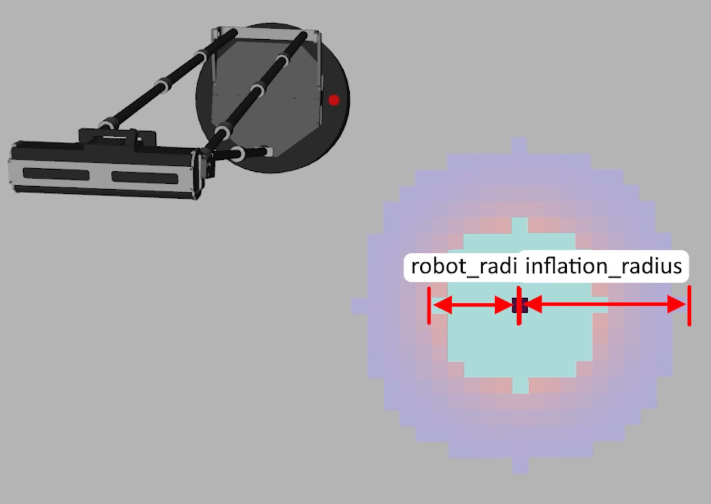 | 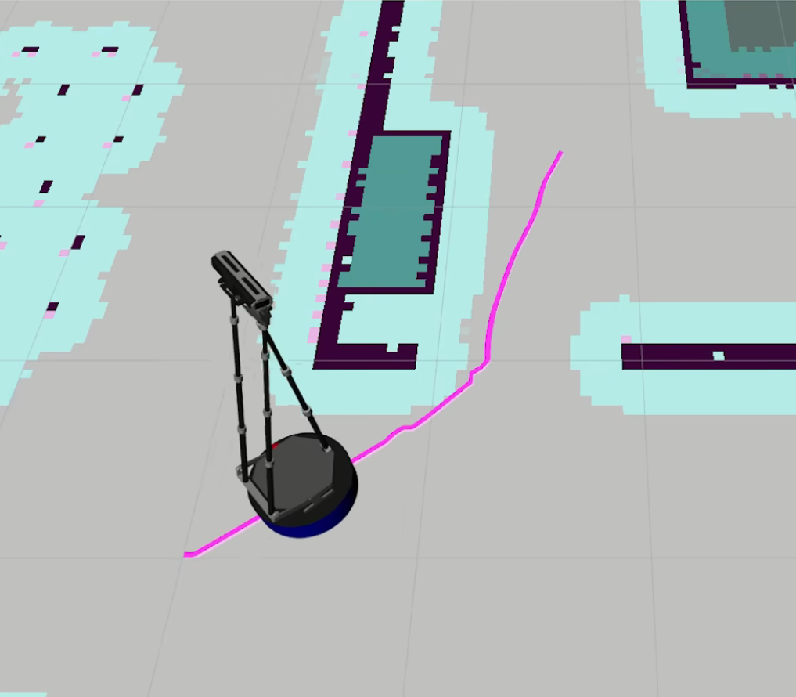 | 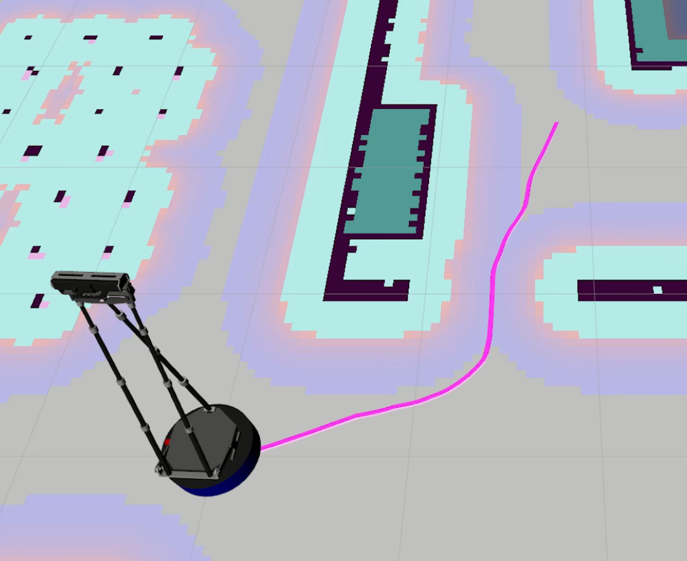 |
| ------------------------------------------------------------ | ------------------------------------------------------------ | ------------------------------------------------------------ |

- **为什么不直接用最大半径画圆？**
  - 在只有最大圆的情况下，它会贴着墙壁走，如果定位稍有误差，就可以撞墙；
  - 在正常的代价地图中，规划的路线可以在门口的中间，安全性提高很多；

### 3.2 检测范围参数

- obstacle_range：激光雷达检测的(obstacle_range)米内的障碍物加入到代价地图中，一般设置为激光雷达的有效检测距离；
- raytrace_range：在这个举例内被激光雷达穿透的栅格都认为没有障碍物存在；
- observation_sources：动态障碍物的观测来源；
- base_lidar：数据来源的数据参数，它的名称是可以改的，只要和observation_sources中的值一样即可；

### 3.3 文件的拓展

- 在这个示例，只有激光雷达的扫描数据，也可以添加其他的数据源来为代价地图添加信息；
- **比如下面添加的头部相机数据**

```c
robot_radius: 0.25
inflation_radius: 0.5
obstacle_range: 6.0
raytrace_range: 6.0
observation_sources: base_lidar head_kinect2
base_lidar: {
    data_type: LaserScan,
    topic: /scan, 
    marking: true, 
    clearing: true
    }
head_kinect2: {
    data_type: PointCloud2,
    topic: /kinect2/sd/points,
    marking: true,
    clearing: true,
    max_obstcale_height: 1.5,
    min_obstcale_height: 0.2
}
```


## 4.global_costmap_params.yaml文件

```c
global_costmap:
  global_frame: map			// 地图坐标系名称
  robot_base_frame: base_footprint		// 底盘坐标系名称
  static_map: true			// 是否将map_server发来的地图作为原始地图，如果目的地是一些还没建图的区域可以将其设为false
  update_frequency: 1.0		// 把障碍物添加到代价地图的频率
  publish_frequency: 1.0	// 发布给Rviz显示的频率
  transform_tolerance: 1.0	// transform的荣忍值
```

- transform_tolerance参数所指的transform指的是laser_frame到map的这一整个transform

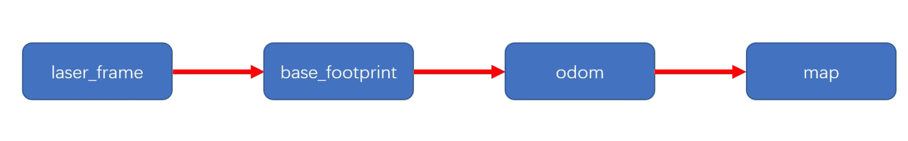


## 5.local_costmap_params.yaml文件

```c
local_costmap:
  global_frame: odom					// 地图的坐标系
  robot_base_frame: base_footprint		// 机器人底盘坐标系
  static_map: false						// 使用当前激光雷达实时扫描的地图
  rolling_window: true					// 局部代价地图的框是否跟着机器人移动
  width: 3.0
  height: 3.0
  update_frequency: 10.0
  publish_frequency: 10.0
  transform_tolerance: 1.0
```

---


# 第五十七节课：恢复行为Recovery Behaviour

## 1.恢复行为的发生条件

- 在下图的ROS导航框架中，当机器人遇到障碍物无法通过局部规划器避障时，会发生恢复行为；
- 恢复行为会更新障碍物到全局地图上，然后在更新的全局地图的前提下规划新的路线，让机器人回到正常的导航状态上；

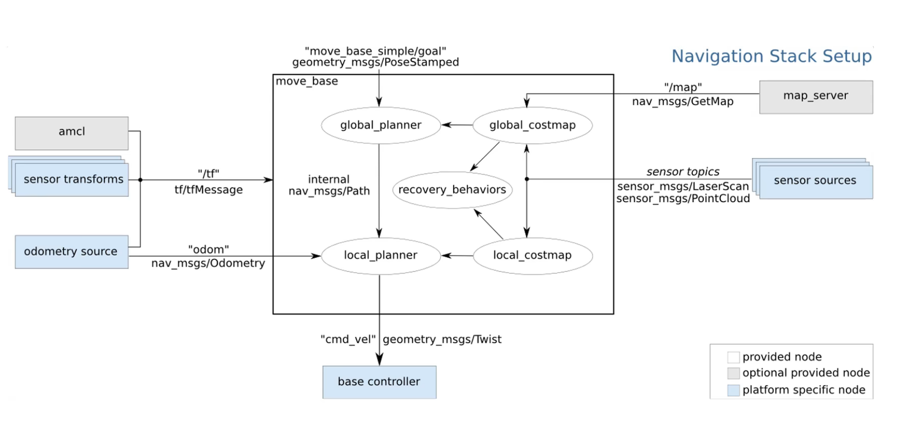


## 2.恢复行为的介绍

- 在正常情况下，它处于正常导航状态；
- 如果某个时刻它被困住了，它就会进行保守重置，如果保守重置成功就会回到正常导航状态；
- 如果没有成功，就会进行旋转清除，重新扫描周围的障碍物，如果成功则回到正常导航；
- 后面的激进重置和旋转清除是一样的；

| 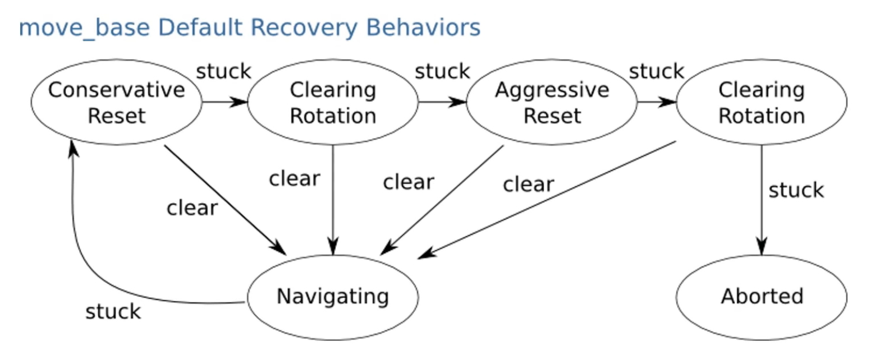 | 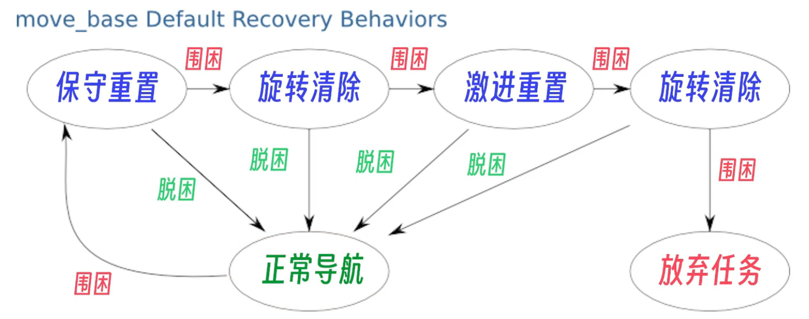 |
| ------------------------------------------------------------ | ------------------------------------------------------------ |

- **在这个机制中，一般在激光雷达只能扫描半周的前提下是好用的，在旋转清除下可重新更新地图；**
- 在rviz的终端中，可以查看到这几种状态的转变；

---


# 第五十八节课：恢复行为的参数设置

## 1.恢复行为的参数解析

- 在之前的恢复行为框图中，本质上只有两种行为：重置行为和旋转行为，两个重置行为只是参数不一样；
- 重置行为对应的类型为：clear_costmap_recovery/ClearCostmapRecovery，前面的clear_costmap_recovery是命名空间；
- 旋转行为对应的类型为：rotate_recovery/RotateRecovery，前面的rotate_recovery是命名空间；
- 除了这两种行为外，还有一种类型是move_slow_and_clear/MoveSlowAndClear，它会在几个点间来回，但一般不用；

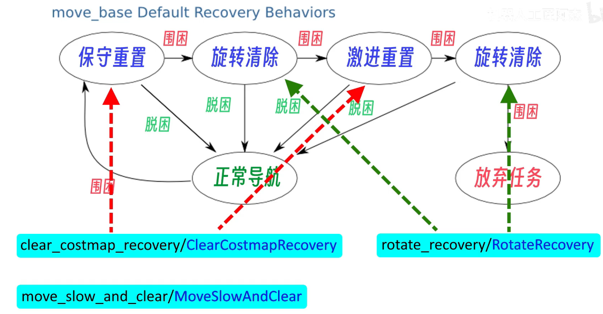

- **这三种行为类型是ROS自带的，那就可以通过它们的组合，得到不同执行顺序的恢复行为；**


## 2.自定义恢复行为

- 恢复行为主要是为了全局规划路线使用的，所以在global_costmap_params.yaml文件中定义；
- **在global_costmap_params.yaml中添加如下代码**
  - recovery_behaviors指明了这个命名空间是给恢复行为用的；
  - 下面两个name指明了两个行为，一个是旋转行为，一个清除行为；
  - 下面的reset_recovery又单独对清除行为做了属性的约定，约定了重置的距离和重置的图层；
  - 这里的重置行为的距离，指的是以机器人中心为中心，周围的reset_distance边长的正方形外的所有都重置；

```yaml
recovery_behaviors:
  - name: 'rotate_recovery'
    type: 'rotate_recovery/RotateRecovery'
  - name: 'reset_recovery'
    type: 'clear_costmap_recovery/ClearCostmapRecovery'

reset_recovery:
  reset_distance: 0
  layer_names: ['obstacle_layer']
```

- **地图的分层**

  - 在上面的最后一行中，有一个layer_name，这指的是地图的层级；
  - 在ROS的地图中可以分为四层：
    - 第一层是用map_server加载的之前已经建好的地图，它是一个静态的地图；
    - 第二次是Obstacles层，它是障碍物地图，是由机器人在实际运行过程中实时生成的；
    - 第三层是Inflation层，它是基于前面两层添加后，再进行膨胀得到的地图；
    - 最后一层是Master层，它是前面三层的叠加，它就是Rviz中看到的代价地图；

  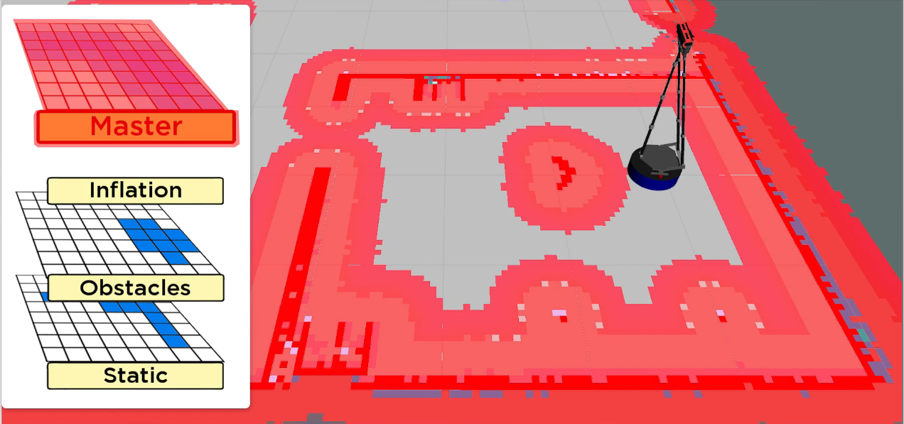

- **默认恢复行为中的距离**
  - 在默认恢复行为中，即使是激进重置，它的距离也都还有1.84米；
  - 在我们自己定义的恢复行为中，我们直接将它设置为0.0，也就是所有的Obsta层都清除；


## 3.自定义恢复行为的实际效果

- 先在大门口的位置放置一个大正方形，让它更新障碍地图，显示大门口是出不去的；
- 然后再将大正方形沿着x方向移动，挡住机器人扫描大门口，这样原来的大门口的障碍物阴影它也无法消除；
- 然后在房间外给它设置一个目的地，让它开始路径规划；
- 会发现它先进性旋转，然后再进性清除，当清除了大门口的障碍物阴影时，它就可以找出路径顺利出去了；

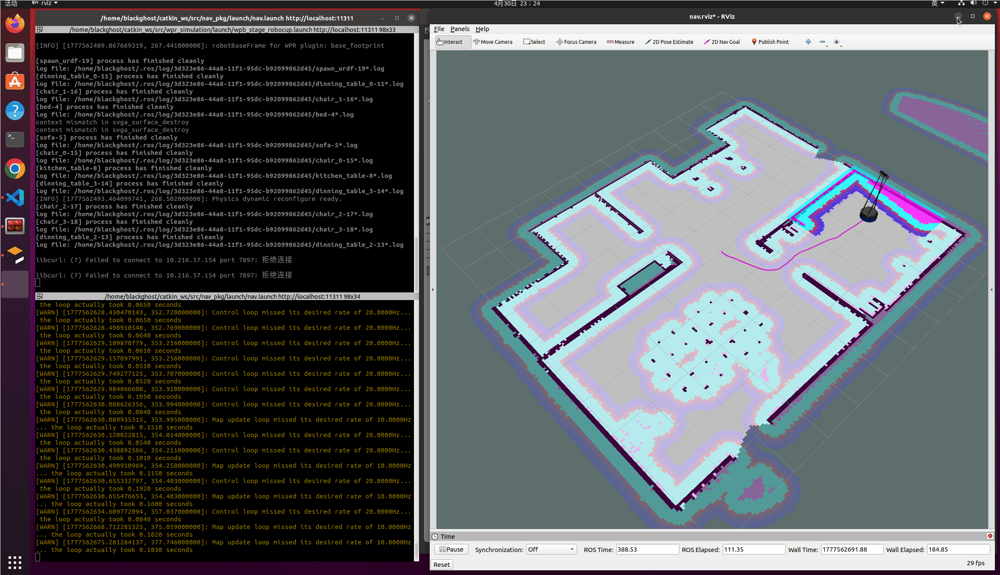


## 4.图形层数细节

- 在恢复行为的代码实现底层，图形的障碍物层叫做obstacles；
- 但是在costmap_2d_ros即代价地图底层代码实现上，障碍物层是叫做obstacles_layer的；
- 所有在恢复行为中，重置行为要想将代价地图中的障碍物层清除，必须要保持两者之间名字的一致，否则会失败；
  - 方法1：在代价层函数中，将obstacles_layer改为obstacles；
  - 方法2：像前面一样，在恢复行为中，将obstacles改为obstacles_layer；

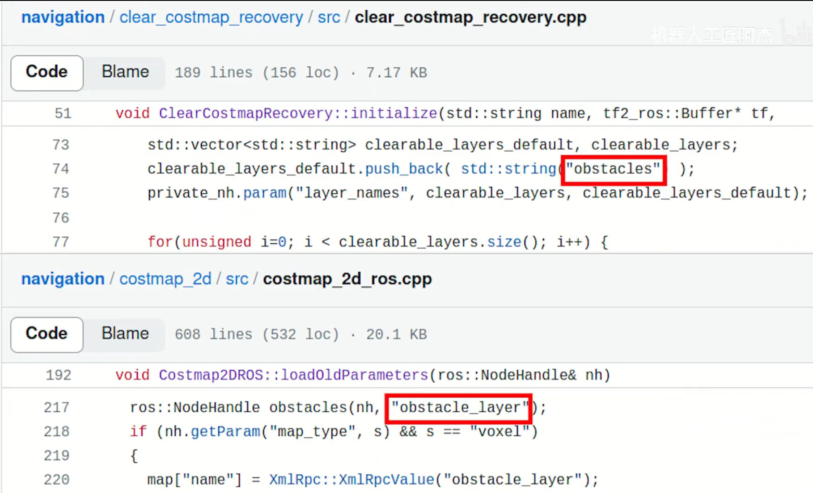

---


# 第五十九节课：局部规划器Local Planner

## 1.局部规划器概述

- 局部规划器即图中的local_planner；
- 全局规划器global_planner生成导航路线，但最终走成什么效果是由local_planner决定的；
- 局部规划器local_planner就是机器人的运动控制器；


## 2.局部规划器的选择

- 在ROS中，有如下几种局部规划器，如下表所示；
- Trajectory Planner：ROS默认局部规划器，使用DMA算法，但代码质量不高，有了后面的DWA Planner；
- DWA Planner：ROS自带的局部规划器，一般用来取代Trajectory Planner；
- Eband Planner：实现思路与后面的TEB Planner相似，是第三方的局部规划器；
- TEB Planner：加入了时间因素的考虑，同时还提供了代价地图的优化插件，是第三方的局部规划器；
- 前面四种规划器一般会选择DMA Planner和TEB Planner；
- WpbhLocalPlanner是本课程会使用到的局部规划器；

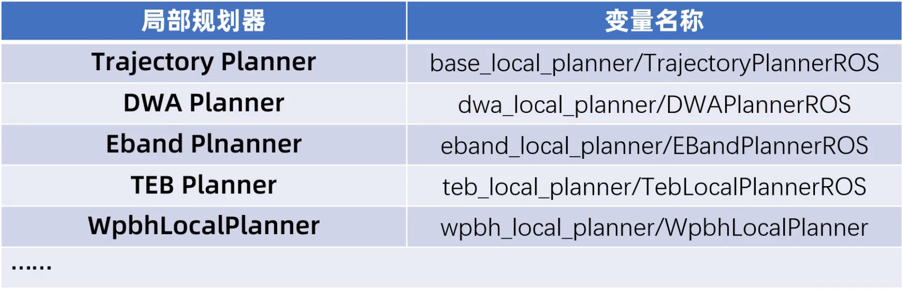


## 3.局部规划器的指定

### 3.1 局部规划器使用

- 只需要在launch文件中，指定base_local_planner的value值即可；
- 在先前的launch文件中，选择的局部规划器就是WpbhLocalPlanner；

```c
<launch>

    <node pkg="move_base" type="move_base" name="move_base">
        <rosparam file="$(find wpb_home_tutorials)/nav_lidar/costmap_common_params.yaml" command="load" ns="global_costmap" />
        <rosparam file="$(find wpb_home_tutorials)/nav_lidar/costmap_common_params.yaml" command="load" ns="local_costmap" />
        <rosparam file="$(find wpb_home_tutorials)/nav_lidar/global_costmap_params.yaml" command="load" />
        <rosparam file="$(find wpb_home_tutorials)/nav_lidar/local_costmap_params.yaml" command="load" />
        <param name="base_global_planner" value="global_planner/GlobalPlanner" /> 
        <param name="base_local_planner" value="wpbh_local_planner/WpbhLocalPlanner" />
    </node>

    <node pkg="map_server" type="map_server" name="map_server" args="$(find wpr_simulation)/maps/map.yaml"/>

    <node pkg="amcl" type="amcl" name="amcl"/>

    <node name="rviz" pkg="rviz" type="rviz" args="-d $(find nav_pkg)/rviz/nav.rviz"/>

</launch>
```

### 3.2 WpbhLocalPlanner规划器

- WpbhLocalPlanner规划器的文件在**~/catkin_ws/src/wpb_home/wpbh_local_planner**文件夹中；
- 当编译整个空间目录时，它就会自动安装到ROS系统中；
- WpbhLocalPlanner在实际运动过程中**根据激光雷达采集到的障碍点信息，把代价地图、Dijkstra算法在局部规划器又实现一遍；**

---


# 第六十节课：DWA规划器

## 1.DWA规划器概述

- DWA全称为Dynamic Window Approach，即动态窗口方法；

- **DWA规划器的原理**
  - 根据当前位置和导航路线生成轨迹，其中撞上障碍物的轨迹会被抛弃；
  - 其余的剩下来的生成轨迹以及在轨迹上可能的速度变化就是所谓的窗口；
  - DWA算法根据剩下来的窗口，选择最合适的窗口，最终到达终点；
- **DWA算法挑选窗口的原则**
  - 窗口和全局导航路线的贴合程度；
  - 窗口末端与终点的距离；
  - 窗口路线和障碍物之间的距离；
- 可见，DWA算法是以平滑的弧线到达终点为目的的，所以实际过程中的路线一般不与全局规划路线重合；

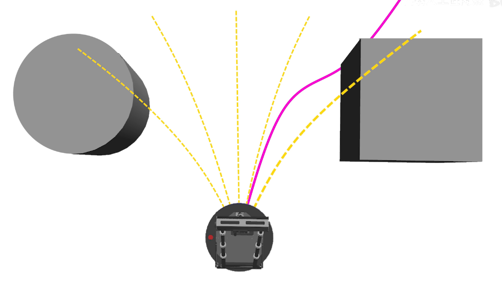


## 2.DWA规划器的使用

- **修改launch文件**

  - 将局部规划器改为DWA规划器；
  - 为DWA规划器添加参数；

  ```yaml
  <launch>
  
      <node pkg="move_base" type="move_base" name="move_base">
          <rosparam file="$(find wpb_home_tutorials)/nav_lidar/costmap_common_params.yaml" command="load" ns="global_costmap" />
          <rosparam file="$(find wpb_home_tutorials)/nav_lidar/costmap_common_params.yaml" command="load" ns="local_costmap" />
          <rosparam file="$(find wpb_home_tutorials)/nav_lidar/global_costmap_params.yaml" command="load" />
          <rosparam file="$(find wpb_home_tutorials)/nav_lidar/local_costmap_params.yaml" command="load" />
          <param name="base_global_planner" value="global_planner/GlobalPlanner" /> 
          <param name="base_local_planner" value="dwa_local_planner/DWALocalPlannerROS" />
          <rosparam file="$(find wpb_home_tutorials)/nav_lidar/dwa_local_planner_params.yaml" command="load" />
      </node>
  
      <node pkg="map_server" type="map_server" name="map_server" args="$(find wpr_simulation)/maps/map.yaml"/>
  
      <node pkg="amcl" type="amcl" name="amcl"/>
  
      <node name="rviz" pkg="rviz" type="rviz" args="-d $(find nav_pkg)/rviz/nav.rviz"/>
  
  </launch>
  ```

- **启动仿真环境**

  - 修改完launch文件后，直接按照之前的方式启动，就可以看见代价地图了；

  ```bash
  roslaunch wpr_simulation wpb_stage_robocup.launch
  
  # 新开一个终端
  roslaunch nav_pkg nav.launch
  ```

- **设置Rviz**

  - 先设置Rviz，添加DWA的路径显示项目；
  - 添加Path，话题选择为/move_base/DWAPlannerROS/local_plan；线条样式Line Style改为BillBoards；
  - 接着显示备选的生成轨迹；
  - 选择添加PointCloud2，话题名称选择/move_bse/DWAPlannerROS/trajectory_cloud；

- **运行效果**

  - 设置一个目标点，机器人开始移动，会出现不同的生成轨迹，其中只有一条被选中；

  


## 3.DWA规划器的参数

### 3.1 DWA规划器的参数介绍

- 在前面修改的launch文件中，**wpb_home_tutorials)/nav_lidar/dwa_local_planner_params.yaml**就是DWA规划器的参数文件；
- 打开该文件，内容如下

```yaml
DWAPlannerROS:
  # 速度参数
  max_vel_x: 0.3      # 最大x方向速度
  min_vel_x: -0.05    # 最小x方向速度（设置负数将会允许倒车）
  max_vel_y: 0.0      # 差分驱动机器人的最大y方向速度为 0.0
  min_vel_y: 0.0      # 差分驱动机器人的最小y方向速度为 0.0
  max_vel_trans: 0.3  # 最大平移速度
  min_vel_trans: 0.01 # 最小平移速度（建议不要设置为 0.0 ）
  trans_stopped_vel: 0.1  # 当平移速度小于这个值，就让机器人停止
  acc_lim_trans: 2.5      # 最大平移加速度
  acc_lim_x: 2.5          # x方向的最大加速度上限
  acc_lim_y: 0.0          # y方向的加速度上限（差分驱动机器人应该设置为 0.0 ）
  
  max_vel_theta: 1.0      # 最大旋转速度，略小于基座的功能
  min_vel_theta: -0.01    # 当平移速度可以忽略时的最小角速度
  theta_stopped_vel: 0.1  # 当旋转速度小于这个值，就让机器人停止
  acc_lim_theta: 6.0      # 旋转的加速度上限

  # 目标容差参数
  yaw_goal_tolerance: 0.1         # 目标航向容差
  xy_goal_tolerance: 0.05         # 目标xy容差
  latch_xy_goal_tolerance: false  # 到达目标容差范围后，停止移动，只旋转调整航向

  # 向前模拟参数
  sim_time: 1.7       # 模拟时间，默认值 1.7
  vx_samples: 3       # x方向速度采样数，默认值 3
  vy_samples: 1       # 差分驱动机器人y方向速度采样数，只有一个样本
  vtheta_samples: 20  # 旋转速度采样数，默认值 20

  # 轨迹评分参数
  path_distance_bias: 32.0  # 靠近全局路径的权重，默认值 32.0
  goal_distance_bias: 24.0  # 接近导航目标点的权重，默认值 24.0
  occdist_scale: 0.01       # 控制器避障的权重，默认值 0.01
  forward_point_distance: 0.325 # 从机器人到评分点的位置，默认值 0.325
  stop_time_buffer: 0.2     # 在碰撞前机器人必须停止的时间长度，留出缓冲空间，默认值 0.2
  scaling_speed: 0.25       # 缩放机器人速度的绝对值，默认值 0.25
  max_scaling_factor: 0.2   # 机器人足迹在高速时能缩放的最大系数，默认值 0.2

  # 防振动参数
  oscillation_reset_dist: 1.05 # 重置振动标志前需要行进的距离，默认值 0.05

  # 辅助调试选项
  publish_traj_pc : true      # 是否在 RViz 里发布轨迹
  publish_cost_grid_pc: true  # 是否在 RViz 里发布代价网格
  global_frame_id: odom       # 基础坐标系

  # 差分驱动机器人配置
  holonomic_robot: false # 是否全向移动机器人
```

- 更详细的参数可以参考官网，搜索dwa，选择dwa_local_planner即可；
- 可以对照着官网对参数的介绍，然后修改对应的参数，保存后再次运行即可更新参数；

### 3.2 DWA规划参数的可视化调节平台

- 终端执行下面命令

```bash
rosrun rqt_reconfigure rqt_reconfigure
```

- 可视化界面如图所示

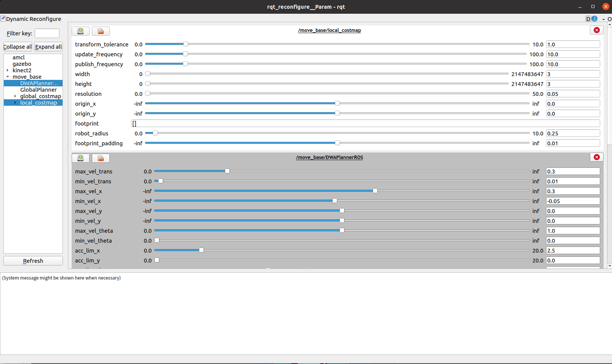

- 可以通过可视化界面调整参数，找到比较好的参数，然后再回填到参数文件中，这样就可以更方便的调参了；
- 注意，这个可视化调参界面需要在仿真环境启动的情况下才能打开；

### 3.3 DWA规划器的几个重要参数

- 第一个参数如果设置为大于0的数，将不允许倒车；
- 后面三个参数是轨迹的评分参数，对应数值越大，该因素的评分占比越大；

```yaml
  min_vel_x: -0.05    # 最小x方向速度（设置负数将会允许倒车）
  
  # 轨迹评分参数
  path_distance_bias: 32.0  # 靠近全局路径的权重，默认值 32.0
  goal_distance_bias: 24.0  # 接近导航目标点的权重，默认值 24.0
  occdist_scale: 0.01       # 控制器避障的权重，默认值 0.01
```

---


# 第六十一节课：TEB规划器

## 1.TEB规划器概述

- TEB全称为Timed Elastic Band，即时间弹力带；

- **TEB规划器的原理**

  - TEB规划器根据全局地图，选择一小段路径进性优化，在起点和终点间画一条直线；
  - 接着全局路线起到吸引作用，障碍物起到排斥作用，对这条直线作用得到实际的路线，这就是弹力带；
  - 接着TEB会在每一条弹力带上预测未来几个时间单位内机器人的位置，选择时间最短的弹力带；

  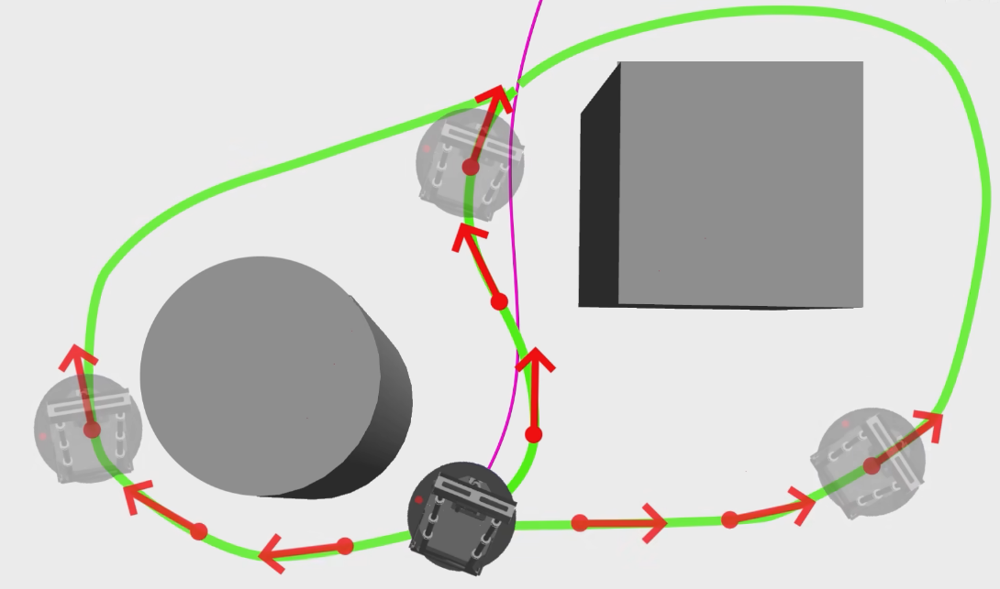


## 2.TEB规划器的使用

### 2.1 规划器的安装

- TEB不属于ROS官方自带的规划器，所以需要另外安装；
- **终端安装**

```bash
sudo apt install ros-noetic-teb-local-planner
```

### 2.2 启动TEB规划器

- **修改launch文件**

  - 打开之前的launch文件；
  - 将规划器改为TEB规划器，并修改相关的参数；

  ```yaml
  <launch>
  
      <node pkg="move_base" type="move_base" name="move_base">
          <rosparam file="$(find wpb_home_tutorials)/nav_lidar/costmap_common_params.yaml" command="load" ns="global_costmap" />
          <rosparam file="$(find wpb_home_tutorials)/nav_lidar/costmap_common_params.yaml" command="load" ns="local_costmap" />
          <rosparam file="$(find wpb_home_tutorials)/nav_lidar/global_costmap_params.yaml" command="load" />
          <rosparam file="$(find wpb_home_tutorials)/nav_lidar/local_costmap_params.yaml" command="load" />
          <param name="base_global_planner" value="global_planner/GlobalPlanner" /> 
          <param name="base_local_planner" value="teb_local_planner/TebLocalPlannerROS" />
          <rosparam file="$(find wpb_home_tutorials)/nav_lidar/teb_local_planner_params.yaml" command="load" />
          <param name="controller_frequency" value="10" type="double" />
      </node>
  
      <node pkg="map_server" type="map_server" name="map_server" args="$(find wpr_simulation)/maps/map.yaml"/>
  
      <node pkg="amcl" type="amcl" name="amcl"/>
  
      <node name="rviz" pkg="rviz" type="rviz" args="-d $(find nav_pkg)/rviz/nav.rviz"/>
  
  </launch>
  ```

- **启动规划器**

  - 修改完launch文件后，直接按照之前的方式启动；

  ```bash
  roslaunch wpr_simulation wpb_stage_robocup.launch
  
  # 新开一个终端
  roslaunch nav_pkg nav.launch
  ```

- **设置Rviz**

  - 先设置Rviz，添加TEB的路径显示项目；
  - 添加Path，话题选择为/move_base/TebPlannerROS/local_plan；线条样式Line Style改为BillBoards；
  - 接着显示备选的生成轨迹；
  - 选择添加PoseArray，话题名称选择/move_bse/TebPlannerROS/teb_poses；

- **运行效果**

  - 在实际运行中,会出现一个个红色箭头,那就是TEB预测的未来几个时间内的运动位置；
  - 在最后到达终点时，TEB规划器会采用倒车入库的方式调整方向；

  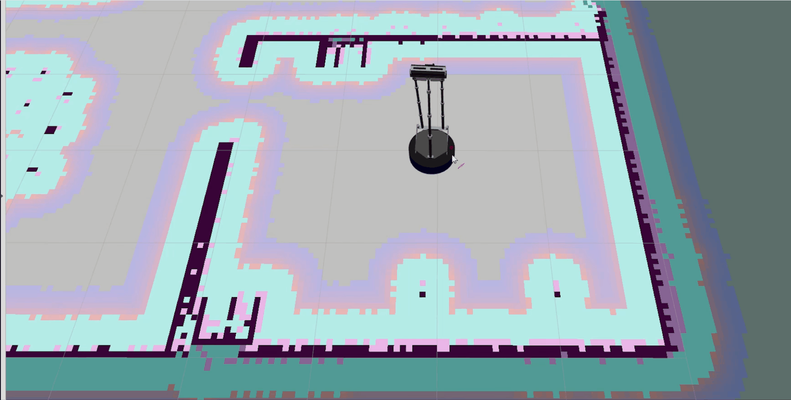

- **选择原则**
  - 由于TEB规划器在到达终点时，倾向于使用倒车入库的方式调整方向，所以天生适合于像阿克曼底盘这样无法原地旋转的底盘结构；
  - 但也正是因为它采用倒车入库的方式，所以对于机器人后方没有雷达视野的,就需要谨慎考虑TEB规划器了;


## 3.TEB规划器的参数

### 3.1 TEB规划器的参数介绍

- 在前面修改的launch文件中，**wpb_home_tutorials)/nav_lidar/teb_local_planner_params.yaml**就是TEB规划器的参数文件；
- 打开该文件，内容如下

```yaml
TebLocalPlannerROS:
 odom_topic: odom

 # 策略相关
 teb_autosize: True  # 是否允许改变轨迹的时域长度，也就是改变 dt_ref
 dt_ref: 0.5         # 路径上的两个相邻姿态的默认距离
 dt_hysteresis: 0.1  # 允许改变的时域解析度的浮动范围
 global_plan_overwrite_orientation: True # 是否修正全局路径中的临时局部路径点的朝向
 max_global_plan_lookahead_dist: 2.0     # 最大向前看距离
 feasibility_check_no_poses: 2           #在判断生成的轨迹是否冲突时使用，此时设置为2，即从轨迹起点开始逐个检查轨迹上的2个点，若2个点均不发生碰撞，则认为本次轨迹有效。
    
 # 运动相关     
 max_vel_x: 0.4           # 最大速度
 max_vel_x_backwards: 0.2 # 最大倒车速度，设置为0或者负数将导致错误。减少倒车应该修改倒车权重，不改这里。
 max_vel_theta: 1.0       # 最大转向角速度，跟 min_turning_radius 相关 (r = v / omega)
 acc_lim_x: 0.5           # 最大线加速度
 acc_lim_theta: 1.0       # 最大角加速度

 # ********************** 转弯半径相关 ********************
 min_turning_radius: 0.0         # 小转弯半径。如果设为 0，表示可以原地转弯。
 wheelbase: 0.31                 # 只有在 cmd_angle_instead_rotvel为true时才有效
 cmd_angle_instead_rotvel: False # 是否将收到的角速度消息转换为操作上的角度变化。设置成 True 时，话题 vel_msg.angular.z 内的数据是转轴角度。
 # ********************************************************************

# 车体轮廓
 footprint_model: # types可选项: "point", "circular", "two_circles", "line", "polygon"
   type: "circular"
   # 对 type "circular" 有效的参数：
   radius: 0.17
   # 对 type "line" 有效的参数：        
   line_start: [0.0, 0.0] 
   line_end: [0.35, 0.0]
   # 对 type "two_circles" 有效的参数：
   front_offset: 0.35
   front_radius: 0.35
   rear_offset: 0.35
   rear_radius: 0.35
   # 对 type "polygon" 有效的参数：
   vertices: [ [0.35, 0.0], [-0.2, -0.25], [0.2, -0.25]] 

 # 到达目标点的判断容差   
 xy_goal_tolerance: 0.2
 yaw_goal_tolerance: 0.1
    
 # 障碍物相关 
 min_obstacle_dist: 0.1  # 与障碍物的最小间距
 inflation_dist: 0.4     # 障碍物膨胀距离
 include_costmap_obstacles: True          # 是否检测动态障碍物
 costmap_obstacles_behind_robot_dist: 1.0 # 身后多远距离内障碍物加入检测范围
 obstacle_poses_affected: 25              # 障碍物对附近多少个关键点产生影响
 costmap_converter_plugin: ""             # costmap_converter 插件名称，这里不使用

 # 路径优化相关
 no_inner_iterations: 3     # 图优化optimizer的迭代次数
 no_outer_iterations: 3     # 外循环迭代次数
 penalty_epsilon: 0.1       # 为所有的惩罚项增加一个小的安全余量
 weight_max_vel_x: 2        # 平移速度的优化权重
 weight_max_vel_theta: 1    # 角速度的优化权重
 weight_acc_lim_x: 1        # 平移加速度的优化权重
 weight_acc_lim_theta: 1    # 角加速度的优化重量
 weight_kinematics_nh: 1000 # 非完整运动学的优化权重
 weight_kinematics_forward_drive: 1 # 往前移动的权重
 weight_optimaltime: 1      # 耗时权重
 weight_obstacle: 50        # 与障碍物保持距离的权重

 # 多线规划
 enable_homotopy_class_planning: True # 激活多线规划
 enable_multithreading: True          # 多线程计算
 max_number_classes: 2                # 规划的路径线数上限
 selection_cost_hysteresis: 1.0       # 路径轨迹入选的评价上限
 selection_obst_cost_scale: 1.0       # 障碍物评价在入选标准中的缩放倍率
 selection_alternative_time_cost: False # 时间成本是否要进行平方计算
 roadmap_graph_no_samples: 15         # 为创建 roadmap graph 而生成的样本数
 roadmap_graph_area_width: 5          # 关键点采样的宽度，单位为米。
```

- 更详细的参数可以参考官网，搜索teb，选择teb_local_planner即可；
- 可以对照着官网对参数的介绍，然后修改对应的参数，保存后再次运行即可更新参数；

### 3.2 DWA规划参数的可视化调节平台

- 终端执行下面命令

```bash
rosrun rqt_reconfigure rqt_reconfigure
```

- 可视化界面如图所示

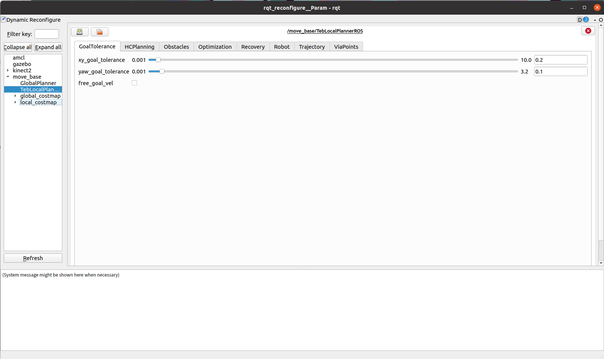

- 可以通过可视化界面调整参数，找到比较好的参数，然后再回填到参数文件中，这样就可以更方便的调参了；
- 注意，这个可视化调参界面需要在仿真环境启动的情况下才能打开；

### 3.3 DWA规划器的几个重要参数

- 第一个参数表示到达终点时的倒车半径；
- 第二个参数表示是否开启插件，这里默认没有开启；

```yaml
 min_turning_radius: 0.0         # 小转弯半径。如果设为 0，表示可以原地转弯。
 costmap_converter_plugin: ""             # costmap_converter 插件名称，这里不使用
```

---


# 第六十二节课：导航的Action编程接口

## 1.问题提出

### 1.1 背景

- 在前面中已经基本介绍完了**Navigation导航系统；**
- 但是在前面都是通过手动的方式设置目的地的，实际开发中是需要机器人能够自主导航的；
- 即实际开发中是需要**编写程序来实现自主导航功能的；**

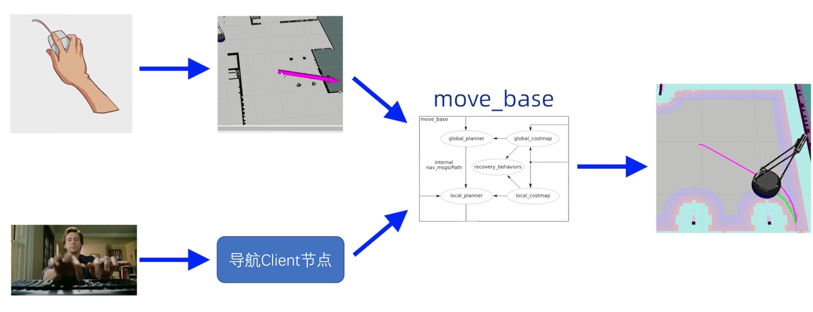

### 1.2 导航Client节点

- 要实现程序指定导航目的地的效果，需要使用到**Navigation的导航接口；**
- Navigation的导航接口有好几个，但是ROS推荐使用**Action接口**实现导航接口功能；

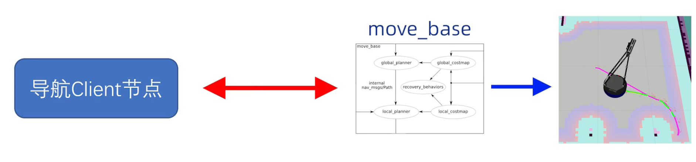


## 2.Action接口介绍

- Topic通信中，信息的流动是单向的，由某个节点流向另一个节点；
- Action通信中，信息的流向是双向的，由Client和Server两个实体组成；
- 在Navigation导航中，Action通信这样实现：
  - 自己写一个Client节点，它会向move_base这个Server节点发送导航请求，其中导航请求中包含了导航的目的地和期待的姿态角；
  - move_base接收到请求后，按之前的逻辑进性导航，并不断的向Client节点反回导航的进度；
  - 导航完成后可以向Client返回成功的消息，若失败也会返回失败的消息；

|  | 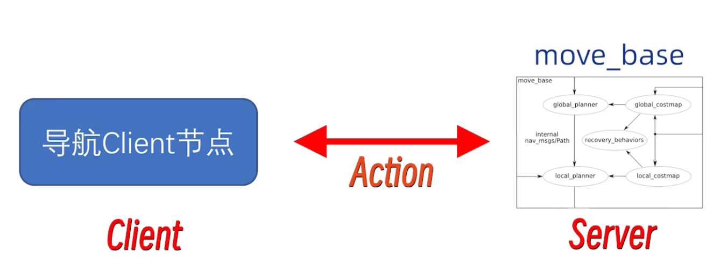 |
| ---------------------------------------------------------- | ------------------------------------------------------------ |

---


# 第六十三节课：坐标导航的C++编程实现

## 1.坐标导航C++节点的步骤

- 编写节点代码；
- 设置编译规则；
- 编译节点文件；
- 运行节点文件；


## 2.编写节点代码

- 打开VsCode，在nav_pkg的src目录下，新建文件**nav_client.cpp；**

- **move_base的Action接口的数据格式**

  - move_base用Action接口进行通信时，需要目标、结果和过程反馈三个消息包类型；
  - MoveBaseAction Message消息包包含了这三种消息包，所以代码中包含这一个消息包头文件即可；

  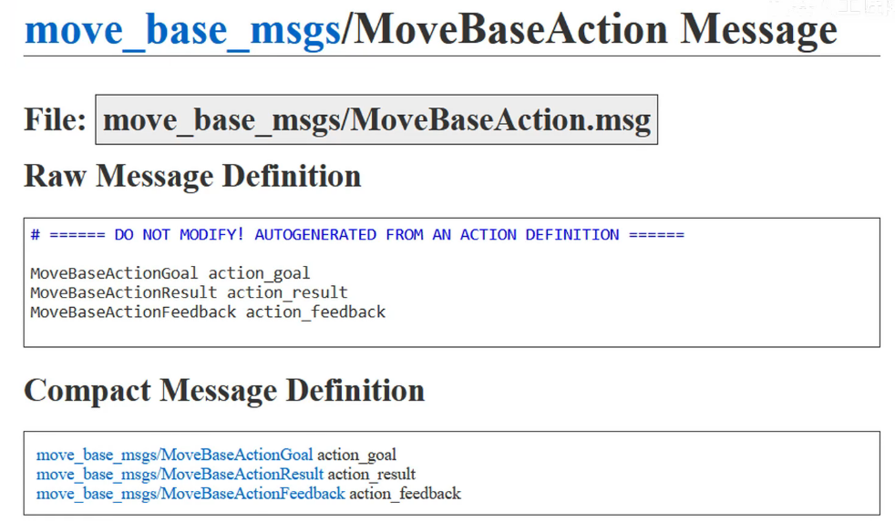

- **编写如下代码**

```cpp
#include <ros/ros.h>
#include <move_base_msgs/MoveBaseAction.h>              /* MoveBaseAction的消息包格式 */
#include <actionlib/client/simple_action_client.h>      /* 简单的Action客户端模式 */

typedef actionlib::SimpleActionClient<move_base_msgs::MoveBaseAction> MoveBaseClient;   /* 将客户端类型重定义 */

int main(int argc, char** argv)
{
    ros::init(argc, argv, "nav_client");

    /* 生成客户端对象 */
    MoveBaseClient ac("move_base", true);   /* true表示自动阻塞等待结果 */

    while(!ac.waitForServer(ros::Duration(5.0)))    /* 等待导航启动 */
    {
        ROS_INFO("Waiting for the move_base action server to come up");
    }

    /* 目的地信息 */
    move_base_msgs::MoveBaseGoal goal;

    goal.target_pose.header.frame_id = "amp";
    goal.target_pose.header.stamp = ros::Time::now();

    goal.target_pose.pose.position.x = -3.0;
    goal.target_pose.pose.position.y = 2.0;
    goal.target_pose.pose.orientation.w = 1.0;

    ROS_INFO("Sending goal");

    /* 发送目标 */
    ac.sendGoal(goal);

    /* 等待结果 */
    ac.waitForResult();

    /* 查询返回i状态 */
    if (ac.getState() == actionlib::SimpleClientGoalState::SUCCEEDED)
        ROS_INFO("Mission complete!");
    else
        ROS_INFO("Mission failed ...");

    return 0;
}
```


## 3.添加编译规则并编译

### 3.1 添加编译规则

- 打开CMakeList.txt文件，在最后添加编译规则

```c
add_executable(nav_client src/nav_client.cpp)

add_dependencies(nav_client ${${PROJECT_NAME}_EXPORTED_TARGETS} ${catkin_EXPORTED_TARGETS})

target_link_libraries(nav_client ${catkin_LIBRARIES})
```

### 3.2 编译

- 打开终端，执行命令

```bash
cd ~/catkin_ws

catkin_make
```

- 如果有报错，可参考~catkin_ws/src/wpr_simulation/src/demo_simple_goal.cpp文件；


## 4.运行

- 终端执行

```bash
# 终端1
roslaunch wpr_simulation wpb_stage_robocup.launch

# 终端2
roslaunch nav_pkg nav.launch

# 终端3
rosrun nav_pkg nav_client
```

- 运行效果如下图所示


---


# 第六十四节课：坐标导航的Python编程实现

## 1.内容介绍

- 本节介绍用Python实现上一节的功能；
- 整个过程分为3步
  - 编写节点文件；
  - 添加可执行权限；
  - 运行节点文件；


## 2.编程实现

### 2.1 编写节点文件

- 打开VsCode，在nav_pkg下新建文件夹scripts，然后在文件夹下新建文件nav_client.py；

- 在文件中写入如下内容

```python
#!/usr/bin/env python3
# coding=utf-8

import rospy
import actionlib
from move_base_msgs.msg import MoveBaseAction, MoveBaseGoal		# 引入两个消息包类型

if __name__ == "__main__":
    rospy.init_node("nav_client")
    
    ac = actionlib.SimpleActionClient('move_base', MoveBaseAction)
    
    ac.wait_for_server()
    
    goal = MoveBaseGoal()
    
    goal.target_pose.header.frame_id = "map"
    goal.target_pose.pose.position.x = -3.0
    goal.target_pose.pose.position.y = 2.0
    goal.target_pose.pose.position.z = 0.0
    
    goal.target_pose.pose.orientation.x = 0.0
    goal.target_pose.pose.orientation.y = 0.0
    goal.target_pose.pose.orientation.z = 0.0
    goal.target_pose.pose.orientation.w = 1.0
    
    ac.send_goal(goal)
    
    rospy.loginfo("开始导航...")
    ac.wait_for_result()
    
    if ac.get_state() == actionlib.GoalStatus.SUCCEEDED:
        rospy.loginfo("导航成功！")
    else:
        rospy.loginfo("导航失败...")

```

### 2.2 添加可执行权限

- 终端执行如下命令

```bash
cd ~/catkin_ws/src/nav_pkg/scripts

chmod +x nav_client.py
```

### 2.3 运行效果

- 打开3个终端，分别执行

```bash
roslaunch wpr_simulation wpb_stage_robocup.launch

roslaunch nav_pkg nav.launch

rosrun nav_pkg nav_client.py
```

- 最后效果

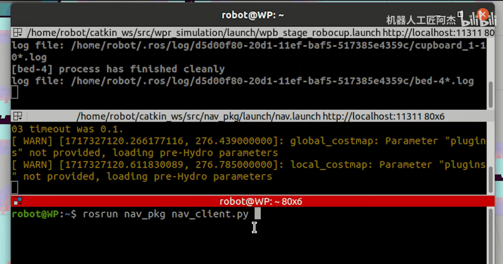

### 2.4 例子程序

- 如果运行过程中出现问题，可直接打开~/catkin_ws/src/wpr_simulation/scripts/demo_nav_client.py；
- 这个是wpr_simulation的例子程序，可对照着改；

---


# 第六十五节课：航点导航插件介绍

## 1.内容介绍

- 前面几节课介绍了如何通过**设置坐标值的方法**来实现自主导航，但是这样不太方便；
- 这节课介绍一款**开源的ROS导航插件**，它有如下功能：
  - **能够在地图上设置多个目标航点；**
  - 通过编写节点代码指定机器人导航去往指定航点；


## 2.环境配置

### 2.1 下载源码

- 打开GitHub，搜索仓库waterplus_map_tools；
- 复制它的URL链接https://github.com/6-robot/waterplus_map_tools.git；
- 回到终端，执行命令下载

```bash
cd ~/catkin_ws/src

git clone https://github.com/6-robot/waterplus_map_tools.git
```

### 2.2 安装依赖项并编译

- 在终端中执行如下命令安装依赖项

```bash
cd waterplus_map_tools/scripts

./install_for_noetic.sh
```

- 执行如下命令完成编译

```bash
cd ~/catkin_ws

catkin_make
```


## 3.导航插件设置目标航点

### 3.1 确保地图

- 在前面的课程中，已经完成了仿真环境的建图，地图文件保存在了catkin_ws/src/wpr_simulation/maps下；
- 如果还没有地图文件的需要重新建图并保存至该位置；

### 3.2 航点设置

- 在终端中执行如下命令打开**航点设置程序**

```bash
roslaunch waterplus_map_tools add_waypoint_simulation.launch
```

- **添加航点**

  - 执行后会弹出Rviz窗口，地图就是catkin_ws/src/wpr_simulation/maps下的地图；
  - 点击上方的Add Waypoint功能，为地图添加航点，其方法同前面的设置目标点；
  - 添加的航点的效果如下图所示：

  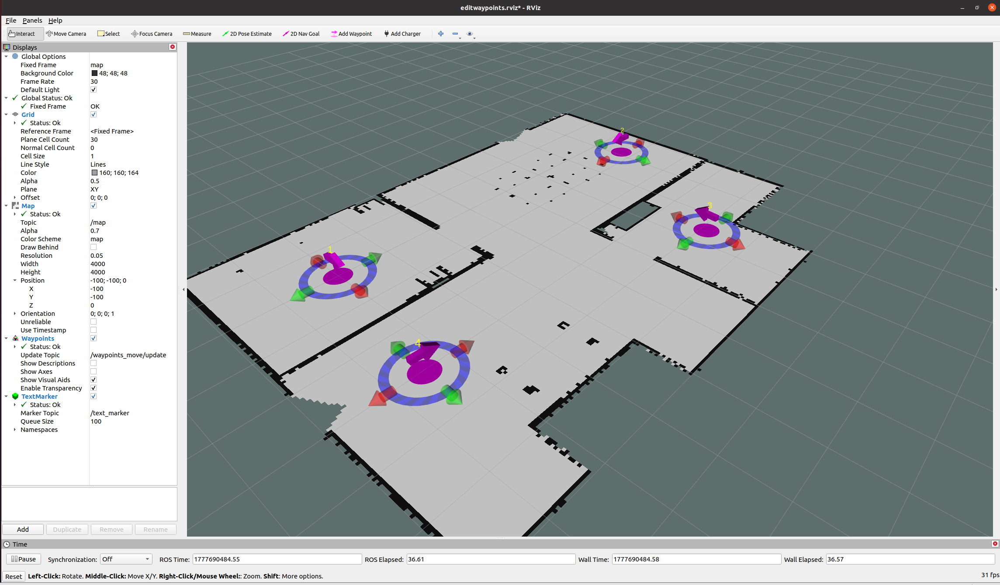

- **航点元素：对于每个航点有如下元素**

  - 序号：每一个航点上方都有一个标号，这就是航点的序号；
  - 方向：每个航点的上方都有一个箭头，表示的是航点的方向；
  - 3维调整：对于每一个航点，分别有x、y和方向3个维度，每一个维度都可以单独调节；

### 3.3 航点保存

- **航点的保存**

  - 这些航点可以像地图一样保存在文件里，后面导航时就可以直接使用了；
  - 在终端中执行如下命令打开航点保存程序

  ```bash
  rosrun waterplus_map_tools wp_saver
  ```

  - 运行后它会自动生成文件：/home/blackghost/waypoints.xml；

- **航点信息文件**

  - 打开/home/blackghost/waypoints.xml文件，其内容如下；
  - 每个航点的信息和之前直接坐标设置航点的信息是完全一样的；

  ```xml
  <Waterplus>
      <Waypoint>
          <Name>1</Name>
          <Pos_x>-2.99927</Pos_x>
          <Pos_y>1.99989</Pos_y>
          <Pos_z>0</Pos_z>
          <Ori_x>0</Ori_x>
          <Ori_y>0</Ori_y>
          <Ori_z>-0.705292</Ori_z>
          <Ori_w>0.708917</Ori_w>
      </Waypoint>
      <Waypoint>
          <Name>2</Name>
          <Pos_x>4.14557</Pos_x>
          <Pos_y>1.30697</Pos_y>
          <Pos_z>0</Pos_z>
          <Ori_x>0</Ori_x>
          <Ori_y>0</Ori_y>
          <Ori_z>0.999803</Ori_z>
          <Ori_w>0.0198674</Ori_w>
      </Waypoint>
      <Waypoint>
          <Name>3</Name>
          <Pos_x>2.43256</Pos_x>
          <Pos_y>-2.11224</Pos_y>
          <Pos_z>0</Pos_z>
          <Ori_x>0</Ori_x>
          <Ori_y>0</Ori_y>
          <Ori_z>0.673089</Ori_z>
          <Ori_w>0.739561</Ori_w>
      </Waypoint>
      <Waypoint>
          <Name>4</Name>
          <Pos_x>-3.4626</Pos_x>
          <Pos_y>-1.02481</Pos_y>
          <Pos_z>0</Pos_z>
          <Ori_x>0</Ori_x>
          <Ori_y>0</Ori_y>
          <Ori_z>-0.0300008</Ori_z>
          <Ori_w>0.99955</Ori_w>
      </Waypoint>
  </Waterplus>
  ```


## 4.基于航点信息进行导航

- 终端中执行如下命令打开仿真环境

```bash
roslaunch wpr_simulation wpb_map_tool.launch
```

- 修正机器人的位置

  - 仿真环境的机器人位置和Rviz中机器人的位置不同；
  - 点击`2D Pose Estimate`选项修正Rviz中机器人的位置即可，让它和仿真环境中的位置基本相同；

- 运行航点导航例子程序

  - 终端执行如下命令运行程序，这个程序会让机器人自动走到1号航点；

  ```bash
  rosrun wpr_simulation demo_map_tool
  ```


## 5.航点信息的修改

- 终端中再次运行添加航点的launch文件

```bash
roslaunch waterplus_map_tools add_waypoint_simulation.launch
```

- 按前面说的，可以改变3个维度的信息，更改航点的位置和朝向；

- 运行航点保存指令保存更改后的航点信息

```bash
rosrun waterplus_map_tools wp_saver
```

- 后面就可以按照“基于航点信息进行导航”部分进行导航了；

---


# 第六十六节课：航点导航插件的集成和启动

## 1.航点导航插件的框架

- 航点导航的主体仍然是Navigation导航系统中的move_base节点；
- 与之前不同的是，这次的Action接口的Client变成了wp_navi_server节点；
- wp_navi_server节点会与wp_manager节点建立通讯，从waypoints.xml文件中获取航点数据；
- 除此之外，它还会订阅一个目标航点话题，目标航点话题会指定节点需要导航到哪个航点；
- 同时，它还会发布一个导航结果话题，返回导航的状态和结果；
- 这节课要做的就是把这个框架实现到之前我们自己写的launch文件中；

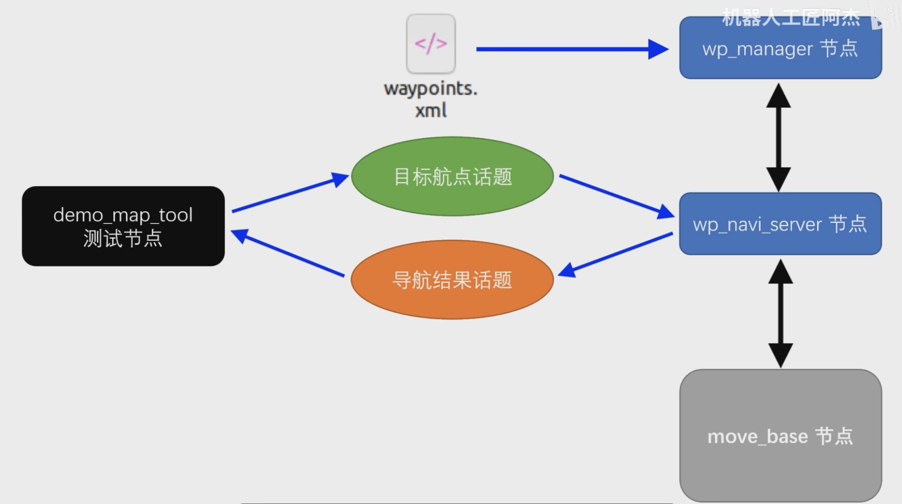


## 2.修改launch文件

### 2.1 添加节点启动项

- 在launch文件中的最后，添加如下两行代码，以启动对应的两个节点

```xml
<node pkg="waterplus_map_tools" type="wp_navi_server" name="wp_navi_server" output="screen" />
<node pkg="waterplus_map_tools" type="wp_manager" name="wp_manager" output="screen" />
```

### 2.2 修改Rviz配置文件

- 直接从wpr_simulation中拷贝配置文件；
- 打开~/catkin_ws/src/wpr_simulation/rviz，把文件map_tool.rviz拷贝到~/catkin_ws/src/nav_pkg/rviz下；

- 然后把launch文件中的rviz文件修改为拷贝的rviz文件

```xml
<node name="rviz" pkg="rviz" type="rviz" args="-d $(find nav_pkg)/rviz/map_tool.rviz"/>
```


## 3.实际运行

- 3个终端窗口中分别执行

```bash
roslaunch wpr_simulation wpb_stage_robocup.launch

roslaunch nav_pkg nav.launch

rosrun wpr_simulation demo_map_tool
```

- 实际运行效果如下图所示


## 4.总结

- 这样就为launch文件添加了航点导航功能；
- 只不过现在还是用**demo_map_tool**节点为launch文件提供目的地；
- 后面两节课将**用C++/python实现demo_map_tool节点**的功能；

---


# 第六十七节课：航点导航功能的C++实现

## 1.内容介绍

- 本节课的内容就是把上一节的**demo_map_tool**节点改为**wp_node**节点；
- 这个节点只需要发布一个话题并订阅一个话题即可；

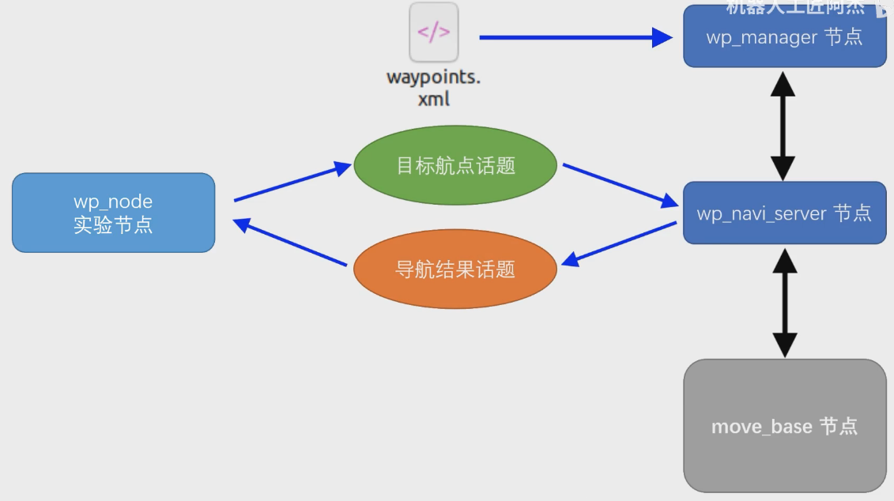


## 2.编程实现

### 2.1 编写节点

- 在nav_pkg/src目录下，新建文件wp_node.cpp文件；
- 在文件中实现如下功能

```cpp
#include <ros/ros.h>
#include <std_msgs/String.h>    // 目标航点名称为字符串格式

void NavResultCallback(const std_msgs::String &msg)
{
    ROS_WARN("[NavResultCallback] %s", msg.data.c_str());
}

int main(int argc, char** argv)
{
    ros::init(argc, argv, "wp_node");       // 初始化ros

    ros::NodeHandle n;      // 节点对象

    ros::Publisher nav_pub = n.advertise<std_msgs::String>("/waterplus/navi_waypoint", 10);     // 发布话题
    ros::Subscriber res_sub = n.subscribe("/waterplus/navi_result", 10, NavResultCallback);     // 订阅话题

    sleep(1);

    std_msgs::String nav_msg;
    nav_msg.data = "1";			// 可修改不同的数字，去往不同的航点
    nav_pub.publish(nav_msg);

    ros::spin();

    return 0;
}
```

### 2.2 添加编译规则

- 在CMakeList.txt文件的最后添加如下编译规则

```c
add_executable(wp_node src/wp_node.cpp)
add_dependencies(wp_node ${${PROJECT_NAME}_EXPORTED_TARGETS} ${catkin_EXPORTED_TARGETS})
target_link_libraries(wp_node ${catkin_LIBRARIES})
```

### 2.3 编译

- 打开终端，执行命令

```bash
cd ~/catkin_ws

catkin_make
```

- 如果有报错，可参考~catkin_ws/src/wpr_simulation/src/demo_map_tool.cpp文件；


## 3. 实际运行

- 3个终端窗口中分别执行

```bash
roslaunch wpr_simulation wpb_stage_robocup.launch

roslaunch nav_pkg nav.launch

rosrun nav_pkg wp_node
```

- 实际运行效果如下图所示


---


# 第六十八节课：航点导航功能的Python实现

## 1.编写节点

- 在nav_pkg/scripts文件夹下新建文件wp_node.py；
- 添加如下内容

```python
#!/usr/bin/env python3
# coding=utf-8

import rospy
from std_msgs.msg import String

def NavResultCallback(msg):
    rospy.logwarn("导航结果 = %s", msg.data)

if __name__ == "__main__":
    rospy.init_node("wp_node")

    navi_pub = rospy.Publisher("/waterplus/navi_waypoint", String, queue_size=10)
    res_sub = rospy.Subscriber("/waterplus/navi_result", String, NavResultCallback, queue_size=10)

    rospy.sleep(1)

    navi_msg = String()
    navi_msg.data = '1'		# 可修改不同的数字，去往不同的航点

    navi_pub.publish(navi_msg)

    rospy.spin()
```


## 2.添加可执行权限并运行

### 2.1 添加可执行权限

- 终端执行如下命令

```bash
cd ~/catkin_ws/src/nav_pkg/scripts

chmod +x wp_node.py
```

### 2.2 实际运行

- 3个终端窗口中分别执行

```bash
roslaunch wpr_simulation wpb_stage_robocup.launch

roslaunch nav_pkg nav.launch

rosrun nav_pkg wp_node.py
```

- 实际运行效果如下图所示；
- 如果有报错，可参考~catkin_ws/src/wpr_simulation/scripts/demo_map_tool.py文件；


---


# 第六十九节课：ROS中的相机话题

## 1.ROS中常用相机

- 在ROS中，最常见的相机有普通的彩色相机和有立体感知能力的RGB-D相机；

| 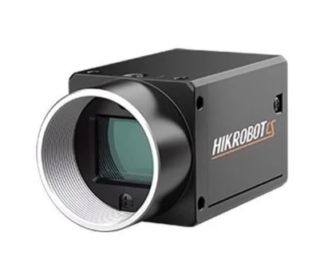 | 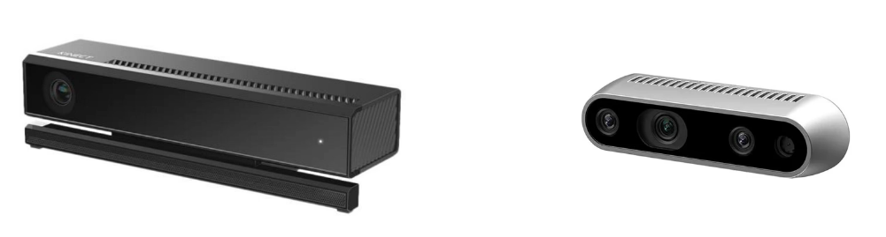 |
| --------------------------------------------------- | ----------------------------------------------------- |


## 2.相机的话题

- ROS中，相机数据的获取也是通过话题来获取的，但是相机的话题特别多；

- 彩色图像话题

  - /image_raw话题：每个像素只有RGB某个颜色的强度；
  - /image_color话题：每个像素通过插值方法得到RGB3个原色的强度和；
  - /image_color_rect话题：对彩色图像数据畸变矫正后的数据，其发送频率与相机帧率有关；
  - /camera_info：相机相关参数话题，可获取参数自行进行矫正图像；
  - 在一般的开发中，直接获取/image_color_rect话题即可；

  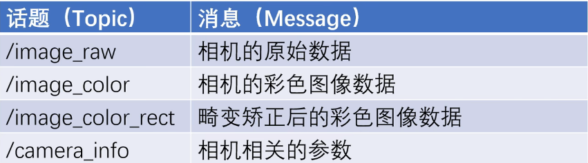

- 查看话题频率

  - 可以在终端中执行下方命令查看频率；
  - 通常/image_color_rect话题的频率为30fps的倍数；

  ```bash
  rostopic hz /kinect2/qhd/image_color_rect
  ```

  

## 3.话题格式

- /image_color_rect话题的消息格式是**sensor_msgs/Image类型**；
- **一般开发中都会把它转换成OpenCV中的Mat格式，利用OpenCV的图像处理函数进行操作；**
- **sensor_msgs/Image类型**了解即可，不需要深入理解；

---


# 第七十节课：相机图像获取的C++实现

## 1.内容框架

- 本节课学习ROS中相机图像获取的话题；
- 本节框架如下，订阅相机话题获取图像数据，然后将其转换为OpenCV的Mat格式，再用OpenCV函数显示；


## 2.实际实现

### 2.1 创建软件包

- 在终端中执行如下命令，完成软件包创建

```bash
cd ~/catkin_ws/src

catkin_create_pkg cv_pkg roscpp cv_bridge
```

### 2.2 创建节点

- 打开VsCode，打开cv_pkg，在其下面的src目录中新建文件cv_image_node.cpp文件；
- 给文件写上如下内容

```cpp
#include <ros/ros.h>
#include <cv_bridge/cv_bridge.h>            // 转换格式头文件
#include <sensor_msgs/image_encodings.h>    // 图像编码头文件
#include <opencv2/imgproc/imgproc.hpp>      // OpenCV的图像处理头文件
#include <opencv2/highgui/highgui.hpp>      // OpenCV的图形化显示头文件

using namespace cv;     /* 使用命名空间 */

void Cam_RGB_Callback(const sensor_msgs::Image msg)
{
    cv_bridge::CvImagePtr cv_ptr;      // OpenCV图像类型指针

    try
    {
        /* 调用toCvCopy()函数将ROS中的图片消息包转换成OpenCV格式的图像对象 */
        cv_ptr = cv_bridge::toCvCopy(msg, sensor_msgs::image_encodings::BGR8);
    }
    catch (cv_bridge::Exception& e)
    {
        /* 错误提示 */
        ROS_ERROR("cv_bridge exception: %s", e.what());
        return;
    }

    /* 定义OpenCV自己的图像格式，将cv_ptr的image取出来并显示 */
    Mat imgOriginal = cv_ptr->image;
    imshow("RGB", imgOriginal);
    waitKey(1);
}

int main(int argc, char** argv)
{
    /* 初始化ROS */
    ros::init(argc, argv, "cv_image_node");

    /* 订阅相机话题 */
    ros::NodeHandle nh;
    ros::Subscriber rgb_sub = nh.subscribe("/kinect2/qhd/image_color_rect", 1, Cam_RGB_Callback);

    /* 图像显示窗口 */
    namedWindow("RGB");
    ros::spin();
}
```

### 2.3 添加编译规则

- 打开CMakeList.txt文件，添加如下的编译规则

```c
// 第17行，引入OpenCV的环境参数，REQUIRED表示这个环境参数是必须的，若不存在编译将终止
find_package(OpenCV REQUIRED)
    
// 第117行
include_directories(
# include
  ${catkin_INCLUDE_DIRS}
  ${OpenCV_INCLUDE_DIRS}		// 添加OpenCV的头文件路径
)

// 文件末尾，最后一行与之前不一样，在链接库规则里新增了一个OpenCV的库文件列表
add_executable(cv_image_node src/cv_image_node.cpp)
add_dependencies(cv_image_node ${${PROJECT_NAME}_EXPORTED_TARGETS} ${catkin_EXPORTED_TARGETS})
target_link_libraries(cv_image_node ${catkin_LIBRARIES} ${OpenCV_LIBS})
```

- **在CMake软件中导入一个第三方函数库的步骤**
  - 先find_package；
  - 然后添加include头文件路径；
  - 最后在为节点添加编译规则时，多加一条库文件列表；
- 注意：ROS中是自带安装了OpenCV的；

### 2.4 编译节点

- 在终端执行如下命令

```bash
cd ~/catkin_ws/

catkin_make
```


## 3.运行效果

- 在3个终端中执行以下指令；
- 如果出现问题，可参考~/catkin_ws/src/wpr_simulation/src/demo_cv_image.cpp文件；

```bash
roslaunch wpr_simulation wpb_balls.launch

rosrun cv_pkg cv_image_node

rosrun wpr_simulation ball_random_move
```

- 实际运行效果如下图所示

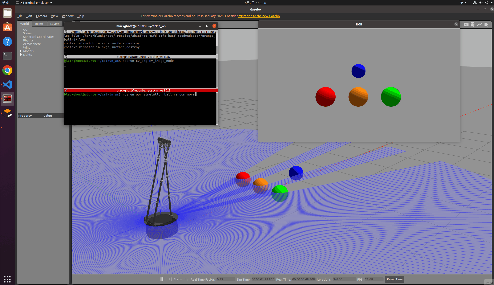

---


# 第七十一节课：颜色目标识别与定位的C++实现

## 1.内容框架

- 本节课基于上节课的基础，完成对颜色目标的识别及其定位；


- 整个项目只需要3个部分
  - **颜色空间转换：RGB->HSV；**

  

  - **二值化，即分割提取目标物；**

  

  - **计算目标物的质心坐标；**

  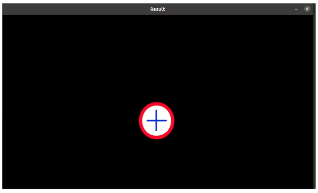


## 2.实际实现

### 2.1 节点编写

- 在cv_pkg/src目录下，新建文件cv_hsv_node.cpp；
- 在文件中添加如下内容

```cpp
#include <ros/ros.h>
#include <cv_bridge/cv_bridge.h>            // 转换格式头文件
#include <sensor_msgs/image_encodings.h>    // 图像编码头文件
#include <opencv2/imgproc/imgproc.hpp>      // OpenCV的图像处理头文件
#include <opencv2/highgui/highgui.hpp>      // OpenCV的图形化显示头文件

/* 使用命名空间 */
using namespace cv;
using namespace std;

/* 颜色阈值 */
static int iLowH = 10;
static int iHighH = 40;

static int iLowS = 90;
static int iHighS = 255;

static int iLowV = 1;
static int iHighV = 255;

/* 回调函数 */
void Cam_RGB_Callback(const sensor_msgs::Image msg)
{
    cv_bridge::CvImagePtr cv_ptr;      // OpenCV图像类型指针

    try
    {
        /* 调用toCvCopy()函数将ROS中的图片消息包转换成OpenCV格式的图像对象 */
        cv_ptr = cv_bridge::toCvCopy(msg, sensor_msgs::image_encodings::BGR8);
    }
    catch (cv_bridge::Exception& e)
    {
        /* 错误提示 */
        ROS_ERROR("cv_bridge exception: %s", e.what());
        return;
    }

    /* 定义OpenCV的图像格式，将cv_ptr的image取出来，这就是RGB空间下的原始图像 */
    Mat imgOriginal = cv_ptr->image;

    /* 将RGB图片转换成HSV */
    Mat imgHSV;
    cvtColor(imgOriginal, imgHSV, COLOR_BGR2HSV);

    /* HSV空间做直方图均衡化 */
    vector<Mat> hsvSplit;
    split(imgHSV, hsvSplit);
    equalizeHist(hsvSplit[2], hsvSplit[2]);     // 对V值均衡化
    merge(hsvSplit, imgHSV);

    /* 使用阈值范围进行二值化 */
    Mat imgThresholded;
    inRange(imgHSV, Scalar(iLowH, iLowS, iLowV), Scalar(iHighH, iHighS, iHighV), imgThresholded);

    /* 开操作即腐蚀，去除噪声 */
    Mat element = getStructuringElement(MORPH_RECT, Size(5, 5));
    morphologyEx(imgThresholded, imgThresholded, MORPH_OPEN, element);

    /* 闭操作，连接一些连通域 */
    morphologyEx(imgThresholded, imgThresholded, MORPH_CLOSE, element);

    /* 遍历二值化后的图像数据 */
    int nTargetX = 0;
    int nTargetY = 0;
    int nPixCount = 0;
    int nImgWidth = imgThresholded.cols;
    int nImgHeight = imgThresholded.rows;
    int nImgChannels = imgThresholded.channels();
    for (int y = 0; y < nImgHeight; y ++)
    {
        for (int x = 0; x < nImgWidth; x ++)
        {
            if (imgThresholded.data[y*nImgWidth + x] == 255)
            {
                nTargetX += x;
                nTargetY += y;
                nPixCount ++;
            }
        }
    }

    if (nPixCount > 0)
    {
        nTargetX /= nPixCount;
        nTargetY /= nPixCount;
        printf("颜色质心坐标( %d, %d ) 点数 = %d\n", nTargetX, nTargetY, nPixCount);
        /* 画坐标 */
        Point line_begin = Point(nTargetX - 10, nTargetY);
        Point line_end = Point(nTargetX + 10, nTargetY);
        line(imgOriginal, line_begin, line_end, Scalar(255, 0, 0));
        line_begin.x = nTargetX;
        line_begin.y = nTargetY + 10;
        line_end.x = nTargetX;
        line_end.y = nTargetY + 10;
        line(imgOriginal, line_begin, line_end, Scalar(255, 0, 0));

    }
    else
    {
        printf("目标颜色消失...\n");
    }

    imshow("RGB", imgOriginal);
    imshow("HSV", imgHSV);
    imshow("Result", imgThresholded);
    cv::waitKey(5);
}


int main(int argc, char** argv)
{
    /* 初始化ROS */
    ros::init(argc, argv, "cv_image_node");

    /* 订阅相机话题 */
    ros::NodeHandle nh;
    ros::Subscriber rgb_sub = nh.subscribe("/kinect2/qhd/image_color_rect", 1, Cam_RGB_Callback);

    /* 生成图像显示和参数调节的窗口 */
    namedWindow("Threshold", WINDOW_AUTOSIZE);

    /* 生成滑杆控件 */
    createTrackbar("LowH", "Threshold", &iLowH, 179);       // Hue (0 - 179)
    createTrackbar("HighH", "Threshold", &iHighH, 179);

    createTrackbar("LowS", "Threshold", &iLowS, 255);       // Saturation (0 - 255)
    createTrackbar("HighS", "Threshold", &iHighS, 255);

    createTrackbar("LowV", "Threshold", &iLowV, 255);       // Value (0 - 255)
    createTrackbar("HighV", "Threshold", &iHighV, 255);
    
    /* 图像显示窗口 */
    namedWindow("RGB");
    namedWindow("HSV");
    namedWindow("Result");

    /* 即spin()函数 */
    ros::Rate loop_rate(30);
    while(ros::ok())
    {
        ros::spinOnce();
        loop_rate.sleep();
    }
}
```

### 2.2 添加编译规则

- 在确保上节课的的CMakeList文件的前两部分没漏，然后在最后添加如下代码

```c
add_executable(cv_hsv_node src/cv_hsv_node.cpp)
add_dependencies(cv_hsv_node ${${PROJECT_NAME}_EXPORTED_TARGETS} ${catkin_EXPORTED_TARGETS})
target_link_libraries(cv_hsv_node ${catkin_LIBRARIES} ${OpenCV_LIBS})
```

### 2.3 编译

- 在终端中执行

```bash
cd ~/catkin_ws

catkin_make
```


## 3.运行效果

- 在3个终端中执行以下指令；
- 如果出现问题，可参考~/catkin_ws/src/wpr_simulation/src/demo_cv_hsv.cpp文件；

```bash
roslaunch wpr_simulation wpb_balls.launch

rosrun cv_pkg cv_hsv_node

rosrun wpr_simulation ball_random_move
```

- 实际运行效果如下图所示


---


# 第七十二节课：颜色目标跟随的C++实现

## 1.内容框架

- 本节课在前面的基础上，添加运动控制功能，实现机器人对小球的跟随功能；

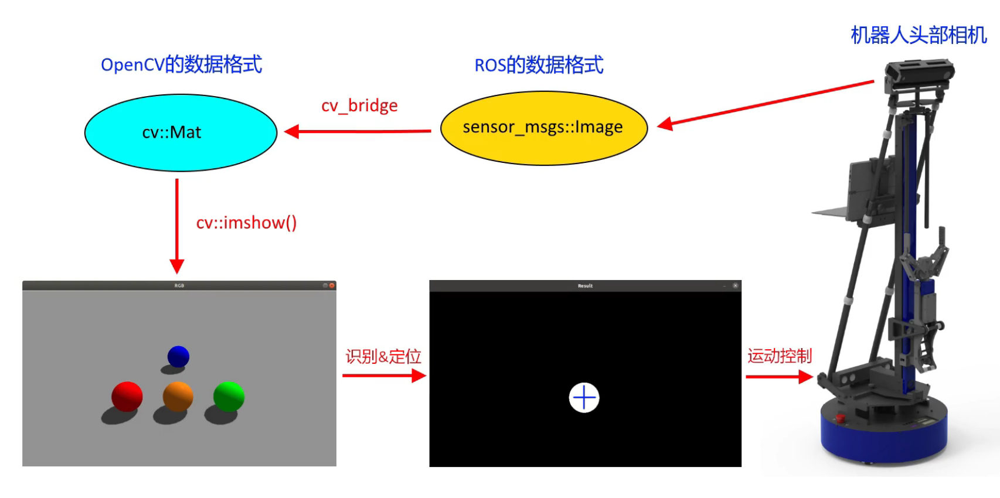


## 2.实际实现

### 2.1 节点编写

- 打开VsCode，在src目录下新建文件cv_follow_node.cpp；
- 在文件中写入如下内容：即通过PID控制器让目标球始终出现在画面正中间；

```cpp
#include <ros/ros.h>
#include <cv_bridge/cv_bridge.h>            // 转换格式头文件
#include <sensor_msgs/image_encodings.h>    // 图像编码头文件
#include <opencv2/imgproc/imgproc.hpp>      // OpenCV的图像处理头文件
#include <opencv2/highgui/highgui.hpp>      // OpenCV的图形化显示头文件
#include <geometry_msgs/Twist.h>            // 消息包类型头文件

/* 使用命名空间 */
using namespace cv;
using namespace std;

/* 颜色阈值 */
static int iLowH = 10;
static int iHighH = 40;

static int iLowS = 90;
static int iHighS = 255;

static int iLowV = 1;
static int iHighV = 255;

/* 相当于声明为全局变量 */
geometry_msgs::Twist vel_cmd;   // 速度消息包
ros::Publisher vel_pub;         // 速度发布对象


/* 回调函数 */
void Cam_RGB_Callback(const sensor_msgs::Image msg)
{
    cv_bridge::CvImagePtr cv_ptr;      // OpenCV图像类型指针

    try
    {
        /* 调用toCvCopy()函数将ROS中的图片消息包转换成OpenCV格式的图像对象 */
        cv_ptr = cv_bridge::toCvCopy(msg, sensor_msgs::image_encodings::BGR8);
    }
    catch (cv_bridge::Exception& e)
    {
        /* 错误提示 */
        ROS_ERROR("cv_bridge exception: %s", e.what());
        return;
    }

    /* 获取OpenCV中最原始的彩色图像 */
    Mat imgOriginal = cv_ptr->image;

    /* 将RGB图片转换成HSV */
    Mat imgHSV;
    vector<Mat> hsvSplit;
    cvtColor(imgOriginal, imgHSV, COLOR_BGR2HSV);

    /* HSV空间做直方图均衡化 */
    split(imgHSV, hsvSplit);
    equalizeHist(hsvSplit[2], hsvSplit[2]);     // 对V值均衡化
    merge(hsvSplit, imgHSV);

    /* 使用阈值范围进行二值化 */
    Mat imgThresholded;
    inRange(imgHSV, Scalar(iLowH, iLowS, iLowV), Scalar(iHighH, iHighS, iHighV), imgThresholded);

    /* 开操作即腐蚀，去除噪声 */
    Mat element = getStructuringElement(MORPH_RECT, Size(5, 5));
    morphologyEx(imgThresholded, imgThresholded, MORPH_OPEN, element);

    /* 闭操作，连接一些连通域 */
    morphologyEx(imgThresholded, imgThresholded, MORPH_CLOSE, element);

    /* 遍历二值化后的图像数据 */
    int nTargetX = 0;
    int nTargetY = 0;
    int nPixCount = 0;
    int nImgWidth = imgThresholded.cols;
    int nImgHeight = imgThresholded.rows;
    int nImgChannels = imgThresholded.channels();
    printf("横向宽度= %d 纵向宽度= %d \n", nImgWidth, nImgHeight);
    for (int y = 0; y < nImgHeight; y ++)
    {
        for (int x = 0; x < nImgWidth; x ++)
        {
            if (imgThresholded.data[y*nImgWidth + x] == 255)
            {
                nTargetX += x;
                nTargetY += y;
                nPixCount ++;
            }
        }
    }

    if (nPixCount > 0)
    {
        /* 物体质心画十字标记 */
        nTargetX /= nPixCount;
        nTargetY /= nPixCount;
        printf("颜色质心坐标( %d, %d ) 点数 = %d\n", nTargetX, nTargetY, nPixCount);
        /* 画坐标 */
        Point line_begin = Point(nTargetX - 10, nTargetY);
        Point line_end = Point(nTargetX + 10, nTargetY);
        line(imgOriginal, line_begin, line_end, Scalar(255, 0, 0));
        line_begin.x = nTargetX;
        line_begin.y = nTargetY + 10;
        line_end.x = nTargetX;
        line_end.y = nTargetY + 10;
        line(imgOriginal, line_begin, line_end, Scalar(255, 0, 0));

        /* PID计算机器人运动速度 */
        float fVelFoward = (nImgHeight / 2 - nTargetY) * 0.002;
        float fVelTurn = (nImgWidth / 2 - nTargetX) * 0.003;
        vel_cmd.linear.x = fVelFoward;
        vel_cmd.linear.y = 0;
        vel_cmd.linear.z = 0;
        vel_cmd.angular.x = 0;
        vel_cmd.angular.y = 0;
        vel_cmd.angular.z = fVelTurn;
    }
    else
    {
        printf("目标颜色消失...\n");
        vel_cmd.linear.x = 0;
        vel_cmd.linear.y = 0;
        vel_cmd.linear.z = 0;
        vel_cmd.angular.x = 0;
        vel_cmd.angular.y = 0;
        vel_cmd.angular.z = 0;
    }

    /* 发送速度 */
    vel_pub.publish(vel_cmd);
    printf("机器人运动速度(linear.x = %.2f, angular.z = %.2f)\n", vel_cmd.linear.x, vel_cmd.angular.z);

    /* 显示处理结果 */
    imshow("RGB", imgOriginal);
    imshow("Result", imgThresholded);
    cv::waitKey(1);
}

int main(int argc, char** argv)
{
    /* 初始化ROS */
    ros::init(argc, argv, "cv_follow_node");

    /* 订阅相机话题 */
    ros::NodeHandle nh;
    ros::Subscriber rgb_sub = nh.subscribe("/kinect2/qhd/image_color_rect", 1, Cam_RGB_Callback);
    vel_pub = nh.advertise<geometry_msgs::Twist>("/cmd_vel", 30);

    /* 生成图像显示和参数调节的窗口 */
    namedWindow("Threshold", WINDOW_AUTOSIZE);

    /* 生成滑杆控件 */
    createTrackbar("LowH", "Threshold", &iLowH, 179);       // Hue (0 - 179)
    createTrackbar("HighH", "Threshold", &iHighH, 179);

    createTrackbar("LowS", "Threshold", &iLowS, 255);       // Saturation (0 - 255)
    createTrackbar("HighS", "Threshold", &iHighS, 255);

    createTrackbar("LowV", "Threshold", &iLowV, 255);       // Value (0 - 255)
    createTrackbar("HighV", "Threshold", &iHighV, 255);
    
    /* 图像显示窗口 */
    namedWindow("RGB");
    namedWindow("Result");

    /* 保存程序的持续运行 */
    ros::Rate loop_rate(30);
    while(ros::ok())
    {
        ros::spinOnce();
        loop_rate.sleep();
    }
}

```

### 2.2 添加编译规则

- 在确保上节课的的CMakeList文件的前两部分没漏，然后在最后添加如下代码

```c
add_executable(cv_follow_node src/cv_follow_node.cpp)
add_dependencies(cv_follow_node ${${PROJECT_NAME}_EXPORTED_TARGETS} ${catkin_EXPORTED_TARGETS})
target_link_libraries(cv_follow_node ${catkin_LIBRARIES} ${OpenCV_LIBS})
```

### 2.3 编译

- 在终端中执行

```bash
cd ~/catkin_ws

catkin_make
```


## 3.运行效果

- 在3个终端中执行以下指令；
- 如果出现问题，可参考~/catkin_ws/src/wpr_simulation/src/demo_cv_follow.cpp文件；

```bash
roslaunch wpr_simulation wpb_balls.launch

rosrun cv_pkg cv_follow_node

rosrun wpr_simulation ball_random_move
```

- 实际运行效果如下图所示


---


# 第七十三节课：人脸检测的C++实现

## 1.内容框架

- 本节课在前面的基础上，实现人脸检测功能；

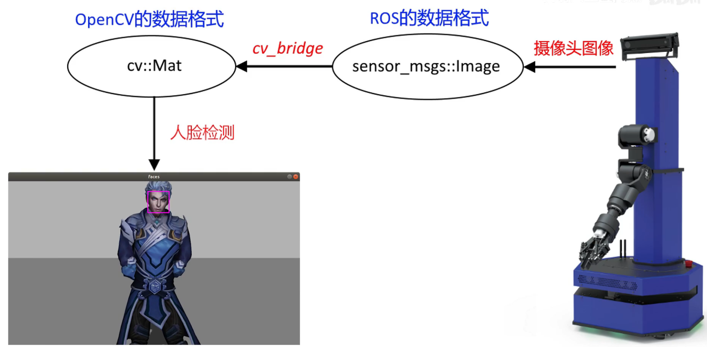


## 2.Haar特征的级联分类器

- 基于Haar特征不断的比对输入图像的各个区域；
- 然后用级联分类器进行不断的判断，只有满足了级联分配器的要求才认为是人脸；

|  |  |
| ----------------------------------------------------- | ---------------------------------------------------------- |


## 3.实际实现

### 3.1 节点编写

- 打开VsCode，在cv_pkg文件夹下的src目录下新建文件cv_face_detect.cpp；
- 在文件中写入如下内容；

```cpp
#include <ros/ros.h>
#include <cv_bridge/cv_bridge.h>            // 转换格式头文件
#include <sensor_msgs/image_encodings.h>    // 图像编码头文件
#include <opencv2/imgproc/imgproc.hpp>      // OpenCV的图像处理头文件
#include <opencv2/highgui/highgui.hpp>      // OpenCV的图形化显示头文件
#include <opencv2/objdetect/objdetect.hpp>  // OpenCV检测头文件

/* 使用命名空间 */
using namespace cv;
using namespace std;

/* 分类器对象 */
static CascadeClassifier face_cascade;

/* Mat对象用于存放黑白图像，输入给分类器 */
static Mat frame_gray;

/* 容器，相当于数组，存放检测结果 */
static vector<Rect> faces;
static vector<Rect>::const_iterator face_iter;  /* 与前面数组配套的迭代器 */

/* 回调函数 */
void callbackRGB(const sensor_msgs::Image msg)
{
    cv_bridge::CvImagePtr cv_ptr;      // OpenCV图像类型指针

    try
    {
        /* 调用toCvCopy()函数将ROS中的图片消息包转换成OpenCV格式的图像对象 */
        cv_ptr = cv_bridge::toCvCopy(msg, sensor_msgs::image_encodings::BGR8);
    }
    catch (cv_bridge::Exception& e)
    {
        /* 错误提示 */
        ROS_ERROR("cv_bridge exception: %s", e.what());
        return;
    }

    /* 获取OpenCV中最原始的彩色图像 */
    Mat imgOriginal = cv_ptr->image;

    /* 转换成黑白图像 */
    cvtColor(imgOriginal, frame_gray, CV_BGR2GRAY);
    equalizeHist(frame_gray, frame_gray);

    /* 检测人脸,结果存在faces中 */
    face_cascade.detectMultiScale(frame_gray, faces, 1.1, 9, 0|CASCADE_SCALE_IMAGE, Size(30, 30));

    /* 在彩色原图上标注人脸位置 */
    if (faces.size() > 0)
    {
        /* 遍历所有人脸 */
        for (face_iter = faces.begin(); face_iter != faces.end(); ++face_iter)
        {
            /* 标注人脸 */
            rectangle(
                imgOriginal,
                Point(face_iter->x, face_iter->y),
                Point(face_iter->x + face_iter->width, face_iter->y + face_iter->height),
                CV_RGB(255, 0, 255),
                2);
        }
        imshow("faces", imgOriginal);
        waitKey(1);
    }
}

/* 主函数 */
int main(int argc, char** argv)
{
    /* 初始化ROS */
    ros::init(argc, argv, "cv_face_detect");

    namedWindow("faces");

    /* 读取人脸特征文件 */
    std::string strLoadFile;
    char const* home = getenv("HOME");  /* 获取主文件夹路径 */
    strLoadFile = home;
    strLoadFile += "/catkin_ws";
    strLoadFile += "/src/wpr_simulation/config/haarcascade_frontalface_alt.xml";    /* 人脸特征模板 */

    /* 加载特征模板 */
    bool res = face_cascade.load(strLoadFile);
    if (res == false)
    {
        ROS_ERROR("fail to load haarcascade_frontalface_alt.xml");
        return 0;
    }

    /* 订阅话题 */
    ros::NodeHandle nh;
    ros::Subscriber rgb_sub = nh.subscribe("/kinect2/qhd/image_color_rect", 1, callbackRGB);

    ros::spin();
    return 0;
}

```

### 3.2 添加编译规则

- 在确保上节课的的CMakeList文件的前两部分没漏，然后在最后添加如下代码

```c
add_executable(cv_face_detect src/cv_face_detect.cpp)
add_dependencies(cv_face_detect ${${PROJECT_NAME}_EXPORTED_TARGETS} ${catkin_EXPORTED_TARGETS})
target_link_libraries(cv_face_detect ${catkin_LIBRARIES} ${OpenCV_LIBS})
```

### 3.3 编译

- 在终端中执行

```bash
cd ~/catkin_ws

catkin_make
```


## 4.运行效果

- 在3个终端中执行以下指令；
- 如果出现问题，可参考~/catkin_ws/src/wpr_simulation/src/demo_cv_face_detect.cpp文件；

```bash
roslaunch wpr_simulation wpr1_single_face.launch

rosrun cv_pkg cv_face_detect

# 这一行可选择性执行，可用键盘控制机器人移动查看不同的视角
rosrun wpr_simulation keyboard_vel_ctrl
```

- 实际运行效果如下图所示


---


# 第七十四节课：相机图像获取的Python实现

## 1.内容框架

- 本节课学习ROS中如何基于Python实现相机图像获取的话题；
- 本节框架如下，订阅相机话题获取图像数据，然后将其转换为OpenCV的Mat格式，再用OpenCV函数显示；

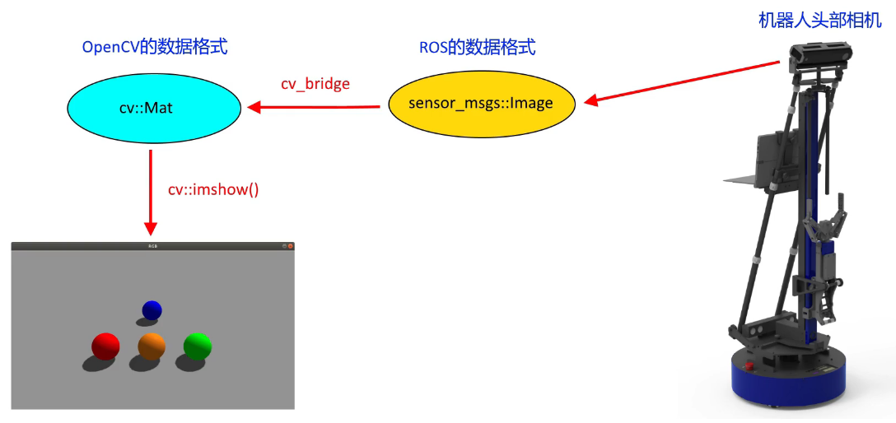


## 2.实际实现

### 2.1 节点编写

- 建立一个新的软件包，在终端中执行

```bash
cd ~/catkin_ws/src

catkin_create_pkg cv_py_pkg rospy sensor_msgs cv_bridge
```

- 然后打开VsCode，在cv_py_pkg下，新=新建文件夹scripts，并在文件夹下新建文件image_node.py；
- 在文件中写入如下内容

```python
#!/usr/bin/env python3
# coding=utf-8

import rospy
import cv2
from sensor_msgs.msg import Image
from cv_bridge import CvBridge, CvBridgeError       # 格式转换相关文件

# 回调函数
def Cam_RGB_Callback(msg):
    bridge = CvBridge()         # 图像格式转换器对象

    # 图像格式转换
    try:
        cv_image = bridge.imgmsg_to_cv2(msg, "bgr8")
    except CvBridgeError as e:
        rospy.logerr("格式转换错误：%s", e)
        return
    
    # 弹出窗口进行显示
    cv2.imshow("RGB", cv_image)
    cv2.waitKey(1)


# 主函数
if __name__ == "__main__":
    # ROS初始化
    rospy.init_node("cv_image_node")

    # 订阅相机话题
    rgb_sub = rospy.Subscriber("/kinect2/qhd/image_color_rect", Image, Cam_RGB_Callback, queue_size=10)

    rospy.spin()
```

### 2.2 添加可执行权限并编译

- 终端执行如下命令

```bash
cd ~/catkin_ws/src/cv_py_pkg/scripts

chmod +x image_node.py
```

- 由于该软件包是新建的，需要再编译一下

```bash
cd ~/catkin_ws

catkin_make
```

### 2.3 实际运行

- 3个终端窗口中分别执行

```bash
roslaunch wpr_simulation wpb_balls.launch

rosrun cv_py_pkg image_node.py

rosrun wpr_simulation ball_random_move
```

- 实际运行效果如下图所示；
- 如果有报错，可参考~catkin_ws/src/wpr_simulation/scripts/demo_cv_iamge.py文件；

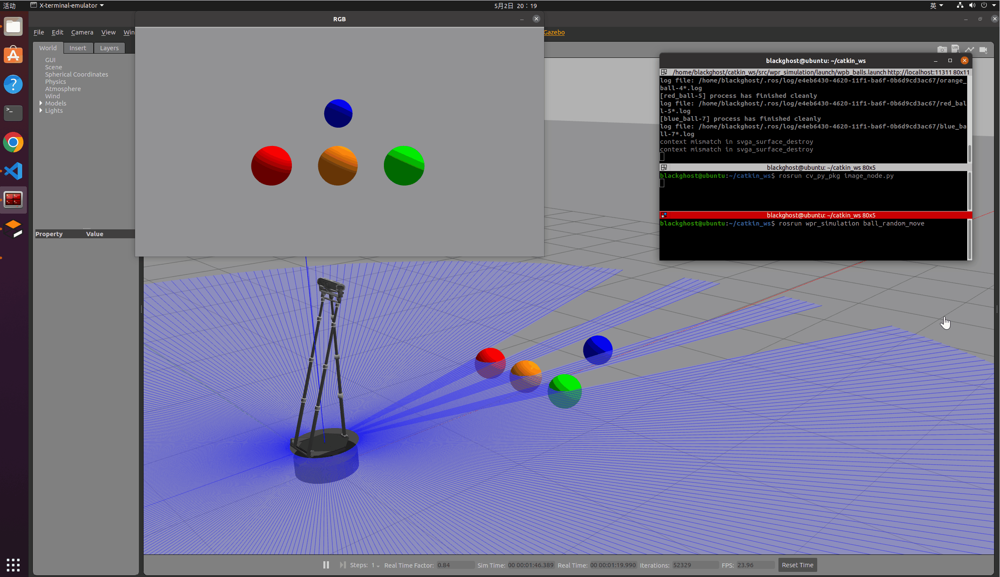

---


# 第七十五节课：颜色目标识别与定位的Python实现

## 1.内容框架

- 本节课基于上节课的基础，完成对颜色目标的识别及其定位；

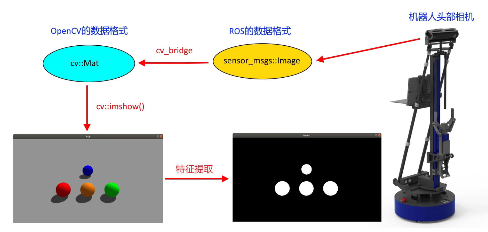

- 整个项目只需要3个部分

  - **颜色空间转换：RGB->HSV；**

  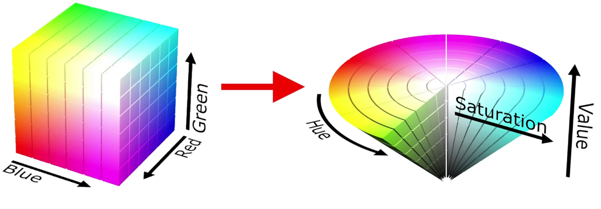

  - **二值化，即分割提取目标物；**

  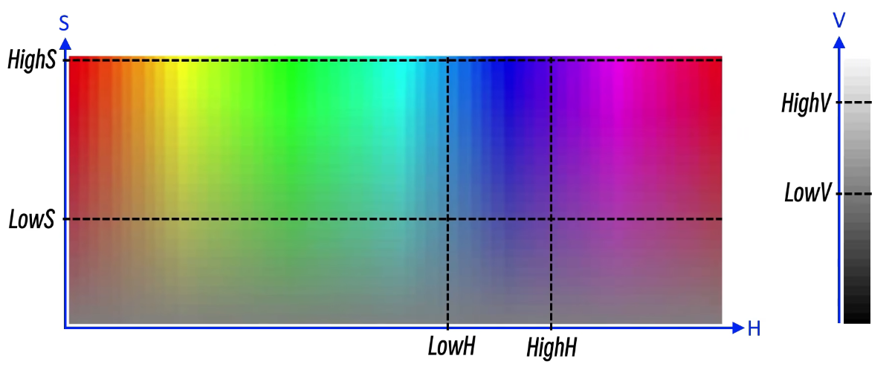

  - **计算目标物的质心坐标；**

  


## 2.实际实现

### 2.1 节点编写

- 在cv_py_pkg/scripts目录下，新建文件cv_hsv_node.py；
- 在文件中添加如下内容

```python
#!/usr/bin/env python3
# coding=utf-8

import rospy
import cv2
from sensor_msgs.msg import Image
from cv_bridge import CvBridge, CvBridgeError       # 格式转换相关文件

# 范围阈值
hue_min = 10
hue_max = 40
satu_min = 90
satu_max = 255
val_min = 1
val_max = 255


# 滑杆事件的回调函数
def nothing(x):
    pass


# 节点的回调函数
def Cam_RGB_Callback(msg):
    # 声明为全局变量，避免函数内部当成局部变量
    global hue_min, hue_max, satu_min, satu_max , val_min , val_max

    bridge = CvBridge()         # 图像格式转换器对象

    # 图像格式转换
    try:
        cv_image = bridge.imgmsg_to_cv2(msg, "bgr8")
    except CvBridgeError as e:
        rospy.logerr("格式转换错误：%s", e)
        return
    
    # RGB图片转换成HSV
    hsv_image = cv2.cvtColor(cv_image, cv2.COLOR_BGR2HSV)

    # 在HSV空间做均衡化
    h, s, v = cv2.split(hsv_image)
    v = cv2.equalizenHist(v)
    hsv_image = cv2.merge([h, s, v])

    # 二值化
    th_image = cv2.inRange(hsv_image, (hue_min, satu_min, val_min), (hue_max, satu_max, val_max))

    # 开操作去除噪点
    element = cv2.getStructuringElement(cv2.MORPH_RECT, (5, 5))
    th_image = cv2.morphologyEx(th_image, cv2.MORPH_OPEN, element)

    # 闭操作
    th_image = cv2.morphologyEx(th_image, cv2.MORPH_CLOSE, element)

    # 遍历处理后的图像
    target_x, target_y, pix_count = 0, 0, 0
    image_height, image_width = th_image.shape[:2]
    for y in range(image_height):
        for x in range(image_width):
            if th_image[y, x] == 255:
                target_x += x
                target_y += y
                pix_count += 1
    if pix_count > 0:
        target_x //= pix_count
        target_y //= pix_count
        print(f"颜色质心坐标({target_x}, {target_y}) 点数 = {pix_count}")
        # 画作标
        cv2.line(cv_image, (target_x - 10, target_y), (target_x + 10, target_y), (255, 0, 0), 2)
        cv2.line(cv_image, (target_x, target_y - 10), (target_x, target_y + 10), (255, 0, 0), 2)
    else:
        print("目标颜色消失...")

    # 显示主要图像
    cv2.imshow("RGB", cv_image)
    cv2.imshow("HSV", hsv_image)
    cv2.imshow("Result", th_image)
    cv2.waitKey(5)


# 主函数
if __name__ == "__main__":
    # ROS初始化
    rospy.init_node("cv_hsv_node")

    # 订阅相机话题
    rgb_sub = rospy.Subscriber("/kinect2/qhd/image_color_rect", Image, Cam_RGB_Callback, queue_size=10)

    # 添加生成滑杆控件,最后一个参数是滑杆的回调函数
    cv2.namedWindow("Threshold")
    cv2.createTrackbar("hue_min", "Threshold", hue_min, 179, nothing)       # Hue (0 - 179)
    cv2.createTrackbar("hue_max", "Threshold", hue_max, 179, nothing)

    cv2.createTrackbar("satu_min", "Threshold", satu_min, 255, nothing)     # Saturation (0 - 255)
    cv2.createTrackbar("satu_max", "Threshold", satu_max, 255, nothing)

    cv2.createTrackbar("val_min", "Threshold", val_min, 255, nothing)       # Value (0 - 255)
    cv2.createTrackbar("val_max", "Threshold", val_max, 255, nothing)

    # 生成窗口
    cv2.namedWindow("RGB")
    cv2.namedWindow("HSV")
    cv2.namedWindow("Result")

    rate = rospy.Rate(30)

    # 这里统一处理滑杆数据，所以滑杆回调函数什么都不做
    while not rospy.is_shutdown():
        hue_min = cv2.getTrackbarPos("hue_min", "Threshold")
        hue_max = cv2.getTrackbarPos("hue_max", "Threshold")
        satu_min = cv2.getTrackbarPos("satu_min", "Threshold")
        satu_max = cv2.getTrackbarPos("satu_max", "Threshold")
        val_min = cv2.getTrackbarPos("val_min", "Threshold")
        val_max = cv2.getTrackbarPos("val_max", "Threshold")

        rate.sleep()

    cv2.destroyAllWindows()
```

### 2.2 添加可执行权限并编译

- 终端执行如下命令

```bash
cd ~/catkin_ws/src/cv_py_pkg/scripts

chmod +x cv_hsv_node.py
```

- 由于该软件包是已经编译过了，添加的是python文件不需要重新编译；

### 2.3 实际运行

- 3个终端窗口中分别执行

```bash
roslaunch wpr_simulation wpb_balls.launch

rosrun cv_py_pkg cv_hsv_node.py

rosrun wpr_simulation ball_random_move
```

- 实际运行效果如下图所示；
- 如果有报错，可参考~catkin_ws/src/wpr_simulation/scripts/demo_cv_hsv.py文件；


---


# 第七十六节课：颜色目标跟随的Python实现

## 1.内容框架

- 本节课在前面的基础上，添加运动控制功能，实现机器人对小球的跟随功能；


## 2.实际实现

### 2.1 节点编写

- 在cv_py_pkg/scripts目录下，新建文件cv_follow_node.py；

- 在文件中写入如下内容：即通过PID控制器保持目标球在图像中间；

```python
#!/usr/bin/env python3
# coding=utf-8

import rospy
import cv2
from sensor_msgs.msg import Image
from cv_bridge import CvBridge, CvBridgeError       # 格式转换相关文件
from geometry_msgs.msg import Twist                 # 速度消息包

# 全局变量
vel_cmd = Twist()
vel_pub = None

# 范围阈值
hue_min = 10
hue_max = 40
satu_min = 90
satu_max = 255
val_min = 1
val_max = 255

# 滑杆事件的回调函数
def nothing(x):
    pass

# 节点的回调函数
def Cam_RGB_Callback(msg):
    # 声明为全局变量，避免函数内部当成局部变量
    global hue_min, hue_max, satu_min, satu_max , val_min , val_max
    global vel_cmd, vel_pub

    bridge = CvBridge()         # 图像格式转换器对象

    # 图像格式转换
    try:
        cv_image = bridge.imgmsg_to_cv2(msg, "bgr8")
    except CvBridgeError as e:
        rospy.logerr("格式转换错误：%s", e)
        return
    
    # RGB图片转换成HSV
    hsv_image = cv2.cvtColor(cv_image, cv2.COLOR_BGR2HSV)

    # 在HSV空间做均衡化
    h, s, v = cv2.split(hsv_image)
    v = cv2.equalizenHist(v)
    hsv_image = cv2.merge([h, s, v])

    # 二值化
    th_image = cv2.inRange(hsv_image, (hue_min, satu_min, val_min), (hue_max, satu_max, val_max))

    # 开操作去除噪点
    element = cv2.getStructuringElement(cv2.MORPH_RECT, (5, 5))
    th_image = cv2.morphologyEx(th_image, cv2.MORPH_OPEN, element)

    # 闭操作
    th_image = cv2.morphologyEx(th_image, cv2.MORPH_CLOSE, element)

    # 遍历处理后的图像
    target_x, target_y, pix_count = 0, 0, 0
    image_height, image_width = th_image.shape[:2]
    for y in range(image_height):
        for x in range(image_width):
            if th_image[y, x] == 255:
                target_x += x
                target_y += y
                pix_count += 1
    if pix_count > 0:
        target_x //= pix_count
        target_y //= pix_count
        print(f"颜色质心坐标({target_x}, {target_y}) 点数 = {pix_count}")
        
        # 画作标
        cv2.line(cv_image, (target_x - 10, target_y), (target_x + 10, target_y), (255, 0, 0), 2)
        cv2.line(cv_image, (target_x, target_y - 10), (target_x, target_y + 10), (255, 0, 0), 2)

        # 计算机器人运动速度
        vel_forward = (image_height / 2 - target_y) * 0.001
        vel_turn = (image_width / 2 - target_x) * 0.0005
        vel_cmd.linear.x = vel_forward
        vel_cmd.angular.z = vel_turn
    else:
        print("目标颜色消失...")
        vel_cmd.linear.x = 0
        vel_cmd.angular.z = 0

    # 显示主要图像
    cv2.imshow("RGB", cv_image)
    cv2.imshow("Result", th_image)
    cv2.waitKey(1)

    vel_pub.publish(vel_cmd)
    print(f"机器人运动速度(linear.x = {vel_cmd.linear.x:.2f}, angular.z = {vel_cmd.angular.z:.2f})")

# 主函数
if __name__ == "__main__":
    # ROS初始化
    rospy.init_node("cv_follow_node", anonymous=True)

    # 订阅相机话题
    rgb_sub = rospy.Subscriber("/kinect2/qhd/image_color_rect", Image, Cam_RGB_Callback, queue_size=1)

    # 发布速度话题
    vel_pub = rospy.Publisher("/cmd_vel", Twist, queue_size=30)

    # 添加生成滑杆控件,最后一个参数是滑杆的回调函数
    cv2.namedWindow("Threshold")
    cv2.createTrackbar("hue_min", "Threshold", hue_min, 179, nothing)       # Hue (0 - 179)
    cv2.createTrackbar("hue_max", "Threshold", hue_max, 179, nothing)

    cv2.createTrackbar("satu_min", "Threshold", satu_min, 255, nothing)     # Saturation (0 - 255)
    cv2.createTrackbar("satu_max", "Threshold", satu_max, 255, nothing)

    cv2.createTrackbar("val_min", "Threshold", val_min, 255, nothing)       # Value (0 - 255)
    cv2.createTrackbar("val_max", "Threshold", val_max, 255, nothing)

    # 生成窗口
    cv2.namedWindow("RGB")
    cv2.namedWindow("Result")

    rate = rospy.Rate(30)

    # 这里统一处理滑杆数据，所以滑杆回调函数什么都不做
    while not rospy.is_shutdown():
        hue_min = cv2.getTrackbarPos("hue_min", "Threshold")
        hue_max = cv2.getTrackbarPos("hue_max", "Threshold")
        satu_min = cv2.getTrackbarPos("satu_min", "Threshold")
        satu_max = cv2.getTrackbarPos("satu_max", "Threshold")
        val_min = cv2.getTrackbarPos("val_min", "Threshold")
        val_max = cv2.getTrackbarPos("val_max", "Threshold")

        rate.sleep()

    cv2.destroyAllWindows()
```

### 2.2 添加可执行权限并编译

- 终端执行如下命令

```bash
cd ~/catkin_ws/src/cv_py_pkg/scripts

chmod +x cv_follow_node.py
```

- 由于该软件包是已经编译过了，添加的是python文件不需要重新编译；

### 2.3 实际运行

- 3个终端窗口中分别执行

```bash
roslaunch wpr_simulation wpb_balls.launch

rosrun cv_py_pkg cv_follow_node.py

rosrun wpr_simulation ball_random_move
```

- 实际运行效果如下图所示；
- 如果有报错，可参考~catkin_ws/src/wpr_simulation/scripts/demo_cv_follow.py文件；


---


# 第七十七节课：人脸检测的Python实现

## 1.内容框架

- 本节课在前面的基础上，实现人脸检测功能；


## 2.Haar特征的级联分类器

- 基于Haar特征不断的比对输入图像的各个区域；
- 然后用级联分类器进行不断的判断，只有满足了级联分配器的要求才认为是人脸；

| 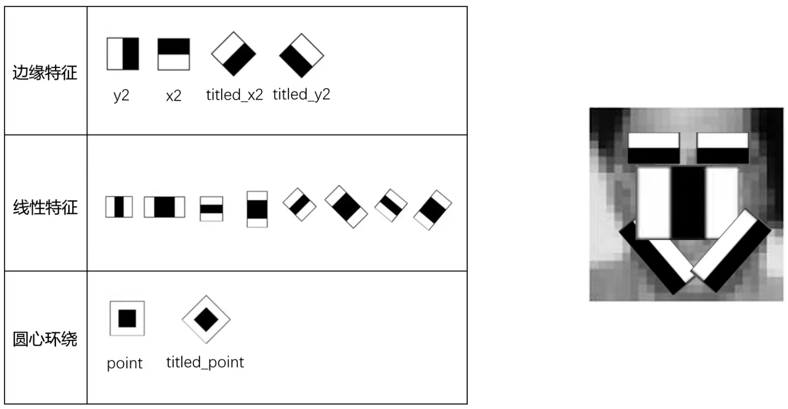 |  |
| -------------------------------------------------------- | ------------------------------------------------------------ |


## 3.实际实现

### 3.1 节点编写

- 在cv_py_pkg/scripts目录下，新建文件cv_face_detect.py；

- 在文件中写入如下内容

```python
#!/usr/bin/env python3
# coding=utf-8

import rospy
import cv2
from sensor_msgs.msg import Image
from cv_bridge import CvBridge, CvBridgeError       # 格式转换相关文件

# 回调函数
def Cam_RGB_Callback(msg):
    bridge = CvBridge()         # 图像格式转换器对象
    
    # 转换成OpenCV格式
    cv_image = bridge.imgmsg_to_cv2(msg, "bgr8")

    # 转换为灰度图
    gray_img = cv2.cvtColor(cv_image, cv2.COLOR_BGR2GRAY)

    # 创建一个级联分类器，注意第二个横杠后面是用户名
    face_casecade = cv2.CascadeClaaifier(\
        '/home/blackghost/catkin_ws/src/wpb_home/wpb_home_python/config/haarcascade_frontalface_alt.xml'\
        )

    # 加载文件，人脸检测
    face = face_casecade.detectMultiScale(gray_img, 1.3, 5)

    # 遍历人脸
    for (x, y, w, h) in face:
        cv2.rectangle(cv_image, (x, y), (x + w, y + h), (0, 0, 255), 3)
    
    # 显示结果
    cv2.imshow("face window", cv_image)
    cv2.waitKey(1)

# 主函数
if __name__ == "__main__":
    # ROS初始化
    rospy.init_node("cv_face_detect")

    # 订阅相机话题
    rgb_sub = rospy.Subscriber("/kinect2/qhd/image_color_rect", Image, Cam_RGB_Callback, queue_size=1)

    rospy.spin()

```

### 3.2 添加可执行权限并编译

- 终端执行如下命令

```bash
cd ~/catkin_ws/src/cv_py_pkg/scripts

chmod +x cv_face_detect.py
```

- 由于该软件包是已经编译过了，添加的是python文件不需要重新编译；

### 3.3 实际运行

- 3个终端窗口中分别执行

```bash
roslaunch wpr_simulation wpb_single_face.launch

rosrun cv_py_pkg cv_face_detect.py

# 这一行可选择性执行，可用键盘控制机器人移动查看不同的视角
rosrun wpr_simulation keyboard_vel_ctrl
```

- 实际运行效果如下图所示；
- 如果有报错，可参考~/catkin_ws/src/wpr_simulation/scripts/demo_cv_face_detect.py文件；


---

