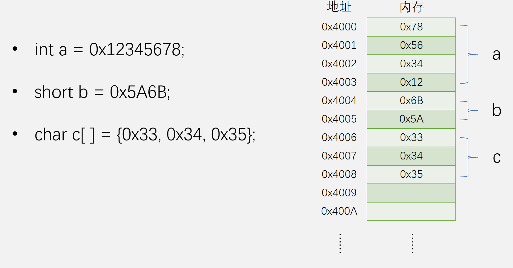
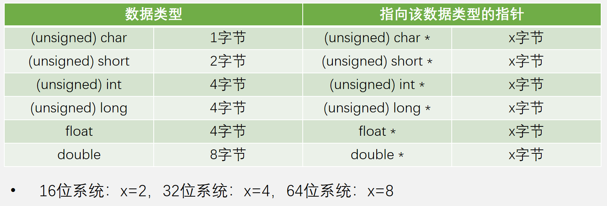
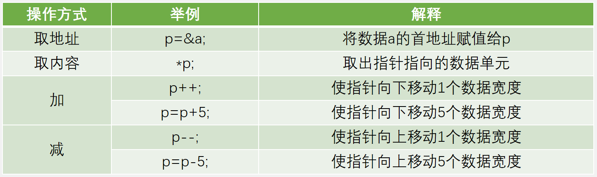
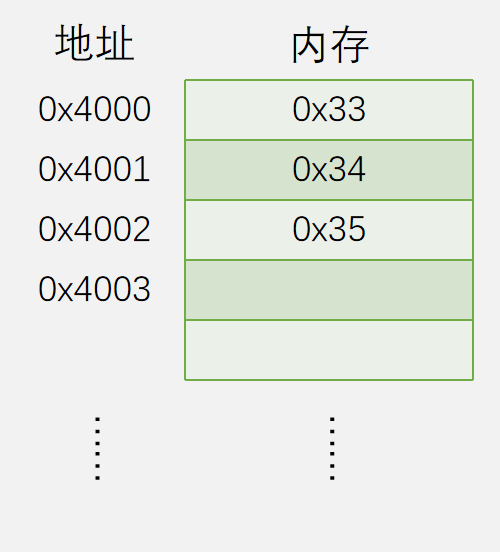
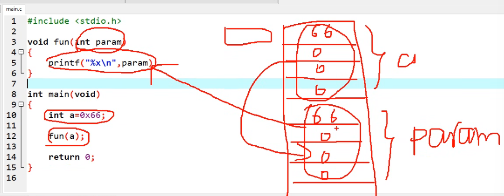
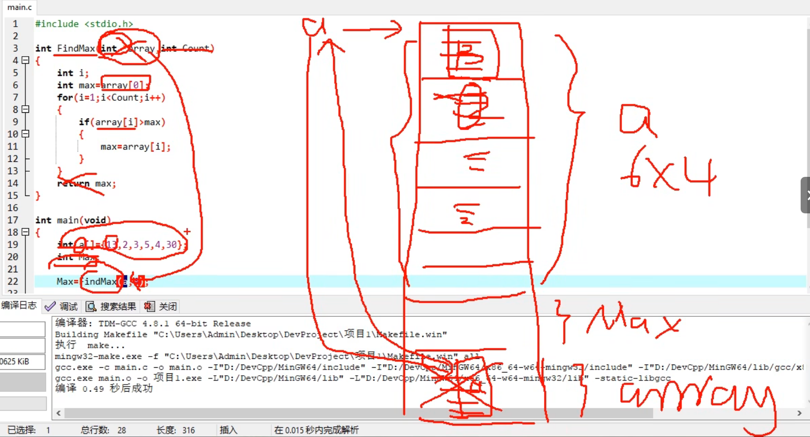

# 指针的详解与应用

---

## 1.指针的简介

- **指针(Pointer)**是C语言的一个重要知识点，其使用灵活、功能强大，是C语言的灵魂；
- 指针、地址、硬件、内存与存储器
  - 存储器的两大部分就是**数据和地址**；
  - 指针与**底层硬件（即内存硬件）**联系紧密，使用指针可**操作数据的地址，实现数据的间接访问**；
  - C语言访问数据的两种方式：
    - 定义变量，然后引用变量名，实现直接访问；
    - 定义变量，通过指针访问其地址，实现间接访问；


## 2.计算机存储机制

- **内存硬件的框图**
  - 右边的框图即为实际的内存硬件的框图模式；
- **计算机内存的机制**
  - 在实际的计算机内存中，会把内存分成一个线性的空间；
  - 在这个线性空间中，每一个区域都是一个字节，以字节为单位线性排列；
  - 每一个字节都对应这一个地址，若没有地址就无法访问数据了，内存就没有意义了；
  - **地址只用于标识一个字节的开始，并不代表实际字节的容量大小8bit**，也就是说，地址采用多少位的形式是由这个内存有多少个字节决定的，而不是有多少比特；
- **int a = 0x12345678;**
  - int型变量是4字节的数据，底层是32位的二进制数据，由于一个字节是8位，所以需要跨字节存储；
  - 内存的存储方式有小端模式和大端模式
    - 小端模式：小位放在低地址部分，大位放在高地址部分；
    - 大端模式：大位放在低地址部分，小位放在高地址部分；
- **short b = 0x5A6B;**
  - short型变量是2字节数据，在图中采用了小端模式的跨字节存储；
- **char c[ ] = {0x33, 0x34, 0x35};**
  - char型数组中，每个元素的大小是1个字节；
  - 所以char型数组的每个元素跨字节存储在**一块连续的内存单元**中，中间不能插入其他数据；
  - 其他类型的数组，如short型数组，先按照小端模式存储某个元素，再按照数组线性方式存储各个元素；




## 3.定义指针

- 变量的地址是指针，存放着指针的变量就叫做指针变量；
- 一般而言，指针变量存放的是其他数据单元（变量/数组/结构体/函数等）的**首地址**；
  - **如上一小节的int a，指若用指针指向它，则指针变量存着的就是0x4000这个地址**；
- 若指针存放着某个数据单元的首地址，则这个指针指向了这个数据单元；
- 若指针存放的值是0，则这个指针为空指针，对它取值会取不到并报错；
- 指针变量的定义
  - 这个指针变量指向什么类型的数据，就在这个类型的关键字后面加个*；
  - 指针数据的大小只与系统的位宽有关系，与指向的数据类型没有关系；



- 上机实验

  - 可在Dev-C++软件中运行下方代码；
  - 输出结果将是：

  ---

  1

  8(取决于自己的电脑的位宽)

  ---

```c
#include <stdio.h>

int main(void)
{
    char a;
    char *p;      // 定义一个指向char类型的指针p，注意char *p, p1;中p1是char型数据不是指针类型
    
    printf("%d\n", sizeof(a));
    printf("%d\n", sizeof(p));
    
    return 0;
}

```


## 4.指针的操作

- 若已定义如下变量：

```c
int a;       // 定义一个int型的数据
int *p;      // 定义一个指向int型数据的指针

```

- 则对数据a和指针p的操作有如下：

  - **&运算符的含义**

    - 按位与；
    - 取某个变量的地址；
    - 指针本身会占有空间，当用取地址符号将某个变量的地址赋值给指针时，这个指针变量在空间中的数据就是某个变量的地址了；

  - ***运算符的含义**

    - 在两个变量之间表示乘积；
    - **在变量类型后面变量名前面表示这个变量是一个指针类型**；
    - **后面跟着变量名但是前面没有变量类型，表示取出这个指针指向的数据单元的内容**；

  - **指针的加减运算**

    - 指针的加减运算是**以这个指针指向的数据类型的数据宽度为单元进行加减的**；
    - **这也是为什么指针中只是存着变量的首地址，却可以访问跨字节存储的整个数据的原因**；
    - 如运行下方程序：

    ```c
    #include <stdio.h>
    
    int main(void)
    {
        int a = 0x66;
        int *p;
        
        p = &a;
        
        printf("%x\n", a);
        printf("%x\n", p);
        printf("%x\n", *p);
        
        p++;
        
        printf("%x\n", p);
        
        return 0;
    }
    
    ```

    - 其运行结果中，第四个打印数据将比第二个打印数据大4，因为int型数据是4个字节的；
    - 在实际开发中，如果指针只是指向一个单独的变量，我们常常不会进行指针的加减运算，因为这个变量在空间中的前后位置的变量值我们是不知道的，读取可能会发生程序的崩溃，这就是**指针越界**，所以我们常常在数组指针中才用到指针的加减运算；




## 5.数组与指针

- 数组是一些相同数据类型的变量组成的集合，**其数组名即为指向该数据类型的指针**；
- 数组的定义等效于申请内存、定义指针和初始化；

---

例如:				char c[] = {0x33, 0x34, 0x35};

等效于:			申请内存

​						 定义 char *c = 0x4000;

​						 初始化数组数据



---

- 数组操作的本质就是指针的操作，可以用定义数组的方式操作指针，也可以用定义指针的方式操作数组；

---

例如:				c[0];	等效于:		*c;

​						 c[1];	等效于:		*(c+1);

​						 c[2];	等效于:		*(c+2);

---

- **上机实验1——验证数组名及数据宽度**

```c
#include <stdio.h>

int main(void)
{
    int a[] = {0x33, 0x34, 0x35};
    
    printf("a[0]=%x\n", a[0]);
    printf("a[1]=%x\n", a[1]);
    printf("a[2]=%x\n", a[2]);
    
    printf("*a=%x\n", *a);
    printf("*(a+1)=%x\n", *(a+1));
    printf("*(a+2)=%x\n", *(a+2));
    
    return 0;
}

```

- **上机实验2——用指针形式来定义数组**

```c
#include <stdio.h>
#include <stdlib.h>		// C语言中与内存管理相关的头文件

int main(void)
{
//  int a[] = {0x33, 0x34, 0x35};
    int *a;
    a = malloc(3 * 4);
    *a = 0x33;
    *(a + 1) = 0x34;
    *(a + 2) = 0x35;
    
    printf("a[0]=%x\n", a[0]);
    printf("a[1]=%x\n", a[1]);
    printf("a[2]=%x\n", a[2]);
    
    printf("*a=%x\n", *a);
    printf("*(a+1)=%x\n", *(a+1));
    printf("*(a+2)=%x\n", *(a+2));
    
    return 0;
}

```


## 6.指针的注意事项

- 在对指针取内容之前，一定要确保指针指在了合法的位置，否则将会导致程序出现不可预知的错误，包括定义时是否初始化；
- 同级指针之间才能相互赋值，跨级赋值将会导致编译器报错或警告；


## 7.指针的应用场景

### 7.1 传递参数

- **使用指针传递大容量的参数：主函数和子函数使用的是同一套数据，避免了参数传递过程中的数据复制，提高了运行效率，减少了内存占用；**

  - **利用地址传递输入参数时是需要避免子函数修改主函数的数据；**

  ---

  - **上机实验1——值传递方式传递参数**

    - **实验结果与结论**
      - 程序的运行结果中，打印出来的两个数不会是一样的；
      - 也就是说值传递的方式是重新复制了一个数据，操作的不是同一个数据；
      - 好处是把主函数和子函数的数据进行隔离了，安全性高；坏处就是运行效率低；

    ```c
    #include <stdio.h>
    
    void fun(int param)
    {
        param = 0x88;
        printf("%x\n", param);
    }
    
    int main(void)
    {
        int a = 0x66;
        
        fun(a);
        printf("%x\n", a);
        
        return 0;
    }
    ```

    

  - **上机实验2——指针传递方式传递参数**

    - **实验结果与结论**
      - 主函数和子函数是公用同一个数据的，在整个调用过程中只是多了一个array的指针数据，按用4个字节；
      - 这种方式是面对大数据传递时的妥协，安全性降低了，所以在子函数中不要执行更改数据的操作，**可以在参数中指定变量为const变量，这样在子函数中修改就会报错导致无法编译**；但是这种方式大大的提高了运行效率；
      - 如果不考虑程序之间的耦合性，可以直接把这个数组定义为全局变量，这样多个函数都可以直接访问；但是会导致程序间的耦合性过强，**且C语言的很多官方库也是用了指针传递的方式**，所以为了程序的规范性和官方库的兼容性，最好还是用指针传递；

    ```c
    #include <stdio.h>
    
    int FindMax(const int *array, int count)
    {
        int i;
        int max = array[0];
        for (i=1; i<Count; i++)
        {
            if (array[i] > max)
            {
                max = array[i];
            }
        }
        return max;
    }
    
    
    int main(void)
    {
        int a[] = {1, 2, 3, 5, 4, 3};
        int Max;
        
        Max = FindMax(a, 6);
        
        printf("Max = %d\n", Max);
        
        return 0;
    }
    
    ```

    

---

- **使用指针传递输出参数：利用主函数和子函数使用同一套数据的特性，实现数据的返回，可实现多返回值函数的设计，克服C语言只有一个返回值的弊端**；

  - **利用传递地址输出参数时是需要利用子函数修改主函数中的数据；**

  ---

  - 上机实验1——指针传递实现多返回值

  ```c
  #include <stdio.h>
  
  void FindMaxAndCount(int *max, int *count, const int *array, int length)
  {
      int i;
      *max = array[0];
      *count = 1;
      for (i=1; i<length; i++)
      {
          if (array[i] > *max)
          {
              *max = array[i];
              *count = 1;
          }
          else if (array[i] == *max)
          {
              (*count)++;
          }
      }
  }
  
  int main(void)
  {
      int a[] = {13, 30, 30, 5, 4, 30};
      int Max;
      int Count;
      
      FindMaxAndCount(&Max, &Count, a, 6);
      
      printf("Max=%d\n", Max);
      printf("Count=%d\n", Count);
      
      return0;
  }
  
  ```

  ---

### 7.2 传递句柄返回值(结构体指针)

- 将模块内的公有部分返回，让主函数**持有模块的“句柄”**，便于程序对指定对象的操作；

  - **本质就是”结构体指针“，只要拿到了这个结构体的指针了，就可以操控整个对象了，因为每一个对象都是结构体的一个实例**；
  - 但是注意不要返回了一个局部变量，局部变量在调用完后是会销毁的；
  - **其本质就是封装模块内的内容，不让内容泄露，但是你可以通过函数/接口或者说指针获取内容**；

  ---

  - **上机实验1——简单的句柄返回**

  ```c
  #include <stdio.h>
  
  /******************************/
  /**********这是一个模块**********/
  int Time[] = {23, 59, 55};
  
  int *GetTime(void)        // 返回的是int变量类型的指针
  {
      return Time;
  }
  
  /******************************/
  
  int main(void)
  {
      int *pt;
      
      pt = GetTime();
      
      printf("pt[0]=%d\n", pt[0]);
      printf("pt[1]=%d\n", pt[1]);
      printf("pt[2]=%d\n", pt[2]);
      
      return 0;
  }
  
  ```

  - **上机实验2——嵌入式开发中的句柄返回**

  ```c
  #include <stdio.h>
  #include <stdlib.h>
  
  // 第一步：定义模块内的“对象结构体”（相当于酒店房间的内部设施）
  // 这是模块私有数据，主函数不能直接访问
  typedef struct {
      int uart_id;        // 串口编号（1/2/3）
      int baudrate;       // 波特率
      char rx_buf[128];   // 接收缓冲区
      int rx_len;         // 接收长度
  } UART_HandleTypeDef;
  
  // 第二步：模块提供“创建对象”的接口，返回句柄（结构体指针）
  UART_HandleTypeDef* UART_Create(int uart_id, int baudrate)
  {
      // 申请内存创建对象（相当于开房间）
      UART_HandleTypeDef* huart = (UART_HandleTypeDef*)malloc(sizeof(UART_HandleTypeDef));
      if (huart == NULL) return NULL;
  
      // 初始化对象属性（配置房间）
      huart->uart_id = uart_id;
      huart->baudrate = baudrate;
      huart->rx_len = 0;
  
      // 返回句柄（房卡）给主函数
      return huart;
  }
  
  // 第三步：模块提供“操作对象”的接口，需要传入句柄（用房卡操作房间）
  void UART_SendData(UART_HandleTypeDef* huart, const char* data)
  {
      if (huart == NULL) return;
      printf("串口%d（波特率%d）发送数据：%s\n", huart->uart_id, huart->baudrate, data);
  }
  
  void UART_GetRxData(UART_HandleTypeDef* huart)
  {
      if (huart == NULL) return;
      printf("串口%d接收缓冲区长度：%d\n", huart->uart_id, huart->rx_len);
  }
  
  int main()
  {
      // 1. 主函数创建两个串口对象，拿到两个句柄（两张房卡）
      UART_HandleTypeDef* huart1 = UART_Create(1, 9600);
      UART_HandleTypeDef* huart2 = UART_Create(2, 115200);
  
      // 2. 主函数通过句柄操作指定对象（用房卡操作对应房间）
      UART_SendData(huart1, "Hello UART1");  // 操作串口1
      UART_SendData(huart2, "Hello UART2");  // 操作串口2
  
      // 3. 释放句柄（退房）
      free(huart1);
      free(huart2);
      return 0;
  }
  
  ```

  ---

### 7.3 直接访问物理地址下的数据(嵌入式中)

- 访问硬件指定内存下的数据，如设备ID号等；

  - **上机实验1——读取STC89C52的ID号**

  ```c
  /*************************************************************/
  	这是一个STC89C52工程，下面内容是main.c文件中的内容
  	该工程需要包含LCD1602.c、LCD1602.h、Delay.c和Delay.h文件模块
  /*************************************************************/
  
  #include <REGX52.H>
  #include "LCD1602.h"
  
  void main()
  {
      unsigned char *p;
      // unsigned char code *p;		// 访问程序存储器的ID号时用这句
      
      LCD_Init();
      LCD_ShowString(1, 1, "HelloWorld!");
      
      p = (unsigned char *)0xF1;
      //p = (unsigned char code *)0x1FF9;		// 访问程序存储器的ID号时用这句
      
      // 这是RAM中的单片机ID号
      LCD_ShowHexNum(2, 1, *p, 2);
      LCD_ShowHexNum(2, 3, *(p+1), 2);
      LCD_ShowHexNum(2, 5, *(p+2), 2);
      LCD_ShowHexNum(2, 7, *(p+3), 2);
      LCD_ShowHexNum(2, 9, *(p+4), 2);
      LCD_ShowHexNum(2, 11, *(p+5), 2);
      LCD_ShowHexNum(2, 13, *(p+6), 2);
  }
  
  while(1)
  {
      
  }
  
  ```

- 将复杂格式的数据转换为字节，方便通信与存储；

  - **上机实验2——嵌入式中将float类型数据通过串口发送**

  ```c
  #include <stdio.h>
  #include <stdint.h>  // 嵌入式必备，定义uint8_t/uint32_t等
  
  // 函数1：将float转换为4字节数组（小端模式，嵌入式通用）
  void float_to_bytes(float f, uint8_t bytes[4])
  {
      // 强制类型转换：把float指针转为字节指针，指向float的首地址
      uint8_t* f_ptr = (uint8_t*)&f;
      
      // 小端模式：低字节存数组低位（嵌入式通信/存储通用）
      bytes[0] = f_ptr[0];  // float的第1个字节（最低位）
      bytes[1] = f_ptr[1];
      bytes[2] = f_ptr[2];
      bytes[3] = f_ptr[3];  // float的第4个字节（最高位）
  }
  
  // 函数2：将4字节数组还原为float
  float bytes_to_float(uint8_t bytes[4])
  {
      // 先把字节数组地址转为float指针，再取值
      float* f_ptr = (float*)bytes;
      return *f_ptr;
  }
  
  // 模拟嵌入式串口发送字节数组（实际项目中替换为HAL_UART_Transmit）
  void uart_send_bytes(uint8_t* data, uint16_t len)
  {
      printf("串口发送字节流（十六进制）：");
      for (int i = 0; i < len; i++)
      {
          printf("0x%02X ", data[i]);
      }
      printf("\n");
  }
  
  // 模拟嵌入式Flash存储字节数组（实际项目中替换为Flash写入函数）
  void flash_save_bytes(uint32_t addr, uint8_t* data, uint16_t len)
  {
      printf("Flash地址0x%08X存储字节：", addr);
      for (int i = 0; i < len; i++)
      {
          printf("0x%02X ", data[i]);
      }
      printf("\n");
  }
  
  int main(void)
  {
      // 步骤1：定义要传输/存储的float变量
      float temperature = 25.68f;  // 比如温湿度传感器采集的温度值
      printf("原始float值：%.2f\n", temperature);
  
      // 步骤2：float转字节数组（核心操作）
      uint8_t temp_bytes[4] = {0};
      float_to_bytes(temperature, temp_bytes);
  
      // 步骤3：字节数组用于串口通信（模拟STM32串口发送）
      uart_send_bytes(temp_bytes, 4);
  
      // 步骤4：字节数组用于Flash存储（模拟STM32 Flash保存）
      flash_save_bytes(0x0800F000, temp_bytes, 4);
  
      // 步骤5：接收/读取端还原float（模拟串口接收/Flash读取）
      uint8_t recv_bytes[4] = {0xC3, 0xF5, 0x48, 0x40};  // 假设从串口/Flash读到的字节
      float recv_temp = bytes_to_float(recv_bytes);
      printf("还原后的float值：%.2f\n", recv_temp);
  
      return 0;
  }
  
  
  
  /*************************运行结果****************************/
  	原始float值：25.68
  	串口发送字节流（十六进制）：0xC3 0xF5 0x48 0x40 
  	Flash地址0x0800F000存储字节：0xC3 0xF5 0x48 0x40 
  	还原后的float值：25.68
  /*************************************************************/
  
  ```