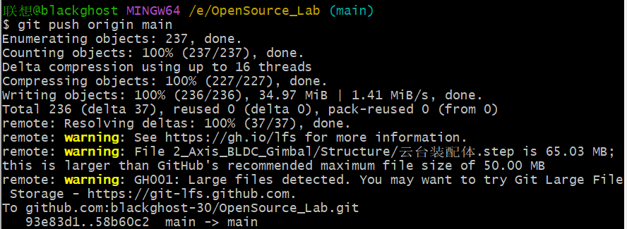

# Git中使用LFS工具管理大文件

本文件用于记录Git中提交大文件时遇到的警告的解决方法。

## 1.Git中提交大文件出现的警告

- 在Git中，当把本地的项目PUSH到Github上时，会存在50M文件的限制；
- 即当**文件大于50M**时，在PUSH时会出现如下警告：



- 解决这个问题的方法是通过**LFS工具**来处理大文件；


## 2.使用LFS工具管理大文件

- **下载LFS工具**
  - 在任一个终端中执行如下命令，安装LFS工具；

```bash
git lfs install
```

- **指定LFS工具的跟踪文件**
  - 在终端中执行如下指令，其中括号内容解释如下：
    - *表示通配符；
    - .step表示文件类型，需要换成自己需要跟踪的大文件的文件类型；
  - 所以这行指令的意思就是，用LFS工具跟踪所有.step文件格式的文件；

```bash
git lfs track "*.step"
```

- **提交LFS工具的配置文件**

  - 在执行上面一行指令后，会在项目中生成一个.gitattributes的文件；
  - 执行如下命令将这个文件提交到git中：

  ```bash
  git add .gitattributes
  ```

- **重新提交仓库**

  - 执行完如上指令后，Git就能处理大文件了；
  - 即可按照如下指令正常的提交仓库了：

  ```BASH
  git add .
  git commit -m "提交说明"
  git push origin main