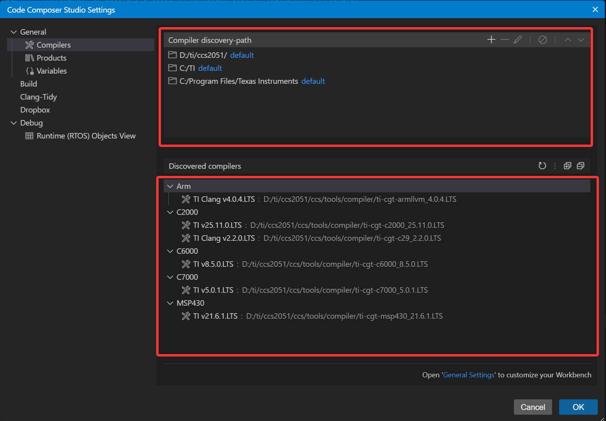
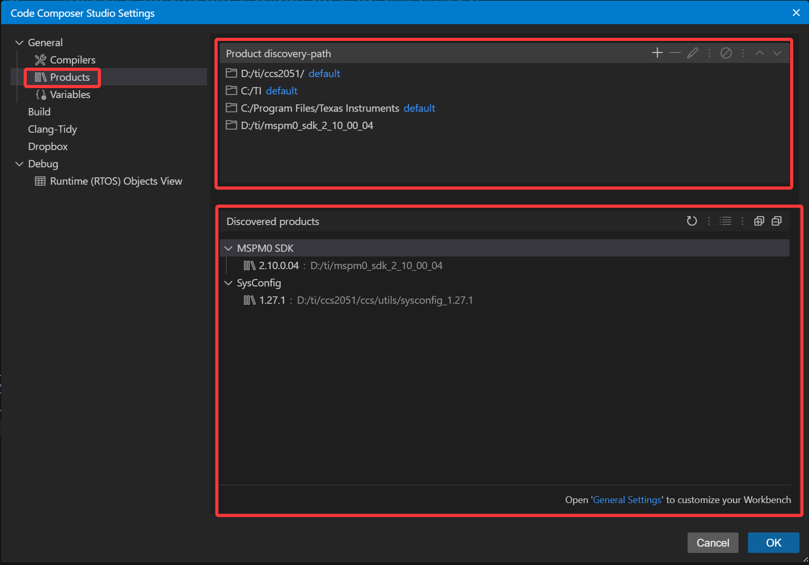

# Ti开发环境设置

## 1.CCS集成开发环境下载安装

- 官网链接：[官网](https://www.ti.com/tool/CCSTUDIO)；
- 下载其安装包后解压缩，并双击.exe文件进行安装；
- 注意：CCS集成开发环境的安装需要电脑用户名为英文，否则无法安装；
- 其默认路径是`C:\ti\ccs[版本号]`，我改成了`D:\ti\ccs[版本号]`；

## 2.SDK开发套件的下载安装

- 对于CCS而言，它是基于Ti官网提供的项目进行开发的，提供官网项目的就是SDK；
- 官网链接：[官网](https://www.ti.com/tool/MSPM0-SDK)；
- 下载其SDK安装包，它本质是一个压缩包，双击运行，即可将其解压缩；
- 其默认路径是`C:\ti\mspm0_sdk_[版本号]`，我改成了`D:\ti\mspm0_sdk_[版本号]`；

## 3.安装Uniflash

- Uniflash是Ti官方的烧录软件，类似于stc-isp；
- 官网链接：[官网](https://www.ti.com/tool/UNIFLASH)；
- 下载其安装包，然后运行.exe文件，即可将其安装；
- 其默认路径是`C:\ti\uniflash_[版本号]`，我改成了`D:\ti\uniflash_[版本号]`；

## 4.Sysconfig工具安装

### 4.1 介绍

- 在最新版本的CCS中，已经集成了sysconfig工具，其安装目录在`[CCS安装目录]\ccs\utils\sysconfig_[版本号]`；
- 对于sysconfig工具而言，它支持多版本共存；
- Ti官方提供的项目可能会对sysconfig的版本有指定，但不同版本的sysconfig都可以编译项目；
- 可以下载不同版本的sysconfig工具，适应不同的项目；

### 4.2 安装

- 官网链接：[官网](https://www.ti.com.cn/tool/cn/SYSCONFIG)；
- 下载其安装包，然后运行.exe文件，即可将其安装；
- 其默认路径为`C:\ti\sysconfig_[版本号]`，我改成了`D:\ti\sysconfig_[版本号]`；

## 5.CCS的设置

- 对于CCS开发环境而言，它需要如下几个工具

  - **编译器；**
  - **sysconfig工具；**
  - **SDK开发组件；**

- **编译器Compilers**

  - 编译器存在如下几个默认文件夹搜索路径；

  - 第一个路径是我们软件安装的路径；
  - 第二个是CCS默认安装的路径；
  - 第三个是Ti的数据路径；
  - 识别到的编译器会罗列在下面；
  - 一般而言，编译器都是在安装CCS时一同安装在了安装目录下，我安装的路径是`D:\ti\ccs[版本号]`，所以编译器就在这个路径下；

- **sysconfig工具和SDK组件**
  - sysconfig工具和SDK组件属于插件/产品类，需要点击Products项打开；
  - 和编译器一样，它也有三个默认的搜索路径；
  - 第一个路径是我们软件安装的路径；
  - 第二个是CCS默认安装的路径；
  - 第三个是Ti的数据路径；
  - 第四个路径是我自己添加的，是我安装SDK的路径；
  - 因为默认下SDK是安装在`C:\ti\uniflash_[版本号]`，但我改到了D盘，所以必须手动添加；
  - 对于sysconfig工具，它集成在了CCS里面，所以在默认路径下能够搜索到，但如果是自己新安装的路径就需要手动添加路径；

- 在完成上面这些必须的要素之后，就能用CCS进行项目开发了；