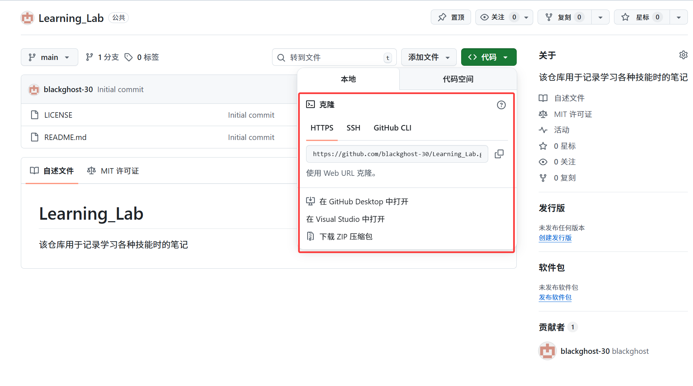
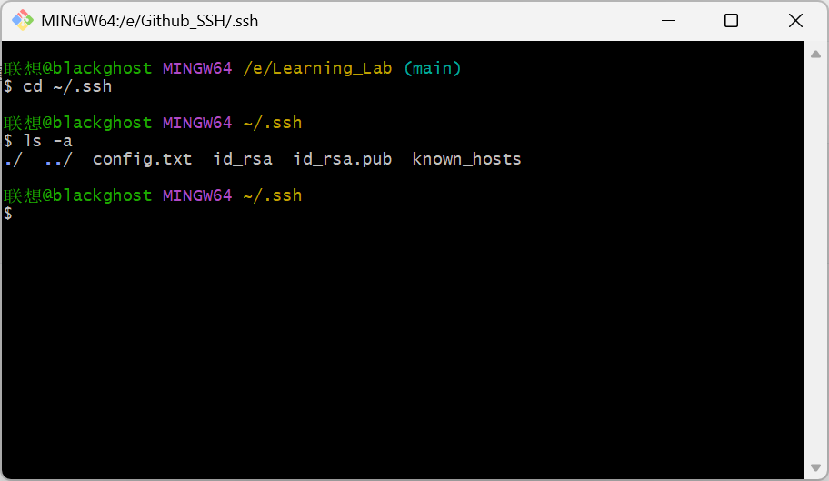
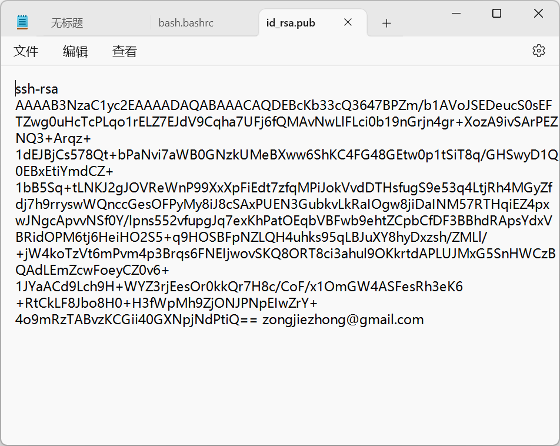
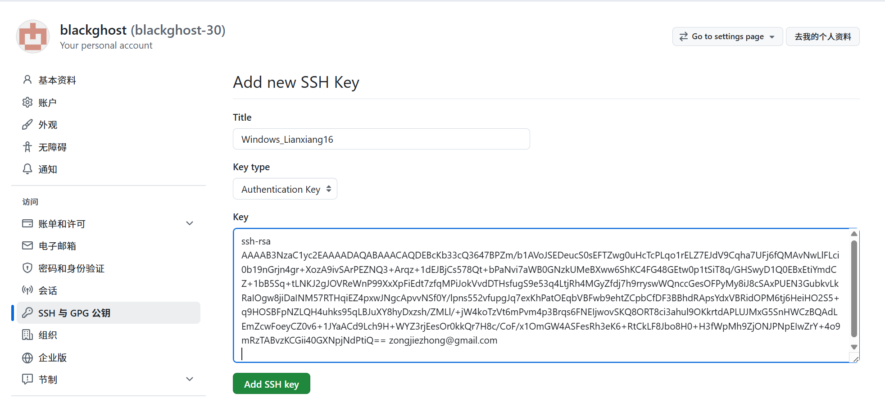
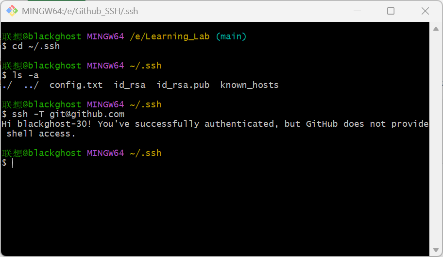
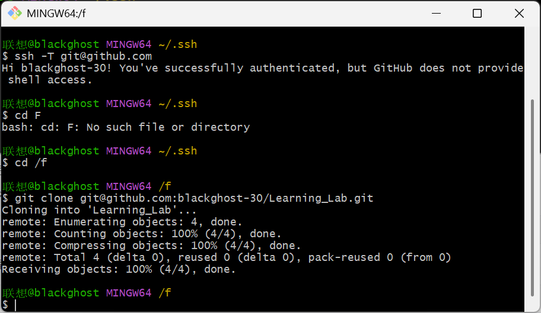
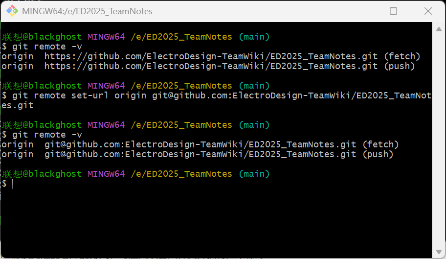

# Github的SSH协议

本文章主要对Github克隆项目中的两种方式进行讲解和区分，并详细的描述了如何在Github中进行SSH配置，以更方便的进行Push/Pull。


## 1.Github的SSH协议与HTTPS协议的区别

- SSH协议和HTTPS协议是Github中克隆仓库的两种主要方式；

- SSH协议和HTTPS协议各有优缺点

  - HTTPS协议

    - HTTPS协议较容易上手，无需任何配置，只需要在本地的Git Bash中clone项目的HTTPS URL即可完成克隆；

    ```bash
    # clone后面的是HTTPS_URL，在仓库复制即可
    
    git clone https://github.com/blackghost-30/Learning_Lab.git
    
    ```

    - 但是HTTPS每次克隆都需要登陆，且经常会因为网络原因而下载失败；

  - SSH协议

    - SSH协议对于新手较复杂，**需要在本地生成SSH密钥，并在Github中配置密钥**；
    - 但是SSH协议在完成第一次身份配对后，后面就不再需要重复配置了，且网络稳定性极佳，**基本不受网络状况的影响**；
    - SSH协议克隆项目的指令一样很简单，只需要在本地的Git Bash中克隆SSH_URL即可：

    ```bash
    # clone后面的是SSH_URL，在仓库复制即可
    
    git clone git@github.com:blackghost-30/Learning_Lab.git
    
    ```

- 两种方式都只是一种协议而已，无本质区别；**在树莓派中也常常用到SSH协议**；

- 如下图所示，即为Github中克隆项目的两种方式：



---


## 2.如何在Github中进行SSH配置

### 2.1 SSH的原理

- SSH协议是一种密钥配对协议，密钥分为公钥和私钥，其中公钥是公开的，私钥是只有自己才有的；
- SSH协议的密钥生成有很多不同的算法，可以由自己指定；
- 在Github中的SSH协议，其原理是这样的：
  - 第一步：在Git Bash中，通过指令在Git的默认主目录中生成密钥文件，包括了id_rsa私钥文件和id_rsa.pub公钥文件；
  - 第二步：打开id_rsa.pub公钥文件，将公钥复制添加到Github中；
  - 第三步：当我们Push/Pull时，Github将用公钥加密一段随机信息，本地用私钥解密这段随机信息并将其返回给Github，如果正确则完成验证；
  - 第四步：完成验证后即可通过SSH协议对仓库进行克隆；

### 2.2 如何配置SSH连接

- 第一步：检查本地是否已经生成过Github的SSH密钥

  - 在Git Bash中执行如下命令，进入Git的SSH密钥存放的默认路径：

  ```bash
  # ~指定是Git的默认HOME目录
  
  cd ~/.ssh
  
  ```

  - 在Git Bash中执行如下命令，查看是否已经存在SSH密钥：
    - 如果列出了id_rsa、id_rsa.pub文件，则证明已经存在SSH密钥；

  ```bash
  # 列出该文件夹下的所有文件
  
  ls -a
  
  ```

  - 如果已经存在密钥则直接跳到第三步，若没有则进行第二步；

  

- 第二步：生成密钥文件

  - 在Git Bash中执行如下命令，生成密钥文件：
    - 第一个提示：`Enter file in which to save the key (/Users/你的用户名/.ssh/id_rsa):` → 直接回车，使用默认路径存储密钥（私钥会存在 `~/.ssh/id_rsa`，公钥在 `~/.ssh/id_rsa.pub`）；
    - 第二个提示：`Enter passphrase (empty for no passphrase):` → 可选设置密码（每次用 SSH 时需要输入，更安全；不想麻烦，直接回车过）；
    - 第三个提示：`Enter same passphrase again:` → 重复密码（如果上一步没设，直接回车）；
    - 如果不出错，就会在Git的HOME目录下的.ssh文件夹下生成id_rsa和id_rsa.pub文件；

  ```bash
  # 生成密钥文件，其中邮箱只是起到身份标识的作用而已，也可改为其他非邮箱的说明性文字
  
  ssh-keygen -t rsa -b 4096 -C "your_email@example.com"
  
  ```

  

  ---

  #### 更改默认路径的方法

  由于我之前把Git的默认HOME目录给删除了，导致我一开始生成密钥文件的时候总是出错，因为根本找不到那个文件路径。后面我就在第一个提示的后面输入我系统默认的SSH密钥文件路径，是C:\Users\联想\.ssh，但是由于有中文的原因，导致也出现了乱码，无法生成，所以这里介绍如何更改Git的HOME目录并在HOME目录下生成密钥文件。

  - 第一步：修改bash.bashrc文件

    - 以管理员分身运行记事本，若不以管理员身份运行将导致无法保存bash.bashrc文件；
    - 用记事本打开Git的bash.bashrc文件，默认路径是C:\Program Files\Git\etc，可以右键Git查看Git的安装路径；
    - 在最后加入如下内容，注意要更改为自己的配置，然后保存；

    ```bash
    # 覆盖默认 HOME 路径为你的 SSH 密钥目录，根据需要更改成自己的位置
    export HOME="/e/Github_SSH"
    
    # 指定 SSH 配置文件路径
    export SSH_CONFIG="/e/Github_SSH/.ssh/config"
    
    # 让 SSH 命令默认使用自定义配置
    alias ssh='ssh -F $SSH_CONFIG'
    
    # 强制 Git 使用该 SSH 配置（避免 Git 绕开配置）
    git config --global core.sshCommand "ssh -F $SSH_CONFIG"
    
    ```

  - 第二步：增加config配置文件

    - 在自己的.ssh文件夹下新建文件config，不要任何后缀名，选择记事本打开，并复制一下内容到里面：

    ```bash
    # 全局配置：指定 SSH 默认的密钥和 known_hosts 路径
    Host *
        # 所有 SSH 连接默认使用你的私钥
        IdentityFile /e/Github_SSH/.ssh/id_rsa
        # 所有 SSH 连接的 known_hosts 保存到你的 E 盘目录
        UserKnownHostsFile /e/Github_SSH/.ssh/known_hosts
        # 禁用严格的主机检查（避免重复确认指纹）
        StrictHostKeyChecking no
        # 禁用 RSA 密钥（GitHub 已不推荐），仅用 ED25519
        PubkeyAcceptedKeyTypes +ssh-ed25519
    
    # 专门针对 GitHub 的配置（优先级更高）
    Host github.com
        HostName github.com
        User git
        # 再次明确 GitHub 用的私钥路径（避免冲突）
        IdentityFile /e/Github_SSH/.ssh/id_rsa
        # 加速连接
        ConnectTimeout 10
    ```

  - 第三步：设置权限

    - 关闭所有Git Bash窗口，重开，并逐条执行以下命令：

    ```bash
    # 设置 config 文件仅自己可读可写（600 是 SSH 要求的最小权限）
    chmod 600 /e/Github_SSH/.ssh/config
    
    # 确保私钥权限正确（之前可能没设置）
    chmod 600 /e/Github_SSH/.ssh/id_rsa
    
    # 创建 known_hosts 文件（避免首次连接提示创建失败）
    touch /e/Github_SSH/.ssh/known_hosts
    chmod 600 /e/Github_SSH/.ssh/known_hosts
    ```

  - 第四步：验证

    - 再次关闭所有Git Bash窗口，重开，执行如下命令，所出现的是自己想要的HOME目录，即代表更改成功：

    ```bash
    # 设置 config 文件仅自己可读可写（600 是 SSH 要求的最小权限）
    chmod 600 /e/Github_SSH/.ssh/config
    # 确保私钥权限正确（之前可能没设置）
    chmod 600 /e/Github_SSH/.ssh/id_rsa
    # 创建 known_hosts 文件（避免首次连接提示创建失败）
    touch /e/Github_SSH/.ssh/known_hosts
    chmod 600 /e/Github_SSH/.ssh/known_hosts
    ```

  ---

  

- 第三步：复制 SSH 公钥内容并添加到Github账户中

  - 创建创密钥后打开密钥文件所在的路径，打开id_rsa.pub文件，并复制其全部内容；

  

  - 打开Github，点击头像—>Setting—>SSH与GPG公钥—>新建SSH密钥—>起名，并将id_rsa.pub文件内容复制到下方—>添加SSH密钥—>完成：

  

- 第四步：测试连接

  - 在完成SSH密钥添加后，回到Git Bash终端，测试连接是否正常。在Git Bash中执行如下命令：
    - 第一次执行会提示 `Are you sure you want to continue connecting (yes/no/[fingerprint])?`，输入 `yes` 回车；
    - 看到`Hi 你的GitHub用户名! You've successfully authenticated, but GitHub does not provide shell access.` 的提示，即配置成功；

  ```bash
  # 测试链接
  
  ssh -T git@github.com
  
  ```

  

- 第五步：使用SSH协议克隆仓库并将HTTPS协议克隆的仓库改为SSH协议

  - 在Git Bash终端中执行如下命令克隆仓库：

  ```bash
  # SSH协议克隆仓库
  
  git clone git@github.com:blackghost-30/Learning_Lab.git
  
  ```

  

  - 若要更改原本用HTTPS协议克隆的仓库的方式，可进入项目文件夹并执行如下命令：

  ```bash
  # 查看当前远程地址（确认是 HTTPS）
  git remote -v
  
  # 修改为 SSH 地址
  git remote set-url origin git@github.com:用户名/项目名.git
  
  # 再次查看，确认已改成 SSH
  git remote -v
  
  ```

  

